# 五、其他神经网络架构

循环网络本质上是保持状态的前馈网络。到目前为止，我们所研究的所有网络都需要一个固定大小的输入，比如一幅图像，并给出一个固定大小的输出，比如某个特定类别的概率。循环网络的不同之处在于，它们接受任意大小的序列作为输入，并产生一个序列作为输出。此外，作为学习函数和输入的结果，网络隐藏层的内部状态被更新。通过这种方式，循环网络记住了它的状态。后续状态是先前状态的函数。

在本章中，我们将介绍以下内容:

*   循环网络简介
*   长短期记忆网络


# 循环网络简介

循环网络已被证明在预测时间序列数据方面非常有效。这是生物大脑的基础，使我们能够安全驾驶汽车，演奏乐器，躲避捕食者，理解语言，并与动态世界互动。这种对时间流动的感觉和对事物如何随时间变化的理解是智能生命的基础，因此毫不奇怪，这种能力在人工系统中很重要。

理解时间序列数据的能力在创造性的努力中也很重要，循环网络已经在一些事情上显示出一些能力，如谱写旋律、构建语法正确的句子和创建视觉上令人愉悦的图像。

正如我们所看到的，前馈和卷积网络在静态图像分类等任务中取得了非常好的结果。然而，处理连续数据(如语音或手写识别、预测股票市场价格或预测天气等任务所需的数据)需要不同的方法。在这些类型的任务中，输入和输出不再是固定大小的数据，而是任意长度的序列。


# 递归人工神经元

对于前馈网络中的人工神经元，激活流程只是从输入到输出。**递归人工神经元** ( **RANs** )从激活层的输出到其线性输入有一个连接，本质上是将输出求和回输入。RAN 可以在时间上*展开*:每个后续状态都是先前状态的函数。这样，可以说 RAN 具有其先前状态的记忆:

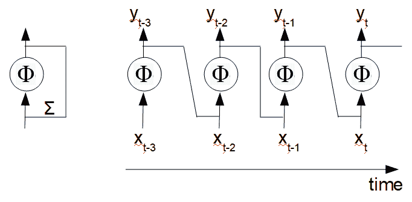

在上图中，左边的图示出了单个循环神经元。它将其输入`x`与输出`y`相加，产生新的输出。右图显示了三个时间步长上展开的相同单元。对于任何给定的时间步长，我们可以写出输出相对于输入的等式，如下所示:


这里， *y(t)* 为 *t* 时刻的输出向量， *x [(t)]* 为 *t* 时刻的输入，*y[【t-1】]*为前一时间步的输出， *b* 为偏置项，*φ*为激活，通常为 tanh 或 RelU。注意，每个单元有两组权重，*w[x]和*w[y]，分别用于输入和输出。本质上，这是我们用于线性网络的公式，增加了一项来表示输出，在时间 *t-1* 反馈到输入。**

与使用 CNN(卷积神经网络)的方式相同，我们可以使用前面方程的矢量化形式计算整个层的批量输出，这对于循环网络也是可能的。以下是递归图层的矢量化形式:


这里， *Y [(t)]* 是时间 *t* 时的输出。这是一个大小为( *m* ， *n* )的矩阵，其中 *m* 是批中实例的数量， *n* 是层中单元的数量。 *X [(t)]* 是大小为( *m，i)* 的矩阵，其中 *i* 是输入特征的数量。*W[x]是一个大小为( *i，n)、*的矩阵，包含当前时间步的输入权重。 *W [y]* 是一个大小为( *n* ， *n* )的矩阵，包含前一时间步输出的权重。*


# 实现循环网络

因此，我们可以专注于模型，我们将使用我们熟悉的相同数据集。尽管我们处理的是静态图像，但我们可以通过在 28 个时间步长上展开每个 28 像素的输入大小，将这些图像视为一个时间序列，使网络能够对完整的图像进行计算:

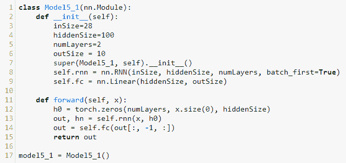

在前面的模型中，我们使用`nn.RNN`类来创建一个具有两个递归层的模型。`nn.RNN`类有以下默认签名:

```
nn.RNN(input_size, hidden_size, num_layers, batch_first=False, nonlinearity = 'tanh' 
```

输入是我们的 28×28 MNIST 图像。该模型采用每个图像的 28 个像素，将它们展开超过 28 个时间步长，以对该批中所有图像的整体进行计算。参数是隐藏层的尺寸，这是我们选择的。这里我们用一个`100`的大小。`batch_first`参数指定了输入和输出张量的预期形状。我们希望它具有(批次、序列、特征)形式的形状。在这个例子中，我们想要的期望输入/输出张量形状是(`100, 28, 28`)。即批量大小、序列长度和每一步的特征数量；然而，默认情况下，`nn.RNN`类使用输入/输出张量的形式(序列、批处理、特征)。设置`batch_first = True`确保输入/输出张量的形状(批次、顺序、特征)。

在`forward`方法中，我们为隐藏层初始化一个张量`h0`，它在模型的每次迭代中更新。这个代表隐藏状态的隐藏张量的形状是(层、批、隐藏)的形式。在这个例子中，我们有两层。隐藏状态的第二个维度是批量大小。记住，我们首先使用批处理，所以这是输入张量的第一维，`x`，使用`x[0]`索引。最后一个维度是隐藏尺寸，在这个例子中我们已经设置为`100`。

`nn.RNN`类需要一个由输入张量`x`和`h0`隐藏状态组成的输入。这就是为什么在`forward`方法中，我们传递这两个变量。每次迭代调用一次`forward`方法，更新隐藏状态并给出输出。请记住，迭代次数是历元数乘以数据大小再除以批处理大小。

重要的是，如您所见，我们需要使用以下内容来索引输出:

```
out = self.fc(out[:, -1, :])
```

我们只对最后一个时间步骤的输出感兴趣，因为这是批次中所有图像的累积知识。如果您记得，输出形状是(批处理、序列、特征)的形式，在我们的模型中是`(100, 28, 100)`。特征的数量就是隐藏层中隐藏尺寸的数量或单元的数量。现在，我们需要所有的批处理:这就是为什么我们使用冒号作为第一个索引。这里，`-1`表示我们只需要序列的最后一个元素。最后一个索引，冒号，表示我们需要所有的特性。因此，我们的输出是整个批次序列中最后一个时间步的所有特征。

我们可以使用几乎相同的训练代码；然而，当我们调用模型时，我们确实需要改变输出的形状。请记住，对于线性模型，我们使用以下方法重新调整了输出:

```
outputs = model(images.view(-1, 28*28) 
```

对于卷积网络，通过使用`nn.CNN`,我们可以传入未展平的图像，对于循环网络，当使用`nn.RNN`时，我们需要输出的形式为(批处理、序列、特征)。因此，我们可以使用以下内容来重塑输出:

```
outputs = model(images.view(-1, 28,28))
```

记住，我们需要在我们的训练代码和测试代码中修改这一行。以下打印输出是使用不同层和隐藏尺寸配置运行三个循环模型的结果:

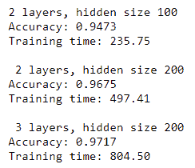

为了更好地理解这个模型是如何工作的，考虑下面的图表，代表我们的两层模型，隐藏尺寸为`100`:

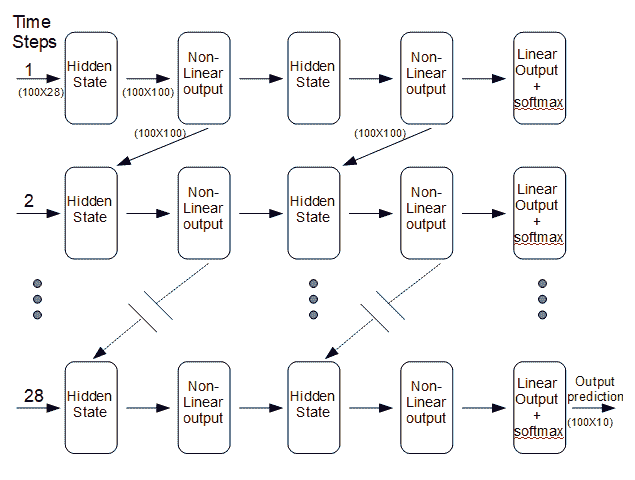

在每个 **28** 时间步长，网络从 **100** 图像批次中的每个图像获取一个输入，该输入由 **28** 像素(特征)组成。每个时间步长基本上是一个两层前馈网络。唯一的区别是每个隐藏层都有一个额外的输入。该输入由前一时间步中等效层的输出组成。在每个时间步，从该批 **100** 图像中的每一个图像中采样另外的 **28** 像素。最后，当该批中的所有图像都被处理后，模型的权重被更新，下一次迭代开始。一旦所有迭代完成，我们读取输出以获得预测。

为了更好地理解运行代码时会发生什么，请考虑以下情况:

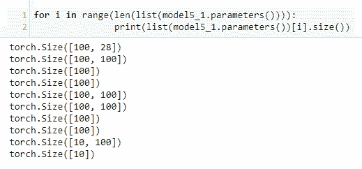

这里，我们打印出隐藏层大小为`100`的两层 RNN 模型的权重向量的大小。

我们将权重作为包含`10`张量的列表进行检索。第一个大小为`[100, 28]`的张量由隐藏层的输入、`100`单元和输入图像的`28`特征或像素组成。这就是循环网络向量化形式方程中的 *W* [*x*] 项。下一组参数 size `[100, 100]`，由前面等式中的*W[y]项表示，是隐藏层的输出权重，由尺寸为`100`的`100`个单元组成。接下来的两个一维张量，每个大小为`100`，分别是输入和隐藏层的偏差单位。接下来，我们有第二层的输入权重、输出权重和偏差。最后，我们有读出的层权重，大小为`[10, 100]`的张量，用于使用`100`特征的`10`可能的预测。尺寸为`[10]`的最终一维张量包括用于读出层的偏置单元。*

在下面的代码中，我们通过一批图像复制了模型的循环层中发生的情况:


您可以看到，我们已经简单地用`trainLoader`数据集对象创建了一个迭代器，并为一批图像分配了一个`images`变量，就像我们对训练代码所做的那样。隐藏层`h0`需要包含两个张量，每层一个。在这些张量的每一个中，对于该批中的每一幅图像，存储了`100`隐藏单元的权重。这解释了为什么我们需要一个三维张量。第一个尺寸`2`为层数，第二个尺寸`100`为批量，从`images.size(0)`获得，第三个尺寸`100`为隐藏单元数。然后，我们将经过整形的图像张量和隐藏的张量传递给模型。这将调用模型的`forward()`函数，进行必要的计算，并返回两个张量一个输出张量和一个更新的隐藏状态张量。

以下内容证实了这些输出尺寸:

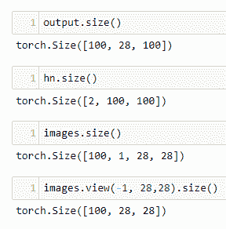

这将帮助你理解为什么我们需要调整张量的大小。注意，输入的特征是批中每个图像的`28`像素，这些像素在`28`时间步长序列上展开。接下来，让我们将递归层的输出传递给完全连接的线性层:

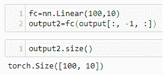

您可以看到，这将为我们提供输出中出现的每个`100`特征的`10`预测。这就是为什么我们只需要索引序列中的最后一个元素。记住`nn.RNN`的输出大小为(`100, 28, 100`)。请注意，当我们使用`-1`索引这个张量时，它的大小会发生什么变化:


这是包含`100`特征的张量，隐藏单元的输出，用于批次中的每个`100`图像。这被传递到我们的线性层，以给出每个图像所需的`10`预测。


# 长短期记忆网络

**长短期记忆网络(****lstm**)，是一种特殊类型的 RNN，能够学习长期依赖关系。虽然标准的 rnn 可以在一定程度上记住以前的状态，但它们是在相当基础的水平上做到这一点的，方法是在每个时间步长上更新一个隐藏状态。这使得网络能够记住短期的依赖性。隐藏状态是先前状态的函数，保留关于这些先前状态的信息。然而，当前状态和先前状态之间的时间步长越多，先前状态对当前状态的影响就越小。在当前步骤之前的时间步骤之前的`10`时间步骤的状态上保留的信息少得多。尽管事实上较早时间步骤可能包含与我们试图解决的特定问题或任务直接相关的重要信息。

生物大脑有一种非凡的能力，能够记住长期的依赖关系，利用这些依赖关系形成意义和理解。考虑一下我们如何跟随电影的情节。随着情节的发展，我们回忆起电影开始时发生的事件，并立即理解它们的相关性。不仅如此，我们还可以通过回忆自己生活中的事件来将上下文应用到电影中，这些事件为故事情节赋予了相关性和意义。这种选择性地将记忆应用于当前情境，同时过滤掉不相关细节的能力，是 LSTMs 设计背后的策略。

LSTM 网络试图将这些长期依赖关系整合到一个人工网络中。它比标准的 RNN 要复杂得多；然而，它仍然基于递归前馈网络，理解这一理论将使你理解 LSTMs。

下图显示了一个时间步长内的 LSTM:

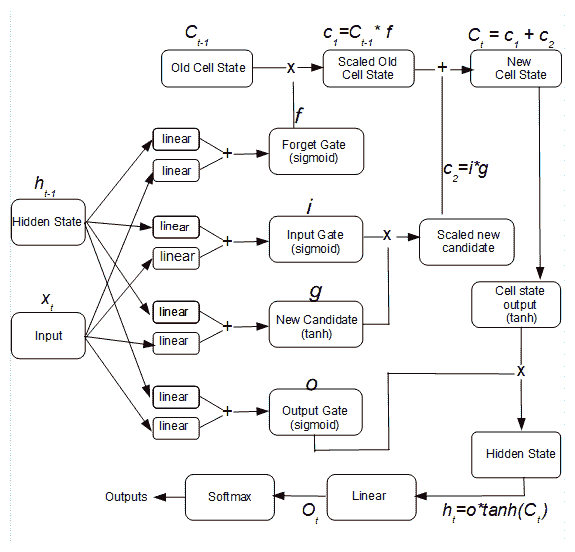

与正常的 RNNs 一样，每个后续时间步都采用前一个时间步的隐藏状态，**h[t-1]，连同数据，**x**[**t**][，]作为其输入。LSTM 还传递在每个时间步长上计算的单元状态。你可以看到**h[t-1]和**x[t]分别被传递给四个独立的线性函数。这些线性函数的每一对被求和。LSTM 的中心是四个门，这些求和被传递到这些门。首先，我们有**忘记门**。这使用一个 **sigmoid** 进行激活，并按元素乘以**旧单元状态**。请记住，**s 形线**有效地将**线性**输出值压缩到 0 和 1 之间的值。乘以零将有效地消除单元状态中的特定值，而乘以一将保留该值。**遗忘门**本质上决定什么信息被传递到下一个时间步骤。这是通过与**旧单元状态**的逐元素乘法来实现的。******

**输入门**和**缩放的新候选门**一起决定保留什么信息。**输入门**也使用一个 **sigmoid** 函数，并将其乘以一个**新候选者**门的输出，创建一个临时张量，即**缩放的新候选者**、 **c [2]** 。注意**新候选**浇口使用 **tanh** 激活。记住 **tanh** 函数输出一个在`-1`和`1`之间的值。以这种方式使用 **tanh** 和 **sigmoid** 激活——也就是说，通过其输出的逐元素乘法——有助于防止消失梯度问题，即输出变得饱和，其梯度反复变得接近零，使其无法执行有意义的计算。通过将**缩放后的新候选状态**与**缩放后的旧单元状态**相加来计算**新单元状态**，并且以这种方式能够放大输入数据的重要分量。

最后一个门，输出门， **O** *，*是另一个**s 形**。新的单元状态通过 **tanh** 函数传递，并与输出门逐元素相乘，以计算**隐藏状态**。该**隐藏状态**与标准 RNNs 一样，通过最终非线性、 **sigmoid** 和 **Softmax** 功能给出输出。这具有增强高能分量、消除低能分量、以及减少梯度消失的机会和减少训练集的过度拟合的总体效果。

我们可以将每个 LSTM 门的方程写成如下:


注意，这些方程与 RNN 方程具有相同的形式。唯一的区别是，我们需要八个独立的重量张量和八个偏置张量。正是这些额外的权重维度赋予 LSTMs 额外的能力来学习和保留输入数据的重要特征，以及丢弃不太重要的特征。我们可以将特定时间步长 *t* 的线性输出层的输出写成如下:


# 实现 LSTM

以下是我们将用于 MNIST 的 LSTM 模型类:

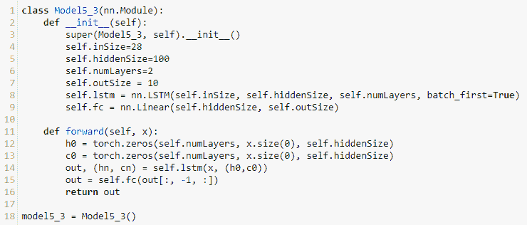

注意，`nn.LSTM`被传递了与前一个 RNN 相同的参数。这并不奇怪，因为 LSTM 是一个处理数据序列的循环网络。记住输入张量有一个形式为`(batch, sequence, feature)`的轴，所以我们设置`batch_first = True`。我们为输出层初始化一个完全连接的线性层。注意在`forward`方法中，除了初始化隐藏状态张量`h0`，我们还初始化了一个张量来保存单元格状态`c0`。还记得`out`张量包含所有的`28`时间步长。对于我们的预测，我们只对序列中的最后一个索引感兴趣。这就是为什么我们在将张量传递给线性输出层之前，对张量应用了索引。我们可以像之前打印 RNN 一样打印出该模型的参数:


这些是带有`100`隐藏层的单层 LSTM 的参数。这个单层 LSTM 有六组参数。请注意，与 RNN 的情况不同，输入和隐藏权重张量在第一维中的大小为`100`，而 LSTM 的大小为`400`，代表四个 LSTM 门的`100`个隐藏单元。

第一个参数张量用于输入层，大小为`[400,28]`。第一个索引`400`对应于权重 *w [1]* 、 *w [3]* 、 *w [5]* 和 *w [7]* ，每个的大小为`100`，用于输入到指定的`100`隐藏单元。`28`是输入中出现的特征或像素的数量。下一个大小为`[400,100]`的张量是每个`100`隐藏单元的权重*w[2]、*w[4]、 *w [6]* 和*w[8]。以下两个尺寸为`[400]`的一维张量为两套偏置单元， *b [1]* ， *b [3]* ， *b [5]* ， *b [7]* 和 *b [2]* ， *b 最后，我们有大小为`[10, 100]`的输出张量。这是我们的输出大小，`10`，权重张量 *w [9。]* 大小`[10]`的最后一个单维张量是偏量， *b9。*****


# 用门控递归单元建立语言模型

为了展示循环网络的灵活性，我们将在本章的最后一节做一些不同的事情。到目前为止，我们一直在使用可能是最常用的测试数据集，MNIST。该数据集具有众所周知的特征，对于比较不同类型的模型和测试不同的架构和参数集非常有用。然而，有些任务，比如自然语言处理，显然需要完全不同类型的数据集。

此外，到目前为止，我们构建的模型都集中在一个简单的任务上:分类。这是最简单的机器学习任务。为了让您了解其他机器学习任务，并展示循环网络的潜力，我们将要建立的模型是一个基于字符的预测模型，它试图根据前一个字符预测每个后续字符，形成一个已学习的文本体。该模型首先学习创建正确的元音-辅音序列、单词，并最终创建模仿人类作者构建的形式(但不是意义)的句子和段落。

以下是 Sean Robertson 和 Pratheek 编写的代码改编，可以在这里找到:[https://github . com/spro/practical-py torch/blob/master/char-rnn-generation/char-rnn-generation . ipynb](https://github.com/spro/practical-pytorch/blob/master/char-rnn-generation/char-rnn-generation.ipynb)。以下是模型定义:

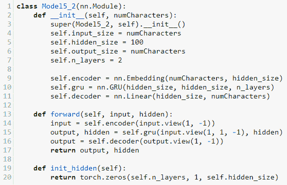

该模型的目的是在每个时间步取一个输入字符，并输出最可能的下一个字符。在随后的训练中，它开始构建模仿训练样本文本的字符序列。我们的输入和输出大小就是输入文本中的字符数，这是计算出来的，并作为参数传递给模型。我们使用`nn.Embedding`类初始化一个编码器张量。与我们使用一个热编码为每个单词定义唯一索引的方式类似，`nn.Embedding`模块将每个单词作为多维张量存储在词汇表中。这使我们能够在词嵌入中编码语义信息。我们需要给`nn.Embedding`模块传递一个词汇大小——在这里，这是输入文本中的字符数——和一个编码每个字符的维度——在这里，这是模型的隐藏大小。

我们使用的词嵌入模型是基于`nn.GRU`模块，或 GRU。这与我们在上一节中使用的 LSTM 模块非常相似。不同之处在于，GRU 是 LSTM 的略微简化版。它将输入门和遗忘门合并成一个更新门，并将隐藏状态与单元状态合并。结果是 GRU 在许多任务上比 LSTM 更有效率。最后，一个线性输出层被初始化以解码来自 GRU 的输出。在`forward`方法中，我们调整输入的大小并将其通过线性嵌入层、GRU 和最终的线性输出层，返回隐藏状态和输出。

接下来，我们需要导入数据，并初始化包含输入文本的可打印字符和输入文本中的字符数的变量。注意使用`unidecode`来删除非 unicode 字符。您将需要导入这个模块，如果您的系统上还没有安装这个模块，那么您可能需要安装它。我们还定义了两个方便的函数:一个函数将字符串转换为每个 Unicode 字符的整数等价物，另一个函数对训练文本的随机块进行采样。`random_training_set`函数返回两个张量。`inp`张量包含块中的所有字符，不包括最后一个字符。`target`张量包含块中所有偏移一的元素，因此包括最后一个字符。例如，如果我们使用大小为`4`的块，并且这个块由 Unicode 字符表示的`[41, 27, 29, 51]`组成，那么`inp`张量就是`[41, 27, 29]`和`target`张量`[27, 29, 51]`。这样，目标可以训练模型使用目标数据对下一个字符进行预测:

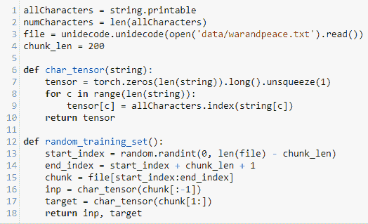

接下来，我们编写一个评估模型的方法。这是通过一次传递一个字符来实现的:模型为下一个最可能的字符输出一个多项式概率分布。重复这一过程以构建字符序列，并将它们存储在`predicted`变量中:

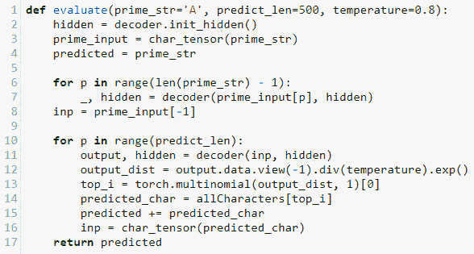

`evaluate`函数接受一个`temperature`参数，该参数除以输出并找到指数以创建概率分布。`temperature`参数具有确定每个预测所需的概率水平的作用。对于高于`1`的温度值，生成概率较低的字符，生成的文本更加随机。对于低于`1`的较低温度值，生成概率较高的字符。温度值接近`0`时，只会生成最有可能的字符。对于每次迭代，一个字符被添加到`predicted`字符串，直到达到由`predict_len`变量确定的所需长度，并且返回`predicted`字符串。

以下函数为模型定型:

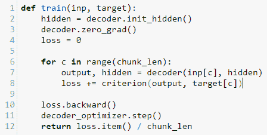

我们将输入块和目标块传递给它。`for`循环对块中的每个字符进行一次迭代，更新`hidden`状态并返回每个字符的平均损失。

现在，我们准备实例化并运行模型。这是通过以下代码完成的:

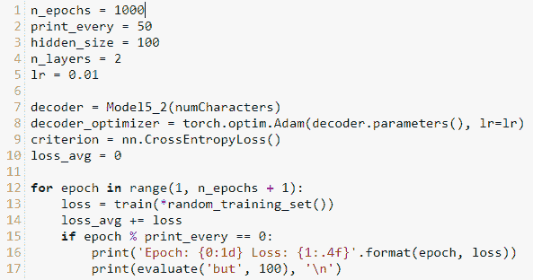

在这里，通常的变量被初始化。注意，我们的优化器没有使用随机梯度下降，而是使用 Adam 优化器。术语亚当代表*自适应矩估计器*。梯度下降对所有可学习的参数使用单一的固定学习率。Adam 优化器使用自适应学习速率来保持每个参数的学习速率。它可以提高学习效率，特别是在稀疏表示中，例如用于自然语言处理的稀疏表示。稀疏表示是张量中大部分值为零的表示，例如在一键编码或词嵌入中。

一旦我们运行模型，它将打印出预测的文本。起初，文本看起来几乎是随机的字符序列；然而，经过几个周期的训练后，模型学会了将文本格式化成类似英语的句子和短语。生成模型是强大的工具，使我们能够揭示输入数据中的概率分布。


# 摘要

在本章中，我们介绍了循环神经网络，并演示了如何在 MNIST 数据集上使用 RNN。rnn 对于处理时间序列数据特别有用，因为它们本质上是随时间展开的前馈网络。这使得它们非常适合于诸如手写和语音识别之类的任务，因为它们对数据序列进行操作。我们还研究了 RNN 的一个更强大的变种，LSTM。LSTM 使用四个门来决定将什么信息传递到下一个时间步，使其能够发现数据中的长期相关性。最后，在本章中，我们构建了一个简单的语言模型，使我们能够从样本输入文本中生成文本。我们使用了一个基于 GRU 的模型。GRU 是 LSTM 的一个稍微简化的版本，包含三个门，并结合了 LSTM 的输入门和遗忘门。该模型使用概率分布从样本输入中生成文本。

在最后一章，我们将研究 PyTorch 的一些高级特性，比如在多处理器和分布式环境中使用 PyTorch。我们还将了解如何微调 PyTorch 模型，并使用预训练的模型进行灵活的图像分类。