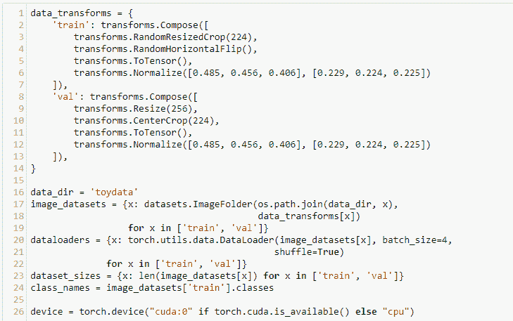
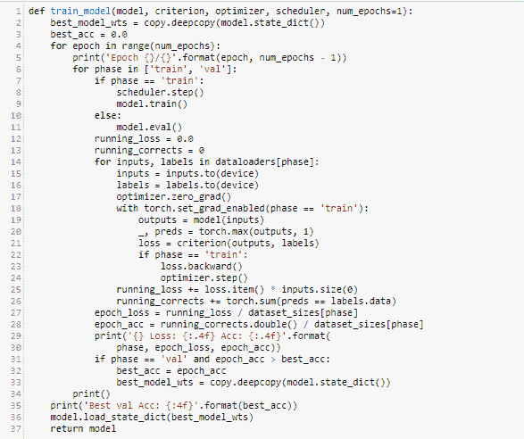

# 六、充分利用 PyTorch

到目前为止，您应该能够构建和训练三种不同类型的模型:线性、卷积和递归。你应该对这些模型架构背后的理论和数学有所了解，并解释它们是如何做出预测的。卷积网络可能是研究最多的深度学习网络，特别是在图像数据方面。当然，卷积和循环网络都大量使用线性层，因此线性网络背后的理论，最著名的是线性回归和梯度下降，是所有人工神经网络的基础。

到目前为止，我们的讨论还算克制。我们已经研究了一个很好的问题，比如使用 MNIST 进行分类，让您对 PyTorch 的基本构件有一个坚实的理解。这最后一章是你在现实世界中使用 PyTorch 的发射台，读完之后你应该可以开始你自己的深度学习探索了。在本章中，我们将讨论以下主题:

*   使用**图形处理器**(**GPU**)提升性能
*   优化策略和技术
*   使用预训练模型


# 多处理器和分布式环境

有多种多处理器和分布式环境的可能性。当然，使用多个处理器最常见的原因是为了让模型运行得更快。将 MNIST(一个包含 6 万张图像的相对较小的数据集)加载到内存中所需的时间并不多。但是，考虑一下我们拥有千兆或兆兆字节数据的情况，或者数据分布在多个服务器上的情况。当我们考虑在线模型时，情况甚至更复杂，在在线模型中，数据是从多个服务器实时获取的。显然，需要某种并行处理能力。


# 使用 GPU

让模型运行得更快最简单的方法就是添加 GPU。通过将处理器密集型任务从**中央处理器** ( **CPU** )转移到一个或多个 GPU，可以显著减少训练时间。PyTorch 使用`torch.cuda()`模块与 GPU 接口。CUDA 是由 NVIDIA 创建的并行计算模型，其特点是延迟分配，以便仅在需要时分配资源。由此带来的效率提升是巨大的。

PyTorch 使用上下文管理器`torch.device()`将张量分配给特定的设备。下面的屏幕截图显示了这样一个例子:


更常见的做法是使用以下语义测试 GPU 并将设备分配给变量:

```py
device = torch.device("cuda:0" if torch.cuda.is_available() else "cpu")
```

`"cuda:0"`字符串指的是默认的 GPU 设备。注意，我们测试 GPU 设备的存在，并将其分配给`device` 变量。如果 GPU 设备不可用，则该设备将被分配给 CPU。这允许代码在可能有也可能没有 GPU 的机器上运行。

考虑我们在第 3 章、*计算图表和线性模型*中探索的线性模型。我们可以使用完全相同的模型定义；然而，我们需要改变我们的训练代码中的一些东西，以确保处理器密集型操作发生在 GPU 上。一旦我们创建了`device`变量，我们就可以给设备分配操作了。

在我们之前创建的基准函数中，我们需要在初始化模型后添加以下代码行:

```py
model.to(device)
```

我们还需要确保对图像、标签和输出的操作都发生在选定的设备上。在基准函数的`for`循环中，我们做了以下更改:


我们需要对我们的精度函数中定义的图像、标签和输出做完全相同的事情，只需将`.to(device)`添加到这些张量定义中。完成这些更改后，如果它运行在配有 GPU 的系统上，运行速度应该会明显加快。对于一个有四个线性层的模型，这段代码只运行了 55 秒多一点，相比之下，在我的系统的 CPU 上运行这段代码需要 120 多秒。当然，CPU 速度、内存和其他因素都会影响运行时间，因此这些基准在不同的系统上是不同的。完全相同的训练代码将适用于逻辑回归模型。同样的修改也适用于我们所研究的其他网络的训练代码。几乎任何东西都可以传输到 GPU，但请注意，每次将数据复制到 GPU 时都会产生计算开销，因此不要将操作不必要地传输到 GPU，除非涉及复杂的计算，例如计算梯度。

如果您的系统上有多个可用的 GPU，那么可以使用`nn.DataParallel`在这些 GPU 之间透明地分配操作。这可以简单到在你的模型周围使用一个包装器——例如，`model=torch.nn.DataParallel(model)`。我们当然可以使用更精细的方法，将特定操作分配给特定设备，如下例所示:

```py
with torch.cuda.device("device:2"): w3=torch.rand(3,3)
```

PyTorch 有一个特定的内存空间可用于加速张量到 GPU 的传输。这在张量被重复分配给 GPU 时使用。这是通过使用`pin_memory()`函数实现的，例如`w3.pin_memory()`。它的一个主要用途是加速输入数据的加载，这在模型的训练周期中会重复发生。为此，只需在实例化`DataLoader`对象时将`pin_memory=True`参数传递给它。


# 分布式环境

有时，数据和计算资源在单个物理机上不可用。这需要通过网络交换张量数据的协议。在分布式环境中，计算可以通过网络在不同种类的物理硬件上进行，因此需要考虑大量因素，例如，网络延迟或错误、处理器可用性、调度和计时问题以及竞争的处理资源。在人工神经网络中，计算必须按照一定的顺序进行。值得庆幸的是，在 PyTorch 中，通过使用更高级的接口，很大程度上隐藏了跨机器网络和每台机器中的处理器分配和定时每个计算的复杂机制。

PyTorch 有两个主要的包，每个包处理分布式和并行环境的各个方面。这是对我们之前讨论过的 CUDA 的补充。这些软件包如下:

*   `torch.distributed`
*   `torch.multiprocessing`


# 火炬.分布式

使用`torch.distributed`可能是最常见的方法。这个包提供了通信原语，比如类，用于检查网络中的节点数量，确保后端通信协议的可用性，以及初始化进程组。它在模块级工作。`torch.nn.parallel.DistributedDataParallel()`类是一个包装 PyTorch 模型的容器，允许它继承`torch.distributed`的功能。最常见的用例涉及多个进程，每个进程都在自己的 GPU 上运行，无论是在本地还是通过网络。使用以下代码将进程组初始化为设备:

```py
torch.distributed.init_process_group(backend='nccl', world_size=4, init_method='...')
```

这在每台主机上运行。后端指定使用什么通信协议。NCCL(发音镍)后端通常是最快和最可靠的。请注意，这可能需要安装在您的系统上。`world_size`是作业中进程的数量，而`init_method`是指向要初始化的进程的位置和端口的 URL。这可以是一个网络地址—例如，(`tcp://......`)—也可以是一个共享文件系统(`file://... /...`)。

可以使用`torch.cuda.set_devices(i)`设置设备。最后，我们可以通过使用代码短语
`model = distributedDataParallel(model, device_ids=[i], output_device=i`来分配模型。这通常用在初始化函数中，该函数产生每个进程并将其分配给一个处理器。这确保了每个进程都通过使用相同 IP 地址和端口的主服务器进行协调。


# torch .多重处理

`torch.multiprocessor`包是 Python 多处理器包的替代品，使用方式完全相同，即作为基于进程的线程接口。它扩展 Python 分布式包的方法之一是将 PyTorch 张量放入共享内存中，并且只将它们的句柄发送给其他进程。这是通过使用一个`multiprocessing.Queue`对象实现的。一般来说，多重处理是异步发生的；也就是说，当特定设备的进程到达队列顶部时，该进程被排队并执行。每个设备按照排队的顺序执行一个进程，PyTorch 在设备间复制时会定期同步多个进程。这意味着，就多进程函数的调用者而言，进程是同步发生的。

编写多线程应用程序的主要困难之一是避免死锁，即两个进程竞争一个资源。出现这种情况的一个常见原因是当后台线程锁定或导入一个模块并且一个子进程被分叉时。子流程可能会在损坏的状态下产生，从而导致死锁或其他错误。`multiprocessingQueue`类本身产生多个后台线程来发送、接收和序列化对象，这些线程也会导致死锁。对于这些情况，可以使用自由螺纹`multiprocessingQueue.queues.SimpleQueue`。


# 优化技术

`torch.optim`包包含许多优化算法，这些算法中的每一个都有几个参数，我们可以用它们来微调深度学习模型。优化是深度学习中的一个关键组成部分，因此不同的优化技术可能是模型性能的关键也就不足为奇了。记住，它的作用是根据损失函数的计算梯度存储和更新参数状态。


# 优化算法

PyTorch 中除了 SGD 之外还有许多优化算法。下面的代码显示了一个这样的算法:

```py
optim.Adadelta(params, lr=1.0, rho=0.9, eps=1e-06, weight_decay=0)
```

`Adedelta`算法基于随机梯度下降；然而，不是在每次迭代中具有相同的学习速率，而是学习速率随着时间而适应。`Adadelta`算法为每个维度保持独立的动态学习率。这可以使训练更快和更有效，因为与实际计算梯度相比，在每次迭代中计算新学习率的开销非常小。对于一系列模型架构、大梯度和分布式环境中的噪声数据，`Adadelta`算法表现良好。`Adadelta`算法对大型模型特别有效，并且在初始学习率较大的情况下工作良好。有两个与`Adadelta`相关的超参数我们还没有讨论。`rho`用于计算平方梯度的移动平均值；这决定了衰变率。添加`eps`超参数是为了提高`Adadelta`的数值稳定性，如以下代码所示:

```py
optim.Adagrad(params, lr=0.01, lr_decay=0, weight_decay=0, initial_accumulater_value=0)
```

`Adagrad`算法，或用于随机优化的自适应次梯度方法，是一种结合了在早期迭代中观察到的训练数据的几何知识的技术。这使得该算法能够找到不常见但高度可预测的特征。`Adagrad`算法使用自适应学习率，为频繁出现的特征提供较低的学习率，为罕见特征提供较高的学习率。这有助于找到数据中罕见但重要的特征，并相应地计算每个梯度步长。对于更频繁的特征，学习率在每次迭代中下降得更快，而对于更罕见的特征，学习率下降得更慢，这意味着罕见的特征往往在更多次迭代中保持更高的学习率。`Adagrad`算法往往最适合稀疏数据集。下面的代码显示了它的一个应用示例:

```py
optim.Adam(params, lr=0.001, betas(0.9,0.999), eps=1e-08, weight_decay=0, amsgrad=False)
```

`Adam`算法(自适应矩估计)使用基于梯度的均值和无中心方差(一阶和二阶矩)的自适应学习率。像`Adagrad`一样，它存储过去平方梯度的平均值。它还存储这些梯度的衰减平均值。它在每个维度的基础上计算每次迭代的学习率。`Adam`算法结合了`Adagrad`在稀疏梯度上工作良好的优势，以及在在线和非静态设置中工作良好的能力。注意，`Adam`接受可选的 beta 参数元组。这些系数用于计算移动平均值和这些平均值的平方。当`amsgrad`标志设置为`True`时，启用一个包含梯度长期记忆的`Adam`变量。这有助于收敛，在某些情况下，标准的`Adam`算法无法收敛。除了`Adam`算法，PyTorch 还包含了`Adam`的两个变种。`optim.SparseAdam`执行参数的惰性更新，其中只有出现在梯度中的矩被更新并应用于参数。这提供了一种更有效的处理稀疏张量的方法，例如用于词嵌入的那些。第二个变体，`optim.Adamax`，使用无穷范数来计算梯度，这在理论上降低了对噪声的敏感性。在实践中，选择最佳优化器通常是一个反复试验的过程。

以下代码演示了`optim.RMSprop`优化器:

```py
optim.RMSprop(params, lr=0.01, alpha=0.99, eps=1e-08, weight_decay=0, momentum=0, centered = False)
```

`RMSprop`算法将每个参数的学习率除以该特定参数最近梯度幅度的移动平均值。这确保了每次迭代的步长与梯度具有相同的比例。这具有稳定梯度下降的效果，并减少了梯度消失或爆炸的问题。alpha 超参数是一个平滑参数，有助于使网络对噪声具有弹性。在下面的代码中可以看到它的用法:

```py
optim.Rprop(params, lr=0.01, etas(0.5,1.2), step_sizes(1e_06,50))
```

`Rprop`算法(弹性反向传播)是一种自适应算法，它通过使用每个权重的成本函数的偏导数的符号而不是幅度来计算权重更新。这些是为每个重量单独计算的。`Rprop`算法采用一对参数元组，`etas`。这些是乘法因子，其根据在前一次迭代的整个损失函数上计算的导数的符号来增加或减少权重。如果最后一次迭代产生与当前导数相反的符号，那么更新乘以元组中的第一个值，称为`etaminus`，该值小于 1，默认为`0.5`。如果符号在当前迭代中是相同的，那么该权重更新被乘以`etas`元组中的第二个值，称为`etaplis`，该值大于`1`，默认为`1.2`。这样，总误差函数被最小化。


# 学习率调度程序

`torch.optim.lr_schedular` 类作为一个包装器，根据一个特定的函数乘以初始学习率来调度学习率。学习率计划程序可以单独应用于每个参数组。这可以加快训练时间，因为通常情况下，我们能够在训练周期开始时使用较大的学习速率，并在优化器接近最小损失时缩小该速率。一旦定义了调度程序对象，通常使用`scheduler.step()`在每个时期步进。PyTorch 中有许多学习率调度器类，下面的代码显示了最常用的一个:

```py
optim.lr_schedular.LambdaLR(optimizer, lr_lambda, last_epoch =-1)
```

这个学习率调度器类采用一个函数来乘以每个参数组的初始学习率，如果有多个参数组，则作为单个函数或函数列表传递。`last_epoch`是最后一个时期的索引，因此默认值`-1`是初始学习率。下面这个类的例子的屏幕截图假设我们有两个参数组:


`optim.lr_schedular.StepLR(optimizer, step_size, gamma=0.1, last_epoch=-1`每隔`step_size`个时期，通过乘法因子`gamma`衰减学习率。

`optim.lr_schedular.MultiStepLR(optimizer, milestones, gamma=0.1,last_epoch=-1)`当学习率被`gamma`衰减时，获取一个里程碑列表，以历元数衡量。`milestones`短语是一个递增的`epoch`索引列表。


# 参数组

当优化器被实例化时，它是以及各种超参数，例如学习率。优化器还会被传递特定于每个优化算法的其他超参数。设置这些超参数组非常有用，它们可以应用于模型的不同部分。这可以通过创建一个参数组来实现，参数组实际上是一个可以传递给优化器的字典列表。

`param`变量必须是`torch.tens` `or`上的迭代器，或者是指定优化选项默认值的 Python 字典。请注意，参数本身需要被指定为一个有序的集合，比如一个列表，以便参数在模型运行之间是一个一致的序列。

可以将参数指定为参数组。考虑下面截图中显示的代码:


`param_groups`函数返回包含权重和优化器超参数的字典列表。我们已经讨论了学习率。SGD 优化器还有几个其他的超参数，可以用来微调您的模型。`momentum`超参数修改 SGD 算法，以帮助加速梯度张量达到最优，通常会导致更快的收敛。动量默认为`0`；然而，使用更高的值，通常在`0.9`左右，通常会导致更快的优化。这对于有噪声的数据尤其有效。它的工作原理是计算整个数据集的移动平均值，有效地平滑数据，从而提高优化。`dampening`参数可与`momentum`一起用作阻尼因子。`weight_decay`参数应用 L2 正则化。这在损失函数中增加了一项，具有缩小参数估计的效果，使得模型更简单并且不太可能过度拟合。最后，`nestrove`参数根据未来重量预测计算动量。这使得算法能够通过计算梯度而不是相对于当前参数，而是相对于近似的未来参数进行预测。

我们可以使用`param_groups`功能为每个参数组分配不同的参数集。考虑下面截图中显示的代码:


这里，我们创建了另一个权重`w2`，并将其分配给一个参数组。注意，在输出中，我们有两组超参数，每个参数组一个。这使我们能够设置权重特定的超参数，例如，允许将不同的选项应用于网络中的每一层。我们可以访问每个参数组，并使用其列表索引来更改参数值，如以下屏幕截图中的代码所示:


# 预训练模型

图像分类模型的主要困难之一是缺乏标记数据。很难集合足够大的标记数据集来很好地训练模型；这是一项极其耗时费力的任务。这对 MNIST 来说不是问题，因为图像相对简单。它们是灰度的，大部分仅由目标特征组成，没有令人分心的背景特征，并且图像都以相同的方式对齐，具有相同的比例。60，000 个图像的小数据集足以很好地训练模型。在我们现实生活中遇到的问题中，很少能找到如此有条理且一致的数据集。图像通常质量不一，目标特征可能模糊或失真。它们也可以具有很大的可变比例和旋转。解决方案是使用在非常大的数据集上预先训练的模型架构。

PyTorch 包括六个基于卷积网络的模型架构，设计用于在分类或回归任务中处理图像。下表详细描述了这些型号:

*   AlexNet :该模型基于卷积网络，通过跨处理器并行操作的策略实现了显著的性能提升。其原因是卷积层上的操作与卷积网络的线性层上的操作有些不同。卷积层约占总计算量的 90%,但只处理 55%的参数。对于完全连接的线性图层，情况正好相反，约占计算量的 5%,但它们包含约 95%的参数。AlexNet 使用不同的并行化策略来考虑线性层和卷积层之间的差异。
*   **VGG** :用于大规模图像识别的**甚深卷积网络** ( **VGG** )背后的基本策略是增加深度和层数——同时对所有卷积层使用一个接收域为 3 x 3 的非常小的滤波器。所有隐藏层都包含 ReLU 非线性，输出层由三个完全连接的线性层和一个 softmax 层组成。VGG 架构有`vgg11`、`vgg13`、`vgg16`、`vgg19`、`vgg 11_bn`、`vgg13_bn`、`vgg16_bn`和`vgg19_bn` 几种版本。
*   虽然非常深的网络提供了潜在的更强的计算能力，但是它们很难优化和训练。非常深的网络通常会导致梯度消失或爆炸。ResNet 使用包含快捷跳过连接的剩余网络来跳过某些层。这些跳跃层具有可变的权重，使得在初始训练阶段，网络有效地折叠成几层，并且随着训练的进行，层的数量随着新特征的学习而扩展。Resnet 有`resnet18`、`resnet34`、`resnet50`、`resnet101`和`resnet152` 四种型号。
*   **SqueezeNet**:**SqueezeNet 旨在创建具有更少参数的更小模型，这些模型更容易导出并在分布式环境中运行。这是通过三种策略实现的。首先，它将大多数卷积的感受野从 3×3 减少到 1×1。其次，它减少了剩余 3 x 3 滤波器的输入通道。第三，在网络的最后几层进行采样。SqueezeNet 有`squeezenet1_0` 和`squeezenet1_1` 两种型号。**
***   **DenseNet** : 密集卷积网络——与标准 CNN 相反，在标准 CNN 中，权重通过每一层从输入传播到输出——每一层，所有前面层的特征图都被用作输入。这导致层和网络之间的连接更短，从而鼓励参数的重用。这导致更少的参数，并加强了特征的传播。DenseNet 有`Densenet121`、`Densenet169`和`Densenet201` 三种型号。*   **Inception** :这种架构使用几种策略来提高性能，包括通过逐渐减少输入和输出之间的维度来减少信息瓶颈，从较大的感受域到较小的感受域分解卷积，以及平衡网络的宽度和深度。最新版本是`inception_v3`。重要的是，《盗梦空间》要求图像大小为 299 x 299，而其他模型则要求图像大小为 224 x 224。**

 **这些模型可以通过简单地调用它们的构造函数用随机权重初始化，例如`model = resnet18()`。要初始化预训练模型，设置布尔值`pretrained= True`，例如`model = resnet18(pretrained=True)`。这将加载带有预加载权重值的数据集。这些权重是通过在`Imagenet`数据集上训练网络来计算的。该数据集包含超过 1400 万张图片和 100 多个索引。

这些模型架构中的许多都有几种配置，例如，`resnet18`、`resnet34`、`vgg11`和`vgg13`。这些变体利用了层深度、标准化策略和其他超参数的差异。要找到哪一种最适合特定的任务，需要做一些实验。

另外，请注意，这些模型是为处理图像数据而设计的，并且需要以`(3, W, H)`的形式显示 RGB 图像。输入图像需要调整到 224 x 224，但 Inception 除外，它要求图像的大小为 299 x 299。重要的是，它们需要以非常具体的方式进行规范化。这可以通过创建一个`normalize`变量并将其传递给`torch.utils.data.DataLoader`来完成，通常作为`transforms.compose()`对象的一部分。重要的是`normalize`变量被精确地赋予以下值:

```py
normalize=transforms.Normalize(mean=[0.485, 0.456, 0.406], std=[0.229, 0.224, 0.225])
```

这确保了输入图像与它们被训练的`Imagenet`集合具有相同的分布。


# 实现预训练模型

还记得我们在[第一章](2d1384b3-ec8a-40f0-96d0-5ac061f08a65.xhtml)、*py torch 简介*中玩过的 Guiseppe toys 数据集吗？我们现在终于拥有了能够为这些数据创建分类模型的工具和知识。我们将通过使用在`Imagenet`数据集上预训练的模型来实现这一点。这被称为迁移学习，因为我们将在一个数据集上获得的学习成果转移到另一个不同的、通常小得多的数据集上进行预测。使用具有预训练权重的网络显著提高了其在小得多的数据集上的性能，并且这非常容易实现。在最简单的情况下，我们可以通过预先训练的模型 a 数据的标记图像，并简单地改变输出特征的数量。记住`Imagenet`有`100`索引或潜在标签。对于我们这里的任务，我们希望将图像分为三类:`toy`、`notoy`和`scenes`。因此，我们需要将输出特征的数量指定为 3。

以下截图中的代码改编自 Sasank Chilamkurthy 的迁移学习教程，可在[https://chsa sank . github . io](https://chsasank.github.io)找到。

首先，我们需要导入数据。这可以从这本书的网站(`.../toydata`)上找到。将该文件解压缩到您的工作目录中。实际上，您可以使用任何您喜欢的图像数据，只要它具有相同的目录结构:这是用于训练集和验证集的两个子目录，并且在这两个目录中，每个类都有子目录。你可能想尝试的其他数据集是膜翅目数据集，包含蚂蚁或蜜蜂两类，可从[https://download.pytorch.org/tutorial/hymenoptera_data.zip](https://download.pytorch.org/tutorial/hymenoptera_data.zip)获得，以及来自`torchvision/datasets`的 CIFAR-10 数据集，或者是更大更具挑战性的植物幼苗数据集，包含 12 类，可从[https://www.kaggle.com/c/plant-seedlings-classification](https://www.kaggle.com/c/plant-seedlings-classification)获得。

我们需要为训练和验证数据集应用单独的数据转换，导入数据集并使其可迭代，然后将设备分配给 GPU(如果可用)，如以下屏幕截图中的代码所示:



注意，字典用于存储两个`compose`对象列表，以便转换训练集和验证集。`RandomResizedCrop`和`RandomHorizontalFlip`变换用于扩充训练集。对于训练集和验证集，将调整图像的大小并居中裁剪，并应用上一节中讨论的特定归一化值。

使用字典理解对数据进行解包。这使用了`datasets.Imagefolder`类，这是一个通用的数据加载器，用于将数据组织到它们的类文件夹中。在这种情况下，我们有三个文件夹，`NoToy`、`Scenes`和`SingleToy`，用于它们各自的类。这个目录结构在`val`和`train`目录中复制。有 117 个训练图像和 24 个验证图像，分为三类。

我们可以简单地通过调用`ImageFolder`的`classes`属性来检索类名，如下面截图中的代码所示:


可以使用以下屏幕截图中的代码检索一批图像及其类索引:


`inputs`张量的大小为`(batch, RGB, W,H)`的形式。大小为`4`的第一个张量包含一个`0` ( `NoToy`)、`1` ( `Scenes`)或`2` ( `SingleToy`)，代表该批中每个`4`图像的类别。可以使用下面的列表理解来检索批中每个图像的类名:


现在，让我们看看用于训练模型的函数。这与我们之前的训练代码有相似的结构，只是增加了一些内容。训练分为两个阶段，`train`和`val`。此外，在`train`阶段，需要为每个`epoch`步进学习率调度程序，如下面截图中的代码所示:



`train_model`函数将模型、损失标准、学习率调度程序和时期数作为参数。通过深度复制`model.state_dict()`存储模型重量。深度复制确保状态字典的所有元素都被复制到`best_model_wts`变量中，而不仅仅是被引用。对于每个时期，有两个阶段，训练阶段和验证阶段。在验证阶段，使用`model.eval()`将模型设置为评估模式。这将改变某些模型层的行为，通常是丢弃层，将丢弃概率设置为零以在整个模型上进行验证。训练和验证阶段的精度和损失都打印在每个历元上。完成后，打印出最佳验证准确度。

在运行训练代码之前，我们需要实例化模型并设置优化器、损失标准和学习率调度器。这里，我们使用`resnet18`模型，如下面截图中的代码所示。该代码适用于所有`resnet`变体，尽管不一定具有相同的准确性:


该模型用于在`Imagenet`数据集上训练的所有权重，不包括输出层。我们只需要改变输出层，因为所有隐藏层中的权重都冻结在它们的预训练状态。这是通过将输出图层设置为线性图层并将其输出设置为我们预测的类的数量来实现的。输出图层本质上是我们正在处理的数据集的要素提取器。在输出端，我们试图提取的特征是类本身。

我们可以通过简单地运行`print(model)`来查看模型的结构。最后一层被命名为`fc`，所以我们可以用`model.fc`访问这一层。它被分配给一个线性图层，并被传递输入要素的数量(通过`fc.in_features`访问)和输出类的数量(此处设置为`3`)。当我们运行这个模型时，我们能够达到大约 90%的准确率，考虑到我们使用的数据集很小，这实际上是非常令人印象深刻的。这是可能的，因为除了最后一层，大多数训练都是在一个更大的训练集上进行的。

通过对训练代码进行一些修改，使用其他预训练模型是可能的，也是值得的。例如，DenseNet 模型可以直接替换为 ResNet，只需将输出层的名称从`fc`更改为`classifier`，因此我们不写`model.fc`，而是写`model.classifier`。SqueezeNet、VGG 和 AlexNet 将它们的最终层包装在一个顺序容器中，所以要改变输出的`fc`层，我们需要经历以下四个步骤:

1.  找出输出图层中滤镜的数量
2.  将顺序对象中的层转换为列表，并删除最后一个元素
3.  将最后一个线性图层添加到列表的末尾，并指定输出类的数量
4.  将列表转换回顺序容器，并将其添加到模型类中

对于`vgg11`模型，以下代码可用于实现这四个步骤:


# 摘要

现在你已经了解了深度学习的基础，你应该能够将这些知识应用到你感兴趣的具体学习问题中。在这一章中，我们开发了一个使用预训练模型的开箱即用的图像分类解决方案。如你所见，这很容易实现，并且可以应用于你能想到的几乎任何图像分类问题。当然，每种情况下的实际性能将取决于所呈现图像的数量和质量，以及与每个模型和任务相关的超参数的精确调整。

通过简单地使用默认参数运行预训练模型，您通常可以在大多数图像分类任务中获得非常好的结果。除了安装程序的运行环境之外，这不需要任何理论知识。你会发现，当你调整一些参数，你可以改善网络的训练时间和/或准确性。例如，您可能已经注意到，增加学习率可能会在少量时期内显著提高模型的性能，但在后续时期内，准确性实际上会下降。这是梯度下降超调的一个例子，未能找到真正的最佳值。寻找最佳学习率需要一些梯度下降的知识。

为了最大限度地利用 PyTorch 并将其应用于不同的问题领域——如语言处理、物理建模、天气和气候预测等(应用程序几乎是无止境的)——您需要对这些算法背后的理论有所了解。这不仅可以改进已知的任务，如图像分类，还可以让您了解深度学习如何应用于某个情况，例如，输入数据是一个时间序列，而任务是预测下一个序列。看完这本书，你应该知道解决办法了，当然是用循环网络。您可能已经注意到，我们构建的用于生成文本的模型——也就是说，用于对序列进行预测的模型——与用于对静态图像数据进行预测的模型非常不同。但是，您必须构建什么样的模型来帮助您深入了解特定的流程呢？这可能是网站上的电子流量，道路网络上的物理流量，地球的碳和氧循环，或者人类的生物系统。这些是深度学习的前沿，具有巨大的行善力量。我希望阅读这篇简短的介绍能让您有动力和灵感开始探索其中的一些应用。**