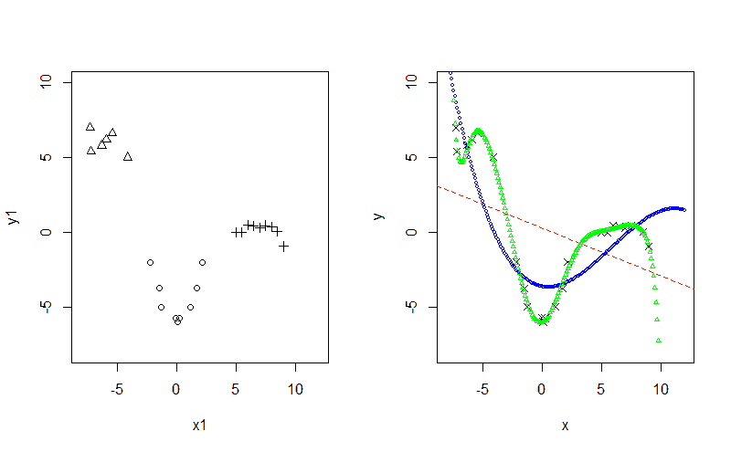
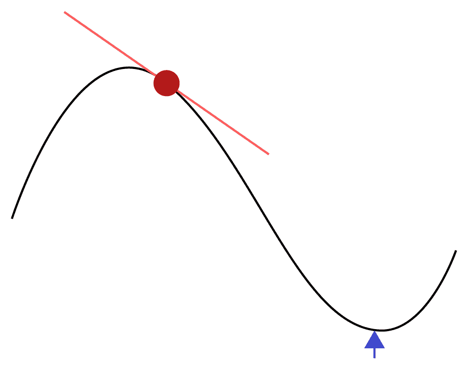
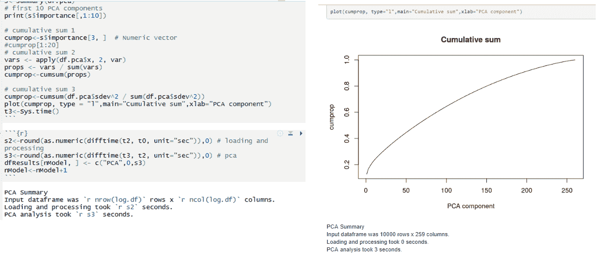
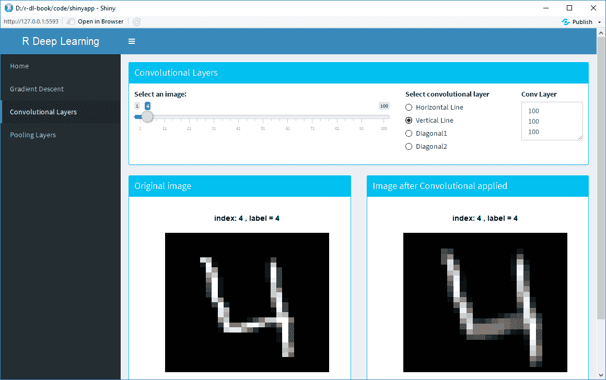

# 一、深度学习入门

本章讨论深度学习，这是一个强大的多层架构，用于模式识别、信号检测和分类或预测。尽管深度学习并不新鲜，但它只是在过去十年才变得非常受欢迎，部分原因是计算能力的进步和更有效地训练模型的新方法，以及不断增加的数据量的可用性。在本章中，您将了解什么是深度学习，可用于训练此类模型的 R 包，以及如何设置您的系统以进行分析。我们将简要讨论 **MXNet** 和 **Keras** ，这是两个主要框架，我们将在后面章节的许多示例中使用它们来实际训练和使用深度学习模型。

在本章中，我们将探讨以下主题:

*   什么是深度学习？
*   深度学习的概念概述
*   设置您的 R 环境和 R 中可用的深度学习框架
*   GPU 和再现性


# 什么是深度学习？

**深度学习**是机器学习中的一个子领域，而机器学习又是人工智能中的一个子领域。人工智能是一种创造机器的艺术，这些机器在由人执行时执行需要智能的功能。**机器学习**使用无需显式编程即可学习的算法。深度学习是机器学习的子集，它使用模拟大脑工作方式的人工神经网络。

下图显示了它们之间的关系。比如自动驾驶汽车，就是人工智能的一个应用。自动驾驶汽车的一个关键部分是识别其他道路使用者、汽车、行人、骑自行车的人等等。这需要机器学习，因为这是不可能显式编程的。最后，可以选择深度学习作为实现该机器学习任务的方法:


图 1.1:人工智能、机器学习和深度学习之间的关系

人工智能作为一个领域从 20 世纪 40 年代就已经存在；上图中使用的定义来自 Kurzweil，1990 年。这是一个广阔的领域，包含了许多不同领域的思想，包括哲学、数学、神经科学和计算机工程。机器学习是人工智能中的一个子领域，致力于开发和使用从原始数据中学习的算法。当机器学习任务必须预测一个结果时，它被称为**监督学习**。当任务是从一组可能的结果中进行预测时，它是一个**分类**任务，当任务是预测一个数值时，它是一个**回归**任务。分类任务的一些例子是特定的信用卡购买是否是欺诈性的，或者给定的图像是猫还是狗。回归任务的一个例子是预测客户下个月会花多少钱。还有其他类型的机器学习，其中学习不预测值。这被称为**无监督学习**，包括聚类(分割)数据，或创建数据的压缩格式。

深度学习是机器学习中的一个子领域。之所以叫 **deep** 是因为它使用了多层来映射输入和输出之间的关系。一个**层**是对其输入执行数学运算的神经元的集合。这将在下一节*神经网络概念概述*中详细解释。这种深层架构意味着模型足够大，可以处理许多变量，并且足够灵活，可以近似数据中的模式。深度学习也可以生成特征作为整体学习算法的一部分，而不是将特征创建作为先决步骤。深度学习已被证明在图像识别(包括手写以及照片或对象分类)、语音识别和自然语言领域特别有效。在过去几年中，它完全改变了如何使用图像、文本和语音数据进行预测，取代了以前使用这些类型数据的方法。它还向更多的人开放了这些领域，因为它自动化了许多需要专业技能的功能生成。

深度学习并不是机器学习中唯一可用的技术。还有其他类型的机器学习算法；最流行的包括回归、决策树、随机森林和朴素贝叶斯。对于许多用例，这些算法中的一个可能是更好的选择。深度学习可能不是最佳选择的一些用例包括可解释性是一项基本要求，数据集规模很小，或者开发模型的资源(时间和/或硬件)有限。重要的是要认识到，尽管行业炒作，但行业中的大多数机器学习并不使用深度学习。说到这里，这本书涵盖了深度学习算法，所以我们将继续。下一节将更深入地讨论神经网络和深度神经网络。


# 神经网络的概念概述

很难理解为什么神经网络工作得这么好。这篇介绍将从两个角度来看它们。如果你了解线性回归是如何工作的，第一个观点应该是有用的。第二种观点更直观，技术性更低，但同样有效。我鼓励你阅读这两篇文章，并花些时间思考这两篇综述。


# 作为线性回归扩展的神经网络

最简单和最古老的预测模型之一是**回归**。它根据另一个值预测一个连续值(即一个数)。线性回归函数为:

*y=mx+b*

其中 *y* 是您想要预测的值，而 *x* 是您的输入变量。线性回归系数(或参数)为 *m* (直线的斜率)和 *b* (截距)。以下 R 代码使用 *y= 1.4x -2* 函数创建一条线，并绘制该线:

```r
set.seed(42)
m <- 1.4
b <- -1.2
x <- 0:9
jitter<-0.6
xline <- x
y <- m*x+b
x <- x+rnorm(10)*jitter
title <- paste("y = ",m,"x ",b,sep="")
plot(xline,y,type="l",lty=2,col="red",main=title,xlim=c(0,max(y)),ylim=c(0,max(y)))
points(x[seq(1,10,2)],y[seq(1,10,2)],pch=1)
points(x[seq(2,11,2)],y[seq(2,11,2)],pch=4)
```

*o* 或 *x* 点是在 *x* 轴上给定值的预测值，直线是地面真实值。添加了一些随机噪声，因此这些点并不完全在直线上。该代码产生以下输出:


图 1.2:拟合数据的回归线示例(即从 *x* 预测 *y*

在一个回归任务中，给你一些 *x* 和相应的 *y* 值，但是没有给你映射 *x* 到 *y* 的底层函数。有监督的机器学习任务的目的是，给定一些以前的关于 *x* 和 *y* 的示例，我们是否可以预测新数据的 *y* 值，其中我们只有 *x* 而没有*y。*一个示例可能是根据房子中卧室的数量来预测房价。到目前为止，我们只考虑了一个输入变量， *x* ，但是我们可以很容易地扩展这个例子来处理多个输入变量。对于房子的例子，我们将使用卧室的数量和平方英尺来预测房子的价格。我们的代码可以通过将输入 *x* 从一个向量(一维数组)变成一个矩阵(二维数组)来适应这种情况。

如果考虑我们预测房价的模型，线性回归有一个严重的局限性:它只能估计线性函数。如果从 *x* 到 *y* 的映射不是线性的，就不会很好的预测 *y* 。如果使用多个 *x* 预测值，该函数总是为一个变量和一个超平面生成一条直线。这意味着线性回归模型在数据的低范围和高范围可能不准确。

使模型符合非线性关系的一个简单技巧是在函数中加入多项式项。这被称为**多项式回归**。例如，通过添加一个 4 次多项式，我们的函数变为:

*y = m[1]x⁴+m[2]x³+m[3]x²+m[4]x+b*

通过添加这些额外的项，该线(或决策边界)不再是线性的。以下代码演示了这一点–我们创建了一些样本数据，并创建了三个回归模型来拟合这些数据。第一个模型没有多项式项，该模型是一条直线，与数据拟合很差。第二个模型(蓝色圆圈)有最高达 3 次的多项式，即 *X* 、*X²T5、 *X ³* 。最后一个模型有高达 12 次的多项式，即 *X* 、 *X* *²* ，.....，*X**^(12)*。第一个模型(直线)对数据拟合不足，最后一行对数据拟合过度。过度拟合是指模型过于复杂，最终记忆数据的情况。这意味着该模型不能很好地概括，并且在看不见的数据上表现不佳。以下代码生成数据并创建三个多项式级数递增的模型:*

```r
par(mfrow=c(1,2))
set.seed(1)
x1 <- seq(-2,2,0.5)

# y=x^2-6
jitter<-0.3
y1 <- (x1^2)-6
x1 <- x1+rnorm(length(x1))*jitter
plot(x1,y1,xlim=c(-8,12),ylim=c(-8,10),pch=1)
x <- x1
y <- y1

# y=-x
jitter<-0.8
x2 <- seq(-7,-5,0.4)
y2 <- -x2
x2 <- x2+rnorm(length(x2))*jitter
points(x2,y2,pch=2)
x <- c(x,x2)
y <- c(y,y2)

# y=0.4 *rnorm(length(x3))*jitter
jitter<-1.2
x3 <- seq(5,9,0.5)
y3 <- 0.4 *rnorm(length(x3))*jitter
points(x3,y3,pch=3)
x <- c(x,x3)
y <- c(y,y3)

df <- data.frame(cbind(x,y))
plot(x,y,xlim=c(-8,12),ylim=c(-8,10),pch=4)

model1 <- lm(y~.,data=df)
abline(coef(model1),lty=2,col="red")

max_degree<-3
for (i in 2:max_degree)
{
 col<-paste("x",i,sep="")
 df[,col] <- df$x^i
}
model2 <- lm(y~.,data=df)
xplot <- seq(-8,12,0.1)
yplot <- (xplot^0)*model2$coefficients[1]
for (i in 1:max_degree)
 yplot <- yplot +(xplot^i)*model2$coefficients[i+1]
points(xplot,yplot,col="blue", cex=0.5)

max_degree<-12
for (i in 2:max_degree)
{
 col<-paste("x",i,sep="")
 df[,col] <- df$x^i
}
model3 <- lm(y~.,data=df)
xplot <- seq(-8,12,0.1)
yplot <- (xplot^0)*model3$coefficients[1]
for (i in 1:max_degree)
 yplot <- yplot +(xplot^i)*model3$coefficients[i+1]
points(xplot,yplot,col="green", cex=0.5,pch=2)

MSE1 <- c(crossprod(model1$residuals)) / length(model1$residuals)
MSE2 <- c(crossprod(model2$residuals)) / length(model2$residuals)
MSE3 <- c(crossprod(model3$residuals)) / length(model3$residuals)
print(sprintf(" Model 1 MSE = %1.2f",MSE1))
[1] " Model 1 MSE = 14.17"
print(sprintf(" Model 2 MSE = %1.2f",MSE2))
[1] " Model 2 MSE = 3.63"
print(sprintf(" Model 3 MSE = %1.2f",MSE3))
[1] " Model 3 MSE = 0.07"
```

如果我们从这些模型中选择一个来使用，我们应该选择中间的模型，即使第三个模型具有更低的 **MSE** ( **均方误差**)。在下面的截图中；最佳模型是从左上角开始的曲线:



图 1.3:多项式回归

如果我们看看这三个模型，看看它们是如何处理极端的左右点的，我们就会明白为什么过度拟合会导致看不见的数据上的糟糕结果。在图的右侧，最后一系列点(加号)具有局部线性关系。但是，12 次多项式回归线(绿色三角形)过于强调最后一点，这是额外的噪声，线急剧下移。随着 *x* 的增加，这将导致模型预测出 *y* 的极端负值，如果我们查看数据，这是不合理的。过度拟合是一个重要的问题，我们将在后面的章节中详细讨论。

通过添加平方项、立方项和更多多项式项，该模型可以拟合更复杂的数据，而不是仅使用输入数据的线性函数。神经网络使用类似的概念，只是它们不是采用输入变量的多项式项，而是将多个回归函数与它们之间的非线性项链接在一起。

下面是一个神经网络体系结构的示例。圆圈是节点，线是节点之间的连接。如果两个节点之间存在连接，左边节点的输出就是下一个节点的输入。节点的输出值是对节点的输入值和节点的权重的矩阵运算:


图 1.4:一个神经网络的例子

在来自一个节点的输出值作为输入值被传递到下一个节点之前，一个函数被应用于这些值以将整体函数改变为非线性函数。这些被称为**激活函数**，它们的作用与多项式项相同。

这种通过将多个小函数组合在一起来创建机器学习模型的想法是机器学习中非常常见的范式。它被用于随机森林，在那里许多小的独立决策树*投票*决定结果。它也用于 boosting 算法中，其中来自一个函数的错误分类的实例在下一个函数中被给予更显著的位置。

通过包括许多层节点，神经网络模型可以近似任何函数。这确实增加了训练模型的难度，因此我们将简要说明如何训练神经网络。每个节点最初被分配一组随机权重。对于第一次传递，这些权重用于计算并将值从输入层传递(或传播)到隐藏层，最终传递到输出层。这被称为**正向传播**。由于权重是随机设置的，因此输出图层的最终(预测)值与实际值相比并不准确，因此我们需要一种方法来计算预测值与实际值的差异。这是使用**成本函数**计算出来的，它给出了模型在训练过程中有多精确的度量。然后，我们需要从输出层向后调整节点中的权重，以使我们更接近目标值。这是使用**反向传播**完成的；我们从右向左移动，稍微更新每层中节点的权重，以使我们稍微接近实际值。向前传播和向后传播的循环继续，直到来自损失函数的误差值停止变小；这可能需要数百次或数千次的迭代或历元。

为了正确地更新节点权重，我们需要知道该改变将使我们更接近目标，即最小化来自成本函数的结果。我们能够做到这一点是因为一个聪明的技巧，我们使用具有导数函数的激活函数。

如果你的微积分知识有限，最初可能很难理解导数。但简单来说，一个函数可能有一个导数公式，它告诉我们如何改变一个函数的*输入*，使得该函数的*输出*以正或负的方式移动。该导数/公式使得算法能够最小化成本函数，成本函数是误差的度量。用更专业的术语来说，函数的导数衡量输入变化时函数的变化率。如果我们知道输入变化时函数的变化率，更重要的是知道它的变化方向，那么我们就可以用它来接近最小化那个函数。下图是您以前可能见过的一个示例:



图 1.5:一条函数(曲线)线及其在一点的导数

在这个图中，曲线是我们想要在 *y* 上最小化的数学函数，也就是说，我们想要到达最低点(用箭头标出)。我们现在在红圈的点上，该点的导数就是切线的斜率。导数函数指出了我们到达那里需要移动的方向。当我们接近目标(箭头)时，导数值会改变，所以我们不能一步到位。所以算法是小步移动，每步之后重新计算导数，但是如果我们选择的步长太小，那么**收敛**(也就是接近最小值)就需要很长的时间。如果我们迈得太大，就有超过最小值的风险。你走了多大的一步被称为**学习率**，它有效地决定了算法训练需要多长时间。

这可能看起来有点抽象，所以打个比方应该会更清楚一些。这个类比可能过于简化，但它解释了导数、学习率和成本函数。想象一个简单的汽车驾驶模型，其中速度必须设置为适合条件和速度限制的值。您的当前速度和目标速度之间的差异是错误率，这是使用成本函数计算的(在这种情况下，只是简单的减法)。要改变你的速度，你可以踩油门加速或踩刹车减速。加速度/减速度(即速度的变化率)是速度的导数。施加到踏板上的力的大小改变了加速/减速的速度，该力类似于机器学习算法中的学习速率。它控制达到目标值所需的时间。如果只对踏板做一个小的改变，你最终会达到你的目标速度，但是需要更长的时间。然而，你通常不想对踏板施加最大的力，这样做可能是危险的(如果你猛踩刹车)或浪费燃料(如果你加速太猛)。有一个快乐的中间点，你可以应用改变，安全快速地达到目标速度。


# 作为记忆细胞网络的神经网络

考虑神经网络的另一种方式是将它们与人类的思维方式进行比较。顾名思义，神经网络从大脑中的神经过程和神经元中获取灵感。神经网络包含一系列相互连接并处理输入的神经元或节点。神经元具有从以前的观察(数据)中学习的权重。神经元的输出是其输入和权重的函数。一些最终神经元的激活是预测。

我们将考虑一个假设的情况，其中大脑的一小部分负责匹配基本形状，如正方形和圆形。在这种情况下，一些基本级别的神经元为水平线激活，另一组神经元为垂直线激活，还有一组神经元为弯曲的线段激活。这些神经元进入更高阶的过程，结合输入，以便它识别更复杂的物体，例如，当水平和垂直神经元同时被激活时，一个正方形。

在下图中，输入数据表示为正方形。这些可能是图像中的像素。下一层隐藏神经元由识别基本特征的神经元组成，如水平线、垂直线或曲线。最后，输出可以是由两个隐藏神经元的同时激活而激活的神经元:


图 1.6:作为记忆细胞网络的神经网络

在这个例子中，隐藏层中的第一个节点擅长匹配水平线，而隐藏层中的第二个节点擅长匹配垂直线。这些节点*记住*这些对象是什么。如果这些节点结合起来，就可以探测到更复杂的物体。例如，如果隐藏层识别水平线和垂直线，则对象更可能是正方形而不是圆形。这类似于卷积神经网络的工作原理，我们将在第 5 章、*使用卷积神经网络进行图像分类*中介绍。

我们已经非常肤浅地讨论了神经网络背后的理论，因为我们不想在第一章就让你不知所措！在以后的章节中，我们将更深入地讨论这些问题，但同时，如果您希望更深入地了解神经网络背后的理论，建议使用以下资源:

*   第六章*古德菲勒等人* (2016)
*   *Hastie* *，* *T .，* *Tibshirani，* R .， *Friedman，* *J.* (2009)第 11 章，可在[https://web.stanford.edu/~hastie/Papers/ESLII.pdf](https://web.stanford.edu/~hastie/Papers/ESLII.pdf)免费获取
*   第十六章*墨菲、*T24k .*p .*(2012)

接下来，我们将转向对深度神经网络的简要介绍。


# 深度神经网络

一个**深度神经网络** ( **DNN** )是一个具有多个隐含层的神经网络。在一个层数很少的神经网络(浅层神经网络)中，仅仅增加节点数是无法取得好的效果的。与浅层的**神经网络** ( **NN** )相比，DNN 可以用更少的参数更准确地拟合数据，因为更多的层(每层都有更少的神经元)给出了更高效和准确的表示。使用多个隐藏层允许从简单元素到更复杂元素的更复杂的构建。在前面的例子中，我们考虑了一个可以识别基本形状的神经网络，例如圆形或正方形。在深度神经网络中，许多圆形和方形可以组合成其他更高级的形状。浅层神经网络无法从基本的片段构建更高级的形状。DNN 的缺点是这些模型很难训练，容易过度拟合。

如果我们考虑从图像数据中识别手写文本，那么原始数据就是图像的像素值。第一层捕捉简单的形状，如直线和曲线。下一层使用这些简单的形状，并识别更高的抽象，如角和圆。第二层不必直接从像素学习，像素是有噪声且复杂的。相比之下，浅层架构可能需要更多的参数，因为每个隐藏神经元都必须能够直接从图像中的像素到目标值。它也不能组合特征，因此，例如，如果图像数据在不同的位置(例如，不居中)，它将不能识别文本。

训练深度神经网络的挑战之一是如何有效地学习权重。这些模型很复杂，需要训练大量的参数。深度学习的一个主要进步发生在 2006 年，当时表明**深度信念网络** ( **DBNs** )可以一次训练一层(参见*辛顿、* G. E .、*奥森德罗、* S .、 *Teh，Y. W.* (2006))。DBN 是一种深度神经网络，具有多个隐藏层以及层之间(而不是层内)的连接(即，第 1 层中的神经元可以连接到第 2 层中的神经元，但不可以连接到第 1 层中的另一个神经元)。层内无连接的限制允许使用更快的训练算法，例如**对比发散算法**。本质上，DBN 可以一层一层地训练；第一个隐藏层被训练并用于将原始数据转换为隐藏神经元，然后将其作为下一个隐藏层中的一组新输入，并重复该过程，直到所有层都被训练。

认识到 DBNs 可以一次训练一层的好处不仅仅局限于 DBNs。DBNs 有时被用作深度神经网络的预训练阶段。这允许使用相对快速、贪婪的逐层训练来提供良好的初始估计，然后使用其他效率较低的训练算法(如反向传播)在深度神经网络中对其进行细化。

到目前为止，我们主要关注前馈神经网络，其中来自一层的结果和神经元前馈到下一层。在结束这一部分之前，值得一提的是两种越来越受欢迎的特定深度神经网络。第一个是**循环神经网络** ( **RNN** )，神经元在其中相互发送反馈信号。这些反馈循环允许 rnn 很好地处理序列。RNNs 的一个应用例子就是自动生成点击诱饵，比如*十大去洛杉机的理由:* #6 *会让你震惊！*或者*一招伟大的发廊不想让你知道*。rnn 很适合这样的工作，因为它们可以从几个词(甚至只是趋势搜索词或名称)的大型初始池中播种，然后预测/生成下一个词应该是什么。这个过程可以重复几次，直到产生一个简短的短语，即点击诱饵。我们将在第 7 章、*使用深度学习的自然语言处理*中看到 RNNs 的例子。

第二种是**卷积神经网络** ( **CNN** )。CNN 最常用于图像识别。CNN 的工作原理是让每个神经元对图像的重叠子区域做出反应。CNN 的好处是，它们需要相对最少的预处理，但通过权重共享(例如，跨图像的子区域)，仍然不需要太多的参数。这对于图像尤其有价值，因为它们通常不一致。例如，想象十个不同的人给同一张桌子拍照。一些可能更近或更远，或者在导致基本上相同的图像具有不同的高度、宽度和在聚焦物体周围捕获的图像量的位置。我们将在第五章、*使用卷积神经网络进行图像分类*中深入讨论 CNN。

该描述仅提供了关于什么是深度神经网络以及它们可以应用的一些用例的最简短的概述。深度学习的开创性参考文献是*good fellow-et al*(2016)。


# 关于深度学习的一些常见误区

关于深度学习，有许多误解、半真半假和彻头彻尾的误导性观点。以下是一些关于深度学习的常见误解:

*   人工智能意味着深度学习，并取代所有其他技术
*   深度学习需要对数学有博士级别的理解
*   深度学习很难训练，几乎是一种艺术形式
*   深度学习需要大量数据
*   深度学习的可解释性差
*   深度学习需要 GPU

以下段落逐一讨论这些陈述。

深度学习不是人工智能，也不会取代所有其他的机器学习算法。它只是机器学习中算法的一个家族。尽管大肆宣传，深度学习可能只占目前生产中的机器学习项目的不到 1%。你在浏览网络时遇到的大多数推荐引擎和在线广告都不是由深度学习驱动的。公司内部用来管理用户的大多数模型，例如*流失分析*，都不是深度学习模型。信贷机构用来决定谁获得信贷的模型没有使用深度学习。

深度学习不需要对数学有很深的理解，除非你的兴趣是研究新的深度学习算法和专门的架构。大多数从业者通过采用现有的架构并为他们的工作修改它，对他们的数据使用现有的深度学习技术。这不需要很深的数学基础，深度学习中使用的数学在全世界的高中水平都有教授。事实上，我们在第 3 章、*深度学习基础*中演示了这一点，在那里我们用不到 70 行代码从基本代码构建了一个完整的神经网络！

训练深度学习模型很难，但它不是一种艺术形式。确实需要练习，但是同样的问题一次又一次的发生。更好的是，这个问题通常有一个规定的修复方法，例如，如果你的模型过度拟合，添加正则化，如果你的模型训练不好，建立一个更复杂的模型和/或使用*数据增强*。我们将在第 6 章、*调整和优化模型*中对此进行更深入的探讨。

深度学习需要大量数据的说法有很多道理。但是，通过使用预训练的网络，或者从现有数据中创建更多的训练数据(数据扩充)，您仍然可以将深度学习应用于该问题。我们将在后面的第 6 章，调优和优化模型和[第 11 章](fc01644e-9de7-4b66-92c0-473e168dc523.xhtml)，*深度学习的下一个级别*中查看这些。

深度学习模型很难解释。这里，我们的意思是能够解释模型是如何做出决定的。这是很多机器学习算法都存在的问题，不仅仅是深度学习。在机器学习中，准确性和解释之间通常存在反比关系——模型需要越准确，它的可解释性就越低。对于某些任务，例如在线广告，可解释性并不重要，出错的代价也很小，所以最好使用最强大的算法。例如，在某些情况下，法律可能要求信用评分、可解释性；人们可以要求解释为什么他们被拒绝贷款。在其他情况下，如医疗诊断，可解释性对于医生来说可能很重要，以了解为什么模型决定某人患有疾病。

如果可解释性很重要，一些方法可以应用于机器学习模型，以了解它们为什么预测实例的输出。他们中的一些人通过扰乱数据(也就是说，对数据进行轻微的修改)并试图找到什么样的变量对模型做出决定最有影响。一种这样的算法叫做 **LIME** ( **本地可解释的模型不可知解释**)。里贝罗、马尔科·图利奥、萨梅尔·辛格和卡洛斯·盖斯特林。我为什么要相信你？:解释任何分类器的预测。第 22 届 ACM SIGKDD 知识发现和数据挖掘国际会议论文集。ACM，2016。这已经在许多语言中实现了，包括 R；有一个包叫`lime`。我们将在第 6 章、*调优和优化模型*中使用这个包。

最后，虽然深度学习模型可以在 CPU 上运行，但事实是，任何真正的工作都需要一个带 GPU 的工作站。这并不意味着你需要出去买一个，因为你可以使用云计算来训练你的模型。在[第 10 章](dc5f5391-58e9-43e2-bdd7-d81f102ed1d8.xhtml)、*在云中运行深度学习模型*，将着眼于使用 AWS、Azure 和 Google Cloud 来训练深度学习模型。


# 设置您的 R 环境

在你开始深度学习之旅之前，第一步是安装 R，它可以在[https://cran.r-project.org/](https://cran.r-project.org/)获得。当您下载并使用 R 时，默认情况下只安装几个核心包，但是可以通过从菜单选项中选择或者通过一行代码来添加新的包。我们不会详细讨论如何安装 R 或者如何添加包，我们假设大多数读者都精通这些技能。一个好的**集成开发环境** ( **IDE** )对于 R 的工作是必不可少的。目前最流行的 IDE，也是我的推荐，是 RStudio，可以从 https://www.rstudio.com/下载。另一个选择是 **Emacs** 。Emacs 和 RStudio 的一个优点是它们可以在所有主要平台(Windows、macOS 和 Linux)上使用，因此即使您切换计算机，也可以获得一致的 IDE 体验。以下是 RStudio IDE 的屏幕截图:


图 1.7 RStudio IDE

使用 RStudio 是对 Windows 中 R GUI 的一个重大改进。RStudio 中有许多窗格，为您的工作提供不同的视角。左上窗格显示代码，左下窗格显示控制台(运行代码的结果)。右上窗格显示变量列表及其当前值，右下窗格显示代码创建的图。所有这些窗格都有进一步的选项卡来探索更多的视角。

除了 IDE，RStudio(该公司)还为 R 环境开发或大力支持其他工具和软件包。我们将使用其中的一些工具，包括 R Markdown 和 R Shiny 应用程序。R Markdown 类似于 Jupyter 或者 IPython 笔记本；它允许您在一个脚本中组合代码、输出(例如，绘图)和文档。R Markdown 用于创建本书中代码和描述性文本交织的部分。R Markdown 是一个非常好的工具，可以确保您的数据科学实验得到正确记录。通过在分析中嵌入文档，他们更有可能保持同步。R Markdown 可以输出到 HTML、Word 或 PDF。下面是一个 R Markdown 脚本的示例，左边是输出，右边是输出:



图 1.8: R 降价示例；左边是 R 代码和文本信息的混合。右边的输出是从源脚本生成的 HTML。

我们还将使用 R Shiny 来创建使用 R 的 web 应用程序。这是一个创建交互式应用程序来演示关键功能的极好方法。下面的截图是一个 R Shiny web 应用程序的例子，我们将在第 5 章、*使用卷积神经网络进行图像分类*中看到:



图 1.9:一个 R Shiny web 应用程序的例子

一旦你安装了 R，你就可以考虑添加适合基本神经网络的包。`nnet`包是一个包，它可以适合带有一个隐藏层的前向神经网络，如*图* 1.6 所示。关于`nnet`一揽子计划的更多细节，见*维纳布尔斯，w .*T16【n .和*里普利，B.* D. (2002)。`neuralnet`软件包适合具有多个隐藏层的神经网络，可以使用反向传播来训练它们。它还允许自定义误差和神经元激活功能。我们还将使用`RSNNS`包，它是 **Stuttgart 神经网络模拟器** ( **SNNS** )的 R 包装器。SNNS 最初是用 C 语言编写的，但是被移植到了 C++中。`RSNNS`软件包提供了许多来自 SNNS 的模型组件，使得训练各种各样的模型成为可能。关于`RSNNS`一揽子计划的更多细节，见*伯格梅尔、* C .、*贝尼特斯、**j .**m .*(2012)。我们将在第 2 章、*训练预测模型*中看到如何使用这些模型的示例。

`deepnet`包为 r 中的深度学习提供了许多工具，具体来说，它可以训练 RBM，并将这些作为 dbn 的一部分，以生成初始值来训练深度神经网络。`deepnet`包还允许不同的激活功能，并使用 dropout 进行调整。


# R 的深度学习框架

神经网络有很多 R 包可用，但深度学习的选项很少。这本书第一版出来的时候，用的是 h2o 里面的深度学习函数([https://www.h2o.ai/](https://www.h2o.ai/))。这是一个用 Java 编写的优秀的通用机器学习框架，有一个 API 允许你从 r 使用它，我建议你看看，特别是对于大型数据集。然而，大多数深度学习实践者倾向于其他深度学习库，如 TensorFlow，CNTK 和 MXNet，在本书第一版编写时，R 中不支持这些库。今天，有一个很好的深度学习库选择，在 R-MXNet 和 Keras 中得到支持。Keras 其实是其他深度学习库的前端抽象，可以在后台使用 TensorFlow。我们将在本书中使用 MXNet、Keras 和 TensorFlow。


# MXNet

MXNet 是亚马逊开发的深度学习库。它可以在 CPU 和 GPU 上运行。对于本章，在 CPU 上运行就足够了。

Apache MXNet 是一个灵活可扩展的深度学习框架，支持**卷积神经网络**(**CNN**)和**长短期记忆网络** ( **LSTMs** )。它可以分布在多个处理器/机器上，并在多个 GPU/CPU 上实现几乎线性的规模。它很容易安装在 R 上，并支持 R 的一系列深度学习功能。它是编写我们第一个图像分类深度学习模型的绝佳选择。

MXNet 起源于*卡内基梅隆大学*并得到亚马逊的大力支持；他们在 2016 年选择它作为他们默认的深度学习库。2017 年，MXNet 被接受为 *Apache 孵化器*项目，确保它将保持开源软件。它有一个类似于 Keras 的高级编程模型，但报告的性能更好。随着额外 GPU 的增加，MXNet 具有很强的可扩展性。

要安装用于 Windows 的 MXNet 软件包，请从 R 会话运行以下代码:

```r
cran <- getOption("repos")
cran["dmlc"] <- "https://apache-mxnet.s3-accelerate.dualstack.amazonaws.com/R/CRAN"
options(repos = cran)
install.packages("mxnet")
```

这将安装 CPU 版本；对于 GPU 版本，您需要将第二行改为:

```r
cran["dmlc"] <- "https://apache-mxnet.s3-accelerate.dualstack.amazonaws.com/R/CRAN/GPU/cu92"
```

您必须根据您机器上安装的 CUDA 版本将`cu92`更改为`cu80`、`cu90`或`cu91`。对于其他操作系统(如果这不起作用，因为深度学习中的事情变化非常快)，你可以在[https://mxnet.incubator.apache.org/install/index.html](https://mxnet.incubator.apache.org/install/index.html)获得进一步的说明。


# 克拉斯

Keras 是由 Google 的 Francois Chollet 创建的高级、开源、深度学习框架，强调迭代和快速开发；它被普遍认为是学习深度学习的最佳选择之一。Keras 有一个后端低级框架的选择:TensorFlow、Theano 或 CNTK，但它最常用于 TensorFlow。Keras 模型几乎可以部署在任何环境中，例如 web 服务器、iOS、Android、浏览器或 Raspberry Pi。

要了解更多关于 Keras 的信息，请访问[https://keras.io/](https://keras.io/)。要了解更多关于在 R 中使用 Keras 的信息，请访问[https://keras.rstudio.com](https://keras.rstudio.com)；这个链接还有更多 R 和 Keras 的例子，以及一个方便的 Keras 备忘单，它给出了 R Keras 包所有功能的完整参考。要安装 R 的`keras`包，运行下面的代码:

```r
devtools::install_github("rstudio/keras")
library(keras)
install_keras()
```

这将安装 Keras 和 TensorFlow 的基于 CPU 的包。如果您的机器有合适的 GPU，您可以参考`install_keras()`的文档来了解如何安装它。


# 我需要一个 GPU 吗(不管怎样，它是什么)？

深度学习指数增长的两个最大原因可能是:

*   积累、存储和处理所有类型的大型数据集的能力
*   使用 GPU 训练深度学习模型的能力

那么 GPU 到底是什么，为什么对深度学习如此重要？可能最好的起点是实际查看 CPU，以及为什么这对于训练深度学习模型不是最佳的。现代个人电脑中的中央处理器是人类设计和工程的巅峰之一。现在，甚至手机中的芯片比第一艘航天飞机的整个计算机系统还要强大。然而，因为它们被设计为擅长所有任务，所以它们可能不是利基任务的最佳选择。一个这样的任务是高端图形。

如果我们回到 20 世纪 90 年代中期，大多数游戏都是 2D，例如，平台游戏，游戏中的角色在平台之间跳跃和/或避免障碍。今天，几乎所有的电脑游戏都利用 3D 空间。现代的游戏机和个人电脑都有协处理器，承担在 2D 屏幕上模拟 3D 空间的任务。这些协处理器被称为**GPU**。

GPU 其实远比 CPU 简单。它们只做一件事:大规模并行矩阵运算。CPU 和 GPU 都有*内核*，在那里进行实际的计算。采用英特尔 i7 CPU 的电脑通过使用*超线程*拥有四个物理内核和八个虚拟内核。NVIDIA TITAN Xp GPU 卡拥有 3840 个 CUDA 核心。这些核心不能直接比较；CPU 中的内核比 GPU 中的内核强大得多。但是，如果工作负载需要大量可以独立完成的矩阵运算，拥有许多简单内核的芯片会快得多。

在深度学习甚至是一个概念之前，神经网络的研究人员意识到，做高端图形和训练神经网络都涉及到工作负载:大量的矩阵乘法可以并行完成。他们意识到，在 GPU 而不是 CPU 上训练模型将允许他们创建更复杂的模型。

今天，所有的深度学习框架都可以在 GPU 和 CPU 上运行。事实上，如果你想从头开始训练模型和/或拥有大量数据，你几乎肯定需要一个 GPU。GPU 必须是 NVIDIA GPU，您还需要安装 CUDA 工具包、NVIDIA 驱动程序和 cuDNN。这些允许你与 GPU 接口，并从图形卡到数学协处理器劫持它的使用。安装这些并不总是容易的，你必须确保 CUDA，cuDNN 和你使用的深度学习库的版本是兼容的。有些人建议您需要使用 Unix 而不是 Windows，但是对 Windows 的支持已经有了很大的改进。这本书上的代码是在 Windows 工作站上开发的。忘了用 macOS 吧，因为他们不支持 NVIDIA 卡。

这是个坏消息。好消息是，如果你没有合适的 GPU，你可以学习关于深度学习的一切。本书前几章中的例子可以在现代个人电脑上完美运行。当我们需要扩大规模时，这本书将解释如何使用云资源，如 AWS 和谷歌云，来训练大型深度学习模型。


# 设置可重复的结果

数据科学软件正在快速发展和变化。尽管这对于进步来说很棒，但它会使复制别人的成果成为一个挑战。甚至你自己的代码在几个月后再看的时候也可能不起作用。这是当今科学研究中最大的问题之一，跨所有领域，不仅仅是人工智能和机器学习。如果你在研究或学术界工作，你想在科学杂志上发表你的成果，这是你需要关心的事情。这本书的第一版通过使用 Revolution Analytics 提供的 R checkpoint 包部分解决了这个问题。这将记录所使用的软件版本，并确保有可用的快照。

对于第二版，我们将不使用这个包，原因如下:

*   大多数读者可能不会发表他们的作品，而是对其他问题更感兴趣(最大化准确性、可解释性等等)。
*   深度学习需要大数据集。当你有大量的数据时，这意味着，虽然我们每次得到的结果可能不完全相同，但会非常接近(百分比的分数)。
*   在生产系统中，可复制性不仅仅是软件。您还必须考虑数据管道和随机种子生成。
*   为了确保再现性，所用的文库必须保持冷冻。深度学习 API 的新版本不断发布，可能包含增强功能。如果我们局限于旧版本，我们会得到糟糕的结果。

如果你有兴趣了解更多关于`checkpoint`包的信息，你可以在[https://cran . r-project . org/web/packages/check point/vignettes/check point . html](https://cran.r-project.org/web/packages/checkpoint/vignettes/checkpoint.html)上阅读关于这个包的在线简介。

这本书是在 Windows 10 Professional x64 上使用 3.5 版编写的，这是编写时 R 的最新版本。代码运行在一台配有 Intel i5 处理器和 32 GB RAM 的机器上；它应该运行在 8 GB 内存的英特尔 i3 处理器上。

你可以从你在[http://www.packtpub.com/](http://www.packtpub.com/)的账户下载本书的示例代码文件。如果你在其他地方购买了这本书，你可以访问 http://www.packtpub.com/support[网站](http://www.packtpub.com/support)并注册，让文件直接通过电子邮件发送给你。

您可以按照以下步骤下载代码文件:

1.  使用您的电子邮件地址和密码登录或注册我们的网站。
2.  将鼠标指针悬停在顶部的**支架**标签上。
3.  点击**代码下载&勘误表**。
4.  在**搜索框**中输入书名。
5.  选择您要下载代码文件的书。
6.  从下拉菜单中选择您购买这本书的地方。
7.  点击**代码下载**。

下载文件后，请确保使用最新版本的解压缩或解压文件夹:

*   WinRAR I 7-Zip for Windows
*   适用于 Mac 的 Zipeg I iZip I UnRarX
*   7-Zip I PeaZip for Linux


# 摘要

本章简要介绍了神经网络和深度神经网络。使用多个隐藏层，深度神经网络已经成为机器学习的一场革命。它们一直优于其他机器学习任务，特别是在计算机视觉、自然语言处理和语音识别等领域。

本章还探讨了神经网络背后的一些理论，浅层神经网络和深层神经网络之间的差异，以及目前存在的关于深度学习的一些误解。

我们在本章结束时讨论了如何设置 R 以及使用 GUI (RStudio)的重要性。本节讨论了 R (MXNet、Keras 和 TensorFlow)、GPU 和 reproducibility 中可用的深度学习库。

在下一章，我们将开始训练神经网络，并生成我们自己的预测。