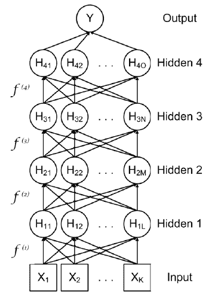
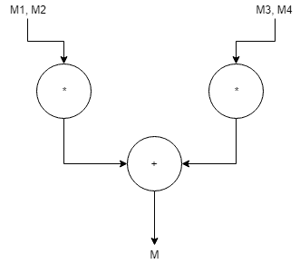
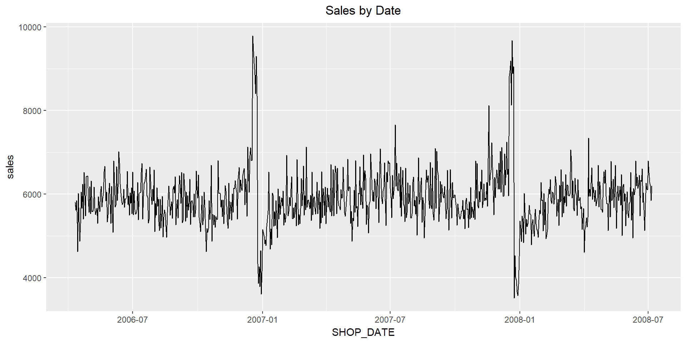

# 四、训练深度预测模型

前面的章节讲述了神经网络背后的一些理论，并在 r 中使用了一些神经网络包。现在是时候深入研究并看看训练深度学习模型了。在这一章中，我们将探索如何训练和建立前馈神经网络，这是最常见的深度学习模型。我们将使用 MXNet 建立深度学习模型，使用零售数据集执行分类和回归。

本章将涵盖以下主题:

*   深度前馈神经网络入门
*   常见激活功能–整流器、双曲正切和最大输出
*   MXNet 深度学习库简介
*   用例–使用 MXNet 进行分类和回归


# 深度前馈神经网络入门

深度前馈神经网络被设计成逼近函数 *f()* ，该函数将某组输入变量 *x* 映射到输出变量 *y* 。它们被称为前馈神经网络，因为信息从输入通过每个连续层流动到输出，并且没有反馈或递归循环(包括前向和后向连接的模型被称为循环神经网络)。

深度前馈神经网络适用于广泛的问题，并且对于诸如图像分类的应用特别有用。更一般地说，前馈神经网络在有明确定义的结果(图像包含什么数字，某人是在楼上走还是在平面上走，疾病的存在/不存在，等等)的预测和分类中是有用的。

深度前馈神经网络可以通过将层或函数链接在一起来构建。例如，下图显示了一个具有四个隐藏层的网络:



图 4.1:深度前馈神经网络

这个模型图是一个有向无环图。作为一个函数，从输入端 *X* 到输出端 *Y* 的整体映射是一个多层函数。第一个隐藏层是*H**[1]= f^((1))(X，w[1]a[1]**)*，第二个隐藏层是*H[2]= f^((2))(H[1]，w [2] 这些多层可以允许从相对简单的功能和转换构建复杂的功能和转换。*

如果一个层中包含足够多的隐藏神经元，它可以用许多不同类型的函数来逼近期望的精度。前馈神经网络可以通过在层间应用非线性变换来逼近非线性函数。这些非线性函数被称为激活函数，我们将在下一节讨论。

通过前向和后向传播训练模型时，将学习每层的权重。必须确定的模型的另一个关键部分是成本或损失函数。最常用的两个代价函数是交叉熵，用于分类任务，和**均方误差** ( **MSE** )，用于回归任务。

激活功能


# 激活函数确定输入和隐藏层之间的映射。它定义了神经元如何被激活的功能形式。例如，线性激活函数可以定义为: *f(x) = x* ，在这种情况下，神经元的值将是原始输入， *x* 。图 4.2 的顶部面板显示了一个线性激活功能。很少使用线性激活函数，因为在实践中，深度学习模型会发现使用线性激活函数很难学习非线性函数形式。在前面的章节中，我们使用双曲正切作为激活函数，即 *f(x) = tanh(x)* 。双曲正切在某些情况下可以很好地工作，但一个潜在的限制是，在低或高的值，它饱和，如图 4.2 的中间面板所示。

也许是目前最流行的激活功能，也是一个很好的首选(Nair，v .和 Hinton，G. E. (2010))，被称为*整流器*。整流器有不同种类，但最常见的是由 *f(x) = max(0，x)* 函数定义的，该函数称为 **relu** 。relu 激活在零以下是平坦的，在零以上是线性的；图 4.2 给出了一个例子。

我们将讨论的最后一种激活函数是 maxout(古德菲勒、沃德-法利、米尔扎、库维尔和本吉奥(2013))。最大输出单元取其输入的最大值，尽管通常这是在加权之后，因此具有最高值的输入变量并不总是获胜。Maxout 激活函数似乎对 dropout 特别有效。

relu 激活是最常用的激活功能，也是本书剩余部分深度学习模型的默认选项。下面是我们讨论过的一些激活函数的图表:

图 4.2:常见的激活功能

MXNet 深度学习库简介


我们将在本书中使用的深度学习库是 MXNet、Keras 和 TensorFlow。Keras 是一个前端 API，这意味着它不是一个独立的库，因为它在后端需要一个低级别的库，通常是 TensorFlow。使用 Keras 而不是 TensorFlow 的优势在于它的界面更简单。我们将在本书后面的章节中使用 Keras。


# MXNet 和 TensorFlow 都是多用途的数值计算库，可以使用 GPU 进行大规模并行矩阵运算。因此，多维矩阵是两个库的核心。在 R 中，我们熟悉 vector，它是同类型值的一维数组。R 数据框是一个值的二维数组，其中每一列可以有不同的类型。R 矩阵是具有相同类型的值的二维数组。R 中的一些机器学习算法需要一个矩阵作为输入。我们在第 2 章、*中看到了一个这样的例子，用 RSNSS 包训练一个预测模型*。

The deep learning libraries we will use in this book are MXNet, Keras, and TensorFlow. Keras is a frontend API, which means it is not a standalone library as it requires a lower-level library in the backend, usually TensorFlow. The advantage of using Keras rather than TensorFlow is that it has a simpler interface. We will use Keras in later chapters in this book.

在 R 中，使用超过两个维度的数据结构并不常见，但深度学习广泛使用它们。例如，如果您有一个 32 x 32 的彩色图像，您可以将像素值存储在一个 32 x 32 x 3 的矩阵中，其中前两个维度是宽度和高度，最后一个维度是红色、绿色和蓝色。这可以通过为图像集合添加另一个维度来进一步扩展。这称为批处理，允许处理器(CPU/GPU)同时处理多个图像。批量大小是一个超参数，选择的值取决于输入数据的大小和内存容量。如果我们的批量大小是 64，我们的矩阵将是一个大小为 32 x 32 x 3 x 64 的 4 维矩阵，其中前两个维度是宽度和高度，第三个维度是颜色，最后一个维度是批量大小 64。重要的是要认识到这只是另一种表示数据的方式。在 R 中，我们将相同的数据存储为 64 行、32 x 32 x 3 = 3，072 列的二维矩阵(或 dataframe)。我们所做的只是重塑数据，而不是改变它。

这些包含同类型元素的 n 维矩阵是使用 MXNet 和 TensorFlow 的基石。在 MXNet 中，它们被称为 NDArrays。在TensorFlow中，他们被称为**张量**。这些 n 维矩阵很重要，因为它们意味着我们可以更高效地将数据馈入 GPUs 与处理单行数据相比，GPU 可以更高效地批量处理数据。在前面的例子中，我们一批使用 64 张图像，因此深度学习库将以 32 x 32 x 3 x 64 的块来处理输入数据。

本章将使用 MXNet 深度学习库。MXNet 起源于卡内基梅隆大学，并得到亚马逊的大力支持，他们选择它作为他们 2016 年默认的深度学习库。2017 年，MXNet 被接受为 Apache 孵化器项目，确保它将继续作为开源软件。下面是一个非常简单的 R 中 MXNet 的 NDArray (matrix)操作的例子，如果你还没有安装 R 的 MXNet 包，回到第 1 章、*深度学习入门*获取说明，或者使用这个链接:[https://mxnet.apache.org/install/index.html](https://mxnet.apache.org/install/index.html):

我们可以逐行分解这段代码:

第 1 行加载 MXNet 包。

```
library(mxnet) # 1
ctx = mx.cpu() # 2
a <- mx.nd.ones(c(2,3),ctx=ctx) # 3
b <- a * 2 + 1 # 4
typeof(b) # 5
[1] "externalptr"
class(b) # 6
[1] "MXNDArray"
b # 7
     [,1] [,2] [,3]
[1,]    3    3    3
[2,]    3    3    3
```

第 2 行设置 CPU 上下文。这告诉 MXNet 在哪里处理你的计算，是在 CPU 上还是在 GPU 上，如果有的话。

*   第 3 行创建了一个大小为 2 x 3 的二维 NDArray，其中每个值都是 1。
*   第 4 行创建了另一个大小为 2 x 3 的二维 NDArray。每个值都将是 3，因为我们执行的是逐元素乘法并加 1。
*   第 5 行显示 b 是一个外部指针。
*   第 6 行显示 b 的类是 MXNDArray。
*   第 7 行显示了结果。
*   我们可以对`b` 变量进行数学运算，比如乘法和加法。然而，重要的是要认识到，虽然它的行为类似于 R 矩阵，但它不是本机 R 对象。我们可以在输出这个变量的类型和类时看到这一点。
*   在开发深度学习模型时，通常有两个不同的步骤。首先创建模型架构，然后训练模型。主要原因是因为大多数深度学习库采用符号编程，而不是你习惯的命令式编程。您以前用 R 编写的大部分代码都是命令式程序，它按顺序执行代码。对于数学优化任务，如深度学习，这可能不是最有效的执行方法。大多数深度学习库，包括 MXNet 和 TensorFlow，都使用符号编程。对于符号编程，首先设计程序执行的计算图。然后编译并执行该图。当计算图生成时，输入、输出和图操作已经定义，这意味着代码可以优化。这意味着对于深度学习来说，符号程序通常比命令式程序更高效。

下面是一个使用符号程序进行优化的简单示例:

*M = (M1 * M2) + (M3* M4)*

命令式程序将按如下方式进行计算:

*Mtemp1 = (M1 * M2)*

*Mtemp2 = (M3* M4)*

*M = Mtemp1 + Mtemp2*

符号程序将首先创建一个计算图，可能如下所示:

图 4.3:计算图表示例

*M1* 、 *M2* 、 *M3* 、 *M4* 为需要操作的符号。该图显示了操作的依赖关系； *+* 运算要求前面两个乘法运算完成后才能执行。但是这两个乘法步骤之间没有依赖关系，所以它们可以并行执行。这种类型的优化意味着代码可以执行得更快。



从编码的角度来看，这意味着你在创建深度学习模型时有两个步骤——首先你定义模型的架构，然后你训练模型。你为你的深度学习模型创建*层*，每层都有占位符的符号。例如，第一层通常是:

`data`是输入的占位符，我们将在后面插入。每一层的输出作为输入进入下一层。这可能是卷积层、密集层、激活层、下降层等等。下面的代码示例显示了层如何继续相互馈入；这摘自本章后面的一个完整的例子。请注意每一层的符号是如何在下一层中用作输入的，这就是一层又一层地构建模型的方式。将符号`data1`传递给对`mx.symbol.FullyConnected`的第一个调用，将符号`fc1`传递给对`mx.symbol.Activation`的第一个调用，依此类推。

当您执行这段代码时，它会立即运行，因为在这个阶段没有执行任何东西。最后，将最后一层传递给一个函数来训练模型。在 MXNet 中，这是`mx.model.FeedForward.create`函数。在这个阶段，计算图被计算，并且模型开始被训练:

```
data <- mx.symbol.Variable("data")
```

这是深度学习模型被创建和训练的时候。关于 MXNet 架构的更多信息可在线获得；以下链接将帮助您入门:

```
data <- mx.symbol.Variable("data")
fc1 <- mx.symbol.FullyConnected(data, name="fc1", num_hidden=64)
act1 <- mx.symbol.Activation(fc1, name="activ1", act_type=activ)

drop1 <- mx.symbol.Dropout(data=act1,p=0.2)
fc2 <- mx.symbol.FullyConnected(drop1, name="fc2", num_hidden=32)
act2 <- mx.symbol.Activation(fc2, name="activ2", act_type=activ)

.....
softmax <- mx.symbol.SoftmaxOutput(fc4, name="sm")
```

[https://mxnet.apache.org/tutorials/basic/symbol.html](https://mxnet.apache.org/tutorials/basic/symbol.html)

```
softmax <- mx.symbol.SoftmaxOutput(fc4, name="sm")
model <- mx.model.FeedForward.create(softmax, X = train_X, y = train_Y,
                                     ctx = devices,num.round = num_epochs,
                                     ................
```

[https://mxnet . incubator . Apache . org/architecture/program _ model . html](https://mxnet.incubator.apache.org/architecture/program_model.html)

*   深度学习层
*   在早期的代码片段中，我们看到了深度学习模型的一些层，包括`mx.symbol.FullyConnected`、`mx.symbol.Activation`和`mx.symbol.Dropout`。层是如何构建模型的；它们是数据的计算转换。比如`mx.symbol.FullyConnected`是我们在第一章、*深度学习入门*中介绍的第一类层运算 we matrix 运算。它是完全连接的*,因为所有输入值都连接到该层中的所有节点。在其他深度学习库中，如 Keras，它被称为**密集**层。*


# `mx.symbol.Activation`层对前一层的输出执行激活功能。`mx.symbol.Dropout`层对前一层的输出执行丢弃。MXNet 中其他常见的图层类型有:

`mxnet.symbol.Convolution`:执行卷积运算，匹配数据中的模式。它主要用于计算机视觉任务，我们将在Chapter5，*使用卷积神经网络进行图像分类*中看到。它们也可以用于自然语言处理，我们会在第六章、*利用深度学习的自然语言处理*中看到。

`mx.symbol.Pooling`:对上一层的输出进行汇集。池化通过从输入的各部分中取平均值或最大值来减少元素的数量。这些通常用于卷积层。

*   `mx.symbol.BatchNorm`:用于归一化前一层的权重。这样做的原因与您在建模之前规范化输入数据的原因相同:它有助于模型更好地训练。它还可以防止在训练过程中渐变变得非常非常小或非常非常大时渐变消失和爆炸。这会导致模型无法收敛，也就是训练会失败。
*   `mx.symbol.SoftmaxOutput`:根据前一层的输出计算 softmax 结果。
*   使用这些层有公认的模式，例如，激活层通常跟随全连接层。脱落层通常应用在激活功能之后，但是可以在完全连接的层和激活功能之间。卷积层和池层通常按此顺序在图像任务中一起使用。在这个阶段，不需要试图记忆何时使用这些层；在本书的其余部分，你会遇到大量的例子！
*   如果这一切看起来令人困惑，那么知道应用这些层的许多困难工作已经从你身上抽象出来，你会感到安慰。在前一章中，当我们构建神经网络时，我们必须管理各层的所有输入输出。这意味着要确保矩阵的维数是正确的，这样运算才能进行。深度学习库，比如 MXNet 和 TensorFlow，会帮你搞定这些。

构建深度学习模型

既然我们已经涵盖了基础知识，那么让我们来看看如何构建我们的第一个真正的深度学习模型！我们将使用我们在第 2 章、*中使用的`UHI HAR`数据集来训练预测模型*。下面的代码做了一些数据准备:它加载数据并只选择存储平均值的列(列名中包含单词`mean`的列)。`y`变量从 1 到 6；我们将减去 1，因此范围是 0 到 5。该部分的代码在`Chapter4/uci_har.R`中。它要求`UHI HAR`数据集在数据文件夹中；从[https://archive . ics . UCI . edu/ml/datasets/human+activity+recognition+using+smart phones](https://archive.ics.uci.edu/ml/datasets/human+activity+recognition+using+smartphones)下载并解压到 data 文件夹:


# 接下来，我们将转置数据并将其转换为矩阵。MXNet 期望数据是宽度`x`高度而不是高度`x`宽度:

下一步是定义计算图。我们为数据创建一个占位符，并创建两个完全连接(或密集)的层，然后进行 relu 激活。第一层有 64 个节点，第二层有 32 个节点。我们创建一个最终的全连接层，它有六个节点——y 变量中不同类的数量。我们使用 softmax 激活将最后六个节点的数字转换为每个类别的概率:

```
train.x <- read.table("../data/UCI HAR Dataset/train/X_train.txt")
train.y <- read.table("../data/UCI HAR Dataset/train/y_train.txt")[[1]]
test.x <- read.table("../data/UCI HAR Dataset/test/X_test.txt")
test.y <- read.table("../data/UCI HAR Dataset/test/y_test.txt")[[1]]
features <- read.table("../data/UCI HAR Dataset/features.txt")
meanSD <- grep("mean\\(\\)|std\\(\\)", features[, 2])
train.y <- train.y-1
test.y <- test.y-1
```

当您运行前面的代码时，实际上什么都不会执行。为了训练模型，我们创建了一个`devices`对象来指示代码应该在哪里运行，CPU 还是 GPU。然后将最后一层的符号(softmax)传递给`mx.model.FeedForward.create`函数。该函数还有其他参数，更恰当的说法是超参数。其中包括历元(`num.round`)，它控制我们通过数据的次数；学习率(`learning.rate`)，它控制每次通过时梯度更新的程度；动量(`momentum`)，它是一个超参数，可以帮助模型更快地训练；权重初始化器(`initializer`)，它控制节点的权重和偏差的初始设置。我们还会传入评估指标(`eval.metric`)，这是如何评估模型的，以及一个回调函数(`epoch.end.callback`)，它用于输出进度信息。当我们运行该函数时，它训练模型并按照我们用于`epoch.end.callback`参数的值输出进度，即每个时期:

```
train.x <- t(train.x[,meanSD])
test.x <- t(test.x[,meanSD])
train.x <- data.matrix(train.x)
test.x <- data.matrix(test.x)
```

既然我们已经训练了我们的模型，让我们看看它在测试集上的表现如何:

```
data <- mx.symbol.Variable("data")
fc1 <- mx.symbol.FullyConnected(data, name="fc1", num_hidden=64)
act1 <- mx.symbol.Activation(fc1, name="relu1", act_type="relu")
fc2 <- mx.symbol.FullyConnected(act1, name="fc2", num_hidden=32)
act2 <- mx.symbol.Activation(fc2, name="relu2", act_type="relu")
fc3 <- mx.symbol.FullyConnected(act2, name="fc3", num_hidden=6)
softmax <- mx.symbol.SoftmaxOutput(fc3, name="sm")
```

还不错！在我们的测试集上，我们已经达到了`87.11%`的准确率。

```
devices <- mx.cpu()
mx.set.seed(0)
tic <- proc.time()
model <- mx.model.FeedForward.create(softmax, X = train.x, y = train.y,
                                      ctx = devices,num.round = 20,
                                      learning.rate = 0.08, momentum = 0.9,
                                      eval.metric = mx.metric.accuracy,
                                      initializer = mx.init.uniform(0.01),
                                      epoch.end.callback =
                                        mx.callback.log.train.metric(1))
Start training with 1 devices
[1] Train-accuracy=0.185581140350877
[2] Train-accuracy=0.26104525862069
[3] Train-accuracy=0.555091594827586
[4] Train-accuracy=0.519127155172414
[5] Train-accuracy=0.646551724137931
[6] Train-accuracy=0.733836206896552
[7] Train-accuracy=0.819100215517241
[8] Train-accuracy=0.881869612068966
[9] Train-accuracy=0.892780172413793
[10] Train-accuracy=0.908674568965517
[11] Train-accuracy=0.898572198275862
[12] Train-accuracy=0.896821120689655
[13] Train-accuracy=0.915544181034483
[14] Train-accuracy=0.928879310344828
[15] Train-accuracy=0.926993534482759
[16] Train-accuracy=0.934401939655172
[17] Train-accuracy=0.933728448275862
[18] Train-accuracy=0.934132543103448
[19] Train-accuracy=0.933324353448276
[20] Train-accuracy=0.934132543103448
print(proc.time() - tic)
   user system elapsed 
   7.31 3.03 4.31 
```

等等，我们在前面章节中提到的反向传播、导数等等在哪里？答案是深度学习库很大程度上为你自动管理。在 MXNet 中，自动微分包含在一个名为 autograd package 的包中，它用链式法则对操作图进行微分。在构建深度学习模型时，少了一件需要担心的事情。更多信息请访问[https://mxnet . incubator . Apache . org/tutorials/gluon/autograded . html](https://mxnet.incubator.apache.org/tutorials/gluon/autograd.html)。

```

preds1 <- predict(model, test.x)
pred.label <- max.col(t(preds1)) - 1
t <- table(data.frame(cbind(test.y,pred.label)),
            dnn=c("Actual", "Predicted"))
acc<-round(100.0*sum(diag(t))/length(test.y),2)
print(t)
      Predicted
Actual   0   1   2   3   4   5
     0 477  15   4   0   0   0
     1 108 359   4   0   0   0
     2  13  42 365   0   0   0
     3   0   0   0 454  37   0
     4   0   0   0 141 391   0
     5   0   0   0  16   0 521
print(sprintf(" Deep Learning Model accuracy = %1.2f%%",acc))
[1] " Deep Learning Model accuracy = 87.11%"
```

用例–使用 MXNet 进行分类和回归

在本节中，我们将使用一个新的数据集来创建一个二元分类任务。我们将在此使用的数据集是一个事务性数据集，可在[https://www.dunnhumby.com/sourcefiles](https://www.dunnhumby.com/sourcefiles)获得。该数据集可从 dunnhumby 获得，该数据集可能因其与 Tesco(一家英国杂货店)俱乐部卡的链接而闻名，Tesco 是世界上最大的零售忠诚度系统之一。我推荐以下这本书，它描述了 dunnhumby 如何通过将分析应用于零售忠诚度计划来帮助 Tesco 成为第一零售商: *Humby，Clive，Terry Hunt 和 Tim Phillips。得分。Kogan Page Publishers，2008* 。尽管这本书相对较旧，但它仍然是描述如何推出基于数据分析的业务转型计划的最佳用例之一。


# 数据下载和探索

当您转到前面的链接时，有几个不同的数据选项；我们将使用的那个叫做**让我们来点真实的**。这个数据集是一个虚构的零售忠诚度计划的两年多的数据。该数据由通过购物篮 ID 和客户代码链接的购买组成，也就是说，我们可以跟踪客户在一段时间内的交易。这里有许多选项，包括完整的数据集，压缩了 4.3 GB，解压缩了 40 GB 以上。对于我们的第一个模型，我们将使用最小的数据集，并将为随机选择的 5000 个客户样本下载名为 **All transactions 的数据**；这是整个数据库大小的 1/100。


# 我要感谢 dunnhumby 发布了这个数据集，并允许我们使用它。深度学习和机器学习的一个问题是缺乏人们可以在其上练习技能的大规模真实数据集。当一家公司努力发布这样的数据集时，我们应该感谢他们的努力，不要在指定的条款和条件之外使用数据集。请花时间阅读条款和条件，并将数据集仅用于个人学习目的。请记住，对该数据集(或其他公司发布的数据集)的任何滥用都意味着公司将更不愿意在未来提供其他数据集。

阅读完条款和条件并将数据集下载到您的计算机后，将其解压缩到`code`文件夹下名为`dunnhumby/in`的目录中。确保文件直接解压到这个文件夹下，而不是子目录下，否则你可能需要在解压数据后复制它们。数据文件采用**逗号分隔的** ( **CSV** )格式，每周数据有一个单独的文件。可以使用文本编辑器打开和查看这些文件。我们将使用*表 4.1* 中的一些字段进行分析:

**字段名**

**描述**

| **格式** | `BASKET_ID` | 购物篮 ID 或交易 ID。购物篮中的所有商品共享相同的`basket_id`值。 |
| 数字的 | `CUST_CODE` | 客户代码。这将交易/访问与客户联系起来。 |
| 茶 | `SHOP_DATE` | 购物发生的日期。日期以 yyyymmdd 格式指定。 |
| 茶 | `STORE_CODE` | 存储代码。 |
| 茶 | `QUANTITY` | 在此购物篮中购买的相同产品的数量。 |
| 数字的 | `SPEND` | 与所购物品相关的支出。 |
| 数字的 | `PROD_CODE` | 产品代码。 |
| 茶 | `PROD_CODE_10` | 产品层次结构 10 级代码。 |
| 茶 | `PROD_CODE_20` | 产品层次结构第 20 层代码。 |
| 茶 | `PROD_CODE_30` | 产品层次结构第 30 层代码。 |
| 茶 | `PROD_CODE_40` | 产品层次结构级别 40 代码。 |
| 茶 | 表 4.1:事务数据集的部分数据字典 | 该数据存储了客户交易的详细信息。一个人在购物交易中购买的每一个独特的项目都由一行表示，并且交易中的项目将具有相同的`BASKET_ID`字段。也可以使用`CUST_CODE`字段将交易链接到客户。如果您想了解有关字段类型的更多信息，ZIP 文件中包含一个 PDF。 |

我们将使用该数据集来完成客户流失预测任务。客户流失预测任务是我们预测哪些客户将在接下来的`x`天内再次光顾。流失预测用于发现那些有离开你的程序的危险的客户。它被公司用于购物忠诚度计划、手机订阅、电视订阅等，以确保他们保持足够的客户。对于大多数依靠经常性订阅收入的公司来说，将资源用于维护现有客户群比试图获得新客户更有效。这是因为获取新客户的成本很高。此外，随着客户离开后时间的推移，重新赢得他们越来越难，因此有一个很小的时间窗口可以向他们发送特别优惠，以吸引他们留下来。

以及二元分类，我们将建立一个回归模型。这将预测一个人在接下来的 14 天里将要花费的金额。幸运的是，我们可以构建一个适用于这两种预测任务的数据集。

数据以 117 个 CSV 文件的形式提供(忽略`time.csv`，它是一个查找文件)。第一步是执行一些基本的数据探索，以验证数据下载成功，然后执行一些基本的数据质量检查。这是任何分析中重要的第一步:尤其是当您使用外部数据集时，您应该在创建任何机器学习模型之前对数据进行一些验证检查。`Chapter4/0_Explore.Rmd`脚本创建一个摘要文件，并对数据进行一些探索性分析。这是一个 RMD 文件，所以需要从 RStudio 运行。为了简洁，并且因为这本书是关于深度学习而不是数据处理的，我将只包括这个脚本的一些输出和情节，而不是复制所有的代码。您还应该运行该文件中的代码，以确保数据被正确导入，尽管第一次运行时可能需要几分钟时间。以下是该脚本数据的一些摘要:

如果我们将此与网站和 PDF 进行比较，它看起来是有序的。我们拥有超过 250 万条记录，以及 761 家商店中 5，000 名顾客的数据。数据探索脚本还创建了一些图表，让我们对数据有所了解。*图 4.3* 显示了 117 周的销售情况；我们看到数据的多样性(它不是一条表示每天都不同的平线),并且没有表示缺失数据的间隙。有季节性模式，在日历年年底，即假日季节，有较大的高峰:

图 4.3:销售随时间变化的曲线图。

```
Number of weeks we have data: 117.
Number of transaction lines: 2541019.
Number of transactions (baskets): 390320.
Number of unique Customers: 5000.
Number of unique Products: 4997.
Number of unique Stores: 761.
```

图 4.3 中的图表显示数据已经成功导入。数据看起来是一致的，是我们对零售交易文件的预期，我们看不到任何差距，并且存在季节性。



对于一个人购买的每件物品，都有一个产品代码(`PROD_CODE`)和四个部门代码(`PROD_CODE_10`、`PROD_CODE_20`、`PROD_CODE_30`、`PROD_CODE_40`)。我们将在分析中使用这些部门代码；`Chapter4/0_Explore.Rmd`中的代码为它们创建了一个摘要。我们希望了解每个部门代码有多少个唯一值，这些代码是否代表一个层次结构(每个代码最多有一个父代码)，以及是否有重复的代码:

我们有 4，997 个独特的产品代码和 4 个部门代码。我们的部门代码从有 250 个唯一代码的`PROD_CODE_10`到有 9 个唯一代码的`PROD_CODE_40`。这是一个产品部门代码层级，其中`PROD_CODE_40`是主要类别，`PROD_CODE_10`是层级中最低的部门代码。`PROD_CODE_10`、*、**、**、*、*、**、**、`PROD_CODE_30`中的每个代码只有一个父代码；例如，没有重复的代码，即一个部门代码只属于一个超类别。我们没有得到一个查找文件来说明这些代码代表什么，但是一个产品的产品代码层次结构的示例可能类似于以下内容:*

为了了解这些部门代码，我们还可以根据*图 4.4* 中独特产品部门代码的数量绘制一段时间内的销售数据。这个情节也是在`Chapter4/0_Explore.Rmd`中创造的:

```
PROD_CODE: Number of unique codes: 4997\. Number of repeated codes: 0.
PROD_CODE_10: Number of unique codes:250\. Number of repeated codes: 0.
PROD_CODE_20: Number of unique codes:90\. Number of repeated codes: 0.
PROD_CODE_30: Number of unique codes:31\. Number of repeated codes: 0.
PROD_CODE_40: Number of unique codes:9.
```

图 4.4:按日期购买的唯一产品代码

```
PROD_CODE_40 : Chilled goods
  PROD_CODE_30 : Dairy
    PROD_CODE_20 : Fresh Milk
      PROD_CODE_10 : Full-fat Milk
        PROD_CODE : Brand x Full-fat Milk
```

请注意，对于此图， *y* 轴是唯一的产品代码，而不是销售额。这个数据看起来也是一致的；数据中有一些峰值和谷值，但没有*图 4.3* 中那么明显，这是意料之中的。


为我们的模型准备数据

现在我们已经下载并验证了数据，我们可以使用它来为我们的二元分类和回归模型任务创建数据集。我们希望能够预测哪些客户将在接下来的两周内访问商店以执行二元分类任务，以及他们将在接下来的两周内为回归任务花费多少。`Chapter4/prepare_data.R`脚本将原始交易数据转换成适合机器学习的格式。您需要运行代码来为模型创建数据集，但是您不必确切地理解它是如何工作的。如果你想专注于深度学习模型的构建，请随意跳过。


# 我们需要将数据转换成适合预测任务的格式。对于我们想要预测的每个实例，这应该是单独的一行。这些列将包括一些特征字段(`X`变量)和另一个预测值字段(`Y`变量)。我们希望预测客户是否会返回以及他们的消费，因此我们的数据集将为每个客户提供一行功能和预测变量。

第一步是找到分隔用于预测的变量(`X`)和我们将预测的变量(`Y`)的截止日期。代码查看数据，找到最后的交易日期；然后从该日期减去 13 天。这是一个截止日期，我们希望预测哪些顾客会在截止日期*当天或之后在我们的商店消费；基于截止日期*之前*发生的事情。截止日期之前的数据将用于制作我们的 X 或特征变量，截止日期当天或之后的销售数据将用于制作我们的 Y 或预测变量。以下是那部分代码:*

如果此代码没有运行，最可能的原因是源数据没有保存在正确的位置。数据集必须解压缩到 code 文件夹下名为 dunnhumby/in 的目录中，即与章节文件夹处于同一级别。

我们数据中的最后日期是`20080706`，即 2008 年 7 月 7 日^日，截止日期是 2008 年 6 月 23 日^日。尽管我们有 2006 年的数据，但我们将只使用 2008 年的销售数据。任何超过六个月的数据都不太可能影响未来的客户销售。任务是根据客户在 2008 年 6 月 23 日^日之前的活动，预测客户是否会在 2008 年 6 月 23 日^日至 2008 年 7 月 7 日^日之间再次光临。

```
library(readr)
library(reshape2)
library(dplyr)

source("import.R")

# step 1, merge files
import_data(data_directory,bExploreData=0)

# step 2, group and pivot data
fileName <- paste(data_directory,"all.csv",sep="")
fileOut <- paste(data_directory,"predict.csv",sep="")
df <- read_csv(fileName,col_types = cols(.default = col_character()))

# convert spend to numeric field
df$SPEND<-as.numeric(df$SPEND)

# group sales by date. we have not converted the SHOP_DATE to date
# but since it is in yyyymmdd format,
# then ordering alphabetically will preserve date order
sumSalesByDate<-df %>%
   group_by(SHOP_WEEK,SHOP_DATE) %>%
   summarise(sales = sum(SPEND)
   )

# we want to get the cut-off date to create our data model
# this is the last date and go back 13 days beforehand
# therefore our X data only looks at everything from start to max date - 13 days
# and our Y data only looks at everything from max date - 13 days to end (i.e. 14 days)
max(sumSalesByDate$SHOP_DATE)
[1] "20080706"
sumSalesByDate2 <- sumSalesByDate[order(sumSalesByDate$SHOP_DATE),]
datCutOff <- as.character(sumSalesByDate2[(nrow(sumSalesByDate2)-13),]$SHOP_DATE)
datCutOff
[1] "20080623"
rm(sumSalesByDate,sumSalesByDate2)
```

我们现在需要从数据中创建特征；为了使用按部门代码细分的支出，我们将使用`PROD_CODE_40`字段。我们可以只根据这个部门代码对销售额进行分组，但是这样会使 2008 年 1 月的支出和 2008 年 6 月的支出具有相同的权重。我们希望在预测列中加入一些时间因素。相反，我们将在部门代码和周的组合上创建特性。这将允许我们的模型更加重视最近的活动。首先，我们按客户代码、周和部门代码分组，并创建`fieldName`列。然后，我们透视这些数据以创建我们的特征(`X`)数据集。该数据集中的单元格值是该客户的销售额(行)和该周的部门代码(列)。下面是两个客户的数据转换示例。*表 4.2* 显示了每周的销售支出和`PROD_CODE_40`字段。*然后，表 4.3* 使用透视创建一个数据集，其中每个客户有一行，聚合字段现在是列，其值为:

`CUST_CODE`

`PROD_CODE_40`

| `SHOP_WEEK` | `fieldName` | `Sales` | `cust_001` | D00001 |
| 200801 | `D00001_200801` | 10.00 | `cust_002` | D00001 |
| 200801 | `D00001_200801` | 12.00 | `cust_001` | D00015 |
| 200815 | `D00015_200815` | 15.00 | `cust_001` | D00020 |
| 200815 | `D00020_200815` | 20.00 | `cust_002` | D00030 |
| 200815 | `D00030_200815` | 25.00 | 表 4.2:按客户代码、部门代码和周列出的销售汇总 | `CUST_CODE` |

`D00001_200801`

| `D00015_200815` | `D00020_200815` | `D00030_200815` | `cust_001` | 10.00 |
| 15.00 | 20.00 | 15.00 | `cust_002` | 12.00 |
| `cust_002` | 12.00 | 25.00 | 表 4.3:转换后来自表 4.2 的数据 | 下面是进行这种转换的代码: |

predictor ( `Y`)变量是关于客户是否在从`200818`到`200819`的几周访问了站点的标志。我们对截止日期后的数据进行分组，并按客户对销售额进行分组，这些构成了我们的`Y`值的基础。我们连接`X`和`Y`数据集，通过左连接确保所有行都在`X`侧。最后，我们为二元分类任务创建一个 1/0 标志。当我们完成时，我们看到我们的数据集中有`3933`条记录:没有返回的`1560`个客户和返回的`2373`个客户。我们通过保存文件来完成建模。以下代码显示了这些步骤:

我们使用销售数据来创建预测值字段，但是在此任务中我们忽略了一些客户属性。这些字段包括`Customers Price Sensitivity`和`Customers Lifestage`。我们没有使用这些字段的主要原因是为了避免数据泄露。建立预测模型时可能会发生数据泄漏；在生产环境中创建数据集时，如果某些字段的值不可用或不同，就会出现这种情况。这些字段可能会导致数据泄漏，因为我们不知道它们是何时设置的；可能是客户注册时，也可能是每晚运行的流程。如果这些是在我们的截止日期之后创建的，这将意味着这些字段可能不公平地预测我们的`Y`变量。

```
# we are going to limit our data here from year 2008 only
# group data and then pivot it
sumTemp <- df %>%
   filter((SHOP_DATE < datCutOff) & (SHOP_WEEK>="200801")) %>%
   group_by(CUST_CODE,SHOP_WEEK,PROD_CODE_40) %>%
   summarise(sales = sum(SPEND)
   )
sumTemp$fieldName <- paste(sumTemp$PROD_CODE_40,sumTemp$SHOP_WEEK,sep="_")
df_X <- dcast(sumTemp,CUST_CODE ~ fieldName, value.var="sales")
df_X[is.na(df_X)] <- 0
```

例如，`Customers Price Sensitivity`有`Less Affluent`、`Mid Market`和`Up Market`的值，这些值可能来自客户购买的东西。因此，如果在为预测模型创建数据集的截止日期之后更新这些字段，在流失预测任务中使用这些字段会导致数据泄漏。`Customers Price Sensitivity`的`Up Market`值可能与退货支出密切相关，但该值实际上是其预测值的汇总。数据泄漏是数据模型在生产中表现不佳的主要原因之一，因为模型是用与 Y 变量相关联的数据训练的，而这些数据在现实中根本不存在。您应该始终检查时序任务的数据泄漏，并自问是否有任何字段(尤其是查找属性)在用于创建模型数据的日期之后被修改过。

```
# y data just needs a group to get sales after cut-off date
df_Y <- df %>%
   filter(SHOP_DATE >= datCutOff) %>%
   group_by(CUST_CODE) %>%
   summarise(sales = sum(SPEND)
   )
colnames(df_Y)[2] <- "Y_numeric"

# use left join on X and Y data, need to include all values from X
# even if there is no Y value
dfModelData <- merge(df_X,df_Y,by="CUST_CODE", all.x=TRUE)
# set binary flag
dfModelData$Y_categ <- 0
dfModelData[!is.na(dfModelData$Y_numeric),]$Y_categ <- 1
dfModelData[is.na(dfModelData$Y_numeric),]$Y_numeric <- 0
rm(df,df_X,df_Y,sumTemp)

nrow(dfModelData)
[1] 3933
table(dfModelData$Y_categ)
   0    1 
1560 2373 

# shuffle data
dfModelData <- dfModelData[sample(nrow(dfModelData)),]

write_csv(dfModelData,fileOut)
```

二元分类模型

上一节的代码在`dunnhumby`文件夹中创建了一个名为`predict.csv`的新文件。对于每个客户，该数据集都有一个单独的行，其中 0/1 字段指示他们是否在过去两周内访问过，预测变量基于这两周之前的销售数据。现在我们可以着手建立一些机器学习模型。`Chapter4/binary_predict.R`文件包含我们的第一个预测任务，二进制分类的代码。代码的第一部分加载数据，并通过包含除客户 ID、二进制分类预测变量和回归预测变量之外的所有列来创建预测变量数组。要素列都是严重右偏分布的数值字段，因此我们对这些字段应用对数变换。我们首先添加`0.01`，以避免在尝试获取零值日志 *(log(0)= -Inf)* 时得到非数字结果。


# 下图左侧显示了转换前的数据，右侧显示了转换后的数据:

图 4.5:转换前后特征变量的分布。

第二个图中左边的大条是原始字段为零的位置 *(log(0+0.01) = -4.6)* 。以下代码加载数据，执行对数转换，并创建先前的绘图:


在我们训练深度学习模型之前，我们以数据为基准训练三个机器学习模型——一个逻辑回归模型、`Random Forest`模型和`XGBoost`模型。这段代码包含数据加载、转换和三个模型:

我们创建逻辑回归、`Random Forest`和`XGBoost`模型有很多原因。首先，准备数据的大部分工作已经完成，所以这样做是微不足道的。其次，它给了我们一个基准来比较我们的深度学习模型。第三，如果在数据准备任务中存在问题，这些机器学习算法会更快地突出这些问题，因为它们会比训练深度学习模型更快。在这种情况下，我们只有几千条记录，所以这些机器学习算法将很容易在这些数据上运行。如果数据对于这些算法来说太大，我会考虑选取一个较小的样本，并在这个较小的样本上运行我们的基准测试任务。有许多机器学习算法可供选择，但我使用这些算法作为基准，原因如下:

```
set.seed(42)
fileName <- "../dunnhumby/predict.csv"
dfData <- read_csv(fileName,
                    col_types = cols(
                      .default = col_double(),
                      CUST_CODE = col_character(),
                      Y_categ = col_integer())
                    )
nobs <- nrow(dfData)
train <- sample(nobs, 0.9*nobs)
test <- setdiff(seq_len(nobs), train)
predictorCols <- colnames(dfData)[!(colnames(dfData) %in% c("CUST_CODE","Y_numeric","Y_categ"))]

# data is right-skewed, apply log transformation
qplot(dfData$Y_numeric, geom="histogram",binwidth=10,
       main="Y value distribution",xlab="Spend")+theme(plot.title = element_text(hjust = 0.5))
dfData[, c("Y_numeric",predictorCols)] <- log(0.01+dfData[, c("Y_numeric",predictorCols)])
qplot(dfData$Y_numeric, geom="histogram",binwidth=0.5,
       main="log(Y) value distribution",xlab="Spend")+theme(plot.title = element_text(hjust = 0.5))
trainData <- dfData[train, c(predictorCols)]
testData <- dfData[test, c(predictorCols)]
trainData$Y_categ <- dfData[train, "Y_categ"]$Y_categ
testData$Y_categ <- dfData[test, "Y_categ"]$Y_categ
```

逻辑回归是一个基本模型，也是一个很好的基准

```
#Logistic Regression Model
logReg=glm(Y_categ ~ .,data=trainData,family=binomial(link="logit"))
pr <- as.vector(ifelse(predict(logReg, type="response",
                                testData) > 0.5, "1", "0"))
# Generate the confusion matrix showing counts.
t<-table(dfData[test, c(predictorCols, "Y_categ")]$"Y_categ", pr,
          dnn=c("Actual", "Predicted"))
acc<-round(100.0*sum(diag(t))/length(test),2)
print(t)
      Predicted
Actual   0   1
     0 130  42
     1  48 174
print(sprintf(" Logistic regression accuracy = %1.2f%%",acc))
[1] " Logistic regression accuracy = 77.16%"
rm(t,pr,acc)

rf <- randomForest::randomForest(as.factor(Y_categ) ~ .,
                                  data=trainData,
                                  na.action=randomForest::na.roughfix)
pr <- predict(rf, newdata=testData, type="class")
# Generate the confusion matrix showing counts.
t<-table(dfData[test, c(predictorCols, "Y_categ")]$Y_categ, pr,
          dnn=c("Actual", "Predicted"))
acc<-round(100.0*sum(diag(t))/length(test),2)
print(t)
      Predicted
Actual   0   1
     0 124  48
     1  30 192
print(sprintf(" Random Forest accuracy = %1.2f%%",acc))
[1] " Random Forest accuracy = 80.20%"
rm(t,pr,acc)

xgb <- xgboost(data=data.matrix(trainData[,predictorCols]), label=trainData[,"Y_categ"]$Y_categ,
                nrounds=75, objective="binary:logistic")
pr <- as.vector(ifelse(
   predict(xgb, data.matrix(testData[, predictorCols])) > 0.5, "1", "0"))
t<-table(dfData[test, c(predictorCols, "Y_categ")]$"Y_categ", pr,
          dnn=c("Actual", "Predicted"))
acc<-round(100.0*sum(diag(t))/length(test),2)
print(t)
      Predicted
Actual   0   1
     0 125  47
     1  44 178
print(sprintf(" XGBoost accuracy = %1.2f%%",acc))
[1] " XGBoost accuracy = 76.90%"
rm(t,pr,acc)
```

`Random Forest`已知使用默认参数训练得很好，并且对过度拟合和相关变量(我们这里有)是健壮的

*   `XGBoost`一直被评为表现最好的机器学习算法之一
*   所有三种算法都达到了相似的准确度，最高的准确度是由`Random Forest`以 80.2%的准确度达到的。我们现在知道这个数据集适合于预测任务，并且我们有一个基准可以与之进行比较。
*   现在我们将使用 MXNet 构建一个深度学习模型:

深度学习模型在测试数据上实现了`77.16%`的准确率，只有`Random Forest`模型能打败它。这表明深度学习模型可以与最好的机器学习算法竞争。它还表明，分类任务上的深度学习模型并不总是击败其他机器学习算法。我们使用这些模型来提供一个基准，这样我们就会知道我们的深度学习模型正在获得不错的结果；这让我们有信心，我们的深度学习模型是有竞争力的。

我们的深度学习模型在每一层使用 20%的下降和权重衰减进行正则化。没有辍学，模型过度训练明显。这可能是因为这些特性高度相关，因为我们的列是各个部门的支出。它计算出，如果一列是一种面包，另一列是一种牛奶，那么它们会一起变化，也就是说，交易越多、花费越多的人可能两者都买。

```
require(mxnet)

# MXNet expects matrices
train_X <- data.matrix(trainData[, predictorCols])
test_X <- data.matrix(testData[, predictorCols])
train_Y <- trainData$Y_categ

# hyper-parameters
num_hidden <- c(128,64,32)
drop_out <- c(0.2,0.2,0.2)
wd=0.00001
lr <- 0.03
num_epochs <- 40
activ <- "relu"

# create our model architecture
# using the hyper-parameters defined above
data <- mx.symbol.Variable("data")
fc1 <- mx.symbol.FullyConnected(data, name="fc1", num_hidden=num_hidden[1])
act1 <- mx.symbol.Activation(fc1, name="activ1", act_type=activ)

drop1 <- mx.symbol.Dropout(data=act1,p=drop_out[1])
fc2 <- mx.symbol.FullyConnected(drop1, name="fc2", num_hidden=num_hidden[2])
act2 <- mx.symbol.Activation(fc2, name="activ2", act_type=activ)

drop2 <- mx.symbol.Dropout(data=act2,p=drop_out[2])
fc3 <- mx.symbol.FullyConnected(drop2, name="fc3", num_hidden=num_hidden[3])
act3 <- mx.symbol.Activation(fc3, name="activ3", act_type=activ)

drop3 <- mx.symbol.Dropout(data=act3,p=drop_out[3])
fc4 <- mx.symbol.FullyConnected(drop3, name="fc4", num_hidden=2)
softmax <- mx.symbol.SoftmaxOutput(fc4, name="sm")

# run on cpu, change to 'devices <- mx.gpu()'
# if you have a suitable GPU card
devices <- mx.cpu()
mx.set.seed(0)
tic <- proc.time()
# This actually trains the model
model <- mx.model.FeedForward.create(softmax, X = train_X, y = train_Y,
                                      ctx = devices,num.round = num_epochs,
                                      learning.rate = lr, momentum = 0.9,
                                      eval.metric = mx.metric.accuracy,
                                      initializer = mx.init.uniform(0.1),
                                      wd=wd,
                                      epoch.end.callback = mx.callback.log.train.metric(1))
print(proc.time() - tic)
   user system elapsed 
   9.23 4.65 4.37 

pr <- predict(model, test_X)
pred.label <- max.col(t(pr)) - 1
t <- table(data.frame(cbind(testData[,"Y_categ"]$Y_categ,pred.label)),
            dnn=c("Actual", "Predicted"))
acc<-round(100.0*sum(diag(t))/length(test),2)
print(t)
      Predicted
Actual   0   1
     0 136  36
     1  54 168
print(sprintf(" Deep Learning Model accuracy = %1.2f%%",acc))
[1] " Deep Learning Model accuracy = 77.16%"
rm(t,pr,acc)
rm(data,fc1,act1,fc2,act2,fc3,act3,fc4,softmax,model)
```

回归模型

上一节开发了用于二进制分类任务的深度学习模型，本节开发了用于预测连续数值的深度学习模型，即回归分析。我们使用用于二元分类任务的相同数据集，但是我们使用不同的目标列来预测。在该任务中，我们希望预测顾客是否会在未来 14 天内再次光临我们的商店。在此任务中，我们希望预测未来 14 天内顾客在我们商店的消费金额。我们遵循类似的过程；我们通过对数据应用对数转换来加载和准备数据集。代码在`Chapter4/regression.R`中:


# 然后，我们使用`lm`对数据进行回归分析，以在创建深度学习模型之前创建基准:

我们为回归任务输出两个度量，rmse 和 mae。我们在本章前面已经讨论过了。平均绝对误差衡量预测值和实际值之间的绝对差异。**均方根误差** ( **rmse** )对预测值和实际值之差的平方进行惩罚，所以一个大的误差比小的误差之和代价更大。现在我们来看看深度学习回归代码。首先，我们加载数据并定义模型:

```
set.seed(42)
fileName <- "../dunnhumby/predict.csv"
dfData <- read_csv(fileName,
                    col_types = cols(
                      .default = col_double(),
                      CUST_CODE = col_character(),
                      Y_categ = col_integer())
 )
nobs <- nrow(dfData)
train <- sample(nobs, 0.9*nobs)
test <- setdiff(seq_len(nobs), train)
predictorCols <- colnames(dfData)[!(colnames(dfData) %in% c("CUST_CODE","Y_numeric","Y_numeric"))]

dfData[, c("Y_numeric",predictorCols)] <- log(0.01+dfData[, c("Y_numeric",predictorCols)])
trainData <- dfData[train, c(predictorCols,"Y_numeric")]
testData <- dfData[test, c(predictorCols,"Y_numeric")]

xtrain <- model.matrix(Y_numeric~.,trainData)
xtest <- model.matrix(Y_numeric~.,testData)
```

现在我们训练模型；请注意，第一个注释显示了如何切换到使用 GPU 而不是 CPU:

```
# lm Regression Model
regModel1=lm(Y_numeric ~ .,data=trainData)
pr1 <- predict(regModel1,testData)
rmse <- sqrt(mean((exp(pr1)-exp(testData[,"Y_numeric"]$Y_numeric))^2))
print(sprintf(" Regression RMSE = %1.2f",rmse))
[1] " Regression RMSE = 29.30"
mae <- mean(abs(exp(pr1)-exp(testData[,"Y_numeric"]$Y_numeric)))
print(sprintf(" Regression MAE = %1.2f",mae))
[1] " Regression MAE = 13.89"
```

对于回归度量，越低越好，因此我们对深度学习模型(28.92)的 rmse 度量是对原始回归模型(29.30)的改进。有趣的是，深度学习模型的 Mae(14.33)实际上比原始回归模型(13.89)更差。由于 rsme 更多地惩罚实际值和预测值之间的大差异，这表明深度学习模型中的错误没有回归模型中的错误那么极端。

```
require(mxnet)
Loading required package: mxnet

# MXNet expects matrices
train_X <- data.matrix(trainData[, predictorCols])
test_X <- data.matrix(testData[, predictorCols])
train_Y <- trainData$Y_numeric

set.seed(42)
# hyper-parameters
num_hidden <- c(256,128,128,64)
drop_out <- c(0.4,0.4,0.4,0.4)
wd=0.00001
lr <- 0.0002
num_epochs <- 100
activ <- "tanh"

# create our model architecture
# using the hyper-parameters defined above
data <- mx.symbol.Variable("data")
fc1 <- mx.symbol.FullyConnected(data, name="fc1", num_hidden=num_hidden[1])
act1 <- mx.symbol.Activation(fc1, name="activ1", act_type=activ)
drop1 <- mx.symbol.Dropout(data=act1,p=drop_out[1])

fc2 <- mx.symbol.FullyConnected(drop1, name="fc2", num_hidden=num_hidden[2])
act2 <- mx.symbol.Activation(fc2, name="activ2", act_type=activ)
drop2 <- mx.symbol.Dropout(data=act2,p=drop_out[2])

fc3 <- mx.symbol.FullyConnected(drop2, name="fc3", num_hidden=num_hidden[3])
act3 <- mx.symbol.Activation(fc3, name="activ3", act_type=activ)
drop3 <- mx.symbol.Dropout(data=act3,p=drop_out[3])

fc4 <- mx.symbol.FullyConnected(drop3, name="fc4", num_hidden=num_hidden[4])
act4 <- mx.symbol.Activation(fc4, name="activ4", act_type=activ)
drop4 <- mx.symbol.Dropout(data=act4,p=drop_out[4])

fc5 <- mx.symbol.FullyConnected(drop4, name="fc5", num_hidden=1)
lro <- mx.symbol.LinearRegressionOutput(fc5)

```

改进二元分类模型

```
# run on cpu, change to 'devices <- mx.gpu()'
# if you have a suitable GPU card
devices <- mx.cpu()
mx.set.seed(0)
tic <- proc.time()
# This actually trains the model
model <- mx.model.FeedForward.create(lro, X = train_X, y = train_Y,
 ctx = devices,num.round = num_epochs,
 learning.rate = lr, momentum = 0.9,
 eval.metric = mx.metric.rmse,
 initializer = mx.init.uniform(0.1),
 wd=wd,
 epoch.end.callback = mx.callback.log.train.metric(1))
print(proc.time() - tic)
 user system elapsed 
 13.90 1.82 10.50 

pr4 <- predict(model, test_X)[1,]
rmse <- sqrt(mean((exp(pr4)-exp(testData[,"Y_numeric"]$Y_numeric))^2))
print(sprintf(" Deep Learning Regression RMSE = %1.2f",rmse))
[1] " Deep Learning Regression RMSE = 28.92"
mae <- mean(abs(exp(pr4)-exp(testData[,"Y_numeric"]$Y_numeric)))
print(sprintf(" Deep Learning Regression MAE = %1.2f",mae))
[1] " Deep Learning Regression MAE = 14.33"
rm(data,fc1,act1,fc2,act2,fc3,act3,fc4,lro,model)
```

本节建立在前面的二进制分类任务的基础上，旨在提高该任务的准确性。我们可以做的第一件事就是使用更多的数据，事实上是 100 倍的数据！我们将下载整个数据集，zip 文件中有超过 4 GB 的数据，解压缩后有 40 GB 的数据。返回下载链接([https://www.dunnhumby.com/sourcefiles](https://www.dunnhumby.com/sourcefiles))并再次选择**让我们得到真实的排序**，并下载**完整数据集**的所有文件。有九个文件要下载，CSV 文件应该解压到`dunnhumby/in`文件夹中。记得检查 CSV 文件是否在此文件夹中，而不是子文件夹中。你需要再次运行`Chapter4/prepare_data.R`中的代码。当这个操作完成时，`predict.csv`文件应该有 390，000 条记录。


# 你可以试着跟随这里，但要知道准备数据和运行深度学习模型将需要很长时间。如果你的电脑速度慢，你也可能会遇到问题。我在配有 32 GB RAM 的英特尔 i5 处理器上测试了这段代码，模型运行了 30 分钟。它还需要超过 50 GB 的硬盘空间来存储解压缩文件和临时文件。如果在本地计算机上运行它有问题，另一个选择是在云中运行这个例子，我们将在后面的章节中讨论。

这个部分的代码在`Chapter4/binary_predict2.R`脚本中。由于我们有了更多的数据，我们可以建立一个更复杂的模型。我们有 100 倍多的数据，所以我们的新模型增加了一个额外的层，更多的节点到我们的隐藏层。我们已经减少了正则化的数量和学习率。我们还增加了更多的纪元。这里是`Chapter4/binary_predict2.R`中的代码，它构建并训练了深度学习模型。我们没有包括用于加载和准备数据的样板代码，因为这与原始脚本没有什么不同:

精度从早期型号的`77.16%`提高到了该型号的`77.88%`。这可能看起来不太重要，但是如果我们考虑到大型数据集几乎有 390，000 行，那么 0.72%的准确性增加代表现在正确分类的大约 2，808 个客户。如果每个客户价值 50 美元，那就是额外的 140，000 美元的收入。

一般来说，随着您添加更多的数据，您的模型应该变得更加复杂，以概括数据中的所有模式。我们将在第 6 章、*调优和优化模型*中涉及更多内容，但我鼓励您尝试`Chapter4/binary_predict.R`中的代码。尝试更改超参数或添加更多层。即使是精确度上 0.1 - 0.2%的小改进也是显著的。如果你能在这个数据集上获得超过 78%的准确率，这就是一个很好的成就。

```
# hyper-parameters
num_hidden <- c(256,128,64,32)
drop_out <- c(0.2,0.2,0.1,0.1)
wd=0.0
lr <- 0.03
num_epochs <- 50
activ <- "relu"

# create our model architecture
# using the hyper-parameters defined above
data <- mx.symbol.Variable("data")
fc1 <- mx.symbol.FullyConnected(data, name="fc1", num_hidden=num_hidden[1])
act1 <- mx.symbol.Activation(fc1, name="activ1", act_type=activ)

drop1 <- mx.symbol.Dropout(data=act1,p=drop_out[1])
fc2 <- mx.symbol.FullyConnected(drop1, name="fc2", num_hidden=num_hidden[2])
act2 <- mx.symbol.Activation(fc2, name="activ2", act_type=activ)

drop2 <- mx.symbol.Dropout(data=act2,p=drop_out[2])
fc3 <- mx.symbol.FullyConnected(drop2, name="fc3", num_hidden=num_hidden[3])
act3 <- mx.symbol.Activation(fc3, name="activ3", act_type=activ)

drop3 <- mx.symbol.Dropout(data=act3,p=drop_out[3])
fc4 <- mx.symbol.FullyConnected(drop3, name="fc4", num_hidden=num_hidden[4])
act4 <- mx.symbol.Activation(fc4, name="activ4", act_type=activ)

drop4 <- mx.symbol.Dropout(data=act4,p=drop_out[4])
fc5 <- mx.symbol.FullyConnected(drop4, name="fc5", num_hidden=2)
softmax <- mx.symbol.SoftmaxOutput(fc5, name="sm")

# run on cpu, change to 'devices <- mx.gpu()'
# if you have a suitable GPU card
devices <- mx.cpu()
mx.set.seed(0)
tic <- proc.time()
# This actually trains the model
model <- mx.model.FeedForward.create(softmax, X = train_X, y = train_Y,
 ctx = devices,num.round = num_epochs,
 learning.rate = lr, momentum = 0.9,
 eval.metric = mx.metric.accuracy,
 initializer = mx.init.uniform(0.1),
 wd=wd,
 epoch.end.callback = mx.callback.log.train.metric(1))
print(proc.time() - tic)
 user system elapsed 
1919.75 1124.94 871.31

pr <- predict(model, test_X)
pred.label <- max.col(t(pr)) - 1
t <- table(data.frame(cbind(testData[,"Y_categ"]$Y_categ,pred.label)),
 dnn=c("Actual", "Predicted"))
acc<-round(100.0*sum(diag(t))/length(test),2)
print(t)
      Predicted
Actual     0     1
 0     10714  4756
 1      3870 19649
print(sprintf(" Deep Learning Model accuracy = %1.2f%%",acc))
[1] " Deep Learning Model accuracy = 77.88%"
```

如果想进一步探索，还有其他方法可以考察。这些包括改变模型数据的创建方式。如果你真的想伸展自己，这里有几个你可以尝试的主意:

我们当前的功能是部门代码和周的组合，我们使用`PROD_CODE_40`字段作为部门代码。它只有九个唯一值，因此对于每周，只有九个字段表示该数据。如果你使用`PROD_CODE_30`、`PROD_CODE_20`或`PROD_CODE_10`，你会创造出更多的功能。

以类似的方式，您可以尝试使用部门代码和日期，而不是使用部门代码和周的组合。这可能会创建太多的功能，但我会考虑在截止日期前的最后 14 天这样做。

*   尝试不同的数据准备方法。我们使用对数标度，它适用于我们的二元分类任务，但不是回归任务的最佳方法，因为它不能创建正态分布的数据。尝试对数据应用 z 缩放和最小-最大标准化。如果这样做，您必须确保在评估模型之前将其正确应用于测试数据。
*   培训数据使用销售额。您可以将其更改为项目数量或项目的交易数量。
*   你可以创造新的功能。一个潜在的强大示例是根据一周中的某一天或一个月中的某一天来创建字段。我们可以为一周中每天的消费金额和访问次数创建功能。
*   我们可以基于购物篮的平均大小、客户访问的频率等等来创建特征。
*   我们可以尝试一种不同的模型架构，它可以利用时间序列数据。
*   如果给我一个工作任务，这些都是我会尝试的。在传统的机器学习中，添加更多的特征往往会导致问题，因为大多数传统的机器学习算法都难以处理高维数据。深度学习模型可以处理这些情况，所以添加更多功能通常没有坏处。
*   数据的不合理有效性

我们在二进制分类任务上的第一个深度学习模型只有不到 4000 条记录。我们这样做是为了让您可以快速运行这个示例。对于深度学习，你真的需要更多的数据，所以我们用更多的数据创建了一个更复杂的模型，这给了我们更多的准确性。这一过程证明了以下几点:


# 在使用深度学习模型之前，用其他机器学习算法建立基线提供了一个很好的基准

我们必须创建一个更复杂的模型，并为我们更大的数据集调整超参数

*   数据的不合理有效性
*   这里最后一点借用了 Peter Norvig 的一篇文章，可在[https://static . Google user content . com/media/research . Google . com/en//pubs/archive/35179 . pdf](https://static.googleusercontent.com/media/research.google.com/en//pubs/archive/35179.pdf)获得。还有一个同名的 YouTube 视频。Norvig 文章中的一个要点是:简单的模型和大量的数据总是胜过基于更少数据的更复杂的模型。
*   我们将深度学习模型的准确率提高了 0.38%。考虑到我们的数据集具有高度相关的变量，并且我们的领域正在模拟人类活动，这还不错。人是可以预测的。所以当试图预测他们下一步做什么时，一个小的数据集通常是有用的。在其他领域，添加更多的数据会产生更大的影响。考虑一个复杂的彩色图像识别任务，其中图像质量和格式不一致。在这种情况下，将我们的训练数据增加 10 倍会比前面的例子产生更大的影响。对于许多深度学习项目，你应该从项目的最开始就包括获取更多数据的任务。这可以通过手动标记数据、外包任务(Amazon Turk)或在应用程序中构建某种形式的反馈机制来实现。

虽然其他机器学习算法也可能随着数据的增加而提高性能，但最终增加更多数据将不再产生影响，性能将停滞不前。这是因为这些算法从来不是为大型高维数据设计的，因此无法在非常大的数据集中模拟复杂的模式。然而，你可以建立越来越复杂的深度学习架构，可以对这些复杂的模式进行建模。下图说明了深度学习算法如何继续利用更多数据，并且在其他机器算法的性能停滞不前后，性能仍然可以提高:

图 4.6:与其他机器学习模型相比，深度学习模型的模型准确性如何随着数据集大小的增加而增加

摘要


我们在这一章中涉及了很多内容。我们研究了激活函数，并使用 MXNet 建立了我们的第一个真正的深度学习模型。然后，我们采用现实生活中的数据集，并创建了两个应用机器学习模型的用例。第一个用例是根据客户过去的活动预测哪些客户将来会再次光顾。这是一个二元分类任务。第二个用例是根据客户过去的活动预测他们未来的消费。这是一个回归任务。我们首先在一个小数据集上运行这两个模型，并使用不同的机器学习库将它们与我们的深度学习模型进行比较。我们的深度学习模型优于所有算法。


# 然后，我们通过使用一个大 100 倍的数据集来进一步研究这个问题。我们建立了一个更大的深度学习模型，并调整了我们的参数，以提高我们的二进制分类任务的准确性。我们在本章结束时简要讨论了深度学习模型如何在大数据集上优于传统的机器学习算法。

在下一章，我们将研究计算机视觉任务，深度学习已经彻底改变了这些任务。

We then took this further by using a dataset that was 100 times bigger. We built a larger deep learning model and adjusted our parameters to get an increase in our binary classification task accuracy. We finished the chapter with a brief discussion on how deep learning models out-perform traditional machine learning algorithms on large datasets.

In the next chapter, we will look at computer vision tasks, which deep learning has revolutionized.