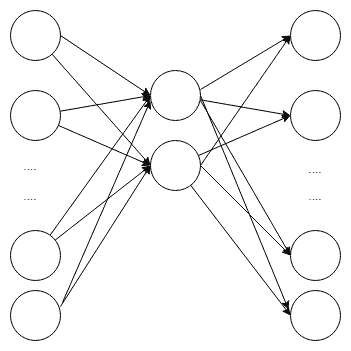
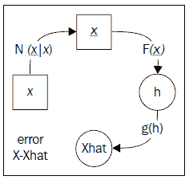
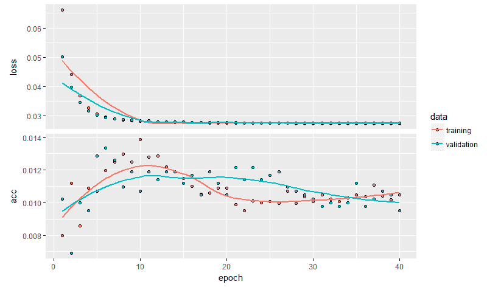
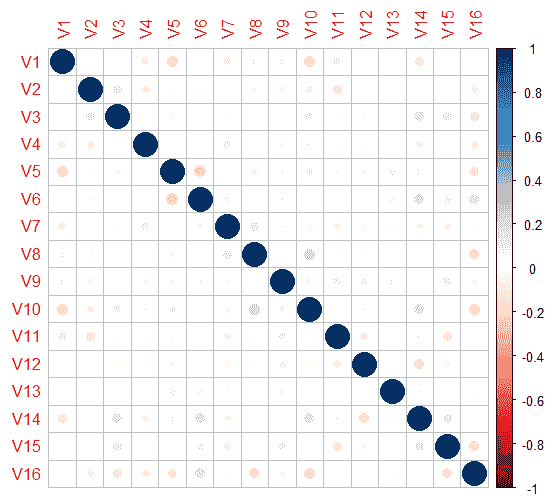
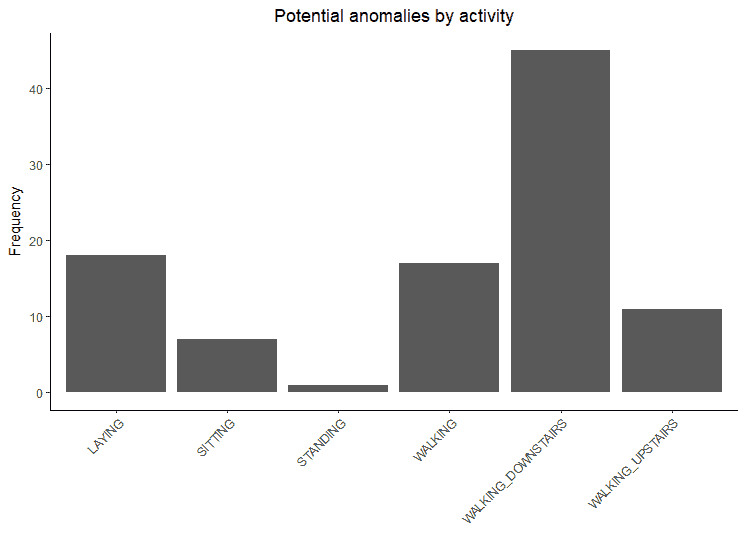

# 九、异常检测和推荐系统

本章将着眼于自编码器模型和推荐系统。尽管这两个用例看起来非常不同，但它们都依赖于找到不同的数据表示。这些表示类似于我们在第七章、*中看到的使用深度学习的自然语言处理*的嵌入。本章的第一部分介绍了无监督学习，其中没有具体的结果可以预测。下一节提供了机器学习和深度神经网络环境中的自编码器模型的概念概述。我们将向您展示如何构建和应用自编码器模型来识别异常数据。这种非典型数据可能是坏数据或异常值，但也可能是需要进一步调查的实例，例如欺诈检测。应用异常检测的一个例子是检测个人的信用卡消费模式何时不同于他们通常的行为。最后，本章以一个用例结束，说明如何使用在第 4 章、*培训深度预测模型*中介绍的零售数据集，为交叉销售和追加销售机会应用推荐系统。

本章将涵盖以下主题:

*   什么是无监督学习？
*   自编码器是如何工作的？
*   在 R 中训练自编码器
*   使用自编码器进行异常检测
*   用例–协作过滤


# 什么是无监督学习？

到目前为止，我们已经关注了广泛属于监督学习范畴的模型和技术。监督学习是监督的，因为任务是让机器学习一组变量或特征与一个或多个结果之间的关系。例如，在第 4 章、*训练深度预测模型*中，我们希望预测某人是否会在未来 14 天内光顾某家商店。在这一章中，我们将深入研究无监督学习的方法。与有监督的学习相反，在有监督的学习中，使用了一个或多个结果变量或标记数据，无监督的学习不使用任何结果或标记数据。无监督学习仅使用输入特征进行学习。无监督学习的一个常见例子是聚类分析，如 k-means 聚类，机器学习数据中隐藏或潜在的聚类，以最小化某个标准(例如，一个聚类内的最小方差)。

另一种无监督学习方法是寻找数据的另一种表示，或者在这个过程中不丢失太多信息的情况下，将输入数据缩减为更小的数据集，这就是所谓的降维。降维的目标是让一组 *p* 特征找到一组潜在变量 *k* ，使得 *k < p* 。但是有了 *k* 潜变量， *p* 原始变量就可以合理重现。我们使用 **p** **主成分分析** ( **PCA** )在来自第 2 章、*的神经网络示例中训练预测模型*。在那个例子中，我们看到在维数和信息损失之间有一个平衡，如图 2.1 所示。主成分分析使用正交变换从原始数据到主成分。除了不相关之外，主成分从解释最大差异的成分到解释最小差异的成分排序。尽管可以使用所有的主成分(在这种情况下，数据的维数没有减少)，但是只包括解释足够大的方差的成分(例如，基于高特征值)，而解释相对小的方差的成分作为噪声或不必要的成分被丢弃。在第 2 章、*中训练预测模型*的神经网络示例中，在消除零方差特征后，我们有 624 个输入。当我们应用 PCA 时，我们发现我们数据的 50%方差(信息)可以用仅仅 23 个主成分来表示。


# 自编码器是如何工作的？

自编码器是一种降维技术。当以这种方式使用它们时，它们在数学上和概念上与其他降维技术(如 PCA)有相似之处。自编码器由两部分组成:一个编码器创建数据的表示，一个解码器试图重现或预测输入。因此，隐藏层和神经元不是输入和其他输出之间的映射，而是自我(自动)编码。给定足够的复杂性，自编码器可以简单地学习身份函数，而隐藏的神经元将精确地反映原始数据，导致没有任何有意义的好处。同样，在主成分分析中，使用所有主成分也没有任何好处。因此，最好的自编码器不一定是最准确的，而是揭示数据中一些有意义的结构或架构的编码器，或者是减少噪声、识别异常值或异常数据的编码器，或者是不一定与模型输入的准确预测直接相关的一些其他有用的副作用的编码器。

比原始数据维度更低的自编码器被称为**欠完成**；通过使用欠完整的自编码器，可以迫使自编码器学习数据的最重要的特征。自编码器的一个常见应用是预先训练深度神经网络或其他监督学习模型。此外，还可以使用隐藏功能本身。我们将在稍后的异常检测中看到这一点。使用欠完整模型是正则化模型的有效方法。然而，只要使用某种其他形式的正则化，也可以训练隐藏维数大于原始数据的过完备自编码器。

自编码器大致分为两部分:

*   首先，一个编码函数， *f()* *，*将原始数据， *x* 编码到隐藏神经元， *H*
*   第二，解码函数 *g()* 将 *H* 解码回 *x*

下图显示了一个欠完整的编码器，其中隐藏层中的节点较少。右侧的输出图层是左侧输入图层的解码版本。隐藏层的任务是存储尽可能多的关于输入层的信息(对输入层进行编码)，以便可以重构(或解码)输入层:



图 9.1:一个自编码器的例子


# 正则化自编码器

欠完整自编码器是正则化自编码器的一种形式，其中正则化通过使用比数据更浅(或以某种其他方式更低)的维度表示来发生。然而，也可以通过其他方式实现正规化。这些是被惩罚的自编码器。


# 惩罚自编码器

正如我们在前面的章节中看到的，防止过度拟合的一种方法是使用惩罚，也就是正则化。一般来说，我们的目标是最小化重建误差。如果我们有一个目标函数， *F* ，我们可以优化 *F(y，f(x))* ，其中 *f()* 对原始数据输入进行编码，以生成预测或预期的 *y* 值。对于自编码器，我们有 *F(x，g(F(x)))】*，以便机器学习 *f()* 和 *g()* 的权重和函数形式，以最小化 *x* 和 *x* 的重构之间的差异，即 *g(f(x))* 。如果我们想使用一个过完备的自编码器，我们需要引入某种形式的正则化来迫使机器学习一个不简单地反映输入的表示。例如，我们可能会添加一个基于复杂性的惩罚函数，这样我们就不会优化 *F(x，g(f(x)))* ，而是优化 *F(x，g(f(x))) + P(f(x))* ，其中惩罚函数 *P* 取决于编码或原始输入 *f()* 。

这种惩罚与我们之前看到的有所不同，因为惩罚被设计成引起稀疏，不是参数的稀疏，而是潜在变量的稀疏，潜在变量是原始数据的编码表示。我们的目标是学习一种潜在的表示法，它能捕捉数据的基本特征。

可用于提供正则化的另一种类型的惩罚是基于导数的惩罚。鉴于稀疏自编码器具有导致潜在变量稀疏的惩罚，惩罚导数导致模型学习一种形式的 *f()* ，其对原始输入数据的微小扰动 *x* 相对不敏感。我们这样说的意思是，它对编码因 *x* 的变化而变化很大的函数施加了惩罚，更喜欢梯度相对平坦的区域。


# 去噪自编码器

去噪自编码器去除噪声或去噪数据，并且是用于学习原始数据的潜在表示的有用技术( *Vincent，p .、Larochelle，h .、Bengio，y .和 Manzagol，P. A. (2008 年 7 月)；纽约州本吉奥、库维尔和文森特(2013 年)*。我们说过自编码器的一般任务是优化: *F(x，g(f(x)))* 。然而，对于去噪自编码器，任务是从 *x* 的噪声或损坏版本中恢复 *x* 。去噪自编码器的一个应用是恢复可能模糊或损坏的旧图像。

尽管去噪自编码器被用于尝试从被破坏的数据或带有噪声的数据中恢复真实的表示，但是该技术也可以被用作正则化工具。作为一种规则化的方法，原始数据被有目的地破坏，而不是具有噪声或被破坏的数据并试图恢复真相。这迫使自编码器不仅仅学习相同函数，因为原始输入不再与输出相同。这个过程如下图所示:



图 9.2:去噪自编码器

剩下的选择就是函数 *N()* 应该是什么，它增加了噪声或者破坏了 *x* 。两种选择是通过随机过程添加噪声，或者对于任何给定的训练迭代，仅包括原始 *x* 输入的子集。在下一节中，我们将探索如何在 r 中实际训练自编码器模型。


# 在 R 中训练自编码器

在这一节中，我们将训练一个 R 语言的自编码器，并向您展示它可以作为一种降维技术。我们将把它与我们在第 2 章、*中采用的方法进行比较，训练预测模型*，其中我们使用 PCA 找到图像数据中的主要成分。在那个例子中，我们使用了主成分分析，发现 23 个因素足以解释数据中 50%的方差。我们建立了一个神经网络模型，仅使用这 23 个因素来对带有 *5* 或 *6* 的数据集进行分类。在这个例子中，我们得到了 97.86%的准确率。

在本例中，我们将遵循类似的过程，我们将再次使用`MINST`数据集。下面来自`Chapter8/encoder.R`的代码加载数据。我们将使用一半的数据来训练一个自编码器，另一半将用于建立一个分类模型，以评估自编码器在维度减少方面有多好。代码的第一部分类似于我们在前面的例子中看到的；它加载并标准化数据，使值介于 0.0 和 1.0 之间:

```
library(keras)
library(corrplot)
library(neuralnet)
options(width = 70, digits = 2)
options(scipen=999)
dataDirectory <- "../data"
if (!file.exists(paste(dataDirectory,'/train.csv',sep="")))
{
 link <- 'https://apache-mxnet.s3-accelerate.dualstack.amazonaws.com/R/data/mnist_csv.zip'
 if (!file.exists(paste(dataDirectory,'/mnist_csv.zip',sep="")))
 download.file(link, destfile = paste(dataDirectory,'/mnist_csv.zip',sep=""))
 unzip(paste(dataDirectory,'/mnist_csv.zip',sep=""), exdir = dataDirectory)
 if (file.exists(paste(dataDirectory,'/test.csv',sep="")))
 file.remove(paste(dataDirectory,'/test.csv',sep=""))
}

data <- read.csv("../data/train.csv", header=TRUE)
set.seed(42)
sample<-sample(nrow(data),0.5*nrow(data))
test <- setdiff(seq_len(nrow(data)),sample)
train.x <- data[sample,-1]
test.x <- data[test,-1]
train.y <- data[sample,1]
test.y <- data[test,1]
rm(data)
train.x <- train.x/255
test.x <- test.x/255
train.x <- data.matrix(train.x)
test.x <- data.matrix(test.x)
input_dim <- 28*28 #784
```

现在，我们将继续我们的第一个自编码器。我们将在自编码器中使用`16`隐藏神经元，并使用 tanh 作为激活函数。我们使用 20%的数据作为验证，以提供自编码器如何执行的无偏估计。这是代码。为了保持简洁，我们只显示了输出的一部分:

```
# model 1
inner_layer_dim <- 16
input_layer <- layer_input(shape=c(input_dim))
encoder <- layer_dense(units=inner_layer_dim, activation='tanh')(input_layer)
decoder <- layer_dense(units=784)(encoder)
autoencoder <- keras_model(inputs=input_layer, outputs = decoder)
autoencoder %>% compile(optimizer='adam', loss='mean_squared_error',metrics='accuracy')
history <- autoencoder %>% fit(train.x,train.x,
 epochs=40, batch_size=128,validation_split=0.2)

Train on 16800 samples, validate on 4200 samples
Epoch 1/40
16800/16800 [==============================] - 1s 36us/step - loss: 0.0683 - acc: 0.0065 - val_loss: 0.0536 - val_acc: 0.0052
Epoch 2/40
16800/16800 [==============================] - 1s 30us/step - loss: 0.0457 - acc: 0.0082 - val_loss: 0.0400 - val_acc: 0.0081
Epoch 3/40
16800/16800 [==============================] - 0s 29us/step - loss: 0.0367 - acc: 0.0101 - val_loss: 0.0344 - val_acc: 0.0121
...
...
Epoch 38/40
16800/16800 [==============================] - 0s 29us/step - loss: 0.0274 - acc: 0.0107 - val_loss: 0.0275 - val_acc: 0.0098
Epoch 39/40
```

```
16800/16800 [==============================] - 1s 31us/step - loss: 0.0274 - acc: 0.0111 - val_loss: 0.0275 - val_acc: 0.0093
Epoch 40/40
16800/16800 [==============================] - 1s 32us/step - loss: 0.0274 - acc: 0.0120 - val_loss: 0.0275 - val_acc: 0.0095
```

验证损失为`0.0275`，说明模型表现相当不错。另一个很好的特性是，如果您在 RStudio 中运行代码，它会以图形的形式显示训练指标，这些指标会随着模型的训练而自动更新。如下图所示:


图 9.3:在 RStudio 的查看器窗格中显示的模型指标

一旦模型完成了训练，您还可以使用下面的代码绘制模型架构和模型度量(输出也包括在内)。通过调用绘图函数，您可以看到训练数据集和验证数据集的准确性和损失图:

```
summary(autoencoder)
______________________________________________________________________
Layer (type)               Output Shape                 Param # 
======================================================================
input_1 (InputLayer)       (None, 784)                  0 
______________________________________________________________________
dense_1 (Dense)            (None, 16)                   12560 
______________________________________________________________________
dense_2 (Dense)            (None, 784)                  13328 
======================================================================
Total params: 25,888
Trainable params: 25,888
Non-trainable params: 0
______________________________________________________________________

plot(history)
```

这段代码产生了下面的图:



图 9.4:自编码器模型度量

前面的图显示验证精度相对稳定，但它可能在第 20 个时期后达到峰值。我们现在将在下面的代码中训练带有`32`隐藏节点的第二个模型:

```
# model 2
inner_layer_dim <- 32
input_layer <- layer_input(shape=c(input_dim))
encoder <- layer_dense(units=inner_layer_dim, activation='tanh')(input_layer)
decoder <- layer_dense(units=784)(encoder)
autoencoder <- keras_model(inputs=input_layer, outputs = decoder)
autoencoder %>% compile(optimizer='adam',
 loss='mean_squared_error',metrics='accuracy')
history <- autoencoder %>% fit(train.x,train.x,
 epochs=40, batch_size=128,validation_split=0.2)

Train on 16800 samples, validate on 4200 samples
Epoch 1/40
16800/16800 [==============================] - 1s 41us/step - loss: 0.0591 - acc: 0.0104 - val_loss: 0.0406 - val_acc: 0.0131
Epoch 2/40
16800/16800 [==============================] - 1s 34us/step - loss: 0.0339 - acc: 0.0111 - val_loss: 0.0291 - val_acc: 0.0093
Epoch 3/40
16800/16800 [==============================] - 1s 33us/step - loss: 0.0262 - acc: 0.0108 - val_loss: 0.0239 - val_acc: 0.0100
...
...
Epoch 38/40
16800/16800 [==============================] - 1s 33us/step - loss: 0.0174 - acc: 0.0130 - val_loss: 0.0175 - val_acc: 0.0095
Epoch 39/40
16800/16800 [==============================] - 1s 31us/step - loss: 0.0174 - acc: 0.0132 - val_loss: 0.0175 - val_acc: 0.0098
Epoch 40/40
16800/16800 [==============================] - 1s 34us/step - loss: 0.0174 - acc: 0.0126 - val_loss: 0.0175 - val_acc: 0.0100
```

我们的验证损失提高到了`0.0175`，所以让我们试试`64`隐藏节点:

```
# model 3
inner_layer_dim <- 64
input_layer <- layer_input(shape=c(input_dim))
encoder <- layer_dense(units=inner_layer_dim, activation='tanh')(input_layer)
decoder <- layer_dense(units=784)(encoder)
autoencoder <- keras_model(inputs=input_layer, outputs = decoder)
autoencoder %>% compile(optimizer='adam',
 loss='mean_squared_error',metrics='accuracy')
history <- autoencoder %>% fit(train.x,train.x,
 epochs=40, batch_size=128,validation_split=0.2)

Train on 16800 samples, validate on 4200 samples
Epoch 1/40
16800/16800 [==============================] - 1s 50us/step - loss: 0.0505 - acc: 0.0085 - val_loss: 0.0300 - val_acc: 0.0138
Epoch 2/40
16800/16800 [==============================] - 1s 39us/step - loss: 0.0239 - acc: 0.0110 - val_loss: 0.0197 - val_acc: 0.0090
Epoch 3/40
16800/16800 [==============================] - 1s 41us/step - loss: 0.0173 - acc: 0.0115 - val_loss: 0.0156 - val_acc: 0.0117
...
...
Epoch 38/40
16800/16800 [==============================] - 1s 41us/step - loss: 0.0094 - acc: 0.0124 - val_loss: 0.0096 - val_acc: 0.0131
Epoch 39/40
16800/16800 [==============================] - 1s 39us/step - loss: 0.0095 - acc: 0.0128 - val_loss: 0.0095 - val_acc: 0.0121
Epoch 40/40
16800/16800 [==============================] - 1s 37us/step - loss: 0.0094 - acc: 0.0126 - val_loss: 0.0098 - val_acc: 0.0133
```

我们在这里的验证损失是`0.0098`，这也是一个改进。我们可能已经到了添加更多隐藏节点将导致模型过度拟合的阶段，因为我们只使用`16800`行来训练自编码器。我们可以考虑应用正则化，但是因为我们的第一个模型有`0.01`的精确度，我们做得足够好了。


# 访问自编码器模型的功能

我们可以从模型中提取深层特征，即模型中隐藏神经元的值。为此，我们将使用具有 16 个隐藏节点的模型。我们将使用`ggplot2`包检查相关性的分布，如下面的代码所示。结果如*图 9.5* 所示。深度特征相关性小，即通常绝对值为 *< .20* 。这就是我们所期望的，以便自编码器工作。这意味着特征之间不应重复信息:

```
encoder <- keras_model(inputs=input_layer, outputs=encoder)
encodings <- encoder %>% predict(test.x)
encodings<-as.data.frame(encodings)
M <- cor(encodings)
corrplot(M, method = "circle", sig.level = 0.1)
```

前面的代码生成了以下图形:



图 9.5:自编码器隐藏层中权重之间的相关性

在第二章、*训练一个预测模型*中，我们使用 PCA 进行降维，发现对于一个分辨 5 和 6 的二分类任务，即使我们只使用 23 个特征作为输入，我们仍然可以获得 97.86%的准确率。这 23 个特征是 23 个**主成分**，占我们数据集中方差的 50%。我们将使用自编码器中的权重来执行相同的实验。请注意，我们使用 50%的数据训练自编码器，并且我们将另外 50%的数据用于二进制分类任务，也就是说，我们不想尝试在用于构建自编码器的数据上构建分类任务:

```
encodings$y <- test.y
encodings <- encodings[encodings$y==5 | encodings$y==6,]
encodings[encodings$y==5,]$y <- 0
encodings[encodings$y==6,]$y <- 1
table(encodings$y)
   0    1 
1852 2075 
nobs <- nrow(encodings)
train <- sample(nobs, 0.9*nobs)
test <- setdiff(seq_len(nobs), train)
trainData <- encodings[train,]
testData <- encodings[test,]
col_names <- names(trainData)
f <- as.formula(paste("y ~", paste(col_names[!col_names %in%"y"],collapse="+")))
nn <- neuralnet(f,data=trainData,hidden=c(4,2),linear.output = FALSE)
preds_nn <- compute(nn,testData[,1:(-1+ncol(testData))])
preds_nn <- ifelse(preds_nn$net.result > 0.5, "1", "0")
t<-table(testData$y, preds_nn,dnn=c("Actual", "Predicted"))
acc<-round(100.0*sum(diag(t))/sum(t),2)
print(t)
      Predicted
Actual 0 1
     0 182 5
     1 3 203
print(sprintf(" accuracy = %1.2f%%",acc))
[1] " accuracy = 97.96%"
```

我们的模型获得了`97.96%`精度，这比我们在第 2 章、*训练预测模型*中获得的`97.86%`精度略有提高。这两个模型非常相似并不奇怪，因为 PCA 的数学基础涉及矩阵分解，而自编码器使用反向传播来设置隐藏层的矩阵权重。事实上，如果我们放弃非线性激活函数，我们的编码将非常类似于 PCA。这表明自编码器模型可以有效地用作降维技术。


# 使用自编码器进行异常检测

现在我们已经构建了一个自编码器并访问了内层的特性，我们将继续讨论自编码器如何用于异常检测的示例。这里的前提非常简单:我们从解码器获取重建的输出，并查看哪些实例具有最大的误差，也就是说，哪些实例对于解码器来说是最难重建的。这里使用的代码在`Chapter9/anomaly.R`中，我们将使用已经在第 2 章、*中介绍过的`UCI HAR`数据集训练预测模型*。如果您还没有下载数据，请返回到该章，查看如何下载的说明..代码的第一部分加载数据，我们对特征进行子集划分，仅使用特征名称中具有均值、标准差和偏斜度的特征:

```
library(keras)
library(ggplot2)
train.x <- read.table("UCI HAR Dataset/train/X_train.txt")
train.y <- read.table("UCI HAR Dataset/train/y_train.txt")[[1]]
test.x <- read.table("UCI HAR Dataset/test/X_test.txt")
test.y <- read.table("UCI HAR Dataset/test/y_test.txt")[[1]]

use.labels <- read.table("UCI HAR Dataset/activity_labels.txt")
colnames(use.labels) <-c("y","label")

features <- read.table("UCI HAR Dataset/features.txt")
meanSD <- grep("mean\\(\\)|std\\(\\)|max\\(\\)|min\\(\\)|skewness\\(\\)", features[, 2])

train.x <- data.matrix(train.x[,meanSD])
test.x <- data.matrix(test.x[,meanSD])
input_dim <- ncol(train.x)
```

现在，我们可以建立我们的自编码器模型。这将是一个堆叠式自编码器，具有两个`40`神经元隐藏编码器层和两个 40 神经元隐藏解码器层。为简明起见，我们删除了一些输出:

```
# model
inner_layer_dim <- 40
input_layer <- layer_input(shape=c(input_dim))
encoder <- layer_dense(units=inner_layer_dim, activation='tanh')(input_layer)
encoder <- layer_dense(units=inner_layer_dim, activation='tanh')(encoder)
decoder <- layer_dense(units=inner_layer_dim)(encoder)
decoder <- layer_dense(units=inner_layer_dim)(decoder)
decoder <- layer_dense(units=input_dim)(decoder)

autoencoder <- keras_model(inputs=input_layer, outputs = decoder)
autoencoder %>% compile(optimizer='adam',
 loss='mean_squared_error',metrics='accuracy')
history <- autoencoder %>% fit(train.x,train.x,
 epochs=30, batch_size=128,validation_split=0.2)
Train on 5881 samples, validate on 1471 samples
Epoch 1/30
5881/5881 [==============================] - 1s 95us/step - loss: 0.2342 - acc: 0.1047 - val_loss: 0.0500 - val_acc: 0.1013
Epoch 2/30
5881/5881 [==============================] - 0s 53us/step - loss: 0.0447 - acc: 0.2151 - val_loss: 0.0324 - val_acc: 0.2536
Epoch 3/30
5881/5881 [==============================] - 0s 44us/step - loss: 0.0324 - acc: 0.2772 - val_loss: 0.0261 - val_acc: 0.3413
...
...

Epoch 27/30
5881/5881 [==============================] - 0s 45us/step - loss: 0.0098 - acc: 0.2935 - val_loss: 0.0094 - val_acc: 0.3379
Epoch 28/30
5881/5881 [==============================] - 0s 44us/step - loss: 0.0096 - acc: 0.2908 - val_loss: 0.0092 - val_acc: 0.3215
Epoch 29/30
5881/5881 [==============================] - 0s 44us/step - loss: 0.0094 - acc: 0.2984 - val_loss: 0.0090 - val_acc: 0.3209
Epoch 30/30
5881/5881 [==============================] - 0s 44us/step - loss: 0.0092 - acc: 0.2955 - val_loss: 0.0088 - val_acc: 0.3209

```

我们可以通过调用 summary 函数来查看模型的层数和参数数量，如下所示:

```
summary(autoencoder)
_______________________________________________________________________
Layer (type)                 Output Shape                           Param # 
=======================================================================
input_4 (InputLayer)         (None, 145)                            0 
_______________________________________________________________________
dense_16 (Dense)             (None, 40)                             5840 
_______________________________________________________________________
dense_17 (Dense)             (None, 40)                             1640 
_______________________________________________________________________
dense_18 (Dense)             (None, 40)                             1640 
_______________________________________________________________________
dense_19 (Dense)             (None, 40)                             1640 
_______________________________________________________________________
dense_20 (Dense)             (None, 145)                            5945 
=======================================================================
Total params: 16,705
Trainable params: 16,705
Non-trainable params: 0
_______________________________________________________________________
```

我们的验证损失是`0.0088`，这意味着我们的模型擅长对数据进行编码。现在，我们将在自编码器上使用测试集，并获得重建的数据。这将创建一个与测试集大小相同的数据集。然后，我们将选择预测值和测试集之间的误差平方和(se)大于 4 的任何实例。

这些是自编码器在重建中遇到最大困难的情况，因此它们是潜在的异常。极限值 4 是超参数；如果设置得较高，则检测到的潜在异常较少，如果设置得较低，则检测到的潜在异常较多。根据所使用的数据集，该值会有所不同。

该数据集中有 6 个类。我们想要分析这些异常是分布在我们所有的类中，还是特定于某些类。我们将打印出测试集中类的频率表，我们将看到类的分布相当均匀。当打印出我们的潜在异常类别的频率表时，我们可以看到大多数都属于`WALKING_DOWNSTAIRS`类。潜在异常如图 9.6 中*所示*

我们可以用下面的代码来绘制它:



```
# anomaly detection
preds <- autoencoder %>% predict(test.x)
preds <- as.data.frame(preds)
limit <- 4
preds$se_test <- apply((test.x - preds)^2, 1, sum)
preds$y_preds <- ifelse(preds$se_test>limit,1,0)
preds$y <- test.y
preds <- merge(preds,use.labels)
table(preds$label)
LAYING SITTING STANDING WALKING WALKING_DOWNSTAIRS WALKING_UPSTAIRS 
   537     491      532     496                420              471 

table(preds[preds$y_preds==1,]$label)
LAYING SITTING STANDING WALKING WALKING_DOWNSTAIRS WALKING_UPSTAIRS 
    18       7        1      17                 45               11 
```

图 9.6:异常的分布

```
ggplot(as.data.frame(table(preds[preds$y_preds==1,]$label)),aes(Var1, Freq)) +
 ggtitle("Potential anomalies by activity") +
 geom_bar(stat = "identity") +
 xlab("") + ylab("Frequency") +
 theme_classic() +
 theme(plot.title = element_text(hjust = 0.5)) +
 theme(axis.text.x = element_text(angle = 45, hjust = 1, vjust = 1))
```

在这个例子中，我们使用了深度自编码器模型来学习智能手机的活动测量数据的特征。这种工作对于排除未知或不寻常的活动是有用的，而不是对它们进行错误的分类。例如，作为一个对你参加了多少分钟的活动进行分类的应用程序的一部分，如果模型不确定或隐藏的功能不能充分重建输入，那么简单地删除几分钟可能会更好，而不是在实际下楼时异常地调用一个活动行走或坐着。

这样的工作也有助于识别模型在哪里有更多的问题。也许需要更多的传感器和额外的数据来表示下楼，或者可以做更多的工作来理解为什么下楼往往会产生相对较高的错误率。

这些深度自编码器在识别异常很重要的其他环境中也很有用，例如金融数据或信用卡使用模式。异常的消费模式可能意味着欺诈或信用卡被盗。人们可以训练一个自编码器模型，并使用它来识别异常情况以进行进一步调查，而不是试图手动搜索数百万笔信用卡交易。

用例–协作过滤

这个用例是关于协同过滤的。我们将基于从深度学习模型创建的嵌入来构建推荐系统。为此，我们将使用我们在第 4 章*中使用的同一数据集来训练深度预测模型*，它是零售交易数据库。如果您还没有下载数据库，那么请转到下面的链接，[https://www.dunnhumby.com/sourcefiles](https://www.dunnhumby.com/sourcefiles)，并选择*让我们得到真实的排序*。选择最小数据集的选项，标题为*5000 名随机抽样客户的所有交易*。阅读完条款和条件并将数据集下载到计算机后，将其解压缩到 code 文件夹下名为`dunnhumby/in`的目录中。确保文件直接解压缩到该文件夹下，而不是子目录下，因为您可能需要在解压缩数据后复制它们。


# 该数据包含由购物篮 id 链接的零售交易的详细信息。每笔交易都有日期和商店代码，有些还与客户相关联。以下是我们将在此分析中使用的字段:

**字段名**

**描述**

| **格式** | `CUST_CODE` | 客户代码。这将交易/访问与客户联系起来。 |
| 茶 | `SPEND` | 与所购物品相关的支出。 |
| 数字的 | `PROD_CODE` | 产品代码。 |
| 茶 | `PROD_CODE_10` | 产品层次结构 10 级代码。 |
| 茶 | `PROD_CODE_20` | 产品层次结构第 20 层代码。 |
| 茶 | `PROD_CODE_30` | 产品层次结构第 30 层代码。 |
| 茶 | `PROD_CODE_40` | 产品层次结构级别 40 代码。 |
| 茶 | 如果你想要更多关于文件结构的细节，你可以回过头来重新阅读第四章、*训练深度预测模型*中的用例。我们将使用这个数据集来创建一个推荐引擎。有一个名为**购物篮分析**的机器学习算法家族可以用于交易数据，但这个用例是基于协同过滤的。协同过滤是基于人们对产品的评价的推荐。它们通常用于音乐和电影推荐，人们通常在 1-5 的范围内对项目进行评级。也许最著名的推荐系统是网飞，因为有了网飞奖([https://en.wikipedia.org/wiki/Netflix_Prize](https://en.wikipedia.org/wiki/Netflix_Prize))。 | Char |

我们将使用我们的数据集来创建客户*对一件商品的评价*的隐含排名。如果您不熟悉隐式排名，那么它们是从数据中导出的排名，而不是由用户显式指定的。我们将使用产品代码之一`PROD_CODE_40`，并计算该产品代码的支出分位数。分位数会将字段分成 5 个大小大致相等的组。我们将根据每个客户在该产品代码上的花费，使用这些来为该产品分配一个评级。前 20%的客户将获得 5 分，接下来的 20%将获得 4 分，以此类推。现有的每个客户/产品代码组合将有一个从 1 到 5 的评级:

在零售忠诚度系统中使用分位数有着悠久的历史。零售忠诚度数据的最早细分方法之一叫做 **RFM 分析**。RFM 是近期、频率和货币支出的首字母缩写。它在这些类别中给每个客户 1(最低)–5(最高)的等级，每个等级中的客户数量相等。对于*最近度*，最近访问的 20%的客户将被给予 5 分，接下来的 20%将被给予 4 分，以此类推。对于*频率*，交易量最大的前 20%的客户将获得 5 分，接下来的 20%将获得 4 分，依此类推。类似地，对于*货币*支出，收入最高的 20%的客户将获得 5 分，接下来的 20%将获得 4 分，依此类推。然后，这些数字将被连接起来，因此，RFM 为 453 的客户，其新近度为 4，频率为 5，货币支出为 3。一旦计算出分数，它就可以用于许多目的，例如交叉销售、客户流失分析等等。RFM 分析在 20 世纪 90 年代末和 21 世纪初非常受许多营销经理的欢迎，因为它易于实施和理解。然而，它并不灵活，正在被机器学习技术所取代。

准备数据

创建我们评级的代码在`Chapter9/create_recommend.R`中。代码的第一部分贯穿原始交易数据。数据在单独的 CSV 文件中，因此它处理每个文件，选择有客户链接(即`CUST_CODE!=""`)的记录，然后按`CUST_CODE`和`PROD_CODE_40`对销售额进行分组。然后，它将结果附加到一个临时文件中，并继续处理下一个输入文件:

本节根据`117`输入文件的客户和产品代码分组。在处理每个文件时，我们将客户代码重命名为`cust_id`，将产品部门代码重命名为`prod_id`。一旦我们完成了，合并后的文件显然会有重复的客户-产品代码组合；也就是说，我们需要对组合数据再次分组。为此，我们打开临时文件，再次对字段进行分组:


# 我们可以尝试加载所有的事务性数据，并对这些数据运行一个组，但是这样会占用大量内存，计算量也很大。通过分两步运行它，我们减少了每个阶段需要处理的数据量，这意味着它更有可能在内存有限的机器上运行。

一旦我们有了每个客户和产品部门代码组合的总支出，我们就可以创建评级。多亏了优秀的`tidyr`包，只需要几行就可以给每一行分配一个等级。首先，我们按`prod_id`字段分组，并使用 quantile 函数返回每个产品代码的销售分位数。这些分位数将返回销售范围，这些销售范围对应于将客户分成大小相等的`5`组。然后，我们使用这些分位数来分配排名:

```
library(magrittr)
library(dplyr)
library(readr)
library(broom)

set.seed(42)
file_list <- list.files("../dunnhumby/in/", "trans*")
temp_file <- "../dunnhumby/temp.csv"
out_file <- "../dunnhumby/recommend.csv"
if (file.exists(temp_file)) file.remove(temp_file)
if (file.exists(out_file)) file.remove(out_file)
options(readr.show_progress=FALSE)

i <- 1
for (file_name in file_list)
{
  file_name<-paste("../dunnhumby/in/",file_name,sep="")
  df<-suppressMessages(read_csv(file_name))

  df2 <- df %>%
    filter(CUST_CODE!="") %>%
    group_by(CUST_CODE,PROD_CODE_40) %>%
    summarise(sales=sum(SPEND))

  colnames(df2)<-c("cust_id","prod_id","sales")
  if (i ==1)
    write_csv(df2,temp_file)
  else
    write_csv(df2,temp_file,append=TRUE)
  print (paste("File",i,"/",length(file_list),"processed"))
  i <- i+1
}
[1] "File 1 / 117 processed"
[1] "File 2 / 117 processed"
[1] "File 3 / 117 processed"
...
...
...
[1] "File 115 / 117 processed"
[1] "File 116 / 117 processed"
[1] "File 117 / 117 processed"
rm(df,df2)
```

剩下的唯一事情就是保存结果。在此之前，我们做了一些健全性检查，以确保我们的评级在 1-5 之间均匀分布。然后，我们随机选择一个产品代码，并检查我们对这些产品的评分是否均匀分布，从 1 到 5:

```
df_processed<-read_csv(temp_file)
if (file.exists(temp_file)) file.remove(temp_file)

df2 <- df_processed %>%
 group_by(cust_id,prod_id) %>%
 summarise(sales=sum(sales))
```

这里一切看起来都很好:对于评级`2`到`5`来说，`rating=1`的计数在`68246`比`62162`到`63682`更高，但这并不是一个真正的问题，因为协同过滤模型并不期望评级的均匀分布。对于单个项目(`D00008`)，每个等级的分布在`596`或`597`处是均匀的。

构建协同过滤模型

```
# create quantiles
dfProds <- df2 %>%
 group_by(prod_id) %>%
 do( tidy(t(quantile(.$sales, probs = seq(0, 1, 0.2)))) )
colnames(dfProds)<-c("prod_id","X0","X20","X40","X60","X80","X100")
df2<-merge(df2,dfProds)
df2$rating<-0
df2[df2$sales<=df2$X20,"rating"] <- 1
df2[(df2$sales>df2$X20) & (df2$sales<=df2$X40),"rating"] <- 2
df2[(df2$sales>df2$X40) & (df2$sales<=df2$X60),"rating"] <- 3
df2[(df2$sales>df2$X60) & (df2$sales<=df2$X80),"rating"] <- 4
df2[(df2$sales>df2$X80) & (df2$sales<=df2$X100),"rating"] <- 5
```

在我们开始应用深度学习模型之前，我们应该遵循我们在前面章节中所做的相同实践，并使用标准的机器学习算法创建一个基准准确度分数。它快速、简单，并且会给我们信心，我们的深度学习模型比仅仅使用普通的机器学习更好。以下是在 r 中进行协同过滤的 20 行代码。这些代码可以在`Chapter8/ml_recommend.R`中找到:

```
# sanity check, are our ratings spread out relatively evenly
df2 %>%
  group_by(rating) %>%
  summarise(recs=n())
  rating  recs
1      1 68246
2      2 62592
3      3 62162
4      4 63488
5      5 63682
df2 %>%
  filter(prod_id==df2[sample(1:nrow(df2), 1),]$prod_id) %>%
  group_by(prod_id,rating) %>%
  summarise(recs=n())
  prod_id rating recs
1 D00008       1  597
2 D00008       2  596
3 D00008       3  596
4 D00008       4  596
5 D00008       5  596

df2 <- df2[,c("cust_id","prod_id","rating")]
write_csv(df2,out_file)
```

这段代码创建了一个协同过滤模型，模型的 MSE 是`0.9748`。像以前一样，我们这样做是因为这个样本的大部分工作是在数据准备而不是模型建立中，所以使用基本的机器学习算法来比较深度学习模型的性能相对容易。这里的代码使用标准的 R 库来创建一个推荐系统，正如您所看到的，这相对简单，因为数据已经是预期的格式了。如果你想了解更多关于这种协同过滤算法的信息，可以搜索`user based collaborative filtering in r`，或者浏览文档页面。


# 现在让我们专注于创建深度学习模型。

构建深度学习协同过滤模型

```
library(readr)
library(recommenderlab)
library(reshape2)

set.seed(42)
in_file <- "../dunnhumby/recommend.csv"
df <- read_csv(in_file)
dfPivot <-dcast(df, cust_id ~ prod_id)
m <- as.matrix(dfPivot[,2:ncol(dfPivot)])

recommend <- as(m,"realRatingMatrix")
e <- evaluationScheme(recommend,method="split",
 train=0.9,given=-1, goodRating=5)
e
Evaluation scheme using all-but-1 items
Method: ‘split’ with 1 run(s).
Training set proportion: 0.900
Good ratings: >=5.000000
Data set: 5000 x 9 rating matrix of class ‘realRatingMatrix’ with 25688 ratings.

r1 <- Recommender(getData(e,"train"),"UBCF")
r1
Recommender of type ‘UBCF’ for ‘realRatingMatrix’ 
learned using 4500 users.

p1 <- predict(r1,getData(e,"known"),type="ratings")
err1<-calcPredictionAccuracy(p1,getData(e,"unknown"))
print(sprintf(" User based collaborative filtering model MSE = %1.4f",err1[2]))
[1] " User based collaborative filtering model MSE = 0.9748"
```

在这里，我们将看看我们是否可以建立一个深度学习模型来击败之前的方法！以下代码在`Chapter9/keras_recommend.R`中。第一部分加载数据集，并为客户和产品代码创建新的 id。这是因为 Keras 希望索引是连续的，从零开始，并且是唯一的:

我们有 5000 个独特的客户和 9 个独特的产品代码。这不是大多数协同过滤示例的典型情况；通常情况下，产品数量远远高于客户数量。下一部分创建模型。我们将为客户和产品创建嵌入层，然后计算这些嵌入层的点积。嵌入层是数据的低阶表示，与我们之前看到的自编码器示例中的编码器完全相同。我们还将为每个客户和产品提供一个偏差术语，这将对数据进行某种标准化。如果某个产品非常受欢迎，或者某个客户有很多高评价，这就是原因。我们将在客户和产品的嵌入层中使用 10 个因素。我们将在嵌入中使用一些 L2 正则化来防止过度拟合。以下代码定义了模型架构:


# 现在，我们准备好构建模型了。我们将拿出 10%的数据进行验证:

我们的模型获得了`0.9508`的 MSE，这是对我们在机器学习模型上获得的`0.9748`的 MSE 的改进。我们的深度学习模型过度拟合，但其中一个原因是因为我们的数据库相对较小。我尝试增加正则化，但这并没有改善模型。

```
library(readr)
library(keras)

set.seed(42)
use_session_with_seed(42, disable_gpu = FALSE, disable_parallel_cpu = FALSE)

df<-read_csv("recommend.csv")
custs <- as.data.frame(unique(df$cust_id))
custs$cust_id2 <- as.numeric(row.names(custs))
colnames(custs) <- c("cust_id","cust_id2")
custs$cust_id2 <- custs$cust_id2 - 1
prods <- as.data.frame(unique(df$prod_id))
prods$prod_id2 <- as.numeric(row.names(prods))
colnames(prods) <- c("prod_id","prod_id2")
prods$prod_id2 <- prods$prod_id2 - 1
df<-merge(df,custs)
df<-merge(df,prods)
n_custs = length(unique(df$cust_id2))
n_prods = length(unique(df$prod_id2))

# shuffle the data
trainData <- df[sample(nrow(df)),]
```

将深度学习模型应用于业务问题

```
n_factors<-10
# define the model
cust_in <- layer_input(shape = 1)
cust_embed <- layer_embedding(
 input_dim = n_custs 
 ,output_dim = n_factors 
 ,input_length = 1 
 ,embeddings_regularizer=regularizer_l2(0.0001)
 ,name = "cust_embed"
 )(cust_in)
prod_in <- layer_input(shape = 1)
prod_embed <- layer_embedding(
 input_dim = n_prods 
 ,output_dim = n_factors 
 ,input_length = 1
 ,embeddings_regularizer=regularizer_l2(0.0001)
 ,name = "prod_embed"
 )(prod_in)

ub = layer_embedding(
 input_dim = n_custs, 
 output_dim = 1, 
 input_length = 1, 
 name = "custb_embed"
 )(cust_in)
ub_flat <- layer_flatten()(ub)

mb = layer_embedding(
 input_dim = n_prods, 
 output_dim = 1, 
 input_length = 1, 
 name = "prodb_embed"
 )(prod_in)
mb_flat <- layer_flatten()(mb)

cust_flat <- layer_flatten()(cust_embed)
prod_flat <- layer_flatten()(prod_embed)

x <- layer_dot(list(cust_flat, prod_flat), axes = 1)
x <- layer_add(list(x, ub_flat))
x <- layer_add(list(x, mb_flat))
```

既然有了模型，怎么用呢？使用协作过滤模型的最典型的例子是向人们推荐他们还没有评级的项目。这一概念在音乐和电影推荐等经常应用协同过滤模型的领域非常有效。然而，我们将把它用于不同的目的。营销经理关心的一个问题是他们从顾客那里得到的钱包份额。这个(来自 https://en.wikipedia.org/wiki/Share_of_wallet[的)定义是*某个产品的消费者支出(钱包)的百分比(“份额”)给销售该产品的公司*。它基本上是根据客户在我们这里的潜在消费百分比来衡量客户的价值。例如，我们可能有经常光顾我们商店并消费可观的顾客。但是他们从我们这里购买所有的商品吗？也许他们在别的地方买新鲜的食物，也就是说，他们在别的商店买肉、水果、蔬菜等等。我们可以使用协同过滤来查找客户，其中协同过滤模型预测他们在我们的商店中购买了某些产品，但实际上他们并没有购买。请记住，协作过滤的工作基础是根据其他类似客户的做法提出建议。因此，如果顾客 A 不在我们的商店购买肉类、水果、蔬菜等，而其他类似的顾客在我们的商店购买，那么我们可以通过向他们发送这些产品的报价来尝试吸引他们在我们的商店消费更多。](https://en.wikipedia.org/wiki/Share_of_wallet)

```
model <- keras_model(list(cust_in, prod_in), x)
compile(model,optimizer="adam", loss='mse')

model.optimizer.lr=0.001
fit(model,list(trainData$cust_id2,trainData$prod_id2),trainData$rating,
 batch_size=128,epochs=40,validation_split = 0.1 )
Train on 23119 samples, validate on 2569 samples
Epoch 1/40
23119/23119 [==============================] - 1s 31us/step - loss: 10.3551 - val_loss: 9.9817
Epoch 2/40
23119/23119 [==============================] - 0s 21us/step - loss: 8.6549 - val_loss: 7.7826
Epoch 3/40
23119/23119 [==============================] - 0s 20us/step - loss: 6.0651 - val_loss: 5.2164
...
...
...
Epoch 37/40
23119/23119 [==============================] - 0s 19us/step - loss: 0.6674 - val_loss: 0.9575
Epoch 38/40
23119/23119 [==============================] - 0s 18us/step - loss: 0.6486 - val_loss: 0.9555
Epoch 39/40
23119/23119 [==============================] - 0s 19us/step - loss: 0.6271 - val_loss: 0.9547
Epoch 40/40
23119/23119 [==============================] - 0s 20us/step - loss: 0.6023 - val_loss: 0.9508
```

我们将寻找预测值大于 4，但实际值小于 2 的客户-产品部门代码。这些客户应该从我们这里购买这些商品(根据模型)，所以通过向他们发送这些部门的商品代金券，我们可以获得他们更多的消费。


# 协作过滤模型应该很适合这种类型的分析。该算法的基础是根据相似客户的活动来寻找推荐产品，因此它已经根据消费规模进行了调整。例如，如果对一个顾客的预测是他们在新鲜水果和蔬菜上的花费应该是 5，这是基于与其他类似顾客的比较。下面是评测代码，也在`Chapter8/kerarecommend.R`里。代码的第一部分生成预测并将其链接回来。我们输出了一些指标，这些指标看起来令人印象深刻，但请注意，它们是在所有数据上运行的，包括模型被训练的数据，因此这些指标过于乐观。我们对预测进行一次调整——其中一些值大于 5 或小于 1，因此我们将它们改回有效值。这对我们的指标产生了非常小的改进:

现在，我们可以看看预测评级和实际评级之间差异最大的客户产品部门代码:

这为我们提供了一个客户列表，以及我们应该向他们提供的产品。例如，对于第二行，实际评级为`1`，预测评级为`4.306837`。该客户没有购买该产品代码的商品，我们的模型*预测*他应该购买这些商品。

我们还可以看看实际评级远高于预测值的情况。与其他类似客户相比，这些客户在该部门过度消费:

我们能对这些建议做些什么？我们的模型根据客户在每个产品部门的支出分配 1-5 分，因此，如果客户的实际评分高于总体预测值，则与类似客户相比，他们在这些部门的支出过高。这些人很可能没有在其他部门消费，因此应该将他们作为交叉销售活动的一部分；也就是说，应该向他们发送其他部门的产品报价，以吸引他们在那里购买。

```
##### model use-case, find products that customers 'should' be purchasing ######
df$preds<-predict(model,list(df$cust_id2,df$prod_id2))
# remove index variables, do not need them anymore
df$cust_id2 <- NULL
df$prod_id2 <- NULL
mse<-mean((df$rating-df$preds)^2)
rmse<-sqrt(mse)
mae<-mean(abs(df$rating-df$preds))
print (sprintf("DL Collaborative filtering model: MSE=%1.3f, RMSE=%1.3f, MAE=%1.3f",mse,rmse,mae))
[1] "DL Collaborative filtering model: MSE=0.478, RMSE=0.691, MAE=0.501"

df <- df[order(-df$preds),]
head(df)
     prod_id        cust_id rating    preds
10017 D00003 CUST0000283274      5 5.519783
4490  D00002 CUST0000283274      5 5.476133
9060  D00002 CUST0000084449      5 5.452055
6536  D00002 CUST0000848462      5 5.447111
10294 D00003 CUST0000578851      5 5.446453
7318  D00002 CUST0000578851      5 5.442836

df[df$preds>5,]$preds <- 5
df[df$preds<1,]$preds <- 1
mse<-mean((df$rating-df$preds)^2)
rmse<-sqrt(mse)
mae<-mean(abs(df$rating-df$preds))
print (sprintf("DL Collaborative filtering model (adjusted): MSE=%1.3f, RMSE=%1.3f, MAE=%1.3f",mse,rmse,mae))
[1] "DL Collaborative filtering model (adjusted): MSE=0.476, RMSE=0.690, MAE=0.493"
```

摘要

```
df$diff <- df$preds - df$rating
df <- df[order(-df$diff),]
head(df,20)
     prod_id        cust_id rating    preds     diff
3259  D00001 CUST0000375633      1 5.000000 4.000000
12325 D00003 CUST0000038166      1 4.306837 3.306837
14859 D00004 CUST0000817991      1 4.025836 3.025836
15279 D00004 CUST0000620867      1 4.016025 3.016025
22039 D00008 CUST0000588390      1 3.989520 2.989520
3370  D00001 CUST0000530875      1 3.969685 2.969685
22470 D00008 CUST0000209037      1 3.927513 2.927513
22777 D00008 CUST0000873432      1 3.905162 2.905162
13905 D00004 CUST0000456347      1 3.877517 2.877517
18123 D00005 CUST0000026547      1 3.853488 2.853488
24208 D00008 CUST0000732836      1 3.810606 2.810606
22723 D00008 CUST0000872856      1 3.746022 2.746022
22696 D00008 CUST0000549120      1 3.718482 2.718482
15463 D00004 CUST0000035935      1 3.714494 2.714494
24090 D00008 CUST0000643072      1 3.679629 2.679629
21167 D00006 CUST0000454947      1 3.651651 2.651651
23769 D00008 CUST0000314496      1 3.649187 2.649187
14294 D00004 CUST0000127124      1 3.625893 2.625893
22534 D00008 CUST0000556279      1 3.578591 2.578591
22201 D00008 CUST0000453430      1 3.576008 2.576008
```

我希望这一章已经向你展示了深度学习不仅仅是关于计算机视觉和 NLP 问题！在这一章中，我们介绍了使用 Keras 来构建自编码器和推荐系统。我们看到，自编码器可以用作一种降维形式，在只有一层的最简单形式中，它们类似于 PCA。我们使用自编码器模型创建了一个异常检测系统。如果自编码器模型中的重建误差超过阈值，那么我们将该实例标记为潜在异常。本章中我们的第二个主要例子使用 Keras 构建了一个推荐系统。我们从交易数据中构建了一个隐式评级数据集，并构建了一个推荐系统。我们通过向您展示如何将该模型用于交叉销售目的，展示了该模型的实际应用。

在下一章中，我们将研究在云中训练深度学习模型的各种选项。如果您的本地计算机上没有 GPU，AWS、Azure、Google Cloud 和 Paperspace 等云提供商允许您廉价地访问 GPU 实例。我们将在下一章讨论所有这些选项。

```
df <- df[order(df$diff),]
head(df,20)
     prod_id        cust_id rating    preds      diff
21307 D00006 CUST0000555858      5 1.318784 -3.681216
15353 D00004 CUST0000640069      5 1.324661 -3.675339
21114 D00006 CUST0000397007      5 1.729860 -3.270140
23097 D00008 CUST0000388652      5 1.771072 -3.228928
21551 D00006 CUST0000084985      5 1.804969 -3.195031
21649 D00007 CUST0000083736      5 1.979534 -3.020466
23231 D00008 CUST0000917696      5 2.036216 -2.963784
21606 D00007 CUST0000899988      5 2.050258 -2.949742
21134 D00006 CUST0000373894      5 2.071380 -2.928620
14224 D00004 CUST0000541731      5 2.081161 -2.918839
15191 D00004 CUST0000106540      5 2.162569 -2.837431
13976 D00004 CUST0000952727      5 2.174777 -2.825223
21851 D00008 CUST0000077294      5 2.202812 -2.797188
16545 D00004 CUST0000945695      5 2.209504 -2.790496
23941 D00008 CUST0000109728      5 2.224301 -2.775699
24031 D00008 CUST0000701483      5 2.239778 -2.760222
21300 D00006 CUST0000752292      5 2.240073 -2.759927
21467 D00006 CUST0000754753      5 2.240705 -2.759295
15821 D00004 CUST0000006239      5 2.264089 -2.735911
15534 D00004 CUST0000586590      5 2.272885 -2.727115
```

What can we do with these recommendations? Our model assigns a score of 1-5 based on a customers' spend in each product department, so if a customer has a high actual rating compared to the predicted value in general, they are over-spending in these departments compared to similar customers. These people are probably not spending in other departments, so they should be targeted as part of a cross-sell campaign; that is, they should be sent offers for products in other departments to tempt them to purchase there.


# Summary

I hope that this chapter has shown you that deep learning is not just about computer vision and NLP problems! In this chapter, we covered using Keras to build auto-encoders and recommendation systems. We saw that auto-encoders can be used as a form of dimensionality reduction and, in their simplest forms with only one layer, they are similar to PCA. We used an auto-encoder model to create an anomaly detection system. If the reconstruction error in the auto-encoder model was over a threshold, then we marked that instance as a potential anomaly. Our second major example in this chapter built a recommendation system using Keras. We constructed a dataset of implicit ratings from transactional data and built a recommendation system. We demonstrated the practical application of this model by showing you how it could be used for cross-sell purposes.

In the next chapter, we will look at various options for training your deep learning model in the cloud. If you do not have a GPU on your local machine, cloud providers such as AWS, Azure, Google Cloud, and Paperspace allow you to access GPU instances cheaply. We will cover all of these options in the next chapter.