# 十三、智能车辆的交通标志识别

**卷积神经网络**(**CNN**)在计算机视觉中非常有用，我们将把它用于另一个应用，智能车辆的交通标志检测。我们还将在本章中涵盖深度学习的几个重要概念，并将让读者接触到其他流行的深度学习框架和库。

我们继续我们的 R 深度学习之旅，研究自动驾驶汽车的核心问题之一，物体识别，具体来说，就是交通标志分类。为了避免事故和确保安全，鲁棒的交通标志分类对于实现自主驾驶至关重要。我们就从什么是自动驾驶汽车，深度学习应用于哪些方面开始。我们还将讨论深度学习如何脱颖而出，成为智能车辆中物体识别的最先进解决方案。了解背景知识后，我们将开始我们的项目，首先对数据和性能数据预处理进行探索性分析，包括 Y'UV 颜色编码转换。我们将首次尝试在 MXNet 中使用 CNN，并达到 99%以上的准确率。然后我们将转移到另一个强大的深度学习框架，称为 TensorFlow 和一个建立在它之上的 API，称为 Keras。

我们还将引入漏失技术作为一种正则化方法，类似于拉索(L1) /岭(L2)正则化。除了过度拟合，我们将演示如何利用数据扩充技术处理训练数据的缺乏。我们将通过总结防止 CNN 模型过度拟合的方法来结束这一章。我们将再次证明，深度学习模型消除了传统方法中采取的手动或显式特征提取步骤，而是在训练过程中自动发现输入数据下的有用模式。

我们将详细讨论这里提到的主题:

*   什么是自动驾驶汽车
*   深度学习在自动驾驶汽车中是如何应用的
*   深度学习如何成为智能车辆中物体识别的最先进解决方案
*   德国交通标志识别基准数据集数据的探索性分析
*   使用 MXNet 包的卷积神经网络进行交通标志识别
*   喀拉斯和 TensorFlow
*   基于卷积神经网络的交通标志识别
*   通过下降减少过度拟合
*   数据扩充和常用的扩充方法
*   对小型训练集使用数据扩充
*   CNN 模型中防止过拟合的方法综述


# 深度学习在自动驾驶汽车中是如何应用的？

自动驾驶汽车(也称为自主/自动车辆或无人驾驶汽车)是一种机器人车辆，能够在目的地之间行驶并在没有人类干预的情况下导航。为了实现自主，自动驾驶汽车使用雷达、GPS 和计算机视觉等多种技术来检测和解释环境；然后他们计划到达期望目的地的适当导航路径。

更详细地说，以下是自动驾驶汽车的一般工作方式:

*   该软件根据目的地、交通和道路信息规划路线，并启动汽车
*   一个**光探测和测距** ( **激光雷达**)传感器实时捕捉周围环境并创建动态 3D 地图
*   传感器监控横向运动，计算汽车在三维地图上的位置
*   雷达系统利用与其他交通参与者、行人或障碍物的距离信息
*   计算机视觉算法从相机中识别交通标志、交通灯和其他地标，并提供预先通知
*   算法驱动的软件分析所有的传感数据，结合来自其他来源的输入，并控制转向和制动等动作，模拟人类感知周围环境并做出决定的方式


# 深度学习如何成为最先进的解决方案？

正如我们所见，鲁棒的物体识别对于实现驾驶自主至关重要。为了避免事故和确保安全，有必要注意周围的环境、交通标志和灯光。一般来说，自动驾驶汽车中的物体识别可以总结为四项任务:

*   物体检测，如障碍物、行人、交通标志和灯。
*   物体识别和分类。一个例子是标记交通信号灯(红色、黄色、绿色和关闭),如果在正面摄像机捕获的图像中检测到的话。然后，我们将交通参与者分为自行车、摩托车、汽车、卡车和公共汽车，当然还有交通标志的分类(我们本章的主要讨论点)。
*   目标定位，将地面图像映射到航空图像。
*   运动预测，例如，了解物体的速度或根据行人的姿势估计行人的行为和意图。

在过去的二十年里，各种机器学习算法已经被应用于解决智能车辆中的物体识别问题。

例如，在使用运动和外观模式检测行人的*(Viola 等人，发表在国际计算机视觉杂志，63(2))中，使用了**AdaBoost**(**自适应增强**的缩写，它顺序纠正分类错误)分类器来检测行走的行人。*

在*用于人体检测的方向梯度直方图* (Dalal 和 Triggs，2005 年在 IEEE 计算机视觉和模式识别会议(CVPR)上发表)中，使用**方向直方图** ( **HOG** )技术提取有效特征，并送入**支持向量机** ( **SVM** )分类器进行人体检测。从那时起，更复杂的变体，如梯度场 HOG (GF-HOG)和其他更复杂的特征提取方法被开发出来。举几个例子，我们有分区+投影，投影+ HOG 等等。

传统的对象识别方法(显式特征提取+机器学习分类)严重依赖于手工制作的特征，例如具有 HOG 的梯度方向直方图、具有**加速的鲁棒特征的局部关键点** ( **SURF** )或**尺度不变特征变换** ( **SIFT** )。尽管它们在某些任务中表现良好，但设计这些特征描述符是困难的，需要大量的手动调整和实验。

回想一下，在前一章对手写数字进行分类时，我们求助于 CNN。它首先导出低级表示、局部边缘和曲线，然后通过一系列低级表示合成更高级表示，如整体形状和轮廓。我们还得出结论，CNN 非常适合开发强大而独特的功能。

事实上，在许多解决方案中已经证明，CNN 能够有效地自动化特征提取，同时允许性能的显著提升。比如在*无监督多阶段特征学习的行人检测* (Sermanet 等，2013 年发表在 IEEE 关于**计算机视觉和模式识别会议** ( **CVPR** )中，首次将 CNN 引入行人检测问题。在*用于精确对象检测和语义分割的丰富特征层次结构* (Girshick 等人，2014 年在 IEEE 会议上发表)中，提出了一种基于变体区域的 CNN 模型来提高性能。如今，许多最先进的对象识别方法都涉及深度学习技术，特别是 CNN。一个很好的证明就是它们在 http://www.cvlibs.net/datasets/kitti/eval_object.php?自动驾驶汽车 KITTI Vision 基准排行榜上的领先地位 obj_benchmark=2d) 。

我希望所有这些案例都让你对 CNN 及其为智能车辆提供更好的物体识别解决方案的能力感到兴奋。

那么我们还在等什么呢？让我们继续我们的项目，交通标志识别，因为它是自动驾驶汽车中最重要的主题之一！


# 基于 CNN 的交通标志识别

和往常一样，我们从探索**德国交通标志识别基准** ( **GTSRB** )数据集开始，数据集位于[http://benchmark.ini.rub.de/?section=gtsrb&subsection = dataset](http://benchmark.ini.rub.de/?section=gtsrb&subsection=dataset)。


# 开始探索 GTSRB

神经信息研究所实时计算机视觉研究小组编制并大量发布的 GTSRB 数据集最初用于对交通标志的单幅图像进行分类的竞赛。它由 39，209 个标记图像的训练集和 12，630 个未标记图像的测试集组成。训练数据集包含 43 个类别，即 43 种类型的交通标志。我们将浏览所有的课程，并为每个课程展示几个样本。

数据集可以通过[http://benchmark . ini . rub . de/Dataset/gt SRB _ Final _ Training _ images . zip](http://benchmark.ini.rub.de/Dataset/GTSRB_Final_Training_Images.zip)下载(位于页面的下载|训练数据集部分)。解压下载的文件，会出现一个名为`Images`的文件夹，包含 43 个文件夹(`00000`、`00001`...最多`00042`)；它们代表 43 类图像。这些图像的形式如下:

*   图像文件为 **PPM** (便携像素图**的简称**)格式。
*   每个类别的图像数量范围从 210 到 2250。所以是一个不平衡的多类分类问题。
*   每个图像包含一个交通标志。
*   图像的大小不统一，从 15*15 到 250*250 像素不等，图像不一定是正方形。
*   图像在实际标志周围包含高达 10%的边框。因此，标志不一定以图像为中心。

让我们从在`00000`文件夹中绘制一个样本`00000_00002.ppm`开始。

我们使用`pixmap`包([https://cran.r-project.org/web/packages/pixmap](https://cran.r-project.org/web/packages/pixmap))来读取 PPM 文件:

```r
> library('pixmap') 

> image <- read.pnm('GTSRB/Final_Training/Images/00000/00000_00002.ppm',cellres=1) 
```

现在我们获得一个具有属性`red`、`green`和`blue`(这是三个通道中每一个通道的像素)的`pixmapRGB`对象，以及图像的宽度和高度`size`。我们可以访问红色、绿色和蓝色通道，如下所示:

```r
> red_matrix <- matrix(image@red, nrow = image@size[1], ncol = image@size[2]) 

> green_matrix <- matrix(image@green, nrow = image@size[1], ncol = image@size[2]) 

> blue_matrix <- matrix(image@blue, nrow = image@size[1], ncol = image@size[2]) 
```

我们分别可视化原始图像及其三个通道:

```r
> plot(image, main=sprintf("Original")) 

> rotate <- function(x) t(apply(x, 2, rev)) 

> par(mfrow=c(1, 3)) 

> image(rotate(red_matrix), col = grey.colors(255), main=sprintf("Red")) 

> image(rotate(green_matrix), col = grey.colors(255), main=sprintf("Green")) 

> image(rotate(blue_matrix), col = grey.colors(255), main=sprintf("Blue")) 
```

注意，这里我们重用了上一章定义的旋转函数，以便更好地查看图像。这是一幅原始图像:


下图分别显示了红色、蓝色和绿色通道的输出:

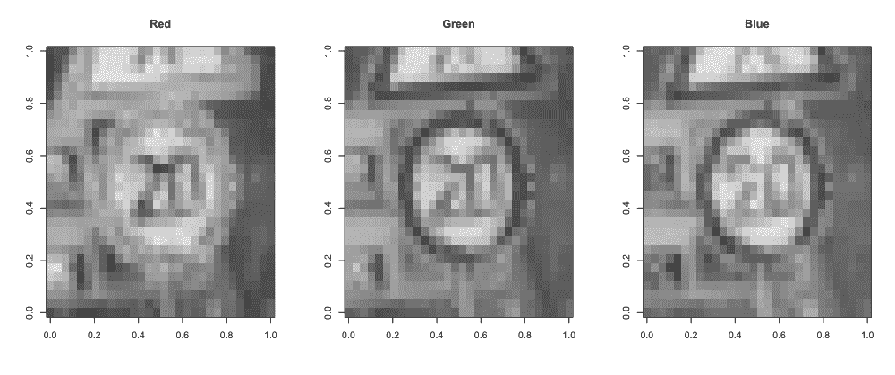

这是一个时速 20 公里的限速标志。

我们现在可以浏览 43 类标志，并通过定义以下函数为每种类型显示三个样本:

```r
> plot_samples <- function(training_path, class, num_sample){ 

+     classes <- c("Speed limit (20km/h)", "Speed limit (30km/h)",  

                   "Speed limit (50km/h)", "Speed limit (60km/h)", 

+                  "Speed limit (70km/h)", "Speed limit (80km/h)",  

                   "End of speed limit (80km/h)", 

+                  "Speed limit (100km/h)", "Speed limit (120km/h)",  

                   "No passing",  

+                  "No passing for vehicles over 3.5 metric tons",  

                   "Right-of-way at the next intersection",  

+                  "Priority road", "Yield", "Stop", "No vehicles",  

                   "Vehicles over 3.5 metric tons prohibited", 

+                  "No entry", "General caution", "Dangerous curve to  

                   the left", "Dangerous curve to the right", 

+                  "Double curve", " Bumpy road", "Slippery road",  

                   "Road narrows on the right", "Road work", 

+                  "Traffic signals", "Pedestrians", "Children  

                   crossing", "Bicycles crossing",  

                   "Beware of ice/snow", 

+                  "Wild animals crossing",  

                   "End of all speed and passing limits",  

                   "Turn right ahead",  

+                  "Turn left ahead", "Ahead only",  

                   "Go straight or right", "Go straight or left",  

                   "Keep right", "Keep left", "Roundabout mandatory",  

                   "End of no passing",  

+                  "End of no passing by vehicles over 3.5 metric  

                    tons") 

+     if (class<10) { 

+       path <- paste(training_path, "0000", class, "/", sep="") 

+     } else { 

+       path <- paste(training_path, "000", class, "/", sep="") 

+     } 

+     par(mfrow=c(1, num_sample)) 

+     # Randomly display num_sample samples 

+     all_files <- list.files(path = path) 

+     title <- paste('Class', class, ':', classes[class+1]) 

+     print(paste(title, "          (", length(all_files),  

                 " samples)", sep="")) 

+     files <- sample(all_files, num_sample) 

+     for (file in files) { 

+       image <- read.pnm(paste(path, file, sep=""), cellres=1) 

+       plot(image) 

+     } 

+     mtext(title, side = 3, line = -23, outer = TRUE) 

+ } 
```

用`class=0`调用函数:

```r
> training_path <- "GTSRB/Final_Training/Images/" 

> plot_samples(training_path, 0, 3) 

[1] "Class 0 : Speed limit (20km/h)          (211 samples)" 
```

显示三个样本:

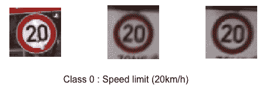

用不同的类重复这个函数调用(或使用循环),遍历剩余的 42 种类型:

```r
> plot_samples(training_path, 1, 3) 

[1] "Class 1 : Speed limit (30km/h)          (2221 samples)" 
```

来自类别 1 的三个样本显示如下:

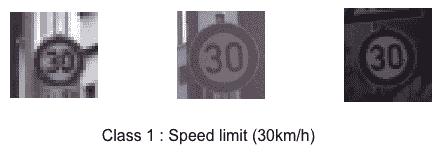

```r
> plot_samples(training_path, 2, 3) 

[1] "Class 2 : Speed limit (50km/h)          (2251 samples)" 
```

此处显示了来自第 2 类的三张图片:


```r
> plot_samples(training_path, 3, 3) 

[1] "Class 3 : Speed limit (60km/h)          (1411 samples)" 
```

这是 3 班的成绩:

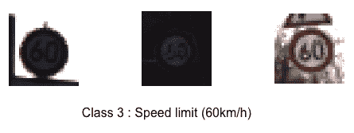

```r
> plot_samples(training_path, 4, 3) 

[1] "Class 4 : Speed limit (70km/h)          (1981 samples)" 
```

我们绘制了来自第 4 类的三幅图像:

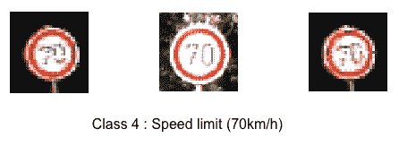

这里我们跳过其余部分，但很明显，这些图像是在各种条件下拍摄的，包括天气、光照、遮挡、旋转等等。相反，为了便于参考，我们列出了所有类型的样本量:

| **ID** | **类型** | **样本数量** |
| 0 | 速度限制(20 公里/小时) | 211 |
| 一 | 速度限制(30 公里/小时) | 2221 |
| 2 | 速度限制(50 公里/小时) | 2251 |
| 3 | 速度限制(60 公里/小时) | 1411 |
| 四 | 速度限制(70 公里/小时) | 1981 |
| 5 | 速度限制(80 公里/小时) | 1861 |
| 6 | 限速终点(80 公里/小时) | 421 |
| 七 | 速度限制(100 公里/小时) | 1441 |
| 8 | 速度限制(120 公里/小时) | 1411 |
| 9 | 禁止通行 | 1471 |
| 10 | 超过 3.5 公吨的车辆不得通过 | 2011 |
| 11 | 下一个十字路口的通行权 | 1321 |
| 12 | 优先道路 | 2101 |
| 13 | 产量 | 2161 |
| 14 | 停止 | 781 |
| 15 | 没有车辆 | 631 |
| 16 | 禁止超过 3.5 公吨的车辆通行 | 421 |
| 17 | 禁止进入 | 1111 |
| 18 | 一般注意事项 | 1201 |
| 19 | 向左的危险曲线 | 211 |
| 20 | 向右的危险曲线 | 361 |
| 21 | 双曲线 | 331 |
| 22 | 坎坷的道路 | 391 |
| 23 | 湿滑的道路 | 511 |
| 24 | 路在右边变窄了 | 271 |
| 25 | 道路工程 | 1501 |
| 26 | 交通信号 | 601 |
| 27 | 行人 | 241 |
| 28 | 儿童穿越 | 541 |
| 29 | 自行车交叉路口 | 271 |
| 30 | 当心冰/雪 | 451 |
| 31 | 野生动物穿越 | 781 |
| 32 | 所有速度和通过限制的终点 | 241 |
| 33 | 前方右转 | 690 |
| 34 | 前方左转 | 421 |
| 35 | 仅限前方 | 1201 |
| 36 | 直走还是右转 | 391 |
| 37 | 直走还是左转 | 211 |
| 38 | 靠右行驶 | 2071 |
| 39 | 靠左 | 301 |
| 40 | 强制环岛 | 361 |
| 41 | 禁止通行的结束 | 241 |
| 42 | 超过 3.5 公吨的车辆不得通过 | 241 |

显然，标志，我们的感兴趣区域 ( **ROI** )并不在图像的中心，不幸的是，图像的大小是变化的。因此，在对数据进行分析和分类之前，我们需要将 ROI 从图像中分离出来，并将其大小标准化(如大多数研究人员所做的那样，将其大小调整为 32*32)。我们求助于随图像一起提供的注释。每个类文件夹包含一个注释文件，例如位于`00000`的`GT-00000.csv`。每个注释文件包含以下有用的字段:

*   `Filename`:图像的文件名
*   `ROI.X1`:ROI 边界框左上角的 *x* 坐标
*   `ROI.Y1`:ROI 边界框左上角的 *y* 坐标
*   `ROI.X2`:ROI 边界框右下角的 *x* 坐标
*   `ROI.Y2`:ROI 边界框右下角的 *y* 坐标

下面是一个 ROI 示例:


现在我们为原始图像定义预处理函数，包括分离 ROI 并将其大小调整为 32*32:

```r
> source("http://bioconductor.org/biocLite.R") 

> biocLite("EBImage") 

> library("EBImage") 

> roi_resize <- function(input_matrix, roi){ 

+     roi_matrix <- input_matrix[roi[1, 'Roi.Y1']:roi[1, 'Roi.Y2'],  

                    roi[1, 'Roi.X1']:roi[1, 'Roi.X2']] 

+     return(resize(roi_matrix, 32, 32)) 

+ } 
```

注意，resize 函数来自 EBImage 包:

[https://bio conductor . org/packages/release/bioc/html/ebimage . html](https://bioconductor.org/packages/release/bioc/html/EBImage.html)

我们在第一个样本上试用了它(仅红色通道):

```r
> # read annotation csv file 

> annotation <- read.csv(file="GTSRB/Final_Training/Images/00000/GT-00000.csv", header=TRUE, sep=";") 

> roi = annotation[3, ] 

> red_matrix_cropped <- roi_resize(red_matrix, roi) 

> par(mfrow=c(1, 2)) 

> image(rotate(red_matrix), col = grey.colors(255) , main=sprintf("Original")) 

> image(rotate(red_matrix_cropped), col = grey.colors(255) , main=sprintf("Preprocessed")) 
```

我们在右边得到预处理的红色通道:

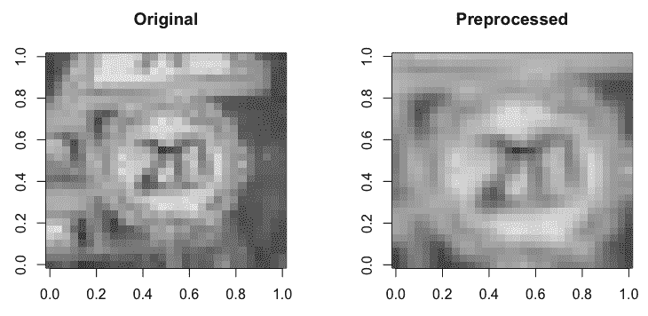

同样，我们可以处理其他两个通道。基于这三个渠道，如何构建特征空间？丢弃任何频道都可能导致信息丢失。简单地把它们堆在一起会导致冗余。因此，将三个频道合并为一个将是更好的解决方案。在色彩世界中，Y'UV 是一种编码系统，它将亮度信息与颜色信息分开加密。它通常用作彩色图像管道和计算机图形硬件的一部分。Y'UV 用三个分量表示人类对颜色的感知:Y '表示亮度，U 和 V 表示色度。Y'UV 可以通过以下方式从 RGB 转换:

*   Y' = 0.299R + 0.587G + 0.114B
*   u = 0.492(B-Y’)
*   v = 0.877(R-Y’)

对于我们的特征空间，我们只能取亮度通道 Y’。

现在我们已经准备好了整个预处理的最后一部分，让我们将它们放在一起，加载并处理(ROI + resize +转换为 Y’)整个带标签的数据集:

```r
> load_labeled_data <- function(training_path, classes){ 

+   # Initialize the pixel features X and target y 

+   X <- matrix(, nrow = 0, ncol = 32*32) 

+   y <- vector() 

+   # Load images from each of the 43 classes 

+   for(i in classes) { 

+     print(paste('Loading images from class', i)) 

+     if (i<10) { 

+       annotation_path <- paste(training_path, "0000", i, "/GT-0000",  

                                 i, ".csv", sep="") 

+       path <- paste(training_path, "0000", i, "/", sep="") 

+     } else { 

+       annotation_path <- paste(training_path, "000", i, "/GT-000",  

                                 i, ".csv", sep="") 

+       path <- paste(training_path, "000", i, "/", sep="") 

+     } 

+     annotation <- read.csv(file=annotation_path, header=TRUE,  

                             sep=";") 

+      

+     for (row in 1:nrow(annotation)) { 

+       # Read each image 

+       image_path <- paste(path, annotation[row, "Filename"], sep="") 

+       image <- read.pnm(image_path, cellres=1) 

+       # Parse RGB color space 

+       red_matrix <- matrix(image@red, nrow = image@size[1],  

                             ncol = image@size[2]) 

+       green_matrix <- matrix(image@green, nrow = image@size[1],   

                               ncol = image@size[2]) 

+       blue_matrix <- matrix(image@blue, nrow = image@size[1],  

                              ncol = image@size[2]) 

+       # Crop ROI and resize 

+       red_matrix_cropped <- roi_resize(red_matrix,  

                                         annotation[row, ]) 

+       green_matrix_cropped <- roi_resize(green_matrix,  

                                           annotation[row, ]) 

+       blue_matrix_cropped <- roi_resize(blue_matrix,  

                                          annotation[row, ]) 

+       # Convert to brightness, e.g. Y' channel 

+       x <- 0.299 * red_matrix_cropped + 0.587 *  

             green_matrix_cropped + 0.114 * blue_matrix_cropped 

+       X <- rbind(X, matrix(x, 1, 32*32)) 

+       y <- c(y, i) 

+     } 

+      

+   } 

+    

+   return(list("x" = X, "y" = y)) 

+ } 
```

如前所示定义数据加载函数后，我们将其应用于整个原始数据集:

```r
> classes <- 0:42 

> data <- load_labeled_data(training_path, classes) 
```

请耐心等待，因为读取和处理 39，209 张图像可能需要几个小时。为了以防发生意外，一个好的做法是保存数据对象，以便我们可以在以后的任何时候恢复它:

```r
> # Save the data object to a file 

> saveRDS(data, file = "43 classes.rds") 

> # Restore the data object 

> data <- readRDS(file = "43 classes.rds") 
```

只需快速检查即可使用的数据:

```r
> data.x <- data$x 

> data.y <- data$y 

> dim(data.x) 

[1] 39209  1024 
```

尺寸正确！

```r
> summary(as.factor(data.y)) 

   0    1    2    3    4    5    6    7    8    9   10   11   12   13   14   15   16   17   18   19   20   21   22  

 210 2220 2250 1410 1980 1860  420 1440 1410 1470 2010 1320 2100 2160  780  630  420 1110 1200  210  360  330  390  

  23   24   25   26   27   28   29   30   31   32   33   34   35   36   37   38   39   40   41   42  

 510  270 1500  600  240  540  270  450  780  240  689  420 1200  390  210 2070  300  360  240  240 
```

正确的班级人数，他们又一次不平衡了！

永远不要跳过检查分类的类平衡。

在确保数据被正确加载和处理后，我们对特征的分布，即像素，做更多的探索性分析。作为一个例子，我们从类别 1(速度限制= 1)的每幅图像中的中心 4*4 块(第 222 ^个到第 225 ^个，第 254 ^个到第 257 ^个，第 286 ^个到第 289 ^个，以及第 318 ^个到第 321 ^个)中取 16 个像素我们展示它们的直方图:

```r
> central_block <- c(222:225, 254:257, 286:289, 318:321) 

> par(mfrow=c(2, 2)) 

> for(i in c(1, 14, 20, 27)) { 

+   hist(c(as.matrix(data.x[data.y==i, central_block])),
```

```r
+        main=sprintf("Histogram for class %d", i),  

+        xlab="Pixel brightness") 

+ } 
```

生成的像素亮度直方图显示如下:

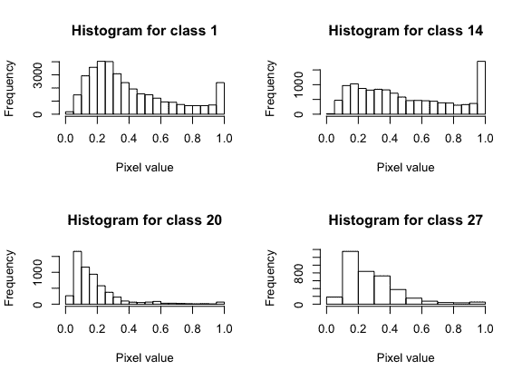

中心像素的亮度在这四个类别中有不同的分布。例如，类别 20 的大部分中心像素是暗的，因为标志(右边的危险曲线)具有穿过中心的粗黑笔划；而在 14 级，停车标志在中央区域附近有一个白色的笔划( **O** 的左边部分)。从其他位置获取的像素也可以清楚地分布在不同的类别中。

我们刚刚进行的探索性分析有助于我们继续构建基于像素的分类模型。


# 第一种解决方案——使用 MXNet 的卷积神经网络

我们从一个类似于上一章末尾开发的解决方案开始，CNN 使用 MXNet。

同样，我们首先使用`caret`包将数据集分成两个子集，分别用于训练(75%)和测试(25%):

```r
> if (!require("caret"))  

+     install.packages("caret") 

> library (caret) 

> set.seed(42) 

> train_perc = 0.75 

> train_index <- createDataPartition(data.y, p=train_perc, list=FALSE) 

> train_index <- train_index[sample(nrow(train_index)),] 

> data_train.x <- data.x[train_index,] 

> data_train.y <- data.y[train_index] 

> data_test.x <- data.x[-train_index,] 

> data_test.y <- data.y[-train_index] 
```

不要忘记为可重复的工作指定一个特定的随机种子。我们通常在应用 CNN 之前进行数据标准化。在我们的例子中，加载的原始像素已经在 0 到 1 的范围内；Y '亮度转换后，得到的像素仍然在 0 到 1 的范围内。

一般来说，在将我们的数据放入 CNN 或实际上任何神经网络或基于梯度下降的模型之前，标准化我们的数据是必要的。对于图像输入，我们通常在 0 到 1 的范围内缩放像素。

在准备好训练和测试集之后，我们如下构建我们的 CNN 模型:

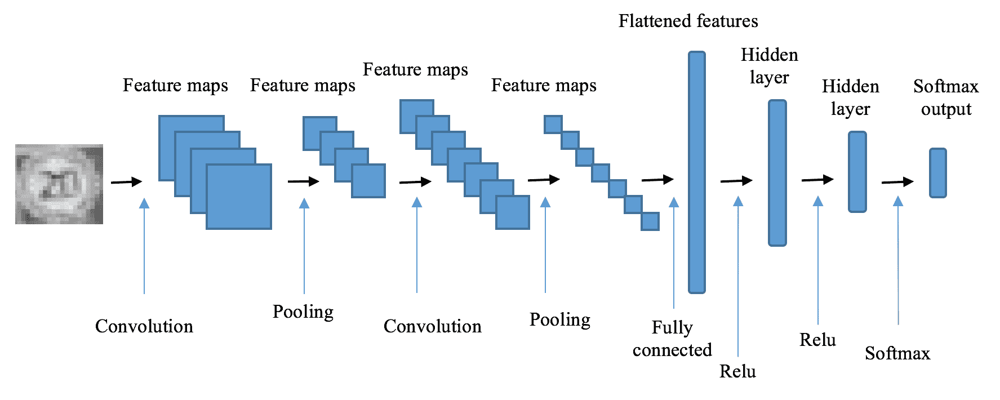

网络从第一组卷积层、ReLu 非线性层和汇集层开始。这里我们使用 32 个 5*5 卷积滤波器和一个 2*2 最大池滤波器:

```r
> require(mxnet) 

> data <- mx.symbol.Variable("data") 

> # first convolution 

> conv1 <- mx.symbol.Convolution(data=data, kernel=c(5,5),  

                                 num_filter=32) 

> act1 <- mx.symbol.Activation(data=conv1, act_type="relu") 

> pool1 <- mx.symbol.Pooling(data=act1, pool_type="max", 

+                            kernel=c(2,2), stride=c(2,2)) 

It follows with the second set of convolutional, ReLu nonlinear and pooling layer, where 64 5*5 convolutional filters and 2*2 max pooling filter are used: 

> # second convolution 

> conv2 <- mx.symbol.Convolution(data=pool1, kernel=c(5,5),  

                                 num_filter=64) 

> act2 <- mx.symbol.Activation(data=conv2, act_type="relu") 

> pool2 <- mx.symbol.Pooling(data=act2, pool_type="max", 

+                            kernel=c(2,2), stride=c(2,2)) 
```

现在，我们已经通过检测边缘、曲线和形状提取了输入图像的丰富表示，我们继续学习完全连接的图层。但在此之前，我们需要展平来自之前卷积图层的结果特征图:

```r
> flatten <- mx.symbol.Flatten(data=pool2) 
```

在完全连接部分，我们应用了 1，000 个单元的 ReLu 隐藏层和 43 个单元的 softmax 层:

```r
> # first fully connected layer 

> fc1 <- mx.symbol.FullyConnected(data=flatten, num_hidden=1000) 

> act3 <- mx.symbol.Activation(data=fc1, act_type="relu") 

> # second fully connected layer 

> fc2 <- mx.symbol.FullyConnected(data=act3, num_hidden=43) 
```

最后是 softmax 层，为 43 个类中的每一个生成输出:

```r
> # softmax output 

> softmax <- mx.symbol.SoftmaxOutput(data=fc2, name="sm") 
```

现在网络的所有部分都组装好了。在我们开始训练模型之前，我们指定随机种子和训练设备，并将矩阵`data_train.x`整形为 MXNet 中卷积层所需的数组:

```r
> devices <- mx.cpu() 

> train.array <- t(data_train.x) 

> dim(train.array) <- c(32, 32, 1, nrow(data_train.x)) 

> mx.set.seed(42) 
```

模特训练时间:

```r
> model_cnn <- mx.model.FeedForward.create(softmax, X=train.array,  

y=data_train.y, ctx=devices, num.round=30,  

array.batch.size=100,learning.rate=0.05, momentum=0.9,  

wd=0.00001, eval.metric=mx.metric.accuracy,            

               epoch.end.callback=mx.callback.log.train.metric(100)) 
```

使用一种设备开始训练:

```r
[1] Train-accuracy=0.184965986394558 

[2] Train-accuracy=0.824610169491525 

[3] Train-accuracy=0.949389830508475 

[4] Train-accuracy=0.968305084745763 

[5] Train-accuracy=0.983050847457628 

[6] Train-accuracy=0.988372881355934 

[7] Train-accuracy=0.990745762711866 

[8] Train-accuracy=0.993152542372882 

[9] Train-accuracy=0.992576271186442 

[10] Train-accuracy=0.994372881355933 

[11] Train-accuracy=0.99542372881356 

[12] Train-accuracy=0.995118644067798 

[13] Train-accuracy=0.99671186440678 

[14] Train-accuracy=0.999830508474576 

[15] Train-accuracy=0.999932203389831 

[16] Train-accuracy=1 

[17] Train-accuracy=1 

[18] Train-accuracy=1 

[19] Train-accuracy=1 

[20] Train-accuracy=1 

[21] Train-accuracy=1 

[22] Train-accuracy=1 

[23] Train-accuracy=1 

[24] Train-accuracy=1 

[25] Train-accuracy=1 

[26] Train-accuracy=1 

[27] Train-accuracy=1 

[28] Train-accuracy=1 

[29] Train-accuracy=1 

[30] Train-accuracy=1 
```

我们只是用超参数来拟合我们的模型:

*   `num.round =30`:最大迭代次数
*   `array.batch.size = 100`:小批量梯度下降的批量
*   `learning.rate = 0.05`:学习率
*   `momentum=0.9`:动量因子，决定有多少以前的速度被合并到当前速度中
*   `eval.metric=mx.metric.accuracy`:使用分类精度作为评估标准
*   `initializer=mx.init.uniform(0.1)`:初始权重从-0.1 到 0.1 之间的均匀分布中随机产生，以降低权重在深度网络中爆炸和消失的几率
*   `wd = 0.00001`:L2 正则化的权重衰减，它为大的权重增加了惩罚，以避免过度拟合

我们可以通过以下方式查看模型的结构:

```r
> graph.viz(model_cnn$symbol) 
```

然后将训练好的模型应用于测试集:

```r
> test.array <- t(data_test.x) 

> dim(test.array) <- c(32, 32, 1, nrow(data_test.x)) 

> prob_cnn <- predict(model_cnn, test.array) 

> prediction_cnn <- max.col(t(prob_cnn)) - 1 
```

我们计算混淆矩阵和分类准确度如下:

```r
> cm_cnn = table(data_test.y, prediction_cnn) 

> cm_cnn 
```

由此产生的混淆矩阵的前半部分:

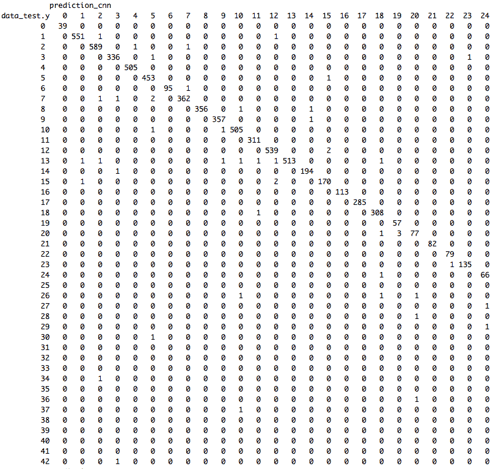

后半部分:


尽管由于光照变化、部分遮挡、旋转、天气条件等导致图像外观变化很大，但分类错误仅在极少数情况下发生:

```r
> accuracy_cnn = mean(prediction_cnn == data_test.y) 

> accuracy_cnn 

[1] 0.9930612 
```

我们刚刚建立了一个健壮的 CNN 模型，它正确地分类了超过 99.30%的测试符号。CNN 模型通过导出低级和高级特征来有效地学习表示。它使那些手工制作的特征变得过时，因为它从标志图像中自己捕捉重要的和可区分的特征。

既然我们已经使用我们最喜欢的(目前为止)深度学习工具 MXNet 取得了巨大的成功，我们为什么不探索其他同样强大的工具呢？事实上，另一个名为 Keras 的深度学习 API 最近越来越受欢迎；它的后端 TensorFlow 可能是最知名的深度学习框架。


# 尝试新事物——CNN 使用 Keras 和 TensorFlow

keras([https://keras.io/](https://keras.io/))是一个用 Python 编写的高级深度学习 API，可以运行在这三个深度学习框架的任何一个之上:TensorFlow(来自谷歌)、CNTK(来自微软)和 Theano(来自加拿大蒙特利尔大学蒙特利尔学习算法研究所)。要高效解决机器学习问题，能够快速原型化想法是关键。这也是最初开发 Keras 的原因，以促进以下关键方面的快速实验:

*   用户友好的 API 构建在多个强大的后端之上，包括 TensorFlow、CNTK 和 Theano。
*   内置的 CNN、RNN 和 autoencoder 模型以及支持类和方法(指标、优化器、正则化器、可视化等等)，可以轻松快速地构建原型。
*   出色的模块化和可扩展性。这些允许定制网络体系结构:多输入、多输出、层共享、模型共享、基于内存的网络等等。
*   允许相同的代码在 CPU 和 GPU 上无缝运行。

对于 R 用户来说，Keras([https://keras.rstudio.com/](https://keras.rstudio.com/))的 R 接口是在 2017 年开发的，其被社区采用的程度逐渐增长。让我们首先从 GitHub 安装`keras` R 包，如下所示:

```r
> if (!require("keras"))  

+     devtools::install_github("rstudio/keras") 

> library(keras) 
```

这还没有完成。我们需要安装 Keras 连接到的底层后端。默认情况下，它使用 TensorFlow 作为后端引擎。我们可以使用以下函数来安装 TensorFlow 后端:

```r
> install_keras() 

Using existing virtualenv at  ~/.virtualenvs/r-tensorflow  

Upgrading pip ... 

...... 

Installation complete. 
```

在我们等待安装的同时，让我们了解更多关于 TensorFlow 的信息。

tensor flow([https://www.tensorflow.org/](https://www.tensorflow.org/))是谷歌创建的开源机器学习框架。众所周知，它用于设计、构建和训练深度学习模型，但它也可以用于一般的数值计算。在 TensorFlow 中，使用数据流图来描述计算，其中图中的每个节点代表一个数学运算的实例，每个边代表一个多维数据数组(所谓的张量，可以保存矩阵、向量或标量)，在该数组上执行运算。这种灵活的架构允许我们有效地执行数据处理机器学习操作，如对巨大矩阵的导数。下面是一个数据流图表示例:


现在我们看到它的名字 TensorFlow 是从哪里得来的:在网络中流动的张量。

至此，Keras 核心库以及 TensorFlow 后端的安装已经完成。我们继续使用基于 Keras 的交通标志分类解决方案。

首先，通过重塑训练和测试特征矩阵为 Keras 建模准备输入数据:

```r
> x_train <- data_train.x 

> dim(x_train) <- c(nrow(data_train.x), 32, 32, 1) 

> x_test <- data_test.x 

> dim(x_test) <- c(nrow(data_test.x), 32, 32, 1) 
```

同样，输入像素的值已经从 0 到 1，所以我们不需要执行任何重新缩放。

我们还根据 Keras 分类模型的要求，将训练和测试目标向量(从 0 到 42 的整数)转换为二进制类矩阵(一位热编码):

```r
> y_train <- to_categorical(data_train.y, num_classes = 43) 

> y_test <- to_categorical(data_test.y, num_classes = 43) 
```

在我们开始建模之前，有一个技巧可以在 r 中的 Keras 中获得可重复的结果。它是在使用以下函数开发模型之前指定一个随机种子:

```r
> use_session_with_seed(42) 
```

它采取所有已知的措施来确保从 Keras 会话中获得可再现的结果。

数据准备后定义模型的时间到了！

我们首先初始化 Keras 顺序模型，如下所示:

```r
> model <- keras_model_sequential() 
```

然后，我们添加第一组卷积层，ReLu 非线性层和汇集层，使用与先前 MXNet 解决方案相同的参数(网络的其余部分使用相同的参数):

```r
> model %>% 
```

从输入 32*32 像素图像的隐藏 2D 卷积层开始:

```r
+   layer_conv_2d( 

+     filter = 32, kernel_size = c(5,5),  

+     input_shape = c(32, 32, 1) 

+   ) %>% 

+   layer_activation("relu") %>% 

+   layer_max_pooling_2d(pool_size = c(2,2)) %>% 
```

注意，我们使用 pipe (%>%)操作符将层添加到 Keras 顺序模型中。

接下来是第二组卷积层、ReLu 非线性层和池层:

```r
+   # Second hidden convolutional layer layer 

+   layer_conv_2d(filter = 64, kernel_size = c(5,5)) %>% 

+   layer_activation("relu") %>% 

+   layer_max_pooling_2d(pool_size = c(2,2)) %>% 
```

展平先前卷积图层生成的要素地图:

```r
+   layer_flatten() %>% 
```

并送入致密层:

```r
+   layer_dense(1000) %>% 

+   layer_activation("relu") %>% 
```

最后，连接到包含 43 个输出单元的 softmax 层:

```r
+   layer_dense(43) %>% 

+   layer_activation("softmax") 
```

我们可以使用`summary()`功能来查看模型的详细信息:

```r
> summary(model)
```

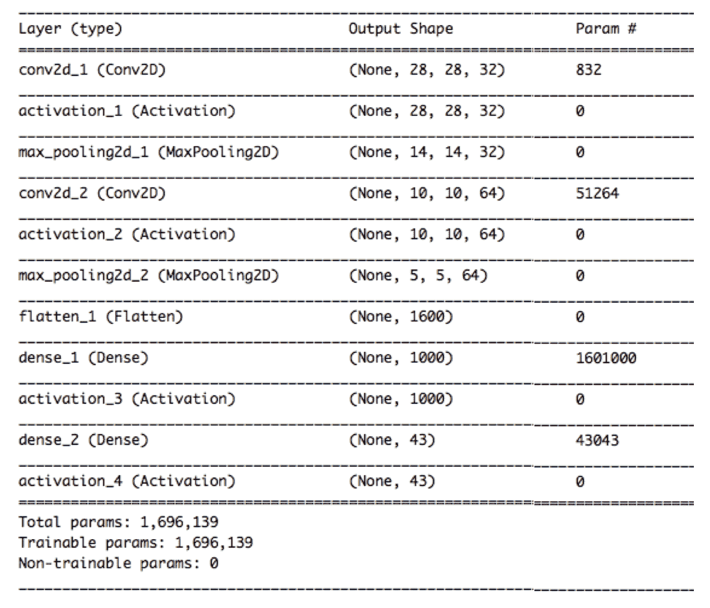

根据构建模型的时间，层的名称可能有不同的后缀(例如，`_1`，`_2`)。

CNN 模型的所有部分现在都组装好了。在编译模型之前，我们需要显式地指定它的优化器。在 MXNet 中，优化器是`mx.model.FeedForward.create`方法中的一个参数，默认值为**随机梯度下降** ( **SGD** )。在 Keras 中，我们使用具有相同学习速度和动力的相同优化器:

```r
> opt <- optimizer_sgd(lr = 0.005, momentum = 0.9)
```

连同我们刚刚定义的优化器，交叉熵作为损失函数，分类准确度作为度量，我们编译 CNN 模型:

```r
> model %>% compile( 

+   loss = "categorical_crossentropy", 

+   optimizer = opt, 

+   metrics = "accuracy" 

+ ) 
```

我们现在可以安全地开始模特训练了。同样，使用相同的超参数，包括批量大小和迭代次数。注意，测试数据集用于模型验证，其中为每个训练迭代计算当前 CNN 模型的分类性能。最后但并非最不重要的一点是，在我们的例子中，混洗是不必要的，因为在原始数据分割之后，训练数据已经被混洗了:

```r
> model %>% fit( 

+   x_train, y_train, 

+   batch_size = 100, 

+   epochs = 30, 

+   validation_data = list(x_test, y_test), 

+   shuffle = FALSE 

+ ) 

Train on 29409 samples, validate on 9800 samples 

Epoch 1/30 

29409/29409 [==============================] - 109s 4ms/step - loss: 2.8031 - acc: 0.2823 - val_loss: 1.1719 - val_acc: 0.6733 

Epoch 2/30 

29409/29409 [==============================] - 109s 4ms/step - loss: 0.6438 - acc: 0.8372 - val_loss: 0.4079 - val_acc: 0.8891 

Epoch 3/30 

29409/29409 [==============================] - 110s 4ms/step - loss: 0.3154 - acc: 0.9217 - val_loss: 0.2623 - val_acc: 0.9336 

Epoch 4/30 

29409/29409 [==============================] - 109s 4ms/step - loss: 0.1969 - acc: 0.9533 - val_loss: 0.2096 - val_acc: 0.9483 

Epoch 5/30 

29409/29409 [==============================] - 24703s 840ms/step - loss: 0.1410 - acc: 0.9682 - val_loss: 0.1715 - val_acc: 0.9604 

Epoch 6/30 

29409/29409 [==============================] - 1076s 37ms/step - loss: 0.1055 - acc: 0.9761 - val_loss: 0.1363 - val_acc: 0.9690 

Epoch 7/30 

29409/29409 [==============================] - 34344s 1s/step - loss: 0.0860 - acc: 0.9806 - val_loss: 0.1147 - val_acc: 0.9742 

Epoch 8/30 

29409/29409 [==============================] - 104s 4ms/step - loss: 0.0698 - acc: 0.9841 - val_loss: 0.1065 - val_acc: 0.9756 

Epoch 9/30 

29409/29409 [==============================] - 108s 4ms/step - loss: 0.0535 - acc: 0.9874 - val_loss: 0.1015 - val_acc: 0.9780 

Epoch 10/30 

29409/29409 [==============================] - 109s 4ms/step - loss: 0.0414 - acc: 0.9913 - val_loss: 0.0927 - val_acc: 0.9801 

Epoch 11/30 

29409/29409 [==============================] - 108s 4ms/step - loss: 0.0415 - acc: 0.9917 - val_loss: 0.0912 - val_acc: 0.9807 

Epoch 12/30 

29409/29409 [==============================] - 106s 4ms/step - loss: 0.0341 - acc: 0.9933 - val_loss: 0.1054 - val_acc: 0.9769 

Epoch 13/30 

29409/29409 [==============================] - 108s 4ms/step - loss: 0.0266 - acc: 0.9946 - val_loss: 0.0811 - val_acc: 0.9842 

Epoch 14/30 

29409/29409 [==============================] - 106s 4ms/step - loss: 0.0207 - acc: 0.9965 - val_loss: 0.0790 - val_acc: 0.9845 

Epoch 15/30 

29409/29409 [==============================] - 106s 4ms/step - loss: 0.0221 - acc: 0.9955 - val_loss: 0.0780 - val_acc: 0.9841 

Epoch 16/30 

29409/29409 [==============================] - 109s 4ms/step - loss: 0.0169 - acc: 0.9974 - val_loss: 0.0753 - val_acc: 0.9854 

Epoch 17/30 

29409/29409 [==============================] - 109s 4ms/step - loss: 0.0137 - acc: 0.9982 - val_loss: 0.0777 - val_acc: 0.9863 

Epoch 18/30 

29409/29409 [==============================] - 109s 4ms/step - loss: 0.0114 - acc: 0.9986 - val_loss: 0.0757 - val_acc: 0.9863 

Epoch 19/30 

29409/29409 [==============================] - 109s 4ms/step - loss: 0.0101 - acc: 0.9990 - val_loss: 0.0775 - val_acc: 0.9867 

Epoch 20/30 

29409/29409 [==============================] - 108s 4ms/step - loss: 0.0086 - acc: 0.9993 - val_loss: 0.0786 - val_acc: 0.9862 

Epoch 21/30 

29409/29409 [==============================] - 110s 4ms/step - loss: 0.0077 - acc: 0.9994 - val_loss: 0.0776 - val_acc: 0.9859 

Epoch 22/30 

29409/29409 [==============================] - 110s 4ms/step - loss: 0.0071 - acc: 0.9995 - val_loss: 0.0774 - val_acc: 0.9862 

Epoch 23/30 

29409/29409 [==============================] - 109s 4ms/step - loss: 0.0066 - acc: 0.9996 - val_loss: 0.0779 - val_acc: 0.9862 

Epoch 24/30 

29409/29409 [==============================] - 110s 4ms/step - loss: 0.0062 - acc: 0.9997 - val_loss: 0.0783 - val_acc: 0.9860 

Epoch 25/30 

29409/29409 [==============================] - 114s 4ms/step - loss: 0.0059 - acc: 0.9997 - val_loss: 0.0786 - val_acc: 0.9859 

Epoch 26/30 

29409/29409 [==============================] - 115s 4ms/step - loss: 0.0056 - acc: 0.9998 - val_loss: 0.0791 - val_acc: 0.9861 

Epoch 27/30 

29409/29409 [==============================] - 117s 4ms/step - loss: 0.0053 - acc: 0.9998 - val_loss: 0.0793 - val_acc: 0.9860 

Epoch 28/30 

29409/29409 [==============================] - 115s 4ms/step - loss: 0.0051 - acc: 0.9998 - val_loss: 0.0794 - val_acc: 0.9862 

Epoch 29/30 

29409/29409 [==============================] - 114s 4ms/step - loss: 0.0050 - acc: 0.9998 - val_loss: 0.0795 - val_acc: 0.9864 

Epoch 30/30 

29409/29409 [==============================] - 113s 4ms/step - loss: 0.0048 - acc: 0.9998 - val_loss: 0.0796 - val_acc: 0.9865  
```

经过 30 个时期后，该模型被很好地训练，在测试集上达到 98.65%的准确度。在 RStudio 查看器窗格中，我们还可以实时查看每个时期的分类性能:

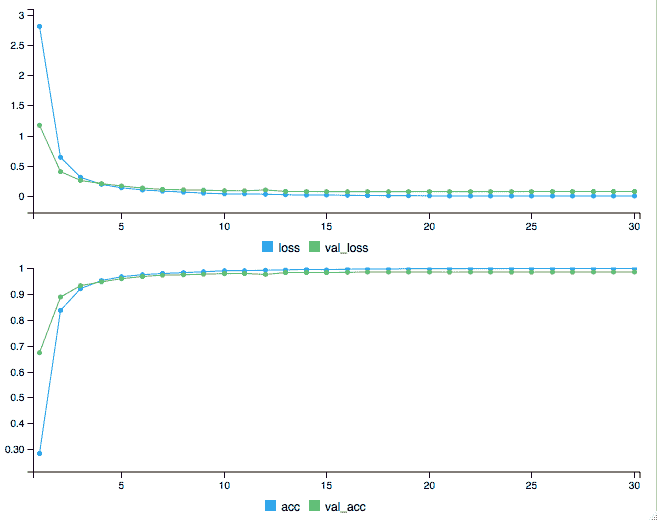

# 通过下降减少过度拟合

你可能会注意到，我们在 MXNet 解决方案中使用了 L2 正则化，它增加了对大权重的惩罚，以避免过度拟合；但是在这个 Keras 解决方案中我们没有这样做。这导致在测试集上的分类准确度略有不同(99.30%对 98.65%)。我们将在我们的 Keras 解决方案中采用正则化，特别是这次**辍学**。

Dropout 是最初由 Geoffrey Hinton 等人提出的神经网络中的正则化技术。艾尔。在 2012 年(*通过防止特征检测器的共同适应来改进神经网络*神经和进化计算*中的*)。顾名思义，它忽略了在训练过程中在神经网络中随机选择的一小部分神经元(可以是隐藏的，也可以是可见的)。*退出的*神经元暂时对下游神经元的激活或后向通路上神经元的权重更新没有贡献。那么，辍学技术如何能够防止过度拟合呢？

回想一下，在标准神经网络中，神经元在训练期间在相邻神经元之间是相互依赖的。并且针对网络内的特定上下文来调整神经元的权重，这限制了每个神经元的个体能力。这种对上下文的依赖可能会导致模型过于专门化而无法训练数据。当不考虑网络中的一些神经元时，神经元的权重对其他神经元的权重变得不那么敏感。神经元是更独立地学习有用信息的力量。训练数据的协同适应是不利的。

雇用辍学者很简单。在训练阶段，在一个辍学率为 *p* 的层中，对于每次迭代，我们随机关闭一小部分 *p* 的神经元。在测试阶段，我们使用所有的神经元，但是通过因子 *q* = 1 - *p* 来缩放它们的激活，以便考虑在训练阶段退出的激活。

这是一个标准的神经网络(第一幅图)和一个有漏失的网络(第二幅图):

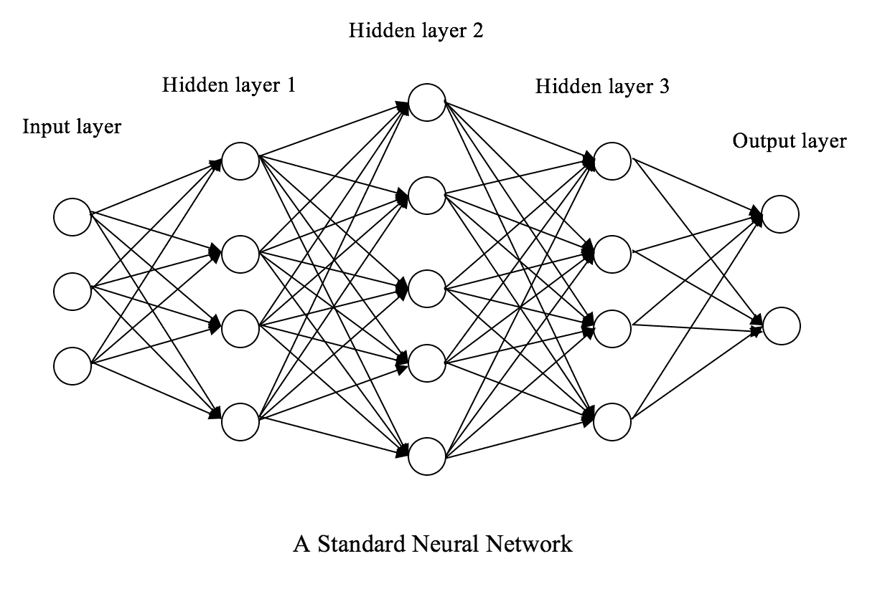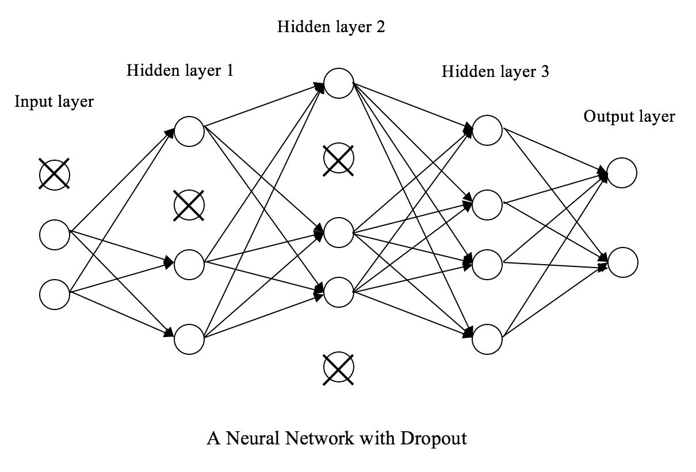

在本例中，除了隐藏图层之外，还将 dropout 应用于可见图层，即输入图层。

在实践中，辍学率通常设定在 20%到 50%之间。丢失率太低的层影响不大，而丢失率太高会导致欠拟合。

现在让我们通过使用函数`layer_dropout(p)`将 dropout 应用于我们的 Keras 解决方案。我们定义一个函数来初始化和编译一个带有 dropout 的 CNN 模型(为了重用):

```r
> init_cnn_dropout <- function(){ 

+     model_dropout <- keras_model_sequential() 

+     model_dropout %>% 

+         layer_conv_2d( 

+             filter = 32, kernel_size = c(5,5),  

+             input_shape = c(32, 32, 1) 

+         ) %>% 

+         layer_activation("relu") %>% 

+         layer_max_pooling_2d(pool_size = c(2,2)) %>% 

+          

+         # Second hidden convolutional layer layer 

+         layer_conv_2d(filter = 64, kernel_size = c(5,5)) %>% 

+         layer_activation("relu") %>% 

+         # Use max pooling 

+         layer_max_pooling_2d(pool_size = c(2,2)) %>% 

+         layer_dropout(0.25) %>% 

+          

+         # Flatten and feed into dense layer 

+         layer_flatten() %>% 

+         layer_dense(1000) %>% 

+         layer_activation("relu") %>% 

+         layer_dropout(0.25) %>% 

+          

+         # Outputs from dense layer  

+         layer_dense(43) %>% 

+         layer_activation("softmax") 

+      

+     opt <- optimizer_sgd(lr = 0.005, momentum = 0.9) 

+      

+     model_dropout %>% compile( 

+         loss = "categorical_crossentropy", 

+         optimizer = opt, 

+         metrics = "accuracy" 

+     ) 

+     return(model_dropout) 

+ } 
```

获取新型号:

```r
> model_dropout <- init_cnn_dropout() 
```

我们只是在第二个最大池层中采用 25%的下降，在完全连接的隐藏层中采用 25%的下降。通过调用`summary(model_dropout)`，我们可以看到分别位于第二个 MaxPooling2D 层和第一个密集和激活层正下方的两个 dropout 层。

继续进行模型培训:

```r
> model_dropout %>% fit( 

+   x_train, y_train, 

+   batch_size = 100, 

+   epochs = 30, 

+   validation_data = list(x_test, y_test), 

+   shuffle = FALSE 

+ ) 

Train on 29409 samples, validate on 9800 samples 

Epoch 1/30 

29409/29409 [==============================] - 108s 4ms/step - loss: 3.1078 - acc: 0.1987 - val_loss: 1.4475 - val_acc: 0.6487 

Epoch 2/30 

29409/29409 [==============================] - 106s 4ms/step - loss: 0.9772 - acc: 0.7337 - val_loss: 0.4570 - val_acc: 0.8934 

Epoch 3/30 

29409/29409 [==============================] - 106s 4ms/step - loss: 0.5194 - acc: 0.8598 - val_loss: 0.3043 - val_acc: 0.9310 

Epoch 4/30 

29409/29409 [==============================] - 106s 4ms/step - loss: 0.3606 - acc: 0.9037 - val_loss: 0.2058 - val_acc: 0.9529 

Epoch 5/30 

29409/29409 [==============================] - 106s 4ms/step - loss: 0.2828 - acc: 0.9250 - val_loss: 0.1677 - val_acc: 0.9640 

Epoch 6/30 

29409/29409 [==============================] - 106s 4ms/step - loss: 0.2272 - acc: 0.9406 - val_loss: 0.1424 - val_acc: 0.9707 

Epoch 7/30 

29409/29409 [==============================] - 106s 4ms/step - loss: 0.1910 - acc: 0.9494 - val_loss: 0.1138 - val_acc: 0.9793 

Epoch 8/30 

29409/29409 [==============================] - 106s 4ms/step - loss: 0.1560 - acc: 0.9602 - val_loss: 0.0986 - val_acc: 0.9797 

Epoch 9/30 

29409/29409 [==============================] - 106s 4ms/step - loss: 0.1423 - acc: 0.9621 - val_loss: 0.0956 - val_acc: 0.9804 

Epoch 10/30 

29409/29409 [==============================] - 106s 4ms/step - loss: 0.1256 - acc: 0.9663 - val_loss: 0.0814 - val_acc: 0.9841 

Epoch 11/30 

29409/29409 [==============================] - 106s 4ms/step - loss: 0.1111 - acc: 0.9708 - val_loss: 0.0760 - val_acc: 0.9847 

Epoch 12/30 

29409/29409 [==============================] - 106s 4ms/step - loss: 0.0987 - acc: 0.9735 - val_loss: 0.0795 - val_acc: 0.9824 

Epoch 13/30 

29409/29409 [==============================] - 106s 4ms/step - loss: 0.0899 - acc: 0.9752 - val_loss: 0.0626 - val_acc: 0.9876 

Epoch 14/30 

29409/29409 [==============================] - 106s 4ms/step - loss: 0.0799 - acc: 0.9787 - val_loss: 0.0665 - val_acc: 0.9868 

Epoch 15/30 

29409/29409 [==============================] - 106s 4ms/step - loss: 0.0794 - acc: 0.9792 - val_loss: 0.0571 - val_acc: 0.9887 

Epoch 16/30 

29409/29409 [==============================] - 106s 4ms/step - loss: 0.0691 - acc: 0.9817 - val_loss: 0.0534 - val_acc: 0.9898 

Epoch 17/30 

29409/29409 [==============================] - 106s 4ms/step - loss: 0.0668 - acc: 0.9817 - val_loss: 0.0560 - val_acc: 0.9892 

Epoch 18/30 

29409/29409 [==============================] - 106s 4ms/step - loss: 0.0583 - acc: 0.9846 - val_loss: 0.0486 - val_acc: 0.9916 

Epoch 19/30 

29409/29409 [==============================] - 106s 4ms/step - loss: 0.0541 - acc: 0.9861 - val_loss: 0.0484 - val_acc: 0.9914 

Epoch 20/30 

29409/29409 [==============================] - 106s 4ms/step - loss: 0.0529 - acc: 0.9858 - val_loss: 0.0494 - val_acc: 0.9906 

Epoch 21/30 

29409/29409 [==============================] - 106s 4ms/step - loss: 0.0500 - acc: 0.9864 - val_loss: 0.0449 - val_acc: 0.9909 

Epoch 22/30 

29409/29409 [==============================] - 106s 4ms/step - loss: 0.0469 - acc: 0.9872 - val_loss: 0.0414 - val_acc: 0.9926 

Epoch 23/30 

29409/29409 [==============================] - 106s 4ms/step - loss: 0.0473 - acc: 0.9863 - val_loss: 0.0415 - val_acc: 0.9917 

Epoch 24/30 

29409/29409 [==============================] - 107s 4ms/step - loss: 0.0406 - acc: 0.9894 - val_loss: 0.0416 - val_acc: 0.9916 

Epoch 25/30 

29409/29409 [==============================] - 108s 4ms/step - loss: 0.0413 - acc: 0.9888 - val_loss: 0.0445 - val_acc: 0.9909 

Epoch 26/30 

29409/29409 [==============================] - 108s 4ms/step - loss: 0.0337 - acc: 0.9906 - val_loss: 0.0412 - val_acc: 0.9922 

Epoch 27/30 

29409/29409 [==============================] - 108s 4ms/step - loss: 0.0333 - acc: 0.9911 - val_loss: 0.0388 - val_acc: 0.9928 

Epoch 28/30 

29409/29409 [==============================] - 108s 4ms/step - loss: 0.0332 - acc: 0.9905 - val_loss: 0.0395 - val_acc: 0.9933 

Epoch 29/30 

29409/29409 [==============================] - 108s 4ms/step - loss: 0.0312 - acc: 0.9910 - val_loss: 0.0371 - val_acc: 0.9937 

Epoch 30/30 

29409/29409 [==============================] - 108s 4ms/step - loss: 0.0305 - acc: 0.9917 - val_loss: 0.0383 - val_acc: 0.9940 
```

通过剔除，测试集上的预测准确率提高到 99.40%。


# 处理小规模训练集——数据扩充

到目前为止，我们非常幸运地拥有一个足够大的训练数据集，39，209 个样本中有 75%的样本。这也是我们能够达到 99.3%到 99.4%的分类准确率的原因之一。然而，在现实中，在大多数监督学习情况下，获得大的训练集并不容易，在这些情况下，人工工作是必要的，或者数据收集和标记的成本很高。在我们的交通标志分类项目中，如果给我们的训练样本少得多，我们还能达到同样的性能吗？让我们试一试。

我们用 39，209 个样本中的 10%来模拟一个小的训练集，用其余的 90%来模拟一个测试集:

```r
> train_perc_1 = 0.1 

> train_index_1 <- createDataPartition(data.y, p=train_perc_1, list=FALSE) 

> train_index_1 <- train_index_1[sample(nrow(train_index_1)),] 

> data_train_1.x <- data.x[train_index_1,] 

> data_train_1.y <- data.y[train_index_1] 

> data_test_1.x <- data.x[-train_index_1,] 

> data_test_1.y <- data.y[-train_index_1] 

> x_train_1 <- data_train_1.x 

> dim(x_train_1) <- c(nrow(data_train_1.x), 32, 32, 1) 

> x_test_1 <- data_test_1.x 

> dim(x_test_1) <- c(nrow(data_test_1.x), 32, 32, 1) 

> y_train_1 <- to_categorical(data_train_1.y, num_classes = 43) 

> y_test_1 <- to_categorical(data_test_1.y, num_classes = 43) 
```

初始化一个新模型，并使其适合新的训练集:

```r
> model_1 <- init_cnn_dropout() 

> model_1 %>% fit( 

+   x_train_1, y_train_1, 

+   batch_size = 100, 

+   epochs = 1, 

+   validation_data = list(x_test_1, y_test_1), 

+   shuffle = FALSE 

+ )  
```

对 3921 个样本进行训练；对 35，288 个样本进行验证:

```r
Epoch 1/30 

3921/3921 [==============================] - 19s 5ms/step - loss: 3.6705 - acc: 0.0594 - val_loss: 3.5191 - val_acc: 0.0592 

Epoch 2/30 

3921/3921 [==============================] - 17s 4ms/step - loss: 3.5079 - acc: 0.0681 - val_loss: 3.4663 - val_acc: 0.0529 

...... 

...... 

Epoch 29/30 

3921/3921 [==============================] - 17s 4ms/step - loss: 0.1935 - acc: 0.9462 - val_loss: 0.2760 - val_acc: 0.9381 

Epoch 30/30 

3921/3921 [==============================] - 17s 4ms/step - loss: 0.1962 - acc: 0.9431 - val_loss: 0.2772 - val_acc: 0.9393 
```

一个只有 3921 个样本训练的模型，达到 93.93%的准确率，已经不错了。但是我们能做得更好吗，至少接近 99%，因为我们有足够的训练数据？是啊！一个解决方案是数据扩充。

**数据扩充**简单来说就是扩大我们提供给监督学习模型的现有数据的规模，以补偿进一步数据收集和标记的成本。

有许多方法可以增加计算机视觉中的数据。最简单的方法可能是水平或垂直翻转图像。以`General caution`标志为例；我们使用 Keras 中的函数`flow_images_from_data()`实现翻转，如下所示。

装载`General caution`样品:

```r
> img<-image_load(paste(training_path, "00018/00001_00004.ppm", sep="")) 

> img1<-image_to_array(img) 

> dim(img1)<-c(1,dim(img1)) 
```

我们生成一个水平翻转的图像，并将结果图像保存在我们创建的`augmented`目录中:

```r
> images_iter  <- flow_images_from_data(img1, , generator =  

                  image_data_generator(horizontal_flip = TRUE), 

+                 save_to_dir = 'augmented', 

+                 save_prefix = "horizontal", save_format = "png") 

> reticulate::iter_next(images_iter)  
```

翻转的符号(右)与原始图像(左)一起显示如下:


水平翻转的标志图像传达了与原始图像相同的信息。需要注意的是，翻转只在对方向不敏感的情况下起作用，比如猫和狗之间的分类，或者我们对交通灯的识别。然而，在方位很重要的情况下，例如右转和左转之间的分类，仍然可以应用小至中等程度的旋转。例如，将*危险曲线向右翻转*符号是绝对危险的，但是最多旋转 20 度是无害的，甚至是有益的，正如我们在下面的例子中看到的:

```r
> img<-image_load(paste(training_path, "00020/00002_00017.ppm", sep="")) 

> img1<-image_to_array(img) 

> dim(img1)<-c(1,dim(img1)) 

> images_iter  <- flow_images_from_data(img1, , generator =         

                  image_data_generator(rotation_range = 20), 

+                 save_to_dir = 'augmented', 

+                 save_prefix = "rotation", save_format = "png") 

> reticulate::iter_next(images_iter) 
```

旋转后的符号(右)和原始图像(左)包含相同的信息:


移位可能是最常见的增强方法。将图像水平和/或垂直移动少量像素会产生功能相同的图像。使用与前面相同的示例，我们将其水平和垂直移动最多 20%的宽度和高度:

```r
> images_iter  <- flow_images_from_data(img1,                                      

                generator=image_data_generator(width_shift_range=0.2,                                                                         

                height_shift_range=0.2), save_to_dir = 'augmented', 

+               save_prefix = "shift", save_format = "png") 

> reticulate::iter_next(images_iter) 
```

这导致右半部分的图像偏移:

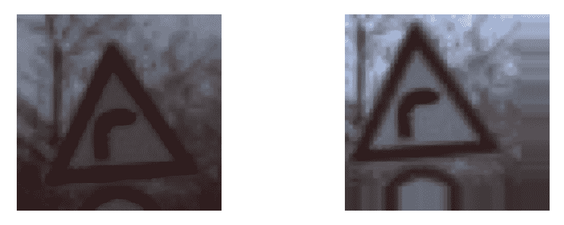

有了常见的增强方法，让我们通过最多 20 度的旋转和最多 20%的移位来增强我们的小训练数据集(注意，我们不能应用翻转，因为一些符号，如类 19、20、21、33 和 34，不是语义对称的):

```r
> datagen <- image_data_generator( 

+   rotation_range = 20, 

+   width_shift_range = 0.2, 

+   height_shift_range = 0.2, 

+   horizontal_flip = FALSE 

+ ) 

> 

> datagen %>% fit_image_data_generator(x_train_1) 

Augmented data generator is defined and now being applied to a CNN model with function fit_generator:  

> model_2 <- init_cnn_dropout() 

> model_2 %>% fit_generator( 

+   flow_images_from_data(x_train_1, y_train_1,  

                          datagen, batch_size = 100), 

+   steps_per_epoch = as.integer(50000/100),  

+   epochs = 30,  

+   validation_data = list(x_test_1, y_test_1) 

+ ) 

Epoch 1/30 

500/500 [==============================] - 74s 149ms/step - loss: 3.4566 - acc: 0.0798 - val_loss: 3.2963 - val_acc: 0.1322 

Epoch 2/30 

500/500 [==============================] - 77s 153ms/step - loss: 3.0920 - acc: 0.1666 - val_loss: 2.1010 - val_acc: 0.4249 

...... 

...... 

Epoch 25/30 

500/500 [==============================] - 83s 166ms/step - loss: 0.1396 - acc: 0.9584 - val_loss: 0.0636 - val_acc: 0.9860 

Epoch 26/30 

500/500 [==============================] - 79s 158ms/step - loss: 0.1359 - acc: 0.9592 - val_loss: 0.0672 - val_acc: 0.9859 

Epoch 27/30 

500/500 [==============================] - 80s 160ms/step - loss: 0.1344 - acc: 0.9600 - val_loss: 0.0727 - val_acc: 0.9843 

Epoch 28/30 

500/500 [==============================] - 81s 163ms/step - loss: 0.1227 - acc: 0.9628 - val_loss: 0.0647 - val_acc: 0.9862 

Epoch 29/30 

500/500 [==============================] - 79s 158ms/step - loss:
0.1222 - acc: 0.9627 - val_loss: 0.0668 - val_acc: 0.9858 

Epoch 30/30 

500/500 [==============================] - 80s 160ms/step - loss: 0.1220 - acc: 0.9636 - val_loss: 0.0614 - val_acc: 0.9870 
```

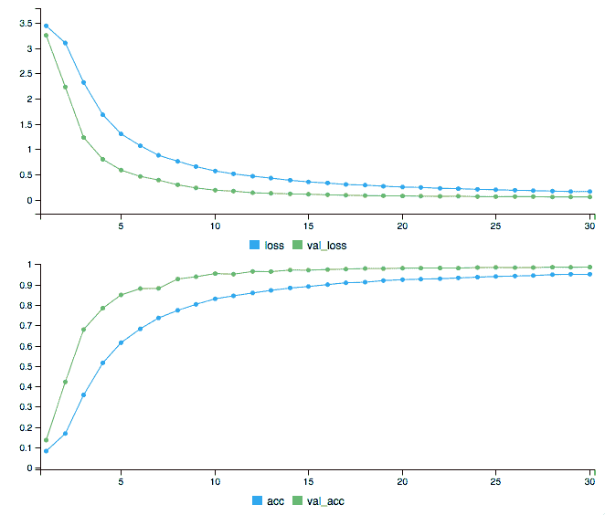

通过数据扩充，我们可以在小训练集的情况下获得 98.70%准确率的优秀结果。

与没有数据扩充相比，除了 4.77% (93.93%到 98.70%)的性能提升之外，我们还观察到每次迭代花费的时间比以前更长(大约 20 秒到大约 80 秒)。这是因为`image_data_generator()`为每次迭代实时生成小批量的增强图像数据。因此，即使在两次迭代中使用相同的样本集，扩充的数据也可能非常不同。这种设置为训练集增加了更多的变化，从而使模型更加健壮。这就是为什么数据扩充被认为是一种减少过度拟合的方法。

数据扩充的另一个特别有用的应用是平衡数据集。在大多数不平衡分类的情况下(如在线广告点击预测，或银行欺诈检测)，我们通常对主导类进行下采样。但是，对于小数据集来说，这可能会适得其反。另一个解决方案是从 minor 类增加数据。

最后但并非最不重要的是，还有之前没有提到的其他方法来增加图像数据。例如，重新缩放会将像素值乘以一个系数，从而改变照明条件。剪切和缩放也是有用的数据扩充转换。它们可以在`image_data_generator()`中指定。如果感兴趣，你可以尝试应用这些方法中的任何一种，看看你是否能打败 98.70%。


# 回顾防止 CNN 过度拟合的方法

当模型与训练集拟合得太好，但不能推广到看不见的情况时，就会发生过度拟合。例如，CNN 模型在训练集中识别特定的交通标志图像，而不是一般的模式。如果自动驾驶汽车无法在不断变化的条件下识别标志图像，例如不同的天气、照明和不同于训练集中呈现的角度，这可能是非常危险的。概括来说，我们可以做以下事情来减少过度拟合:

*   收集更多的训练数据(如果可能和可行),以便考虑各种输入数据。
*   使用数据扩充，如果时间或成本不允许我们收集更多的数据，我们就以一种聪明的方式发明数据。
*   采用辍学，这减少了复杂的相邻神经元之间的共同适应。
*   添加套索(L1)或/和山脊(L2)惩罚，防止模型系数拟合得如此完美，以至于出现过度拟合。
*   降低网络架构的复杂性。回想一下，在上一章中，我们提到过添加隐藏层不会帮助提高模型性能，但会增加过度拟合的机会。


# 摘要

我们刚刚完成了这个 R 和深度学习旅程中的第二个计算机视觉项目！通过本章，我们更加熟悉了卷积神经网络及其在 MXNet 中的实现，以及另一个强大的深度学习工具:Keras with TensorFlow。

我们从什么是自动驾驶汽车以及深度学习技术如何使自动驾驶汽车变得可行和更可靠开始。我们还讨论了深度学习如何脱颖而出，成为智能车辆中物体识别的最先进解决方案。在探索交通标志数据集之后，我们使用 MXNet 开发了我们的第一个 CNN 模型，并实现了 99%以上的准确率。然后我们转移到另一个强大的深度学习框架，Keras + TensorFlow，并获得了可比的结果。

我们引入了剔除技术来减少过拟合。我们还学习了如何处理缺乏训练数据和利用数据增强技术，包括翻转，移位和旋转。我们最后总结了一些防止 CNN 模型过度拟合的方法。这是我们观察深度学习如何消除传统方法中采取的手动或显式特征提取步骤的第二个例子，而是有效地找到最佳特征集。

我们在这两个计算机视觉项目中练习了 CNN。在下一个项目中，我们将使用完全不同类型的深度神经网络——自编码器。