# 十四、利用自编码器的欺诈检测

在这一章中，我们继续我们的深度学习之旅，使用 R 和**自编码器**。

传统的自编码器由三部分组成:

*   **一个编码功能**，压缩你的数据
*   **解码功能**，其从压缩版本中重构数据
*   **一个度量或距离**，它计算数据压缩后丢失的信息之间的差异

我们通常假设所有这些涉及的函数足够平滑，能够使用反向传播或其他基于梯度的方法，尽管它们不需要，我们可以使用无导数的方法来训练它们。

自编码是将信息从一个潜在的大型功能集中汇总到一个较小的功能集中的过程。

虽然压缩位可能会让您想起算法，如 MP3 压缩算法，但一个重要的区别是自编码器是特定于数据的。在猫和狗的图片中训练的自编码器可能在建筑物的图片中表现不佳。相比之下，MP3 压缩算法通常使用声音的假设，并且不管声音数据如何都可以工作。数据专用位对于广泛应用来说是一个严重的警告，这使得自编码器很少用于压缩任务。

自编码器近年来吸引如此多关注的一个原因是因为许多人认为它们可能是**无监督学习的关键，**尽管严格来说，它们是一种**自我监督**学习算法。

有时，从自编码器中提取的特征可以被输入到监督学习算法中，使它们在某种程度上可以与作为维度缩减技术的**主成分分析** ( **PCA** )相媲美。

自编码器通常用于图像去噪等计算机视觉问题，或者用于提取颜色、光线和边缘等特征。它们也用于大规模数据集的数据可视化，因为它们可以找到比 PCA 更有趣的特征。其他最近的应用包括欺诈和入侵检测。

出于我们的目的，自编码器神经网络只是一种用于无监督学习的算法，它通过将目标值设置为等于输入来应用反向传播，如果 *x [1，]x**2，...x [m]* 为训练示例，y**[1、] y [2]* *、...y[m]*是标签，那么我们将通过为 *i **的所有值设置*x[I]= y[I]*来进行反向传播。****

 *从你之前的机器学习经验来看，你可能对 PCA 比较熟悉。如果您不熟悉它，请不要担心，这不是我们的目的所严格要求的。PCA 是一种**降维**技术，也就是说，给定一组训练样本，应用合适的变换(对于数学极客来说，这只是投影到协方差矩阵的特征向量生成的向量空间中)。这种投影的目标是找到输入数据的最相关的特征，以便最终得到它的简化表示。

自编码器以类似的方式工作，除了涉及的变换不是投影，而是非线性函数 *f* 。给定一个训练示例 *x，*自编码器使用神经网络将 *x* 编码成隐藏状态 *h:=f(x)* ，使用函数 *g* 对 *h* 进行解码，从而带来 *x = > g(f(x))的整体变换。如果这个过程的结果仅仅是 g(f(x))= x(T59)，我们就不会有一个非常有用的转换。下图说明了这一想法:*

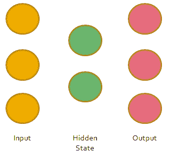

一个简单的 autoencoder 在起作用:将一个三维向量编码成一个二维隐藏状态，
然后再回到一个三维空间。

在左边部分，一个三维输入向量被转换成一个二维编码状态(这是 *f* 的动作)，然后被转换回一个三维向量(通过 *g* 的动作)。

我们为什么要费编码和解码的劲？这有两个目的。一方面，作为 PCA，自编码器提供了一种在低维空间中自动生成特征的方法。这作为机器学习管道的一部分对于**特征提取**是有用的，同样 PCA 也是有用的。合成数据并自动生成特征(而不是依赖领域专业知识和手工制作的特征)，以提高监督学习算法的准确性，无论是用于分类还是回归任务。就我们的目的而言，它对于异常值检测也是有用的。随着计算机被迫理解数据的本质特征，任何突出的异常都将在重建过程(即完整的编码-解码周期)中被丢弃，异常值将很容易被识别。

在本章开始讨论欺诈的例子之前，让我们先看看一个更简单的例子，同时准备好我们的工具。


# 做好准备

在这一章中，我们将介绍 r 的`keras`和`tensorflow`。`keras`是一个模型级的建筑，因为它提供了一个高级接口来快速开发深度学习模型。它没有实现卷积和张量积等低级操作，而是依赖后端的 Theano、TensorFlow 或 CNTK，据开发团队称，未来将支持更多后端。

为什么需要后端？好吧，如果计算变得更复杂，这是深度学习中经常出现的情况，你需要使用不同的计算方法(称为计算图)和硬件(GPU)。出于教学目的，我们所有的示例代码都不使用 GPU 运行。


# 为 R 安装 Keras 和 TensorFlow

根据官方文档，您可以简单地安装 Keras:

```
devtools::install_github("rstudio/keras")
```

Keras R 接口默认使用`tensorflow`作为后端引擎。要安装核心的`keras`库和`tensorflow`，那么做:

```
library(keras)

install_keras()
```

不管这看起来有多顺利，我们已经多次看到这种设置失败。我们推荐的 B 计划是:

*   下载并安装 Python 的 Anaconda 发行版。这是标准的数据科学堆栈，包含数据科学家最常用的 Python 库。
*   安装 Keras 后端，例如 Tensorflow。
*   安装 Keras(在 Python 中)。

在这之后，您应该准备好在 r 中安装 Keras 了。

为了确保您使用的是最新版本的 R，您可以使用`installr`包从 R GUI(而不是 RStudio)更新它:

```
### Run these from RGUi
 install.packages("installr")
 installr::updateR()
```

一旦完成，你就可以用`devtools`安装`keras`:

```
install.packages("devtools")
devtools::install_github("rstudio/keras")
```

最后，通过导入库来检查一切是否正确:

```
library(keras)
```

前面的说明适用于运行 3.4 版的 Windows 10 笔记本电脑。如果您有一个较旧的版本，并且您不想更新，您需要安装如下指定的依赖项(我在 3.3 版中尝试过):

```
install.packages("Rcpp")
install.packages("devtools")
devtools::install_github("rstudio/reticulate", force=TRUE)
devtools::install_github("r-lib/debugme")
devtools::install_github("r-lib/processx")
devtools::install_github("tidyverse/rlang")
devtools::install_github("tidyverse/glue")
devtools::install_github("tidyverse/tidyselect")
devtools::install_github("rstudio/tfruns")
devtools::install_github("rstudio/tensorflow")
devtools::install_github("rstudio/keras")
devtools::install_github("jeroen/jsonlite")
```


# 安装 H2O

我们还将向您展示如何在一些练习中使用 H2O。安装 H2O 最简单的方法是从克兰获得它。

它有一些依赖项，特别是包:

*   `RCurl`
*   `bitops`
*   `rjson`
*   `statmod`
*   `tools`

如果你遇到麻烦，很可能是缺少了某种依赖。重新阅读错误消息并安装任何丢失的软件包。

如果一切顺利，导入库并初始化服务以检查一切正常:

```
install.packages("h2o")
library(h2o)
h2o.init()
```


# 我们的第一个例子

让我们从几个简单的例子开始，来理解这是怎么回事。

对于我们中的一些人来说，很容易被诱惑去尝试最闪亮的算法并进行超参数优化，而不是不那么迷人的逐步理解。


# 一个简单的 2D 例子

让我们用一个简单的二维例子来发展我们对 autoencoder 如何工作的直觉。

我们首先从均值为 0、方差为 1 的正态分布中生成 10，000 个点:

```
library(MASS)
library(keras)
Sigma <- matrix(c(1,0,0,1),2,2)
n_points <- 10000
df <- mvrnorm(n=n_points, rep(0,2), Sigma)
df <- as.data.frame(df)
```

值的分布应该如下所示:


我们刚刚生成的变量 V1 的分布；变量 V2 看起来相当相似。

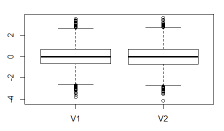

我们生成的变量 V1 和 V2 的分布。

让我们增加一点趣味，在混合物中加入一些异常值。在许多欺诈应用中，欺诈率约为 1–5%，因此我们从正态分布中抽取 1%的样本，均值为 5，标准差为 1:

```
# Set the outliers
 n_outliers <- as.integer(0.01*n_points)
 idxs <- sample(n_points,size = n_outliers)
 outliers <- mvrnorm(n=n_outliers, rep(5,2), Sigma)
 df[idxs,] <- outliers
```

新的点数分布现在看起来像这样:


添加异常值后点的新分布。

我们将在隐藏层使用一个带有单个神经网络的自编码器。为什么不多加一些？问题是，如果隐藏状态的维数等于或高于输入状态的维数，那么我们的模型可能会学习恒等函数，也就是说，模型在任何地方都会学习 *g(f(x))=x* 。这显然不是一个非常有用的异常值识别方法。我们需要捕捉数据的基本特征，这样那些不寻常的特征将在以后被强调，从而允许检测异常值。

用`keras,`建立模型真的很容易，我们需要一个形状为 2 的输入层，作为我们的二维例子。使用 ReLU 激活函数将其传递给我们的一维编码器，然后解码回二维空间:

```
input_layer <- layer_input(shape=c(2))
 encoder <- layer_dense(units=1, activation='relu')(input_layer)
 decoder <- layer_dense(units=2)(encoder)
 autoencoder <- keras_model(inputs=input_layer, outputs = decoder)
```

在使用模型之前，我们需要编译它。我们需要指定一个损失函数、一个要优化的度量以及一个执行梯度下降更新的算法。我们将使用 Adam 解算器，优化经典的均方误差(在此问题中有效，但我们可能需要针对我们的特定应用进行更改),并选择精度作为要优化的指标:

```
autoencoder %>% compile(optimizer='adam',
loss='mean_squared_error',
metrics=c('accuracy'))
```

设置完成后，我们就可以开始训练了:

```
# Coerce the dataframe to matrix to perform the training
 df <- as.matrix(df)
 history <- autoencoder %>% fit(
 df,df,
 epochs = 30, batch_size = 128,
 validation_split = 0.2
 )
```

使用命令`plot(history),`,我们可以看到本例的训练情况:


培训我们的自编码器。

因此，我们看到，虽然准确率仍然相当高，但在训练过程中有一个神秘的下降。我们现在不应该太担心它，我们以后会谈到这个问题。至于损失，随着我们添加更多的数据，它会不断减少，这是意料之中的。

最后，我们来看重建。我们首先从经过训练的自编码器生成预测:

```
preds <- autoencoder %>% predict(df)
 colnames(preds) <- c("V1", "V2")
 preds <- as.data.frame(preds)
```

这是根据我们的自编码器重建的点。我们将把那些重建距离原始图像(欧几里德)距离大于 3 的点涂成红色，而把其他的点涂成蓝色。为什么是这些点？我们的自编码器了解到我们的数据集具有一些内在属性(它了解平均点的分布)，因此在那些重建误差异常大的点上，可能有一些值得关注的东西:

```
# Coerce back the matrix to data frame to use ggplot later
df <- as.data.frame(df)
# Euclidean distance larger than 3 = sum of squares larger than 9
df$color <- ifelse((df$V1-preds$V1)**2+(df$V2-preds$V2)**2>9,"red","blue")
```

最后，我们可以用`ggplot`来看看结果:

```
library(ggplot2)
 df %>% ggplot(aes(V1,V2),col=df$color)+geom_point(color = df$color, position="jitter")
```

下面的截图显示了我们在识别异常点方面做得有多好:

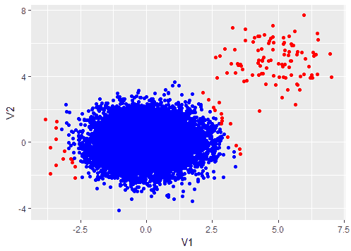

自编码器的输出。蓝色的是我们的自编码器重建的点。红色表示数据集中的原始点。我们看到有一团红点，由于我们的自编码器，我们可以识别出不同寻常。

在前面的屏幕截图中，蓝点是来自自编码器的重建图像。我们看到，正如所料，它正确地了解到大多数点来自以( *0，0* )为中心的正态分布。然而，仍有一些点在原始数据集上是正常的，但被指出是不正常的。没有必要这么快就放弃学习自编码器，原因是我们使用的自编码器相当简单。我们将研究更复杂的方法来解决自编码器的异常检测问题。


# 自编码器和 MNIST

研究论文、博客帖子或书籍中的许多深度学习算法的例子都涉及 MNIST 数据集。我们不应该例外，介绍一个使用 MNIST 的自编码器的小用例。

动机是这样的，假设你想自动检测假钞。然后，你需要教会计算机*平均钞票*的表示是什么，以便能够检测出那些有显著差异的钞票。由于全球范围内每天都有大量的现金交易发生，并且欺诈者越来越狡猾，因此手动完成这一过程是不可想象的。一种方法是使用复杂的成像软件，这就是验钞机(如 D40 或 D50)的工作原理。

使用 MNIST 的另一个原因显然是实际的。在撰写本文时，我无法找到一个很好的伪钞训练数据集，MNIST 已经预装在`keras`中。

我们从加载数据集开始:

```
library(keras)
mnist <- dataset_mnist()
X_train <- mnist$train$x
y_train <- mnist$train$y
X_test <- mnist$test$x
y_test <- mnist$test$y
```

让我们仔细看看数据集:

```
image(X_train[1,,], col=gray.colors(3))
y_train[1]
```

如果一切正常，您应该会看到数字 5 的图像。

在训练我们的自编码器之前，我们需要做一些预处理。`X_train`数据是灰度值的三维数组(图像、宽度、高度)。我们需要首先将这些数组转换成矩阵，将高度和宽度转换成一个向量，这样我们就有了一个 *28*28=784* 向量，而不是处理 28 x 28 的正方形。然后，我们将灰度值从范围在 0 到 255 之间的整数转换成范围在 0 到 1 之间的浮点值:

```
# reshape
dim(X_train) <- c(nrow(X_train), 784)
dim(X_test) <- c(nrow(X_test), 784)
# rescale
X_train <- X_train / 255
X_test <- X_test / 255
```

一旦初始预处理完成，我们就定义了自编码器的拓扑结构。让我们使用具有 32 个神经元的编码层，以实现 *784/32 = 24.5:* 的压缩比

```
input_dim <- 28*28 #784
inner_layer_dim <- 32
input_layer <- layer_input(shape=c(input_dim))
encoder <- layer_dense(units=inner_layer_dim, activation='relu')(input_layer)
decoder <- layer_dense(units=784)(encoder)
autoencoder <- keras_model(inputs=input_layer, outputs = decoder)
```

我们准备编译和训练模型:

```
autoencoder %>% compile(optimizer='adam', 
 loss='mean_squared_error', 
 metrics=c('accuracy'))
history <- autoencoder %>% fit(
 X_train,X_train, 
 epochs = 50, batch_size = 256, 
 validation_split=0.2
)
```

使用`plot`命令，我们可以看到我们的模型在训练和验证过程中的表现如下:

```
plot(history)
```

更好的是，如果您使用 RStudio 作为您的 IDE，在查看器面板中有一个实时视图。使用此命令，您应该会看到两个曲线图，显示精度和损耗与历元数的函数关系:

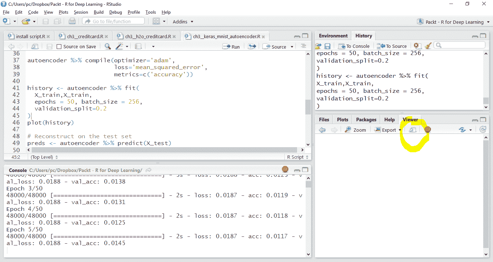

使用查看器面板实时查看培训。点击在新窗口中打开按钮:


实时训练。横轴表示纪元编号。损耗和精度显示在纵轴上。

使用`predict`方法，我们重建数字并计算重建误差:

```
# Reconstruct on the test set
preds <- autoencoder %>% predict(X_test)
error <- rowSums((preds-X_test)**2)
error
```

直觉上，有些类可能更难预测，因为有些人写数字的方式略有不同。哪些类的重建误差较高？

```
# Which were more problematic to reconstruct?
eval <- data.frame(error=error, class=as.factor(y_test))
library(dplyr)
eval %>% group_by(class) %>% summarise(avg_error=mean(error))

## OUTPUT
# A tibble: 10 x 2
 class avg_error
 <fctr> <dbl>
 1 0 14.091963
 2 1 6.126858
 3 2 17.245944
 4 3 14.138960
 5 4 13.189842
 6 5 15.170581
 7 6 14.570642
 8 7 11.778826
 9 8 16.120203
10 9 11.645038
```

注意，一些小的变化是预期的，因为例如在数据的混洗中涉及到随机成分。然而，总的趋势应该是相似的。

一幅图像比一千个单词更有意义，因此，甚至比用`dplyr`总结我们的数据更好的是，我们可以使用`ggplot2`来可视化这些信息:

```
library(ggplot2)
eval %>% 
 group_by(class) %>% 
 summarise(avg_error=mean(error)) %>% 
 ggplot(aes(x=class,fill=class,y=avg_error))+geom_col()
```

我们可以看到，如下，我们的重建误差如何执行每类。这很重要，因为它将让我们知道我们的分类器是否在某些方面有偏差，或者它是否发现某些类比其他类更难训练:

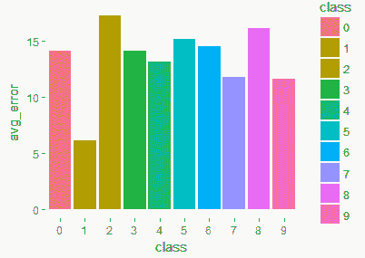

MNIST 数据集中的重建误差。2 和 8 似乎是最有问题的类别，
和 1 似乎是最容易识别的。

这当然很有用，也很有趣，我们看到 2 有点难以重建，这可能是因为它有时看起来像 7。直觉上，8 很容易与 9 或 0 混淆，所以结果多少有点道理。

一个更好的方式来看看我们的重建自编码器是如何执行的，是直接看重建的例子。为此，我们首先需要重塑原始数据并进行重建:

```
# Reshape original and reconstructed
dim(X_test) <- c(nrow(X_test),28,28)
dim(preds) <- c(nrow(preds),28,28)
```

现在让我们看看重建的图像:

```
image(255*preds[1,,], col=gray.colors(3))
```

让我们看一下测试集的一个典型元素的重建图像:

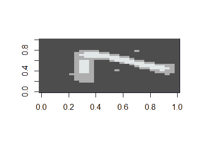

由我们的自编码器重建的图像。

与重建前的原始图像相比如何？让我们来看看:

```
y_test[1]
 image(255*X_test[1,,], col=gray.colors(3))
```


原图。

总的来说，对于 24.5 的压缩来说还不错！显然还有很多需要改进的地方，但我们已经可以看到自编码器学习数据内在特征的潜力。


# MNIST 的异常检测

好吧，无可否认，我们之前的应用程序到目前为止与欺诈或异常值检测无关。我们可以对前面的设置做一个小小的修改，来展示一个类似的框架是如何工作的。为此，让我们假设数字 7 是一个异常类，我们将尝试从我们的*正常*数字:0，1，2，3，4，5，6，8，9 的结果中识别它。

我们将在*普通*数据集上训练自编码器，然后将其应用于测试集。我们的目标是尽可能多地抽象出*正常*情况的特征。这需要了解*正常*情况，这转化为标记数据的可用性，因此，这是一个理想的场景，对于许多实际应用，例如信用卡欺诈或入侵检测，我们有时(或者更经常)缺少这样的标记数据。

我们像以前一样开始:

```
library(keras)
mnist <- dataset_mnist()
X_train <- mnist$train$x
y_train <- mnist$train$y
X_test <- mnist$test$x
y_test <- mnist$test$y
```

但是现在我们将从训练集中排除 7，因为在我们的例子中它将是异常值。

```
## Exclude "7" from the training set. "7" will be the outlier
outlier_idxs <- which(y_train!=7, arr.ind = T)
X_train <- X_train[outlier_idxs,,]
y_test <- sapply(y_test, function(x){ ifelse(x==7,"outlier","normal")})
```

我们继续像以前一样，在定义我们的自编码器之前进行重新缩放和整形:

```
# reshape
dim(X_train) <- c(nrow(X_train), 784)
dim(X_test) <- c(nrow(X_test), 784)
# rescale
X_train <- X_train / 255
X_test <- X_test / 255
input_dim <- 28*28 #784
inner_layer_dim <- 32
# Create the autoencoder
input_layer <- layer_input(shape=c(input_dim))
encoder <- layer_dense(units=inner_layer_dim, activation='relu')(input_layer)
decoder <- layer_dense(units=784)(encoder)
autoencoder <- keras_model(inputs=input_layer, outputs = decoder)
autoencoder %>% compile(optimizer='adam', 
                        loss='mean_squared_error', 
                        metrics=c('accuracy'))
history <- autoencoder %>% fit(
 X_train,X_train, 
 epochs = 50, batch_size = 256, 
 validation_split=0.2
)
plot(history)
```

一旦对自编码器进行了训练，我们就可以使用测试集的重建来开始查看性能:

```
# Reconstruct on the test set
preds <- autoencoder %>% predict(X_test)
error <- rowSums((preds-X_test)**2)
eval <- data.frame(error=error, class=as.factor(y_test))
library(ggplot2)
library(dplyr)
eval %>% 
 group_by(class) %>% 
 summarise(avg_error=mean(error)) %>% 
 ggplot(aes(x=class,fill=class,y=avg_error))+geom_boxplot()
```

让我们看看不同类中的重构误差:

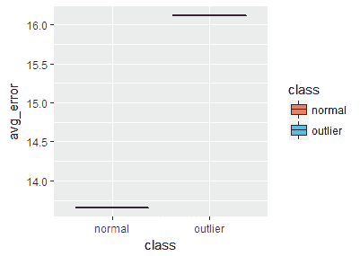

测试集中重构误差的分布

从图中我们看到，我们可以在`15,`设置阈值，也就是说，重建误差大于`15`的观察值将被标记为异常值:

```
threshold <- 15
y_preds <- sapply(error, function(x) ifelse(x>threshold,"outlier","normal")})
```

一旦这样做了，我们就可以计算混淆矩阵。这是一种可视化模型正在做什么的有用方法:

```
# Confusion matrix
table(y_preds,y_test)
```

这为我们提供了以下信息:

```
         y_test
y_preds   normal  outlier
  normal    5707      496
  outlier   3265      532
```

所以很明显我们可以做得更好。也许数字 1 和 7 共有的竖线造成了巨大的错误率。然而，我们用这个简单的架构捕获了超过 50%的异常情况。改善这种情况的一个方法是添加更多的隐藏层。我们将在本章的后面使用这个技巧。


# 使用自编码器检测信用卡欺诈

欺诈是一个价值数十亿美元的行业，其中信用卡欺诈可能是与我们日常生活最密切相关的。欺诈始于盗窃实体信用卡或可能危及账户安全的数据，如信用卡号、有效期和安全码。如果受害者知道他们的卡被盗，则可以直接报告被盗卡，然而，当数据被盗时，受损的账户可能需要几周甚至几个月才能被使用，并且受害者仅从他们的银行对账单中知道该卡被使用过。

传统上，欺诈检测系统依赖于主题专家手动设计的功能，直接与金融机构或专业软件供应商合作。

欺诈检测中最大的挑战之一是标记数据集的可用性，这些数据集通常很难甚至不可能获得。

我们的第一个欺诈案例来自比利时布鲁塞尔自由大学的研究人员在 ka ggle(【https://www.kaggle.com/dalpozz/creditcardfraud】)公开的数据集(完整内容，请阅读他们的论文:Andrea Dal Pozzolo、Olivier Caelen、Reid A. Johnson 和 Gianluca Bontempi，*)校准不平衡分类的欠采样概率。* *《计算智能与数据挖掘研讨会(CIDM)，IEEE，2015)* 。

这些数据集包含欧洲持卡人在 2013 年 9 月的两天内通过信用卡进行的交易。在 284，807 笔交易中，我们有 492 笔欺诈。不像玩具数据集(我正看着你，Iris)，现实生活中的数据集是高度不平衡的。在本例中，正面类别(欺诈)占所有交易的 0.172%。

它只包含数字信息因子，这些因子是 PCA 变化的后效。因为分类问题，创作者不能给出第一个亮点和更多关于信息的基础数据。特色 V1，V2，...V28 是 PCA 得到的主要片段，PCA 没有改变的主要特征是`Time`和`Amount.`

特性`Time`包含数据集中每个事务和第一个事务之间经过的秒数。特征`Amount`是交易的金额，该特征可以用于依赖于示例的、成本敏感的学习。特征`Class`是响应变量，在欺诈的情况下取值`1`，否则取值`0`。鉴于类别不平衡比率，作者建议测量**精确召回曲线** ( **AUC** )下的面积，而不是混淆矩阵。精确度-召回曲线也被称为 **ROC** (接收者-操作者特性)。

此时你可能会想:既然这显然是一个二进制分类问题，而且我们已经有了标记数据，我为什么还要为自编码器费心呢？当然，您可以走传统的方式，尝试使用标准的监督学习算法，如随机森林或支持向量机，只是要小心，要么对欺诈类进行过采样，要么对正常类进行欠采样，以便这些方法能够很好地执行。然而，在许多现实生活中，我们事先没有标记的数据，在复杂的欺诈场景中，可能很难获得准确的标签。假设你是一个愿意实施诈骗的罪犯。

在欺诈之前(甚至之后)，您的帐户可能有完全正常的活动。我们要不要把你所有的交易都标记为欺诈？还是只有某个子集？一些业内人士可能会争辩说，毕竟，交易是由罪犯进行的，所以它们在某种程度上是有污点的，我们应该标记你的所有活动，将偏见引入模型。我们不再依赖标签，而是像以前一样，将问题视为*异常检测*或*异常检测*问题，并使用自编码器。


# 探索性数据分析

一个经常被忽视的步骤是探索性数据分析。在直接进入数据并试图做花哨的深度学习架构之前，让我们后退一步，看看我们周围有什么。

让我们从从 ka ggle:(【https://www.kaggle.com/dalpozz/creditcardfraud】)下载数据集并导入到 R:

```
df <- read.csv("./data/creditcard.csv", stringsAsFactors = F)
head(df)
```

在继续之前，我们应该做一个基本的理智检查。我们应该寻找的一些东西是:

*   验证确实只有两个类别(`0`表示正常交易，`1`表示欺诈交易)
*   验证时间戳对应于两天
*   检查没有丢失的值

一旦完成，我们可以进行两个快速检查，一个想法是看看在一天的时间和数量之间是否有一个明显的模式。也许欺诈交易发生在某个特定的时间，当我们的系统易受攻击的时候？我们应该首先检查这个:

```
library(ggplot2)
library(dplyr)
 df %>% ggplot(aes(Time,Amount))+geom_point()+facet_grid(Class~.)
```

首先，让我们看看是否有一些季节性模式。我们只是针对每类的数量绘制时间变量:

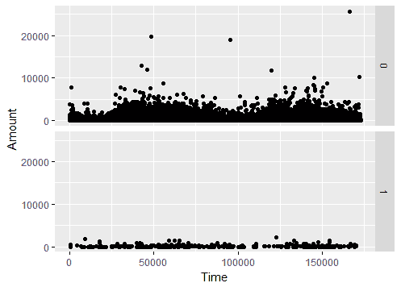

欺诈快速检查:0 级对应正常交易，1 级对应欺诈交易。

所以没什么特别的。有趣的是，欺诈交易涉及的金额远低于正常交易。这表明我们应该过滤掉交易，并以正确的尺度来看待它们。为此，让我们使用`dplyr`，过滤掉`300`以上的交易，并查看较小的交易:

```
 df$Class <- as.factor(df$Class)
 df %>%filter(Amount<300) %>%ggplot(aes(Class,Amount))+geom_violin()
```

按阶级分布看起来怎么样？下面的情节告诉我们一些事情:

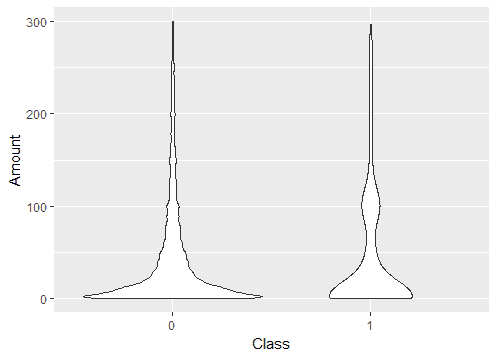

对数据的初步了解:欺诈交易中涉及的金额似乎比非欺诈交易中涉及的金额更有可能在 100
左右。

啊哈！所以我们得到了对数据的第一次洞察！欺诈交易，虽然小得多，但通常集中在 100 左右。这可能是欺诈者策略的一部分，他们不是定期持有大量现金，而是在一定时间内或多或少地隐藏少量现金。

当然，发现这一点很有趣，但是这绝对不是一个可扩展的方法，并且需要领域知识和直觉。是时候尝试更复杂的东西了。


# 自编码器方法——Keras

好了，是时候进入 Keras 了。我们应该留出一小部分数据作为验证或测试集，并在剩余的数据上开发模型。对于如何做到这一点，没有金科玉律。对于本例，我们将使用 10%的测试集和 90%的训练集:

```
# Remove the time and class column
idxs <- sample(nrow(df), size=0.1*nrow(df))
train <- df[-idxs,]
test <- df[idxs,]
y_train <- train$Class
y_test <- test$Class
X_train <- train %>% select(-one_of(c("Time","Class")))
X_test <- test %>% select(-one_of(c("Time","Class")))
# Coerce the data frame to matrix to perform the training
X_train <- as.matrix(X_train)
X_test <- as.matrix(X_test)
```

注意，我们还排除了`Class`和`Time`列。我们忽略了标签，并将我们的欺诈检测问题视为无监督学习问题，因此我们需要从训练数据中移除标签列。至于时间信息，正如我们之前看到的，似乎没有明显的时间趋势。此外，在现实生活中的欺诈检测场景中，我们更关注欺诈者的内在属性，例如，所使用的设备、来自 CRM 系统的地理位置信息或数据，以及帐户属性(余额、平均交易量等)。

对于自编码器的架构，我们现在将使用一个**堆栈自编码器**，而不是像以前一样使用一个中间层。堆叠式自编码器只不过是几层编码器，后面跟着几层解码器。在这种情况下，我们将使用具有 14 个完全连接的神经元的外部编码器-解码器层、7 个神经元的两个内部层和 7 个神经元的另一个内部层的网络。您可以试验不同的架构，并将结果与我们的进行比较，对于自编码器来说，没有放之四海而皆准的架构，它仅仅依赖于经验以及通过验证图和其他指标来诊断您的模型。

在每种情况下，我们的输入(和输出)维度都是`29`。构建自编码器的代码是:

```
library(keras)
input_dim <- 29
outer_layer_dim <- 14
inner_layer_dim <- 7
input_layer <- layer_input(shape=c(input_dim))
encoder <- layer_dense(units=outer_layer_dim, activation='relu')(input_layer)
encoder <- layer_dense(units=inner_layer_dim, activation='relu')(encoder)
decoder <- layer_dense(units=inner_layer_dim)(encoder)
decoder <- layer_dense(units=outer_layer_dim)(decoder)
decoder <- layer_dense(units=input_dim)(decoder)
autoencoder <- keras_model(inputs=input_layer, outputs = decoder)
```

我们可以看看我们的工作来检查一切是否正确:

```
autoencoder
 Model
 _________________________________________________________________________________
 Layer (type) Output Shape Param #
 ============================================================================
 input_5 (InputLayer) (None, 29) 0
 _________________________________________________________________________________
 dense_17 (Dense) (None, 14) 420
 _________________________________________________________________________________
 dense_18 (Dense) (None, 7) 105
 _________________________________________________________________________________
 dense_22 (Dense) (None, 7) 56
 _________________________________________________________________________________
 dense_23 (Dense) (None, 7) 56
 _________________________________________________________________________________
 dense_24 (Dense) (None, 14) 112
 _________________________________________________________________________________
 dense_25 (Dense) (None, 29) 435
 ==========================================================================
 Total params: 1,184
 Trainable params: 1,184
 Non-trainable params: 0
```

我们现在准备开始训练。我们应该首先编译模型，然后进行拟合:

```
autoencoder %>% compile(optimizer='adam',
                        loss='mean_squared_error',
                        metrics=c('accuracy'))
```

```
history <- autoencoder %>% fit(
 X_train,X_train,
 epochs = 10, batch_size = 32,
 validation_split=0.2
 )
```

```
plot(history)
```

我们的结果如下所示。您可以看到，随着历元数量的增加，精确度也在提高:

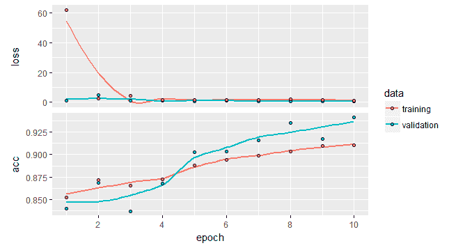

我们 14-7-7-7-14 架构的诊断图。

一旦我们准备好了自编码器，我们就用它来重建测试集:

```
# Reconstruct on the test set
 preds <- autoencoder %>% predict(X_test)
 preds <- as.data.frame(preds)
```

我们将寻找异常大的重建误差，像以前一样，被标记为异常。例如，我们可以查看那些重建误差大于`30`的点，并将其声明为异常:

```
y_preds <- ifelse(rowSums((preds-X_test)**2)/30<1,rowSums((preds-X_test)**2)/30,1)
```

同样，这个阈值并不是一成不变的，在您的特定应用中使用您的测试集，您可以对其进行微调，并找到最适合您的问题的阈值。

最后，让我们生成 ROC 曲线，看看我们的模型是否正确运行，使用:

```
library(ROCR)
pred <- prediction(y_preds, y_test)
perf <- performance(pred, measure = "tpr", x.measure = "fpr") 
plot(perf, col=rainbow(10))
```

我们看到结果是令人满意的。我们的曲线看起来很直，原因是我们的模型的输出只是二进制的，以及我们的原始标签。当您的模型输入类别概率或其代理时，曲线会更平滑:

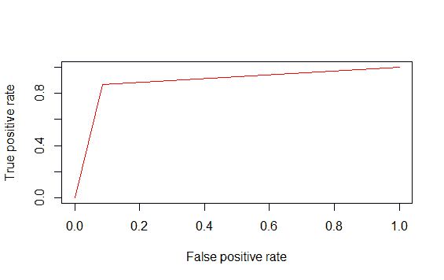

ROC 曲线:它看起来很直，因为模型的输出不是类别概率，而是二元的。


# 利用 H2O 进行欺诈检测

让我们尝试一个稍微不同的工具，它可能在实际部署中对我们有所帮助。在不断发展的数据科学领域中尝试不同的工具通常是有用的，即使只是为了检查是否健康。

H2O 是一款用于大数据分析的开源软件。这家年轻的初创公司(成立于 2016 年)的顾问委员会中有数学优化和统计学习理论方面的顶级研究人员。它运行在标准环境(Linux/Mac/Windows)以及大数据系统和云计算环境中。

您可以在 R 中运行 H2O，但是您需要首先安装软件包:

```
install.packages("h2o")
```

完成后，您就可以加载库了:

```
library(h2o)
```

然后，您将看到一条欢迎消息，以及一些警告(对其他包屏蔽的对象):

```
Your next step is to start H2O:
 > h2o.init()
For H2O package documentation, ask for help:
 > ??h2o
After starting H2O, you can use the Web UI at http://localhost:54321
 For more information visit http://docs.h2o.ai
```

让我们开始吧，然后我们就可以开始工作了:

```
h2o.init()
```

现在我们需要将数据读入 H2O。由于计算工作方式有些不同，我们不能使用 R 中的普通数据帧结构，所以我们要么像往常一样读取文件，然后强制它:

```
df <- read.csv("./data/creditcard.csv", stringsAsFactors = F)
 df <- as.h2o(df)
```

或者我们用`h2o.uploadFile`函数读取:

```
df2 <- h2o.uploadFile("./data/creditcard.csv")
```

无论哪种方式，产生的结构类型不再是数据帧，而是环境。

像往常一样，让我们留出一部分数据用于训练，一部分用于测试。在`h2o,`中，我们可以使用`h2o.splitFrame`功能:

```
splits <- h2o.splitFrame(df, ratios=c(0.8), seed=1)
 train <- splits[[1]]
 test <- splits[[2]]
```

现在，让我们来区分特征和标签，这一点很快就会派上用场:

```
label <- "Class"
 features <- setdiff(colnames(train), label)
```

我们已经准备好开始训练我们的自编码器:

```
autoencoder <- h2o.deeplearning(x=features,
 training_frame = train,
 autoencoder = TRUE,
 seed = 1,
 hidden=c(10,2,10),
 epochs = 10,
 activation = "Tanh")
```

有些评论是适当的。如您所料，autoencoder 参数设置为 true。这一次我们将使用稍微不同的体系结构，只是为了便于说明。你可以在`hidden`参数中看到，各层的结构。我们还将使用不同的激活函数。在实践中，有时使用有界激活函数是有用的，比如用 tanh 代替 ReLu，它在数值上可能是不稳定的。

我们可以用与`keras`相似的方式生成重建图像:

```
# Use the predict function as before
preds <- h2o.predict(autoencoder, test)
```

我们得到这样的结果:

```
> head(preds)
 reconstr_Time reconstr_V1 reconstr_V2 reconstr_V3 reconstr_V4 reconstr_V5 reconstr_V6 reconstr_V7
1 380.1466 -0.3041237 0.2373746 1.617792 0.1876353 -0.7355559 0.3570959 -0.1331038
2 1446.0211 -0.2568674 0.2218221 1.581772 0.2254702 -0.6452812 0.4204379 -0.1337738
3 1912.0357 -0.2589679 0.2212748 1.578886 0.2171786 -0.6604871 0.4070894 -0.1352975
4 1134.1723 -0.3319681 0.2431342 1.626862 0.1473913 -0.8192215 0.2911475 -0.1369512
5 1123.6757 -0.3194054 0.2397288 1.619868 0.1612631 -0.7887480 0.3140728 -0.1362253
6 1004.4545 -0.3589335 0.2508191 1.643208 0.1196120 -0.8811920 0.2451117 -0.1380364
```

从现在开始，我们可以像以前一样继续。但是，`h2o`有一个内置的函数，`h2o.anomaly`，它简化了我们的部分工作。

我们可以做的另一个简化是不分别导入`ggplot2`和`dplyr`，我们可以导入`tidyverse`包，将这些(和其他)对数据操作有用的包引入我们的环境:

我们调用这个函数，进行一些格式化，使行名成为列本身，并为真正的类添加标签:

```
library(tidyverse)
anomaly <- h2o.anomaly(autoencoder, test) %>%
as.data.frame() %>%
tibble::rownames_to_column() %>%
mutate(Class = as.vector(test[, 31]))
```

让我们计算平均均方误差:

```
# Type coercion useful for plotting later
anomaly$Class <- as.factor(anomaly$Class)
mean_mse <- anomaly %>%
 group_by(Class) %>%
 summarise(mean = mean(Reconstruction.MSE))
```

最后，根据重建误差可视化我们的测试数据:

```
anomaly$Class <- as.factor(anomaly$Class)
mean_mse <- anomaly %>%
    group_by(Class) %>%
    summarise(mean = mean(Reconstruction.MSE))
```

我们看到自编码器做了一件不太糟糕的工作。很大比例的欺诈案例具有相对较高的重构误差，尽管它远非完美。你如何改进它？：

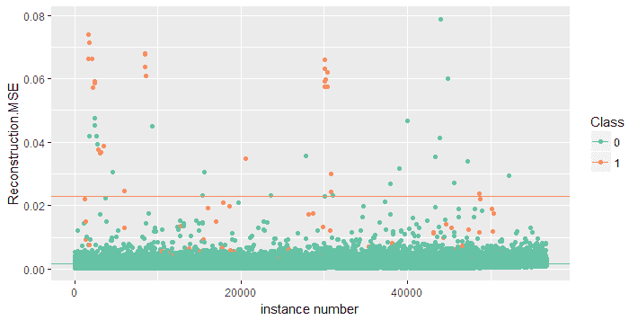

结果从我们使用 H2O 的架构中，我们看到 autoencoder 在标记欺诈案例方面做得很好，但仍有改进的余地。


# 练习

*   在我们的信用卡欺诈示例中，我们混合使用了欺诈和非欺诈案例。在这种情况下，我们很幸运，每个案例都有正确的标签。因此，在这种情况下，只进行正常事务的重建可能更有意义。如果我们只使用非欺诈案件，破案率会提高吗？运行相同的实验，但只对训练集使用非欺诈案例。
*   使用信用卡数据集，使用来自自编码器的重构作为分类模型的输入，与使用 PCA 的方式非常相似。这是否提高了分类的准确性？请注意，您可以在这个特定的数据集中这样做，因为您有关于交易类别(欺诈/非欺诈)的信息，这些信息在其他数据中可能不可用。


# 可变自编码器

**变型自编码器** ( **VAE** )是自编码问题的最新成果。与学习数据的压缩表示的自编码器不同，变分自编码器学习产生这种数据的随机过程，而不是像我们之前对神经网络所做的那样学习本质上任意的函数。

VAEs 也有编码器和解码器部分。编码器学习假设已经产生数据的正态分布的平均值和标准偏差。均值和标准差被称为**潜在变量**，因为它们不是显式观察到的，而是从数据中推断出来的。

VAEs 的解码器部分将这些潜在空间点映射回数据中。和以前一样，我们需要一个损失函数来衡量原始输入和它们的重建之间的差异。有时会添加一个额外的术语，称为**库尔贝克-莱布勒散度，**或简称为 KL 散度。KL 散度粗略地计算了一个概率分布与另一个概率分布的差异。增加 KL 散度，迫使后验分布类似于先验分布。反过来，这有助于学习更好的数据表示并减少过度拟合。

与自编码器不同，VAEs 有一个坚实的概率基础，所以你得到的分数实际上是一个观察值成为异常值的概率。在自编码器中，我们得到的分数没有这样的解释，因此截止值或阈值的选择完全依赖于人类专家的输入，并且是严格特定的数据。


# 使用 VAEs 的图像重建

我们的第一个例子将使用 MNIST 数据来说明变分自编码器的使用。

发展战略如下:

*   首先，编码器网络将输入样本 *x* 、*T5转换成潜在空间中的两个参数，这两个参数将被表示为 *z_mean* 和 *z_log_sigma**
*   然后，我们从我们假设用于生成数据的潜在正态分布中随机抽取相似点 *z* ，作为*z ~ z _ mean+exp(z _ log _ sigma)*ε***其中ε是随机正态张量**
***   一旦完成，解码器网络将这些潜在空间点 *z* 映射回原始输入数据**

 **我们像往常一样开始获取和预处理数据:

```
library(keras)
# Switch to the 1-based indexing from R
options(tensorflow.one_based_extract = FALSE)
K <- keras::backend()
mnist <- dataset_mnist()
X_train <- mnist$train$x
y_train <- mnist$train$y
X_test <- mnist$test$x
y_test <- mnist$test$y
# reshape
dim(X_train) <- c(nrow(X_train), 784)
dim(X_test) <- c(nrow(X_test), 784)
# rescale
X_train <- X_train / 255
X_test <- X_test / 255
```

请注意附加行:

```
K <- keras::backend()
```

这为我们提供了对张量后端的引用，Keras 将在这里执行张量操作。

现在我们转向 VAE。它将由一个大小为`2`的潜在维度和一个隐藏的`256`神经元层组成:

```
orig_dim <- 784
latent_dim <- 2
inner_dim <- 256
X <- layer_input(shape = c(original_dim))
hidden_state <- layer_dense(X, intermediate_dim, activation = "relu")
z_mean <- layer_dense(hidden_state, latent_dim)
z_log_sigma <- layer_dense(hidden_state, latent_dim)
```

接下来，在 Keras 后端的帮助下，我们定义了从潜在变量生成数据的采样函数:

```
sample_z<- function(params){
 z_mean <- params[,0:1]
 z_log_sigma <- params[,2:3]
 epsilon <- K$random_normal(
 shape = c(K$shape(z_mean)[[1]]), 
 mean=0.,
 stddev=1
 )
 z_mean + K$exp(z_log_sigma/2)*epsilon
}
```

我们现在定义采样点:

```
z <- layer_concatenate(list(z_mean, z_log_sigma)) %>%
  layer_lambda(sample_z)
```

是时候定义解码器了。我们创建这些层的单独实例，以便以后能够重用它们:

```
decoder_hidden_state <- layer_dense(units = intermediate_dim, activation = "relu")
decoder_mean <- layer_dense(units = original_dim, activation = "sigmoid")
hidden_state_decoded <- decoder_hidden_state(z)
X_decoded_mean <- decoder_mean(hidden_state_decoded)
```

我们准备好了！我们的 VAE 由以下编码器和解码器组件指定:

```
# end-to-end autoencoder
variational_autoencoder <- keras_model(X, X_decoded_mean)

encoder <- keras_model(X, z_mean)
decoder_input <- layer_input(shape = latent_dim)
decoded_hidden_state_2 <- decoder_hidden_state(decoder_input)
decoded_X_mean_2 <- decoder_mean(decoded_hidden_state_2)
generator <- keras_model(decoder_input, decoded_X_mean_2)
```

仍然需要指定自定义损失函数，因为我们添加了 KL-divergence 惩罚:

```
loss_function <- function(X, decoded_X_mean){
  cross_entropy_loss <- loss_binary_crossentropy(X, decoded_X_mean)
  kl_loss <- -0.5*K$mean(1 + z_log_sigma - K$square(z_mean) - K$exp(z_log_sigma), axis = -1L)
  cross_entropy_loss + kl_loss
}
```

我们像往常一样编译并运行我们的算法:

```
variational_autoencoder %>% compile(optimizer = "rmsprop", loss = loss_function)
history <- variational_autoencoder %>% fit(
  X_train, X_train, 
  shuffle = TRUE, 
  epochs = 10, 
  batch_size = 256, 
  validation_data = list(X_test, X_test)
)
plot(history)
```

训练完成后，我们可以看到表演(或者使用 RStudio 中的查看器实时跟踪表演):

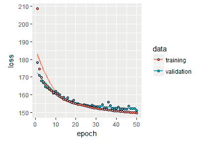

在 MNIST 数据中的性能。

我们可以使用下面的代码片段来检查我们的算法的性能:

```
library(ggplot2)
preds <- variational_autoencoder %>% predict(X_test)
error <- rowSums((preds-X_test)**2)
eval <- data.frame(error=error, class=as.factor(y_test))
eval %>% 
 group_by(class) %>% 
 summarise(avg_error=mean(error)) %>% 
 ggplot(aes(x=class,fill=class,y=avg_error))+geom_col()
```

结果如下所示:


重建误差看起来相当令人沮丧，因为我们显然更好地利用了自编码器。我们如何改进这一点？一种方法是提高潜在空间的维度。在我们目前的设置中，我们的潜在空间只是二维的。但是，请注意，在质量方面没有太大损失:

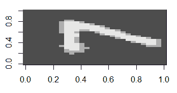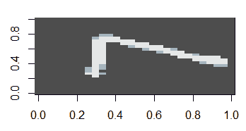

左边是我们的 VAE 重建的图像，右边是原始图像(在屏幕上)。

而且，我们现在有了一个生成过程！这意味着我们可以自己创造数字。让我们遍历潜在空间，使用概率分布来生成我们自己的数字:

```
# Reshape original and reconstructed
dim(X_test) <- c(nrow(X_test),28,28)
dim(preds) <- c(nrow(preds),28,28)
image(255*preds[1,,], col=gray.colors(3))
y_test[1]
image(255*X_test[1,,], col=gray.colors(3))

grid_x <- seq(-4, 4, length.out = 3)
grid_y <- seq(-4, 4, length.out = 3)

rows <- NULL
for(i in 1:length(grid_x)){
  column <- NULL
  for(j in 1:length(grid_y)){
    z_sample <- matrix(c(grid_x[i], grid_y[j]), ncol = 2)
    column <- rbind(column, predict(generator, z_sample) %>% matrix(ncol = 28) )
  }
  rows <- cbind(rows, column)
}
rows %>% as.raster() %>% plot()
```

让我们看看 VAE 生成的几个数字:

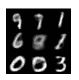

由 VAE 生成的数字。


# MNIST 的异常检测

让我们再来看看 MNIST 的异常值检测问题。像以前一样，假设这次数字`0`是我们的异常值，我们希望能够检测到它。

我们像以前一样，读取和预处理数据:

```
library(keras)
# Switch to the 1-based indexing from R
options(tensorflow.one_based_extract = FALSE)
K <- keras::backend()
mnist <- dataset_mnist()
X_train <- mnist$train$x
y_train <- mnist$train$y
X_test <- mnist$test$x
y_test <- mnist$test$y
## Exclude "0" from the training set. "0" will be the outlier
outlier_idxs <- which(y_train!=0, arr.ind = T)
X_train <- X_train[outlier_idxs,,]
y_test <- sapply(y_test, function(x){ ifelse(x==0,"outlier","normal")})
# reshape
dim(X_train) <- c(nrow(X_train), 784)
dim(X_test) <- c(nrow(X_test), 784)
# rescale
X_train <- X_train / 255
X_test <- X_test / 255
```

然后我们定义我们的编码器结构。注意，我们将使用不同结构的`128`维潜空间和中间层的`256`神经元:

```
original_dim <- 784
latent_dim <- 2
intermediate_dim <- 256
X <- layer_input(shape = c(original_dim))
hidden_state <- layer_dense(X, intermediate_dim, activation = "relu")
z_mean <- layer_dense(hidden_state, latent_dim)
z_log_sigma <- layer_dense(hidden_state, latent_dim)
```

并重写我们的`sample_z`函数，使其更易于定制:

```
sample_z<- function(params){
  z_mean <- params[,0:1]
  z_log_sigma <- params[,2:3]
  epsilon <- K$random_normal(
    shape = c(K$shape(z_mean)[[1]]), 
    mean=0.,
    stddev=1
  )
  z_mean + K$exp(z_log_sigma/2)*epsilon
}
```

然后我们来看解码器部分:

```
z <- layer_concatenate(list(z_mean, z_log_sigma)) %>% 
  layer_lambda(sample_z)
decoder_hidden_state <- layer_dense(units = intermediate_dim, activation = "relu")
decoder_mean <- layer_dense(units = original_dim, activation = "sigmoid")
hidden_state_decoded <- decoder_hidden_state(z)
X_decoded_mean <- decoder_mean(hidden_state_decoded)
```

最后，完整的自编码器:

```
variational_autoencoder <- keras_model(X, decoded_X_mean)
encoder <- keras_model(X, z_mean)
decoder_input <- layer_input(shape = latent_dim)
decoded_hidden_state_2 <- decoder_hidden_state(decoder_input)
decoded_X_mean_2 <- decoder_mean(decoded_hidden_state_2)
generator <- keras_model(decoder_input, decoded_X_mean_2)
```

我们用以下公式定义损失函数:

```
loss_function <- function(X, decoded_X_mean){
  cross_entropy_loss <- loss_binary_crossentropy(X, decoded_X_mean)
  kl_loss <- -0.5*K$mean(1 + z_log_sigma - K$square(z_mean) - K$exp(z_log_sigma), axis = -1L)
  cross_entropy_loss + kl_loss
}
```

我们使用与之前相同的函数来训练模型:

```
variational_autoencoder %>% compile(optimizer = "rmsprop", loss = loss_function)
history <- variational_autoencoder %>% fit(
  X_train, X_train, 
  shuffle = TRUE, 
  epochs = 10, 
  batch_size = 256, 
  validation_data = list(X_test, X_test)
)
plot(history)
```

培训完成后，我们会查看表现:

```
preds <- variational_autoencoder %>% predict(X_test)
error <- rowSums((preds-X_test)**2)
eval <- data.frame(error=error, class=as.factor(y_test))
library(dplyr)
library(ggplot2)
eval %>% 
 ggplot(aes(x=class,fill=class,y=error))+geom_boxplot()
```

让我们看看每个类的重构误差:


使用 VAE 的重建误差。

该图建议您将阈值的重建误差设置为`5`:

```
threshold <- 5
y_preds <- sapply(error, function(x){ifelse(x>threshold,"outlier","normal")})
```

我们现在来看混淆矩阵:

```
table(y_preds,y_test)
         y_test
y_preds normal outlier
  outlier 9020     980
```

这表明我们的方向是正确的！但在庆祝之前，我们应该看看其他分类指标，ROC 曲线和曲线下面积(AUC):

```
library(ROCR)
 pred <- prediction(error, y_test)
 perf <- performance(pred, measure = "tpr", x.measure = "fpr")
 auc <- unlist(performance(pred, measure = "auc")@y.values)
 auc
 plot(perf, col=rainbow(10))
```

我们得到一个 AUC`0.8473375`和一个合理的 ROC 图，如下所示，这告诉我们，我们的 VAE 在区分异常值`0`方面做得很好。

请注意，这比数字 7 是异常值时要好得多。这告诉我们，当一个异常的观察与通常的观察太相似时，我们需要付出额外的努力:

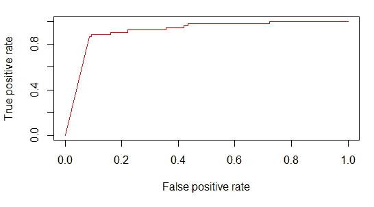

变分自编码器的 ROC 曲线。


# 文本欺诈检测

欺诈已经成为一个超越传统交易欺诈的问题。例如，许多网站依赖用户对餐馆、酒店或旅游景点等服务的评论，这些评论以不同的方式赚钱。如果用户对这些评论失去了信任，例如，一个企业主故意搞乱他或她自己企业的好评论，那么网站将很难重新获得信任并保持盈利。因此，检测这些潜在问题非常重要。

自编码器如何帮助我们做到这一点？和以前一样，这个想法是学习一个网站上的*正常*审查的表示，然后找到那些不符合*正常*审查的。文本数据的问题在于之前需要做一些处理。我们将用一个例子来说明这一点，这个例子也将作为在下一章中讨论的不同文本建模方法的动机。


# 从非结构化文本数据到矩阵

文本数据的一个问题是单词和句子是杂乱的，数据挖掘算法通常不是现成的，因为它们被设计成对数据的抽象进行操作，通常是矩阵形式。所以我们需要找到一种方法将我们杂乱的文本数据表示为一个矩阵。

实践中最常用的矩阵表示之一是*单词包*模型。这是从文本中提取信息的一种非常简单和直观的方式。有一些注意事项，将在后面讨论。

文本的单词包表示包括:

*   已知单词的词汇表
*   与这些词的存在相关的数字度量

例如，假设我们有一个由三个句子组成的*语料库*(文档集合):

*   `"My sentence"`
*   `"Your sentence"`
*   `"My sentence, your sentence, our sentences"`

词汇表(忽略逗号)是集合`("My","sentence","sentences","Your","your","our")`。至于数值度量，一个自然的选项是计数函数。所以矩阵表示应该是:

| `My` | `Your` | `sentence` | `sentences` | `your` | `our` |
| 一 | 0 | 一 | 0 | 0 | 0 |
| 0 | 一 | 一 | 0 | 0 | 0 |
| 一 | 0 | 2 | 一 | 一 | 一 |

这是我们现在可以操作的东西。请注意，一些评论是适当的。我们忽略了逗号，这看起来没什么大不了的，但确实如此，我们将回头再讨论它。第二，我们将`"Your"`和`"your"`作为不同的单词包含在内，这可能是不可取的。请注意，从信息的角度来看，`"sentence"`和`"sentences"`也是相似的。如果我们想推断文档的内容，只保留其中一个就足够了。

为了处理大写问题，我们可以简单地将所有的单词先转换成小写，然后再转换成矩阵形式。通过不同的算法来处理来自*词根*的复数或其他派生单词，称为**词干分析器**。最常见的选择是波特的词干算法。有时做词干并不是一个好主意，这可能取决于语言和问题的上下文。

根据上下文，有时代词等常用词最好省略。互联网上有一系列这样的词，叫做**停用词**。所以在创建矩阵表示之前，你过滤掉那些词，这也降低了问题的维度。

对词频进行评分的一个问题是，我们将让高频词支配矩阵表示，但从信息的角度来看，这种支配可能是无用的。取而代之的是，通常使用其他的表示方法，比如 TF–IDF，它代表文本文档-逆文档频率。有不同的计算方法，大致等价，如果 *w* 是一个单词， *D* 是文档的集合， *d* 是那里的一个文档(前面例子中的一个句子)，那么:


你可以玩玩这些，例如，你可以使用特征函数(如果单词不在，0；如果在，1)或者它的对数来代替分子中单词的频率。同样，你可以考虑分母的不同可能性。

去掉标点符号的问题有点微妙，它与单词袋方法的主要缺点有关，意思完全丢失了。即使不考虑标点符号，像`Alice loves pizza`和`Pizza loves Alice`这样的句子也可以用相同的方式表示，但是它们有不同的含义。有了标点，我们可以得到完全相反的意思，句子`Pardon, impossible execution`和`Pardon impossible, execution`表示相反的东西。

上下文也丢失了，单词内部的关系也可能丢失。例如，文档`I was in Paris`和`I saw the Eiffel tower`显然是相关的，但是它们在单词包表示中看起来是正交的文档。我们将在后面的章节中讨论其中的一些问题。


# 从文本到矩阵表示——安然数据集

安然电子邮件数据集包含大约 500，000 封由安然公司员工生成的电子邮件。它是美国联邦能源管理委员会在调查安然公司倒闭时获得的。安然公司是一家总部设在德克萨斯州休斯顿的美国能源公司，它卷入了会计欺诈丑闻，最终导致其破产。我们将使用子集作为例子，但你可以从 ka ggle([https://www.kaggle.com/wcukierski/enron-email-dataset](https://www.kaggle.com/wcukierski/enron-email-dataset))或卡耐基梅隆大学的计算机科学学院([https://www.cs.cmu.edu/~./enron/](https://www.cs.cmu.edu/~./enron/))访问完整的数据集(50 万封电子邮件)。

对于文本挖掘，我们将使用包，`tm`([https://cran.r-project.org/web/packages/tm/index.html](https://cran.r-project.org/web/packages/tm/index.html))和`SnowballC`([https://cran . r-project . org/web/packages/snow ballc/index . html](https://cran.r-project.org/web/packages/SnowballC/index.html))。请务必在以下时间之前安装它们:

```
install.packages("tm")
install.packages("SnowballC")
```

我们首先在工作区中加载数据帧。我们将省略一些预处理词干，并假设您的数据帧有两列，email 和 responsive。如果原始数据中没有响应列(并非所有版本都有)，我们会为小样本手工标记响应列。从法律角度来说，响应意味着电子邮件是否与欺诈调查相关:

```
df <- read.csv("./data/enron.csv")
names(df)
[1] "email"      "responsive"
```

我们加载了`tm`库，并从 email 列创建了一个语料库对象:

```
library(tm)
corpus <- Corpus(VectorSource(df$email))
```

我们可以使用`inspect`命令访问每封电子邮件，如下所示:

```
inspect(corpus[[1]])
```

在建模之前，对我们的数据进行了一系列转换:转换为小写字母、删除标点符号、停用词和词干:

```
corpus <- tm_map(corpus,tolower)
corpus <- tm_map(corpus, removePunctuation)
corpus <- tm_map(corpus, removeWords, stopwords("english"))
corpus <- tm_map(corpus, stemDocument)
```

一旦完成，我们就可以获得文档的矩阵表示，如下所示:

```
dtm <- DocumentTermMatrix(corpus)
dtm <-  removeSparseTerms(dtm, 0.97)
X <- as.data.frame(as.matrix(dtm))
X$responsive <- df$responsive
```

我们创建训练/测试分割。为此，我们可以使用库`caTools`:

```
# Train, test, split
library(caTools)
set.seed(42)
spl <- sample.split(X$responsive, 0.7)
train <- subset(X, spl == TRUE)
test <- subset(X, spl == FALSE)
train <- subset(train, responsive==0)
```


# 矩阵表示上的自编码器

一旦我们将文本放入矩阵形式，我们就可以继续自编码器的训练，就像前面几节一样。

请注意，我们的 autoencoder 在培训部分只会有未回复的电子邮件。这在这个只有几百个样本的数据集中非常有用。

一旦完成，我们创建我们的训练和测试集，像以前一样分成`X`和`y`组件:

```
X_train <- subset(train,select=-responsive)
y_train <- train$responsive
X_test <- subset(test,select=-responsive)
y_test <- test$responsive
```

现在，我们准备定义我们的自编码器。我们将只使用尺寸为`32`的内层:

```
library(keras)
input_dim <- ncol(X_train)
inner_layer_dim <- 32
input_layer <- layer_input(shape=c(input_dim))
encoder <- layer_dense(units=inner_layer_dim, activation='relu')(input_layer)
decoder <- layer_dense(units=input_dim)(encoder)
autoencoder <- keras_model(inputs=input_layer, outputs = decoder)
autoencoder %>% compile(optimizer='adam', 
                        loss='mean_squared_error', 
                        metrics=c('accuracy'))
```

然后，对于培训:

```
X_train <- as.matrix(X_train)
X_test <- as.matrix(X_test)
history <- autoencoder %>% fit(
 X_train,X_train, 
 epochs = 100, batch_size = 32, 
 validation_data = list(X_test, X_test)
)
plot(history)
```

我们查看测试集上的重构，并查看两个类中的错误分布:

```
# Reconstruct on the test set
preds <- autoencoder %>% predict(X_test)
error <- rowSums((preds-X_test)**2)
library(tidyverse)
eval %>% 
 filter(error < 1000) %>%
 ggplot(aes(x=error,color=class))+geom_density()
```

像往常一样，让我们看看每个类的误差分布，这次是用密度图:

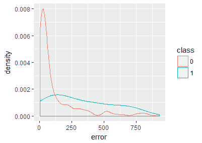

每类重建误差的分布。

注意，和以前一样，我们过滤了重建误差，这有助于我们查看大部分观测值所在的尺度。我们的目标是为重建错误设置阈值，以标记为异常值(在这种情况下，这意味着该电子邮件不是普通的电子邮件通信)。从视觉上看，100 似乎是一个合理的阈值，尽管我们会得到大量的误报:

```
threshold <- 100
y_preds <- sapply(error, function(x){ifelse(x>threshold,"outlier","normal")})
# Confusion matrix
table(y_preds,y_test)
         y_test
y_preds    0 1
 normal  142 7
 outlier 73 35
```

我们在捕捉可疑邮件方面做得相当不错，代价是 73 次误报。在捕捉大量假阳性和忽略真阳性之间总是有一个权衡。该模型可以通过添加更多数据来改进，我们只使用了 500，000 封可用电子邮件中的大约 800 封，因此显然还有改进的空间。然而，该模型工作得相当好，如 AUC 值 0.79 和 ROC 图所证实的:

```
library(ROCR)
pred <- prediction(error, y_test)
perf <- performance(pred, measure = "tpr", x.measure = "fpr") 
auc <- unlist(performance(pred, measure = "auc")@y.values) 
plot(perf, col=rainbow(10))
auc
[1] 0.7951274
plot(perf, col=rainbow(10))
```

我们看到安然数据集的 ROC 曲线如下。这使我们能够在一般情况下诊断我们的二元分类器模型，而不仅仅是在这种情况下:

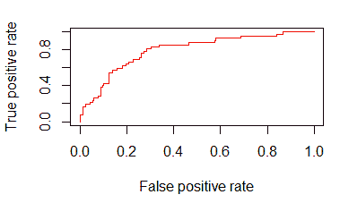

安然数据集的 ROC 曲线。


# 练习

*   使用原始的安然数据集创建一个自编码器，可以识别可疑和非可疑的电子邮件。
*   除了自编码器，你还可以尝试使用不同的自编码器。比较两种方法的性能。


# 摘要

在本章中，我们了解到自编码器是一种主要用于图像重建和去噪的技术，以获得数据的压缩和概括表示。我们看到它们有时也用于欺诈检测任务。离群点识别来自于测量重建误差，观察重建误差的分布，我们可以设置用于识别离群点的阈值，并学习产生数据的概率过程。因此，变分自编码器也能够生成新数据。***