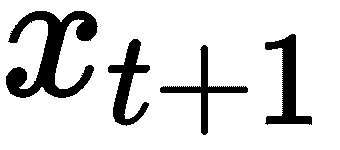
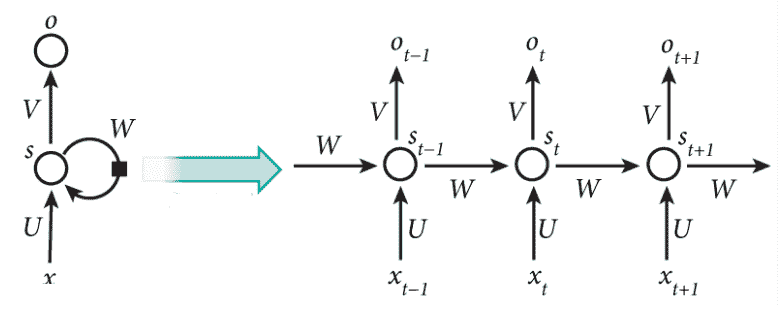
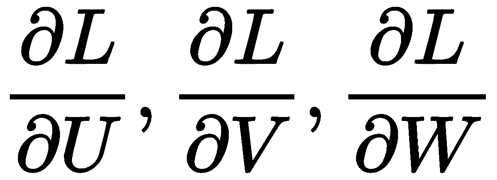
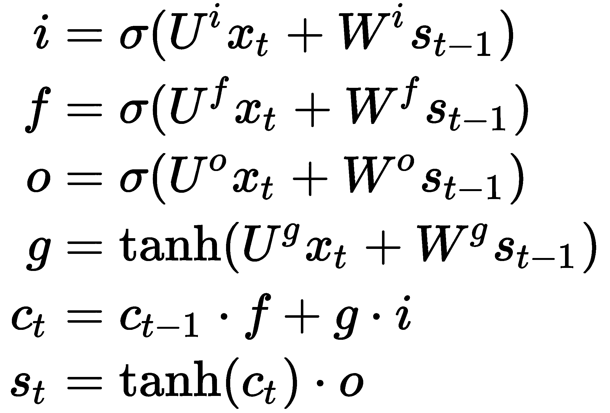
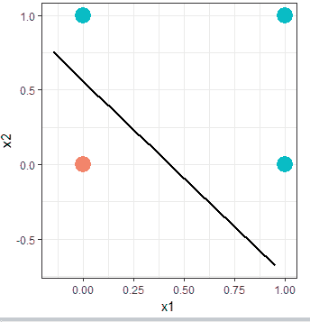
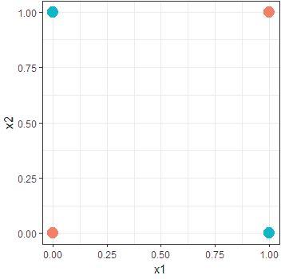

# 十五、使用循环神经网络的文本生成

在这一章中，我们将描述现代(在撰写本文时——2017 年末)机器学习、循环神经网络中一些最令人兴奋的技术。然而，它们不是新的；自 20 世纪 80 年代以来，它们就一直存在，但由于近年来语言相关任务中的大量记录，它们变得越来越受欢迎。

为什么我们需要不同类型的文本架构？考虑下面的例子:

*“我从 2015 年开始住在布拉格”*

和

*“从 2015 年起我住在布拉格”*

如果我们想教一个传统的前馈网络，如感知器或多层感知器来识别我搬到布拉格的日期，那么这个网络将不得不为每个输入特征学习单独的参数，这特别意味着它将不得不学习语法来回答这个简单的问题！这在许多应用中是不希望的。类似的问题促使机器学习研究人员和统计学家在 20 世纪 80 年代引入了在模型的不同部分共享参数的想法。这个想法是循环神经网络的秘密酱，我们的下一个深度学习架构。

通过设计，循环神经网络非常适合处理顺序数据。一般来说，应用于序列数据的机器学习可以大致分为四个主要领域:

*   序列预测:给定，预测序列的下一个元素
*   序列分类:给定，为其预测一个类别或标签
*   序列生成:给定，生成序列的一个新元素
*   序列到序列预测:给定，生成一个等价序列

序列预测的应用包括天气预报和股票市场预测。对于分类，我们可以想到，例如，情感分析和文档分类。自动图像字幕或文本生成是序列生成问题家族的一部分，而机器翻译可能是我们在日常生活中看到的最熟悉的序列到序列预测的例子。

本章的重点是循环神经网络在文本生成中的应用。正如我们之前看到的，文本生成是一个更大的问题集*，*的一部分，因此我们的许多算法可以移植到其他环境中。

训练深度学习模型通常很耗时，循环神经网络也不例外。我们的重点是数据上的想法，我们将用比你以后在野外可能遇到的更小的数据集来说明。这是为了清楚起见:我们想让你在任何标准笔记本电脑上更容易上手。一旦你掌握了基础知识，你就可以在你最喜欢的云提供商那里剥离你自己的集群。


# 循环神经网络有什么令人兴奋的？

作为一名数学出身的人，在我相当忙碌的职业生涯中，我看到过许多不同的趋势，尤其是在过去几年里，这些趋势听起来都与我非常相似:“*你有问题吗？小波可以救你！*、*有限元是一切的解决方案*，以及类似的过激主张。

当然，每个工具都有它的时间和地点，更重要的是，它擅长的应用领域。我发现循环神经网络非常有趣，因为它们可以实现许多功能:

*   产生一致的标记文本(开始和结束标签，识别类似时间戳的数据)
*   通过学习 URL 应该是什么样子，撰写带有参考的维基百科文章，并从不存在的地址创建 URL
*   用乳胶制作看起来可信的科学论文

所有这些令人惊奇的特性在网络没有任何上下文信息或元数据的情况下都是可能的。特别是，在不懂英语，也不知道 URL 或 LaTeX 语法是什么样子的情况下。

安德烈·卡帕西在*循环神经网络的不合理有效性:*[http://karpathy.github.io/2015/05/21/rnn-effectiveness/](http://karpathy.github.io/2015/05/21/rnn-effectiveness/)中出色地描述了神经网络的这些甚至更有趣的能力。

是什么让循环神经网络令人兴奋？我们可以对向量序列进行操作，而不是将固定输入大小限制为固定输出大小。

包括标准前馈神经网络在内的许多机器学习算法的局限性在于，它们接受固定大小的向量作为输入，并产生固定大小的向量作为输出。例如，如果我们想对文本进行分类，我们接收一个文档集，从中我们创建一个词汇表来对每个文档进行向量化，输出是一个带有类别概率的向量。相反，循环神经网络允许我们将向量序列作为输入。因此，从固定输入大小和固定输出大小之间的一对一对应关系来看，我们有一个更丰富的前景，一对一，一对多，多对一，多对多。

为什么这是可取的？让我们看几个例子:

*   **一对一**:监督学习，例如文本分类
*   **一对多**:给定一个输入文本，生成一个摘要(包含重要信息的单词序列)
*   **多对一**:文本中的情感分析
*   **多对多**:机器翻译

此外，由于循环神经网络保持根据新信息更新的内部状态，我们可以将 RNNs 视为程序的描述。事实上，Siegelman 在 1995 年的一篇论文表明，循环神经网络是图灵完全的，它们可以模拟任意程序。


# 但是什么是循环神经网络呢？

网络如何跟踪先前的状态？把它放在文本生成的上下文中，把我们的训练数据想象成一个字符序列的列表(标记化的单词)。对于每个单词，从第一个字符开始，我们将预测以下内容:

形式上，我们将一个 *t+1* 字符序列表示为*x =【x[0]，x [1] ，x [2] ，...，x[t]*。让 *s [-1] =0* 。

对于 *k=0，2，...t* ，我们构造如下序列:


下图对此进行了总结，当接收到输入 *x* 时，网络的内部状态 *s* 被修改，然后用于生成输出 *o:*



图 1:RNN 的信息流。这些表示是等价的；展开的表示暗示了反向传播在这种设置中如何工作。

隐藏状态， *s* ，不需要像你想象的那样是一维的。当然，它不应该太大，否则您可能会经历过度拟合。一个好的开始方法是选择一个比输入空间小一个数量级的隐藏层，这样如果你的输入向量存在于一个一千维的空间中(这在文本问题中并不少见)，那么你的隐藏状态应该是数百个。

传统的深度神经网络在每一层使用不同的参数。在循环神经网络中，参数在所有时间步骤中共享(参见前面的*图 1* )。这反映了任务是相同的(在这种情况下，*读取*)，只是输入不同。这也有助于减少我们需要学习的参数数量。

我们选择`tanh`函数，因为它将输入放在范围[-1，1]内。稍后，我们将希望使用网络的输出作为概率；输出层是 *softmax* 函数。

图 1 所示的图表充分描述了我们网络的**正向传播**，给定权重矩阵，我们可以计算网络的输出。但是我们应该如何训练网络来找到那些权重呢？

与通常的神经网络一样，这种想法是使用网络预测和训练标签之间的差异来调整正确方向上的权重。为此，我们需要指定一个损失函数。一种常见的选择是交叉熵损失函数:


其中 *N* 表示训练样本的数量。此函数测量预测类的加权分数乘以该类的对数概率。请注意，如果正确类别的概率为 1，则损失为零，否则损失为正。这意味着交叉熵惩罚我们不自信。注意，它也惩罚了我们的自信和不正确(为什么？).

为了更新权重，我们需要计算导数:

 

我们还需要在减小误差的方向上更新权重，即梯度的相反方向。这听起来并不比标准神经网络中的普通反向传播更复杂。由于隐藏状态，循环神经网络中的情况稍微复杂一些，隐藏状态将当前时间步长与先前历史联系起来。为了看到这一点，假设我们想要计算损失函数相对于 *W* 的偏导数。我们需要计算:


这里没有什么奇怪的，简单地使用链式法则。有什么诀窍？问题出在前面表达式的第二项和第三项中。在时间 *t* 的内部状态取决于前一时间的内部状态。因此，我们的计算实际上是:


从上图可以看出这种计算应该如何进行，图中显示了网络的展开版本。前面的计算是反向传播算法的一种不同形式，称为通过时间的**反向传播。********

 **前述的一个重要结果是循环神经网络难以训练。由于`tanh`函数的导数以 1 为界，在前面的计算中，我们看到很多项在 0 和 1 之间相乘。因此，产生的梯度会很小，在训练的早期，它的数值可能会变为零。这很糟糕，因为这阻止了学习长期依赖。这是因为来自*远处*台阶的梯度贡献变为零，因为根据链式法则，它们是许多小于 1 的数的乘积。这个问题被称为消失梯度问题，由 Sepp Hochreiter 于 1991 年首次发现。它绝不排斥循环神经网络。当你有许多层时，标准的前馈神经网络也有同样的问题(当它们有四层或更多层时，我们说它们是深的)，只是循环神经网络往往非常深；在我们的例子中，和句子长度一样深。

有几种方法可以解决渐变消失的问题，你可以使用 ReLU 函数，用 R 表示就是:

```
ifelse(x>0,x,0)
```

这个函数的梯度为 0 或 1，因此它可以帮助我们避免梯度消失的问题。将探索参数空间的相关部分，即使它们对应于*遥远的*历史中的变化。另一种可能性是使用不同的机制，如 Hochreiter 和 Schmidhuber 在 1997 年提出的 LSTM 网络，或 Cho 和合著者在 2014 年提出的 GRU 网络。我们将在下一节简要描述这些网络。

除了消失梯度问题，你可以想象，根据网络的结构和你选择的激活函数，你可以有相反的情况，爆炸梯度。例如，如果雅可比矩阵的值很小，就会发生这种情况。这在某种程度上不那么严重，因为您将在代码中得到一个`NaN`错误。一种解决方法是剪切梯度，这只是意味着您应该添加一个条件，过滤掉超过某个阈值的值。当然，这将取决于您的特定应用，在某些情况下，您可能希望查看不同的值。

实现不同类型的神经网络的主要复杂性是梯度的计算。在简单的情况下，这可以手工完成，但是，正如您所看到的，事情很快失去控制。

一旦获得梯度，我们可以使用不同的方法，也许最流行的是随机梯度下降法。不幸的是，随机梯度下降不是即插即用的 T2。您需要花一些时间来摆弄步长超参数，以使它正常工作。这对于使用神经网络来说是非常糟糕的。其他的解决方案，如**阿达格拉德**，在实践中使用。Adagrad 实现起来特别简单，我们将在本章后面介绍。学习率是按分量调整的，由历史分量梯度的平方和的平方根给出。其他优化器包括 RMSProp 和 Adam。Adagrad 的一个优势，或者至少是理论上的保证，是它背后有一个完善的理论，而不是启发式的。

有可能优化循环神经网络而不依赖于梯度方法。例如，通过使用遗传或进化算法。在某些情况下，进化算法有利于找到全局最小值，因为通过避免梯度的方向，它们可以找到更好的解决方案。这种算法的一个缺点是它们可能是计算密集型的。


# LSTM 和 GRU 网络

正如我们所见，RNN 和 LSTM 网络的递归结构存在梯度问题，梯度要么消失，要么爆炸。一个解决方法是引入忘记门，它将删除一些旧的信息。这有助于在不破坏梯度的情况下跟踪相关信息，并更好地保存很久以前观察到的重要数据。

LSTM 和 GRU 分享了循环神经网络的相同设计原理，给出一个输入，计算一个输出，然后一个黑盒更新内部状态。为了理解更大的图景，这是至关重要的。


# LSTM

对于 LSTM，我们要计算很多东西:

*   一个输入门， *i*
*   一个忘记的门， *f*
*   一个输出门， **o**
*   一个候选内部状态， **g**
*   单元的内部存储器， *c*
*   最终内部状态， *s*

这些由以下递归方程定义:



其中:


前三个等式描述了输入门、遗忘门和输出门。它们被称为**门**，因为它们决定新计算的候选状态的哪一部分将被允许通过，哪一部分将被遗忘。给定新的观察结果，我们可能想要保留旧记忆中的一些东西，删除其他东西，或者决定考虑多少新信息。这是在内存变量 *c* 中计算的。最后，考虑到这次内存更新，我们保留了一部分内存供网络的其他部分使用。如果输入门的权重全部设置为 1，则遗忘门的权重全部设置为 0，输出门的权重全部设置为 1。我们几乎恢复了标准的循环神经网络，只是激活层会多一个`tanh`。

基于这一基本模型，LSTM 建筑有许多变体。示例包括卷积、双向、窥视孔和带遗忘门的 LSTM。一个很好的资源是 Chris Olah 关于这个主题的博客文章:[http://colah.github.io/posts/2015-08-Understanding-LSTMs/](http://colah.github.io/posts/2015-08-Understanding-LSTMs/)。


# 苏军总参谋部情报总局

门控循环单元 ( **GRUs** )与 LSTM 层有着相似的设计理念。它们包括:

*   一个隐藏状态， *h*
*   *一种内部状态， *s* 一*
*   一个更新门， *z*
*   一个复位门， *r*

更新由以下递归关系给出:


重置门告诉我们如何把输入和之前的记忆放在一起。更新门定义了我们应该为下一次迭代保留多少先前的内存。这有助于网络忘记无用的东西，并与更新的证据建立联系。所得到的网络没有独立于内部状态的隐藏存储器(c ),这与 LSTMs 的情况不同。它们还将输入和遗忘门合并到更新门中。另一个关键区别是，在计算最终输出时，没有第二次非线性(第二次调用 LSTMs 中的`tanh`)。

那么，用哪个呢？这个问题还没有定论。没有确凿的证据表明一个网络优于另一个网络。gru 的参数更少，训练起来可能更快。他们也可能需要更少的数据来很好地概括(因为更容易准确地估计权重)。gru 是 2014 年的新生事物，所以还没有得到很好的研究。


# R 中从头开始的 RNNs

本节的目的是向您展示如何在 r 中从基本框架实现循环神经网络。出于多种原因，这可能不是最佳解决方案，但它是开始深度学习的一个好方法。

有许多与 r 兼容的*即插即用*框架，如 H2O、MXNet、TensorFlow 或 Keras。我们的目标是专注于对算法的理解，而不是特定的 API，尽管我们将包括一个使用 Keras 的示例。这有两个原因，在撰写本文时，与 R 的兼容性正遭受着成长的烦恼，我们遇到了许多不同包的错误和问题。另一方面，即使是这些包的稳定版本也有不断变化的 API。我们将在这一节集中讨论使用 r。

我们将从头开始，使用感知器的例子快速介绍 R 中的 R6 类，并从那里逐步构建。


# 和 R6 一起在 R 中上课

R 语言支持面向对象的编程，尽管没有通用的类定义标准。r 有不同的阶级体系，S3，S4，R5 和 R6。因为 R 最初是一个统计游乐场软件，所以现代通用编程语言的一些特性在那里并不存在。因此，复杂的项目有点难写，但也不是不可能，由于社区的支持，情况一直在改善。

为什么叫 R6？根据 R 官方文档([https://cran . R-project . org/web/packages/R6/vignettes/introduction . html](https://cran.r-project.org/web/packages/R6/vignettes/Introduction.html))，R6 是 R5 包的继任者，R5 包的开发已经停止。R6 试图改善 S3 和 S4 的一些不足。它也是实现自修改对象的推荐方法，就像这里的情况。随着训练的进行，我们需要改变网络的权重。

我们如何定义 R6 类？让我们在下一节中用一个例子向您展示这一点。


# 作为 R6 类的感知机

感知器是最简单的神经网络。它由一个输入和一个输出组成(无隐层)，当包含偏置项时，激活函数就是 Heaviside 函数(原点处的阶跃函数)。

这是这个类的框架:

```
library(R6)
Perceptron <- R6Class("Perceptron", 
 public = list(
     threshold = NULL,
     dim = NULL,
     n_iter = NULL,
     learning_rate = NULL,
     w = NULL,
 initialize = function(threshold = 0, learning_rate = 0.25, n_iter=100, dim=2){
     self$n_iter <- n_iter
     self$threshold <- threshold
     self$learning_rate <- learning_rate
 }
 , forward = function(x){
     }
 , backward = function(t,y,x){
     }

 }
 , train = function(X,t){
     }
 }
 }
 }
 , predict = function(X){
     X <- cbind(-1,X) #add bias
     preds <- c()
     for(i in 1:nrow(X)){
     preds[i] <- self$forward(X[i,])
 }
 return(preds)
 }
 )
)
```

尽管 R6 支持私有方法，但我们现在并不真正需要它们；我们可以使用公共方法，这在前面已经指定了。请注意，您确实需要用`NULL`初始化您计划使用的所有对象；不这样做将导致错误。

现在我们可以实现感知器，填补前面函数中的空白:

```
library(R6)
Perceptron <- R6Class("Perceptron", 
 public = list(
     threshold = NULL,
     dim = NULL,
     n_iter = NULL,
     learning_rate = NULL,
     w = NULL,
     initialize = function(threshold = 0, 
                            learning_rate = 0.25, 
                            n_iter=100, dim=2)
                        {
                     self$n_iter <- n_iter
                     self$threshold <- threshold
                     self$learning_rate <- learning_rate
                     self$dim <- dim
                     self$w <- matrix(runif(self$dim+1), ncol = self$dim+1)
                     }
 , forward = function(x){
             dot_product <- sum(x*self$w)
             y <- ifelse(dot_product>self$threshold,1,0)
             return(y)
     }
 , backward = function(t,y,x){
             for(j in 1:ncol(x)){
             self$w[j] <- self$w[j]+self$learning_rate*(t-y)*x[j]
         }
}
 , train = function(X,t){
             X <- cbind(-1,X) #add bias term
             n_examples <- nrow(X)

             for(iter in 1:self$n_iter){
                 for(i in 1:nrow(X)){
                     y_i <- self$forward(X[i,])
                     self$backward(t[i],y_i, X[i,])
                     }
                 if(iter %% 20 == 0){
                     cat("Iteration: ", iter)
                     print("Weights: ")
                     print(unlist(self$w)) 
                     }                
             }
 }
 , predict = function(X){
              X <- cbind(-1,X) #add bias
              preds <- c()
              for(i in 1:nrow(X)){
                 preds[i] <- self$forward(X[i,])
                 }
         return(preds)
     }
 )
)
```

你如何测试你的实现是正确的？那么，在几次迭代之后，您的网络应该能够正确预测以下数据的标签(`OR`函数):

| **x1** | **x2** | **t** |
| 0 | 0 | 0 |
| 一 | 0 | 一 |
| 0 | 一 | 一 |
| 一 | 一 | 一 |

要测试您的实现，您首先需要使用此数据集创建一个数据框:

```
x1 <- c(0,0,1,1)
x2 <- c(0,1,0,1)
t <- c(0,1,1,1)
X <- data.frame(x1=x1, x2=x2)
```

现在，让我们初始化:

```
lr <- LR$new(n_iter=100, dim=ncol(X))
lr
```

接下来，我们称之为`train`法:

```
lr$train(X,t)
lr$w
```

最后，`predict`:

```
lr$predict(X)
```

为了深入了解感知器正在做什么，我们将绘制决策边界，即算法用于分类的标准。

首先，我们强制一个数据框架，因为我们将使用`ggplot2`库:

```
df <- as.data.frame(X)
df$t <- as.factor(t)
```

然后，我们得到系数:

```
# Get the line
w0 <- as.numeric(lr$w[1])
w1 <- as.numeric(lr$w[2])
w2 <- as.numeric(lr$w[3])
```

最后，我们创建了这条线:

```
x1_vals <- seq(-0.15,1,0.1)
x2_vals <- (w0-w1*x1_vals)/w2
boundary <- data.frame(x1_vals=x1_vals, x2_vals=x2_vals)
#Plot decision boundary
library(ggplot2)
ggplot()+
    geom_point(data=df, aes(x=x1,y=x2, color=t, size=2))+
    geom_line(data=boundary, aes(x=x1_vals, y=x2_vals, size=1))+
    theme_bw()
```

这为我们提供了以下输出:



OR 函数和决策边界

这向我们表明，感知器可以以非唯一的方式分离这个数据集。

感知器的功能非常有限，这里只展示了在 r 中实现类的方法。例如，感知器无法分离如下所示的简单示例:



异或函数

正如你所看到的，没有办法画一条线来区分这两个类，因此显示了感知器的局限性。

有两种方法可以解决这个问题。一种是创建额外的特性，比如 *x1*x2* ，这确实会使数据可分离。另一种方法是创建更复杂的决策机制(非线性决策边界)。在某种意义上，我们将向您展示如何实现第二个目标。


# 逻辑回归

我们可以以非常相似的方式，将逻辑回归实现为 R6 类。代码只是出于求知欲，因为它是密切相关的。

感知器和逻辑回归之间没有太大的区别。它们有很多共同之处，主要区别是激活函数(logit 而不是 Heaviside step 函数)，这也改变了权重的更新规则。为方便起见，我们用粗体突出显示了更相关的差异:

```
library(R6)
logit <- function(x){
 1/(1+exp(-x))
}
LR <- R6Class("LR", 
     public = list(
     dim = NULL,
     n_iter = NULL,
     learning_rate = NULL,
     w = NULL,
     initialize = function(learning_rate = 0.25, n_iter=100, dim=2){
         self$n_iter <- n_iter
         self$learning_rate <- learning_rate
         self$dim <- dim
         self$w <- matrix(runif(self$dim+1), ncol = self$dim+1)
 }
 , forward = function(x){
         dot_product <- sum(x*self$w)
         y <- logit(dot_product)
         return(y)
     }
 , backward = function(t,y,x){
 for(j in 1:ncol(x)){
 self$w[j] <- self$w[j]+self$learning_rate*(t-y)*x[j]*logit(x[j])*(1-logit(x[j]))
 }

 }
 , train = function(X,t){
         X <- cbind(-1,X) #add bias term
         n_examples <- nrow(X)

 for(iter in 1:self$n_iter){
     for(i in 1:nrow(X)){
     y_i <- self$forward(X[i,])
     self$backward(t[i],y_i, X[i,])
 }
 if(iter %% 20 == 0){
     cat("Iteration: ", iter)
     print("Weights: ")
     print(unlist(self$w)) 
 }

 }
 }
 , predict = function(X){
     X <- cbind(-1,X) #add bias
     preds <- c()
     for(i in 1:nrow(X)){
         preds[i] <- self$forward(X[i,])
     }
 return(preds)
 }
 )
)
```

正如我们所看到的，相对于前面的代码没有太多的变化，主要的动作发生在后退的步骤上。


# 多层感知器

就像煎饼一样，神经网络是相互堆叠的。我们可以将一层的输出作为下一层的输入，称为**隐藏层**。该隐藏层由应用了激活函数的输入的线性组合组成。这创建了一个新的隐藏向量，我们可以将它作为下一个隐藏层的输入，在每一步，通过一些权重重新组合前一层的输出，并应用一个激活函数。

我们先介绍一下 sigmoid 函数，后面会很有用:

```
library(R6)

sigmoid <- function(x){
  1/(1+exp(-x))
}
```

这个类的框架现在是:

```
MLP <- R6Class("MLP", 
                      public = list(
                        dim = NULL,
                        n_iter = NULL,
                        learning_rate = NULL,
                        hidden_layer_size=NULL,
                        Wih = NULL,
                        Who = NULL,
                        a = NULL,
                        initialize = function(learning_rate = 0.3, 
                                                n_iter=NA, 
                                                dim=NA, 
                                                hidden_layer_size=NA){
                          #INITIALIZATION CODE
                        }
                        , forward = function(x){
                            #Input: training vector
                            #Output: Class
                        }
                        , backward = function(t,y,X){

                          # Input: Target, prediction and matrix of training examples
                          # No output, gradients are modified in the class
`  
                        }

                        , train = function(X,t){
                           # Run the training loop: forward and backward propagation for n_iter
                        }
                        , predict = function(X){
                            # Call to the forward function for all training examples
                        }
                      )
)
```

前进的步骤通常是最简单的，在我们的例子中是:

```
 , forward = function(x){
                          h <- as.matrix(x)%*%self$Wih
                          self$a <- sigmoid(h)
                          y <- sigmoid(self$a %*% self$Who) #Output of the network
                          return(y)
                        }
```

后退一步是这里比较棘手的部分。我们有一个误差分量，来自损失函数对最后一个分量的导数。这在代码中称为`layer2_delta`。另一个分量来自相对于第一层权重的导数，称为`layer1_delta`。这些是需要在对应点进行求值的导数，即`layer1_delta`情况下的`X`和`layer2_delta`激活函数的输出`a`。

```
, backward = function(t,y,X){

                          # Compute the error in the output layer
                          layer2_error <- t-y
                          layer2_delta <- (layer2_error)*(y*(1-y)) 

                          #Compute the error in the input layer
                          layer1_error <- layer2_delta %*% t(self$Who)
                          layer1_delta <- layer1_error*self$a*(1-self$a)

                          # Adjustments of the weights
                          layer1_adjustment <- t(X) %*% layer1_delta
                          layer2_adjustment <- t(self$a) %*% layer2_delta

                          self$Wih <- self$Wih+self$learning_rate*layer1_adjustment
                          self$Who <-
self$Who+self$learning_rate*layer2_adjustment

                        }
```

其他功能更容易完成。为了完整起见，此处包含了完整的代码:

```
MLP <- R6Class("MLP", 
                      public = list(
                        dim = NULL,
                        n_iter = NULL,
                        learning_rate = NULL,
                        hidden_layer_size=NULL,
                        Wih = NULL,
                        Who = NULL,
                        a = NULL,
                        initialize = function(learning_rate = 0.3, 
                                                n_iter=NA, 
                                                dim=NA, 
                                                hidden_layer_size=NA){
                          self$dim <- dim
                          self$n_iter <- n_iter
                          self$learning_rate <- learning_rate
                          self$hidden_layer_size <- hidden_layer_size
                          self$Wih <- matrix(runif(self$hidden_layer_size*self$dim), 
                                               ncol = self$hidden_layer_size)
                          self$Who <- matrix(runif((self$hidden_layer_size)), ncol = 1)
                          self$a <- matrix(runif(self$hidden_layer_size*self$dim), ncol = self$dim)
                        }
                        , forward = function(x){
                          h <- as.matrix(x)%*%self$Wih
                          self$a <- sigmoid(h)
                          y <- sigmoid(self$a %*% self$Who) #Output of the network
                          return(y)
                        }
                        , backward = function(t,y,X){

                          # Compute the error in the output layer
                          layer2_error <- t-y
                          layer2_delta <- (layer2_error)*(y*(1-y)) 

                          #Compute the error in the input layer
                          layer1_error <- layer2_delta %*% t(self$Who)
                          layer1_delta <- layer1_error*self$a*(1-self$a)

                          # Adjustments of the weights
                          layer1_adjustment <- t(X) %*% layer1_delta
                          layer2_adjustment <- t(self$a) %*% layer2_delta

                          self$Wih <- self$Wih+self$learning_rate*layer1_adjustment
                          self$Who <- self$Who+self$learning_rate*layer2_adjustment

                        }

                        , train = function(X,t){
                          n_examples <- nrow(X)
                          for(iter in 1:self$n_iter){
                            preds <- self$forward(X)
                            self$backward(t,preds, X)
                            if(iter %% 1000 == 0){
                              cat("Iteration: ", iter,"\n")
                            }

                          }
                        }
                        , predict = function(X){
                          preds <- self$forward(X)
                          return(preds)
                        }
                      )
)
```

让我们试试`OR`函数中的网络，正如我们所见，它是线性可分的:

```
x1 <- c(0,0,1,1)
x2 <- c(0,1,0,1)
t <- c(0,1,1,1)
X <- as.matrix(data.frame(x1=x1, x2=x2))
```

现在，让我们生成预测标签:

```
clf <- MLP$new(n_iter=5000,dim=ncol(X), hidden_layer_size=4)
clf$train(X,t)
clf$predict(X)
```

嗯，这些都很好，但肯定不是什么优势，对吧？我们已经知道这个简单的训练例子被感知器正确地解决了。

为了更进一步，让我们考虑下面的数据(`xor`)函数:

```
xor <- data.frame(x1=c(0,0,1,1), x2=c(0,1,0,1), t = c(0,1,1,0))
clf$train(xor[,1:2],xor[,3])
clf$predict(xor[,1:2])
```

我们知道这不是线性可分的:

```
library(ggplot2)
grid_size <- 1e2
grid <- data.frame(V1=0,V2=0)
base <- seq(0,1,1/grid_size)
```

让我们生成一个将应用决策函数的网格:

```
for(j in 1:grid_size){
 V1 <- rep(base[j],grid_size+1)
 V2 <- base
 tmp <- data.frame(V1=V1,V2=V2)
 grid <- rbind(tmp,grid)
}
```

现在，让我们最后在网格上绘制这个函数的评估:

```
grid$z <- with(grid,clf$predict(cbind(V1,V2)))
ggplot(grid,aes(x=V1,y=V2))+geom_tile(aes(fill=z))+theme_bw()
```

我们看到多层感知器在这个数据上做得更好，并且能够正确地猜测这两个区域之间的分离边界:


# 实现 RNN

让我们进入这一章最重要的部分。徒手实现我们的循环神经网络。我们展示了两个不同的实现，第一个使用了 R6 类，我们发现在您的项目中使用它可能更有用，因为它更具可移植性。我们展示的第二个实现严格遵循 Andrej Karpathy 的博客文章中使用的样本代码，用于前面引用的最小字符级循环神经网络。


# 作为 R6 类实现

首先，我们来展示一下这个类的骨架。这里我们需要一些函数。首先，我们需要导入`R6`包并创建两个辅助函数:

```
library(R6)
set.seed(1234)
softmax <- function(x){
 xt <- exp(x-max(x))
 return(xt/sum(xt))
}
zeros_like <- function(M){
 return(matrix(0,dim(as.matrix(M))[1],dim(as.matrix(M))[2])) 
}
```

这将在代码计算 *softmax* 和用正确的大小初始化矩阵时派上用场。和以前一样，我们的程序需要以下基本功能:

*   正向传播
*   反向传播
*   从获得的概率分布中抽取一个样本
*   训练模型

该类的结构应该如下所示:

```
RNN <- R6Class("RNN", 
         public = list(
         hidden_size = NULL,
         vocab_size = NULL, 
         learning_rate = NULL,
         U = NULL,
         V = NULL,
         W = NULL,
         seq_length = NULL,
         chars = NULL,
         n_iter = NULL,
         initialize = function(hidden_size = NA, vocab_size = NA, 
                        chars=NA, n_iter=100, seq_length=NA, learning_rate=0.01){

         }
         , forward_step = function(input_sample){
             ## Takes one column vector and returns the softmax output

         }
         , bptt = function(inputs,targets,s_prev){
             seq_size <- length(inputs) #total length of the sequence
             loss <- 0
             for(idx in 1:seq_size){
              # Forward pass: Update the hidden state and predict
               # Backward pass: updates using the gradient
                 for(j in length(inputs):1){
                     ## derivatives of error vs output
                     }
             }
             return(list("loss"=loss, "dU"=dU, "dW"=dW, "dV"=dV, "hs"=hs[length(inputs)-1]))
         }
         ,  sample_char <- function(h, seed_ix, n){
         ## generate a sample from the model
         ## given a hidden state and an initial seed

             }
         , train = function(text){
             ## Main training loop with Adagrad updates
             }
     )
 )
```

最有趣的是`bptt`函数，所以让我们更详细地描述一下。当接收到来自环境的输入时，在这种情况下，是一个文本块，我们将循环遍历这个文本块的每个字符，并在给定当前状态和来自前一次迭代的隐藏状态的值的情况下，为下面的状态生成预测。一旦我们遍历了输入块，我们需要以相反的顺序计算梯度的更新。这是在这个函数的反向传播部分完成的。

在`train`函数中，我们观察到 Adagrad 比随机梯度下降具有更好的性能，随机梯度下降应在最后部分实现。

完整的代码是:

```
library(R6)
set.seed(1234)
softmax <- function(x){
  xt <- exp(x-max(x))
  return(xt/sum(xt))
}
zeros_like <- function(M){
  return(matrix(0,dim(as.matrix(M))[1],dim(as.matrix(M))[2])) 
}
RNN <- R6Class("RNN", 
               public = list(
                 hidden_size = NULL,
                 vocab_size = NULL, 
                 learning_rate = NULL,
                 U = NULL,
                 V = NULL,
                 W = NULL,
                 seq_length = NULL,
                 chars = NULL,
                 n_iter = NULL,
                 initialize = function(hidden_size = NA, vocab_size = NA, chars=NA, n_iter=100, seq_length=NA, learning_rate=0.01){
                   self$hidden_size <- hidden_size
                   self$n_iter <- n_iter
                   self$learning_rate <- learning_rate
                   self$seq_length <- seq_length
                   self$vocab_size <- as.numeric(vocab_size)
                   self$chars <- chars
                   self$U <- matrix(rnorm(hidden_size*vocab_size)*0.01, nrow=self$hidden_size) # input to hidden
                   self$W <- matrix(rnorm(hidden_size*hidden_size)*0.01, nrow=self$hidden_size) # hidden to hidden
                   self$V <- matrix(rnorm(vocab_size*hidden_size)*0.01, nrow=self$vocab_size) # hidden to output
                 }
                 , forward_step = function(input_sample){
 ## Takes one column vector and returns probabilities
                   x <- input_sample
                   s <- tanh(self$U%*%x+self$W%*%self$s)
                   o <- softmax(self$V%*%self$s)
                   return(list("pred"=o,"state"=s))
                 }
                 , bptt = function(inputs,targets,s_prev){
                   seq_size <- length(inputs) #total length of the sequence
                   xs <- lapply(vector('list',seq_size), function(i) matrix(0,self$vocab_size, 1))
                   hs <- lapply(vector('list',seq_size), function(i) matrix(0,self$hidden_size, 1))
                   ys <- lapply(vector('list',seq_size), function(i) matrix(0,self$vocab_size, 1))
                   ps <- lapply(vector('list',seq_size), function(i) matrix(0,self$vocab_size,1))
                   loss <- 0
                   for(idx in 1:seq_size){
                     xs[[idx]] <- matrix(0,self$vocab_size,1)
                     xs[[idx]][inputs[[idx]]] = 1
                     ## Update the hidden state
                     if(idx==1){
                       hs[[idx]] <- tanh(self$U%*%xs[[idx]]+self$W%*%s_prev) 
                     }
                     else{
                       hs[[idx]] <- tanh(self$U%*%xs[[idx]]+self$W%*%hs[[(idx-1)]]) 
                     }
 ## calculate the probabilities for the next character
                     ys[[idx]] <- self$V%*%hs[[idx]]
                     ps[[idx]] <- softmax(ys[[idx]])

 ## Cross-entropy loss
                     loss <- loss-log(ps[[idx]][targets[idx], 1])

                     # Calculate gradients
                     dU <- zeros_like(self$U)
                     dW <- zeros_like(self$W)
                     dV <- zeros_like(self$V)
                     dhnext <- zeros_like(s_prev)
                     for(j in length(inputs):1){
 ## Gradient of the error vs output
                       dy <- ps[[j]]
                       dy[targets[j]] <- dy[targets[j]]-1 
                       dV <- dV+dy%*%t(hs[[j]])
                       dh <- t(self$V)%*%dy + dhnext
 ## backprop through the tanh
                       dhraw <- (1 - hs[[j]] * hs[[j]]) * dh
 ## derivative of the error between input and hidden layer
                       dU <- dU+dhraw%*%t(xs[[j]])
                       if(j==1){
                         dW <- dW+dhraw%*%t(s_prev) 
                       }
                       else{
                         dW <- dW+dhraw%*%t(hs[[(j-1)]]) 
                       }
                      dhnext <- t(self$W)%*%dhraw
                     }
                   }
                   return(list("loss"=loss, "dU"=dU, "dW"=dW, "dV"=dV, "hs"=hs[length(inputs)-1]))
                 }
                 , 
                 sample_char = function(h, seed_ix, n){
 # Generate a sequence of characters given a seed and a hidden state
                   x <- matrix(0,self$vocab_size, 1)
                   x[seed_ix] <- 1
                   ixes <- c()
                   for(t in 1:n){
                     h <- tanh(self$U%*%x+self$W%*%h)
                     y <- self$V%*%h
                     p <- exp(y)/sum(exp(y)) #softmax
                     ix <- sample(self$chars,size=1, replace=T, prob=p)
                     x <- matrix(0,self$vocab_size,1)
                     x[which(chars==ix)] <- 1
                     ixes[t] <- ix
                   }
                   return(ixes)
                 }
                 , train = function(text){
                   n <- 1
                   p <- 1
                   mU <- zeros_like(self$U)
                   mW <- zeros_like(self$W)
                   mV <- zeros_like(self$V)

 # memory variables for Adagrad
                   smooth_loss = -log(1.0/self$vocab_size)*self$seq_length # loss at iteration 0

                   for(n in 1:self$n_iter){
                     # 
                     if(p + self$seq_length + 1 >= length(text) || n == 1){
                       # reset RNN memory
 ## h_old is the previous hidden state of RNN
                       h_old <- matrix(0,self$hidden_size, 1)
 # go from start of data
                       p <- 1
                     }
                     inputs <- unlist(lapply(text[p:(p+self$seq_length)],function(c){which(self$chars==c)}))
                     targets <- unlist(lapply(text[(p+1):(p+self$seq_length+1)],function(c){which(self$chars==c)}))
 # See what the model is doing from time to time
                     if(n %% 100 == 0){
                       txt <- self$sample_char(h_old, inputs[[1]], 200)
 ## Find the line breaks 
                       line_breaks <- which(txt=="\n")
                       if(length(line_breaks)<2){
                         print(txt)
                       }
                       else{
                         for(ix in 2:(length(line_breaks-1))){
                           first_ix <- line_breaks[ix-1]+1
                           last_ix <- line_breaks[ix]-1
                           print(paste(txt[first_ix:last_ix], collapse=""))
                         }
                       }
                       smooth_loss = smooth_loss*0.99+loss*0.01
                       print('---- sample -----')
                       cat("Iteration number: ",n, "\n")
                       cat("Loss: ", smooth_loss)
                     }
                     tmp <- self$bptt(inputs, targets, h_old)
                     loss <- unlist(tmp$loss)
                     dU <- unlist(tmp$dU)
                     dW <- unlist(tmp$dW) 
                     dV <- unlist(tmp$dV)
                     h_old <- unlist(tmp$hs)
 ## Time to update the Adagrad weights
                     mU <- mU+dU**2
                     self$U <- self$U-self$learning_rate * dU / sqrt(mU + 1e-8)
                     mW <- mW+dW**2
                     self$W <- self$W-self$learning_rate * dW / sqrt(mW + 1e-8)
                     mV <- mV+dV**2
                     self$V <- self$V-self$learning_rate * dV / sqrt(mV + 1e-8)
                     p <- p+self$seq_length
                     n <- n+1
                   }
                   return(1)
                 }
    )
  )
```

这里肯定有一些工作要做。例如，您可以重构向前传递的部分，以显式使用`forward_step`函数。我们把它作为一个练习。

为了测试你的代码，你可以使用男性和女性名字的列表(参见*练习*部分)。如果我们使用女性姓名列表(手动删除标题信息后)，我们将展示如何做到这一点:

```
library(readr)
library(stringr)
library(purrr)
library(tokenizers)
data <- read_lines("./data/female.txt")
text <- data %>%
     str_to_lower() %>%
     str_c(collapse = "\n") %>%
     tokenize_characters(strip_non_alphanum = FALSE, simplify = TRUE)
chars <- text %>% unique
test <- RNN$new(hidden_size = 100, 
                 vocab_size = length(chars), 
                 chars=chars, 
                 n_iter=100, 
                seq_length=25,
                learning_rate=0.01)
test$train(text)
```

可以用自己的数据；它只需要是一个文本文件。

当用你自己的数据训练你的模型时，小心你传递的输入，永远记住，*垃圾输入，垃圾输出*。在这里或那里插入一些日志或打印声明，以便您可以看到您的网络在做什么。


# 没有 R6 的实现

在这一节中，我们包括不使用 R6 类的相同的基本循环神经网络的实现。首先，一些进口和设置种子:

```
library(readr)
library(stringr)
library(purrr)
library(tokenizers)
set.seed(1234)
```

我们引入一个辅助函数来初始化一个具有矩阵形状的零矩阵，`M`:

```
zeros_like <- function(M){
 return(matrix(0,dim(as.matrix(M))[1],dim(as.matrix(M))[2])) 
}
```

我们还需要`softmax`函数:

```
softmax <- function(x){
 xt <- exp(x-max(x))
 return(xt/sum(xt))
}
```

我们将用它来测试女性姓名数据(参见*练习*部分):

```
data <- read_lines("./data/female.txt")
```

并做一些预处理:

```
text <- data %>%
 str_to_lower() %>%
 str_c(collapse = "\n") %>%
 tokenize_characters(strip_non_alphanum = FALSE, simplify = TRUE)
```

我们建立了词汇的特征。这是对每个输入数据进行一次性编码所必需的:

```
chars <- text %>% unique
chars
```

现在，我们进入节目的主要部分。除了初始化之外，注意我们定义了一个`lossFun`,它包括向前的步骤和随时间向后传播:

```
library(readr)
library(stringr)
library(purrr)
library(tokenizers)

set.seed(1234)

zeros_like <- function(M){
  return(matrix(0,dim(as.matrix(M))[1],dim(as.matrix(M))[2])) 
}

softmax <- function(x){
  xt <- exp(x-max(x))
  return(xt/sum(xt))
}
data <- read_lines("./data/female.txt")
head(data)

text <- data %>%
  str_to_lower() %>%
  str_c(collapse = "\n") %>%
  tokenize_characters(strip_non_alphanum = FALSE, simplify = TRUE)

chars <- text %>% unique
chars

# hyperparameters
hidden_size = 100 # size of hidden layer of neurons
seq_length = 10 # number of steps to unroll the RNN for
learning_rate = 1e-1
vocab_size = length(chars)

U <- matrix(rnorm(hidden_size*vocab_size)*0.01, nrow=hidden_size) # input to hidden
W <- matrix(rnorm(hidden_size*hidden_size)*0.01, nrow=hidden_size) # hidden to hidden
V <- matrix(rnorm(vocab_size*hidden_size)*0.01, nrow=vocab_size) # hidden to output
bh <- matrix(0,hidden_size, 1) # hidden bias
by <- matrix(0,vocab_size, 1) # output bias

lossFun <- function(inputs,targets,prev_hidden){
  tot <- length(inputs) #total sequence length
  xs <- lapply(vector('list',tot), function(i) matrix(0,vocab_size, 1))
  hs <- lapply(vector('list',tot), function(i) matrix(0,hidden_size, 1))
  ys <- lapply(vector('list',tot), function(i) matrix(0,vocab_size, 1))
  ps <- lapply(vector('list',tot), function(i) matrix(0,vocab_size,1))
  loss <- 0
  for(idx in 1:tot){
    xs[[idx]] <- matrix(0,vocab_size,1)
    xs[[idx]][inputs[[idx]]] = 1

    ## update the hidden state
    if(idx==1){
      hs[[idx]] <- tanh(U%*%xs[[idx]]+W%*%h_old+bh) 
    }
    else{
      hs[[idx]] <- tanh(U%*%xs[[idx]]+W%*%hs[[(idx-1)]]+bh) 
    }

 ## Get char probabilities
    ys[[idx]] <- V%*%hs[[idx]] + by
    ps[[idx]] <- softmax(ys[[idx]])

 ## Loss function (cross-entropy here)
    loss <- loss-log(ps[[idx]][targets[idx], 1])

    # Initialize the gradients
    dU <- zeros_like(U)
    dW <- zeros_like(W)
    dV <- zeros_like(V)
    dbh <- zeros_like(bh)
    dby <- zeros_like(by)
    dhnext <- zeros_like(h_old)

    # Here comes the backprop loop
    for(j in length(inputs):1){
      # Output vs loss
      dy <- ps[[j]]
      dy[targets[j]] <- dy[targets[j]]-1 
      dV <- dV+dy%*%t(hs[[j]])
      dby <- dby+dy

      ## Hidden layer
      dh <- t(V)%*%dy + dhnext
      dh_raw <- (1 - hs[[j]] * hs[[j]]) * dh
      dbh <- dbh+dh_raw

      dU <- dU+dh_raw%*%t(xs[[j]])

      if(j==1){
        dW <- dW+dh_raw%*%t(h_old) 
      }
      else{
        dW <- dW+dh_raw%*%t(hs[[(j-1)]]) 
      }
      dhnext <- t(W)%*%dh_raw

    }
  }
  return(list("loss"=loss, "dU"=dU, "dW"=dW, "dV"=dV, "dbh"=dbh, "dby"=dby, "hs"=hs[length(inputs)-1]))
}

## Sample a few chars given a hidden state and a seed
sample_char <- function(h, seed_ix, n){
  x <- matrix(0,vocab_size, 1)
  x[seed_ix] <- 1

  ixes <- c()

  for(t in 1:n){
    h <- tanh(U%*%x+W%*%h+bh)
    y <- V%*%h+by
    p <- exp(y)/sum(exp(y)) #softmax
    ix <- sample(chars,size=1, replace=T, prob=p)
    x <- matrix(0,vocab_size,1)
    x[which(chars==ix)] <- 1
    ixes[t] <- ix
  }
  return(ixes)
}

n <- 1
p <- 1

mU <- zeros_like(U)
mW <- zeros_like(W)
mV <- zeros_like(V)
mbh <- zeros_like(bh)
mby <- zeros_like(by) # memory variables for Adagrad
smooth_loss = -log(1.0/vocab_size)*seq_length # loss at iteration 0

while(T){
  if(p + seq_length + 1 >= length(data) || n == 1){
    # reset RNN memory
 ## h_old is the hidden state of RNN
    h_old <- matrix(0,hidden_size, 1)
 # go from the start of the data
    p <- 1
  }

  inputs <- unlist(sapply(text[p:(p+seq_length)],function(c){which(chars==c)}))
  targets <- unlist(sapply(text[(p+1):(p+seq_length+1)],function(c){which(chars==c)}))

 # Check what the model is doing from time to time
  if(n %% 100 == 0){
    txt <- sample_char(h_old, inputs[[1]], 200)
 ## Find line breaks
    line_breaks <- which(txt=="\n")
    if(length(line_breaks)<2){
      print(txt)
    }
    else{
      for(ix in 2:(length(line_breaks-1))){
        first_ix <- line_breaks[ix-1]+1
        last_ix <- line_breaks[ix]-1
        print(paste(txt[first_ix:last_ix], collapse=""))
      }
    }

    smooth_loss = smooth_loss*0.99+loss*0.01
    print('---- sample -----')
    cat("Iteration number: ",n, "\n")
    cat("Loss: ", smooth_loss)

  }

  tmp <- lossFun(inputs, targets, h_old)
  loss <- unlist(tmp$loss)
  dU <- unlist(tmp$dU)
  dW <- unlist(tmp$dW) 
  dV <- unlist(tmp$dV)
  dbh <- unlist(tmp$dbh)
  dby <- unlist(tmp$dby)
  h_old <- unlist(tmp$hs)

 ## Weight updates for Adagrad

  mU <- mU+dU**2
  U <- U-learning_rate * dU / sqrt(mU + 1e-8)
  mW <- mW+dW**2
  W <- W-learning_rate * dW / sqrt(mW + 1e-8)
  mV <- mV+dV**2
  V <- V-learning_rate * dV / sqrt(mV + 1e-8)
  mbh <- mbh+mbh**2
  bh <- bh-learning_rate * dbh / sqrt(mbh + 1e-8)
  mby <- mby+dby**2
  by <- by-learning_rate * dby / sqrt(mby + 1e-8)

  p <- p+seq_length
  n <- n+1
}

```

这个循环神经网络产生了什么？一开始，我们得到以下女性名字:

```
[1] "iaiaaan"
[1] "aannaeinraaniaraeinareanaeaaraana"
[1] "iainii"
[1] "laeoda"
[1] "arineaeia"
[1] "rdiiaai"
[1] "eiaa"
[1] "irineaaasrnaaaaaalaiiaaiaiiaranaxiaaaannnaiiorieiida"
[1] "naiiaaiaaialiaraaaaannaian"
[1] "aaaaieaiaain"
[1] "nad"
[1] "iiaaeaeaianiaa"
[1] "---- sample -----"
Iteration number: 100 
```

一段时间后，网络开始理解数据:

```
[1] "anna"
[1] "annanianinbnatarmadnanannannnablantd"
[1] "antsnamannd"
[1] "iniaina"
[1] "anta"
[1] "alnaenalnalna"
[1] "annilinnina"
[1] "anma"
[1] "bna"
[1] "anganna"
[1] "alnaniannnnna"
[1] "iriannannennandana"
[1] "anyoa"
[1] "annannllynaenpanda"
[1] "anedaannna"
[1] "anna"
[1] "---- sample -----"
Iteration number: 700
```

请注意这是多么惊人。仅仅 700 次迭代后，你开始重新发现女性名字，并产生一些听起来真实的名字(如`anyoa`)。这一切都是从人物层面实现的。网络对文字和语言没有概念。它只能根据输入数据的统计相关性来创建这些名称。

我们还能做什么？我在我博士论文的 LaTeX 版本上尝试了相同的代码。经过几千次迭代后，它学会了正确地导入包。再往前一点，它开始用英语写小单词。可以用其他数据试试；参见*练习*部分获得一些建议。


# 无导数的 RNN—交叉熵方法

我们将用蒙特卡罗算法取代前面神经网络上的反向传播部分，称为**交叉熵方法**。这是一个由 Reuven Rubinstein 推出的通用算法，在许多情况下非常有用，尤其是对于罕见事件模拟。它已经被证明对许多强化学习任务是有效的，所以为什么不试一试呢？

该方法由两部分组成:

1.  根据指定的机制生成随机数据样本(轨迹、向量)。
2.  基于数据更新随机机制的参数，以在下一次迭代中产生更好的*样本。这一步包括最小化交叉熵或 kull back-lei bler 散度。*

让我们首先用一个小的示例代码来说明这种情况。假设我们想最小化函数:

```
# the function we need to maximize
f <- function(theta){
 reward = -sum((solution - theta)**2)
 return(reward)
}
```

作为`theta`的函数，该函数的最大值在`theta==solution`时达到。

让我们为`solution`固定一个值作为向量:

```
solution <- c(0.5, 0.1, -0.3)
```

并设置一些初始参数:

```
dim_theta <- 3
theta_mean <- matrix(0,dim_theta,1)
theta_std <- diag(dim_theta)
```

我们将使用的交叉熵方法如下:

*   使用参数平均值和标准偏差的初始估计值生成一些样本解决方案。
*   计算尽可能多的`batch_size`(其中`batch_size`是一个超参数)。
*   只考虑其中的一小部分，称为精英部分(`elite_frac`)。这是另一个超参数。
*   得到最上面的`elite_frac`，这意味着，根据我们想要最大化的函数，那些生成的样本解决方案给出了最高的回报。
*   找出这些参数的平均值和协方差，以生成新的候选解。

下面的代码示例显示了如何实现前面描述的逻辑:

```
cem <- function(f, n_iter, theta_mean, theta_std, batch_size=25, elite_frac=0.2){
 for(it in 1:n_iter){
 # Get a sample using the previous parameters
 thetas <- matrix(mvrnorm(n=batch_size*dim_theta, mu= theta_mean, Sigma=theta_std), ncol = dim_theta)
 rewards <- apply(thetas,1,f) 
 # Now choose the best
 n_elite <- as.integer(batch_size * elite_frac)
 elite_inds <- sort(rewards, decreasing = T, index.return=T)$ix[1:n_elite]
 elite_thetas <- thetas[elite_inds,]
 # Update theta_mean, theta_std
 theta_mean <- apply(elite_thetas, 2,mean)
 theta_std <- 0.01*diag(dim_theta)+0.99*cov(elite_thetas)
 }
 return(theta_mean)
}
```

我们称我们的函数为:

```
cem(f,300, theta_mean, theta_std)
```

我们得到了这些值的一个非常合理的近似值，只需要几次迭代。

对于文本生成问题，我们需要将我们的矩阵`self$U,self$V,self$W`聚集成一个大向量`theta`，运行网络的正向传递，并计算对数损失的负值。因此，我们有一个函数将我们的向量映射成一个标量值，这与前面显示的情况相同。`train`函数是唯一被修改的函数，如下所示:

```
train = function(text){
                   n <- 1
                   p <- 1
                   smooth_loss = -log(1.0/self$vocab_size)*self$seq_length # loss at iteration 0
                   for(n in 1:self$n_iter){
                     if(p + self$seq_length + 1 >= length(text) || n == 1){
                       # reset RNN memory
                       ## s_prev is the hidden state of RNN
                       s_prev <- matrix(0,self$hidden_size, 1)
                       # go from start of data
                       p <- 1
                     }
                     inputs <- unlist(lapply(text[p:(p+self$seq_length)],function(c){which(self$chars==c)}))
                     targets <- unlist(lapply(text[(p+1):(p+self$seq_length+1)],function(c){which(self$chars==c)}))
                     if(n %% 100 == 0){
                       txt <- self$sample_char(s_prev, inputs[[1]], 200)
                       ## Find the \n in the string
                       line_breaks <- which(txt=="\n")
                       if(length(line_breaks)<2){
                         print(txt)
                       }
                       else{
                         for(ix in 2:(length(line_breaks-1))){
                           first_ix <- line_breaks[ix-1]+1
                           last_ix <- line_breaks[ix]-1
                           print(paste(txt[first_ix:last_ix], collapse=""))
                         }
                       }
                       print('---- sample -----')
                       cat("Iteration number: ",n, "\n")
                       cat("Loss: ", smooth_loss)
                     }
                     ## UPDATES
                     theta_m <- c(as.vector(self$U), as.vector(self$V), as.vector(self$W))
                     new_m <- cem(-self$forward, theta_m, diag(length(theta_m))*0.01) 

                     self$U <- as.matrix(theta_m[1:hidden_size*vocab_size],nrow=self$hidden_size)
                     self$W <- as.matrix(theta_m[(hidden_size*vocab_size+1):(hidden_size*(vocab_size+hidden_size)+1)],
                                          nrow=self$hidden_size)
                     self$V <- as.matrix(theta_m[(hidden_size*(vocab_size+hidden_size)+1):length(theta_m)], nrow=self$vocab_size) # hidden to output

                     loss <- self$forward(inputs,targets,s_prev)
                     p <- p+self$seq_length
                     n <- n+1
                   }
                   return(1)
                 }
```

你可以自己试试这个！结果是可比较的，尽管要注意运行时间要长得多！不幸的是，这是许多依赖于随机优化的算法的情况，无论是蒙特卡罗还是进化算法。然而，通常等待时间是值得的，因为它们能够避免局部极值，并且至少有很高的概率达到最优。

有了前面的代码，您就有了一个开始尝试不同进化算法的好模板。


# 使用 Keras 的 RNN

在本节中，我们将介绍一个使用 Keras 的示例。Keras 可能是深度学习的最高级别 API(同样，在撰写本文时，在这个快速变化的深度学习世界中)。当您需要非常快地完成生产就绪的模型时，这非常有用，但不幸的是，有时对于学习来说并不太好，因为一切对您来说都是隐藏的。因为，在理想情况下，当你读到这一节时，一个循环神经网络的专家，我们可以向你展示如何创建一个类似的模型。

在此之前，我们先介绍一个简单的基准模型。当我们谈到神经网络的记忆时，我们会想到以下内容，如果我有足够的存储空间来计算条件概率，并将文本生成模拟为马尔可夫过程，其中状态变量是观察到的文本，会怎么样？我们将实现这个基准模型，看看它在文本生成质量方面与循环神经网络相比如何。


# 一个简单的基准实现

让我们创建一个简单的基准实现，并将文本生成模拟为马尔可夫链。想法是这样的，我们将在观察到历史 *h* 后估计字符 *c* 出现的概率，其中 *h* 具有固定长度。这个长度叫做**内存**。例如，如果我们有一个很小的语料库，包括:

`"My name is Pablo"`

我们固定一个内存长度`4`，我们得到一个训练集，看起来像这样:

| **h** | **c** |
| `My n` | `a` |
| `y na` | `m` |
| `nam` | `e` |

我们的任务是估计条件概率分布:


这个条件概率简单的通过估算 *c* 在 *h* 之后出现的次数，除以历史 *h* 出现的次数得到。

本章的目标是建立一个基准模型。我们应该澄清我们的意思，因为没有评估生成模型性能的黄金标准。我们评估该模型的方式是通过查看生成的文本的质量，为此我们需要关于问题上下文的信息，即我们想要从中学习生成文本的语料库。

对于这个例子，我们将使用 Lewis Carroll 的书*爱丽丝梦游仙境*的文本，多亏了古腾堡计划，这本书可以在线获得。你可以在他们的网站上找到:[https://www.gutenberg.org/](https://www.gutenberg.org/)。

我们首先加载一些库:

```
library(readr)
library(stringr)
library(purrr)
library(tokenizers)
library(dplyr)
```

现在，我们加载数据(可在该书的网站上获得)，并设置内存长度`5`:

```
orig <- read_lines("./data/alice.txt")
maxlen <- 2
```

接下来，为了简单起见，我们应该清除文本中的换行符，并将所有内容转换为小写:

```
text <- orig %>%
  str_to_lower() %>%
  str_c(collapse = "\n") %>%
  tokenize_characters(strip_non_alphanum = FALSE, simplify = TRUE)
```

我们将变量`chars`设置为我们的令牌集:

```
chars <- text %>% unique %>% sort
```

我们现在初始化一个空数据框，并定义一个函数来将标记化的向量输入转换为字符串:

```
records <- data.frame()
vec2str <- function(history){
 history <- toString(history)
 history <- str_replace_all(history,",","")
 history <- str_replace_all(history," ","")
 history <- str_replace_all(history,"\n"," ")
 history
}
```

现在，我们需要遍历历史并存储在记录数据框中:

```
idxs <- seq(1, length(text) - max_length - 1, by=3)
for(i in idxs){
 history <- text[i:(i+max_length-1)]
 next_char <- text[i+max_length]
 history <- vec2str(history)
 records <- rbind(data.frame(history=history, next_char=next_char), records)
 tot_rows <- length(idxs)
}
```

最后，我们计算条件概率:


之前介绍过。使用`dplyr`包可以非常容易地做到这一点，如下所示:

```
library(dplyr)
tot_histories <- records %>% 
                  group_by(history) %>% 
                  summarize(total_h=n())
tot_histories_char <- records %>% 
                       group_by(history, next_char) %>% 
                       summarize(total_h_c=n())
probas <- left_join(tot_histories, tot_histories_char)
probas$prob <- probas$total_h_c/probas$total_h
```

现在，我们准备开始生成文本！我们定义了一个文本生成函数，它将根据历史记录对下一个字符进行采样:

```
generate_next <- function(h){
  sub_df <- probas%>%filter(history==h)
  if(nrow(sub_df)>0){
    prob_vector <- sub_df %>% select(prob)%>%as.matrix %>%c()
    char_vector <- sub_df %>% select(next_char)%>%as.matrix %>%c()
    char_vector <- as.vector(char_vector)
    sample(char_vector,size=1,prob=prob_vector)
  }
}
```

前面的函数帮助我们从估计的分布中抽取字符样本。

使用下面的代码，我们可以生成不同长度的单词，使它更有趣:

```
n_iter <- 100
for(iter in 1:n_iter){

  # Generate random initialization
  generated <- " "
  start_index <- sample(1:(length(text) - maxlen), size = 1)
  h <- text[start_index:(start_index + maxlen - 1)]
  h <- vec2str(h)

  random_len <- sample(5:10,1)

  for(i in 1:random_len){
    c <- generate_next(h)
    h <- paste0(h,c) 
    generated <- str_c(generated,c)
    h <- substr(h,i,i+maxlen)

  }
  cat(generated)
  cat("\n")
}
```


# 从旧文本生成新文本

让我们将简单的马尔可夫链模型基准与 LSTM 网络进行比较。您可以使用我们在本章前面使用的实现。我们将展示如何使用 Keras API 来完成这项任务，就像我们在前一章所做的那样。

我们将用一个贴近作者内心的例子来说明这一点，这个例子用西班牙语生成名字。

首先，我们应该加载所需的库:

```
library(keras)
library(readr)
library(stringr)
library(purrr)
library(tokenizers)
```

然后，根据我们将要估计的概率定义一个抽样函数:

```
sample_mod <- function(preds, temperature = 0.8){
 preds <- log(preds)/temperature
 exp_preds <- exp(preds)
 preds <- exp_preds/sum(exp(preds))
 rmultinom(1, 1, preds) %>% 
 as.integer() %>%
 which.max()
}
```

严格地说，我们不估计概率，而是 0 到 1 之间的分数，我们可以这样理解。关键是，这个分数将帮助我们生成文本，并且分数与真实概率具有相同的顺序。更高的分数等同于更高的概率。

现在，我们读取文件并做一些解析。这与之前非常相似:

```
orig <- read_lines("./data/Spanish.txt") 
text <- orig %>%
     str_to_lower() %>%
     str_c(collapse = "\n") %>%
     tokenize_characters(strip_non_alphanum = FALSE, simplify = TRUE)
```

我们定义词汇，也就是我们文本中的标记集合:

```
chars <- text %>% 
     str_c(collapse="\n")%>%
     tokenize_characters(simplify=TRUE) %>% 
     unique %>% sort
chars
 [1] "a" "á" "à" "b" "c" "d" "e" "é" "f" "g" "h" "i" "í" "j" "l" "m" "n" "ñ" "o" "ó" "p" "q" "r" "s" "t" "u"
[27] "ú" "v" "x" "y" "z"
```

我们保留重读元音，因为它们是语言的一部分。接下来，我们设置窗口大小，并将文本剪切成该大小的重叠序列:

```
max_length <- 5
dataset <- map(
 seq(1, length(text) - max_length - 1, by = 3), 
 ~list(name = text[.x:(.x + max_length - 1)], next_char = text[.x + max_length])
)
dataset <- transpose(dataset)
```

我们使用一键向量化将数据编码为神经网络的数字输入，我们将使用`keras`库构建神经网络:

```
# One-hot vectorization
X <- array(0, dim = c(length(dataset$name), max_length, length(chars)))
y <- array(0, dim = c(length(dataset$name), length(chars)))
```

最后，我们设置了训练集:

```
for(i in 1:length(dataset$name)){
     X[i,,] <- sapply(chars, function(x){
     as.integer(x == dataset$name[[i]])
     })
 y[i,] <- as.integer(chars == dataset$next_char[[i]])
}
```

然后，我们定义网络的架构:

```
model <- keras_model_sequential()
model %>%
 layer_lstm(128, input_shape = c(max_length, length(chars))) %>%
 layer_dense(length(chars)) %>%
 layer_dropout(0.1)%>%
 layer_activation("softmax")
```

我们需要一个 *softmax* 在最后激活，因为我们希望将最终分数解释为概率；因此，将它们设置在 0 和 1 之间会很有用。

我们现在调用优化器并编译我们的模型:

```
optimizer <- optimizer_rmsprop(lr = 0.01)
model %>% compile(
 loss = "categorical_crossentropy", 
 optimizer = optimizer
)
```

我们必须指定一个采样函数，它是 *softmax:* 的一个版本

```
sample_mod <- function(preds, temperature = 0.8){
 preds <- log(preds)/temperature
 exp_preds <- exp(preds)
 preds <- exp_preds/sum(exp(preds))
 rmultinom(1, 1, preds) %>% 
 as.integer() %>%
 which.max()
}
```

最后，我们训练我们的模型:

```
history <- model %>% fit(
 X, y,
 batch_size = 128,
 epochs = 20
)
plot(history)
```

如果一切顺利，历史图将向我们展示如下所示的学习曲线。这表明我们的模型训练正确:


在 Keras 培训我们的模型

也许我们可以增加纪元的数量？这是你可以尝试的练习！

现在是时候生成一些样本了:

```
start_idx <- sample(1:(length(text) - max_length), size = 1)
name <- text[start_idx:(start_idx + max_length - 1)]
generated <- ""
for(i in 1:10){
 x <- sapply(chars, function(x){
 as.integer(x == name)
 })
 dim(x) <- c(1, dim(x))
 preds <- predict(model, x)
 next_idx <- sample_mod(preds, 0.3)
 next_char <- chars[next_idx]

 generated <- str_c(generated, next_char, collapse = "")
 name <- c(name[-1], next_char)
 cat(generated)
 cat("\n\n")
}
```

通过对前面代码的简单修改，您可以生成不同长度的名称。为此，我们需要用随机采样的长度替换前面的固定长度，在下面的代码片段中标记为`random_len`:

```
n_iter <- 100
for(iter in 1:n_iter){
  start_idx <- sample(1:(length(text) - max_length), size = 1)
  name <- text[start_idx:(start_idx + max_length - 1)]
  generated <- " "

  random_len <- sample(5:10,1)

  for(i in 1:random_len){

    x <- sapply(chars, function(x){
      as.integer(x == name)
    })
    dim(x) <- c(1, dim(x))

    preds <- predict(model, x)
    next_idx <- sample_mod(preds, 0.1)
    next_char <- chars[next_idx]

    generated <- str_c(generated, next_char)
    name <- c(name[-1], next_char)
    # cat(generated)
    # cat("\n\n")
  }
  cat(generated)
}
```

生成的示例(在您的计算机中可能有所不同)包括:

`Asarara, Laralaso`

听起来很像西班牙人的姓。

当然，您可以将前面的模型应用于任何其他文本，可能包括像 HTML 或 LaTeX 这样的文本。

这里的微妙之处在于我们使用了字符级预测。你可以尝试让文本适应单词级预测，让它像智能手机的自动完成功能一样工作。


# 练习

*   试试 LSTM 的例子，让`Alice in Wonderland`使用马克·坎特罗威茨(Mark Kantrowitz)编译的数据集生成婴儿名字，可从[https://www . cs . CMU . edu/Groups/AI/areas/NLP/corpora/names/0 . html](https://www.cs.cmu.edu/Groups/AI/areas/nlp/corpora/names/0.html)获得。
*   音乐生成也是一个顺序预测问题，我们提到过。你可以看看在[http://abc.sourceforge.net/NMD/](http://abc.sourceforge.net/NMD/)用 ABC 符号编写的诺丁汉音乐数据库的版本，来教计算机写音乐，使用类似的循环神经网络。
*   从零开始重构我们的循环神经网络的代码(R6 实现)，以便它在`bptt`函数中使用`forward_step`函数。
*   在我们的循环神经网络实现中，我们忽略了偏差项。这将如何影响性能，如果有的话？尝试修改代码以包含偏见条款。
*   使用交叉熵方法修改网络代码以使用自然进化策略:[https://blog.openai.com/evolution-strategies/](https://blog.openai.com/evolution-strategies/)。 [](https://blog.openai.com/evolution-strategies/) 


# 摘要

在这一章中，我们介绍了不同的循环神经网络体系结构，并指出了它们的一些局限性和能力。通过引入一个朴素的马尔可夫模型，我们比较了引入这种复杂结构的效率。当应用于文本生成问题时，我们看到这些不同的架构在预测质量上有显著的提高。对于训练网络，我们引入了不同的方法。经典的反向传播算法和其他用于解决黑盒优化问题的无梯度方法。**