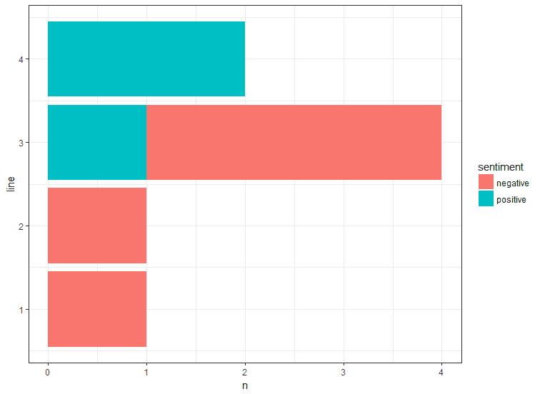
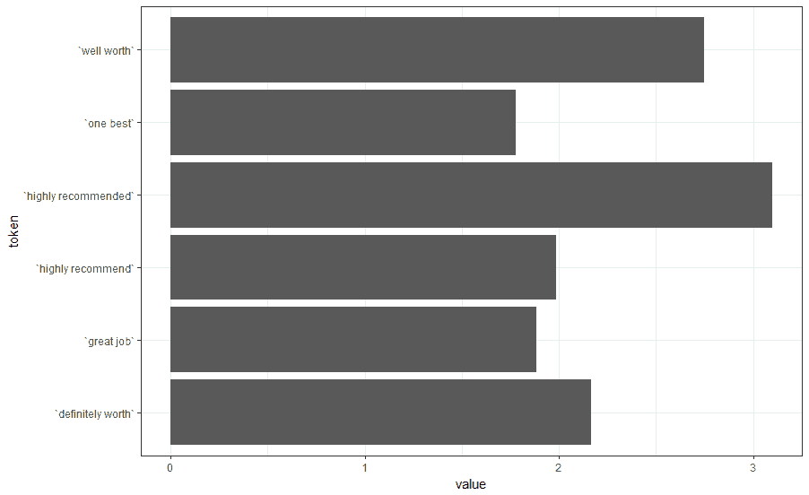
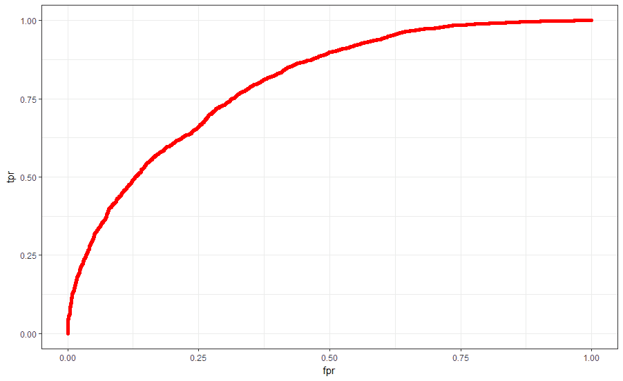
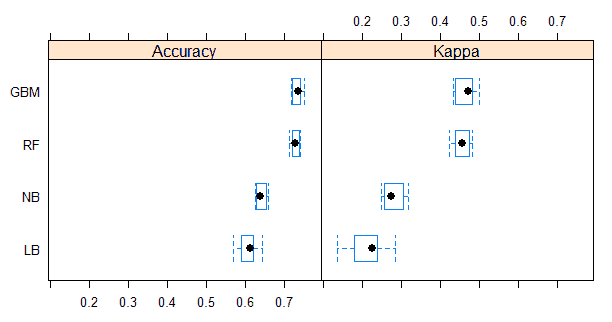
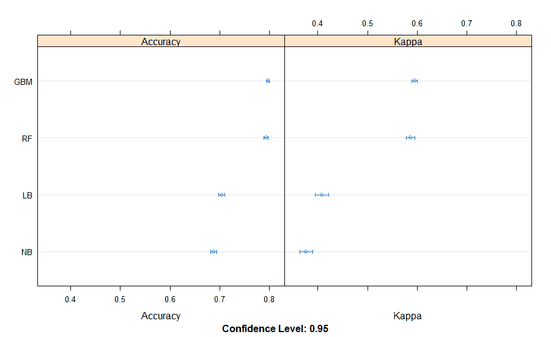
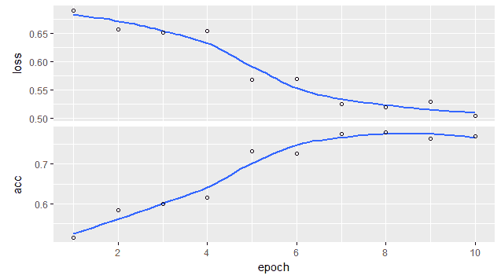
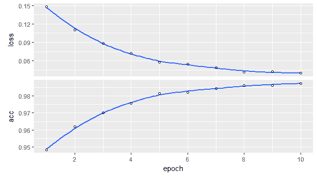
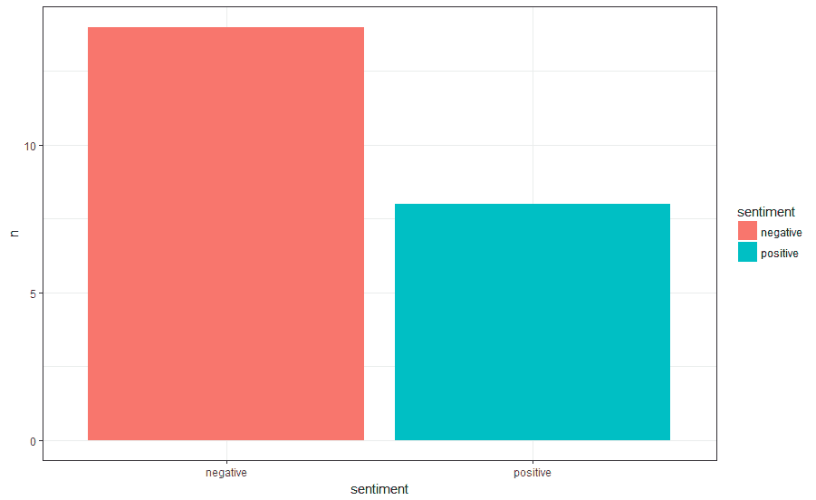
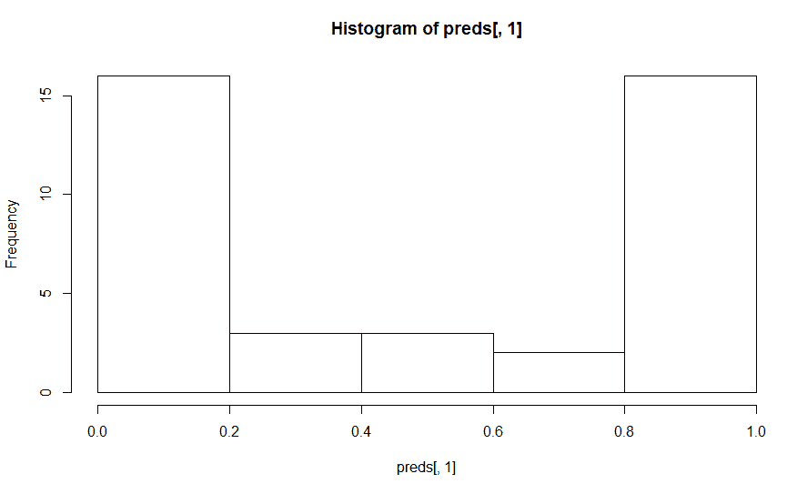

# 嵌入单词的情感分析

在这一章，我们转向情感分析的问题。情感分析是一个总括术语，指的是一系列技术，用来计算说话者对某个话题或某段内容的感受。

情绪分析的一个典型案例是极性。给定一个文档或文本串(例如，一条推文、一条评论或社交网络上的一条评论)，目的是确定作者对所讨论的项目或主题的感觉是好、坏还是中立。

乍一看，这个问题似乎微不足道:一个包含正面和负面单词的查找表，简单地计算词频就可以了，对吗？没那么快。这里有几个例子说明为什么这很棘手:

*   他们颓废的甜点让我讨厌自己
*   如果你喜欢冷食，你应该试试这个地方
*   我不喜欢蛋糕

在这些例子中我们能看到什么？

*   可能用于正面意义的负面术语
*   讽刺性地使用积极的词语
*   两个暗示积极事物的消极术语

请注意，我们没有处理拼写错误、新词和多种语言的使用，这只是列举了现实生活中的一些潜在问题。

正如你所看到的，情感分析是一个非常复杂的任务，我们将仅仅触及表面。

人的因素是情感分析中最重要的因素。情感分析系统的准确性取决于它与人类判断的一致程度。这有多准确呢？不幸的是没有那么多。一些研究人员报告不同意率高达 20%。这意味着，如果你的情感分析系统有 70%的准确率，尽管看起来不起眼，但它仍然是好的，因为人类会同意一个完美的情感分析系统的 80%的分类。但是，要小心！

这些数字并不完全可比，因为计算机在识别最容易被人类猜到的细微之处方面存在问题，例如讽刺、笑话或与之前显示的例子在含义上的细微差异。

尽管如此，个人和组织似乎越来越意识到他们在网上存在的重要性。我们可以通过专门从事社交媒体监控的机构和专业人士的迅速增加来衡量这种影响。这有助于增加该领域研究人员的关注(包括大学和行业)，我们相信我们很可能会看到该领域的重大进展。

正如本书其他地方所述，我们的重点是尽可能以最简单的方式向您介绍算法。我们将使用一个众所周知的数据集，它与*现实生活中的*数据集有许多相同的属性，您可以在那里找到。


# 预热–数据探索

让我们用一个小例子来推动事情的发展。让我们来看看这个小小的评论集:

```
text <- c("The food is typical Czech, and the beer is good. The service is quick, if short and blunt, and the waiting on staff could do with a bit of customer service training",
          "The food was okay. Really not bad, but we had better",
          "A venue full of locals. No nonsense, no gimmicks. Only went for drinks which were good and cheap. People friendly enough.",
          "Great food, lovely staff, very reasonable prices considering the location!")
```

这里我们会做一些简单的分析，这将有助于我们体会到情绪分析的一些微妙之处。


# 处理整齐的文本

为此，我们将使用`tidytext`包。这个软件包是建立在整齐数据的哲学基础上的，是由哈德利·韦翰在他 2014 年的论文([https://www.jstatsoft.org/article/view/v059i10](https://www.jstatsoft.org/article/view/v059i10))中提出的。如果满足以下三个条件，则数据集是整齐的:

*   每个变量都是一列
*   每个观察值都是一行
*   每种类型的观察单位都是一张表

通过每行放置一个标记，`tidytext`包帮助我们将文本转换成整齐的形式。让我们从装载`dplyr`和`tidytext`开始。如果没有`tidytext`，先用`install.packages("tidytext")`安装。

加载包，让我们将文本转换为数据框:

```
library(tidytext)
library(dplyr)
text_df <- data_frame(line = 1:4, text = text)
```

`unnest_tokens`功能是`tidytext`魔力的开始:

```
text_df <- text_df %>%
 unnest_tokens(word, text)
head(text_df)
# A tibble: 6 x 2
   line word
  <int> <chr>
1 1 the
2 1 food
3 1 is
4 1 typical
5 1 czech
6 1 and
```

如您所见，我们的文本被转换为每行一个标记(默认为一个单词=一个标记)。首先，让我们去掉停用词:

```
data(stop_words)
head(stop_words)
text_df <- text_df %>% anti_join(stop_words)
```

我们的目标是至少从视觉上确定之前评论的观点。我们先来快速总结一下字数:

```
library(ggplot2)
text_df %>% 
  count(word, sort=T) %>%
  mutate(word = reorder(word, n)) %>%
  ggplot(aes(word, n)) +
  geom_col() +
  xlab(NULL) +
  coord_flip()+
  theme_bw()
```

我们得到了这样一个漂亮的条形图:


玩具评论数据集中的基本字数

`tidytext`包包括三个由情感注释的词典(单词集合):

*   `AFINN`出自芬厄普·尼尔森([http://www2.imm.dtu.dk/pubdb/views/publication_details.php?id=6010](http://www2.imm.dtu.dk/pubdb/views/publication_details.php?id=6010)
*   `bing`出自刘兵及其合作者()

*   `nrc`来自赛义夫·穆罕默德和彼得·特尼([http://saifmohammad.com/WebPages/NRC-Emotion-Lexicon.htm](http://saifmohammad.com/WebPages/NRC-Emotion-Lexicon.htm)

`AFINN`词典给英语中的常用词一个介于-5 和 5 之间的数值，负值就是负面词。例如:

```
get_sentiments("afinn") %>% 
  filter(score==-5) %>% 
  head
```

给出(敏感的读者应该跳过下一段):

```
# A tibble: 6 x 2
        word score
       <chr> <int>
1 bastard -5
2 bastards -5
```

鉴于，以下内容:

```
get_sentiments("afinn") %>% 
 filter(score==0) %>% 
 head
```

简单来说就是:

```
# A tibble: 1 x 2
 word score
 <chr> <int>
1 some kind 0
```

以及以下内容:

```
get_sentiments("afinn") %>% 
 filter(score==5) %>% 
 head
```

退货:

```
# A tibble: 5 x 2
 word score
 <chr> <int>
1 breathtaking 5
2 hurrah 5
3 outstanding 5
4 superb 5
5 thrilled 5
```

`bing`词典只有正面词和负面词:

```
> get_sentiments("bing") %>% head
# A tibble: 6 x 2
 word sentiment
 <chr> <chr>
1 2-faced negative
2 2-faces negative
3 a+ positive
4 abnormal negative
5 abolish negative
6 abominable negative
```

然而，`nrc`有不同的类别:

```
> get_sentiments("nrc") %>% head
# A tibble: 6 x 2
 word sentiment
 <chr> <chr>
1 abacus trust
2 abandon fear
3 abandon negative
4 abandon sadness
5 abandoned anger
6 abandoned fear
```

我们如何使用这些单词表？一旦我们的数据整理好了，我们就可以加入它们并创建不同的聚合来尝试了解正在发生的事情。让我们从存储`bing`词汇开始:

```
bing <- get_sentiments("bing")
```

把它和我们的数据结合起来:

```
> text_df %>% inner_join(bing) %>% count(line,sentiment)
Joining, by = "word"
# A tibble: 5 x 3
 line sentiment n
 <int> <chr> <int>
1 1 negative 1
2 2 negative 1
3 3 negative 3
4 3 positive 1
5 4 positive 2
```

还不错，但是我们可以用一个情节做得更好:

```
# Plot
text_df %>% 
 inner_join(bing) %>% 
 count(line,sentiment) %>%
 ggplot(aes(line, n, fill=sentiment))+
 geom_col()+
 coord_flip()+
 theme_bw()
```

结果如下所示。还不错。我们看到，一个简单的连接和一个汇总已经提供了如何按情感对评论进行分类的基本信息:



使用 bing 词典汇总统计数据

这已经很有价值了，但是在某些情况下，我们想知道一个评论是积极的还是消极的；例如，将问题重定向到适当的客户服务代表。在这种情况下，使用`AFINN`词典可能会有用:

```
afinn <- get_sentiments("afinn")
```

现在，我们像以前一样加入评审数据:

```
text_df %>% inner_join(afinn)
```

看看每次评论的总得分:

```
# Group
text_df %>% 
 inner_join(afinn) %>% 
 group_by(line) %>% 
 summarize(total_score = sum(score))
```

还不错；不过还是那句话，还是搞个剧情比较好:

```
# Plot
text_df %>% 
 inner_join(afinn) %>% 
 group_by(line) %>% 
 summarize(total_score = sum(score)) %>%
 mutate(sentiment=ifelse(total_score>0,"positive","negative")) %>%
 ggplot(aes(line, total_score, fill=sentiment))+
 geom_col()+
 coord_flip()+
 theme_bw()
```

如下图所示:


使用 AFINN 词典汇总统计数据

哇，这里发生了什么？情况看起来有点诡异。首先，请注意，有一篇评论已经消失。这是因为在第一次审查中没有与`AFINN`词典相关的常用词(回想一下，我们有一个内部连接)。更令人担忧的是第三次审查的结果。分数为零，根据`AFINN`词典，该分数来自评论中每个单词的正面和负面分数的总和。然而，请注意，审查 3 大多是积极的。然后发生了什么？


# 越多越好——计算 n 个字母而不是单词

上一节中这种奇怪结果的原因可以追溯到上下文。请注意，评论 3 中有一个短语`No nonsense, no gimmicks`，它在很大程度上是正面的，但有两个负面的词与之相关。我们怎样才能把上下文考虑进去呢？输入 n-grams。n-gram 是来自给定文本或语音序列的 *n* 个连续项目(单词，或者在语音的情况下，音素)的序列。让我们用一个例子来说明这一点，并使用 2-grams 或 bigrams:

```
text_df <- data_frame(line = 1:4, text = text)
text_df <- text_df %>%
 unnest_tokens(bigram, text, token="ngrams", n=2)
text_df
```

这为我们提供了以下信息:

```
# A tibble: 70 x 2
 line bigram
 <int> <chr>
 1 1 the food
 2 1 food is
 3 1 is typical
 4 1 typical czech
 5 1 czech and
 6 1 and the
 7 1 the beer
 8 1 beer is
 9 1 is good
10 1 good the
# ... with 60 more rows
```

所以，我们现在看到连续的单词被放在一起。这已经足够有助于确定实际上是积极的消极词汇的否定，就像我们前面的综述 3。我们来看看哪些否定词被否定了。首先，我们将二元模型的两个词分成两列:

```
library(tidyr)
text_df <- text_df %>% separate(bigram, c("w1","w2"), sep=" ")
text_df
```

这给了我们:

```
# A tibble: 70 x 3
 line w1 w2
 * <int> <chr> <chr>
 1 1 the food
 2 1 food is
 3 1 is typical
 4 1 typical czech
 5 1 czech and
 6 1 and the
 7 1 the beer
 8 1 beer is
 9 1 is good
10 1 good the
# ... with 60 more rows
```

一点魔法让这句话中令人不快的部分受到质疑:

```
text_df %>% 
 filter(w1=="no") %>% 
 inner_join(afinn, by=c(w2="word"))
```

那就是:

```
# A tibble: 1 x 4
 line w1 w2 score
 <int> <chr> <chr> <int>
1 3 no nonsense -2
```

我们现在可以使用这些信息来覆盖第三次审查的分数。然而，请注意这可能是一个多么复杂的过程。当然，在许多情况下，它会很好地工作，但我们应该找到更系统的方法来处理上下文。

n 元语法对于跟踪单词的上下文，并正确使用它进行分类非常重要。


# 单词袋基准

在[第 14 章](0ce34454-1e0b-433b-a886-1717f0049686.xhtml)、*使用自动编码器进行欺诈检测*中，我们在识别欺诈性电子邮件时遇到了一次性嵌入。这个想法是将每个单词表示为一个基本向量；也就是一个除了一个坐标以外都有零的向量。因此，每个文档(在本例中是一篇评论)被表示为一个由 1 和 0 组成的向量。我们更进一步，使用了不同的权重(tf-idf)。

让我们再一次回顾这个模型，但是包括 n-grams 而不是单个单词。这将是我们稍后要做的更复杂的单词嵌入的基准。


# 准备数据

该数据是斯坦福大学大型电影评论数据集的子集，最初发表在:

安德鲁·马斯、雷蒙德·戴利、彼得·范、黄丹、安德鲁·Ng 和克里斯托弗·波茨。【2011】T8。学习用于情感分析的词向量。计算语言学协会第 49 届年会(ACL 2011) *。*

这些数据可以在 http://ai.stanford.edu/~amaas/data/sentiment/[下载，前提是原始论文要注明出处。这是原始数据，但你可以在 Kaggle，](http://ai.stanford.edu/~amaas/data/sentiment/)[https://www.kaggle.com/c/word2vec-nlp-tutorial/data](https://www.kaggle.com/c/word2vec-nlp-tutorial/data)找到预处理版本。

让我们从加载数据开始:

```
df <- read.csv("./data/labeledTrainData.tsv", encoding = "utf-8", quote = "", sep="\t", stringsAsFactors = F)
text <- df$review
```

我们重访`tm`图书馆。注意，代码有点不同，因为我们加载的文本是`VCorpus`，而不是之前的`Corpus`:

```
library(tm)
corpus <- VCorpus(VectorSource(text))
inspect(corpus[[1]])
```

这是对这些数据的第一次回顾:

```
> inspect(corpus[[1]])
<<PlainTextDocument>>
Metadata: 7
Content: chars: 1681

 stuff going moment mj ive started listening music watching odd documentary watched wiz watched moonwalker maybe just want get certain insight guy thought really cool eighties just maybe make mind whether guilty innocent moonwalker part biography part feature film remember going see cinema originally released subtle messages mjs feeling towards press also obvious message drugs bad mkaybr br visually impressive course michael jackson unless remotely like mj anyway going hate find boring may call mj egotist consenting making movie mj fans say made fans true really nice himbr br actual feature film bit finally starts 20 minutes excluding smooth criminal sequence joe pesci convincing psychopathic powerful drug lord wants mj dead bad beyond mj overheard plans nah joe pescis character ranted wanted people know supplying drugs etc dunno maybe just hates mjs musicbr br lots ... <truncated>
```

首先，一些预处理:

```
corpus <- tm_map(corpus,content_transformer(tolower))
corpus <- tm_map(corpus, content_transformer(removePunctuation))
corpus <- tm_map(corpus, content_transformer(removeWords), stopwords("english"))
```

下一步是创建二元模型。我们看到了这一点的重要性:

```
BigramTokenizer <- function(x){ unlist(lapply(ngrams(words(x), 2), paste, collapse = " "), use.names = FALSE)}
dtm <- DocumentTermMatrix(corpus, control = list(tokenize = BigramTokenizer))
dtm <- removeSparseTerms(dtm, 0.995)
X <- as.data.frame(as.matrix(dtm))
X$sentiment <- df$sentiment
X$sentiment <- ifelse(X$sentiment<0.5,0,1)
```

我们现在准备将这些数据应用于分类模型；例如，逻辑回归。


# 实施基准–逻辑回归

逻辑回归可能不是最好的算法，但肯定是最常用的算法之一。它非常健壮和强大，但解释起来很简单。与其他方法不同的是，它很容易看到引擎盖下，看看它在做什么。

首先，我们为训练和测试集选择一些指数:

```
# Train, test, split
library(caTools)
set.seed(42)
spl <- sample.split(X$sentiment, 0.7)
train <- subset(X, spl == TRUE)
test <- subset(X, spl == FALSE)
```

现在我们分成训练集和测试集:

```
X_train <- subset(train,select=-sentiment)
y_train <- train$sentiment
X_test <- subset(test,select=-sentiment)
y_test <- test$sentiment
```

现在让我们看看模型和系数:

```
model <- glm(y_train ~ ., data = X_train, family = "binomial")
coefs <- as.data.frame(model$coefficients)
names(coefs) <- c("value")
coefs$token <- row.names(coefs)
```

并查看模型如何使用每项功能:

```
library(ggplot2)
library(dplyr)
coefs %>% 
 arrange(desc(value)) %>% 
 head %>% 
 ggplot(aes(x=token, y=value))+
 geom_col()+
 coord_flip()+
 theme_bw()
```

这为我们提供了以下图表:



与积极情绪相关的特征

现在让我们来看看与消极情绪相关的特征(在看代码之前，尝试自己做这件事！):

```
coefs %>% 
 arrange(value) %>% 
 head %>% 
 ggplot(aes(x=token, y=value))+
 geom_col()+
 coord_flip()+
 theme_bw()
```

这看起来像:


与消极情绪相关的特征

现在，让我们用 ROC 曲线更仔细地看看性能。我们可以编写自己的函数，而不是使用额外的包:

```
roc <- function(y_test, y_preds){
 y_test <- y_test[order(y_preds, decreasing = T)]
 return(data.frame(fpr=cumsum(!y_test)/sum(!y_test),
                   tpr=cumsum(y_test)/sum(y_test)) )
}
```

我们现在可以生成预测，并使用 base R 图形绘制曲线:

```
y_preds <- predict(model, X_test, type="response")
plot(roc(y_test,y_preds), xlim=c(0,1), ylim=c(0,1))
```

或者将它们存储在数据帧中并使用`ggplot2`:

```
roc_df <- roc(y_test,y_preds)
ggplot(roc_df, aes(x=fpr,y=tpr))+geom_point(color="red")+theme_bw()
```

ROC 曲线看起来像这样:



二元逻辑回归的 ROC 曲线

我们可以量化 AUC，但使用基本 R 代码会更复杂一些。你可以尝试使用`ROCR`或`pROC`软件包。我们将简单地设置一个阈值 0.5，并计算该阈值的正类的精度，只是为了了解一下发生了什么:

```
labels <- ifelse(y_preds<0.5,0,1)
table(labels,y_test)
```

这给出了:

```
table(labels,y_test)
 y_test
labels   0    1
 0    2536  896
 1    1214 2854
```

因此我们得到的精度为:

```
2536/(2536+896)
[1] 0.7389277
```

对于积极向上的阶层。还不错，在实践中；80%将是一个好的分类器，因为这大致是人类之间的一致率。在*练习*一节中，你可以尝试用几种不同的方法来提高这个基准。


# 练习

1.  探索 n 元语法中不同的 *n* 值的分类器的性能。变化显著吗？
2.  上一节中的图表表明可能需要一些词干，因为一些顶级功能在含义上非常相似。应用词干，看看 ROC 曲线的形状。
3.  尝试其他分类器，例如，随机森林或支持向量机，以及不同种类的 n-gram。你能提高性能吗？


# 单词嵌入

如今，自然语言处理领域发展非常迅速，就像现代数据科学和人工智能一样。

word2vec (Mikolov 等人，2013)和 GloVe (Pennington 等人，2014)等算法一直是该领域的先驱，虽然严格来说它们都与深度学习无关，但用它们训练的模型在深度学习的许多应用中被用作 NLP 的输入数据。

我们将简要描述 word2vec 和 GloVe，它们可能是最常用的单词嵌入算法，尽管对神经网络和语言交叉的研究至少可以追溯到 20 世纪 90 年代的 Jeff Elman。


# word2vec

word2vec **它首先从训练文本数据构建词汇表，然后学习单词的向量表示。然后我们使用这些向量作为机器学习算法的特征。**

词向量能够捕捉语言中的一些直观规律，例如:

*vector('Paris') - vector('France') + vector('Italy')*

产生的矢量非常接近:

*vector('Rome')*,

而且，

*vector('king') - vector('man') + vector('woman')* 

接近于:

*vector('queen').*

word2vec 在幕后做什么？word2vec 通过训练神经网络来预测单词向量:

*   来自周围环境的中心单词(连续单词包，CBOW)
*   一个词的周围从中心词(跳格模型)

为什么这很有用？根据分布假说，一起出现的单词往往传达相似的意思。研究者 Goldberg 和 Levy 指出([https://arxiv.org/abs/1402.3722](https://arxiv.org/abs/1402.3722))word 2 vec 目标函数导致出现在相似语境中的单词具有相似的嵌入，这符合分布假说。然而，他们也指出需要一个更好的解释。

分布假说认为在相同的上下文中使用的单词是相关的。这是 GloVe 或 word2vec 等矢量嵌入算法的基本假设。


# 手套

大约在 word2vec 一年后，斯坦福大学的研究人员发表了一篇论文(【http://web.stanford.edu/~jpennin/papers/glove.pdf】)明确指出了 word2vec 在幕后优化的目标。他们的方法， **GloVe** ，(**全局向量**)明确地命名了目标矩阵，确定了因式分解，并提供了一些直观的理由，说明为什么这会给我们带来工作上的相似性。

本节从较高的层面描述了 GloVe 算法的内部工作原理。因此，它比我们想要的要多一点数学含量。如果不熟悉线性代数和微积分，可以放心跳过。

手套是如何工作的？

1.  创建单词**共现矩阵** ，其中每个条目代表单词 *i* 在单词 *j* 的上下文中出现的频率。这个矩阵显然是对称的。此外，对于每个术语，我们寻找在某些窗口上同时出现的单词，并且对更远的单词给予更小的权重。
2.  为每个词对定义软约束。
3.  最后，引入一个代价函数，惩罚从非常常见的词对中学习。
    对于软约束，我们的意思是:


其中*w[I]和*w[j]分别表示主嵌入向量和上下文嵌入向量，偏差为*b[I]和*b[j]， *X [ij]* 是单词 *j* 在单词*的上下文中的同现*****

成本函数由下式定义:


其中 *V* 是词汇表， *f* 定义如下:


其中 *alpha* 和 *X [max]* 是可以选择的超参数。


# 来自电影评论的情感分析

让我们继续使用 IMDb 的数据，并将前面几节中的想法付诸实践。在本节中，我们将使用几个熟悉的包，如`tidytext`、`plyr`、`dplyr`，以及 2017 年发布的 Dimitriy Selivanov 的优秀`text2vec`，以及 Max Kuhn 的知名`caret`包。


# 数据预处理

我们需要为算法准备数据。

首先，一些必要的导入:

```
library(plyr)
library(dplyr)
library(text2vec)
library(tidytext)
library(caret)
```

我们将像以前一样使用 IMDb 的数据:

```
imdb <- read.csv("./data/labeledTrainData.tsv", encoding = "utf-8", quote = "", sep="\t", stringsAsFactors = F)
```

并在标记上创建一个迭代器:

```
tokens <- space_tokenizer(imdb$review)
token_iterator <- itoken(tokens)
```

令牌是简单的单词，也称为 **unigrams** 。这构成了我们的词汇:

```
vocab <- create_vocabulary(token_iterator)
```

对于共现矩阵来说，重要的是只包括频繁出现大量次的单词。我们将把这个阈值设置为`5:`

```
vocab <- prune_vocabulary(vocab, term_count_min = 5)
```

我们使用过滤后的词汇:

```
vectorizer <- vocab_vectorizer(vocab)
```

并为上下文单词设置大小为`5`的窗口:

```
tcm <- create_tcm(token_iterator, vectorizer, skip_grams_window = 5)
```

现在我们有了共生矩阵，让我们继续矢量嵌入。


# 从单词到向量

我们准备使用 GloVe 创建单词 embedding。首先，让我们初始化 GlobalVectors 类的一个实例:

```
glove <- GlobalVectors$new(word_vectors_size = 50, 
                           vocabulary = vocab, 
                           x_max = 10)
```

我们现在应用`fit_transform`方法(scikit learn 用户可能很熟悉):

```
wv_main <- glove$fit_transform(tcm, 
                                n_iter = 10, 
                                convergence_tol = 0.01)
```

一旦完成，我们就准备好了矢量器。我们现在需要解析我们的文本:

```
text <- unlist(imdb$review)
length(text)
# 25000
text_df <- data_frame(line = 1:25000, text = text)
```

并应用来自`tidytext`的`unnest_tokens`函数，将我们的数据转换成整齐的格式:

```
text_df <- text_df %>%
 unnest_tokens(word, text)
head(text_df)
```

这给出了一个熟悉的输出:

```
 head(text_df)
# A tibble: 6 x 2
 line word
 <int> <chr>
1 1 with
2 1 all
3 1 this
4 1 stuff
5 1 going
6 1 down
```

等等，那手套呢？让我们来看看:

```
head(wv_main[,1:3])
             [,1] [,2] [,3]
overpowered 0.03408282 -0.225022092 0.077734992
nears 0.65971708 -0.005281781 -0.100175403
producers) 0.46528772 0.063937798 -0.165794402
Daddy, 0.06035958 -0.076200403 0.008196513
rhetoric, -0.05500082 0.149410397 -0.314875215
Johnsons' 0.43385875 0.078220785 -0.177165091
```

实际上`text2vec`包返回两个对象:

```
wv_context <- glove$components
```

我们可以使用`wv_main`或`wv_context`作为我们的矢量嵌入，但有时将它们放在一起会有所帮助(根据手套文件)。因此，您可以创建一个`wv`对象作为这两个向量的和或平均值，例如:

```
wv <- wv_main + t(wv_context).
```

现在让我们只使用`wv_main`。我们需要将矩阵强制转换为数据框格式，并添加`row.names`作为列，以整齐的格式将其与我们的文本连接起来:

```
wv <- as.data.frame(wv_main)
wv$word <- row.names(wv)
```

最后，把这两个放在一起:

```
df <-  wv%>% inner_join(text_df)
```

这还没有准备好使用，因为我们需要汇总审查中出现的向量。一种可能性是只取平均向量作为代表；评论的向量将是组成评论的所有单词的平均向量。我们将在这里采用这种方法，并在练习中提出一些其他的可能性:

```
df <- df %>% 
        group_by(line) %>% 
        summarize_all(mean) %>% 
        select(1:50) 
df$label <- as.factor(imdb$sentiment)
```

这些数据现在可以通过不同的分类器，从中我们可以预测情感极性(积极/消极)。


# 情感提取

我们将使用`caret`一次尝试不同的分类器:

```
library(caret)
```

我们首先需要准备培训方案:

```
control <- trainControl(method="cv", repeats=5)
```

我们将设置不同的模型进行尝试:

*   随机森林
*   梯度推进机器
*   Logit 增强
*   朴素贝叶斯

不要忘记设置随机数生成器的种子，以使结果可重复:

```
set.seed(7)
 modelRF <- train(
                    label~., 
                    data=df, 
                    method="rf", 
                    trControl=control
                   )

 modelGbm <- train(
                    label~., 
                    data=df, 
                    method="gbm", 
                    trControl=control, 
                    verbose=FALSE
                    )

modelLogitBoost <- train(
                        label~., 
                        data=df, 
                        method="LogitBoost",
                        trControl=control
```

```
                        )

modelNaiveBayes <- train(
                        label~., 
                        data=df, 
                        method="nb", 
                        trControl=control
                        )
```

培训将需要一些时间，但一旦完成，我们可以将结果收集到一个数据框中，以供以后研究:

```

 results <- resamples(
                    list(
                        RF=modelRF, 
                        GBM=modelGbm, 
                        LB=modelLogitBoost, 
                        NB=modelNaiveBayes
                        )
                    )
```

我们可以通过熟悉的`summary`功能轻松获得结果摘要:

```
> summary(results)

Call:
summary.resamples(object = results)

Models: RF, GBM, LB, NB 
Number of resamples: 10 

Accuracy 
      Min. 1st Qu. Median Mean 3rd Qu. Max. NA's
RF 0.7116 0.7189 0.7284 0.72732 0.7363 0.7412 0
GBM 0.7168 0.7199 0.7352 0.73228 0.7410 0.7496 0
LB 0.5680 0.5933 0.6124 0.60656 0.6184 0.6420 0
NB 0.6244 0.6291 0.6374 0.63992 0.6510 0.6588 0

Kappa 
      Min. 1st Qu. Median Mean 3rd Qu. Max. NA's
RF 0.4232 0.4378 0.4568 0.45464 0.4726 0.4824 0
GBM 0.4336 0.4398 0.4704 0.46456 0.4820 0.4992 0
LB 0.1360 0.1866 0.2248 0.21312 0.2368 0.2840 0
NB 0.2488 0.2582 0.2748 0.27984 0.3020 0.3176 0

```

或更详细的可视化:

```
bwplot(results) 
```

上述代码产生以下指标:



比较手套顶部不同分类器性能的箱线图

您也可以通过以下方式实现:

```
dotplot(results)
```

总之，是时候看看性能指标了！


比较手套顶部不同分类器性能的点图

在图中和前面显示的汇总结果中，**精度**是所有实例中正确分类的实例的百分比，而 **kappa** 度量(或 Cohen 的 kappa 统计)是使用基线随机分类对数据进行标准化的精度，就好像每个观察值都是根据每个类的频率给出的概率分布进行分类的一样。

kappa 值为零表示模型没有用(kappa 值在 0 到 1 之间)，kappa 值越高，你的模型越有可能有用，尽管这个统计数据没有统一的解释。

所以我们看到基于树的方法做得很好。这在某种程度上与一次性编码模型形成了对比。通常不建议在具有大量稀疏特征的数据中使用基于树的方法，如果我们像以前一样使用一次性编码的模型，就会出现这种情况。因为我们改为嵌入到密集向量中，所以树再次受到欢迎，它们确实表现很好，即使没有调整超参数。


# 数据清理的重要性

如果您遵循前面的工作流程，并不时停下来看看结果(顺便说一句，这是您绝对应该做的)，您会注意到周围有许多垃圾——有大小写的单词、标点符号等等。如果通过正确解析单词来改进这个工作流程，会发生什么？您可以使用 tokenizers 库代替 text2vec 中的`space_tokenizer`函数来删除单行中的停用词和标点符号:

```
 library(tokenizers)
 tokens <- tokenize_words(imdb$review, stopwords = stopwords())
```

完整的代码现在是:

```
library(plyr)
library(dplyr)
library(text2vec)
library(tidytext)
library(caret)

imdb <- read.csv("./data/labeledTrainData.tsv"
                   , encoding = "utf-8"
                   , quote = ""
                   , sep="\t"
                   , stringsAsFactors = F)
# Standard preprocessing: change to lowercase, remove english stopwords and punctuation
library(tokenizers)
tokens <- tokenize_words(imdb$review, stopwords = stopwords())

# Create vocabulary. The tokens are simple words here.
token_iterator <- itoken(tokens)
vocab <- create_vocabulary(token_iterator)

# Kill sparse terms
vocab <- prune_vocabulary(vocab, term_count_min = 5L)

vectorizer <- vocab_vectorizer(vocab)

# use window of 5 for context words
 tcm <- create_tcm(token_iterator, vectorizer, skip_grams_window = 5L)

glove <- GlobalVectors$new(word_vectors_size = 50, 
                         vocabulary = vocab, 
                         x_max = 10)
wv_main <- glove$fit_transform(tcm, 
                             n_iter = 10, 
                             convergence_tol = 0.05)

text <- unlist(imdb$review)

text_df <- data_frame(line = 1:25000, text = text)

text_df <- text_df %>%
         unnest_tokens(word, text)

wv <- as.data.frame(wv_main)

wv$word <- row.names(wv)

df <- wv%>% inner_join(text_df)

# Now we need to create the trained matrix
df <- df %>% group_by(line) %>% summarize_all(mean) %>% select(1:51) 
df$label <- as.factor(imdb$sentiment)

library(caret)

control <- trainControl(method="cv", repeats=5)

# Train the different models
set.seed(7)
modelRF <- train(label~., data=df, method="rf", trControl=control)

set.seed(7)
modelGbm <- train(label~., data=df, method="gbm", trControl=control, verbose=FALSE)

set.seed(7)
modelLogitBoost <- train(label~., data=df, method="LogitBoost", trControl=control)

set.seed(7)
modelNaiveBayes <- train(label~., data=df, method="nb", trControl=control)

# collect resamples: this is useful for the plots
results <- resamples(
                    list(RF=modelRF, 
                    GBM=modelGbm, 
                    LB=modelLogitBoost, 
                    NB=modelNaiveBayes))

# summarize and check the model performance
summary(results)
bwplot(results)
dotplot(results)
```

我们可以看到结果有了明显的改善！

```
> summary(results)
Call:
summary.resamples(object = results)
Models: RF, GBM, LB, NB 
Number of resamples: 10
Accuracy 
 Min. 1st Qu. Median Mean 3rd Qu. Max. NA's
RF 0.7820 0.7892 0.7946 0.79340 0.7972 0.8012 0
GBM 0.7904 0.7952 0.7978 0.79732 0.7996 0.8036 0
LB 0.6904 0.6978 0.7040 0.70388 0.7098 0.7176 0
NB 0.6728 0.6810 0.6900 0.68824 0.6957 0.7008 0
```

这里的点图和箱线图如下所示:



显示经过适当预处理的不同分类器的点图

箱线图:


显示经过适当预处理的不同分类器的箱线图

请记住，就软件而言，数据科学也不例外:

**Garbage in, garbage out**: Always pay attention to the data you are feeding to the models! The most powerful models available will produce unsatisfactory results when feeding them with the wrong data! It's important to log, or at least print, to the console, any preprocessing steps you are doing. Treating models as a magic black box is a very dangerous thing, and unfortunately too common. 

正如我们前面提到的，向量嵌入不是正确的深度学习，而是一种特征表示方法。然而，我们可以将向量嵌入与深度神经网络相结合，并有望获得更好的结果。


# 向量嵌入和神经网络

是时候将向量嵌入和神经网络结合起来，有望创建更健壮的模型了。让我们通过训练神经网络作为分类器来对我们的工作流程进行简单的扩展。我们从现在熟悉的预处理和矢量嵌入开始:

```
library(plyr)
library(dplyr)
library(text2vec)
library(tidytext)
library(caret)
library(tokenizers)

imdb <- read.csv("./data/labeledTrainData.tsv"
                , encoding = "utf-8"
                , quote = ""
                , sep="\t"
                , stringsAsFactors = F)

tokens <- tokenize_words(imdb$review, stopwords = stopwords())

# Boring boilerplate preprocessing
token_iterator <- itoken(tokens)
vocab <- create_vocabulary(token_iterator)
vocab <- prune_vocabulary(vocab, term_count_min = 5L)
vectorizer <- vocab_vectorizer(vocab)

# Create context and embedding
tcm <- create_tcm(token_iterator, vectorizer, skip_grams_window = 5L)
glove <- GlobalVectors$new(word_vectors_size = 50, 
 vocabulary = vocab, 
 x_max = 10)
wv_main = glove$fit_transform(tcm, 
 n_iter = 10, 
 convergence_tol = 0.01)
text <- unlist(imdb$review)
text_df <- data_frame(line = 1:length(text), text = text)
text_df <- text_df %>%
 unnest_tokens(word, text)
```

现在让我们用上下文向量来代替主词向量:

```
wv_context <- glove$components
wv <- as.data.frame(wv_main+t(wv_context))
wv$word <- row.names(wv)
df <- wv%>% inner_join(text_df)
```

为了最终创建训练好的矩阵:

```
df <- df %>% group_by(line) %>% summarize_all(mean) %>% select(1:51)
df$label <- as.factor(imdb$sentiment)
```

最后，创建具有单层的基线神经网络模型:

```
library(keras)

X <- df[,2:51]
y <- df[,52]

y <- to_categorical(y[["label"]])
y <- y[,2:3]

model <- keras_model_sequential()
model %>%
 layer_dense(activation='relu', units =20, input_shape=c(50))%>%
 layer_dense(units=2, activation = 'softmax')

model %>% compile(
 loss = 'categorical_crossentropy',
 optimizer = optimizer_rmsprop(),
 metrics = c('accuracy')
 )

 history <- model %>% keras::fit(
 as.matrix(X), y,
 epochs = 30, batch_size = 128,
 validation_split = 0.2
 )
```

调用 fit 方法会触发训练过程。一旦训练完成，我们可以通过使用`plot`函数来查看它的进展情况:

```
plot(history)
```

这给了我们一些稍微令人失望的结果:


具有 20 个神经元的单层神经网络的性能

为什么会令人失望？嗯，我们拥有 20 个神经元的强大神经网络并没有改善，比如说，随机森林。怎样才能改善这个结果？

在这种情况下，似乎神经网络，或者至少前馈神经网络可能没有太大的帮助，或者至少我们不能通过增加更多的层来找到显著的改进。实际上，三层或更多层似乎会使结果变得更糟，我们甚至观察到过度拟合。

**Occam's razor** should prevail. The model you keep should be as simple as possible. A complicated model might be of little use in production because of the technical complications needed to deploy it. Furthermore, when we have no way of interpreting the model, unexpected results might happen when the model is applied to slightly different data from that used for training and testing.

我们可以保存我们的矢量嵌入和模型供以后使用:

```
write.csv(wv,"./data/wv.csv", row.names = F)
save_model_hdf5(model,"glove_nn.hdf5")
```


# 双向 LSTM 网络

我们的模型在简单的前馈网络中不太适用。在这一部分，我们将尝试一个不同的模型:双向 LSTM 网络。

回想一下，LSTM 网络通过隐藏状态保留了部分先前的信息。然而，这些信息仅仅是关于**过去的**。

双向 LSTM 双向运行——从过去到未来，再回来！向后运行的 LSTM 保存了来自**未来的信息。**结合使用这两种隐藏状态，你可以保留过去和未来的背景。显然，这对于股票价格预测没有意义！它们的使用最初在语音识别领域是合理的，因为正如您从经验中可能知道的那样，理解一个单词的意思经常需要完整短语的上下文。例如，当你试图同时从一种语言翻译到另一种语言时，就会发生这种情况。

好吧，那我们该怎么做？让我们回到`keras`。这会让体验相当流畅，就像我们之前看到的那样。

对于双向 LSTM API，keras 期望每行有一个包含单词列表的文档，这些单词按顺序传递。

让我们从一些熟悉的预处理步骤开始:

```
library(purrr)
library(stringr)
library(tm)
library(keras)

df <- read.csv("./data/labeledTrainData.tsv", encoding = "utf-8", quote = "", sep="\t", stringsAsFactors = F)

text <- df$review

corpus <- VCorpus(VectorSource(text))
corpus <- tm_map(corpus,content_transformer(tolower))
corpus <- tm_map(corpus, content_transformer(removePunctuation))
corpus <- tm_map(corpus, content_transformer(removeNumbers))
corpus <- tm_map(corpus, content_transformer(removeWords), stopwords("english"))
dtm <- DocumentTermMatrix(corpus)
dtm <- removeSparseTerms(dtm, sparse=0.99)

X <- as.data.frame(as.matrix(dtm))
```

这将返回一个巨大的文档术语矩阵，其中有许多零。现在，我们需要对它进行解析，只保留具有非零值的单词的索引:

```
vocab <- names(X)
maxlen <- 100
dataset <- map(
 1:nrow(X), 
 ~list(review = which(X[.x,]!=0))
)
dataset <- transpose(dataset)
```

最后用一种有用的方式将其矢量化:

```
X <- array(0, dim = c(length(dataset$review), maxlen))
y <- array(0, dim = c(length(dataset$review)))
for(i in 1:length(dataset$review)){
  for(j in 1:maxlen){
    if(length(dataset$review[[i]])>j){
      X[i,j] <- dataset$review[[i]][j] 
    }
    else{
      X[i,j] <- 0
    }

  }
  y[i] <- df[i,"sentiment"]
}

X <- as.matrix(X)
```

这给了我们:

```
> X[1,]
 [1] 23 46 49 65 71 100 109 115 137 144 149 161 165 185 188 190 193 196 210 217 235 271
 [23] 286 287 295 308 317 326 359 365 366 376 380 390 407 436 441 464 469 483 494 498 511 514
 [45] 520 521 571 580 585 588 595 603 613 628 662 693 705 726 734 742 749 760 776 795 797 803
 [67] 808 828 832 843 848 852 871 872 890 892 897 900 908 922 929 931 955 973 975 983 994 1008
 [89] 1019 1044 1072 1127 1140 1144 1184 1205 1217 1315 1317 1321 
```

在每一行，我们有评论的前 100 个单词，如果评论少于 100 个单词，我们在末尾加零。现在，我们准备定义我们的网络:

```
# Initialize model
model <- keras_model_sequential()
model %>%
 # Creates dense embedding layer; outputs 3D tensor
 # with shape (batch_size, sequence_length, output_dim)
               layer_embedding(input_dim = length(vocab), 
               output_dim = 128, 
               input_length = maxlen) %>% 
 bidirectional(layer_lstm(units = 64)) %>%
 layer_dropout(rate = 0.5) %>% 
 layer_dense(units = 1, activation = 'sigmoid')
```

这里有几个注释:首先，注意输出层是一维的，而不是像以前一样是二维的。这纯粹是出于教学目的，在多类设置中，您可能更喜欢使用与以前类似的代码。接下来，观察有一个`layer_embedding`函数，用于传递顺序数据。最后，对应于双向 LSTM 的层到来，随后是一个辍学。

等等，什么是退学？**辍学**是最近推出的一种技术，简单来说就是*忘记*来训练一些神经元。这可能看起来很奇怪，但实际上这是用神经网络进行模型平均的一种非常有效的方法。与平均树产生更好的模型(不容易过度拟合)类似，平均较弱的神经网络产生更健壮的模型。

现在，我们编译模型(注意不同的损失函数，由于不同的输出):

```
# Compile: you can try different compilers
model %>% compile(
 loss = 'binary_crossentropy',
 optimizer = 'adam',
 metrics = c('accuracy')
)
```

我们现在准备调用`fit`方法:

```
> history <- model %>% fit(
  X, y,
  batch_size = 128,
  epochs = 4,
  validation_size = 0.2
  )
Epoch 1/4
25000/25000 [==============================] - 155s - loss: 0.4428 - acc: 0.7886 
Epoch 2/4
25000/25000 [==============================] - 161s - loss: 0.3162 - acc: 0.8714 
Epoch 3/4
25000/25000 [==============================] - 166s - loss: 0.2983 - acc: 0.8770 
Epoch 4/4
25000/25000 [==============================] - 176s - loss: 0.2855 - acc: 0.8825 

# Train model over four epochs
history <- model %>% fit(
  X, y,
  batch_size = 128,
  epochs = 4,
  validation_size = 0.2
)

> plot(history)
```

不错，我们用 LSTMs 达到了非常好的精度，大大高于前馈网络。


# 其他 LSTM 建筑

双向 LSTM 似乎是个好主意，对吗？更简单的网络架构呢？

除了双向 LSTM，我们可以考虑简单的 LSTM。为此，我们可以替换前面的模型(在做了同样的预处理之后；也就是说，以相同的格式输入数据)和一个简单的 LSTM:

```
model <- keras_model_sequential()
model %>%
 layer_embedding(input_dim = length(vocab), 
 output_dim = 128, 
 input_length = 100) %>%
 layer_lstm(units = 64, dropout = 0.2, recurrent_dropout = 0.2) %>% 
 layer_dense(units = 1, activation = 'sigmoid')

model %>% compile(
     loss = "binary_crossentropy",
     optimizer = "adam",
     metrics = "accuracy"
)
```

经过训练，我们得到以下结果:



在 IMDb 数据中训练 LSTM

所以，如你所见，我们经历了质量上的重大损失。不幸的是，这个数据集太小，普通 LSTMs 无法击败更简单的配置，如 tf-idf 和逻辑回归，或者我们的 GloVe + random forest 实验。

还要注意损失的不同形状。一个有趣的，如果不是完全清楚的(至少对我们来说)，引起我们注意的问题是形状的差异——一个小的凸起而不是指数衰减。与前馈网络或卷积神经网络等其他架构相比，这在 LSTMs 中并不少见。

其实现在提到 CNN，也可以用在语言上！：

```
# Initialize model
model <- keras_model_sequential()

model %>%
 layer_embedding(
                 input_dim = length(vocab), 
                 output_dim = 128, 
                 input_length = 100
                    ) %>%
 layer_dropout(0.25) %>%
 layer_conv_1d(
                filters=64, 
                 kernel_size=5, 
                 padding = "valid",
                 activation = "relu",
                 strides = 1
             ) %>%
 layer_max_pooling_1d(pool_size=4) %>%
 layer_lstm(70) %>%
 layer_dense(1) %>%
 layer_activation("sigmoid")

model %>% compile(
 loss = "binary_crossentropy",
 optimizer = "adam",
 metrics = "accuracy"
)
```

结果如下所示:



CNN 和 LSTM 电视网的组合结果

我们得到了令人印象深刻的表演。CNN 是如何在文本中工作的？与它们在图片中工作的方式类似，一维卷积神经网络在一个空间窗口长度(在我们的例子中是五个)上与输入层卷积。想象图像中某个窗口的颜色/强度的平均值当然更容易，我们不想进行毫无意义的类比。由于这个领域发展如此之快，也许很快我们就会对 CNN 在情感分析任务中的有效性有一个更令人满意的解释。就目前而言，让我们高兴的是，他们工作得很好，可以合理地快速训练。

注意，为了简洁起见，在本章的大多数例子中，我们省略了对验证集结果的验证(这仍然是正确的做法，即使我们依赖 Keras 的验证机制)。所以不要相信表面上的分数。


# 练习

*   使用*上下文向量*，或者来自 GloVe 的上下文向量和主向量的组合。结果如何变化？你也可以建立一个元模型来计算你应该给每个向量的适当权重。
*   如果我们使用词干，结果会显著改善吗？
*   玩手套的参数能提高成绩吗？例如，您可以调整`skip_grams_window`或迭代次数。
*   也可以尝试用`keras`实现`fastText`([https://keras . r studio . com/articles/examples/IMDB _ fast text . html](https://keras.rstudio.com/articles/examples/imdb_fasttext.html))。


# 从 Twitter 中挖掘情感

是时候将我们对不同情感分类模型的了解放到一个更现实的场景中了——Twitter 情感分析。

正如我们在引言中提到的，情感分析对所有在网上有业务的公司都有很大的吸引力(这是很多国家的很多公司)。它也与政治家、研究人员、股票交易员和其他人相关。

在使用任何服务或 API 之前，请务必阅读并遵守它们的*服务条款*！我们不鼓励任何形式的非法行为。


# 连接到 Twitter API

幸运的是，R 中有一个很好的包来检索我们的 Tweets:library`twitteR`。首先，您需要遵循一些步骤:

1.  如果你还没有，创建一个 Twitter 账户来访问他们的 API。
2.  去[https://dev.twitter.com/apps](https://dev.twitter.com/apps)用你的凭证登录。
3.  登录后，点击创建新应用程序。
4.  把这个作为回调 URL[http://localhost:1410](http://localhost:1410)。
5.  现在转到“密钥和访问令牌”,然后创建我的访问令牌。
6.  你应该有一个屏幕显示四件事:
    *   消费者密钥
    *   消费者秘密
    *   访问令牌
    *   访问机密

在下面的代码片段中使用它们来收集一些推文:

```
#install.packages("twitteR")

library(twitteR)

# Change the next four lines based on your own consumer_key, consume_secret, access_token, and access_secret. 

consumer_key <- "YOUR CONSUMER KEY"

consumer_secret <- "YOUR CONSUMER SECRET"

access_token <- "YOUR ACCESS TOKEN"

access_secret <- "YOUR ACCESS SECRET"

setup_twitter_oauth(consumer_key, consumer_secret, access_token, access_secret)

tw = twitteR::searchTwitter('#something'
                            , n = 1e4
                            , since = '2017-12-08'
                            , retryOnRateLimit = 1e3)

d = twitteR::twListToDF(tw)
```

请注意，这仅仅是为了演示的目的，但是请记住，您应该负责任地使用 API，并自担风险和责任。


# 构建我们的模型

如果你有一个 Twitter 帐户，并且你想分析你自己的历史，你可以遵循他们网站上的官方说明([https://help . Twitter . com/en/managing-your-account/how-to-download-your-Twitter-archive](https://help.twitter.com/en/managing-your-account/how-to-download-your-twitter-archive))，你会收到一个 ZIP 文件，里面有你自己的 Tweet 历史。

我们将使用 Pablo 的 Twitter 数据进行演示。


# 探索性数据分析

正如本章前面所解释的，你可以做的一件事是为每个情感寻找一个带注释的词典，并尝试在那里做一些基本的分析，这要感谢包`tidytext`。

首先，我们导入一些方便的库来加载我们的 Twitter 历史:

```
library(plyr)
library(dplyr)
library(tidytext)
library(ggplot2)
df <- read.csv("./data/Tweets.csv", stringsAsFactors = F)
text_df <- data_frame(tweet_id=df$tweet_id, tweet=df$text)
```

现在，我们使用`unnest_tokens`函数将数据整理成整齐的格式:

```
text_df <- text_df %>%
 unnest_tokens(word, tweet)
```

并删除停用词:

```
data(stop_words)
head(stop_words)
text_df <- text_df %>% anti_join(stop_words)
```

一旦这样做了，我们就把它和，例如，`bing`词典结合起来:

```
bing <- get_sentiments("bing")
text_df %>% inner_join(bing)
```

我们准备好了！

```
# Plot
text_df %>% 
 inner_join(bing) %>% 
 count(sentiment) %>%
 ggplot(aes(sentiment, n, fill=sentiment))+
 geom_col()+
 theme_bw()
```

我们从中学到了什么？数据显示，Pablo 在 Twitter 上更像是一个消极的人。不幸的是，作为数据科学家，呈现事实是我们的职责，即使事实对我们不利。



Pablo 在 Twitter 上比私下里更消极


# 使用经过训练的模型

或者，也许更有趣的是，我们可以使用一个训练好的模型来预测情绪。我们可以在更大的语料库中训练我们的模型，然后简单地将它在线应用到新出现的例子中。

首先，让我们加载之前为电影评论训练的模型和矢量嵌入:

```
wv <- read.csv("./data/wv.csv")
model <- load_model_hdf5("glove_nn.hdf5")
```

如前所述，我们将矢量表示与数据以整齐的形式结合起来:

```
df <- wv%>% inner_join(text_df)
```

取每条推文向量的平均值作为我们推文的嵌入表示:

```
df <- df %>% group_by(tweet_id) %>% summarize_all(mean) %>% select(1:51) 
preds <- model %>% predict(as.matrix(df[,2:51]))
hist(preds[,1])
```

当我们构建我们的模型时，我们将得到每一类的预测概率。这在直方图中显示如下:



预测类别(即情感)概率的分布

所以，这与之前的分布大致相同(回想一下，之前我们没有概率，但我们直接推断了情绪)。这是一个很好的迹象，表明模型可能在做正确的事情，但和往常一样，最好直接查看数据。


# 摘要

在这一章里，我们讲了很多！我们学习了如何用密集的而不是稀疏的向量来表示单词，用 word2vec 或者 GloVe，虽然我们只用了 GloVe。我们使用带注释的词典；整齐的数据已经可以带来很多洞察！很多情况下不需要重炮。我们看到稍微复杂一点的模型可能表现不好(给前馈神经网络加层)；令人惊讶的是，更复杂的模型可以(使用双向 LSTMs)！之后，我们提供了一个连接到 Twitter 的参考，同时记住应该遵守服务条款。为此，我们使用之前计算的向量嵌入和模型来评估新数据的情感。不要忘记，关键的一点是，要经常检查你的数据！记住，垃圾进，垃圾出。如果使用了错误的数据，即使是最好的模型也会提供无用的结果。