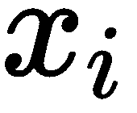
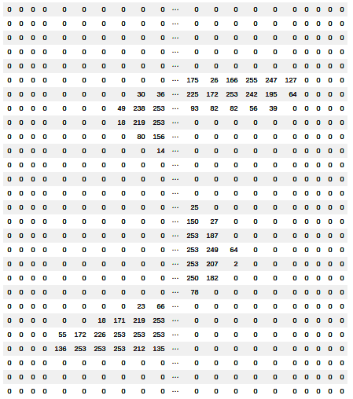
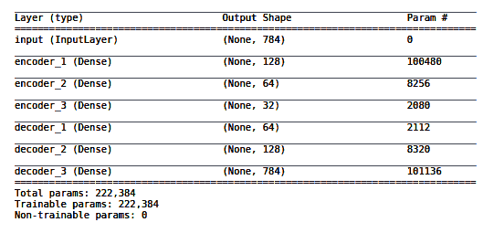
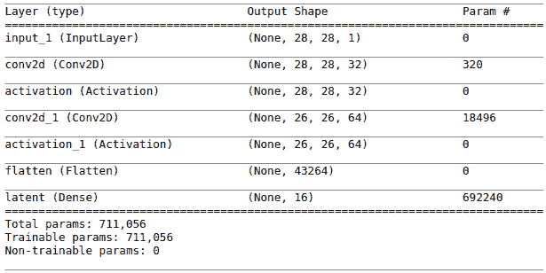
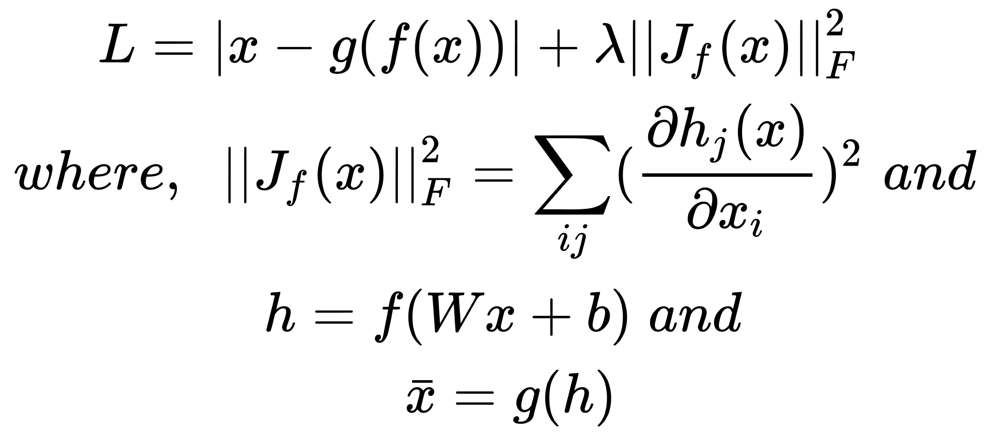
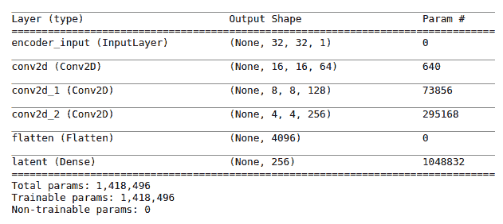
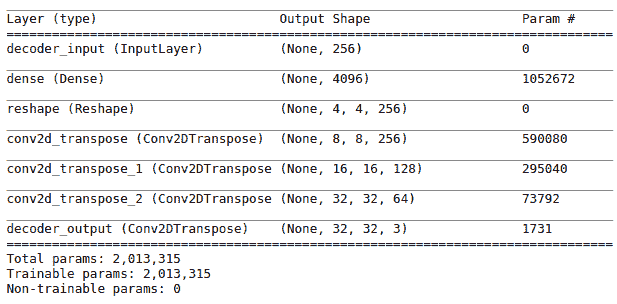

# 用 Keras 实现自编码器

自编码器是一种特殊的前馈神经网络，能够学习输入数据的有效编码。这些编码可以比输入的维数更低或更高。Autoencoder 是一种无监督的深度学习技术，它学习将输入数据表示到潜在的特征空间中。自编码器可用于多种应用，如降维、图像压缩、图像去噪、图像生成和特征提取。

在本章中，我们将介绍以下配方:

*   实现普通自编码器
*   使用自编码器降维
*   降噪自编码器
*   将黑白转换为彩色


# 实现普通自编码器

自编码器由以下两个网络组成:

*   **编码器**:编码器将其输入编码成隐藏表示。编码器单元的输出如下:

*h = g(Wx [i] +b)*

其中，*x[I]∈*R^n，*W*∈*R^(d x n)， *b* ∈ *R ^d 。****

*   **解码器**:解码器从隐藏表示中重构输入， *h* 。解码器单元的输出如下:


其中，W* ∈ R ^(n x d) ，h ∈ R ^d ，c ∈ R ^n 。

自编码器神经网络试图从维度的编码表示中重构原始输入，以产生输出，使得近似于。训练网络以最小化重建误差(损失函数)。它是原始输入和预测输出之间差异的度量，可以表示为。编码表示维数小于输入维数的自编码器称为欠完全自编码器，而编码表示维数大于输入维数的自编码器称为过完全自编码器。

下图显示了欠完整和过完整自编码器的示例:


在下一节中，我们将实现一个不完整的自编码器。


# 做好准备

在这个食谱中，我们将使用 MNIST 手写数字数据集。它有 60，000 个样本的训练集和 10，000 个样本的测试集。

我们从导入所需的库开始:

```
library(keras)
library(abind)
library(grid)
```

让我们导入数据的训练和测试分区:

```
data = dataset_mnist()
x_train = data$train$x
x_test = data$test$x
cat("Train data dimnsions",dim(x_train),"\n")
cat("Test data dimnsions",dim(x_test))
```

在下面的截图中，我们可以看到 MNIST 数据有 60，000 个训练和 10，000 个大小为 28x28 的测试图像:


我们来看看第一张图的数据:

```
x_train[1,,]
```

在下面的屏幕截图中，您可以看到图像数据是多维数组的形式:



我们将我们的训练和测试数据集的值标准化为 0 和 1，并将大小为 28X28 的每个图像展平为 784 个元素的一维数组:

```
x_train = x_train/ 255
x_test = x_test / 255

x_train <- array_reshape(x_train, c(nrow(x_train), 784))
x_test <- array_reshape(x_test, c(nrow(x_test), 784))
```

现在我们已经看到了数据的样子，让我们转到模型构建。


# 怎么做...

现在，我们继续构建我们的模型:

1.  我们首先定义一个变量，它的值等于输入的压缩编码表示的维数。然后，我们设置模型的输入层:

```
encoding_dim = 32 
input_img = layer_input(shape=c(784),name = "input")
```

2.  让我们构建一个编码器和解码器，并将它们结合起来构建一个自编码器:

```
encoded = input_img %>% layer_dense(units = encoding_dim, activation='relu',name = "encoder")
decoded = encoded %>% layer_dense(units = c(784), activation='sigmoid',name = "decoder")

# this model maps an input to its reconstruction
autoencoder = keras_model(input_img, decoded)
```

现在，我们设想一下自编码器模型的概要:

```
summary(autoencoder)
```

模式总结如下:


3.  然后，我们编译并训练我们的模型:

```
# compiling the model
autoencoder %>% compile(optimizer='adadelta', loss='binary_crossentropy')

# training the model
autoencoder %>% fit(x_train, x_train,
 epochs=50,
 batch_size=256,
 shuffle=TRUE,
 validation_data=list(x_test, x_test))
```

4.  现在，我们在测试集上预测模型的输出，并打印出测试和预测图像的样本:

```
# predict
predicted <- autoencoder %>% predict(x_test)

# Original images from test data
grid = array_reshape(x_test[20,],dim = c(28,28))
for(i in seq(1,5)){
 grid = abind(grid,array_reshape(x_test[i,],dim = c(28,28)),along = 2)
}
grid.raster(grid,interpolate=FALSE)

# Reconstructed images
grid1 = array_reshape(predicted[20,],dim = c(28,28))
for(i in seq(1,5)){
    grid1 = abind(grid1,array_reshape(predicted[i,],dim = c(28,28)),along = 2)
}
grid.raster(grid1, interpolate=FALSE)
```

以下是测试数据中的一些示例图像:


以下屏幕截图显示了之前显示的样本测试图像的预测图像:


我们可以看到所有的图像都被我们的模型精确地重建了。


# 它是如何工作的...

在*步骤 1* 中，我们初始化了一个变量`encoded_dim`，以设置输入的编码表示的维度。由于我们实现了一个不完全自编码器，它将输入特征空间压缩到一个较低的维度，`encoded_dim`小于输入维度。接下来，我们定义了自编码器的输入层，它接受一个大小为 784 的数组作为输入。

在下一步中，我们构建了一个自编码器模型。我们首先定义了一个编码器和一个解码器网络，然后将它们结合起来创建一个自编码器。注意，编码器层中的单元数量等于`encoded_dim`，因为我们想要将 784 维的输入特征空间压缩到 32 维。解码器层中的单元数量与输入维度相同，因为解码器试图重建输入。在构建了自编码器之后，我们可视化了模型的概要。在*步骤* *3* 中，我们使用 **Adadelta** 优化器配置我们的模型以最小化**二进制交叉熵**损失，然后训练该模型。我们将输入和目标值设置为`x_train`。

在最后一步中，我们可视化了来自测试数据集的几个样本图像的预测图像。


# 还有更多...

在简单的自编码器中，解码器和编码器网络具有完全连接的密集层。卷积自编码器通过用卷积层替换其密集层来扩展这种底层自编码器架构。与简单的自编码器一样，卷积自编码器中输入层的大小与输出层的大小相同。该自编码器的编码器网络具有卷积层，而解码器网络具有转置卷积层或与卷积层耦合的上采样层。

在下面的代码块中，我们实现了一个卷积自编码器，其中解码器网络由一个上采样层和一个卷积层组成。这种方法放大输入，然后应用卷积运算。在*去噪 auto encode**ers*配方中，我们实现了一个带有转置卷积层的自编码器。

以下代码显示了卷积自编码器的实现:

```
x_train = x_train/ 255
x_test = x_test / 255

x_train = array_reshape(x_train, c(nrow(x_train), 28,28,1))
x_test = array_reshape(x_test, c(nrow(x_test), 28,28,1))

input_img = layer_input(shape=c(28, 28, 1))

x = input_img %>% layer_conv_2d(32, c(3, 3), activation='relu', padding='same')
x = x %>% layer_max_pooling_2d(c(2, 2), padding='same')
x = x %>% layer_conv_2d(18, c(3, 3), activation='relu', padding='same')
x = x %>%layer_max_pooling_2d(c(2, 2), padding='same')
x = x %>% layer_conv_2d(8, c(3, 3), activation='relu', padding='same')
encoded = x %>% layer_max_pooling_2d(c(2, 2), padding='same')

x = encoded %>% layer_conv_2d(8, c(3, 3), activation='relu', padding='same')
x = x %>% layer_upsampling_2d(c(2, 2))
x = x %>% layer_conv_2d(8, c(3, 3), activation='relu', padding='same')
x = x %>% layer_upsampling_2d(c(2, 2))
x = x %>% layer_conv_2d(16, c(3, 3), activation='relu')
x = x %>% layer_upsampling_2d(c(2, 2))
decoded = x %>% layer_conv_2d(1, c(3, 3), activation='sigmoid', padding='same')

autoencoder = keras_model(input_img, decoded)
summary(autoencoder)

autoencoder %>% compile(optimizer='adadelta', loss='binary_crossentropy')

autoencoder %>% fit(x_train, x_train,
    epochs=20,
    batch_size=128,
    validation_data=list(x_test, x_test))
predicted <- autoencoder %>% predict(x_test)
```

以下是使用卷积自编码器重建的一些样本测试图像:


从前面的截图中，我们可以说我们的模型在重建原始图像方面做得很好。


# 使用自编码器降维

自编码器实际上可以学习非常有趣的数据投影，这有助于降低数据的维度，而不会在低维空间中丢失太多数据。编码器压缩输入，并在压缩过程中选择最重要的特征，也称为潜在特征。解码器与编码器相反，它试图尽可能地重建原始输入。在对原始输入数据进行编码时，自编码器会尝试使用较少的特征来捕捉数据的最大方差。

在这个食谱中，我们将构建一个深度自编码器来提取低维潜在特征，并演示我们如何使用这个低维特征集来解决各种学习问题，如回归、分类等。降维显著减少了训练时间。在降低维度的同时，自编码器还会学习数据中存在的非线性特征，从而增强模型的性能。


# 做好准备

在之前的配方中，*实现* *v* a *nilla 自编码器*，我们实现了最简单的自编码器。在这个菜谱中，我们将使用 MNIST 数字数据构建一个深度自编码器来演示维度缩减。数据预处理将与之前的配方相同，*实现* *v* a *nilla 自编码器。*我们将从编码器网络中提取编码特征(低维)，然后在解码器中使用这些编码特征来重构原始输入并评估重构误差。我们使用这些编码特征来建立数字分类模型。


# 怎么做...

我们现在将继续构建我们的深度自编码器。深度自编码器在其编码器和解码器网络中具有多层:

1.  让我们构建一个自编码器:

```
encoded_dim = 32

# input layer
input_img <- layer_input(shape = c(784),name = "input")

# encoder
encoded = input_img %>%
    layer_dense(128, activation='relu',name = "encoder_1") %>%
    layer_dense(64, activation='relu',name = "encoder_2") %>%
    layer_dense(encoded_dim, activation='relu',name = "encoder_3")

# decoder
decoded = encoded %>%
    layer_dense(64, activation='relu',name = "decoder_1")%>%
    layer_dense(128, activation='relu',name = "decoder_2")%>%
    layer_dense(784,activation = 'sigmoid',name = "decoder_3")

# autoencoder
autoencoder = keras_model(input_img, decoded)
summary(autoencoder)
```

下面的屏幕截图显示了 autoencoder 模型的概要:



2.  让我们创建一个单独的编码器模型；该模型将输入映射到其编码表示:

```
encoder = keras_model(input_img, encoded)
summary(encoder)
```

下面的屏幕截图显示了编码器网络的概要:


3.  让我们也创建解码器模型:

```
# input layer for decoder
encoded_input = layer_input(shape=c(32),name = "encoded_input")

# retrieve the layer of the autoencoder model for decoder
decoder_layer1 <- get_layer(autoencoder,name= "decoder_1")
decoder_layer2 <- get_layer(autoencoder,name= "decoder_2")
decoder_layer3 <- get_layer(autoencoder,name= "decoder_3")

# create the decoder model from retreived layers
decoder = keras_model(encoded_input, decoder_layer3(decoder_layer2(decoder_layer1(encoded_input))))

summary(decoder)
```

下面的屏幕截图显示了解码器网络的概要:


4.  然后，我们编译并训练我们的自编码器模型:

```
# compiling the model
autoencoder %>% compile(optimizer = 'adadelta',loss='binary_crossentropy')

# training the model
autoencoder %>% fit(x_train, x_train,
    epochs=50,
    batch_size=256,
    shuffle=TRUE,
    validation_data=list(x_test, x_test))
```

5.  现在让我们对测试图像进行编码:

```
encoded_imgs = encoder %>% predict(x_test)
```

6.  在对我们的测试图像进行编码之后，我们使用解码器网络从编码表示中重构原始输入测试图像，并计算重构误差:

```
# reconstructing images 
decoded_imgs = decoder %>% predict(encoded_imgs)

# calculating reconstruction error
reconstruction_error = metric_mean_squared_error(x_test,decoded_imgs)
paste("reconstruction error: " ,k_get_value(k_mean(reconstruction_error)))
```

我们可以看到，我们已经实现了 0.228 的令人满意的重建误差:


7.  现在让我们对训练图像进行编码。我们将使用编码数据来训练数字分类器:

```
encoded_train_imgs = encoder %>% predict(x_train)
```

8.  我们现在构建一个数字分类器网络并编译它:

```
# Building the model
model <- keras_model_sequential() 
model %>% 
  layer_dense(units = 256, activation = 'relu', input_shape = c(encoded_dim)) %>% 
  layer_dropout(rate = 0.4) %>% 
  layer_dense(units = 128, activation = 'relu') %>%
  layer_dropout(rate = 0.3) %>%
  layer_dense(units = 10, activation = 'softmax')

# compiling the model
model %>% compile(
  loss = 'categorical_crossentropy',
  optimizer = optimizer_rmsprop(),
  metrics = c('accuracy')
)
```

9.  我们继续处理列车标签，然后我们将训练网络:

```
# extracting class labels
y_train <- mnist$train$y
y_test <- mnist$test$y

# Converting class vector (integers) to binary class matrix.
y_train <- to_categorical(y_train, 10)
y_test <- to_categorical(y_test, 10)

# training the model
history <- model %>% fit(
  encoded_train_imgs, y_train, 
  epochs = 30, batch_size = 128, 
  validation_split = 0.2
)
```

10.  让我们来评估模型性能:

```
model %>% evaluate(encoded_imgs, y_test, batch_size = 128)
```

下面的屏幕截图显示了模型的准确性和损失:


从前面的截图中可以清楚地看到，我们的 autoencoder 模型在学习数据的编码表示方面做得非常好。使用这些编码特征，我们训练了一个准确率为 79%的分类器。


# 它是如何工作的...

在*步骤* *1* 中，我们构建了一个 Keras 功能自编码器模型。我们首先定义了一个输入层和一个编码器和解码器网络，然后将它们结合起来创建一个深度自编码器。编码器网络将 784 维的输入减少到 32 维。解码器网络将 32 维(解码器的输入)重构为 784 维。在第 2 步中，我们建立了一个单独的编码器模型。编码器模型共享自编码器的编码器层，这意味着权重是共享的。

在下一步中，我们定义了一个单独的解码器模型。该模型共享自编码器的解码器层。我们首先定义一个编码输入层，然后从自编码器中提取密集层来创建解码器。在*步骤* *4* 中，我们使用 Adadelta 优化器配置我们的模型以最小化二进制交叉熵损失，然后训练该模型 50 个时期。在*步骤* *5* 中，我们将测试图像编码成缩减的尺寸。

在*步骤 6* 中，我们使用解码器模型重建测试数据并计算重建误差。下一步，我们对训练图像进行编码。在*步骤* *8* 中，我们配置并编译了一个用于数字识别的分类网络。在*步骤 9* 中，我们处理了训练标签，训练了网络。最后，我们评估了数字分类模型的性能。


# 还有更多...

我们经常会遇到数据规模巨大的问题。我们可能需要降低数据的维度，以使降维后的数据最好地代表原始数据。主成分分析 ( **PCA** )和自编码器是实现这一点的一些流行技术。

尽管这两种算法的降维目的是相同的，但这两种技术有一些关键的区别:

*   与 PCA 不同，自编码器可以从数据中学习非线性特征表示，从而提高模型性能。
*   PCA 比自编码器更容易训练和解释。自编码器的底层数学也很复杂。
*   与需要更多计算的自编码器相比，PCA 需要更少的时间来运行。


# 降噪自编码器

自编码器广泛用于特征选择和提取。他们尝试对输入数据应用变换，以准确地重建输入。当隐藏层的节点等于或多于输入层中的节点时，自编码器会承担学习恒等函数的风险，在恒等函数中，输出简单地等于输入，因此使自编码器无用。**去噪**指的是在将原始输入馈送到网络之前，有意地将随机噪声添加到原始输入中。通过这样做，身份函数风险被解决，并且编码器从数据中学习重要特征，并且学习输入数据的健壮表示。使用去噪自编码器时，需要注意的是，损失函数是通过将输出值与原始输入进行比较而不是与损坏的输入进行比较来计算的。

以下是去噪自编码器的示例表示:


在这个菜谱中，我们将实现一个去噪自编码器。


# 做好准备

在这个配方中，我们将使用之前配方中使用的 MNIST 数据集，*使用自编码器*实现 v *anilla 自编码器*和*维度缩减。我们将向归一化的 MNIST 图像添加随机高斯噪声，并用去噪自编码器对其去噪。我们将标准化的训练和测试数据集称为`x_train_norm`和`x_test_norm`。*


# 怎么做...

让我们从向输入数据添加噪声开始:

1.  在输入数据进入网络之前，我们在输入数据中加入一个正常的随机噪声。我们通过添加以 0.5 为中心的正态分布和 0.5 的标准偏差来生成损坏的图像:

```
# noise for train dataset
noise_train <- array(data = rnorm(seq(0, 1, by = 0.02),mean = 0.5,sd = 0.5) ,dim = c(n_train,28,28,1))
dim(noise_train)

# noise for test dataset
noise_test <- array(data = rnorm(seq(0, 1, by = 0.02),mean = 0.5,sd = 0.5) ,dim = c(n_test,28,28,1))
dim(noise_test)

# adding noise to train
x_train_norm_noise <- x_train_norm + noise_train

# adding noise to test
x_test_norm_noise <- x_test_norm + noise_test
```

2.  我们剪切被破坏的输入数据(输入数据+噪声),以将像素值保持在 0 和 1 的范围内。小于 0 的值被剪裁为 0，大于 1 的值被剪裁为 1:

```
# clipping train set
x_train_norm_noise[x_train_norm_noise < 0] <- 0 
x_train_norm_noise[x_train_norm_noise > 1] <- 1

# clipping test set
x_test_norm_noise[x_test_norm_noise < 0] <- 0 
x_test_norm_noise[x_test_norm_noise > 1] <- 1
```

现在让我们来看一下样本损坏的图像:

```
grid.raster(x_train_norm_noise[2,,,])
```

下面的屏幕截图显示了一个损坏后的图像。类似地，在添加噪声之后，所有其他图像也将被破坏:


3.  我们首先创建编码器部分。我们首先使用`layer_input`函数创建一个输入层:

```
# input layer
inputs <- layer_input(shape = c(28, 28, 1))
x = inputs
```

接下来，我们为编码器模型配置层:

```
# outputs compose input + dense layers
x <- x %>%
 layer_conv_2d(filter = 32, kernel_size = 3,padding = "same", input_shape = c(28, 28, 1)) %>%
 layer_activation("relu") %>%
 layer_conv_2d(filter = 64, kernel_size = 3) %>%
 layer_activation("relu")
```

我们从前面代码块中创建的网络中提取输出张量的形状。构建解码器模型需要这些信息:

```
shape = k_int_shape(x)
shape
```

下面的屏幕截图显示了编码器模型的输出张量的形状:


编码器的最后一层是具有 16 个单元的密集层。让我们在编码器模型的末尾添加一个展平层和一个密集层:

```
x = x %>% layer_flatten()
latent = x %>% layer_dense(16,name = "latent")
```

我们现在实例化编码器模型。该模型将输入映射到其编码表示:

```
encoder = keras_model(inputs, latent)
```

现在让我们来看看编码器模型的概要:

```
summary(encoder)
```

下面的屏幕截图显示了编码器型号的概要:



4.  编码器的输出作为解码器部分的输入。就层配置而言，解码器与编码器相反:

```
latent_inputs = layer_input(shape=16, name='decoder_input')

x = latent_inputs %>% layer_dense(shape[[2]] * shape[[3]] * shape[[4]]) %>%
    layer_reshape(c(shape[[2]],shape[[3]], shape[[4]]))
```

接下来，我们配置解码器部分的层:

```
x <- x %>%
 layer_conv_2d_transpose(
 filter = 64, kernel_size = 3, padding = "same", 
 input_shape = c(28, 28, 1)
 ) %>%
 layer_activation("relu") %>%
 # Second hidden layer
 layer_conv_2d_transpose(filter = 32, kernel_size =3) %>%
 layer_activation("relu")

x = x %>% layer_conv_2d_transpose(filters=1,
 kernel_size= 3,
 padding='same')

outputs = x %>% layer_activation('sigmoid', name='decoder_output')
```

我们现在实例化解码器模型，并查看其摘要:

```
decoder = keras_model(latent_inputs, outputs)
summary(decoder)
```

下面的屏幕截图显示了解码器型号的概要:


5.  现在，我们建立自编码器模型。我们可以看到，在自编码器模型中，输入和输出的形状具有相同的维度:

```
# Autoencoder = Encoder + Decoder ; instantiating autoencoder model
autoencoder = keras_model(inputs, decoder(encoder(inputs)))
summary(autoencoder)
```

下面的屏幕截图显示了 autoencoder 模型的概要:


6.  现在，我们编译自编码器模型，并将训练数据拟合到模型中，以训练自编码器:

```
autoencoder %>% compile(loss = 'mse',optimizer = 'adam')

autoencoder %>% fit(x_train_norm_noise,
 x_train_norm,
 validation_data=list(x_test_norm_noise, x_test_norm),
 epochs=30,batch_size= 128
 )
```

7.  接下来，我们为测试数据生成预测:

```
prediction <- autoencoder %>% predict(x_test_norm_noise)
```

下面的屏幕截图显示了带有噪声的 MNIST 数字和对自编码器去噪后的预测图像:


从前面的截图，我们可以说，我们的模型做了一个体面的数字去噪工作。


# 它是如何工作的...

在*步骤 1* 中，我们生成了一个均值为 0.5、标准差为 0.5 的随机高斯噪声。噪声数据的形状必须与我们添加的数据的形状相似。

我们希望像素值在 0 到 1 的范围内，但是在输入数据中引入噪声后，像素值可能会改变，不再在所需的范围内。为了避免这种情况，在*步骤* *2* 中，我们将受损输入数据中的值修剪在 0 和 1 的范围内。剪裁将所有负值转换为 0，将大于 1 的值转换为 1，而其余值保持不变。在*步骤 3* 中，我们创建了 autoencoder 模型的编码器部分。在我们的例子中，编码器模型是两个卷积层的堆栈。

第一卷积层具有 32 个大小为 3×3 的滤波器，接着是另一个具有 64 个大小为 3×3 的滤波器的第二卷积层。使用的激活函数是`relu`。在下一步中，我们构建了自编码器模型的解码器部分。注意，在解码器模型中，层配置正好与编码器模型相反。解码器模型的输入是由编码器提供的数据的压缩表示。解码器模型的输出将具有与输入维度相同的维度。在*步骤* *5* 中，我们将编码器和解码器结合起来，构建了一个自编码器模型。在下一步中，我们编译并训练了自编码器。我们使用**均方误差**作为损失函数，使用`adam`作为优化器。总体目标是使模型稳健:

**噪声+数据→去噪自编码器→数据**

在最后一步中，我们为测试数据生成预测，并在预测后可视化重建图像。


# 还有更多...

自编码器可以从原始输入数据中学习内部表示。这些自编码器面临的一个挑战是，它们对于训练数据来说可能过于专门化，也就是说，它们过拟合，并且不能针对新数据进行推广。正则化使自编码器对输入不太敏感，但同时，最小化重构误差迫使它保持敏感以捕捉更多变化。将惩罚适当地应用于损失函数使得模型更健壮并学习一般化的特征。

在本节中，我们将了解两种类型的正则化自编码器:

*   收缩自编码器
*   稀疏自编码器

**收缩型自编码器** : 这些是规则化的自编码器，其中对重构成本函数应用惩罚，用于对数据中的小变化不太敏感的鲁棒的学习表示。该罚项是编码器激活的雅可比矩阵相对于训练数据输入的 Frobenius 范数:



添加这种损失导致局部空间收缩，这导致激活层中的鲁棒特征提取。收缩自编码器提取由数据指示的变化的局部方向，其属于低维非线性流形，并且在与该流形正交的方向上更稳定。去噪自编码器和收缩自编码器之间的一个显著区别是去噪自编码器使编码器和解码器网络都鲁棒，而收缩自编码器仅使编码器部分鲁棒。

**稀疏自编码器**:在训练时的自编码器中，对于大多数训练样本，中间层中的隐藏单元非常频繁地触发。我们不想要这种特性。在稀疏自编码器中，我们添加了一个稀疏约束来降低隐藏神经元的激活率，使它们只在一小部分训练样本中被激活。这被称为稀疏，因为每个隐藏单元只激活特定类型的输入，而不是所有的输入。通过迫使神经元只为训练样本中特定类型的输入而触发，该单元将稳健地工作，并学习数据中有用的表示。这是一种不同的正则化方法，在这里，我们正则化激活，不像其他方法，我们正则化网络的权重。在经过训练的稀疏自编码器模型中，不同的输入将导致网络中不同节点的激活。

主要有两种在稀疏自编码器中施加稀疏约束的方式，并且两种方式都通过向损失函数添加一些项来惩罚过度激活:

*   **L1 正则化:**在这种正则化技术中，我们将惩罚项添加到损失函数中，该损失函数惩罚用于观测值 *i* 的层 *h* 中的激活向量的绝对值，该值由调谐参数λ:缩放
*   **KL-Divergence:** 我们添加一个稀疏度参数ρ，它是一组训练样本上神经元的平均激活度:


*   这里，下标 *j* 表示层 *h* 中的一个特定神经元， *m* 表示可以单独表示为 *x* 的训练观测值的个数。
    两个伯努利分布之间的 KL 散度可以写成:


# 请参见

如果你有兴趣了解更多关于堆叠去噪自编码器的信息，请参考以下链接:[http://www . jmlr . org/papers/volume 11/Vincent 10a/Vincent 10a . pdf](http://www.jmlr.org/papers/volume11/vincent10a/vincent10a.pdf)。


# 将黑白变成彩色

使用深度学习技术的图像彩色化是当今常见的现实世界应用。在图像着色中，黑白(即灰度)图像被转换成最能代表输入图像的语义颜色的彩色图像。例如，晴天的天空颜色必须由模型着色为蓝色，而不是红色。有许多可用的着色算法和技术；这些技术的主要区别在于它们处理数据和将灰度映射到颜色的方式。一些参数方法通过在大量彩色图像数据集上进行训练，将问题提出为回归或分类，并提供适当的损失函数来学习表示。其他方法依赖于定义一个或多个颜色参考图像。

在这个食谱中，我们将使用自编码器来完成这项任务。我们将用足够数量的灰度照片作为输入，相应的彩色图片作为输出来训练自编码器，以便它可以在正确应用颜色时发现隐藏的结构。


# 做好准备

在本例中，我们将使用 CIFAR-10 数据集，它由大小为 32x32 的彩色图像组成。有 50，000 个训练图像和 10，000 个测试图像。我们将预处理其图像灰度，然后建立一个自编码器给它们上色。

让我们首先将所需的库加载到环境中:

```
library(keras)
library(wvtool)
library(grid)
library(abind)
```

我们加载训练和测试数据集，并将它们存储到变量中:

```
data <- dataset_cifar10()
x_train = data$train$x
x_test = data$test$x
```

让我们将相关的维度数据存储到各自的变量中:

```
num_images = dim(x_train)[1]
num_images_test = dim(x_test)[1]
img_width = dim(x_train)[2]
img_height = dim(x_train)[3]
```

让我们使用`wvtools`中的`rgb2gray()`函数将训练和测试数据中的所有图像转换成灰度图像:

```
# grayscale train set 
x_train_gray <- apply(x_train[1:num_images,,,], c(1), FUN = function(x){
 rgb2gray(x, coefs=c(0.299, 0.587, 0.114))
})
x_train_gray <- t(x_train_gray)
x_train_gray = array(x_train_gray,dim = c(num_images,img_width,img_height))

# grayscale test set
x_test_gray <- apply(x_test[1:num_images_test,,,], c(1), FUN = function(x){
 rgb2gray(x, coefs=c(0.299, 0.587, 0.114))
})
x_test_gray <- t(x_test_gray)
x_test_gray = array(x_test_gray,dim = c(num_images_test,img_width,img_height))
```

接下来，我们对训练进行归一化，并在 0 和 1 的范围内测试彩色图像和灰度图像:

```
# normalize train and test coloured images
x_train = x_train / 255
x_test = x_test / 255

# normalize train and test grayscale images
x_train_gray = x_train_gray / 255
x_test_gray = x_test_gray / 255
```

然后，我们将每个灰度图像重新调整为图像高度、图像宽度和通道数量的形状:

```
x_train_gray <- array_reshape(x_train_gray,dim = c(num_images,img_height,img_width,1))
x_test_gray <- array_reshape(x_test_gray,dim = c(num_images_test,img_height,img_width,1))
```

注意，在灰度图像的情况下，通道的数量是 1。


# 怎么做...

我们已经将 CIFAR-10 数据集中的图像转换为灰度。现在，让我们建立一个自编码器来给它们上色:

1.  让我们定义变量来设置自编码器的参数:

```
# network parameters
input_shape = c(img_height, img_width, 1)
batch_size = 32
kernel_size = 3
latent_dim = 256
```

接下来，我们创建自编码器的输入层:

```
inputs = layer_input(shape = input_shape,name = "encoder_input")
```

2.  我们已经创建了输入层，现在让我们定义和配置网络编码器部分的层:

```
x = inputs
x <- x %>% layer_conv_2d(filters = 64,kernel_size = kernel_size,strides = 2,
 activation = "relu",padding = "same") %>%
 layer_conv_2d(filters = 128,kernel_size = kernel_size,strides = 2,
 activation = "relu",padding = "same") %>%
 layer_conv_2d(filters = 256,kernel_size = kernel_size,strides = 2,
 activation = "relu",padding = "same")
```

我们还从前面代码块中创建的网络中提取输出张量的形状。构建解码器模型需要这些信息:

```
shape = k_int_shape(x)
```

让我们在编码器的末尾添加一个展平层和一个密集层，并构建编码器模型:

```
x <- x %>% layer_flatten()
latent <- x %>% layer_dense(units = latent_dim,name = "latent")
encoder = keras_model(inputs, latent)
```

我们现在看到编码器模型的摘要:

```
summary(encoder)
```

下面的屏幕截图显示了编码器网络的概要:



3.  接下来，我们建立解码器模型。编码器的输出是解码器部分的输入；因此，编码器的输出形状应该设置为等于解码器的输入。注意，就层配置而言，解码器网络与编码器相反:

```
# decoder input layer
latent_inputs = layer_input(shape = c(latent_dim), name='decoder_input')

# adding layers to input layer
x = latent_inputs %>% layer_dense(shape[[2]] * shape[[3]] * shape[[4]])
x = x %>% layer_reshape(c(shape[[2]], shape[[3]], shape[[4]]))
x <- x %>% layer_conv_2d_transpose(filters = 256,kernel_size = kernel_size,strides = 2,
 activation = "relu",padding = "same") %>%
 layer_conv_2d_transpose(filters = 128,kernel_size = kernel_size,strides = 2,
 activation = "relu",padding = "same") %>%
 layer_conv_2d_transpose(filters = 64,kernel_size = kernel_size,strides = 2,
 activation = "relu",padding = "same")

# output layer
outputs = x %>% layer_conv_2d_transpose(filters=3,
 kernel_size=kernel_size,
 activation='sigmoid',
 padding='same',
 name='decoder_output')

# decoder
decoder = keras_model(latent_inputs, outputs)
```

我们来看看解码器模型的总结:

```
summary(decoder)
```

下面的屏幕截图显示了解码器网络的概要:



4.  下一步是将编码器和解码器合并成一个自编码器模型:

```
# autoencoder = encoder + decoder
autoencoder = keras_model(inputs, decoder(encoder(inputs)))
```

让我们来看看完整的自编码器模型的概要:

```
summary(autoencoder)
```

以下屏幕截图显示了自编码器网络的概要:


5.  我们现在编译和训练自编码器:

```
# compile
autoencoder %>% compile(loss='mse', optimizer='adam')

# train the autoencoder
autoencoder %>% fit(x_train_gray,
 x_train,
 validation_data= list(x_test_gray, x_test),
 epochs=20,
 batch_size=batch_size)
```

6.  我们使用训练好的模型来生成测试数据的预测:

```
predicted <- autoencoder %>% predict(x_test_gray)
```

下面的截图描述了我们的自编码器如何对灰度图像进行着色:


在下一节中，我们将深入了解我们实现的所有步骤的本质。


# 它是如何工作的...

在*步骤* *1* 中，我们初始化变量来设置模型参数。`latent_dim`变量设置编码特征的维度。然后，我们创建了自编码器的输入层。在*步骤* 2 中，我们构建了一个编码器模型。我们首先创建编码器的卷积层，然后提取最后一个卷积层的输出形状。接下来，我们添加了一个展平层，然后连接了一个单位等于`latent_dim`变量的密集层。在下一步中，我们构建了解码器模型。我们为解码器定义了一个输入层，它接收一个形状等于`latent_dim`的输入。

接下来，我们在解码器中添加了层，这样我们就可以反转编码器的操作。在*步骤* 4 中，我们将编码器和解码器结合起来，构建了一个自编码器。在下一步中，我们为 20 个时期编译和训练了自编码器。我们使用均方差作为损失函数，adam 作为优化器。在最后一步，我们输入黑白图像并给它们着色。


# 请参见

要了解使用自编码器进行有损图像压缩，请参考本文:[https://arxiv.org/pdf/1703.00395.pdf](https://arxiv.org/pdf/1703.00395.pdf)。