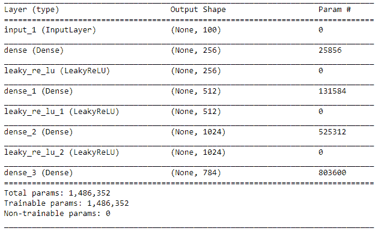
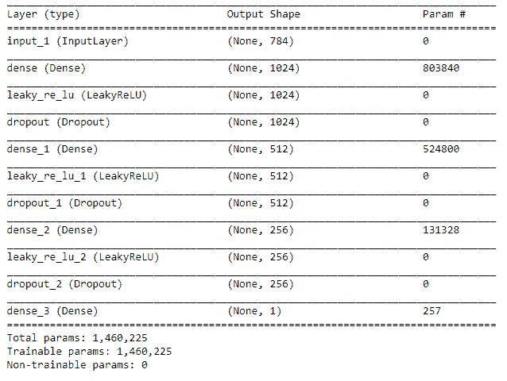
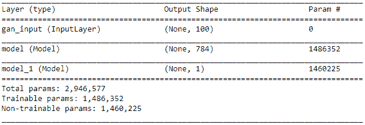
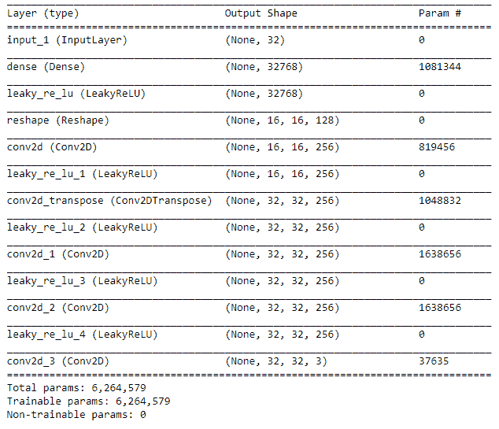
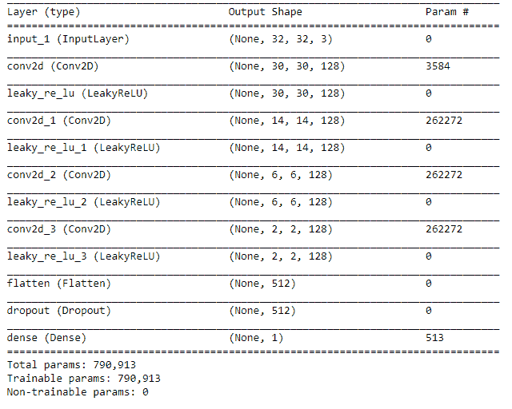
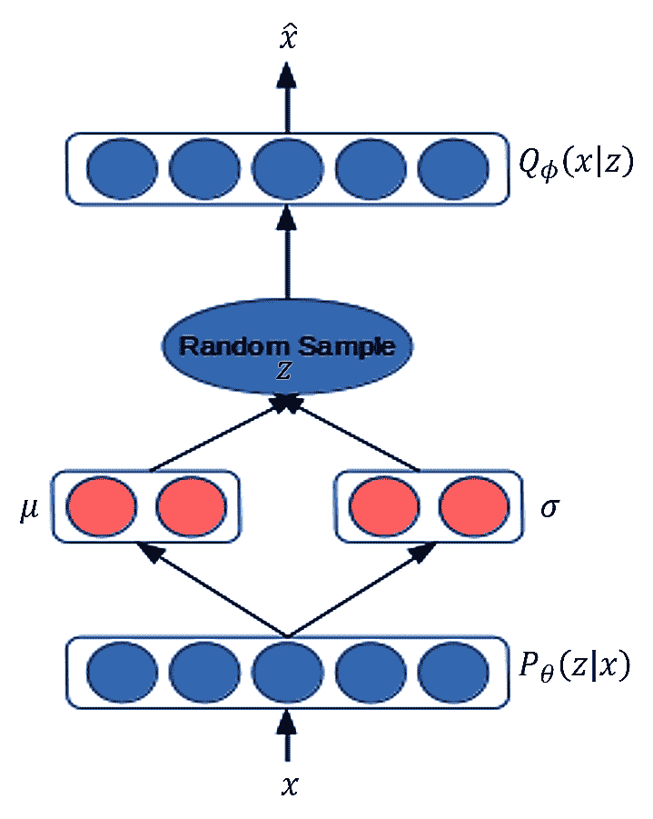
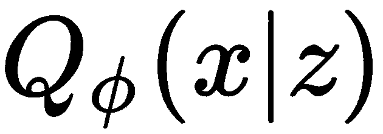
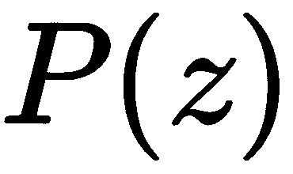
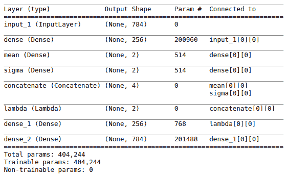
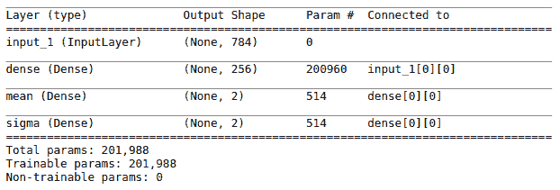

# 深度生成模型

深度生成神经网络是无监督深度学习模型的一种流行形式。这些模型旨在学习生成数据的过程。生成模型不仅学习从数据中提取模式，还估计潜在的概率分布。这些模型用于创建合成数据，这些数据遵循与给定训练数据集相同的概率分布。这一章将让你了解深层生成模型以及它们是如何工作的。

在本章中，我们将介绍以下配方:

*   使用 GANs 生成图像
*   实现 DCGANs
*   实现可变自编码器


# 使用 GANs 生成图像

**生成对抗网络** ( **甘斯**)被广泛用于学习任何数据分布并模仿它。GANs 由两个网络组成；一个是生成器，它从正态或均匀分布生成新的合成数据实例，而另一个是鉴别器，它评估生成的实例并检查它们是否可信，即它们是否属于原始训练数据分布。在伪造者和 cop 的场景中，发生器和鉴别器相互竞争，其中伪造者的目标是通过生成虚假数据来欺骗 cop，而 cop 的角色是检测谎言。来自鉴别器的反馈被传递给生成器，以便它可以在每次迭代中随机应变。注意，尽管两个网络都优化不同且相反的目标函数，但是整个系统的稳定性和准确性取决于这两个网络各自的准确性。

以下是 GAN 网络的总体目标函数:


下图显示了 gan 的工作原理:


在这个菜谱中，我们将实现一个 GAN 模型来重建手写数字。


# 做好准备

在这个例子中，我们将使用手写数字的 MNIST 数据集。它由 60，000 个训练和 10，000 个测试灰度图像组成，大小为 28x28。

让我们从加载所需的库开始:

```
library(keras)
library(grid)
library(abind)
```

现在，让我们加载数据:

```
# Input image dimensions
img_rows <- 28
img_cols <- 28

# The data, shuffled and split between train and test sets
mnist <- dataset_mnist()
x_train <- mnist$train$x
y_train <- mnist$train$y
x_test <- mnist$test$x
y_test <- mnist$test$y
```

现在，我们可以检查数据的维度:

```
dim(x_train)
```

在下面的截图中，您可以看到训练数据中有 60，000 张图像，每张图像的大小为 28x28:


现在我们已经完成了这一步，我们可以将训练数据的维度从 28x28 的矩阵重新定义为长度为 784 的扁平 1D 数组:

```
x_train <- array_reshape(x_train, c(nrow(x_train), 784))
```

接下来，我们对训练数据进行归一化，并在 0 和 1 的范围内转换值:

```
x_train <- x_train/255

```

让我们打印一个样本图像数据，看看它看起来像什么:

```
x_train[1,]
```

现在我们知道了数据，让我们继续模型构建部分。


# 怎么做...

GANs 中有两个组件——发生器和鉴别器。我们首先创建单独的发生器和鉴别器网络，然后通过 GAN 模型链接这两个网络并训练它。让我们开始吧:

1.  由于我们处理的是灰度图像，通道的数量将是 1。我们还将用作发电机网络输入的随机噪声向量的维数设置为 100:

```
channels <- 1
set.seed(10)
latent_dimension <- 100
```

2.  接下来，我们创建发电机网络。生成器网络将形状为`latent_dimension`的随机正常噪声向量映射到长度等于展平输入图像的向量。发电机网络由三个隐含层组成；激活功能是泄漏的 ReLU:

```
input_generator <- layer_input(shape = c(latent_dimension))

output_generator <- input_generator %>%  
 layer_dense(256,input_shape = c(784),kernel_initializer = initializer_random_normal(mean = 0,   stddev = 0.05, seed = NULL)) %>%
 layer_activation_leaky_relu(0.2) %>% 
 layer_dense(512) %>%
 layer_activation_leaky_relu(0.2) %>% 
 layer_dense(1024) %>%
 layer_activation_leaky_relu(0.2) %>%
 layer_dense(784,activation = "tanh")

generator <- keras_model(input_generator, output_generator)
```

我们来看一下发电机网络的总结:

```
summary(generator)
```

以下屏幕截图显示了发电机型号的描述:



3.  现在，我们可以创建鉴别器网络。该网络将生成器生成的图像映射到生成的图像是真的还是假的概率:

```
input_discriminator <- layer_input(shape = c(784))

output_discriminator <- input_discriminator %>% 

  layer_dense(units = 1024,input_shape = c(784),kernel_initializer = initializer_random_normal(mean = 0, stddev = 0.05, seed = NULL)) %>%
  layer_activation_leaky_relu(0.2) %>% 
  layer_dropout(0.3)%>%

  layer_dense(units = 512) %>%
  layer_activation_leaky_relu(0.2) %>% 
  layer_dropout(0.3)%>%

  layer_dense(units = 256) %>%
  layer_activation_leaky_relu(0.2) %>% 
  layer_dropout(0.3)%>%

  layer_dense(1,activation = "sigmoid")

discriminator <- keras_model(input_discriminator, output_discriminator)
```

我们来看看鉴别器的总结:

```
summary(discriminator)
```

下面的屏幕截图显示了鉴别器模型的描述:



配置好鉴别器网络后，我们需要编译它。我们使用`adam`作为优化器，使用`binary_crossentropy`作为损失函数。学习率被指定为 0.0002。我们使用`clipvalue`进行梯度裁剪，这限制了梯度的大小，以便它在陡峭的悬崖附近表现得更好:

```
discriminator %>% compile(
 optimizer = optimizer_adam(lr = 0.0002, beta_1 = 0.5,clipvalue = 1),
 loss = "binary_crossentropy"
)
```

4.  接下来，在开始训练 GAN 网络之前，我们冻结鉴别器的权重。这使得鉴别器不可训练，并且在训练 GAN 时其权重不会更新:

```
freeze_weights(discriminator) 
```

5.  让我们配置 GAN 网络并编译它。GAN 网络结合了发生器和鉴频器网络:

```
gan_input <- layer_input(shape = c(latent_dimension),name = 'gan_input')
gan_output <- discriminator(generator(gan_input))
gan <- keras_model(gan_input, gan_output)

gan %>% compile(
 optimizer = optimizer_adam(lr = 0.0002, beta_1 = 0.5,clipvalue = 1), 
 loss = "binary_crossentropy"
)
```

我们来看看`gan`模式的总结:

```
summary(gan)
```

以下截图显示了 GAN 模型的描述:



6.  现在，我们可以开始训练 GAN 网络。我们训练我们的 GAN 网络进行 1000 次迭代，每次迭代有一批 20 个新图像。我们创建一个名为`gan_images`的文件夹，并将各种迭代生成的图像存储在该文件夹中。我们还将不同迭代的模型存储在另一个名为`gan_model`的文件夹中:

```
iterations <- 1000
batch_size <- 20

# create directory to store generated images
dir.create("gan_images")
# create directory to store model
dir.create("gan_model")
```

让我们开始训练 GAN 模型:

```
start_index <- 1
for (i in 1:iterations) {

# Sample random points in the normally distributed latent 
# space of dimension (batch_size * latent_dimension)

 latent_vectors <- matrix(rnorm(batch_size * latent_dimension), 
 nrow = batch_size, ncol = latent_dimension)

# Use generator network to decode the above random points to fake images
 generated_images <- generator %>% predict(latent_vectors)

# Combine the fake images with real images to build the training data for discriminator
 stop_index <- start_index + batch_size - 1 
 real_images <- x_train[start_index:stop_index,]
 rows <- nrow(real_images)
 combined_images <- array(0, dim = c(rows * 2, dim(real_images)[-1]))
 combined_images[1:rows,] <- generated_images
 combined_images[(rows+1):(rows*2),] <- real_images
 dim(combined_images)

# Provide appropriate labels for real and fake images
 labels <- rbind(matrix(1, nrow = batch_size, ncol = 1),
 matrix(0, nrow = batch_size, ncol = 1))

# Adds random noise to the labels to increase robustness of the discriminator
 labels <- labels + (0.5 * array(runif(prod(dim(labels))),
 dim = dim(labels)))

# Train the discriminator using both real and fake images
 discriminator_loss <- discriminator %>% train_on_batch(combined_images, labels)

# Sample random points in the latent space
 latent_vectors <- matrix(rnorm(batch_size * latent_dimension), 
 nrow = batch_size, ncol = latent_dimension)

# Assembles labels that say "all real images"
 misleading_targets <- array(0, dim = c(batch_size, 1))

# Training the generator by using the gan model,note that the discriminator weights are frozen
 gan_model_loss <- gan %>% train_on_batch( 
 latent_vectors, 
 misleading_targets
 )
 start_index <- start_index + batch_size
 if (start_index > (nrow(x_train) - batch_size))
 start_index <- 1

 # At few iterations save the model and save generated images
 if(i %in% c(5,10,15,20,40,100,200,500,800,1000)){

 # Save model
 save_model_hdf5(gan,paste0("gan_model/gan_model_",i,".h5"))

 # Save generated images
 generated_images <- generated_images *255
 generated_images = array_reshape(generated_images ,dim = c(batch_size,28,28,1))
 generated_images = (generated_images -min(generated_images ))/(max(generated_images )-min(generated_images ))
 grid = generated_images [1,,,]
 for(j in seq(2,5)){
 single = generated_images [j,,,]
 grid = abind(grid,single,along = 2)
 }
 png(file=paste0("gan_images/generated_digits_",i,".png"),
 width=600, height=350)
 grid.raster(grid, interpolate=FALSE)
 dev.off() 
 }
}
```

生成的数字如下所示:


从上图中，我们可以推断出我们的模型运行良好。在下一节中，您将得到我们在这里实现的步骤的深入解释。


# 它是如何工作的...

在*步骤*1 中，我们定义了输入图像的形状和通道的数量。因为我们使用的图像是灰度的，我们指定通道为 1。我们还定义了潜在空间维度，它被用作生成器的输入。在*步骤* *2* 中，我们构建了一个生成器网络。生成器的目标是从`latent_dim`维度的随机法向量中生成图像。它产生一个 784 维的输出张量。在我们的例子中，我们使用深度神经网络作为生成器网络。注意，我们在生成器的最后一层使用了`tanh`作为激活函数，因为它比 sigmoid 激活函数执行得更好。此外，泄漏 ReLU 被用作隐藏层中的激活函数，因为该激活函数通过允许小的负激活值来放松稀疏梯度约束。

为了获得更好的结果，建议使用正态分布而不是均匀分布从潜在空间生成点。

在下一步中，我们定义并编译了鉴别器网络。它将生成器生成的大小为 784 的向量映射到一个概率，该概率指示生成的图像是真实的还是伪造的。因为我们的生成器网络是具有三个隐藏层的深度神经网络，所以鉴别器也是具有相同层数的深度神经网络。请注意，我们在鉴频器的标签中添加了漏失层和随机噪声，以增加随机性并使 GAN 模型更加稳健。在*步骤* *4* 中，我们冻结了鉴别器的重量，使其不可训练。

然后，在*步骤* *5* 中，我们配置编译了 GAN 网络。GAN 网络链接发生器和鉴别器。我们可以将 GAN 网络表示如下:

*gan(x) ←鉴别器(发生器(x))*

我们创建的 GAN 网络将生成器生成的图像映射到鉴别器对真假图像的评估。在*步*6 中，我们训练了 GAN 网络。为了训练 GAN，我们需要训练鉴别器，以便它准确地识别真假图像。生成器使用来自鉴别器的反馈来更新其权重。通过这种方式，鉴别器帮助训练生成器。我们使用发电机重量相对于`gan`模型损耗的梯度来训练发电机。这样，在每次迭代中，我们使生成器的权重向一个方向移动，使得鉴别器更有可能将生成器解码的图像分类为真实图像。发生器和鉴别器的鲁棒性对于整个网络的准确性至关重要。最后，我们保存了一些批次的模型和生成的图像。


# 还有更多...

尽管 GANs 已经成为一种非常流行的深度学习技术，但是与 GANs 一起工作仍然存在一些挑战。这里列出了一些关键的问题:

*   甘人极难训练。通常，模型参数不稳定且不收敛。
*   有时，鉴别器变得如此精确，以至于发生器的梯度消失，什么也没学到。
*   发生器和鉴频器之间的不平衡会导致过拟合。
*   gan 对模型调整和超参数选择过于敏感。


# 请参见

要了解更多有关其他主要类型的 GAN 架构的信息，请参考以下链接:

*   有条件的甘:[的](https://arxiv.org/pdf/1411.1784.pdf)
*   瓦塞尔斯坦·甘(WGAN):https://arxiv.org/pdf/1904.08994.pdf[https://arxiv.org/pdf/1704.00028.pdf](https://arxiv.org/pdf/1704.00028.pdf)
*   最小二乘甘:[的](https://arxiv.org/pdf/1611.04076.pdf)


# 实现 DCGANs

卷积 gan 是 gan 的一个非常成功的变体。它们在发生器和鉴别器网络中都包含卷积层。在这个菜谱中，我们将实现一个**深度卷积生成对抗网络** ( **DCGAN** )。这是对 vanilla GANs 的改进，因为它的结构稳定。有一些标准指导原则，遵循这些原则可以实现 DCGAN 的强大性能。

它们如下:

*   在鉴别器中用卷积步长替换池层，在生成器网络中使用转置卷积。
*   在生成器和鉴别器中使用批处理规范化，但输出层除外。
*   不要使用完全连接的隐藏层。
*   在生成器中使用 ReLU，但输出层除外，它使用 tanh。
*   在鉴别器中使用泄漏 ReLU。


# 做好准备

在这个食谱中，我们将使用花识别数据集的一个子集，它归功于 Alexsandr Mamaev。我们将在本例中使用的数据子集包含大约 2，500 张三种花的图像——向日葵、蒲公英和雏菊。每节课由大约 800 张照片组成。数据可以从 https://www.kaggle.com/alxmamaev/flowers-recognition[的 Kaggle 下载。](https://www.kaggle.com/alxmamaev/flowers-recognition)

让我们从加载所需的库开始:

```
library(keras)
library(reticulate)
library(abind)
library(grid)
```

现在，我们可以将数据加载到 R 环境中。我们将利用来自`keras`的`flow_images_from_directory()`函数来加载数据。这些数据存在一个名为`flowers`的文件夹中，其中包含子文件夹，每个子文件夹都属于一个特定的花卉类别。由于我们的输入图像大小不一致，因此在加载数据本身时，我们指定目标大小，以便相应地调整每个图像的大小:

```
train_path <- "data/flowers/"

image_width = 32
image_height = 32
target_image_size = c(image_width,image_height)

training_data <- flow_images_from_directory(directory = train_path,target_size = target_image_size, color_mode = "rgb", class_mode = NULL, batch_size = 2500)

training_data = as_iterator(training_data)
training_data = iter_next(training_data)
training_data <- training_data/255
dim(training_data)
```

下面的屏幕截图显示了培训数据的维度:


现在我们已经了解了数据，让我们进入模型构建阶段。


# 怎么做...

让我们首先声明模型配置所需的几个变量:

1.  首先，我们根据高度、宽度和通道数量来定义图像的大小。因为我们正在对彩色图像进行分析，所以我们将通道数量保持为`3`，即 RGB 模式。我们还定义了潜在空间向量的形状:

```
latent_dim <- 32
height <- 32
width <- 32
channels <- 3
```

2.  接下来，我们创建发电机网络。生成器网络将形状为`latent_dim`的随机向量映射到输入大小的图像，在我们的例子中是(32，32，3):

```
input_generator <- layer_input(shape = c(latent_dim))

output_generator <- input_generator %>% 
# We transform the input data into a 16x16 128-channels feature map initially
 layer_dense(units = 128 * 16 * 16) %>%
 layer_activation_leaky_relu() %>% 
 layer_reshape(target_shape = c(16, 16, 128)) %>% 
# Next ,we add a convolution layer
 layer_conv_2d(filters = 256, kernel_size = 5, 
 padding = "same") %>% 
 layer_activation_leaky_relu() %>% 
# Now we upsample the data to 32x32 dimension using the layer_conv_2d_transpose()
 layer_conv_2d_transpose(filters = 256, kernel_size = 4, 
 strides = 2, padding = "same") %>% 
 layer_activation_leaky_relu() %>%
# Now we add more convolutional layers to the network
 layer_conv_2d(filters = 256, kernel_size = 5, 
 padding = "same") %>% 
 layer_activation_leaky_relu() %>% 
 layer_conv_2d(filters = 256, kernel_size = 5, 
 padding = "same") %>% 
 layer_activation_leaky_relu() %>% 
# Produce a 32x32 1-channel feature map
 layer_conv_2d(filters = channels, kernel_size = 7,
 activation = "tanh", padding = "same")

generator <- keras_model(input_generator, output_generator)
```

我们来看一下发电机网络的总结:

```
summary(generator)
```

以下屏幕截图显示了发电机型号的描述:



3.  现在，我们创建鉴别器网络。该网络将形状生成器(32，32，3)产生的图像映射到二进制值，并估计所产生的图像是真实的还是伪造的概率:

```
input_discriminator <- layer_input(shape = c(height, width, channels))

output_discriminator <- input_discriminator %>% 
 layer_conv_2d(filters = 128, kernel_size = 3) %>% 
 layer_activation_leaky_relu() %>% 
 layer_conv_2d(filters = 128, kernel_size = 4, strides = 2) %>% 
 layer_activation_leaky_relu() %>% 
 layer_conv_2d(filters = 128, kernel_size = 4, strides = 2) %>% 
 layer_activation_leaky_relu() %>% 
 layer_conv_2d(filters = 128, kernel_size = 4, strides = 2) %>% 
 layer_activation_leaky_relu() %>% 
 layer_flatten() %>%
 # One dropout layer
 layer_dropout(rate = 0.3) %>% 
 # Classification layer
 layer_dense(units = 1, activation = "sigmoid")

discriminator <- keras_model(input_discriminator, output_discriminator)
```

我们来看看鉴频器网络的总结:

```
summary(discriminator)
```

下面的屏幕截图显示了鉴别器模型的描述:



配置鉴别器网络后，我们对其进行编译。我们使用`rmsprop`作为优化器，使用`binary_crossentropy`作为损失函数。学习率被指定为 0.0008。我们使用`clipvalue`进行梯度裁剪，这限制了梯度的大小，以便它在陡峭的悬崖附近表现得更好:

```
discriminator %>% compile(
 optimizer = optimizer_rmsprop(lr = 0.0008,clipvalue = 1.0,decay = 1e-8),
 loss = "binary_crossentropy"
)
```

4.  在我们开始训练 GAN 网络之前，我们冻结鉴别器的权重，使其不可训练:

```
freeze_weights(discriminator)
```

让我们配置 DCGAN 网络并编译它。GAN 网络结合了发生器和鉴频器网络:

5.  让我们来看看我们的 GAN 模型的总结:

```
gan_input <- layer_input(shape = c(latent_dim),name = 'dc_gan_input')
gan_output <- discriminator(generator(gan_input))
gan <- keras_model(gan_input, gan_output)

gan %>% compile(
 optimizer = optimizer_rmsprop(lr = 0.0004,clipvalue = 1.0,decay = 1e-8), 
 loss = "binary_crossentropy"
)
```

以下截图显示了 GAN 模型的描述:

```
summary(gan)
```


现在，让我们开始训练网络。我们训练我们的 DCGAN 网络进行 2000 次迭代，每次迭代一批 40 个新图像。我们创建一个名为`dcgan_images`的文件夹，并将各种迭代生成的图像存储在该文件夹中。我们还将不同迭代的模型存储在另一个名为`dcgan_model`的文件夹中:

6.  Now, let's start training the network. We train our DCGAN network for 2,000 iterations on a batch of 40 new images for each iteration. We create a folder named `dcgan_images` and store the generated images for various iterations in that folder. We also store the models at different iterations in another folder named `dcgan_model`:

```
iterations <- 2000
batch_size <- 40
dir.create("dcgan_images")
dir.create("dcgan_model")
```

现在，我们训练我们的 GAN 模型:

经过 2000 次迭代后，生成的图像如下所示:

```
start_index <- 1

for (i in 1:iterations) {

# Sample random points in the normally distributed latent space of dimension :
# (batch_size *latent_dimension)

 random_latent_vectors <- matrix(rnorm(batch_size * latent_dim), 
 nrow = batch_size, ncol = latent_dim)

# Use generator network to decode the above random points to fake images
 generated_images <- generator %>% predict(random_latent_vectors)

# Combine the fake images with real images to build the training data for discriminator
 stop_index <- start_index + batch_size - 1 
 real_images <- training_data[start_index:stop_index,,,]
 rows <- nrow(real_images)
 combined_images <- array(0, dim = c(rows * 2, dim(real_images)[-1]))
 combined_images[1:rows,,,] <- generated_images
 combined_images[(rows+1):(rows*2),,,] <- real_images

 # Provide appropriate labels for real and fake images
 labels <- rbind(matrix(1, nrow = batch_size, ncol = 1),
 matrix(0, nrow = batch_size, ncol = 1))

 # Adds random noise to the labels to increase robustness of the discriminator
 labels <- labels + (0.5 * array(runif(prod(dim(labels))),
 dim = dim(labels)))

 # Train the discriminator using both real and fake images
 discriminator_loss <- discriminator %>% train_on_batch(combined_images, labels) 

 # Sample random points in the latent space
 random_latent_vectors <- matrix(rnorm(batch_size * latent_dim), 
 nrow = batch_size, ncol = latent_dim)

 # Assembles labels that say "all real images"
 misleading_targets <- array(0, dim = c(batch_size, 1))

 # Train the generator by using the gan model,note that the discriminator weights are frozen.
 gan_model_loss <- gan %>% train_on_batch( 
 random_latent_vectors, 
 misleading_targets
 ) 

 start_index <- start_index + batch_size
 if (start_index > (nrow(training_data) - batch_size))
 start_index <- 1

# At few iterations save the model and save generated images
if(i %in% c(5,10,15,20,40,100,200,500,800,1000,1500,2000)){

# Save models
 save_model_hdf5(gan,paste0("dcgan_model/gan_model_",i,".h5"))

# Save generated images
 generated_images <- generated_images *255
 generated_images = array_reshape(generated_images ,dim = c(batch_size,32,32,3))
 generated_images = (generated_images -min(generated_images ))/(max(generated_images )-min(generated_images ))
 grid = generated_images [1,,,]
 for(j in seq(2,5)){
 single = generated_images [j,,,]
 grid = abind(grid,single,along = 2)
 }
 png(file=paste0("dcgan_images/generated_flowers_",i,".png"),
 width=600, height=350)
 grid.raster(grid, interpolate=FALSE)
 dev.off()
 }
}
```


如果我们希望提高模型的准确性，我们可以训练它进行更多的迭代。

它是如何工作的...


# 在*步骤* *1* 中，我们定义了输入图像的形状和通道的数量。由于使用的图像是彩色的，我们将通道数指定为 3，这意味着 **RGB** 模式。我们还指定了潜在空间维度。在*步骤* *2* 中，我们构建了一个发电机网络。这个生成器的工作是将形状`latent_dim`的随机法向量映射到形状(32，32，3)的图像。

使用正态分布从潜在空间生成点，而不是均匀分布以获得可靠的结果。

在我们的示例中，我们使用深度卷积网络作为生成器网络。`layer_conv_2d_transpose()`功能用于对图像数据进行上采样。我们使用 **tanh** 作为生成器最后一层的激活函数，使用 **Leaky Relu** 作为隐藏层的激活函数。

建议在下采样时使用步长卷积，而不是最大池，以避免稀疏渐变的风险。

在下一步中，我们定义并编译了鉴别器网络。它将由生成器生成的形状(32，32，3)的图像映射到指示所生成的图像是真实的还是伪造的概率。因为我们的生成器网络是一个 **convnet** ，所以鉴别器也是一个卷积网络。为了诱发随机性并使我们的 GAN 更稳定，我们在鉴频器的标签上添加了漏失层和随机噪声。

在*步骤*4 中，我们冻结了鉴别器的重量，使其不可训练。在步骤 *5* 中，我们配置并编译了 GAN 网络。这个 GAN 网络将生成器生成的图像映射到鉴别器对真假图像的评估。最后一步，我们训练了 GAN 网络。在训练 GANs 时，我们需要训练鉴别器，使其准确识别真假图像。生成器使用来自鉴别器的反馈来更新其权重。我们使用发电机重量相对于`gan`模型损耗的梯度来训练发电机。最后，我们保存了一些批次的模型和生成的图像。

In *step* *4*, we froze the weights of the discriminator to make it non-trainable. In step *5*, we configured and compiled the GAN network. This GAN network maps the images that have been generated by a generator to the discriminator's assessment of real and fake images. In the last step, we trained the GAN network. When training GANs, we need to train the discriminator so that it identifies the real and fake images accurately. The generator uses feedback from the discriminator to update its weights. We use the gradients of the generator's weights with respect to the loss of the `gan` model to train the generator. Finally, we saved the models and the generated images for a few batches.

还有更多...


# 尽管 DCGANs 的体系结构稳定，但仍然不能保证收敛，并且训练可能不稳定。有几个体系结构特征和训练程序，当在训练 GANs 时应用时，显示其性能的显著改善。这些技术利用了对不收敛问题的启发式理解，并导致改进的学习性能和样本生成。事实上，在少数情况下，生成的数据无法与特定数据集的真实数据区分开来，例如 MNIST、CIFAR 等等。

以下是一些可用于实现相同目的的技术:

**特征匹配**:该技术为生成器提供了一个新的目标，以便生成与真实数据的统计相匹配的数据，而不是直接最大化鉴别器的输出。鉴别器用于指定值得匹配的统计数据，生成器被训练为匹配鉴别器中间层上的特征的期望值。

*   **小批量鉴别**:与 GANs 相关的挑战之一是发生器崩溃到一个特定的参数设置，使其总是产生相似的数据。发生这种情况是因为鉴别器的梯度可能会指向许多相似点的相似方向，因为它独立处理每一批，各批之间没有协调。因此，生成器不会学习区分批次。微型批次鉴别允许鉴别器协调地而不是孤立地查看多个示例，这反过来有助于发生器相应地调整其梯度。
*   **历史平均** : 在该技术中，在更新参数时，考虑每个参数的过去值的平均值。这种学习很适合长时间序列。发生器和鉴别器的成本值修改为包括以下术语:
    
*   **单侧标签平滑**:这种技术用平滑值代替分类器的 0 和 1 目标，如. 9 或. 1，这在处理对立的例子时提高了模型性能。
*   **虚拟批量标准化**:虽然批量标准化可以提高神经网络的性能，但也会导致一个训练样本的输出依赖于同一批中的其他训练样本。虚拟批次标准化通过相对于在参考批次上收集的统计数据标准化每个训练示例的结果来避免这种依赖性，参考批次在训练开始时是固定的。这种技术在计算上是昂贵的，因为前向传播是在两个小批量数据上运行的。因此，这仅用于发电机网络。
*   请参见


# 要了解更多关于使用辅助分类器 GANs 的条件图像合成，请访问 https://arxiv.org/pdf/1610.09585.pdf。

实现可变自编码器


# 在[第 4 章](dad9e357-3469-42c3-8c6a-9aea8258d8c1.xhtml)、*用 Keras* 实现自编码器中，我们了解了自编码器。我们知道自编码器学习在降维的潜在特征空间中表示输入数据。它学习任意函数，以压缩的潜在表示来表达输入数据。一个**变型** **自编码器** ( **VAE** )，不是学习任意函数，而是学习压缩表示的概率分布的参数。如果我们能从这个分布中取样，我们就能产生新的数据。VAE 由编码器网络和解码器网络组成。

下图说明了 VAE 的结构:

The structure of a VAE is illustrated in the following diagram:



让我们了解一下编码器和解码器网络在 VAE 中的作用:

**编码器**:这是一个神经网络，接受一个输入，并输出一个潜在的表示。编码器网络的目标是预测潜在分布的均值()和标准差()，然后从该分布中随机抽取一个点。本质上，VAE 的编码器学习概率分布，其中是编码器网络的参数。

*   **解码器**:解码器网络的目标是从随机采样点重建输入数据(属于参数为 *μ* 和 *σ* 的分布)。它的工作是预测概率分布，其中是解码器网络的参数。
*   在典型的自编码器中，损失函数由两部分组成:重建损失和正则项。一个训练示例的 VAE 的损失函数由以下等式给出:


等式的第一项是重建损失；即数据的负对数似然性。第二项是学习的概率分布和潜在变量的真实分布之间的 KL 散度。在 VAE，我们假设潜在变量来自一个标准的正态分布；即 *P(z)* 跟随 *N(0，1)* 。

在这个菜谱中，我们将实现一个可变的自编码器来生成图像。

做好准备


# 在这个食谱中，我们将使用时尚 MNIST 数据集。我们在第 2 章、*使用这个数据集处理卷积神经网络*，在那里我们把它分成训练和测试数据集。我们将使用这个数据集，并将每个 28x28 大小的图像展平为一个 784 个值的数组。

让我们从导入所需的库开始:

接下来，我们加载数据集并对其进行整形:

```
library(keras)
library(abind)
library(grid)
```

我们的数据准备好了。在下一节中，我们将构建一个 VAE 模型。

```
mnist <- dataset_fashion_mnist()
x_train <- mnist$train$x/255
x_test <- mnist$test$x/255
x_train <- array_reshape(x_train, c(nrow(x_train), 784), order = "F")
x_test <- array_reshape(x_test, c(nrow(x_test), 784), order = "F")
```

怎么做...


# 在这一部分，我们将建立一个 VAE 模型，以便我们可以重建时尚 MNIST 的形象。让我们从定义 VAE 的网络参数开始:

首先，我们需要定义一些变量来设置网络参数、批量大小、输入维数、潜在维数和历元数:

1.  让我们定义 VAE 编码器部分的输入层和隐藏层:

```
# network parameters
batch_size <- 100L
input_dim <- 784L
```

```
latent_dim <- 2L
epochs <- 10
```

2.  现在，我们配置代表潜在分布标准偏差的平均值和对数的密集层:

```
# VAE input layer and hidden layer encoder
input <- layer_input(shape = c(input_dim))
x <- input %>% layer_dense(units = 256, activation = "relu")
```

3.  接下来，让我们定义一个采样函数，以便我们可以从潜在空间中采样新点:

```
# mean of latent distribution
z_mean <- x %>% layer_dense(units = latent_dim,name = "mean")

# log variance of latent distribution
z_log_sigma <- x %>% layer_dense(units = latent_dim,name = "sigma")
```

4.  现在，我们创建一个图层，该图层采用潜在分布的平均值和标准差，并从中生成一个随机样本:

```
# sampling
sampling <- function(arg) {
 z_mean <- arg[, 1:(latent_dim)]
 z_log_var <- arg[, (latent_dim + 1):(2 * latent_dim)]
 epsilon <- k_random_normal(shape = list(k_shape(z_mean)[1], latent_dim),
 mean = 0, stddev = 1)
 z_mean + k_exp(z_log_sigma) * epsilon
}
```

5.  到目前为止，我们已经定义了一个层来提取一个随机点。现在，我们为 VAE 的解码器部分创建一些隐藏层，并将它们合并以创建输出层:

```
# random pont from latent distributiom
z <- layer_concatenate(list(z_mean, z_log_sigma)) %>% layer_lambda(sampling)
```

6.  接下来，我们构建一个变分自编码器并可视化其摘要:

```
# VAE decoder hidden layers
x_1 <- layer_dense(units = 256, activation = "relu") 
x_2 <- layer_dense(units = input_dim, activation = "sigmoid")

# decoder output
vae_output <- x_2(x_1(z))
```

7.  下面的屏幕截图显示了 VAE 模型的概要:

```
# variational autoencoder
vae <- keras_model(input, vae_output)
summary(vae)
```



现在，我们创建一个单独的编码器模型:

8.  下面的屏幕截图显示了编码器型号的概要:

```
# encoder, from inputs to latent space
encoder <- keras_model(input, c(z_mean,z_log_sigma))
summary(encoder)
```



让我们也创建一个独立的解码器模型:

9.  下面的屏幕截图显示了解码器型号的概要:

```
# Decoder input
decoder_input <- layer_input(k_int_shape(z)[-1])

# Decoder hidden layers
decoder_output <- x_2(x_1(decoder_input)) 
# Decoder
decoder <- keras_model(decoder_input,decoder_output)

summary(decoder)
```


接下来，我们为 VAE 定义一个自定义损失函数:

10.  然后，我们编译并训练模型:

```
# loss function
vae_loss <- function(x, decoded_output){
 reconstruction_loss <- (input_dim/1.0)*loss_binary_crossentropy(x, decoded_output)
 kl_loss <- -0.5*k_mean(1 + z_log_sigma - k_square(z_mean) - k_exp(z_log_sigma), axis = -1L)
 reconstruction_loss + kl_loss
}
```

11.  之后，我们训练模型:

```
# compile
vae %>% compile(optimizer = "rmsprop", loss = vae_loss)
```

现在，让我们来看一些由模型生成的示例图像:

```
# train
vae %>% fit(
 x_train, x_train, 
 shuffle = TRUE, 
 epochs = epochs, 
 batch_size = batch_size, 
 validation_data = list(x_test, x_test)
)
```

12.  下图显示了第 10 个纪元后生成的图像:

```
random_distribution = array(rnorm(n = 20,mean = 0,sd = 4),dim = c(10,2))
predicted = array_reshape(predict(decoder,matrix(c(0,0),ncol=2)),dim = c(28,28))

for(i in seq(1,nrow(random_distribution))){
 one_pred = predict(decoder,matrix(random_distribution[i,],ncol=2)) 
 predicted = abind(predicted,array_reshape(one_pred,dim = c(28,28)),along = 2)
}

options(repr.plot.width=10, repr.plot.height=1)
grid.raster(predicted,interpolate=FALSE)
```


在下一节中，我们将详细解释我们在本节中实现的步骤。

它是如何工作的...


# 在*步骤* *1* 中，我们设置网络参数的值。我们将输入维度设置为 784，这等于一个展平的 MNIST 时尚图像的维度。在*步骤* *2* 中，我们为 VAE 定义了一个输入层，第一个隐藏层有 256 个神经单元和 ReLU 激活函数。在*步骤* *3* 中，我们创建了两个密集层`z_mean`和`z_sigma`。这些层的单位等于潜在分布的维数。在我们的例子中，我们将 784 维的输入空间压缩为一个二维的潜在空间。请注意，这些层分别连接到先前定义的层。这些层代表潜在表征的均值()和标准差()属性。在*步骤* *4* 中，我们定义了一个抽样函数，从均值和方差已知的分布中产生一个随机样本。它以一个四维张量作为输入，从张量中提取均值和标准差，并从分布中生成一个随机点样本。按照生成新的随机样本，其中ε是标准正态分布中的一个点。

在下一步中，我们创建了一个层来连接`z_mean`和`z_sigma`层的输出张量，然后我们堆叠了一个 lambda 层。Keras 中的 lambda 层是一个包装器，它将任意表达式包装为一个层。在我们的示例中，lambda 层包装了我们在上一步中定义的采样函数。这一层的输出是 VAE 解码器部分的输入。在*步骤* *6* 中，我们构建了 VAE 的解码器部分。我们实例化了两个层，`x_1`和`x_2`，分别有 256 和 784 个单元。我们将这些层组合起来创建输出层。在*步骤 7* 中，我们建立了 VAE 模型。

在*步骤* *8* 和 *9* 中，我们分别构建了编码器和解码器模型。在*步骤 10* 中，我们定义了 VAE 模型的损失函数。它是输入上潜在变量的假定真实概率分布和潜在变量的条件概率分布之间的重建损失和 Kullback-Leibler 散度之和。在*步骤 11* 中，我们编译了 VAE 模型，并对其进行了十个时期的训练，以使用`rmsprop`优化器最小化 VAE 损失。在最后一步中，我们生成了一个新的合成图像样本。

请参见


# 要了解有关自然语言处理的生成模型的更多信息，请查看以下链接:

https://openai.com/blog/better-language-models/的 GPT 2 号

*   伯特:https://arxiv.org/pdf/1810.04805.pdf
*   BERT: [https://arxiv.org/pdf/1810.04805.pdf](https://arxiv.org/pdf/1810.04805.pdf)