# 六、使用大规模深度学习处理大数据

训练神经网络是一个需要大量时间的计算密集型过程。随着数据规模的增加和神经网络的深入，训练深度学习模型变得更加复杂，需要更多的计算能力和内存。为了有效地训练我们的模型，我们可以使用一个具有 GPU 功能的现代系统。R 中的深度学习库在多个 GPU 上提供了对训练模型的支持，以加速训练过程。我们还可以使用云计算来建立深度学习模型。云基础设施可高效扩展，并允许用户以更低的成本和优化的性能更快地构建原型。大多数基于云的解决方案提供的按使用付费模式让生活变得更加舒适，因为人们可以快速扩展。本章将帮助您了解如何在各种云平台上创建可扩展的深度学习环境。您还将学习如何使用 MXNet 来构建不同的神经网络，并加速训练深度学习模型。

在本章中，我们将介绍以下配方:

*   亚马逊网络服务上的深度学习
*   微软 Azure 上的深度学习
*   谷歌云平台上的深度学习
*   使用 MXNet 加速
*   使用 MXNet 实现深度神经网络
*   使用 MXNet 进行预测


# 亚马逊网络服务上的深度学习

**亚马逊网络服务** ( **AWS** )提供可扩展的、可靠的、易于使用的按需云计算平台和 API，按需付费。这是一个全面的平台，提供对众多服务的访问，例如计算、安全服务、分析、数据库、存储、开发人员工具和许多其他**基础架构即服务** ( **IaaS** )、**平台即服务** ( **PaaS** )和**软件即服务** ( **SaaS** )产品。凭借面向个人、盈利和非盈利企业以及教育机构的广泛服务，AWS 被认为是最成功的云基础设施公司之一，占据了大部分市场份额。在本节中，我们将主要使用 EC2，这是一个虚拟计算环境。我们还将使用一个**亚马逊机器映像** ( **AMI** )使用 r 进行深度学习，AMI 上面预装了软件应用和库。

在 AWS 中，租赁虚拟机有三种选择:

*   **按需实例:**通过这个选项，用户可以根据他们运行的实例按小时或秒为计算能力付费。根据应用程序的需求，可以灵活地增加或减少容量，适用于不需要任何长期承诺的情况。
*   **现货实例:**有了这个选项，你可以出价购买闲置的亚马逊 EC2 实例。投标价格根据需求和供应实时波动。一旦您的出价超过当前现货价格，并且容量可用，您的现货实例就会运行。对于具有灵活开始和结束时间的应用程序，建议使用该选项，因为使用该选项，AWS 可以随时终止实例。
*   **保留实例:**该选项比按需定价几乎便宜 50%左右，并且在您承诺在一定时间内租赁机器时提供容量保留。

您可以根据自己的需求和便利性，使用前面的任何选项在 AWS 上设置深度学习实例。

在这个食谱中，我们将经历在 AWS 中建立深度学习环境来训练我们的模型的步骤。


# 做好准备

在使用 AWS 服务之前，首先，如果您还没有一个 AWS 帐户，您需要创建一个。为此，你可以使用这个链接:[https://portal.aws.amazon.com/billing/signup](https://portal.aws.amazon.com/billing/signup)。有关定价模式的更多详情，请参考此链接:[https://aws.amazon.com/pricing/?nc2=h_ql_pr_ln](https://aws.amazon.com/pricing/?nc2=h_ql_pr_ln)。我们将使用来自 RStudio 的预构建的 AWS AMI，其中安装了 TensorFlow 和`keras`库。


# 怎么做...

创建 AWS 帐户后，按照以下步骤使用 RStudio AMI 启动 EC2 实例:

1.  使用您的凭据登录 AWS 控制台。您将看到以下屏幕:

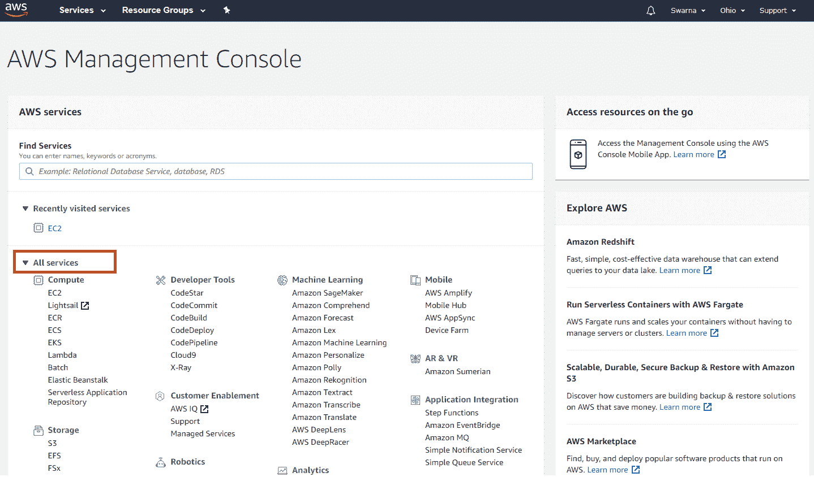

2.  在“所有服务”选项卡中，单击 EC2。这将引导您进入以下 EC2 控制台页面。单击启动实例以启动 EC2 实例:


3.  您将被重定向到以下屏幕。接下来，单击 AWS Marketplace 选项，如下图所示，并在搜索框中键入 r studio Server with tensor flow-GPU for AWS:


4.  在为 AWS AMI 选择带 Tensorflow-GPU 的 RStudio 服务器时，将出现以下弹出窗口提示您。单击“继续”继续:


5.  在下一步中，将要求您选择一个实例类型。对于训练复杂的深度学习模型，建议使用带有 GPU 的实例。为此，从过滤方式下拉列表中选择 GPU 实例，然后从列表中选择`p2.xlarge`。单击下一步:配置实例详细信息按钮继续:


6.  在这一步中，您可以根据我们的要求配置实例。在这种情况下，我们只使用默认选项。单击“下一步:添加存储”按钮进入下一步:

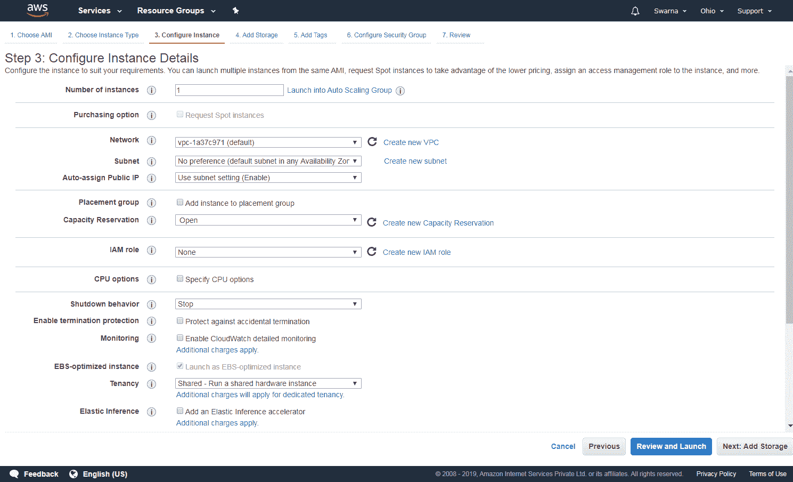

7.  在下一步中，您可以根据数据的大小更改存储选项。要继续下一步，请单击下一步:添加标签按钮:

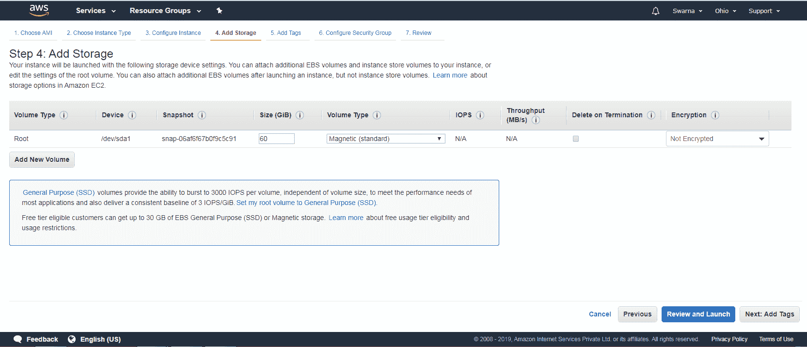

8.  在 AWS 中，可以将元数据以标签的形式分配给资源。您可以添加由键值对组成的标签。完成后，点击**下一步:配置安全组**按钮继续:

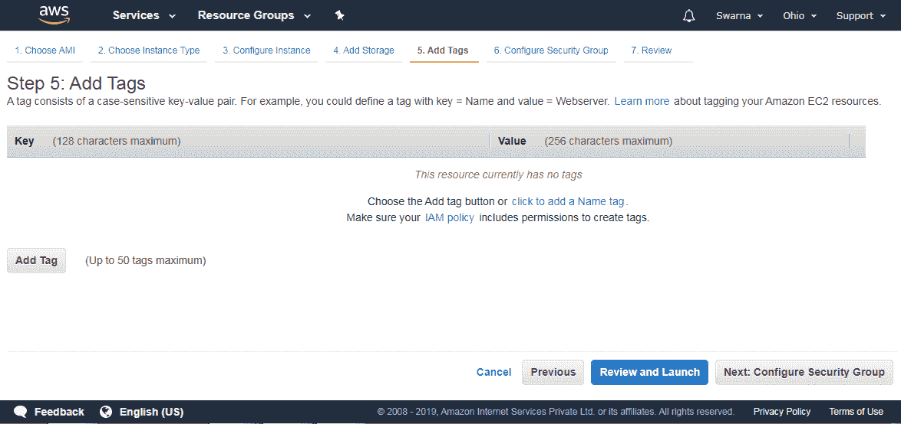

9.  在下面的屏幕中，您可以通过添加规则来配置实例的安全选项。要继续下一步，请单击“查看并启动”按钮:

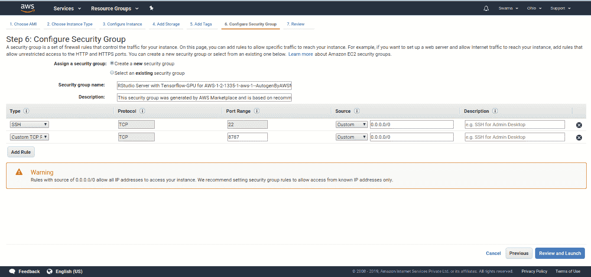

10.  这将引导您进入以下屏幕。在从通用 ( **SSD** )弹出的**引导中，根据您的要求选择一个选项，然后单击下一步:**

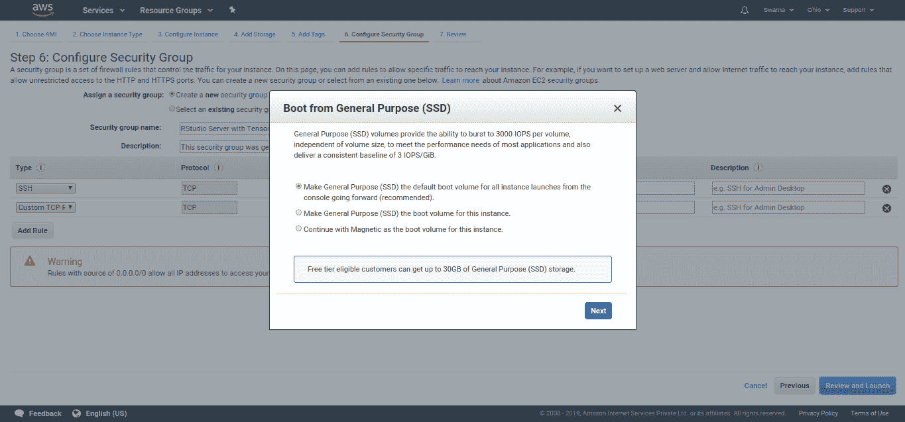

这将引导您进入以下屏幕。您需要处理某些警告消息。查看您的实例配置，然后单击启动:

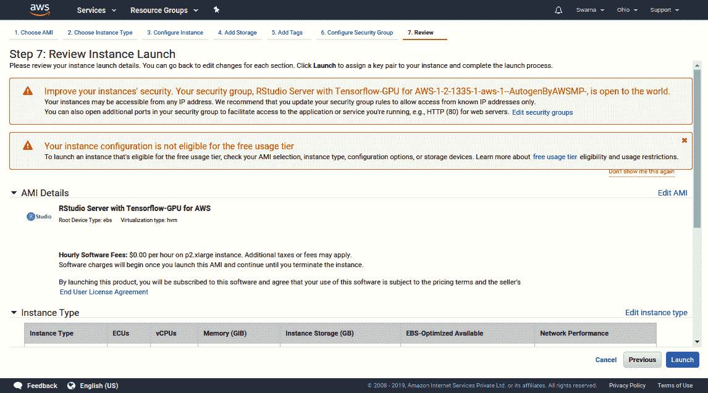

如果您还没有创建密钥对，您可以选择创建一个；否则，使用现有的。下载密钥对并单击启动实例:


11.  现在，您可以返回到您的 EC2 仪表板，在这里您可以看到您有一个正在运行的实例，如下面的屏幕截图所示:

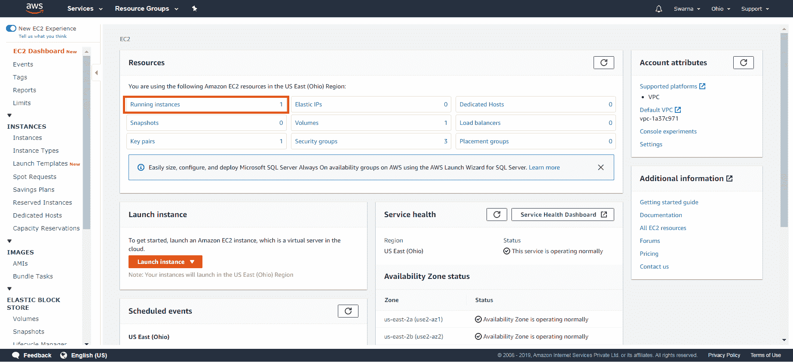

您可以单击它来获得关于您的实例的更多详细信息。您将被导航到一个类似的屏幕，如下所示:

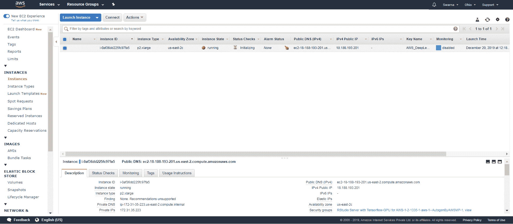

12.  您将获得一个 IP 地址和一个端口号，以便在网页上启动 AWS RStudio 界面。为了连接到接口，使用 rstudio-user 作为用户名，使用您的实例 ID 作为密码。以下屏幕截图显示了 AWS RStudio 界面:

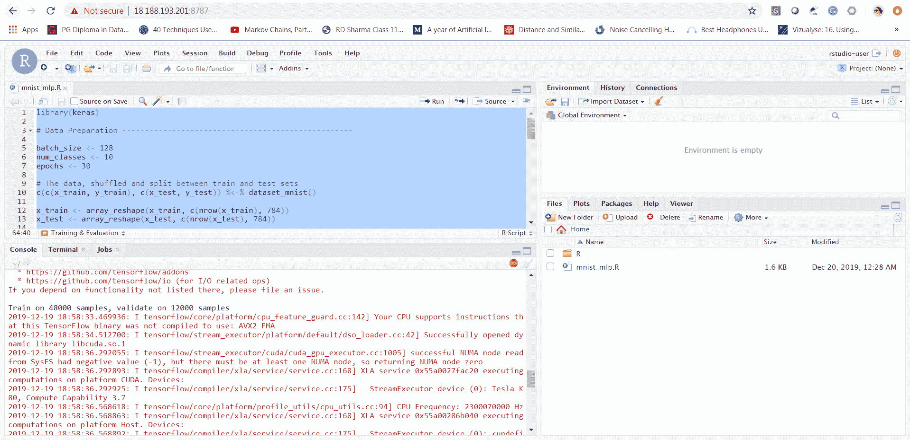

在前面的截图中，您可以看到我们已经成功地执行了 R 脚本来对手写数字进行分类。


# 它是如何工作的...

在*步骤 1* 和*步骤 2* 中，我们演示了如何启动 EC2 实例，这是 AWS 中的一个虚拟服务器。在*步骤 3* 和*步骤 4* 中，我们选择了一个支持 TensorFlow 和 Keras 的 RStudio 服务器 AMI。实例的所有软件配置细节，比如应用服务器、操作系统和其他应用程序，都存储在 AMI 模板中。

在*步骤 5* 中，我们选择了基于 GPU 的实例类型。AWS 为您的应用程序提供了多种资源选择。在*步骤 6* 中，我们按照我们的需求配置了我们的实例。在配置实例时，也可以从同一个 AMI 启动多个实例。

接下来，我们根据所用数据的大小选择存储选项。如果需要，您可以配置存储设备设置并增加**弹性块存储** ( **EBS** )容量。EBS 是一种灵活的块级存储设备，可以连接到 EC2 实例，并可用作频繁更新数据的主存储。

AWS 根据性能和价格提供了四种类型的 EBS 卷:

*   通用固态硬盘
*   调配 IOPS 固态硬盘
*   吞吐量优化的硬盘
*   冷硬盘
*   有吸引力的

在设置实例时，我们没有定义任何标签。标记是将元数据分配给资源的一种方式，例如资源的用途、所有者详细信息和版本详细信息。

在下一步中，我们使用默认选项配置了安全组。安全组是一组防火墙规则，用于控制实例的流量。在*步骤 10* 中，我们检查了实例配置并启动了它。我们还创建了一个由 AWS 存储的公钥和我们存储的私钥组成的密钥对。这个密钥对允许我们安全地访问我们的实例。这样，我们用 RStudio AMI 创建并配置了 EC2 实例。

一旦我们完成了实例的创建和配置，在*步骤 11* 中，我们返回到我们的 EC2 仪表板并点击 Running Instances 选项来查看我们实例的细节。在我们的例子中，我们获得了一个 IP 地址，即 18.188.193.201，使用的端口是 8787。实例 ID 用作连接到 RStudio 实例的密码。在最后一步中，我们使用提供的凭证在另一个 web 页面上启动了由 AWS 提供的 RStudio 接口。我们执行了 MNIST 手写数字的分类模型。


# 微软 Azure 上的深度学习

与 AWS 类似，微软是另一家领先的云服务提供商，通过微软管理的数据中心构建和管理应用程序。云服务的名字是微软 Azure，它提供 SaaS、PaaS 和 IaaS，并支持各种工具和框架。为了在 Azure 中运行深度学习模型，我们可以使用它的深度学习虚拟机，这些虚拟机安装了必要的深度学习库。微软 Azure 是一个快速、灵活、可扩展、廉价的平台，支持 24/7。它为虚拟机提供自动补丁管理，以便用户可以专注于构建和部署他们的应用程序，而不是管理基础架构。在这个食谱中，我们将经历在 Microsoft Azure 上建立深度学习环境来训练我们的模型的步骤。


# 做好准备

在训练你的模型之前，你需要在 Azure 中创建一个帐户，并使用以下链接登录门户:[https://portal.azure.com/.](https://portal.azure.com/)要了解 Azure 的定价细节，请参考以下链接:【https://azure.microsoft.com/en-in/pricing/】T2。


# 怎么做...

在 Azure 中创建帐户后，登录 Azure 门户网站。按照以下步骤在 it 中创建深度学习虚拟环境:

1.  单击“创建资源”按钮:


您应该会看到下面的屏幕。在搜索栏中键入深度学习虚拟机:


2.  选择深度学习虚拟机后，您应该会看到以下屏幕。现在，单击“创建”按钮:

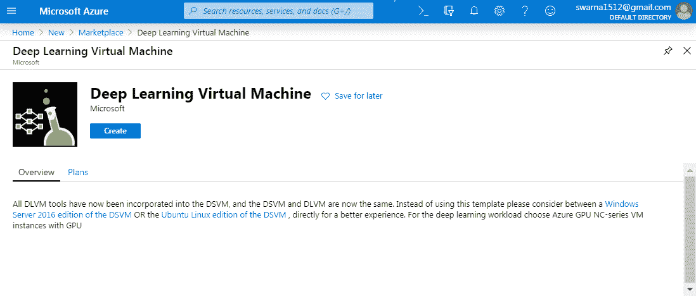

3.  单击“Create”按钮后，您将导航到一个 4 步配置窗口，如下面的屏幕截图所示。在“基本”选项卡中，您可以提供实例的名称和操作系统的类型，以及用户名和密码以及您希望计费的订阅。如果没有资源组，请创建一个新的资源组。在“设置”选项卡中，确保选择与 GPU 兼容的适当虚拟机大小。在本例中，我们选择了 1 个标准 ND6s 大小的虚拟机。“摘要”选项卡总结了您的要求。单击“确定”继续。

以下屏幕截图显示了“基本”选项卡:


以下屏幕截图显示了“设置”选项卡:


以下屏幕截图显示了“摘要”选项卡:

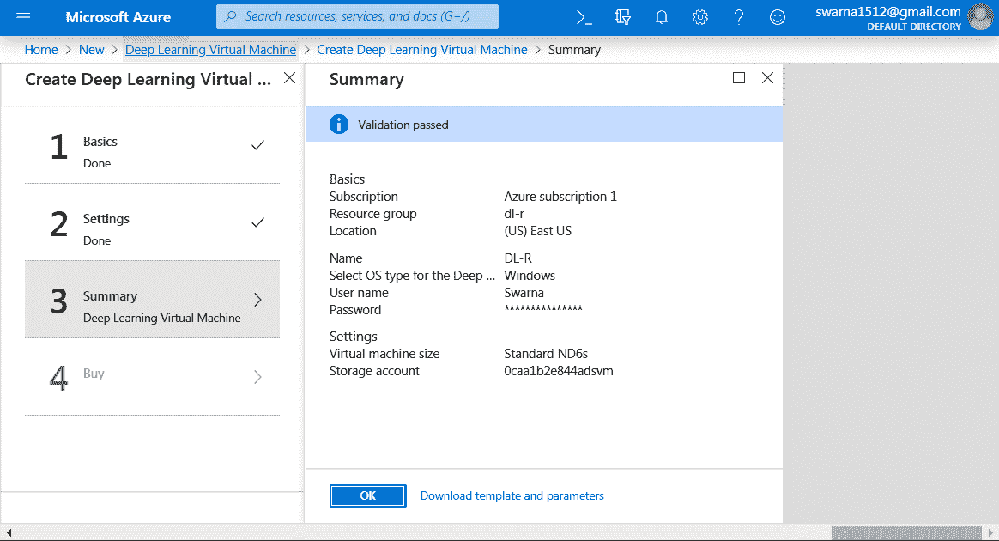

下面的屏幕截图显示了购买选项卡。单击复选框，然后单击创建按钮:

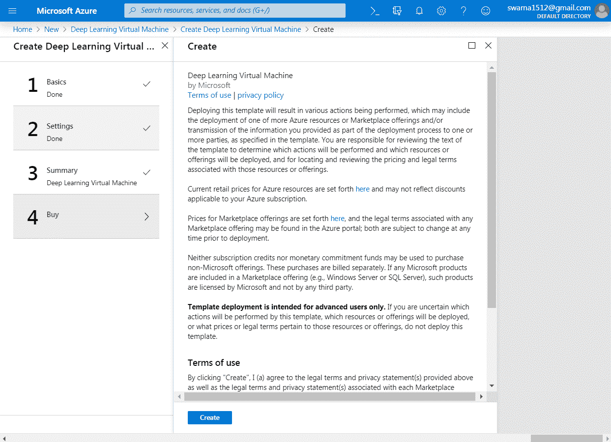

4.  创建资源后，选择左侧的“单击所有资源”,您将被定向到以下控制台窗口，其中显示了所有已调配的资源:

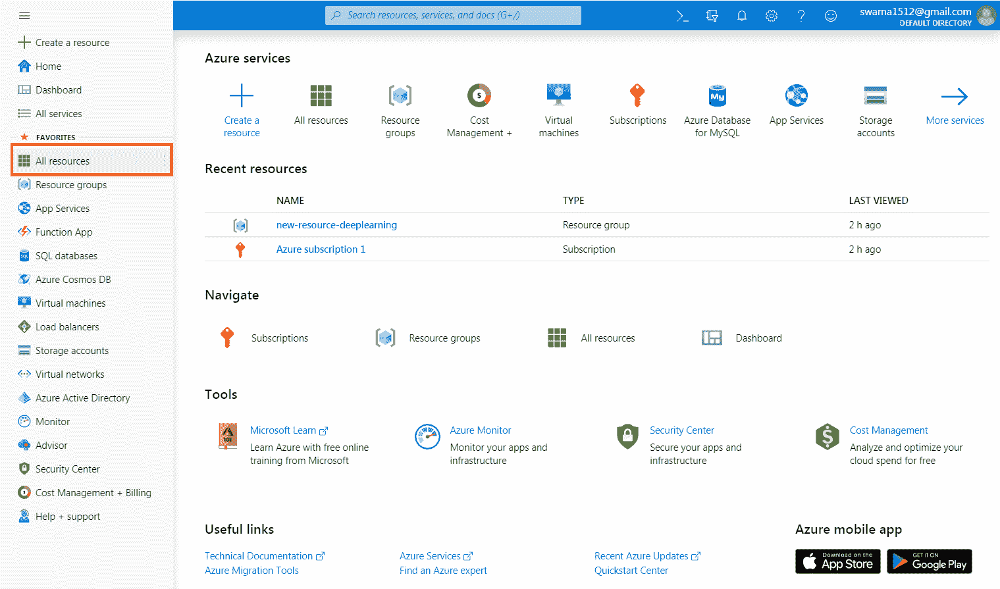

5.  单击特定的资源，其中类型为虚拟机，名称与您在*步骤 3* 中创建的资源相匹配。您将看到以下屏幕。点击屏幕上的连接按钮:

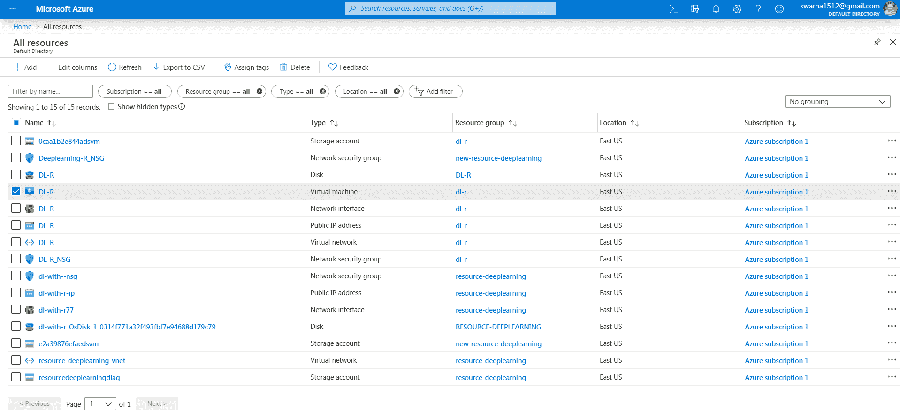

6.  屏幕右侧会出现一个窗口，提供一个下载 RDP 文件的按钮。单击该按钮，文件下载完成后，双击它:


以下是下载 RDP 文件的方法:


7.  现在，您将被重定向到一个登录窗口，以连接到云实例。您需要输入用户名和密码来连接到实例。连接后，您应该会看到类似如下的屏幕:

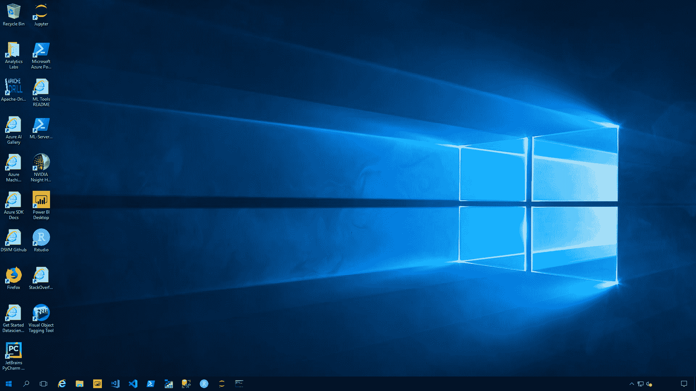

8.  现在，您可以启动 RStudio，因为已经安装了`keras`库，所以您可以在 R:


这样就可以利用微软 Azure 的架构，用 r 写深度学习代码。


# 它是如何工作的...

在*步骤 1* 和 *2* 中，我们在 Azure 中创建了一个深度学习虚拟机。Azure 中的深度学习虚拟机是一个预先配置的环境，使用基于 GPU 的 VM 实例来训练深度学习模型。它在 Windows 2016 或 Ubuntu 操作系统上受支持，并预装了许多数据科学工具，以支持构建高级分析应用程序。

在*步骤 3* 中，我们根据我们的需求配置了虚拟机。在“基本”选项卡中，您需要提供以下详细信息:

*   名称:这是虚拟机实例的名称。
*   操作系统类型:这是您需要的操作系统支持类型，Windows 或 Ubuntu。
*   用户名:这是您将用于登录虚拟机的用户名。
*   密码:这是您将用于登录虚拟机的密码。
*   订阅:这是您希望对 VM 实例进行计费的订阅，并且具有适当的资源创建权限。
*   资源组:这是 Azure 解决方案所有资源的逻辑容器。您需要创建一个新组或使用一个现有组。
*   位置:这是数据中心的位置。为了更快地访问，您可以选择离您的物理位置最近的中心或拥有您的大部分数据的中心。

在“设置”选项卡中，您可以选择虚拟机的大小。ND6s 是 Azure 中最便宜的支持 ND 系列 GPU 的虚拟机之一，专为 AI 和深度学习工作而设计。ND 实例提供了良好的性能，并由 NVIDIA Tesla P40 GPUs 和英特尔至强 E5-2690 v4(broad well)CPU 提供支持。“摘要”选项卡总结了您对验证检查的要求。

在*步骤 4* 中，我们看到了虚拟机中配置的所有资源的列表。在*步骤 5* 、 *6* 、 *7* 中，我们通过**远程桌面协议** ( **RDP** )连接到配置好的虚拟机。最后，一旦我们连接到远程桌面机器，我们就启动一个 RStudio 会话，并运行一个分类模型来识别手写的 MNIST 数字。


# 还有更多...

我们都知道 R 是一个单线程的内存应用程序，但有多种工具和架构允许在使用 R 的同时实现并行处理。微软 Azure 已经在 R 中推出了一个名为 **doAzureParallel** 的包，它允许将并行计算分布到 Azure 中的一个集群。这个包使用户能够利用 Azure 批处理服务，使得直接从 R 会话运行并行模拟成为可能。这个包是 R 的`foreach`包的并行后端，支持跨多个 Azure 虚拟机的多个进程，因此不需要手动创建和配置多个虚拟机。还可以根据工作负载来扩展集群的规模。要了解`doParallelAzure`的安装说明和先决条件，请参考此链接:[https://github.com/Azure/doAzureParallel](https://github.com/Azure/doAzureParallel)。


# 请参见

Azure 批处理服务通过管理 Azure 中的计算节点池来支持并行和高性能计算批处理作业。要了解更多关于 Azure Batch 的内容，请参考这个链接:[https://docs . Microsoft . com/en-us/Azure/Batch/Batch-technical-overview](https://docs.microsoft.com/en-us/azure/batch/batch-technical-overview)。


# 谷歌云平台上的深度学习

在过去几年中，云计算服务使个人和企业能够在不同的云提供商上开发和部署解决方案。**谷歌云平台** ( **GCP** )是谷歌提供的一套相对较新的云计算服务，支持计算、存储、大数据、分析和应用开发等多种服务。它还支持 GPU 实例，并击败了其他云服务提供商提供的价格。Google 强大的、可扩展的、创新的基础设施及其跨各种能力的简化解决方案允许用户以安全的方式在这个平台上轻松构建应用程序。在这个食谱中，我们将学习如何在 GCP 上训练深度学习模型。


# 做好准备

在使用 CloudML 之前，你需要做的第一件事是创建一个 Google Cloud 帐户。如果您没有帐户，您可以通过此链接创建您的帐户:[https://console.cloud.google.com](https://console.cloud.google.com/)。要了解更多定价细节，请参考此链接:[https://cloud.google.com/pricing/](https://cloud.google.com/pricing/)。


# 怎么做...

在谷歌上创建账户后，按照以下步骤在 **GCP** 训练一个深度学习模型:

1.  登录 Google Cloud portal，从菜单中选择 APIs & Services，如下图所示:

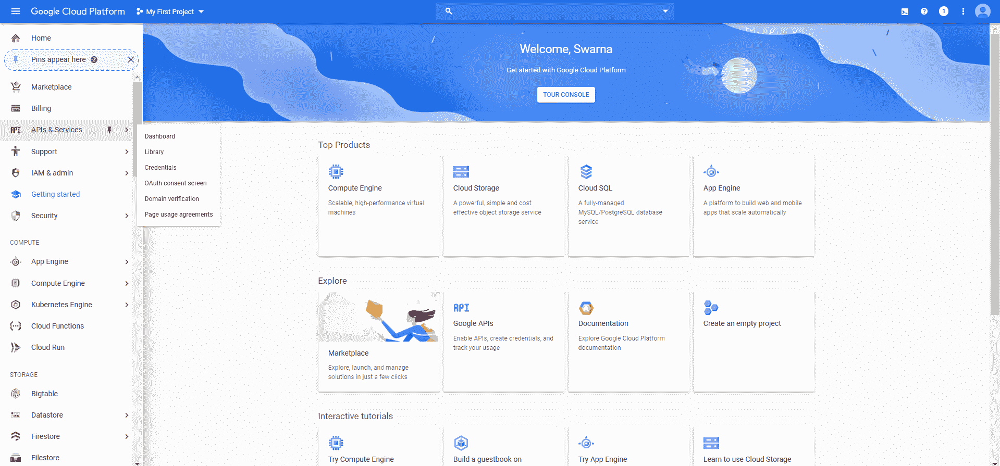

2.  单击 APIs & Services 链接后，您应该能够看到下面的屏幕。单击启用 API 和服务选项:

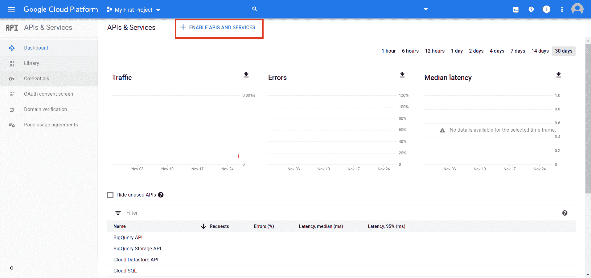

3.  您将被定向到 API 库页面，如下面的屏幕截图所示。这些 API 被组织成组；点击机器学习组的查看全部，然后选择人工智能平台训练和预测 API:


4.  接下来，您将能够看到以下页面。点击启用按钮:

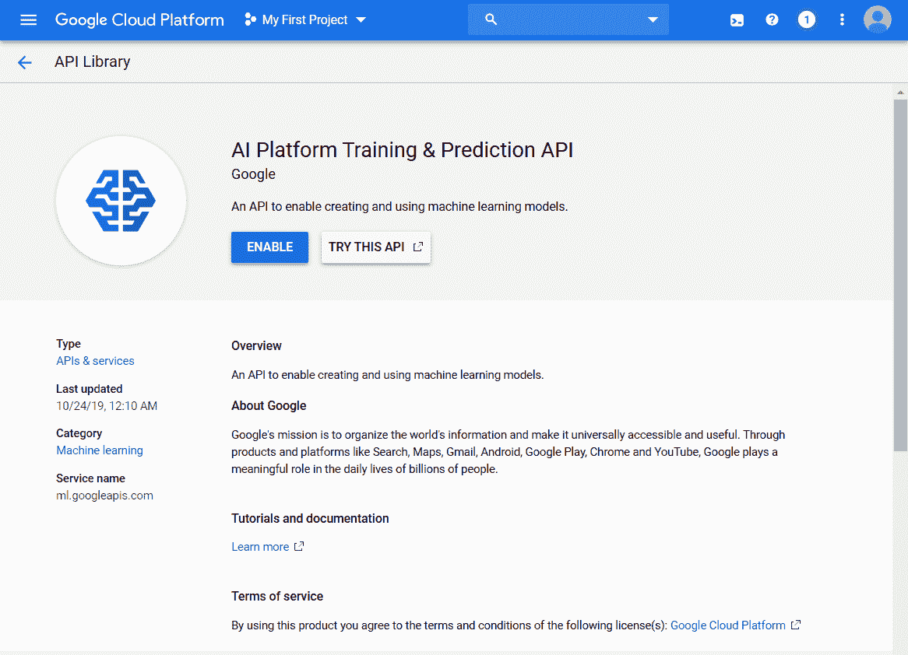

5.  启用该 API 后，转到 RStudio 并执行以下代码来安装`cloudml`库和 Google Cloud SDK:

```r
install.packages("cloudml")
 library(cloudml)
 gcloud_install()
```

以下截图显示了 Google Cloud SDK 设置窗口:


6.  安装 Google Cloud SDK 后，会要求您使用凭据登录。然后，终端窗口会提示您一系列选项，如下面的屏幕截图所示。选择一个已经存在的项目，您的 Google 帐户将链接到 Google SDK:

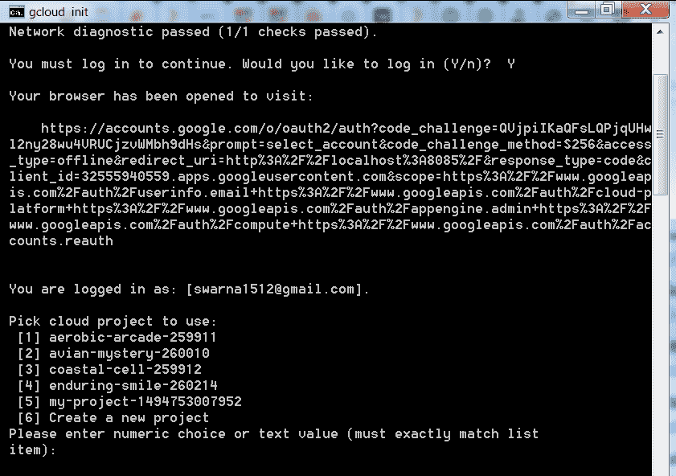

7.  现在，你可以使用谷歌的机器学习 API 提交作业来执行深度学习代码。在此示例中，我们将使用 MNIST 手写数字数据集训练一个多层深度神经网络来对数字进行分类:

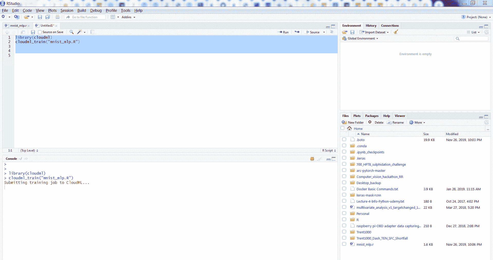

8.  提交作业后，您可以使用 AI 平台菜单下的作业选项对其进行监控:


前面的截图显示了 GCP 的深度学习工作的状态。


# 它是如何工作的...

在*步骤 1* 和 *2* 中，我们登录到 Google Cloud portal 并导航到 API 和服务页面。这些 API 为访问从存储到计算和应用程序部署的任何服务提供了用户友好的界面。使用这些 API，您可以使用各种编程语言和工具来自动化工作流，而无需担心硬件和软件供应。在*步骤 3* 和 *4* 中，我们启用了 AI 平台训练和预测 API，用于创建机器学习模型。

这个 API 使数据爱好者能够以一种可移植和经济高效的方式无缝地构建、部署和监控他们的机器学习应用程序。在*步骤 5* 中，我们使用 RStudio 和 Google Cloud SDK 在 R 中安装了`cloudML`包。这个 SDK 由一些工具组成，这些工具允许我们从 r。

安装过程中，需要指定 Google Cloud 的默认账号、项目、计算区域；这些细节将用于您所有的 CloudML 作业。在*步骤 6* 中，我们提供了需要与 Google Cloud SDK 链接的 Google 帐户详细信息。在*步骤 7* 中，我们提交了一个深度学习作业，在云上执行训练。一个好的实践是，首先在本地用较小的数据运行脚本，然后在输出结果符合预期时在云端提交作业。在这个例子中，我们使用 MNIST 手写数字数据集运行了一个分类模型。为此，我们创建了一个名为`mnist_mlp.R`的 R 脚本，然后将它保存在当前的工作目录中。本章的 GitHub 资源库中提供了 R 脚本。

然后，在一个新的 R 脚本中，我们执行以下代码将作业提交给 GCP:

```r
library(cloudml)
cloudml_train("mnist_mlp.R")
```

最后一步，我们到 Google Cloud portal 来监控在*步骤 7* 中提交的作业。


# 还有更多...

Google 的**云机器学习** ( **CloudML** )引擎也提供了一个自动化的工具，用于模型超参数调优。它允许我们在训练模型时测试不同的超参数配置。为了提交一个超参数调优作业，我们需要将一个 CloudML 训练配置文件传递给`cloudml_train()`函数。我们在*中讨论了使用 Keras 的超参数调整，还有更多...在第一章、*了解神经网络和深度神经网络*中的*训练你的第一个深度神经网络*的*部分，我们展示了如何调整模型参数。我们首先为想要优化的参数定义了标志，然后在模型的定义中使用了这些标志。

同样，我们定义了使用 CloudML 执行超参数调优作业的标志和模型。在下面的代码块中，我们展示了如何为*中定义的模型编写一个配置文件...*一节的*训练你的第一个深度神经网络*菜谱在[第一章](https://cdp.packtpub.com/deep_learning_with_r_cookbook/wp-admin/post.php?post=30&action=edit#post_1034)，*了解神经网络和深度神经网络*:

```r
trainingInput:
  scaleTier: CUSTOM
  masterType: standard_gpu
  hyperparameters:
    goal: MAXIMIZE
    hyperparameterMetricTag: acc
    maxTrials: 10
    maxParallelTrials: 2
    params:
      - parameterName: dense_units1
        type: INTEGER
        minValue: 8
        maxValue: 16
        scaleType: UNIT_LINEAR_SCALE
      - parameterName: dropout1
        type: DOUBLE
        minValue: 0.2
        maxValue: 0.4
        scaleType: UNIT_LINEAR_SCALE
      - parameterName: dense_units2
        type: INTEGER
        minValue: 8
        maxValue: 16
        scaleType: UNIT_LINEAR_SCALE
      - parameterName: dropout2
        type: DOUBLE
        minValue: 0.2
        maxValue: 0.4
        scaleType: UNIT_LINEAR_SCALE
```

在前面的配置文件中，goal 表示目标函数，而`hyperparameterMetricTag`表示要优化的指标。`maxTrials`参数指定了优化参数需要尝试的次数。

在我们的例子中，目标是最大限度地提高准确性。`params`参数表示要调整的一组参数。参数可以是整数、双精度或分类类型，可以使用参数`type`指定。`minValue`和`maxValue`表示参数为整数或双精度类型时，优化参数定义的取值范围。对于分类参数，这些字段应该不设置。`scaleType`定义缩放参数的方法。关于配置文件的更多详情，请参考此链接:[https://cloud . Google . com/ml-engine/reference/rest/v1/projects . jobs # HyperparameterSpec](https://cloud.google.com/ml-engine/reference/rest/v1/projects.jobs#HyperparameterSpec)。

在提交调优作业之前，我们需要将前面代码块的内容保存在一个`cloudml_tuning.yml`文件中，然后将配置文件的名称传递给`cloudml_train()`函数:

```r
cloudml_train("hyperparameter_tuning_model.R", config = "cloudml_tuning.yml")
```

前面的代码演示了如何在训练模型时传递`.yml`文件。


# 使用 MXNet 加速

MXNet 代表混合和最大化。它是一个灵活、可扩展的深度学习框架，用于开发和部署深度学习模型。它能够以节省内存的方式在各种异构系统上运行。MXNet 也受到各种云提供商的支持，如亚马逊 Web 服务和微软 Azure。开发人员可以灵活地进行命令式和符号式编程，这使得调试和超参数调优更加容易，同时最大限度地提高效率。MXNet 提供的另一个优势是它支持多种语言，如 Python、R、Scala、Clojure、Julia、Perl、MATLAB 和 JavaScript。在这个菜谱中，我们将演示如何在 Windows 和 Linux 系统中设置 MXNet。


# 做好准备

MXNet 通过在多个 CPU/GPU 之间分配训练来提高性能。为了利用 GPU 功能，您的系统需要一个 NVIDIA GPU，并且您需要安装 CUDA 工具包和`cuDNN`。安装 CUDA 工具包和 cuDNN 的说明可以分别在[https://developer.nvidia.com/cuda-downloads](https://developer.nvidia.com/cuda-downloads)和[https://docs . NVIDIA . com/deep learning/SDK/cud nn-install/index . html](https://docs.nvidia.com/deeplearning/sdk/cudnn-install/index.html)找到。


# 怎么做...

现在让我们在您的系统上安装 MXNet。根据操作系统，您可以选择合适的方法:

1.  要在 Windows 操作系统上安装 CPU 版本，请使用以下命令:

```r
cran <- getOption("repos")
cran["dmlc"] <- "https://apache-mxnet.s3-accelerate.dualstack.amazonaws.com/R/CRAN/"
options(repos = cran)
install.packages("mxnet")
```

请注意 MXNet 需要 R 3.5。在写这本书的时候，对 3.6 的支持还不可用。

2.  要在 Windows 操作系统上安装 GPU 版本，请使用以下命令:

```r
cran <- getOption("repos")
cran["dmlc"] <- "https://apache-mxnet.s3-accelerate.dualstack.amazonaws.com/R/CRAN/GPU/cu100"
options(repos = cran)
install.packages("mxnet")
```

对于不同版本的 CUDA，将前面代码块的第二行更改为`cu92`或`cu101`。

3.  要在 Linux 中安装 GPU/CPU 版本，请执行以下操作:

安装 MXNet 需要 Ubuntu 16.4。尚不支持更高版本。在安装之前，您需要安装 Git、OpenBLAS 和 OpenCV。要安装这些依赖项，请在终端中执行以下命令:

```r
apt-get install -y build-essential git
apt-get install -y libopenblas-dev liblapack-dev
apt-get install -y libopencv-dev
```

要在 Linux 平台上安装 MXNet，我们需要高于 3.4.4 的 R 版本，并且需要 GCC 4.8 或更高版本来编译 C++ 11。2.GNU Make。

安装完依赖项后，从 GitHub 克隆存储库:

```r
git clone --recursive https://github.com/apache/incubator-mxnet
cd incubator-mxnet
```

然后，更新配置文件以设置编译选项:

```r
echo "USE_OPENCV = 1" >> ./config.mk
echo "USE_BLAS = openblas" >> ./config.mk
```

执行以下命令来编译和构建 MXNet:

```r
make -j $(nproc)
make rpkg
```

要安装 GPU 版本，您需要在构建 MXnet 之前设置以下选项:

```r
echo "USE_CUDA=1" >>config.mk
echo "USE_CUDA_PATH=/usr/local/cuda" >>config.mk
echo "USE_CUDNN=1" >>config.mk
```

在本节中，我们看到了如何在各种操作系统上安装 MXNet


# 它是如何工作的...

对于 Windows 安装，我们使用预构建的二进制包安装 MXNet。我们使用`getOption()`函数来获得 R 中的各种全局选项。`repos`参数用于提取 R 从中提取库的 URL。为了安装 MXNet，我们添加了一个新的 URL 来获取预先构建的`mxnet` R 包。我们使用了`options()`函数来添加新的 URL。请注意，安装 CPU 和 GPU 版本之间的唯一区别是我们添加的 URL。我们也可以从源代码构建`mxnet`库。下面的网页提供了构建说明:[https://mxnet . Apache . org/get _ started/windows _ setup . html # install-mxnet-package-for-r](https://mxnet.apache.org/get_started/windows_setup.html#install-mxnet-package-for-r)。

在 Linux 安装中，我们安装了安装 MXNet 的所有依赖项，然后克隆了 MXNet 源代码。然后，我们设置编译选项并构建库。


# 还有更多...

到目前为止，我们看到了如何在本地系统中设置 MXNet。MXNet 也受到 AWS、微软 Azure、GCP 等各种云平台的支持。

对于使用 AWS 的 MXNet，我们可以使用 Amazon SageMaker，它提供了一个成熟的平台，以可扩展的方式构建、训练和部署深度学习模型。您还可以利用 AWS 深度学习 ami，如 NVIDIA 深度学习 ami，它们是预先配置的环境，可以快速构建深度学习应用程序的原型。在 AWS 中，也可以使用 MXNet 构建我们自己定制的深度学习环境。

GCP 提供了 NVIDIA GPU 云映像，该映像提供了一个优化的环境来运行 GPU 优化的容器，以便使用 MXNet 运行深度学习应用程序。

微软 Azure 为深度学习和 HPC 提供了英伟达 NGC 映像，这是一个运行 NGC 容器注册中心 GPU 加速容器的优化环境，其中包括 MXNet、CNTK 和 Theano 等框架。


# 使用 MXNet 实现深度神经网络

在上一个菜谱*用 MXNet* 加速中，我们介绍了 MXNet，并演示了如何安装包。在这个菜谱中，我们将实现一个神经网络来预测波士顿郊区不同位置房屋的中值价格。我们将使用波士顿房价数据集。该数据集包含不同位置的房屋属性信息，如平均房间数、犯罪率和财产税税率。

你可以在[https://www . cs . Toronto . edu/~ delve/data/Boston/Boston detail . html](https://www.cs.toronto.edu/~delve/data/boston/bostonDetail.html)了解数据的属性。


# 做好准备

波士顿房价数据集可以直接从 keras 图书馆访问。它有 404 个训练样本和 102 个测试样本。

让我们加载所需的库:

```r
library(mxnet)
library(keras)
```

我们加载数据集，并将其分成训练集和测试集:

```r
boston = dataset_boston_housing()
train_x = boston$train$x
train_y = boston$train$y
test_x = boston$test$x
test_y = boston$test$y
```

现在让我们缩放数据集:

```r
# normalize train set
train_x <- scale(train_x)

# normalize test set
train_means <- attr(train_x, "scaled:center") 
train_stddevs <- attr(train_x, "scaled:scale")
test_x <- scale(test_x, center = train_means, scale = train_stddevs)
```

这就完成了数据预处理部分。


# 怎么做...

我们现在已经熟悉了数据集。现在让我们继续构建和训练神经网络:

1.  让我们创建一个神经网络。以下代码块的第一行创建一个符号变量，接下来的几行添加隐藏层:

```r
in_layer <- mx.symbol.Variable("data")
layer1 = mx.symbol.FullyConnected(in_layer,name="dense1",num_hidden=64)
activation1 <- mx.symbol.Activation(layer1, name="relu1", act_type="relu")
layer2 = mx.symbol.FullyConnected(activation1,name="dense2",num_hidden=64)
activation2 <- mx.symbol.Activation(layer2, name="relu2", act_type="relu")
layer3 = mx.symbol.FullyConnected(activation2,name="dense3",num_hidden=1)
out = mx.symbol.LinearRegressionOutput(layer3)
```

2.  我们设置要使用的设备，用于训练模型:

```r
devices <- mx.cpu()
```

3.  我们继续设置种子并定义时期的数量。然后，我们训练模型:

```r
mx.set.seed(0)
epochs = 100
model = mx.model.FeedForward.create(symbol =out,X =train_x,y = train_y,ctx = devices,num.round = epochs,optimizer = "rmsprop",array.batch.size = 50,learning.rate=0.001,eval.metric = mx.metric.rmse)
```

4.  让我们来看看这个模型:

```r
graph.viz(model$symbol)
```

下面的屏幕截图显示了模型的可视化效果:


5.  我们在测试数据集上评估模型的性能:

```r
predicted <- predict(model,test_x)
paste("Test error:",sqrt(mean((predicted-as.numeric(test_y))^2)))
```

下面的屏幕截图显示了测试错误:


从前面的截图中，我们可以看到我们得到的测试误差在 3.54 左右。


# 它是如何工作的...

在*步骤 1* 中，我们创建了一个符号类型的变量。我们使用这个变量来配置网络。`mx.symbol.Variable("data")`函数用数据表示输入数据，即输入层。我们使用`mx.symbol.FullyConnected`函数添加了隐藏层；它的参数是类型为`symbol`的数据、层的名称和层中神经元的数量。我们使用`mx.symbol.Activation()`函数来应用激活层。在网络的末端，我们添加了一个回归输出层。在*步骤 2* 中，我们选择设备来训练网络。我们也可以使用`mx.gpu()`功能在 GPU 上进行训练。

下一步，我们训练模型。在*步骤 4* 中，我们可视化了我们的网络。在最后一步中，我们评估了模型的性能。


# 使用 MXNet 进行预测

时间序列预测是深度学习中最受欢迎的应用之一。MXNet 使机器学习爱好者能够利用其深度学习框架进行各种应用，包括时间序列预测。在这个菜谱中，我们将使用 LSTM 网络来实现一对一的预测解决方案，以预测洗发水的销售。在写这本书的时候，MXNet 只支持序列预测问题的两种变体，一对一和多对一。


# 做好准备

在这个食谱中，我们将使用洗发水销售数据集，该数据集包含三年内洗发水的月销售额。原始数据集归功于 Makridakis、Wheelwright 和 Hyndman (1998)。它也可以在本章的 GitHub 资源库中的`data`文件夹中找到。下载`shampoo_sales.txt`文件，并将其复制到工作目录中名为`data`的文件夹中。

让我们加载所需的库并读取数据集:

```r
library("mxnet")
sales_data <- read.table("data/shampoo_sales.txt",sep = ",",header = TRUE)

# We require only one column from the dataset
sales_data <- as.data.frame(sales_data[,2])
```

接下来，我们使用最小-最大归一化在 0 到 1 的范围内归一化数据:

```r
min_max_scaler <- function(x) {
 (x - min(x))/(max(x) - min(x))
}

norm_sales_data <- min_max_scaler(sales_data)
t_sales_data <- t(norm_sales_data)
```

为了使用 MXNet-R 训练一对一序列预测模型，我们需要将训练数据转换成合适的形式。训练特征集的形式应该是`(n_dim x seq_len * num_samples)`，训练标签的形式应该是`(seq_len x num_samples)`。由于我们有一维数据，`n_dim`等于`1`。

以下代码块将数据转换为所需的结构:

```r
n_dim <- 1
seq_len <- 4
num_samples <- 7

# extract only required data from dataset
x_data <- t_sales_data[1, 1:(seq_len * num_samples)]
dim(x_data) <- c(n_dim, seq_len, num_samples)

y_data <- t_sales_data[1, 2:(1+(seq_len * num_samples))]
dim(y_data) <- c(seq_len, num_samples)
```

在下一节中，我们将使用 RNN 和 MXNet 构建预测模型。


# 怎么做...

让我们继续使用符号编程创建一个神经网络:

1.  我们首先将数据采样到训练和验证数据集中，并创建各自的迭代器:

```r
batch_size <- 3
train_ids <- 1:4
val_ids <- 5:6

## create data iterators
train_data <- mx.io.arrayiter(data = x_data[,,train_ids, drop = F],label = y_data[, train_ids], batch.size = batch_size,shuffle = TRUE)
val_data <- mx.io.arrayiter(data = x_data[,,val_ids, drop = F], label = y_data[, val_ids], batch.size = batch_size, shuffle = FALSE)
```

2.  现在，让我们创建一个具有一对一模型配置的 RNN 符号:

```r
symbol <- rnn.graph(num_rnn_layer = 2,
 num_hidden = 30,
 input_size = NULL,
 num_embed = NULL,
 num_decode = 1,
 masking = F, 
 loss_output = "linear",
 ignore_label = -1, 
 cell_type = "lstm", 
 output_last_state = T,
 config = "one-to-one")
```

3.  接下来，我们定义损失函数:

```r
seq_metric_mse <- mx.metric.custom("MSE", function(label, pred) {
 label = mx.nd.reshape(label, shape = -1)
 pred = mx.nd.reshape(pred, shape = -1)
 res <- mx.nd.mean(mx.nd.square(label - pred))
 return(as.array(res))
})
```

4.  我们设置设备用于训练模型。然后，我们定义权重初始化并配置优化器:

```r
ctx <- mx.cpu()
initializer <- mx.init.Xavier(rnd_type = "gaussian",
 factor_type = "avg", 
 magnitude = 1)
optimizer <- mx.opt.create("adadelta",
 rho = 0.9, 
 eps = 1e-06, 
 wd = 1e-06, 
 clip_gradient = 1, 
 rescale.grad = 1/batch_size)
```

5.  现在让我们用桶支持来训练 50 个纪元的网络:

```r
model <- mx.model.buckets(symbol = symbol, 
 train.data = train_data, 
 eval.data = val_data,
 num.round = 50, 
 ctx = ctx, 
 verbose = TRUE, 
 metric = seq_metric_mse, 
 initializer = initializer,
 optimizer = optimizer)
```

6.  在训练网络之后，我们从训练的模型中提取状态符号:

```r
internals <- model$symbol$get.internals()
sym_state <- internals$get.output(which(internals$outputs %in% "RNN_state"))
sym_state_cell <- internals$get.output(which(internals$outputs %in% "RNN_state_cell"))
sym_output <- internals$get.output(which(internals$outputs %in% "loss_output"))
symbol <- mx.symbol.Group(sym_output, sym_state, sym_state_cell)
```

7.  我们使用在*步骤 6* 中创建的符号来创建 RNN 模型的推论。我们还使用第六个数据样本来获得 RNN 状态的初始值，这将用于启动未来时间戳的预测。

请注意，只有在创建迭代器时才需要标签，它不会在推理中使用:

```r
data <- mx.nd.array(x_data[, , 6, drop = F])
label <- mx.nd.array(y_data[, 6, drop = F])

inference_data <- mx.io.arrayiter(data = data, 
 label = label, 
 batch.size = 1, 
 shuffle = FALSE)
infer <- mx.infer.rnn.one(infer.data = inference_data, 
 symbol = symbol, 
 arg.params = model$arg.params,
 aux.params = model$aux.params, 
 input.params = NULL, 
 ctx = ctx)
```

8.  现在，我们对时间步长进行迭代，以生成第七个样本的三个时间步长的预测。为了预测一个时间步长，我们使用从前一个时间步长的实际值而不是预测值生成的 RNN 状态信息:

```r
pred_length <- 3
predicted <- numeric()

for (i in 1:pred_length) {
 data <- mx.nd.array(x_data[, i, 7, drop = F])
 label <- mx.nd.array(y_data[i, 7, drop = F])
 infer.data <- mx.io.arrayiter(data = data, 
 label = label, 
 batch.size = 1, 
 shuffle = FALSE)
 ## use previous RNN state values
 infer <- mx.infer.rnn.one(infer.data = infer.data,
 symbol = symbol,
 ctx = ctx, 
 arg.params = model$arg.params,
 aux.params = model$aux.params, 
 input.params = 
 list(rnn.state=infer[[2]], 
 rnn.state.cell = infer[[3]]))
 pred <- infer[[1]]
 predicted <- c(predicted, as.numeric(as.array(pred)))
}

predicted
```

接下来，我们将了解本节中执行的步骤。


# 它是如何工作的...

在*步骤 1* 中，我们将输入数据分为训练和验证，并为每个数据创建了数据迭代器。这些数据迭代器是迭代器对象，允许通过调用 next 来顺序获取数据批次，每个批次包含一些训练示例及其各自的标签。在*步骤 2* 中，我们创建了一个 RNN 符号。我们指定层数为 2，隐藏单元数为 30。我们将 RNN 单元的类型配置为`lstm`，并将配置参数设置为一对一。在下一步中，我们定义了损失函数。在*步骤 4* 中，我们使用`mx.opt.create()`函数通过名称和参数创建一个优化器。我们创建了一个`adadelta`优化器并配置了它的参数。`wd`参数是 L2 正则化系数，而`clip_gradient`参数通过投影到盒子上来裁剪渐变，[ `-clip_gradient`，`clip_gradient` ]。我们使用 Xavier 权重初始化我们的模型。在这种类型的权重初始化中，每个经过的层的方差保持不变，从而防止网络消失或爆发梯度问题。

要了解更多关于这种技术的内容，请参考本文:[http://proceedings.mlr.press/v9/glorot10a/glorot10a.pdf](http://proceedings.mlr.press/v9/glorot10a/glorot10a.pdf)。

在*步骤 5* 中，我们使用桶对网络进行了 50 个纪元的训练。分桶是一种用于训练多个网络的技术，这些网络具有不同但相似的架构，共享相同的参数集。在下一步中，我们从训练好的模型中提取状态符号以用于推理。在*的第 7 步*，我们创建了一个推理模型。最后，在最后一步中，我们预测了第一个测试样本的值。