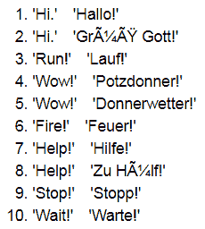
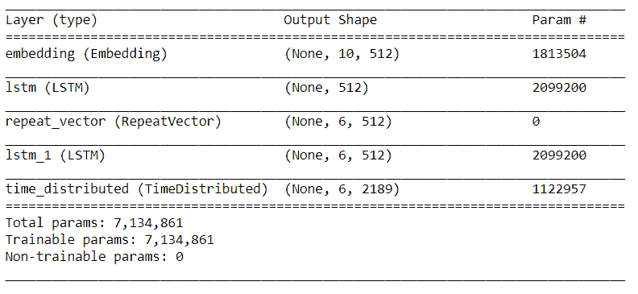
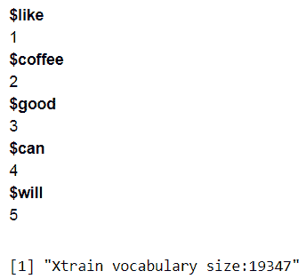
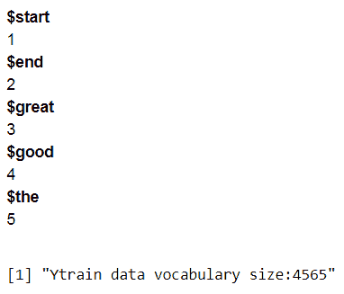
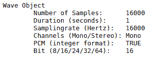
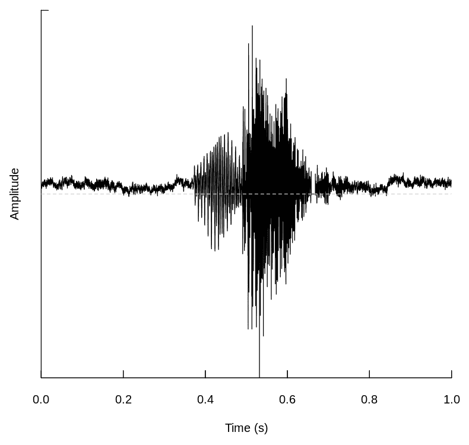
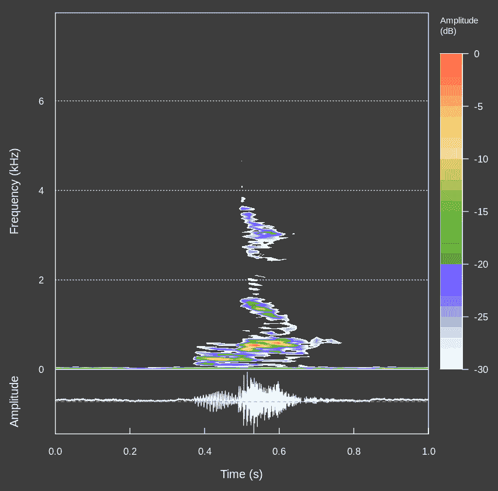
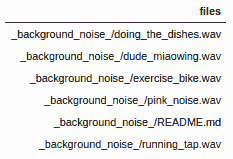
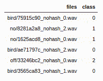

# 七、为 NLP 处理文本和音频

自然语言处理 ( **NLP** )是一个快速发展的领域，其首要目标是弥合计算机和人类之间理解和交流的鸿沟。随着 NLP 相关技术和应用的最新进展，如今，计算机可以理解文本、语音和情感，并不带任何偏见地分析它们，以便生成意义。人类语言的本质及其规则使得 NLP 成为计算机科学中最具挑战性的分支之一。NLP 的工作原理主要是将一种语言分解成小的元素，并试图理解它们之间的关系，使它们有意义。本章将让你在使用 r 的同时，熟悉深度学习的一些流行的 NLP 应用。

在本章中，我们将介绍以下配方:

*   神经机器翻译
*   使用深度学习总结文本
*   语音识别


# 神经机器翻译

当谷歌等科技巨头推出这项服务时，神经机器翻译受到了欢迎。然而，这个概念已经存在多年，被认为是处理非常复杂的语言模型的最具挑战性的任务之一。在这个菜谱中，我们将实现一个端到端的编码器-解码器**长** **短记忆** ( **LSTM** )模型，用于将德语短语翻译成英语。这种编码器-解码器 LSTM 架构是解决语言翻译、单词预测等**序列到序列** ( **Seq2Seq** )问题的最先进方法，广泛用于各种工业翻译应用。

序列预测通常被设计为一种体系结构，它涉及预测实值序列中的下一个值或一组值，或者预测输入序列的类标签。在这个食谱中，Seq2Seq 学习的目标是将序列从一种语言转换成另一种语言；也就是德语翻译成英语。


# 做好准备

我们将在这个食谱中使用的数据集由数千个带英语翻译的德语短语组成。在[http://www.manythings.org/anki/deu-eng.zip](http://www.manythings.org/anki/deu-eng.zip)有售。这些例子取自 Tatoeba 项目。

让我们从加载所需的库开始:

```
library(keras)
library(stringr)
library(reshape2)
library(purrr)
library(ggplot2)
library(readr)
library(stringi)
```

数据采用制表符分隔的文本文件形式。我们将使用前 10，000 个短语。让我们加载数据集，看看样本数据:

```
lines <- readLines("data/deu.txt", n = 10000)
sentences <- str_split(lines, "\t")
sentences[1:10]
```

下面的截图显示了数据中的一些记录。它包含德语短语及其英语翻译:



我们将使用前面的数据集来构建我们的神经机器翻译模型。


# 怎么做...

在进入建模部分之前，我们需要预处理输入数据。让我们开始吧:

1.  我们首先通过删除任何标点符号和非字母数字字符来清理数据，将所有 Unicode 字符规范化为 ASCII，并将所有数据转换为小写:

```
data_cleaning <- function(sentence) {
 sentence = gsub('[[:punct:] ]+',' ',sentence)
 sentence = gsub("[^[:alnum:]\\-\\.\\s]", " ", sentence)
 sentence = stringi::stri_trans_general(sentence, "latin-ascii")
 sentence = tolower(sentence)
 sentence
}

sentences <- map(sentences,data_cleaning)
```

2.  接下来，我们创建两个单独的德语和英语短语列表，并获取每个列表中语句的最大长度。我们将使用这些长度来填充句子:

```
english_sentences = list()
german_sentences = list()
for(i in 1:length(sentences)){
 current_sentence <- sentences[i]%>%unlist()%>%str_split('\t')
 english_sentences <- append(english_sentences,current_sentence[1])
 german_sentences <- append(german_sentences,current_sentence[2]) 
}
```

然后，我们将数据转换成数据帧，以便于操作:

```
data <- do.call(rbind, Map(data.frame, "German"=german_sentences,"English"=english_sentences))
head(data,10)
```

以下屏幕截图以数据帧的形式显示了输入数据:


现在，我们可以看到德语和英语短语中所有句子的最大字数:

```
german_length = max(sapply(strsplit(as.character(data[,"German"] ), " "), length))
print(paste0("Maximum length of a sentence in German data:",german_length))

eng_length = max(sapply(strsplit(as.character(data[,"English"] ), " "), length))
print(paste0("Maximum length of a sentence in English data:", eng_length))
```

从下面的截图中，我们可以推断出德语句子的最大长度是 10，而英语句子的最大长度是 6:


3.  现在，我们构建一个用于标记化的函数，并使用它来标记化德语和英语短语:

```
tokenization <- function(lines){
 tokenizer = text_tokenizer()
 tokenizer = fit_text_tokenizer(tokenizer,lines)
 return(tokenizer)
}
```

在这里，我们准备德国记号赋予者:

```
german_tokenizer = tokenization(data[,"German"])
german_vocab_size = length(german_tokenizer$word_index) + 1

print(paste0('German Vocabulary Size:',german_vocab_size))
```

从下面的截图可以看出，德语词汇量为 3542 个:


现在，我们准备英语分词器:

```
eng_tokenizer = tokenization(data[,"English"])
eng_vocab_size = length(eng_tokenizer$word_index) + 1

print(paste0('English Vocabulary Size:',eng_vocab_size))
```

从下面的截图我们可以看到，英语词汇量是 2189:


4.  接下来，我们创建一个函数，将短语编码成一个整数序列，并填充该序列，使每个短语长度一致:

```
# Function to encode and pad sequences
encode_pad_sequences <- function(tokenizer, length, lines){
 # Encoding text to integers
 seq = texts_to_sequences(tokenizer,lines)
 # Padding text to maximum length sentence
 seq = pad_sequences(seq, maxlen=length, padding='post')
 return(seq)
}
```

5.  接下来，我们将数据分为训练和测试数据集，并将我们在*步骤 4* 中定义的`encode_pad_sequences()`函数应用于这些数据集:

```
train_data <- data[1:9000,]
test_data <- data[9001:10000,]
```

我们准备培训和测试数据:

```
x_train <- encode_pad_sequences(german_tokenizer,german_length,train_data[,"German"])
y_train <- encode_pad_sequences(eng_tokenizer,eng_length,train_data[,"English"])
y_train <- to_categorical(y_train,num_classes = eng_vocab_size)

x_test <- encode_pad_sequences(german_tokenizer,german_length,test_data[,"German"])
y_test <- encode_pad_sequences(eng_tokenizer,eng_length,test_data[,"English"])
y_test <- to_categorical(y_test,num_classes = eng_vocab_size)
```

6.  现在，我们定义模型。我们初始化几个参数，这些参数将被输入到模型的配置中:

```
in_vocab = german_vocab_size
out_vocab = eng_vocab_size
in_timesteps = german_length
out_timesteps = eng_length
units = 512
epochs = 70
batch_size = 200
```

在这里，我们配置模型的层:

```
model <- keras_model_sequential()
model %>%
 layer_embedding(in_vocab,units, input_length=in_timesteps, mask_zero=TRUE) %>%
 layer_lstm(units = units) %>%
 layer_repeat_vector(out_timesteps)%>%
 layer_lstm(units,return_sequences = TRUE)%>%
 time_distributed(layer_dense(units = out_vocab, activation='softmax'))
```

让我们来看看模型的总结:

```
summary(model)
```

下面的屏幕截图显示了翻译模型的摘要:



7.  现在，我们编译模型并训练它:

```
model %>% compile(optimizer = "adam",loss = 'categorical_crossentropy')
```

然后，我们定义回调和检查点:

```
model_name <- "model_nmt"

checkpoint_dir <- "checkpoints_nmt"
 dir.create(checkpoint_dir)
 filepath <- file.path(checkpoint_dir, paste0(model_name,"weights.{epoch:02d}-{val_loss:.2f}.hdf5",sep=""))

cp_callback <- list(callback_model_checkpoint(mode = "min",
 filepath = filepath,
 save_best_only = TRUE,
 verbose = 1))
```

接下来，我们将训练数据拟合到模型中:

```
model %>% fit(x_train,y_train,epochs = epochs,batch_size = batch_size,validation_split = 0.2,callbacks = cp_callback,verbose = 2)
```

8.  在这一步中，我们为测试数据生成预测:

```
predicted = model %>% predict_classes(x_test)
```

让我们创建一个函数，它将创建一个单词 index 的键值对的反向列表。我们将用它来解码德语和英语中的短语:

```
reverse_word_index <- function(tokenizer){
 reverse_word_index <- names(tokenizer$word_index)
 names(reverse_word_index) <- tokenizer$word_index
 return(reverse_word_index)
}

german_reverse_word_index <- reverse_word_index(german_tokenizer)
eng_reverse_word_index <- reverse_word_index(eng_tokenizer)
```

让我们从德语的测试数据中解码一个示例短语，并查看它在英语中的预测:

```
index_to_word <- function(data_sample,word_index_dict){
 phrase = list()
 for(i in 1:length(data_sample)){
 index = data_sample[[i]]
 word = word_index_dict[index] 
# word = if(!is.null(word)) word else "?"
 phrase = paste0(phrase," ",word)
 }
 return(phrase)
}
```

现在，我们可以打印一些德语句子示例及其英语原文和预测译文:

```
cat(paste0("The german sample phrase is -->",index_to_word(x_test[90,],german_reverse_word_index)))
cat('\n')
cat(paste0("The actual translation in english is -->",as.character(test_data[90,"English"])))
cat('\n')
cat(paste0("The predicted translation in english is -->",index_to_word(predicted[90,],eng_reverse_word_index)))
```

下面的屏幕截图显示了我们的模型正在完成的一个翻译示例。我们可以看到我们的模型做得很好:


让我们再看一个翻译，如下面的代码所示:

```
cat(paste0("The german sample phrase is -->",index_to_word(x_test[6,],german_reverse_word_index)))
cat('\n')
cat(paste0("The actual translation in english is -->",as.character(test_data[6,"English"])))
cat('\n')
cat(paste0("The predicted translation in english is -->",index_to_word(predicted[6,],eng_reverse_word_index)))
```

下面的屏幕截图显示了我们的模型完成的另一个准确的翻译:


现在，让我们继续这个模型的本质，看看它是如何工作的详细解释。


# 它是如何工作的...

在*步骤 1* 中，我们对原始数据进行了预处理，删除了所有标点符号和非字母数字字符，将所有 Unicode 字符规范化为 ASCII，并将所有数据转换为小写。我们创建了德语和英语短语列表，并将它们组合成一个数据框架，以便于数据操作。

在序列到序列模型中，输入和输出短语都需要转换成固定长度的整数序列。因此，在*步骤 2* 中，我们计算了每个列表中最长语句的字数，这将用于在接下来的步骤中填充相应语言的句子。

接下来，在*步骤 3* 中，我们为德语和英语短语创建了标记器。为了使用语言模型，我们将输入文本分解成标记。标记化为我们提供了一个索引列表，该列表由根据数据集中的总频率进行索引的单词组成。

`text_tokenizer()`的`num_words`参数可用于根据单词索引列表中的词频定义要保留的最大单词数。

在*步骤 4* 中，我们创建了一个函数，通过使用`texts_to_sequences()`函数将德语和英语文本映射到一个特定的整数值序列。每个整数代表我们在上一步中创建的字典中的一个特定单词。该函数还用零填充这些序列，以使所有序列的长度一致，这基本上是该语言的最大句子长度。注意，`pad_sequences()`函数中的`padding='post'`参数在每个序列的末尾填充零。接下来，在*步骤 5* 中，我们将数据分成训练和测试数据集，并通过应用我们在上一步骤中创建的自定义`encode_pad_sequences`函数将它们编码成序列。

在*步骤 6* 中，我们定义了序列到序列模型的配置。我们使用编码器-解码器 LSTM 模型，其中输入序列由编码器模型编码，然后由解码器逐字解码文本。编码器由一个嵌入层和一个 LSTM 层组成，而解码器模型由另一个 LSTM 层和一个密集层组成。编码器中的嵌入层将输入特征空间转换成具有 *n* 维的潜在特征；在我们的例子中，它将其转换成 512 个潜在特征。在这种架构中，编码器产生输出的二维矩阵，其长度等于层中存储单元的数量。解码器期望 3D 输入产生解码的序列。对于这个问题，我们使用了`layer_repeat_vector()`，它将提供的 2D 输入重复多次，以创建一个 3D 输出，正如解码器所预期的那样。

在下一步中，我们编译模型并使用训练数据对其进行训练。对于模型编译，我们使用 RMSprop 作为优化器，使用`categorical_crossentropy`作为损失函数。为了训练模型，我们对训练和验证数据集分别使用了 80:20 的拆分。我们对模型进行了 50 个时期的训练，批次大小为 500。然后，我们绘制了训练损失和验证损失。

在最后一步中，我们从测试数据集中预测了一个德语短语的英语翻译。我们创建了一个定制的`reverse_word_index`函数，以便为德语和英语创建索引和单词的键值对。然后，我们利用这个函数将整数序列的输出映射到单词。


# 还有更多...

评估生成文本的质量类似于评估标签。**双语评估替角** ( **BLEU** )分数是一个比较一段文本的生成翻译和参考翻译的流行指标，从 0 到 1 不等。生成的文本越接近原始文本，得分越高，1 为完全匹配的得分。通过 BLEU 得分度量，将候选文本的 n 元语法与参考翻译的 n 元语法以及匹配的数量进行比较；这些匹配也是独立于位置的。此外，n 元语法匹配以这样的方式被修改，即它不奖励任何这样的仅生成几个合理单词的翻译。这种技术被称为改进的 n 元语法精度。

例如，假设我们有以下参考文本和生成文本:

*   **参考文本**:感觉很热情。
*   **生成文字 1** :我感觉非常非常热情。
*   **生成文字 2** :感觉很热情。

在这个例子中，我们可以看到候选文本 2 对参考文本有更好的预测，尽管候选文本 1 的精度可能更高。改进的 n-gram 精度为我们解决了这个问题。BLEU 分数计算起来又快又容易。
然而，这一指标存在一些挑战。例如，它既不考虑句子的意思也不考虑它们的结构，所以它不能很好地映射到人类的判断。

与一个或多个参考翻译相比，我们还可以使用其他一些指标来评估生成的翻译的质量，例如用于 Gisting 评估的**面向回忆的替角** ( **流氓**)和用于评估具有显式排序的翻译的**指标** ( **流星**)。


# 请参见

有关更多可用资源:

*   *使用用于统计机器翻译的 RNN 编码器-解码器学习短语表示*:[https://arxiv.org/pdf/1406.1078.pdf](https://arxiv.org/pdf/1406.1078.pdf)。
*   *联合学习对齐和翻译的神经机器翻译*:[https://arxiv.org/pdf/1409.0473.pdf](https://arxiv.org/pdf/1409.0473.pdf)。


# 使用深度学习总结文本

随着互联网的发展，我们已经被来自各种来源的大量海量数据所淹没，例如新闻文章、社交媒体平台、博客等等。自然语言处理领域中的文本摘要是创建文本数据的简明和准确摘要的技术，捕捉与源文本一致的必要细节。

文本摘要有两种类型，如下所示:

*   **提取摘要**:这种方法从原始源文本中提取关键句子或短语，而不进行修改。这种方法更简单。
*   抽象摘要:另一方面，这种方法在源文本的上下文和摘要之间进行复杂的映射，而不仅仅是将单词从输入复制到输出。这种方法的一个重大挑战是，它需要大量数据来训练模型，以使机器生成的摘要等同于人工生成的摘要。

编码器-解码器 LSTM 架构已被证明能够有效地解决序列间问题，并且能够处理多个输入和输出。在这个配方中，我们将通过引入一种称为教师强制的技术，稍微修改我们在上一个配方中使用的标准独热编码器-解码器架构。教师强制是一种常用于训练循环网络的策略，它使用前一时间步的模型输出作为下一时间步的输入。在这种体系结构中，编码器获取输入文本并将其转换为固定长度的内部表示，从而适当地捕获输入文本的上下文。解码器使用编码器生成的内部表示以及已经生成的单词或短语序列作为摘要。因此，在这种体系结构中，解码器可以灵活地利用到目前为止已经生成的所有单词的分布式表示作为预测下一个单词的输入。


# 做好准备

在这个食谱中，我们将使用来自 Kaggle 的著名亚马逊美食评论数据集，该数据集可以从[https://www.kaggle.com/snap/amazon-fine-food-reviews](https://www.kaggle.com/snap/amazon-fine-food-reviews)下载。这些数据由亚马逊的美食评论组成，时间跨度超过 10 年。在我们的分析中，我们将只使用综述文本及其摘要。

让我们从加载所需的库开始:

```
pckgs <- c("textclean","keras","stringr","tm","qdap")
lapply(pckgs, library, character.only = TRUE ,quietly = T)
```

现在，我们从数据中读取两列，**文本**和**摘要**。我们将只使用前 10，000 条评论:

```
reviews <- read.csv("data/Reviews.csv", nrows = 10000)[,c('Text', 'Summary')]
head(reviews) 
```

下面的屏幕截图显示了输入数据中的一些记录:


我们只对那些在数据中既有文本信息又有摘要信息的行感兴趣:

```
reviews <- reviews[complete.cases(reviews),]
rownames(reviews) <- 1:nrow(reviews)
```

在下一节中，我们将对输入数据进行预处理，并为文本摘要建立一个模型。


# 怎么做...

在跳到模型构建部分之前，让我们清理输入数据:

1.  首先，我们需要创建一个定制函数`clean_data()`，以便将杂乱的数据转换成干净的数据集。我们将把这个函数应用于评论和相关的摘要，然后把清理过的版本放到一个数据帧中，以便于数据操作:

```
clean_data <- function(data,remove_stopwords = TRUE){
 data <- tolower(data)
 data = replace_contraction(data)
 data = gsub('<br />', '', data)
 data = gsub('[[:punct:] ]+',' ',data)
 data = gsub("[^[:alnum:]\\-\\.\\s]", " ", data)
 data = gsub('&amp', '', data)
 data = if(remove_stopwords == "TRUE"){paste0(unlist(rm_stopwords(data,tm::stopwords("english"))),collapse = " ")}else{data}
 data = gsub('\\.', "", data)
 data = gsub('\\s+', " ", data)
 return(data)
}

cleaned_text <- unlist(lapply(reviews$Text,clean_data,remove_stopwords = TRUE))
cleaned_summary <- unlist(lapply(reviews$Summary,clean_data,remove_stopwords = FALSE))

# Adding cleaned reviews and their summaries in a dataframe
cleaned_reviews <- data.frame("Cleaned_Text"= cleaned_text,"Cleaned_Summary"= cleaned_summary)

# Converting the Text and Summary columns to character datatypes
cleaned_reviews$Cleaned_Text <- as.character(cleaned_reviews$Cleaned_Text)
cleaned_reviews$Cleaned_Summary <- as.character(cleaned_reviews$Cleaned_Summary)
head(cleaned_reviews)
```

下面的屏幕截图显示了来自已清理数据的一些样本记录:


2.  现在，我们使用开始和结束标记来分别表示摘要中序列的开始和结束:

```
cleaned_reviews[,"Cleaned_Summary"] <- sapply(X = cleaned_reviews[,2],FUN = function(X){paste0("<start> ",X," <end>")})
```

3.  现在，我们决定并确定回顾和总结序列的最大长度:

```
max_length_text = 110
max_length_summary = 10
```

4.  接下来，我们构建一个用于标记化的函数，并使用它来标记文本和摘要信息:

```
tokenization <- function(lines){
 tokenizer = text_tokenizer()
 tokenizer = fit_text_tokenizer(tokenizer, lines)
 return(tokenizer)
}
```

我们在文本数据上准备一个标记器，并计算文本数据的词汇大小:

```
x_tokenizer <- tokenization(cleaned_reviews$Cleaned_Text)
x_tokenizer$word_index
x_voc_size = length(x_tokenizer$word_index) +1
print(paste0('Xtrain vocabulary size:', x_voc_size))
```

以下屏幕截图显示了来自标记化文本数据的单词示例:



然后，我们在汇总数据上准备一个标记器，并计算汇总数据的词汇大小:

```
y_tokenizer <- tokenization(cleaned_reviews$Cleaned_Summary)
y_tokenizer$word_index[1:5]
y_voc_size = length(y_tokenizer$word_index) +1
print(paste0('Ytrain data vocabulary size:', y_voc_size))
```

以下屏幕截图显示了来自标记化摘要数据的单词示例:



5.  现在，我们需要创建另一个自定义函数`encode_pad_sequences()`，以便将文本和汇总数据编码成一个整数序列，并填充这些序列，使每个句子的长度一致。我们将数据分为训练和测试数据集，并对它们应用`encode_pad_sequences`函数:

```
encode_pad_sequences <- function(tokenizer, length, lines){
 # Encoding text to integers
 seq = texts_to_sequences(tokenizer,lines)
 # Padding text to maximum length sentence
 seq = pad_sequences(seq, maxlen=length, padding='post')
 return(seq)
}
```

我们将数据分为训练和验证数据集:

```
sample_size <- floor(0.80 * nrow(cleaned_reviews))

## Setting the seed to make the partition reproducible
set.seed(0)
train_indices <- sample(seq_len(nrow(cleaned_reviews)), size = sample_size)

x_train <- cleaned_reviews[train_indices,"Cleaned_Text"]
y_train <- cleaned_reviews[train_indices,"Cleaned_Summary"]

x_val <- cleaned_reviews[-train_indices,"Cleaned_Text"]
y_val <- cleaned_reviews[-train_indices,"Cleaned_Summary"]
```

现在，我们将训练和验证数据集编码成整数序列，并将这些序列填充到它们各自的最大长度:

```
num_train_examples = length(x_train)
num_val_examples = length(x_val)

x <- encode_pad_sequences(x_tokenizer,max_length_text,x_train)
x_val <- encode_pad_sequences(x_tokenizer,max_length_text,x_val)

y_encoded <- encode_pad_sequences(y_tokenizer,max_length_summary,y_train)
y1 <- encode_pad_sequences(y_tokenizer,max_length_summary,y_train)[,-max_length_summary]
y2 <- encode_pad_sequences(y_tokenizer,max_length_summary,y_train)[,-1]
y2 <- array_reshape(x = y2,c(num_train_examples,(max_length_summary-1),1))

y_val_encoded <- encode_pad_sequences(y_tokenizer,max_length_summary,y_val)
y_val1 <- encode_pad_sequences(y_tokenizer,max_length_summary,y_val)[,-max_length_summary]
y_val2 <- encode_pad_sequences(y_tokenizer,max_length_summary,y_val)[,-1]
y_val2 <- array_reshape(x = y_val2,c(num_val_examples,(max_length_summary-1),1))
```

6.  让我们开始建立模型。首先，我们初始化几个将被输入模型配置的参数:

```
latent_dim = 500
batch_size = 200
epochs = 100
```

在这里，我们配置模型的编码器和解码器部分的层。我们使用的是堆叠式 LSTM 配置，三层 LSTM 堆叠在一起。

让我们配置网络的编码器部分:

```
# Defining and processing the input sequence
encoder_inputs <- layer_input(shape=c(max_length_text),name = "encoder_inputs")

# Adding an embedding layer to encoder
embedding_encoder <- encoder_inputs %>% layer_embedding(input_dim = x_voc_size, output_dim = latent_dim,trainable = TRUE,name = "encoder_embedding")

# Adding first LSTM layer to encoder
encoder_lstm1 <- layer_lstm(units=latent_dim, return_sequences = TRUE, return_state=TRUE, name = "encoder_lstm1")
encoder_results1 <- encoder_lstm1(embedding_encoder)
encoder_output1 <- encoder_results1[1]
state_h1 <- encoder_results1[2]
state_c1 <- encoder_results1[3]

# Adding second LSTM layer to encoder
encoder_lstm2 <- layer_lstm(units=latent_dim, return_sequences = TRUE, return_state=TRUE,name = "encoder_lstm2")
encoder_results2 <- encoder_lstm2(encoder_output1)
encoder_output2 <- encoder_results2[1]
state_h2 <- encoder_results2[2]
state_c2 <- encoder_results2[3]

# Adding third LSTM layer to encoder
encoder_lstm3 <- layer_lstm(units=latent_dim, return_sequences = TRUE, return_state=TRUE, name = "encoder_lstm3")
encoder_results3 <- encoder_lstm3(encoder_output2)
encoder_outputs <- encoder_results3[1]
state_h <- encoder_results3[2]
state_c <- encoder_results3[3]
encoder_states <- encoder_results3[2:3]
```

让我们配置网络的解码器部分:

```
# Setting up the decoder
decoder_inputs <- layer_input(shape=list(NULL),name = "decoder_inputs")

# Adding embedding layer to decoder
embedding_layer_decoder <- layer_embedding(input_dim = y_voc_size,output_dim = latent_dim,trainable = TRUE,name = "decoder_embedding")
embedding_decoder <- embedding_layer_decoder(decoder_inputs)

# Adding lstm layer to decoder
decoder_lstm <- layer_lstm(units=latent_dim, return_sequences=TRUE,return_state=TRUE,name="decoder_lstm")
decoder_results <- decoder_lstm(embedding_decoder, initial_state=encoder_states)
decoder_outputs <- decoder_results[1]
decoder_fwd_state <- decoder_results[2]
decoder_back_state <- decoder_results[3]

decoder_dense <- time_distributed(layer = layer_dense(units = y_voc_size, activation='softmax'))
decoder_outputs <- decoder_dense(decoder_outputs[[1]])
```

现在，我们需要将编码器和解码器合并到一个模型中:

```
model <- keras_model(inputs = c(encoder_inputs, decoder_inputs),outputs = decoder_outputs)
```

让我们来看看模型的总结:

```
summary(model)
```

下面的屏幕截图显示了组合模型的摘要:


7.  现在，我们使用 RMSprop 优化器编译模型，并使用`sparse_categorical_crossentropy`作为损失函数。然后，我们将训练数据放入模型中进行训练:

```
model %>% compile(optimizer = "rmsprop",loss = 'sparse_categorical_crossentropy')
```

让我们为模型定义回调和检查点:

```
model_name <- "model_TextSummarization"

# Checkpoints
checkpoint_dir <- "checkpoints_text_summarization"
dir.create(checkpoint_dir)
filepath <- file.path(checkpoint_dir, paste0(model_name,"weights.{epoch:02d}-{val_loss:.2f}.hdf5",sep=""))

# Callback
ts_callback <- list(callback_model_checkpoint(mode = "min",
 filepath = filepath,
 save_best_only = TRUE,
 verbose = 1,
 callback_early_stopping(patience = 100)))
```

现在，我们可以训练模型:

```
model %>% fit(x = list(x,y1),y = y2,epochs = epochs,batch_size = batch_size,validation_data = list(list(x_val,y_val1),y_val2),callbacks = ts_callback,verbose = 2)
```

8.  现在，我们需要使用我们在上一步中构建的模型为维持样本数据生成一些预测。为此，我们创建一个编码器和一个解码器推理模型，以便解码未知的输入序列。

让我们从创建一个函数开始，这个函数将生成单词 index 的键值对的反向列表。我们将使用它来解码文本和摘要中的内容，因为这个反向单词索引会将整数序列映射回单词，并使内容可读:

```
reverse_word_index <- function(tokenizer){
 reverse_word_index <- names(tokenizer$word_index)
 names(reverse_word_index) <- tokenizer$word_index
 return(reverse_word_index)
}

x_reverse_word_index <- reverse_word_index(x_tokenizer)
y_reverse_word_index <- reverse_word_index(y_tokenizer)

# Reverse-lookup token index to decode sequences back to meaningful sentences or phrases
reverse_target_word_index=y_reverse_word_index
reverse_source_word_index=x_reverse_word_index
target_word_index= y_tokenizer$word_index
```

以下代码块显示了对句子进行解码的推理模式:

```
# Defining sampling models
encoder_model <- keras_model(inputs = encoder_inputs, outputs = encoder_results3)

decoder_state_input_h <- layer_input(shape=latent_dim)
decoder_state_input_c <- layer_input(shape=latent_dim)
decoder_hidden_state_input <- layer_input(shape = c(max_length_text,latent_dim))
decoder_embedding2 <- embedding_layer_decoder(decoder_inputs)
decoder_results2 <- decoder_lstm(decoder_embedding2,initial_state = c(decoder_state_input_h,decoder_state_input_c))
decoder_outputs2 <- decoder_results2[1]
state_h2 <- decoder_results2[2]
state_c2 <- decoder_results2[3]

decoder_outputs2 <- decoder_dense(decoder_outputs2[[1]])
inp = c(decoder_hidden_state_input,decoder_state_input_h,decoder_state_input_c)
dec_states = c(state_h2,state_c2)
decoder_model <- keras_model(inputs = c(decoder_inputs,inp),outputs = c(decoder_outputs2,dec_states))
```

这里我们定义一个叫做`decode_sequence()`的函数，它是推理过程的实现。该函数对输入序列进行编码，并检索编码器状态。然后，它运行解码器的一个步骤，以编码器状态作为初始状态，以序列标记的开始作为目标。输出是下一个目标令牌。通过这种方式，通过递归调用模型，将前面生成的单词附加到模型上，从而构建摘要:

```
decode_sequence <- function(input_seq) {
    # Encoding the input as state vectors
    encoder_predict <- predict(encoder_model, input_seq)
    e_out = encoder_predict[[1]]
    e_h = encoder_predict[[2]]
    e_c = encoder_predict[[3]]

    # Generating empty target sequence of length 1
    target_seq <- array(0,dim = c(1,1))

    # Populating the first character of target sequence with the start character.
    target_seq[1,1] <- target_word_index[['start']]

    stop_condition = FALSE
    decoded_sentence = ''
    niter = 1
    while (stop_condition==FALSE) {

        decoder_predict <- predict(decoder_model, list(target_seq, e_out,e_h,e_c))
        output_tokens <- decoder_predict[[1]]
        h <- decoder_predict[[2]]
        c <- decoder_predict[[3]]

        ## Sampling a token
        sampled_token_index <- which.max(output_tokens[1, 1, ])
        sampled_token <- reverse_target_word_index[sampled_token_index]

         if (sampled_token != 'end'){
             decoded_sentence = paste0(decoded_sentence, sampled_token," ")
             if(sapply(strsplit(decoded_sentence, " "), length) >= max_length_summary){
                 stop_condition = TRUE
             }
         }

        target_seq <- array(0,dim = c(1,1))
        target_seq[ 1,1] <- sampled_token_index

        e_h = h
        e_c = c

  }
    return(decoded_sentence)
    }
```

现在，我们需要定义几个函数，以便将整数序列转换成单词序列，用于回顾和总结:

```
seq2summary<- function(input_seq){
 newString=''
 for(i in input_seq){
 if((i!=0 & i!=target_word_index[['start']]) & i!=target_word_index[['end']]){
 newString=paste0(newString,reverse_target_word_index[[i]],' ')
 }
 }
 return(newString)
}

seq2text <- function(input_seq){
newString=''
for(i in input_seq){
if(i!=0){
newString=paste0(newString,reverse_source_word_index[[i]],' ')
}
}
return(newString)
}
```

以下代码显示了如何解码示例评论并查看其摘要预测:

```
for(i in 1:dim(x_val)[1]){
 print(paste0("Review:",seq2text(x_val[i,])))
 print(paste0("Original summary:",seq2summary(y_val_encoded[i,])))
 print(paste0("Predicted summary:",decode_sequence(array_reshape(x_val[i,],dim= c(1,max_length_text)))))
 print("\n")
 }
```

让我们来看看其中一篇评论的翻译示例:


通过这样做，我们已经了解了如何使用编码器-解码器模型实现一个抽象的文本摘要。


# 它是如何工作的...

在*步骤 1* 中，我们对文本和摘要中的原始数据进行了预处理，将所有数据转换为小写，并分别替换诸如“不要”、“我是”、to、“不要”和“我是”等缩写。然后，我们删除了所有标点符号、非字母数字字符和停用词，如“我”、“我”、“您”、“for”等等。

请注意，我们没有从摘要中删除任何停用词，因为这样做会导致摘要的含义发生变化。例如，一个写着“没那么好”的总结在去掉任何停用词后会变成“很好”。

在*步骤 2* 中，我们在摘要中放置了特殊的开始和结束标记，在本例中是目标文本。目标序列的第一个字的预测发生在为模型提供开始标记时。结束标记表示句子的结束。

在下一步中，我们固定了源句子和目标句子的长度，这些句子将用于在接下来的步骤中填充序列，以使它们的长度一致。请注意，我们已经根据大多数评论的分布情况决定了最大长度。接下来，在*步骤 4* 中，我们为源短语和目标短语创建了分词器。标记化为我们提供了一个索引列表，该列表由根据数据集中的总频率进行索引的单词组成。

在*步骤 5* 中，我们创建了一个名为`encode_pad_sequences()`的定制函数，将评论和相关摘要映射到一个特定的整数值序列。每个整数代表上一步中创建的索引列表中的一个特定单词。该函数还用零填充序列，使所有序列长度一致，这基本上是我们在*步骤 3* 中为源文本和目标文本固定的最大长度。`pad_sequences()`函数中的`padding='post'`参数在每个序列的末尾填充零。我们将数据分成训练和测试数据集，并对它们应用`encode_pad_sequences()`函数。注意，在这一步中，我们从已经生成的概要中创建了附加的输入数据，标记为`y1`，用于训练模型。目标数据`y2`比输入数据超前一步，不包括开始标记。验证数据也是如此。

在*步骤 6* 中，我们配置了一个堆栈式 LSTM 编码器-解码器模型架构。首先，我们创建了编码器网络，然后是解码器网络。编码器 LSTM 网络将输入评论转换成它的两个状态向量:隐藏状态和单元状态。我们丢弃了编码器的输出，只保留了状态信息。解码器 LSTM 被配置成学习将目标序列(即，概要信息的内部表示)转换成相同的序列，但是在未来偏移一个时间步长。这种类型的培训被称为教师强迫。解码器 LSTM 的初始状态是来自编码器的状态向量。这样做是为了使解码器学习在时间 *t+1* 产生目标，给定时间 *t* 的目标，以输入序列为条件。

在*步骤 7* 中，我们编译了模型并对其进行了训练，同时使用 RMSprop 作为优化器，使用`sparse_categorical_crossentropy`作为损失函数。这个损失函数将整数序列动态地转换成一个独热向量，并克服了内存问题。我们对模型进行了 100 个时期的训练，批量大小为 200。

在*步骤 8* 中，我们创建了一个推理模型，它生成未知输入序列的摘要。在这种推理模式下，我们对输入序列进行编码，得到状态向量。然后，我们生成一个大小为 1 的目标序列，它本质上是序列字符的开始(start)。接下来，这个目标序列和状态向量一起被送到解码器来预测下一个字。预测的样本字被附加到目标序列。同样的过程递归地进行，直到我们得到序列结束字(end)或者达到序列极限。这种模型架构为解码器提供了利用先前生成的单词以及源文本作为上下文来生成下一个单词的机会。最后，我们预测了一些样本评论的摘要。


# 还有更多...

已经提出的用于跨各种领域的神经机器翻译的许多流行模型属于编码器-解码器架构家族。然而，这种体系结构限制了编码器将输入序列编码成固定长度的表示，这导致对于过长的输入序列的性能恶化。克服这种性能瓶颈的方法之一是使用序列中的注意力机制，这使得网络学会选择性地注意与预测目标输出相关的输入。最重要的是，注意力允许网络将输入序列编码成向量序列，并在解码时在这些向量中进行选择，从而使网络能够将所有信息编码在一个固定长度的向量中。尽管注意力机制的思想起源于神经机器翻译的背景，但它可以扩展到广泛的问题，如图像字幕和描述、语音识别和文本摘要。


# 请参见

要了解更多关于注意力机制的信息，请参考以下论文:[https://arxiv.org/pdf/1706.03762.pdf](https://arxiv.org/pdf/1706.03762.pdf)。


# 语音识别

在过去的几十年里，有大量关于利用深度学习进行语音相关应用的研究。语音识别已经成为许多日常应用的一部分，例如我们的电话、智能手表、家庭、游戏等等。

苹果和亚马逊等科技巨头分别在 Siri 和 Alexa 等许多语音搜索应用程序中实现了这一显著功能。声波是时域信号，也就是说当我们绘制一个声波时，其中一个轴是时间(自变量)，另一个轴是波的振幅(因变量)。

为了创建声波的数字记录，我们通过执行采样将模拟声音信号转换成数字形式。采样通过以称为采样间隔的规则时间间隔测量因变量，将模拟音频信号转换为数字信号。采样间隔越小，声音质量越好。为了描述录音的质量，我们经常使用术语采样率来表示采样间隔。采样率定义了每秒钟从模拟声波中获取的样本数。

采样速率可以表示如下:


声音的时域表示并不总是最好的。最显著的信息隐藏在信号的频谱中。诸如**傅立叶变换** ( **FT** )的数学变换被用于将声波变换到其频域。当我们在时域中对信号进行傅立叶变换时，我们获得了它的频率-振幅表示。由于声音的数字记录是一个时间上的离散过程，我们使用**离散傅立叶变换** ( **DFT** )将其转换到频域。**快速傅立叶变换** ( **FFT** )是一种用于快速计算傅立叶变换的算法。对整个声音计算 FFT 不够信息量大。为了提取更多的信息，我们需要使用**短时傅立叶变换** ( **STFT** )。在 STFT，我们在信号上滑动一个窗口，并在每个滑动窗口计算 DFT，以计算频谱的幅度。


# 做好准备

在这个食谱中，我们将训练一个神经网络，它学习根据频谱对声波进行分类。为此，我们将使用谷歌语音命令数据集。它是由 TensorFlow 和 AIY 团队创建的，用于展示使用 TensorFlow API 的语音识别示例。它包含许多口语单词的录音，每个录音以 16 kHz 采样。可以从[https://storage . cloud . Google . com/download . tensor flow . org/data/speech _ commands _ v 0.01 . tar . gz](https://storage.cloud.google.com/download.tensorflow.org/data/speech_commands_v0.01.tar.gz)下载。我们将使用`tuneR`包读取 WAV 文件，使用`seewave`包对音频信号进行 STFT。

让我们从导入所需的库开始:

```
library(seewave)
library(stringr)
library(keras)
library(tuneR)
library(splitstackshape)
```

我们现在加载一个示例，并查看 wave 对象:

```
# read file
wav_file = readWave("data/data_speech_commands_v0.01/no/012c8314_nohash_0.wav")
wav_file
```

在下面的屏幕截图中，我们可以看到 wave 对象有 16，000 个数据点，采样率为 16 kHz，持续时间为 1 秒:



现在，让我们访问这些属性:

```
# sample
head(wav_file@left)
# sampling rate
paste("Sampling rate of the audio:", wav_file@samp.rate)
# num of samples
paste("Number of samples in the audio:",length(wav_file@left))
# duration of audio
paste("Duration of audio is:",length(wav_file@left)/wav_file@samp.rate,"second")
```

以下屏幕截图显示了波形对象的属性:


让我们将这些波形属性保存到一些变量中:

```
# wave data
wave_data = wav_file@left
# Number of data samples
num_samples = length(wav_file@left)
# sampling rate of the wave
sampling_rate = wav_file@samp.rate
```

我们可以使用`seewave`包中的`oscillo()`功能绘制声波的波形图:

```
# plot oscillogram
oscillo(wave = wav_file,f = sampling_rate)

```

下图显示了我们的波形数据的波形图:



现在，我们可以画出这个波的声谱图。频谱图是信号频谱随时间变化的直观表示。下图是 2D 声谱图和示波图的组合。

在下面的代码块中，我们正在设置声谱图的参数并生成图。下面代码块中三个参数的定义是:

*   这是波浪上滑动窗口的长度。它是一个数值，代表窗口中的样本数。
*   `overlap`:以百分比的形式定义两个连续窗口之间的重叠。
*   `window type`:这定义了窗口的形状。

我们使用`seewave`包中的`spectro()`函数来绘制声谱图:

```
window_length = 512
overlap = 40
window_type = "hanning"

# plot spectrogram
spectro(wav_file, f=sampling_rate, wl=512, ovlp=40, osc=TRUE,colgrid="white", colwave="white", colaxis="white", collab="white", colbg="black")
```

下图显示了波的频谱图:



`spectro()`函数还返回基于 STFT 时间、频率和振幅轮廓的统计数据。如果`complex`参数设置为 true，它将为我们提供复数值:

```
stft_wave = spectro(wave_data,f = sampling_rate,wl = window_length,ovlp = overlap,wn = window_type,complex = T,plot = F,dB = NULL,norm = F)
str(stft_wave)
```

下面的屏幕截图显示了由`spectro()`函数返回的值的结构:


现在，让我们看看振幅等值线的维度:

```
dim(stft_wave$amp)
```

振幅轮廓中的行数代表我们在一个窗口中获得振幅的频率数(256)。每一列都是`window_length/2`的傅立叶变换。让我们将它存储在一个变量中:

```
# fft size
fft_size = window_length/2
```

振幅等值线中的列数代表 FFT 窗口的数量。下面的代码块实现了提取相同内容的公式:

```
# number of fft window
num_fft_windows = length(seq(1, num_samples + 1 - window_length, window_length - (overlap * window_length/100)))
```

到目前为止，我们已经学习了如何提取声波的属性，并且熟悉了波的变换。现在，让我们对波形数据进行预处理，以便构建一个语音识别系统。


# 怎么做...

语音命令数据集包含大约 65，000 个 WAV 文件。它包含带有标签名称的子文件夹，其中每个文件是由不同的说话者说出的 30 个单词中的一个的记录。在本菜谱的*准备*部分，我们学习了如何读取 WAV 文件并通过应用 STFT 获得其频率-振幅表示。在这一节中，我们将扩展相同的想法，编写一个生成器，然后训练一个神经网络来识别口语单词。

让我们首先为生成器准备一个数据集:

1.  首先，我们列出`data_speech_commands_v0.01`文件夹中的所有文件，并创建一个数据帧:

```
files = list.files("data/data_speech_commands_v0.01",all.files = T,full.names = F,recursive = T)
paste("Number audio files in dataset: ",length(files)

file_df = as.data.frame(files)
head(file_df)
```

下面的屏幕截图显示了数据中的一些记录:



在这里，我们可以看到所有的文件都有它们的标签名作为前缀。现在，让我们创建一个包含所有文件名和它们各自的类标签的数据帧。我们将使用三个类，即`bird`、`no`和`off`:

```
file_df$class = str_split_fixed(file_df$files,pattern = "/",n = 2)[,1]
file_df <- file_df[sample(nrow(file_df)),]
rownames(file_df) <- NULL
file_df = file_df[file_df$class %in% c("bird","no","off"),]
file_df$files <- as.character(file_df$files)
file_df$class <- as.numeric(as.factor(file_df$class)) -1
rownames(file_df) <- NULL
head(file_df)
```

下面的屏幕截图显示了我们在前面的代码块中创建的 DataFrame 的示例:



让我们创建一个表示唯一标签数量的变量:

```
num_speech_labels = length(unique(file_df$class))
```

2.  现在，我们将数据分为训练集、测试集和验证集。我们使用`splitstackshape`库中的`stratified()`函数来完成这项工作:

```
# split data into train, test and validation
set.seed(200)
train_index = stratified(file_df,group = "class",.80,keep.rownames = T)$rn
test_index = setdiff(row.names(file_df),train_index)
val_index = stratified(file_df[train_index,],group = "class",.20,keep.rownames = T)$rn

train_data = file_df[setdiff(train_index,val_index),]
test_data = file_df[test_index,]
val_data = file_df[val_index,]
```

现在，让我们重组训练和测试数据:

```
# shuffle train and test data
test_data = test_data[sample(nrow(test_data)),]
train_data = train_data[sample(nrow(train_data)),]
```

3.  接下来，让我们建立一个连续的`keras`模型来对音频进行分类和编译:

```
model <- keras_model_sequential()
model %>% 
  layer_conv_2d(input_shape = c(fft_size, num_fft_windows,1), 
                filters = 32, kernel_size = c(3,3), activation = 'relu') %>% 
  layer_max_pooling_2d(pool_size = c(2, 2)) %>% 
  layer_conv_2d(filters = 64, kernel_size = c(3,3), activation = 'relu') %>% 
  layer_max_pooling_2d(pool_size = c(2, 2)) %>% 
  layer_dropout(rate = 0.25) %>% 
  layer_flatten() %>% 
  layer_dense(units = 128, activation = 'tanh') %>% 
  layer_dense(units = num_speech_labels, activation = 'softmax')
```

构建模型后，我们需要编译并可视化其摘要:

```
# compile model
model %>% compile(
  loss = "categorical_crossentropy",
  optimizer = "rmsprop",
  metrics = c('accuracy')
)

summary(model)
```

下面的屏幕截图显示了模型的概要:


4.  接下来，我们需要构建一个数据生成器:

```
data_generator <- function(data,windowlen,overlap,numfftwindows,fftsize,windowtype,num_classes,batchsize) {

    function(){
        indexes <- sample(1:nrow(data), batchsize, replace = TRUE)
        x <- array(0, dim = c(length(indexes),fftsize, numfftwindows,1))
        y <- array(0, dim = c(length(indexes)))

        for (j in 1:length(indexes)){
            wav_file_name = data[indexes[j],"files"] %>% as.character()
            wav_file = readWave(paste0("data/data_speech_commands_v0.01/",wav_file_name))
            # wave attributes
            wave_data = wav_file@left
            num_samples = length(wav_file@left)
            sampling_rate = wav_file@samp.rate
            # accomodating varying input lengths 
            if(num_samples < 16000){
                zero_pad = rep(0,16000 - length(wave_data))
                wave_data = c(wave_data,zero_pad)
            }else if(num_samples > 16000){
                wave_data = wave_data[1:16000]
            }
            # spectrogram representaion
            spectrogram_data = spectro(wave_data,f = sampling_rate ,wl = windowlen,ovlp = overlap,wn = windowtype,complex = T,plot = F,dB = NULL,norm = F)
            spectrogram_data = spectrogram_data$amp
            spectrogram_data = Mod(spectrogram_data)

            # imputing NaN and Inf
            if((sum(is.nan(spectrogram_data))> 0)){
                spectrogram_data[which(is.nan(spectrogram_data))] = log(0.01)
            }else if((sum(is.infinite(spectrogram_data)) >0)){
                spectrogram_data[which(is.infinite(spectrogram_data))] = log(0.01)
            }else if((sum(is.infinite(spectrogram_data)) >0)){
                spectrogram_data[which(is.na(spectrogram_data))] = log(0.01)
            }

            spectrogram_data = array_reshape(spectrogram_data,dim = c(fftsize,numfftwindows,1))

            x[j,,,] = spectrogram_data
            y[j] = data[indexes[j],c("class")] %>% as.matrix()
          }
          list(x, to_categorical(y,num_classes = num_classes))
    }
  }
```

让我们设置批量大小和时期数，然后创建训练和验证生成器:

```
batch_size = 20
epochs = 2

# train and validation generator
train_generator = data_generator(data = train_data,windowlen = window_length,overlap = overlap,numfftwindows = num_fft_windows,fftsize = fft_size, windowtype = window_type,num_classes = num_speech_labels,batchsize = batch_size)

val_generator = data_generator(data = val_data,windowlen = window_length,overlap = overlap,numfftwindows = num_fft_windows,fftsize = fft_size, windowtype = window_type,num_classes = num_speech_labels,batchsize = batch_size)
```

5.  现在，我们定义我们的模型回调:

```
# model callbacks
model_name = "speech_rec_"

checkpoint_dir <- "checkpoints_speech_recognition"
dir.create(checkpoint_dir)

filepath <- file.path(checkpoint_dir, paste0(model_name,"weights.{epoch:02d}-{val_loss:.2f}.hdf5",sep=""))

cp_callback <- list(callback_model_checkpoint(mode = "auto",
 filepath = filepath,
 save_best_only = TRUE,
 verbose = 1),
 callback_early_stopping(min_delta = 0.05,patience = 10))
```

6.  最后，我们训练我们的模型并在一个样本上测试它:

```
# train model
model %>% fit_generator(generator = train_generator,
                        epochs = epochs,
                        steps_per_epoch = nrow(train_data)/batch_size,
                        validation_data = val_generator ,
                        validation_steps = nrow(val_data)/batch_size,
                        callbacks = cp_callback
                       )

# test sample
test = readWave("data/data_speech_commands_v0.01/no/0132a06d_nohash_2.wav")
# matrix corresponding to the amplitude values
test = spectro(test,wl = window_length,ovlp = overlap,wn = "hanning",complex = T,plot = F,dB = NULL,norm = F)
test = test$amp
test = array_reshape(test,dim = c(fft_size,num_fft_windows,1))
# predict label of test sample.
model %>% predict_classes( array_reshape(test,dim = c(1,fft_size,num_fft_windows,1)))
```

太好了！该模型正确地识别口语单词。


# 它是如何工作的...

在*步骤 1* 中，我们为生成器准备了一个数据集。我们创建了一个数据帧，其中包含音频文件的文件路径和类标签。在下一步中，我们创建了分层样本，并将数据帧分为训练集、测试集和验证集。在*步骤 3* 中，我们创建了我们的卷积神经网络，并对其进行了编译。

在*步骤 4* 中，我们构建了一个数据生成器，并创建了训练和验证生成器。生成器功能从磁盘读取音频文件，将每个信号转换为其频率-振幅表示，并批量输出数据。我们知道语音命令数据集以 16 kHz 采样；也就是说，对于 1 秒钟的记录，有 16，000 个样本。数据集还包含一些短于或长于 1 秒的音频文件。为了适应不同长度的录音，我们将音频数据填充/截断为一个长度为 16，000 的数组，并应用了 STFT。在本配方的*准备好*部分，我们观察到以 16 kHz 采样的 1 秒钟记录的 STFT 产生一个大小为 256x51 的数组(`fft_size * num_fft_windows`)。这就是我们为模型的第一个卷积层定义了一个输入形状`fft_size * num_fft_windows`的原因。

在*步骤 5* 中，我们定义了模型回调。在最后一步中，我们训练了我们的模型，并在测试样本上测试了它的预测。


# 还有更多...

在这个食谱的*准备*部分，我们使用 STFT 将声波转换成它的频率-振幅表示。为了计算**梅尔倒谱系数** ( **MFCC** )，可以对波谱图进行进一步的变换。**梅尔频率倒谱** ( **MFC** )用于表示声音的短期功率谱。**Mel-频率倒谱系数**(**MFCC**)组成一个 MFC，代表一个音频信号的频谱能量分布。MFCC 工作在人耳可以捕捉到的类似频率上。

MFCCs 是这样计算的:

1.  输入信号被分割成几个帧，通常在 20-40 毫秒的范围内
2.  然后，对于每一帧，通过周期图估计来计算功率谱。周期图估计识别每个帧中存在哪些频率。
3.  人耳无法区分两个间隔很近的频率，当频率增加时，这一点变得突出。这就是为什么将某些周期图面元分组并求和，以便我们可以了解每个频率区域的能量分布。
4.  人类在线性尺度上听不到响度；因此，一旦我们得到不同频率的能量分布，我们就取它们的对数。
5.  最后一步包括计算对数能量分布的**离散余弦变换** ( **DCT** )。DCT 将对数 Mel 谱转换到时域。较高的 DCT 系数表示频率区域能量的快速变化，是低性能的原因；因此，我们放弃它们。

R 中的`tuneR`包提供了`melfcc()`函数，这样我们就可以计算 MFCCs。我们可以使用下面的代码来获取 MFCCs:

```
melfcc(wav_file)
```

你也可以用 MFCC 建立一个语音识别系统。