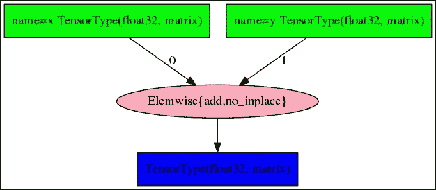
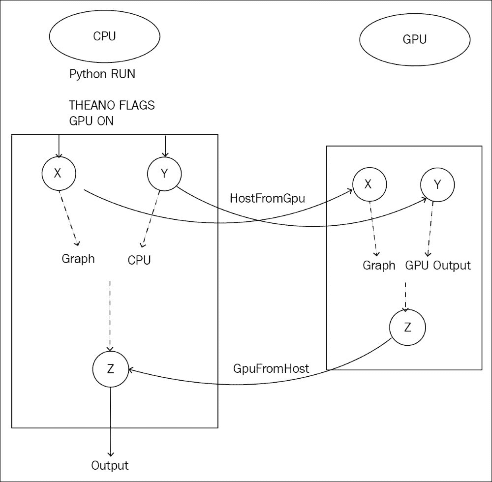
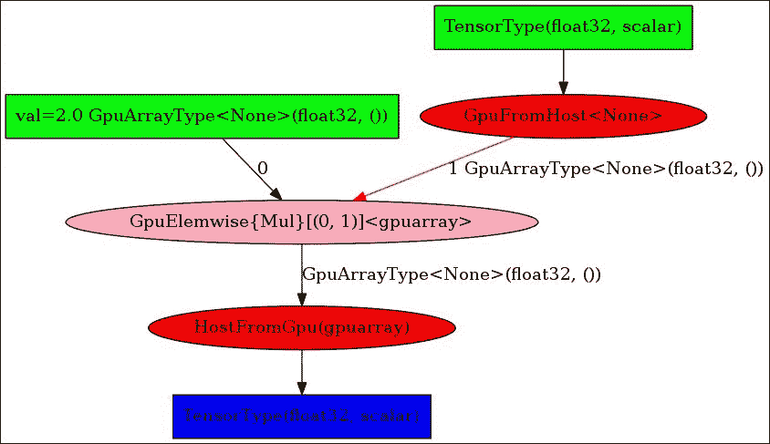
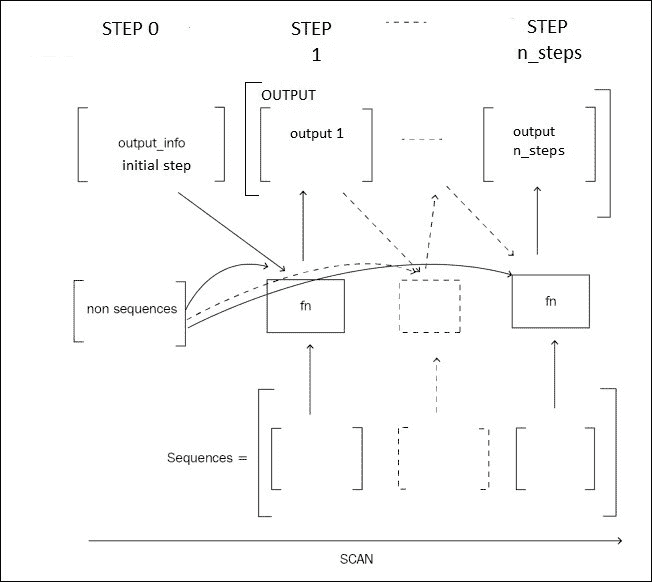

# 一、Theano基础

本章介绍了作为计算引擎的 ano 以及使用 ano 进行符号计算的基础知识。符号计算包括构建操作图，这些操作图将在以后针对特定的体系结构进行优化，使用可用于该体系结构的计算库。

虽然这一章看起来离实际应用还有很长的路要走，但是理解后面几章的技术是很重要的；它有什么能力，能带来什么价值？接下来的所有章节都将讨论在构建所有可能的深度学习架构时，Theano 的应用。

the no可以定义为科学计算的库；它从 2007 年开始提供，特别适合深度学习。两个重要的功能是任何深度学习库的核心:张量运算，以及在 CPU 或**图形计算单元** ( **GPU** )上运行代码的能力。这两个特性使我们能够处理大量的多维数据。此外，Theano 提出了自动微分，这是一个非常有用的功能，可以解决比深度学习问题更广泛的数值优化。

本章涵盖以下主题:

*   安装和装载
*   张量和代数
*   符号编程
*   图表
*   自动微分
*   GPU 编程
*   压型
*   配置


# 需要张量

通常，输入的数据用多维数组表示:

*   **图像有三个维度**:图像的通道数、宽度和高度
*   **声音和时间序列有一维**:持续时间
*   **自然语言序列可以用二维数组表示**:时长和字母表长度或词汇长度

我们将在以后的章节中看到更多输入数据数组的例子。

在 Theano 中，多维数组是通过一个名为 **tensor** 的抽象类实现的，与 Python 等计算机语言中的传统数组相比，它提供了更多的变换。

在神经网络的每个阶段，诸如矩阵乘法之类的计算涉及对这些多维数组的多次运算。

编程语言中的经典数组没有足够的内置功能来快速充分地处理多维计算和操作。

多维数组上的计算有很长的优化历史，有大量的库和硬件。GPU 的大规模并行架构实现了最重要的速度提升，能够在从数百到数千的大量内核上进行计算。

与传统的 CPU 相比，例如，四核、12 核或 32 核引擎，即使部分代码仍在 CPU 上执行(数据加载、GPU 引导和结果输出)，GPU 的增益也可以从 5 倍到 100 倍不等。使用 GPU 的主要瓶颈通常是 CPU 的内存和 GPU 的内存之间的数据传输，但是，当编程良好时，GPU 的使用有助于将速度显著提高一个数量级。在几天而不是几个月，或者几个小时而不是几天内得到结果，对于实验来说是一个不可否认的好处。

Theano 引擎旨在从一开始就解决多维数组和架构抽象的挑战。

对于科学计算，ano 还有另一个不可否认的好处:多维数组函数的自动微分，这是一个非常适合通过目标函数最小化进行模型参数推断的特性。这种特性通过减轻计算导数的痛苦来促进实验，这可能并不复杂，但容易出现许多错误。


# 安装和装载自动售货机

在这个部分，我们将安装 Theano，在 CPU 和 GPU 设备上运行它，然后保存配置。


## 康达包装和环境经理

安装 Theano 最简单的方法是使用`conda`，一个跨平台的包和环境管理器。

如果`conda`还没有安装在你的操作系统上，安装`conda`最快的方法是从[https://conda.io/miniconda.html](https://conda.io/miniconda.html)下载`miniconda`安装程序。例如，对于`conda under Linux 64 bit and Python 2.7`，使用以下命令:

```
wget https://repo.continuum.io/miniconda/Miniconda2-latest-Linux-x86_64.sh
chmod +x Miniconda2-latest-Linux-x86_64.sh
bash ./Miniconda2-latest-Linux-x86_64.sh
```

Conda 使我们能够创建新的环境，其中 Python 的版本(2 或 3)和安装的包可能不同。`conda`根环境使用的 Python 版本与安装了`conda`的系统上安装的版本相同。


## 在 CPU 上安装并运行 Theano

让我们安装这个编号:

```
conda install theano
```

运行一个 Python 会话，并尝试以下命令来检查您的配置:

```
>>> from theano import theano

>>> theano.config.device
'cpu'

>>> theano.config.floatX
'float64'

>>> print(theano.config)
```

最后一个命令打印了所有的配置。对象包含许多配置选项的键。

为了推断配置选项，ano 首先查看`~/.theanorc` 文件，然后查看任何可用的环境变量，这些变量会覆盖前面的选项，最后查看代码中优先级最高的变量集:

```
>>> theano.config.floatX='float32'
```

有些属性可能是只读的，不能在代码中更改，但是`floatX`是可以在代码中直接更改的属性之一，它为 floats 设置默认的浮点精度。

### 注意

建议使用`float32`，因为 GPU 历史悠久，没有`float64`。 `float64`在 GPU 上的执行速度比较慢，有时候慢很多(在最新一代 Pascal 硬件上是 2 倍到 32 倍)，而`float32`的精度在实际中已经足够了。


## GPU 驱动程序和库

这个 no 支持 GPU 的使用，GPU 是通常用来计算显示在计算机屏幕上的图形的单元。

为了让也能在 GPU 上工作，你的系统上需要一个 GPU 后端库。

CUDA 库(仅适用于 NVIDIA GPU 卡)是 GPU 计算的主要选择。还有 OpenCL 标准，它是开放源码的，但远没有开发成熟，在 ano 上更具实验性和初级性。

目前大多数科学计算仍然发生在 NVIDIA 卡上。如果你有英伟达 GPU 卡，从英伟达网站[https://developer.nvidia.com/cuda-downloads](https://developer.nvidia.com/cuda-downloads)下载 CUDA，安装。如果尚未安装最新版本的 GPU 驱动程序，安装程序将首先安装它们。它将在`/usr/local/cuda` 目录中安装 CUDA 库。

安装 cuDNN 库，这是 NVIDIA 的一个库，它为 GPU 提供了一些更快的操作实现。要安装的话，我一般会把`/usr/local/cuda` 目录复制到一个新的目录下，`/usr/local/cuda-{CUDA_VERSION}-cudnn-{CUDNN_VERSION}`，这样我就可以根据自己使用的深度学习技术及其兼容性来选择 CUDA 和 cuDNN 的版本。

在你的。`bashrc` profile，添加下面一行来设置`$PATH`和`$LD_LIBRARY_PATH`变量:

```
export PATH=/usr/local/cuda-8.0-cudnn-5.1/bin:$PATH
export LD_LIBRARY_PATH=/usr/local/cuda-8.0-cudnn-5.1/lib64:/usr/local/cuda-8.0-cudnn-5.1/lib:$LD_LIBRARY_PATH
```


## 在 GPU 上安装并运行 Theano

n 维 GPU 数组已经用 Python 实现在六个不同的 GPU 库中(`Theano/CudaNdarray,PyCUDA` / `GPUArray,CUDAMAT` / `CUDAMatrix`、`PYOPENCL` / `GPUArray`、`Clyther`、`Copperhead`)，是`NumPy.ndarray`的子集。`Libgpuarray`是一个后端库，让它们在一个公共接口上具有相同的属性。

要用`conda`安装`libgpuarray`，使用以下命令:

```
conda install pygpu
```

为了在 GPU 模式下运行 Theano，您需要在执行前配置`config.device`变量，因为一旦代码运行，它就是一个只读变量。使用`THEANO_FLAGS`环境变量运行此命令:

```
THEANO_FLAGS="device=cuda,floatX=float32" python
>>> import theano
Using cuDNN version 5110 on context None
Mapped name None to device cuda: Tesla K80 (0000:83:00.0)

>>> theano.config.device
'gpu'

>>> theano.config.floatX
'float32'
```

第一个返回显示 GPU 设备已被正确检测到，并指定它使用哪个 GPU。

默认情况下，Theano 激活 CNMeM，这是一个更快的 CUDA 内存分配器。可以使用`gpuarra.preallocate`选项指定初始预分配。最后，我的发射命令如下:

```
THEANO_FLAGS="device=cuda,floatX=float32,gpuarray.preallocate=0.8" python
>>> from theano import theano
Using cuDNN version 5110 on context None
Preallocating 9151/11439 Mb (0.800000) on cuda
Mapped name None to device cuda: Tesla K80 (0000:83:00.0)
```

第一行确认 cuDNN 是活动的，第二行确认内存预分配。第三行给出了默认的**上下文名称**(即`flag device=cuda`置位时的`None`)和使用的 GPU 型号，而 CPU 的默认上下文名称将始终是`cpu`。

可以指定与第一个不同的 GPU，将设备设置为`cuda0`、`cuda1`，...对于多 GPU 计算机。也可以在多个 GPU 上并行或顺序运行程序(当一个 GPU 的内存不足时)，特别是当训练非常深的神经网络时，如第 7 章[、*使用残差网络对图像进行分类*中描述的对完整图像进行分类。在这种情况下，`contexts=dev0->cuda0;dev1->cuda1;dev2->cuda2;dev3->cuda3`标志激活多个 GPU 而不是一个，并为代码中使用的每个 GPU 设备指定上下文名称。以下是一个 4 GPU 实例的示例:](part0075_split_000.html#27GQ61-ccdadb29edc54339afcb9bdf9350ba6b "Chapter 7. Classifying Images with Residual Networks")

```
THEANO_FLAGS="contexts=dev0->cuda0;dev1->cuda1;dev2->cuda2;dev3->cuda3,floatX=float32,gpuarray.preallocate=0.8" python
>>> import theano
Using cuDNN version 5110 on context None
Preallocating 9177/11471 Mb (0.800000) on cuda0
Mapped name dev0 to device cuda0: Tesla K80 (0000:83:00.0)
Using cuDNN version 5110 on context dev1
Preallocating 9177/11471 Mb (0.800000) on cuda1
Mapped name dev1 to device cuda1: Tesla K80 (0000:84:00.0)
Using cuDNN version 5110 on context dev2
Preallocating 9177/11471 Mb (0.800000) on cuda2
Mapped name dev2 to device cuda2: Tesla K80 (0000:87:00.0)
Using cuDNN version 5110 on context dev3
Preallocating 9177/11471 Mb (0.800000) on cuda3
Mapped name dev3 to device cuda3: Tesla K80 (0000:88:00.0)
```

为了在这个多 GPU 设置中将计算分配给特定的 GPU，我们选择的名称`dev0`、`dev1`、`dev2`和`dev3`已经映射到每个设备(`cuda0`、`cuda1`、`cuda2`、`cuda3`)。

这个名称映射允许编写独立于底层 GPU 分配和库(CUDA 或其他)的代码。

为了在不使用环境变量的情况下，在每个 Python 会话或执行中保持当前配置标志有效，将您的配置保存在`~/.theanorc`文件中，如下所示:

```
 [global]
 floatX = float32
 device = cuda0
 [gpuarray]
 preallocate = 1
```

现在你可以简单地运行`python`命令。您现在一切就绪。


# 张量

在 Python 中，一些科学库如 NumPy 提供了多维数组。Theano 并不能取代 Numpy，但它可以与之协同工作。NumPy 用于张量的初始化。

要在 CPU 和 GPU 上执行相同的计算，变量是符号化的，由张量类(一种抽象)表示，编写数值表达式包括构建变量节点和应用节点的计算图。根据编译计算图的平台，张量由以下任一项代替:

*   一个`TensorType`变量，它必须在 CPU 上
*   一个`GpuArrayType`变量，它必须在 GPU 上

通过这种方式，代码的编写可以不受执行平台的影响。

以下是一些张量对象:

| 

对象类别

 | 

维度数量

 | 

例子

 |
| --- | --- | --- |
| `theano.tensor.scalar` | 0 维数组 | 1, 2.5 |
| `theano.tensor.vector` | 一维数组 | [0,3,20] |
| `theano.tensor.matrix` | 二维数组 | [[2,3][1,5]] |
| `theano.tensor.tensor3` | 三维阵列 | [[[2,3][1,5]],[[1,2],[3,4]]] |

在 Python shell 中使用这些 Theano 对象让我们有了更好的想法:

```
>>> import theano.tensor as T

>>> T.scalar()
<TensorType(float32, scalar)>

>>> T.iscalar()
<TensorType(int32, scalar)>

>>> T.fscalar()
<TensorType(float32, scalar)>

>>> T.dscalar()
<TensorType(float64, scalar)>
```

在对象名称前加上`i`、`l`、`f`或`d`，可以初始化给定类型的张量、`integer32`、`integer64`、`float32`或`float64`。对于实值(浮点)数据，建议使用直接形式`T.scalar()`而不是`f`或`d`变量，因为直接形式将使用您当前的浮点配置:

```
>>> theano.config.floatX = 'float64'

>>> T.scalar()
<TensorType(float64, scalar)>

>>> T.fscalar()
<TensorType(float32, scalar)>

>>> theano.config.floatX = 'float32'

>>> T.scalar()
<TensorType(float32, scalar)>
```

符号变量执行以下任一操作:

*   扮演占位符的角色，作为构建数字运算(如加法、乘法)图形的起点:图形编译完成后，占位符在计算过程中接收输入数据流
*   表示中间或输出结果

符号变量和操作都是计算图的一部分，将在 CPU 或 GPU 上编译以快速执行。让我们写下第一个计算图，包括一个简单的加法:

```
>>> x = T.matrix('x')

>>> y = T.matrix('y')

>>> z = x + y

>>> theano.pp(z)
'(x + y)'

>>> z.eval({x: [[1, 2], [1, 3]], y: [[1, 0], [3, 4]]})
array([[ 2.,  2.],
       [ 4.,  7.]], dtype=float32)
```

首先，创建两个符号变量，或称*变量节点*，命名为`x`和`y`，在它们之间应用加法运算*应用节点*，在计算图中创建一个新的符号变量`z`。

漂亮的打印函数`pp`，打印由 ano 符号变量表示的表达式。当前两个变量`x`和`y`用两个数值二维数组初始化时，`Eval`计算输出变量`z`的值。

以下示例显示了变量`x`和`y`及其名称`x`和`y`之间的差异:

```
>>> a = T.matrix()

>>> b = T.matrix()

>>> theano.pp(a + b)
'(<TensorType(float32, matrix)> + <TensorType(float32, matrix)>)'*.*

```

如果没有名称，在大型图形中跟踪节点会更加复杂。打印计算图时，名称对诊断问题有很大帮助，而变量仅用于处理图中的对象:

```
>>> x = T.matrix('x')

>>> x = x + x

>>> theano.pp(x)
*'(x + x)'*

```

这里，名为`x`的原始符号变量没有改变，仍然是计算图的一部分。`x + x`创建一个新的符号变量，我们将其分配给 Python 变量`x`。

注意对于名字，复数形式同时初始化多个张量:

```
>>> x, y, z = T.matrices('x', 'y', 'z')
```

现在，让我们看看显示图形的不同函数。


# 图形和符号计算

让我们回到简单的加法示例，展示显示相同信息的不同方式:

```
>>> x = T.matrix('x')

>>> y = T.matrix('y')

>>> z = x + y

>>> z

Elemwise{add,no_inplace}.0

>>> theano.pp(z)

*'(x + y)*

>>> theano.printing.pprint(z)

*'(x + y)'*

>>> theano.printing.debugprint(z)
Elemwise{add,no_inplace} [id A] ''   
 |x [id B]
 |y [id C]
```

这里，`debugprint`函数打印预编译图，即未优化的图。在这种情况下，它是由两个变量节点`x`和`y`组成的，以及一个应用节点，即带有`no_inplace`选项的元素加法。`inplace`选项将用于优化图形，以节省内存并重新使用输入的内存来存储操作结果。

如果已经安装了`graphviz`和`pydot`库，`pydotprint`命令输出图形的 PNG 图像:

```
>>> theano.printing.pydotprint(z)
The output file is available at ~/.theano/compiledir_Linux-4.4--generic-x86_64-with-Ubuntu-16.04-xenial-x86_64-2.7.12-64/theano.pydotprint.gpu.png.

```



您可能已经注意到了`z.eval`命令第一次执行时花费了一些时间。此延迟的原因是优化数学表达式和在评估之前为 CPU 或 GPU 编译代码所需的时间。

编译后的表达式可以显式获得，并作为一个函数使用，其行为类似于传统的 Python 函数:

```
>>> addition = theano.function([x, y], [z])

>>> addition([[1, 2], [1, 3]], [[1, 0], [3, 4]])
[array([[ 2.,  2.],
       [ 4.,  7.]], dtype=float32)]
```

函数创建中的第一个参数是表示图的输入节点的变量列表。第二个参数是输出变量的数组。要打印编译后图形，请使用以下命令:

```
>>> theano.printing.debugprint(addition)
HostFromGpu(gpuarray) [id A] ''   3
 |GpuElemwise{Add}[(0, 0)]<gpuarray> [id B] ''   2
   |GpuFromHost<None> [id C] ''   1
   | |x [id D]
   |GpuFromHost<None> [id E] ''   0
     |y [id F]

>>> theano.printing.pydotprint(addition)

The output file is available at ~/.theano/compiledir_Linux-4.4--generic-x86_64-with-Ubuntu-16.04-xenial-x86_64-2.7.12-64/theano.pydotprint.gpu.png:
```


此案例已在使用 GPU 时打印。在编译过程中，每个操作都选择了可用的 GPU 实现。主程序仍然运行在数据驻留的 CPU 上，但是一个`GpuFromHost`指令执行从 CPU 到 GPU 的数据传输以进行输入，而相反的操作`HostFromGpu`获取结果供主程序显示:



Theano 执行一些数学优化，例如对元素操作进行分组，向以前的加法中添加一个新值:

```
>>> z= z * x

>>> theano.printing.debugprint(theano.function([x,y],z))
HostFromGpu(gpuarray) [id A] ''   3
 |GpuElemwise{Composite{((i0 + i1) * i0)}}[(0, 0)]<gpuarray> [id B] ''   2
   |GpuFromHost<None> [id C] ''   1
   | |x [id D]
   |GpuFromHost<None> [id E] ''   0
     |y [id F]
```

图中的节点数量没有增加:两个增加的节点被合并为一个节点。这样的优化使得调试变得更加棘手，所以我们将在本章的最后向您展示如何为调试禁用优化。

最后，让我们进一步了解如何用 NumPy 设置初始值:

```
>>> theano.config.floatX
'float32'

>>> x = T.matrix()

>>> x
<TensorType(float32, matrix)>

>>> y = T.matrix()

>>> addition = theano.function([x, y], [x+y])

>>> addition(numpy.ones((2,2)),numpy.zeros((2,2)))
Traceback (most recent call last):
  File "<stdin>", line 1, in <module>
  File "/usr/local/lib/python2.7/site-packages/theano/compile/function_module.py", line 786, in __call__
    allow_downcast=s.allow_downcast)

  File "/usr/local/lib/python2.7/site-packages/theano/tensor/type.py", line 139, in filter
    raise TypeError(err_msg, data)
TypeError: ('Bad input argument to theano function with name "<stdin>:1"  at index 0(0-based)', 'TensorType(float32, matrix) cannot store a value of dtype float64 without risking loss of precision. If you do not mind this loss, you can: 1) explicitly cast your data to float32, or 2) set "allow_input_downcast=True" when calling "function".', array([[ 1.,  1.],
       [ 1.,  1.]]))
```

在 NumPy 数组上执行函数会抛出一个与精度损失相关的错误，因为这里的 NumPy 数组有`float64`和`int64` `dtypes`，而`x`和`y`是`float32`。对此有多种解决方案；第一个是用正确的`dtype`创建 NumPy 数组:

```
>>> import numpy

>>> addition(numpy.ones((2,2), dtype=theano.config.floatX),numpy.zeros((2,2), dtype=theano.config.floatX))
[array([[ 1.,  1.],
        [ 1.,  1.]], dtype=float32)]
```

或者，转换 NumPy 数组(特别是对于`numpy.diag`，它不允许我们直接选择`dtype`):

```
>>> addition(numpy.ones((2,2)).astype(theano.config.floatX),numpy.diag((2,3)).astype(theano.config.floatX))
[array([[ 3.,  1.],
        [ 1.,  4.]], dtype=float32)]
```

或者我们可以允许向下转换:

```
>>> addition = theano.function([x, y], [x+y],allow_input_downcast=True)

>>> addition(numpy.ones((2,2)),numpy.zeros((2,2)))
[array([[ 1.,  1.],
        [ 1.,  1.]], dtype=float32)]
```


# 张量上的运算

我们已经看到了如何在 GPU 或 CPU 上创建由符号变量和操作组成的计算图，并编译结果表达式以进行评估或作为函数。

由于张量对于深度学习非常重要，Theano 提供了许多算子来处理张量。大多数存在于科学计算库中的操作符，比如 NumPy 中的数值数组，在 Theano 中有它们的等价操作符，并且有一个相似的名字，以便为 NumPy 的用户所熟悉。但与 NumPy 相反，用 Theano 编写的表达式既可以在 CPU 上编译，也可以在 GPU 上编译。

例如，张量创建就是这种情况:

*   `T.zeros()`、`T.ones()`、`T.eye()`运算符将形状元组作为输入
*   `T.zeros_like()`、`T.one_like()`、`T.identity_like()`使用张量的形状论证
*   `T.arange()`、`T.mgrid()`、`T.ogrid()`用于范围和网格阵列

让我们看看 Python 的外壳:

```
>>> a = T.zeros((2,3))

>>> a.eval()
array([[ 0.,  0.,  0.],
       [ 0.,  0.,  0.]])

>>> b = T.identity_like(a)

>>> b.eval()
array([[ 1.,  0.,  0.],
        [ 0.,  1.,  0.]])

>>> c = T.arange(10)

>>> c.eval()
array([0, 1, 2, 3, 4, 5, 6, 7, 8, 9])
```

维度数量`ndim`和类型`dtype`等信息在张量创建时定义，以后不能修改:

```
>>> c.ndim
*1*

>>> c.dtype
'int64'

>>> c.type
TensorType(int64, vector)
```

其他一些信息，如形状，由计算图评估:

```
>>> a = T.matrix()

>>> a.shape
Shape.0

>>> a.shape.eval({a: [[1, 2], [1, 3]]})
array([2, 2])

>>> shape_fct = theano.function([a],a.shape)

>>> shape_fct([[1, 2], [1, 3]])
array([2, 2])

>>> n = T.iscalar()

>>> c = T.arange(n)

>>> c.shape.eval({n:10})
array([10])
```


## 维度操作符

第一种张量运算符用于**维度操作**。这种类型的运算符将一个张量作为输入，并返回一个新的张量:

| 

操作员

 | 

描述

 |
| --- | --- |
| `T.reshape` | 重塑张量的维度 |
| `T.fill` | 用相同的值填充数组 |
| `T.flatten` | 返回一维张量(向量)中的所有元素 |
| `T.dimshuffle` | 改变维度的顺序，或多或少类似于 NumPy 的转置方法——主要的区别是它可以用来添加或删除可扩展维度(长度为 1)。 |
| `T.squeeze` | 通过删除等于 1 的尺寸来调整形状 |
| `T.transpose` | 移项 |
| `T.swapaxes` | 交换维度 |
| `T.sort, T.argsort` | 排序张量，或有序指数 |

例如，整形操作的输出表示一个新的张量，包含相同顺序但形状不同的相同元素:

```
>>> a = T.arange(10)

>>> b = T.reshape( a, (5,2) )

>>> b.eval()
array([[0, 1],
       [2, 3], 
       [4, 5],
       [6, 7],
       [8, 9]])
```

运算符可以链接在一起:

```
>>> T.arange(10).reshape((5,2))[::-1].T.eval()
array([[8, 6, 4, 2, 0],
       [9, 7, 5, 3, 1]])
```

注意 Python 中使用传统的`[::-1]`数组索引访问，而`.T`用于`T.transpose`。


## 元素式运算符

多维数组上的第二种类型的操作是元素操作。

第一类元素式操作采用两个相同维数的输入张量，并应用函数`f`，元素式操作意味着在各个张量`f([a,b],[c,d]) = [ f(a,c), f(b,d)]`中具有相同坐标的所有元素对上进行操作。例如，下面是乘法:

```
>>> a, b = T.matrices('a', 'b')

>>> z = a * b

>>> z.eval({a:numpy.ones((2,2)).astype(theano.config.floatX), b:numpy.diag((3,3)).astype(theano.config.floatX)})
array([[ 3.,  0.],
       [ 0.,  3.]])
```

同样的乘法可以写成:

```
>>> z = T.mul(a, b)
```

`T.add`和`T.mul`接受任意数量的输入:

```
>>> z = T.mul(a, b, a, b)
```

一些元素操作符只接受一个输入张量`f([a,b]) = [f(a),f(b)])`:

```
>>> a = T.matrix()

>>> z = a ** 2 

>>> z.eval({a:numpy.diag((3,3)).astype(theano.config.floatX)})
array([[ 9.,  0.], 
       [ 0.,  9.]])
```

最后，我想介绍一下**广播**的机制。当输入张量不具有相同的维数时，丢失的维数将被广播，这意味着张量将沿着该维数重复，以匹配另一个张量的维数。例如，取一个多维张量和一个标量(0 维)张量，该标量将在与多维张量相同形状的数组中重复，从而最终形状将匹配，并且将应用逐元素运算，`f([a,b], c) = [ f(a,c), f(b,c) ]`:

```
>>> a = T.matrix()

>>> b = T.scalar()

>>> z = a * b

>>> z.eval({a:numpy.diag((3,3)).astype(theano.config.floatX),b:3})
array([[ 6.,  0.],
       [ 0.,  6.]])
```

以下是 elementwise 操作的列表:

| 

操作员

 | 

其他形式

 | 

描述

 |
| --- | --- | --- |
| `T.add, T.sub, T.mul, T.truediv` | `+, -, *, /` | 加、减、乘、除 |
| `T.pow, T.sqrt` | `**, T.sqrt` | 平方根乘方 |
| `T.exp, T.log` |   | 指数、对数 |
| `T.cos, T.sin, T.tan` |   | 余弦、正弦、正切 |
| `T.cosh, T.sinh, T.tanh` |   | 双曲三角函数 |
| `T.intdiv, T.mod` | `//, %` | 整数除法，模数 |
| `T.floor, T.ceil, T.round` |   | 舍入运算符 |
| `T.sgn` |   | 符号 |
| `T.and_, T.xor, T.or_, T.invert` | `&,^,&#124;,~` | 按位运算符 |
| `T.gt, T.lt, T.ge, T.le` | `>, <, >=, <=` | 比较运算符 |
| `T.eq, T.neq, T.isclose` |   | 平等、不平等或接近宽容 |
| `T.isnan` |   | 与 NaN(非数字)的比较 |
| `T.abs_` |   | 绝对值 |
| `T.minimum, T.maximum` |   | 最小和最大元素 |
| `T.clip` |   | 在最大值和最小值之间剪裁值 |
| `T.switch` |   | 转换 |
| `T.cast` |   | 张量型铸造 |

elementwise 运算符总是返回与输入数组大小相同的数组。`T.switch`和`T.clip`接受三个输入。

特别是，`T.switch`将执行传统的`switch` 操作符:

```
>>> cond = T.vector('cond')

>>> x,y = T.vectors('x','y')

>>> z = T.switch(cond, x, y)

>>> z.eval({ cond:[1,0], x:[10,10], y:[3,2] })
array([ 10.,   2.], dtype=float32)
```

在相同位置`cond`张量为真，结果为`x`值；否则，如果为假，则具有`y`值。

对于`T.switch`运算符，有一个特定的等价形式`ifelse`，它采用标量条件而不是张量条件。但是它不是一个元素式的操作，并且支持惰性求值(如果在完成之前答案是已知的，则不是所有的元素都被计算):

```
>>> from theano.ifelse import ifelse

>>> z=ifelse(1, 5, 4)

>>> z.eval()
array(5, dtype=int8)
```


## 归约运算符

张量的另一种操作是归约，在大多数情况下将所有元素归约为一个标量值，为此，需要扫描张量的所有元素来计算输出:

| 

操作员

 | 

描述

 |
| --- | --- |
| `T.max, T.argmax, T.max_and_argmax` | 最大值，最大值的索引 |
| `T.min, T.argmin` | 最小值，最小值的索引 |
| `T.sum, T.prod` | 元素的和或积 |
| `T.mean, T.var, T.std` | 均值、方差和标准差 |
| `T.all, T.any` | 对所有元素进行 AND 和 OR 运算 |
| `T.ptp` | 元素范围(最小值、最大值) |

这些操作也可通过指定轴和尺寸(沿其执行缩减)来按行或按列进行:

```
>>> a = T.matrix('a')

>>> T.max(a).eval({a:[[1,2],[3,4]]})
array(4.0, dtype=float32)

>>> T.max(a,axis=0).eval({a:[[1,2],[3,4]]})
array([ 3.,  4.], dtype=float32)

>>> T.max(a,axis=1).eval({a:[[1,2],[3,4]]})
array([ 2.,  4.], dtype=float32)
```


## 线性代数算子

第三类运算是线性代数运算，如矩阵乘法:


也称为向量的内积:


| 

操作员

 | 

描述

 |
| --- | --- |
| `T.dot` | 矩阵乘法/内积 |
| `T.outer` | 外部产品 |

有一些通用的(`T.tensordot`来指定轴)，或者批量的(`batched_dot, batched_tensordot`)版本的操作符。

最后，还有一些运算符非常有用，但它们不属于前面的任何类别:`T.concatenate`沿着指定的维度连接张量，`T.stack`创建一个新的维度来堆叠输入张量，`T.stacklist`创建新的模式来将张量堆叠在一起:

```
>>> a = T.arange(10).reshape((5,2))

>>> b = a[::-1]

>>> b.eval()
array([[8, 9],
       [6, 7],
       [4, 5],
       [2, 3],
       [0, 1]])
>>> a.eval()
array([[0, 1],
       [2, 3],
       [4, 5],
       [6, 7],
       [8, 9]])
>>> T.concatenate([a,b]).eval()
array([[0, 1],
       [2, 3],
       [4, 5],
       [6, 7],
       [8, 9],
       [8, 9],
       [6, 7],
       [4, 5],
       [2, 3],
       [0, 1]])
>>> T.concatenate([a,b],axis=1).eval()
array([[0, 1, 8, 9],
       [2, 3, 6, 7],
       [4, 5, 4, 5],
       [6, 7, 2, 3],
       [8, 9, 0, 1]])

>>> T.stack([a,b]).eval()
array([[[0, 1],
        [2, 3],
        [4, 5],
        [6, 7],
        [8, 9]],
       [[8, 9],
        [6, 7],
        [4, 5],
        [2, 3],
        [0, 1]]])
```

NumPy 表达式`a[5:] = 5`和`a[5:] += 5`的等价作为两个函数存在:

```
>>> a.eval()
array([[0, 1],
       [2, 3],
       [4, 5],
       [6, 7],
       [8, 9]])

>>> T.set_subtensor(a[3:], [-1,-1]).eval()

array([[ 0,  1],
       [ 2,  3],
       [ 4,  5],
       [-1, -1],
       [-1, -1]])

>>> T.inc_subtensor(a[3:], [-1,-1]).eval()
array([[0, 1],
       [2, 3],
       [4, 5],
       [5, 6],
       [7, 8]])
```

与 NumPy 的语法不同，原始张量没有被修改；相反，会创建一个新变量来表示修改的结果。因此，原来的变量`a`仍然引用原来的值，返回的变量(此处未赋值)代表更新的变量，用户应该在剩余的计算中使用这个新变量。


# 记忆和变量

始终将浮点数组转换为`theano.config.floatX`类型是的好习惯:

*   要么用`numpy.array(array, dtype=theano.config.floatX)`创建数组
*   或者将数组转换为`array.as_type(theano.config.floatX)`，以便在 GPU 上编译时使用正确的类型

对于示例，让我们手动将数据传输到 GPU(默认上下文为 None)，为此，我们需要使用`float32`值:

```
>>> theano.config.floatX = 'float32'

>>> a = T.matrix()

>>> b = a.transfer(None)

>>> b.eval({a:numpy.ones((2,2)).astype(theano.config.floatX)})
gpuarray.array([[ 1\.  1.]
 [ 1\.  1.]], dtype=float32)

 >>> theano.printing.debugprint(b)
GpuFromHost<None> [id A] ''   
 |<TensorType(float32, matrix)> [id B]
```

`transfer(device)`功能，如`transfer('cpu')`，使我们能够将数据从一个设备移动到另一个设备。当图形的各个部分必须在不同的设备上执行时，它特别有用。否则，Theano 会在优化阶段自动将传递函数添加到 GPU 中:

```
>>> a = T.matrix('a')

>>> b = a ** 2

>>> sq = theano.function([a],b)

>>> theano.printing.debugprint(sq)
HostFromGpu(gpuarray) [id A] ''   2
 |GpuElemwise{Sqr}[(0, 0)]<gpuarray> [id B] ''   1
   |GpuFromHost<None> [id C] ''   0
     |a [id D]
```

通过显式使用传递函数，Theano 删除了返回 CPU 的传递。将输出张量留在 GPU 上可以节省昂贵的传输费用:

```
>>> b = b.transfer(None)

>>> sq = theano.function([a],b)

>>> theano.printing.debugprint(sq)
GpuElemwise{Sqr}[(0, 0)]<gpuarray> [id A] ''   1
 |GpuFromHost<None> [id B] ''   0
   |a [id C]
```

CPU 的默认上下文是`cpu`:

```
>>> b = a.transfer('cpu')

>>> theano.printing.debugprint(b)
<TensorType(float32, matrix)> [id A]
```

数值和符号变量之间的一个混合概念是共享变量。它们还可以通过避免传输来提高 GPU 的性能。用标量零初始化共享变量:

```
>>> state = shared(0)

>>> state

<TensorType(int64, scalar)>

>>> state.get_value()
array(0)

>>> state.set_value(1)

>>> state.get_value()
array(1)
```

共享值被设计为在函数之间共享。它们也可以被视为一种内部状态。它们可以从 GPU 或 CPU 编译代码中随意使用。默认情况下，共享变量是在默认设备(这里是`cuda`)上创建的，除了标量整数值(就像前面的例子一样)。

可以指定另一个上下文，例如`cpu`。在多个 GPU 实例的情况下，您将在 Python 命令行中定义上下文，并决定在哪个上下文中创建共享变量:

```
PATH=/usr/local/cuda-8.0-cudnn-5.1/bin:$PATH THEANO_FLAGS="contexts=dev0->cuda0;dev1->cuda1,floatX=float32,gpuarray.preallocate=0.8" python

```

```
>>> from theano import theano
Using cuDNN version 5110 on context dev0
Preallocating 9151/11439 Mb (0.800000) on cuda0
Mapped name dev0 to device cuda0: Tesla K80 (0000:83:00.0)
Using cuDNN version 5110 on context dev1
Preallocating 9151/11439 Mb (0.800000) on cuda1
Mapped name dev1 to device cuda1: Tesla K80 (0000:84:00.0)

>>> import theano.tensor as T

>>> import numpy

>>> theano.shared(numpy.random.random((1024, 1024)).astype('float32'),target='dev1')
<GpuArrayType<dev1>(float32, (False, False))>
```


# 功能和自动微分

上一节介绍了编译表达式的`function`指令。在本节中，我们在其签名中开发了以下一些参数:

```
def theano.function(inputs, 
	outputs=None, updates=None, givens=None,
 allow_input_downcast=None, mode=None, profile=None,
  	)
```

我们已经使用了`allow_input_downcast`特性将数据从`float64`转换成`float32`、`int64`转换成`int32`等等。还显示了`mode` 和`profile` 特性，因为它们将出现在优化和调试部分。

Theano 函数的输入变量应该包含在一个列表中，即使只有一个输入。

对于输出，在并行计算多个输出的情况下，可以使用列表:

```
>>> a = T.matrix()

>>> ex = theano.function([a],[T.exp(a),T.log(a),a**2])

>>> ex(numpy.random.randn(3,3).astype(theano.config.floatX))
[array([[ 2.33447003,  0.30287042,  0.63557744],
       [ 0.18511547,  1.34327984,  0.42203984],
       [ 0.87083125,  5.01169062,  6.88732481]], dtype=float32),
array([[-0.16512829,         nan,         nan],
       [        nan, -1.2203927 ,         nan],
       [        nan,  0.47733498,  0.65735561]], dtype=float32),
array([[ 0.71873927,  1.42671108,  0.20540957],
       [ 2.84521151,  0.08709242,  0.74417454],
       [ 0.01912885,  2.59781313,  3.72367549]], dtype=float32)]
```

第二个有用的属性是`updates`属性，用于在表达式求值后为共享变量设置新值:

```
>>> w = shared(1.0)

>>> x = T.scalar('x')

>>> mul = theano.function([x],updates=[(w,w*x)])

>>> mul(4)
[]

>>> w.get_value()
array(4.0)
```

这种机制可以用作内部状态。共享变量`w`已在函数外定义。

使用`givens`参数，可以改变图形中任何符号变量的值，而不改变图形。新值将被指向它的所有其他表达式使用。

Theano 中最后也是最重要的特性是自动微分，这意味着 Theano 计算所有以前张量算子的导数。这种区分通过`theano.grad`操作器执行:

```
>>> a = T.scalar()

>>> pow = a ** 2

>>> g = theano.grad(pow,a)

>>> theano.printing.pydotprint(g)

>>> theano.printing.pydotprint(theano.function([a],g))
```



在优化图中，`theano.grad`已经计算了相对于`a`的梯度，这是一个等价于 *2 * a* 的符号表达式。

注意只可能取标量的梯度，但是 *wrt* 变量可以是任意的张量。


# 符号计算中的循环

Python `for`循环可以在符号图之外使用，就像在普通的 Python 程序中一样。但是在图形之外，传统的 Python `for`循环没有被编译，因此它将不会使用并行和代数库进行优化，不能自动区分，并且如果计算子图已经针对 GPU 进行了优化，则会引入昂贵的数据传输。

这就是为什么符号操作符`T.scan`被设计成创建一个`for`循环作为图中的操作符。Theano 会将循环展开到图结构中，整个展开的循环将在目标架构上编译，作为计算图的其余部分。其签名如下:

```
def scan(fn,
         sequences=None,
         outputs_info=None,
         non_sequences=None,
         n_steps=None,
         truncate_gradient=-1,
         go_backwards=False,
         mode=None,
         name=None,
         profile=False,
         allow_gc=None,
         strict=False)
```

`scan`操作符对于实现数组循环、归约、映射、多维导数(如 Jacobian 或 Hessian)以及递归非常有用。

`scan`操作员在`n_steps`内重复运行`fn`功能。如果`n_steps`是`None`，操作员将根据序列的长度找出:

### 注

step `fn`函数是一个构建符号图的函数，这个函数只会被调用一次。然而，该图将被编译成另一个将被重复调用的 Theano 函数。一些用户试图传递一个编译 Theano 函数作为`fn`，这是不可能的。

序列是要循环的输入变量列表。步骤的编号将对应于列表中最短的顺序。让我们来看看:

```
>>> a = T.matrix()

>>> b = T.matrix()

>>> def fn(x): return x + 1

>>> results, updates = theano.scan(fn, sequences=a)

>>> f = theano.function([a], results, updates=updates)

>>> f(numpy.ones((2,3)).astype(theano.config.floatX))

array([[ 2.,  2.,  2.],
       [ 2.,  2.,  2.]], dtype=float32)
```

`scan`操作符对输入张量`a`中的所有元素运行函数，并保持与输入张量`(2,3)`相同的形状。

### 注

将`theano.scan`返回的更新添加到`theano.function`中是一个很好的做法，即使这些更新是空的。

给`fn`函数的参数可能要复杂得多。`T.scan`将在每一步使用以下参数列表调用`fn`函数，顺序如下:

```
fn( sequences (if any), prior results (if needed), non-sequences (if any) )
```

如下图所示，三个箭头指向`fn`阶跃函数，代表循环中每个时间步长的三种可能输入:



如果指定，`outputs_info`参数是用于开始重复的初始状态。参数名字听起来不太好，但是初始状态也给出了最后一个状态的形状信息，以及其他所有状态。初始状态可以看作是第一个输出。最终输出将是一个状态数组。

例如，要计算一个矢量中的累积和，其和的初始状态为`0`，使用以下代码:

```
>>> a = T.vector()

>>> s0 = T.scalar("s0")

>>> def fn( current_element, prior ):
...   return prior + current_element

>>> results, updates = theano.scan(fn=fn,outputs_info=s0,sequences=a)

>>> f = theano.function([a,s0], results, updates=updates)

>>> f([0,3,5],0)
*array([ 0.,  3.,  8.], dtype=float32)*

```

当`outputs_info`被设置时，`outputs_info`和序列变量的第一维是时间步长。第二个维度是每个时间步的数据维度。

特别是，`outputs_info`有计算第一步所需的先前时间步数。

下面是同一个示例，但在每个时间步长使用矢量代替输入数据的标量:

```
>>> a = T.matrix()

>>> s0 = T.scalar("s0")

>>> def fn( current_element, prior ):
...   return prior + current_element.sum()

>>> results, updates = theano.scan(fn=fn,outputs_info=s0,sequences=a)

>>> f = theano.function([a,s0], results, updates=updates)

>>> f(numpy.ones((20,5)).astype(theano.config.floatX),0)

array([   5.,   10.,   15.,   20.,   25.,   30.,   35.,   40.,   45.,
         50.,   55.,   60.,   65.,   70.,   75.,   80.,   85.,   90.,
         95.,  100.], dtype=float32)
```

沿着行的二十个步骤(次)已经累积了所有元素的总和。注意由`outputs_info`参数给出的初始状态(这里是`0`)不是输出序列的一部分。

得益于`non_sequences`扫描参数，循环函数`fn`可提供一些固定数据，与循环中的步长无关:

```
>>> a = T.vector()

>>> s0 = T.scalar("s0")

>>> def fn( current_element, prior, non_seq ):
...   return non_seq * prior + current_element

>>> results, updates = theano.scan(fn=fn,n_steps=10,sequences=a,outputs_info=T.constant(0.0),non_sequences=s0)

>>> f = theano.function([a,s0], results, updates=updates)

>>> f(numpy.ones((20)).astype(theano.),5)
array([  1.00000000e+00,   6.00000000e+00,   3.10000000e+01,
         1.56000000e+02,   7.81000000e+02,   3.90600000e+03,
         1.95310000e+04,   9.76560000e+04,   4.88281000e+05,
         2.44140600e+06], dtype=float32)
```

它将先前的值乘以`5`并添加新元素。

请注意，GPU 上优化图中的`T.scan`不会并行执行循环的不同迭代，即使没有递归。


# 配置、剖析和调试

出于调试的目的，ano 可以打印更详细的信息，并提供不同的优化模式:

```
>>> theano.config.exception_verbosity='high'

>>> theano.config.mode
'Mode'

>>> theano.config.optimizer='fast_compile'
```

为了使 ano 使用`config.optimizer`值，模式必须设置为`Mode`，否则将使用`config.mode`中的值:

| 

配置模式/功能模式

 | 

config.optimizer (*)

 | 

描述

 |
| --- | --- | --- |
| `FAST_RUN` | `fast_run` | 违约；最佳运行性能，缓慢编译 |
| `FAST_RUN` | `None` | 禁用优化 |
| `FAST_COMPILE` | `fast_compile` | 减少优化次数，提高编译速度 |
| `None` |   | 使用默认模式，相当于`FAST_RUN`；`optimizer=None` |
| `NanGuardMode` |   | NaNs、Infs 和异常大的值会引发错误 |
| `DebugMode` |   | 编译期间的自检和断言 |

与`config.mode`中相同的参数可用于函数编译中的`Mode`参数:

```
>>> f = theano.function([a,s0], results, updates=updates, mode='FAST_COMPILE')
```

禁用优化并选择高详细度将有助于在计算图中找到错误。

对于 GPU 上的调试，您需要用环境变量`CUDA_LAUNCH_BLOCKING`设置同步执行，因为 GPU 执行默认是完全异步的:

```
  CUDA_LAUNCH_BLOCKING=1 python

```

为了找出计算图中延迟的来源，Theano 提供了一种分析模式。

激活分析:

```
>>> theano.config.profile=True 
```

激活内存分析:

```
>>> theano.config.profile_memory=True
```

激活优化阶段的分析:

```
>>> theano.config.profile_optimizer=True 
```

或者直接在编译期间:

```
>>> f = theano.function([a,s0], results, profile=True)

>>> f.profile.summary()
Function profiling
==================
  Message: <stdin>:1
  Time in 1 calls to Function.__call__: 1.490116e-03s
  Time in Function.fn.__call__: 1.251936e-03s (84.016%)
  Time in thunks: 1.203537e-03s (80.768%)
  Total compile time: 1.720619e-01s
    Number of Apply nodes: 14
    Theano Optimizer time: 1.382768e-01s
       Theano validate time: 1.308680e-03s
    Theano Linker time (includes C, CUDA code generation/compiling): 2.405691e-02s
       Import time 1.272917e-03s
       Node make_thunk time 2.329803e-02s

Time in all call to theano.grad() 0.000000e+00s
Time since theano import 520.661s
Class
---
<% time> <sum %> <apply time> <time per call> <type> <#call> <#apply> <Class name>
  58.2%    58.2%       0.001s       7.00e-04s     Py       1       1   theano.scan_module.scan_op.Scan
  27.3%    85.4%       0.000s       1.64e-04s     Py       2       2   theano.sandbox.cuda.basic_ops.GpuFromHost
   6.1%    91.5%       0.000s       7.30e-05s     Py       1       1   theano.sandbox.cuda.basic_ops.HostFromGpu
   5.5%    97.0%       0.000s       6.60e-05s     C        1       1   theano.sandbox.cuda.basic_ops.GpuIncSubtensor
   1.1%    98.0%       0.000s       3.22e-06s     C        4       4   theano.tensor.elemwise.Elemwise
   0.7%    98.8%       0.000s       8.82e-06s     C        1       1   theano.sandbox.cuda.basic_ops.GpuSubtensor
   0.7%    99.4%       0.000s       7.87e-06s     C        1       1   theano.sandbox.cuda.basic_ops.GpuAllocEmpty
   0.3%    99.7%       0.000s       3.81e-06s     C        1       1   theano.compile.ops.Shape_i
   0.3%   100.0%       0.000s       1.55e-06s     C        2       2   theano.tensor.basic.ScalarFromTensor
   ... (remaining 0 Classes account for   0.00%(0.00s) of the runtime)

Ops
---
<% time> <sum %> <apply time> <time per call> <type> <#call> <#apply> <Op name>
  58.2%    58.2%       0.001s       7.00e-04s     Py       1        1   forall_inplace,gpu,scan_fn}
  27.3%    85.4%       0.000s       1.64e-04s     Py       2        2   GpuFromHost
   6.1%    91.5%       0.000s       7.30e-05s     Py       1        1   HostFromGpu
   5.5%    97.0%       0.000s       6.60e-05s     C        1        1   GpuIncSubtensor{InplaceSet;:int64:}
   0.7%    97.7%       0.000s       8.82e-06s     C        1        1   GpuSubtensor{int64:int64:int16}
   0.7%    98.4%       0.000s       7.87e-06s     C        1        1   GpuAllocEmpty
   0.3%    98.7%       0.000s       4.05e-06s     C        1        1   Elemwise{switch,no_inplace}
   0.3%    99.0%       0.000s       4.05e-06s     C        1        1   Elemwise{le,no_inplace}
   0.3%    99.3%       0.000s       3.81e-06s     C        1        1   Shape_i{0}
   0.3%    99.6%       0.000s       1.55e-06s     C        2        2   ScalarFromTensor
   0.2%    99.8%       0.000s       2.86e-06s     C        1        1   Elemwise{Composite{Switch(LT(i0, i1), i0, i1)}}
   0.2%   100.0%       0.000s       1.91e-06s     C        1        1   Elemwise{Composite{Switch(i0, i1, minimum(i2, i3))}}[(0, 2)]
   ... (remaining 0 Ops account for   0.00%(0.00s) of the runtime)

Apply
------
<% time> <sum %> <apply time> <time per call> <#call> <id> <Apply name>
  58.2%    58.2%       0.001s       7.00e-04s      1    12   forall_inplace,gpu,scan_fn}(TensorConstant{10}, GpuSubtensor{int64:int64:int16}.0, GpuIncSubtensor{InplaceSet;:int64:}.0, GpuFromHost.0)
  21.9%    80.1%       0.000s       2.64e-04s      1     3   GpuFromHost(<TensorType(float32, vector)>)
   6.1%    86.2%       0.000s       7.30e-05s      1    13   HostFromGpu(forall_inplace,gpu,scan_fn}.0)
   5.5%    91.6%       0.000s       6.60e-05s      1     4   GpuIncSubtensor{InplaceSet;:int64:}(GpuAllocEmpty.0, CudaNdarrayConstant{[ 0.]}, Constant{1})
   5.3%    97.0%       0.000s       6.41e-05s      1     0   GpuFromHost(s0)
   0.7%    97.7%       0.000s       8.82e-06s      1    11   GpuSubtensor{int64:int64:int16}(GpuFromHost.0, ScalarFromTensor.0, ScalarFromTensor.0, Constant{1})
   0.7%    98.4%       0.000s       7.87e-06s      1     1   GpuAllocEmpty(TensorConstant{10})
   0.3%    98.7%       0.000s       4.05e-06s      1     8   Elemwise{switch,no_inplace}(Elemwise{le,no_inplace}.0, TensorConstant{0}, TensorConstant{0})
   0.3%    99.0%       0.000s       4.05e-06s      1     6   Elemwise{le,no_inplace}(Elemwise{Composite{Switch(LT(i0, i1), i0, i1)}}.0, TensorConstant{0})
   0.3%    99.3%       0.000s       3.81e-06s      1     2   Shape_i{0}(<TensorType(float32, vector)>)
   0.3%    99.6%       0.000s       3.10e-06s      1    10   ScalarFromTensor(Elemwise{switch,no_inplace}.0)
   0.2%    99.8%       0.000s       2.86e-06s      1     5   Elemwise{Composite{Switch(LT(i0, i1), i0, i1)}}(TensorConstant{10}, Shape_i{0}.0)
   0.2%   100.0%       0.000s       1.91e-06s      1     7   Elemwise{Composite{Switch(i0, i1, minimum(i2, i3))}}[(0, 2)](Elemwise{le,no_inplace}.0, TensorConstant{0}, Elemwise{Composite{Switch(LT(i0, i1), i0, i1)}}.0, Shape_i{0}.0)
   0.0%   100.0%       0.000s       0.00e+00s      1     9   ScalarFromTensor(Elemwise{Composite{Switch(i0, i1, minimum(i2, i3))}}[(0, 2)].0)
   ... (remaining 0 Apply instances account for 0.00%(0.00s) of the runtime)
```


# 总结

第一个概念是符号计算，它包括构建图形，可以编译图形，然后在 Python 代码中我们决定的任何地方执行图形。编译后的图形就像一个函数，可以在代码中的任何地方调用。符号计算的目的是获得一个架构的抽象，图形将在这个架构上执行，以及用哪个库来编译它。如前所述，在编译期间，为目标体系结构键入符号变量。

第二个概念是张量，以及用来操作张量的操作符。其中大部分已经存在于基于 CPU 的计算库中，比如 NumPy 或 SciPy。它们被简单地移植到符号计算中，要求在 GPU 上有它们的对等物。他们使用底层加速库，如 BLAS、Nvidia Cuda 和 cuDNN。

Theano 引入的最后一个概念是自动微分——这是深度学习中一个非常有用的功能，可以反向传播误差并根据梯度调整权重，这个过程被称为*梯度下降*。此外，`scan`操作符使我们能够在 GPU 上编程循环(`while...`、`for...`、),并且像其他操作符一样，也可以通过反向传播来实现，这大大简化了模型的训练。

我们现在准备在接下来的几章中将其应用于深度学习，并在实践中了解这些知识。