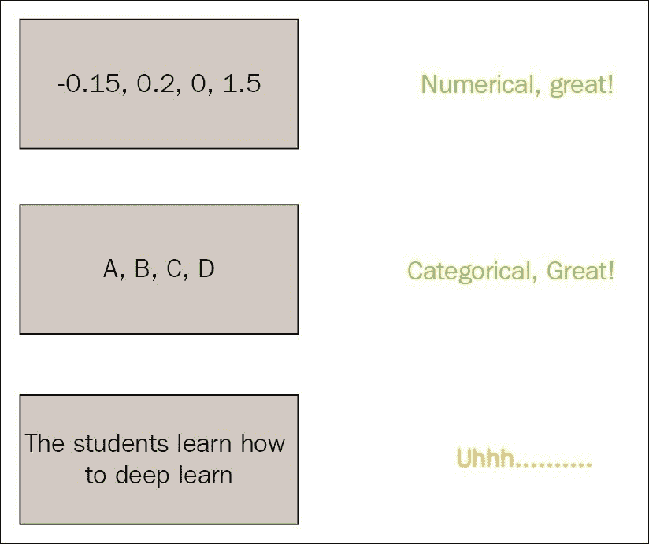
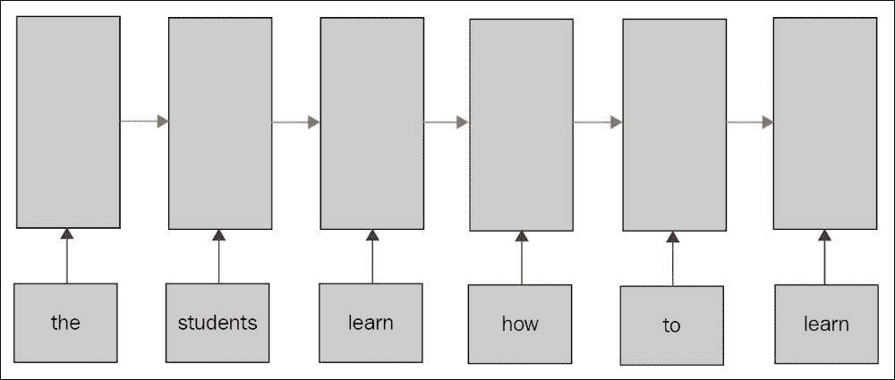
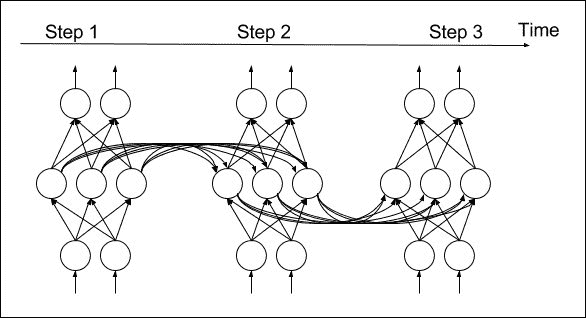
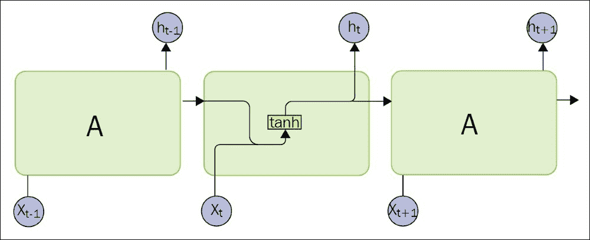
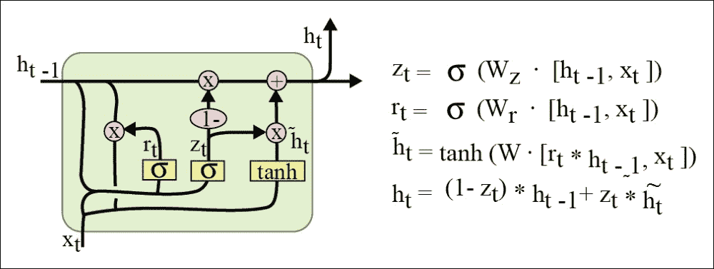
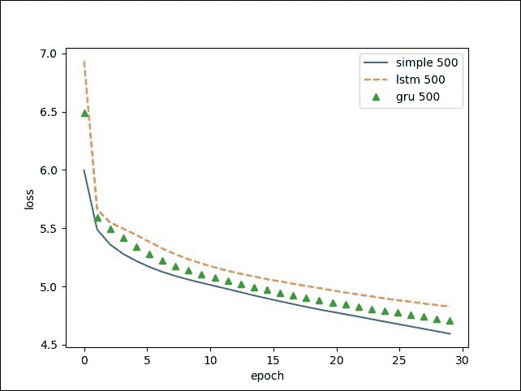
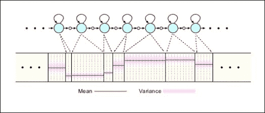

<title>Chapter 4. Generating Text with a Recurrent Neural Net</title>  

# 第四章。用递归神经网络生成文本

在前一章中，您学习了如何将离散输入表示为向量，以便神经网络能够理解离散输入和连续输入。

许多现实世界的应用涉及可变长度的输入，例如连接的对象和自动化(类似卡尔曼滤波器，发展得更好)；自然语言处理(理解、翻译、文本生成和图像注释)；人类行为再现(文本手写生成和聊天机器人)；和强化学习。

以前的网络称为前馈网络，只能对固定维数的输入进行分类。为了将它们的能力扩展到可变长度的输入，一种新的网络类别已经被设计出来:**递归神经网络** ( **RNN** )非常适合于对可变长度的输入或序列执行机器学习任务。

三个众所周知的递归神经网络(简单 RNN，GRU 和 LSTM)提出了文本生成的例子。本章涵盖的主题如下:

*   序列的大小写
*   循环网络的机制
*   如何建立一个简单的递归网络
*   穿越时间的反向传播
*   不同类型的 RNN、LSTM 和 GRU
*   困惑和单词错误率
*   用于文本生成的文本数据培训
*   递归网络的应用

<title>Chapter 4. Generating Text with a Recurrent Neural Net</title>  

# 需要 RNN

自然语言的深度学习网络是数值型的，可以很好地处理浮点数和整数的多维数组作为输入值。对于分类值，如字符或单词，前一章演示了一种称为嵌入的技术，用于将它们转换成数值。

到目前为止，所有的输入都是固定大小的数组。在许多应用中，如自然语言处理中的文本，输入只有一个语义，但可以用可变长度的序列来表示。

需要处理可变长度序列，如下图所示:



**递归神经网络** ( **RNN** )是可变长度输入的答案。

递归可被视为在不同的时间步骤多次应用前馈网络，输入数据不同，但主要区别在于，存在与过去、先前时间步骤的联系，并且在一个目标中，通过时间改进输入的表示。

在每个时间步长，隐藏层输出值代表网络的中间状态。

在给定输入的情况下，循环连接定义了从一个状态到另一个状态的转换，以便细化表示:



递归神经网络适用于涉及序列的挑战，如文本、声音和语音、手写和时间序列。

自然语言数据集

<title>A dataset for natural language</title>  

# 作为数据集，可以使用任何文本语料库，比如维基百科、网络文章，甚至可以用代码或计算机程序、戏剧、诗歌等符号；该模型将捕捉并再现数据中的不同模式。

在这种情况下，让我们使用微小的莎士比亚文本来预测新的莎士比亚文本，或者至少是受莎士比亚启发的风格编写的新文本；两个级别的预测是可能的，但可以用相同的方式处理:

**在字符级别**:字符属于一个包含标点符号的字母表，给定前几个字符，模型预测字母表中的下几个字符，包括构建单词和句子的空格。对于预测的单词是否属于字典没有限制，训练的目标是构建接近真实单词和句子。

*   **在单词级别**:单词属于包含标点符号的字典，给定前几个单词，模型预测词汇表中的下一个单词。在这种情况下，对单词有很强的约束，因为它们属于字典，但不属于句子。我们希望该模型更多地关注捕捉句子的语法和含义，而不是字符级别。
*   在这两种模式中，token 表示字符/单词；字典、字母表或词汇表指定(令牌的可能值的列表)；

流行的 NLTK 库是一个 Python 模块，用于将文本拆分成句子，并标记成单词:

在 Python shell 中，运行以下命令下载`book`包中的英语标记器:

```
conda install nltk
```

让我们解析文本以提取单词:

```
import nltk
nltk.download("book")
```

或`char`库:

```
from load import parse_text
X_train, y_train, index_to_word = parse_text("data/tiny-shakespear.txt", type="word")

for i in range(10):
  print "x", " ".join([index_to_word[x] for x in X_train[i]])
  print "y"," ".join([index_to_word[x] for x in y_train[i]])

*Vocabulary size 9000*
*Found 12349 unique words tokens.*
*The least frequent word in our vocabulary is 'a-fire' and appeared 1 times.*
*x START first citizen : before we proceed any further , hear me speak .*
*y first citizen : before we proceed any further , hear me speak . END*
*x START all : speak , speak .*
*y all : speak , speak . END*
*x START first citizen : you are all resolved rather to die than to famish ?*
*y first citizen : you are all resolved rather to die than to famish ? END*
*x START all : resolved .*
*y all : resolved . END*
*x START resolved .*
*y resolved . END*
*x START first citizen : first , you know caius marcius is chief enemy to the people .*
*y first citizen : first , you know caius marcius is chief enemy to the people . END*
*x START all : we know't , we know't .*
*y all : we know't , we know't . END*
*x START first citizen : let us kill him , and we 'll have corn at our own price .*
*y first citizen : let us kill him , and we 'll have corn at our own price . END*
*x START is't a verdict ?*
*y is't a verdict ? END*
*x START all : no more talking o n't ; let it be done : away , away !*
*y all : no more talking o n't ; let it be done : away , away ! END*

```

额外的开始标记(`START`单词和`^`字符)避免了在预测开始时出现无效的隐藏状态。另一个解决方案是用初始化第一个隐藏状态。

```
from load import parse_text
X_train, y_train, index_to_char = parse_text("data/tiny-shakespear.txt", type="char")

for i in range(10):
  print "x",''.join([index_to_char[x] for x in X_train[i]])
  print "y",''.join([index_to_char[x] for x in y_train[i]])

*x ^first citizen: before we proceed any further, hear me speak*
*y irst citizen: before we proceed any further, hear me speak.$*
*x ^all: speak, speak*
*y ll: speak, speak.$*
*x ^first citizen: you are all resolved rather to die than to famish*
*y irst citizen: you are all resolved rather to die than to famish?$*
*x ^all: resolved*
*y ll: resolved.$*
*x ^resolved*
*y esolved.$*
*x ^first citizen: first, you know caius marcius is chief enemy to the people*
*y irst citizen: first, you know caius marcius is chief enemy to the people.$*
*x ^all: we know't, we know't*
*y ll: we know't, we know't.$*
*x ^first citizen: let us kill him, and we'll have corn at our own price*
*y irst citizen: let us kill him, and we'll have corn at our own price.$*
*x ^is't a verdict*
*y s't a verdict?$*
*x ^all: no more talking on't; let it be done: away, away*
*y ll: no more talking on't; let it be done: away, away!$*

```

附加结束标记(`END`字和`$`字符)帮助网络学习预测序列生成何时结束。

最后，`out of vocabulary`标记(`UNKNOWN`单词)替换不属于词汇表的单词，以避免使用大词典。

在这个例子中，我们将省略验证数据集，但是对于任何真实世界的应用程序，保留一部分数据用于验证是一个很好的实践。

另外，注意来自[第 2 章](part0026_split_000.html#OPEK1-ccdadb29edc54339afcb9bdf9350ba6b "Chapter 2. Classifying Handwritten Digits with a Feedforward Network")、*用前馈网络*对手写数字进行分类以进行层初始化`shared_zeros`和`shared_glorot_uniform`的函数，以及来自[第 3 章](part0040_split_000.html#164MG1-ccdadb29edc54339afcb9bdf9350ba6b "Chapter 3. Encoding Word into Vector")、*将单词编码成矢量*以进行模型保存和加载的函数`save_params`和`load_params`已经打包到`utils`包中:

简单递归网络

```
from theano import *
import theano.tensor as T
from utils import shared_zeros, shared_glorot_uniform,save_params,load_params
```

<title>Simple recurrent network</title>  

# RNN 是一个应用于多个时间步的网络，但有一个主要的区别:连接到先前时间步的层的先前状态，称为隐藏状态:

An RNN is a network applied at multiple time steps but with a major difference: a connection to the previous state of layers at previous time steps named hidden states :



这可以写成以下形式:

This can be written in the following form:



RNN 可以作为前馈网络展开，应用于作为输入的序列上，并且在不同时间步长之间具有共享参数。

输入和输出的第一个维度是时间，接下来的维度是每个步骤内部的数据维度。如前一章所述，一个时间步长(一个单词或一个字符)的值可以用一个索引(一个整数，0 维)或一个热编码向量(1 维)来表示。前一种表示在内存中更紧凑。在这种情况下，输入和输出序列将是由向量表示的一维序列，其中一维是时间:

训练程序的结构与[第 2 章](part0026_split_000.html#OPEK1-ccdadb29edc54339afcb9bdf9350ba6b "Chapter 2. Classifying Handwritten Digits with a Feedforward Network")、*中的相同，使用前馈网络对手写数字进行分类*使用前馈网络，除了我们将使用递归模块定义的模型在不同的时间步共享相同的权重:

```
x = T.ivector()
y = T.ivector()
```

让我们定义隐藏权重和输入权重:

```
embedding_size = len(index_)
n_hidden=500
```

和输出权重:

```
U = shared_glorot_uniform(( embedding_size,n_hidden), name="U")
W = shared_glorot_uniform((n_hidden, n_hidden), name="W")
bh = shared_zeros((n_hidden,), name="bh")
```

使用开始令牌时，可以将初始状态设置为零:

```
V = shared_glorot_uniform(( n_hidden, embedding_size), name="V")
by = shared_zeros((embedding_size,), name="by")

params = [U,V,W,by,bh]

def step(x_t, h_tm1):
    h_t = T.tanh(U[x_t] + T.dot( h_tm1, W) + bh)
    y_t = T.dot(h_t, V) + by
    return h_t, y_t
```

它返回两个张量，其中第一维是时间，第二维是数据值(本例中为 0 维)。

```
h0 = shared_zeros((n_hidden,), name='h0')
[h, y_pred], _ = theano.scan(step, sequences=x, outputs_info=[h0, None], truncate_gradient=10)
```

通过扫描功能进行的梯度计算在 ano 中是自动的，并遵循与前一时间步的直接和循环连接。因此，由于循环连接，特定时间步长的误差被传播到前一个时间步长，这是一种通过时间 ( **BPTT** )的称为**反向传播的机制。**

已经观察到，在太多的时间步骤之后，梯度或者爆炸或者消失。这就是为什么在这个例子中梯度在 10 步之后被截断，并且误差将不会反向传播到更远的过去的时间步。

对于剩余的步骤，我们保持以前的分类:

这将返回每个时间步长的向量值。

```
model = T.nnet.softmax(y_pred)
y_out = T.argmax(model, axis=-1)
cost = -T.mean(T.log(model)[T.arange(y.shape[0]), y])
```

LSTM 网

<title>Simple recurrent network</title>  

## 由于消失/爆炸梯度效应和截断反向传播，RNN 的主要困难之一是捕捉长期相关性。

为了解决这个问题，研究人员一直在寻找一长串潜在的解决方案。1997 年设计了一种新的循环网络，它有一个称为单元状态的存储单元，专门用于保存和传输长期信息。

在每个时间步长，由于门控机制，单元值可以部分地用候选单元更新，部分地被擦除。给定先前隐藏的状态值和当前输入值，更新门和忽略门这两个门决定如何更新单元:

At each time step, the cell value can be updated partially with a candidate cell and partially erased thanks to a gate mechanism. Two gates, the update gate and the forget gate, decide how to update the cell, given the previously hidden state value and current input value:


候选单元格的计算方式相同:

The candidate cell is computed in the same way:


新的单元状态计算如下:

The new cell state is computed as follows:


对于新的隐藏状态，输出门决定输出单元值中的什么信息:

For the new hidden state, an output gate decides what information in the cell value to output:


剩余的与简单的 RNN 相同:

The remaining stays equal with the simple RNN:


与简单的 RNN 相比，这种机制允许网络存储一些信息，以便将来使用。

LSTM 设计的许多变体已经被设计出来，这取决于你在你的问题上测试这些变体，看看它们如何表现。

在这个例子中，我们将使用一个变体，其中门和候选者使用先前隐藏的状态和先前的单元状态。

在图中，我们来定义以下各项的权重:

-输入门:

-遗忘之门:

```
W_xi = shared_glorot_uniform(( embedding_size,n_hidden))
W_hi = shared_glorot_uniform(( n_hidden,n_hidden))
W_ci = shared_glorot_uniform(( n_hidden,n_hidden))
b_i = shared_zeros((n_hidden,))
```

-输出门:

```
W_xf = shared_glorot_uniform(( embedding_size, n_hidden))
W_hf = shared_glorot_uniform(( n_hidden,n_hidden))
W_cf = shared_glorot_uniform(( n_hidden,n_hidden))
b_f = shared_zeros((n_hidden,))
```

-细胞:

```
W_xo = shared_glorot_uniform(( embedding_size, n_hidden))
W_ho = shared_glorot_uniform(( n_hidden,n_hidden))
W_co = shared_glorot_uniform(( n_hidden,n_hidden))
b_o = shared_zeros((n_hidden,))
```

-输出层:

```
W_xc = shared_glorot_uniform(( embedding_size, n_hidden))
W_hc = shared_glorot_uniform(( n_hidden,n_hidden))
b_c = shared_zeros((n_hidden,))
```

所有可训练参数的数组:

```
W_y = shared_glorot_uniform(( n_hidden, embedding_size), name="V")
b_y = shared_zeros((embedding_size,), name="by")
```

要放在递归循环中的阶跃函数:

```
params = [W_xi,W_hi,W_ci,b_i,W_xf,W_hf,W_cf,b_f,W_xo,W_ho,W_co,b_o,W_xc,W_hc,b_c,W_y,b_y]
```

让我们用扫描操作符创建循环:

```
def step(x_t, h_tm1, c_tm1):
    i_t = T.nnet.sigmoid(W_xi[x_t] + T.dot(W_hi, h_tm1) + T.dot(W_ci, c_tm1) + b_i)
    f_t = T.nnet.sigmoid(W_xf[x_t] + T.dot(W_hf, h_tm1) + T.dot(W_cf, c_tm1) + b_f)
    c_t = f_t * c_tm1 + i_t * T.tanh(W_xc[x_t] + T.dot(W_hc, h_tm1) + b_c)
    o_t = T.nnet.sigmoid(W_xo[x_t] + T.dot(W_ho, h_tm1) + T.dot(W_co, c_t) + b_o)
    h_t = o_t * T.tanh(c_t)
    y_t = T.dot(h_t, W_y) + b_y
    return h_t, c_t, y_t
```

门控循环网络

```
h0 = shared_zeros((n_hidden,), name='h0')
c0 = shared_zeros((n_hidden,), name='c0')
[h, c, y_pred], _ = theano.scan(step, sequences=x, outputs_info=[h0, c0, None], truncate_gradient=10)
```

<title>Simple recurrent network</title>  

## GRU 是 LSTM 的另一种选择，简化了机制，不需要使用额外的电池:

The GRU is an alternative to LSTM, simplifying the mechanism without the use of an extra cell:



构建门控递归网络的代码简单地包括定义权重和`step`函数，如前所述:

-更新门的权重:

-重置闸门的重量:

```
W_xz = shared_glorot_uniform(( embedding_size,n_hidden))
W_hz = shared_glorot_uniform(( n_hidden,n_hidden))
b_z = shared_zeros((n_hidden,))
```

-隐藏层的权重:

```
W_xr = shared_glorot_uniform(( embedding_size,n_hidden))
W_hr = shared_glorot_uniform(( n_hidden,n_hidden))
b_r = shared_zeros((n_hidden,))
```

-输出层的权重:

```
W_xh = shared_glorot_uniform(( embedding_size,n_hidden))
W_hh = shared_glorot_uniform(( n_hidden,n_hidden))
b_h = shared_zeros((n_hidden,))
```

可训练参数:

```
W_y = shared_glorot_uniform(( n_hidden, embedding_size), name="V")
b_y = shared_zeros((embedding_size,), name="by")
```

阶跃函数:

```
params = [W_xz, W_hz, b_z, W_xr, W_hr, b_r, W_xh, W_hh, b_h, W_y, b_y]
```

循环回路:

```
def step(x_t, h_tm1):
    z_t = T.nnet.sigmoid(W_xz[x_t] + T.dot(W_hz, h_tm1) + b_z)
    r_t = T.nnet.sigmoid(W_xr[x_t] + T.dot(W_hr, h_tm1) + b_r)
    can_h_t = T.tanh(W_xh[x_t] + r_t * T.dot(W_hh, h_tm1) + b_h)
    h_t = (1 - z_t) * h_tm1 + z_t * can_h_t
    y_t = T.dot(h_t, W_y) + b_y
    return h_t, y_t
```

已经介绍了主要的网络，我们将看看它们在文本生成任务中表现如何。

```
h0 = shared_zeros((n_hidden,), name='h0')
[h, y_pred], _ = theano.scan(step, sequences=x, outputs_info=[h0, None], truncate_gradient=10)
```

自然语言表现的衡量标准

<title>Metrics for natural language performance</title>  

# **单词错误率** ( **WER** )或**字符错误率** ( **CER** )相当于自然语言情况下的准确度错误的代号。

语言模型的评估通常用困惑来表示，简单来说就是:

Evaluation of language models is usually expressed with perplexity, which is simply:


培训损失对比

<title>Training loss comparison</title>  

# 在训练期间，经过一定次数的微调后，学习率可能会很高。当损失不再减少时，降低学习率将在训练的最后阶段有所帮助。为了降低学习率，我们需要在编译期间将其定义为输入变量:

在培训期间，我们调整学习率，如果培训损失没有改善，则降低学习率:

```
lr = T.scalar('learning_rate')
train_model = theano.function(inputs=[x,y,lr], outputs=cost,updates=updates)
```

作为第一个实验，让我们看看隐藏层的大小对简单 RNN 的训练损失的影响:

```
if (len(train_loss) > 1 and train_loss[-1] > train_loss[-2]):
    learning_rate = learning_rate * 0.5
```

As a first experiment, let's see the impact of the size of the hidden layer on the training loss for a simple RNN:


更多的隐藏单位可以提高训练速度，最终可能会更好。为了检查这一点，我们应该运行更多的时期。

比较不同网络类型的训练，在这种情况下，我们没有观察到 LSTM 和 GRU 有任何改进:

Comparing the training of the different network types, in this case, we do not observe any improvement with LSTM and GRU:



这个可能是由于`truncate_gradient`选项，或者是因为问题太简单，不那么依赖于内存。

另一个需要优化的参数是一个单词在字典中出现的最少次数。更多的人会学习更频繁的单词，这更好。

预测的例子

<title>Example of predictions</title>  

# 让我们用生成的模型预测一个句子:

请注意，我们采用最有可能的下一个单词(argmax)，而为了获得一些随机性，我们必须根据预测的概率来绘制下一个单词。

```
sentence = [0]
while sentence[-1] != 1:
    pred = predict_model(sentence)[-1]
    sentence.append(pred)
print(" ".join([ index_[w] for w in sentence[1:-1]]))
```

在 150 个时代，虽然模型仍然没有完全收敛到学习我们的莎士比亚作品，我们可以玩预测，用几个词开始，然后看到网络生成句子的结尾:

**第一公民**:一个词，我知道是什么一个词

*   **现在怎么**了！
*   你该不是睡着了吧，我说在这呢？
*   什么，你是我的主人吗？
*   **嗯，**先生，来。
*   **我自己也一直**
*   一条最长的软管，先生
*   **他要**不要这个
*   先生，请你祈祷
*   **来**，来，你
*   **乌鸦**？
*   **我给**你
*   **什么**，嚯！
*   考虑到你，先生
*   **不再有**！
*   **让我们**走吧，还是你未知的未知，我做我该做的
*   **我们现在是**不是
*   从这些例子中，我们注意到模型已经学会了正确定位标点符号，在正确的位置添加点、逗号、问号或感叹号，以正确排列直接宾语、间接宾语和形容词。

原文由莎士比亚风格的短句组成。更大的文章，如维基百科页面，以及通过验证分割进一步推动训练以控制过度拟合，将产生更长的文本。[第 10 章](part0096_split_000.html#2RHM01-ccdadb29edc54339afcb9bdf9350ba6b "Chapter 10. Predicting Times Sequences with Advanced RNN")、*用高级 RNN 预测时间序列*:将讲授如何用高级 RNN 预测时间序列，并呈现本章的高级版本。

RNN 的应用

<title>Applications of RNN</title>  

# 这一章介绍了简单的 RNN、LSTM 和 GRU 模型。这种模型在序列生成或序列理解中具有广泛的应用:

下午好。上帝保佑你。美国将承担起美国人民面临的新挑战的代价，美国人民将承认是我们造成了这个问题。他们受到了攻击，所以他们不得不说，在战争的最后几天里，我无法完成所有的任务。男人和女人们的承诺，他们仍然要带走美国人民战斗的事实，以确保他们能够保护我们的一部分。这是一个团结一致的机会，来彻底寻求向美国人民借钱的承诺。事实上，我们的男女军人和数以百万计的执法人员认为，我们应该成为一股强大的力量，我们有能力提高美国人民的精神和我们国家的领导地位，他们生活在美国的互联网上。谢谢您们。上帝保佑你们，上帝保佑美利坚合众国。

*   Text generation, such as automatic generation of Obama political speech (obama-rnn), for example with a text seed on jobs:

    > 你可以在[https://medium . com/@ samim/Obama-rnn-machine-generated-political-speechs-c 8 Abd 18 a2 ea 0 # . 4 nee 5 wafe .](https://medium.com/@samim/obama-rnn-machine-generated-political-speeches-c8abd18a2ea0#.4nee5wafe.)详细查看这个例子

    生成人类笔迹:[http://www.cs.toronto.edu/~graves/handwriting.html](http://www.cs.toronto.edu/~graves/handwriting.html)

*   Text annotation, for example, the **Part of Speech** (**POS**) tags: noun, verb, particle, adverb, and adjective.

    Generating human handwriting: [http://www.cs.toronto.edu/~graves/handwriting.html](http://www.cs.toronto.edu/~graves/handwriting.html)

    
*   Drawing with Sketch-RNN ([https://github.com/hardmaru/sketch-rnn](https://github.com/hardmaru/sketch-rnn))
*   **Speech synthesis**: A recurrent network will generate parameters for generating each phoneme in a speech or voice speaking. In the following image, time-frequency homogeneous blocs are classified in phonemes (or graphemes or letters):

    旋律生成在[https://github . com/tensor flow/magenta/tree/master/magenta/models/melody _ rnn](https://github.com/tensorflow/magenta/tree/master/magenta/models/melody_rnn)。

*   Music generation:

    *   莫扎特风格音乐一代与莫扎特-RNN 在[http://www . hexad RIA . com/2015/08/03/composing-music-with recurrent-neural-networks/](http://www.hexahedria.com/2015/08/03/composing-music-withrecurrent-neural-networks/)。
    *   Mozart style music generation with Mozart-RNN at [http://www.hexahedria.com/2015/08/03/composing-music-withrecurrent-neural-networks/](http://www.hexahedria.com/2015/08/03/composing-music-withrecurrent-neural-networks/).

    序列的任何分类，例如我们将在[第 5 章](part0060_split_000.html#1P71O2-ccdadb29edc54339afcb9bdf9350ba6b "Chapter 5. Analyzing Sentiment with a Bidirectional LSTM")、*使用双向 LSTM* 分析 *情感中解决的情感分析(积极、消极或中性情感)。*

*   序列编码或解码，我们将在第 6 章、*用空间变换网络*定位中解决。
*   相关文章

<title>Related articles</title>  

# 您可以参考以下链接了解更多信息:

*递归神经网络的不合理有效性*，安德烈·卡帕西 2015 年 5 月 21 日([http://karpathy.github.io/2015/05/21/rnn-effectiveness/](http://karpathy.github.io/2015/05/21/rnn-effectiveness/)

*   *了解 LSTM 网络*在克里斯多佛·科拉的博客上，2015([http://colah.github.io/posts/2015-08-Understanding-LSTMs/](http://colah.github.io/posts/2015-08-Understanding-LSTMs/))
*   使用 LSTM 进行音频分类:*连接主义时间分类和深度语音:放大端到端语音识别*([https://arxiv.org/abs/1412.5567](https://arxiv.org/abs/1412.5567))
*   http://www.cs.toronto.edu/~graves/handwriting.html[的手写演示](http://www.cs.toronto.edu/~graves/handwriting.html)
*   *使用递归神经网络的通用序列学习*教程在[https://www.youtube.com/watch?v=VINCQghQRuM](https://www.youtube.com/watch?v=VINCQghQRuM)
*   关于训练递归神经网络的难度
*   递归神经网络教程:

    *   RNNS 简介
    *   用 Python、NumPy 和 Theano 实现 RNN
    *   通过时间和消失梯度反向传播
    *   用 Python 和 Theano Denny Britz 2015 实现 GRU/LSTM

*   RNNS 简介
*   总结

<title>Summary</title>  

# 递归神经网络提供了处理离散或连续数据的可变长度输入和输出的能力。

虽然以前的前馈网络只能处理一个输入到一个输出(一对一方案)，但本章介绍的递归神经网络提供了在可变长度和固定长度表示之间进行转换的可能性，为深度学习输入/输出添加了新的操作方案:一对多、多对多或多对一。

RNN 的应用范围很广。因此，我们将在后续章节中更深入地研究它们，特别是如何增强这三个模块的预测能力，或者如何将它们结合起来构建多模态、问答或翻译应用程序。

特别是，在下一章，我们将看到一个使用文本嵌入和递归网络进行情感分析的实际例子。这一次，也将有机会在另一个库 Keras 下复习这些递归单元，这是一个深度学习库，它简化了为 Theano 编写模型。

In particular, in the next chapter, we'll see a practical example using text embedding and recurrent networks for sentiment analysis. This time, there will also be an opportunity to review these recurrence units under another library Keras, a deep learning library that simplifies writing models for Theano.