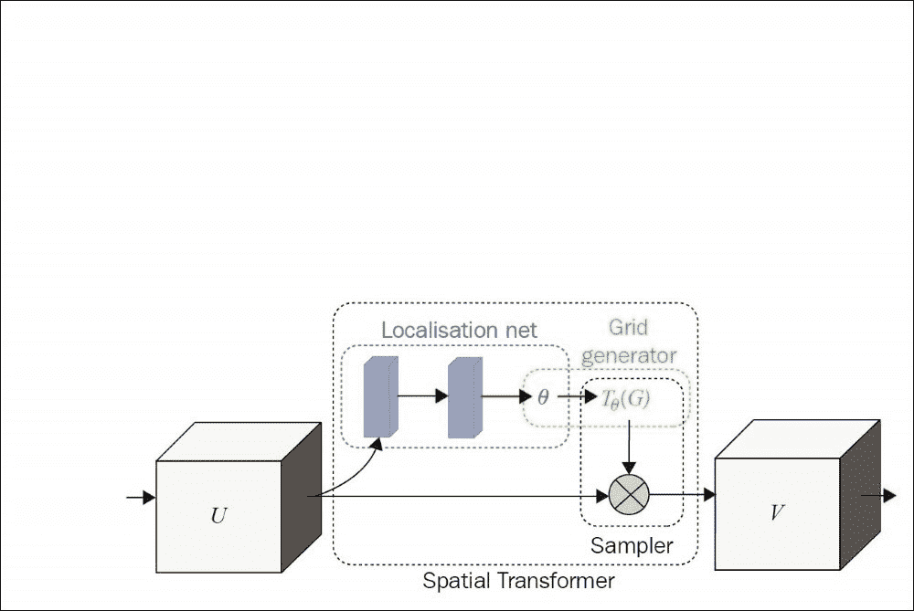
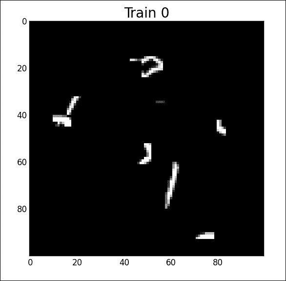
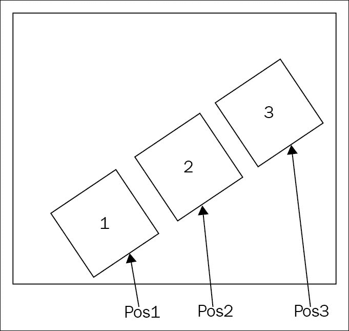
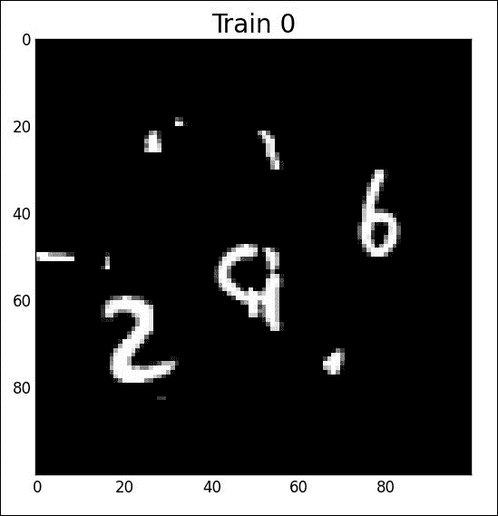
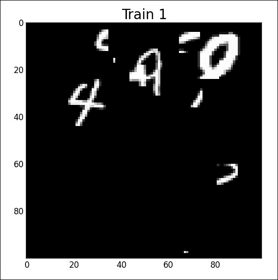
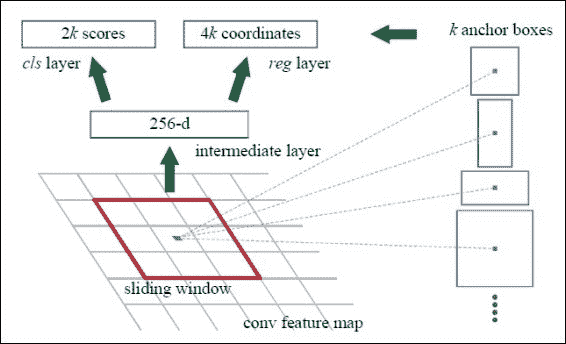

# 第六章。用空间变压器网络定位

在这一章中，NLP 领域被留下来回到图像，并得到一个将循环神经网络应用于图像的例子。在[第二章](part0026_split_000.html#OPEK1-ccdadb29edc54339afcb9bdf9350ba6b "Chapter 2. Classifying Handwritten Digits with a Feedforward Network")、*用前馈网络分类手写数字*中，我们讨论了图像分类的情况，包括预测图像的类别。在这里，我们将处理对象定位，这也是计算机视觉中的一个常见任务，包括预测图像中对象的边界框。

[第 2 章](part0026_split_000.html#OPEK1-ccdadb29edc54339afcb9bdf9350ba6b "Chapter 2. Classifying Handwritten Digits with a Feedforward Network")、*使用前馈网络对手写数字进行分类*使用线性层、卷积和非线性元素构建的神经网络解决了分类任务，而空间转换器是一个新模块，它建立在专用于定位任务的非常特定的方程上。

为了定位图像中的多个对象，空间转换器由循环网络组成。本章借此机会展示了如何在**千层面**中使用预构建的循环网络，这是一个基于 ano 的库，它带来了额外的模块，并帮助您使用预构建的组件快速开发您的神经网络，同时不改变您使用 ano 构建和处理网络的方式。

总而言之，主题列表包括:

*   千层面图书馆简介
*   空间变压器网络
*   具有空间转换器的分类网络
*   带千层面的循环模块
*   数字的循环读取
*   基于铰链损失函数的无监督训练
*   基于区域的目标定位神经网络


# MNIST CNN 模特配千层面

千层面库已经打包了层和工具来轻松处理神经网络。我们先装最新版的千层面:

```
pip install --upgrade https://github.com/Lasagne/Lasagne/archive/master.zip
```

让我们从[第 2 章](part0026_split_000.html#OPEK1-ccdadb29edc54339afcb9bdf9350ba6b "Chapter 2. Classifying Handwritten Digits with a Feedforward Network")、*用前馈网络对手写数字进行分类*用千层面对 MNIST 模型进行重新编程:

```
def model(l_input, input_dim=28, num_units=256, num_classes=10, p=.5):

    network = lasagne.layers.Conv2DLayer(
            l_input, num_filters=32, filter_size=(5, 5),
            nonlinearity=lasagne.nonlinearities.rectify,
            W=lasagne.init.GlorotUniform())

    network = lasagne.layers.MaxPool2DLayer(network, pool_size=(2, 2))

    network = lasagne.layers.Conv2DLayer(
            network, num_filters=32, filter_size=(5, 5),
            nonlinearity=lasagne.nonlinearities.rectify)

    network = lasagne.layers.MaxPool2DLayer(network, pool_size=(2, 2))

    if num_units > 0:
        network = lasagne.layers.DenseLayer(
                lasagne.layers.dropout(network, p=p),
                num_units=num_units,
                nonlinearity=lasagne.nonlinearities.rectify)

    if (num_units > 0) and (num_classes > 0):
        network = lasagne.layers.DenseLayer(
                lasagne.layers.dropout(network, p=p),
                num_units=num_classes,
                nonlinearity=lasagne.nonlinearities.softmax)

    return network
```

这些层是`layer0_input`、`conv1_out`、`pooled_out`、`conv2_out`、`pooled2_out`、`hidden_output`。它们由预建模块构建，例如，`InputLayer`、`Conv2DLayer`、`MaxPool2DLayer`、`DenseLayer`、整流或 softmax 等下降非线性以及`GlorotUniform`等初始化。

为了将模块组成的网络图与输入符号`var`连接起来，并得到输出`var`，使用下面的代码:

```
input_var = T.tensor4('inputs')
l_input = lasagne.layers.InputLayer(shape=(None, 1, 28, 28), input_var=input_var)
network = mnist_cnn.model(l_input)
prediction = lasagne.layers.get_output(network)
```

或者使用以下代码:

```
l_input = lasagne.layers.InputLayer(shape=(None, 1, 28, 28))
network = mnist_cnn.model(l_input)

input_var = T.tensor4('inputs')
prediction = lasagne.layers.get_output(network, input_var)
```

一个非常方便的功能是你可以打印任何模块的输出形状:

```
print(l_input.output_shape)
```

Lasagne 的`get_all_params`方法列出了模型的参数:

```
params = lasagne.layers.get_all_params(network, trainable=True)
for p in params:
    print p.name
```

最后，千层面有不同的学习规则，如`RMSprop`、`Nesterov`、`Momentum`、`Adam`和`Adagrad`:

```
target_var = T.ivector('targets')
loss = lasagne.objectives.categorical_crossentropy(prediction, target_var)
loss = loss.mean()

updates = lasagne.updates.nesterov_momentum(
        loss, params, learning_rate=0.01, momentum=0.9)

train_fn = theano.function([input_var, target_var], loss, updates=updates)
```

所有其他事情保持不变。

要测试我们的 MNIST 模型，请下载 MNIST 数据集:

```
wget http://www.iro.umontreal.ca/~lisa/deep/data/mnist/mnist.pkl.gz -P /sharedfiles
```

训练用于数字分类的 MNIST 分类器:

```
python 1-train-mnist.py
```

模型参数保存在`model.npz`中。准确率再次达到 99%以上。


# 本地化网络

在**空间变换网络** ( **STN** )中，不是将网络直接应用于输入图像信号，而是添加一个模块来预处理图像，并对其进行裁剪、旋转和缩放以适应对象，以帮助分类:


空间变压器网络

为此，STNs 使用定位网络来预测仿射变换参数并处理输入:



空间变压器网络

在 ano 中，通过仿射变换的微分是自动的，我们只需通过仿射变换将定位网络与分类网络的输入连接起来。

首先，我们创建一个离 MNIST CNN 模型不远的定位网络，来预测仿射变换的六个参数:

```
l_in = lasagne.layers.InputLayer((None, dim, dim))
l_dim = lasagne.layers.DimshuffleLayer(l_in, (0, 'x', 1, 2))
l_pool0_loc = lasagne.layers.MaxPool2DLayer(l_dim, pool_size=(2, 2))
l_dense_loc = mnist_cnn.model(l_pool0_loc, input_dim=dim, num_classes=0)

b = np.zeros((2, 3), dtype=theano.config.floatX)
b[0, 0] = 1.0
b[1, 1] = 1.0

l_A_net = lasagne.layers.DenseLayer(
    l_dense_loc,
    num_units=6,
    name='A_net',
    b=b.flatten(),
    W=lasagne.init.Constant(0.0),
    nonlinearity=lasagne.nonlinearities.identity)
```

这里，我们简单地用`DimshuffleLayer`向输入数组添加一个只有值 1 的通道维度。这种维度添加被称为广播。

pooling 层将输入图像的大小调整为 *50x50* ，这足以确定数字的位置。

定位层权重以零开始，除了偏置，偏置初始化为恒等仿射参数；STN 模块在开始时没有任何影响，完整的输入图像将被传输。

给定仿射参数进行裁剪:

```
l_transform = lasagne.layers.TransformerLayer(
    incoming=l_dim,
    localization_network=l_A_net,
    downsample_factor=args.downsample)
```

`down_sampling_factor`使我们能够根据输入定义输出图像的大小。在这种情况下，它是三，这意味着图像将是*33x 33*——与我们的 MNIST 数字大小 *28x28* 相差不远。最后，我们简单地添加我们的 MNIST CNN 模型来分类输出:

```
l_out = mnist_cnn.model(l_transform, input_dim=dim, p=sh_drp, num_units=400)
```

为了测试分类器，让我们创建一个 *100x100* 像素的图像，带有一些扭曲和一个数字:

```
python create_mnist_sequence.py --nb_digits=1
```

绘制前三幅图像(对应于 1、0、5):

```
python plot_data.py mnist_sequence1_sample_8distortions_9x9.npz
```



让我们运行命令来训练模型:

```
python 2-stn-cnn-mnist.py
```

在这里再次，当数字单独没有失真时，准确度达到 99%以上，这对于单独使用简单的 MNIST CNN 模型通常是不可能的，并且当有失真时，准确度达到 96.9%以上。

绘制作物的命令是:

```
python plot_crops.py res_test_2.npz
```

它给出了以下结果:


并且带有扭曲:


STN 可以被认为是一个模块，可以包含在任何网络的两层之间的任何地方。为了进一步改善分类结果，在分类网络的不同层之间添加多个 stn 有助于获得更好的结果。

这里的是一个网络的例子，网络内部有两个分支，每个分支都有自己的 SPN，在无人监管的情况下，它会尝试捕捉图像的不同部分来对其进行分类:


(空间变压器网络论文，贾德伯格等人，2015 年)


## 应用于图像的循环神经网络

想法是使用递归来读取多个数字，而不是一个数字:



为了读取多个数字，我们简单地用循环网络代替定位前馈网络，该循环网络将输出对应于每个数字的多个仿射变换:


从前面的例子中，我们用 GRU 层替换全连接层:

```
l_conv2_loc = mnist_cnn.model(l_pool0_loc, input_dim=dim, p=sh_drp, num_units=0)

class Repeat(lasagne.layers.Layer):
    def __init__(self, incoming, n, **kwargs):
        super(Repeat, self).__init__(incoming, **kwargs)
        self.n = n

    def get_output_shape_for(self, input_shape):
        return tuple([input_shape[0], self.n] + list(input_shape[1:]))

    def get_output_for(self, input, **kwargs):
        tensors = [input]*self.n
        stacked = theano.tensor.stack(*tensors)
        dim = [1, 0] + range(2, input.ndim+1)
        return stacked.dimshuffle(dim)

l_repeat_loc = Repeat(l_conv2_loc, n=num_steps)
l_gru = lasagne.layers.GRULayer(l_repeat_loc, num_units=num_rnn_units,
unroll_scan=True)

l_shp = lasagne.layers.ReshapeLayer(l_gru, (-1, num_rnn_units))  
```

这将输出一个维度(无，3，256)的张量，其中第一个维度是批量大小，3 是 GRU 中的步骤数，256 是隐藏层大小。在这一层之上，我们简单地添加与前面相同的全连接层，以在开始时输出三个身份图像:

```
b = np.zeros((2, 3), dtype=theano.config.floatX)
b[0, 0] = 1.0
b[1, 1] = 1.0

l_A_net = lasagne.layers.DenseLayer(
    l_shp,
    num_units=6,
    name='A_net',
    b=b.flatten(),
    W=lasagne.init.Constant(0.0),
    nonlinearity=lasagne.nonlinearities.identity)

l_conv_to_transform = lasagne.layers.ReshapeLayer(
    Repeat(l_dim, n=num_steps), [-1] + list(l_dim.output_shape[-3:]))

l_transform = lasagne.layers.TransformerLayer(
    incoming=l_conv_to_transform,
    localization_network=l_A_net,
    downsample_factor=args.downsample)

l_out = mnist_cnn.model(l_transform, input_dim=dim, p=sh_drp, num_units=400)
```

为了测试分类器，让我们创建带有一些扭曲的 *100x100* 像素的图像，这次是三个数字:

```
python create_mnist_sequence.py --nb_digits=3 --output_dim=100
```

绘制前三幅图像(对应于序列 **296** 、 **490** 、 **125** ):

```
python plot_data.py mnist_sequence3_sample_8distortions_9x9.npz
```



让我们运行命令来训练我们的递归模型:

```
python 3-recurrent-stn-mnist.py
*Epoch 0 Acc Valid 0.268833333333, Acc Train = 0.268777777778, Acc Test = 0.272466666667*
*Epoch 1 Acc Valid 0.621733333333, Acc Train = 0.611116666667, Acc Test = 0.6086*
*Epoch 2 Acc Valid 0.764066666667, Acc Train = 0.75775, Acc Test = 0.764866666667*
*Epoch 3 Acc Valid 0.860233333333, Acc Train = 0.852294444444, Acc Test = 0.859566666667*
*Epoch 4 Acc Valid 0.895333333333, Acc Train = 0.892066666667, Acc Test = 0.8977*
*Epoch 53 Acc Valid 0.980433333333, Acc Train = 0.984261111111, Acc Test = 0.97926666666*

```

分类准确率为 99.3%。

绘制作物图:

```
python plot_crops.py res_test_3.npz
```


# 协同定位的无监督学习

[第二章](part0026_split_000.html#OPEK1-ccdadb29edc54339afcb9bdf9350ba6b "Chapter 2. Classifying Handwritten Digits with a Feedforward Network")、*训练的数字分类器的第一层，用前馈网络*作为编码函数对手写数字进行分类，在嵌入空间中表示图像，对于文字:


通过最小化假定包含相同数字的两个图像的随机集合上的铰链损失目标函数，可以毫无意外地训练空间变换器网络的定位网络:


最小化这个和导致修改定位网络中的权重，使得两个定位的数字变得比两个随机的裁剪更接近。

下面是结果:


(空间变压器网络论文，贾德伯格等人，2015 年)


# 基于区域的本地化网络

历史上，物体定位的基本方法是在滑动窗口中使用分类网络；它包括在每个方向上一个像素一个像素地滑动窗口，并在图像的每个位置和每个尺度上应用分类器。分类器学习判断对象是否存在并位于中心。它需要大量的计算，因为模型必须在每个位置和比例进行评估。

为了加速这样的过程，研究员 Ross Girshick 的 Fast-R-CNN 论文中的**区域建议网络** ( **RPN** )包括将诸如 MNIST CNN 的神经网络分类器的完全连接层也转换成卷积层；事实上，在 28x28 影像上网络密集，当卷积核具有与输入相同的维数时，卷积和线性图层之间没有区别。因此，任何完全连接的层都可以被重写为卷积层，具有相同的权重和适当的核维数，这使网络能够在任何大小的比 28x28 更宽的图像上工作，输出每个位置都有分类分数的特征图。唯一的区别可能来自整个网络的步距，该步距可以被设置为不同于 1，并且可以很大(几个 10 像素),卷积核被设置为步距不同于 1，以便减少评估位置的数量，从而减少计算。这样的变换是值得的，因为卷积非常有效:



更快的 R-CNN:用区域提议网络实现实时目标检测

已经设计了一个端到端网络，从反卷积原理中汲取思想，其中输出特征图一次给出所有边界框:**你只看一次** ( **YOLO** )架构为特征图中的每个位置预测 B 个可能的边界框。每个边界框由其坐标(x，y，w，h)与整个图像的比例定义为回归问题，并且置信度(概率)对应于框和真实框之间的并集 ( **IOU** )上的**交集。提出了 SSD 模型的可比方法。**

最后，在第八章[、](part0083_split_000.html#2F4UM2-ccdadb29edc54339afcb9bdf9350ba6b "Chapter 8. Translating and Explaining with Encoding – decoding Networks")、*中介绍的用编码-解码网络进行翻译和解释的分割网络*也可以被认为是针对定位对象的神经网络实现。

延伸阅读


# 有关更多信息，您可以进一步参考以下来源:

空间变压器网络，马克斯·贾德伯格，卡伦·西蒙扬，安德鲁·齐泽曼，科拉伊·卡武克库奥卢，2015 年 6 月

*   《循环空间变压器网络》,索伦·卡埃·森德比，卡斯珀·卡埃·森德比，拉尔斯·马洛勒，奥勒·温瑟，2015 年 9 月
*   原代码:[https://github.com/skaae/recurrent-spatial-transformer-code](https://github.com/skaae/recurrent-spatial-transformer-code)
*   谷歌街景字符识别，王，如何
*   用卷积神经网络在野外阅读文本，马克斯·贾德伯格，卡伦·西蒙扬，安德里亚·维达迪，安德鲁·齐塞曼，2014
*   使用深度卷积神经网络从街景图像中识别多位数，Ian J. Goodfellow，Yaroslav Bulatov，Julian Ibarz，Sacha Arnoud，Vinay Shet，2013 年
*   从谷歌街景图像中识别字符，张景瑞王官
*   用于自然场景文本识别的合成数据和人工神经网络，Max Jaderberg，卡伦·西蒙扬，Andrea Vedaldi，Andrew Zisserman，2014
*   R-CNN 减去 R，Karel Lenc，Andrea Vedaldi，2015
*   快速 R-CNN，罗斯·吉斯克，2015
*   更快的 R-CNN:通过区域提议网络实现实时对象检测，任，，何，罗斯·吉斯克，，2015
*   《你只看一次:统一的实时物体检测》，约瑟夫·雷德蒙、桑托什·迪夫瓦拉、罗斯·吉斯克、阿里·法尔哈迪，2015 年 6 月
*   http://pjreddie.com/darknet/yolo/ YOLO 实时演示
*   YOLO9000:更好、更快、更强，约瑟夫·雷德蒙，阿里·法尔哈迪，2016 年 12 月
*   固态硬盘:单次多盒检测器，刘威、德拉戈米尔·安盖洛夫、杜米特鲁·尔汉、克里斯蒂安·塞格迪、斯科特·里德、傅成阳、亚历山大·c·伯格，2015 年 12 月
*   用于精确对象检测和语义分割的丰富特征层次，Ross Girshick，Jeff Donahue，Trevor Darrell，Jitendra Malik，2013
*   文本流:自然场景图像中的统一文本检测系统田尚轩，，黄昌，，陆，，陈志林，2016
*   总结


# 空间转换器层是一个原始模块，用于定位图像的某个区域，对其进行裁剪和调整大小，以帮助分类器聚焦于图像中的相关部分，并提高其准确性。该层由可微仿射变换组成，其参数通过另一个模型，即定位网络来计算，并可以像往常一样通过反向传播来学习。

使用循环神经单元可以推断出读取图像中多个数字的应用示例。为了简化我们的工作，引入了千层面库。

空间转换器是众多本地化解决方案中的一种；基于区域的定位，如 YOLO、SSD 或更快的 RCNN，为边界框预测提供了最先进的结果。

在下一章中，我们将继续讨论图像识别，以了解如何对包含比数字更多信息的全尺寸图像进行分类，例如室内场景和室外景观的自然图像。与此同时，我们将继续千层面的预建层和优化模块。

In the next chapter, we'll continue with image recognition to discover how to classify full size images that contain a lot more information than digits, such as natural images of indoor scenes and outdoor landscapes. In the meantime, we'll continue with Lasagne's prebuilt layer and optimization modules.