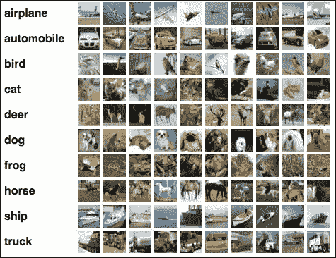
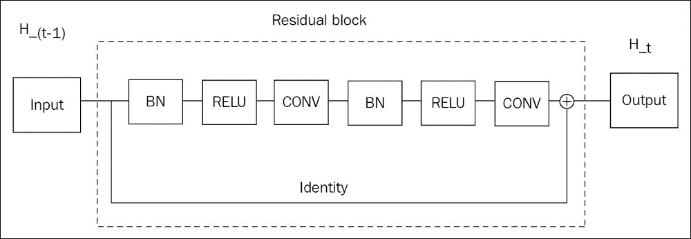
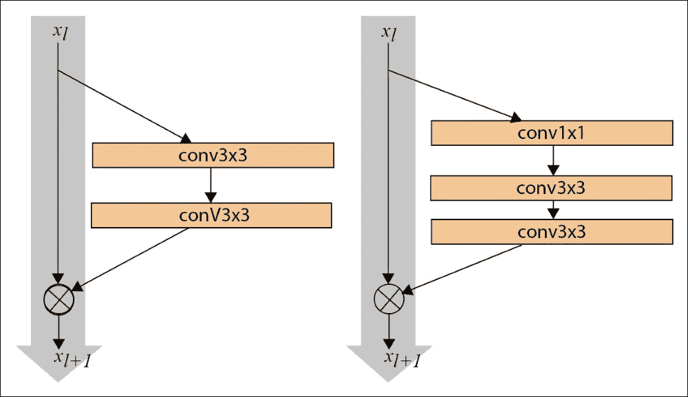
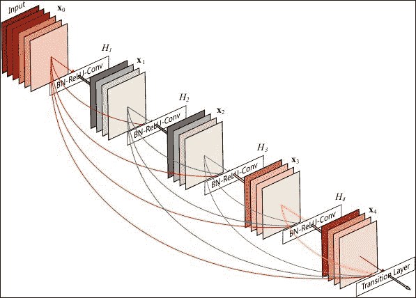
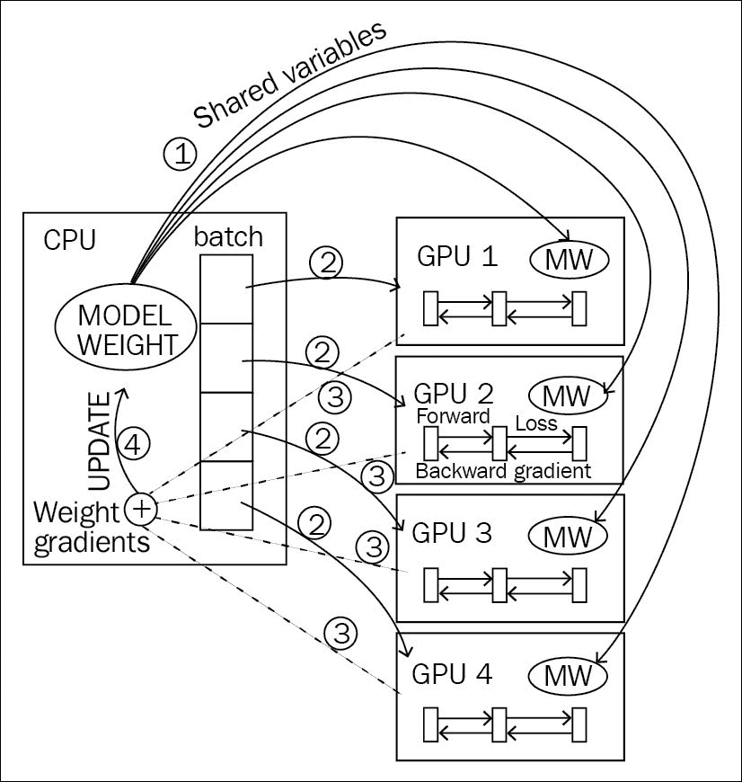

# 第七章。用残差网络分类图像

本章介绍用于图像分类的最新深度网络。

残差网络已经成为最新的架构，在准确性和更大的简单性方面有了巨大的改进。

在残网之前，已经有了很长的架构历史，比如 **AlexNet** 、 **VGG** 、**Inception**(**Google net**)、 **Inception v2、v3、v4** 。研究人员在寻找不同的概念，而发现了一些设计更好架构的潜在规则。

本章将阐述以下主题:

*   用于图像分类评估的主要数据集
*   图像分类的网络体系结构
*   批量标准化
*   全球平均池
*   剩余连接
*   随机深度
*   密集连接
*   多 GPU
*   数据扩充技术


# 自然图像数据集

图像分类通常包括比 MNIST 手写数字更广泛的物体和场景。其中大多数是自然图像，即人类在现实世界中观察到的图像，如风景、室内场景、道路、山脉、海滩、人物、动物和汽车，而不是合成图像或计算机生成的图像。

为了评估自然图像的图像分类网络的性能，研究人员通常使用三个主要的数据集来比较性能:

*   Cifar-10, a dataset of 60,000 small images (32x32) regrouped into 10 classes only, which you can easily download:

    ```
    wget https://www.cs.toronto.edu/~kriz/cifar-10-python.tar.gz -P /sharedfiles
    tar xvzf /sharedfiles/cifar-10-python.tar.gz -C /sharedfiles/
    ```

    以下是每个类别的一些示例图像:

    

    带有样本的 Cifar 10 数据集类【https://www.cs.toronto.edu/~kriz/cifar.html 

*   Cifar-100 是一个包含 60，000 幅图像的数据集，分为 100 个类别和 20 个超类别
*   ImageNet，一个包含 120 万张图片的数据集，标注了广泛的类别(1000)。由于 ImageNet 仅用于非商业用途，因此可以下载 Food 101，这是一个包含 101 种膳食的数据集，每种膳食包含 1，000 张图像:

    ```
     wget http://data.vision.ee.ethz.ch/cvl/food-101.tar.gz -P /sharedfiles tar xvzf food-101.tar.gz -C /sharedfiles/
    ```

在介绍残差架构之前，让我们讨论两种提高分类网准确度的方法:批量标准化和全局平均池。


## 批量归一化

更深的网络，超过 100 层可以帮助几百个类别的图像分类。深层网络的主要问题是确保输入流以及梯度从网络的一端很好地传播到另一端。

然而，网络中的非线性变得饱和，梯度变为零，这并不罕见。此外，网络中的每一层都必须适应其输入分布的不断变化，这种现象被称为**内部协变量转移**。

众所周知，网络训练更快，输入数据被线性处理以具有零均值和单位方差(被称为**网络输入归一化**)，并且独立地而不是共同地归一化每个输入特征。

为了标准化网络中每一层的输入，这有点复杂:将输入的平均值置零将忽略前一个层的学习偏差，对于单位方差，问题甚至更糟。当该层的输入被归一化时，前一层的参数可以无限增长，而损耗保持不变。

因此，对于**层输入归一化**，一个**批量归一化层**重新学习归一化后的标度和偏差:


它不是使用整个数据集，而是使用批处理来计算归一化的统计数据，并在训练时使用移动平均值来接近整个数据集的统计数据。

批处理规范化图层具有以下优点:

*   它减少了不良初始化或过高学习率的影响
*   它大幅提高了网的精确度
*   它加速了训练
*   它减少了过度拟合，规范了模型

当引入批量归一化层时，可以消除漏失，提高学习率，降低 L2 权重归一化。

注意将非线性放置在 BN 层之后，并消除前一层中的偏置:

```
l = NonlinearityLayer(
      BatchNormLayer(
        ConvLayer(l_in,
          num_filters=n_filters[0],
          filter_size=(3,3),
          stride=(1,1),
          nonlinearity=None,
          pad='same',
          W=he_norm)
      ),
      nonlinearity=rectify
  )
```


## 全球平均池

传统上，分类网络的最后两层是全连接层和 softmax 层。全连接图层输出的要素数量等于类的数量，softmax 图层将这些值归一化为总和为 1 的概率。

首先，可以用 stride 2 的新卷积层替换 stride 2 的 max-pooling 层:全卷积网络的性能甚至更好。

其次，移除完全连接的层也是可能的。如果由最后一个卷积层输出的特征地图的数量被选择为等于类的数量，则全局空间平均将每个特征地图减少到标量值，表示在不同的*宏*空间位置平均的类的分数:


# 残留连接

虽然非常深的架构(有许多层)性能更好，但它们更难训练，因为输入信号通过层会减少。一些人尝试在多个阶段训练深层网络。

除了传统的卷积层(名为**残差**)之外，这种逐层训练的另一种方法是添加一个补充连接来快捷化一个层块，名为**身份连接**，不加修改地传递信号，形成一个**残差块**，如下图所示:



这样的一个残差块由六层组成。

残差网络是由多个残差块组成的网络。通过第一次卷积处理输入，然后进行批量归一化和非线性处理:


例如，对于在尺寸为 *28x28* 的输入图像上的第一卷积中由两个残差块和八个特征映射组成的残差网络，层输出形状将如下:

```
InputLayer                       (None, 1, 28, 28)
Conv2DDNNLayer                   (None, 8, 28, 28)
BatchNormLayer                   (None, 8, 28, 28)
NonlinearityLayer                (None, 8, 28, 28)
Conv2DDNNLayer                   (None, 8, 28, 28)
BatchNormLayer                   (None, 8, 28, 28)
NonlinearityLayer                (None, 8, 28, 28)
Conv2DDNNLayer                   (None, 8, 28, 28)
ElemwiseSumLayer                 (None, 8, 28, 28)
BatchNormLayer                   (None, 8, 28, 28)
NonlinearityLayer                (None, 8, 28, 28)
Conv2DDNNLayer                   (None, 8, 28, 28)
BatchNormLayer                   (None, 8, 28, 28)
NonlinearityLayer                (None, 8, 28, 28)
Conv2DDNNLayer                   (None, 8, 28, 28)
ElemwiseSumLayer                 (None, 8, 28, 28)
BatchNormLayer                   (None, 8, 28, 28)
NonlinearityLayer                (None, 8, 28, 28)
Conv2DDNNLayer                   (None, 16, 14, 14)
BatchNormLayer                   (None, 16, 14, 14)
NonlinearityLayer                (None, 16, 14, 14)
Conv2DDNNLayer                   (None, 16, 14, 14)
Conv2DDNNLayer                   (None, 16, 14, 14)
ElemwiseSumLayer                 (None, 16, 14, 14)
BatchNormLayer                   (None, 16, 14, 14)
NonlinearityLayer                (None, 16, 14, 14)
Conv2DDNNLayer                   (None, 16, 14, 14)
BatchNormLayer                   (None, 16, 14, 14)
NonlinearityLayer                (None, 16, 14, 14)
Conv2DDNNLayer                   (None, 16, 14, 14)
ElemwiseSumLayer                 (None, 16, 14, 14)
BatchNormLayer                   (None, 16, 14, 14)
NonlinearityLayer                (None, 16, 14, 14)
Conv2DDNNLayer                   (None, 32, 7, 7)
BatchNormLayer                   (None, 32, 7, 7)
NonlinearityLayer                (None, 32, 7, 7)
Conv2DDNNLayer                   (None, 32, 7, 7)
Conv2DDNNLayer                   (None, 32, 7, 7)
ElemwiseSumLayer                 (None, 32, 7, 7)
BatchNormLayer                   (None, 32, 7, 7)
NonlinearityLayer                (None, 32, 7, 7)
Conv2DDNNLayer                   (None, 32, 7, 7)
BatchNormLayer                   (None, 32, 7, 7)
NonlinearityLayer                (None, 32, 7, 7)
Conv2DDNNLayer                   (None, 32, 7, 7)
ElemwiseSumLayer                 (None, 32, 7, 7)
BatchNormLayer                   (None, 32, 7, 7)
NonlinearityLayer                (None, 32, 7, 7)
GlobalPoolLayer                  (None, 32)
DenseLayer                       (None, 10)
```

输出特征图的数量增加，而每个输出特征图的尺寸减小:这种**减小特征图尺寸/增加维数的漏斗技术保持每层参数的数量**不变，这是构建网络的常见最佳实践。

增加维数的三个转变发生，第一个在第一残余块之前，第二个在 n 个残余块之后，第三个在 *2xn* 残余块之后。在每次转换之间，过滤器的数量在一个数组中定义:

```
# 8 -> 8 -> 16 -> 32
n_filters = {0:8, 1:8, 2:16, 3:32}
```

由相应残差块的第一层来执行尺寸增加。由于输入与输出的形状不同，简单的恒等式连接不能与块的层的输出连接，而是由尺寸投影代替，以将输出的尺寸减小到块输出的尺寸。这种投影可以用步长为`2`的内核 *1x1* 的卷积来完成:

```
def residual_block(l, transition=False, first=False, filters=16):
    if transition:
        first_stride = (2,2)
    else:
        first_stride = (1,1)

    if first:
        bn_pre_relu = l
    else:
        bn_pre_conv = BatchNormLayer(l)
        bn_pre_relu = NonlinearityLayer(bn_pre_conv, rectify)

    conv_1 = NonlinearityLayer(BatchNormLayer(ConvLayer(bn_pre_relu, num_filters=filters, filter_size=(3,3), stride=first_stride, 
          nonlinearity=None, 
          pad='same', 
          W=he_norm)),nonlinearity=rectify)

    conv_2 = ConvLayer(conv_1, num_filters=filters, filter_size=(3,3), stride=(1,1), nonlinearity=None, pad='same', W=he_norm)

  # add shortcut connections
    if transition:
        # projection shortcut, as option B in paper
        projection = ConvLayer(bn_pre_relu, num_filters=filters, filter_size=(1,1), stride=(2,2), nonlinearity=None, pad='same', b=None)
    elif conv_2.output_shape == l.output_shape:
        projection=l
    else:
        projection = ConvLayer(bn_pre_relu, num_filters=filters, filter_size=(1,1), stride=(1,1), nonlinearity=None, pad='same', b=None)

    return ElemwiseSumLayer([conv_2, projection])
```

还发明了残余块的一些变体。

前一个残差块的宽版本(Wide-ResNet)简单地包括随着残差块到达末尾，将每个残差块的输出数量增加一个因子:

```
n_filters = {0:num_filters, 1:num_filters*width, 2:num_filters*2*width, 3:num_filters*4*width}
```

瓶颈版本包括减少每层的参数数量，以创建一个具有降维效果的瓶颈，实现一起触发的 Hebbian 理论*神经元*，并帮助残余块捕获信号中特定类型的模式:



瓶颈是同时减少要素地图的大小和输出的数量，而不是像以前的实践那样保持每个图层的参数数量不变:

```
def residual_bottleneck_block(l, transition=False, first=False, filters=16):
    if transition:
        first_stride = (2,2)
    else:
        first_stride = (1,1)

    if first:
        bn_pre_relu = l
    else:
        bn_pre_conv = BatchNormLayer(l)
        bn_pre_relu = NonlinearityLayer(bn_pre_conv, rectify)

    bottleneck_filters = filters / 4

    conv_1 = NonlinearityLayer(BatchNormLayer(ConvLayer(bn_pre_relu, num_filters=bottleneck_filters, filter_size=(1,1), stride=(1,1), nonlinearity=None, pad='same', W=he_norm)),nonlinearity=rectify)

    conv_2 = NonlinearityLayer(BatchNormLayer(ConvLayer(conv_1, num_filters=bottleneck_filters, filter_size=(3,3), stride=first_stride, nonlinearity=None, pad='same', W=he_norm)),nonlinearity=rectify)

    conv_3 = ConvLayer(conv_2, num_filters=filters, filter_size=(1,1), stride=(1,1), nonlinearity=None, pad='same', W=he_norm)

    if transition:
        projection = ConvLayer(bn_pre_relu, num_filters=filters, filter_size=(1,1), stride=(2,2), nonlinearity=None, pad='same', b=None)
    elif first:
        projection = ConvLayer(bn_pre_relu, num_filters=filters, filter_size=(1,1), stride=(1,1), nonlinearity=None, pad='same', b=None)
    else:
        projection = l

    return ElemwiseSumLayer([conv_3, projection])
```

现在，由三个剩余块堆叠而成的完整网络由以下部分构成:

```
def model(shape, n=18, num_filters=16, num_classes=10, width=1, block='normal'):
  l_in = InputLayer(shape=(None, shape[1], shape[2], shape[3]))
  l = NonlinearityLayer(BatchNormLayer(ConvLayer(l_in, num_filters=n_filters[0], filter_size=(3,3), stride=(1,1), nonlinearity=None, pad='same', W=he_norm)),nonlinearity=rectify)

  l = residual_block(l, first=True, filters=n_filters[1])
 for _ in range(1,n):
      l = residual_block(l, filters=n_filters[1])

  l = residual_block(l, transition=True, filters=n_filters[2])
  for _ in range(1,n):
      l = residual_block(l, filters=n_filters[2])

  l = residual_block(l, transition=True, filters=n_filters[3])
  for _ in range(1,n):
      l = residual_block(l, filters=n_filters[3])

  bn_post_conv = BatchNormLayer(l)
  bn_post_relu = NonlinearityLayer(bn_post_conv, rectify)
  avg_pool = GlobalPoolLayer(bn_post_relu)
  return DenseLayer(avg_pool, num_units=num_classes, W=HeNormal(), nonlinearity=softmax)
```

MNIST 训练的命令:

```
 python train.py --dataset=mnist --n=1 --num_filters=8 --batch_size=500
```

这给出了 98%的最高准确率。

在 Cifar 10 上，超过 100 层的剩余网络需要将批大小减少到 64，以适应 GPU 的内存:

*   对于 ResNet-110(6 x 18+2):

    ```
         python train.py --dataset=cifar10 --n=18 --num_filters=16 --batch_size=64
    ```

*   ResNet-164(6 x 27+2):

    ```
         python train.py --dataset=cifar10 --n=27 --num_filters=16 --batch_size=64
    ```

```
         python train.py --dataset=cifar10 --n=18 --num_filters=16 --width=4 --batch_size=64
    ```

    广 ResNet-110:
*   同 ResNet-瓶颈-164:

    ```
         python train.py --dataset=cifar10 --n=18 --num_filters=16 --block=bottleneck --batch_size=64
    ```

*   对于食品-101，我进一步减少了 ResNet 110 的批量:

    ```
         python train.py --dataset=food101 --batch_size=10 --n=18 --num_filters=16
    ```


# 随机深度

由于信号通过各层的传播可能容易在任何残留块中出错，随机深度的思想是通过随机移除一些残留块，并用相同的连接替换它们，来训练网络的鲁棒性。

首先，训练快得多，因为参数的数量更少。第二，在实践中，的鲁棒性得到了验证，它提供了更好的分类结果:


# 密集连接

随机深度通过创建直接连接跳过一些随机层。更进一步，除了移除一些随机层，另一种做同样事情的方法是添加与先前层的身份连接:



密集块(密集连接的卷积网络)

至于残差块，密集连接的卷积网络由重复的密集块组成，以创建层块的堆栈:

具有密集块的网络(密集连接的卷积网络)


A network with dense blocks (densely connected convolutional networks)

这种架构选择遵循的原则与第十章、*使用高级 RNN* 预测时间序列中的原则相同，对于高速公路网络:身份连接有助于信息通过网络正确传播和反向传播，当层数较高时，减少*爆炸/消失梯度*的影响。

在 Python 中，我们用密集连接的块替换剩余块:

另请注意，批量归一化是逐个特征完成的，由于每个模块的输出都已归一化，因此不需要第二次再归一化。用简单的仿射层代替批量归一化层，学习连接的归一化特征的比例和偏差就足够了:

```
def dense_block(network, transition=False, first=False, filters=16):
    if transition:
        network = NonlinearityLayer(BatchNormLayer(network), nonlinearity=rectify)
        network = ConvLayer(network,network.output_shape[1], 1, pad='same', W=he_norm, b=None, nonlinearity=None)
        network = Pool2DLayer(network, 2, mode='average_inc_pad')

    network = NonlinearityLayer(BatchNormLayer(network), nonlinearity=rectify)
    conv = ConvLayer(network,filters, 3, pad='same', W=he_norm, b=None, nonlinearity=None)
    return ConcatLayer([network, conv], axis=1)
```

用于培训 DenseNet-40:

```
def dense_fast_block(network, transition=False, first=False, filters=16):
    if transition:
        network = NonlinearityLayer(BiasLayer(ScaleLayer(network)), nonlinearity=rectify)
        network = ConvLayer(network,network.output_shape[1], 1, pad='same', W=he_norm, b=None, nonlinearity=None)
        network = BatchNormLayer(Pool2DLayer(network, 2, mode='average_inc_pad'))

    network = NonlinearityLayer(BiasLayer(ScaleLayer(network)), nonlinearity=rectify)
    conv = ConvLayer(network,filters, 3, pad='same', W=he_norm, b=None, nonlinearity=None)
    return ConcatLayer([network, BatchNormLayer(conv)], axis=1)
```

多 GPU

```
python train.py --dataset=cifar10 --n=13 --num_filters=16 --block=dense_fast --batch_size=64
```


# Cifar 和 MNIST 图像仍然很小，低于 35x35 像素。对自然图像的训练需要保留图像中的细节。因此，举例来说，一个好的输入大小是 224x224，这是 40 倍。当具有这种输入大小的图像分类网络具有几百层时，GPU 内存将批量大小限制为十几幅图像，因此训练一批图像需要很长时间。

要在多 GPU 模式下工作:

模型参数在共享变量中，意味着在 CPU / GPU 1 / GPU 2 / GPU 3 / GPU 4 之间共享，就像在单 GPU 模式中一样。

1.  该批被分成四份，每份被发送到不同的 GPU 进行计算。基于分割计算网络输出，并将梯度反向传播到每个权重。GPU 返回每个权重的梯度值。
2.  每个权重的梯度从多个 GPU 取回至 CPU 并堆叠在一起。堆叠的梯度代表整个初始批次的梯度。
3.  更新规则应用于批渐变并更新共享模型权重。
4.  见下图:

稳定版本只支持每个进程一个 GPU，所以在主程序中使用第一个 GPU，并为每个 GPU 启动子进程进行训练。请注意，上图中描述的循环需要模型更新的同步，以避免每个 GPU 在不同步的模型上进行训练。一个排(【https://github.com/mila-udem/platoon】)框架致力于在一个节点内跨多个 GPU 训练你的模型，而不是自己重新编程。



还要注意，在多个 GPU 之间同步批处理归一化均值和方差也将更加准确。

数据增强

数据增强是提高分类精度的一项非常重要的技术。数据扩充包括从现有样本创建新样本，方法是添加一些抖动，例如:


# 随机标度

随机大小的作物

*   水平翻转
*   随机旋转
*   照明噪声
*   亮度抖动
*   饱和抖动
*   对比度抖动
*   这将有助于模型对现实生活中常见的不同光照条件更加鲁棒。
*   模型在每个时期发现不同的样本，而不是总是看到相同的数据集。

请注意，输入规范化对于获得更好的结果也很重要。

延伸阅读

您可以参考以下标题了解更多信息:


# 密集连接的卷积网络，作者:黄高、刘庄、基里安·q·温伯格和劳伦斯·范德马腾，2016 年 12 月

代码受到了千层面库的启发:

*   [https://github . com/Lasagne/Recipes/blob/master/papers/Deep _ Residual _ Learning/Deep _ Residual _ Learning _ CIFAR-10 . py](https://github.com/Lasagne/Recipes/blob/master/papers/deep_residual_learning/Deep_Residual_Learning_CIFAR-10.py)
*   [https://github . com/Lasagne/Recipes/tree/master/papers/dense net](https://github.com/Lasagne/Recipes/tree/master/papers/densenet)

*   [https://github . com/Lasagne/Recipes/blob/master/papers/Deep _ Residual _ Learning/Deep _ Residual _ Learning _ CIFAR-10 . py](https://github.com/Lasagne/Recipes/blob/master/papers/deep_residual_learning/Deep_Residual_Learning_CIFAR-10.py)
*   [https://github . com/Lasagne/Recipes/tree/master/papers/dense net](https://github.com/Lasagne/Recipes/tree/master/papers/densenet)
*   重新思考计算机视觉的盗梦空间架构，Christian Szegedy、Vincent Vanhoucke、Sergey Ioffe、黄邦贤·施伦斯和兹比格涅夫·沃伊纳，2015 年
*   广泛的剩余网络，Sergey Zagoruyko 和 Nikos Komodakis，2016 年
*   深层剩余网络中的身份映射，，何，，，任，，2016 年 7 月
*   网络中的网络，林敏，，水城燕，2013
*   总结
*   已经提出了新的技术来实现最先进的分类结果，例如批量标准化、全局平均池、剩余连接和密集块。


# 这些技术导致了剩余网络和密集连接网络的建立。

使用多个 GPU 有助于训练图像分类网络，该网络具有大量卷积层、大接收场，并且图像的批量输入对内存使用量很大。

最后，我们研究了数据增强技术如何能够增加数据集的大小，减少模型过度拟合的可能性，以及为更健壮的网络学习权重。

在下一章中，我们将了解如何使用这些网络的早期层作为特征来构建编码器网络，以及如何反转卷积来重建输出图像以执行逐像素预测。

Lastly, we looked at how data augmentation techniques will enable an increase of the size of the dataset, reducing the potential of model overfitting, and learning weights for more robust networks.

In the next chapter, we'll see how to use the early layers of these networks as features to build encoder networks, as well as how to reverse the convolutions to reconstruct an output image to perform pixel-wise predictions.