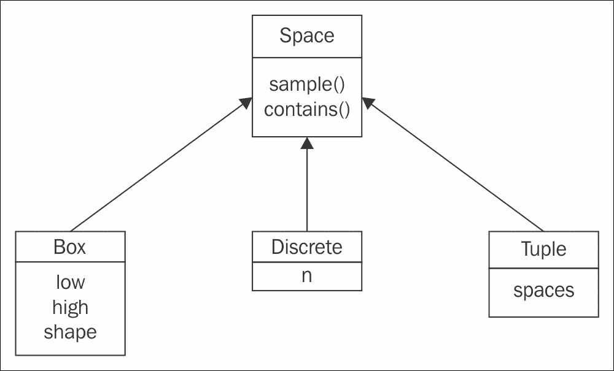
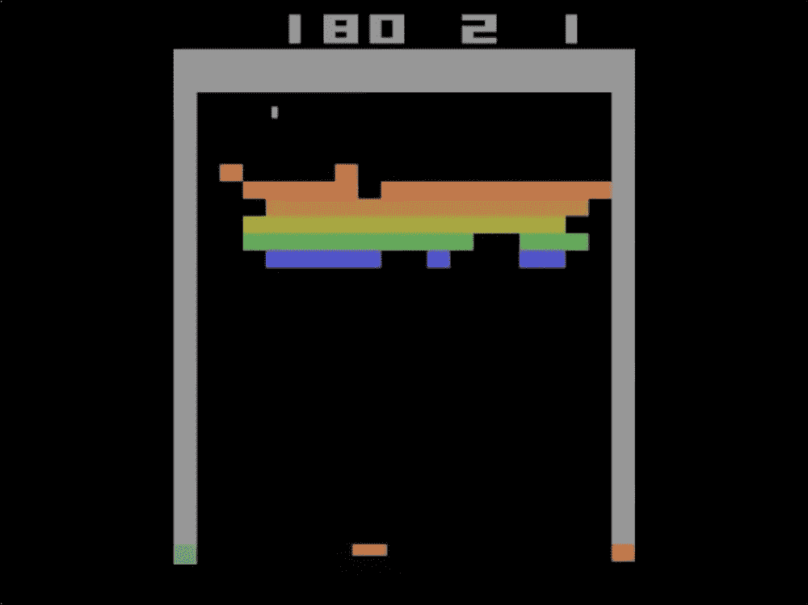
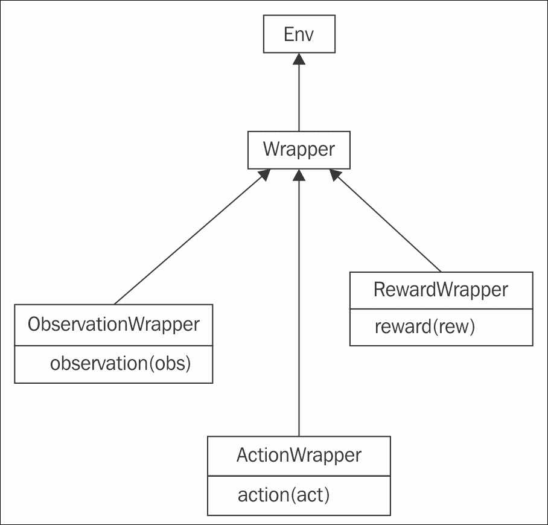
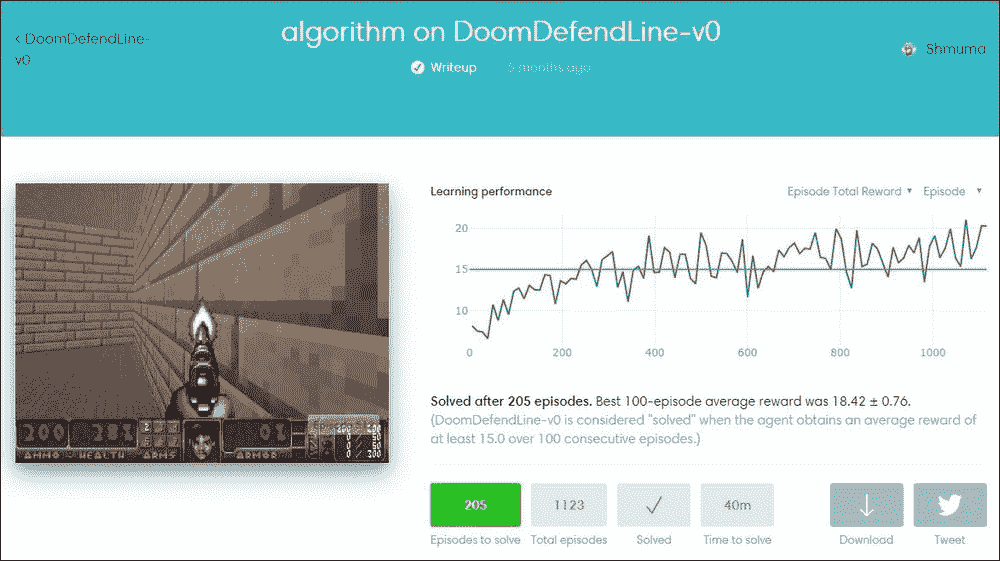

# 二、OpenGym

说了这么多 **RL** 的理论概念，我们开始做点实际的吧。在这一章中，我们将学习 OpenAI Gym API 的基础知识，并编写我们的第一个随机行为代理，以使我们熟悉所有的概念。


# 代理人的解剖

正如我们在前一章看到的，RL 的世界观中有几个实体:

*   **代理人**:起积极作用的人或事物。实际上，它是一些代码，实现了一些**策略**。基本上，根据我们的观察，这个策略必须决定在每个时间步需要什么行动。
*   **环境**:世界的某个模型，它在代理的外部，有责任给我们提供观察，给我们奖励。它会根据我们的动作改变状态。

让我们在一个简单的情况下展示如何用 Python 实现这两者。我们将定义一个环境，不管代理的行为如何，在有限的步数内给代理随机奖励。这个场景不是很有用，但是可以让我们关注环境和代理类中的特定方法。先说环境:

```py
class Environment:
    def __init__(self):
        self.steps_left = 10
```

在前面的代码中，我们允许环境初始化其内部状态。在我们的例子中，状态只是一个计数器，它限制了允许代理与环境交互的时间步数:

```py
    def get_observation(self):
        return [0.0, 0.0, 0.0]
```

`get_observation()`方法应该将当前环境的观察结果返回给代理。它通常被实现为环境内部状态的某个函数。在我们的例子中，观察向量总是零，因为环境基本上没有内部状态:

```py
    def get_actions(self):
        return [0, 1]
```

`get_actions()`方法允许代理查询它可以执行的动作集。通常情况下，代理可以执行的动作集不会随着时间的推移而改变，但有些动作在不同的状态下可能会变得不可能(例如，在 TicTacToe 游戏的任何位置，不是每个移动都是可能的)。在我们这个简单的例子中，代理只能执行两个动作，用整数 0 和 1 编码:

```py
    def is_done(self):
        return self.steps_left == 0
```

前面的方法向代理发出剧集结束的信号。正如我们在[第一章](part0012_split_000.html#BE6O2-ce551566b6304db290b61e4d70de52ee "Chapter 1. What is Reinforcement Learning?")、*中看到的，什么是强化学习？*、一系列环境——代理交互被分成称为情节的一系列步骤。情节可以是有限的，就像在一场国际象棋比赛中一样，也可以是无限的，就像旅行者 2 号任务(这是一个 40 多年前发射的著名太空探测器，已经超越了我们的太阳系)。为了涵盖这两种情况，环境为我们提供了一种方法来检测一集何时结束，并且再也没有办法与之交流:

```py
    def action(self, action):
        if self.is_done():
            raise Exception("Game is over")
        self.steps_left -= 1
        return random.random()
```

方法是环境功能的核心部分。它做两件事:处理代理的动作并返回这个动作的报酬。在我们的例子中，奖励是随机的，其行为被丢弃。此外，我们更新步数，并拒绝继续已经结束的剧集。

现在来看代理部分，它要简单得多，只包含两个方法:构造函数和在环境中执行一个步骤的方法:

```py
class Agent:
    def __init__(self):
        self.total_reward = 0.0
```

在构造函数中，我们初始化了一个计数器，它将保存代理在剧集中累积的总奖励:

```py
    def step(self, env):
        current_obs = env.get_observation()
        actions = env.get_actions()
        reward = env.action(random.choice(actions))
        self.total_reward += reward
```

step 函数接受环境实例作为参数，并允许代理执行以下操作:

*   观察环境
*   根据观察结果决定要采取的行动
*   将行动提交给环境
*   获得当前步骤的奖励

对于我们的例子，代理是迟钝的，并且忽略了在决策过程中获得的关于采取哪种行动的观察结果。相反，每个动作都是随机选择的。最后一部分是粘合代码，它创建两个类并运行一集:

```py
if __name__ == "__main__":
    env = Environment()
    agent = Agent()

    while not env.is_done():
        agent.step(env)

    print("Total reward got: %.4f" % agent.total_reward)
```

您可以在本书的 Git 资源库中的`Chapter02/01_agent_anatomy.py`目录下的[https://github . com/packt publishing/Deep-Reinforcement-Learning-Hands-On](https://github.com/PacktPublishing/Deep-Reinforcement-Learning-Hands-On)中找到上述代码。它没有外部依赖性，应该可以与任何或多或少现代的 Python 版本一起工作。通过运行几次，您将获得代理收集的不同金额的奖励。

前面代码的简单性使我们能够说明来自 RL 模型的重要基本概念。环境可以是一个极其复杂的物理模型，代理可以很容易地是一个实现最新 RL 算法的大型神经网络，但基本模式保持不变:在每一步，代理从环境中获取一些观察结果，进行计算，并选择要发布的动作。这一行动的结果是一种奖励和新的观察。

你可能会想，如果模式是一样的，为什么我们需要从头开始写呢？也许它已经被某人实现了，并且可以被用作一个库？当然，这样的框架是存在的，但是在我们花一些时间讨论它们之前，让我们准备一下您的开发环境。


# 硬件和软件要求

本书中的例子是使用 Python 版本实现和测试的。我假设你已经熟悉这种语言和虚拟环境等常见概念，所以我不会详细介绍如何安装包以及如何以独立的方式完成。我们将在本书中使用的外部库是开源软件，包括以下内容:

*   **NumPy** :这是一个用于科学计算和实现矩阵运算和常用函数的库。
*   **OpenCV Python 绑定**:这是一个计算机视觉库，提供了很多图像处理的函数。
*   **Gym** :这是一个由 OpenAI 开发和维护的 RL 框架，具有各种可以通信的环境，以统一的方式。
*   **PyTorch** :这是一个灵活且富有表现力的**深度学习** ( **DL** )库。下一章将给出一个简短的基本速成课程。
*   https://github.com/Shmuma/ptan):这是作者创建的一个对 Gym 的开源扩展，支持现代深度 RL 方法和构建块。所有用到的类都会和源代码一起详细描述。

这本书的很大一部分(第二、三和四部分)集中在过去几年发展起来的现代深层 RL 方法上。这个上下文中的“深度”一词意味着深度学习被大量使用，你可能意识到 DL 方法是计算密集型的。一个现代的 GPU 甚至可以比最快的多 GPU 系统快 10 到 100 倍。在实践中，这意味着在使用 GPU 的系统上花费一个小时训练的相同代码，即使在最快的 CPU 系统上也可能花费半天到一周的时间。这并不意味着您不能在没有 GPU 的情况下尝试本书中的示例，但这将需要更长的时间。要自己试验代码(这是学习任何东西最有用的方法)，最好是使用带有 GPU 的机器。这可以通过多种方式实现:

*   购买适合 CUDA 的现代 GPU
*   使用云实例:亚马逊 AWS 和谷歌云都可以为你提供 GPU 驱动的实例

关于如何设置系统的说明超出了本书的范围，但是网上有大量的手册。在 OS 方面，你应该使用 Linux 或 macOS，因为 PyTorch 和 Gym 的大部分环境都不支持 Windows(至少在编写本文时)。

为了给你我们将在整本书中使用的外部依赖的准确版本，这里是`pip freeze`命令的输出(它可能对本书中示例的潜在故障排除有用，因为开源软件和 DL 工具包发展非常快):

```py
numpy==1.14.2
atari-py==0.1.1
gym==0.10.4
ptan==0.3
opencv-python==3.4.0.12
scipy==1.0.1
torch==0.4.0
torchvision==0.2.1
tensorboard-pytorch==0.7.1
tensorflow==1.7.0
tensorboard==1.7.0

```

书中所有的例子都是用 PyTorch 0.4 编写和测试的，可以用`pip install pytorch==0.4.0`命令安装。

现在，让我们来看看 OpenAI Gym API 的细节，它并不复杂，但为我们提供了大量的环境，从琐碎到具有挑战性的环境。


# OpenAI Gym API

名为`Gym`的 Python 库由开发，并由 open ai([www.openai.com](http://www.openai.com))维护。Gym 的主要目标是使用统一的界面为 RL 实验提供丰富的环境集合。所以，库里面的中心类是一个环境也就不足为奇了，这个环境叫做`Env`。它公开了几个方法和字段，这些方法和字段提供了有关环境功能的必需信息。从高层次来看，每个环境都为您提供了这些信息和功能:

*   允许在环境中执行的一组操作。Gym 支持离散动作和连续动作，以及它们的组合。
*   环境为代理提供的观察的形状和边界。
*   一个叫做`step`的方法来执行一个动作，这个动作会返回当前的观察、奖励和剧集结束的指示。
*   一种叫`reset`的方法，把环境恢复到初始状态，获得第一次观测。

让我们详细讨论一下环境的那些组件。


## 动作空间

您可能还记得，代理可以执行的动作可以是离散的、连续的，或者是两者的组合。离散动作是代理可以做的一组固定的事情，例如，网格中的方向，如左、右、上或下。另一个例子是按钮，它可以被按下或释放。这两种状态是互斥的，因为离散动作空间的主要特征是动作空间中只有一个动作是可能的。

一个连续的动作有一个附加的值，例如，一个可以转到特定角度的方向盘，或者一个可以用不同力度踩下的油门踏板。对连续动作的描述包括动作可能具有的值的边界。在方向盘的情况下，它可以从 720 度到 720 度。对于油门踏板，通常是从 0 到 1。

当然，我们并不局限于执行单个动作，环境可能有多个动作，例如同时按下多个按钮或方向盘并踩下两个踏板(刹车和油门)。为了支持这种情况，Gym 定义了一个特殊的容器类，允许将几个动作空间嵌套到一个统一的动作中。


## 观察空间

除了奖励之外，观察是环境在每个时间戳上提供给代理的信息。观察结果可以简单到一串数字，也可以复杂到包含来自几个相机的彩色图像的几个多维张量。观察甚至可以是离散的，很像动作空间。这种离散观察空间的一个例子可以是灯泡，它可以有两种状态:开或关，作为一个布尔值给我们。

所以，你可以看到行动和观察之间的相似性，以及它们是如何在体操课上表现出来的。让我们看一个类图:



图 Gym 中`Space`类的层次结构

基本抽象类`Space`包括两个与我们相关的方法:

*   `sample()`:这将从空间中返回一个随机样本
*   `contains(x)`:检查参数`x`是否属于空间的域

这两个方法都是抽象的，并在子类`Space`class’中重新实现:

*   `Discrete`类表示一组互斥的项目，编号从 0 到 n1。它唯一的字段 *n* 是它描述的项目的计数。例如，`Discrete(n=4)`可用于四个方向的动作空间移动【左、右、上、下】。
*   `Box`类表示区间为[低，高]的有理数的 n 维张量。例如，在 0.0 和 1.0 之间有一个单一值的油门踏板可以用`Box(low=0.0, high=1.0, shape=(1,), dtype=np.float32)`来编码(`shape`参数被分配了一个长度为`1`的元组和一个单一值的`1`，这给了我们一个单一值的一维张量)。`dtype`参数指定了空间的值类型，这里我们将其指定为 NumPy `32-bit float`。`Box`的另一个例子可能是 Atari 屏幕观察(我们稍后会看到很多 Atari 环境)，这是一个大小为 210 × 160 的 RGB 图像:`Box(low=0, high=255, shape=(210, 160, 3), dtype=np.uint8)`。在这种情况下，`shape`参数是一个由三个元素组成的元组:第一维是图像的高度，第二维是宽度，第三维等于`3`，它们分别对应于红、绿、蓝三个颜色平面。所以，总的来说，每个观测值是一个 100，800 字节的 3D 张量。
*   这里我们要提到的`Space`的最后一个孩子是一个`Tuple`类，它允许我们将几个`Space`类实例组合在一起。这使我们能够创造我们想要的任何复杂的行动和观察空间。例如，假设我们想要为一辆汽车创建一个动作空间规范。这辆车有几个控制装置，可以在每个时间戳改变，包括方向盘角度、刹车踏板位置和油门踏板位置。这三个控件可以由单个`Box`实例中的三个浮点值指定。除了这些基本的控制，汽车还有额外的分立控制，如转向灯(可能是“关”、“右”、“左”)、喇叭(“开”或“关”)等。要将所有这些组合成一个动作空间规范类，我们可以创建`Tuple(spaces=(Box(low=-1.0, high=1.0, shape=(3,), dtype=np.float32), Discrete(n=3), Discrete(n=2)))`。这种灵活性很少使用，例如，在本书中我们将只看到`Box`和`Discrete`动作和观察空间，但是`Tuple`类在某些情况下可能是有用的。

在 Gym 中还定义了其他的`Space`子类，但是前面的三个是我们将要处理的最有用的。所有子类都实现了`sample()`和`contains()`方法。`sample()`功能执行与`Space`类别和参数相对应的随机抽样。当我们需要选择随机动作时，这对于动作空间非常有用。`contains()`方法验证给定的参数符合`Space`参数，它在 Gym 的内部用于检查代理的行为是否正常。例如，`Discrete.sample()`从一个离散范围中返回一个随机元素，而 `Box.sample()`将是一个在给定范围内具有适当维数和值的随机张量。

每个环境都有两个类型为`Space`的成员，称为`action_space`和`observation_space`。这允许您创建通用代码，它可以在任何环境下工作。当然，处理屏幕的像素不同于处理离散观察值(就像前一种情况一样，您可能希望使用卷积层或计算机视觉工具箱中的其他方法来预处理图像)；所以，大多数时候，我们会针对特定的环境或一组环境优化我们的代码，但是 Gym 并不阻止你编写通用代码。


## 环境

环境在 Gym 中由`Env`类表示，该类有以下成员:

*   `action_space`:这是`Space`类的字段，为环境中允许的动作提供规范。
*   `observation_space`:该字段具有相同的`Space`类，但指定了环境提供的观测值。
*   `reset()`:将环境重置为初始状态，返回初始观察向量
*   `step()`:该方法允许代理给出动作，并返回关于动作结果的信息:下一次观察、本地奖励和剧集结束标志。这个方法有点复杂，我们将在本节的后面详细讨论。

在`Env`类中有额外的实用方法，比如`render()`，它允许你以一种人类友好的形式获得观察结果，但是我们不会使用它们。您可以在 Gym 的文档中找到完整的列表，但是现在让我们关注核心的`Env`方法:`reset()`和`step()`。

到目前为止，我们已经看到了我们的代码如何获得关于环境的动作和观察的信息，所以现在是时候熟悉动作本身了。与环境的通信通过`Env`类的两种方法来执行:`step`和`reset`。

由于重置简单得多，我们将从它开始。`reset()`方法没有参数，它指示一个环境重置到它的初始状态并获得初始观察。注意，在创建环境之后，您必须调用`reset()`。你可能还记得[第一章](part0012_split_000.html#BE6O2-ce551566b6304db290b61e4d70de52ee "Chapter 1. What is Reinforcement Learning?")，*什么是强化学习？*，代理与环境的通信可能会结束(就像“游戏结束”屏幕)。这样的会话称为**集**，一集结束后，代理需要重新开始。此方法返回的值是对环境的第一次观察。

`step()`方法是环境功能的核心，它在一个调用中完成几件事情，如下所示:

1.  告诉环境我们将在下一步执行哪个操作
2.  在这一行动之后，从环境中获得新的观察
3.  获得代理通过此步骤获得的奖励
4.  得到插曲结束的指示

第一项(action)作为唯一的参数传递给这个方法，其余的由 function 返回。确切地说，它是一个由四个元素(观察、奖励、完成和 extra_info)组成的元组(Python tuple，不是我们在上一节讨论的`Tuple`类)。它们有以下类型和含义:

*   **观测**:这是一个有观测数据的 NumPy 向量或矩阵。
*   **奖励**:这是奖励的浮点值。
*   **done** :这是一个布尔指示器，剧集结束时为`True`。
*   extra_info :这可以是任何特定于环境的内容，带有关于环境的额外信息。通常的做法是在一般 RL 方法中忽略该值(不考虑特定环境的具体细节)。

因此，您可能已经了解了代理代码中的环境用法:在一个循环中，调用`step()`方法并执行一个动作，直到该方法的`done`标志变为`True`。然后我们可以调用`reset()`重新开始。这里只缺少一部分:首先我们如何创建`Env`对象。


## 环境的创造

每个环境都有一个唯一的`EnvironmentName-vN`形式的名称，其中`N`是用于区分同一环境的不同版本的编号(例如，当某个环境中的一些 bug 得到修复或者执行了一些其他重大更改时)。为了创建环境，`Gym`包为`make(env_name)`函数提供了字符串形式的环境名称的唯一参数。

在撰写本文时，Gym 版本 0.9.3 包含了 777 个不同名称的环境。当然，所有这些都不是唯一的环境，因为该列表包括环境的所有版本。此外，相同的环境在设置和观察空间中可以有不同的变化。例如，Atari 游戏 Breakout 有以下环境名称:

*   **突破-v0** 、**突破-v4** :球的初始位置和方向随机的原始突破
*   **突破极限-v0** ，**突破极限-v4** :以相同的球的初始位置和速度向量突破
*   **BreakoutNoFrameskip-v0** ， **BreakoutNoFrameskip-v4** :向代理显示每一帧的 Breakout
*   **Breakout-ram-v0** ， **Breakout-ram-v4** :观察完整 Atari 仿真内存(128 字节)而非屏幕像素的 Breakout。
*   突破-斜坡确定性-v0，突破-斜坡确定性-v4
*   突破-ramNoFrameskip-v0，突破-ramNoFrameskip-v4

总的来说，有 12 个良好的旧突破的环境。如果你以前从未见过它，这里是它的游戏截图:



图 2:突围的玩法

即使在删除了这样的重复之后，Gym 0.9.3 还是提供了一个令人印象深刻的 116 个独特环境的列表，这些环境可以分为几个组:

*   **经典控制问题**:这些是玩具任务，在最优控制理论和 RL 论文中用作基准或演示。它们通常很简单，具有低维的观察和操作空间，但在实现算法时，它们作为快速检查是有用的。把它们想象成“RL 的 MNIST”(如果你没听说过 MNIST，这是来自 *Yann LeCun* 的手写数字识别数据集)。
*   雅达利 2600 :这些游戏来自 20 世纪 70 年代的经典游戏平台。有 63 个独特的游戏。
*   **算法**:这些是旨在执行小计算任务的问题，比如复制观察到的序列或者数字相加。
*   **桌游**:这些是围棋和 Hex 的游戏。
*   **Box2D** :这些是使用 Box2D 物理模拟器学习行走或汽车控制的环境。
*   这是另一个物理模拟器，用于几个连续控制问题。
*   **参数调整**:这是用于优化神经网络参数的 RL。
*   这些是简单的网格世界文本环境。
*   PyGame :这是几个使用 PyGame 引擎实现的环境。
*   这是在 ViZdoom 上实现的九个小游戏。

完整的环境列表可以在[https://gym.openai.com/envs](https://gym.openai.com/envs)或者该项目的 GitHub 仓库的 wiki 页面上找到。OpenAI Universe 中有一个更大的环境集，它提供了虚拟机的通用连接器，同时运行 Flash 和原生游戏、web 浏览器和其他现实世界的应用程序。OpenAI Universe 扩展了 Gym API，但是遵循相同的设计原则和范例。你可以到 https://github.com/openai/universe 去看看。

理论化已经足够了，现在让我们看一个使用 Gym 环境的 Python 会话。


## 钢管舞训练

```py
$ python
Python 3.6.5 |Anaconda, Inc.| (default, Mar 29 2018, 18:21:58)
[GCC 7.2.0] on linux
Type "help", "copyright", "credits" or "license" for more information.
>>> import gym
>>> e = gym.make('CartPole-v0')
WARN: gym.spaces.Box autodetected dtype as <class 'numpy.float32'>. Please provide explicit dtype.
```

这里我们将导入包`Gym`并创建一个名为`CartPole`的环境。该环境来自“经典控制”组，其要点是用底部连接的操纵杆控制平台(见下图)。棘手的是，这根棍子往往会向右或向左落下，你需要通过每一步向右或向左移动平台来平衡它。我们看到的警告信息不是我们的错，而是 Gym 内部的一个小的不一致，不影响结果。


图 3:横竿环境

对这个环境的观察是四个浮点数，包含关于操纵杆质心的 *x* 坐标、其速度、其与平台的角度以及其角速度的信息。当然，通过应用一些数学和物理知识，当我们需要平衡操纵杆时，将这些数字转换成动作并不复杂，但我们的问题要棘手得多:在不知道观察到的数字的确切含义，只通过获得奖励的情况下，我们如何学习平衡这个系统**？在这种环境下，每个时间步长的回报是 1。插曲继续，直到棍子落下；所以为了获得更多的累积奖励，我们需要以避免棍子掉落的方式来平衡平台。**

这个问题看起来很难，但在短短的两章中，我们将编写算法，在几分钟内轻松解决这个问题，而不需要知道观察到的数字意味着什么。我们将只通过试错法和一点 RL 魔法来完成它。

不过，让我们继续玩我们的游戏:

这里我们重置环境并获得第一个观察结果(我们总是需要重置新创建的环境)。正如我刚才所说的，观察值是四个数字，所以让我们检查一下如何提前知道这一点:

```py
>>> obs = e.reset()
>>> obs
array([-0.04937814, -0.0266909 , -0.03681807, -0.00468688])
```

`action_space`字段是`Discrete`类型的，所以我们的动作只是 0 或 1，其中 0 表示将平台推到左边，1 表示推到右边。观察空间是`Box(4,)`的，这意味着大小为 4 的向量，其值在`[−inf, inf]`区间内:

```py
>>> e.action_space
Discrete(2)
>>> e.observation_space
Box(4,)
```

在这里，我们通过执行动作`0`将我们的平台推到左边，并得到四个元素的元组:

```py
>>> e.step(0)
(array([-0.04991196, -0.22126602, -0.03691181,  0.27615592]), 1.0, False, {})
```

一个新的观察是一个新的四个数字的向量

*   `1.0`的奖励
*   `done flag = False`，这意味着这一集还没有结束，我们或多或少还好
*   关于环境的额外信息是一个空字典

    ```py
    >>> e.action_space.sample() 0 >>> e.action_space.sample() 1 >>> e.observation_space.sample() array([  2.06581792e+00,   6.99371255e+37,   3.76012475e-02,         -5.19578481e+37]) >>> e.observation_space.sample() array([4.6860966e-01, 1.4645028e+38, 8.6090848e-02, 3.0545910e+37],       dtype=float32)
    ```

*   这里我们在`action_space`和`observation_space`上使用了`Space`类的`sample()`方法。这个方法从底层空间返回一个随机样本，在我们的`Discrete`动作空间中，这意味着一个 0 或 1 的随机数，对于观察空间，这是一个 4 个数字的随机向量。观察空间的随机样本可能看起来没有用，这是真的，但是当我们不确定如何执行一个动作时，可以使用来自动作空间的样本。这个特性对我们来说特别方便，因为我们还不知道任何 RL 方法，但仍然想在 Gym 环境中玩玩。现在我们已经知道了足够的知识来实现我们的第一个 CartPole 随机行为代理，所以让我们开始吧。

随机挑杆剂


# 尽管这个环境比我们在*代理的剖析*一节中的第一个例子要复杂得多，但是代理的代码要短得多。这就是可重用性、抽象和第三方库的力量！

所以，下面是代码(你可以在`Chapter02/02_cartpole_random.py`里找到):

在这里，我们创建环境并初始化步骤计数器和奖励累加器。在最后一行，我们重置环境以获得第一个观察结果(我们不会使用它，因为我们的代理是随机的):

```py
import gym

if __name__ == "__main__":
    env = gym.make("CartPole-v0")
    total_reward = 0.0
    total_steps = 0
    obs = env.reset()
```

在这个循环中，我们对一个随机动作进行采样，然后要求环境执行它，并向我们返回下一个观察结果(`obs`)、`reward`和`done`标志。如果这一集结束了，我们就停止循环，显示我们完成了多少步，累积了多少奖励。如果您开始这个示例，您将看到类似这样的内容(由于代理的随机性，不完全是这样):

```py
   while True:
        action = env.action_space.sample()
        obs, reward, done, _ = env.step(action)
        total_reward += reward
        total_steps += 1
        if done:
            break

   print("Episode done in %d steps, total reward %.2f" % (total_steps, total_reward))
```

与交互式会话一样，警告与我们的代码无关，而是与 Gym 的内部有关。平均来说，我们的随机代理人在杆子倒下之前走了 12-15 步，这一集就结束了。Gym 中的大多数环境都有一个“奖励边界”，即代理在连续 100 集“解决”环境期间应该获得的平均奖励。对于拉杆来说，这个界限是 195，这意味着平均来说，代理人必须在 195 步或更长的时间内握杆。从这个角度来看，我们的随机代理的性能看起来很差。然而，不要太早失望，因为我们才刚刚开始，很快我们就会解决 CartPole 和其他许多有趣和具有挑战性的环境。

```py
rl_book_samples/Chapter02$ python 02_cartpole_random.py
WARN: gym.spaces.Box autodetected dtype as <class 'numpy.float32'>. Please provide explicit dtype.
Episode done in 12 steps, total reward 12.00
```

Gym 的额外功能——包装器和监控器


# 到目前为止，我们讨论的内容涵盖了 Gym 核心 API 的三分之二，以及开始编写代理所需的基本功能。剩下的 API 你可以不用，但它会让你的生活更轻松，代码更干净。那么，让我们来快速浏览一下 API 的其余部分。

糖纸


## 通常，你会希望以某种通用的方式扩展环境的功能。例如，一个环境给了你一些观察结果，但是你想把它们累积在某个缓冲区中，并把最后的 *N* 个观察结果提供给代理，这是动态计算机游戏的一个常见场景，当一个单独的帧不足以获得关于游戏状态的完整信息时。另一个例子是，当你希望能够裁剪或预处理图像的像素，使其更便于代理消化，或者如果你想以某种方式正常化奖励分数。有许多这样的情况具有相同的结构:您想要“包装”现有的环境，并添加一些额外的逻辑来做一些事情。Gym 为这些情况提供了一个方便的框架，叫做`Wrapper`类。类结构如下图所示。

`Wrapper`类继承了`Env`类。它的构造函数接受唯一的参数:要“包装”的`Env`类的实例为了增加额外的功能，你需要重新定义你想要扩展的方法，比如`step()`或者`reset()`。唯一的要求是调用超类的原始方法。

图 Gym 中`Wrapper`类的层次结构



Figure 4: The hierarchy of `Wrapper` classes in Gym

为了处理更具体的需求，比如一个`Wrapper`类想要只处理来自环境的观察或者只处理动作，有一些`Wrapper`的子类允许只过滤特定部分的信息。

它们如下:

`ObservationWrapper`:您需要重新定义父的`observation(obs)`方法。`obs`参数是来自包装环境的观察，这个方法应该返回将提供给代理的观察。

*   `RewardWrapper`:这公开了`reward(rew)`方法，该方法可以修改给予代理的奖励值。
*   `ActionWrapper`:您需要覆盖`action(act)`方法，该方法可以将传递给包装环境的动作调整到代理。
*   为了更实际一点，让我们想象这样一种情况，我们想要干预代理发送的动作流，并以 10%的概率用一个随机动作替换当前动作。这看起来似乎是一件不明智的事情，但是这个简单的技巧是解决我在第 1 章、*什么是强化学习中简单提到的“探索/利用问题”的最实用和最有效的方法之一。*。通过发布随机动作，我们让我们的代理探索环境，并不时地偏离其策略的既定路线。这很容易做到，使用`ActionWrapper`类(完整示例，`Chapter02/03_random_action_wrapper.py`)。

在这里，我们通过调用父类的`__init__`方法并保存 epsilon(随机动作的概率)来初始化我们的包装器:

```py
import gym
import random
class RandomActionWrapper(gym.ActionWrapper):
    def __init__(self, env, epsilon=0.1):
        super(RandomActionWrapper, self).__init__(env)
        self.epsilon = epsilon
```

这是一个我们需要从父类中覆盖的方法，以调整代理的动作。每次我们掷骰子，以ε的概率，我们从动作空间中随机抽取一个动作，并返回它，而不是代理发送给我们的动作。请注意，使用`action_space`和包装抽象，我们能够编写抽象代码，它将与 Gym 的任何环境一起工作。此外，我们在每次替换动作时都打印消息，只是为了验证我们的包装器在工作。当然，在生产代码中，这是不必要的:

```py
    def action(self, action):
        if random.random() < self.epsilon:
            print("Random!")
            return self.env.action_space.sample()
        return action
```

现在是时候应用我们的包装器了。我们将创建一个普通的 CartPole 环境，并将其传递给我们的包装构造函数。从现在开始，我们使用我们的包装器作为一个普通的`Env`实例，而不是原来的 CartPole。由于`Wrapper`类继承了`Env`类并公开了相同的接口，所以我们可以按照我们想要的任何组合来嵌套包装器。这是一个强大、优雅、通用的解决方案:

```py
if __name__ == "__main__":
    env = RandomActionWrapper(gym.make("CartPole-v0"))
```

下面是几乎相同的代码，除了每次我们发出相同的动作:0。我们的代理人很迟钝，总是做同样的事情。通过运行代码，您应该看到包装器确实在工作:

```py
    obs = env.reset()
    total_reward = 0.0

    while True:
        obs, reward, done, _ = env.step(0)
        total_reward += reward
        if done:
            break

    print("Reward got: %.2f" % total_reward)
```

如果你愿意，你可以在包装器的创建上玩 epsilon 参数，并验证随机性提高了代理的平均得分。我们应该继续前进，看看藏在体育馆里的另一个有趣的宝石:`Monitor`。

```py
rl_book_samples/Chapter02$ python 03_random_actionwrapper.py
WARN: gym.spaces.Box autodetected dtype as <class 'numpy.float32'>. Please provide explicit dtype.
Random!
Random!
Random!
Random!
Reward got: 12.00
```

监视器


## 你应该知道的另一个类是`Monitor`。它的实现方式类似于`Wrapper`，可以将有关您的代理的表现的信息写入一个文件中，并可以选择录制您的代理在动作中的视频。前一段时间，可以将`Monitor`班的录制结果上传到[https://gym.openai.com](https://gym.openai.com)网站，并在与其他人的结果对比中看到你的代理人的位置(见以下截图)，但不幸的是，在 2017 年 8 月底，OpenAI 决定关闭这一上传功能，并冻结所有结果。有几个活动来实现一个替代原始网站，但他们还没有准备好。我希望这种情况会很快得到解决，但在撰写本文时，不可能将您的结果与其他人的结果进行对比。

为了让你对 Gym 的网页界面有个概念，这里是 CartPole 环境排行榜:

图 5: OpenAI Gym web 界面与 CartPole 提交


Figure 5: OpenAI Gym web interface with CartPole submissions

网络界面上的每个提交都有关于训练动态的细节。例如，以下是作者对 Doom 的一款迷你游戏的解决方案:

图 DoomDefendLine 环境中的提交动态



Figure 6: Submission dynamics on the DoomDefendLine environment

尽管如此，`Monitor`仍然是有用的，因为你可以看看你的代理在环境中的生活。所以，下面是我们如何将`Monitor`添加到我们的随机 CartPole 代理，这是唯一的区别(整个代码在`Chapter02/04_cartpole_random_monitor.py`):

我们传递给`Monitor`的第二个参数是它将结果写入的目录的名称。这个目录不应该存在，否则你的程序会因异常而失败(为了克服这个问题，你可以删除现有的目录或者将`force=True`参数传递给`Monitor`类的构造函数)。

```py
if __name__ == "__main__":
    env = gym.make("CartPole-v0")
    env = gym.wrappers.Monitor(env, "recording")
```

`Monitor`类要求系统上有`FFmpeg`实用程序，用于将捕获的观察结果转换成输出视频文件。该实用程序必须可用，否则`Monitor`将引发异常。安装`FFmpeg`最简单的方法是使用系统的软件包管理器，它是特定于操作系统发行版的。

要开始这个例子，应该满足这三个额外的先决条件之一:

该代码应该在带有 OpenGL 扩展(GLX)的 X11 会话中运行

*   代码应在`Xvfb`虚拟显示中启动
*   您可以在 ssh 连接中使用 X11 转发
*   造成这种情况的原因是视频录制，通过对环境绘制的窗口进行截图来完成。有些环境使用 OpenGL 来绘制其图片，因此需要使用 OpenGL 的图形模式。对于云中的虚拟机来说，这可能是一个问题，因为它实际上没有运行监视器和图形界面。为了克服这一点，有一个特殊的“虚拟”图形显示，称为 **Xvfb** ( **X11 虚拟帧缓冲区**)，它基本上在服务器上启动一个虚拟图形显示，并强制程序在其中进行绘制。这足以让`Monitor`愉快地创作出想要的视频。

要在`Xvbf`环境中启动你的程序，你需要把它安装在你的机器上(通常需要安装`xvfb`包)并运行特殊的脚本`xvfb-run`:

正如您从前面的日志中看到的，视频已经成功编写，因此您可以通过播放它来查看代理的一个部分。

```py
$ xvfb-run -s "-screen 0 640x480x24" python 04_cartpole_random_monitor.py
[2017-09-22 12:22:23,446] Making new env: CartPole-v0
[2017-09-22 12:22:23,451] Creating monitor directory recording
[2017-09-22 12:22:23,570] Starting new video recorder writing to recording/openaigym.video.0.31179.video000000.mp4
Episode done in 14 steps, total reward 14.00
[2017-09-22 12:22:26,290] Finished writing results. You can upload them to the scoreboard via gym.upload('recording')
```

记录代理动作的另一种方法是使用 ssh X11 转发，它使用 ssh 功能在 X11 客户机(Python 代码，它想要显示一些图形信息)和 X11 服务器(软件，它知道如何显示这些信息，并且可以访问您的物理显示器)之间建立 X11 通信。在 X11 架构中，客户端和服务器是分离的，可以在不同的机器上工作。要使用这种方法，您需要以下内容:

运行在本地机器上的 X11 服务器。Linux 自带 X11 服务器作为标准组件(所有桌面环境都使用 X11)。在 Windows 机器上，你可以设置第三方 X11 实现，比如开源的 VcXsrv(在[https://sourceforge.net/projects/vcxsrv/](https://sourceforge.net/projects/vcxsrv/)有售)。

1.  能够通过 ssh 登录到您的远程机器，传递`–X`命令行选项:`ssh –X servername`。这将启用 X11 隧道，并允许在此会话中启动的所有进程使用本地显示器进行图形输出。
2.  然后，您可以启动一个使用`Monitor`类的程序，它将显示代理的动作，将图像捕获到一个视频文件中。

摘要


# 恭喜你！你已经开始学习 RL 实用的一面了！在这一章中，我们安装了 OpenAI Gym 和大量的游戏环境，研究了它的基本 API 并创建了一个随机行为代理。您还了解了如何以模块化的方式扩展现有环境的功能，并熟悉了使用`Monitor`包装器记录代理活动的方法。

在下一章，我们将使用 PyTorch 做一个快速的 DL 回顾，py torch 是 DL 研究者最喜欢的库。敬请关注。

In the next chapter, we will do a quick DL recap using PyTorch, which is a favorite library among DL researchers. Stay tuned.