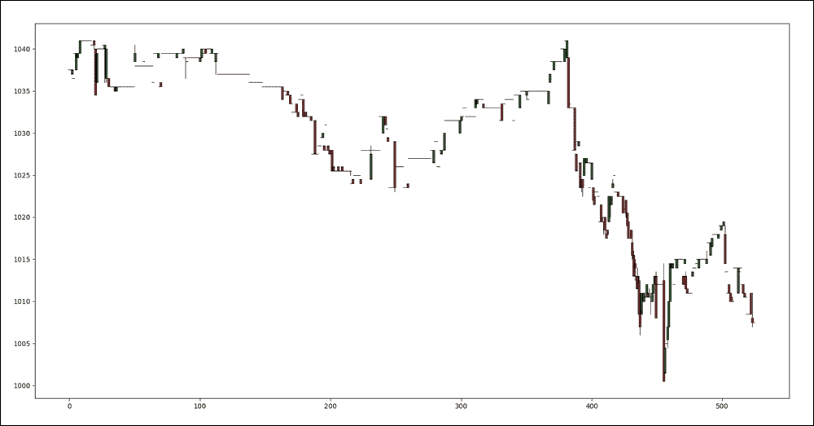
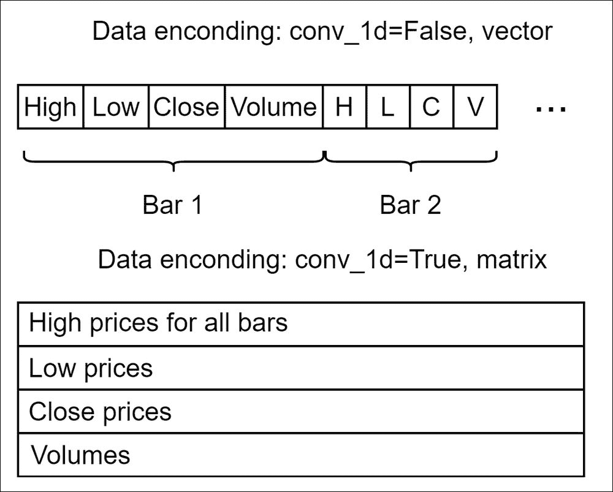
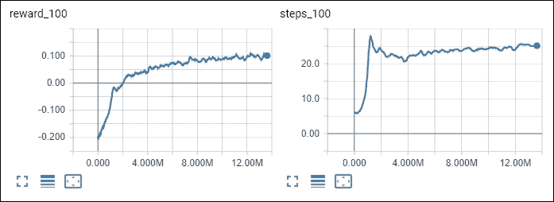
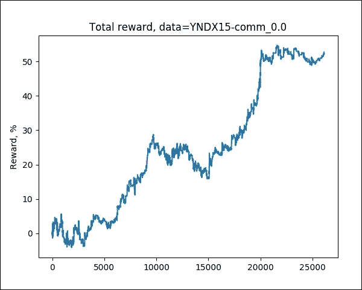
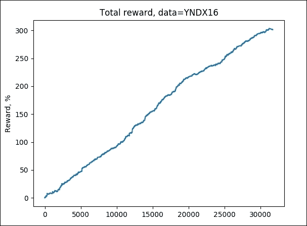
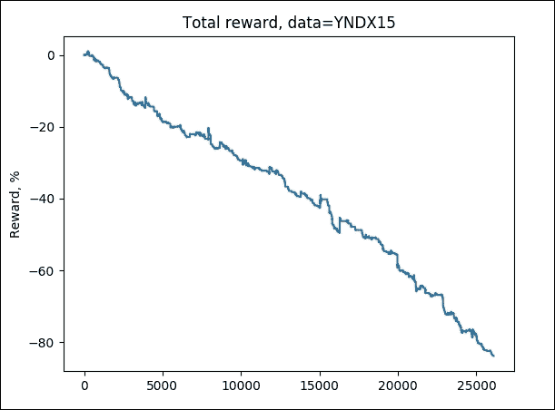
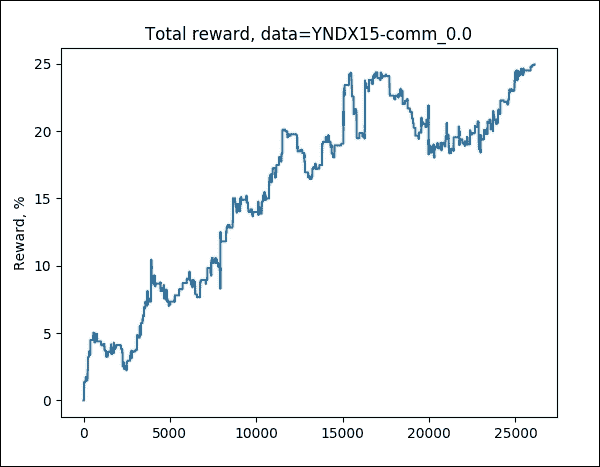

<title>Chapter 8. Stocks Trading Using RL</title>  

# 第八章。使用 RL 进行股票交易

在本章中，我们不是学习新的方法来解决玩具**强化学习** ( **RL** )问题，而是尝试利用我们**深厚的 Q-网络** ( **DQN** )知识来处理金融交易中更实际的问题。我不能保证代码会让你在股票市场或外汇市场上超级富有，因为目标远没有那么雄心勃勃:演示如何超越 Atari 游戏，并将 RL 应用到不同的实际领域。

在这一章中，我们将实现我们自己的 OpenAI Gym 环境，它模拟股票市场，并应用我们刚刚在[第 6 章](part0043_split_000.html#190861-ce551566b6304db290b61e4d70de52ee "Chapter 6. Deep Q-Networks")、*深度 Q-Networks、*和[第 7 章](part0048_split_000.html#1DOR02-ce551566b6304db290b61e4d70de52ee "Chapter 7. DQN Extensions")、 *DQN 扩展、*中学习的 DQN 方法来训练将交易股票以最大化利润的代理。

<title>Chapter 8. Stocks Trading Using RL</title>  

# 交易

每天都有大量的金融工具在市场上交易:商品、股票和货币。甚至天气预报也可以利用所谓的“天气衍生品”进行买卖，这只是现代世界和金融市场复杂性的结果。如果你的收入取决于未来的天气状况，比如一家种植农作物的企业，那么你可能想通过购买天气衍生品来对冲风险。所有这些不同的项目都有一个随时间变化的价格。交易是一种买卖金融工具的活动，其目标各不相同，比如获利(投资)、获得未来价格波动的保护(对冲)或只是获得你需要的东西(比如为你的生产购买钢铁或用美元兑换日元支付合同)。

自从第一个金融市场建立以来，人们一直试图预测未来的价格变动，因为这有很多好处，比如“无处获利”或保护资本免受突然的市场波动的影响。众所周知，这个问题很复杂，有很多金融顾问、投资基金、银行和个人交易者都在试图预测市场，寻找买卖的最佳时机，以实现利润最大化。

问题是:能不能从 RL 的角度看问题？我们对市场有一些观察，我们想做一个决定:买，卖，或等待。如果我们在价格上涨前买入，我们的利润将是正的，否则，我们将得到负的回报。我们试图做的是获得尽可能多的利润。市场交易和 RL 之间的联系非常明显。

<title>Data</title>  

# 数据

在我们的示例中，我们将使用 2015-2016 年期间的俄罗斯股票市场价格，该价格位于`Chapter08/data/ch08-small-quotes.tgz`中，必须在模型训练之前打开。

在存档中，我们有带 M1 棒线的 CSV 文件，这意味着 CSV 中的每一行都对应于时间中的一分钟，这一分钟内的价格运动由四个价格捕获:开盘价、盘高、盘低和收盘价。这里，开盘价是分钟开始时的价格，高是区间内的最高价，低是最低价，收盘价是分钟时间区间的最后一个价格。每一分钟的间隔被称为**棒线**和让我们对该间隔内的价格运动有一个概念。例如，在`YNDX_160101_161231.csv`文件中(这是 Yandex 公司 2016 年的股票)，我们有 13 万行这样的表格:

```
<DATE>,<TIME>,<OPEN>,<HIGH>,<LOW>,<CLOSE>,<VOL>
20160104,100100,1148.9000000,1148.9000000,1148.9000000,1148.9000000,0
20160104,100200,1148.9000000,1148.9000000,1148.9000000,1148.9000000,50
20160104,100300,1149.0000000,1149.0000000,1149.0000000,1149.0000000,33
20160104,100400,1149.0000000,1149.0000000,1149.0000000,1149.0000000,4
20160104,100500,1153.0000000,1153.0000000,1153.0000000,1153.0000000,0
20160104,100600,1156.9000000,1157.9000000,1153.0000000,1153.0000000,43
20160104,100700,1150.6000000,1150.6000000,1150.4000000,1150.4000000,5
20160104,100800,1150.2000000,1150.2000000,1150.2000000,1150.2000000,4
...
```

前两列是该分钟的日期和时间，接下来的四列是开盘价、盘高、盘低和收盘价，最后一个值代表该棒线期间执行的买卖订单量。这个数字的确切解释取决于股票和市场，但通常情况下，成交量可以让你了解市场的活跃程度。

代表这些价格的典型方式被称为 **蜡烛图**，其中每根棒线都显示为一根蜡烛。Yandex 2016 年 2 月某一天的部分行情如下图所示。存档中的每个文件都包含一年的 M1 数据，它将用于本章的示例中:



图 1:Yandex 2016 年 2 月价格数据

<title>Problem statements and key decisions</title>  

# 问题陈述和关键决策

金融领域既大又复杂，所以你可以很容易地花几年时间每天学习新的东西。在我们的例子中，我们将使用 RL 工具稍微触及一下表面，我们的问题将尽可能简单地公式化，使用价格作为观察值。我们将调查我们的代理人是否有可能知道最佳时间是何时买入一只股票，然后平仓以实现利润最大化。这个例子的目的是展示 RL 模型有多灵活，以及将 RL 应用到现实生活用例中通常需要采取的第一步。

正如你已经知道的，要制定 RL 问题需要三样东西:**对环境的观察**，可能的**行动，**和**奖励**系统。在前几章中，这三者都已经给了我们，而环境的内部机制是隐藏的。现在我们处于不同的情况，所以我们需要自己决定我们的代理将会看到什么，以及它可以采取什么样的行动。奖励系统也不是一套严格的规则，而是由我们的感觉和领域知识来指导，但我们在这里仍然有很大的灵活性。

在这种情况下，灵活性既是好的，也是坏的。我们可以自由地向代理传递一些我们认为对有效学习很重要的信息，这很好。例如，您不仅可以向交易代理传递价格，还可以传递关于新闻或要发布的重要统计数据的信息(众所周知，这些信息对金融市场有很大影响)。坏的一面是，这种灵活性通常意味着要找到一个好的代理，你需要尝试许多数据表示的变体，而且哪种更好并不总是显而易见的。在我们的例子中，我们将以最简单的形式实现基本的交易代理。观察将包括以下信息:

*   过去的棒线，每个棒线都有开盘价、最高价、最低价和收盘价
*   表明该股票是在一段时间之前购买的(一次只能购买一股股票)
*   我们当前头寸(买入的股票)的利润或亏损

在每分钟条之后的每一步，代理可以采取以下行动之一:

*   **什么都不做**:跳过该栏，不采取任何动作
*   **购买股票**:如果代理商已经拿到了股票，就什么也不买，否则我们就要支付佣金，佣金通常是现价的一小部分
*   **平仓**:如果我们没有先前买入的股票，什么也不会发生，否则我们将支付交易佣金

代理人收到的报酬可以用多种方式表达。一方面，在我们拥有股份期间，我们可以将奖励分成多个步骤。在这种情况下，每一步的回报将等于最后一根棒的移动。另一方面，代理人只有在**关闭**动作后才能获得奖励，并立即获得全额奖励。乍一看，这两种变体应该具有相同的最终结果，但是可能具有不同的收敛速度。然而，在实践中，差别可能是巨大的。我们将实现这两种变体，以便有机会比较它们。

最后一个要做的决定是如何在我们的环境观察中表示价格。理想情况下，我们希望我们的代理独立于实际价格值，并考虑相对运动，如“股票在最后一根棒线中上涨了 1%”或“股票下跌了 5%”这是有道理的，因为不同股票的价格可能不同，但它们可能有相似的运动模式。在金融领域，有一个叫做“技术分析”的分析分支，它研究这种模式来帮助从中做出预测。我们希望我们的系统能够发现它们(如果它们存在的话)。为此，我们将把每根棒线的“开盘价、盘高、盘低和收盘价”转换为三个数字，以开盘价的百分比表示高、低和收盘价。

这种表示有其自身的缺点，因为我们可能会丢失关于关键价格水平的信息。例如，众所周知，市场往往会从整数价格(如每比特币 8000 美元)和过去的转折点水平反弹。然而，如前所述，我们并没有在这里实现“华尔街黑仔”,而是在玩数据和检查概念。相对价格运动形式的表示将帮助系统找到价格水平中的重复模式(当然，如果它们存在的话)，而不管绝对价格位置。潜在的是，**神经网络** ( **NN** ) 可以自己学习这个(只是需要从绝对价格值中减去平均价格)，但是相对表示简化了 NN 的任务。

<title>The trading environment</title>  

# 交易环境

由于我们有许多应该与 OpenAI Gym 一起工作的代码，我们将按照 Gym 的`Env`类 API 实现交易功能，这应该是您所熟悉的。我们的环境是在`Chapter08/lib/environ.py` 模块的`StocksEnv` 类中实现的。它使用几个内部类来保持其状态并对观察结果进行编码。我们先来看看公共 API 类。

```
class Actions(enum.Enum):
    Skip = 0
    Buy = 1
    Close = 2
```

我们将所有可用的动作编码为枚举器的字段。我们支持一套非常简单的行动，只有三个选择:什么都不做，买一股，平仓。

```
class StocksEnv(gym.Env):
    metadata = {‘render.modes’: [‘human’]}
```

为了与`gym.Env`兼容，该元数据字段是必需的。我们不提供渲染功能，所以你可以忽略这一点。

```
    @classmethod
    def from_dir(cls, data_dir, **kwargs):
        prices = {file: data.load_relative(file) for file in data.price_files(data_dir)}
        return StocksEnv(prices, **kwargs)
```

我们的环境类提供了两种方法来创建它的实例。第一种方式是以数据目录为参数调用类方法`from_dir`。在这种情况下，它将从目录中的 CSV 文件加载所有报价并构建环境。为了处理表单中的价格数据，我们在`Chapter08/lib/data.py`中有几个助手函数。另一种方法是直接构造类实例。在这种情况下，您应该传递`prices`字典，它必须将引用标记映射到`data.Prices`元组。该对象有五个字段，包含 NumPy 数组格式的开盘、盘高、盘低、收盘和成交量时间序列。你可以使用`data.py`库函数来构造这样的对象，比如`data.load_relative`。

```
    def __init__(self, prices, bars_count=DEFAULT_BARS_COUNT,
                 commission=DEFAULT_COMMISSION_PERC, reset_on_close=True, state_1d=False,
                 random_ofs_on_reset=True, reward_on_close=False, volumes=False):
```

环境的构造器接受许多参数来调整环境的行为和观察表示:

*   `prices`:包含一个或多个工具的一个或多个股票价格作为`dict`，其中键是工具的名称，值是保存价格数据数组的容器对象`data.Prices`。
*   `bars_count`:我们在观察中经过的小节数。默认情况下，这是 10 小节。
*   `commission`:在买卖股票时，我们必须向经纪人支付的股票价格的百分比。默认是 0.1%。
*   `reset_on_close`:如果该参数设置为`True`，默认情况下，每次代理要求我们平仓(换句话说，卖出股票)，我们就停止该集。否则，该集将持续到我们的时间序列结束，这是一年的数据。
*   `conv_1d`:这个布尔参数在传递给代理的观察中的价格数据的不同表示之间切换。如果设置为`True`，观察具有 2D 形状，后续条形的不同价格组成按行组织。例如，最高价(棒线的最高价)放在第一行，最低价放在第二行，收盘价放在第三行。这种表示适用于对时间序列进行 1D 卷积，其中数据中的每一行都具有与雅达利 2D 图像中不同颜色平面(红色、绿色或蓝色)相同的含义。如果我们将此选项设置为`False`，我们将得到一个单独的数据数组，其中每个条形的组件都放在一起。这种组织便于全连接网络架构。这两种表示都如图 2 所示。
*   `random_ofs_on_reset`:如果参数为`True`(默认)，环境每次复位时，将选择时间序列中的随机偏移。否则，我们将从数据的开头开始。
*   `reward_on_close`:这个布尔参数在上面讨论的两个奖励方案之间切换。如果设置为`True`，代理将仅在“关闭”行动问题上获得奖励。否则，我们会给每个棒线一个小奖励，对应于该棒线期间的价格变动。
*   `volumes`:此参数打开观察中的卷，默认情况下禁用。



图 2:神经网络的不同数据表示

现在将继续查看环境构造函数:

```
        assert isinstance(prices, dict)
        self._prices = prices
        if state_1d:
            self._state = State1D(bars_count, commission, reset_on_close, reward_on_close=reward_on_close,
                                  volumes=volumes)
        else:
            self._state = State(bars_count, commission, reset_on_close, reward_on_close=reward_on_close,volumes=volumes)
        self.action_space = gym.spaces.Discrete(n=len(Actions))
        self.observation_space = gym.spaces.Box(low=-np.inf, high=np.inf, shape=self._state.shape, dtype=np.float32)
        self.random_ofs_on_reset = random_ofs_on_reset
        self._seed()
```

`StocksEnv`类的大部分功能在两个内部类中实现:`State`和`State1D`。他们负责观察准备和我们买入的股票状态和奖励。他们在观察中实现了我们的数据的不同表示，我们稍后将看一下他们的代码。在构造函数中，我们创建了 Gym 所需的状态对象、动作空间和观察空间字段。

```
    def reset(self):
        # make selection of the instrument and it’s offset. Then reset the state
        self._instrument = self.np_random.choice(list(self._prices.keys()))
        prices = self._prices[self._instrument]
        bars = self._state.bars_count
        if self.random_ofs_on_reset:
            offset = self.np_random.choice(prices.high.shape[0]-bars*10) + bars
        else:
            offset = bars
        self._state.reset(prices, offset)
        return self._state.encode()
```

这个方法为我们的环境定义了`reset()`功能。根据`gym.Env`语义，我们随机切换我们将要处理的时间序列，并在这个时间序列中选择起始偏移量。所选的价格和偏移量被传递给我们的内部状态实例，然后该实例使用其`encode()`函数请求进行初始观察。

```
    def step(self, action_idx):
        action = Actions(action_idx)
        reward, done = self._state.step(action)
        obs = self._state.encode()
        info = {“instrument”: self._instrument, “offset”: self._state._offset}
        return obs, reward, done, info
```

这个方法必须处理代理选择的动作，并返回下一个观察结果，`reward,`和`done`标志。所有真正的功能都是在我们的状态类中实现的，所以这个方法是对状态方法调用的一个非常简单的包装。

```
    def render(self, mode=’human’, close=False):
        pass

    def close(self):
        pass
```

`gym.Env`的 API 允许您定义`render()`方法处理程序，它应该以人类或机器可读的格式呈现当前状态。通常，这个方法应该用于查看环境状态的内部，并且对于调试或跟踪代理的行为非常有用。例如，市场环境可以将当前价格呈现为图表，以可视化代理在该时刻看到的内容。我们的环境不支持渲染，所以这个方法什么也不做。另一个方法是`close()`，它在环境被破坏时被调用来释放分配的资源。

```
    def seed(self, seed=None):
        self.np_random, seed1 = seeding.np_random(seed)
        seed2 = seeding.hash_seed(seed1 + 1) % 2 ** 31
        return [seed1, seed2]
```

这个方法是 Gym 与 Python 随机数生成器问题相关的魔法的一部分。例如，当您同时创建几个环境时，它们的随机数生成器可以用相同的种子(默认情况下是当前时间戳)进行初始化。它与我们的代码不太相关(因为我们只为 DQN 使用了一个环境实例)，但是在本书的下一部分，当我们使用**异步优势参与者-批评家** ( **A3C** )方法时，它会变得有用，该方法应该同时使用几个环境。

现在让我们看看内部的`environ.State`类，它实现了环境的大部分功能。

```
class State:
    def __init__(self, bars_count, commission_perc, reset_on_close, reward_on_close=True, volumes=True):
        assert isinstance(bars_count, int)
        assert bars_count > 0
        assert isinstance(commission_perc, float)
        assert commission_perc >= 0.0
        assert isinstance(reset_on_close, bool)
        assert isinstance(reward_on_close, bool)
        self.bars_count = bars_count
        self.commission_perc = commission_perc
        self.reset_on_close = reset_on_close
        self.reward_on_close = reward_on_close
        self.volumes = volumes
```

构造函数只是检查和记住对象字段中的参数:

```
    def reset(self, prices, offset):
        assert isinstance(prices, data.Prices)
        assert offset >= self.bars_count-1
        self.have_position = False
        self.open_price = 0.0
        self._prices = prices
        self._offset = offset
```

每次环境被要求重置时，都会调用`reset()`方法，该方法必须保存传递的价格数据和起始偏移量。开始的时候，我们没有购买任何股票，所以我们的国家有`have_position=False`和`open_price=0.0`。

```
    @property
    def shape(self):
        # [h, l, c] * bars + position_flag + rel_profit (since open)
        if self.volumes:
            return (4 * self.bars_count + 1 + 1, )
        else:
            return (3 * self.bars_count + 1 + 1, )
```

此属性返回 NumPy 数组中状态表示的形状。`State`类被编码到一个向量中，该向量包括可选交易量的价格和两个数字，这两个数字表示存在买入的股票和头寸利润。

```
    def encode(self):
        “””
        Convert current state into numpy array.
        “””
        res = np.ndarray(shape=self.shape, dtype=np.float32)
        shift = 0
        for bar_idx in range(-self.bars_count+1, 1):
            res[shift] = self._prices.high[self._offset + bar_idx]
            shift += 1
            res[shift] = self._prices.low[self._offset + bar_idx]
            shift += 1
            res[shift] = self._prices.close[self._offset + bar_idx]
            shift += 1
            if self.volumes:
                res[shift] = self._prices.volume[self._offset + bar_idx]
                shift += 1
        res[shift] = float(self.have_position)
        shift += 1
        if not self.have_position:
            res[shift] = 0.0
        else:
            res[shift] = (self._cur_close() - self.open_price) / self.open_price
        return res
```

上述方法将当前偏移量处的价格编码到一个 NumPy 数组中，该数组将是代理的观察值。

```
    def _cur_close(self):
        open = self._prices.open[self._offset]
        rel_close = self._prices.close[self._offset]
        return open * (1.0 + rel_close)
```

这个助手方法计算当前棒线的收盘价。传递给`State`类的价格具有相对于开盘价的相对形式:高、低和收盘价是开盘价的相对比率。当我们谈论训练数据时，已经讨论过这种表示，它将(可能)帮助我们的代理学习独立于实际价格值的价格模式。

```
    def step(self, action):
        assert isinstance(action, Actions)
        reward = 0.0
        done = False
        close = self._cur_close()
```

这个方法是`State`类中最复杂的一段代码，它负责执行我们环境中的一个步骤。退出时，它必须返回一个百分比的奖励和剧集结束的指示。

```
        if action == Actions.Buy and not self.have_position:
            self.have_position = True
            self.open_price = close
            reward -= self.commission_perc
```

如果代理人决定购买股票，我们改变我们的状态并支付佣金。在我们的状态中，我们假设在当前棒线的收盘价上执行即时订单，这是我们这边的简化，因为通常订单可以在不同的价格上执行，这被称为“价格滑移”。

```
        elif action == Actions.Close and self.have_position:
            reward -= self.commission_perc
            done |= self.reset_on_close
            if self.reward_on_close:
                reward += 100.0 * (close - self.open_price) / self.open_price
            self.have_position = False
            self.open_price = 0.0
```

如果我们有一个头寸，代理要求我们平仓，我们再次支付佣金，如果我们处于`reset_on_close`模式，则更改`done`标志，为整个头寸提供最终奖励，并更改我们的状态。

```
        self._offset += 1
        prev_close = close
        close = self._cur_close()
        done |= self._offset >= self._prices.close.shape[0]-1

        if self.have_position and not self.reward_on_close:
            reward += 100.0 * (close - prev_close) / prev_close

        return reward, done
```

在函数的其余部分，我们修改当前的偏移量，并给出最后一个小节移动的奖励。这就是对`State`类的介绍，所以让我们看看`State1D`，它具有相同的行为，只是覆盖了传递给代理的状态表示。

```
class State1D(State):
    @property
    def shape(self):
        if self.volumes:
            return (6, self.bars_count)
        else:
            return (5, self.bars_count)
```

这个表示的形状是不同的，因为我们的价格被编码为适合 1D 卷积算子的 2D 矩阵。

```
    def encode(self):
        res = np.zeros(shape=self.shape, dtype=np.float32)
        ofs = self.bars_count-1
        res[0] = self._prices.high[self._offset-ofs:self._offset+1]
        res[1] = self._prices.low[self._offset-ofs:self._offset+1]
        res[2] = self._prices.close[self._offset-ofs:self._offset+1]
        if self.volumes:
            res[3] = self._prices.volume[self._offset-ofs:self._offset+1]
            dst = 4
        else:
            dst = 3
        if self.have_position:
            res[dst] = 1.0
            res[dst+1] = (self._cur_close() - self.open_price) / self.open_price
        return res
```

上述方法根据当前的偏移量、我们是否需要数量以及我们是否有库存，在我们的矩阵中对价格进行编码。这就是我们的交易环境。与 Gym API 的兼容性允许我们将它插入到我们用来处理 Atari 游戏的熟悉类中。让我们现在做那件事。

<title>Models</title>  

# 模特

在这个例子中，使用了 DQN 的两种架构:一个简单的三层前馈网络和一个具有 1D 卷积和特征提取器的网络，后面是两个全连接层以输出 Q 值。它们都使用上一章描述的决斗架构。双 DQN 和两步贝尔曼展开也被使用。剩下的过程和经典 DQN 中的一样(从[第六章](part0043_split_000.html#190861-ce551566b6304db290b61e4d70de52ee "Chapter 6. Deep Q-Networks")、*深度 Q-Networks* )。

这两种型号都在`Chapter08/lib/models.py`并且非常简单。

```
class SimpleFFDQN(nn.Module):
    def __init__(self, obs_len, actions_n):
        super(SimpleFFDQN, self).__init__()

        self.fc_val = nn.Sequential(
            nn.Linear(obs_len, 512),
            nn.ReLU(),
            nn.Linear(512, 512),
            nn.ReLU(),
            nn.Linear(512, 1)
        )

        self.fc_adv = nn.Sequential(
            nn.Linear(obs_len, 512),
            nn.ReLU(),
            nn.Linear(512, 512),
            nn.ReLU(),
            nn.Linear(512, actions_n)
        )

    def forward(self, x):
        val = self.fc_val(x)
        adv = self.fc_adv(x)
        return val + adv - adv.mean()
```

卷积模型具有带有 1D 卷积运算的公共特征提取层和两个完全连接的头部，以输出状态值和动作优势。

```
class DQNConv1D(nn.Module):
    def __init__(self, shape, actions_n):
        super(DQNConv1D, self).__init__()

        self.conv = nn.Sequential(
            nn.Conv1d(shape[0], 128, 5),
            nn.ReLU(),
            nn.Conv1d(128, 128, 5),
            nn.ReLU(),
        )

        out_size = self._get_conv_out(shape)

        self.fc_val = nn.Sequential(
            nn.Linear(out_size, 512),
            nn.ReLU(),
            nn.Linear(512, 1)
        )

        self.fc_adv = nn.Sequential(
            nn.Linear(out_size, 512),
            nn.ReLU(),
            nn.Linear(512, actions_n)
        )

    def _get_conv_out(self, shape):
        o = self.conv( torch.zeros(1, *shape))
        return int(np.prod(o.size()))

    def forward(self, x):
        conv_out = self.conv(x).view(x.size()[0], -1)
        val = self.fc_val(conv_out)
        adv = self.fc_adv(conv_out)
        return val + adv - adv.mean()
```

<title>Training code</title>  

# 培训代码

在本例中，我们有两个非常相似的训练模块:一个用于前馈模型，一个用于 1D 卷积。对于他们两个来说，我们的例子中没有什么新的东西来自第 7 章的[、 *DQN 扩展*:](part0048_split_000.html#1DOR02-ce551566b6304db290b61e4d70de52ee "Chapter 7. DQN Extensions")

*   他们使用ε贪婪行动选择来进行探索。ε在前 1M 步中从 1.0 线性衰减到 0.1。
*   使用大小为 100k 的简单体验重放缓冲区，该缓冲区最初填充有 10k 个过渡。
*   对于每 1000 步，我们计算固定状态集的平均值，以检查训练期间 Q 值的动态。
*   对于每 100k 步，我们执行验证:在训练数据和以前看不到的引用上播放 100 集。订单的特征记录在 TensorBoard 中，例如平均利润、平均棒线数和持有份额。这一步允许我们检查过度配合的情况。

训练模块在`Chapter08/train_model.py`(前馈模式)和`Chapter08/train_model_conv.py`(具有 conv 1d 特征)。两个版本都接受相同的命令行选项。

要开始训练，你需要用`--data`选项传递训练数据，它可以是整个目录下的一个单独的 CSV 文件。默认情况下，培训模块使用 2016 年的 Yandex 报价(文件`data/YNDX_160101_161231.csv`)。对于验证数据，有一个选项`--valdata`，默认取 Yandex 2015 报价。另一个必需选项是`-r,`，用于传递运行名称。该名称将用于 TensorBoard 运行名称中，并用于创建包含已保存模型的目录。

<title>Results</title>  

# 结果

现在让我们来看看结果。

<title>Results</title>  

## 前馈模式

在 Yandex 数据上一年的收敛需要 10M 左右的训练步数，这需要一段时间(GTX 1080Ti 以每秒 230-250 步的速度训练)。在训练期间，我们在 TensorBoard 中有几个图表向我们展示正在发生的事情。

下面是两张图表， **reward_100** 和 **steps_100** ，分别是最近 100 集的平均奖励(以百分比表示)和每集的平均时长:



图 3:前馈版本的回报图

图表向我们展示了两件好事:

1.  我们的代理能够计算出何时买入和卖出股票以获得正回报(因为我们需要在开仓和平仓时支付 0.1%的佣金，随机行动将获得-0.2%的回报)。
2.  随着训练时间的推移，剧集长度从 7 小节增加到 25 小节，并且仍在继续缓慢增长，这意味着代理人持有的份额越来越长，以增加最终利润。

不幸的是，前面的图表并不意味着同一个代理在未来会盈利，因为没有人保证报价的动态会再次相同。为了检查我们的策略，我们每 100k 训练步骤进行一次验证。验证是在两个数据集上进行的:我们的训练数据和来自同一支股票的以前未见过的数据，但是在不同的时间段。验证结果如下图所示:


图 4:培训期间的测试和验证动态

在测试图表上(通过使用训练数据获得)，我们可以看到与 **reward_100** 和 **steps_100** 图表中相同的积极动态:奖励是积极的，并且随着时间的推移而增长，剧集的长度也在增长。然而，由看不见的数据得出的验证回报图显示了相反的动态:我们的回报随着时间而减少。这可以通过代理过度适应训练数据并开始在看不见的报价上表现更差的事实来解释。有一些峰值高于零奖励，但大多数时候，我们的代理在验证数据集上是赔钱的。如前所述，我们不会在一夜之间就做对，事实上`episode_reward_val`线大部分时间都在-0.2%以上(在我们的环境中是经纪人佣金)，这表明我们的代理比随机的“买卖猴子”要好。

在训练过程中，我们的代码保存模型以供以后的实验使用。每当我们保持状态集合的平均 Q 值更新最大值时，它就这样做。有一个工具可以加载模型，根据您通过命令行选项提供的价格进行交易，并绘制利润随时间变化的曲线图。该工具名为`Chapter08/run_model.py`，使用方法如下:

该工具接受的选项如下:

```
$ ./run_model.py -d data/YNDX_160101_161231.csv -m saves/ff-YNDX16/mean_val-0.332.data -b 10 -n test
```

`-d`:这是要使用的引号路径。在前面的示例中，我们将模型应用于它接受训练的数据。

*   `-m`:这是模型文件的路径。默认情况下，训练代码保存在`saves`目录中。
*   `-b`:显示在上下文中有多少条要传递给模型。它必须与训练中使用的小节数相匹配，默认情况下是 10，可以在训练代码中更改。
*   `-n`:这是要添加到生成的图像前的后缀。
*   `--commission`:您可以重新定义经纪人佣金，默认为 0.1%。
*   最后，该工具创建一个总利润动态图(以百分比表示)。以下是Yandex 2016 行情上的奖励图(用于培训)。

图 5:2016 年 Yandex 训练数据的交易利润


Figure 5: Trading profit on the 2016 Yandex training data

结果看起来很惊人:一年超过 200%的利润。但是，让我们看看 2015 年的数据会发生什么:

图 6:2015 年 Yandex 验证数据的交易利润。


Figure 6: Trading profit on the 2015 Yandex validation data.

正如我们从 TensorBoard 的验证图中看到的那样，这个结果要糟糕得多。为了检查我们的系统在零佣金的情况下是否盈利，我们必须使用`--commission 0.0 option`重新运行相同的数据。

图 7:经纪人佣金为零的验证交易利润



Figure 7: Trading profit on validation with zero broker commission

我们有一些资金减少的糟糕日子，但总的结果是好的:没有佣金，我们的代理人可以盈利。当然，委员会不是唯一的问题。我们的订单模拟非常原始，没有考虑到现实生活中的情况，如价差和订单执行中的失误。

卷积模型

<title>Results</title>  

## 在中实现的第二个模型本例使用 1D 卷积滤波器从价格数据中提取特征。这允许我们增加代理在每一步看到的上下文窗口中的条的数量，而不会显著增加网络大小。默认情况下，卷积模型示例使用 50 条上下文。训练代码在`Chapter08/train_model_conv.py,`中，它接受与前馈版本相同的命令行参数集。在下图中，卷积(蓝线)和前馈(棕色线)模型都有奖励和步数:

图 8:卷积和前馈版本之间奖励动态的比较


Figure 8: A comparison of reward dynamics between the convolution and feed-forward versions

正如你所看到的，卷积版本训练得更快，并且使用相同数量的集步骤获得了更好的回报。然而，从验证图中，我们可以看到与之前相同的情况:代理能够在训练数据上赚钱，但在验证数据集上的利润要少得多:

图 9:两个版本的验证数据


Figure 9: Validation data for both versions

由于更好地拟合训练数据，卷积代理在验证方面的表现比前馈代理差。`run_model.py`制作的报酬图表证实了这一点。

以下是培训数据上的总奖励。我们可以看到，在前馈版本中，我们有更多的利润(300%对 250%)。

图 10:卷积代理对训练数据的收益



Figure 10: The profit of the convolution agent on the training data

然而，佣金为 0.1%的验证数据集显示了一致的损失:

图 11:卷积代理在验证数据区间的利润



Figure 11: The profit of the convolution agent on the validation data interval

通过禁用佣金(如下图所示),我们的卷积代理可以赚一些钱，但比前馈版本少。

图 12:没有经纪人佣金的验证数据的利润



Figure 12: Profit on the validation data without broker commission

要尝试的事情

<title>Things to try</title>  

# 如前所述，金融市场庞大而复杂。我们尝试的方法仅仅是个开始。使用 RL 来创建一个完整的和有利可图的交易策略是一个大项目，可能需要几个月的专门劳动。然而，有些事情我们可以尝试:

我们的数据表示肯定不是完美的。我们没有考虑重要的价格水平(支撑位和阻力位)、整数价格值和其他因素。将它们纳入观测可能是一个具有挑战性的问题。

1.  市场价格通常在不同的时间段进行分析。像一分钟棒线这样的低水平数据是有噪音的(因为它们包含了许多由单个交易引起的小的价格波动)，就像用显微镜看市场一样。在更大的尺度上，如一小时或一天的棒线，你可以看到数据移动的大而长的趋势，这对价格预测非常重要。
2.  需要更多的训练数据。一只股票一年的数据只有 13 万根棒线，这几乎不足以捕捉所有的市场情况。理想情况下，现实生活中的智能体应该在更大的数据集上接受训练，比如过去 10 年数百只股票的价格？
3.  尝试网络架构。卷积模型已经显示出比前馈模型快得多的收敛，但是还有许多事情要优化:层数、内核大小、剩余结构、注意机制等等。
4.  总结

<title>Summary</title>  

# 在这一章中，我们看到了 RL 的一个实际例子，并实现了交易代理和定制健身房环境。我们尝试了两种不同的架构:一个输入价格历史的前馈网络和一个 1D 卷积网络。两种架构都使用了 DQN 方法，并在第 7 章[、【DQN 扩展】中描述了一些扩展。](part0048_split_000.html#1DOR02-ce551566b6304db290b61e4d70de52ee "Chapter 7. DQN Extensions")

这是本书第二部分的最后一章。在第三部分，我们将讨论一个不同的 RL 方法家族:策略梯度。

This is the last chapter in part two of the book. In part three, we’ll talk about a different family of RL methods: policy gradients.