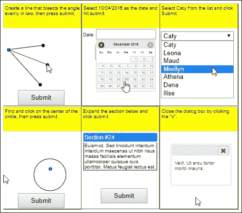
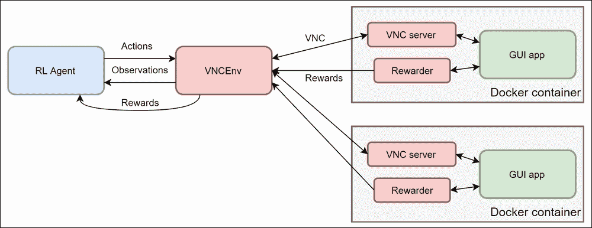
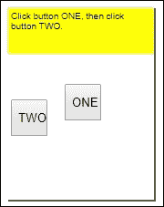
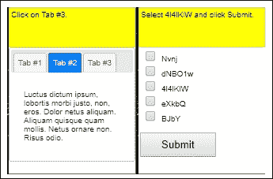
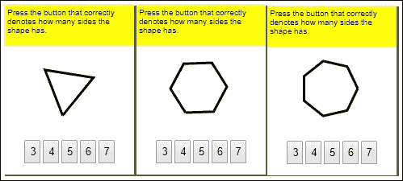
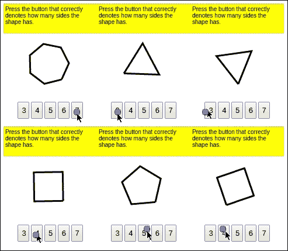
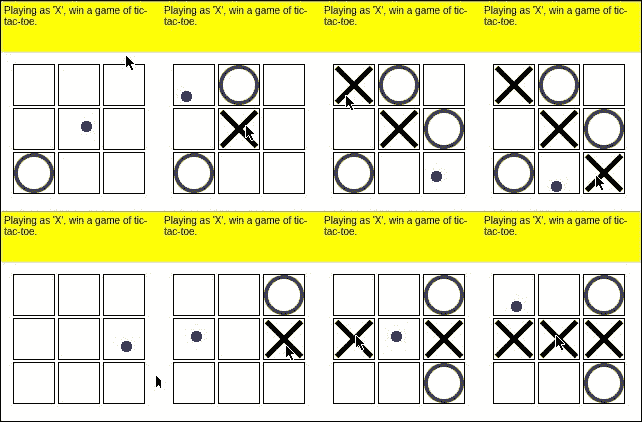

# 十三、网络导航

本章看看**强化学习** ( **RL** )的另一个实际应用:网页导航和浏览器自动化。我们将讨论为什么网络导航很重要，以及如何用 RL 方法解决它。接下来，我们将深入了解一个非常有趣，但通常被忽略且有点被遗弃的 RL 基准，它由 OpenAI 实现，名为 **Mini World of Bits** 。


# 网页导航

当网络被发明的时候，它是由几个纯文本的网页通过超链接连接起来的。如果你好奇，这里是第一个网页主页:[http://info.cern.ch/](http://info.cern.ch/)，有文本和链接。你唯一能做的就是阅读并点击链接在页面间切换。几年后，在 1995 年，IETF 发布了 HTML 2.0 规范，它对蒂姆·伯纳斯·李发明的原始版本进行了大量扩展。在这些扩展中，它包括表单和表单元素，允许网页作者向他们的网站添加活动。用户可以输入和更改文本、切换复选框、选择下拉列表和按钮。这组控件类似于 GUI 应用程序的极简控件集。只有一个区别:所有这些都发生在浏览器的窗口中，用户交互的数据和 UI 控件都是由服务器的页面定义的，而不是由安装的本地应用程序定义的。

一晃 22 年过去了，现在我们的浏览器中已经有了 JavaScript、HTML5 canvas 和 office 应用程序。桌面和网络之间的界限是如此之薄和模糊，以至于你可能甚至不知道你正在使用的应用是 HTML 页面还是原生应用。但是，还是那个懂 HTML，对外讲 HTTP 的浏览器。

就其核心而言，**网络导航**被定义为用户与网站互动的过程。用户可以点击链接、键入文本或做任何其他动作来达到某个目标，如发送电子邮件、查找法国大革命的确切年份或查看最近的脸书通知。所有这些都将使用 web 导航来完成，因此有一个问题:我们的程序可以学习如何做同样的事情吗？


## 浏览器自动化和 RL

从另一个角度来说，自动化网站交互的问题被攻击了很久，试图解决**网站测试**和**网页抓取**这些非常实际的任务。当你有一些你(或其他人)开发的复杂网站，并且你想确保它做它应该做的事情时，网站测试是必要的。例如，如果您有一个重新设计的登录页面，并准备部署在一个活动网站上，那么您可能希望确保这个新设计在输入错误密码、用户单击**我忘记了我的密码**等情况下做一些正常的事情。一个复杂的网站可能包含成百上千个用例，每个版本都应该测试这些用例，所以所有这些功能都应该自动化。

网页抓取解决了大规模从网站中提取一些数据的问题。例如，如果您想要构建一个系统来汇总您所在城镇中所有比萨饼店的所有价格，您可能需要处理数百个不同的网站，这可能会给构建和维护带来问题。网络抓取工具正在尝试解决与网站交互的问题。它们的功能各不相同，从简单的 HTTP 请求和后续的 HTML 解析，到完全模拟用户移动鼠标、点击按钮、思考等等。

浏览器自动化的标准方法通常允许你用你的程序控制真正的浏览器，如 Chrome 或 FireFox，它可以观察网页数据，如 DOM 树和对象在屏幕上的位置，并发出动作，如移动鼠标，按一些键，按“后退”按钮或只是执行一些 JavaScript 代码。与 RL 问题设置的联系是显而易见的:我们的代理通过发出动作和观察一些状态来与网页和浏览器交互。奖励并不是那么明确，直觉上应该是特定的任务，比如成功地填写一些表格或到达含有所需信息的页面。

可以学习浏览器任务的系统的实际应用与上述用例相关。例如，在非常大的网站的 web 测试中，使用像“将鼠标向左移动五个像素，然后按下左键”这样的低级浏览器动作来定义测试过程是非常繁琐的你要做的是给系统一些演示，让它在所有类似的情况下归纳和重复显示的动作，或者至少让它足够健壮，可以进行 UI 重新设计、按钮文本更改等等。此外，在很多情况下，您事先并不知道问题所在，例如，您希望系统探索网站的弱点，如安全漏洞。在这种情况下，RL 代理可以非常快地尝试许多奇怪的动作，比人类快得多。当然，安全测试的行动空间是巨大的，因此随机点击不会与有经验的人类测试人员有很大的竞争力。在这种情况下，基于 RL 的系统可能会结合人类的现有知识和经验，但仍然保持探索和从探索中学习的能力。

另一个受益于 RL 浏览器自动化的潜在领域是抓取和 web 数据提取。例如，您可能希望从成千上万个不同的网站中提取一些数据，如酒店网站、汽车租赁代理或世界各地的其他企业。通常，在您得到想要的数据之前，需要填写一个带有参数的表单,考虑到不同网站的设计、布局和自然语言的灵活性，这是一个非常不简单的任务。手头有了这样的任务，RL 代理可以通过可靠地大规模提取数据来节省大量的时间和精力。


## 比特的迷你世界基准测试

具有 RL 的浏览器自动化的潜在实际应用很吸引人，但是有一个非常严重的缺点:它们太大了，不能用于研究和方法的比较。事实上，一个完整的 web 抓取系统的实现可能需要一个团队几个月的努力，并且大多数问题都不会直接与 RL 相关，如数据收集、浏览器引擎通信、输入和输出表示以及实际生产系统开发中包含的大量其他问题。

通过解决所有这些问题，我们很容易因看树而忽略森林。这就是为什么研究人员喜欢基准数据集，如 MNIST，ImageNet，Atari 套件和许多其他的数据集。然而，并不是每个问题都是好的基准。一方面，它应该足够简单，允许快速实验和方法之间的比较。另一方面，基准必须具有挑战性，并留有改进的空间。例如，Atari 基准测试包括各种各样的游戏，从非常简单的游戏(如 Pong)到相当复杂的游戏(如 Montezuma Revenge，需要复杂的行动计划)，这些游戏可以在半小时内解决。

据我所知，浏览器自动化领域只有一个这样的基准，更糟糕的是，这个基准被 RL 社区遗忘了。作为解决这个问题的尝试，我们将在本章中研究一下基准测试。先说它的历史。

2016 年 12 月，OpenAI 发布了一个名为**比特的迷你世界** ( **迷你 WoB** ) 的数据集，其中包含 80 个基于浏览器的任务。这些任务是在像素级别上观察的(严格来说，除了像素之外，任务的文本描述也被提供给代理)，并且应该使用 VNC([https://en.wikipedia.org/wiki/Virtual_Network_Computin](https://en.wikipedia.org/wiki/Virtual_Network_Computin))客户端通过鼠标和键盘动作进行通信。当 VNC 服务器允许客户通过网络使用鼠标和键盘连接和使用服务器的 GUI 应用程序时，VNC 是一个标准的远程桌面协议。这 80 项任务在复杂性和要求代理采取的行动方面有很大差异。有些任务非常简单，即使对 RL 来说也是如此，比如“点击对话框的关闭按钮”，或者“按下单个按钮”，但有些任务需要多个步骤，例如，“打开折叠的组并点击带有一些文本的链接”，或者“使用日期选择器工具选择特定日期”(这个日期是每集随机生成的)。有些任务对人类来说很简单，但需要字符识别，例如，“用此文本标记复选框”(文本是随机生成的)。部分 MiniWoB 问题截图如下图所示:



图 1: MiniWoB 环境

不幸的是，尽管 MiniWoB 的想法很棒，具有挑战性，但它几乎在最初发布后就被 OpenAI 抛弃了。作为纠正错误的一种尝试，在这一章中，我们将仔细研究这个基准，并学习如何编写一个代理来解决一些任务。我们还将讨论如何提取、预处理人类演示，并将其合并到训练过程中，并检查它们对代理最终性能的影响。在进入代理的 RL 部分之前，我们需要了解 MiniWoB 是如何工作的。要做到这一点，我们需要仔细看看 OpenAI Gym 名为 OpenAI Universe 的扩展。

OpenAI 宇宙


# OpenAI Universe 在 OpenAI 的 GitHub 资源库【https://github.com/openai/universe[和中可用，其核心思想是使用 Gym 提供的相同核心类将通用 GUI 应用程序包装到 RL 环境中。为了实现这一点，它使用 VNC 协议连接 docker 容器内运行的 VNC 服务器，向 RL 代理公开鼠标和键盘操作，并提供 GUI 应用程序图像作为观察。奖励由运行在同一容器中的外部小型“奖励者”守护程序提供，并根据奖励者的判断给予代理标量奖励值。可以在本地或通过网络启动几个容器，并行收集剧集数据，就像我们在第 11 章](https://github.com/openai/universe)、*异步优势演员评论家*中启动几个 Atari 模拟器来增加**演员评论家** ( **A2C** )方法的收敛性一样。该架构如下图所示:

图 2: OpenAI 宇宙架构



Figure 2: OpenAI Universe architecture

这种架构允许将第三方应用程序快速集成到 RL 框架中，因为您不需要对应用程序本身进行任何更改，只需将其打包为 docker 容器并编写一个相对较小的 rewarder 守护程序，该守护程序使用简单的文本协议进行通信。另一方面，与例如 Atari 游戏相比，当仿真器相对轻量级并且完全在 RL 代理的进程内工作时，这种方法需要更多的资源。VNC 方法要求 VNC 服务器与应用并行启动，并且 RL 代理与应用的通信速率由 VNC 服务器速度和网络吞吐量来定义(在远程对接容器的情况下)。

安装


## 要开始使用 OpenAI Universe，您需要在您的环境中安装它的 Python 包。请小心您正在安装的版本。写的时候命令`pip install universe`安装老版本 0.21.3，需要老Gym 0.7.2。为了防止降级，您需要使用命令`pip install git+https://github.com/openai/universe`从 GitHub 安装最新版本 0.21.5。为了方便起见，我为 Anaconda 提供了`environment.yml`环境定义文件，因此，要快速创建满足所有需求的环境`rl_book_ch13`，只需运行命令`conda env create -f Chapter13/environment.yml`。在这个命令之后，您需要运行前面的`pip install`命令来从 GitHub 安装 OpenAI Universe。

Universe 需要的另一个组件是 Docker，它是运行轻量级容器的标准方法，可用于大多数现代操作系统。要安装它，请参考 Docker 的网站[https://www.docker.com](https://www.docker.com)。OpenAI Universe 为您提供了在何处以及如何启动容器的灵活性，因此您的代理可以连接到一台或多台安装了 Docker 的远程机器。要检查 docker 是否启动并运行，请尝试命令`docker ps`，它显示了正在运行的容器。

行动和观察


## 与 Atari 游戏或我们迄今为止合作过的其他Gym环境相比，OpenAI Universe 展现了一个更加通用的动作空间。雅达利游戏使用六到七个独立的动作，对应于控制器的按钮和操纵杆的方向。CartPole 的动作空间更小，只有两个动作可用。VNC 给了我们的经纪人更多的灵活性。首先，完整的键盘，带有控制键和每个键的上/下状态被暴露出来。所以，你的代理可以决定同时按下 10 个按钮，从 VNC 的角度来看这完全没问题。动作空间的第二部分是鼠标，这时你可以将鼠标移动到任意坐标并控制其按钮的状态。这大大增加了行动空间的维度，代理需要学习如何处理。

除了更大的行动空间，OpenAI 宇宙环境与Gym环境相比，环境语义略有不同。区别在两个方面。第一个是所谓的**对观察、行动和奖励的矢量化**表示。正如您在*图 2* 中看到的，一个环境可以连接到几个运行相同应用程序的 Docker 容器，并从它们那里收集并行体验。这种并行通信允许**策略梯度** ( **PG** )方法获得更多样化的训练样本，但是现在我们需要指定我们需要哪个确切的应用程序来发送带有`env.step()`调用的动作。为了解决这个问题，OpenAI Universe environment 的`step()`方法不需要单个动作，而是需要每个连接容器的动作列表。这个函数的返回也是矢量化的，现在由一组列表组成:`(observations, rewards, done_flags, infos)`。

第二个区别是由 VNC 协议的异步观察和动作方式决定。在 Atari 环境中，每次调用`step()`都会触发对模拟器的请求，将时间向前移动一个时钟周期(1/25 秒)，因此我们的代理可以暂时阻止模拟器，这样对正在运行的游戏就完全透明了。对 VNC 来说，情况并非如此。由于 GUI 应用程序与我们的客户端并行运行，我们不能再阻止它了。如果我们的代理决定思考一段时间，它可能会错过这段时间内发生的观察。

观察的这种异步性质的另一个含义是当容器还没有准备好或正在重置时的情况。在这种情况下，具体观察可以是`None`，这些情况需要由代理人处理。

环境创造


## 要创建 OpenAI Universe 环境，您需要像以前一样用环境 ID 调用`gym.make()`。例如，MiniWoB 集合中的一个非常简单的问题是`wob.mini.ClickDialog-v0`，它需要你点击 **X** 按钮来关闭对话框。然而，在使用该环境之前，您需要对其进行配置:指定您想要的 Docker 实例的位置和数量。有一种特殊的环境方法叫做`configure()`。这个方法需要在环境的任何其他方法之前被调用，它接受几个参数。最重要的论点如下:

`remotes`:参数，可以是数字，也可以是字符串。如果它被指定为一个数字，那么它给出了环境中需要启动的本地容器的数量。作为一个字符串，这个参数可以指定环境需要以`vnc://host1:port1+port2,host2:port1+port2`的形式连接的已经运行的容器的 URL。第一个端口是 VNC 协议端口(默认为`5900`)。第二个端口是奖励者守护进程的一个端口，默认为`15900`。这两个港口都可以在 Docker 容器发布时重新定义。

*   `fps`:给出代理观察的预期每秒帧数的自变量。
*   `vnc_kwargs`:一个参数，必须是 dict，带有额外的 VNC 协议参数，定义要传输给代理的图像的压缩级别和质量。这些参数对于性能非常重要，尤其是对于运行在云中的容器。
*   为了说明这一点，让我们考虑一个非常简单的程序，它以`ClickDialog`问题开始一个容器，并以图像的形式获得它的第一个观察结果。这个例子在`Chapter13/adhoc/wob_create.py`中有。

这个例子非常简单，所以我们只需要很小的一组包。需要导入`universe`包，尽管它没有被使用，因为这个导入在 Gym 中注册了它的环境。

```
#!/usr/bin/env python3
import gym
import universe
import time

from PIL import Image
```

我们创建我们的环境并要求它配置自己。传递的参数指定只启动一个本地容器，每秒五帧，VNC 连接没有图像压缩。这意味着大量流量在 VNC 服务器和 VNC 客户端之间传递，从而防止图像中出现压缩假象。对于使用相对较小的字体显示文本的 MiniWoB 问题，这可能是必需的。

```
if __name__ == "__main__":
    env = gym.make("wob.mini.ClickDialog-v0")

    env.configure(remotes=1, fps=5, vnc_kwargs={
        'encoding': 'tight', 'compress_level': 0,
        'fine_quality_level': 100, 'subsample_level': 0
    })
    obs = env.reset()
```

虽然我们的单个观察值是`None`(我们期望在返回的列表中只有一个观察值，因为我们只请求了一个远程容器)，但是我们将随机动作传递给环境，等待图像出现:

```
    while obs[0] is None:
        a = env.action_space.sample()
        obs, reward, is_done, info = env.step([a])
        print("Env is still resetting...")
        time.sleep(1)
```

最后，当我们从服务器获得图像时，我们将它保存为一个 PNG 文件，如下所示。在 MiniWoB 问题中，图像不是我们得到的唯一观察结果。实际上，从环境中观察是一个包含两个条目的 dict:`vision`，包含一个带有屏幕像素的 NumPy 数组和`text`，包含问题的文本描述。对于一些问题，只需要图像，但对于 MiniWoB 套件中的一些任务，文本包括解决问题的基本信息，如单击哪个颜色区域或需要选择哪些日期。

```
    print(obs[0].keys())
    im = Image.fromarray(obs[0]['vision'])
    im.save("image.png")
    env.close()
```

由于观测的原始分辨率为 1024 x 768，以下图像被裁剪。

图 3:mini WOB 观察图像的一部分


Figure 3: Part of a MiniWoB observation image

MiniWoB 稳定性


## 我对 OpenAI 发布的原始 MiniWoB Docker 图像进行的实验显示了一个严重的问题:有时控制容器内浏览器的服务器端 Python 脚本会崩溃。这导致了训练问题，因为我们的环境失去了与容器的连接，训练停止了。这个问题的解决方案是一行代码的更改，但是 OpenAI 不支持 MiniWoB 并且不接受修复，这使得问题变得复杂，因此，为了解决这个问题，我必须在容器内应用补丁。还有另一个与人类演示相关的小补丁，它修复了记录文件在剧集之间被覆盖的问题。带有两个补丁的补丁映像被推送到我的 Docker Hub 存储库中，并作为`shmuma/miniwob:v2`标签可用，因此您可以使用它来代替原始的`quay.io/openai/universe.world-of-bits:0.20.0`映像。如果你好奇，我已经把补丁和如何应用它们的说明放在代码样本库`Chapter13/wob_fixes`里了。

简单的点击方式


# 作为第一个演示，让我们实现一个简单的**异步优势演员评论家** ( **A3C** )代理，它决定在给定图像观察的情况下应该点击哪里。这种方法只能解决整个 MiniWoB 套件的一小部分，我们将在后面讨论这种方法的限制。目前，它将使我们更好地理解这个问题。

和前一章一样，由于代码的大小，我不会在这里放一个完整的源代码。我们将把重点放在最重要的功能上，其余的作为概述。完整的源代码可以在 GitHub 资源库[https://GitHub . com/packt publishing/Deep-Reinforcement-Learning-Hands-On](https://github.com/PacktPublishing/Deep-Reinforcement-Learning-Hands-On)中找到。

网格动作


## 当我们谈到 OpenAI Universe 的架构和组织时，提到了行动空间的丰富性和灵活性给 RL 代理带来了许多挑战。MiniWoB 在浏览器中的活动区域只有 160x210(与 Atari 模拟器的尺寸完全相同)，但即使是这样小的区域，我们的代理也可能被要求移动鼠标、执行单击、拖动对象等等。仅仅是鼠标本身就很难掌握，因为在极端情况下，代理可以执行几乎无限多种不同的操作，比如在某个点按下鼠标按钮，然后将鼠标拖动到不同的位置。在我们的例子中，我们将通过考虑在活动网页区域内的一些固定网格点的点击来简化我们的问题。我们的行动空间示意图如下:

图 4:网格动作空间


Figure 4: A grid action space

这种方法已经作为一个动作包装器`universe.wrappers.experimental.action_space.SoftmaxClickMouse`在 open ai Universe中实现。它为 MiniWoB 环境预设了所有默认值，这是一个 160x210 的区域，向右移动了 10 个像素，向下移动了 75 个像素(以消除浏览器的框架)。动作网格为 10x10，提供了 256 个最终动作供选择。

除了动作预处理器，我们肯定需要一个观察预处理器，因为来自 VNC 环境的输入图像是一个 1024x768x3 张量，但 MiniWoB 的活动区域仅为 210x160。没有合适的裁剪器被定义，所以我自己将它实现为`Chapter13/lib/wob_vnc.py`库模块中的类`lib.wob_vnc.MiniWoBCropper`。它的代码非常简单，如下所示:

构造函数中可选的`keep_text`参数使模式能够保留问题的文本描述。我们目前不需要它，我们的第一版代理将一直禁用它。在这种模式下，`MiniWoBCropper`返回形状为(3，210，160)的 NumPy 数组。

```
WIDTH = 160
HEIGHT = 210
X_OFS = 10
Y_OFS = 75

class MiniWoBCropper(vectorized.ObservationWrapper):
    def __init__(self, env, keep_text=False):
        super(MiniWoBCropper, self).__init__(env)
        self.keep_text = keep_text

    def _observation(self, observation_n):
        res = []
        for obs in observation_n:
            if obs is None:
                res.append(obs)
                continue
            img = obs['vision'][Y_OFS:Y_OFS+HEIGHT, X_OFS:X_OFS+WIDTH, :]
            img = np.transpose(img, (2, 0, 1))
            if self.keep_text:
                text = " ".join(map(lambda d: d.get('instruction', ''), obs.get('text', [{}])))
                res.append((img, text))
            else:
                res.append(img)
        return res
```

示例概述


## 做出关于行动和观察的决定后，我们接下来的步骤很简单。我们将使用 A3C 方法来训练代理，它应该根据 160 x 210 的观察结果来决定单击哪个网格单元。除了策略之外，策略是 256 个网格单元上的概率分布，我们的代理估计状态的值，这将被用作 PG 估计中的基线。

本例中有几个模块:

`Chapter13/lib/common.py`:本章示例中共享的方法，包括大家已经熟悉的`RewardTracker`和`unpack_batch`函数

*   `Chapter13/lib/model_vnc.py`:包括模型的定义，将在下一节中显示
*   `Chapter13/lib/wob_vnc.py`:包含 MiniWoB 专用代码，如观察裁剪器、环境配置方法和其他实用功能
*   `Chapter13/wob_click_train.py`:用于训练模型的脚本
*   `Chapter13/wob_click_play.py`:脚本加载模型权重，并在单一环境中使用它们，记录观察结果并统计奖励的统计数据
*   型号


## 这个模型非常简单，并且使用了我们在其他 A3C 例子中看到的相同模式。我没有花太多时间来优化和微调架构和超参数，所以最终结果可能会得到显著改善。以下是具有两个卷积层、一个单层策略和值头的模型定义。

培训代码

```
class Model(nn.Module):
    def __init__(self, input_shape, n_actions):
        super(Model, self).__init__()

        self.conv = nn.Sequential(
            nn.Conv2d(input_shape[0], 64, 5, stride=5),
            nn.ReLU(),
            nn.Conv2d(64, 64, 3, stride=2),
            nn.ReLU(),
        )

        conv_out_size = self._get_conv_out(input_shape)

        self.policy = nn.Sequential(
            nn.Linear(conv_out_size, n_actions),
        )

        self.value = nn.Sequential(
            nn.Linear(conv_out_size, 1),
        )

    def _get_conv_out(self, shape):
        o = self.conv(torch.zeros(1, *shape))
        return int(np.prod(o.size()))

    def forward(self, x):
        fx = x.float() / 256
        conv_out = self.conv(fx).view(fx.size()[0], -1)
        return self.policy(conv_out), self.value(conv_out)
```


## 训练脚本在`Chapter13/wob_click_train.py`里，应该也很熟悉，但是包含了几个 OpenAI Universe 和 MiniWoB 特有的片段，所以我把它放在这里。这个脚本可以在两种模式下工作:有人类演示和没有人类演示。目前我们只考虑从头开始训练，但一些代码与演示相关，现在应该忽略。我们稍后将在适当的部分中查看它。

使用的模块就不多说了，除了新的`universe`。它可能看起来没有使用过，但是您仍然需要导入它，因为在导入时它会在 Gym 的存储库中注册新的环境，所以它们在`gym.make()`调用时变得可用。

```
#!/usr/bin/env python3
import os
import gym
import random
import universe
import argparse
import numpy as np
from tensorboardX import SummaryWriter

from lib import wob_vnc, model_vnc, common, vnc_demo

import ptan

import torch
import torch.nn.utils as nn_utils
import torch.nn.functional as F
import torch.optim as optim
```

超参数部分也基本相同，只是新增了几个超参数。首先，`REMOTES_COUNT`指定了我们将尝试连接的 Docker 容器的数量。默认情况下，我们的训练脚本假设这些容器已经在一台机器上启动，我们可以在预定义的端口上连接到它们(`5900`..`5907`用于 VNC 连接和`15900`..`15907`为奖励者守护进程)。我们将在下一节中查看启动容器的细节。

```
REMOTES_COUNT = 8
ENV_NAME = "wob.mini.ClickDialog-v0"

GAMMA = 0.99
REWARD_STEPS = 2
BATCH_SIZE = 16
LEARNING_RATE = 0.0001
ENTROPY_BETA = 0.001
CLIP_GRAD = 0.05

DEMO_PROB = 0.5

SAVES_DIR = "saves"
```

参数`ENV_NAME`指定了我们将尝试解决的问题，它可以用命令行参数重新定义。问题`ClickDialog`非常简单，奖励代理点击对话框的关闭按钮。

我们有大量的命令行选项，使用它们你可以调整训练行为。只有一个必需的选项来传递运行的名称，它将用于 TensorBoard 和 directory 来保存模型的权重。现在应该忽略参数`--demo`，因为它与人类演示相关。

```
if __name__ == "__main__":
    parser = argparse.ArgumentParser()
    parser.add_argument("-n", "--name", required=True, help="Name of the run")
    parser.add_argument("--cuda", default=False, action='store_true', help="CUDA mode")
    parser.add_argument("--port-ofs", type=int, default=0, help="Offset for container's ports, default=0")
    parser.add_argument("--env", default=ENV_NAME, help="Environment name to solve, default=" + ENV_NAME)
    parser.add_argument("--demo", help="Demo dir to load. Default=No demo")
    parser.add_argument("--host", default='localhost', help="Host with docker containers")
    args = parser.parse_args()
    device = torch.device("cuda" if args.cuda else "cpu")
```

解析参数后，我们规范化环境名(所有 MiniWoB 环境都以前缀`wob.mini.`开始，所以我们不需要在命令行中指定它)，启动 TensorBoard writer 并为模型创建目录。

```
    env_name = args.env
    if not env_name.startswith('wob.mini.'):
        env_name = "wob.mini." + env_name

    name = env_name.split('.')[-1] + "_" + args.name
    writer = SummaryWriter(comment="-wob_click_" + name)
    saves_path = os.path.join(SAVES_DIR, name)
    os.makedirs(saves_path, exist_ok=True)
```

前面这段代码与演示相关，现在应该忽略。

```
    demo_samples = None
    if args.demo:
        demo_samples = vnc_demo.load_demo(args.demo, env_name)
        if not demo_samples:
            demo_samples = None
        else:
            print("Loaded %d demo samples, will use them during training" % len(demo_samples))
```

为了准备环境，我们要求 Gym 创建它，将它包装到前面描述的`SoftmaxClickMouse`包装器中，然后应用我们的裁剪器。但是，这个环境还不能使用。为了完成初始化，我们需要使用`wob_vnc`模块中的实用函数对其进行配置。他们的目标是用指定 VNC 连接参数的参数调用`env.configure()`方法，比如图像质量和压缩级别以及我们想要连接的 Docker 容器的地址。这些连接端点在一个特殊形式的 URL 中指定，由函数`wob_vnc.remotes_url()`生成。这个 URL 具有`vnc://host:port1+port2,host:port1+port2`的形式，允许一个环境与运行在多个主机上的任意数量的 Docker 容器进行通信。

```
    env = gym.make(env_name)
    env = universe.wrappers.experimental.SoftmaxClickMouse(env)
    env = wob_vnc.MiniWoBCropper(env)
    wob_vnc.configure(env, wob_vnc.remotes_url(port_ofs=args.port_ofs, hostname=args.host, count=REMOTES_COUNT))
```

在培训开始之前，我们从 PTAN 图书馆创建模型、代理和经验源。这里唯一的新东西是参数`vectorized=True`，它告诉经验源我们的环境是矢量化的，并在一次调用中返回多个结果。

```
    net = model_vnc.Model(input_shape=wob_vnc.WOB_SHAPE, n_actions=env.action_space.n).to(device)
    print(net)
    optimizer = optim.Adam(net.parameters(), lr=LEARNING_RATE, eps=1e-3)

    agent = ptan.agent.PolicyAgent(lambda x: net(x)[0], device=device, apply_softmax=True)
    exp_source = ptan.experience.ExperienceSourceFirstLast(
        [env], agent, gamma=GAMMA, steps_count=REWARD_STEPS, vectorized=True)
```

在训练循环的开始，我们向我们的经验源请求新的经验对象，并将它们打包到批处理中。与此同时，我们跟踪未打折的平均奖励，如果它更新了最大值，我们就保存模型的权重。

```
    best_reward = None
    with common.RewardTracker(writer) as tracker:
        with ptan.common.utils.TBMeanTracker(writer, batch_size=10) as tb_tracker:
            batch = []
            for step_idx, exp in enumerate(exp_source):
                rewards_steps = exp_source.pop_rewards_steps()
                if rewards_steps:
                    rewards, steps = zip(*rewards_steps)
                    tb_tracker.track("episode_steps", np.mean(steps), step_idx)

                    mean_reward = tracker.reward(np.mean(rewards), step_idx)
                    if mean_reward is not None:
                        if best_reward is None or mean_reward > best_reward:
                            if best_reward is not None:
                                name = "best_%.3f_%d.dat" % (mean_reward, step_idx)
                                fname = os.path.join(saves_path, name)
                                torch.save(net.state_dict(), fname)
                                print("Best reward updated: %.3f -> %.3f" % (best_reward, mean_reward))
                            best_reward = mean_reward
                batch.append(exp)
                if len(batch) < BATCH_SIZE:
                    continue
```

前面这段代码与演示相关，现在应该忽略。

```
                if demo_samples and random.random() < DEMO_PROB:
                    random.shuffle(demo_samples)
                    demo_batch = demo_samples[:BATCH_SIZE]
                    model_vnc.train_demo(net, optimizer, demo_batch, writer, step_idx,
                                         preprocessor=ptan.agent.default_states_preprocessor,
                                         device=device)
```

当批量完成时，我们将其分解为单个张量，并执行 A2C 训练程序:计算价值损失以改进价值头估计，并使用价值作为优势基线来计算 PG。

```
                states_v, actions_t, vals_ref_v = \
                    common.unpack_batch(batch, net, last_val_gamma=GAMMA ** REWARD_STEPS,
                                        device=device)
                batch.clear()
```

为了改进探索，我们添加了作为策略的缩放负熵计算的熵损失。

```
                optimizer.zero_grad()
                logits_v, value_v = net(states_v)

                loss_value_v = F.mse_loss(value_v, vals_ref_v)

                log_prob_v = F.log_softmax(logits_v, dim=1)
                adv_v = vals_ref_v - value_v.detach()
                log_prob_actions_v = adv_v * log_prob_v[range(BATCH_SIZE), actions_t]
                loss_policy_v = -log_prob_actions_v.mean()

                prob_v = F.softmax(logits_v, dim=1)
                entropy_loss_v = ENTROPY_BETA * (prob_v * log_prob_v).sum(dim=1).mean()
```

然后，我们使用 TensorBoard 跟踪关键的数量，以便能够在培训期间监控它们。

```
                loss_v = loss_policy_v + entropy_loss_v + loss_value_v
                loss_v.backward()
                nn_utils.clip_grad_norm(net.parameters(), CLIP_GRAD)
                optimizer.step()

                tb_tracker.track("advantage", adv_v, step_idx)
                tb_tracker.track("values", value_v, step_idx)
                tb_tracker.track("batch_rewards", vals_ref_v, step_idx)
                tb_tracker.track("loss_entropy", entropy_loss_v, step_idx)
                tb_tracker.track("loss_policy", loss_policy_v, step_idx)
                tb_tracker.track("loss_value", loss_value_v, step_idx)
                tb_tracker.track("loss_total", loss_v, step_idx)
```

起始容器


## 在培训开始之前，您需要启动带有 MiniWoB 的 docker 容器。OpenAI Universe 提供了一个选项来自动启动它们，为此你需要将整数值传递给`env.configure()`调用，例如，`env.configure(remotes=4)`将使用 MiniWoB 在本地启动四个 Docker 容器。

尽管这种启动模式很简单，但它有几个缺点:

您无法控制容器的位置，因此所有容器都将在本地启动。当您希望在一台远程机器或多台机器上启动它们时，这并不方便。

*   OpenAI Universe 默认启动 quay.io 发布的容器(本文写作时是 0.20.0 版本的 image `quay.io/openai/universe.world-of-bits` )，该容器在奖励计算上存在严重 bug。由于这个原因，你的训练过程有时会崩溃，当训练需要几天的时候，这是不好的。`env.configure()`有一个选项，叫做`docker_image`，允许你重新定义用来启动的镜像，但是你需要把镜像硬编码到代码中。
*   容器的开始元组有一个开销，所以你的训练必须在所有容器开始之前等待。
*   作为替代，我发现提前启动 Docker 容器要灵活得多。在这种情况下，您需要向`env.configure()`传递一个 URL，将环境指向它必须连接的主机和端口。要启动容器，您需要运行命令`docker run -d -p 5900:5900 -p 15900:15900 --privileged --ipc host --cap-add SYS_ADMIN <CONTAINER_ID> <ARGS>`。这些论点的含义如下:

`-d`:在*分离*模式下启动容器。为了能够查看容器的日志，您可以用`-t`替换这个选项。在这种情况下，容器将以交互方式启动，并且可以用 *Ctrl* + *C* 停止。

1.  `-p SRC_PORT:TGT_PORT`:将 src 端口从容器的主机转发到容器内的目标端口。此选项允许您在一台机器上启动多个 MiniWoB 容器。每个容器启动 VNC 服务器监听端口`5900`和 rewarder 守护进程监听端口`15900`。参数`-p 5900:5900`使 VNC 服务器在主机(运行容器的机器)的端口`5900`上可用。对于第二个容器，你应该通过`-p 5901:5900`，这使得它在端口`5901`可用，而不是被占用的`5900`。对于 rewarder 来说也是如此:在容器内部，它监听端口`15900`。通过提供`–p`选项，您可以将连接从您的主机转发到容器的端口。
2.  `--privileged`:该选项允许容器访问主机设备。至于为什么 MiniWoB 开始使用这个选项，可能是有一些 VNC 服务器的要求。
3.  `--ipc host`:使容器能够与主机共享 IPC(进程间通信)名称空间。
4.  `--cap-add SYS_ADMIN`:扩展容器的能力，执行主机设置的扩展配置。
5.  `<CONTAINER_ID>`:集装箱的标识。应该是原来的`quay.io/openai/universe.world-of-bits:0.20.0`的补丁版本`shmuma/miniwob:v2`。更多细节在 *MiniWoB 稳定性*的上一节中给出。
6.  `<ARGS>`:你可以给容器传递额外的参数来改变它的操作模式。我们以后会需要它们来记录人类的演示。目前，它可以是空的。
7.  就是这样！我们的训练脚本期望运行八个容器，分别位于端口`5900` - `5907`和`15900` - `15907`。例如，要启动它们，我使用以下命令(也可用作`Chapter13/adhoc/start_docker.sh`)

所有这些都将在后台启动，并且可以通过`docker ps`命令看到:

```
docker run -d -p 5900:5900 -p 15900:15900 --privileged --ipc host --cap-add SYS_ADMIN shmuma/miniwob:v2
docker run -d -p 5901:5900 -p 15901:15900 --privileged --ipc host --cap-add SYS_ADMIN shmuma/miniwob:v2
docker run -d -p 5902:5900 -p 15902:15900 --privileged --ipc host --cap-add SYS_ADMIN shmuma/miniwob:v2
docker run -d -p 5903:5900 -p 15903:15900 --privileged --ipc host --cap-add SYS_ADMIN shmuma/miniwob:v2
docker run -d -p 5904:5900 -p 15904:15900 --privileged --ipc host --cap-add SYS_ADMIN shmuma/miniwob:v2
docker run -d -p 5905:5900 -p 15905:15900 --privileged --ipc host --cap-add SYS_ADMIN shmuma/miniwob:v2
docker run -d -p 5906:5900 -p 15906:15900 --privileged --ipc host --cap-add SYS_ADMIN shmuma/miniwob:v2
docker run -d -p 5907:5900 -p 15907:15900 --privileged --ipc host --cap-add SYS_ADMIN shmuma/miniwob:v2

```

培训流程

```
CONTAINER ID        IMAGE               COMMAND                  CREATED             STATUS              PORTS                                              NAMES
ecf5d17c5419        92756d1f08ac        "/app/universe-envs/w"   23 hours ago        Up 23 hours         0.0.0.0:5907->5900/tcp, 0.0.0.0:15907->15900/tcp   elegant_bohr
8aaaeeb28e11        92756d1f08ac        "/app/universe-envs/w"   23 hours ago        Up 23 hours         0.0.0.0:5906->5900/tcp, 0.0.0.0:15906->15900/tcp   tiny_shirley
e8028af83bb2        92756d1f08ac        "/app/universe-envs/w"   23 hours ago        Up 23 hours         0.0.0.0:5905->5900/tcp, 0.0.0.0:15905->15900/tcp   gloomy_chandrasekhar
9164b9dd4449        92756d1f08ac        "/app/universe-envs/w"   23 hours ago        Up 23 hours         0.0.0.0:5904->5900/tcp, 0.0.0.0:15904->15900/tcp   sad_minsky
bb6817065e82        92756d1f08ac        "/app/universe-envs/w"   23 hours ago        Up 23 hours         0.0.0.0:5903->5900/tcp, 0.0.0.0:15903->15900/tcp   sleepy_pasteur
5dfb6a4e784c        92756d1f08ac        "/app/universe-envs/w"   23 hours ago        Up 23 hours         0.0.0.0:5902->5900/tcp, 0.0.0.0:15902->15900/tcp   gloomy_thompson .
bacb19a24647        92756d1f08ac        "/app/universe-envs/w"   23 hours ago        Up 23 hours         0.0.0.0:5901->5900/tcp, 0.0.0.0:15901->15900/tcp   goofy_dubinsky
34861292023d        92756d1f08ac        "/app/universe-envs/w"   23 hours ago        Up 23 hours         0.0.0.0:5900->5900/tcp, 0.0.0.0:15900->15900/tcp   backstabbing_lamport

```


## 当容器已经启动准备使用时，就可以开始训练了。开始时，它显示关于连接状态的消息，但最后它应该开始报告剧集的统计数据。

如果需要，您可以使用一个 VNC 客户端(比如 TurboVNC)手动连接到容器的 VNC 服务器。大多数环境都提供了一个方便的浏览器内 VNC 客户端:`http://localhost:15900/viewer/?password=openai`

```
rl_book_samples/Chapter13$ ./wob_click_train.py -n t2 --cuda
[2018-01-29 14:27:48,545] Making new env: wob.mini.ClickDialog-v0
[2018-01-29 14:27:48,547] Using SoftmaxClickMouse with action_region=(10, 125, 170, 285), noclick_regions=[]
[2018-01-29 14:27:48,547] SoftmaxClickMouse noclick regions removed 0 of 256 actions
[2018-01-29 14:27:48,548] Writing logs to file: /tmp/universe-9018.log
[2018-01-29 14:27:48,548] Using the golang VNC implementation
[2018-01-29 14:27:48,548] Using VNCSession arguments: {'compress_level': 0, 'subsample_level': 0, 'encoding': 'tight', 'start_timeout': 21, 'fine_quality_level': 100}. (Customize by running "env.configure(vnc_kwargs={...})"
[2018-01-29 14:27:48,579] [0] Connecting to environment: vnc://localhost:5900 password=openai.

```

默认情况下，训练过程启动`ClickDialog-v0`环境，需要 100k-200k 才能达到平均奖励 0.8-0.99。收敛动态如下图所示:

```
…
[2018-01-29 14:27:52,218] Throttle fell behind by 1.06s; lost 5.32 frames
[2018-01-29 14:27:52,955] [1:localhost:5901] Initial reset complete: episode_id=17803
37: done 1 games, mean reward 0.686, speed 11.77 f/s
52: done 2 games, mean reward 0.447, speed 28.29 f/s
72: done 3 games, mean reward -0.035, speed 33.24 f/s
98: done 4 games, mean reward -0.130, speed 25.92 f/s
125: done 5 games, mean reward -0.015, speed 33.64 f/s
146: done 6 games, mean reward 0.137, speed 26.18 f/s

```

图 ClickDialog 环境的融合


Figure 5: Convergence of the ClickDialog environment

**剧集 _ 步骤**图表显示代理在剧集结束前应执行的平均行动次数。理想情况下，对于这个问题，计数应该是 1，因为代理需要采取的唯一动作是单击对话框的关闭按钮。然而，事实上，代理人在剧集结束前看到了七到九帧。发生这种情况有两个原因:对话框关闭按钮上的十字会延迟出现，容器内的浏览器会在代理单击之前添加一个时间间隔，奖励者会注意到这一点。无论如何，在大约 100k 帧中(对于八个容器大约是半个小时)，训练过程收敛到一个相当好的策略，它可以在大多数时间关闭对话。

检查学习到的策略


## 为了能够窥视代理活动的内部,有一个工具可以从文件中加载模型权重并运行几集，记录代理观察和所选动作的截图。该工具名为`Chapter13/wob_click_play.py`，它连接到第一个容器(端口`5900`和`15900`)，运行在本地机器上，并接受以下参数:

`-m`:要加载模型的文件名。

*   `--save <IMG_PREFIX>`:如果指定，它会将每个观察结果保存在一个单独的文件中。参数是路径前缀。
*   `--count`:设置要播放的剧集数量。
*   `--env`:设置要使用的环境名称，默认为`ClickDialog-v0`。
*   `--verbose`:显示每一步的奖励、完成和内部信息。
*   这对于在训练期间检查(甚至调试)代理在不同状态下的行为非常有用。例如，检查在`ClickDialog`上训练的最佳模型向我们显示:

要检查代理的动作，您可以传递带有要写入的图像前缀的`--save`选项。代理执行的操作在单击时显示为蓝色圆圈。右边的区域包含最后一次奖励和超时前剩余时间的技术信息。例如，其中一个保存的图像如下所示:

```
rl_book_samples/Chapter13$ ./wob_click_play.py -m saves/ClickDialog-v0_t1/best_1.047_209563.dat --count 5
[2018-01-29 15:43:57,188] [0:localhost:5900] Sending reset for env_id=wob.mini.ClickDialog-v0 fps=60 episode_id=0
[2018-01-29 15:44:01,223] [0:localhost:5900] Initial reset complete: episode_id=288
Round 0 done
Round 1 done
Round 2 done
Round 3 done
Round 4 done
Done 5 rounds, mean steps 6.40, mean reward 0.734

```

图 6:代理运行时的屏幕截图


Figure 6: A screenshot of the agent in action

简单点击的问题


## 不幸的是，演示的方法只能用来解决相对简单的问题，比如`ClickDialog`。如果你试图用它来完成更复杂的任务，这种收敛性是不太可能的。这可能有多种原因。首先，我们的代理是无状态的，这基本上意味着它只根据观察来做出关于动作的决定，而不考虑它以前的动作。你可能还记得[第一章](part0012_split_000.html#BE6O2-ce551566b6304db290b61e4d70de52ee "Chapter 1. What is Reinforcement Learning?")、*什么是强化学习？*我们讨论了**马尔可夫决策过程** ( **MDP** )的马尔可夫性质，以及这个马尔可夫性质允许我们丢弃所有以前的历史，只保留当前的观察。即使在 MiniWoB 的相对简单的问题中，这种马尔可夫特性也可能被破坏。比如有一个问题叫`ClickButtonSequence-v0`(截图如下)，需要我们的代理先点击按钮**一个**，再点击按钮**两个**。即使我们的代理足够幸运地按照要求的顺序随机点击，它也无法从单个图像中区分出下一个需要点击的按钮。

图 7:无状态代理难以解决的环境示例



Figure 7: An example of the environment which the stateless agent could struggle to solve

尽管这个问题很简单，但我们不能用我们的 RL 方法来解决它，因为 MDP 形式主义不再适用了。这类问题称为部分可观测 MDPs 或 POMDP，通常的解决方法是允许代理保持某种状态。这里的挑战是在只保留最少的相关信息和通过将所有信息都加入到观察中而用不相关的信息淹没代理之间找到平衡。

我们的示例可能面临的另一个问题是，解决问题所需的数据可能在图像中不可用，或者可能只是以不方便的形式存在。比如有两个问题:`ClickTab`和`ClickCheckboxes`。在第一个中，你需要点击三个标签中的一个，但是每次需要点击的标签都是随机选择的。需要点击哪个选项卡显示在描述中(提供了一个文本内观察字段，显示在环境页面的顶部)，但我们的代理只能看到像素，这使得将顶部的微小数字与随机点击结果的结果联系起来变得复杂。对于`ClickCheckboxes`问题，情况甚至更糟，需要点击几个带有随机生成文本的复选框。防止过度拟合问题的一个可能选择是使用某种 **OCR** ( **光学字符识别**)网络将观察到的图像转换成文本形式。

图 8:文本描述对正确操作很重要的环境示例



Figure 8: An example of environments where text description is important to action properly

另一个问题可能仅仅与代理需要探索的动作空间的维度有关。即使对于单击问题，操作的数量也可能非常大，因此代理需要很长时间来发现如何操作。这里一个可能的解决方案是在培训中加入演示。例如，下图中有一个问题叫做`CountSides-v0`。这里的目标是单击与所示形状的边数相对应的按钮。

图 CountSides 环境的屏幕截图



Figure 9: A screenshot of the CountSides environment

我尝试从头开始训练代理，经过一天的训练，它几乎没有任何进展。然而，在添加了几十个正确点击的例子后，它在 15 分钟的训练中成功地解决了这个问题。当然，也许我的超参数不好，但是，演示的效果仍然令人印象深刻。在这一章的下一个例子中，我们将看看如何记录和注入人类演示来提高收敛性。

人类示威游行


# 演示背后的想法很简单:为了帮助我们的代理发现解决任务的最佳方法，我们向它展示一些我们认为解决问题所需的行动的例子。这些例子可能不是最好的解决方案或 100%准确，但它们应该足以向代理展示有希望探索的方向。

事实上，这是一件非常自然的事情，所有人类的学习都是基于课堂上老师、你的父母或其他人给出的一些先前的例子。这些例子可以是书面形式的(食谱)，也可以是演示形式的，你需要重复几次才能做好(舞蹈课)。这种形式的训练比随机搜索有效得多。试想一下，仅仅通过试错来学习如何清洁牙齿将会是多么复杂和漫长。当然，学习如何跟随演示是有危险的，这可能是错误的或者不是解决问题的最有效的方法，但总的来说，这比随机搜索有效得多。

我们之前的所有例子都使用了零先验知识，并从随机权重初始化开始，这导致在训练开始时执行随机动作。在一些迭代之后，代理发现在一些状态中的一些动作给出了更有希望的结果(通过具有更高优势的 Q 值或策略),并且开始偏好那些动作。最后，这个过程导致了或多或少的最优策略，最终给了代理人很高的报酬。当我们的动作空间维度很低并且环境的行为不是很复杂时，它工作得很好，但是仅仅将动作的数量增加一倍就会导致至少需要两倍的观察。在我们的 clicker 代理中，我们有 256 个不同的动作，对应于活动区域中的 10x10 个网格，这比我们在 CartPole 环境中的动作多 128 倍。训练过程变得冗长并可能完全不收敛是不足为奇的。

这个维度问题可以通过多种方式解决，如更智能的探索方法、具有更高采样效率的训练(一次性训练)、整合先验知识(迁移学习)和其他方式。有很多研究活动致力于使 RL 更好更快，我们可以肯定很多突破就在前面。在这一部分，我们将尝试更传统的方法，将人类录制的演示融入到训练过程中。

你可能还记得我们关于策略上和策略外方法的讨论(在[第 4 章](part0030_split_000.html#SJGS1-ce551566b6304db290b61e4d70de52ee "Chapter 4. The Cross-Entropy Method")、*交叉熵方法*和[第 7 章](part0048_split_000.html#1DOR02-ce551566b6304db290b61e4d70de52ee "Chapter 7. DQN Extensions")、 *DQN 扩展*中讨论过)。这与我们的人工演示非常相关，因为，严格地说，我们不能将不符合策略的数据(人工观察-动作对)与符合策略的方法(在我们的例子中是 A3C)一起使用。这是由于保单方法的性质造成的:他们使用从当前保单收集的样本来估计 PG。如果我们只是将人类记录的样本推入训练过程，估计的梯度将与人类策略相关，而不是由**神经网络** ( **NN** )给出的我们当前的策略。为了解决这个问题，我们需要稍微作弊一下，从监督学习的角度来看我们的问题。具体来说，我们将使用对数似然目标来推动我们的网络从演示中采取行动。

在我们讨论实现细节之前，我们需要解决一个非常重要的问题:我们如何以最方便的方式获得演示？

记录演示


## 如何记录演示没有通用的方法，因为演示取决于观察和动作空间细节。然而，从更高的角度来看，我们应该保存人类或另一个代理的可用信息，我们希望记录他们的动作，以及这个代理所采取的动作。例如，如果我们想要获得某人玩的 Atari 游戏会话，我们需要保存屏幕图像，以及在这个屏幕上按下的按钮。

在我们的 OpenAI Universe 环境中，有一个优雅的解决方案，基于 VNC 协议，并被用作通用传输。为了保存演示，我们需要捕获服务器发送给 VNC 客户端的屏幕，以及客户端发送给服务器的鼠标和键盘操作。MiniWoB 为此提供了基于 VNC 协议代理的内置功能，如下图所示:

图 10:演示记录架构


默认情况下，VNC 代理不会在容器启动时启动，因为有一个单独的*演示模式*。要启动启用了代理的容器，需要将参数`demonstration -e ENV_NAME`传递给容器。您还需要传递端口转发选项，以使端口`5899`(VNC 代理正在监听的端口)从外部可用。用于在包络`ClickTest2`的记录模式下启动容器的整个命令行如下(也可用作`Chapter13/adhoc/start_docker_demo.sh`):

需要`TURK_DB`这个说法，大概和 OpenAI 用 **Mechanical Turk** 收集人体演示进行内部实验有关。不幸的是，OpenAI 还没有发布这些演示，尽管它承诺这样做。所以，获得演示的唯一方法就是自己录制。

一旦启动了容器，您就可以使用您喜欢的任何 VNC 客户端连接到它。对于所有的 linux/windows/mac，有几种选择。您应该连接到您的容器的主机，端口`5899`。连接密码是 **openai** 。连接后，您应该会看到浏览器窗口，其中包含您在容器启动时指定的环境。

```
docker run -e TURK_DB='' -p 5899:5899 --privileged --ipc host --cap-add SYS_ADMIN shmuma/miniwob:v2 demonstration -e wob.mini.ClickTest2-v0

```

现在你可以开始解决问题了，但是别忘了你所有的动作都会被记录下来，以后在训练的时候会用到。所以，你的动作应该是高效的，不包括任何不相关的动作，比如点击错误的地方，等等。当然，你总是可以做一个实验来检查训练对这种嘈杂的演示的鲁棒性。解决问题的时间也是有限的，因为在大多数环境下，时间是 10 秒。到期时，问题将重新开始，您将获得-1 的奖励。如果你没有看到鼠标指针，你应该在你的 VNC 客户端启用**本地鼠标渲染**模式。

一旦您录制了一些演示，您可以断开与服务器的连接并复制录制的数据。请记住，只有当容器处于活动状态时，您的记录才会被保留。记录的数据放在容器文件系统内的`/tmp/demo`文件夹中，但是您可以使用`docker exec`命令查看这些文件(跟随`80daf4b8f257`的是以演示模式启动的容器的 ID):

一个单独的 VNC 会话保存在一个单独的子目录中的`/tmp/demo`文件夹内，因此您可以使用同一个容器进行多个记录会话。要复制数据，可以使用命令`docker cp`命令:

一旦你得到了原始数据文件，你就可以用它们来进行训练，但是首先让我们来谈谈数据格式。

```
$ docker exec -t 80daf4b8f257 ls -laR /tmp/demo
/tmp/demo:
total 20
drwxr-xr-x  3 root   root    4096 Jan 30 17:06 .
drwxrwxrwt 19 root   root    4096 Jan 30 17:07 ..
drwxr-xr-x  2 root   root    4096 Jan 30 17:07 1517332006-fprnte8qiy3af3-0
-rw-r--r--  1 nobody nogroup   20 Jan 30 17:09 env_id.txt
-rw-r--r--  1 root   root     531 Jan 30 17:09 rewards.demo

```

```
/tmp/demo/1517332006-fprnte8qiy3af3-0:
total 35132
drwxr-xr-x 2 root root     4096 Jan 30 17:07 .
drwxr-xr-x 3 root root     4096 Jan 30 17:06 ..
-rw-r--r-- 1 root root    51187 Jan 30 17:07 client.fbs
-rw-r--r-- 1 root root       20 Jan 30 17:07 env_id.txt
-rw-r--r-- 1 root root     5888 Jan 30 17:07 rewards.demo
-rw-r--r-- 1 root root 35900918 Jan 30 17:07 server.fbs

```

录制格式

```
docker cp 80daf4b8f257:/tmp/demo .

```

对于每个客户端连接，VNC 代理记录四个文件:


## `env_id.txt`:一个文本文件，带有用于记录演示的环境 ID。当您有几个演示数据目录时，这对于过滤非常方便。

`rewards.demo`:一个 JSON 文件，包含 rewarder 守护进程记录的事件。这包括环境中带有时间戳的事件，如文本描述更改、获得的奖励等。

*   `client.fbs`:客户端向 VNC 服务器发送事件的二进制格式。其中包含了原始 VNC 协议消息的时间戳(称为**远程帧缓冲协议**或 **RFP** )。
*   `server.fbs`:VNC 服务器发送给客户端的数据的二进制格式。它和`client.fbs`的格式一样，但是消息集不同。
*   这里最棘手的文件是`client.fbs`和`server.fbs`，因为它们是二进制的，并且格式没有方便的阅读器(至少我不知道有这样的库)。在 RFC6143 中对 VNC 协议进行了标准化，称为远程帧缓冲协议，该协议可在 IETF 网站[https://tools.ietf.org/html/rfc6143](https://tools.ietf.org/html/rfc6143)上获得。该协议定义了 VNC 客户端和服务器可以交换的消息集，以便向用户提供远程桌面。客户端可以发送键盘或鼠标事件，服务器负责发送桌面的图像，以允许客户端查看应用程序的最新视图。为了改善慢速网络链接上的用户体验，服务器通过选择性地压缩图像并仅发送 GUI 桌面的相关(修改)部分来优化传输。
*   为了使演示记录可用于 RL 代理培训，我们需要将这种 VNC 格式转换成一组图像和在图像时发出的用户事件。为了实现这一点，我使用开泰二进制解析器语言(项目网站[http://kaitai.io/](http://kaitai.io/))实现了一个小型 VNC 协议解析器，它提供了一种使用声明性 Yaml 格式语言解析复杂二进制文件格式的便捷方式。如果您很好奇，客户机和服务器消息的源文件在`Chapter13/ksy`目录中。

与演示格式相关的 Python 代码放在模块`Chapter13/lib/vnc_demo.py`中，该模块包含一个用于演示目录的高级函数加载器和一组用于解释内部二进制格式的低级方法。loader 函数`vnc_demo.load_demo()`返回的结果是元组列表。每个元组都包含一个 NumPy 数组，其中包含 MiniWoB 模型使用的观察和执行的鼠标操作的索引。

为了检查演示数据，有一个小工具`Chapter13/ahdoc/demo_dump.py`，它用`client.fbs`和`server.fbs`加载演示目录，并将演示样本转储为图像文件。用于将我记录的演示转换成图像的命令行示例如下所示:

该命令产生了前缀为`count`的 64 个图像文件。

图 12:在每张图片上，点击点显示为蓝色圆圈

```
rl_book_samples/Chapter13$ ./adhoc/demo_dump.py -d data/demo-CountSides/ -e wob.mini.CountSides-v0 -o count
[2018-01-30 12:44:11,794] Making new env: wob.mini.CountSides-v0
[2018-01-30 12:44:11,796] Using SoftmaxClickMouse with action_region=(10, 125, 170, 285), noclick_regions=[]
[2018-01-30 12:44:11,797] SoftmaxClickMouse noclick regions removed 0 of 256 actions
Loaded 64 demo samples
[2018-01-30 12:44:12,191] Making new env: wob.mini.CountSides-v0
[2018-01-30 12:44:12,192] Using SoftmaxClickMouse with action_region=(10, 125, 170, 285), noclick_regions=[]
[2018-01-30 12:44:12,192] SoftmaxClickMouse noclick regions removed 0 of 256 actions

```

This command produced 64 image files with the prefix `count`.



此记录的二进制数据在`Chapter13/demos/demo-CountSides.tar.gz`中可用，您需要在使用前将其解压缩。还需要说明的是，我对 VNC 协议读取的实现是实验性的，仅适用于 MiniWoB image 0.20.0 中使用的 VNC 代理生成的文件，并没有假装完全符合 VNC 协议 RFC。此外，阅读过程是为我们的动作空间转换硬编码的，不会产生鼠标移动、按键和其他事件的例子。如果你认为它应该被扩展到更一般的情况，欢迎你来投稿。

使用演示进行培训

现在我们知道了如何记录和加载演示数据，我们只有一个问题还没有回答:我们的训练过程需要如何修改以包含人类演示？最简单的解决方案是使用对数似然目标，我们在第 12 章*中用 RL* 训练聊天机器人时使用了这个目标，但这个解决方案却出奇地有效。为此，我们需要将我们的 A2C 模型视为一个分类问题，在其策略标题中产生输入观察的分类。在其最简单的形式中，价值头将不会被训练，但事实上，训练它也不会很难:我们知道演示期间获得的奖励，所以需要的是计算从每次观察到一集结束的折扣奖励。


## 为了检查它是如何实现的，让我们回到在描述`Chapter13/wob_click_train.py`时跳过的代码片段。首先，我们可以通过在命令行中传递`--demo <DIR>`选项来传递带有演示数据的目录。这将启用下面的分支，在那里我们从指定的目录中加载演示样本。函数`vnc_demo.load_demo()`足够智能，可以自动从任何层次的子目录中加载演示，所以你只需要传递你的演示所在的目录。

与演示训练相关的第二段代码位于训练循环内部，在任何正常批处理之前执行。来自演示的训练以某种概率(默认为 0.5)执行，并由`DEMO_PROB`超参数指定。

逻辑很简单:利用`DEMO_PROB`机会，我们从我们的演示数据中抽取`BATCH_SIZE`样本，并批量执行我们网络的这一轮训练。实际训练由`model_vnc.train_demo()`功能执行，如下所示:

```
    demo_samples = None
    if args.demo:
        demo_samples = vnc_demo.load_demo(args.demo, env_name)
        if not demo_samples:
            demo_samples = None
        else:
            print("Loaded %d demo samples, will use them during training" % len(demo_samples))
```

训练代码也非常简单明了。我们在观察和动作列表上分割我们的批处理，预处理观察以将它们转换为 PyTorch 张量并将它们放在 GPU 上，然后我们要求我们的 A2C 网络返回策略并计算结果和期望动作之间的交叉熵损失。从优化的角度来看，我们正在推动我们的网络朝着演示中采取的行动发展。

```
              if demo_samples and random.random() < DEMO_PROB:random.shuffle(demo_samples)demo_batch = demo_samples[:BATCH_SIZE]model_vnc.train_demo(net, optimizer, demo_batch, writer, step_idx,preprocessor=ptan.agent.default_states_preprocessor, device=device)
```

结果

```
def train_demo(net, optimizer, batch, writer, step_idx, preprocessor, device="cpu"):
    batch_obs, batch_act = zip(*batch)
    batch_v = preprocessor(batch_obs).to(device)
    optimizer.zero_grad()
    ref_actions_v = torch.LongTensor(batch_act).to(device)
    policy_v = net(batch_v)[0]
    loss_v = F.cross_entropy(policy_v, ref_actions_v)
    loss_v.backward()
    optimizer.step()
    writer.add_scalar("demo_loss", loss_v.data.cpu().numpy()[0], step_idx)
```

为了检查演示的效果，我用相同的超参数对`CountSides`问题进行了两组训练:一组没有演示，另一组使用了 64 次演示点击。差别是巨大的。从头开始*进行训练*，在 12 小时的训练后达到最佳平均奖励-0.64，训练力度没有任何改善。训练动态如下所示:


## 图 12:county sides 环境中的训练动态

To check the effect of demonstrations, I've performed two sets of training on the `CountSides` problem with the same hyperparameters: one was done without demonstrations, another used 64 demonstration clicks. The difference was dramatic. Training performed *from scratch*, reached the best mean reward of -0.64 after 12 hours of training and the training dynamics didn't show any improvement. The training dynamics are shown as follows:


仅添加 64 个演示样本，在仅 45k 帧中，训练就能够达到 1.75 的平均回报。如下所示的高熵损失表明代理变得对其动作非常确定。

图 13:在相同的环境中进行人类演示的训练

With just 64 demonstration samples added, in just 45k frames the training was able to reach the mean reward of 1.75\. High entropy loss shown as follows demonstrates that the agent became very sure about its actions.


为了客观地看待问题，下面的是相同的图表组合。

图 14:有(蓝色)和没有(棕色)演示的培训对比

To put things in perspective, below are the same charts combined.


TicTacToe 问题

为了检查演示对训练的效果，我从 MiniWoB 上拿了一个更复杂的问题，这是一个 TicTacToe 游戏。我已经记录了一些演示(在`Chapter13/demos/demo-TicTacToe.tgz`中可用)，总共将近 200 个动作，其中一些例子如下:


## 图 15:带有人类动作的 TicTacToe 环境

To check the effect of demonstrations on training, I've taken a more complex problem from MiniWoB, which is a TicTacToe game. I've recorded some demonstrations (available in `Chapter13/demos/demo-TicTacToe.tgz`), in total almost 200 actions, and some examples of them are as follows:


经过一个小时的训练后，代理人能够达到-0.05 的平均奖励，这意味着它有时会赢，而在剩下的比赛中，代理人可以打成平局。训练动态如下所示。为了改进探索，演示训练概率在看到 25k 帧后从 0.5 降低到 0.01。

图 TicTacToe 代理的训练动态

After one hour of training, the agent was able to reach the mean reward of -0.05, which means that it can win from time to time and for the rest of the games the agent can come to a draw. The training dynamics are shown below. To improve the exploration, demo training probability was decreased from 0.5 to 0.01 after 25k frames seen.


使用`wob_click_play.py`，我们可以一步一步地检查代理的动作。例如，以下是平均奖励为 0.187 的最佳模特玩的一些游戏:

图 17:代理玩的游戏

Using `wob_click_play.py`, we can check the agent's actions step-by-step. For example, following are some games played by the best model with the mean reward of 0.187:


图 18:代理玩的第二个游戏


图 19:代理玩的更多游戏



添加文本描述

作为本章的最后一个例子，我们将将问题的文本描述添加到我们模型的观察中。我们已经提到过，有些问题包含文本描述中给出的重要信息，比如需要点击的选项卡索引或代理需要检查的条目列表。同样的信息显示在图像观察的顶部，但是像素并不总是简单文本的最佳表示。


# 为了考虑这些文本，我们需要将模型的输入从图像扩展到图像和文本数据。我们在前一章中已经处理了文本，所以一个**循环神经网络** ( **RNN** )是一个相当明显的选择(对于这样一个玩具问题来说可能不是最好的，但它是灵活的和可扩展的)。我们不打算详细讨论这个例子，而只关注实现中最重要的点(全部代码在`Chapter13/wob_click_mm_train.py`中)。与我们的 clicker 模型相比，文本扩展并没有增加太多。

首先，我们应该要求包装器`MiniWoBCropper`保留从观察中获得的文本。这个类的完整源代码已经在本章前面展示过了。为了保留文本，我们应该将`keep_text=True`传递给包装器构造函数，这使得该类返回一个带有 NumPy 数组和文本字符串的元组，而不仅仅是带有图像的 NumPy 数组。

然后，我们需要准备模型来处理这样的元组，而不是一批 NumPy 数组。这需要在两个地方完成:在我们的代理中(当我们使用模型选择动作时)和在训练代码中。为了以模型友好的方式修改观察，我们可以使用 PTAN 库的一个特殊功能，称为`preprocessor`。核心思想非常简单:`preprocessor`是一个可调用的函数，它需要将观察值列表转换成一种可以传递给模型的形式。默认情况下，`preprocessor`将 NumPy 数组的列表转换成 PyTorch 张量，并可选地将其复制到 GPU 内存中。然而，有时需要更复杂的转换，就像在我们的例子中，当我们需要将图像打包成张量时，但是文本字符串需要特殊的处理。在这种情况下，您可以重新定义默认的`preprocessor`，并将其传递给`ptan.Agent`类。从理论上讲，由于 PyTorch 的灵活性，`preprocessor`功能可以被移入模型本身，但是在观察值只是 NumPy 数组的情况下，默认的`preprocessor`简化了我们的生活。下面是取自`Chapter13/lib/model_vnc.py`模块的`preprocessor`类源代码。

在构造函数中，我们创建了一个从 token 到 identifier 的映射(将被动态扩展),并从`nltk`包中创建了 tokenizer。

我们的预处理器的目标是将一批(图像，文本)元组转换成两个对象:第一个必须是具有形状(batch_size，3，210，160)的图像数据的张量，第二个必须包含来自打包序列形式的文本描述的一批标记。打包序列是一种 PyTorch 数据结构，适用于 RNN 的高效处理，我们已经在[第 12 章](part0087_split_000.html#2IV0U1-ce551566b6304db290b61e4d70de52ee "Chapter 12. Chatbots Training with RL")、*用 RL 训练聊天机器人*中讨论过。

```
class MultimodalPreprocessor:
    log = logging.getLogger("MulitmodalPreprocessor")

    def __init__(self, max_dict_size=MM_MAX_DICT_SIZE, device="cpu"):
        self.max_dict_size = max_dict_size
        self.token_to_id = {TOKEN_UNK: 0}
        self.next_id = 1
        self.tokenizer = TweetTokenizer(preserve_case=False)
        self.device = device
```

作为转换的第一步，我们将文本字符串标记为标记，并将每个标记转换为整数 id 列表。然后，我们根据令牌计数的减少对批处理进行排序，这是底层 CuDNN 库对高效 RNN 处理的要求。

```
    def __len__(self):
        return len(self.token_to_id)

    def __call__(self, batch):
        tokens_batch = []
        for img_obs, txt_obs in batch:
            tokens = self.tokenizer.tokenize(txt_obs)
            idx_obs = self.tokens_to_idx(tokens)
            tokens_batch.append((img_obs, idx_obs))
        # sort batch decreasing to seq len
        tokens_batch.sort(key=lambda p: len(p[1]), reverse=True)
        img_batch, seq_batch = zip(*tokens_batch)
        lens = list(map(len, seq_batch))
```

在前一行中，我们将观察图像转换成单一张量。

为了创建压缩序列类，首先我们需要创建一个*填充序列*张量，它是一个(batch_size，len_of_longest_seq)的矩阵。我们将序列的 id 复制到这个矩阵中。

```
        img_v = torch.FloatTensor(img_batch).to(self.device)
```

最后一步，我们从 NumPy 矩阵创建张量，并使用 PyTorch 实用函数将它们转换成*打包的*形式。转换的结果是两个对象:一个带有图像的张量和一个带有符号化文本的打包序列。

```
        seq_arr = np.zeros(shape=(len(seq_batch), max(len(seq_batch[0]), 1)), dtype=np.int64)
        for idx, seq in enumerate(seq_batch):
            seq_arr[idx, :len(seq)] = seq
            # Map empty sequences into single #UNK token
            if len(seq) == 0:
                lens[idx] = 1
```

前面的实用函数必须将令牌列表转换成 id 列表。棘手的是，我们无法从文本描述中预先知道字典的大小。一种方法是在字符级别上工作，将单个字符输入到 RNN 中，但是这会导致处理太长的序列。另一种解决方案是硬编码一些合理的字典大小，比如 100 个令牌，并动态地为我们从未见过的令牌分配令牌 id。在这个实现中，使用了后一种方法，但是它可能不适用于在文本描述中包含随机生成的字符串的 MiniWoB 问题。

```
        seq_v = torch.LongTensor(seq_arr).to(self.device)
        seq_p = rnn_utils.pack_padded_sequence(seq_v, lens, batch_first=True)
        return img_v, seq_p
```

因为我们的 token-to-ID 映射是动态生成的，所以我们的`preprocessor`必须提供一种方法来在文件中保存和加载这个状态。前面的两个函数正是这样做的。下一个难题是`model`类本身，它是我们所用模型的扩展。

```
    def tokens_to_idx(self, tokens):
        res = []
        for token in tokens:
            idx = self.token_to_id.get(token)
            if idx is None:
                if self.next_id == self.max_dict_size:
                    self.log.warning("Maximum size of dict reached, token '%s' converted to #UNK token", token)
                    idx = 0
                else:
                    idx = self.next_id
                    self.next_id += 1
                    self.token_to_id[token] = idx
            res.append(idx)
        return res
```

不同之处在于一个新的嵌入层，它将整数令牌 id 转换为密集令牌向量和 LSTM RNN。卷积层和 RNN 层的输出连接在一起，并馈入策略和值头，因此其输入的维度是图像和文本特征的组合。

```
    def save(self, file_name):
        with open(file_name, 'wb') as fd:
            pickle.dump(self.token_to_id, fd)
            pickle.dump(self.max_dict_size, fd)
            pickle.dump(self.next_id, fd)

    @classmethod
    def load(cls, file_name):
        with open(file_name, "rb") as fd:
            token_to_id = pickle.load(fd)
            max_dict_size = pickle.load(fd)
            next_id = pickle.load(fd)

            res = MultimodalPreprocessor(max_dict_size)
            res.token_to_id = token_to_id
            res.next_id = next_id
            return res
```

前面的函数将图像和 RNN 特征连接成一个平方张量。

```
class ModelMultimodal(nn.Module):
    def __init__(self, input_shape, n_actions, max_dict_size=MM_MAX_DICT_SIZE):
        super(ModelMultimodal, self).__init__()

        self.conv = nn.Sequential(
            nn.Conv2d(input_shape[0], 64, 5, stride=5),
            nn.ReLU(),
            nn.Conv2d(64, 64, 3, stride=2),
            nn.ReLU(),
        )

        conv_out_size = self._get_conv_out(input_shape)

        self.emb = nn.Embedding(max_dict_size, MM_EMBEDDINGS_DIM)
        self.rnn = nn.LSTM(MM_EMBEDDINGS_DIM, MM_HIDDEN_SIZE, batch_first=True)

        self.policy = nn.Sequential(
            nn.Linear(conv_out_size + MM_HIDDEN_SIZE*2, n_actions),
        )

        self.value = nn.Sequential(
            nn.Linear(conv_out_size + MM_HIDDEN_SIZE*2, 1),
        )
```

在正向函数中，我们期望由`preprocessor`准备的两个对象:一个带有输入图像的张量和一批打包的序列。图像经过卷积处理，文本数据通过 RNN 输入，然后将两种结果连接起来，并计算策略和值结果。

```
    def _get_conv_out(self, shape):
        o = self.conv(torch.zeros(1, *shape))
        return int(np.prod(o.size()))

    def _concat_features(self, img_out, rnn_hidden):
        batch_size = img_out.size()[0]
        if isinstance(rnn_hidden, tuple):
            flat_h = list(map(lambda t: t.view(batch_size, -1), rnn_hidden))
            rnn_h = torch.cat(flat_h, dim=1)
        else:
            rnn_h = rnn_hidden.view(batch_size, -1)
        return torch.cat((img_out, rnn_h), dim=1)
```

这是大部分新代码。训练 Python 脚本`wob_click_mm_train.py`大部分是`wob_click_train.py`的拷贝，只创建了`preprocessor`的微小差异。`keep_text=True`被传递给`MiniWoBCropper()`构造函数和其他小的修改。

```
    def forward(self, x):
        x_img, x_text = x
        assert isinstance(x_text, rnn_utils.PackedSequence)

        # deal with text data
        emb_out = self.emb(x_text.data)
        emb_out_seq = rnn_utils.PackedSequence(emb_out, x_text.batch_sizes)
        rnn_out, rnn_h = self.rnn(emb_out_seq)

        # extract image features
        fx = x_img.float() / 256
        conv_out = self.conv(fx).view(fx.size()[0], -1)

        feats = self._concat_features(conv_out, rnn_h)
        return self.policy(feats), self.value(feats)
```

结果

我在环境`ClickButton-v0`上运行了几个实验，目标是在几个随机按钮之间做出选择。一些录制的演示如下所示:


## 图 ClickButton 环境演示的屏幕截图

即使有演示，一个没有文本描述的模型也能达到 0.4 的平均奖励，这并不比随机点击对话框中的任何按钮好多少。


图 21:训练中没有使用文本描述的 ClickButton 代理的收敛

然而，从文本描述中丰富了特征的模型能够表现得更好，100 集的最佳平均奖励是 0.7。


图 22:带有文本描述的 ClickButton 环境训练

两个模型的回报动态都很嘈杂，这可能表明调整超参数和/或增加并行环境的数量可能会有所帮助。


要尝试的事情

在这一章中，我们只是刚刚开始使用 MiniWoB，接触了全套 80 个问题中的六个最简单的环境，所以前面还有很多未知的领域。如果你想练习，有几个项目可以尝试:

测试演示对嘈杂咔哒声的鲁棒性。


# 基于实证数据实现 A2C 价值主管培训。

实现更复杂的鼠标控制，比如*将鼠标向左/右/上/下移动 N 个像素*。

*   使用一些预先训练的 OCR 网络(或者训练你自己的！)从观察中提取文本信息。
*   去解决其他问题。有一些相当棘手和有趣的问题，像*使用拖放*排序项目，或者*使用复选框*重复该模式。
*   总结
*   在本章中，我们看到了 RL 方法在浏览器自动化中的实际应用，并使用了 OpenAI 的 MiniWoB 基准。这一章结束了这本书的第三部分。下一部分将致力于与连续作用空间、非梯度方法和其他更先进的 RL 方法相关的更复杂和最新的方法。
*   Taking other problems and trying to solve them. There are some quite tricky and fun problems, like *sort items using drag-n-drop*, or *repeat the pattern using checkboxes*.


# Summary

In this chapter, we saw the practical application of RL methods for browser automation and used the MiniWoB benchmark from OpenAI. This chapter concludes part three of the book. The next part will be devoted to more complicated and recent methods related to continuous action spaces, non-gradient methods, and other more advanced methods of RL.