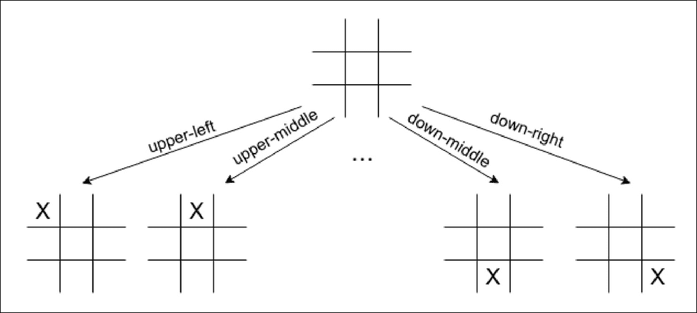
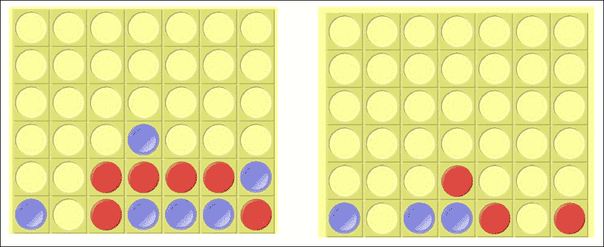
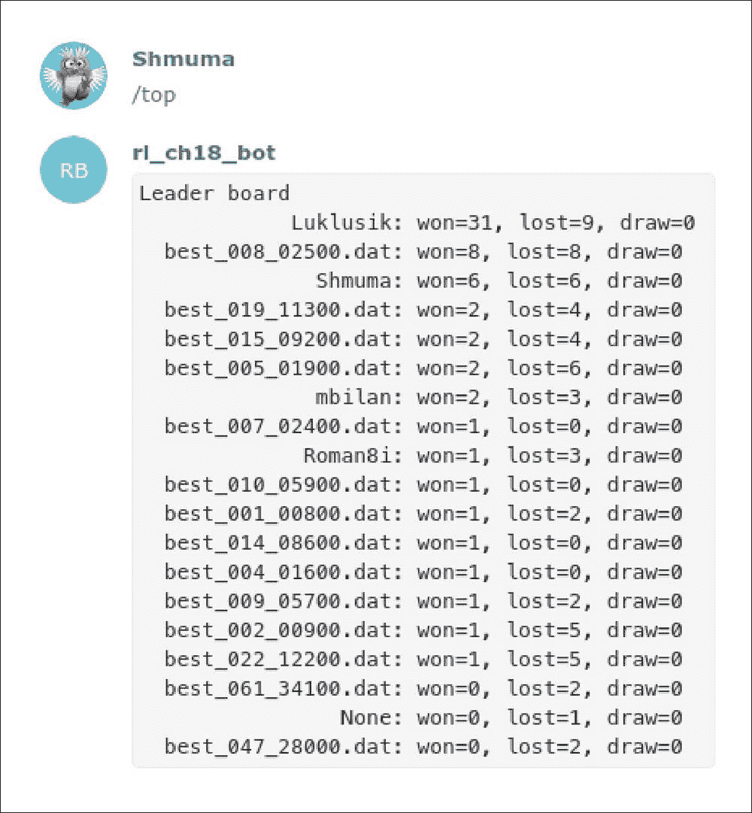
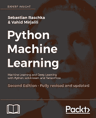
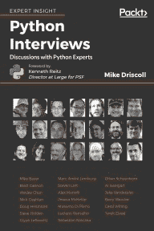

# 十八、AlphaGo Zero

在本书的最后一章，我们将继续讨论基于模型的方法，并检查当我们有一个环境模型，但这个环境被两个竞争方使用时的情况。这种情况在棋盘游戏中非常常见，游戏规则是固定的，满员位置是可观察的，但我们有一个对手，他的首要目标是阻止我们赢得游戏。

最近，DeepMind 提出了一种非常优雅的方法来解决这类问题，这种方法不需要任何先验领域知识，但代理仅通过自我发挥来改进其策略。这种方法被称为 **AlphaGo Zero、**，它将是本章的主要焦点，因为我们实现了玩游戏的方法 *Connect4* 。


# 桌游

大多数桌游提供了一个不同于街机场景的设置。Atari 游戏套件假设一个玩家正在复杂的动态环境中做出决策。通过总结和学习他们行动的结果，玩家提高了他们的技能，增加了最终得分。

在棋盘游戏中，游戏规则通常非常简单紧凑。让游戏变得复杂的是棋盘上不同位置的数量，以及存在一个策略未知的对手，他试图在游戏中击败我们。观察游戏状态和明确规则的能力为分析当前位置提供了可能性，而雅达利没有这种能力。分析意味着考虑游戏的当前状态，评估我们可以采取的所有可能的行动，然后选择最佳的行动。

最简单的评估方法是迭代可能的动作，并在采取动作后递归评估位置。最终，这个过程会把我们带到最终的位置，那时我们不可能再移动了。通过把博弈结果传播回去，我们可以估算出任何位置任何动作的期望值。这种方法的一种可能的变体是被称为 **minimax** 的，这是当我们试图做出最强的移动，但是我们的对手试图对我们采取最差的移动，所以我们迭代地最小化和最大化沿着游戏状态树向下走的最终游戏目标(这将在后面详细描述)。

如果不同位置的数量足够少，可以进行全面分析，就像在 *TicTacToe* 游戏中一样(它只有 138 个终端状态)，从我们拥有的任何状态开始沿着博弈树向下走，并找出采取什么行动是最好的，这不是问题。

不幸的是，这种蛮力方法甚至对中等复杂度的游戏都不起作用，因为配置的数量呈指数增长。比如在*跳棋*(又名*跳棋*的游戏中，整个游戏树有 5*1020 个节点，即使对现代硬件来说也是相当大的挑战。在更复杂的游戏中，如*象棋*或*围棋*，这个数字要大得多，所以不可能分析每个状态下所有可到达的位置。为了处理这一点，当我们分析树到一定深度时，通常使用某种近似。通过仔细的搜索停止标准、称为**树修剪**和位置的智能预定义评估的组合，我们可以制作一个在相当好的水平上玩复杂游戏的计算机程序。

2017 年底，DeepMind 在期刊 *Nature* 上发表了一篇文章，介绍了一种叫做 AlphaGo Zero 的新颖方法，这种方法能够在复杂的游戏中达到超人的水平，像*围棋*和*象棋*，除了游戏规则之外，没有任何先验知识。代理人能够通过不断与自己作对和反思结果来改进其策略。不需要大型游戏数据库、手工制作的特征或预先训练的模型。该方法的另一个优点是它的简单和优雅。

在本章的例子中，我们将尝试理解并实现游戏 *Connect4* (也称为*四个一排*或*四个一排*)的这种方法，来自己评估它。


# alpha go 归零法


## 概述

从高层次来看，方法由三个部分组成，稍后将详细解释所有这些部分，因此，如果本节有些内容不完全清楚，请不要担心:

*   我们不断地遍历博弈树，使用**蒙特卡罗树搜索** ( **MCTS** ) 算法，其核心思想是半随机地遍历博弈状态，扩展它们并收集关于移动频率和潜在博弈结果的统计数据。由于博弈树在深度和宽度上都很大，我们并不试图构建完整的博弈树，只是随机抽取其中最有希望的路径(这就是该方法名称的来源)。
*   在每一个时刻，我们都有一个*最佳玩家*，这是用于通过自我游戏生成数据的模型。最初，这个模型有随机的权重，所以它随机地移动，就像一个四岁的孩子刚刚学会如何移动*国际象棋*棋子。然而，随着时间的推移，我们会用更好的版本取代这个最好的玩家，，这将产生越来越多有意义和复杂的游戏场景。自玩意味着相同的*当前最佳*型号被用于棋盘的两侧。这可能看起来不是很有用，因为让同一个模型与自己对战有大约 50%的机会，但这实际上是我们需要的:我们的最佳模型可以展示其最佳技能的游戏样本。打个比方很简单:看局外人和领先者的比赛通常没什么意思。领导者会轻松获胜。更有趣、更耐人寻味的是水平大致相当的玩家在竞争。这就是为什么任何锦标赛的决赛都比之前的比赛吸引更多的注意力:决赛中的两支球队或球员通常都在比赛中表现出色，所以他们需要发挥出最佳水平才能获胜。
*   该方法的第三个组成部分是另一个*学徒*模型的训练过程，该模型正在根据最佳模型在自我游戏期间收集的数据进行训练。这可以比作一个孩子坐着不停地分析两个成年人玩的国际象棋。我们会定期在这个经过训练的模型和我们当前的最佳模型之间进行几次比赛，如果受训者能够在大量比赛中击败最佳模型，我们会宣布经过训练的模型为新的最佳模型，并继续这个过程。

尽管这很简单，甚至很幼稚，但 AlphaGo Zero 能够击败之前所有的 AlphaGo 版本，成为世界上最好的围棋选手，除了游戏规则，没有任何先验知识。在名为*在没有人类知识的情况下掌握围棋游戏*【1】的论文发表后，DeepMind 采用了同样的方法来拟合*象棋*，并发表了名为*利用通用强化学习算法*【2】通过自我对弈掌握象棋和 Shogi 的论文，其中从零开始训练的模型击败了 Stockfish，这是最好的*象棋*程序，花费了人类专家十多年的时间来开发。

现在让我们详细检查该方法的所有三个组成部分。


## 蒙特卡罗树搜索

为了理解 MCTS 做什么，让我们考虑一下 *TicTacToe* 游戏的一个简单子树，如下图所示。一开始，游戏场是空的，十字架需要选择移动的位置。第一步有九个不同的选项，所以我们的根状态有九个不同的分支通向相应的状态。



图 TicTacToe 的游戏树

在某个特定的游戏状态下的可能动作的数量被称为**分支因子**，显示游戏树的密集度。当然，这不是一成不变的，可能会发生变化，因为有些动作并不总是可行的。在 *TicTacToe* 的情况下，可用动作的数量可以从游戏开始时的九个变化到叶节点处的零个。分支因子允许我们估计博弈树增长的速度，因为每一个可用的动作都会导致另一组可以采取的动作。

对于我们的例子，在十字已经移动之后，零在每九个位置有八个选择，这使得在树的第二层总共有 9*8 个位置。树中的节点总数最多可达 9 个！= 362880，但实际数字更少，因为并非所有游戏都能玩到最大深度。

*TicTacToe* 很小，但是如果我们考虑更大的游戏，并且考虑在*国际象棋*游戏开始时白棋可以走的第一步棋的数量(是 20)或者在*围棋*中白棋可以被放置的点数(19 × 19 游戏场总共是 361)，在完整的树中游戏位置的数量很快变得巨大， 对于每一个新的级别，状态的数量会乘以我们在前一个级别上可以执行的平均操作数量。

为了应对这种组合爆炸，随机抽样开始发挥作用。在《MCTS 将军》中，我们执行了许多深度优先搜索的迭代，从当前游戏状态开始，或者随机选择动作，或者采用某种策略，这应该在其决策中包含足够的随机性。每次搜索持续到游戏的结束状态，然后根据游戏的结果更新被访问的树枝的权重。这个过程类似于价值迭代法，我们播放剧集的时候，剧集的最后一步影响了前面所有步骤的价值估计。这是一个通用的 MCTS，这种方法有很多变体，涉及扩张战略、分支机构选择策略和其他细节。

在 AlphaGo Zero 中，使用了 MCTS 的变体。对于每个边(代表从某个位置的移动)，存储这组统计数据:边的先验概率 *P(s，a)* ，访问计数 *N(s，a)*和动作值 *Q(s，a)* 。每次搜索从最有希望的动作之后的根状态开始，使用效用值 *U(s，a)* 选择，与成比例。在选择过程中加入了随机性，以确保对博弈树有足够的探索。每次搜索都可能以两种结果结束:到达游戏的结束状态，或者我们面临尚未探索的状态(换句话说，没有值的统计)。在后一种情况下，策略**神经网络** ( **NN** )被用于获得先验概率和状态估计值，并且创建具有 *N(s，a) = 0* 、 *P(s，a) = p* 、网(这是网络返回的移动的概率)和 *Q(s，a) = 0* 的新树节点。除了行动的先验概率之外，网络还返回当前玩家对游戏结果(或状态值)的估计。

当我们已经获得值(通过到达最终游戏状态或通过使用 NN 扩展节点)，称为值的*备份的过程被执行。在该过程中，我们从底部到根遍历游戏路径，并且更新每个被访问的中间节点的统计数据，特别地，访问计数 *N(s，a)* 增加 1，并且 *Q(s，a)* 被更新以包括来自当前状态视角的游戏结果。当两个玩家交换移动时，最后的游戏结果是改变每一步的符号。*

这个搜索过程执行几次(在 AlphaGo 的例子中，执行一到两千次搜索)，收集足够的关于动作的统计数据，以使用 *N(s，a)* 计数器作为根节点中要采取的动作概率。


## 自弹自唱

在 AlphaGo Zero 中，NN 是用来近似动作的先验概率并评估位置，这与的**演员兼评论家** ( **A2C** )双头设置非常相似。在网络的输入端，我们传递当前的游戏位置(增加了几个先前的位置)并返回两个值。策略头返回行动的概率分布，价值头从玩家的角度估计游戏结果。这个值是不打折的，因为*进*出的移动是确定的。当然，如果你在游戏中有随机性，比如在双陆棋中，应该使用一些折扣。

正如已经描述过的，我们正在维护*当前最好的*网络，它不断地自我播放，为我们的*学徒网络*收集训练数据。每个自玩游戏中的每一步都从当前位置的几个 MCTS 开始，以收集足够的关于游戏子树的统计数据，用于选择最佳动作。具体的选择取决于招式和我们的设定。对于应该在训练数据中产生足够方差的自玩游戏，第一步是以随机方式选择的。然而，在一定数量的步骤之后(这是该方法中的超参数)，动作选择变得确定，并且我们选择具有最大访问计数器 *N(s，a)* 的动作。在评估游戏中(当我们对照当前最佳模型检查正在训练的网络时)，所有步骤都是确定性的，并且只在最大访问计数器上选择。

一旦自玩游戏已经完成并且知道了最终结果，游戏的每一步都被添加到训练数据集中，训练数据集中是元组列表，其中是游戏状态，是根据 MCTS 采样计算的动作概率，是在步骤 *t* 从玩家的角度来看的游戏结果。


## 培训和评估

当前最佳网络的两个克隆体之间的自玩过程为 us 提供了训练数据流，包括从自玩游戏中获得的状态、动作概率和位置值。有了这个，我们的训练就简单了:我们从训练示例的重放缓冲区中采样小批，并最小化值头部预测和实际位置值之间的**均方误差** ( **MSE** )，以及预测概率和采样概率之间的交叉熵损失。

如前所述，在几个训练步骤中，对训练好的网络进行一次评估，包括在当前最好的和训练好的网络之间进行几场比赛。一旦经过训练的网络变得明显好于当前的最佳网络，我们就将经过训练的网络复制到最佳网络中，并继续这一过程。


# 连接 4 机器人

为了查看方法的运行情况，让我们为 *Connect4* 实现 AlphaGo Zero。这个游戏是两个人玩的，场地是 6 × 7。玩家有两种不同颜色的圆盘，他们依次将圆盘丢到七列中的任何一列。磁盘落到底部，垂直堆叠。游戏目标是第一个形成水平、垂直或对角线组的四个相同颜色的圆盘。图中显示了两种游戏情况。在第一天，红色玩家刚刚获胜，而在第二天，蓝色玩家将组成一个小组。



图 2:连接 4 中的两个游戏位置

尽管很简单，但这款游戏有 4.5*1012 种不同的游戏状态，这对计算机用蛮力求解是很有挑战性的。此示例由几个工具和库模块组成:

*   `Chapter18/lib/game.py`:低级游戏表示，包含移动、编码和解码游戏状态的功能，以及其他与游戏相关的实用程序。
*   `Chapter18/lib/mcts.py` : MCTS 实现，允许树叶和节点备份的 GPU 扩展。这里的中心类还负责保存游戏节点统计数据，这些数据在两次搜索之间被重用。
*   `Chapter18/lib/model.py`:NN 和其他与模型相关的功能，比如游戏状态和模型输入之间的转换，以及单个游戏的运行。
*   `Chapter18/train.py`:主要的训练工具，将所有的东西粘在一起，产生新的最佳网络的模型检查点。
*   `Chapter18/play.py`:组织模型关卡间自动比武的工具。它接受几个模型文件，并相互玩一定数量的游戏，形成一个排行榜
*   `Chapter18/telegram-bot.py`:电报聊天平台的 bot，允许用户对任何保持统计的模型文件进行游戏。这个机器人被用来对例子的结果进行人工验证。


## 游戏模式

整个方法是基于我们预测行动结果的能力，所以换句话说，我们需要能够在执行一些特定的游戏步骤后获得最终的游戏状态。这是一个比我们在雅达利环境和一般 Gym 更强烈的要求，在那里你不能指定任何你想要采取行动的当前状态。因此，我们需要一个游戏模型来封装游戏的规则和动态。幸运的是，大多数棋盘游戏都有一套简单而紧凑的规则，这使得模型实现成为一项简单的任务。

在我们的例子中， *Connect4* 的完整游戏状态由 6 × 7 游戏区域单元的状态和谁将移动的指示器来表示。对于我们的示例来说，重要的是让游戏状态表示占用尽可能少的内存，但仍然允许它高效地工作。内存需求是由在 MCTS 期间存储大量游戏状态的必要性决定的。由于我们的游戏树很大，在 MCTS 期间我们能够保存的节点越多，我们移动概率的最终近似值就越好，因此，潜在地，我们希望能够在内存中保存数百万甚至数十亿个游戏状态。

掌握了这一点，游戏状态表示的紧凑性将对内存需求和我们训练过程的性能产生巨大的影响。然而，游戏状态表示必须便于使用，例如，检查棋盘上的获胜位置，移动并从某个状态中找到所有有效的移动。

为了保持这种平衡，在`Chapter18/lib/game.py,`中实现了游戏领域的两种表现形式。第一个*编码的*形式非常节省内存，只需要 63 位来编码整个字段，这使得它非常快速和轻便，因为它适合 64 位架构上的机器世界。另一个*解码的*游戏域表示具有列表的形式，长度为 7，其中每个条目都是一个整数列表，并将磁盘保存在特定的列中。这种形式占用更多的内存，但是使用起来更方便。

我不会展示`Chapter18/lib/game.py,`的完整代码，但如果你需要，可以在回购中找到。这里，让我们来看看它提供的常量和函数列表:

```
GAME_ROWS = 6
GAME_COLS = 7
BITS_IN_LEN = 3
PLAYER_BLACK = 1
PLAYER_WHITE = 0
COUNT_TO_WIN = 4
INITIAL_STATE = encode_lists([[]] * GAME_COLS)
```

在代码中的前两个常量定义了游戏领域的维度，并在代码中的任何地方使用，所以你可以试着改变它们，并尝试一个更大或更小的游戏。`BITS_IN_LEN`值在状态编码函数中使用，指定使用多少位来编码列的高度(存在的磁盘数量)。在 6 × 7 游戏中，我们可以在每一列中有多达六个磁盘，因此三位足以保持从 0 到 7 的值。如果您改变行数，您将需要相应地调整`BITS_IN_LEN`。

`PLAYER_BLACK`和`PLAYER_WHITE`值定义了在*解码的*游戏表示中使用的值，最后，`COUNT_TO_WIN`设置了赢得游戏所需组成的组的长度。因此，从理论上讲，你可以尝试用代码来训练代理，比如说，在一个 20 × 40 的场地上，通过改变`game.py`中的四个数字来训练五个一排的代理。

`INITIAL_STATE`值包含初始游戏状态的*编码的*表示，其具有`GAME_COLS`空列表。代码的其余部分是函数。其中一些在内部使用，但是一些在示例中的任何地方使用。让我们快速列出它们:

*   `encode_lists(state_lists)`:将游戏状态从*解码的*转换为*编码的*表示。该参数必须是一个由`GAME_COLS`列表组成的列表，该列的内容按自下而上的顺序指定。换句话说，要把一个新磁盘放到栈顶，我们只需要把它附加到相应的列表中。函数的结果是一个用 63 位表示游戏状态的整数。
*   `decode_binary(state_int)`:从字段的整数表示转换回列表形式。
*   `possible_moves(state_int)`:返回可从给定的编码游戏状态移动的列的索引列表。这些列从左到右从 0 到 6 编号。
*   `move(state_int, col, player)`:文件的中心功能，提供游戏动态结合输赢检查。在参数中，它接受编码形式的游戏状态、放置磁盘的列以及移动的玩家的索引。列索引必须有效(出现在`possible_moves(state_int))`的结果中)，否则将引发异常。该函数返回一个包含两个元素的元组:一个是执行移动后以编码形式出现的新游戏状态，另一个是表示移动导致玩家获胜的布尔值。由于玩家只有在移动后才能获胜，所以一个布尔就足够了。当然，有机会获得平局状态(当没有人赢时，但没有剩余的可能移动)。此类情况必须通过在`move()`函数之后调用`possible_moves`函数来检查。
*   `render(state_int)`:返回代表字段状态的字符串列表。该功能在电报机器人中用于向用户发送现场状态。


## 实现 MCTS

MCTS 在`Chapter18/lib/mcts.py`中实现，由单个类`MCTS`表示，该类负责执行一批 MCTS 搜索，并保存搜索期间收集的统计数据。代码不是很大，但仍然有几个棘手的部分，所以让我们详细检查一下。

```
class MCTS:
    def __init__(self, c_puct=1.0):
        self.c_puct = c_puct
        # count of visits, state_int -> [N(s, a)]
        self.visit_count = {}
        # total value of the state's action,
        # state_int -> [W(s, a)]
        self.value = {}
        # average value of actions, state_int -> [Q(s, a)]
        self.value_avg = {}
        # prior probability of actions, state_int -> [P(s,a)]
        self.probs = {}
```

构造函数除了`c_puct`常量之外没有其他参数，这个常量用于节点选择过程，在最初的 AlphaGo Zero 论文[1]中提到过*可以调整以增加探索*，但是我没有在任何地方重新定义它，也没有试验过它。构造函数的主体创建一个空容器来保存状态的统计信息。所有这些字典中的关键是编码的游戏状态(一个整数)和值是列表，保存我们拥有的各种动作参数。每个容器上面的注释都有与 AlphaGo Zero 白皮书中相同的数值符号。

```
    def clear(self):
        self.visit_count.clear()
        self.value.clear()
        self.value_avg.clear()
        self.probs.clear()
```

前面的方法在不破坏 MCTS 对象的情况下清除了状态，当我们将*当前最好的*模型切换到新的模型并且收集的统计数据变得过时时，就会发生这种情况。

```
    def find_leaf(self, state_int, player):
        """
        Traverse the tree until the end of game or leaf node
        :param state_int: root node state
        :param player: player to move
        :return: tuple of (value, leaf_state,
        player, states, actions)
        1\. value: None if leaf node, otherwise equals
        to the game outcome for the player at leaf
        2\. leaf_state: state_int of the last state
        3\. player: player at the leaf node
        4\. states: list of states traversed
        5\. actions: list of actions taken
        """
        states = []
        actions = []
        cur_state = state_int
        cur_player = player
        value = None
```

在搜索过程中使用该方法来执行游戏树的一次遍历，从由`state_int`参数给出的根节点开始，继续向下走，直到面临这两种情况之一:我们到达最终游戏状态或者已经找到尚未探索的叶子。在搜索过程中，我们跟踪访问过的状态和执行的操作，以便能够在以后更新节点的统计数据。

```
        while not self.is_leaf(cur_state):
            states.append(cur_state)

            counts = self.visit_count[cur_state]
            total_sqrt = m.sqrt(sum(counts))
            probs = self.probs[cur_state]
            values_avg = self.value_avg[cur_state]
```

循环的每次迭代都处理我们当前所处的游戏状态。对于这个状态，我们提取我们需要的统计数据来做出关于动作的决策。

```
            if cur_state == state_int:
                noises = np.random.dirichlet([0.03] * game.GAME_COLS)
                probs = [0.75 * prob + 0.25 * noise for prob, noise in zip(probs, noises)]
            score = [value + self.c_puct * prob * total_sqrt / (1 + count)
                     for value, prob, count in zip(values_avg, probs, counts)]
```

基于`action`效用做出关于动作的决定，该效用是 *Q(s，a)* 和与访问计数成比例的先验概率之间的和。搜索过程的根节点具有添加到概率中的额外噪声，以改进搜索过程的探索。当我们沿着自我游戏的轨迹从不同的游戏状态执行 MCTS 时，这个额外的噪音确保了我们沿着路径尝试了不同的动作。

```
            invalid_actions = set(range(game.GAME_COLS)) - set(game.possible_moves(cur_state))
            for invalid in invalid_actions:
                score[invalid] = -np.inf
            action = int(np.argmax(score))
            actions.append(action)
```

由于我们已经计算了动作的分数，我们需要屏蔽掉该状态的无效动作(例如，当列已满时，我们不能在顶部放置另一个磁盘)。之后，选择并记录得分最高的动作。

```
            cur_state, won = game.move(cur_state, action, cur_player)
            if won:
                # if somebody won the game, the value of the final
                # state is -1 (as it is on opponent's turn)
                value = -1.0
            cur_player = 1-cur_player
            # check for the draw
            if value is None and len(game.possible_moves(cur_state)) == 0:
                value = 0.0

        return value, cur_state, cur_player, states, actions
```

为了结束循环，我们要求我们的游戏引擎采取行动，返回新的状态和玩家是否赢得游戏的指示。最终的游戏状态(赢、输或平)永远不会添加到 MCTS 统计中，因此它们将始终是叶节点。该函数返回叶玩家的游戏值(如果还没有到达最终状态，则返回`None`)、处于叶状态的当前玩家、我们在搜索过程中访问过的状态列表以及所采取的行动列表。

```
    def is_leaf(self, state_int):
        return state_int not in self.probs

    def search_batch(self, count, batch_size, state_int, player, net, device="cpu"):
        for _ in range(count):
            self.search_minibatch(batch_size, state_int, player, net, device)
```

`MCTS`类的主要入口点是`search_batch()`函数，它执行几批搜索。每次搜索都包括找到树的叶子，选择性地展开叶子并进行备份。这里的主要瓶颈是扩展操作，它需要使用神经网络来获得行动的先验概率和估计的游戏价值。为了使这种扩展更有效，当我们搜索几个叶子时，我们使用迷你批处理，但是随后在单个 NN 执行中执行扩展。这种方法有一个缺点:由于几个 MCTS 搜索是在一个批处理中执行的，我们不会得到与串行执行相同的结果。

事实上，最初，当我们在`MCTS`类中没有存储节点时，我们的第一次搜索将扩展根节点，第二次搜索将扩展它的一些子节点，依此类推。但是，在开始时，一批搜索只能扩展一个根节点。当然，后来，批处理中的单个搜索可以遵循不同的游戏路径并扩展更多，但在开始时，迷你批处理扩展在探索方面的效率远不如顺序 MCTS。

为了弥补这一点，我仍然使用迷你批处理，但执行其中的几个。

```
    def search_minibatch(self, count, state_int, player, net, device="cpu"):
        backup_queue = []
        expand_states = []
        expand_players = []
        expand_queue = []
        planned = set()
        for _ in range(count):
            value, leaf_state, leaf_player, states, actions = self.find_leaf(state_int, player)
            if value is not None:
                backup_queue.append((value, states, actions))
            else:
                if leaf_state not in planned:
                    planned.add(leaf_state)
                    leaf_state_lists = game.decode_binary(leaf_state)
                    expand_states.append(leaf_state_lists)
                    expand_players.append(leaf_player)
                    expand_queue.append((leaf_state, states, actions))
```

在迷你批次搜索中，我们首先从相同的状态开始执行叶搜索。如果搜索已经找到了一个最终的游戏状态(在这种情况下，返回值将不等于`None`，不需要扩展，我们保存结果用于备份操作。否则，我们存储该叶以供以后扩展。

```
        if expand_queue:
            batch_v = model.state_lists_to_batch(expand_states, expand_players, device)
            logits_v, values_v = net(batch_v)
            probs_v = F.softmax(logits_v, dim=1)
            values = values_v.data.cpu().numpy()[:, 0]
            probs = probs_v.data.cpu().numpy()
```

为了扩展，我们将状态转换成模型所需的形式(在`model.py`库中有一个特殊的函数),并要求我们的网络返回该批状态的先验概率和值。我们将使用这些概率来创建节点，这些值将在最终的统计数据更新时备份。

```
            # create the nodes
            for (leaf_state, states, actions), value, prob in zip(expand_queue, values, probs):
                self.visit_count[leaf_state] = [0] * game.GAME_COLS
                self.value[leaf_state] = [0.0] * game.GAME_COLS
                self.value_avg[leaf_state] = [0.0] * game.GAME_COLS
                self.probs[leaf_state] = prob
                backup_queue.append((value, states, actions))
```

节点创建只是为访问计数和动作值(总计和平均)中的每个动作存储零。在先验概率中，我们存储从网络中获得的值。

```
        for value, states, actions in backup_queue:
            # leaf state is not stored in states and 
            # actions, so the value of the leaf will be
            # the value of the opponent
            cur_value = -value
            for state_int, action in zip(states[::-1], actions[::-1]):
                self.visit_count[state_int][action] += 1
                self.value[state_int][action] += cur_value
                self.value_avg[state_int][action] = self.value[state_int][action] / self.visit_count[state_int][action]
                cur_value = -cur_value
```

备份操作是 MCTS 中的核心过程，它更新搜索期间访问过的州的统计数据。所采取行动的访问计数递增，总值相加，平均值使用访问计数标准化。在备份过程中正确跟踪游戏的价值非常重要，因为我们有两个对手，并且在每个回合，价值都会改变符号(因为当前玩家的胜利位置是对手的失败游戏状态)。

```
    def get_policy_value(self, state_int, tau=1):
        """
        Extract policy and action-values by the state
        :param state_int: state of the board
        :return: (probs, values)
        """
        counts = self.visit_count[state_int]
        if tau == 0:
            probs = [0.0] * game.GAME_COLS
            probs[np.argmax(counts)] = 1.0
        else:
            counts = [count ** (1.0 / tau) for count in counts]
            total = sum(counts)
            probs = [count / total for count in counts]
        values = self.value_avg[state_int]
        return probs, values
```

类中的最后一个函数使用 MCTS 期间收集的统计数据，返回游戏状态的动作概率和动作值。概率计算有两种模式，由参数指定。如果它等于零，选择就变得确定了，因为我们选择了最常访问的动作。在其他情况下，使用由给出的分布，这再次改进了探索。


## 型号

使用的 NN 是一个六层的残差卷积网，是原始 AlphaGo 零点方法中使用的网络的简化版。在输入端，我们传递编码的游戏状态，它由两个 6 × 7 通道组成。第一个频道有 1.0 个当前玩家磁盘的位置，第二个频道有 1.0 个对手磁盘的位置。这种表示允许我们使网络玩家不变，并从当前玩家的角度分析位置。

该网络由带有残差卷积滤波器的公共体组成。由它们生成的要素被传递给策略和值头，它们是卷积图层和全连通图层的组合。policy head 返回每个可能操作的 logits(即删除磁盘的列)和一个单值 float。详细信息可在`Chapter18/lib/model.py`文件中找到。

除了模型之外，这个文件还包含两个函数:第一个函数使用`state_lists_to_batch` 名称，将列表中表示的一批游戏状态转换成模型的输入形式。第二种方法名为`play_game`,对培训和测试过程都非常重要。它的目的是模拟两个 nn 之间的游戏，执行 MCTS，并可选地将采取的移动存储在重放缓冲区中。

```
def play_game(mcts_stores, replay_buffer, net1, net2, steps_before_tau_0, mcts_searches, mcts_batch_size,
              net1_plays_first=None, device="cpu"):
    if mcts_stores is None:
        mcts_stores = [mcts.MCTS(), mcts.MCTS()]
    elif isinstance(mcts_stores, mcts.MCTS):
        mcts_stores = [mcts_stores, mcts_stores]
```

该函数接受许多参数:

*   `The MCTS`类实例，可以是单个实例或两个实例的列表或`None`。我们需要灵活处理这个函数的不同用法。
*   可选的重放缓冲区。
*   比赛中使用的 nn。
*   在用于动作概率计算的参数从 1 变为 0 之前，需要采取的游戏步骤数量。
*   要执行的 MCTS 量。
*   MCTS 批量大小。
*   谁先玩。

```
    state = game.INITIAL_STATE
    nets = [net1, net2]
    if net1_plays_first is None:
        cur_player = np.random.choice(2)
    else:
        cur_player = 0 if net1_plays_first else 1
    step = 0
    tau = 1 if steps_before_tau_0 > 0 else 0
    game_history = []
```

在游戏循环之前，我们初始化游戏状态并选择第一个玩家。如果没有关于谁先行动的信息，那就是随机选择。

```
    result = None
    net1_result = None

    while result is None:
        mcts_stores[cur_player].search_batch(mcts_searches, mcts_batch_size, state, cur_player, nets[cur_player], device=device)
        probs, _ = mcts_stores[cur_player].get_policy_value(
                                                          state, tau=tau)
        game_history.append((state, cur_player, probs))
        action = np.random.choice(game.GAME_COLS, p=probs)
```

在每一个回合，我们执行 MCTS 来填充统计数据，然后获得动作的概率，将对其进行采样以获得动作。

```
        state, won = game.move(state, action, cur_player)
        if won:
            result = 1
            net1_result = 1 if cur_player == 0 else -1
            break
        cur_player = 1-cur_player
        # check the draw case
        if len(game.possible_moves(state)) == 0:
            result = 0
            net1_result = 0
            break
        step += 1
        if step >= steps_before_tau_0:
            tau = 0
```

然后，使用游戏引擎模块中的函数更新游戏状态，并执行游戏结束情况的处理。

```
    if replay_buffer is not None:
        for state, cur_player, probs in reversed(game_history):
            replay_buffer.append((state, cur_player, probs, result))
            result = -result

    return net1_result, step
```

在函数的最后，我们从当前玩家的角度用动作和游戏结果的概率填充重放缓冲区。这些数据将用于训练网络。


## 培训

有了所有这些功能，训练过程就是将它们以正确的顺序简单组合起来。训练程序在`Chapter18/train.py,`中可用，它具有已经描述过的逻辑:在循环中，我们当前的最佳模型不断地与自己对抗，将步骤保存在重放缓冲区中。另一个网络正在根据这些数据进行训练，以最小化从 MCTS 采样的行动概率与策略负责人的结果之间的交叉熵。关于游戏和实际游戏结果的头部预测值之间的 MSE 也被加到总损失中。

周期性地，被训练的网络和当前最佳网络进行 100 场比赛，并且如果当前网络能够赢超过 60%的比赛，则网络的权重被同步。这个过程无限延续，希望找到越来越精通游戏的模型。


## 测试和比较

在训练过程中，每次用训练好的模型替换当前最佳模型时，都会保存模型的权重。结果，我们得到了多种不同强度的药剂。从理论上讲，新型号的技术应该比以前的好，但是我们想亲自检验一下。

为此，有一个工具`Chapter18/play.py`，它获取几个模型文件，并在每个模型与所有其他模型进行指定回合数的比赛时进行比赛。结果表显示了每个模型的获胜次数，代表了相关模型的实力。

另一种检验合成药剂性能的方法是让它们与人类对抗。这已经由我和我的孩子们完成了(谢谢茱莉亚和费多尔！)，还有我的朋友，和各种实力的精选机型打了几场比赛。这是使用为 Telegram messenger 编写的机器人完成的，它允许用户选择模型进行比赛，并保留所有比赛的全局分数表。该 bot 在`Chapter18/telegram-bot.py`中可用，其要求和安装过程与来自[第 12 章](part0087_split_000.html#2IV0U1-ce551566b6304db290b61e4d70de52ee "Chapter 12. Chatbots Training with RL")、 *Chatbots Training with RL* 的 bot 相同(要启动并运行它，您需要创建一个电报 bot 令牌并将其放在配置文件中)。


# 连接 4 结果

为了使训练快速，训练过程的超参数被有意选择为小的。例如，在自我游戏过程的每一步，只进行了 10 次 MCTS，每次的小批量为 8 个。这与高效的迷你批处理 MCTS 和快速游戏引擎相结合，使得训练非常快。基本上，在仅仅一个小时的训练和 2500 个自我游戏模式下的游戏之后，制作的模型已经足够复杂，可以令人愉快地与之对抗。当然，它的游戏水平甚至远低于一个孩子的水平，但它展示了一些基本的策略，只在每一个其他的移动中出错，这是一个很好的进步。

训练进行了一天，结果是由一名最佳模特进行了 55k 场比赛，总共进行了 102 次最佳模特轮换。训练动态如下图所示:


图 3:培训融合

锦标赛验证因不同模型的数量而变得复杂，因为每对选手需要进行几场比赛来评估他们的实力。为了解决这个问题，所有 102 个模型被分成 10 组(按时间排序)，接下来的 100 场比赛在每组的所有配对之间进行，然后从每组中选出两个最受欢迎的进行最后一轮比赛。这里显示了各系统在决赛中获得的分数。 *x* 轴是模型的指数，而 *y* 轴是系统获得的胜利数:

图 4:训练有素的代理之间的比赛结果


Figure 4: Results of the tournament between the trained agents

从上图中可以明显看出，系统很早就找到了最佳策略，但后来由于某种原因，性能明显下降。系统慢慢开始恢复，但这个过程太慢了。或许，超参数(尤其是 MCTS 的数量和重放缓冲区的大小)可以被调整以改善结果。此外，后续模型具有更差的游戏性的事实可能是在训练网络的评估期间需要更多游戏的信号。

这里显示了 10 强决赛排行榜:

`best_008_02500.dat: w=223, l=157, d=0`

1.  `best_005_01900.dat: w=214, l=166, d=0`
2.  `best_072_40500.dat: w=205, l=174, d=1`
3.  `best_097_52100.dat: w=203, l=177, d=0`
4.  `best_077_42600.dat: w=202, l=178, d=0`
5.  `best_022_12200.dat: w=196, l=184, d=0`
6.  `best_053_31000.dat: w=193, l=187, d=0`
7.  `best_065_36600.dat: w=192, l=188, d=0`
8.  `best_103_55700.dat: w=192, l=188, d=0`
9.  `best_017_09800.dat: w=189, l=191, d=0`
10.  从人类验证中获得了类似的结果，当时最好的结果由`best_008_02500.dat` 模型显示，该模型能够赢得 50%的游戏。

图 5:人工验证排行榜；我女儿在主宰一切



Figure 5: The leaderboard of human verification; my daughter is dominating

摘要


# 在这一章中，我们实现了由 DeepMind 创建的 AlphaGo Zero 方法，用于解决具有完美信息的棋盘游戏。这种方法的要点是允许代理人通过自我游戏来提高他们的力量，而不需要任何来自人类游戏或其他数据源的先验知识。

参考文献


# *在没有人类知识的情况下掌握围棋游戏*、*大卫·西尔弗*、*朱利安·施利特维泽*、*卡伦·西蒙扬*、*等人*、*doi:10.1038/nature 24270*

1.  *用通用的强化学习算法*、*大卫·西尔弗*、*托马斯·休伯特*、*朱利安·施利特维泽*、*等*、 *arXiv:1712.01815*
2.  图书摘要


# 恭喜你读到了这本书的结尾！我希望这本书是有用的，你喜欢读它，就像我喜欢收集资料和写所有的章节一样。最后，我想祝你在 RL 这个激动人心和充满活力的领域好运。该领域发展非常迅速，但是随着对基础知识的理解，跟踪该领域的新发展和研究变得简单多了。

还有许多非常有趣的主题没有被发现，例如部分可观测的 MDP(环境观测不满足马尔可夫性质)或最近的探索方法，例如基于计数的方法。最近有很多关于多代理方法的活动，其中许多代理需要学习如何协调来解决一个共同的问题。我们还没有提到基于记忆的 RL 方法，在这种方法中，您的代理可以维护某种记忆来保存其知识和经验。在提高 RL 样本效率方面投入了大量的努力，这在理想情况下将接近人类的学习性能，这在目前仍然是一个深远的目标。当然，一本小书不可能涵盖全领域，因为几乎每天都有新的想法出现。然而，这本书的目标是给你一个该领域的实践基础，简化你自己对常用方法的学习。

最后，我想引用 Volodymir Mnih 在 Deep RL Bootcamp 2017 上的演讲*Deep RL 的最新进展和前沿*中的话:“Deep RL 的领域非常新，一切仍然令人兴奋。字面意思，什么都还没解决！”

你可能喜欢的其他书籍


# 如果您喜欢这本书，您可能会对 Packt 的其他书籍感兴趣:

If you enjoyed this book, you may be interested in these other books by Packt:



**Python 机器学习-第二版**

瓦希德·米尔贾利利·塞巴斯蒂安·拉什卡

国际标准书号:978-1-78712-593-3

了解数据科学、机器学习和深度学习中的关键框架

*   在机器学习中利用最新的 Python 开源库
*   使用具有挑战性的真实世界数据掌握机器学习技术
*   使用 TensorFlow 库掌握深度神经网络实现
*   通过机器学习模型和神经网络对你的数据提出新的问题
*   学习分类算法的机制，以实现工作的最佳工具
*   使用回归分析预测连续的目标结果
*   通过聚类发现数据中隐藏的模式和结构
*   使用情感分析更深入地研究文本和社交媒体数据
*   **深度学习与 TensorFlow -第二版**

医学博士贾恩卡洛·扎克内


国际标准书号:978-1-78883-110-9

通过 TensorFlow 应用深度机器智能和 GPU 计算

访问公共数据集并使用 TensorFlow 加载、处理和转换数据

了解如何使用高级 TensorFlow API 构建更强大的应用程序

*   将深度学习用于可扩展的对象检测和移动计算
*   通过探索强化学习技术，快速训练机器从数据中学习
*   探索深度学习研究和应用的活跃领域
*   Use deep learning for scalable object detection and mobile computing
*   Train machines quickly to learn from data by exploring reinforcement learning techniques
*   **Python 访谈**

迈克·德里斯科尔



国际标准书号:978-1-78839-908-1

成功的程序员是如何思考的

Python 的历史

洞察 Python 核心团队的想法

*   Python 编程的趋势
*   留下评论——让其他读者知道你的想法
*   请在你购买这本书的网站上留下评论，与他人分享你对这本书的想法。如果你从亚马逊购买了这本书，请在这本书的亚马逊页面给我们留下一个诚实的评论。这一点至关重要，这样其他潜在读者就可以看到并使用您的公正意见来做出购买决定，我们可以了解我们的客户对我们产品的看法，我们的作者也可以看到您对他们与 Packt 合作创作的书名的反馈。这只需要您几分钟的时间，但对其他潜在客户、我们的作者和 Packt 来说是有价值的。谢谢大家！
*   索引


# A

A2C，与阿克特尔


# 关于/ [A2C 使用 ACKTR](part0112_split_000.html#3APV01-ce551566b6304db290b61e4d70de52ee "A2C using ACKTR")

## 实现/ [实现](part0112_split_000.html#3APV01-ce551566b6304db290b61e4d70de52ee "Implementation")

*   结果/ [结果](part0112_split_000.html#3APV01-ce551566b6304db290b61e4d70de52ee "Results")
    *   A2C 代理/ [给 A2C 多加一个 A](part0082.html#2E6E41-ce551566b6304db290b61e4d70de52ee "Adding an extra A to A2C")
    *   A2C 基线
    *   关于/ [A2C 基线](part0109_split_000.html#37UDA1-ce551566b6304db290b61e4d70de52ee "A2C baseline")
*   结果/ [结果](part0109_split_000.html#37UDA1-ce551566b6304db290b61e4d70de52ee "Results")
*   视频录制/ [视频录制](part0109_split_000.html#37UDA1-ce551566b6304db290b61e4d70de52ee "Videos recording")
    *   乒乓球上的 A2C
    *   关于/ [A2C 对乓](part0077.html#29DRA2-ce551566b6304db290b61e4d70de52ee "A2C on Pong")
    *   结果/ [A2C 上乓结果](part0078.html#2ACBS1-ce551566b6304db290b61e4d70de52ee "A2C on Pong results")
*   A3C 并行化/[A3C–数据并行](part0084_split_000.html#2G3F82-ce551566b6304db290b61e4d70de52ee "A3C – data parallelism")
    *   结果/ [结果](part0084_split_000.html#2G3F82-ce551566b6304db290b61e4d70de52ee "Results")
    *   梯度平行化/[A3C–梯度平行化](part0085_split_000.html#2H1VQ2-ce551566b6304db290b61e4d70de52ee "A3C – gradients parallelism")，[结果](part0085_split_000.html#2H1VQ2-ce551566b6304db290b61e4d70de52ee "Results")
*   行为空间
    *   关于/ [动作空间](part0100.html#2VBO81-ce551566b6304db290b61e4d70de52ee "Action space")
    *   演员兼评论家
*   演员兼评论家(A2C) / [自演](part0132_split_000.html#3TSA82-ce551566b6304db290b61e4d70de52ee "Self-play")
    *   演员评论家(A2C)方法
*   关于/ [影评人(A2C)的方法](part0102_split_000.html#318PC2-ce551566b6304db290b61e4d70de52ee "The Actor-Critic (A2C) method")
*   实现/ [实现](part0102_split_000.html#318PC2-ce551566b6304db290b61e4d70de52ee "Implementation")
*   结果/ [结果](part0102_split_000.html#318PC2-ce551566b6304db290b61e4d70de52ee "Results")
    *   模型，使用/ [使用模型和录制视频](part0102_split_000.html#318PC2-ce551566b6304db290b61e4d70de52ee "Using models and recording videos")
    *   视频，录制/ [使用模型和录制视频](part0102_split_000.html#318PC2-ce551566b6304db290b61e4d70de52ee "Using models and recording videos")
    *   演员评论家并行化
    *   方法/ [给 A2C 多加一个 A](part0082.html#2E6E41-ce551566b6304db290b61e4d70de52ee "Adding an extra A to A2C")
    *   代理人
*   解剖/ [代理人的解剖](part0016_split_000.html#F8901-ce551566b6304db290b61e4d70de52ee "The anatomy of the agent")
    *   代理网络
*   参考/[py torch 代理网库](part0048_split_000.html#1DOR02-ce551566b6304db290b61e4d70de52ee "The PyTorch Agent Net library")
    *   AlphaGo 归零法
*   概述/ [概述](part0132_split_000.html#3TSA82-ce551566b6304db290b61e4d70de52ee "Overview")
    *   MCTS / [蒙特卡罗树搜索](part0132_split_000.html#3TSA82-ce551566b6304db290b61e4d70de52ee "Monte-Carlo Tree Search")
*   自弹/ [自弹](part0132_split_000.html#3TSA82-ce551566b6304db290b61e4d70de52ee "Self-play")
    *   培训/ [培训和评估](part0132_split_000.html#3TSA82-ce551566b6304db290b61e4d70de52ee "Training and evaluation")
    *   评估/ [培训和评估](part0132_split_000.html#3TSA82-ce551566b6304db290b61e4d70de52ee "Training and evaluation")
    *   异步优势演员评论家(A3C)
    *   关于/ [邻近策略优化](part0110_split_000.html#38STS2-ce551566b6304db290b61e4d70de52ee "Proximal Policy Optimization")
    *   异步优势演员评论家(A3C)代理/ [模型缺陷](part0125.html#3N6MA1-ce551566b6304db290b61e4d70de52ee "Model imperfections")
*   异步优势优评(A3C)法/ [PG on Pong](part0072_split_000.html#24L8G1-ce551566b6304db290b61e4d70de52ee "PG on Pong") ，[为什么是连续空间？](part0099_split_000.html#2UD7M1-ce551566b6304db290b61e4d70de52ee "Why a continuous space?")
    *   Atari 变换
*   RL 研究人员使用/ [包装器](part0046_split_000.html#1BRPS2-ce551566b6304db290b61e4d70de52ee "Wrappers")
*   B
*   酒吧
    *   关于/ [数据](part0060.html#1P71O1-ce551566b6304db290b61e4d70de52ee "Data")


## 基线代理

*   培训/ [基线代理](part0128_split_000.html#3Q2801-ce551566b6304db290b61e4d70de52ee "The baseline agent")
    *   基线
*   参考/ [包装器](part0046_split_000.html#1BRPS2-ce551566b6304db290b61e4d70de52ee "Wrappers")
    *   基本 DQN
*   关于/ [基本 DQN](part0049.html#1ENBI2-ce551566b6304db290b61e4d70de52ee "Basic DQN")
    *   贝尔曼方程
*   关于/ [最优性的贝尔曼方程](part0037.html#1394Q2-ce551566b6304db290b61e4d70de52ee "The Bellman equation of optimality")
    *   双语评估替角(BLEU)分数/ [双语评估替角(BLEU)分数](part0089_split_000.html#2KS222-ce551566b6304db290b61e4d70de52ee "Bilingual evaluation understudy (BLEU) score")
*   黑盒方法
    *   关于/ [黑盒方法](part0114_split_000.html#3CN041-ce551566b6304db290b61e4d70de52ee "Black-box methods")
*   属性/ [黑盒方法](part0114_split_000.html#3CN041-ce551566b6304db290b61e4d70de52ee "Black-box methods")
*   棋盘游戏
    *   关于/ [桌游](part0131_split_000.html#3STPM1-ce551566b6304db290b61e4d70de52ee "Board games")
    *   分支因子/ [蒙特卡罗树搜索](part0132_split_000.html#3TSA82-ce551566b6304db290b61e4d70de52ee "Monte-Carlo Tree Search")
*   浏览器自动化
    *   和 RL / [浏览器自动化和 RL](part0092_split_000.html#2NNJO1-ce551566b6304db290b61e4d70de52ee "Browser automation and RL")
*   C
*   蜡烛图
    *   关于/ [数据](part0060.html#1P71O1-ce551566b6304db290b61e4d70de52ee "Data")


## 侧翻方差/ [侧翻方差](part0075.html#27GQ61-ce551566b6304db290b61e4d70de52ee "CartPole variance")

*   绝对 DQN
    *   关于/ [绝对 DQN](part0055_split_000.html#1KEEU2-ce551566b6304db290b61e4d70de52ee "Categorical DQN")
*   实现/ [实现](part0055_split_000.html#1KEEU2-ce551566b6304db290b61e4d70de52ee "Implementation")
*   结果/ [结果](part0055_split_000.html#1KEEU2-ce551566b6304db290b61e4d70de52ee "Results")
    *   聊天机器人示例
    *   关于/ [聊天机器人的例子](part0090_split_000.html#2LQIK2-ce551566b6304db290b61e4d70de52ee "The chatbot example")
    *   结构/ [示例结构](part0090_split_000.html#2LQIK2-ce551566b6304db290b61e4d70de52ee "The example structure")
*   cornell.py 文件/ [模块:cornell.py 和 data.py](part0090_split_000.html#2LQIK2-ce551566b6304db290b61e4d70de52ee "Modules: cornell.py and data.py")
    *   data.py file / [模块:cornell.py 和 data.py](part0090_split_000.html#2LQIK2-ce551566b6304db290b61e4d70de52ee "Modules: cornell.py and data.py")
    *   BLEU score / [BLEU score 和 utils.py](part0090_split_000.html#2LQIK2-ce551566b6304db290b61e4d70de52ee "BLEU score and utils.py")
    *   utils.py module / [BLEU score 和 utils.py](part0090_split_000.html#2LQIK2-ce551566b6304db290b61e4d70de52ee "BLEU score and utils.py")
    *   型号/ [型号](part0090_split_000.html#2LQIK2-ce551566b6304db290b61e4d70de52ee "Model")
    *   交叉熵方法/ [训练:交叉熵](part0090_split_000.html#2LQIK2-ce551566b6304db290b61e4d70de52ee "Training: cross-entropy")
    *   培训代码/ [运行培训](part0090_split_000.html#2LQIK2-ce551566b6304db290b61e4d70de52ee "Running the training")
    *   数据，检查/ [检查数据](part0090_split_000.html#2LQIK2-ce551566b6304db290b61e4d70de52ee "Checking the data")
    *   训练模型/ [测试训练模型](part0090_split_000.html#2LQIK2-ce551566b6304db290b61e4d70de52ee "Testing the trained model")
    *   SCST 训练/ [训练:SCST](part0090_split_000.html#2LQIK2-ce551566b6304db290b61e4d70de52ee "Training: SCST")
    *   跑 SCST 训练/ [跑 SCST 训练](part0090_split_000.html#2LQIK2-ce551566b6304db290b61e4d70de52ee "Running the SCST training")
    *   结果/ [结果](part0090_split_000.html#2LQIK2-ce551566b6304db290b61e4d70de52ee "Results")
    *   电报机器人/
    *   聊天机器人
    *   概述/ [聊天机器人概述](part0087_split_000.html#2IV0U1-ce551566b6304db290b61e4d70de52ee "Chatbots overview")
    *   娱乐模仿人类/ [聊天机器人的例子](part0090_split_000.html#2LQIK2-ce551566b6304db290b61e4d70de52ee "The chatbot example")
*   目标导向/ [聊天机器人示例](part0090_split_000.html#2LQIK2-ce551566b6304db290b61e4d70de52ee "The chatbot example")
    *   Connect4 机器人
    *   关于/ [Connect4 bot](part0133_split_000.html#3UQQQ2-ce551566b6304db290b61e4d70de52ee "Connect4 bot")
    *   游戏型号/ [游戏型号](part0133_split_000.html#3UQQQ2-ce551566b6304db290b61e4d70de52ee "Game model")
*   MCTS 实现/ [实现 MCTS](part0133_split_000.html#3UQQQ2-ce551566b6304db290b61e4d70de52ee "Implementing MCTS")
    *   型号/ [型号](part0133_split_000.html#3UQQQ2-ce551566b6304db290b61e4d70de52ee "Model")
    *   培训流程/ [培训](part0133_split_000.html#3UQQQ2-ce551566b6304db290b61e4d70de52ee "Training")
    *   测试/ [测试和比较](part0133_split_000.html#3UQQQ2-ce551566b6304db290b61e4d70de52ee "Testing and comparison")
    *   比较/ [测试和比较](part0133_split_000.html#3UQQQ2-ce551566b6304db290b61e4d70de52ee "Testing and comparison")
    *   结果/ [连接 4 结果](part0134.html#3VPBC2-ce551566b6304db290b61e4d70de52ee "Connect4 results")
    *   连续空间
    *   为什么需要连续的空间？
    *   卷积模型/ [模型](part0063.html#1S2JE1-ce551566b6304db290b61e4d70de52ee "Models")
*   [卷积模型/](part0065_split_000.html#1TVKI2-ce551566b6304db290b61e4d70de52ee "The convolution model")卷积模型
    *   康奈尔电影对话语料库
*   参考/ [示例结构](part0090_split_000.html#2LQIK2-ce551566b6304db290b61e4d70de52ee "The example structure")
*   相关性/ [相关性和样本效率](part0081_split_000.html#2D7TI1-ce551566b6304db290b61e4d70de52ee "Correlation and sample efficiency")
*   协方差矩阵自适应进化策略
    *   关于/ [进化策略](part0115.html#3DLGM1-ce551566b6304db290b61e4d70de52ee "Evolution strategies")
*   交叉熵
*   在柱子上/ [在柱子上的交叉熵](part0032.html#UGI02-ce551566b6304db290b61e4d70de52ee "Cross-entropy on CartPole")
    *   关于 FrozenLake / [关于 FrozenLake](part0033.html#VF2I2-ce551566b6304db290b61e4d70de52ee "Cross-entropy on FrozenLake") 的交叉熵
*   理论背景/ [交叉熵方法的理论背景](part0034.html#10DJ41-ce551566b6304db290b61e4d70de52ee "Theoretical background of the cross-entropy method")
    *   课程学习/ [对数似然训练](part0089_split_000.html#2KS222-ce551566b6304db290b61e4d70de52ee "Log-likelihood training")
    *   自定义图层
    *   关于/ [自定义图层](part0025.html#NQU22-ce551566b6304db290b61e4d70de52ee "Custom layers")
*   D
*   数据
    *   关于/ [数据](part0060.html#1P71O1-ce551566b6304db290b61e4d70de52ee "Data")


## 解码器/ [编码器-解码器](part0088_split_000.html#2JTHG2-ce551566b6304db290b61e4d70de52ee "Encoder-Decoder")

*   深度确定性策略梯度(DDPG)
    *   关于/ [确定性策略梯度](part0103_split_000.html#3279U2-ce551566b6304db290b61e4d70de52ee "Deterministic policy gradients ")
*   深 GA
*   关于/ [深嘎](part0120_split_000.html#3IE3G1-ce551566b6304db290b61e4d70de52ee "Deep GA")
    *   深度学习(DL) / [聊天机器人概述](part0087_split_000.html#2IV0U1-ce551566b6304db290b61e4d70de52ee "Chatbots overview")
*   深度学习(DL) / [硬件和软件要求](part0017.html#G6PI1-ce551566b6304db290b61e4d70de52ee "Hardware and software requirements")
    *   DeepMind 控制套件/ [可以尝试的事情](part0105.html#344B21-ce551566b6304db290b61e4d70de52ee "Things to try")
*   深入的 NLP 基础
*   关于/ [深度 NLP 基础知识](part0088_split_000.html#2JTHG2-ce551566b6304db290b61e4d70de52ee "Deep NLP basics")
*   RNNs / [循环神经网络](part0088_split_000.html#2JTHG2-ce551566b6304db290b61e4d70de52ee "Recurrent Neural Networks")
*   嵌入/ [嵌入](part0088_split_000.html#2JTHG2-ce551566b6304db290b61e4d70de52ee "Embeddings")
    *   编码器-解码器/ [编码器-解码器](part0088_split_000.html#2JTHG2-ce551566b6304db290b61e4d70de52ee "Encoder-Decoder")
    *   深度 Q 学习
    *   关于/ [深度 Q-learning](part0045_split_000.html#1AT9A2-ce551566b6304db290b61e4d70de52ee "Deep Q-learning")
    *   与环境的相互作用/ [与环境的相互作用](part0045_split_000.html#1AT9A2-ce551566b6304db290b61e4d70de52ee "Interaction with the environment")
*   新加坡元优化/ [新加坡元优化](part0045_split_000.html#1AT9A2-ce551566b6304db290b61e4d70de52ee "SGD optimization")
    *   步骤间相关性/ [步骤间相关性](part0045_split_000.html#1AT9A2-ce551566b6304db290b61e4d70de52ee "Correlation between steps")
    *   马尔可夫性质/ [马尔可夫性质](part0045_split_000.html#1AT9A2-ce551566b6304db290b61e4d70de52ee "The Markov property")
    *   深 Q 网络(DQN)法/ [为什么是连续空间？](part0099_split_000.html#2UD7M1-ce551566b6304db290b61e4d70de52ee "Why a continuous space?")
    *   确定性策略梯度
    *   关于/ [确定性策略梯度](part0103_split_000.html#3279U2-ce551566b6304db290b61e4d70de52ee "Deterministic policy gradients ")
*   探索/ [探索](part0103_split_000.html#3279U2-ce551566b6304db290b61e4d70de52ee "Exploration")
*   实现/ [实现](part0103_split_000.html#3279U2-ce551566b6304db290b61e4d70de52ee "Implementation")
    *   结果/ [结果](part0103_split_000.html#3279U2-ce551566b6304db290b61e4d70de52ee "Results")
    *   视频，录制/ [录制视频](part0103_split_000.html#3279U2-ce551566b6304db290b61e4d70de52ee "Recording videos")
    *   呆伯特奖励过程
    *   关于/ [马氏奖励流程](part0014_split_000.html#DB7S2-ce551566b6304db290b61e4d70de52ee "Markov reward process")
    *   分配策略梯度
*   关于/ [分配策略梯度](part0104_split_000.html#335QG2-ce551566b6304db290b61e4d70de52ee "Distributional policy gradients")
    *   架构/ [架构](part0104_split_000.html#335QG2-ce551566b6304db290b61e4d70de52ee "Architecture")
*   实现/ [实现](part0104_split_000.html#335QG2-ce551566b6304db290b61e4d70de52ee "Implementation")
    *   结果/ [结果](part0104_split_000.html#335QG2-ce551566b6304db290b61e4d70de52ee "Results")
    *   码头工人
    *   参考/ [安装](part0093_split_000.html#2OM4A2-ce551566b6304db290b61e4d70de52ee "Installation")
    *   双 DQN
*   关于/ [双 DQN](part0051_split_000.html#1GKCM2-ce551566b6304db290b61e4d70de52ee "Double DQN")
    *   实现/ [实现](part0051_split_000.html#1GKCM2-ce551566b6304db290b61e4d70de52ee "Implementation")
*   结果/ [结果](part0051_split_000.html#1GKCM2-ce551566b6304db290b61e4d70de52ee "Results")
    *   DQN 改进
    *   组合/ [组合一切](part0056_split_000.html#1LCVG2-ce551566b6304db290b61e4d70de52ee "Combining everything")
    *   实现/ [实现](part0056_split_000.html#1LCVG2-ce551566b6304db290b61e4d70de52ee "Implementation")
*   结果/ [结果](part0056_split_000.html#1LCVG2-ce551566b6304db290b61e4d70de52ee "Results")
    *   DQN 模型/ [DQN 模型](part0046_split_000.html#1BRPS2-ce551566b6304db290b61e4d70de52ee "DQN model")
    *   乒乓球上的 DQN
    *   关于/ [乒乓上的 DQN](part0046_split_000.html#1BRPS2-ce551566b6304db290b61e4d70de52ee "DQN on Pong")
*   糖纸/ [糖纸](part0046_split_000.html#1BRPS2-ce551566b6304db290b61e4d70de52ee "Wrappers")
*   训练/ [训练](part0046_split_000.html#1BRPS2-ce551566b6304db290b61e4d70de52ee "Training")
    *   运行/ [运行和性能](part0046_split_000.html#1BRPS2-ce551566b6304db290b61e4d70de52ee "Running and performance")
    *   性能/ [运行和性能](part0046_split_000.html#1BRPS2-ce551566b6304db290b61e4d70de52ee "Running and performance")
    *   工作/ [您的行动模型](part0046_split_000.html#1BRPS2-ce551566b6304db290b61e4d70de52ee "Your model in action")
    *   DQN 培训
    *   关于/[DQN 培训的最终形式](part0045_split_000.html#1AT9A2-ce551566b6304db290b61e4d70de52ee "The final form of DQN training")
    *   决斗 DQN
*   关于/ [决斗 DQN](part0054_split_000.html#1JFUC2-ce551566b6304db290b61e4d70de52ee "Dueling DQN")
    *   实现/ [实现](part0054_split_000.html#1JFUC2-ce551566b6304db290b61e4d70de52ee "Implementation")
*   结果/ [结果](part0054_split_000.html#1JFUC2-ce551566b6304db290b61e4d70de52ee "Results")
    *   E
    *   伊莱扎
    *   reference / [聊天机器人概述](part0087_split_000.html#2IV0U1-ce551566b6304db290b61e4d70de52ee "Chatbots overview")


## EM 权重

*   训练/ [训练 EM 重量](part0128_split_000.html#3Q2801-ce551566b6304db290b61e4d70de52ee "Training EM weights")
    *   编码器/ [编码器-解码器](part0088_split_000.html#2JTHG2-ce551566b6304db290b61e4d70de52ee "Encoder-Decoder")
*   编码器-解码器/ [编码器-解码器](part0088_split_000.html#2JTHG2-ce551566b6304db290b61e4d70de52ee "Encoder-Decoder")
    *   熵/ [交叉熵方法的理论背景](part0034.html#10DJ41-ce551566b6304db290b61e4d70de52ee "Theoretical background of the cross-entropy method")
*   环境
*   关于/ [特工的解剖](part0016_split_000.html#F8901-ce551566b6304db290b61e4d70de52ee "The anatomy of the agent")
*   环境模型(EM) / [想象力增强代理](part0126_split_000.html#3O56S2-ce551566b6304db290b61e4d70de52ee "Imagination-augmented agent")
*   环境
    *   关于/ [环境](part0101.html#30A8Q1-ce551566b6304db290b61e4d70de52ee "Environments")
*   环境
*   PyBullet / [环境](part0101.html#30A8Q1-ce551566b6304db290b61e4d70de52ee "Environments")
    *   是的，在扁担上
    *   关于/ [ES 上扁担](part0116_split_000.html#3EK182-ce551566b6304db290b61e4d70de52ee "ES on CartPole")
    *   结果/ [结果](part0116_split_000.html#3EK182-ce551566b6304db290b61e4d70de52ee "Results")
*   是的，在半猎豹上
    *   关于/ [ES 对 HalfCheetah](part0117_split_000.html#3FIHQ2-ce551566b6304db290b61e4d70de52ee "ES on HalfCheetah")
    *   结果/ [结果](part0117_split_000.html#3FIHQ2-ce551566b6304db290b61e4d70de52ee "Results")
*   进化策略
    *   关于/ [进化策略](part0115.html#3DLGM1-ce551566b6304db290b61e4d70de52ee "Evolution strategies")
    *   F
*   因式分解的高斯噪声/ [噪声网络](part0052_split_000.html#1HIT82-ce551566b6304db290b61e4d70de52ee "Noisy networks")
    *   前馈模型/ [前馈模型](part0065_split_000.html#1TVKI2-ce551566b6304db290b61e4d70de52ee "The feed-forward model")


## 适应度函数/ [黑盒方法](part0114_split_000.html#3CN041-ce551566b6304db290b61e4d70de52ee "Black-box methods")

*   冰冻湖
*   价值迭代法/ [实践中的价值迭代](part0040.html#164MG2-ce551566b6304db290b61e4d70de52ee "Value iteration in practice")
*   Q-learning / [针对 FrozenLake 的 Q-learning](part0041.html#173721-ce551566b6304db290b61e4d70de52ee "Q-learning for FrozenLake")
*   G
    *   嘎，在扁担上
    *   关于/ [钢管舞](part0119_split_000.html#3HFIU1-ce551566b6304db290b61e4d70de52ee "GA on CartPole")


## 结果/ [结果](part0119_split_000.html#3HFIU1-ce551566b6304db290b61e4d70de52ee "Results")

*   嘎，在猎豹上
    *   关于/ [GA 上猎豹](part0121_split_000.html#3JCK21-ce551566b6304db290b61e4d70de52ee "GA on Cheetah")
    *   结果/ [结果](part0121_split_000.html#3JCK21-ce551566b6304db290b61e4d70de52ee "Results")
*   雅达利图片上的甘
    *   示例/ [示例–雅达利图像上的 GAN](part0028.html#QMFO2-ce551566b6304db290b61e4d70de52ee "Example – GAN on Atari images")
    *   GA 调整
*   关于/ [GA 调整](part0120_split_000.html#3IE3G1-ce551566b6304db290b61e4d70de52ee "GA tweaks")
    *   深 GA / [深 GA](part0120_split_000.html#3IE3G1-ce551566b6304db290b61e4d70de52ee "Deep GA")
*   查新/ [查新](part0120_split_000.html#3IE3G1-ce551566b6304db290b61e4d70de52ee "Novelty search")
    *   生成对抗网络
    *   关于/ [学习——监督、非监督和强化](part0012_split_000.html#BE6O2-ce551566b6304db290b61e4d70de52ee "Learning – supervised, unsupervised, and reinforcement")
    *   生成对抗网络(GANs) / [示例——雅达利图像上的 GANs](part0028.html#QMFO2-ce551566b6304db290b61e4d70de52ee "Example – GAN on Atari images")
*   遗传算法
    *   关于/ [遗传算法](part0118.html#3GH2C1-ce551566b6304db290b61e4d70de52ee "Genetic algorithms")
*   GPU 张量/ [GPU 张量](part0022_split_000.html#KVCC2-ce551566b6304db290b61e4d70de52ee "GPU tensors")
*   梯度
    *   关于/ [渐变](part0023_split_000.html#LTSU1-ce551566b6304db290b61e4d70de52ee "Gradients")
*   笔记本渐变/ [渐变](part0023_split_000.html#LTSU1-ce551566b6304db290b61e4d70de52ee "Gradients")
*   Gym / [硬件和软件要求](part0017.html#G6PI1-ce551566b6304db290b61e4d70de52ee "Hardware and software requirements")
    *   H
    *   硬件要求/ [硬件和软件要求](part0017.html#G6PI1-ce551566b6304db290b61e4d70de52ee "Hardware and software requirements")
*   隐藏状态/ [循环神经网络](part0088_split_000.html#2JTHG2-ce551566b6304db290b61e4d70de52ee "Recurrent Neural Networks")


## 人类示威

*   关于/ [人体演示](part0095_split_000.html#2QJ5E2-ce551566b6304db290b61e4d70de52ee "Human demonstrations")
*   录制/ [录制示威游行](part0095_split_000.html#2QJ5E2-ce551566b6304db290b61e4d70de52ee "Recording the demonstrations")
*   记录格式/ [记录格式](part0095_split_000.html#2QJ5E2-ce551566b6304db290b61e4d70de52ee "Recording format")
    *   使用演示进行培训/ [使用演示进行培训](part0095_split_000.html#2QJ5E2-ce551566b6304db290b61e4d70de52ee "Training using demonstrations")
    *   结果/ [结果](part0095_split_000.html#2QJ5E2-ce551566b6304db290b61e4d70de52ee "Results")
    *   TicTacToe 问题/ [TicTacToe 问题](part0095_split_000.html#2QJ5E2-ce551566b6304db290b61e4d70de52ee "TicTacToe problem")
    *   超参数调优
    *   关于/ [调整超参数](part0079_split_000.html#2BASE1-ce551566b6304db290b61e4d70de52ee "Tuning hyperparameters")
    *   学习率(LR) / [学习率](part0079_split_000.html#2BASE1-ce551566b6304db290b61e4d70de52ee "Learning rate")
*   熵β/[熵β](part0079_split_000.html#2BASE1-ce551566b6304db290b61e4d70de52ee "Entropy beta")
    *   环境数量/ [环境数量](part0079_split_000.html#2BASE1-ce551566b6304db290b61e4d70de52ee "Count of environments")
    *   批量大小/ [批量大小](part0079_split_000.html#2BASE1-ce551566b6304db290b61e4d70de52ee "Batch size")
    *   我
    *   I2A，关于雅达利突破
    *   关于/ [雅达利突破上的 I2A](part0127_split_000.html#3P3NE2-ce551566b6304db290b61e4d70de52ee "I2A on Atari Breakout")


## 基线 A2C 代理/ [基线 A2C 代理](part0127_split_000.html#3P3NE2-ce551566b6304db290b61e4d70de52ee "The baseline A2C agent")

*   EM 培训/ [EM 培训](part0127_split_000.html#3P3NE2-ce551566b6304db290b61e4d70de52ee "EM training")
    *   想象力代理人/ [想象力代理人](part0127_split_000.html#3P3NE2-ce551566b6304db290b61e4d70de52ee "The imagination agent")
    *   实现/[I2A 模型](part0127_split_000.html#3P3NE2-ce551566b6304db290b61e4d70de52ee "The I2A model")
    *   卷展栏编码器/ [卷展栏编码器](part0127_split_000.html#3P3NE2-ce551566b6304db290b61e4d70de52ee "The Rollout encoder")
    *   培训流程/[I2A 的培训](part0127_split_000.html#3P3NE2-ce551566b6304db290b61e4d70de52ee "Training of I2A")
    *   I2A 型号
    *   用/ [训练用 I2A 模型训练](part0128_split_000.html#3Q2801-ce551566b6304db290b61e4d70de52ee "Training with the I2A model")
    *   想象增强代理
*   关于/ [想象力增强剂](part0126_split_000.html#3O56S2-ce551566b6304db290b61e4d70de52ee "Imagination-augmented agent")
    *   环境模型/ [环境模型](part0126_split_000.html#3O56S2-ce551566b6304db290b61e4d70de52ee "The environment model")
*   推广策略/ [推广策略](part0126_split_000.html#3O56S2-ce551566b6304db290b61e4d70de52ee "The rollout policy")
    *   卷展栏编码器/ [卷展栏编码器](part0126_split_000.html#3O56S2-ce551566b6304db290b61e4d70de52ee "The rollout encoder")
    *   论文成绩/ [论文成绩](part0126_split_000.html#3O56S2-ce551566b6304db290b61e4d70de52ee "Paper results")
    *   想象路径/ [想象增强代理](part0126_split_000.html#3O56S2-ce551566b6304db290b61e4d70de52ee "Imagination-augmented agent")
    *   独立高斯噪声
    *   关于/ [嘈杂的网络](part0052_split_000.html#1HIT82-ce551566b6304db290b61e4d70de52ee "Noisy networks")
*   K
*   开泰二进制解析语言
    *   参考/ [记录格式](part0095_split_000.html#2QJ5E2-ce551566b6304db290b61e4d70de52ee "Recording format")


## 关键决策/ [问题陈述和关键决策](part0061.html#1Q5IA1-ce551566b6304db290b61e4d70de52ee "Problem statements and key decisions")

*   库尔巴克-莱布勒(KL)-散度/ [旗杆上的 PG](part0071_split_000.html#23MNU1-ce551566b6304db290b61e4d70de52ee "PG on CartPole")，seq2seq 中的[RL](part0089_split_000.html#2KS222-ce551566b6304db290b61e4d70de52ee "RL in seq2seq")
    *   Kullback-Leibler (KL)散度/ [交叉熵方法的理论背景](part0034.html#10DJ41-ce551566b6304db290b61e4d70de52ee "Theoretical background of the cross-entropy method")
*   L
*   损失函数
*   关于/ [最终胶水-损失函数和优化器](part0026_split_000.html#OPEK1-ce551566b6304db290b61e4d70de52ee "Final glue – loss functions and optimizers")，[损失函数](part0026_split_000.html#OPEK1-ce551566b6304db290b61e4d70de52ee "Loss functions")


## nn。ms Loss/[损失函数](part0026_split_000.html#OPEK1-ce551566b6304db290b61e4d70de52ee "Loss functions")

*   nn。损失函数
    *   nn。损失函数
    *   nn。损失函数
    *   M
    *   机器学习(ML) / [聊天机器人概述](part0087_split_000.html#2IV0U1-ce551566b6304db290b61e4d70de52ee "Chatbots overview")
    *   马尔可夫链


## 关于/ [马尔可夫过程](part0014_split_000.html#DB7S2-ce551566b6304db290b61e4d70de52ee "Markov process")

*   马尔可夫决策过程
*   关于/ [马尔科夫决策过程](part0014_split_000.html#DB7S2-ce551566b6304db290b61e4d70de52ee "Markov decision process")
    *   马尔可夫决策过程(MDP) / [简单点击](part0094_split_000.html#2PKKS2-ce551566b6304db290b61e4d70de52ee "Issues with simple clicking")问题
*   马尔可夫决策过程
    *   关于/ [马尔可夫决策过程](part0014_split_000.html#DB7S2-ce551566b6304db290b61e4d70de52ee "Markov decision processes")
*   马尔可夫过程
*   关于/ [马尔可夫过程](part0014_split_000.html#DB7S2-ce551566b6304db290b61e4d70de52ee "Markov process")
    *   马尔可夫性质/ [马尔可夫性质](part0045_split_000.html#1AT9A2-ce551566b6304db290b61e4d70de52ee "The Markov property")
*   关于/ [马尔可夫过程](part0014_split_000.html#DB7S2-ce551566b6304db290b61e4d70de52ee "Markov process")
    *   马尔可夫奖励过程
*   关于/ [马氏奖励流程](part0014_split_000.html#DB7S2-ce551566b6304db290b61e4d70de52ee "Markov reward process")
    *   均方差(MSE) / [EM 训练](part0127_split_000.html#3P3NE2-ce551566b6304db290b61e4d70de52ee "EM training")、[训练和评估](part0132_split_000.html#3TSA82-ce551566b6304db290b61e4d70de52ee "Training and evaluation")/
*   均方损耗
    *   关于/ [影评人(A2C)的方法](part0102_split_000.html#318PC2-ce551566b6304db290b61e4d70de52ee "The Actor-Critic (A2C) method")
*   极大极小
*   关于/ [桌游](part0131_split_000.html#3STPM1-ce551566b6304db290b61e4d70de52ee "Board games")
    *   迷你比特世界(MiniWoB) / [迷你比特世界基准](part0092_split_000.html#2NNJO1-ce551566b6304db290b61e4d70de52ee "Mini World of Bits benchmark")
*   迷你比特世界基准/ [迷你比特世界基准](part0092_split_000.html#2NNJO1-ce551566b6304db290b61e4d70de52ee "Mini World of Bits benchmark")
    *   基于模型的方法
*   对比，无模型方法/ [基于模型对比无模型](part0124_split_000.html#3M85O1-ce551566b6304db290b61e4d70de52ee "Model-based versus model-free")
*   模型缺陷/ [模型缺陷](part0125.html#3N6MA1-ce551566b6304db290b61e4d70de52ee "Model imperfections")
*   模型
    *   关于/ [车型](part0063.html#1S2JE1-ce551566b6304db290b61e4d70de52ee "Models")
    *   卷积模型/ [模型](part0063.html#1S2JE1-ce551566b6304db290b61e4d70de52ee "Models")
*   监视器/ [监视器](part0020_split_000.html#J2B82-ce551566b6304db290b61e4d70de52ee "Monitor")
    *   蒙特卡罗树搜索(MCTS) / [概述](part0132_split_000.html#3TSA82-ce551566b6304db290b61e4d70de52ee "Overview")
    *   穆乔科
*   URL / [环境](part0101.html#30A8Q1-ce551566b6304db290b61e4d70de52ee "Environments")
*   关于/ [环境](part0101.html#30A8Q1-ce551566b6304db290b61e4d70de52ee "Environments")
*   多重处理
    *   在 Python 中/ [在 Python 中多重处理](part0083.html#2F4UM1-ce551566b6304db290b61e4d70de52ee "Multiprocessing in Python")
    *   普通
*   n 步 DQN
    *   关于/ [N 步 DQN](part0050_split_000.html#1FLS42-ce551566b6304db290b61e4d70de52ee "N-step DQN")


## 实现/ [实现](part0050_split_000.html#1FLS42-ce551566b6304db290b61e4d70de52ee "Implementation")

*   自然语言/ [聊天机器人概述](part0087_split_000.html#2IV0U1-ce551566b6304db290b61e4d70de52ee "Chatbots overview")
    *   神经网络
    *   积木/ [NN 积木](part0024.html#MSDG1-ce551566b6304db290b61e4d70de52ee "NN building blocks")
*   神经网络(NN) / [问题陈述和关键决策](part0061.html#1Q5IA1-ce551566b6304db290b61e4d70de52ee "Problem statements and key decisions")、[蒙特卡罗树搜索](part0132_split_000.html#3TSA82-ce551566b6304db290b61e4d70de52ee "Monte-Carlo Tree Search")
*   神经网络
    *   关于/ [确定性策略梯度](part0103_split_000.html#3279U2-ce551566b6304db290b61e4d70de52ee "Deterministic policy gradients ")
*   嘈杂的网络
*   关于/ [噪声网络](part0052_split_000.html#1HIT82-ce551566b6304db290b61e4d70de52ee "Noisy networks")
    *   实现/ [实现](part0052_split_000.html#1HIT82-ce551566b6304db290b61e4d70de52ee "Implementation")
*   结果/ [结果](part0052_split_000.html#1HIT82-ce551566b6304db290b61e4d70de52ee "Results")
    *   笔记本渐变/ [渐变](part0023_split_000.html#LTSU1-ce551566b6304db290b61e4d70de52ee "Gradients")
    *   新颖性搜索
    *   关于/ [查新](part0120_split_000.html#3IE3G1-ce551566b6304db290b61e4d70de52ee "Novelty search")
*   实现/ [查新](part0120_split_000.html#3IE3G1-ce551566b6304db290b61e4d70de52ee "Novelty search")
*   NumPy / [硬件和软件要求](part0017.html#G6PI1-ce551566b6304db290b61e4d70de52ee "Hardware and software requirements")
    *   O
    *   OpenAI
*   reference / [OpenAI Gym API](part0018_split_000.html#H5A42-ce551566b6304db290b61e4d70de52ee "OpenAI Gym API")


## OpenAI Gym API

*   关于/ [OpenAI Gym API](part0018_split_000.html#H5A42-ce551566b6304db290b61e4d70de52ee "OpenAI Gym API")
    *   动作空间/ [动作空间](part0018_split_000.html#H5A42-ce551566b6304db290b61e4d70de52ee "Action space")
*   观察空间/ [观察空间](part0018_split_000.html#H5A42-ce551566b6304db290b61e4d70de52ee "Observation space")
    *   环境/ [环境](part0018_split_000.html#H5A42-ce551566b6304db290b61e4d70de52ee "The environment")
    *   环境，创建/ [环境的创建](part0018_split_000.html#H5A42-ce551566b6304db290b61e4d70de52ee "Creation of the environment")
    *   侧手翻练习
    *   开放宇宙
    *   参考/ [创造环境](part0018_split_000.html#H5A42-ce551566b6304db290b61e4d70de52ee "Creation of the environment")，[开放宇宙](part0093_split_000.html#2OM4A2-ce551566b6304db290b61e4d70de52ee "OpenAI Universe")
    *   关于/ [OpenAI 宇宙](part0093_split_000.html#2OM4A2-ce551566b6304db290b61e4d70de52ee "OpenAI Universe")
*   安装/ [安装](part0093_split_000.html#2OM4A2-ce551566b6304db290b61e4d70de52ee "Installation")
    *   行动/ [行动和观察](part0093_split_000.html#2OM4A2-ce551566b6304db290b61e4d70de52ee "Actions and observations")
    *   观察/ [动作和观察](part0093_split_000.html#2OM4A2-ce551566b6304db290b61e4d70de52ee "Actions and observations")
    *   环境创建/ [环境创建](part0093_split_000.html#2OM4A2-ce551566b6304db290b61e4d70de52ee "Environment creation")
    *   MiniWoB 稳定性/ [MiniWoB 稳定性](part0093_split_000.html#2OM4A2-ce551566b6304db290b61e4d70de52ee "MiniWoB stability")
    *   OpenCV Python 绑定/ [硬件和软件要求](part0017.html#G6PI1-ce551566b6304db290b61e4d70de52ee "Hardware and software requirements")
    *   最佳性
    *   关于/ [值、状态和最优性](part0036_split_000.html#12AK82-ce551566b6304db290b61e4d70de52ee "Value, state, and optimality")
*   优化者
*   关于/ [终胶-损耗函数和优化器](part0026_split_000.html#OPEK1-ce551566b6304db290b61e4d70de52ee "Final glue – loss functions and optimizers")，[优化器](part0026_split_000.html#OPEK1-ce551566b6304db290b61e4d70de52ee "Optimizers")
    *   SGD / [优化器](part0026_split_000.html#OPEK1-ce551566b6304db290b61e4d70de52ee "Optimizers")
*   RMSprop / [优化器](part0026_split_000.html#OPEK1-ce551566b6304db290b61e4d70de52ee "Optimizers")
    *   Adagrad / [优化器](part0026_split_000.html#OPEK1-ce551566b6304db290b61e4d70de52ee "Optimizers")
    *   奥恩斯坦-乌伦贝克过程
    *   关于/ [实现](part0102_split_000.html#318PC2-ce551566b6304db290b61e4d70de52ee "Implementation")
    *   P
*   部分可观测马尔可夫决策过程(POMDP)
    *   关于/ [实现](part0103_split_000.html#3279U2-ce551566b6304db290b61e4d70de52ee "Implementation")


## 部分可观测 MDPs (POMDP) / [马尔可夫性质](part0045_split_000.html#1AT9A2-ce551566b6304db290b61e4d70de52ee "The Markov property")

*   PG 法，在钢管上
    *   大约/ [PG 在杠上](part0071_split_000.html#23MNU1-ce551566b6304db290b61e4d70de52ee "PG on CartPole")
*   结果/ [结果](part0071_split_000.html#23MNU1-ce551566b6304db290b61e4d70de52ee "Results")
*   PG 方法，在 Pong 上
    *   关于/ [PG on Pong](part0072_split_000.html#24L8G1-ce551566b6304db290b61e4d70de52ee "PG on Pong")
    *   结果/ [结果](part0072_split_000.html#24L8G1-ce551566b6304db290b61e4d70de52ee "Results")
*   策略/ [价值观和策略](part0068_split_000.html#20R682-ce551566b6304db290b61e4d70de52ee "Values and policy")
    *   [为什么需要策略？](part0068_split_000.html#20R682-ce551566b6304db290b61e4d70de52ee "Why policy?")
    *   表示/ [策略表示](part0068_split_000.html#20R682-ce551566b6304db290b61e4d70de52ee "Policy representation")
*   基于策略的方法
    *   对比基于价值的方法/ [基于策略的方法对比基于价值的方法](part0069_split_000.html#21PMQ2-ce551566b6304db290b61e4d70de52ee "Policy-based versus value-based methods")
    *   策略梯度(PG)/[I2A 的培训](part0127_split_000.html#3P3NE2-ce551566b6304db290b61e4d70de52ee "Training of I2A")
*   策略梯度/ [策略梯度](part0068_split_000.html#20R682-ce551566b6304db290b61e4d70de52ee "Policy gradients")
    *   聚苯醚（Polyphenylene Oxide 的缩写）
*   关于/ [近端策略优化](part0110_split_000.html#38STS2-ce551566b6304db290b61e4d70de52ee "Proximal Policy Optimization")
*   实现/ [实现](part0110_split_000.html#38STS2-ce551566b6304db290b61e4d70de52ee "Implementation")
*   结果/ [结果](part0110_split_000.html#38STS2-ce551566b6304db290b61e4d70de52ee "Results")
    *   实用交叉熵/ [实用交叉熵](part0031.html#TI1E1-ce551566b6304db290b61e4d70de52ee "Practical cross-entropy")
    *   优先重放缓冲区
    *   关于/ [优先重放缓冲区](part0053_split_000.html#1IHDQ2-ce551566b6304db290b61e4d70de52ee "Prioritized replay buffer")
*   实现/ [实现](part0053_split_000.html#1IHDQ2-ce551566b6304db290b61e4d70de52ee "Implementation")
*   结果/ [结果](part0053_split_000.html#1IHDQ2-ce551566b6304db290b61e4d70de52ee "Results")
    *   问题陈述/ [问题陈述和关键决策](part0061.html#1Q5IA1-ce551566b6304db290b61e4d70de52ee "Problem statements and key decisions")
    *   Ptan
    *   参考/ [硬件和软件要求](part0017.html#G6PI1-ce551566b6304db290b61e4d70de52ee "Hardware and software requirements")
*   PyBullet
*   关于/ [环境](part0101.html#30A8Q1-ce551566b6304db290b61e4d70de52ee "Environments")
    *   计算机编程语言
*   模块多重处理/[Python 中的多重处理](part0083.html#2F4UM1-ce551566b6304db290b61e4d70de52ee "Multiprocessing in Python")
    *   PyTorch / [软硬件要求](part0017.html#G6PI1-ce551566b6304db290b61e4d70de52ee "Hardware and software requirements")
*   关于/ [ES 对 HalfCheetah](part0117_split_000.html#3FIHQ2-ce551566b6304db290b61e4d70de52ee "ES on HalfCheetah")
    *   PyTorch 代理网络库
*   关于/[py torch 代理网库](part0048_split_000.html#1DOR02-ce551566b6304db290b61e4d70de52ee "The PyTorch Agent Net library")
    *   设计原则/[py torch 代理网库](part0048_split_000.html#1DOR02-ce551566b6304db290b61e4d70de52ee "The PyTorch Agent Net library")
*   代理实体/ [代理](part0048_split_000.html#1DOR02-ce551566b6304db290b61e4d70de52ee "Agent")
    *   代理经验/ [代理经验](part0048_split_000.html#1DOR02-ce551566b6304db290b61e4d70de52ee "Agent's experience")
    *   经验缓冲/ [经验缓冲](part0048_split_000.html#1DOR02-ce551566b6304db290b61e4d70de52ee "Experience buffer")
    *   Gym 环境包装器/ [Gym 环境包装器](part0048_split_000.html#1DOR02-ce551566b6304db290b61e4d70de52ee "Gym env wrappers")
    *   PyTorch 文档
    *   参考/ [张量运算](part0022_split_000.html#KVCC2-ce551566b6304db290b61e4d70de52ee "Tensor operations")
    *   Q
*   Q-learning，用于 FrozenLake
    *   关于/ [问-为 FrozenLake 学习](part0041.html#173721-ce551566b6304db290b61e4d70de52ee "Q-learning for FrozenLake")


## 稀有

*   随机弹匣剂/ [随机弹匣剂](part0019.html#I3QM1-ce551566b6304db290b61e4d70de52ee "The random CartPole agent")
    *   实值迭代/ [实值迭代](part0043_split_000.html#190861-ce551566b6304db290b61e4d70de52ee "Real-life value iteration")


## 循环神经网络(RNN) / [卷展栏编码器](part0127_split_000.html#3P3NE2-ce551566b6304db290b61e4d70de52ee "The Rollout encoder")

*   强化学习
*   关于/ [学习——监督、非监督和强化](part0012_split_000.html#BE6O2-ce551566b6304db290b61e4d70de52ee "Learning – supervised, unsupervised, and reinforcement")
*   形式/ [RL 形式和关系](part0013_split_000.html#CCNA2-ce551566b6304db290b61e4d70de52ee "RL formalisms and relations")
*   关系/ [RL 形式和关系](part0013_split_000.html#CCNA2-ce551566b6304db290b61e4d70de52ee "RL formalisms and relations")
    *   奖励/ [奖励](part0013_split_000.html#CCNA2-ce551566b6304db290b61e4d70de52ee "Reward")
    *   经纪人/ [经纪人](part0013_split_000.html#CCNA2-ce551566b6304db290b61e4d70de52ee "The agent")
    *   环境/ [环境](part0013_split_000.html#CCNA2-ce551566b6304db290b61e4d70de52ee "The environment")
    *   动作/ [动作](part0013_split_000.html#CCNA2-ce551566b6304db290b61e4d70de52ee "Actions")
    *   观察结果/ [观察结果](part0013_split_000.html#CCNA2-ce551566b6304db290b61e4d70de52ee "Observations")
    *   在 seq2seq / [中 RL 在 seq2seq](part0089_split_000.html#2KS222-ce551566b6304db290b61e4d70de52ee "RL in seq2seq") 中
    *   加固方法
    *   关于/ [加固方法](part0069_split_000.html#21PMQ2-ce551566b6304db290b61e4d70de52ee "The REINFORCE method")
    *   翻筋斗的例子/ [翻筋斗的例子](part0069_split_000.html#21PMQ2-ce551566b6304db290b61e4d70de52ee "The CartPole example")
*   结果/ [结果](part0069_split_000.html#21PMQ2-ce551566b6304db290b61e4d70de52ee "Results")
    *   问题/ [强化问题](part0070_split_000.html#22O7C1-ce551566b6304db290b61e4d70de52ee "REINFORCE issues")，[全集必选](part0070_split_000.html#22O7C1-ce551566b6304db290b61e4d70de52ee "Full episodes are required")，[高梯度方差](part0070_split_000.html#22O7C1-ce551566b6304db290b61e4d70de52ee "High gradients variance")，[探索](part0070_split_000.html#22O7C1-ce551566b6304db290b61e4d70de52ee "Exploration")，[样本间相关性](part0070_split_000.html#22O7C1-ce551566b6304db290b61e4d70de52ee "Correlation between samples")
    *   远程帧缓冲协议(RFP) / [记录格式](part0095_split_000.html#2QJ5E2-ce551566b6304db290b61e4d70de52ee "Recording format")
    *   参考/ [记录格式](part0095_split_000.html#2QJ5E2-ce551566b6304db290b61e4d70de52ee "Recording format")
    *   结果
*   [前馈模型/](part0065_split_000.html#1TVKI2-ce551566b6304db290b61e4d70de52ee "The feed-forward model")前馈模型
    *   [卷积模型/](part0065_split_000.html#1TVKI2-ce551566b6304db290b61e4d70de52ee "The convolution model")卷积模型
*   RL 方法
    *   分类/[RL 方法的分类](part0030_split_000.html#SJGS1-ce551566b6304db290b61e4d70de52ee "Taxonomy of RL methods")
    *   机器人学校
*   关于/ [机器人学校](part0108.html#36VSO1-ce551566b6304db290b61e4d70de52ee "Roboschool")
    *   安装链接/ [机器人学校](part0108.html#36VSO1-ce551566b6304db290b61e4d70de52ee "Roboschool")
*   S
    *   样本效率/ [实际值迭代](part0040.html#164MG2-ce551566b6304db290b61e4d70de52ee "Value iteration in practice")，[相关性和样本效率](part0081_split_000.html#2D7TI1-ce551566b6304db290b61e4d70de52ee "Correlation and sample efficiency")
    *   标量张量/ [标量张量](part0022_split_000.html#KVCC2-ce551566b6304db290b61e4d70de52ee "Scalar tensors")


## seq2seq

*   seq2seq 中的强化学习/[RL](part0089_split_000.html#2KS222-ce551566b6304db290b61e4d70de52ee "RL in seq2seq")
*   seq2seq 模型
*   关于/ [编码器-解码器](part0088_split_000.html#2JTHG2-ce551566b6304db290b61e4d70de52ee "Encoder-Decoder")
    *   培训/[seq 2 seq](part0089_split_000.html#2KS222-ce551566b6304db290b61e4d70de52ee "Training of seq2seq ")的培训
*   对数似然训练/ [对数似然训练](part0089_split_000.html#2KS222-ce551566b6304db290b61e4d70de52ee "Log-likelihood training")
    *   双语评估替角(BLEU)分数/ [双语评估替角(BLEU)分数](part0089_split_000.html#2KS222-ce551566b6304db290b61e4d70de52ee "Bilingual evaluation understudy (BLEU) score")
    *   自爆序列训练/ [自爆序列训练](part0089_split_000.html#2KS222-ce551566b6304db290b61e4d70de52ee "Self-critical sequence training")
    *   简单的点击方法
    *   关于/ [简单的点击方法](part0094_split_000.html#2PKKS2-ce551566b6304db290b61e4d70de52ee "Simple clicking approach")
    *   网格动作/ [网格动作](part0094_split_000.html#2PKKS2-ce551566b6304db290b61e4d70de52ee "Grid actions")
*   示例概述/ [示例概述](part0094_split_000.html#2PKKS2-ce551566b6304db290b61e4d70de52ee "Example overview")
    *   型号/ [型号](part0094_split_000.html#2PKKS2-ce551566b6304db290b61e4d70de52ee "Model")
    *   训练码/ [训练码](part0094_split_000.html#2PKKS2-ce551566b6304db290b61e4d70de52ee "Training code")，[起始容器](part0094_split_000.html#2PKKS2-ce551566b6304db290b61e4d70de52ee "Starting containers")
    *   起始容器/ [起始容器](part0094_split_000.html#2PKKS2-ce551566b6304db290b61e4d70de52ee "Starting containers")
    *   培训流程/ [培训流程](part0094_split_000.html#2PKKS2-ce551566b6304db290b61e4d70de52ee "Training process")
    *   已学策略，检查/ [检查已学策略](part0094_split_000.html#2PKKS2-ce551566b6304db290b61e4d70de52ee "Checking the learned policy")
    *   问题，用简单的点击/ [问题用简单的点击](part0094_split_000.html#2PKKS2-ce551566b6304db290b61e4d70de52ee "Issues with simple clicking")
    *   软件要求/ [硬件和软件要求](part0017.html#G6PI1-ce551566b6304db290b61e4d70de52ee "Hardware and software requirements")
    *   随机的
    *   关于/ [确定性策略梯度](part0103_split_000.html#3279U2-ce551566b6304db290b61e4d70de52ee "Deterministic policy gradients ")
*   随机梯度下降(SGD) / [深度 Q 学习](part0045_split_000.html#1AT9A2-ce551566b6304db290b61e4d70de52ee "Deep Q-learning")，[对数似然训练](part0089_split_000.html#2KS222-ce551566b6304db290b61e4d70de52ee "Log-likelihood training")
*   关于/ [确定性策略梯度](part0103_split_000.html#3279U2-ce551566b6304db290b61e4d70de52ee "Deterministic policy gradients ")
    *   随机梯度下降法
*   HalfCheetah 上的 ES
    *   监督学习
*   关于/ [学习——监督、非监督和强化](part0012_split_000.html#BE6O2-ce551566b6304db290b61e4d70de52ee "Learning – supervised, unsupervised, and reinforcement")
    *   监督学习问题
*   示例/ [学习——监督、非监督和强化](part0012_split_000.html#BE6O2-ce551566b6304db290b61e4d70de52ee "Learning – supervised, unsupervised, and reinforcement")
    *   T
*   表格 Q-学习
    *   关于/ [表格 Q-学习](part0044.html#19UOO2-ce551566b6304db290b61e4d70de52ee "Tabular Q-learning")


## 教师强制/ [对数似然训练](part0089_split_000.html#2KS222-ce551566b6304db290b61e4d70de52ee "Log-likelihood training")

*   电报机器人
    *   关于/ [电报机器人](part0090_split_000.html#2LQIK2-ce551566b6304db290b61e4d70de52ee "Telegram bot")
*   参考/ [电报机器人](part0090_split_000.html#2LQIK2-ce551566b6304db290b61e4d70de52ee "Telegram bot")
*   张量板
    *   用/ [监视，用张量板](part0027_split_000.html#PNV61-ce551566b6304db290b61e4d70de52ee "Monitoring with TensorBoard")监视
    *   绘图工具/ [绘图工具](part0027_split_000.html#PNV61-ce551566b6304db290b61e4d70de52ee "Plotting stuff")
*   张量板-pytorch
    *   参考/ [张量板 101](part0027_split_000.html#PNV61-ce551566b6304db290b61e4d70de52ee "TensorBoard 101")
    *   张量板 101 / [张量板 101](part0027_split_000.html#PNV61-ce551566b6304db290b61e4d70de52ee "TensorBoard 101")
*   张量
    *   关于/ [张量](part0022_split_000.html#KVCC2-ce551566b6304db290b61e4d70de52ee "Tensors")
*   创建/ [创建张量](part0022_split_000.html#KVCC2-ce551566b6304db290b61e4d70de52ee "Creation of tensors")
*   标量张量/ [标量张量](part0022_split_000.html#KVCC2-ce551566b6304db290b61e4d70de52ee "Scalar tensors")
    *   运算/ [张量运算](part0022_split_000.html#KVCC2-ce551566b6304db290b61e4d70de52ee "Tensor operations")
    *   GPU 张量/ [GPU 张量](part0022_split_000.html#KVCC2-ce551566b6304db290b61e4d70de52ee "GPU tensors")
    *   和梯度/ [张量和梯度](part0023_split_000.html#LTSU1-ce551566b6304db290b61e4d70de52ee "Tensors and gradients")
    *   文本描述
    *   添加/ [添加文字说明](part0096_split_000.html#2RHM02-ce551566b6304db290b61e4d70de52ee "Adding text description")
    *   结果/ [结果](part0096_split_000.html#2RHM02-ce551566b6304db290b61e4d70de52ee "Results")
*   井字棋
    *   博弈树/ [蒙特卡罗树搜索](part0132_split_000.html#3TSA82-ce551566b6304db290b61e4d70de52ee "Monte-Carlo Tree Search")
    *   贸易
*   关于/ [交易](part0059_split_000.html#1O8H61-ce551566b6304db290b61e4d70de52ee "Trading")
    *   交易环境/ [交易环境](part0062.html#1R42S2-ce551566b6304db290b61e4d70de52ee "The trading environment")
*   培训代码/ [培训代码](part0064.html#1T1401-ce551566b6304db290b61e4d70de52ee "Training code")
    *   树木修剪
*   关于/ [桌游](part0131_split_000.html#3STPM1-ce551566b6304db290b61e4d70de52ee "Board games")
*   TRPO
*   关于/ [信任区域策略优化](part0111_split_000.html#39REE1-ce551566b6304db290b61e4d70de52ee "Trust Region Policy Optimization")
    *   实现/ [实现](part0111_split_000.html#39REE1-ce551566b6304db290b61e4d70de52ee "Implementation")
*   结果/ [结果](part0111_split_000.html#39REE1-ce551566b6304db290b61e4d70de52ee "Results")
    *   信任区域策略优化(TRPO) / [模型缺陷](part0125.html#3N6MA1-ce551566b6304db290b61e4d70de52ee "Model imperfections")
    *   U
    *   无监督学习
*   关于/ [学习——监督、非监督和强化](part0012_split_000.html#BE6O2-ce551566b6304db290b61e4d70de52ee "Learning – supervised, unsupervised, and reinforcement")


## V

*   价值
    *   关于/ [值、状态和最优性](part0036_split_000.html#12AK82-ce551566b6304db290b61e4d70de52ee "Value, state, and optimality")


## 计算/ [值、状态和最优性](part0036_split_000.html#12AK82-ce551566b6304db290b61e4d70de52ee "Value, state, and optimality")

*   基于价值的方法
    *   与基于策略的方法相比/ [基于策略的方法与基于价值的方法相比](part0069_split_000.html#21PMQ2-ce551566b6304db290b61e4d70de52ee "Policy-based versus value-based methods")
    *   值迭代法
*   关于/ [值迭代法](part0039.html#1565U2-ce551566b6304db290b61e4d70de52ee "The value iteration method")
    *   工作，在实践中为 FrozenLake / [值迭代](part0040.html#164MG2-ce551566b6304db290b61e4d70de52ee "Value iteration in practice")
*   奖励表/ [实践中的价值迭代](part0040.html#164MG2-ce551566b6304db290b61e4d70de52ee "Value iteration in practice")
    *   过渡表/ [实践中的值迭代](part0040.html#164MG2-ce551566b6304db290b61e4d70de52ee "Value iteration in practice")
    *   价值表/ [实践中的价值迭代](part0040.html#164MG2-ce551566b6304db290b61e4d70de52ee "Value iteration in practice")
    *   诉讼价值
    *   关于/ [动作值](part0038.html#147LC2-ce551566b6304db290b61e4d70de52ee "Value of action")
    *   国家价值
*   关于/ [价值、状态和最优性](part0036_split_000.html#12AK82-ce551566b6304db290b61e4d70de52ee "Value, state, and optimality")
    *   价值观/ [价值观和策略](part0068_split_000.html#20R682-ce551566b6304db290b61e4d70de52ee "Values and policy")
*   方差缩减/ [方差缩减](part0074_split_000.html#26I9K1-ce551566b6304db290b61e4d70de52ee "Variance reduction")
    *   VcXsrv
*   参考/ [监视器](part0020_split_000.html#J2B82-ce551566b6304db290b61e4d70de52ee "Monitor")
*   虚拟网络计算
*   参考/ [迷你比特世界基准](part0092_split_000.html#2NNJO1-ce551566b6304db290b61e4d70de52ee "Mini World of Bits benchmark")
    *   W
*   网络导航
    *   关于/ [网页导航](part0092_split_000.html#2NNJO1-ce551566b6304db290b61e4d70de52ee "Web navigation")


## word2vec / [嵌入](part0088_split_000.html#2JTHG2-ce551566b6304db290b61e4d70de52ee "Embeddings")

*   词嵌入/ [嵌入](part0088_split_000.html#2JTHG2-ce551566b6304db290b61e4d70de52ee "Embeddings")
    *   糖纸/ [糖纸](part0020_split_000.html#J2B82-ce551566b6304db290b61e4d70de52ee "Wrappers")
*   包装器，OpenAI 基线项目
*   参考/ [Gym 环境包装](part0048_split_000.html#1DOR02-ce551566b6304db290b61e4d70de52ee "Gym env wrappers")
*   X
*   Xvfb (X11 虚拟帧缓冲区)/ [监视器](part0020_split_000.html#J2B82-ce551566b6304db290b61e4d70de52ee "Monitor")
    *   reference / [Gym env wrappers](part0048_split_000.html#1DOR02-ce551566b6304db290b61e4d70de52ee "Gym env wrappers")


## X

*   Xvfb (X11 virtual framebuffer) / [Monitor](part0020_split_000.html#J2B82-ce551566b6304db290b61e4d70de52ee "Monitor")