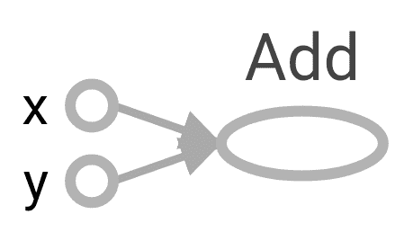
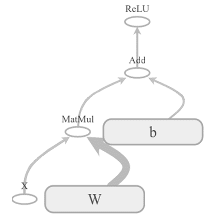
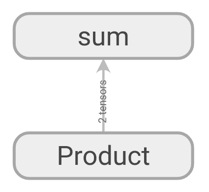
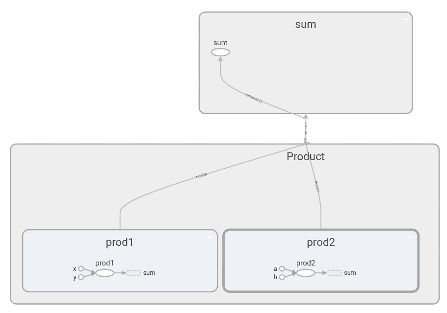
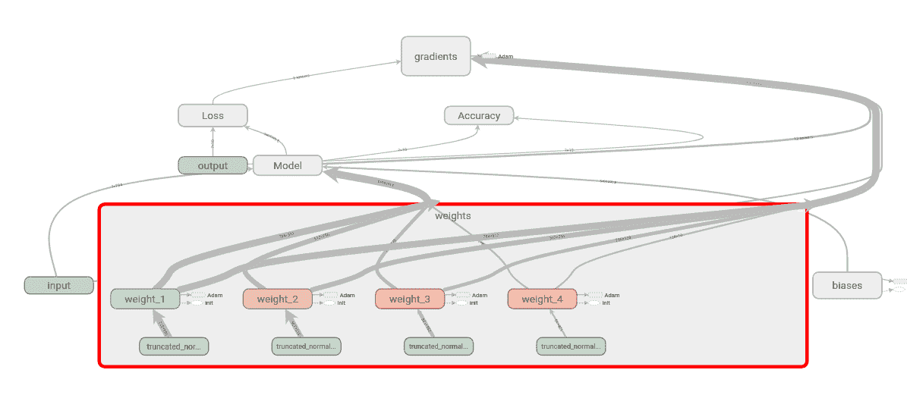
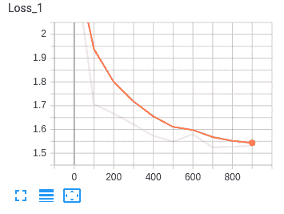

# 二、了解TensorFlow

在本章中，我们将了解 TensorFlow，这是最常用的深度学习库之一。在本书中，我们将使用 TensorFlow 从头开始构建深度学习模型。因此，在本章中，我们将掌握 TensorFlow 及其功能。我们还将了解 TensorBoard，这是一个由 TensorFlow 提供的可视化工具，用于可视化模型。接下来，我们将学习如何构建我们的第一个神经网络，使用 TensorFlow 来执行手写数字分类。接下来，我们将了解 TensorFlow 2.0，这是 TensorFlow 的最新版本。我们将了解 TensorFlow 2.0 与之前的版本有何不同，以及它如何使用 Keras 作为其高级 API。

在本章中，我们将讨论以下主题:

*   TensorFlow
*   计算图和会话
*   变量、常量和占位符
*   张量板
*   TensorFlow 中的手写数字分类
*   TensorFlow中的数学运算
*   TensorFlow 2.0 和 Keras


# 什么是TensorFlow？

TensorFlow 是 Google 的开源软件库，广泛用于数值计算。它是构建深度学习模型最常用的库之一。它具有高度的可伸缩性，可以在多种平台上运行，比如 Windows、Linux、macOS 和 Android。它最初是由谷歌大脑团队的研究人员和工程师开发的。

TensorFlow 支持在任何设备上执行，包括 CPU、GPU 和 TPU(张量处理单元)以及移动和嵌入式平台。由于其灵活的架构和易于部署，它已经成为许多研究人员和科学家构建深度学习模型的热门选择。

在 TensorFlow 中，每个计算都由数据流图表示，也称为**计算图**，其中一个节点表示运算，如加法或乘法，一条边表示张量。数据流图也可以在许多不同的平台上共享和执行。TensorFlow 提供了一个可视化工具，称为 TensorBoard，用于可视化数据流图。

一个**张量**只是一个多维数组。因此，当我们说TensorFlow时，它实际上是计算图中多维数组(张量)的流。

您只需在终端中键入以下命令，即可通过`pip`轻松安装 TensorFlow。我们将安装 TensorFlow 1.13.1:

```
pip install tensorflow==1.13.1
```

我们可以通过运行以下简单的`Hello TensorFlow!`程序来检查 TensorFlow 的安装是否成功:

```
import tensorflow as tf

hello = tf.constant("Hello TensorFlow!")
sess = tf.Session()
print(sess.run(hello))
```

前面的程序应该打印`Hello TensorFlow!`。如果您得到任何错误，那么您可能没有正确安装 TensorFlow。


# 理解计算图和会话

正如我们所了解的，TensorFlow 中的每个计算都由一个计算图来表示。它们由若干个节点和边组成，其中节点是数学运算，如加法和乘法，边是张量。计算图在优化资源和促进分布式计算方面非常有效。

计算图由排列在节点图中的几个TensorFlow运算组成。

让我们考虑一个基本的加法运算:

```
import tensorflow as tf

x = 2
y = 3
z = tf.add(x, y, name='Add')
```

上述代码的计算图如下所示:



当我们致力于构建一个真正复杂的神经网络时，计算图有助于我们理解网络架构。例如，让我们考虑一个简单的层，。其计算图将表示如下:



在计算图中有两种类型的依赖，称为直接和间接依赖。假设我们有`b`节点，它的输入依赖于`a`节点的输出；这种类型的依赖称为**直接依赖**，如下面的代码所示:

```
a = tf.multiply(8,5)
b = tf.multiply(a,1)
```

当`b`节点的输入不依赖于`a`节点时，称为**间接依赖**，如下面的代码所示:

```
a = tf.multiply(8,5)
b = tf.multiply(4,3)
```

因此，如果我们能够理解这些依赖性，我们就可以在可用的资源中分配独立的计算，并减少计算时间。每当我们导入 TensorFlow 时，会自动创建一个默认图形，并且我们创建的所有节点都与该默认图形相关联。我们也可以创建我们自己的图，而不是使用默认的图，这在一个文件中构建多个不相互依赖的模型时非常有用。可以使用`tf.Graph()`创建一个TensorFlow图，如下所示:

```
graph = tf.Graph()

with graph.as_default():
     z = tf.add(x, y, name='Add')
```

如果我们想要清除默认图形(也就是说，如果我们想要清除先前定义的变量和操作)，那么我们可以使用`tf.reset_default_graph()`来完成。


# 会议

我们将创建一个计算图，它的节点上有操作，边上有张量，为了执行这个图，我们使用了一个 TensorFlow 会话。

可以使用`tf.Session()`创建 TensorFlow 会话，如下面的代码所示，它将分配内存来存储变量的当前值:

```
sess = tf.Session()
```

创建会话后，我们可以使用`sess.run()`方法执行我们的图表。

TensorFlow 中的每一个计算都用一个计算图来表示，所以我们需要对每一件事都运行一个计算图。也就是说，为了在 TensorFlow 上计算任何东西，我们需要创建一个 TensorFlow 会话。

让我们执行以下代码将两个数字相乘:

```
a = tf.multiply(3,3)
print(a)
```

上面的代码将打印一个 TensorFlow 对象`Tensor("Mul:0", shape=(), dtype=int32)`，而不是打印`9`。

正如我们之前讨论的，每当我们导入 TensorFlow 时，将自动创建一个默认的计算图，并且所有节点都将附加到该图。因此，当我们打印`a`时，它只返回 TensorFlow 对象，因为`a`的值还没有被计算，因为计算图还没有被执行。

为了执行图表，我们需要初始化并运行 TensorFlow 会话，如下所示:

```
a = tf.multiply(3,3)
with tf.Session as sess:
    print(sess.run(a))
```

前面的代码将打印`9`。


# 变量、常量和占位符

变量、常数和占位符是TensorFlow的基本元素。然而，这三者之间总是混淆不清。让我们一个一个地看每一个元素，并了解它们之间的区别。


# 变量

变量是用来存储值的容器。变量被用作计算图中其他几个运算的输入。可以使用`tf.Variable()`函数创建一个变量，如下面的代码所示:

```
x = tf.Variable(13)
```

让我们使用`tf.Variable()`创建一个名为`W`的变量，如下所示:

```
W = tf.Variable(tf.random_normal([500, 111], stddev=0.35), name="weights")
```

正如您在前面的代码中看到的，我们通过从标准偏差为`0.35`的正态分布中随机抽取值来创建变量`W`。

`tf.Variable()`中那个叫`name`的参数是什么？

它用于设置计算图中变量的名称。因此，在前面的代码中，Python 将变量保存为`W`，但是在 TensorFlow 图中，它将被保存为`weights`。

我们也可以使用`initialized_value()`用另一个变量的值初始化一个新变量。例如，如果我们想创建一个名为`weights_2`的新变量，使用先前定义的`weights`变量中的一个值，可以如下完成:

然而，在定义了一个变量之后，我们需要初始化计算图中的所有变量。这可以使用`tf.global_variables_initializer()`来完成。

一旦我们创建了一个会话，首先，我们运行初始化操作，这将初始化所有已定义的变量，然后我们才能运行其他操作，如下面的代码所示:

```
W2 = tf.Variable(weights.initialized_value(), name="weights_2")
```

我们还可以使用`tf.get_variable()`创建一个 TensorFlow 变量。它有三个重要的参数，分别是`name`、`shape`和`initializer`。

与`tf.Variable()`不同，我们不能将值直接传递给`tf.get_variable()`；相反，我们使用`initializer`。有几个初始化器可用于初始化值。例如，`tf.constant_initializer(value)`用一个常数值初始化变量，而`tf.random_normal_initializer(mean, stddev)`用指定的平均值和标准偏差从随机正态分布中抽取值来初始化变量。

```
x = tf.Variable(1212)
init = tf.global_variables_initializer()

with tf.Session() as sess:
  sess.run(init) 
  print sess.run(x)
```

使用`tf.Variable()`创建的变量是不能共享的，每次我们调用`tf.Variable()`的时候，它都会创建一个新的变量。但是`tf.get_variable()`用指定的参数检查现有变量的计算图。如果变量已经存在，那么它将被重用；否则，将创建一个新变量:

因此，前面的代码检查是否有任何已经存在的变量带有给定的参数。如果是，那么它将重用它；否则，它将创建一个新的变量。

由于我们使用`tf.get_variable()`重用变量，为了避免名称冲突，我们使用`tf.variable_scope`，如下面的代码所示。变量作用域基本上是一种名称作用域技术，它只是在作用域内给变量添加一个前缀，以避免命名冲突:

```
W3 = tf.get_variable(name = 'weights', shape = [500, 111], initializer = random_normal_initializer()))
```

如果你打印`a.name`和`b.name`，那么它会返回同一个名字，就是`scope/x:0`。如您所见，我们在名为`scope`的变量作用域中指定了`reuse=True`参数，这意味着变量可以共享。如果我们不设置`reuse = True`，那么它会给出一个错误，说变量已经存在。

建议使用`tf.get_variable()`而不是`tf.Variable()`，因为`tf.get_variable`，允许你共享变量，而且会让代码重构更容易。

常数

```
with tf.variable_scope("scope"):
 a = tf.get_variable('x', [2])

with tf.variable_scope("scope", reuse = True):
 b = tf.get_variable('x', [2])
```

与变量不同，常量的值不能改变。也就是说，常数是不可变的。一旦它们被赋予了值，它们就不能被改变。我们可以使用`tf.constant()`创建常量，如下面的代码所示:

占位符和提要词典


# 我们可以把占位符看作变量，在这里我们只定义类型和维度，但不赋值。占位符的值将在运行时输入。我们使用占位符将数据输入计算图。占位符被定义为没有值。

可以使用`tf.placeholder()`定义占位符。它采用一个名为`shape`的可选参数，表示数据的维度。如果`shape`设置为`None`，那么我们可以在运行时输入任意大小的数据。占位符可以定义如下:

```
 x = tf.constant(13)
```


# 简单来说，我们使用`tf.Variable`存储数据，使用`tf.placeholder`提供外部数据。

让我们考虑一个简单的例子来更好地理解占位符:

如果我们运行前面的代码，那么它将返回一个错误，因为我们试图计算`y`，其中`y= x+3`和`x`是一个占位符，其值没有被赋值。正如我们所了解的，占位符的值将在运行时分配。我们使用`feed_dict`参数分配占位符的值。`feed_dict`参数基本上是一个字典，其中键代表占位符的名称，值代表占位符的值。

```
 x = tf.placeholder("float", shape=None)
```

正如您在下面的代码中看到的，我们设置了`feed_dict = {x:5}`，这意味着`x`占位符的值是`5`:

前面的代码返回`8.0`。

```
x = tf.placeholder("float", None)
y = x +3

with tf.Session() as sess:
    result = sess.run(y)
    print(result)
```

如果我们想对`x`使用多个值呢？由于我们没有为占位符定义任何形状，因此它接受任意数量的值，如以下代码所示:

它将返回以下内容:

```
with tf.Session() as sess:
    result = sess.run(y, feed_dict={x: 5})
    print(result)
```

假设我们将`x`的形状定义为`[None,2]`，如以下代码所示:

What if we want to use multiple values for `x`? As we have not defined any shapes for the placeholders, it takes any number of values, as shown in the following code:

```
with tf.Session() as sess:
    result = sess.run(y, feed_dict={x: [3,6,9]})
    print(result)
```

It will return the following:

```
[ 6\.  9\. 12.]
```

Let's say we define the shape of `x` as `[None,2]`, as shown in the following code:

```
x = tf.placeholder("float", [None, 2])
```

这意味着`x`可以接受除了`2`列之外的任何行的矩阵，如下面的代码所示:

上述代码返回以下内容:

介绍 TensorBoard

TensorBoard 是 TensorFlow 的可视化工具，可以用来可视化一个计算图。它还可以用来绘制各种定量指标和几个中间计算的结果。当我们在训练一个真正深度的神经网络时，当我们不得不调试网络时，它变得令人困惑。因此，如果我们可以在 TensorBoard 中可视化计算图，我们就可以很容易地理解这样复杂的模型，调试它们，并优化它们。TensorBoard 也支持分享。

```
with tf.Session() as sess:
    x_val = [[1, 2,], 
              [3,4],
              [5,6],
              [7,8],]
    result = sess.run(y, feed_dict={x: x_val})
    print(result)
```

如下面的屏幕截图所示，TensorBoard 面板由几个选项卡组成——标量、图像、音频、图形、分布、直方图和嵌入:

```
[[ 4\.  5.]

 [ 6\.  7.]

 [ 8\.  9.]

 [10\. 11.]]
```


# 

这些选项卡非常简单明了。标量选项卡显示了我们在程序中使用的标量变量的有用信息。例如，它显示了一个称为 loss 的标量变量的值如何在多次迭代中变化。

图形选项卡显示计算图。分布和直方图选项卡显示变量的分布。例如，我们的模型的重量分布和直方图可以在这些选项卡下看到。**嵌入**选项卡用于可视化高维向量，如词嵌入(我们将在[第 7 章](d184e022-0b11-492a-8303-37a6021c4bf6.xhtml)、*学习文本表示*中详细了解)。


让我们建立一个基本的计算图，并在 TensorBoard 中可视化。假设我们有四个变量，如下所示:

让我们将`x`和`y`以及`a`和`b`相乘，并保存为`prod1`和`prod2`，如下面的代码所示:

添加`prod1`和`prod2`并存储在`sum`中:

现在，我们可以在 TensorBoard 中可视化所有这些操作。为了在 TensorBoard 中可视化，我们首先需要保存我们的事件文件。可以使用`tf.summary.FileWriter()`来完成。它需要两个重要的参数，`logdir`和`graph`。

```
x = tf.constant(1,name='x')
y = tf.constant(1,name='y')
a = tf.constant(3,name='a')
b = tf.constant(3,name='b')
```

顾名思义，`logdir`指定我们想要存储图形的目录，而`graph`指定我们想要存储哪个图形:

```
prod1 = tf.multiply(x,y,name='prod1')
prod2 = tf.multiply(a,b,name='prod2')
```

在前面的代码中，`graphs`是我们存储事件文件的目录，`sess.graph`指定了 TensorFlow 会话中的当前图形。因此，我们将当前图形存储在目录`graphs`中的 TensorFlow 会话中。

```
sum = tf.add(prod1,prod2,name='sum')
```

要启动 TensorBoard，请转到您的终端，找到工作目录，并键入以下内容:

`logdir`参数表示存储事件文件的目录，`port`是端口号。运行前面的命令后，打开浏览器并键入`http://localhost:8000/`。

```
with tf.Session() as sess:
    writer = tf.summary.FileWriter(logdir='./graphs',graph=sess.graph)
    print(sess.run(sum))
```

在 TensorBoard 面板中，在“图形”选项卡下，您可以看到计算图:


```
tensorboard --logdir=graphs --port=8000
```

您可能已经注意到，我们定义的所有操作都清楚地显示在图表中。

创建名称范围

作用域用于降低复杂性，并通过将相关节点组合在一起帮助我们更好地理解模型。拥有一个名称范围有助于我们在一个图中对相似的操作进行分组。当我们构建一个复杂的架构时，它会派上用场。可以使用`tf.name_scope()`创建范围。在前面的例子中，我们执行了两个操作，`Product`和`sum`。我们可以简单地将它们分成两个不同的名字范围，分别是`Product`和`sum`。

在上一节中，我们看到了`prod1`和`prod2`如何执行乘法并计算结果。我们将定义一个名为`Product`的名称范围，并将`prod1`和`prod2`操作分组，如以下代码所示:


# 现在，定义`sum`的名称范围:

将文件存储在`graphs`目录中:

在 TensorBoard 中可视化图形:

```
with tf.name_scope("Product"):
    with tf.name_scope("prod1"):
        prod1 = tf.multiply(x,y,name='prod1')

    with tf.name_scope("prod2"):
        prod2 = tf.multiply(a,b,name='prod2')
```

您可能注意到，现在我们只有两个节点， **sum** 和 **Product** :

```
with tf.name_scope("sum"):
    sum = tf.add(prod1,prod2,name='sum')
```



```
with tf.Session() as sess:
    writer = tf.summary.FileWriter('./graphs', sess.graph)
    print(sess.run(sum))
```

双击节点后，我们可以看到计算是如何进行的。如您所见， **prod1** 和 **prod2** 节点被分组在 **Product** 范围下，它们的结果被发送到 **sum** 节点，在那里它们将被添加。您可以看到 **prod1** 和 **prod2** 节点如何计算它们的值:

```
tensorboard --logdir=graphs --port=8000
```



前面的例子只是一个简单的例子。当我们处理一个有很多操作的复杂项目时，名字范围帮助我们将相似的操作组合在一起，并使我们能够更好地理解计算图。

基于TensorFlow的手写数字分类

把我们到目前为止学到的所有概念放在一起，我们将看到如何使用 TensorFlow 来建立一个识别手写数字的神经网络。如果你最近一直在玩深度学习，那么你一定遇到过 MNIST 数据集。它被称为深度学习的 *hello world* 。它由 55，000 个数据点的手写数字(0 到 9)组成。

在本节中，我们将看到如何使用我们的神经网络来识别这些手写数字，我们将掌握 TensorFlow 和 TensorBoard 的窍门。


# 导入所需的库

首先，让我们导入所有需要的库:

加载数据集


# 使用以下代码加载数据集:

在前面的代码中，`data/mnist`表示我们存储 MNIST 数据集的位置，`one_hot=True`表示我们正在对标签(0 到 9)进行一次性编码。

```
import warnings
warnings.filterwarnings('ignore')

import tensorflow as tf
from tensorflow.examples.tutorials.mnist import input_data
tf.logging.set_verbosity(tf.logging.ERROR)

import matplotlib.pyplot as plt
%matplotlib inline
```


# 通过执行以下代码，我们将看到我们的数据中有什么:

我们在训练集中有`55000`图像，每个图像的大小是`784`，我们有`10`标签，实际上是 0 到 9。类似地，我们在测试集中有`10000`个图像。

```
mnist = input_data.read_data_sets("data/mnist", one_hot=True)
```

现在，我们将绘制一个输入图像，看看它看起来像什么:

因此，我们的输入图像如下所示:

```
print("No of images in training set {}".format(mnist.train.images.shape))
print("No of labels in training set {}".format(mnist.train.labels.shape))

print("No of images in test set {}".format(mnist.test.images.shape))
print("No of labels in test set {}".format(mnist.test.labels.shape))

No of images in training set (55000, 784)

No of labels in training set (55000, 10)

No of images in test set (10000, 784)

No of labels in test set (10000, 10)
```


定义每层中神经元的数量

```
img1 = mnist.train.images[0].reshape(28,28)
plt.imshow(img1, cmap='Greys')
```

我们将建立一个具有三个隐藏层和一个输出层的四层神经网络。由于输入图像的大小是`784`，我们设置`num_input`到`784`，由于我们有 10 个手写数字(0 到 9)，我们在输出层设置`10`神经元。我们将每层中的神经元数量定义如下:

定义占位符


# 正如我们所了解的，我们首先需要为`input`和`output`定义占位符。占位符的值将在运行时通过`feed_dict`输入:

由于我们有一个四层网络，我们有四个权重和四个偏差。我们通过从标准偏差为`0.1`的截断正态分布中提取值来初始化我们的权重。记住，权重矩阵的维数应该是前一层中神经元的*数量*和当前层中神经元的*数量。例如，权重矩阵`w3`的维数应该是隐含层 2* 的神经元数*x 隐含层 3* 的神经元数。

```
#number of neurons in input layer
num_input = 784

#num of neurons in hidden layer 1
num_hidden1 = 512

#num of neurons in hidden layer 2
num_hidden2 = 256

#num of neurons in hidden layer 3
num_hidden_3 = 128

#num of neurons in output layer
num_output = 10
```


# Defining placeholders

我们通常在字典中定义所有的权重，如下所示:

```
with tf.name_scope('input'):
    X = tf.placeholder("float", [None, num_input])

with tf.name_scope('output'):
    Y = tf.placeholder("float", [None, num_output])
```

偏差的形状应该是当前层中神经元的数量。例如，`b2`偏差的维数是隐藏层 2 中神经元的数量。我们将偏置值设置为常数；`0.1`在所有层中:

正向传播

现在我们将定义正向传播操作。我们将在所有层中使用 ReLU 激活。在最后一层，我们将应用`sigmoid`激活，如下面的代码所示:

```
with tf.name_scope('weights'):

 weights = {
 'w1': tf.Variable(tf.truncated_normal([num_input, num_hidden1], stddev=0.1),name='weight_1'),
 'w2': tf.Variable(tf.truncated_normal([num_hidden1, num_hidden2], stddev=0.1),name='weight_2'),
 'w3': tf.Variable(tf.truncated_normal([num_hidden2, num_hidden_3], stddev=0.1),name='weight_3'),
 'out': tf.Variable(tf.truncated_normal([num_hidden_3, num_output], stddev=0.1),name='weight_4'),
 }
```

计算损失和反向传播

```
with tf.name_scope('biases'):

    biases = {
        'b1': tf.Variable(tf.constant(0.1, shape=[num_hidden1]),name='bias_1'),
        'b2': tf.Variable(tf.constant(0.1, shape=[num_hidden2]),name='bias_2'),
        'b3': tf.Variable(tf.constant(0.1, shape=[num_hidden_3]),name='bias_3'),
        'out': tf.Variable(tf.constant(0.1, shape=[num_output]),name='bias_4')
    }
```


# 接下来，我们将定义我们的损失函数。我们将使用 softmax 交叉熵作为我们的损失函数。TensorFlow 提供了用于计算 softmax 交叉熵损失的`tf.nn.softmax_cross_entropy_with_logits()`函数。它将两个参数作为输入，`logits`和`labels`:

`logits`参数指定我们的网络预测的`logits`；例如，`y_hat`

```
with tf.name_scope('Model'):

    with tf.name_scope('layer1'):
        layer_1 = tf.nn.relu(tf.add(tf.matmul(X, weights['w1']), biases['b1']) ) 

    with tf.name_scope('layer2'):
        layer_2 = tf.nn.relu(tf.add(tf.matmul(layer_1, weights['w2']), biases['b2']))

    with tf.name_scope('layer3'):
        layer_3 = tf.nn.relu(tf.add(tf.matmul(layer_2, weights['w3']), biases['b3']))

    with tf.name_scope('output_layer'):
         y_hat = tf.nn.sigmoid(tf.matmul(layer_3, weights['out']) + biases['out'])
```


# `labels`参数指定实际标签；例如，真实标签，`Y`

我们使用`tf.reduce_mean()`取`loss`函数的平均值:

*   现在，我们需要使用反向传播来最小化损失。放心吧！我们不必手动计算所有权重的导数。相反，我们可以使用 TensorFlow 的优化器。在本节中，我们将使用 Adam 优化器。它是我们在[第一章](92f3c897-c0d4-40f8-8f63-bd11240f2189.xhtml)、*深度学习介绍*中了解到的梯度下降优化技术的变体。在[第 3 章](28ee30be-bf81-4b2b-be0f-08ec3b03a9a7.xhtml)、*梯度下降及其变体*中，我们将深入细节，看看 Adam 优化器和其他几个优化器到底是如何工作的。现在，假设我们使用 Adam 优化器作为反向传播算法:
*   The `labels` parameter specifies the actual labels; for example, true labels, `Y`

We take the mean of the `loss` function using `tf.reduce_mean()`:

```
with tf.name_scope('Loss'):
        loss = tf.reduce_mean(tf.nn.softmax_cross_entropy_with_logits(logits=y_hat,labels=Y))
```

计算精度

```
learning_rate = 1e-4
optimizer = tf.train.AdamOptimizer(learning_rate).minimize(loss)
```

我们计算模型的精确度如下:

`y_hat`参数表示我们的模型的每个类别的预测概率。因为我们有`10`类，我们将有`10`概率。如果在位置`7`的概率高，则意味着我们的网络以高概率将输入图像预测为数字`7`。`tf.argmax()`函数返回最大值的索引。因此，`tf.argmax(y_hat,1)`给出概率高的索引。因此，如果索引`7`处的概率很高，则返回`7`。


# `Y`参数表示实际的标签，它们是独热编码值。也就是说，除了在实际图像的位置，它在任何地方都由零组成，在实际图像的位置，它由`1`组成。例如，如果输入图像是`7`，那么`Y`在除了索引`7`之外的所有索引处都是 0，在索引`7`处它具有`1`。因此，`tf.argmax(Y,1)`返回`7`，因为在那里我们有一个高值`1`。

因此，`tf.argmax(y_hat,1)`给出预测数字，而`tf.argmax(Y,1)`给出实际数字。

*   `tf.equal(x, y)`函数将`x`和`y`作为输入，并逐元素返回 *(x == y)* 的真值。因此，`correct_pred = tf.equal(predicted_digit,actual_digit)`由实际和预测数字相同的`True`和实际和预测数字不同的`False`组成。我们使用 TensorFlow 的 cast 操作`tf.cast(correct_pred, tf.float32)`将`correct_pred`中的布尔值转换为浮点值。在将它们转换成浮点值后，我们使用`tf.reduce_mean()`取平均值。
*   因此，`tf.reduce_mean(tf.cast(correct_pred, tf.float32))`给了我们平均正确的预测:

创建摘要

我们还可以在 TensorBoard 中可视化我们的模型在几次迭代中的损失和准确性如何变化。所以，我们使用`tf.summary()`来获得变量的汇总。由于损耗和精度是标量变量，我们使用`tf.summary.scalar()`，如以下代码所示:

接下来，我们使用`tf.summary.merge_all()`合并图表中使用的所有摘要。我们这样做是因为当我们有许多摘要时，运行和存储它们会变得低效，所以我们在会话中运行它们一次，而不是运行多次:

```
with tf.name_scope('Accuracy'):

    predicted_digit = tf.argmax(y_hat, 1)
    actual_digit = tf.argmax(Y, 1)

    correct_pred = tf.equal(predicted_digit,actual_digit)
    accuracy = tf.reduce_mean(tf.cast(correct_pred, tf.float32))
```


# 训练模型

现在，是时候训练我们的模型了。正如我们所了解的，首先，我们需要初始化所有的变量:

```
tf.summary.scalar("Accuracy", accuracy)
tf.summary.scalar("Loss", loss)
```

定义批次大小、迭代次数和学习率，如下所示:

```
merge_summary = tf.summary.merge_all()
```


# 启动TensorFlow会话:

初始化所有变量:

```
init = tf.global_variables_initializer()
```

保存事件文件:

```
learning_rate = 1e-4
num_iterations = 1000
batch_size = 128
```

对模型进行多次迭代训练:

```
with tf.Session() as sess:
```

根据批量大小获取一批数据:

```
    sess.run(init)
```

训练网络:

```
    summary_writer = tf.summary.FileWriter('./graphs', graph=sess.graph)
```

每 100 次^(迭代打印`loss`和`accuracy`:)

```
    for i in range(num_iterations):
```

您可能会从以下输出中注意到，在各种训练迭代中，损失会减少，精度会提高:

```
        batch_x, batch_y = mnist.train.next_batch(batch_size)
```

在 TensorBoard 中可视化图形

```
        sess.run(optimizer, feed_dict={ X: batch_x, Y: batch_y})
```

经过训练，我们可以在 TensorBoard 中可视化我们的计算图，如下图所示。如您所见，我们的**模型**将输入、权重和偏差作为输入，并返回输出。我们根据模型的输出计算损耗和精度。我们通过计算梯度和更新权重来最小化损失。我们可以在下图中观察到这一切:

```
        if i % 100 == 0:

            batch_loss, batch_accuracy,summary = sess.run(
                [loss, accuracy, merge_summary], feed_dict={X: batch_x, Y: batch_y}
                )

            #store all the summaries    
            summary_writer.add_summary(summary, i)

            print('Iteration: {}, Loss: {}, Accuracy: {}'.format(i,batch_loss,batch_accuracy))
```


```
Iteration: 0, Loss: 2.30789709091, Accuracy: 0.1171875

Iteration: 100, Loss: 1.76062202454, Accuracy: 0.859375

Iteration: 200, Loss: 1.60075569153, Accuracy: 0.9375

Iteration: 300, Loss: 1.60388696194, Accuracy: 0.890625

Iteration: 400, Loss: 1.59523034096, Accuracy: 0.921875

Iteration: 500, Loss: 1.58489584923, Accuracy: 0.859375

Iteration: 600, Loss: 1.51407408714, Accuracy: 0.953125

Iteration: 700, Loss: 1.53311181068, Accuracy: 0.9296875

Iteration: 800, Loss: 1.57677125931, Accuracy: 0.875

Iteration: 900, Loss: 1.52060437202, Accuracy: 0.9453125
```


# 如果我们双击并展开**模型**，我们可以看到我们有三个隐藏层和一个输出层:


同样，我们可以双击并查看每个节点。例如，如果我们打开**权重**，我们可以看到如何使用截尾正态分布初始化这四个权重，以及如何使用 Adam 优化器更新它:



正如我们所知，计算图有助于我们理解每个节点上发生的事情。双击**精确度**节点，我们可以看到精确度是如何计算的:


请记住，我们还存储了我们的`loss`和`accuracy`变量的摘要。我们可以在 TensorBoard 的 SCALARS 选项卡下找到它们，如下图所示。我们可以看到这种损失是如何随着迭代减少的，如下面的屏幕截图所示:



下面的屏幕截图显示了精确度是如何随着迭代而增加的:


引入热切执行

TensorFlow 中的急切执行更加 Pythonic 化，并允许快速原型化。与每次执行任何操作都需要构建一个图的图形模式不同，急切执行遵循命令式编程范式，任何操作都可以立即执行，而不必创建图，就像我们在 Python 中一样。因此，有了热切的执行，我们就可以告别会话和占位符了。与图形模式不同，它还使调试过程变得更容易，并立即出现运行时错误。

例如，在图形模式下，为了计算任何东西，我们运行会话。如下面的代码所示，为了计算`z`的值，我们必须运行 TensorFlow 会话:


# 有了急切执行，我们不需要创建会话；我们可以简单地计算`z`，就像我们在 Python 中做的一样。为了启用急切执行，只需调用`tf.enable_eager_execution()`函数:

它将返回以下内容:

为了获得输出值，我们可以打印以下内容:

```
x = tf.constant(11)
y = tf.constant(11)
z = x*y

with tf.Session() as sess:
    print sess.run(z)
```

With eager execution, we don't need to create a session; we can simply compute `z`, just like we do in Python. In order to enable eager execution, just call the `tf.enable_eager_execution()` function:

```
x = tf.constant(11)
y = tf.constant(11)
z = x*y

print z
```

It will return the following:

```
<tf.Tensor: id=789, shape=(), dtype=int32, numpy=121>
```

TensorFlow中的数学运算

```
z.numpy()

121
```

现在，我们将使用急切执行模式探索 TensorFlow 中的一些操作:

让我们从一些基本的算术运算开始。


# 使用`tf.add`添加两个数字:

`tf.subtract`函数用于找出两个数字之间的差异:

```
x = tf.constant([1., 2., 3.])
y = tf.constant([3., 2., 1.])
```

`tf.multiply`功能用于将两个数相乘:

使用`tf.divide`将两个数相除:

```
sum = tf.add(x,y)
sum.numpy()

array([4., 4., 4.], dtype=float32)
```

点积的计算方法如下:

```
difference = tf.subtract(x,y)
difference.numpy()

array([-2.,  0.,  2.], dtype=float32)
```

接下来，让我们找到最小和最大元素的索引:

```
product = tf.multiply(x,y)
product.numpy()

array([3., 4., 3.], dtype=float32)
```

Divide two numbers using `tf.divide`:

```
division = tf.divide(x,y)
division.numpy()

array([0.33333334, 1\.        , 3\.        ], dtype=float32)
```

使用`tf.argmin()`计算最小值的索引:

```
dot_product = tf.reduce_sum(tf.multiply(x, y))
dot_product.numpy()

10.0
```

使用`tf.argmax()`计算最大值的指数:

```
x = tf.constant([10, 0, 13, 9])
```

运行以下代码，找出`x`和`y`之间的平方差:

让我们试试类型化；也就是说，从一种数据类型转换成另一种数据类型。

```
tf.argmin(x).numpy()

1
```

打印`x`的类型:

```
tf.argmax(x).numpy()

2
```

我们可以使用`tf.cast`将`x`的类型`tf.int32`转换为`tf.float32`，如下面的代码所示:

```
x = tf.Variable([1,3,5,7,11])
y = tf.Variable([1])

tf.math.squared_difference(x,y).numpy()

[  0,   4,  16,  36, 100]
```

现在，检查`x`类型。它将是`tf.float32`，如下所示:

连接两个矩阵:

```
print x.dtype

tf.int32
```

We can convert the type of `x`, which is `tf.int32`, into `tf.float32` using `tf.cast`, as shown in the following code:

```
x = tf.cast(x, dtype=tf.float32)
```

Now, check the `x` type. It will be `tf.float32`, as follows:

```
print x.dtype

tf.float32
```

按行连接矩阵:

```
x = [[3,6,9], [7,7,7]]
y = [[4,5,6], [5,5,5]]
```

使用以下代码按列连接矩阵:

使用`stack`函数堆叠`x`矩阵:

现在，让我们看看如何执行`reduce_mean`操作:

```
tf.concat([x, y], 0).numpy()

array([[3, 6, 9],

       [7, 7, 7],

       [4, 5, 6],

       [5, 5, 5]], dtype=int32)
```

计算`x`的平均值；即 *(1.0 + 5.0 + 2.0 + 3.0) / 4* :

```
tf.concat([x, y], 1).numpy()

array([[3, 6, 9, 4, 5, 6],
       [7, 7, 7, 5, 5, 5]], dtype=int32)
```

计算整行的平均值；即 *(1.0+5.0)/2，(2.0+3.0)/2* :

```
tf.stack(x, axis=1).numpy()

array([[3, 7],

       [6, 7],

       [9, 7]], dtype=int32)
```

Now, let' see how to perform the `reduce_mean` operation:

```
x = tf.Variable([[1.0, 5.0], [2.0, 3.0]])

x.numpy()

array([[1., 5.],

       [2., 3.]]
```

计算整个列的平均值；即 *(1.0+5.0)/2.0，(2.0+3.0)/2.0* :

```
tf.reduce_mean(input_tensor=x).numpy() 

2.75
```

从概率分布中抽取随机值:

```
tf.reduce_mean(input_tensor=x, axis=0).numpy() 

array([1.5, 4\. ], dtype=float32)
```

计算软最大概率:

现在，我们来看看如何计算梯度。

```
tf.reduce_mean(input_tensor=x, axis=1, keepdims=True).numpy()

array([[3\. ],

       [2.5]], dtype=float32)
```

定义`square`功能:

```
tf.random.normal(shape=(3,2), mean=10.0, stddev=2.0).numpy()

tf.random.uniform(shape = (3,2), minval=0, maxval=None, dtype=tf.float32,).numpy()
```

可以使用`tf.GradientTape`为前面的`square`函数计算梯度，如下所示:

```
x = tf.constant([7., 2., 5.])

tf.nn.softmax(x).numpy()

array([0.8756006 , 0.00589975, 0.11849965], dtype=float32)
```

更多 TensorFlow 操作可在[http://bit.ly/2YSYbYu](http://bit.ly/2YSYbYu)的 GitHub 上的笔记本中获得。

TensorFlow 远不止这些。随着本书的深入，我们将了解 TensorFlow 的各种重要功能。

```
def square(x):
  return tf.multiply(x, x)
```

The gradients can be computed for the preceding `square` function using `tf.GradientTape`, as follows:

```
with tf.GradientTape(persistent=True) as tape:
     print square(6.).numpy()

36.0
```

More TensorFlow operations are available in the Notebook on GitHub at [http://bit.ly/2YSYbYu](http://bit.ly/2YSYbYu).

TensorFlow 2.0 和 Keras

TensorFlow 2.0 有一些非常酷的功能。默认情况下，它设置急切执行模式。它提供了简化的工作流程，并使用 Keras 作为构建深度学习模型的主要 API。它还向后兼容 TensorFlow 1.x 版本。

要安装 TensorFlow 2.0，请打开终端并键入以下命令:


# 由于 TensorFlow 2.0 使用 Keras 作为高级 API，我们将在下一节中了解 Keras 的工作原理。

你好，Keras

Keras 是另一个广泛使用的深度学习库。它是由谷歌的 Franç ois Chollet 开发的。它以快速的原型制作而闻名，并且使模型构建变得简单。它是一个高级库，这意味着它本身不执行任何低级操作，如卷积。它使用后端引擎来完成这项工作，比如 TensorFlow。Keras API 在`tf.keras`中可用，TensorFlow 2.0 将其作为主要 API。

```
pip install tensorflow==2.0.0-alpha0
```

在 Keras 中构建模型包括四个重要步骤:


# 定义模型

编译模型

拟合模型

1.  评估模型
2.  定义模型
3.  第一步是定义模型。Keras 提供了两种不同的 API 来定义模型:
4.  顺序 API


# 功能 API

The first step is defining the model. Keras provides two different APIs to define the model:

*   定义顺序模型
*   在顺序模型中，我们将每一层一层堆叠起来:

首先，让我们将模型定义为一个`Sequential()`模型，如下所示:


# 现在，定义第一层，如以下代码所示:

在前面的代码中，`Dense`表示一个完全连接的层，`input_dim`表示我们输入的维度，`activation`指定我们使用的激活函数。我们可以想叠多少层就叠多少层，一层在另一层上面。

```
from keras.models import Sequential
from keras.layers import Dense
```

通过激活`relu`定义下一层，如下所示:

```
model = Sequential()
```

用`sigmoid`激活定义输出层:

```
model.add(Dense(13, input_dim=7, activation='relu'))
```

顺序模型的最终代码块如下所示。如您所见，Keras 代码比 TensorFlow 代码简单得多:

定义功能模型

```
model.add(Dense(7, activation='relu'))
```

功能模型比顺序模型提供了更多的灵活性。例如，在功能模型中，我们可以很容易地将任何一层连接到另一层，而在顺序模型中，每一层都是一层一层的堆叠。在创建复杂的模型时，例如有向无环图、具有多个输入值、多个输出值和共享图层的模型，函数模型非常方便。现在，我们将看到如何在 Keras 中定义一个功能模型。

```
model.add(Dense(1, activation='sigmoid'))
```

第一步是定义输入尺寸:

```
model = Sequential()
model.add(Dense(13, input_dim=7, activation='relu'))
model.add(Dense(7, activation='relu'))
model.add(Dense(1, activation='sigmoid'))
```


# Defining a functional model

A functional model provides more flexibility than a sequential model. For instance, in a functional model, we can easily connect any layer to another layer, whereas, in a sequential model, each layer is in a stack of one above another. A functional model comes in handy when creating complex models, such as directed acyclic graphs, models with multiple input values, multiple output values, and shared layers. Now, we will see how to define a functional model in Keras.

现在，我们将使用`Dense`类定义第一个带有`10`神经元和`relu`激活的全连接层，如下所示:

```
input = Input(shape=(2,))
```

我们定义了`layer1`，但是`layer1`的输入来自哪里？我们需要在最后的括号符号中指定对`layer1`的输入，如下所示:

我们用`13`神经元和`relu`激活来定义下一层`layer2`。`layer2`的输入来自`layer1`，所以加在最后的括号里，如下面的代码所示:

现在，我们可以用`sigmoid`激活函数定义输出层。输出层的输入来自于`layer2`，所以在最后的括号中添加:

```
layer1 = Dense(10, activation='relu')
```

在定义了所有的层之后，我们使用一个`Model`类来定义模型，这里我们需要指定`inputs`和`outputs`，如下所示:

```
layer1 = Dense(10, activation='relu')(input)
```

功能模型的完整代码如下所示:

```
layer2 = Dense(10, activation='relu')(layer1)
```

编译模型

```
output = Dense(1, activation='sigmoid')(layer2)
```

既然我们已经定义了模型，下一步就是编译它。在这个阶段，我们设置模型应该如何学习。我们在编译模型时定义了三个参数:

```
model = Model(inputs=input, outputs=output)
```

`optimizer`参数:这定义了我们想要使用的优化算法；比如梯度下降，在这种情况下。

```
input = Input(shape=(2,))
layer1 = Dense(10, activation='relu')(input)
layer2 = Dense(10, activation='relu')(layer1)
output = Dense(1, activation='sigmoid')(layer2)
model = Model(inputs=input, outputs=output)
```


# `loss`参数:这是我们试图最小化的目标函数；例如，均方误差或交叉熵损失。

`metrics`参数:这是我们想要用来评估模型性能的度量标准；比如`accuracy`。我们还可以指定多个度量。

*   运行以下代码来编译模型:
*   训练模型
*   我们定义并编译了模型。现在，我们将训练模型。可以使用`fit`功能来训练模型。我们指定我们的特性，`x`；`y`标签；我们要训练的`epochs`的数量；和`batch_size`，如下:

评估模型

```
model.compile(loss='binary_crossentropy', optimizer='sgd', metrics=['accuracy'])
```


# 训练模型后，我们将在测试集上评估模型:

我们还可以在相同的训练集上评估模型，这将有助于我们了解训练的准确性:

```
model.fit(x=data, y=labels, epochs=100, batch_size=10)
```


# 使用 TensorFlow 2.0 进行 MNIST 数字分类

现在，我们将看看如何使用 TensorFlow 2.0 执行 MNIST 手写数字分类。相比 TensorFlow 1.x 只需要几行代码，据我们了解，TensorFlow 2.0 使用 Keras 作为其高级 API 我们只需要将`tf.keras`添加到 Keras 代码中。

```
model.evaluate(x=data_test,y=labels_test)
```

让我们从加载数据集开始:

```
model.evaluate(x=data,y=labels)
```


# MNIST digit classification using TensorFlow 2.0

Now, we will see how we can perform MNIST handwritten digit classification, using TensorFlow 2.0\. It requires only a few lines of code compared to TensorFlow 1.x. As we have learned, TensorFlow 2.0 uses Keras as its high-level API; we just need to add `tf.keras` to the Keras code.

使用以下代码创建一个训练和测试集:

```
mnist = tf.keras.datasets.mnist
```

通过将`x`的值除以`x`的最大值来标准化训练和测试集；也就是`255.0`:

按如下方式定义顺序模型:

现在，让我们给模型添加层。我们使用三层网络，其中`relu`功能和`softmax`位于最后一层:

```
(x_train,y_train), (x_test, y_test) = mnist.load_data()
```

通过运行以下代码行来编译模型:

```
x_train, x_test = tf.cast(x_train/255.0, tf.float32), tf.cast(x_test/255.0, tf.float32)
y_train, y_test = tf.cast(y_train,tf.int64),tf.cast(y_test,tf.int64)
```

训练模型:

```
model = tf.keras.models.Sequential()
```

评估模型:

```
model.add(tf.keras.layers.Flatten())
model.add(tf.keras.layers.Dense(256, activation="relu"))
model.add(tf.keras.layers.Dense(128, activation="relu"))
model.add(tf.keras.layers.Dense(10, activation="softmax"))
```

就是这样！用 Keras API 编写代码就是这么简单。

```
model.compile(optimizer='sgd', loss='sparse_categorical_crossentropy', metrics=['accuracy'])
```

应该用 Keras 还是 TensorFlow？

```
model.fit(x_train, y_train, batch_size=32, epochs=10)
```

我们了解到 TensorFlow 2.0 使用 Keras 作为高级 API。使用高级 API 可以实现快速原型制作。但是当我们想在低层建立一个模型，或者想建立一个高层 API 没有提供的东西时，我们就不能使用高层 API。

```
model.evaluate(x_test, y_test)
```

除此之外，从零开始编写代码加强了我们对算法的了解，并且比直接潜入高级 API 更好地帮助我们理解和学习概念。这就是为什么在本书中，我们将使用 TensorFlow 从头开始编写大部分算法，而不使用 Keras 等高级 API。我们将使用 TensorFlow 版本 1.13.1。


# 摘要

我们从学习 TensorFlow 和它如何使用计算图开始这一章。我们了解到 TensorFlow 中的每个计算都由一个计算图来表示，计算图由几个节点和边组成，其中节点是数学运算，比如加法和乘法，边是张量。

我们了解到变量是用来存储值的容器，它们被用作计算图中其他几个操作的输入。后来，我们了解到占位符就像变量一样，我们只定义类型和维度，但不会赋值，占位符的值将在运行时输入。


# 接下来，我们学习了 TensorBoard，这是 TensorFlow 的可视化工具，可用于可视化计算图。它还可以用来绘制各种定量指标和一些中间计算的结果。

我们还学习了急切执行，它更 Pythonic 化，允许快速原型化。我们知道，与每次执行任何操作都需要构建图形的图形模式不同，急切执行遵循命令式编程范式，任何操作都可以立即执行，而无需创建图形，就像我们在 Python 中一样。

在下一章，我们将学习梯度下降和梯度下降算法的变体。

Going forward, we learned about TensorBoard, which is TensorFlow's visualization tool and can be used to visualize a computational graph. It can also be used to plot various quantitative metrics and the results of several intermediate calculations.

We also learned about eager execution, which is more Pythonic, and allows for rapid prototyping. We understood that, unlike the graph mode, where we need to construct a graph every time to perform any operations, eager execution follows the imperative programming paradigm, where any operations can be performed immediately, without having to create a graph, just like we do in Python.

问题

通过回答以下问题来评估您对 TensorFlow 的了解:

定义一个计算图。


# 什么是会话？

我们如何在 TensorFlow 中创建会话？

1.  变量和占位符有什么区别？
2.  为什么我们需要 TensorBoard？
3.  名称范围是什么，是如何创建的？
4.  什么是急切执行？
5.  进一步阅读
6.  你可以在[https://www.tensorflow.org/tutorials](https://www.tensorflow.org/tutorials)查看官方文档，了解更多关于 TensorFlow 的信息。
7.  What is eager execution?


# Further reading

You can learn more about TensorFlow by checking out the official documentation at [https://www.tensorflow.org/tutorials](https://www.tensorflow.org/tutorials).