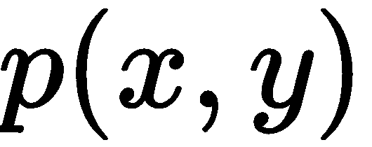

# 评价

以下是对每章末尾提到的问题的回答。

# 第 1 章-深度学习简介

1.  机器学习的成功在于正确的功能集。特征工程在机器学习中起着至关重要的作用。如果我们手工制作正确的特征集来预测某个结果，那么机器学习算法可以很好地执行，但找到和设计正确的特征集并不是一件容易的事情。有了深度学习，我们就不用手工制作这样的功能了。由于深度**人工神经网络**(**ann**)采用了几个层，它们自己学习数据的复杂内在特征和多层次抽象表示。

2.  这基本上是由于人工神经网络的结构。人工神经网络由一些 *n* 层组成，以执行任何计算。我们可以建立一个有几层的人工神经网络，每层负责学习数据中复杂的模式。由于计算的进步，我们可以建立一个网络，甚至有数百或数千层深。由于人工神经网络使用深层来执行学习，我们称之为深度学习，当人工神经网络使用深层来学习时，我们称之为深度网络。
3.  激活函数用于向神经网络引入非线性。
4.  当我们向 ReLU 函数提供任何负输入时，它会将它们转换为零。所有负值为零的障碍是一个叫做**死亡的问题。**
5.  从输入层移动到输出层预测输出的整个过程称为**正向传播**。在这种传播过程中，输入被乘以它们在每一层上各自的权重，并且在它们之上应用激活函数。
6.  将网络从输出层反向传播到输入层，并使用梯度下降来更新网络的权重以最小化损失的整个过程称为**反向传播**。
7.  梯度检查主要用于调试梯度下降算法，并验证我们的实现是否正确。

# 第 2 章-了解TensorFlow

1.  TensorFlow 中的每个计算都由一个计算图来表示。它由若干节点和边组成，其中节点是数学运算，如加法、乘法等，边是张量。计算图在优化资源方面非常有效，并且它还促进了分布式计算。
2.  将只创建一个带有节点上的操作和到其边的张量的计算图，并且为了执行该图，我们使用 TensorFlow 会话。
3.  可以使用`tf.Session()`创建一个 TensorFlow 会话，它将分配内存来存储变量的当前值。
4.  变量是用来存储值的容器。变量将被用作计算图中其他几个操作的输入。我们可以把占位符看作变量，在这里我们只定义类型和维度，但不会赋值。占位符的值将在运行时输入。我们使用占位符将数据输入计算图。占位符被定义为没有值。
5.  TensorBoard 是 TensorFlow 的可视化工具，可用于可视化计算图。它还可以用来绘制各种定量指标和几个中间计算的结果。当我们训练一个真正深度的神经网络时，当我们必须调试模型时，它会变得令人困惑。由于我们可以在 TensorBoard 中可视化计算图，因此我们可以轻松地理解、调试和优化这样复杂的模型。它还支持共享。
6.  作用域用于降低复杂性，并通过将相关节点组合在一起帮助我们更好地理解模型。拥有一个名称范围有助于我们在图中对相似的操作进行分组。当我们构建一个复杂的架构时，它会派上用场。可以使用`tf.name_scope()`创建范围。
7.  TensorFlow 中的急切执行更加 Pythonic 化，并允许快速原型化。与每次执行任何操作都需要构建一个图的图形模式不同，急切执行遵循命令式编程范式，任何操作都可以立即执行，而不必创建图，就像我们在 Python 中一样。

# 第 3 章-梯度下降及其变体

1.  与梯度下降不同，在 SGD 中，为了更新参数，我们不必迭代我们训练集中的所有数据点。相反，我们只是迭代通过单个数据点。也就是说，与梯度下降不同，我们不必在迭代我们训练集中的所有数据点之后等待更新模型的参数。我们只是在迭代训练集中的每个数据点后更新模型的参数。
2.  在小批量梯度下降中，我们不是在迭代每个训练样本后更新参数，而是在迭代一些批次的数据点后更新参数。假设批量大小为 50，这意味着我们在迭代 50 个数据点后更新模型的参数，而不是在迭代每个单独的数据点后更新参数。
3.  使用动量执行小批量梯度下降有助于我们减少梯度步骤中的振荡，并更快地达到收敛。
4.  内斯特罗夫动量背后的基本动机是，我们不是计算当前位置的梯度，而是计算动量将带我们去的位置的梯度，我们把这个位置称为前瞻位置。
5.  在 Adagrad 中，当过去的梯度值较高时，我们将学习率设置为小值，当过去的梯度值较低时，我们将学习率设置为高值。因此，我们的学习率值根据参数的过去梯度更新而改变。
6.  Adadelta 的更新公式如下:

    

    

7.  RMSProp 是为了解决 Adagrad 学习率下降的问题而引入的。因此，在 RMSProp 中，我们计算梯度的指数衰减移动平均值，如下所示:

    

我们使用梯度的移动平均值，而不是取所有过去梯度的平方和。因此，我们的更新等式变成如下:

8.  Adam 的更新公式如下所示:

    

# 第 4 章-使用 RNN 生成歌词

1.  正常的前馈神经网络仅基于当前输入来预测输出，但是 RNN 基于当前输入以及先前的隐藏状态来预测输出，该隐藏状态充当存储器并且存储网络到目前为止已经看到的上下文信息(输入)。
2.  时间步长处的隐藏状态可以计算如下:

    

    换句话说，这就是*一个时间步长的隐藏状态，t = tanh([输入到隐藏层权重 x 输入]+[隐藏到隐藏层权重 x 前一个隐藏状态])* 。

3.  rnn 广泛应用于涉及序列数据的用例，例如时间序列、文本、音频、语音、视频、天气等等。它们在各种自然语言处理(NLP)任务中得到了广泛的应用，如语言翻译、情感分析、文本生成等。
4.  在反向传播 RNN 时，我们在每个时间步乘以 *tanh* 函数的权重和导数。当我们向后移动时，每一步都乘以更小的数字，我们的梯度变得无穷小，并导致计算机无法处理的数字；这被称为**消失梯度问题。**

5.  当我们将网络的权重初始化为一个非常大的数字时，每一步的梯度都会变得非常大。在反向传播时，我们在每个时间步将一个大数相乘，结果是无穷大。这就是所谓的爆炸梯度问题。
6.  我们使用梯度剪辑来绕过爆炸梯度问题。在这种方法中，我们根据向量范数(比如， *L2* )对梯度进行归一化，并将梯度值裁剪到某个范围。例如，如果我们将阈值设置为 0.7，那么我们将梯度保持在-0.7 到+0.7 的范围内。如果渐变值超过-0.7，那么我们就把它改成-0.7，同样，如果超过 0.7，那么我们就改成+0.7。
7.  不同类型的 RNN 体系结构包括一对一、一对多、多对一和多对多，它们用于各种应用。

# 第五章-RNN 的改善

1.  **长短期记忆** ( **LSTM** )细胞是 RNN 的一种变体，它通过使用一种叫做**门**的特殊结构来解决消失梯度问题。只要需要，门就将信息保存在存储器中。他们学习从记忆中保留什么信息和丢弃什么信息。
2.  LSTM 由三种类型的门组成，即遗忘门、输入门和输出门。遗忘门负责决定应该从单元状态(存储器)中移除什么信息。输入门负责决定哪些信息应该存储在单元状态中。输出门负责决定从单元状态中获取什么信息作为输出。
3.  单元状态也称为内部存储器，所有信息都将存储在其中。
4.  当反向传播 LSTM 网络时，我们需要在每次迭代中更新太多的参数。这增加了我们的训练时间。因此，我们引入了**门控循环单位** ( **GRU** )细胞，它充当了 LSTM 细胞的简化版本。与 LSTM 不同，GRU 单元只有两个门和一个隐藏状态。
5.  在双向 RNN 中，我们有两层不同的隐藏单元。这两层都从输入层连接到输出层。在一层中，隐藏状态从左到右共享，而在另一层中，从右到左共享。
6.  深度 RNN 通过将前一个隐藏状态以及前一层的输出作为输入来计算隐藏状态。

7.  编码器学习给定输入句子的表示(嵌入)。一旦编码器知道了嵌入，它就将嵌入发送给解码器。解码器将这种嵌入(一个思维向量)作为输入，并试图构建一个目标句子。
8.  当输入的句子很长时，上下文向量不能捕捉句子的全部含义，因为它只是来自最后时间步骤的隐藏状态。因此，我们不是将最后一个隐藏状态作为上下文向量并将其用于具有注意力机制的解码器，而是从编码器获取所有隐藏状态的总和并将其用作上下文向量。

# 第 6 章-揭开卷积网络的神秘面纱

1.  CNN 的不同层包括卷积层、池层和全连接层。
2.  我们将带有滤波器矩阵的输入矩阵滑动一个像素，并执行卷积运算。但是我们不仅可以在输入矩阵上滑动一个像素，我们还可以在输入矩阵上滑动任意数量的像素。我们通过滤波器矩阵在输入矩阵上滑动的像素数量被称为**步幅**。

3.  通过卷积运算，我们用滤波器矩阵滑过输入矩阵。但是在某些情况下，滤波器并不完全适合输入矩阵。也就是说，存在这样一种情况，当我们将我们的滤波器矩阵移动两个像素时，它到达边界，并且滤波器不适合输入矩阵，也就是说，我们的滤波器矩阵的某些部分在输入矩阵之外。在这种情况下，我们执行填充。
4.  池层通过仅保留重要的要素来减少空间维度。不同类型的池化操作包括最大池化、平均池化和总和池化。
5.  VGGNet 是最常用的 CNN 架构之一。它是由牛津大学的**V**视觉几何小组 ( **VGG** )发明的。VGG 网络的架构由卷积层和池层组成。它在整个网络中使用 3 x 3 卷积和 2 x 2 池。
6.  通过分解卷积，我们将滤波器尺寸较大的卷积层分解为滤波器尺寸较小的卷积层堆栈。因此，在初始模块中，一个 5 x 5 滤波器的卷积层可以分解为两个 3 x 3 滤波器的卷积层。
7.  与 CNN 一样，胶囊网络会检查某些特征的存在以对图像进行分类，但除了检测特征外，它还会检查它们之间的空间关系——也就是说，它会学习特征的层次结构。
8.  在胶囊网络中，除了计算概率之外，我们还需要保持向量的方向，因此我们使用不同的激活函数，称为挤压函数。其给出如下:

    

# 第 7 章-学习文本表示

1.  在**连续词袋** ( **CBOW** )模型中，我们尝试在给定上下文词的情况下预测目标词，在 skip-gram 模型中，我们尝试在给定目标词的情况下预测上下文词。
2.  CBOW 模型的损失函数如下所示:

    

3.  当我们的词汇表中有数百万个单词时，我们需要执行无数次权重更新，直到我们预测出正确的目标单词。这既费时又不是一个有效的方法。因此，我们没有这样做，而是将正确的目标单词标记为正类，从词汇表中抽取一些单词，并将其标记为负类，这称为负类抽样
4.  PV-DM 类似于一个连续的单词包模型，其中我们试图预测给定上下文单词的目标单词。在 PV-DM 中，除了单词向量，我们还引入了一个向量，叫做段落向量。顾名思义，段落向量学习整个段落的向量表示，它捕捉段落的主题。

5.  编码器的作用是将句子映射到向量，解码器的作用是生成周围的句子；也就是前面和后面的句子。

6.  是一个学习句子嵌入的有趣算法。在快速思考中，我们试图了解给定的句子是否与候选句子相关。因此，我们不使用解码器，而是使用分类器来学习给定的输入句子是否与候选句子相关。

# 第 8 章-使用 GANs 生成图像

1.  判别模型学习寻找以最佳方式分隔类的决策边界，而生成模型学习每个类的特征。也就是说，判别模型预测以输入为条件的标签，而生成模型学习联合概率分布。
2.  生成器学习我们数据集中图像的分布。它在我们的训练集中学习手写数字的分布。我们向生成器输入随机噪声，它会将随机噪声转换成一个新的手写数字，类似于我们训练集中的数字。
3.  鉴别器的目标是执行分类任务。给定一个图像，它将其分类为真或假；即，图像是来自训练集还是由生成器生成的。
4.  鉴频器的损耗函数如下所示:

    

    发电机损耗函数如下所示:

    

5.  DCGAN 用卷积网络扩展了 GAN 的设计。也就是我们用**卷积神经网络** ( **CNN** )代替发生器和鉴别器中的前馈网络。

6.  **kull back-lei bler**(**KL**)散度是确定一个概率分布如何偏离另一个概率分布的最常用度量之一。假设我们有两个离散的概率分布，和，那么 KL 散度可以表示如下:

    

7.  沃瑟斯坦距离，也称为**推土机** ( **EM** )距离，是我们需要将物品从一种配置移动到另一种配置的最佳运输问题中最常用的距离度量之一。
8.  Lipschitz 连续函数是一个必须连续且几乎处处可微的函数。所以，对于任何一个 Lipschitz 连续的函数，函数图的斜率的绝对值不能超过一个常数。这个常数被称为**李普希兹**常数。

# 第 9 章-了解更多关于 gan 的信息

1.  与普通 GANs 不同， **CGAN** 是发生器和鉴别器的条件。这个条件告诉 GAN 我们期望我们的发生器产生什么样的图像。因此，我们的两个组件——鉴别器和发生器——在这种情况下起作用。
2.  代码， *c，*基本上是可解释的不清楚的信息。假设我们有一些 MNIST 数据，那么，code， *c1，*表示数字标号，code， *c2，*表示宽度， *c3，*表示数字的笔画，以此类推。我们共同用术语 *c* 来代表他们。
3.  两个随机变量之间的互信息告诉我们可以从一个随机变量通过另一个随机变量获得的信息量。两个随机变量 *x* 和 *y* 之间的互信息可以给出如下:

    

    基本上就是给定 *x* 的 *y* 的熵和 *y* 的条件熵之差。

4.  代码， *c，*给了我们关于图像的可解释的解开的信息。所以，我们试着找到给定图像的 *c* ？然而，由于我们不知道后验，我们不能轻易做到这一点，因此，我们使用辅助分布来学习 *c* 。

5.  对抗损失本身并不能确保图像的正确映射。例如，生成器可以将来自源域的图像映射到匹配目标分布的目标域中的图像的随机排列。因此，为了避免这种情况，我们引入一个称为**周期一致 lo**ss 的额外损耗。它强制两个发生器 *G* 和 *F* 保持周期一致。

6.  我们有两台发电机:和。的作用是学习从到的映射，发生器的作用是学习从 y 到的映射。
7.  Stack GANs 分两个阶段把文字描述转换成图片。在第一阶段，艺术家绘制原始形状，并创建一个基本的轮廓，形成图像的初始版本。在下一阶段，他们通过使图像更加真实和吸引人来增强图像。

# 第 10 章-使用自编码器重构输入

1.  自编码器是无监督的学习算法。与其他算法不同，自编码器学习重建输入，也就是说，自编码器接受输入，并学习将输入作为输出再现。
2.  我们可以将损失函数定义为实际输入和重构输入之差，如下所示:

    

    这里，是训练样本数。

3.  **卷积自编码器** ( **CAE** )，使用卷积网络而不是普通的神经网络。在普通的自编码器中，编码器和解码器基本上是一个前馈网络。但是在 CAEs 中，它们基本上是卷积网络。这意味着编码器由卷积层组成，解码器由转置卷积层组成，而不是原始前馈网络。
4.  **去噪自编码器** ( **DAE** )是自编码器的另一个小变种。它们主要用于消除图像、音频和其他输入中的噪声。因此，我们将损坏的输入提供给自编码器，它会学习重建原始的未损坏输入。
5.  隐藏层中神经元在整个训练集中的平均激活可以计算如下:

    

6.  收缩自编码器的损失函数可以用数学方法表示如下:

    

    第一项代表重构误差，第二项代表惩罚项或正则项，基本上就是**雅可比矩阵**的**Frobenius**范数。

7.  矩阵的 Frobenius 范数，也称为**希尔伯特-施密特范数**，定义为其元素的绝对平方之和的平方根。包含向量值函数偏导数的矩阵被称为**雅可比矩阵**。

# 第 11 章-探索少量学习算法

1.  从几个数据点中学习被称为**少拍** **学习**或 **k-shot 学习**，其中 *k* 指定数据集中每个类的数据点数。
2.  我们需要我们的模型从几个数据点中学习。为了达到这一点，我们以同样的方式训练他们；也就是说，我们在很少的数据点上训练模型。假设我们有一个数据集，:我们从数据集中的每个类中抽取一些数据点，我们称之为**支持集**。类似地，我们从每个类中抽取一些不同的数据点，并将其称为**查询集**。
3.  暹罗网络基本上由两个对称的神经网络组成，这两个网络共享相同的权重和架构，并在末端使用某种能量函数连接在一起。我们的暹罗网络的目标是了解这两个输入是相似还是不相似。

4.  能量函数，它将给出两个输入之间的相似性。它可以表示如下:

    

5.  由于暹罗网络的目标不是执行分类任务，而是理解两个输入值之间的相似性，因此我们使用对比损失函数。它可以表示如下:

    

6.  原型网络是另一种简单、有效且普遍使用的少量学习算法。原型网络的基本思想是创建每个类的原型表示，并基于类原型和查询点之间的距离对查询点(新点)进行分类。

7.  关系网络由两个重要的函数组成:由表示的嵌入函数和由表示的关系函数。