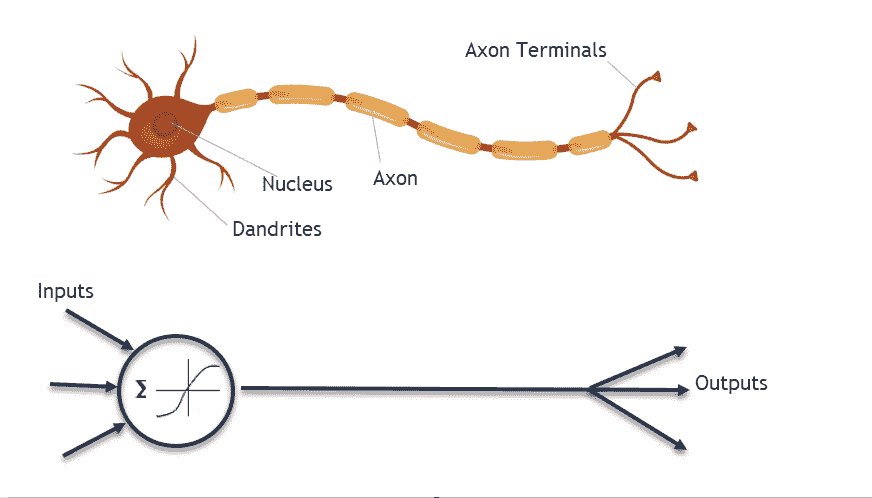
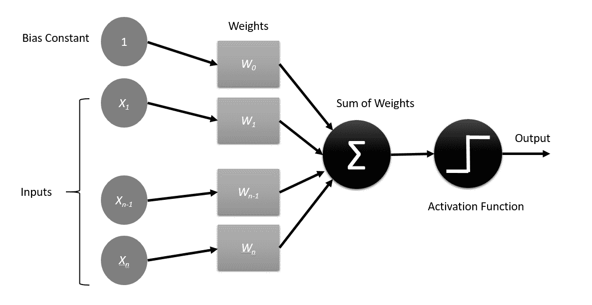
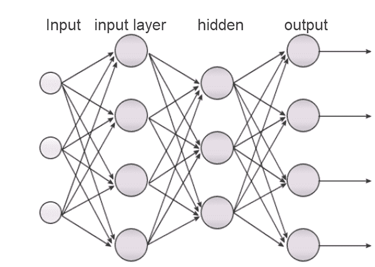
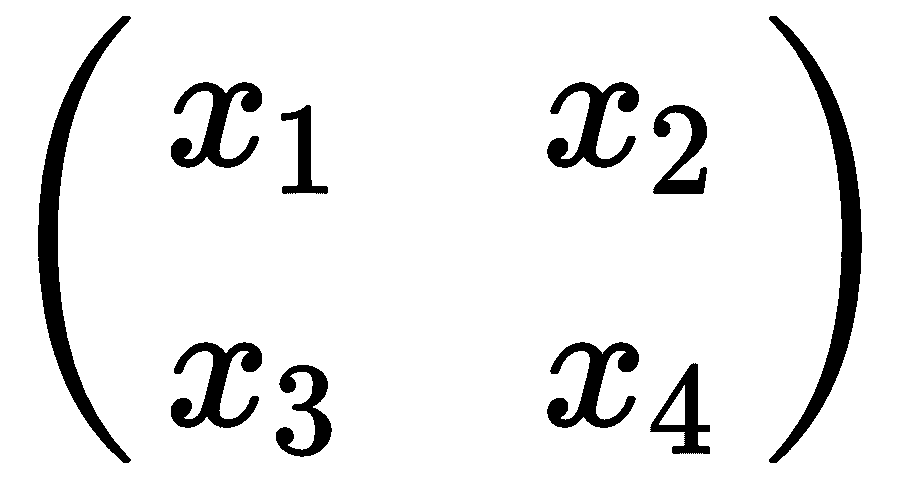
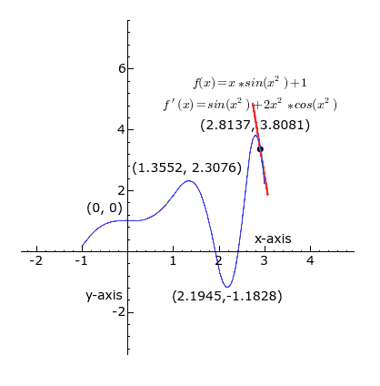
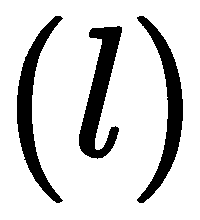
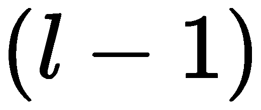
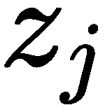
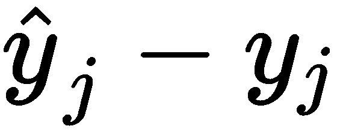
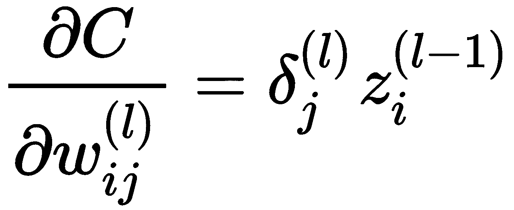

# 游戏的深度学习

欢迎来到*游戏动手深度学习*。这本书是为任何想要一个极其实用的方法来解决游戏的**深度学习**(**D1**)的复杂性的人而写的。重要的是，本书中讨论的概念不仅仅局限于游戏。我们在这里学到的大部分内容将很容易应用到其他应用/模拟中。

**强化学习** ( **RL** )，这将是我们在后面章节中谈到的一个核心元素，正在迅速成为主导的**机器学习** ( **ML** )技术。从服务器优化到预测零售市场的客户活动，它已经被应用到了方方面面。我们在本书中的旅程将主要集中在游戏开发上，我们的目标是构建一个可行的冒险游戏。请记住，你在本书中发现的原理是如何应用于其他问题的，比如模拟、机器人等等。

在这一章中，我们将从神经网络和深度学习的基础知识开始。我们将讨论神经网络的背景，逐步建立一个可以玩简单文本游戏的神经网络。具体而言，本章将涵盖以下主题:

*   数字图书馆的过去、现在和未来
*   神经网络——基础
*   多层感知器在**张量流** ( **TF** )中
*   理解张量流
*   用反向传播训练神经网络
*   在 Keras 中构建自动编码器

这本书假设你有 Python 的工作知识。您应该能够设置和激活虚拟环境。后面的章节会用到 Unity 3D，仅限 Windows 和 macOS(向那些铁杆 Linux 用户道歉)。

如果你已经掌握了深度学习，你可能会倾向于跳过这一章。不管怎样，这一章非常值得一读，并将建立我们在整本书中使用的术语。至少，做动手练习——你以后会感谢自己的！


# 数字图书馆的过去、现在和未来

虽然术语*de**EP**learning*是由 Igor Aizenberg 和他的同事在 2000 年首次与神经网络联系起来的，但它只是在最近 5 年才变得流行起来。在此之前，我们将这类算法称为**人工神经网络** ( **ANN** )。然而，深度学习指的是比人工神经网络更广泛的东西，包括连接机器的许多其他领域。因此，为了澄清，我们将在本书的剩余部分讨论 DL 的 ANN 形式。不过，我们也会讨论一些其他形式的可以在游戏中使用的 DL，在[第五章](6ca7a117-1a8c-49f9-89c0-ee2f2a1e8baf.xhtml)，*介绍 DRL* 。


# 过去

多层感知器网络的第一种形式，或者我们现在所说的 ANN，是由 Alexey Ivakhnenko 在 1965 年提出的。Ivakhnenko 等了好几年才在 1971 年写了关于多层感知器的文章。这个概念需要一段时间来渗透，直到 20 世纪 80 年代，更多的研究才开始。这一次尝试了图像分类和语音识别，失败了，但正在取得进展。又过了 10 年，到了 90 年代末，又重新流行起来。以至于人工神经网络又进入了一些游戏，直到更好的方法出现。事情平息下来，又过了十年左右。

然后，在 2012 年，吴恩达和杰夫·迪恩使用人工神经网络来识别视频中的猫，人们对深度学习的兴趣激增。他们的步伐是几个琐碎(但有趣)的进步之一，这些进步让人们坐起来，关注深度学习。然后在 2015 年，Google 的 **DeepMind** 团队打造了 AlphaGo，这一次全世界都坐了起来。AlphaGo 被证明在围棋比赛中击败了世界上最好的选手，这改变了一切。其他技术很快出现，**深度强化学习** ( **DRL** )就是其中之一，表明人类的表现可以在以前认为不可能的领域被持续击败。

在向学生讲授神经网络时，教授们喜欢分享一个幽默而中肯的故事:*美国陆军在 80 年代进行了早期研究，使用人工神经网络来识别敌人的坦克。该算法在 100%的时间里都有效，军队组织了一次大型演示来展示它的成功。不幸的是，演示中没有任何* *起作用，每一次测试都悲惨地失败了。回去分析后，陆军意识到 ANN 根本没有识别出敌人的坦克。相反，它已经在阴天拍摄的图像上进行了训练，它所做的只是识别云层。*

现状

目前，至少在撰写本文时，我们仍然处于一个碎片和混乱的深度学习爆炸之中，我们作为开发人员的工作是搞清楚这一切。神经网络目前是许多 DL 技术的基础，其中一些我们将在本书中介绍。除此之外，似乎每天都有新的更强大的技术出现，研究人员争先恐后地去理解它们。现在，这种想法的冲击实际上可以阻止一项技术，因为研究人员花费越来越多的时间试图复制结果。这肯定是人工神经网络(深度学习)之前遭受的大部分早期停滞的原因。事实上，业内许多怀疑论者预测又会出现一个小问题。所以，你应该担心，读这本书值得吗？简短的回答是*是的*。最长的答案是*可能不会，*这一次情况非常不同，许多深度学习概念现在正在产生收入，这是一件好事。事实上，DL 技术现在是一个证明赚钱的投资者放心，只会鼓励新的投资和增长。确切的增长幅度还有待观察，但机器和 DL 空间现在已经成熟，各行各业都有机会和增长。


# 那么，游戏行业还有可能再次抛弃游戏吗？这也不太可能，一般来说，因为许多最近的主要进展，如强化学习，是为了玩经典的雅达利游戏而建立的，并利用游戏作为问题。这只会鼓励更多利用游戏进行深度学习的研究。游戏平台 Unity 3D 已经对玩游戏的强化学习进行了重大投资。事实上，Unity 正在开发一些强化学习方面的最前沿技术，我们稍后将与该平台合作。Unity 确实使用 C#来编写脚本，但使用 Python 来建立和训练深度学习模型。

At present, at least at the time of writing, we are still in the midst of a deep learning explosion with debris and chaos, and it is our job as developers to make sense of all this. Neural networks are currently the basis for many DL technologies, several of which we will cover in this book. Except, it seems that every day, new and more powerful techniques emerge, and researchers scramble to make sense of them. Now, this rush of ideas can actually stall a technology, as researchers spend more and more time trying to replicate results. It is most certainly a cause for much of the earlier stalling that ANNs (deep learning) previously suffered from. In fact, many skeptics in the industry are predicting yet another hiccup. So, should you be worried, is reading this book worth it? The short answer is *yes*. The long answer is *probably not,* this time things are very different and many deep learning concepts are now generating revenue, which is a good thing. The fact that DL technology is now a proven money-earner puts investors at ease and only encourages new investment and growth. Exactly how much growth is yet to be seen, but the machine and DL space is now ripe with opportunity and growth from all sectors.

So, is it still possible that the game industry will again turn its back on games? That is also unlikely, generally because many of the more recent major advances, like reinforcement learning, were built to play classic Atari games, and use games as the problem. This only encourages more research into deep learning using games. Unity 3D, the game platform, has made a major investment into reinforcement learning for playing games. In fact, Unity is developing some of the most cutting-edge technology in reinforcement learning and we will be working with this platform later. Unity does use C# for scripting but uses Python to build and train deep learning models.

今后

预测任何事情的未来都是极其困难的，但是如果你足够仔细地观察，你可能会对事情的发展有所了解。当然，拥有水晶球或训练有素的神经网络肯定会有所帮助，但很多流行的东西往往取决于下一个伟大的成就。如果没有任何预测能力，我们可以观察到深度学习研究和商业发展的当前趋势吗？嗯，现在的趋势是用 ML 生成 DL；也就是说，一台机器本质上自己组装了一个神经网络，用来解决一个问题。谷歌目前正在投入相当多的资源来构建一项名为 **AutoML** 的技术，该技术可以生成一个神经网络推理模型，可以识别图像中的对象/活动，语音识别或手写识别等。经常被称为人工神经网络教父的 Geoffery Hinton 最近表明，复杂的深层网络系统可以分解为可重用的层。本质上，您可以使用从各种预训练模型中提取的层来构建网络。这肯定会演变成更有趣的技术，并很好地融入 DL 搜索，但也为计算的下一阶段让路。


# 现在，编程代码在某种程度上会变得太乏味、太困难、太昂贵。我们已经可以从离岸开发的爆炸中看到这一点，公司寻求最便宜的开发商。据估计，代码成本平均为每条线 10-20 美元，是的，每条*线*。那么，开发人员将在什么时候开始以 ANN 或 **TensorFlow** ( **TF** )推理图的形式构建他们的代码呢？嗯，对于本书的大部分内容，我们开发的 DL 代码将向下生成一个 TF 推断图；一个大脑，如果你愿意的话。然后，我们将在本书的最后一章中使用这些大脑在我们的冒险游戏中构建智能。构建图形模型的技术正迅速成为主流。许多在线 ML 应用程序现在允许用户建立能够识别图像、语音和视频中的事物的模型，只需上传训练内容并按下按钮即可。这是否意味着应用程序在未来可以这样开发，不需要任何编程？答案是肯定的，而且已经在发生了。

既然我们已经探索了深度学习的过去、现在和未来，我们可以在下一节开始深入研究更多的术语以及神经网络实际上是如何工作的。

神经网络——基础

神经网络或多层感知器的灵感来源于人脑和神经系统。我们神经系统的核心是计算机模拟图上方的神经元，它是一个感知机:


# 感知器旁边的人类神经元的例子

我们大脑中的神经元收集输入，做一些事情，然后做出反应，就像计算机模拟的**感知器**。感知器接受一组输入，将它们相加，并通过激活函数传递它们。该激活功能确定是否发送输出，以及在激活时以什么级别发送输出。让我们仔细看看感知器，如下:



感知器

在上图的左侧，可以看到一组输入被推进，加上一个恒定的偏置。我们将在后面更深入地探讨这种偏见。然后，输入乘以一组单独的权重，并通过一个激活函数。在 Python 代码中，它和`Chapter_1_1.py`中的一样简单:



注意`weights`列表比`inputs`列表多了一个元素；也就是说要考虑偏差(`weights[0]`)。除此之外，你可以看到我们只是简单地循环通过`inputs`，将它们乘以指定的权重，然后加上偏差。然后将`activation`与`0.0`进行比较，如果大于 0，我们输出。在这个非常简单的例子中，我们只是将值与 0 进行比较，这本质上是一个简单的阶跃函数。稍后我们将花一些时间反复重温各种激活功能；将这个简单的模型视为执行这些功能的重要部分。

前面的示例代码块的输出是什么？看看您是否能弄明白，或者采取挑战性较小的路线，将其复制并粘贴到您最喜欢的 Python 编辑器中并运行。代码将按原样运行，不需要特殊的库。

```

inputs = [1,2]
weights = [1,1,1]

def perceptron_predict(inputs, weights):
    activation = weights[0]
    for i in range(len(inputs)-1):
        activation += weights[i] * input
    return 1.0 if activation >= 0.0 else 0.0

print(perceptron_predict(inputs,weights))
```

在前面的代码示例中，我们正在查看输入数据的一个点`[1,2]`，这在 DL 中几乎没有用。DL 模型通常需要数百、数千甚至数百万个数据点或输入数据集来有效地训练和学习。幸运的是，用一个感知器，我们需要的数据量不到 10。

What is the output from the preceding block of sample code? See whether you can figure it out, or take the less challenging route and copy and paste it into your favorite Python editor and run it. The code will run as is and requires no special libraries.

In the previous code example, we are looking at one point of input data, `[1,2]`, which is hardly useful when it comes to DL. DL models typically require hundreds, thousands, or even millions of data points or sets of input data to train and learn effectively. Fortunately, with one perceptron, the amount of data we need is less than 10.

让我们扩展前面的例子，通过打开您的首选 Python 编辑器并遵循以下步骤，通过`perceptron_predict`函数运行 10 个点的训练集:

我们将在本书后面的大部分主要编码部分使用 Visual Studio 代码。无论如何，使用您喜欢的编辑器，但是如果您对 Python 相对陌生，请尝试一下代码。代码可用于 Windows、macOS 和 Linux。

在您喜欢的 Python 编辑器中输入以下代码块，或者从下载的源代码中打开`Chapter_1_2.py`:

这段代码只是扩展了我们之前看到的例子。在这种情况下，我们测试在`train`列表中定义的多个数据点。然后我们只需遍历列表中的每一项，并打印出预测值。

1.  运行代码并观察输出。如果您不确定如何运行 Python 代码，请确保在继续学习之前先学习该课程。

```
train = [[1,2],[2,3],[1,1],[2,2],[3,3],[4,2],[2,5],[5,5],[4,1],[4,4]]
weights = [1,1,1]

def perceptron_predict(inputs, weights):
    activation = weights[0]    
    for i in range(len(inputs)-1):
      activation += weights[i+1] * inputs[i]
      return 1.0 if activation >= 0.0 else 0.0

for inputs in train:
  print(perceptron_predict(inputs,weights))
```

2.  您应该看到重复 1.0s 的输出，这基本上意味着所有输入值都被识别为相同。这不是很有用的东西。这是因为我们没有训练或调整输入权重来匹配已知的输出。我们需要做的是训练权重来识别数据，我们将在下一节中讨论如何做到这一点。
3.  Run the code and observe the output. If you are unsure of how to run Python code, be sure to take that course first before going any further.

用 Python 训练感知器

完美！我们创造了一个简单的感知器，它接受输入并输出，但实际上什么也不做。我们的感知机需要训练它的权重，以便实际做一些事情。幸运的是，有一个定义明确的方法，称为**梯度下降**，我们可以用它来调整每一个权重。再次打开 Python 编辑器，更新或输入以下代码，或从代码下载中打开`Chapter_1_3.py`:


# `train_weights`函数是新的，将用于使用迭代误差最小化来训练感知器，并将成为我们在更复杂的网络中使用梯度下降的基础。这里发生了很多事情，所以我们将一点一点地分解它。首先，我们用下面这行代码将`weights`列表初始化为值`0.0`:

然后我们开始在一个`for`循环中训练每个时期。一个**历元**本质上是一遍我们的训练数据。我们进行多次传递的原因是为了让我们的权重收敛到全局最小值，而不是局部最小值。在每个时期，使用以下等式训练权重:

```
def perceptron_predict(inputs, weights):
 activation = weights[0]
 for i in range(len(inputs)-1):
  activation += weights[i + 1] * inputs[i]
 return 1.0 if activation >= 0.0 else 0.0

def train_weights(train, learning_rate, epochs):
 weights = [0.0 for i in range(len(train[0]))]
 for epoch in range(epochs):
  sum_error = 0.0
  for inputs in train:
   prediction = perceptron_predict(inputs, weights)
   error = inputs[-1] - prediction
   sum_error += error**2
   weights[0] = weights[0] + learning_rate * error
   for i in range(len(inputs)-1):
    weights[i + 1] = weights[i + 1] + learning_rate * error * inputs[i]
  print('>epoch=%d, learning_rate=%.3f, error=%.3f' % (epoch, learning_rate, sum_error))
 return weights

train = [[1.5,2.5,0],[2.5,3.5,0],[1.0,11.0,1],[2.3,2.3,1],[3.6,3.6,1],[4.2,2.4,0],[2.4,5.4,0],[5.1,5.1,1],[4.3,1.3,0],[4.8,4.8,1]]

learning_rate = 0.1
epochs = 10
weights = train_weights(train, learning_rate, epochs)
print(weights)
```


```
weights = [0.0 for i in range(len(train[0]))]
```

请考虑以下情况:

 =权重
 =感知器学习
的速率=标注的训练值
 =感知器返回的值
 =  - 

偏差以类似的方式训练，但请记住它是`weight`。还要注意我们现在如何在`train`列表中标记我们的数据点，用`0.0`或`1.0`作为结束值。值`0.0`表示*不匹配*，而值`1.0`表示*完全匹配*，如以下代码摘录所示:

这种数据标记在训练神经网络中很常见，被称为**监督训练**。我们将在后面的章节中探讨其他无监督和半监督的训练方法。如果运行上述代码，您将看到以下输出:

示例训练运行的示例输出

```
train = [[1.5,2.5,0.0],[2.5,3.5,0.0],[1.0,11.0,1.0],[2.3,2.3,1.0],[3.6,3.6,1.0],[4.2,2.4,0.0],[2.4,5.4,0.0],[5.1,5.1,1.0],[4.3,1.3,0.0],[4.8,4.8,1.0]]
```

现在，如果你有一些以前的 ML 经验，你会立即意识到训练在一些局部最小值附近摇摆不定，使我们的训练无法收敛。在你的 DL 职业生涯中，你可能会多次遇到这种类型的抖动，所以了解如何修复它是有帮助的。


在这种情况下，我们的问题可能是选择`activation`函数，您可能还记得，这只是一个简单的阶跃函数。我们可以通过输入一个新的函数来解决这个问题，这个函数叫做**整流线性单元** ( **ReLU** )。下图并列显示了`step`和`ReLU`功能的示例:

step 和 ReLU 激活函数的比较

为了更改激活功能，请打开前面的代码清单，并按照以下步骤操作:


找到以下代码行:

修改它，就像这样:

1.  如果激活函数的值大于 0，那么激活函数与其自身相乘的细微差别就是`ReLU`函数的实现。是的，看起来很容易。

```
return 1.0 if activation >= 0.0 else 0.0
```

2.  运行代码并观察输出的变化。

```
return 1.0 if activation * (activation>0) >= 0.0 else 0.0
```

3.  That subtle difference in multiplying the activation function by itself if its value is greater than 0 is the implementation of the `ReLU` function. Yes, it is that deceptively easy.
4.  Run the code and observe the change in output.

当您运行代码时，这些值会快速收敛并保持稳定。这是我们训练中的一个巨大进步，也是将激活功能改为`ReLU`的一个原因。原因是，现在我们的感知器权重可以更慢地收敛到全局最大值，而以前它们只是通过使用`step`函数在局部最小值附近摇摆。在本书的课程中，我们还会测试很多其他的激活功能。在下一节中，我们来看看当我们开始将我们的感知器组合成多层时，事情是如何变得更加复杂的。

TF 中的多层感知器

到目前为止，我们一直在看一个简单的单感知器的例子，以及如何训练它。这对于我们的小数据集来说效果很好，但是随着输入数量的增加，我们网络的复杂性也会增加，这也会影响到数学。下图显示了一个多层感知器，或者我们通常所说的 ANN:


# 多层感知器或人工神经网络

在图中，我们看到一个网络，有一个输入层、一个隐藏层和一个输出层。这些输入现在被神经元的输入层共享。第一层神经元处理输入，输出结果由隐层处理，以此类推，直到最后到达输出层。



多层网络可能会变得非常复杂，这些模型的代码通常被 Keras、PyTorch 等高级接口抽象掉。这些工具对于快速探索网络架构和理解 DL 概念非常有用。然而，当涉及到游戏中的关键性能时，它确实需要在 TensorFlow 或支持低级数学运算的 API 中构建模型。在本书中，我们将从 Keras(一个更高级的 SDK)切换到 TensorFlow，然后再回到 DL 的介绍性章节。这将让您看到使用任一界面之间的差异和相似之处。

Unity ML-Agents 最初是用 Keras 原型开发的，但后来发展到 TensorFlow。可以肯定的是，Unity 的团队以及其他人这样做是出于性能的原因，在某种程度上也是为了控制。使用 TensorFlow 类似于编写自己的着色器。虽然编写着色器和 TF 代码相当困难，但定制自己的渲染和现在学习的能力将使你的游戏独一无二，脱颖而出。

接下来有一个很棒的多层感知器 TensorFlow 例子供你参考，清单`Chapter_1_4.py`。为了使用 TensorFlow 运行此代码，请遵循以下步骤:

在下一节之前，我们不会讨论张量流的基础知识。这是为了在我们让你厌烦细节之前，你能先看到 TF 的行动。

首先，在 Windows 或 macOS 上的 Python 3.5/3.6 窗口中使用以下命令安装 TensorFlow。您还可以使用具有管理员权限的 Anaconda 提示符:

确保安装适合默认 Python 环境的 TensorFlow。我们将在以后考虑创建更结构化的虚拟环境。如果你不确定什么是 Python 虚拟环境，那就离开这本书，马上去上 Python 课程。

1.  在这个练习中，我们正在加载 **MNIST** 手写数字数据库。如果你读过任何关于 ML 和 DL 的东西，你很可能已经看过或听过这个数据集。如果你还没有，只需快速谷歌一下 MNIST 就能了解这些数字的样子。

```
pip install tensorflow 
OR 
conda install tensorflow    //using Anaconda
```

2.  Make sure you install TensorFlow suited to the default Python environment. We will worry about creating more structured virtual environments later. If you are not sure what a Python virtual environment is, step away from the book and take a course in Python right away.

In this exercise, we are loading the **MNIST** handwritten digits database. If you have read anything at all about ML and DL, you have most likely seen or heard about this dataset already. If you haven't, just quickly Google *MNIST* to get a sense of what these digits look like.

下面的 Python 代码来自清单`Chapter_1_4.py`,每个部分都在下面的步骤中进行了解释:

我们从加载`mnist`训练集开始。`mnist`数据集是 28 x 28 像素图像的集合，显示了数字 0-9 的手绘表示，或者我们将称之为 10 个类别:

3.  然后我们将`tensorflow`库作为`tf`导入。接下来，我们设置一些参数，我们将在以后使用。注意我们是如何定义输入和隐藏参数的:

```
from tensorflow.examples.tutorials.mnist import input_data
mnist = input_data.read_data_sets("/tmp/data/", one_hot=True)
```

4.  We start by loading the `mnist` training set. The `mnist` dataset is a collection of 28 x 28 pixel images showing hand-drawn representations of the digits 0-9, or what we will refer to as 10 classes:

```
import tensorflow as tf
# Parameters
learning_rate = 0.001
training_epochs = 15
batch_size = 100
display_step = 1
# Network Parameters
n_hidden_1 = 256 # 1st layer number of neurons
n_hidden_2 = 256 # 2nd layer number of neurons
n_input = 784 # MNIST data input (img shape: 28*28)
n_classes = 10 # MNIST total classes (0-9 digits)
```

5.  Then we import the `tensorflow` library as `tf`. Next, we set a number of parameters we will use later. Note how we are defining the inputs and hidden parameters as well:

```
# tf Graph input
X = tf.placeholder("float", [None, n_input])
Y = tf.placeholder("float", [None, n_classes])

# Store layers weight & bias
weights = {
 'h1': tf.Variable(tf.random_normal([n_input, n_hidden_1])),
 'h2': tf.Variable(tf.random_normal([n_hidden_1, n_hidden_2])),
 'out': tf.Variable(tf.random_normal([n_hidden_2, n_classes]))
}
biases = {
 'b1': tf.Variable(tf.random_normal([n_hidden_1])),
 'b2': tf.Variable(tf.random_normal([n_hidden_2])),
 'out': tf.Variable(tf.random_normal([n_classes]))
}
```

接下来，我们用`tf.placeholder`设置几个 TensorFlow 占位符，以类型`'float'`保存输入和类的数量。然后我们使用`tf.Variable`创建并初始化变量，首先是权重，然后是偏差。在变量声明中，我们使用`tf.random_normal`将正态分布的数据初始化为维数等于`n_input`和`n_hidden_1`的 2D 矩阵或张量，用随机分布的数据填充张量:

然后，我们通过乘以每个层操作的权重和偏差来创建模型。我们在这里所做的基本上是把我们的激活方程转换成一个矩阵/方程张量。现在，我们使用矩阵/张量乘法，在一次操作中执行多次传递，而不是执行一次传递。这允许我们一次运行多个训练图像或数据集，这是一种我们用来更好地概括学习的技术。

6.  对于我们神经网络中的每一层，我们使用`tf.add`和`tf.matmul`将矩阵乘法运算添加到我们通常所说的**张量流推断图**中。您可以从我们创建的代码中看到，我们的模型有两个隐藏层和一个输出层:

```
# Create model
def multilayer_perceptron(x):
 # Hidden fully connected layer with 256 neurons
 layer_1 = tf.add(tf.matmul(x, weights['h1']), biases['b1'])
 # Hidden fully connected layer with 256 neurons
 layer_2 = tf.add(tf.matmul(layer_1, weights['h2']), biases['b2'])
 # Output fully connected layer with a neuron for each class
 out_layer = tf.matmul(layer_2, weights['out']) + biases['out']
 return out_layer

# Construct model
logits = multilayer_perceptron(X)
```

7.  Then we create the model by multiplying the weights and biases for each layer operation. What we are doing here is essentially converting our activation equation into a matrix/tensor of equations. Now instead of doing a single pass, we perform multiple passes in one operation using matrix/tensor multiplication. This allows us to run multiple training images or sets of data at a time, which is a technique we use to better generalize learning.

For each layer in our neural network, we use `tf.add` and `tf.matmul` to add matrix multiplication operations to what we commonly call a **TensorFlow inference graph**. You can see by the code we are creating that there are two hidden layers and one output layer for our model:

```
# Define loss and optimizer
loss_op = tf.reduce_mean(tf.nn.softmax_cross_entropy_with_logits(logits=logits, labels=Y))
optimizer = tf.train.AdamOptimizer(learning_rate=learning_rate)
train_op = optimizer.minimize(loss_op)
```

接下来，我们定义一个`loss`函数和优化器。`loss_op`用于计算网络的总损耗。然后`AdamOptimizer`是根据`loss`或`cost`功能进行优化。我们稍后将详细解释这些术语，所以如果事情仍然模糊不清，请不要担心:

然后，我们通过创建并运行一个新会话来初始化一个新的 TensorFlow 会话。我们再次使用历元迭代训练方法来循环每批图像。请记住，整批图像同时通过网络，而不仅仅是一张图像。然后，我们循环每个时期的每批图像，并优化(反向传播和训练)成本，或者最小化成本，如果您愿意的话:

8.  然后，我们输出每个时期运行的结果，显示网络如何最小化误差:

```
# Initializing the variables
init = tf.global_variables_initializer()
with tf.Session() as sess:
 sess.run(init)
 # Training cycle
 for epoch in range(training_epochs):
   avg_cost = 0.
   total_batch = int(mnist.train.num_examples/batch_size)
   # Loop over all batches
   for i in range(total_batch):
     batch_x, batch_y = mnist.train.next_batch(batch_size)
     # Run optimization op (backprop) and cost op (to get loss value)
     _, c = sess.run([train_op, loss_op], feed_dict={X: batch_x,Y: batch_y})
     # Compute average loss
     avg_cost += c / total_batch
```

9.  接下来，我们实际使用前面的代码运行预测，并使用我们之前在`logits`模型上选择的优化器确定正确值的百分比:

```
# Display logs per epoch step
 if epoch % display_step == 0:
 print("Epoch:", '%04d' % (epoch+1), "cost={:.9f}".format(avg_cost))
 print("Optimization Finished!")
```

10.  最后，我们计算并输出我们模型的`accuracy`。如果你做这个练习，不要只考虑模型有多精确，而是要想办法提高精确度。

```
# Test model
 pred = tf.nn.softmax(logits) # Apply softmax to logits
 correct_prediction = tf.equal(tf.argmax(pred, 1), tf.argmax(Y, 1))
```

在前面的参考示例中有很多内容，我们将在接下来的小节中进一步分解。希望你现在能明白事情会变得多么复杂。这就是为什么在本书的大部分基础章节中，我们将首先教授 Keras 的概念。Keras 是一个强大而简单的框架，它将帮助我们立即构建复杂的网络，并使我们的教学和您的学习变得更加简单。我们还将提供在 TensorFlow 中开发的重复示例，并在本书中展示一些关键差异。

11.  在下一节，我们将解释张量流的基本概念，它是什么，以及我们如何使用它。

```
# Calculate accuracy
 accuracy = tf.reduce_mean(tf.cast(correct_prediction, "float"))
 print("Accuracy:", accuracy.eval({X: mnist.test.images, Y: mnist.test.labels}))
```

12.  张量流基础

**TensorFlow** ( **TF** )正迅速成为驱动许多 DL 应用的技术。还有其他 API，比如 Theano，但它是最吸引人的，也是最适用于我们的。总体框架，比如 Keras，提供了部署 TF 或 Theano 模型的能力。这对于构建原型和快速验证概念非常有用，但是，作为一名游戏开发人员，您知道对于游戏来说，最主要的需求总是性能和控制。与 Keras 等任何高级框架相比，TF 提供了更好的性能和更多的控制。换句话说，要成为一名认真的 DL 开发人员，你可能需要并且想要学习 TF。

TF，顾名思义，就是关于张量的。张量是一个数学概念，它描述了一组以 *n* 维组织的数据，其中 *n* 可以是 1、2 x 2、4 x 4 x 4 等等。一维张量将描述一个单一的数字，比如说，一个 2 x 2 张量将是或者你可以称之为矩阵。一个 3 x 3 x 3 的张量可以描述一个立方体的形状。本质上，你在矩阵上应用的任何运算都可以应用到张量上，TF 中的所有东西都是张量。作为一个有游戏开发背景的人，当你第一次开始使用张量时，把它们想象成一个矩阵或向量通常是有帮助的。

张量无非就是多维数组，向量，或者矩阵，下面的图表中有很多例子:


# 多种形式的张量(占位符)

让我们回过头来打开`Chapter_1_4.py`并遵循下面的步骤，以便更好地理解 TF 示例是如何运行的:

首先，再次检查顶部，特别注意占位符和变量的声明位置；下面的代码片段再次显示了这一点:

`placeholder`用于定义输入和输出张量。`Variable`设置一个可变张量，可以在 TF 会话或程序执行时对其进行操作。在本例中，一个名为`random_normal`的助手方法用一个正态分布的数据集填充隐藏的权重。还有其他像这样的辅助方法可以使用；查看文档了解更多信息。

接下来，我们将`logits`模型构建为一个名为`multilayer_perceptron`的函数，如下所示:


在函数内部，我们看到三个网络层的定义，两个输入和一个输出。通过使用 add 或`+`函数将`matmul (x, weights['h1'])`和`biases['b1']`的结果相加来构建每一层。`Matmul`对每个权重乘以输入 *x* 进行简单的矩阵乘法运算。回想我们的第一个例子感知器；这相当于将我们所有的权重乘以输入，然后加上偏差。注意合成张量`(layer_1, layer_2)`是如何被用作下一层的输入的。

跳到第 50 行左右，注意我们是如何获取对`loss`、`optimizer`和`initialization`函数的引用的:

1.  First, examine the top section again and pay special attention to where the placeholder and variable is declared; this is shown again in the following snippet:

```
tf.placeholder("float", [None, n_input])
...
tf.Variable(tf.random_normal([n_input, n_hidden_1]))
```

2.  重要的是要明白，我们存储的是对函数的引用，而不是执行它们。损失和优化器函数已经有了一定的深度，但是还要特别注意`global_variables_initalizer()`函数。这个函数是初始化所有变量的地方，我们需要首先运行这个函数。
3.  接下来，向下滚动到会话初始化的开头并启动，如下所示:

```
def multilayer_perceptron(x):
  layer_1 = tf.add(tf.matmul(x, weights['h1']), biases['b1'])
  layer_2 = tf.add(tf.matmul(layer_1, weights['h2']), biases['b2'])
  out_layer = tf.matmul(layer_2, weights['out']) + biases['out']
  return out_layer

logits = multilayer_perceptron(X)
```

4.  我们在 TF 中把`Session`构造成一个执行容器，也就是所谓的图。这是一个描述节点和连接的数学图，与我们正在模拟的网络没有什么不同。TF 中的所有事情都需要发生在一个会话中。然后我们用`run`运行第一个函数`(init)`。
5.  因为我们已经详细介绍了培训，所以我们要看的下一个元素是由以下代码执行的下一个函数`run`:

```
loss_op = tf.reduce_mean(tf.nn.softmax_cross_entropy_with_logits(logits=logits, labels=Y))
optimizer = tf.train.AdamOptimizer(learning_rate=learning_rate)
train_op = optimizer.minimize(loss_op)
init = tf.global_variables_initializer()
```

在`run`函数中发生了很多事情。我们使用当前的`feed_dict`字典作为输入，作为一组输入训练和损失函数`train_op`和`loss_op`。由此产生的产值`c`，等于总成本。注意，输入功能集被定义为`train_op`然后是`loss_op`。在这种情况下，顺序被定义为`train` / `loss`，但是如果您愿意，也可以反过来。您还需要反转输出值，因为输出顺序与输入顺序相匹配。

6.  代码的其余部分已经详细定义了，但是在用 TF 构建模型时，理解一些关键的区别是很重要的。正如你所看到的，对我们来说，快速建立复杂的神经网络是相对容易的。然而，我们仍然缺少一些关键的知识，这些知识将在以后构建更复杂的网络时有用。我们一直缺少的是用于训练神经网络的基础数学，我们将在下一节中探讨这一点。
7.  Next, scroll down to the start of the session initialization and start, as follows:

```
with tf.Session() as sess:
  sess.run(init)
```

8.  用反向传播训练神经网络
9.  计算神经元的激活，前向部分，或者我们所说的**前馈传播**，处理起来相当简单。我们现在遇到的复杂性是通过网络训练错误。当我们现在训练网络时，我们从最后一个输出层开始，并确定总误差，就像我们对单个感知器所做的那样，但现在我们需要对输出层上的所有误差求和。然后，我们需要使用这个值通过网络反向传播误差，根据每个权重对总误差的贡献来更新每个权重。在一个有数千或数百万个权重的网络中，理解单个权重的贡献可能会相当复杂，幸好有微分和链式法则的帮助。在我们开始复杂的数学之前，我们首先需要讨论`Cost`函数，以及我们如何在下一节计算误差。

```
_, c = sess.run([train_op, loss_op], feed_dict={X: batch_x,Y: batch_y})
```

10.  虽然反向传播的数学很复杂，可能令人生畏，但在某些时候，你会想要或需要很好地理解它。但是，出于本书的目的，您可以根据需要省略或重新阅读这一部分。我们在后面章节中开发的所有网络将自动为我们处理反向传播。当然，你也不能逃避数学；在深度学习中无处不在。

成本函数

`Cost`函数描述了我们整个网络中一个批次的平均误差总和，通常由以下等式定义:


# 

输入定义为每个重量，输出是我们在加工批次中遇到的总平均成本。把这个成本想象成误差的平均总和。现在，我们的目标是将该函数或误差成本降至最低。在前面的几个例子中，我们已经看到一种叫做**梯度下降**的技术被用来最小化这个成本函数。梯度下降的工作原理是对`Cost`函数求微分，并确定每个权重的梯度。然后，对于每一个权重，或者你可以称之为维度，算法会根据计算出的最小化`Cost`函数的梯度来改变权重。

在我们进入解释微分的复杂数学之前，让我们看看梯度下降在二维中是如何工作的，如下图所示:


# 寻找全局最小值的梯度下降示例

更简单地说，算法所做的只是试图在缓慢渐进的步骤中找到最小值。我们使用小的步长来避免超过最小值，正如你之前看到的会发生的(记得抖动)。这就是术语**学习率**的由来，它决定了我们想要训练的速度。训练越慢，你对自己的结果越有信心，但通常需要花费时间。另一种选择是使用更高的学习率更快地训练，但是，正如你现在看到的，可能很容易超过任何全局最小值。

梯度下降是我们将讨论的最简单的形式，但是请记住，我们还将探索其他优化算法的几种高级变体。例如，在 TF 的例子中，我们使用了`AdamOptimizer`来最小化`Cost`函数，但是还有其他一些变化。不过现在，我们将在下一节集中讨论如何计算`Cost`函数的梯度，并理解梯度下降反向传播的基础知识。

偏导数和链式法则

在我们进入计算每个权重的细节之前，让我们回顾一下微积分。如果你还记得你最喜欢的数学课——微积分，你可以通过求导来确定函数上任意一点的变化斜率。微积分复习器如下图所示:


微积分基本方程述评

在图中，我们有一个非线性函数， **f** ，它描述了蓝线的方程。我们可以通过对 f '求导并求解来确定任意点的斜率(变化率)。回想一下，我们还可以使用这个新函数来确定局部和全局最小值或最大值的函数，如图所示。简单的微分允许我们求解一个变量，但我们需要求解多个权重，因此我们将使用偏导数或对一个变量进行微分。

Gradient descent is the simplest form we will talk about, but keep in mind that there are also several advanced variations of other optimization algorithms we will explore. In the TF example, for instance, we used `AdamOptimizer` to minimize the `Cost` function, but there are several other variations. For now, though, we will focus on how to calculate the gradient of the `Cost` function and understand the basics of backpropagation with gradient descent in the next section.


# 你可能还记得，偏导数允许我们推导一个变量相对于其他变量的关系，然后我们把其他变量当作常数。让我们回到我们的`Cost`函数，看看如何区分单个重量:

** 是我们下面所描述的成本函数:




我们可以根据单个可变权重来区分该函数，如下所示:


1.  如果我们将所有这些偏导数收集在一起，我们将得到`Cost`函数的矢量梯度，表示如下:


2.  这个梯度定义了一个矢量方向，我们想要取反它，并使用它来最小化`Cost`函数。在我们之前的例子中，这个向量有超过 13，000 个分量。这些对应于我们需要优化的网络中超过 13，000 个权重。为了计算梯度，我们需要结合很多偏导数。幸运的是，微积分中的链式法则可以帮助我们，大大简化数学。回想一下，链规则是由以下内容定义的:


现在，我们可以使用链式法则定义单个重量的梯度，如下所示:

3.  


4.  这里，代表输入数，代表神经元位置。请注意，我们现在需要对给定神经元的激活函数 *a* 求偏导数，这再次总结如下:


5.  上标符号表示当前层，表示前一层。表示前一层的输入或输出。表示激活功能，回想一下我们之前为该角色使用了`Step`和`ReLU`功能。

然后，我们求这个函数的偏导数，就像这样:


6.  为方便起见，我们定义如下:


在这一点上，事情可能看起来比实际复杂得多。试着理解符号的所有微妙之处，记住我们所看到的本质上是激活相对于`Cost`函数的偏导数。额外的符号所做的只是让我们能够索引个体权重、神经元和层。我们可以这样表达:

7.  

同样，我们所做的只是为第 ^个输入、 ^个神经元和第层的权重定义梯度()。随着梯度下降，我们需要使用前面的基本公式反向传播对权重的调整。对于输出层(最后一层)，现在可以总结如下:


对于内部层或隐藏层，等式为:


再对一般方程进行一些替换和处理，我们最终得到了这个结果:

8.  

这里，*f’*表示激活函数的导数。

9.  上述等式允许我们使用以下程序运行网络并反向传播误差:

首先从输入层开始计算每个层的激活和并向前传播。

10.  然后，我们使用在输出层评估项。

我们通过使用使用余数来评估每个层，从输出层开始并向后传播。

11.  同样，我们使用偏导数来获得每一层中所需的导数。

为了掌握所有的概念，你可能需要通读几遍这一部分。同样有用的是运行前面的示例并观察训练，尝试想象每个权重是如何更新的。我们在这里并没有完全完成，还有几个步骤——使用自动微分是其中之一。除非您正在开发自己的低级网络，否则只要对数学有一个基本的了解，就可以让您更好地理解训练神经网络的需求。在下一节中，我们将回到一些更实用的基础知识，并通过构建一个神经网络代理来运用我们的新知识。

学习不会也不应该都来自同一个源头。一定要让你的学习多样化，包括其他书籍、视频和课程。你不仅会在学习上更成功，而且在这个过程中可能会理解得更多。

用 Keras 构建自动编码器

1.  虽然我们已经覆盖了许多理解 DL 所需要的重要基础，但是我们还没有做的是构建一些可以真正做任何事情的东西。当开始使用 DL 时，我们首先要解决的问题之一是构建自动编码器来编码和重组数据。通过这个练习，我们可以确认进入网络的内容也可以从网络中返回，并从本质上让我们确信人工神经网络不是一个完整的黑盒。构建和使用自动编码器还允许我们调整和测试各种参数，以便理解它们的功能。让我们从打开`Chapter_1_5.py`列表开始，并遵循以下步骤:
2.  我们将一部分一部分地检查清单。首先，我们输入基础层`Input`和`Dense`，然后是`Model`，它们都来自`tensorflow.keras`模块，导入如下:

3.  我们使用层或神经元来定义 Keras 中的 DL 模型，而不是单个神经元。`Input`和`Dense`层是我们最常用的，但我们也会看到其他层。顾名思义，`Input`层处理输入，而`Dense`层或多或少是典型的全连接神经元层，我们已经讨论过了。
4.  我们在这里使用 Keras 的嵌入式版本。原始样本取自 Keras 博客，并转换为 TensorFlow。

接下来，我们用下面的代码行设置`encoding`维度的数量:

这是我们想要减少样本的维数。在这种情况下，它只有 32，大约是 784 个输入尺寸的图像的 24 倍。记住，我们得到`784`输入尺寸，因为我们的输入图像是 28 x 28，我们将它们展平成长度为 784 的向量，每个像素代表一个值或尺寸。接下来，我们用 784 个输入尺寸设置`Input`层，如下所示:


# 那条线创建了一个有 784 个输入的`Input`层。然后，我们将使用下面的代码行将这 784 个维度编码到下一个`Dense`层中:

前面的代码简单地创建了 32 个(`encoding_dim`)神经元的完全连接的隐藏(`Dense`)层，并构建了编码器。你可以看到`input_img`，即`Input`层，被用作输入，我们的激活函数是`ReLU`。下一行使用`Input`层(`input_img`)和`Dense` ( `encoded`)层构建了一个`Model`。使用两层，我们将图像从 784 维编码到 32 维。

1.  接下来，我们需要使用以下代码使用更多层来解码图像:

```
from tensorflow.keras.layers import Input, Dense
from tensorflow.keras.models import Model
```

我们建立的下一组层和模型将被用来解码图像回到 784 维。底部的最后一行代码是我们使用`binary_crossentropy`的`loss`函数，通过`adadelta`优化器调用编译`autoencoder`模型的地方。稍后，我们将在损失类型和优化参数上花费更多时间，但现在请注意，当我们编译模型时，我们本质上只是设置它来进行反向传播和使用优化算法。请记住，所有这些都是自动为我们做的，我们不需要处理任何讨厌的数学。

2.  这就建立了我们的模型的主要部分，编码器、解码器和完整的自动编码器模型，我们为后面的训练进一步编译了它们。在下一节中，我们将处理模型的定型和预测。

训练模型

3.  接下来，我们需要用一组样本数据来训练我们的模型。我们将再次使用 MNIST 手写数字集；这是简单、免费和方便的。回到代码清单，继续如下练习:

```
encoding_dim = 32
```

4.  从我们停止的地方开始，找到下面的代码段:

```
input_img = Input(shape=(784,))
```

5.  That line creates an `Input` layer with a shape of 784 inputs. Then we are going to encode those 784 dimensions into our next `Dense` layer using the following line:

```
encoded = Dense(encoding_dim, activation='ReLU')(input_img)
encoder = Model(input_img, encoded)
```

6.  The preceding code simply creates our fully connected hidden (`Dense`) layer of 32 (`encoding_dim`) neurons and builds the encoder. You can see that the `input_img`, the `Input` layer, is used as input and our activation function is `ReLU`. The next line constructs a `Model` using the `Input` layer (`input_img`) and the `Dense` (`encoded`) layer. With two layers, we encode the image from 784 dimensions to 32.

7.  我们首先导入`mnist`库和`numpy`，然后将数据加载到`x_train`和`x_test`数据集。作为数据科学和机器学习的一般规则，您通常需要一个用于学习的训练集，然后是一个用于测试的评估集。这些数据集通常是通过将数据随机分成用于训练的`80`百分比和用于测试的`20`百分比来生成的。

```
decoded = Dense(784, activation='sigmoid')(encoded)
autoencoder = Model(input_img, decoded)
encoded_input = Input(shape=(encoding_dim,))

decoder_layer = autoencoder.layers[-1]
decoder = Model(encoded_input, decoder_layer(encoded_input))

autoencoder.compile(optimizer='adadelta', loss='binary_crossentropy')
```

8.  然后，我们用下面的代码进一步定义我们的训练和测试输入:

1.  前两行通过除以`255`来归一化我们的输入灰度像素颜色值和从`0`到`255`的数字。这给了我们一个从`0`到`1`的数字。我们通常希望将我们的输入规范化。接下来，我们将训练集和测试集改造成输入`Tensor`。

    随着模型的构建和编译，是时候开始训练了。接下来的几行是网络学习如何编码和解码图像的地方:

    

    # 您可以在我们的代码中看到，我们正在设置使用`x_train`作为输入和输出来拟合数据。我们使用`50` `epochs`和`batch size``256`的图片。稍后您可以随意使用这些参数，看看它们对训练有什么影响。之后，使用`encoder`和`decoder`模型来预测测试图像。

    这就完成了我们需要的模型和培训设置。请记住，我们正在拍摄一张 28 x 28 的图像，将其解压缩为 32 个数字，然后使用神经网络重建图像。随着这次模型的完成和训练，我们希望查看输出，我们将在下一节中进行查看。

    1.  检查输出

    ```
    from tensorflow.keras.datasets import mnist
    import numpy as np
    (x_train, _), (x_test, _) = mnist.load_data()
    ```

    这一次我们的最后一步将是看看这些图像到底发生了什么。我们将通过输出一个小的图像样本来完成这个练习，以获得我们的成功率。按照下一个练习完成代码并运行自动编码器:

    继续上一个练习，找到以下最后一段代码:

    2.  在这段代码中，我们只是在所有训练完成后输出输入和自动编码的图像。这部分代码从导入`mathplotlib`进行绘图开始，然后我们遍历大量图像来显示结果。剩下的代码只是输出图像。
    3.  像平常一样运行 Python 代码，这一次预计培训需要几分钟时间。完成所有操作后，您应该会看到类似于下图的图像:

    ```
    x_train = x_train.astype('float32') / 255.
    x_test = x_test.astype('float32') / 255.
    x_train = x_train.reshape((len(x_train), np.prod(x_train.shape[1:])))
    x_test = x_test.reshape((len(x_test), np.prod(x_test.shape[1:])))
    print( x_train.shape)
    print( x_test.shape)
    ```

    4.  原始输入图像与编码和解码输出图像的对比示例
    5.  这就完成了我们对构建一个简单的 Keras 模型的研究，该模型可以对图像进行编码和解码。这让我们可以看到多层神经网络的每一小部分是如何用 Keras 函数编写的。在最后一节，我们邀请读者做一些额外的练习来进一步学习。

    ```
    autoencoder.fit(x_train, x_train, epochs=50, batch_size=256,
     shuffle=True, validation_data=(x_test, x_test))

    encoded_imgs = encoder.predict(x_test)
    decoded_imgs = decoder.predict(encoded_imgs)
    ```

    6.  练习

    使用这些额外的练习来帮助你学习和进一步测试你的知识。

    

    # 回答以下问题:

    说出三种不同的激活功能。记住，谷歌是你的朋友。

    1.  偏见的目的是什么？

    ```
    import matplotlib.pyplot as plt
    n = 10 # how many digits we will display
    plt.figure(figsize=(20, 4))
    for i in range(n):
     # display original
     ax = plt.subplot(2, n, i + 1)
     plt.imshow(x_test[i].reshape(28, 28))
     plt.gray()
     ax.get_xaxis().set_visible(False)
     ax.get_yaxis().set_visible(False)

    # display reconstruction
     ax = plt.subplot(2, n, i + 1 + n)
     plt.imshow(decoded_imgs[i].reshape(28, 28))
     plt.gray()
     ax.get_xaxis().set_visible(False)
     ax.get_yaxis().set_visible(False)
    plt.show()
    ```

    2.  如果您减少其中一个章节样本中的纪元数量，您预计会发生什么情况？你试过吗？
    3.  反向传播的目的是什么？

    解释成本函数的目的。

    在 Keras autoencoder 示例中，增加或减少编码维数会发生什么？

    

    # 我们输入的图层类型的名称是什么？

    当你增加或减少批量时会发生什么？

    对于 Keras 示例，输入`Tensor`的形状是什么？提示:我们已经有一个打印声明显示这一点。

    1.  在最后一个练习中，我们用多少 MNIST 样本进行训练和测试？
    2.  随着我们在书中的进展，额外的练习肯定会变得更加困难。不过现在，请花些时间回答这些问题，测试一下你的知识。
    3.  What would you expect to happen if you reduced the number of epochs in one of the chapter samples? Did you try it?
    4.  What is the purpose of backpropagation?
    5.  摘要
    6.  在这一章中，我们探索了从简单的单一感知器到更复杂的多层感知器模型的 DL 基础。我们从 DL 的过去、现在和未来开始，在此基础上，我们构建了一个单一感知器的基本参考实现，以便我们能够理解 DL 的原始简单性。然后，我们通过使用 TF 将更多的感知器添加到多层实现中来建立我们的知识。使用 TF 让我们看到了一个原始的内部模型是如何用一个复杂得多的数据集 MNIST 来表示和训练的。然后我们进行了一次漫长的数学之旅，虽然 Keras 从我们这里抽象出了许多复杂的数学，但我们深入研究了梯度下降和反向传播是如何工作的。最后，我们用 Keras 的另一个参考实现结束了这一章，它具有一个自动编码器。自动编码允许我们训练具有多种用途的网络，并扩展了我们对网络架构不必是线性的理解。
    7.  在下一章中，我们将基于我们目前的知识水平，发现**卷积**和**递归**神经网络。这些扩展为神经网络的基本形式提供了额外的能力，并在我们最近的 DL 进展中发挥了重要作用。
    8.  下一章，我们将开始构建游戏组件的旅程，届时我们将看到另一个被认为是 DL 基础的元素 GAN。gan 就像 DL 中的瑞士军刀，正如我们将在下一章看到的，它们为我们提供了大量的用途。
    9.  What is the shape of the input `Tensor` for the Keras example? Hint: we already have a print statement displaying this.
    10.  In the last exercise, how many MNIST samples do we train and test with?

    As we progress in the book, the additional exercises will certainly become more difficult. For now, though, take some time to answer the questions and test your knowledge.

    

    # Summary

    In this chapter, we explored the foundations of DL from the basics of the simple single perceptron to more complex multilayer perceptron models. We started with the past, present, and future of DL and, from there, we built a basic reference implementation of a single perceptron so that we could understand the raw simplicity of DL. Then we built on our knowledge by adding more perceptrons into a multiple layer implementation using TF. Using TF allowed us to see how a raw internal model is represented and trained with a much more complex dataset, MNIST. Then we took a long journey through the math, and although a lot of the complex math was abstracted away from us with Keras, we took an in-depth look at how gradient descent and backpropagation work. Finally, we finished off the chapter with another reference implementation from Keras that featured an autoencoder. Auto encoding allows us to train a network with multiple purposes and extends our understanding of how network architecture doesn't have to be linear.

    For the next chapter, we will build on our current level of knowledge and discover **convolutional** and **recurrent** neural networks. These extensions provide additional capabilities to the base form of a neural network and have played a significant part in our most recent DL advances.

    For the next chapter, we will begin our journey into building components for games when we look at another element considered foundational to DL—the GAN. GANs are like a Swiss Army knife in DL and, as we will see in the next chapter, they offer us plenty of uses.