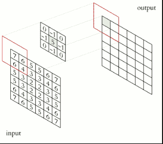
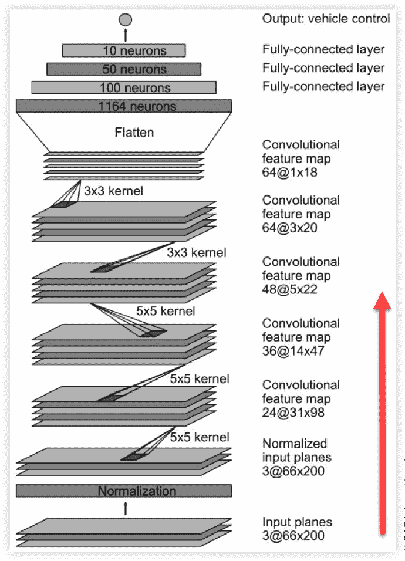
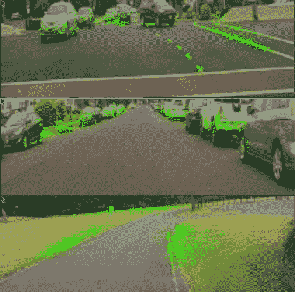
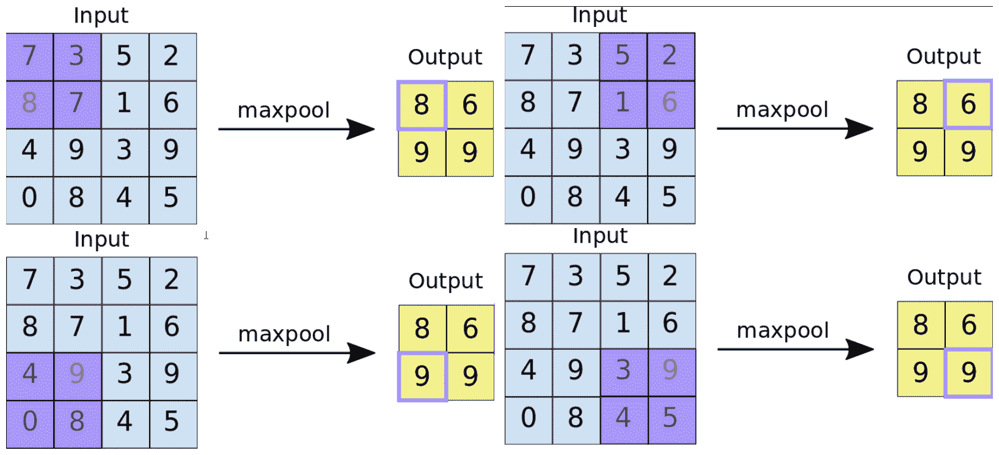
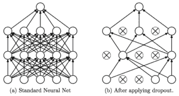
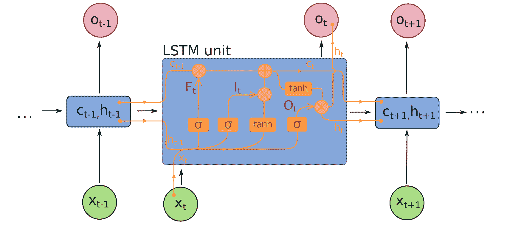

# 二、卷积和循环网络

人类大脑通常是我们在构建人工智能时的主要灵感和对比，也是深度学习研究人员经常寻求灵感或保证的东西。通过更详细地研究大脑及其各个部分，我们经常会发现神经子过程。神经子过程的一个例子是我们的视觉皮层，即我们大脑中负责视觉的区域。我们现在知道，我们大脑的这个区域有不同的连接方式，对输入的反应也不同。这恰好类似于我们在以前使用神经网络对图像进行分类的尝试中发现的模拟。现在，人类大脑有许多子过程，都有大脑中特定的映射区域(视觉、听觉、嗅觉、言语、味觉、触觉和记忆/时间)，但在这一章中，我们将看看我们如何通过使用称为**卷积和循环网络**的高级形式的深度学习来建模视觉和记忆。视觉和记忆的两个核心子过程被我们广泛用于许多任务，包括游戏，并成为许多深度学习者的研究焦点。

研究人员经常从大脑中寻找灵感，但他们建立的计算机模型往往不完全类似于他们的生物模型。然而，研究人员已经开始识别我们大脑内部神经网络的几乎完美的类似物。这方面的一个例子是 ReLU 激活函数。最近发现，当绘制时，我们大脑神经元的兴奋水平与 ReLU 图完全匹配。

在这一章中，我们将详细探讨卷积神经网络和循环神经网络。我们将看看他们如何解决在深度学习中复制精确视觉和记忆的问题。这两种新的网络或层类型是相当新的发现，但在一定程度上促成了深度学习的许多进步。本章将涵盖以下主题:

*   卷积神经网络
*   理解卷积
*   建设自动驾驶的 CNN
*   记忆和循环网络
*   用 LSTMs 玩石头、布、剪刀

在继续之前，请确保您对前一章中概述的基础知识有相当好的理解。这包括运行安装本章所需依赖项的代码示例。


# 卷积神经网络

视觉无疑是最常用的子过程。你现在正在使用它！当然，这是研究人员早期试图用神经网络模拟的东西，只是在卷积的概念被应用并用于图像分类之前，没有什么东西真正工作得很好。卷积的概念是检测(有时是分组)和隔离图像中的共同特征的思想。例如，如果你把一个熟悉的物体的照片的 3/4 遮盖起来给某人看，他们几乎肯定会通过只识别部分特征来识别图像。卷积以同样的方式工作，放大一幅图像，然后分离出特征供以后识别。

卷积的工作原理是将图像分解成其特征部分，这使得训练网络更加容易。让我们跳到一个代码示例，它从我们上一章停止的地方扩展，但现在引入了卷积。打开`Chapter_2_1.py`列表，按照以下步骤操作:

1.  看一看进行导入的前几行:

```py
import tensorflow as tf
from tensorflow.keras.layers import Input, Dense, Conv2D, MaxPooling2D, UpSampling2D
from tensorflow.keras.models import Model
from tensorflow.keras import backend as K
```

2.  在这个例子中，我们导入新的图层类型:`Conv2D`、`MaxPooling2D`和`UpSampling2D`。
3.  然后，我们设置`Input`，并使用以下代码构建编码和解码的网络部分:

```py
input_img = Input(shape=(28, 28, 1)) # adapt this if using `channels_first` image data format

x = Conv2D(16, (3, 3), activation='relu', padding='same')(input_img)
x = MaxPooling2D((2, 2), padding='same')(x)
x = Conv2D(8, (3, 3), activation='relu', padding='same')(x)
x = MaxPooling2D((2, 2), padding='same')(x)
x = Conv2D(8, (3, 3), activation='relu', padding='same')(x)
encoded = MaxPooling2D((2, 2), padding='same')(x)

x = Conv2D(8, (3, 3), activation='relu', padding='same')(encoded)
x = UpSampling2D((2, 2))(x)
x = Conv2D(8, (3, 3), activation='relu', padding='same')(x)
x = UpSampling2D((2, 2))(x)
x = Conv2D(16, (3, 3), activation='relu')(x)
x = UpSampling2D((2, 2))(x)
decoded = Conv2D(1, (3, 3), activation='sigmoid', padding='same')(x)
```

4.  首先要注意的是，我们现在保留图像的尺寸，在这种情况下，28 x 28 像素宽，1 层或通道。此示例使用灰度图像，因此只有一个颜色通道。这与之前大不相同，当时我们只是将图像分解成一个 784 维的向量。

第二个要注意的是使用了`Conv2D`层或二维卷积层以及后面的`MaxPooling2D`或`UpSampling2D`层。汇集或采样图层用于收集或相反地揭示要素。请注意，当对图像进行编码时，我们如何在卷积后使用池化或下采样层，然后在对图像进行解码时使用上采样层。

5.  接下来，我们用下面的代码块构建和训练模型:

```py
autoencoder = Model(input_img, decoded)
autoencoder.compile(optimizer='adadelta', loss='binary_crossentropy')

from tensorflow.keras.datasets import mnist
import numpy as np

(x_train, _), (x_test, _) = mnist.load_data()

x_train = x_train.astype('float32') / 255.
x_test = x_test.astype('float32') / 255.
x_train = np.reshape(x_train, (len(x_train), 28, 28, 1)) 
x_test = np.reshape(x_test, (len(x_test), 28, 28, 1)) 

from tensorflow.keras.callbacks import TensorBoard

autoencoder.fit(x_train, x_train,
 epochs=50,
 batch_size=128,
 shuffle=True,
 validation_data=(x_test, x_test),
 callbacks=[TensorBoard(log_dir='/tmp/autoencoder')])

decoded_imgs = autoencoder.predict(x_test)
```

6.  前面代码中模型的训练反映了我们在前一章结束时所做的事情，但是请注意现在训练集和测试集的选择。我们不再挤压图像，而是保留其空间属性作为卷积层的输入。
7.  最后，我们用下面的代码输出结果:

```py
n = 10
plt.figure(figsize=(20, 4))
for i in range(n):
  ax = plt.subplot(2, n, i)
  plt.imshow(x_test[i].reshape(28, 28))
  plt.gray()
  ax.get_xaxis().set_visible(False)
  ax.get_yaxis().set_visible(False)
  ax = plt.subplot(2, n, i + n)
  plt.imshow(decoded_imgs[i].reshape(28, 28))
  plt.gray()
  ax.get_xaxis().set_visible(False)
  ax.get_yaxis().set_visible(False)
plt.show()
```

8.  像以前一样运行代码，您会立即注意到它的训练速度大约慢了 100 倍。这可能需要您等待，也可能不需要，取决于您的机器；如果是这样的话，去喝一杯或三杯，或者吃一顿饭。

训练我们的简单样本现在需要大量的时间，这在较旧的硬件上可能非常明显。在下一节中，我们将详细讨论如何开始监控培训课程。


# 使用 TensorBoard 监控训练

TensorBoard 本质上是一个数学图形或计算引擎，在处理数字方面表现非常好，因此我们在深度学习中使用它。该工具本身还很不成熟，但有一些非常有用的功能来监控训练练习。

按照以下步骤开始对我们的样本进行监控培训:

1.  您可以通过在一个新的 **Anaconda** 或命令窗口中输入以下命令来监视培训会话，该命令窗口与您运行示例的目录/文件夹相同:

```py
//first change directory to sample working folder
tensorboard --logdir=/tmp/autoencoder
```

2.  这将启动一个 TensorBoard 服务器，您可以通过将浏览器导航到斜体的 URL 来查看输出，如您运行`TensorBoard`的窗口所示。它通常看起来如下所示:

```py
TensorBoard 1.10.0 at ***http://DESKTOP-V2J9HRG:6006*** (Press CTRL+C to quit)
or use
http://0.0.0.0:6000
```

3.  注意，URL 应该使用您的机器名，但是如果这样不行，请尝试第二种形式。如果出现提示，请确保允许端口`6000`、`6006`和/或 **TensorBoard** 应用程序通过您的防火墙。
4.  运行完示例后，您应该会看到以下内容:


Auto-encoding digits using convolution

5.  回过头来比较这个例子和上一个例子的结果来自[第 1 章](108dd4cb-0332-4f3b-963b-fbfb49f2c8f0.xhtml)、 *游戏深度学习*。请注意性能的提高。

你立即想到的可能是，“*我们所经历的增加的训练时间值得吗？*“毕竟，解码后的图像看起来与前面的例子非常相似，而且训练速度更快，只是，请记住，我们正在通过在每次迭代中调整每个权重来缓慢训练网络权重，然后我们可以将其保存为模型。这个模型或大脑可以在不经过训练的情况下再次执行同样的任务。工程够恐怖！在我们学习本章的时候，请记住这个概念。在 [第三章](cb51d15b-9855-47e2-8e45-f74a115ebfa8.xhtml)， *GAN for Games* 中，我们将开始保存和移动我们的大脑模型。

在下一节中，我们将更深入地了解卷积的工作原理。当你第一次遇到卷积时，它可能很难理解，所以不要着急。理解它的工作原理很重要，因为我们将在后面广泛使用它。


# 理解卷积

**卷积**是一种从图像中提取特征的方法，可以让我们更容易地根据已知特征对其进行分类。在我们进入卷积之前，让我们先退后一步，理解为什么网络，以及我们对这个问题的看法，需要隔离图像中的特征。看看下面的内容；这是一个名为 Sadie 的狗的样本图像，应用了各种图像过滤器:


Example of an image with different filters applied

前面显示了未应用滤镜、边缘检测、像素化和发光边缘滤镜的四个不同版本。然而，在所有情况下，不管应用了什么样的滤波器，作为人类的你都可以清楚地识别出这是一张狗的图片，除了注意在边缘检测的情况下，我们已经消除了识别狗所不必要的额外图像数据。通过使用过滤器，我们可以提取我们的神经网络识别狗所需的特征。这就是卷积滤波器的全部功能，在某些情况下，其中一个滤波器可能只是简单的边缘检测。

卷积过滤器是定义单个数学运算的矩阵或数字核心。该过程从乘以左上角像素值开始，将矩阵运算的结果相加并设置为输出。内核以称为**步幅**的步长在图像上滑动，该操作如下所示:



应用卷积过滤器

在上图中，使用的步幅为 1。卷积运算中应用的滤波器本质上是边缘检测滤波器。如果您查看最终操作的结果，您可以看到中间部分现在填充了 OS，这大大简化了任何分类任务。我们的网络需要学习的信息越少，它们学习的速度就越快，数据也就越少。有趣的是，卷积学习滤波器、数字或权重，以便提取相关特征。这个不太明显，可能会比较混乱，我们再来过一遍。回到我们之前的例子，看看我们如何定义第一个卷积层:

```py
x = Conv2D(16, (3, 3), activation='relu', padding='same')(input_img)
```

在这一行代码中，我们将第一个卷积层定义为具有`16`个输出滤波器，这意味着该层的输出实际上是 16 个滤波器。然后我们将内核大小设置为`(3,3)`，它代表一个`3x3`矩阵，就像我们的例子一样。请注意，我们没有指定各种内核过滤器权重的值，因为这毕竟是网络正在训练要做的事情。

让我们看看当所有的东西都放在下图中时是什么样子:

卷积第一步的输出是特征图。一个特征图表示应用的单个卷积滤波器，并且通过应用学习的滤波器/内核来生成。在我们的例子中，第一层产生 **16 个内核**，这些内核又产生 **16 个特征图**；请记住，`16`的值是滤波器的数量。

卷积之后，我们应用池化或子采样，以便将特征收集或聚集到集合中。这种二次采样进一步创建了新的集中特征图，突出了我们正在训练的图像的重要特征。让我们回顾一下在前面的例子中我们是如何定义第一个池层的:


Full convolution operation

在代码中，我们使用`(2,2)`的`pool_size`进行子采样。大小表示通过宽度和高度对图像进行下采样的因子。因此，一个 2 x 2 大小的池将创建四个宽度和高度各为一半的要素地图。在我们的第一层卷积和合并之后，这导致总共 64 个特征地图。我们通过将 16(卷积特征图)乘以 4(汇集特征图)= 64 个特征图来得到这个值。考虑在我们的简单示例中我们总共构建了多少个要素地图:


```py
x = MaxPooling2D((2, 2), padding='same')(x)
```


也就是 65，536 张 4 x 4 图像的特征地图。这意味着我们现在在 65，536 个较小的图像上训练我们的网络；对于每一幅图像，我们试图进行编码或分类。这显然是训练时间增加的原因，但也要考虑我们现在用于分类图像的额外数据量。现在，我们的网络正在学习如何识别我们图像的部分或特征，就像我们人类识别物体一样。


That is 65,536 feature maps of 4 x 4 images. This means we now train our network on 65,536 smaller images; for each image, we attempt to encode or classify. This is obviously the cause for the increased training time, but also consider the amount of extra data we are now using to classify our images. Now our network is learning how to identify parts or features of our image, just as we humans identify objects.

例如，如果你刚刚看到一只狗的鼻子，你可能会认出那是一只狗。因此，我们的样本网络现在正在识别手写数字的部分，正如我们现在所知，这极大地提高了性能。

正如我们所看到的，卷积对于识别图像非常有效，但是汇集的过程可能会对保持空间关系产生破坏性的后果。因此，当涉及到需要某种形式的空间理解的游戏或学习时，我们倾向于限制合用或完全消除。由于理解何时使用和不使用池很重要，我们将在下一节中更详细地讨论这一点。

建设自动驾驶的 CNN

Nvidia 在 2017 年创建了一个名为 **PilotNet** 的多层 CNN，它能够通过向车辆显示一系列图像或视频来驾驶车辆。这是神经网络力量的一个令人信服的证明，尤其是卷积的力量。下图显示了 PilotNet 的神经架构:


# 该图示出了从底部向上移动的网络输入，其中输出到单个神经元的单个输入图像的结果表示操纵方向。由于这是一个很好的例子，一些人已经发布了展示 PilotNet 例子的博客文章，其中一些实际上是有效的。我们将研究其中一篇博文的代码，看看如何用 Keras 构建类似的架构。接下来是 PilotNet 博客的原始图片，显示了我们的自动驾驶网络将用于训练的几种类型的图像:

本例中训练的目标是输出方向盘应该转动的角度，以便保持车辆在道路上行驶。打开`Chapter_2_2.py`中的代码列表，并遵循以下步骤:



PilotNet neural architecture

我们现在将切换到使用 Keras 的几个样本。虽然 TensorFlow 嵌入式版本的 Keras 为我们提供了很好的服务，但我们需要的一些功能只能在完整版本中找到。要安装 Keras 和其他依赖项，请打开一个 shell 或 Anaconda 窗口并运行以下命令:



Example of PilotNet training images

在代码文件(`Chapter_2_2.py`)的开头，我们从一些导入开始，并使用以下代码加载样本数据:

1.  这段代码只是进行一些导入，然后从作者的源数据中下载示例驱动帧。这篇博客的原始资料由**罗斯科的笔记本**写在一个笔记本上，可以在[https://wros Coe . github . io/keras-lane-following-auto pilot . html](https://wroscoe.github.io/keras-lane-following-autopilot.html)找到。
    `pickle`是一个解压缩库，它解包前面清单底部的数据集`X`和`Y`中的数据。

```py
pip install keras
pip install pickle
pip install matplotlib
```

2.  然后我们打乱帧的顺序，或者基本上随机化数据。我们经常以这种方式随机化数据，以使我们的训练更强。通过随机化数据顺序，网络需要学习图像的绝对导向值，而不是可能的相对或增量值。下面的代码会进行这种洗牌:

```py
import os
import urllib.request
import pickle
import matplotlib
import matplotlib.pyplot as plt

***#downlaod driving data (450Mb)*** 
data_url = 'https://s3.amazonaws.com/donkey_resources/indoor_lanes.pkl'
file_path, headers = urllib.request.urlretrieve(data_url)
print(file_path)

with open(file_path, 'rb') as f:
  X, Y = pickle.load(f)
```

3.  这段代码所做的就是使用`numpy`随机打乱图像帧。然后它打印出第一个混洗集合`shuffled_X`的长度，这样我们就可以确认训练数据没有丢失。
4.  接下来，我们需要创建一个训练和测试数据集。训练集用于训练网络(权重)，测试集或验证集用于确认新数据或原始数据的准确性。正如我们之前看到的，这是使用监督训练或标记数据时的常见主题。我们经常把数据分成 80%的训练和 20%的测试。下面的代码就是这样做的:

```py
import numpy as np
def unison_shuffled_copies(X, Y):
  assert len(X) == len(Y)
  p = np.random.permutation(len(X))
  return X[p], Y[p]

shuffled_X, shuffled_Y = unison_shuffled_copies(X,Y)
len(shuffled_X)
```

5.  在创建了训练集和测试集之后，我们现在想要增加或扩展训练数据。在这个特殊的例子中，作者仅仅通过翻转原始图像并将它们添加到数据集来扩充数据。我们将在后面的章节中发现增加数据的许多其他方法，但这种简单有效的翻转方法是添加到您的机器学习工具带中的东西。实现这种翻转的代码如下所示:

6.  现在是最重要的部分。数据已经准备好了，现在是构建模型的时候了，如代码所示:

```py
test_cutoff = int(len(X) * .8) # 80% of data used for training
val_cutoff = test_cutoff + int(len(X) * .2) # 20% of data used for validation and test data
train_X, train_Y = shuffled_X[:test_cutoff], shuffled_Y[:test_cutoff]
val_X, val_Y = shuffled_X[test_cutoff:val_cutoff], shuffled_Y[test_cutoff:val_cutoff]
test_X, test_Y = shuffled_X[val_cutoff:], shuffled_Y[val_cutoff:]

len(train_X) + len(val_X) + len(test_X)
```

7.  此时构建模型的代码应该是不言自明的。请注意架构中的变化以及代码是如何从我们之前的示例中编写出来的。还要注意突出显示的两行。第一个使用了一个新的图层类型叫做`Flatten`。这种图层类型所做的就是将 2 x 2 的图像展平成一个向量，然后输入到一个标准的`Dense`隐藏的全连接图层中。第二个高亮显示的行引入了另一个新的图层类型，叫做`Dropout`。这种类型的图层需要更多的解释，在本节的最后会有更详细的介绍。

```py
X_flipped = np.array([np.fliplr(i) for i in train_X])
Y_flipped = np.array([-i for i in train_Y])
train_X = np.concatenate([train_X, X_flipped])
train_Y = np.concatenate([train_Y, Y_flipped])
len(train_X)
```

8.  最后是训练部分，这段代码设置了这个部分:

```py
from keras.models import Model, load_model
from keras.layers import Input, Convolution2D, MaxPooling2D, Activation, Dropout, Flatten, Dense

img_in = Input(shape=(120, 160, 3), name='img_in')
angle_in = Input(shape=(1,), name='angle_in')

x = Convolution2D(8, 3, 3)(img_in)
x = Activation('relu')(x)
x = MaxPooling2D(pool_size=(2, 2))(x)

x = Convolution2D(16, 3, 3)(x)
x = Activation('relu')(x)
x = MaxPooling2D(pool_size=(2, 2))(x)

x = Convolution2D(32, 3, 3)(x)
x = Activation('relu')(x)
x = MaxPooling2D(pool_size=(2, 2))(x)

merged = Flatten()(x)

x = Dense(256)(merged)
x = Activation('linear')(x)
x = Dropout(.2)(x)

angle_out = Dense(1, name='angle_out')(x)

model = Model(input=[img_in], output=[angle_out])
model.compile(optimizer='adam', loss='mean_squared_error')
model.summary()
```

9.  这最后一段代码设置了一组`callbacks`来更新和控制训练。我们已经使用回调用日志更新 TensorBoard 服务器。在这种情况下，我们使用回调在每个检查点(epoch)后重新保存模型，并检查是否提前退出。注意我们保存模型的形式——一个`hdf5`文件。这种文件格式代表一种分层数据结构。
10.  像以前一样运行代码。这个示例可能需要一段时间，所以请耐心等待。完成后，不会有输出，但要特别注意最小化损失值。

```py
import os
from keras import callbacks

model_path = os.path.expanduser('~/best_autopilot.hdf5')

save_best = callbacks.ModelCheckpoint(model_path, monitor='val_loss', verbose=1, 
 save_best_only=True, mode='min')

early_stop = callbacks.EarlyStopping(monitor='val_loss', min_delta=0, patience=5, 
 verbose=0, mode='auto')

callbacks_list = [save_best, early_stop]

model.fit(train_X, train_Y, batch_size=64, epochs=4, validation_data=(val_X, val_Y), callbacks=callbacks_list)
```

11.  在你深度学习生涯的这一点上，你可能会意识到你需要更多的耐心或更好的计算机，或者支持 TensorFlow 的 GPU。如果您想尝试后者，请随意下载并安装 TensorFlow GPU 库和您的操作系统所需的其他库，因为这可能会有所不同。大量的文档可以在网上找到。安装 TensorFlow 的 GPU 版本后，Keras 会自动尝试使用它。如果你有一个受支持的 GPU，你应该注意到性能的提高，如果没有，那么考虑购买一个。
12.  虽然这个例子没有输出，但是为了简单起见，请尝试理解正在发生的事情。毕竟，这可以像一个驾驶游戏一样容易地设置，网络只需查看截图就可以驾驶车辆。我们省略了作者原始博文中的结果，但是如果你想进一步了解它的表现，请返回查看[源链接](https://wroscoe.github.io/keras-lane-following-autopilot.html)。

作者在他的博客文章中做的一件事是使用池层，正如我们已经看到的，这在使用卷积时是非常标准的。然而，何时以及如何使用池化层现在还有点争议，需要进一步的详细讨论，这将在下一节中提供。

空间卷积和汇集

Geoffrey Hinton 和他的团队最近强烈建议使用卷积合并来消除图像中的空间关系。辛顿建议使用 **CapsNet** ，或者**胶囊网络**。胶囊网络是一种保持数据空间完整性的池化方法。现在，这可能不是所有情况下的问题。对于手写数字，空间关系并不那么重要。然而，自动驾驶汽车或承担空间任务的网络，其中一个主要例子是游戏，在使用合用时往往表现不佳。事实上，Unity 的团队在卷积后不使用池层；我们来了解一下原因。


# 汇集或下采样是一种通过收集数据的共同特征来扩充数据的方法。这样做的问题是，数据中的任何关系经常会完全丢失。下图演示了卷积映射上的 **MaxPooling(2，2)** :

即使在前面的简单图表中，您也可以很快意识到池化丢失了池化值开始所在的角(左上角、左下角、右下角和右上角)的空间关系。请注意，在几层合并之后，任何空间关系都将完全消失。

我们可以测试从模型中删除池层的效果，并按照以下步骤再次测试:



 Max pooling at work

打开`Chapter_2_3.py`文件，注意我们是如何注释掉几个池层的，或者你也可以删除这些行，就像这样:

We can test the effect of removing pooling layers from the model and test this again by following these steps:

1.  Open the `Chapter_2_3.py` file and note how we commented out a couple of pooling layers, or you can just delete the lines as well, like so:

```py
x = Convolution2D(8, 3, 3)(img_in)
x = Activation('relu')(x)
x = MaxPooling2D(pool_size=(2, 2))(x)

x = Convolution2D(16, 3, 3)(x)
x = Activation('relu')(x)
#x = MaxPooling2D(pool_size=(2, 2))(x)

x = Convolution2D(32, 3, 3)(x)
x = Activation('relu')(x)
#x = MaxPooling2D(pool_size=(2, 2))(x)
```

请注意，我们没有注释掉(或删除)所有的池层，只保留了一个层。在某些情况下，您可能仍希望保留几个池化图层，以识别空间上不重要的要素。例如，当识别数字时，空间相对于整体形状来说不太重要。然而，如果我们考虑识别一张脸，那么一个人的眼睛、嘴巴等等之间的距离就是一张脸与另一张脸的区别。然而，如果你只是想识别一张脸，眼睛，嘴，等等，那么只应用池可能是完全可以接受的。

接下来，我们还增加了我们的`Dropout`层的辍学率，如下所示:

2.  我们将在下一节详细探讨辍学问题。但是现在，只要意识到这个变化将对我们的模型产生更积极的影响。
3.  最后，我们用下面的代码增加了`10`的纪元数:

```py
x = Dropout(.5)(x)
```

4.  在我们之前的运行中，如果你在训练时观察损失率，你会发现上一个例子或多或少在四个时期开始收敛。因为删除池层也会减少训练数据，所以我们还需要增加历元的数量。请记住，池化或下采样会增加特征地图的数量，而更少的地图意味着网络需要更多的训练运行。如果你不是在 GPU 上训练，这个模型需要一段时间，所以要有耐心。
5.  最后，再次运行这个例子，做一些小的修改。你会注意到的第一件事是训练时间急剧增加。请记住，这是因为我们的池层确实有助于更快的培训，但这是有成本的。这是我们允许单一池层的原因之一。

```py
model.fit(train_X, train_Y, batch_size=64, epochs=10, validation_data=(val_X, val_Y), callbacks=callbacks_list)
```

6.  当样本运行结束时，比较我们之前运行的`Chapter_2_2.py`样本的结果。它达到你的预期了吗？
7.  我们只关注这篇特别的博文，因为它展示得非常好，写得也非常好。作者显然知道他的东西，但这个例子只是表明，尽可能详细地理解这些概念的基础是多么重要。在信息泛滥的情况下，这不是一项容易的任务，但这也强化了一个事实，即开发有效的深度学习模型不是一项微不足道的任务，至少目前不是。
8.  When the sample is finished running, compare the results for the `Chapter_2_2.py` sample we ran earlier. Did it do what you expected it to?

既然我们理解了合并层的成本/代价，我们可以继续下一节，在这里我们跳回理解`Dropout`。这是一个你会反复使用的优秀工具。

辍学的必要性

现在，让我们回到我们非常需要的关于`Dropout`的讨论。我们在深度学习中使用 dropout 作为一种在每次迭代中随机切断层间网络连接的方式。下图中显示了一个示例，该示例显示了应用于三个网络层的下降迭代:


# 重要的是要明白，相同的连接并不总是被切断。这样做是为了让网络变得不那么专门化，而更加一般化。概括模型是深度学习中的一个常见主题，我们经常这样做，以便我们的模型可以更快地学习更广泛的问题。当然，有些时候，泛化网络会限制网络的学习能力。

如果我们现在回到之前的示例，看看代码，我们会看到一个`Dropout`层被这样使用:



Before and after dropout

这一行简单的代码告诉网络在每次迭代后随机地丢弃或断开 50%的连接。丢弃仅适用于完全连接的层(**输入**->-**密集**->-**密集**)，但作为一种提高性能或精度的方式非常有用。这可能是也可能不是上一个示例中性能提高的原因。

在下一部分，我们将看看深度学习是如何模仿记忆子过程或时间气味的。

```py
x = Dropout(.5)(x)
```

记忆和循环网络

记忆经常与**循环神经网络** ( **RNN** )联系在一起，但那并不完全是一种准确的关联。RNN 实际上只对存储一系列事件有用，或者你可以称之为**时间感**，也可以称之为时间感。rnn 通过在递归或循环中把状态保持回自身来做到这一点。这里显示了一个示例:


# 展开循环神经网络

该图显示的是一个循环神经元的内部表示，该神经元被设置为跟踪多个时间步长或迭代，其中 **x** 表示一个时间步长的输入， **h** 表示状态。对于所有时间步长， **W** 、 **U** 和 **V** 的网络权重保持不变，并使用称为**时间反向传播** ( **BPTT** )的技术进行训练。我们不会进入 BPTT 的数学，让读者自己去发现，而只是意识到循环网络中的网络权重使用成本梯度方法来优化它们。


循环网络允许神经网络识别元素序列，并预测接下来通常会出现什么元素。这在预测文本、股票，当然还有游戏方面有巨大的应用。几乎所有能够从对时间或事件序列的把握中受益的活动都将从使用 RNN 中受益，但标准 RNN 除外，前面显示的类型由于梯度问题而无法预测更长的序列。我们将在下一节深入探讨这个问题和解决方案。

LSTM 拯救的消失和爆炸渐变

RNN 面临的问题不是渐变消失就是渐变爆炸。这是因为，随着时间的推移，我们试图最小化或降低的梯度变得如此之小或如此之大，以至于任何额外的训练都没有效果。这限制了 RNN 的实用性，但幸运的是，这个问题已经用**长短期记忆** *(* **LSTM** )块纠正了，如下图所示:


# LSTM 区块克服了消失梯度问题使用一些技术。在内部，在图中你看到一个圆圈内的 **x** ，它表示一个由激活功能控制的门。在图中，激活功能是 **σ** 和 **tanh** 。这些激活函数的工作方式很像 step 或 ReLU，我们可以在常规网络层中使用这两个函数中的任何一个来激活。在很大程度上，我们会把 LSTM 当作一个黑盒，你需要记住的只是 lstm 克服了 RNN 的梯度问题，可以记住长期序列。

The problem the RNN suffers from is either vanishing or exploding gradients. This happens because, over time, the gradient we try to minimize or reduce becomes so small or big that any additional training has no effect. This limits the usefulness of the RNN, but fortunately this problem was corrected with **Long Short-Term Memory*** (***LSTM**) blocks, as shown in this diagram:



Example of an LSTM block

LSTM blocks overcome the vanishing gradient problem using a few techniques. Internally, in the diagram where you see a **x** inside a circle, it denotes a gate controlled by an activation function. In the diagram, the activation functions are **σ** and **tanh**. These activation functions work much like a step or ReLU do, and we may use either function for activation in a regular network layer. For the most part, we will treat an LSTM as a black box, and all you need to remember is that LSTMs overcome the gradient problem of RNN and can remember long-term sequences.

让我们看一个工作示例，看看这两者是如何结合在一起的。打开`Chapter_2_4.py`并遵循以下步骤:

我们像往常一样从导入我们需要的各种 Keras 片段开始，如下所示:

这个例子摘自[https://machine learning mastery . com/understanding-stateful-lstm-recurrent-neural-networks-python-keras/](https://machinelearningmastery.com/understanding-stateful-lstm-recurrent-neural-networks-python-keras/)。这是一个由杰森·布朗利博士主持的网站，他有很多很好的例子来解释 LSTM 和循环网络的使用。

1.  这次我们导入两个新的类，`Sequential`和`LSTM`。我们当然知道`LSTM`是干什么用的，但是`Sequential`呢？`Sequential`是一种模型形式，它以一个接一个的顺序定义层。我们以前不太担心这个细节，因为我们以前的模型都是顺序的。

接下来，我们将随机种子设置为一个已知值。我们这样做是为了让我们的例子可以自我复制。在前面的例子中，您可能已经注意到，并不是所有的运行都有相同的表现。在许多情况下，我们希望我们的训练是一致的，因此我们通过使用以下代码来设置一个已知的种子值:

```py
import numpy
from keras.models import Sequential
from keras.layers import Dense
from keras.layers import LSTM
from keras.utils import np_utils
```

2.  重要的是要认识到这只是设置了`numpy`随机种子值。其他库可能使用不同的随机数生成器，并需要不同的种子设置。我们将尽可能在将来找出这些不一致的地方。
3.  接下来，我们需要确定我们要训练的序列；在这种情况下，我们将只使用如代码所示的`alphabet`:

```py
numpy.random.seed(7)
```

4.  前面的代码将我们的字符序列构建为整数，并构建每个字符序列的映射。它构建了一个显示前进和后退位置的`seq_in`和`seq_out`。既然序列的长度是由`seq_length = 1`定义的，那么我们只关心字母表中的一个字母和它后面的字符。当然，你可以做更长的片段。
5.  构建好序列数据后，是时候用下面的代码对数据进行整形和规范化了:

```py
alphabet = "ABCDEFGHIJKLMNOPQRSTUVWXYZ"

char_to_int = dict((c, i) for i, c in enumerate(alphabet))
int_to_char = dict((i, c) for i, c in enumerate(alphabet))

seq_length = 1
dataX = []
dataY = []

for i in range(0, len(alphabet) - seq_length, 1):
  seq_in = alphabet[i:i + seq_length]
  seq_out = alphabet[i + seq_length]
  dataX.append([char_to_int[char] for char in seq_in])
  dataY.append(char_to_int[seq_out])
  print(seq_in, '->', seq_out)
```

6.  前面代码中的第一行将数据重新整形为一个张量，其大小长度为`dataX`，步骤或序列的数量，以及要识别的特征的数量。然后我们将数据标准化。规范化数据有多种形式，但在这种情况下，我们是从 0 到 1 规范化值。然后我们对输出进行编码，以便于训练。
7.  一种热门的编码方式是在有数据或响应的地方将值设置为 1，在其他地方设置为零。在本例中，我们的模型输出是 26 个神经元，也可以用 26 个零来表示，每个神经元一个零，如下:
    **000000000000000000** 
    其中每个零表示字母表中匹配的字符位置。如果我们想要表示一个字符 **A** ，我们将输出一个热编码值如下:
    100000000000000000000

```py
X = numpy.reshape(dataX, (len(dataX), seq_length, 1))
# normalize
X = X / float(len(alphabet))
# one hot encode the output variable
y = np_utils.to_categorical(dataY)
```

8.  The first line in the preceding code reshapes the data into a tensor with a size length of `dataX`, the number of steps or sequences, and the number of features to identify. We then normalize the data. Normalizing the data comes in many forms, but in this case we are normalizing values from 0 to 1\. Then we one hot encode the output for easier training.

然后，我们构建模型，使用与我们之前看到的略有不同的代码形式，如下所示:

前面代码的关键部分是突出显示的一行，显示了`LSTM`层的构造。我们通过设置单位的数量来构建一个`LSTM`层，在这里是`32`，因为我们的序列有 26 个字符长，我们希望我们的单位在`2`之前被禁用。然后我们设置`input_shape`来匹配之前的张量`X`，我们创建它来保存我们的训练数据。在这种情况下，我们只是设置形状来匹配所有的字符(26)和序列长度，在这种情况下是`1`。

9.  最后，我们用下面的代码输出模型:

```py
model = Sequential()
model.add(LSTM(32, input_shape=(X.shape[1], X.shape[2])))
model.add(Dense(y.shape[1], activation='softmax'))
model.compile(loss='categorical_crossentropy', optimizer='adam', metrics=['accuracy'])
model.fit(X, y, epochs=500, batch_size=1, verbose=2)

scores = model.evaluate(X, y, verbose=0)
print("Model Accuracy: %.2f%%" % (scores[1]*100))
```

10.  像平常一样运行代码并检查输出。你会注意到准确率在 80%左右。看看能否提高模型预测字母表中下一个序列的准确性。
11.  这个简单的例子演示了 LSTM 块识别简单序列的基本用法。在下一节中，我们来看一个更复杂的例子:用 LSTM 玩石头、布、剪刀。

```py
for pattern in dataX:
  x = numpy.reshape(pattern, (1, len(pattern), 1))
  x = x / float(len(alphabet))
  prediction = model.predict(x, verbose=0)
  index = numpy.argmax(prediction)
  result = int_to_char[index]
  seq_in = [int_to_char[value] for value in pattern]
  print(seq_in, "->", result)
```

12.  用 LSTMs 玩石头、布、剪刀

记忆数据序列在许多领域都有巨大的应用，不仅仅包括游戏。当然，产生一个简单、干净的例子是另一回事。幸运的是，互联网上的例子比比皆是，`Chapter_2_5.py`展示了一个用 LSTM 玩石头、布、剪刀的例子。


# Playing Rock, Paper, Scissors with LSTMs

Remembering sequences of data have huge applications in many areas, not the least of which includes gaming. Of course, producing a simple, clean example is another matter. Fortunately, examples abound on the internet and `Chapter_2_5.py` shows an example of using an LSTM to play Rock, Paper, Scissors.

打开示例文件，按照以下步骤操作:

这个例子来自 https://github.com/hjpulkki/RPS，但是代码需要在几个地方进行调整才能为我们所用。

让我们像往常一样开始进口。对于此示例，请确保像我们在上一组练习中所做的那样安装 Keras:

然后，我们设置一些常量，如下所示:

1.  然后，我们建立模型，这一次有三个 LSTM 层，一个用于我们序列中的每个元素(石头、布、剪刀)，像这样:

```py
import numpy as np
from keras.utils import np_utils
from keras.models import Sequential
from keras.layers import Dense, LSTM
```

2.  Then, we set some constants as shown:

```py
EPOCH_NP = 100
INPUT_SHAPE = (1, -1, 1)
OUTPUT_SHAPE = (1, -1, 3)
DATA_FILE = "data.txt"
MODEL_FILE = "RPS_model.h5"
```

3.  Then, we build the model, this time with three LSTM layers, one for each element in our sequence (rock, paper and scissors), like so:

```py
def simple_model(): 
  new_model = Sequential()
  new_model.add(LSTM(output_dim=64, input_dim=1, return_sequences=True, activation='sigmoid'))
  new_model.add(LSTM(output_dim=64, return_sequences=True, activation='sigmoid'))
  new_model.add(LSTM(output_dim=64, return_sequences=True, activation='sigmoid'))
  new_model.add(Dense(64, activation='relu'))
  new_model.add(Dense(64, activation='relu'))
  new_model.add(Dense(3, activation='softmax'))
  new_model.compile(loss='categorical_crossentropy', optimizer='adam', metrics=['accuracy', 'categorical_crossentropy'])
  return new_model
```

然后我们创建一个函数来从`data.txt`文件中提取数据。该文件包含使用以下代码的训练数据序列:

在这个例子中，我们按照与文件中相同的顺序，通过 100 个时期训练每个训练块。更好的方法是以随机顺序训练每个训练序列。

4.  然后我们创建模型:

```py
def batch_generator(filename): 
  with open('data.txt', 'r') as data_file:
    for line in data_file:
      data_vector = np.array(list(line[:-1]))
      input_data = data_vector[np.newaxis, :-1, np.newaxis]
      temp = np_utils.to_categorical(data_vector, num_classes=3) 
      output_data = temp[np.newaxis, 1:]
      yield (input_data, output_data)
```

5.  使用循环训练数据，每次迭代从`data.txt`文件中提取一批数据:
6.  最后，我们使用验证序列评估结果，如以下代码所示:

```py
# Create model
np.random.seed(7)
model = simple_model()
```

7.  像平常一样运行样本。检查最后的结果，并注意模型在预测序列时的准确性。

```py
for (input_data, output_data) in batch_generator('data.txt'):
  try:
    model.fit(input_data, output_data, epochs=100, batch_size=100)
  except:
    print("error")
```

8.  请务必运行这个简单的例子几次，并了解 LSTM 层是如何设置的。请特别注意参数及其设置方式。

```py
print("evaluating")
validation = '100101000110221110101002201101101101002201011012222210221011011101011122110010101010101'
input_validation = np.array(list(validation[:-1])).reshape(INPUT_SHAPE)
output_validation = np_utils.to_categorical(np.array(list(validation[1:]))).reshape(OUTPUT_SHAPE)
loss_and_metrics = model.evaluate(input_validation, output_validation, batch_size=100)

print("\n Evaluation results")

for i in range(len(loss_and_metrics)):
  print(model.metrics_names[i], loss_and_metrics[i])

input_test = np.array([0, 0, 0, 1, 1, 1, 2, 2, 2]).reshape(INPUT_SHAPE)
res = model.predict(input_test)
prediction = np.argmax(res[0], axis=1)
print(res, prediction)

model.save(MODEL_FILE)
del model
```

9.  这就结束了我们对如何使用递归 aka LSTM 块来识别和预测数据序列的快速了解。当然，在本书的整个过程中，我们会多次使用这种多功能图层类型。

在本章的最后一节，我们再次展示了一些鼓励你为了自己的利益而进行的练习。

练习

利用自己的时间完成下列练习，并改善自己的学习体验。提高你对材料的理解会让你成为一个更成功的深度学习者，你也会更喜欢这本书:


# 在`Chapter_2_1.py`的例子中，改变`Conv2D`图层使用不同的滤镜大小。再次运行该示例，看看这对训练性能和准确性有什么影响。

注释掉或删除几个`Chapter_2_1.py`例子中的`MaxPooling`层和相应的`UpSampling`层。请记住，如果您删除第 2 层和第 3 层之间的池层，您同样需要删除上采样以保持一致。再次运行该示例，看看这对训练时间、准确性和性能有什么影响。

1.  使用不同的过滤器尺寸改变`Chapter_2_2.py`示例中的 **Conv2D** 层。看看这对训练有什么影响。
2.  使用 **2** 的跨距值改变`Chapter_2_2.py`示例中的 **Conv2D** 层。为此，您可能需要查阅 **Keras** 文档。看看这对训练有什么影响。
3.  通过改变池尺寸来改变`Chapter_2_2.py`示例中的**最大池**层。看看这对训练有什么影响。

4.  移除所有或注释掉在`Chapter_2_3.py`示例中使用的不同 **MaxPooling** 层。如果所有的池层都被注释掉，会发生什么？你现在需要增加训练次数吗？
5.  在本章使用的各种示例中，更改 **Dropout** 的用法。这包括增加辍学。测试使用不同辍学水平的影响。
6.  修改`Chapter_2_4.py`中的样本，使模型产生更好的精度。为了提高培训绩效，你需要做些什么？
7.  在`Chapter_2_4.py`中修改样本以预测序列中的多个字符。如果您需要帮助，请返回并查看原始博客帖子以获取更多信息。
8.  如果你改变`Chapter_2_5.py`例子中三个 **LSTM** 层使用的单位数量会发生什么？如果将值增加到 128、32 或 16 会怎么样？尝试这些值以了解它们的效果。
9.  你可以随意扩展这些练习。试着自己写一个新的例子，即使只是一个简单的例子。学习编码的最好方法就是自己编写代码。
10.  What happens if you change the number of units that the three **LSTM** layers use in the `Chapter_2_5.py` example? What if you increase the value to 128, 32, or 16? Try these values to understand the effect they have.

Feel free to expand on these exercises on your own. Try to write a new example on your own as well, even if it is just a simple one. There really is no better way to learn to code than to write your own.

摘要

对于本章和最后一章，我们深入研究了深度学习和神经网络的核心元素。虽然我们对前几章的回顾并不全面，但它应该会为你继续阅读本书的其余部分打下良好的基础。如果你对前两章的任何内容有困难，现在回头花更多的时间复习前面的内容。理解神经网络架构的基础和各种专门层的使用是很重要的，正如我们在本章中所涉及的(CNN 和 RNN)。请确保您了解 CNN 的基本知识，如何有效地使用它来选择特征，以及在使用汇集或子采样时的权衡。还要理解 RNN 的概念，以及如何和何时使用 LSTM 块来预测或检测时间事件。卷积层和 LSTM 块现在是深度学习的基本组件，我们将在未来构建的几个网络中使用它们。


# 在下一章，我们开始为这本书构建我们的样本游戏，并介绍 GANs，或生成对抗网络。我们将探索 gan 以及它们如何被用来生成游戏内容。

For this chapter and the last, we took a deep dive into the core elements of deep learning and neural networks. While our review in the last couple chapters was not extensive, it should give you a good base for continuing through the rest of the book. If you had troubles with any of the material in the first two chapters, turn back now and spend more time reviewing the previous material. It is important that you understand the basics of neural network architecture and the use of various specialized layers, as we covered in this chapter (CNN and RNN). Be sure you understand the basics of CNN and how to use it effectively in picking features and what the trade—offs are when using pooling or sub sampling. Also understand the concept of RNN and how and when to use LSTM blocks for predicting or detecting temporal events. Convolutional layers and LSTM blocks are now fundamental components of deep learning, and we will use them in several networks we build going forward.  

In the next chapter, we start to build out our sample game for this book and introduce GANs, or generative adversarial networks. We will explore GANs and how they can be used to generate game content.