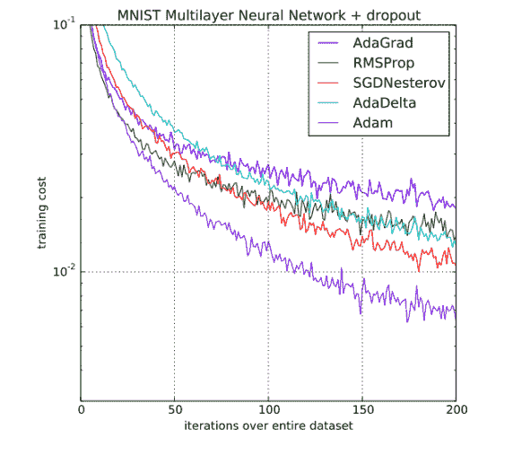
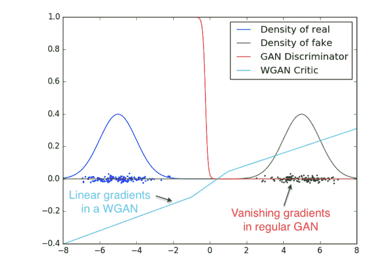
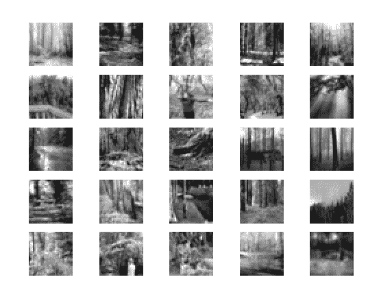
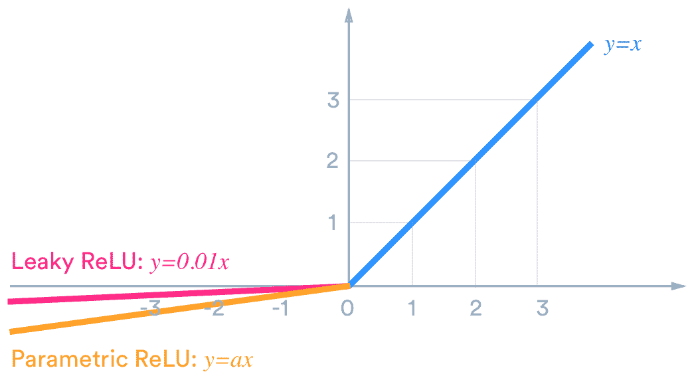
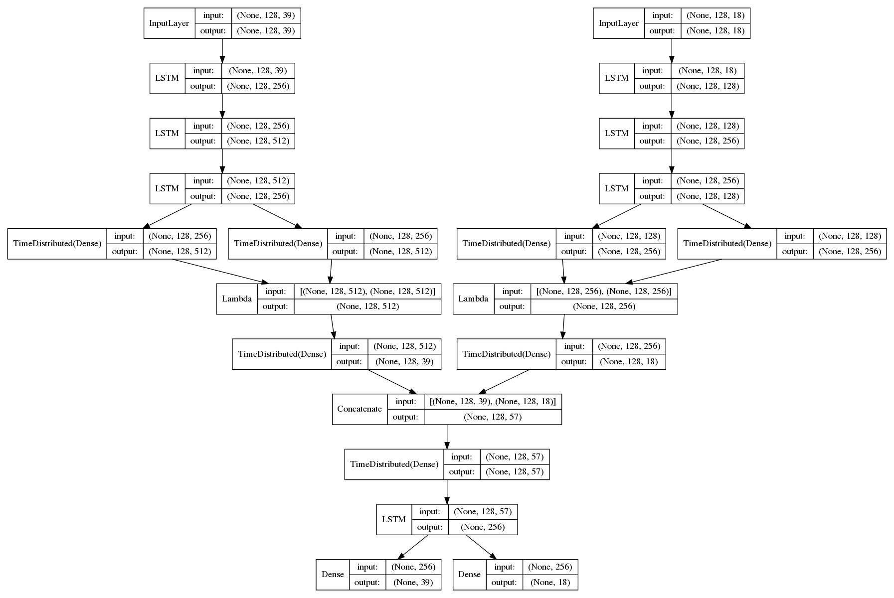

# 三、游戏和 GAN

到目前为止，在我们的深度学习探索中，我们已经使用一种叫做**监督训练**的技术训练了我们所有的网络。当你花时间去识别和标记你的数据时，这种训练技术很有效。我们之前的所有示例练习都使用了监督训练，因为这是最简单的教学形式。然而，监督学习往往是最麻烦和乏味的方法，这主要是因为它需要在训练之前进行一些数据标记或识别。已经有人尝试在游戏和模拟中使用这种形式的训练进行机器学习或深度学习，但他们被证明是不成功的。

这就是为什么在本书的大部分时间里，我们将着眼于其他形式的训练，从一种被称为**生成对抗网络** ( **甘**)的无监督训练形式开始。基本上，GANs 可以通过双人游戏来训练自己。这使得它们成为我们学习的理想下一步，也是真正开始为游戏生成内容的完美方式。

在这一章中，我们将探索 gan 及其在开发游戏内容中的应用。在这个过程中，我们将学习更多深度学习技术的基础知识。在本章中，我们将涵盖以下内容:

*   GANs 简介
*   用 Keras 编码 GAN
*   瓦瑟斯坦·甘
*   GAN 用于创建纹理
*   用 GAN 创作音乐
*   练习

众所周知，GANs 很难训练和成功建造。因此，建议您慢慢阅读本章内容，如果需要的话，可以反复练习几次。我们学习的有效的 GANs 的技巧将会让你对训练网络和许多其他可用的选择有一个更好的整体理解。我们还需要涵盖许多关于训练网络的基本概念，所以请通读本章。


# GANs 简介

GANs 的概念通常是用两人游戏的类比来介绍的。在这个游戏中，通常有一个艺术专家和一个艺术伪造者。艺术品伪造者或伪造者的目标是制造一个足够令人信服的赝品来愚弄艺术专家，从而赢得这场游戏。这是如何首先被描绘成神经网络的示例如下:


GAN by Ian and others

在上图中，生成器取代了艺术伪造者的位置，即试图击败艺术专家的人，显示为鉴别者。生成器使用随机噪声作为源来生成图像，目标是图像足够有说服力以欺骗鉴别器。鉴别器在真实和伪造的图像上被训练，它所做的只是将图像分类为真实或伪造。然后，生成器被训练来制造一个足够令人信服的赝品，来愚弄鉴别者。虽然这个概念作为一种自我训练网络的方式看起来足够简单，但是在过去几年中，这种对抗技术的实现已经在许多领域中被证明是异常的。

gan 是由蒙特利尔大学的 Ian Goodfellow 等人在 2014 年首先开发的。在短短的几年里，这项技术已经发展成为许多广泛而多样的应用，从生成图像和文本到制作静态图像动画，所有这些都是在很短的时间内完成的。以下是深度学习社区中一些令人印象深刻的 GAN 改进/实现的简短总结:

*   深度卷积 gan(**DC gan**):这些是对我们刚刚讨论的标准架构的第一次重大改进。我们将在本章的下一节中探讨这种 GAN 的第一种形式。
*   **对抗性自编码器 GAN** :这种自编码器的变种使用对抗性 GAN 技术来隔离数据的属性。它在确定数据中的潜在关系方面有着有趣的应用，比如能够区分一组手写数字的风格和内容。
*   **辅助分类器 GAN** :这是另一个增强的 GAN，与条件或条件 GAN 相关。它已经被证明可以合成更高分辨率的图像，当然值得在游戏中进一步探索。
*   CycleGAN :这是一个令人印象深刻的变化，它允许风格从一个图像转换到另一个图像。有大量的例子表明，这种形式的甘被用来设计一幅画，就像梵高画的那样，来交换名人的面孔。如果这一章激起了你对 GANs 的兴趣，你想探索这种形式，看看这篇文章:[https://hardikbansal.github.io/CycleGANBlog/](https://hardikbansal.github.io/CycleGANBlog/)。
*   条件 GANS :这是一种半监督学习的形式。这意味着训练数据被标记，但是带有元数据或属性。因此，你可以标记书写风格(草书或印刷体)，而不是将 MNIST 数据集中的手写数字标记为 9。然后，这种新形式的条件化甘不仅可以学习数字，还可以学习它们是草书还是印刷体。这种形式的 GAN 已经显示出一些有趣的应用，当我们谈到游戏中的具体应用时，我们将进一步探索这种应用。
*   **DiscoGAN** :这是另一种形式的 GAN 展示有趣的结果，从交换名人发型到性别。这个 GAN 提取特征或域，并允许您将它们转移到其他图像或数据空间。这种 GAN 在游戏中有许多应用，当然值得感兴趣的读者进一步探索。
*   **DualGAN** :使用双 GANs 训练两个生成器对抗两个鉴别器，以便将图像或数据传输到其他样式。这将是一种非常有用的重新设计多种资源的方式，并且可以很好地为游戏生成不同形式的艺术内容。
*   **最小平方 GAN** ( **LSGAN** ):这使用了一种不同的计算损耗的形式，并且已经被证明比 DCGAN 更有效。
*   **pix2pixGAN** :这是对条件 GANs 的扩展，允许它从一个图像到另一个图像传输或生成多个特征。这允许对象草图的图像返回同一对象的实际 3D 渲染图像，反之亦然。虽然这是一个非常强大的 GAN，但它仍然是非常研究驱动的，可能还没有准备好用于游戏。也许你只需要等六个月或一年。
*   **InfoGANs** :这些类型的 GANs，到目前为止，被广泛用于探索关于训练数据的特征或信息。例如，它们可用于识别 MNIST 数据集中某个数字的旋转。此外，它们还经常被用作识别条件性 GAN 训练属性的一种方式。
*   **堆叠或 SGAN** :这是 GAN 的一种形式，它将自身分解成多层，每一层都是一个发生器和鉴别器，相互竞争。这使得整体 GAN 更容易训练，但也需要你了解每个阶段或层的一些细节。如果您刚刚开始，这不是适合您的 GAN，但是当您构建更复杂的网络时，请再次回顾这个模型。
*   **Wasserstein GANs** :这是一个最先进的 GAN，它也将在本章自己的部分得到关注。损耗的计算就是 GAN 这种形式的改进。
*   **WassGANs** :这使用 Wasserstein 距离来确定损失，这极大地有助于模型收敛。

在学习本章的过程中，我们将进一步探索特定 GAN 实现的实例。在这里，我们将看看如何用 GAN 生成游戏纹理和音乐。不过现在，让我们继续下一节，学习如何在 Keras 中编写 GAN。


# 用 Keras 编码 GAN

当然，最好的学习方法是实践，所以让我们开始编写我们的第一个 GAN。在本例中，我们将构建基本的 DCGAN，然后根据我们的目的修改它。打开`Chapter_3_2.py`并遵循以下步骤:

这段代码最初是从 https://github.com/eriklindernoren/Keras-GAN摘录的，这是喀拉斯地区 GANs 的最佳代表，这都要归功于 Erik Linder-Norén。干得好，感谢你的辛勤工作，Erik。

增加了一个香草甘的备选清单作为`Chapter_3_1.py`供您愉快地学习。

1.  我们从导入库开始:

```
from __future__ import print_function, division
from keras.datasets import mnist
from keras.layers import Input, Dense, Reshape, Flatten, Dropout
from keras.layers import BatchNormalization, Activation, ZeroPadding2D
from keras.layers.advanced_activations import LeakyReLU
from keras.layers.convolutional import UpSampling2D, Conv2D
from keras.models import Sequential, Model
from keras.optimizers import Adam
import matplotlib.pyplot as plt
import sys
import numpy as np
```

2.  在前面的代码中引入了几个突出显示的新类型:`Reshape`、`BatchNormalization`、`ZeroPadding2D`、`LeakyReLU`、`Model`和`Adam`。接下来，我们将更详细地探讨每一种类型。
3.  我们之前的大多数例子都使用基本脚本。我们现在正处于这样一个阶段，我们希望构建我们自己的类型(类)供以后进一步使用。这意味着我们现在开始像这样定义我们的类:

```
class DCGAN():
```

4.  因此，我们为深度卷积 GAN 的实现创建了一个名为`DCGAN`的新类(类型)。
5.  接下来，我们通常会按照 Python 约定定义我们的`init`函数。然而，出于我们的目的，让我们先来看看`generator`函数:

```
def build_generator(self):
  model = Sequential()
  model.add(Dense(128 * 7 * 7, activation="relu", input_dim=self.latent_dim))
  model.add(Reshape((7, 7, 128)))
  model.add(UpSampling2D())
  model.add(Conv2D(128, kernel_size=3, padding="same"))
  model.add(BatchNormalization(momentum=0.8))
  model.add(Activation("relu"))
  model.add(UpSampling2D())
  model.add(Conv2D(64, kernel_size=3, padding="same")) 
  model.add(BatchNormalization(momentum=0.8))
  model.add(Activation("relu"))
  model.add(Conv2D(self.channels, kernel_size=3, padding="same"))
  model.add(Activation("tanh"))
  model.summary()

  noise = Input(shape=(self.latent_dim,))
  img = model(noise)
  return Model(noise, img)
```

`build_generator`函数构建艺术伪造者模型，这意味着它获取噪声样本集，并试图将其转换为鉴别器会相信是真实的图像。在这种形式中，它使用卷积的原理使其更有效，只是在这种情况下，它生成噪声的特征图，然后将其变成真实的图像。从本质上讲，生成器正在做与识别图像相反的事情，而是试图基于特征图生成图像。
在前面的代码块中，请注意输入是如何从噪声的`128, 7x7`特征图开始，然后使用`Reshape`层将其转换为我们想要创建的正确图像布局。然后，它对特征图进行上采样(与池化或下采样相反)至 2x 大小(14 x 14)，训练另一层卷积，然后进行更多的上采样(2x 至 28 x 28)，直到生成正确的图像大小(MNIST 为 28x28)。我们还看到了一种叫做`BatchNormalization`的新图层类型的使用，稍后我们将对此进行更详细的介绍。

接下来，我们将像这样构建`build_discriminator`函数:

6.  The `build_generator` function builds the art-forger model, which means it takes that sample set of noise and tries to convert it into an image the discriminator will believe is real. In this form, it uses the principle of convolution to make it more efficient, except, in this case, it generates a feature map of noise that it then turns into a real image. Essentially, the generator is doing the opposite of recognizing an image, but instead trying to generate an image based on feature maps. 
    In the preceding block of code, note how the input starts with `128, 7x7` feature maps of noise then uses a `Reshape` layer to turn it into the proper image layout we want to create. It then up-samples (the reverse of pooling or down-sampling) the feature map into 2x size (14 x 14), training another layer of convolution followed by more up-sampling (2x to 28 x 28) until the correct image size (28x28 for the MNIST) is generated. We also see the use of a new layer type called `BatchNormalization`, which we will cover in more detail shortly.
7.  Next, we will build the `build_discriminator` function like so:

```
def build_discriminator(self):
  model = Sequential()
  model.add(Conv2D(32, kernel_size=3, strides=2, input_shape=self.img_shape, padding="same"))
  model.add(LeakyReLU(alpha=0.2))
  model.add(Dropout(0.25))
  model.add(Conv2D(64, kernel_size=3, strides=2, padding="same"))
  model.add(ZeroPadding2D(padding=((0,1),(0,1))))
  model.add(BatchNormalization(momentum=0.8))
  model.add(LeakyReLU(alpha=0.2))
  model.add(Dropout(0.25))
  model.add(Conv2D(128, kernel_size=3, strides=2, padding="same"))
  model.add(BatchNormalization(momentum=0.8))
  model.add(LeakyReLU(alpha=0.2))
  model.add(Dropout(0.25))
  model.add(Conv2D(256, kernel_size=3, strides=1, padding="same"))
  model.add(BatchNormalization(momentum=0.8))
  model.add(LeakyReLU(alpha=0.2))
  model.add(Dropout(0.25))
  model.add(Flatten())
  model.add(Dense(1, activation='sigmoid'))
  model.summary()

  img = Input(shape=self.img_shape)
  validity = model(img)
  return Model(img, validity)
```

这一次，鉴别器正在测试图像输入并确定它们是否是假的。它使用卷积来识别特征，但在本例中，它使用`ZeroPadding2D`在图像周围放置一个零缓冲区，以帮助识别。这一层的相反形式是`Cropping2D`，它裁剪一个图像。请注意该模型如何不使用下采样或卷积池。我们将在接下来的章节中探索其他新的特殊图层`LeakyReLU`和`BatchNormalization`。请注意，我们在卷积中没有使用任何池层。这样做是为了通过分数步长卷积增加空间维度。看看我们是如何在卷积层中使用一个奇怪的内核和步长的。

我们现在将返回并像这样定义`init`函数:

8.  这个初始化代码为我们的输入图像设置大小(28 x 28 x 1，一个通道用于灰度)。然后它设置了一个`Adam`优化器，我们将在关于优化器的另一节中回顾它。在这之后，它构建了`discriminator`和`generator`。然后，它将两个模型或子网络(`generator`和`discriminator`)组合在一起。这允许网络协同工作，并优化整个网络的培训。同样，这是一个我们将在优化器中更仔细研究的概念。
9.  在我们深入之前，花点时间运行这个例子。这个示例可能需要很长时间来运行，所以在它启动后返回到书中并保持运行。

```
def __init__(self):
  self.img_rows = 28
  self.img_cols = 28
  self.channels = 1
  self.img_shape = (self.img_rows, self.img_cols, self.channels)
  self.latent_dim = 100
  optimizer = Adam(0.0002, 0.5)

  self.discriminator = self.build_discriminator()
  self.discriminator.compile(loss='binary_crossentropy',    
  optimizer=optimizer, metrics=['accuracy'])

  self.generator = self.build_generator() 
  z = Input(shape=(self.latent_dim,))
  img = self.generator(z)

  self.discriminator.trainable = False
  valid = self.discriminator(img)

  self.combined = Model(z, valid)
  self.combined.compile(loss='binary_crossentropy', optimizer=optimizer)
```

10.  随着示例的运行，您将能够看到生成的输出被放置到一个名为`images`的文件夹中，该文件夹与您正在运行的 Python 文件位于同一个文件夹中。继续观察，每隔 50 个时期就会保存一幅新图像，如下图所示:
11.  

12.  GAN 产生的输出示例

前面显示了大约 3900 个时期后的结果。当你开始训练时，需要一段时间才能达到这么好的效果。

这包括了建立模型的基础知识，除了培训中的所有工作，我们将在下一节中介绍。

训练 GAN

训练一个 GAN 需要更多的关注细节和理解更先进的优化技术。我们将详细介绍该功能的每个部分，以便理解培训的复杂性。让我们打开`Chapter_3_1.py`，查看`train`函数，并遵循以下步骤:


# 在`train`功能开始时，您会看到以下代码:

数据首先从 MNIST 训练集中加载，然后重新调整到`-1`到`1`的范围。我们这样做是为了更好地将数据集中在 0 附近，并适应我们的激活功能`tanh`。如果你回到发电机功能，你会看到底部激活是`tanh`。

1.  接下来，我们构建一个`for`循环来遍历这些时期，如下所示:

```
def train(self, epochs, batch_size=128, save_interval=50):  
  (X_train, _), (_, _) = mnist.load_data()
  X_train = X_train / 127.5 - 1.
  X_train = np.expand_dims(X_train, axis=3)

  valid = np.ones((batch_size, 1))
  fake = np.zeros((batch_size, 1))
```

2.  然后，我们随机选择一半的*真实*训练图像，使用以下代码:
3.  之后，我们对`noise`进行采样，生成一组伪造的图像，代码如下:

```
for epoch in range(epochs):
```

4.  现在，一半的图像是真实的，另一半是我们的`generator`伪造的。

```
idx = np.random.randint(0, X_train.shape[0], batch_size)
imgs = X_train[idx]
```

5.  接下来，对图像训练`discriminator`,对错误预测的伪像和正确识别的真实图像产生损失，如图所示:

```
noise = np.random.normal(0, 1, (batch_size, self.latent_dim))
gen_imgs = self.generator.predict(noise)
```

6.  请记住，这个代码块是跨集合或批处理运行的。这就是为什么我们使用`numpy np.add`功能来添加`d_loss_real`和`d_loss_fake`。`numpy`是一个我们经常用来处理数据集或张量数据的库。
7.  最后，我们使用以下代码训练生成器:

```
d_loss_real = self.discriminator.train_on_batch(imgs, valid)
d_loss_fake = self.discriminator.train_on_batch(gen_imgs, fake)
d_loss = 0.5 * np.add(d_loss_real, d_loss_fake)
```

8.  注意`g_loss`是如何基于训练组合模型来计算的。您可能还记得，组合模型从真实和虚假图像中获取输入，并通过整个模型反向传播训练。这允许我们将`generator`和`discriminator`作为一个组合模型一起训练。接下来展示了一个例子，但请注意，图像大小与我们的略有不同:
9.  现在我们对架构有了更好的理解，我们需要回过头来理解一些关于新的层类型和组合模型优化的细节。在下一节中，我们将探讨如何优化 GAN 等联合模型。

```
g_loss = self.combined.train_on_batch(noise, valid)

print ("%d [D loss: %f, acc.: %.2f%%] [G loss: %f]" % (epoch, d_loss[0], 100*d_loss[1], g_loss))

if epoch % save_interval == 0:
  self.save_imgs(epoch)
```

10.  优化者


Layer architecture diagram of DCGAN

一个**优化器**实际上只不过是通过网络训练误差反向传播的另一种方式。正如我们在[第一章](108dd4cb-0332-4f3b-963b-fbfb49f2c8f0.xhtml) *游戏的深度学习*中所学的，我们用于反向传播的基本算法是梯度下降和更高级的**随机梯度下降** ( **SGD** )。


# SGD 通过在每次训练迭代中随机选取批次顺序来改变梯度的评估。虽然 SGD 在大多数情况下都工作得很好，但它在 GAN 中的表现并不好，这是由于一个被称为**消失** / **爆炸梯度**的问题，当试图训练多个但组合的网络时会发生这种问题。记住，我们直接将生成器的结果输入到鉴别器中。相反，我们期待更先进的优化。下图显示了典型最佳优化器的性能:

An **optimizer** is really nothing more than another way to train the backpropagation of error through a network. As we learned back in [Chapter 1](108dd4cb-0332-4f3b-963b-fbfb49f2c8f0.xhtml)*, Deep Learning for Games*, the base algorithm we use for backpropagation is the gradient descent and the more advanced **stochastic gradient descent** (**SGD**). 

图中的所有方法都源于 SGD，但是你可以清楚地看到这个例子中的赢家是**亚当**。也有不是这样的情况，但是目前最喜欢的优化器是 Adam。正如你可能已经注意到的，这是我们以前广泛使用的东西，并且你可能会在将来继续使用它。但是，让我们更详细地看看每个优化器，如下所示:



Performance comparison of various optimizers

这是我们研究的第一批模型之一，它通常是我们训练的基准。

**SGD 与内斯特罗夫**:SGD 经常面临的问题是我们在早期的一个培训示例中看到的网络损耗的抖动效应。请记住，在训练期间，我们的网络损耗会在两个值之间波动，几乎就像是一个球在山坡上上下运动一样。本质上，这正是正在发生的事情，但是我们可以通过引入一个我们称之为**动量**的术语来纠正它。下图显示了动量对训练的影响示例:

*   所以，现在，我们不再让球盲目地滚来滚去，而是控制它的速度。我们推它一把，以克服一些恼人的颠簸或摇晃，更有效地到达最低点。
*   您可能还记得，在学习反向传播的数学时，我们控制 SGD 中的梯度来训练网络，以最小化误差或损失。通过引入动量，我们试图通过逼近值来更有效地控制梯度。**内斯特罗夫技术**，或者可以简称为**动量**，使用加速动量项来进一步优化梯度。


SGD with and without momentum

**AdaGrad** :这种方法基于更新的频率来优化单个训练参数，这使得它非常适合处理较小的数据集。另一个主要的好处是，它允许你不必调整学习速度。然而，这种方法的一个大缺点是平方梯度导致学习速率变得如此之小，以至于网络停止学习。

**AdaDelta** :这种方法是 AdaGrad 的扩展，处理平方梯度和消失学习率。它通过将学习率窗口固定到特定的最小值来实现这一点。

*   **RMSProp** :由深度学习之父杰夫·辛顿(Geoff Hinton)开发，这是一种管理阿达格拉德学习率下降问题的技术。如图所示，对于所示示例，它与 AdaDelta 相当。
*   **自适应力矩估计** ( **Adam** ):这是另一种尝试使用动量的更可控版本来控制梯度的技术。它通常被描述为 Momentum plus RMSProp，因为它结合了两种技术的优点。
*   **AdaMax** :这个方法没有显示在性能图上，但是值得一提。它是 Adam 的扩展，概括了应用于动量更新的每次迭代。
*   **那达慕**:这是另一种不在图上的方法；它是内斯特罗夫加速动量和亚当的结合。香草亚当只是用了一个没有被加速的动量项。
*   AMSGrad :这是 Adam 的一个变体，在 Adam 无法收敛或抖动时效果最佳。这是由算法未能适应学习速率引起的，并且通过取最大值而不是先前平方梯度的平均值来解决。差别很微妙，倾向于更小的数据集。请记住这个选项，作为未来可能的工具。
*   这就完成了我们对优化器的简短概述；请务必参考本章末尾的练习，以了解进一步探索它们的方法。在下一节中，我们将构建自己的 GAN，它可以生成在游戏中使用的纹理。
*   瓦瑟斯坦·甘

现在你可以肯定地意识到，GANs 有着广泛而多样的应用，其中一些非常适用于游戏。一个这样的应用是产生纹理或纹理变化。我们经常希望纹理有细微的变化，让我们的游戏世界看起来更有说服力。这是可以用**着色器**完成的，但出于性能原因，通常最好创建**静态资产**。


# 因此，在本节中，我们将构建一个 GAN 项目，它允许我们生成纹理或高度图。你也可以使用我们之前简单提到的任何其他酷 gan 来扩展这个概念。我们将使用 Erik Linder-Norén 的 Wasserstein GAN 的默认实现，并根据我们的目的对其进行转换。

As you can most certainly appreciate by now, GANs have wide and varied applications, several of which apply very well to games. One such application is the generation of textures or texture variations. We often want slight variations in textures to give our game worlds a more convincing look. This is and can be done with **shaders**, but for performance reasons, it is often best to create **static assets**. 

当你第一次处理深度学习问题时，你将面临的一个主要障碍是将数据塑造成你需要的形式。在原始示例中，Erik 使用了 MNIST 数据集，但是我们将转换该示例以使用 CIFAR100 数据集。CIFAR100 数据集是一组按类型分类的彩色图像，如下所示:

不过现在，让我们打开`Chapter_3_wgan.py`并遵循以下步骤:

打开 Python 文件并查看代码。大部分代码看起来与我们已经看过的 DCGAN 一样。但是，我们希望了解一些关键差异，如下所示:


CIFAR 100 dataset

Wasserstein GAN 使用距离函数来确定每次训练迭代的成本或损失。与此同时，这种形式的 GAN 使用多个批评者而不是单个鉴别者来确定成本或损失。一起训练多个评论家提高了性能，并且处理了我们经常看到的困扰 GANs 的消失梯度问题。不同形式的 GAN 训练的例子如下:

1.  跨 GAN 实现的培训绩效([https://arxiv.org/pdf/1701.07875.pdf](https://arxiv.org/pdf/1701.07875.pdf))

```
def train(self, epochs, batch_size=128, sample_interval=50):
  (X_train, _), (_, _) = mnist.load_data()

  X_train = (X_train.astype(np.float32) - 127.5) / 127.5
  X_train = np.expand_dims(X_train, axis=3)

  valid = -np.ones((batch_size, 1))
  fake = np.ones((batch_size, 1))

  for epoch in range(epochs):
    for _ in range(self.n_critic):
      idx = np.random.randint(0, X_train.shape[0], batch_size)
      imgs = X_train[idx]
      noise = np.random.normal(0, 1, (batch_size, self.latent_dim))
      gen_imgs = self.generator.predict(noise)

      d_loss_real = self.critic.train_on_batch(imgs, valid)
      d_loss_fake = self.critic.train_on_batch(gen_imgs, fake)
      d_loss = 0.5 * np.add(d_loss_fake, d_loss_real)

      for l in self.critic.layers:
        weights = l.get_weights()
        weights = [np.clip(w, -self.clip_value, self.clip_value) for 
        w in weights]
        l.set_weights(weights)

    g_loss = self.combined.train_on_batch(noise, valid)
    print ("%d [D loss: %f] [G loss: %f]" % (epoch, 1 - d_loss[0], 1 
    - g_loss[0]))\

    if epoch % sample_interval == 0:
      self.sample_images(epoch)
```

2.  WGAN 通过确定移动成本的距离函数而不是误差值的差异来管理成本，从而克服了梯度问题。线性成本函数可以简单到一个角色为了正确拼写一个单词而需要移动的次数。例如，单词 *SOPT* 的成本为 2，因为 *T* 角色需要移动两个位置才能正确拼写*停止*。单词 *OTPS* 正确拼写*停止*的距离代价为 *3 (S) + 1 (T) = 4* 。



Wasserstein 距离函数实质上决定了将一种概率分布转换为另一种概率分布的成本。你可以想象，理解这一点的数学可能相当复杂，所以我们将把它留给更感兴趣的读者。

3.  运行示例。此示例可能需要很长时间才能运行，请耐心等待。此外，该示例在某些 GPU 硬件上的训练也有问题。如果你发现是这种情况，就禁用 GPU 的使用。
4.  当示例运行时，从 Python 文件所在的文件夹中打开`images`文件夹，并观察生成的训练图像。
5.  只要您认为有必要，就运行这个示例，以便了解它是如何工作的。即使在高级硬件上，该示例也可能需要几个小时。完成后，继续下一节，我们将看到如何修改这个示例来生成纹理。
6.  用 GAN 生成纹理

高级深度学习书籍中很少涉及的一件事是对输入网络的数据进行整形的细节。除了塑造数据，还需要改变网络的内部结构来容纳新数据。这个例子的最终版本是`Chapter_3_3.py`，但是对于这个练习，从`Chapter_3_wgan.py`文件开始，并遵循以下步骤:


# 我们首先将训练数据集从 MNIST 更改为 CIFAR，交换导入，如下所示:

One of the things so rarely covered in advanced deep learning books is the specifics of shaping data to input into a network. Along with shaping data is the need to alter the internals of a network to accommodate the new data. The final version of this example is `Chapter_3_3.py`, but for this exercise, start with the `Chapter_3_wgan.py` file and follow these steps:

1.  We will start by changing the training set of data from MNIST to CIFAR by swapping out the imports like so:

```
from keras.datasets import mnist  #remove or leave
from keras.datasets import cifar100  #add
```

在课程开始时，我们将图像尺寸参数从 28 x 28 灰度级更改为 32 x 32 彩色，如下所示:

现在，向下移动到`train`功能，并修改代码如下:

2.  这段代码从 CIFAR100 数据集中加载图像，并按标签对它们进行排序。标签存储在`y`变量中，代码遍历所有下载的图像，并将它们隔离到一个特定的集合中。在这种情况下，我们使用标签`33`，它对应于森林图像。CIFAR100 中有 100 个类别，我们选择了一个包含 500 张图片的类别。随意尝试从其他类别生成其他纹理。
    代码的其余部分相当简单，除了`np.reshape`调用，我们通过三个通道将数据重新整形为 500 个图像`32x32`像素的列表。您可能还想注意到，我们不需要像以前那样将轴扩展到三个。这是因为我们的图像已经缩放到三个通道。

```
class WGAN():
  def __init__(self):
    self.img_rows = 32
    self.img_cols = 32
    self.channels = 3
```

3.  我们现在需要回到生成器和评论家模型，稍微修改一下代码。首先，我们将像这样更改生成器:

```
#(X_train, _), (_, _) = mnist.load_data() or delete me
(X_train, y), (_, _) = cifar100.load_data(label_mode='fine')
Z_train = []
cnt = 0
for i in range(0,len(y)):
  if y[i] == 33:  #forest images
  cnt = cnt + 1 
  z = X_train[i]
  Z_train.append(z)
#X_train = (X_train.astype(np.float32) - 127.5) / 127.5 or delete me
#X_train = np.expand_dims(X_train, axis=3)
Z_train = np.reshape(Z_train, [500, 32, 32, 3])
Z_train = (Z_train.astype(np.float32) - 127.5) / 127.5

#X_train = (X_train.astype(np.float32) - 127.5) / 127.5
#X_train = np.expand_dims(X_train, axis=3)
```

4.  粗体代码表示变化。我们为这个模型所做的就是将`7x7`原始特征图转换成`8x8`。回想一下，原始完整图像的大小是`28x28`。我们的卷积从一个`7x7`特征图开始，加倍两次，等于`28x28`。由于我们的新图像大小是`32x32`，我们需要转换我们的网络，以`8x8`特征地图开始，其两倍等于`32x32`，与 CIFAR100 图像的大小相同。幸运的是，我们可以让评论家模型保持原样。

5.  接下来，我们添加一个新函数来保存原始 CIFAR 图像的样本，如下所示:

```
def build_generator(self):
  model = Sequential()
  model.add(Dense(128 * 8 * 8, activation="relu", input_dim=self.latent_dim))
  model.add(Reshape((8, 8, 128)))
  model.add(UpSampling2D())
  model.add(Conv2D(128, kernel_size=4, padding="same"))
  model.add(BatchNormalization(momentum=0.8))
  model.add(Activation("relu"))
  model.add(UpSampling2D())
  model.add(Conv2D(64, kernel_size=4, padding="same"))
  model.add(BatchNormalization(momentum=0.8))
  model.add(Activation("relu"))
  model.add(Conv2D(self.channels, kernel_size=4, padding="same"))
  model.add(Activation("tanh"))
  model.summary()
  noise = Input(shape=(self.latent_dim,))
  img = model(noise)
  return Model(noise, img)
```

6.  `save_images`函数输出原始图像的采样，由`train`函数中的以下代码调用:
7.  新代码以粗体显示，只输出原始代码的一个示例，如下所示:

```
def save_images(self, imgs, epoch):
  r, c = 5, 5 
  gen_imgs = 0.5 * imgs + 1
  fig, axs = plt.subplots(r, c)
  cnt = 0
  for i in range(r):
    for j in range(c):
      axs[i,j].imshow(gen_imgs[cnt, :,:,0],cmap='gray')
      axs[i,j].axis('off')
      cnt += 1

  fig.savefig("images/cifar_%d.png" % epoch)
  plt.close()
```

8.  

```
idx = np.random.randint(0, Z_train.shape[0], batch_size)
imgs = Z_train[idx] 
if epoch % sample_interval == 0:
 self.save_images(imgs, epoch)
```

9.  原始图像示例

运行示例并观察`images`文件夹中再次标记为`cifar`的输出，显示训练的结果。同样，这个示例可能需要一些时间来运行，所以请继续阅读下一节。

随着示例的运行，您可以观察 GAN 如何训练以匹配图像。这里的好处是，你可以使用各种技术轻松地生成各种纹理。你可以在 Unity 或其他游戏引擎中使用这些作为纹理或高度图。在我们结束这一节之前，让我们进入一些标准化和其他参数。

10.  批量标准化

**批量归一化**，顾名思义，将层中的权重分布归一化到某个平均值 0 附近。这允许网络使用更高级的学习，同时仍然避免消失或爆炸梯度问题。这是由于权重被归一化，这允许更少的移动或训练抖动，正如我们之前看到的。


# 通过标准化层中的权重，我们允许网络使用更高的学习速率，从而训练得更快。同样，我们可以避免或减少使用`DropOut`的需要。您将会看到，我们使用此处显示的标准术语来标准化这些层:

回想一下我们对优化器的讨论，动量控制着我们希望减少训练梯度的快慢。在这种情况下，动量是指归一化分布的平均值或中心的变化量。

在下一节中，我们来看另一个叫做 LeakyReLU 的特殊图层。

```
model.add(BatchNormalization(momentum=0.8))
```

渗漏和其他渗漏

**LeakyReLU** 增加了一个激活层，允许负值有一个小的斜率，而不是像标准 ReLU 激活函数那样只有 0。标准的 ReLU 通过只允许正激活的神经元触发来鼓励网络中的稀疏性。然而，这也造成了一种死神经元状态，即部分网络基本上死亡或变得不可追踪。为了解决这个问题，我们引入了一种称为 LeakyReLU 的泄漏形式的 ReLU 激活。此处显示了该激活如何工作的示例:


# 上图所示为**参数 ReLU** ，类似于 Leaky，但它允许网络自己训练参数。这使得网络可以自行调整，但需要更长的训练时间。

您可以使用的其他 ReLU 变体总结如下:



Example of a leaky and parametric ReLU

**指数线性** ( **ELU，SELU** ):这些形式的 ReLU 激活如下图所示:

ELU 和 SELU

*   **Concatenated ReLU**(**CReLU**):这将常规形式和泄漏形式连接在一起，提供一个产生两个输出值的新函数。对于正值，生成 *[0，x]，*，对于负值，返回 *[x，0]* 。关于这一层要注意的一点是输出加倍，因为每个神经元产生两个值。


**ReLU-6**:6 的值是任意的，但是允许网络训练稀疏的神经元。稀疏性是有价值的，因为它鼓励网络学习或建立更强的权重或联系。人类大脑已经被证明在稀疏状态下运行，一次只有几个激活的神经元。你会经常听到这样的神话:我们一次最多只使用了大脑的 10%。这很有可能是真的，但是其原因更多的是数学上的，而不是我们能够使用整个大脑。我们确实使用了整个大脑，只是不是同时使用。稀疏性所鼓励的更强的个体权重允许网络做出更好/更强的决策。较轻的权重也有助于减少数据的过度拟合或记忆。这种情况经常发生在拥有数千个神经元的深层网络中。

*   正则化是我们经常使用的另一种技术，用来修剪或减少不需要的权重，创建稀疏网络。在接下来的章节中，我们将有一些机会研究正则化和稀疏性。
*   在下一节中，我们将使用我们所学的知识来构建一个可以生成游戏音乐的工作音乐 GAN。

创作音乐的人

在这一章的最后一个大例子中，我们将看看用 GANs 为游戏创作音乐。音乐生成并不特别困难，但它确实让我们看到了使用 LSTM 层来识别音乐序列和模式的 GAN 的整个变体。然后，它试图将音乐从随机的噪音中还原成一系列还过得去的音符和旋律。当你听那些生成的音符并意识到曲调来自计算机大脑时，这个样本就变得飘渺了。

这个样本来源于 GitHub，【https://github.com/megis7/musegen】T2，由 Michalis Megisoglou 开发。我们查看这些代码示例的原因是为了让我们可以看到其他人所产生的最好的东西，并从中学习。在某些情况下，这些样本接近原始样本，而另一些则不那么接近。我们确实需要调整一些东西。Michalis 还制作了一个很好的 GitHub 自述文件，内容是他为实现 **museGAN** ，与 GAN 的音乐生成而构建的代码。如果您对进一步构建这个示例感兴趣，也一定要查看 GitHub 站点。使用各种库可以实现一些 museGAN 其中之一就是 TensorFlow。

为了让这个例子更容易理解，我们在这个例子中使用了 Keras。如果你对使用 TensorFlow 很认真，那么一定要看看 TensorFlow 版本的 museGAN。

这个例子分别训练鉴别器和生成器，这意味着它需要先训练鉴别器。对于我们的第一次运行，我们将使用作者以前生成的模型运行这个例子，但是我们仍然需要一些设置；让我们遵循以下步骤:

我们首先需要安装几个依赖项。以管理员身份打开一个 Anaconda 或 Python 窗口，并运行以下命令:

Regularization is another technique we will often use to trim or reduce unneeded or weights and create sparse networks. We will have a few opportunities to look at regularization and sparsity later in the coming chapters.

In the next section, we use what we have learned to build a working music GAN that can generate game music.


# `Music21`是一个用于加载 MIDI 文件的 Python 库。MIDI 是一种音乐交换格式，你可能已经猜到了，它是用来描述音乐/音符的。最初的模型是在描述巴赫音乐的 300 首合唱曲的 MIDI 文件集合上训练的。您可以通过导航到`musegen`文件夹并运行脚本来定位项目。

导航到项目文件夹并执行脚本，该脚本运行先前训练的模型，如下所示:

这将加载先前保存的模型并使用这些模型来训练发电机并产生音乐。当然，你可以在以后需要时在你选择的其他 MIDI 文件上训练这个 GAN。有很多免费的 MIDI 文件来源，从古典音乐到电视主题音乐、游戏和现代流行音乐。在这个例子中，我们使用作者的原始模型，但是可能性是无限的。

加载音乐文件和训练可能需要很长时间，训练通常就是这样。所以，借此机会看看代码。打开项目文件夹中的`musegen.py`文件。看一下第 39 行左右，如下:

这段代码从一个`hdf5`或分层数据文件中加载先前训练的模型。前面的代码设置了许多变量，这些变量定义了我们将用来生成新注释的词汇表的注释。

1.  找到位于同一项目文件夹中的`notegenerator.py`文件。看看模型代码的创建，如下所示:

```
pip install music21
pip install h5py
```

请注意我们是如何从使用`Conv2D`层转变为`LSTM`层的，因为我们已经从图像识别转变为序列或音符模式识别。我们也从使用更简单的层发展到复杂的时间分布架构。此外，作者使用了一个被称为**变分自编码**的概念来确定音符在序列中的分布。这个网络是我们到目前为止看到的最复杂的网络，这里发生了很多事情。除了看看代码是如何流动的之外，不要太在意这个例子。我们将在第四章 *“构建深度学习游戏聊天机器人* [”中详细了解更多这类高级时间分布式网络。](http://Chapter_4)

让样本运行并生成一些音乐样本到`samples/note-generator`文件夹中。当我们遇到更复杂的问题时，我们的训练时间会从几个小时到几天，甚至更复杂的问题。你可能很容易生成一个网络，但你没有足够的计算能力在合理的时间内训练它。

2.  打开文件夹，双击其中一个样本文件，聆听生成的 MIDI 文件。记住，这音乐只是由电脑大脑产生的。
3.  这个例子中有很多代码我们没有涉及到。因此，请务必返回并浏览`musegen.py`文件，以便更好地理解用于构建网络生成器的流程和层类型。在下一节中，我们将探讨如何训练这种 GAN。

```
cd musegen
python musegen.py or python3 musegen.py
```

4.  音乐甘训练
5.  在我们开始训练这个网络之前，我们先来看看作者在 GitHub 原始资料中描述的整体架构:

```
print('loading networks...')
dir_path = os.path.dirname(os.path.realpath(__file__))
generator = loadModelAndWeights(os.path.join(dir_path, note_generator_dir, 'model.json'),
                               os.path.join(dir_path, note_generator_dir, 'weights-{:02d}.hdf5'.format(generator_epoch)))
```

6.  这些网络几乎是相同的，直到你仔细观察，发现 LSTM 层的细微差别。请注意，一组是如何使用另一组两倍的单位的。
7.  Locate the `notegenerator.py` file located in the same project folder. Take a look at the creation of the model code, as follows:

```
x_p = Input(shape=(sequence_length, pitch_dim,), name='pitches_input')
h = LSTM(256, return_sequences=True, name='h_lstm_p_1')(x_p)
h = LSTM(512, return_sequences=True, name='h_lstm_p_2')(h)
h = LSTM(256, return_sequences=True, name='h_lstm_p_3')(h)

# VAE for pitches
z_mean_p = TimeDistributed(Dense(latent_dim_p, kernel_initializer='uniform'))(h)
z_log_var_p = TimeDistributed(Dense(latent_dim_p, kernel_initializer='uniform'))(h)

z_p = Lambda(sampling)([z_mean_p, z_log_var_p])
z_p = TimeDistributed(Dense(pitch_dim, kernel_initializer='uniform', activation='softmax'))(z_p)

x_d = Input(shape=(sequence_length, duration_dim, ), name='durations_input')
h = LSTM(128, return_sequences=True)(x_d)
h = LSTM(256, return_sequences=True)(h)
h = LSTM(128, return_sequences=True)(h)

# VAE for durations
z_mean_d = TimeDistributed(Dense(latent_dim_d, kernel_initializer='uniform'))(h)
z_log_var_d = TimeDistributed(Dense(latent_dim_d, kernel_initializer='uniform'))(h)

z_d = Lambda(sampling)([z_mean_d, z_log_var_d])
z_d = TimeDistributed(Dense(duration_dim, kernel_initializer='uniform', activation='softmax'))(z_d)
conc = Concatenate(axis=-1)([z_p, z_d])
latent = TimeDistributed(Dense(pitch_dim + duration_dim, kernel_initializer='uniform'))(conc)
latent = LSTM(256, return_sequences=False)(latent)

o_p = Dense(pitch_dim, activation='softmax', name='pitches_output', kernel_initializer='uniform')(latent)
o_d = Dense(duration_dim, activation='softmax', name='durations_output', kernel_initializer='uniform')(latent)
```

8.  Note how we have changed from using `Conv2D` layers to `LSTM` layers, since we have gone from image recognition to sequence or note pattern recognition. We have also gone from using more straightforward layers to a complex time-distributed architecture. Also, the author used a concept known as **variational auto encoding** in order to determine the distribution of notes in a sequence. This network is the most complex we have looked at so far, and there is a lot going on here. Don't fret too much about this example, except to see how the code flows. We will take a closer look at more of these type of advanced time- distributed networks in [Chapter 4](a8e699ff-c668-4601-842d-4c6e06c47a61.xhtml)*, Building a Deep Learning Gaming Chatbot*[.](http://Chapter_4)
9.  我们可以通过在 Python 或 Anaconda 提示符下运行以下命令来生成音乐模型:

10.  这个脚本加载样本数据，并生成我们稍后在创建原创音乐时在`musegen.py`文件中使用的模型。打开`note-generator.py`文件，主要部分如下所示:

对原始代码进行了修改，使其更加兼容 Windows 和跨平台。还是那句话，这当然不是对作者优秀作品的批评。


# 这段代码使用 Music21 库从音乐语料库中读取 MIDI 音符和其他音乐形式，您可以使用它们进行自己的测试。这个训练数据集是生成其他音乐源的一种极好的方式，它由以下内容组成:[http://web . MIT . edu/music 21/doc/module reference/module corpus . html](http://web.mit.edu/music21/doc/moduleReference/moduleCorpus.html)。

您可以通过修改`config.py`文件中的内容或添加额外的配置选项来进一步修改该示例，如下所示:



Overview of museGAN network architecture

前一个样本对于探索音乐的产生是很棒的。下一节将介绍一个更实用且可能有用的例子。

通过替代 GAN 生成音乐

另一个音乐生成的例子也包含在`Chapter_3`源文件夹中，名为**古典钢琴作曲家**，源位于[https://github.com/Skuldur/Classical-Piano-Composer](https://github.com/Skuldur/Classical-Piano-Composer)，由 sigur skúLi 开发。这个例子使用了一整套最终幻想 MIDI 文件作为音乐生成的灵感来源，是一个很好的生成你自己的音乐的实用例子。

为了运行这个示例，您需要首先从`Classical-Piano-Composer`项目文件夹中使用以下命令运行`lstm.py`:

```
python note-generator.py 
or 
python3 note-generator.py
```

这个示例可能需要很长时间来训练，所以请确保打开文件并通读它的内容。

模型定型后，您可以通过运行以下命令来运行生成器:

```
def loadChorales():
    notes = []
    iterator = getChoralesIterator()

    # load notes of chorales
    for chorale in iterator[1:maxChorales]: # iterator is 1-based 
        transpose_to_C_A(chorale.parts[0])
        notes = notes + parseToFlatArray(chorale.parts[0])
        notes.append((['end'], 0.0)) # mark the end of the piece

    return notes
```

这个脚本加载训练好的模型并生成音乐。这是通过将 MIDI 音符编码成音符序列或音符组的网络输入来实现的。我们在这里做的是将音乐文件分解成短序列，或者音乐快照。您可以通过调整代码文件中的`sequences_length`属性来控制这些序列的长度。

You can further modify this example by modifying the contents or adding additional configuration options in the `config.py` file as shown:

```
# latent dimension of VAE (used in pitch-generator)
latent_dim = 512

# latent dimensions for pitches and durations (used in note-generator)
latent_dim_p = 512
latent_dim_d = 256

# directory for saving the note embedding network model --- not used anymore
note_embedding_dir = "models/note-embedding"

# directory for saving the generator network model
pitch_generator_dir = 'models/pitch-generator'

# directory for saving the note generator network model
note_generator_dir = 'models/note-generator'

# directory for saving generated music samples
output_dir = 'samples'
```

The previous sample is great for exploring the generation of music. A more practical and potentially useful example will be introduced in the next section.


# 第二个例子的优点是能够下载你自己的 MIDI 文件，并把它们放在适当的输入文件夹中进行训练。有趣的是，两个项目都使用相似的三层 LSTM 结构，但在其他执行形式上却有很大不同。

如果你想了解更多关于游戏，尤其是 Unity 的音频或音乐开发，请查阅迈克尔·兰哈姆的《用 Unity 5.x 开发游戏音频》一书。这本书可以向你展示更多在游戏中使用音频和音乐的技巧。

这两个音乐样本都需要一些时间来训练，然后生成音乐，但这无疑是值得的努力来运行这两个例子，并了解它们是如何工作的。GANs 创新了我们对训练神经网络的思考方式，以及它们能够产生何种类型的输出。因此，他们在为游戏生成内容方面肯定有一席之地。

```
python lstm.py 
or
python3 lstm.py
```

练习

请花些时间通过以下练习来巩固您的知识:

```
python predict.py
or
python3 predict.py
```

您会使用哪种类型的甘来转移图像上的样式？

你会用哪种甘来分离或提取花柱？

修改 Wasserstein GAN 示例中使用的评论家数量，并查看其对训练的影响。

修改第一个 GAN，DCGAN，使用你在本章中学到的任何技术来提高训练性能。你是如何提高训练成绩的？

修改 BatchNormalization 动量参数，看看对训练有什么影响。

通过将激活从 LeakyReLU 更改为另一种高级激活形式来修改一些示例。


# 修改 Wasserstein GAN 示例以使用您自己的纹理。本章的下载代码示例中提供了一个示例数据加载器。

从[https://github.com/eriklindernoren/Keras-GAN](https://github.com/eriklindernoren/Keras-GAN)下载一个其他参考 gan，并修改它以使用您自己的数据集。

1.  改变第一代音乐甘使用不同的语料库。
2.  用自己的 MIDI 文件训练第二代甘音乐的例子。
3.  (奖金)哪种音乐甘产生更好的音乐？这是你所期望的吗？
4.  Modify the first GAN, the DCGAN, to improve training performance using any technique you learned in this chapter. How did you increase training performance?
5.  Modify the BatchNormalization momentum parameter and see what effect it has on training.
6.  你当然不需要完成所有这些练习，但是可以试着做几个。马上将这些知识付诸实践可以大大提高你对材料的理解。毕竟，熟能生巧。
7.  摘要
8.  在这一章中，我们研究了生成对抗网络(GANs ),作为一种构建 DNNs 的方法，它可以基于从其他内容中复制或提取特征来生成独特的内容。这也使我们能够探索无监督的训练，这是一种不需要预先数据分类或标记的训练方法。在前一章中，我们使用了监督训练。我们从目前给 DL 社区留下深刻印象的 GANs 的许多变体开始。然后，我们在 Keras 中编码了一个深度卷积 GAN，接着是最先进的 Wasserstein GAN。从那里，我们看了如何使用样本图像生成游戏纹理或高度图。我们看了两个可以从采样音乐生成原始 MIDI 音乐的音乐生成 GANs，从而结束了这一章。
9.  对于最后一个样本，我们研究了严重依赖 RNNs (LSTM)的 GANs 的音乐生成。当我们考虑如何为游戏构建 DL 聊天机器人时，我们将继续探索 RNNs。
10.  Use your own MIDI files to train the second music generation GAN example.  
11.  (BONUS) Which music GAN generated better music? Is it what you expected?

You certainly don't have to work through all these exercises, but give a few a try. Putting this knowledge to practice right away can substantially improve your understanding of the material. Practice does make perfect, after all.


# Summary 

In this chapter, we looked at generative adversarial networks, or GANs, as a way to build DNNs that can generate unique content based on copying or extracting features from other content. This also allowed us to explore unsupervised training, a method of training that requires no previous data classification or labeling. In the previous chapter, we used supervised training. We started with looking at the many variations of GANs currently making an impression in the DL community. Then we coded up a deep convolutional GAN in Keras, followed by the state-of-the-art Wasserstein GAN. From there, we looked at how to generate game textures or height maps using sample images. We finished the chapter off by looking at two music-generating GANs that can generate original MIDI music from sampled music.

For the final sample, we looked at music generation with GANs that relied heavily on RNNs (LSTM). We will continue our exploration of RNNs when we look at how to build DL chatbots for games.