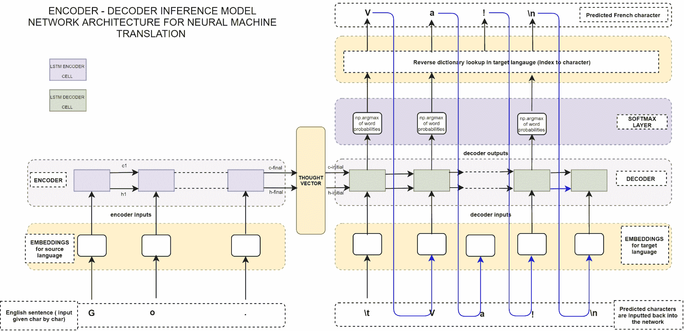
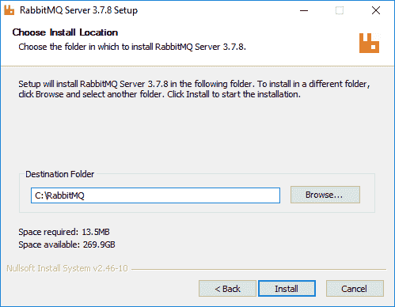
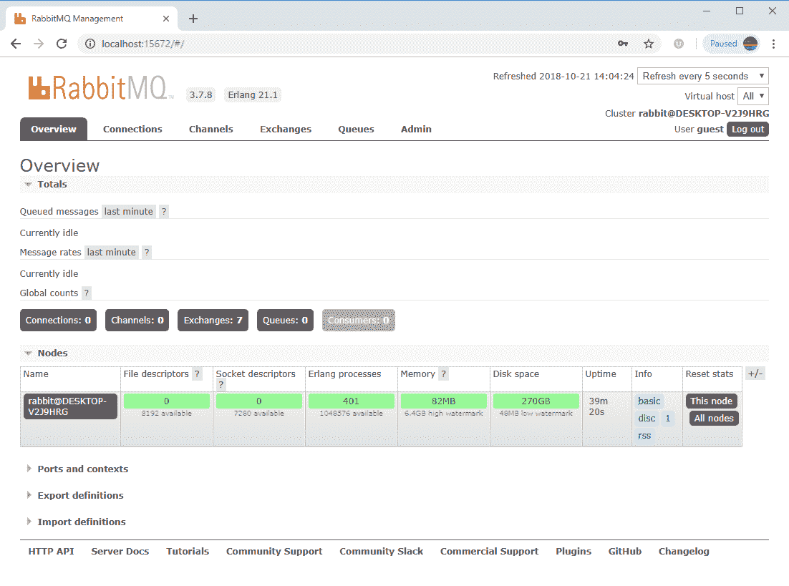
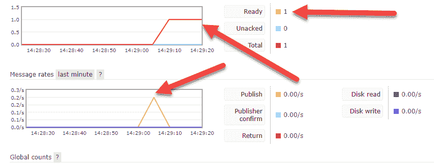
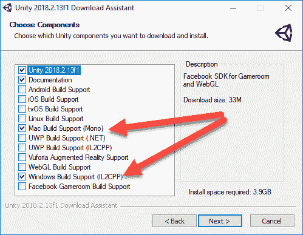
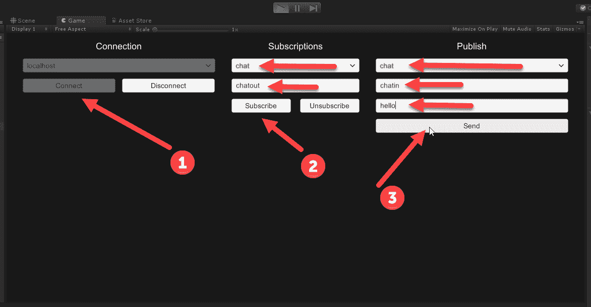

# 四、构建深度学习游戏聊天机器人

聊天机器人(或称对话智能体)是人工智能领域的一个爆炸性趋势，被视为下一代人与计算机的界面。从 Siri、Alexa 和 Google Home，这一领域的商业增长出现了爆炸式增长，你很可能已经以这种方式与计算机进行了交互。因此，我们讨论如何为游戏构建对话智能体似乎是很自然的事情。然而，出于我们的目的，我们将研究一类叫做**神经对话智能体**的机器人。它们的名字来源于它们是由神经网络发展而来的事实。现在，聊天机器人不必只是聊天；我们还将研究对话机器人在游戏中的其他应用方式。

在这一章中，我们将学习如何构建神经对话智能体，以及如何将这些技术应用到游戏中。以下是我们将涉及的主要主题的摘要:

*   神经对话智能体
*   序列到序列学习
*   DeepPavlov
*   构建 bot 服务器
*   在 Unity 中运行机器人
*   练习

我们现在将开始构建更多实际的项目实例。虽然你的训练还没有全部完成，但现在是时候开始制作你可以使用的部件了。这意味着我们将在本章开始与 Unity 一起工作，事情可能会很快变得复杂。记住慢慢来，如果需要的话，把材料看几遍。同样，本章末尾的练习是额外学习的极好资源。

在下一节中，我们将探索神经对话智能体的基础。


# 神经对话智能体

早在《星际迷航》(1966 年至 1969 年)中，通过自然语言与计算机交流的概念就开始流行。在系列中，我们经常可以看到 Kirk、Scotty 和那帮人对着电脑发出指令。从那以后，人们已经做了很多尝试来制造能够与人自然对话的聊天机器人。在这些年经常不成功的旅程中，一些语言学方法被发展出来。这些方法通常被组合在一起，称为**自然语言处理**，或 **NLP** 。现在，NLP 仍然是大多数聊天机器人的基础，包括我们很快会谈到的深度学习。

我们通常根据目的或任务对对话智能体进行分组。目前，我们将聊天机器人分为两种主要类型:

*   **目标导向** : 这些机器人是 Kirk 会使用的那种，或者是你可能每天都会与之交流的那种，Siri 或 Alexa 就是一个很好的例子。
*   **一般健谈者**:这些聊天机器人旨在与人们就广泛的话题进行交谈，一个很好的例子就是**微软 Tay** 。不幸的是，Tay 机器人可能有点太容易受影响，学会了脏话，就像一个两岁的孩子一样。

游戏对聊天机器人来说并不陌生，人们已经尝试使用这两种形式，并取得了不同程度的成功。虽然你可能认为面向目标的机器人非常有意义，但实际上声音/文本对于大多数重复的游戏任务来说太慢太乏味了。即使是简单的声音命令(咕哝或呻吟)也太慢了，至少目前是这样。因此，我们将看看经常未被充分利用的对话聊天机器人，以及它们如何在游戏中使用。

以下是这些机器人可以承担的游戏任务的总结:

*   非玩家角色(**NPC**):这是显而易见的首选。NPC 往往是照本宣科，变得重复。如果 NPC 可以自然地谈论某个话题，或者在使用正确的单词或短语组合时透露信息，那会怎么样？这里的可能性是无限的，一些 NLP 已经在游戏中使用了。
*   **玩家角色**:一个你可以和自己对话的游戏怎么样？也许这个角色有健忘症，正试图记住信息或学习背景故事。
*   推广 / **提示**:也许作为推广你游戏的一种方式，你建造了一个可以提示如何完成一些困难任务的机器人，或者只是作为谈论你游戏的一种方式。
*   **MMO 虚拟角色**:如果当你离开你最喜欢的 MMO 游戏时，你的角色留在游戏中，不能做动作，但仍能像你一样交谈，那会怎样？这是我们将在本章中看到的例子，我们将在稍后探讨**强化学习**时讨论行动部分。

随着时间的推移，很可能会有更多的用途，但现在前面的列表应该会给你一些关于如何在游戏中使用聊天机器人的好主意。在下一节中，我们将了解是什么造就了一个健谈的机器人。


# 通用会话模型

对话聊天机器人可以进一步细分为两种主要形式:**生成型**和**选择性**。我们要看的方法叫做生成式。生成模型通过在上下文/回复对中输入一系列单词和对话来学习。在内部，这些模型使用 RNN (LSTM)层来学习和预测这些序列返回给熟悉的人。该系统如何工作的示例如下:


Example of the generative conversational model

注意，图中的每个块代表一个 LSTM 单元。然后，每个单元格都会记住文本所在的序列。从上图中可能看不清楚的是，对话文本的双方在训练之前都被输入到模型中。因此，这个模型与我们在第三章*【游戏的 GAN】*中讨论的 GAN 没有什么不同。在下一节中，我们将进入设置这种类型的模型的细节。


# 序列到序列学习

在上一节中，我们看到了网络模型的高级概述。在这一节中，我们想看看使用序列到序列学习的生成式对话模型的 Keras 实现。在我们进入这种形式的生成模型的理论之前，让我们运行一下示例，因为这可能需要一段时间。我们将探索的样本是用于序列到序列机器翻译的 Keras 参考样本。它目前被配置为进行英语到法语的翻译。

使用以下步骤打开`Chapter_4_1.py`示例代码清单并让它运行:

1.  打开一个 shell 或 Anaconda 窗口。然后运行以下命令:

```
python3 Chapter_4_1.py
```

2.  这将运行示例，可能需要几个小时。该示例还会消耗大量内存，这可能会在内存较低的系统上强制进行内存分页。将内存分页到磁盘将需要额外的时间来训练，尤其是如果您没有运行 SSD。如果您发现您无法完成该样本的训练，请按如下方式减少`epochs`和/或`num_samples`参数的数量:

```
batch_size = 64 # Batch size for training.
epochs = 100 # Number of epochs to train for.
latent_dim = 256 # Latent dimensionality of the encoding space.
num_samples = 10000 # Number of samples to train on.
```

3.  如果您无法在原始值上训练，请减小`epochs`或`num_samples`参数。

4.  样本完成训练后，它将运行一组测试数据。当它这样做时，它将输出结果，你可以看到它从英语翻译成法语的效果如何。
5.  打开章节源代码中的`fra-eng`文件夹。

6.  打开`fra.txt`文件，最上面几行如下:

```
Go. Va !
Hi. Salut !
Run! Cours !
Run! Courez !
Wow! Ça alors !
Fire! Au feu !
Help! À l'aide !
Jump. Saute.
Stop! Ça suffit !
Stop! Stop !
Stop! Arrête-toi !
Wait! Attends !
Wait! Attendez !
Go on. Poursuis.
Go on. Continuez.
Go on. Poursuivez.
Hello! Bonjour !
Hello! Salut !
```

7.  请注意训练文本(英语/法语)是如何在标点符号和空格上拆分的。此外，请注意序列的长度是如何变化的。我们输入的序列不必匹配输出的长度，反之亦然。

我们刚刚看到的示例使用序列到序列字符编码将文本从英语翻译成法语。通常，聊天生成是通过单词到单词的编码完成的，但是这个示例使用了更细粒度的字符到字符模型。这在游戏中有优势，因为我们试图生成的语言可能不总是人类的。请记住，虽然我们在这个示例中只生成翻译文本，但是与输入配对的文本可以是您认为合适的任何响应。在下一节中，我们将分解代码，并详细了解这个示例是如何工作的。


# 破解密码

随着我们阅读本书的进展，我们将开始只关注代码的重要部分，这些部分有助于我们理解一个概念或者一个方法是如何实现的。这将使你更有必要开放代码，至少自己去追求它。在下一个练习中，我们来看看示例代码的重要部分:

1.  打开`Chapter_4_1.py`并向下滚动到注释`Vectorize the data`，如下所示:

```
# Vectorize the data.
input_texts = []
target_texts = []
input_characters = set()
target_characters = set()
with open(data_path, 'r', encoding='utf-8') as f:
    lines = f.read().split('\n')
for line in lines[: min(num_samples, len(lines) - 1)]:
    input_text, target_text = line.split('\t')
    # We use "tab" as the "start sequence" character
    # for the targets, and "\n" as "end sequence" character.
    target_text = '\t' + target_text + '\n'
    input_texts.append(input_text)
    target_texts.append(target_text)
    for char in input_text:
        if char not in input_characters:
            input_characters.add(char)
    for char in target_text:
        if char not in target_characters:
            target_characters.add(char)

input_characters = sorted(list(input_characters))
target_characters = sorted(list(target_characters))
num_encoder_tokens = len(input_characters)
num_decoder_tokens = len(target_characters)
max_encoder_seq_length = max([len(txt) for txt in input_texts])
max_decoder_seq_length = max([len(txt) for txt in target_texts])

print('Number of samples:', len(input_texts))
print('Number of unique input tokens:', num_encoder_tokens)
print('Number of unique output tokens:', num_decoder_tokens)
print('Max sequence length for inputs:', max_encoder_seq_length)
print('Max sequence length for outputs:', max_decoder_seq_length)
```

这部分代码输入训练数据，并将其编码成用于矢量化的字符序列。注意这里设置的`num_encoder_tokens`和`num_decoder_tokens`参数是如何依赖于每组中的字符数而不是样本数的。最后，编码和解码序列的最大长度被设置为两者中编码字符的最大长度。

接下来，我们想看看输入数据的矢量化。数据的矢量化减少了每个响应匹配的字符数，也是内存密集型部分，除了当我们对齐该数据时，我们希望保持响应或目标比原始输入领先一步。这种微妙的差异使我们的序列学习 LSTM 层能够预测序列中的下一个模式。下面是其工作原理的示意图:

序列到序列模型

在图中，我们可以看到文本 **HELLO** 的开头是如何被翻译的，比响应短语 **SALUT** (法语为 *hello* )落后一步。请注意这在前面的代码中是如何工作的。

然后，我们使用如下代码构建将映射到我们的网络模型的层:

请注意我们是如何创建编码器和解码器输入以及解码器输出的。这段代码构建并训练了`model`,然后保存它以供以后在推理中使用。我们使用术语*推理*来表示一个模型正在对一些输入进行推理或生成一个答案或响应。层架构中的序列到序列模型如下图所示:

2.  编码器/解码器推理模型
3.  这个模型非常复杂，这里有很多东西。我们刚刚讨论了模型的第一部分。接下来，我们需要涵盖思维向量的构建和样本模型的生成。完成此操作的最终代码如下:


Sequence-to-sequence model

4.  仔细阅读这段代码，看看你是否能理解它的结构。我们仍然缺少这个难题的一个关键部分，我们将在下一节中讨论这个问题。

5.  思维载体

```
# Define an input sequence and process it.
encoder_inputs = Input(shape=(None, num_encoder_tokens))
encoder = LSTM(latent_dim, return_state=True)
encoder_outputs, state_h, state_c = encoder(encoder_inputs)
# We discard `encoder_outputs` and only keep the states.
encoder_states = [state_h, state_c]

# Set up the decoder, using `encoder_states` as initial state.
decoder_inputs = Input(shape=(None, num_decoder_tokens))
# We set up our decoder to return full output sequences,
# and to return internal states as well. We don't use the
# return states in the training model, but we will use them in inference.
decoder_lstm = LSTM(latent_dim, return_sequences=True, return_state=True)
decoder_outputs, _, _ = decoder_lstm(decoder_inputs,
                                     initial_state=encoder_states)
decoder_dense = Dense(num_decoder_tokens, activation='softmax')
decoder_outputs = decoder_dense(decoder_outputs)

# Define the model that will turn
# `encoder_input_data` & `decoder_input_data` into `decoder_target_data`
model = Model([encoder_inputs, decoder_inputs], decoder_outputs)

# Run training
model.compile(optimizer='rmsprop', loss='categorical_crossentropy')
model.fit([encoder_input_data, decoder_input_data], decoder_target_data,
          batch_size=batch_size,
          epochs=epochs,
          validation_split=0.2)
# Save model
model.save('s2s.h5')
```

6.  在编码和解码文本过程的中间是思想向量的生成。教父 Geoffrey Hinton 博士亲自推广的**思维向量**，代表了一个向量，它显示了一个元素与许多其他元素之间的上下文关系。



例如，单词 *hello* 可能与许多单词或短语具有高度相关的上下文，例如 *hi* 、 *how are you？*、*嘿*、*再见*等等。同样，像*红、蓝、火、*和*老*这样的词，在日常会话中与*你好*、*最少*这样的词联系在一起时，语境就低了。单词或字符上下文基于我们在机器翻译文件中的配对。在这个例子中，我们使用法语翻译配对，但是配对可以是任何东西。

7.  这个过程作为第一个编码模型的一部分进入思维向量，或者，在这个例子中，是一个概率向量。LSTM 层计算单词/字符如何相关的概率或上下文。您经常会遇到下面的等式，它描述了这种转换:

```
encoder_model = Model(encoder_inputs, encoder_states)

decoder_state_input_h = Input(shape=(latent_dim,))
decoder_state_input_c = Input(shape=(latent_dim,))
decoder_states_inputs = [decoder_state_input_h, decoder_state_input_c]
decoder_outputs, state_h, state_c = decoder_lstm(
    decoder_inputs, initial_state=decoder_states_inputs)
decoder_states = [state_h, state_c]
decoder_outputs = decoder_dense(decoder_outputs)
decoder_model = Model(
    [decoder_inputs] + decoder_states_inputs,
    [decoder_outputs] + decoder_states)

# Reverse-lookup token index to decode sequences back to
# something readable.
reverse_input_char_index = dict(
    (i, char) for char, i in input_token_index.items())
reverse_target_char_index = dict(
    (i, char) for char, i in target_token_index.items())
```


请考虑以下情况:


#  =输出序列

 =输入序列

 =矢量表示

代表 sigma ( )的乘法形式，用于将概率汇集到思维向量中。这是对整个过程的一个很大的简化，鼓励感兴趣的读者自己去 Google 更多关于序列间学习的内容。出于我们的目的，要记住的关键事情是每个单词/字符都有一个与另一个单词/字符相关的概率或上下文。正如你可能已经注意到的那样，生成这个思想向量可能会耗费时间和内存。因此，出于我们的目的，我们将在下一节中查看一组更全面的自然语言工具，以便创建一个神经对话机器人。


DeepPavlov

*   DeepPavlov 是一个全面的开源框架，用于为各种目的和任务构建聊天机器人和其他对话智能体。虽然这个机器人是为更面向目标的机器人设计的，但它很适合我们，因为它功能齐全，包括几个序列到序列的模型变体。让我们看看如何在以下步骤中构建一个简单的模式(序列到序列)识别模型:
*   到目前为止，我们一直保持我们的 Python 环境宽松，但是这必须改变。我们现在想要隔离我们的开发环境，以便以后可以很容易地将其复制到其他系统。最好的方法是使用 Python 虚拟环境。创建一个新环境，然后在 Anaconda 窗口中使用以下命令激活它:
*   如果不使用 Anaconda，这个过程会稍微复杂一些，如下所示:

然后，我们需要在 shell 或 Anaconda 窗口中使用以下命令安装 DeepPavlov:

该框架将尝试安装几个库，可能会破坏任何现有的 Python 环境。这是我们现在使用虚拟环境的另一个原因。


# 出于我们的目的，我们将只看基本的`Hello World`示例，它非常简单，因为我们已经介绍了背景。我们首先按照以下标准进行进口:

现在，DeepPavlov 是基于 Keras 的，但是正如你所看到的，我们在这里使用的类型包装了序列到序列模式匹配模型的功能。`PatternMatchingSkill`表示我们想要给我们的聊天机器人智能体的序列到序列模型。接下来，我们导入`DefaultAgent`类型，这只是基本智能体。之后，我们引入一个叫做`HighestConfidenceSelector`的置信度选择器。请记住，我们生成的思维向量是一个概率向量。`HighestConfidenceSelector`选择器总是选择匹配相应单词的最高值关系或上下文。

1.  接下来，我们生成三组具有相应响应的模式，如以下代码所示:

```
#Anaconda virtual environment
conda create --name dlgames
#when prompted choose yes
activate dlgames
```

2.  每个`PatternMatchingSkill`代表一组模式/响应上下文对。请注意，每个问题可能会有多种回答和模式。这个框架的另一个伟大之处是交换和添加技能的能力。在这种情况下，我们只使用模式匹配，但是鼓励读者探索许多其他的技巧。

```
#Python virtual environment
pip install virtualenv
virutalenv dlgames

#on Mac
source dlgames/bin/activate

#on Windows
dlgames\Scripts\activate
```

3.  最后，我们构建智能体并运行它，只需用最后一点代码打印结果:

```
pip install deeppavlov
```

4.  This framework will attempt to install several libraries and may disrupt any existing Python environments. This is the other reason we are now using virtual environments.

5.  For our purposes, we are just going to look at the basic `Hello World` sample that is very simple to follow now that we have covered the background. We first do our imports as per standard as follows:

```
from deeppavlov.skills.pattern_matching_skill import PatternMatchingSkill
from deeppavlov.agents.default_agent.default_agent import DefaultAgent 
from deeppavlov.agents.processors.highest_confidence_selector import HighestConfidenceSelector
```

6.  这最后一段代码使用`HighestConfidenceSelector`创建了一个具有三种技能(`hello`、`bye`和`fallback`)的`DefaultAgent`。然后，它通过提供嵌套在`print`语句中的一组三个输入来运行智能体。
7.  像平常一样运行代码，并查看输出。这是你所期望的吗？

```
hello = PatternMatchingSkill(responses=['Hello world!'], patterns=["hi", "hello", "good day"])
bye = PatternMatchingSkill(['Goodbye world!', 'See you around'], patterns=["bye", "ciao", "see you"])
fallback = PatternMatchingSkill(["I don't understand, sorry", 'I can say "Hello world!"'])
```

8.  DeepPavlov 的简单性使它成为为你的游戏或其他目的建立各种对话聊天机器人的优秀工具。该框架本身功能非常广泛，为各种任务提供了多种自然语言处理工具，包括面向目标的聊天机器人。整本书可以而且可能应该写巴甫洛夫；如果对这个有兴趣，多找找 NLP 和 DeepPavlov。
9.  有了新工具在手，我们现在需要一个平台来为我们的机器人提供强大的对话能力。在下一节中，我们将探索如何为我们的机器人构建一个服务器。

```
HelloBot = DefaultAgent([hello, bye, fallback], skills_selector=HighestConfidenceSelector())

print(HelloBot(['Hello!', 'Boo...', 'Bye.']))
```

构建聊天机器人服务器

Python 是一个很好的框架，它为游戏开发提供了很多很好的工具。然而，我们将集中使用 Unity 来达到我们的目的。Unity 是一个优秀且非常用户友好的游戏引擎，它将使在后面章节中设置复杂的例子变得轻而易举。如果你不知道 C#，Unity 的语言，不要担心，因为在很多情况下我们将通过 Python 操作引擎。这意味着我们希望能够在 Unity 之外运行我们的 Python 代码，并且我们希望在服务器上这样做。

10.  如果你正在用 Python 开发你的游戏，那么使用服务器就变得可选，除非有非常令人信服的理由将你的 AI 机器人设置为服务或微服务。微服务是自包含的简洁应用或服务，仅通过某种形式的众所周知的通信协议进行交互。人工智能微服务或**人工智能即服务** ( **AIaaS** )正在迅速超越其他形式的 SaaS，这种商业模式转变为游戏也只是时间问题。无论如何，就目前而言，我们将聊天机器人创建为微服务的好处是**解耦**。解耦将允许您在将来轻松地将这个 bot 转换到其他平台。
11.  Run the code as you normally would and look at the output. Is it what you expected?

The simplicity of DeepPavlov makes it an excellent tool to build up various conversational chatbots for your games or other purposes if you so choose. The framework itself is very broad-featured and provides multiple natural language processing tools for a variety of tasks, including goal-oriented chatbots. Whole books could and probably should be written about Pavlov; if you have an interest in this, look more for NLP and DeepPavlov.

微服务还引入了一种新的通信模式。通常，当客户端应用程序连接到服务器时，通信是直接和即时的。但是，如果您的连接中断了，或者通信需要过滤、复制或存储以供以后分析或重用，该怎么办呢？那么使用直接通信协议由于增加了这些不必要的额外功能而变得负担沉重。相反，微服务引入了**消息中心**的概念。这实质上是一个容器或邮局，所有的消息流量都通过它。这提供了难以置信的灵活性，并消除了我们管理额外任务的通信协议的需求。在下一节中，我们将看看如何安装一个非常易于使用的消息中心。


# 消息中心(RabbitMQ)

如果你以前从未接触过微服务或消息中心的概念，你可能会对接下来将要发生的事情感到有些气馁。不要这样。消息中心和微服务旨在使需要相互通信的多个服务之间的连接、路由和故障排除变得更加容易。因此，这些系统被设计成易于安装和使用。在下一个练习中，让我们看看建立一个名为 RabbitMQ 的优秀消息队列平台是多么容易:

浏览你的浏览器到 https://www.rabbitmq.com/#getstarted。

为您的平台下载并安装 RabbitMQ。通常在页面顶部附近有一个下载按钮。可能会提示您安装 Erlang，如下所示:

Erlang 警告对话框

Erlang 是一种并发函数式编程语言，非常适合编写消息传递中心。如果您的系统上没有它，只需下载并安装它，同样适用于您的平台；接下来，重新启动 RabbitMQ 安装。


# 在大多数情况下，除了安装路径之外，按照安装选择默认值。确保安装路径简短且容易记忆，因为我们以后会想要找到它。在 Windows 安装程序中设置路径的示例如下:

If you have never come across the concept of microservices or message hubs before, you may be somewhat daunted by what is coming next. Don't be. Message hubs and microservices are designed to make it easier to connect, route, and troubleshoot issues with multiple services that need to talk to one another. As such, these systems are designed to be easy to set up, and easier to use. Let's see how easy it is to set up an excellent message queue platform called RabbitMQ in the next exercise:

1.  RabbitMQ 将作为一项服务安装在您的平台上。根据您的系统，您可能会收到一些请求防火墙或管理员访问的安全提示。只允许所有这些例外，因为集线器需要完全访问。当安装完成时，RabbitMQ 应该正在您的系统上运行。如果您对配置或设置有任何疑问，请务必查看您平台的文档。RabbitMQ 被设计成使用安全的通信，但保持自己相当开放的开发。请避免在生产系统中安装集线器，并期望做一些安全配置。
2.  接下来，我们想要激活 RabbitMQ 管理工具，这样我们就可以很好地了解 hub 是如何工作的。打开命令提示符并导航到`RabbitMQ`安装服务器文件夹(标记为服务器的那个)。然后导航到`sbin`文件夹。在那里，运行以下命令安装管理插件(Windows 或 macOS):


下面是 Windows 命令提示符的一个示例:

3.  这样就完成了 hub 在系统上的安装。在下一节中，我们将看到如何使用管理界面检查集线器。

4.  管理兔子 q



Example of setting the installation path on Windows

RabbitMQ 是一个功能齐全的消息中心，功能非常强大，非常灵活。RabbitMQ 有很多内容，对于一些不太熟悉网络的用户来说，可能有些吓人。幸运的是，我们现在只需要使用几个部分，将来我们会探索更多的功能。

5.  RabbitMQ will install itself as a service on your platform. Depending on your system, you may get a number of security prompts requesting firewall or admin access. Just allow all these exceptions, as the hub needs full access. When the installation completes, RabbitMQ should be running on your system. Be sure to check the documentation for your platform if you have any concerns on the configuration or setup. RabbitMQ is designed to use secure communication but keeps itself fairly open for development. Please avoid installing the hub in a production system, and expect to do some security configuration.

6.  Next, we want to activate the RabbitMQ management tool so that we can get a good overview of how the hub works. Open up a Command Prompt and navigate to the `RabbitMQ` installation server folder (the one marked server). Then navigate to the `sbin` folder. When you are there, run the following command to install the management plugin (Windows or macOS):

```
rabbitmq-plugins enable rabbitmq_management
```

7.  不过，现在打开浏览器，按照以下步骤探索 hub 的管理界面:


Installing the RabbitMQ management plugin

浏览你的浏览器到`http://localhost:15672/`，你应该会看到一个登录对话框。


# 输入用户名`guest`和密码`guest`。这些是默认凭证，除非您进行了其他配置，否则应该可以使用。

登录后，您将看到 RabbitMQ 界面:

RabbitMQ 管理界面

这里发生了很多事情，所以现在只需点击周围，探索各种选项。避免更改任何设置，至少现在是这样，直到被要求这样做。RabbitMQ 非常强大，但我们都知道，强大的能力意味着巨大的责任。

目前，您的消息队列是空的，所以您不会看到太多的活动，但是我们将在下一节中解决这个问题，我们将学习如何向队列发送消息和从队列接收消息。

1.  向/从 MQ 发送和接收
2.  RabbitMQ 使用名为**高级消息队列协议** ( **AMQP** ) 的协议进行通信，这是所有消息中间件的标准。这意味着我们可以在未来有效地将 RabbitMQ 替换为更健壮的系统，比如 Kafka。这也意味着，在很大程度上，我们在这里讨论的所有概念都可能适用于类似的消息传递系统。
3.  我们要做的第一件事是从一个非常简单的 Python 客户端将一条消息放入队列。打开源文件`Chapter_4_3.py`并遵循以下步骤:



打开源代码文件，看一看:

4.  代码摘自 RabbitMQ 参考教程，展示了如何连接。它首先连接到集线器并打开一个名为`hello`的`queue`。队列就像一个邮箱或一堆消息。一个集线器可能有几个不同的队列。然后代码用`Hello World!`的正文向`hello`队列发布一条消息。

在运行示例之前，我们首先需要安装`Pika`。Pika 是一个 AMQP 连接库，可以使用以下命令安装:


# Sending and receiving to/from the MQ

RabbitMQ uses a protocol called **Advanced Message Queuing Protocol** (**AMQP**)for communication, which is a standard for all messaging middleware. This means that we can effectively swap out RabbitMQ for a more robust system, such as Kafka, in the future. This also means that, for the most part, all of the concepts we cover here will likely apply to similar messaging systems.

然后像平常一样运行代码文件，并观察输出。不是很刺激吧？

1.  在`http://localhost:15672/`再次转到 RabbitMQ 管理界面，看到我们现在在 hub 中有一条消息，如下所示:

```
import pika

connection = pika.BlockingConnection(pika.ConnectionParameters(host='localhost'))

channel = connection.channel()
channel.queue_declare(queue='hello')

channel.basic_publish(exchange='',

                      routing_key='hello',

                      body='Hello World!')

print(" [x] Sent 'Hello World!'")

connection.close()
```

2.  
3.  显示添加消息的 RabbitMQ 界面

```
pip install pika
```

我们刚刚发送的消息将保留在集线器上，直到我们稍后收集它。这个单一的功能将允许我们运行单独的服务，并确保它们正确地通信，而不必担心其他消费者或发布者。

出于 RabbitMQ 的目的，我们只是写了一个 publisher。在某些情况下，你可能希望一个服务或应用程序只是发布消息，而在其他情况下，你可能希望他们消费它们。在下一个练习`Chapter_4_4_py`中，我们将编写一个中枢消费者或客户端:

4.  打开源文件`Chapter_4_4.py`并查看代码:
5.  前面的代码与前面的例子几乎相同，只是这次它只使用一个内部的`callback`函数从队列中获取响应。在本例中，还要注意脚本是如何阻塞自身并等待消息的。在大多数情况下，客户端会向队列注册一个回调，以便注册一个事件。当新消息进入特定队列时，该事件被触发。

像平常一样运行代码，观察第一条`Hello World`消息从队列中取出并输出到客户端窗口。

让客户机保持运行，并运行另一个`Chapter_4_3.py` (publish)脚本实例，注意客户机如何快速使用它并将其输出到窗口。

6.  这就完成了与消息中心的简单发送和接收通信。正如您所看到的，代码相当简单，配置在很大程度上是开箱即用的。如果你在这个设置中遇到任何问题，一定要参考 RabbitMQ 教程，这是额外帮助的一个极好的资源。在下一节中，我们将看看如何构建一个运行中的 chatbot 服务器示例。

编写消息队列聊天机器人

1.  我们想要创建的 chatbot 服务器实际上是前面三个例子的组合。打开`Chapter_4_5.py`，进行下一个练习:

```
import pika

connection = pika.BlockingConnection(pika.ConnectionParameters(host='localhost'))

channel = connection.channel()

channel.queue_declare(queue='hello')

def callback(ch, method, properties, body):

    print(" [x] Received %r" % body)

channel.basic_consume(callback,

                      queue='hello',

                      no_ack=True)

print(' [*] Waiting for messages. To exit press CTRL+C')

channel.start_consuming()
```

2.  完整的服务器代码如下:
3.  Run the code as you normally would and watch the first `Hello World` message get pulled from the queue and output on the client window.
4.  Keep the client running and run another instance of the `Chapter_4_3.py` (publish) script and note how the client quickly consumes it and outputs it to the window.

This completes the simple send and receive communication to/from the message hub. As you can see, the code is fairly straightforward and the configuration works out of the box, for the most part. If you do experience any issues with this setup, be sure to consult the RabbitMQ tutorials, which are an additional excellent resource for extra help. In the next section, we look at how to build the working chatbot server example.


# Writing the message queue chatbot

The chatbot server we want to create is essentially a combination of the three previous examples. Open up `Chapter_4_5.py` and follow the next exercise:

1.  The complete server code as follows:

```
import pika
from deeppavlov.skills.pattern_matching_skill import PatternMatchingSkill
from deeppavlov.agents.default_agent.default_agent import DefaultAgent 
from deeppavlov.agents.processors.highest_confidence_selector import HighestConfidenceSelector

hello = PatternMatchingSkill(responses=['Hello world!'], patterns=["hi", "hello", "good day"])
bye = PatternMatchingSkill(['Goodbye world!', 'See you around'], patterns=["bye", "chao", "see you"])
fallback = PatternMatchingSkill(["I don't understand, sorry", 'I can say "Hello world!"'])

HelloBot = DefaultAgent([hello, bye, fallback], skills_selector=HighestConfidenceSelector())

connection = pika.BlockingConnection(pika.ConnectionParameters(host='localhost'))
channelin = connection.channel()
channelin.exchange_declare(exchange='chat', exchange_type='direct', durable=True)
channelin.queue_bind(exchange='chat', queue='chatin')

channelout = connection.channel()
channelout.exchange_declare(exchange='chat', durable=True)

def callback(ch, method, properties, body):
    global HelloBot, channelout
    response = HelloBot([str(body)])[0].encode()
    print(body,response)
    channelout.basic_publish(exchange='chat',
                      routing_key='chatout',
                      body=response)
    print(" [x] Sent response %r" % response)

channelin.basic_consume(callback, 
                      queue='chatin',
                      no_ack=True)

print(' [*] Waiting for messages. To exit press CTRL+C')
channelin.start_consuming()
```

我们基本上用不到 25 行代码就有了一个完整的工作中的`Hello World`聊天机器人服务器。当然，功能仍然有限，但现在你肯定能理解如何向机器人添加其他模式匹配技能。
这里需要注意的重要一点是，我们从一个名为`chatin`的队列中进行消费，并发布到一个名为`chatout`的队列中。这些队列现在被包装在一个叫做`chat`的交易所里。您可以将交换视为路由服务。交换为队列提供了额外的功能，最棒的是它们是可选的。不过，就使用而言，我们希望使用交换，因为它们为我们提供了对服务的更好的全球控制。RabbitMQ 中使用了四种类型的交换，这里对它们进行了总结:

**Direct** :消息直接发送到消息传输中标记的队列。

**扇出**:将消息复制到交换机包装的所有队列中。当您想要添加日志记录或历史归档时，这非常有用。

**主题**:这允许您将消息发送到通过匹配消息队列识别的队列。例如，您可以向队列`chat`发送一条消息，包含单词 *chat* 的同一个交换中的任何队列都会收到这条消息。主题交换允许您对相似的消息进行分组。

**Headers** :这类似于主题交换，但是基于消息本身的标题进行过滤。这是一个很好的交换，可以用来动态路由带有适当头的消息。

运行`Chapter_4_5.py`服务器示例并保持其运行。

2.  接下来，打开`Chapter_4_6.py`文件，查看所示代码:
    *   前面的代码只是一个示例客户端，我们可以用它来测试 chatbot 服务器。注意消息变量`chat`是如何设置为`'boo'`的。运行代码时，检查 chatbot 服务器的输出窗口；这是我们之前运行的`Chapter_4_5.py`文件。您应该会在窗口中看到一条与我们刚刚发送的聊天消息相对应的响应消息。
    *   此时，您可以用 Python 编写一个完整的聊天客户端，它可以与我们的聊天机器人进行通信。然而，我们希望将我们的机器人连接到 Unity，并在下一节中看看如何将我们的机器人用作微服务。
    *   在 Unity 中运行聊天机器人
    *   **Unity** 正在迅速成为学习开发游戏、虚拟现实和增强现实应用的标准游戏引擎。现在，它正迅速成为开发人工智能和人工智能应用的标准平台，部分原因是 Unity 团队建立了优秀的强化学习平台。这个 Unity ML 平台是我们渴望使用这个工具的一个关键组件，因为它目前处于游戏高级人工智能的前沿。
3.  由 Danny Lange 博士和他们的高级开发人员 Arthur Juliani 博士领导的 Unity 人工智能团队已经直接或间接地为这本书的内容提出了许多建议和贡献。这当然对本书的大部分使用 Unity 产生了巨大的影响。
4.  安装 Unity 非常简单，但是我们希望确保第一次就安装正确。因此，请按照以下步骤在您的系统上安装 Unity 版本:

```
import pika

connection = pika.BlockingConnection(pika.ConnectionParameters(host='localhost'))
channelin = connection.channel()

channelin.exchange_declare(exchange='chat')

chat = 'boo'

channelin.basic_publish(exchange='chat',
                      routing_key='chatin',
                      body=chat)
print(" [x] Sent '{0}'".format(chat))
connection.close()
```

5.  将您的浏览器导航到[https://store.unity.com/download](https://store.unity.com/download)并接受条款，然后下载 Unity 下载助手。这是下载和安装我们需要的部分的工具。

运行下载助手，并选择要安装的以下最低组件，如下所示的对话框:


# 

为 Unity 选择安装组件

请务必安装最新版本的 Unity，并选择与您的首选操作系统相匹配的组件，如前面的屏幕截图所示。当然，你可以根据自己的判断选择其他组件，但这些是本书所需的最低要求。

接下来，将安装 Unity 的路径设置为一个众所周知的文件夹。一个好的选择是将文件夹名称设置为与版本相同。这允许你在同一个系统上有多个版本的 Unity，你可以很容易地找到。下面的屏幕截图显示了如何在 Windows 上执行此操作:

1.  将安装路径设置为 Unity

2.  这些是安装的唯一关键部分，您可以使用默认设置继续安装软件。

安装后启动 Unity 编辑器，系统会提示您登录。Unity 要求您拥有一个帐户，无论您是否使用免费版本。回到[unity.com](http://unity.com)，创建一个账户。完成帐户设置后，返回并登录编辑器。

登录后，创建一个名为`Chatbot`的空项目，让编辑器打开一个空白场景。

3.  Unity 是一个全功能的游戏引擎，如果你是第一次访问，可能会有点吓人。有大量的在线教程和视频可以让你快速掌握界面。我们将尽最大努力简单地演示概念，但是如果您迷路了，请慢慢来，做几次练习。
4.  安装 Unity 后，我们现在必须安装组件或资产，以便轻松连接到我们刚刚创建的 chatbot 服务器。在下一部分，我们将为 Unity 安装 AMQP 资产。


为 Unity 安装 AMQP

5.  RabbitMQ 拥有大量跨平台库的优秀资源，允许您轻松连接到 hub。C#的库在 Unity 之外工作得很好，但是设置起来有问题。幸运的是，Cymantic 实验室的好人们已经在 GitHub 上为 Unity 构建并开源了一个版本。让我们在下一个练习中看看如何安装这段代码:
6.  使用`git`或作为 ZIP 文件从 https://github.com/CymaticLabs/Unity3D.Amqp[下载并解包代码](https://github.com/CymaticLabs/Unity3D.Amqp.git):
7.  从菜单切换到 Unity，选择 File | Open Project 并导航到安装代码的`Unity3D.Amqp\unity\CymaticLabs.UnityAmqp`文件夹。这将在其自己的项目中打开资产。等待项目加载。

在项目窗口中打开`Assets/CymanticLabs/Amqp/Scenes`文件夹(通常在底部)。

双击 **AmqpDemo** 场景，在编辑器中打开它。

按下编辑器顶部的播放按钮来运行场景。运行场景后，您应该会看到以下内容:


# 设置 Amqp 连接并发送消息

按 Connect 按钮连接到本地 RabbitMQ。

1.  接下来，在 Subscriptions 下，将 exchange 设置为 chat，将队列设置为 chatout，然后单击 Subscribe。这将订阅队列，以便我们可以在 Unity 控制台窗口中看到任何返回消息。

```
git clone https://github.com/CymaticLabs/Unity3D.Amqp.git
```

2.  最后，在 Publish 下，将 exchange 设置为 chat，将队列设置为 chatin，并键入一条消息，如`hello`。单击 Send 按钮，您应该会在控制台窗口中看到机器人的响应。
3.  这就建立了我们的工作聊天机器人。当然，这仅仅是可能性的开始，当然鼓励读者进一步探索，但是请记住，我们将在稍后重新访问这段代码，并在本书的后面部分使用它。
4.  本章到此结束，现在您可以利用它在下一节进行进一步的学习。
5.  练习



使用以下练习来扩展您的学习范围，并对本章中的材料更有信心:

6.  回到第一个练习，加载另一组翻译。用这些来训练机器人，看看训练后会产生什么样的反应。有大量其他语言文件可供培训使用。
7.  以英语/法语翻译文件为例，建立自己的会话培训文件。请记住，匹配的响应可以是任何内容，而不仅仅是翻译文本。
8.  向 DeepPavlov 机器人添加额外的模式匹配技能。简单测试和/或聊天机器人服务器。

DeepPavlov 聊天机器人使用最高值选择标准来选择响应。DeepPavlov 也有一个随机选择器。将聊天机器人上的响应选择器更改为使用随机。

将示例中的交换类型更改为使用 Fanout，并创建一个日志队列来记录消息。


# 将交换类型更改为主题，并查看如何对消息进行分组。警告:这可能会破坏示例；看看你是否能修理它。

用 Python 编写一个 RabbitMQ 发布器，发布到一个或多个不同类型的队列。

1.  使用模式匹配技巧创造一整套谈话技巧。然后，看看你的机器人和你的对话有多好。
2.  向聊天机器人服务器添加其他类型的附加技能。这可能需要你做一些额外的功课。
3.  在 RabbitMQ 上编写或运行两个聊天机器人，观察它们相互交谈。
4.  至少完成两到三个这样的练习。
5.  Change the exchange type in the example to use Fanout and create a log queue to log messages.
6.  Change the exchange type to Topic and see how you can group messages. Warning: this will likely break the example; see whether you can fix it.
7.  摘要
8.  在这一章中，我们研究了使用神经网络和深度学习来构建聊天机器人或神经对话智能体。我们首先看到了聊天机器人的构成以及目前使用的主要形式:面向目标的聊天机器人和对话机器人。然后，我们看了如何建立一个基本的机器翻译对话聊天机器人，使用序列到序列的学习。
9.  有了序列学习的背景之后，我们看了开源工具 DeepPavlov。DeepPavlov 是一个强大的聊天平台，建立在 Keras 之上，设计用于多种形式的神经智能体对话和任务。这使得我们非常适合使用聊天机器人服务器作为基础。然后，我们安装了 RabbitMQ，这是一个微服务消息中心平台，它将允许我们的机器人和所有其他形式的服务稍后一起进行对话。
10.  最后，我们安装了 Unity，然后迅速安装了 AMQP 插件资产，并连接到我们的聊天机器人服务器。

这就完成了我们对深度学习的介绍部分，在下一部分，我们开始通过潜入**深度强化学习**来更多地了解游戏 AI。


# Summary

In this chapter, we looked at building chatbots or neural conversational agents using neural networks and deep learning. We first saw what makes a chatbot and the main forms in use today: goal-oriented and conversational bots. Then we looked at how to build a basic machine translation conversational chatbot that used sequence-to-sequence learning. 

After getting a background in sequence learning, we looked at the open source tool DeepPavlov. DeepPavlov is a powerful chat platform built on top of Keras and designed for many forms of neural agent conversation and tasks. This made it ideal for us to use the chatbot server as a base. Then we installed RabbitMQ, a microservices message hub platform that will allow our bot and all manner of other services to talk together later on.

Finally, we installed Unity and then quickly installed the AMQP plugin asset and connected to our chatbot server.

This completes our introductory section to deep learning, and, in the next section, we begin to get more into game AI by diving into **deep reinforcement learning**.