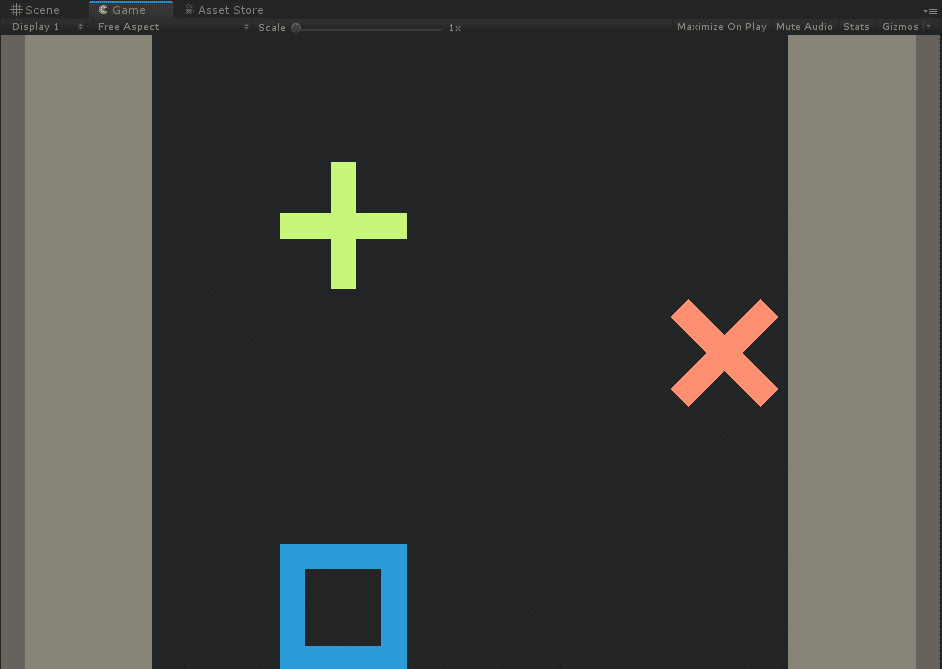
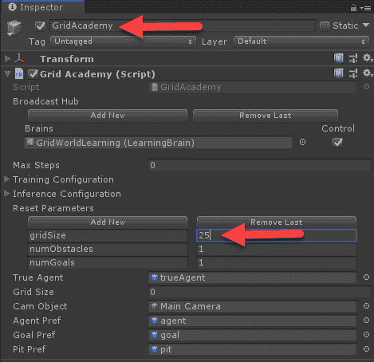
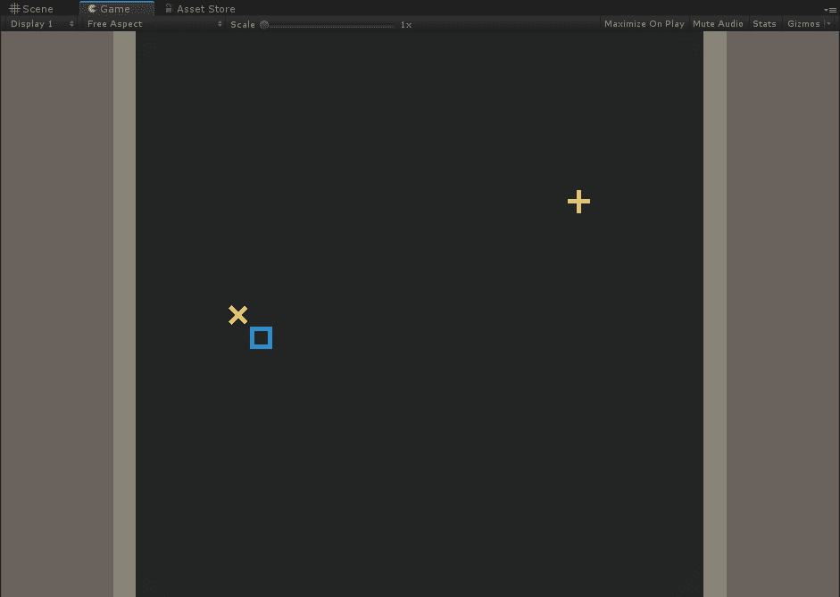
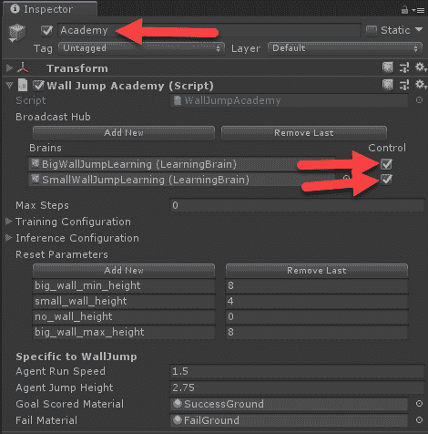
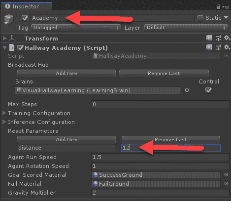
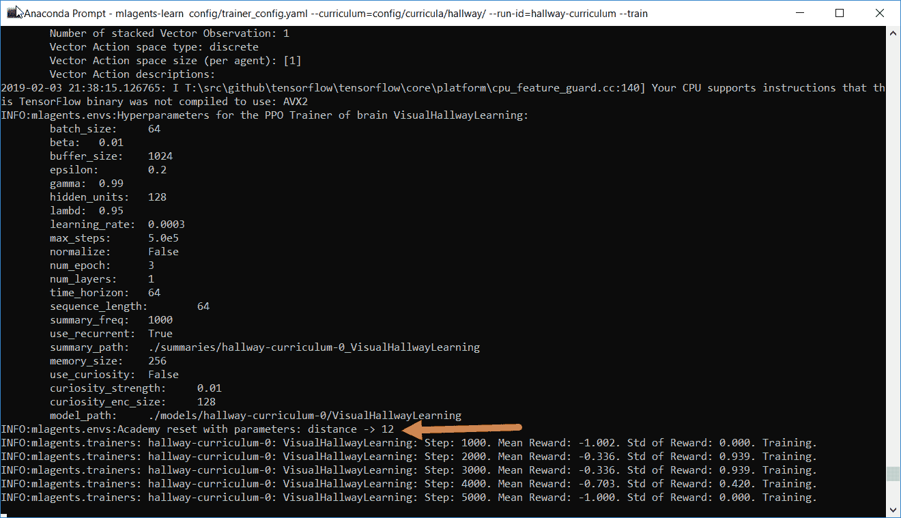
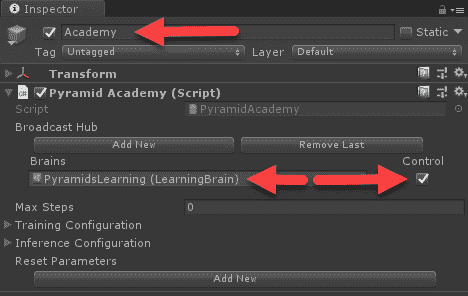

# 奖励和强化学习

奖励是强化学习的一个基本方面，概念很容易掌握。毕竟，我们在一定程度上通过奖励强化来教育和训练他人——比如狗和孩子。在模拟中实现奖励或`reward`功能的概念可能有些困难，并且容易出现大量的反复试验。这就是为什么要等到后面更高级的章节再来讲奖励，构建`reward`函数，以及课程学习、回溯、好奇心学习、模仿学习/行为克隆等奖励辅助方法的原因。

以下是我们将在本章中涉及的概念的快速总结:

*   奖励和`reward`功能
*   奖励的稀少
*   课程学习
*   了解回放
*   好奇心学习

虽然这是一个高级章节，但也是必不可少的一章，不是你想跳过的。同样，许多表现出色的 RL 演示，如 DeepMind 的 AlphaStar，使用本章中的高级算法来教代理完成以前认为不可能的任务。


# 奖励和奖励功能

我们经常面对这种基于奖励的学习或培训的先入为主的观念，它包括一个完成的行动，然后是奖励，无论是好是坏。虽然 RL 的概念完全适用于单个基于动作的任务，例如我们前面看到的旧的多臂强盗问题，或者教狗一个技巧，但请记住，强化学习实际上是代理通过一系列动作预测未来的回报来学习动作的价值。在每个行动步骤中，当代理不探索时，代理将根据它认为具有最佳回报的东西来决定它的下一步行动。不太清楚的是这些奖励在数字上应该代表什么，以及这在多大程度上是重要的。因此，设计一组简单的`reward`函数来描述我们希望代理训练的学习行为通常是有帮助的。

让我们打开 GridWorld 示例的 Unity 编辑器，学习如何创建一组描述该训练的`reward`函数和映射，如下所示:

1.  从 Assets | ML-Agents | Examples | grid world | Scenes 文件夹中打开`GridWorld`示例。
2.  在层次中选择 trueAgent 对象，然后在 Grid Agent | brain 中将代理的 Brain 切换到 GridWorldLearning。
3.  选择 GridAcademy 并将 Grid Academy | Brains | Control 选项设置为 enabled。
4.  选择并禁用场景中的主摄像机。这将使代理的摄像机成为主摄像机，也是我们可以用来查看场景的摄像机。
5.  打开并准备一个 Python 或 Anaconda 窗口进行训练。如果您需要记住如何操作，请查阅前面的章节或 Unity 文档。
6.  保存场景和项目。
7.  在 Python/Anaconda 窗口中使用以下命令将示例启动到培训中:

```
mlagents-learn config/trainer_config.yaml --run-id=gridworld --train
```

8.  关于这个示例，您首先会欣赏的一件事是它的训练速度有多快。请记住，代理训练如此快速的主要原因是因为状态空间太小；本例中为 5x5。下面的屏幕截图显示了模拟运行的示例:



在 5x5 网格上运行的 GridWorld 示例

9.  运行示例，直到完成。即使在较旧的系统上，运行时间也不会很长。

请注意，当代理学习将立方体放置在绿色+上时，它是如何快速从负奖励变为正奖励的。然而，你是否注意到代理从负的平均奖励开始训练？代理从零奖励值开始，所以让我们检查负奖励来自哪里。在下一节中，我们将通过查看代码来了解如何构建`reward`函数。


# 构建奖励函数

构建`reward`函数可以非常简单，就像这个函数一样，也可以非常复杂，就像你可以想象的那样。虽然这一步对于训练这些示例来说是可选的，但是当您构建自己的环境时，它几乎是强制性的。它还可以识别你训练中的问题，以及加强或放松训练的方法。

打开 Unity 编辑器，按照这个练习来构建这些示例`reward`函数:

1.  在层次窗口中选择 trueAgent 对象，然后单击网格代理组件旁边的目标图标。
2.  从联系人菜单中选择编辑脚本。
3.  在编辑器中打开脚本后，向下滚动到`AgentAction`方法，如下所示:

```
public override void AgentAction(float[] vectorAction, string textAction)
{
  AddReward(-0.01f);
  int action = Mathf.FloorToInt(vectorAction[0]);

  ... // omitted for brevity

  Collider[] blockTest = Physics.OverlapBox(targetPos, new Vector3(0.3f, 0.3f, 0.3f));
  if (blockTest.Where(col => col.gameObject.CompareTag("wall")).ToArray().Length == 0)
  {
    transform.position = targetPos;
    if (blockTest.Where(col => col.gameObject.CompareTag("goal")).ToArray().Length == 1)
    {
      Done();
      SetReward(1f);
    }
    if (blockTest.Where(col => col.gameObject.CompareTag("pit")).ToArray().Length == 1)
    {
      Done();
      SetReward(-1f);
    }
  }
}
```

4.  我们想把重点放在突出显示的线条上，`AddReward`和`SetReward`:
    *   `AddReward(-.1f)`:第一行表示一个阶梯奖励。代理人每走一步都会让代理人付出负回报的代价。这就是为什么我们看到代理人表现出负回报，直到它找到正回报。
    *   `SetReward(1f)`:这是代理人得到的最终正奖励，设置为`1`的最大值。在这些类型的训练场景中，我们更喜欢使用从-1 到+1 的奖励范围。
    *   `SetReward(-1f)`:这是死亡奖励的坑，也是最后一个负面奖励。
5.  使用前面的每个语句，我们可以将它们映射到`reward`函数，如下所示:
    *   `AddReward(-.1f)` = 
    *   `SetReward(1f)` = 
    *   `SetReward(-1f)` = 
6.  这里需要注意的一点是，`AddReward`是一个增量奖励，而`SetReward`设置最终值。所以，代理人只有在达到最终目标时才会看到积极的回报。

通过绘制这些`reward`函数，我们可以看到，一个主体能够获得积极回报的唯一途径就是找到通向目标的路。这就是代理人从负奖励开始的原因，它本质上只是首先学会避免浪费时间或移动，直到它随机遇到目标。从那里，代理可以根据以前收到的积极奖励快速分配状态值。问题是，在我们开始实际培训之前，代理首先需要获得积极的奖励。我们将在下一节讨论这个特殊的问题。


# 奖励的稀少

我们把一个代理人没有得到足够的或任何积极的回报的情况称为回报稀疏。展示奖励稀疏性如何发生的最简单的方法是通过例子，幸运的是，GridWorld 的例子可以很容易地为我们演示这一点。打开 GridWorld 示例的编辑器，并遵循以下练习:

1.  从我们在上一个练习中离开的位置打开 GridWorld 示例场景。就本练习而言，完整地训练原始样本也是有帮助的。GridWorld 是一个可以快速训练的紧凑示例，是测试基本概念甚至超参数的绝佳场所。

2.  选择 GridAcademy，将 Grid Academy | Reset Parameters | gridSize 更改为`25`，如以下屏幕摘录所示:



设置 GridAcademy gridSize 参数

3.  保存场景和项目。
4.  在 Python/Anaconda 窗口中使用以下命令将示例启动到培训中:

```
mlagents-learn config/trainer_config.yaml --run-id=grid25x25 --train
```

5.  这将启动示例，假设您仍然将 agentCam 作为主摄像机，您应该会在游戏窗口中看到以下内容:



网格大小为 25x25 的 GridWorld

6.  我们将游戏空间从 5x5 网格扩展到 25x25 网格，使代理更难随机找到目标(+)符号。
7.  在几次报告迭代之后，你会很快注意到代理人的表现有多差，甚至在某些情况下，报告的平均回报低于-1。更重要的是，代理人可以像这样持续训练很长时间。事实上，在 100 次、200 次、1000 次或更多次的迭代中，代理人可能永远也不会发现奖励。现在，这似乎是一个国家的问题，在某些方面，你可能会这样认为。但是，请记住，我们的代理的输入状态是同一个摄像机视图，一个 84x84 像素的图像状态，我们没有改变这一点。因此，出于本例的目的，将策略 RL 算法中的状态视为保持固定。因此，为了解决这个问题，我们最好的做法是增加奖励。

8.  通过键入 *Ctrl* + *C* ，从 Python/Anaconda 窗口停止训练示例。为了公平起见，我们会平均增加目标和死亡的奖励数量。
9.  回到编辑器中，选择 GridAcademy 并增加 Grid Academy | Reset Parameters 组件属性上的 numObstacles 和 numGoals，如以下摘录所示:


更新障碍和目标的数量

10.  保存场景和项目。
11.  使用以下代码启动培训会话:

```
mlagents-learn config/trainer_config.yaml --run-id=grid25x25x5 --train
```

12.  这表示我们正在用五倍数量的障碍和目标运行样本。
13.  让代理训练 25，000 次迭代，并注意性能的提高。让代理完成培训，并将结果与我们的第一次运行进行比较。

奖励稀疏的问题一般在离散动作任务中遇到的更频繁，比如 grid world/hallow 等等。因为`reward`函数往往是绝对的。在持续学习任务中，`reward`功能通常更为渐进，通常通过目标的一些进展来衡量，而不仅仅是目标本身。

通过增加障碍和目标的数量——消极和积极的奖励——我们能够更快地训练代理人，尽管您可能会看到非常不稳定的训练周期，并且代理人永远不会真正达到原来的水平。事实上，培训实际上可能会在以后的某个时候出现分歧。之所以这样，部分是因为它的视野有限，我们只是部分纠正了稀疏奖励的问题。当然，我们可以通过简单地增加目标和障碍的数量来解决这个例子中奖励稀少的问题。你可以回过头来尝试将障碍和奖励的数量设为 25，这样会看到更稳定、更长期的结果。

当然，在许多 RL 问题中，越来越多的奖励不是一个选项，我们需要寻找更聪明的方法，正如我们将在下一节中看到的。幸运的是，在很短的时间内出现了许多方法，试图解决奖励稀少或困难的问题。Unity 处于领先地位，很快就采用并实施了许多方法，我们将看到的第一种方法叫做课程学习，我们将在下一节讨论。


# 课程学习

课程学习允许代理通过加强`reward`功能来逐步学习困难的任务。当奖励保持绝对时，代理人以一种更简单的方式发现或实现目标，因此知道奖励的目的。然后，随着训练的进行和代理人的学习，获得奖励的难度增加，这反过来又迫使代理人学习。

当然，Unity 有一些这样的示例，我们将在下面的练习中查看如何设置课程学习示例的`WallJump`示例:

1.  从“资产| ML-代理|示例| WallJump |场景”文件夹中打开 WallJump 场景。
2.  在层次窗口中选择学院对象。
3.  单击 Wall Jump Academy | Brains | Control parameter 上的两个控制选项，如以下摘录所示:



让多个大脑开始学习

4.  该示例使用多个大脑，以便更好地按任务划分学习。其实所有的大脑都会一前一后的训练。
5.  课程学习使用第二个配置文件来描述代理将经历的课程或学习步骤。
6.  打开`ML-Agents/ml-agents/config/curricul/wall-jump`文件夹。
7.  在文本编辑器中打开`SmallWallJumpLearning.json`文件。该文件显示如下，以供参考:

```
      {
          "measure" : "progress",
          "thresholds" : [0.1, 0.3, 0.5],
          "min_lesson_length": 100,
          "signal_smoothing" : true, 
          "parameters" : 
          {
              "small_wall_height" : [1.5, 2.0, 2.5, 4.0]
          }
      }
```

8.  这个 JSON 文件定义了 SmallWallJumpLearning brain 将作为其课程或学习步骤的一部分的配置。所有这些参数的定义在 Unity 文档中都有很好的记录，但是我们将从文档中查看如下参数:
    *   `measure`*–*用什么来衡量学习进度和课程进展:
        *   奖励–使用获得奖励的衡量标准。
        *   进度–使用步数/最大步数的比率。
    *   `thresholds`(浮点数组)–*应增加课程的测量值中的点。*
    **   `min_lesson_length`(int)*–*在课程可以改变之前应该完成的最少集数。如果某项措施设置为奖励，则最后`min_lesson_length`集的平均累积奖励将用于确定课程是否应该更改。必须是非负数。*
**   通过阅读这个文件我们可以看到，由集数定义的`progress`的一个`measure`设置了三节课。剧集边界被定义为总剧集的`.1`或 10%、`.3`或 30%、`.5`或 50%。对于每节课，我们设置由边界定义的参数，在本例中，参数为`small_wall_height`，第一节课边界为`1.5`到`2.0`，第二节课边界为`2.0`到`2.5`，第三节课边界为`2.5`到`4.0`。*   打开一个 Python/Anaconda 窗口，为训练做准备。*   使用以下命令启动培训会话:*

```
mlagents-learn config/trainer_config.yaml --curriculum=config/curricula/wall-jump/ --run-id=wall-jump-curriculum --train
```

12.  突出显示的额外部分将文件夹添加到中学课程表配置中。
13.  您需要等待至少一半的完整训练步骤运行，才能看到所有三个级别的训练。

这个例子介绍了一种我们可以用来解决奖励稀少或难以实现的问题的技术。在下一节中，我们来看一种叫做回放的特殊形式的课程培训。


# 了解回放

2018 年末，Cinjon Resnick 发布了一篇创新论文，题为*Backplay:**Man muss immer umk ehren*，([https://arxiv.org/abs/1807.06919](https://arxiv.org/abs/1807.06919))介绍了一种称为 Backplay 的课程学习的精炼形式。基本的前提是，你或多或少地在目标时启动代理，然后在训练期间逐步将代理移回。这种方法可能不适用于所有情况，但我们将在课程培训中使用这种方法，看看如何在下面的练习中改进 VisualHallway 示例:

1.  从 Assets |**ML-Agents | Examples | hallow | Scenes 文件夹中打开 VisualHallway 场景。**
***   确保场景重置为默认起点。如果需要，再次从 ML-Agents 下拉源代码。*   使用 VisualHallwayLearning brain 设置学习场景，并确保代理只是使用 84x84 的默认视觉观察。**

 **4.  选择学院对象，并在“检查器”窗口中添加名为`distance`的新走廊学院|重置参数，如以下摘录所示:



在学院上设置新的重置参数

5.  除了课程学习之外，您还可以使用重置参数，因为它们可以帮助您在编辑器中轻松配置培训参数。我们在这里定义的参数将设置距离，代理远离后球门区。此示例旨在展示反向播放的概念，为了正确实现它，我们需要将代理移动到正确的目标前面——我们现在将推迟这样做。
6.  选择 VisualHallwayArea |代理，并在您选择的代码编辑器中打开 Hallway Academy 脚本。

7.  向下滚动到`AgentReset`方法，并将顶行调整到如下所示:

```
public override void AgentReset()
{
  float agentOffset = academy.resetParameters["distance"];
  float blockOffset = 0f;
  // ... rest removed for brevity
```

8.  这一行代码会将代理的起始偏移量调整为学院的当前预设重置参数。同样，当 Academy 在培训期间更新这些参数时，代理也会看到更新的值。
9.  保存文件并返回编辑器。编辑器将重新编译您的代码更改，并让您知道是否一切正常。控制台中的红色错误通常意味着您有一个编译器错误，可能是由不正确的语法引起的。
10.  打开一个准备好的 Python/Anaconda 窗口，使用以下命令运行培训会话:

```
mlagents-learn config/trainer_config.yaml --run-id=vh_backplay --train
```

11.  这将在常规模式下运行会话，无需课程学习，但会调整代理的起始位置，使其更接近目标。让这个示例运行，看看代理现在执行得有多好，它开始时离目标如此之近。

让训练跑一段时间，观察训练和原来的区别。有一点你会注意到，那就是代理现在忍不住撞上了悬赏，这就是我们所追求的。我们需要实现的下一部分是课程学习部分，在下一部分中，当代理学习寻找奖励时，我们将它移回。


# 通过课程学习实施回放

在上一节中，我们实现了反向播放的第一部分，即让代理从目标旁边或非常接近目标的地方开始。我们需要完成的下一部分是使用课程学习逐步将代理移回其预期的起点。再次打开 Unity 编辑器到 VisualHallway 场景，并按照以下步骤操作:

1.  用文件浏览器或命令外壳打开`ML-Agents/ml-agents/config`文件夹。
2.  创建一个名为`hallway`的新文件夹，并导航到新文件夹。
3.  打开一个文本编辑器，或者在新目录中创建一个名为`VisualHallwayLearning.json`的新 JSON 文本文件。 **JavaScript 对象符号** ( **JSON** ) 意在描述 JavaScript 中的对象，也成为了配置设置的标准。
4.  在新文件中输入以下 JSON 文本:

```
{
    "measure" : "rewards",
    "thresholds" : [0.1, 0.2, 0.3, 0.4, 0.5, 0.6, 0.7],
    "min_lesson_length": 100,
    "signal_smoothing" : true, 
    "parameters" : 
    {
        "distance" : [12, 8, 4, 2, -2, -4, -8, -12]
    }
```

5.  此配置文件定义了一个课程表，我们将使用它来培训一名代理进行 Backplay。该文件定义了一个由`rewards`和`thresholds`组成的`measure`，用于定义代理何时进入下一级培训。当达到`100`步的最小剧集长度的奖励阈值时，训练将前进到下一个`distance`参数。注意我们是如何用`12`定义距离参数的，它代表接近目标的距离，然后递减。当然，您可以创建一个映射不同范围值的函数，但是我们将由您来决定。
6.  完成编辑后保存文件。
7.  使用以下命令从 Python/Anaconda 窗口启动培训会话:

```
mlagents-learn config/trainer_config.yaml --curriculum=config/curricula/hallway/ --run-id=hallway-curriculum --train
```

8.  培训开始后，请注意 Python/Anaconda 窗口中的课程设置，如下面的屏幕截图所示:



观看课程参数在培训中的设置

9.  等待代理进行培训，看看在课程结束前可以完成多少级别的培训。

现在，我们需要澄清的一件事是，这个例子与其说是一个真实的回放例子，不如说是一个创新的例子。实际回放被描述为将代理放在目标处并向后工作。在本例中，我们将代理放在目标附近，并反向工作。差别是微妙的，但是，到现在为止，希望你能意识到，就训练而言，这可能是重要的。


# 好奇心学习

到目前为止，我们只考虑了代理在环境中可能获得的外在或外部奖励。例如，在走廊的例子中，当代理人达到目标时，给予+1 的外部奖励，如果它达到错误的目标，给予-1 的外部奖励。然而，像我们这样的真实动物实际上可以基于内部动机或通过使用内部`reward`功能来学习。一个很好的例子是一个婴儿(一只猫，一个人，或任何东西),他有一个明显的通过玩耍来好奇的自然动机。玩耍的好奇心给婴儿提供了一种内在或内在的奖励，但实际的行为本身却给了它一种负面的外在或外在的奖励。毕竟，婴儿正在消耗能量，这是一种消极的外部奖励，然而，为了学习更多关于周围环境的一般信息，他不停地玩耍。这反过来允许它探索更多的环境，并最终达到一些非常困难的目标，如狩猎或去工作。

这种形式的内部或内在奖励模型属于 RL 的一个子类，称为激励强化学习。正如你可以想象的那样，这整个学习过程可以在游戏中有巨大的应用，从创造 NPC 到更可信的对手，这些对手实际上是由一些个性特征或情感激发的。想象一下，有一个电脑对手会生气，甚至有同情心？当然，我们还有很长的路要走，但在此期间，Unity 增加了一个内在的奖励系统，以模拟代理的好奇心，这被称为好奇心学习。

**好奇心学习** ( **CL** )最初是由加州大学伯克利分校的研究人员在一篇名为*好奇心驱动探索通过* *自我监督预测、*你可以在[https://pathak22.github.io/noreward-rl/.](https://pathak22.github.io/noreward-rl/)找到的论文中开发的。这篇论文继续描述了一个使用正向和反向神经网络解决稀疏回报问题的系统。他们将该系统称为**内在好奇心模块** ( **ICM** )，旨在将其用作其他 RL 系统之上的一个层或模块。这正是 Unity 所做的，他们已经把它作为一个模块添加到 ML-Agents 中。

Unity 的首席研究员 Arthur Juliani 博士在[https://blogs . Unity 3d . com/2018/06/26/solving-sparse-reward-tasks-with-curiosity/](https://blogs.unity3d.com/2018/06/26/solving-sparse-reward-tasks-with-curiosity/)上发表了一篇关于他们实施情况的精彩博文。

ICM 通过使用逆神经网络来工作，该逆神经网络使用代理的当前和下一次观察来训练。它使用编码器对当前和下一个状态之间的动作预测进行编码。然后，前向网络在当前观察和动作上被训练，其中它编码到下一个观察。然后从反向和正向模型中获取实际和预测编码之间的差异。在这种情况下，差异越大，惊喜越大，奖励越有内在。从 Juliani 博士的博客中摘录的图表如下所示，描述了其工作原理:


Inner workings of the Curiosity Learning Module

该图以蓝色显示了两个模型和层的描述，正向和反向，蓝色线条表示网络流量，绿色方框表示内在模型计算，而奖励输出以绿色虚线的形式表示。

好了，理论到此为止，是时候看看这个 CL 在实践中是如何工作的了。幸运的是，Unity 有一个非常好的开发环境，它的特点是这个新模块叫做金字塔。让我们打开 Unity，按照下一个练习来查看这一环境的运行情况:

1.  从“资产| ML-代理|示例|金字塔|场景”文件夹中打开金字塔场景。

2.  在“层次”窗口中选择 AreaPB(1)到 AreaPB(15)，然后在“检查器”窗口中停用这些对象。
3.  在玩家模式下离开场景。第一次，我们想让你自己玩这个场景，想出目标。即使你读了博客或玩了场景，再试一次，但这一次，想想什么奖励功能将需要到位。

4.  在编辑器中按 Play，开始在玩家模式下玩游戏。如果你以前没有玩过这个游戏或者不了解这个前提，如果你需要一段时间来解决这个难题，不要感到惊讶。

现在，对于那些没有提前阅读或玩的人来说，这是前提。场景开始时，代理人被随机放置在一个有石头金字塔的房间区域，房间里有一个开关。代理的目标是激活开关，然后产生一个金字塔形的沙盒，顶部有一个大的金盒。开关被激活后，由红色变为绿色。金字塔出现后，代理人需要将金字塔撞倒并取回金盒。这当然不是最复杂的谜题，但确实需要一点探索和好奇心。

想象一下，如果我们试图用一组`reward`函数来模拟这种形式的好奇心，或者需要探索。我们将需要一个`reward`功能来激活按钮，移动到房间，打翻积木，当然，得到金盒子。然后，我们必须确定这些目标中每一个的价值，也许使用某种形式的**逆向强化学习** ( **IRL** )。然而，通过好奇心学习，我们可以为得到盒子的最终目标(+1)创建奖励函数，也许还有一个小的负步骤目标(. 0001)，然后使用内在好奇心奖励让代理学习剩余的步骤。相当聪明的技巧，我们将在下一节看到它是如何工作的。


# 好奇号内在模块正在运行

鉴于金字塔任务的难度，我们可以在下面的练习中继续带着好奇心训练代理:

1.  在编辑器中打开金字塔场景。
2.  在“层次结构”窗口中选择 AreaRB | Agent 对象。
3.  把金字塔代理|大脑换成金字塔学习大脑。
4.  在层次窗口中选择学院对象。

5.  启用学院|金字塔学院|大脑|控件属性上的控件选项，如以下屏幕截图所示:



设置学院控制

6.  打开 Python 或 Anaconda 控制台，并为训练做准备。
7.  打开位于`ML-Agents/ml-agents/config`文件夹中的`trainer_config.yaml`文件。
8.  向下滚动到`PyramidsLearning`配置部分，如下所示:

```
      PyramidsLearning:
          use_curiosity: true
          summary_freq: 2000
          curiosity_strength: 0.01
 curiosity_enc_size: 256
          time_horizon: 128
          batch_size: 128
          buffer_size: 2048
          hidden_units: 512
          num_layers: 2
          beta: 1.0e-2
          max_steps: 5.0e5
          num_epoch: 3
```

9.  有三个新的配置参数以粗体突出显示:
    *   `use_curiosity`:设置为`true`使用该模块，但一般默认为`false`。
    *   `curiosity_strength`:这就是代理人对好奇心的内在回报比对外在回报的重视程度。
    *   `curiosity_enc_size`:这是我们将网络压缩到的编码层的大小。如果您回想一下自动编码器，您会发现 256 的大小相当大，但是也要考虑您可能正在编码的状态空间或观察空间的大小。

将参数保留为设定值。

10.  使用以下命令启动培训会话:

```
 mlagents-learn config/trainer_config.yaml --run-id=pyramids --train
```

虽然此培训课程可能需要一段时间，但观看代理如何探索会很有意思。即使在当前设置下，仅使用一个训练区域，您也可以看到代理在几次迭代中解决难题。

由于 ICM 是一个模块，它可以被快速激活，用于我们想要查看效果的任何其他示例，这是我们将在下一节中做的事情。


# 在走廊/可视走廊上尝试 ICM

不像我们训练的特工，我们从反复试验中学到了很多。这就是我们练习、练习、再练习那些非常困难的任务的原因，比如跳舞、唱歌或演奏乐器。RL 也不例外，它要求从业者通过严格的试验、错误和进一步的探索来学习训练的细节。因此，在下一个练习中，我们将把 Backplay(课程学习)和 Curiosity Learning 结合到我们的老朋友“走廊”中，看看它有什么效果，如下所示:

1.  打开我们上次离开时的走廊或可视走廊场景(您的首选)，启用课程学习并设置为模拟回放。
2.  打开位于`ML-Agents/ml-agents/config`文件夹中的`trainer_config.yaml`配置文件。

3.  向下滚动到`HallwayLearning `或`VisualHallwayLearning`大脑配置参数，并添加以下附加配置行:

```
HallwayLearning:
    use_curiosity: true
 curiosity_strength: 0.01
 curiosity_enc_size: 256
    use_recurrent: true
    sequence_length: 64
    num_layers: 2
    hidden_units: 128
    memory_size: 256
    beta: 1.0e-2
    gamma: 0.99
    num_epoch: 10
    buffer_size: 1024
    batch_size: 1000
    max_steps: 5.0e5
    summary_freq: 1000
    time_horizon: 64
```

4.  这将启用本例的好奇心模块。我们对 curiosity 使用了与上一个 Pyrmarids 示例相同的设置。
5.  确保此示例是按照我们在该部分中的配置为课程回放准备的。如果需要，在继续之前，请返回并查看该部分，并将该功能添加到本示例中。

这可能需要您创建一个新的课程表文件，该文件使用的参数与我们之前创建的相同。请记住，课程文件需要与它所针对的大脑同名。

6.  打开为训练准备的 Python/Anaconda 窗口，并使用以下命令开始训练:

```
mlagents-learn config/trainer_config.yaml --curriculum=config/curricula/hallway/ --run-id=hallway_bp_cl --train
```

7.  让培训一直进行到结束，因为结果可能会很有趣，并显示出分层学习增强对于外在和内在奖励的强大可能性。

这个练习展示了如何运行一个代理，既有课程学习模拟回放，又有好奇心学习将代理动机的一个方面添加到学习中。正如你可以想象的那样，内在奖励学习和整个激励强化学习领域可能会给我们的 DRL 带来一些有趣的进步和增强。

在下一节中，我们将回顾一些有用的练习，这些练习应该有助于您更多地了解这些概念。


# 练习

虽然你读这本书的动机可能会有所不同，但希望现在你能体会到自己做事的价值。一如既往，我们提供这些练习供您享受和学习，并希望您在完成这些练习时获得乐趣:

1.  选择另一个使用离散动作的示例场景，并编写相应的奖励函数。是的，这意味着你需要打开看看代码。
2.  选择一个连续的动作场景，并尝试为其编写奖励函数。虽然这可能很难，但如果你想建立自己的控制训练代理，这是必不可少的。
3.  将课程学习添加到我们研究过的其他离散行动示例中。决定如何将训练分成不同的难度级别，并创建控制训练进展的参数。
4.  将课程学习添加到持续行动示例中。这更难，你可能想先做第二个练习。
5.  在走廊环境中实施实际回放，方法是让代理从目标开始，然后随着代理的训练，将其移回到课程学习的期望起点。
6.  在你运行的另一个离散动作示例上进行回放，看看它对训练的影响。
7.  在 visual 金字塔示例上实现好奇心学习，并注意训练中的差异。
8.  对一个连续的行动例子实施好奇心学习，并注意它对训练的影响。这是你所期望的吗？
9.  在金字塔示例中禁用好奇心学习，看看这对代理培训有什么影响。
10.  想一个可以向 VisualPyramids 示例中添加 Backplay 的方法。如果你真的建造了它，你会得到加分。

正如你所看到的，随着我们阅读全书的进展，练习变得越来越难。记住，即使完成这些练习中的一两个，也会对你的外卖知识产生影响。


# 摘要

在这一章中，我们看了 RL 的一个基本组成部分，那就是奖励。我们了解到，在构建培训环境时，最好是定义一组我们的代理将遵循的`reward`功能。通过理解这些等式，我们可以更好地理解频繁或稀疏的奖励会对训练产生怎样的负面影响。然后，我们研究了几种方法，第一种叫做课程学习，可以用来减轻或提高代理人的外在奖励。之后，我们探索了另一种技术，称为 Backplay，它使用反向播放技术和课程培训来增强代理的培训。最后，我们看了内部或内在奖励，以及激励强化学习的概念。然后我们了解到第一个发展成 ML-agent 的内在奖励系统是给一个 agent 好奇心的动机。我们看了如何在几个例子中使用好奇心学习，甚至通过课程学习将它与回放结合起来。

在下一章中，我们将着眼于模仿和迁移学习形式的更多奖励助手解决方案，在这里我们将学习如何将人类的游戏体验映射到一种称为模仿学习或行为克隆的学习形式。***