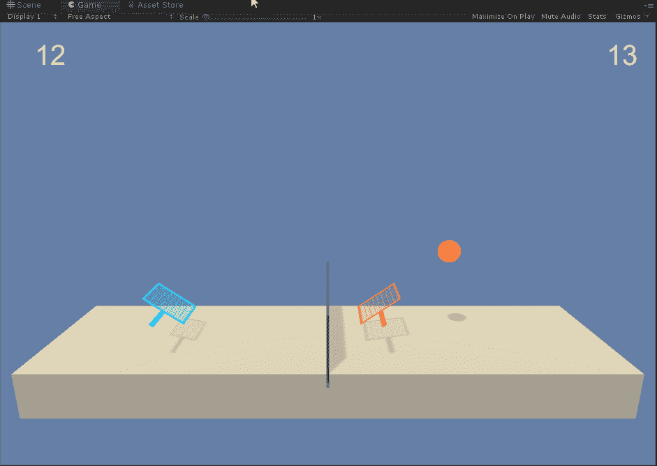
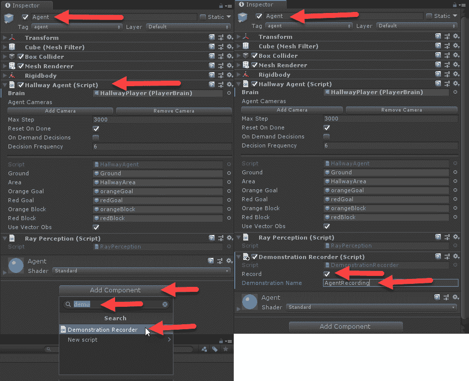
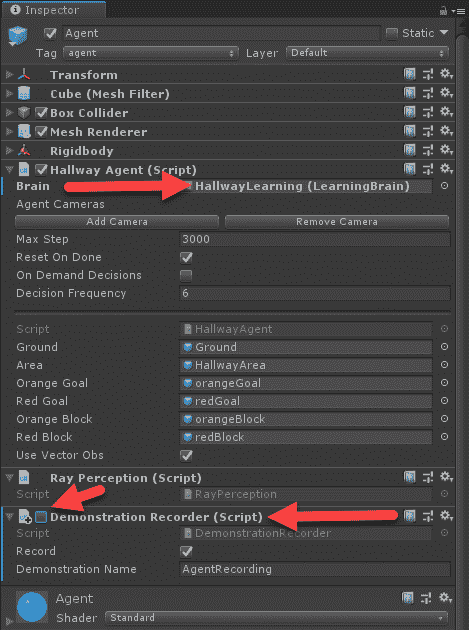
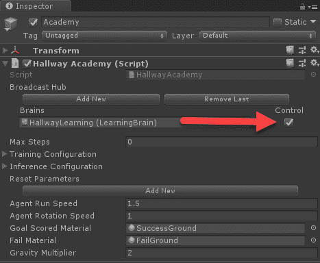
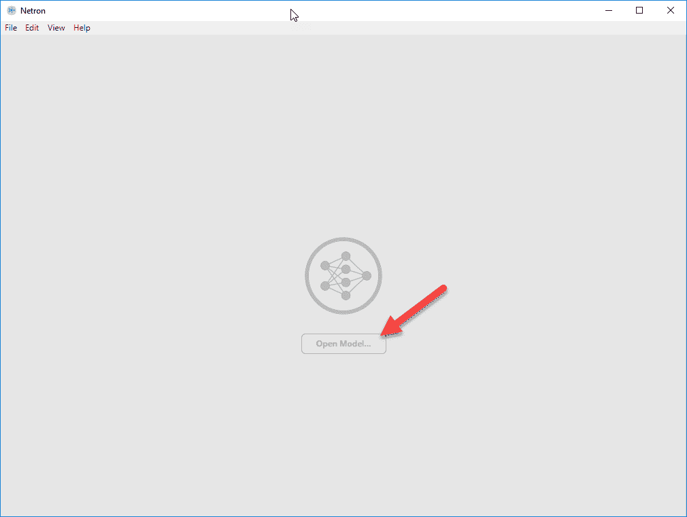
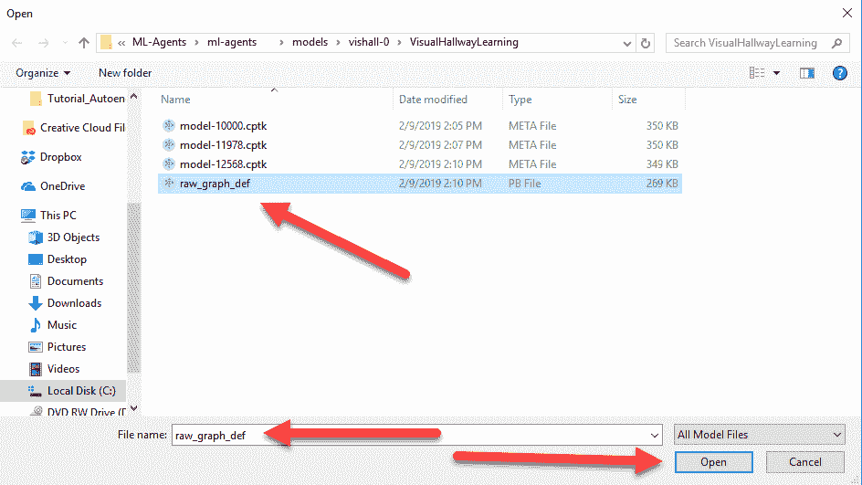
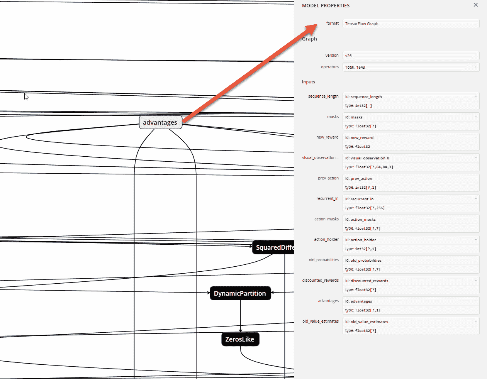
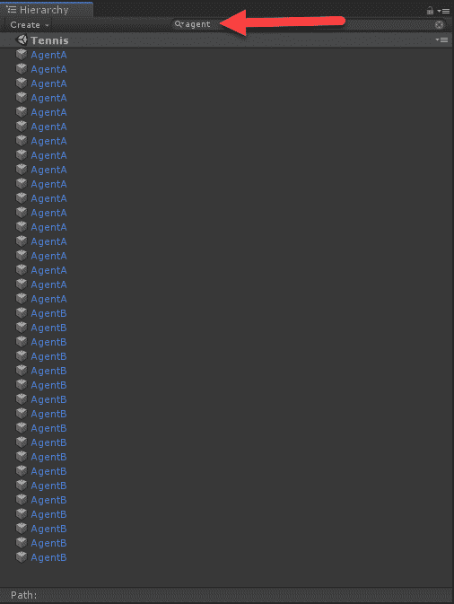

# 十、模仿和迁移学习

在撰写本文时，一个名为 AlphaStar 的新 AI，一个**深度强化学习** ( **DRL** )智能体，使用**模仿学习** ( **IL** )在玩实时策略游戏《星际争霸 2》时以五比零击败了一个人类对手。AlphaStar 是大卫·西尔弗和谷歌 DeepMind 工作的延续，旨在建立一个更聪明、更智能的人工智能。AlphaStar 用来获胜的具体技术可以写一本书，IL 和学习模仿人类游戏的使用现在引起了浓厚的兴趣。好在 Unity 已经以线下和线上训练场景的形式实现了 IL。虽然我们不会在本章中达到 AlphaStar 的水平，但我们仍然会了解 IL 和其他形式的迁移学习的基础技术。

在这一章中，我们将看看在 ML-agent 中 IL 的实现，然后看看迁移学习的其他应用。我们将在本章中讨论以下主题:

*   IL 或行为克隆
*   在线培训
*   离线培训
*   迁移学习
*   模仿迁移学习

尽管 AlphaStar 在一场 RTS 游戏中击败了一名人类职业玩家，取得了惊人的战术胜利，但它仍然因其使用的游戏类型和动作受到了审查。许多人类玩家表示，人工智能的战术能力显然更胜一筹，但整体战略和规划却糟糕透顶。看看谷歌 DeepMind 如何应对这种批评应该很有趣。

这将是令人兴奋的一章，并将为你未来的发展提供大量的培训机会，这些都将在下一节开始。


# 行为克隆

IL，或行为克隆，是从一个人或另一个人工智能获取观察和动作，并用作训练智能体的输入的过程。智能体本质上由人类引导，并通过他们的行为和观察来学习。一组学习观察可以通过实时游戏(在线)接收，或者从保存的游戏中提取(离线)。这提供了从多个智能体捕捉游戏并一前一后或单独训练他们的能力。IL 提供了训练或者实际上编程智能体的能力，这些任务你可能发现使用常规的 RL 是不可能训练的，正因为如此，它很可能成为一种关键的 RL 技术，在不久的将来，我们将在大多数任务中使用它。

在你看到没有它时的情况之前，很难衡量某样东西给你带来的价值。记住这一点，我们将首先看一个不使用 IL，但肯定可以从中受益的例子。打开 Unity 编辑器，并遵循以下练习:

1.  从资产| ML-智能体|示例|网球|场景文件夹中打开网球场景。
2.  选择并禁用额外的座席代表培训区域，从 TennisArea(1)到 TennisArea(17)。
3.  选择 AgentA 并确保网球智能体| Brain 设置为 TennisLearning。在这个例子中，我们希望每个智能体都与另一个智能体对抗。
4.  选择 AgentB 并确保网球智能体| Brain 设置为 TennisLearning。
    在本例中，我们在同一个环境中培训多个智能体。我们将在[第 11 章](15e7adeb-8b67-4b93-81d4-5f129772cd97.xhtml)、*构建多智能体环境*中讨论更多智能体扮演其他智能体作为学习方式的场景。
5.  选择学院，并确保网球学院| Brains 设置为 TennisLearning，并启用控制选项，如以下屏幕截图所示:


在 Academy 上将控制设置为启用

6.  打开一个 Python/Anaconda 窗口，准备进行训练。我们将使用以下命令启动培训:

```py
mlagents-learn config/trainer_config.yaml --run-id=tennis --train
```

7.  观看数千次迭代的训练，足以让你自己相信智能体不会轻易学会这项任务。当你确信后，停止训练，继续前进。

只看第一个例子，你就会发现普通的培训和我们所看到的其他高级方法，如课程和好奇心学习，很难实现，在这种情况下可能会适得其反。在下一节中，我们将研究如何在在线培训模式下使用 IL 运行这个示例。


# 在线培训

在线模仿学习是你教智能体实时学习一个玩家或另一个智能体的观察。这也是训练智能体或机器人最有趣、最吸引人的方式之一。在下一个练习中，让我们开始为在线模仿学习设置网球环境:

1.  选择 TennisArea | AgentA 对象并将 Tennis Agent | Brain 设置为 TennisPlayer。在这个 IL 场景中，我们有一个大脑作为老师，玩家，第二个大脑作为学生，学习者。
2.  选择 AgentB 对象，并确保将网球智能体|大脑设置为 TennisLearning。这将是学生大脑。
3.  从`ML-Agents/ml-agents/config`文件夹中打开`online_bc_config.yaml`文件。IL 不使用与 PPO 相同的配置，因此参数将具有相似的名称，但可能不会响应您已经习惯的内容。
4.  在文件中向下滚动到 **`TennisLearning`** 大脑配置如下面的代码片段所示:

```py
 TennisLearning:
    trainer: online_bc
    max_steps: 10000
    summary_freq: 1000
    brain_to_imitate: TennisPlayer
    batch_size: 16
    batches_per_epoch: 5
    num_layers: 4
    hidden_units: 64
    use_recurrent: false
    sequence_length: 16
```

5.  纵观超参数，我们可以看到有两个新的参数感兴趣。这些参数汇总如下:
    *   `trainer` : `online_` *或*`offline_bc`——使用在线或离线行为克隆。在这种情况下，我们在网上表演。
    *   `brain_to_imitate`:`TennisPlayer`—这设置了学习大脑应该尝试模仿的大脑。
        *此时我们不会对文件做任何修改。*
6.  打开准备好的 Python/Anaconda 窗口，使用以下命令启动培训:

```py
mlagents-learn config/online_bc_config.yaml --run-id=tennis_il --train --slow
```

7.  在编辑器中按下 Play 后，您就可以用 *W* 、 *A* 、 *S* 、 *D* 键来控制左拨片了。玩这个游戏，你可能会惊讶于智能体学习的速度有多快，并且可以变得相当好。下面是一个正在玩的游戏的例子:



用 IL 玩和教智能体

8.  如果你愿意，继续播放这个例子直到完成。在比赛中交换球员也很有趣，甚至可以训练大脑，然后使用训练好的模型进行比赛。你还记得如何操作一个训练有素的模型吧？

在玩最后一个练习的时候，你可能想知道为什么我们不这样训练所有的 RL 智能体。很好的问题，但是你可以想象，这要看情况。虽然 IL 非常强大，是一个相当有能力的学习者，但它并不总是做我们期望它做的事情。此外，一个 IL 智能体只会学习它所显示的搜索空间(观察值),并保持在这些限制内。在 AlphaStar 的情况下，IL 是训练的主要输入，但该团队也提到，AI 确实有足够的时间自我发挥，这可能解释了它的许多获胜策略。因此，虽然 IL 很酷，也很强大，但它不是解决我们所有 RL 问题的金鹅。然而，在这个练习之后，你可能会对 RL，尤其是 IL，有一个新的更大的评价。在下一节中，我们将探索如何使用离线 IL。


# 离线培训

离线训练是从玩游戏或执行任务的玩家或智能体生成记录的游戏性文件，然后作为训练观察反馈，以帮助智能体稍后学习。虽然在线学习肯定更有趣，而且在某些方面更适用于网球或其他多人游戏，但它不太实用。毕竟你一般需要实时打一个智能体几个小时，一个智能体才会变好。同样，在在线培训场景中，您通常仅限于单个智能体培训，而在离线培训中，可以将演示回放提供给多个智能体，以便更好地进行整体学习。这也允许我们执行有趣的训练场景，类似于 AlphaStar 训练，我们可以教会一个智能体，以便它可以教会其他智能体。

我们将在第十一章、*构建多智能体环境*中学习更多关于多智能体游戏的知识。

在下一个练习中，我们将重温我们的老朋友走廊/可视走廊的例子。同样，我们这样做是为了将我们的结果与之前在此环境下运行的示例练习进行比较。按照本练习设置新的离线培训课程:

1.  将 ML-Agents 代码克隆并下载到一个新文件夹中，可以选择`ml-agents_b`、`ml-agents_c`或其他名称。我们这样做的原因是为了确保我们在一个干净的环境中进行这些新的练习。此外，有时回到旧环境并回忆起您可能忘记更新的设置或配置也会有所帮助。
2.  启动 Unity 并打开 **UnitySDK** 项目和走廊或 VisualHallway 场景，你的选择。

3.  场景应该设置为在玩家模式下运行。只要确认这一点。如果你需要改变它，那就去做吧。
4.  如果其他环境处于活动状态，则禁用场景中的任何其他智能体训练环境。
5.  在“层次结构”窗口中选择“走廊区域|座席”。
6.  单击检查器窗口底部的添加组件按钮，键入`demo`，并选择演示记录器组件，如下图所示:



添加演示记录器

7.  在新的演示记录器组件上单击 Record，如前面的屏幕截图所示。此外，还要填写录音的演示名称属性，该属性也会显示出来。
8.  保存场景和项目。
9.  按下播放键，在相当长的时间内播放场景，超过几分钟，但可能不到几个小时。当然，你玩的有多好也会决定智能体学的有多好。你打得差，经纪人也会。
10.  当你认为足够的时间过去了，并且你已经尽你所能玩好了，停止游戏。

玩完游戏后，您应该会看到在项目窗口的资产根文件夹中创建了一个名为“演示”的新文件夹。文件夹里是你的演示录音。这是我们将在下一部分提供给智能体的录音。


# 为培训做准备

现在我们有了演示录音，我们可以在培训部分做更多的工作。但是，这一次，我们将向多个环境中的多个智能体回放我们的观察文件。打开走廊/visual hallow 示例场景，并按照下一个练习进行训练设置:

1.  选择并启用所有走廊区域训练环境走廊区域(1)到走廊区域(15)
2.  在层次结构中选择 HallwayArea | Agent，然后将 Hallway Agent | Brain 切换到 HallwayLearning，如下图所示:



设置智能体组件

3.  此外，选择并禁用演示录制组件，如前面的屏幕摘录所示
4.  确保场景中的所有智能体都在使用走廊学习大脑

5.  在层级中选择学院，然后启用走廊学院|大脑|控制选项，如下图所示:



让学院能够控制大脑

6.  保存场景和项目

现在我们已经为智能体学习配置了场景，我们可以在下一节继续为智能体喂食。


# 给智能体喂食

当我们在网上表演 IL 时，我们在网球场景中一次只喂一个特工。但是，这一次，我们将从同一个演示录音中训练多个智能体，以提高训练效果。

我们已经为培训做好了准备，所以让我们在下面的练习中开始喂养智能体:

1.  打开一个 Python/Anaconda 窗口，并从新的`ML-Agents`文件夹中设置它进行训练。你重新克隆了来源，对吗？
2.  从`ML-Agents/ml-agents_b/config`文件夹中打开`offline_bc_config.yaml`文件。文件内容如下，供参考:

```py
default:
    trainer: offline_bc
    batch_size: 64
    summary_freq: 1000
    max_steps: 5.0e4
    batches_per_epoch: 10
    use_recurrent: false
    hidden_units: 128
    learning_rate: 3.0e-4
    num_layers: 2
    sequence_length: 32
    memory_size: 256
    demo_path: ./UnitySDK/Assets/Demonstrations/<Your_Demo_File>.demo

HallwayLearning:
    trainer: offline_bc
    max_steps: 5.0e5
    num_epoch: 5
    batch_size: 64
    batches_per_epoch: 5
    num_layers: 2
    hidden_units: 128
    sequence_length: 16
    use_recurrent: true
    memory_size: 256
    sequence_length: 32
    demo_path: ./UnitySDK/Assets/Demonstrations/demo.demo
```

3.  将`HallwayLearning`或`VisualHallwayLearning`大脑的最后一行改为如下:

```py
HallwayLearning:
    trainer: offline_bc
    max_steps: 5.0e5
    num_epoch: 5
    batch_size: 64
    batches_per_epoch: 5
    num_layers: 2
    hidden_units: 128
    sequence_length: 16
    use_recurrent: true
    memory_size: 256
    sequence_length: 32
    demo_path: ./UnitySDK/Assets/Demonstrations/AgentRecording.demo
```

4.  注意，如果您使用的是`VisualHallwayLearning`大脑，您还需要更改前面配置脚本中的名称。
5.  完成编辑后保存您的更改。
6.  返回 Python/Anaconda 窗口，使用以下命令启动培训:

```py
mlagents-learn config/offline_bc_config.yaml --run-id=hallway_il --train
```

7.  出现提示时，在编辑器中按 Play，观看培训的展开。你会看到智能体使用与你非常相似的动作，如果你玩得好，智能体会很快开始学习，你会看到一些令人印象深刻的训练，这都要感谢 IL。

RL 可以被认为是学习的蛮力方法，而模仿学习和通过观察进行训练的细化显然将主导智能体训练的未来。当然，这真的有什么奇怪的吗？毕竟，我们简单的人类就是这样学习的。

在下一部分，我们将关注深度学习的另一个令人兴奋的领域，迁移学习，以及它如何应用于游戏和 DRL。


# 迁移学习

模仿学习，顾名思义，属于**迁移学习** ( **TL** )的范畴。我们可以把迁移学习定义为这样一个过程，通过这一过程，一个智能体或 DL 网络通过从一个到另一个的经验迁移而得到训练。这可以像我们刚刚执行的观察训练一样简单，也可以像在智能体的大脑中交换层/层权重一样复杂，或者只是训练智能体完成类似的任务。

在转移学习中，我们需要确保我们使用的经验或以前的权重是通用的。通过本书的基础章节(第 1-3 章),我们学习了使用诸如丢弃和批量标准化等技术进行一般化的价值。我们了解到这些技术对于更一般的训练很重要；允许智能体/网络更好地推断测试数据的培训形式。这与我们使用一个在一项任务上受过训练的智能体来学习另一项任务没有什么不同。实际上，一个更通用的智能体将比一个专业智能体更容易传递知识。

我们可以用一个简单的例子来证明这一点，从训练以下简单的练习开始:

1.  在 Unity 编辑器中打开 VisualHallway 场景。
2.  禁用任何额外的训练区域。
3.  确认学会控制大脑。
4.  从 hallow/Brains 文件夹中选择 VisualHallwayLearning brain，将 Vector Action | Branches Size | Branch 0 Size 设置为`7`，如下图所示:


增加智能体的向量动作空间

5.  我们增加大脑的活动空间，使它与我们的迁移学习环境所需的活动空间相适应，这一点我们将在后面讲到。
6.  保存场景和项目。
7.  打开准备用于训练的 Python/Anaconda 窗口。
8.  使用以下代码启动培训会话:

```py
mlagents-learn config/trainer_config.yaml --run-id=vishall --train  --save-freq=10000
```

9.  在这里，我们引入了一个新的参数来控制创建模型检查点的频率。默认设置为 50，000，但是我们不想等那么久。
10.  在编辑器中运行 agent in training，至少保存一个模型检查点，如以下屏幕摘录所示:


ML-智能体培训师创建检查点

11.  检查点是拍摄大脑快照并保存下来以备后用的一种方式。这可以让你回到你离开的地方继续训练。
12.  让智能体训练到一个检查点，然后在 Python/Anaconda 窗口中按下 Mac 上的 *Ctrl* + *C* 或 c *ommand* + *C* 来终止训练。

当你终止了训练，是时候在下一节的另一个学习环境中尝试这个节省下来的大脑了。


# 转移大脑

我们现在想把我们刚刚训练过的大脑放在一个新的但相似的环境中重新使用。由于我们的智能体使用视觉观察，这使得我们的任务更容易，但是您也可以尝试使用其他智能体来执行此示例。

让我们打开 Unity 并导航到 VisualPushBlock 示例场景，然后进行以下练习:

1.  选择学院并启用它来控制大脑。
2.  选择智能体并将其设置为使用 visual 推块学习大脑。您还应该确认这个大脑的配置方式与我们刚刚运行的 VisualHallwayLearning 大脑相同，这意味着视觉观察和向量动作空间是匹配的。
3.  在文件浏览器或其他文件浏览器中打开`ML-Agents/ml-agents_b/models/vishall-0`文件夹。
4.  将文件和文件夹的名称从`VisualHallwayLearning`更改为`VisualPushBlockLearning`，如下图所示:


手动更改模型路径

5.  通过更改文件夹的名称，我们实际上是告诉模型加载系统将我们的 VisualHallway brain 恢复为 VisualPushBlockBrain。这里的诀窍是确保两个大脑都有相同的超参数和配置设置。

6.  说到超参数，打开`trainer_config.yaml`文件并确保 VisualHallwayLearning 和 VisualPushBlockLearning 参数是相同的。以下代码片段显示了两者的配置，以供参考:

```py
VisualHallwayLearning:
    use_recurrent: true
    sequence_length: 64
    num_layers: 1
    hidden_units: 128
    memory_size: 256
    beta: 1.0e-2
    gamma: 0.99
    num_epoch: 3
    buffer_size: 1024
    batch_size: 64
    max_steps: 5.0e5
    summary_freq: 1000
    time_horizon: 64

VisualPushBlockLearning:
    use_recurrent: true
    sequence_length: 64
    num_layers: 1
    hidden_units: 128
    memory_size: 256
    beta: 1.0e-2
    gamma: 0.99
    num_epoch: 3
    buffer_size: 1024
    batch_size: 64
    max_steps: 5.0e5
    summary_freq: 1000
    time_horizon: 64
```

7.  完成编辑后，保存配置文件。
8.  打开 Python/Anaconda 窗口，使用以下代码启动培训:

```py
mlagents-learn config/trainer_config.yaml --run-id=vishall --train --save-freq=10000 --load
```

9.  前面的代码不是印刷错误；这是我们用来运行 VisualHallway 示例的完全相同的命令，除了在末尾附加了`--load`。这将启动培训并提示您运行编辑器。
10.  您可以随意运行培训，只要您喜欢，但请记住，我们几乎没有培训原始智能体。

现在，在本例中，即使我们已经培训智能体完成 VisualHallway，这可能也不会非常有效地将知识转移到 VisualPushBlock。出于这个例子的目的，我们选择了两者，因为它们非常相似，并且将一个经过训练的大脑转移到另一个大脑不太复杂。出于你自己的目的，能够转移受过训练的大脑可能更多的是在新的或修改的水平上重新训练智能体，甚至可能允许智能体在逐渐更困难的水平上训练。

根据您的 ML-Agents 版本的不同，这个例子可能工作得很好，也可能不太好。特别的问题是模型的复杂性、超参数的数量、输入空间和我们正在运行的奖励系统。保持所有这些因素不变也需要对细节的高度关注。在下一节中，我们将花点时间来探索这些模型有多复杂。


# 探索 TensorFlow 检查点

TensorFlow 正迅速成为支持大多数深度学习基础设施的底层图形计算引擎。虽然我们还没有详细介绍这些图形引擎是如何构建的，但直观地回顾一下这些 TensorFlow 模型可能会有所帮助。我们不仅可以开始更好地欣赏这些系统的复杂性，而且一个好的视觉效果往往胜过千言万语。让我们打开 web 浏览器，进行下一个练习:

1.  用你最喜欢的搜索引擎在浏览器中搜索短语`netron tensorflow`。Netron 是一款开源 TensorFlow 模型查看器，非常适合我们的需求。
2.  找到 GitHub 页面的链接，并在页面上找到下载二进制安装程序的链接。为您的平台选择安装程序，然后单击下载。这将带您到另一个下载页面，您可以在那里选择要下载的文件。
3.  使用您平台的安装程序来安装 Netron 应用程序。在 Windows 上，这就像下载 exe 安装程序并运行它一样简单。

4.  运行 Netron 应用程序，在它启动后，您将看到以下内容:



Netron 应用程序

5.  单击打开的模型...窗口中间的按钮

6.  使用文件资源管理器找到`ML-Agents/ml-agents/models/vishall-0\VisualHallwayLearning`文件夹，找到`raw_graph.def`文件，如下图所示:



选择要加载的模型图定义

7.  加载图表后，使用右上角的-按钮尽可能放大视图，类似于下面的屏幕截图:


我们智能体大脑的 TensorFlow 图模型

8.  如插图所示，这个图表非常复杂，我们很难理解。然而，仔细观察模型/图形是如何构建的会很有趣。

9.  滚动到图形的顶部，找到名为 advantages 的节点，然后选择该节点，注意图形和输入、模型属性，如下面的屏幕截图所示:



优势图模型的属性

10.  在这个模型的 properties 视图中，您应该能够看到一些非常熟悉的术语和设置，比如 visual_observation_0，它显示了模型输入是一个形状为[84，84，3]的张量。

完成后，可以随意查看其他模型，甚至可以探索 Unity 之外的其他模型。虽然这个工具不太能够像我们一样总结一个复杂的模型，但它确实显示了这些类型的工具变得多么强大。更重要的是，如果你能找到周围的路，你甚至可以导出变量供以后检查或使用。


# 模仿迁移学习

模仿学习的一个问题是，它经常使智能体走上一条限制其未来可能行动的道路。这与你被告知执行一项任务的不适当的方法，然后就那样做了，也许没有思考，只是后来发现有一个更好的方法。事实上，人类在历史上一次又一次地倾向于这种类型的问题。也许你小时候就知道刚吃完饭就游泳是危险的，但后来通过你自己的实验或常识才知道，那只是一个神话，一个在很长一段时间里被当作事实的神话。通过观察来训练一个智能体没什么不同，你在很多方面限制了智能体的视野，使其局限于一个狭窄的焦点，这个焦点受到了所学内容的限制。然而，有一种方法允许智能体回复到部分蛮力或试错探索，以便扩展其训练。

有了 ML-agent，我们可以将 IL 与一种迁移学习的形式结合起来，以允许 agent 首先从观察中学习，然后通过向曾经的学生学习来进一步训练。如果您愿意，这种形式的 IL 链接允许您训练一个智能体自动训练多个智能体。让我们将 Unity 开放给 TennisIL 场景，然后进行下一个练习:

1.  选择 TennisArea | Agent 对象，并在检查器中禁用 BC Teacher Helper 组件，然后添加一个新的演示记录器，如下图所示:


检查 BC 教师是否连接到智能体

2.  BC 教师助手是一个记录器，它的工作方式就像演示记录器一样。BC 记录器允许您在智能体运行时打开和关闭记录，这非常适合在线培训，但是在编写本文时，该组件还没有工作。

3.  确保学院设置为控制网球学习大脑。
4.  保存场景和项目。
5.  打开 Python/Anaconda 窗口，使用以下命令启动培训:

```py
mlagents-learn config/online_bc_config.yaml --run-id=tennis_il --train --slow
```

6.  当提示在编辑器中运行游戏时，按 Play。用 *W* 、 *A* 、 *S* 、 *D* 键控制蓝色拨片，弹奏几秒钟进行预热。
7.  热身后，按下 *R* 键开始录制演示观察。玩几分钟游戏，让智能体变得有能力。在智能体能够回球后，停止培训课程。

这不仅会训练智能体，这很好，而且还会创建一个演示录音回放，我们可以用它来进一步训练智能体，以学习如何以类似于训练 AlphaStar 的方式互相扮演。在下一节中，我们将设置我们的网球场景，使其在离线训练模式下运行，并有多个智能体。


# 通过一次演示培训多个智能体

现在，有了我们打网球的录音，我们可以用它来训练多个智能体，反馈到一个策略中。将 Unity 打开到网球场景，即具有多个环境的场景，然后进行下一个练习:

1.  在层级窗口顶部的过滤栏中键入`agent`，如下图所示:



搜索场景中的所有智能体

2.  选择场景中的所有智能体对象，并批量更改他们的大脑以使用 TennisLearning 而不是 TennisPlayer。
3.  选择学院，并确保使其能够控制大脑。
4.  打开`config/offline_bc_config.yaml`文件。

5.  为底部的`TennisLearning`大脑添加以下新部分:

```py
TennisLearning:
    trainer: offline_bc
    max_steps: 5.0e5
    num_epoch: 5
    batch_size: 64
    batches_per_epoch: 5
    num_layers: 2
    hidden_units: 128
    sequence_length: 16
    use_recurrent: true
    memory_size: 256
    sequence_length: 32
    demo_path: ./UnitySDK/Assets/Demonstrations/TennisAgent.demo
```

6.  保存场景和项目。
7.  打开 Python/Anaconda 窗口，使用以下代码运行培训:

```py
mlagents-learn config/offline_bc_config.yaml --run-id=tennis_ma --train
```

8.  为了观看训练，您可能想要添加`--slow`开关，但它应该不是必需的。
9.  让智能体训练一段时间，并注意到它的进步。即使只有很短的观察记录输入，智能体也能很快成为有能力的玩家。

有多种方法可以执行这种类型的 IL 和 transfer learningchaining，这将使您的智能体在培训中具有一定的灵活性。您甚至可以在没有 IL 的情况下使用已训练模型的检查点，并像我们之前所做的那样运行具有迁移学习的智能体。可能性是无限的，什么将成为最佳实践还有待观察。

在下一节中，我们将提供一些练习，供您个人学习使用。


# 练习

本章末尾的练习可能会提供几个小时的乐趣。试着只完成一两个练习，因为我们还需要完成这本书:

1.  设置并运行 PyramidsIL 场景以运行在线 IL。
2.  设置并运行推块 IL 场景以运行在线 IL。
3.  设置并运行 WallJump 场景以运行在线 IL。这需要你修改场景。
4.  设置并运行 visual 金字塔场景以使用脱机录制。录制培训课程，然后培训智能体。
5.  设置并运行 VisualPushBlock 场景以使用离线录制。使用离线 IL 培训智能体。
6.  设置推块场景以录制观察演示。然后使用此离线培训在常规推块场景中培训多个智能体。
7.  设置 PyramidsIL 场景以录制演示录音。然后将其用于离线训练，在常规金字塔场景中训练多个智能体。
8.  使用您喜欢的任何学习形式，在可视走廊场景中培训智能体。训练后，修改 VisualHallway 场景以在墙壁和地板上使用不同的材质。在 Unity 对象上改变材质是非常容易的。然后，使用交换模型检查点的技术，作为将先前训练的大脑转移到新环境中学习的一种方式。
9.  做练习八，但是使用可视化金字塔场景。你也可以在这个场景中添加其他物体或块。
10.  做练习八，但是使用视觉推块场景。尝试添加智能体可能需要解决的其他块或其他对象。

请记住，如果你正在尝试任何迁移学习练习，在匹配复杂的图表时，注意细节是很重要的。在下一节中，我们将总结本章所讲的内容。


# 摘要

在这一章中，我们介绍了 RL 中的一种新兴技术，称为模仿学习或行为克隆。正如我们所了解的，这种技术获取玩家玩游戏的观察结果，然后在在线或离线环境中使用这些观察结果来进一步训练智能体。我们进一步了解到，IL 只是迁移学习的一种形式。然后，我们介绍了一种使用 ML-Agents 的技术，这种技术可以让你跨环境转移大脑。最后，我们研究了如何将 IL 和迁移学习联系起来，作为一种刺激智能体训练自己开发新策略的方式。

在下一章中，我们将通过观察多个智能体训练场景来进一步理解游戏中的 DRL。