# 用 DRL 调试/测试游戏

虽然 ML-Agents 框架为你的游戏构建 AI 代理提供了强大的功能，但它也为调试和测试提供了自动化。任何复杂软件的开发都需要由有才能的质量保证团队进行广泛的产品测试和审查。测试每一个方面、每一种可能的组合和每一个级别都是非常耗时和昂贵的。因此，在这一章中，我们将把 ML-agent 作为测试一个简单游戏的自动化方法。当我们改变或修改游戏时，我们的自动测试系统可以通知我们任何可能破坏测试的问题或可能的改变。例如，我们还可以进一步用 ML-agent 来评估培训绩效。

以下是本章内容的简要总结:

*   介绍游戏
*   设置 ML 代理
*   覆盖 Unity 输入系统
*   通过模仿进行测试
*   分析测试过程

在这一章中，我们将假设你对 ML-Agents 工具包有很好的了解，并且对 Unity 游戏引擎有所熟悉。你还应该很好地掌握奖励函数和使用 ML-agent 的模仿学习。

在下一节中，我们将从下载和导入游戏开始；我们将在接下来的部分教 ML-Agents 玩。这应该被认为是一个高级章节，即使是对 Unity 有经验的用户。因此，如果你是 Unity 和/或 C#的新手，请慢慢来，慢慢完成练习。在本章结束时，如果你已经完成了所有的练习，你应该已经成为一名 Unity pro 了。


# 介绍游戏

我们要看的游戏是一个免费的演示样本资产，是一个典型游戏的优秀范例。我们将测试的游戏将使用离散控制机制和第一人称视角，就像我们过去看过的游戏一样。我们将在这里向你展示的技术是如何映射/侵入一个游戏的控制器，以便它可以由 ML-Agents 驱动。使用这种技术可以让你在任何现有的游戏中加入 ML-agent，尽管不同的控制器，比如第三人称或者自上而下，可能需要稍微改变一下方法。

如果你认为自己是一个有经验的 Unity 用户，并且有自己的使用 FPS 系统的项目，那么你应该继续尝试将这个例子应用到你自己的游戏或例子中。

你通常会发现 Unity 缺乏好的游戏项目样本，这是由于一个有点问题的技术叫做**资产翻转**。从本质上来说，一些开发者会拿一个样本项目，迅速将其作为自己的游戏进行皮肤处理，然后转售。这种做法主要是在 Unity 社区中遭到反对，因为它通常会对这个优秀的游戏引擎产生负面影响。仅仅作为样本的快速游戏往往质量很差，不受支持，更不用说这些开发者只使用免费许可证，这意味着这些设计糟糕的游戏也是用 Unity 制作的*发货的。*

我们想说明如何将多智能体整合到游戏中进行测试、调试和/或作为人工智能的增强。让我们从导入基础项目并设置游戏在编辑器中运行开始。在这个过程中，我们可能不得不调整一些事情来让事情正常运行，但这是我们的意图。打开 Unity 编辑器，按照下一节中的练习来设置基本游戏项目:

1.  创建一个名为`HoDLG`(或者您喜欢的其他名称)的新项目。等待加载空项目。还是那句话，你觉得有条件，就用自己的项目。
2.  从菜单中选择**窗口** | **资产商店**。

3.  在搜索窗格中，键入`ms vehicle system`并点击*输入*或点击**搜索**按钮。我们将看到一个名为 MS Vehicle System 的免费资产，它有一个我们可以玩的有趣的小环境。通常很难找到这样的免费环境(由于前面提到的原因)，但是，一般来说，制作良好的商业(非免费)资产包将提供这样的良好演示环境。Unity 也有很多教程环境，但是它们往往很快就会过时，而且不总是那么容易升级。
4.  点击 **MS 车辆系统**卡，等待加载资产页面，如以下截图所示:


选择要下载的资产包

5.  点击**下载**按钮下载资产，然后点击**导入**将资产导入到项目中。按照导入对话框将所有资产导入到项目中。
6.  在**Assets**|**MSVehicleSystem(FreeVersion)**文件夹中找到 **MainScene** 场景，并打开。
7.  按下 **Play** 在编辑器中运行场景，并使用控件驾驶车辆。请注意如何切换车辆和摄像机控制。当你完成测试(播放)后，按播放键停止播放。
8.  在**层次**过滤器字段中输入`canvas`，选择场景中所有的**画布**对象，如下图所示:


禁用场景中的画布用户界面

9.  这将禁用场景中的用户界面；我们不需要它来进行测试，在这种情况下，它并不重要。如果这是一个真实的游戏，可能会有更多丰富多彩的视觉效果来表示分数，当然，你可以随时添加这些。
10.  点击滤镜输入旁边的 **X** 将其清除，场景恢复正常。
11.  再次播放场景，探索几个区域。寻找一个你认为可能成为合适目标的领域；记住，一开始不要让它太难。以下是一个可能成为有趣目标的地点示例；看看你是否能找到位置:


为我们的目标找到一个好地方

即使你找不到具体的地点，也要找到一个很难到达的地方。这样，代理将不得不广泛地探索该级别，以便找到目标(或多个目标)。在我们的例子中，我们将把随机的目标方块放到关卡上，并鼓励代理去寻找它们。通过这种方式，我们还可以根据它发生的频率来绘制出被探索的区域，然后确定如何覆盖其他区域进行测试。在此之前，我们将在下一节添加 ML-agent。


# 设置 ML 代理

在写这本书的时候，ML-Agents 是作为 GitHub 项目开发和发布的。随着产品的成熟，它很可能会作为自己的资产包来交付，但目前不是这样。

因此，我们首先需要将 ML-Agents 作为一个资产包导出。打开 ML-Agents 或 Unity SDK 项目的新 Unity Editor 会话，并遵循以下步骤:

1.  在**项目**窗口中找到 **ML-Agents** 文件夹，并选中它。
2.  从菜单中选择**资产** | **出口包**。
3.  确保所有的文件夹内容都被高亮显示，如下面的**导出包**对话框摘录所示:

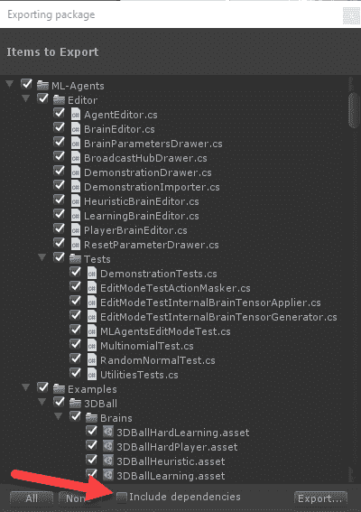

将 ML 代理导出为资产包

4.  确保取消选中 **Include dependencies** 复选框，如前面的摘录所示。只要您选择了正确的根文件夹，我们需要的所有依赖项都应该打包了。
5.  点击**导出...对话框中的**按钮，然后选择资产文件并保存到一个您以后能够很容易找到的位置。
6.  打开 Unity 编辑器，进入我们在上一个练习中开始的项目。
7.  从菜单中选择**资产** | **导入包** | **自定义包**。找到我们刚刚导出的包，并将其导入到新的测试项目中。
8.  找到项目窗口，在**资产**的根目录下创建一个名为`HoDLG`的新文件夹，然后在这个新文件夹中创建名为`Brains`、`Prefabs`、**、**和`Scripts`的新文件夹，如下面的截图所示:

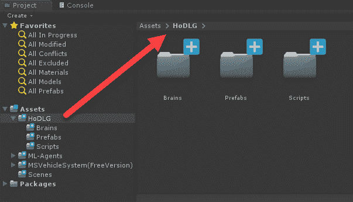

创建新的项目文件夹

9.  创建这些文件夹是为新资源、示例或项目奠定基础的标准方式。您现在可以关闭旧的 ML-Agents Unity SDK 项目，因为我们不再需要它。

现在我们已经导入了 ML-agent，并且为我们的测试游戏打下了基础，我们可以继续添加 ML-agent 的学习部分来进行测试。


# 向游戏引入奖励

该场景目前没有明确的目标。有大量的开放世界和探索风格的游戏，其目标是非常松散的定义。然而，就我们的目的而言，我们只想让代理测试整个游戏水平，并希望找出任何我们从未预见到的游戏缺陷或策略。当然，这并不意味着如果汽车驾驶代理变得很好，我们也可以用他们作为游戏对手。底线是我们的代理需要学习，它通过奖励做到这一点；因此，我们需要做一些奖励函数。

让我们首先为我们的目标定义一个奖励函数，如下所示:


这很简单。每当代理人遇到一个目标，他们将获得 1 的奖励。现在，为了避免代理花费太长时间，我们还将引入一个标准步骤奖励，如下所示:


这意味着我们对每个代理操作应用-1 除以最大步骤数的步骤奖励。这是相当标准的(例如，我们的走廊代理使用它)，所以这里没有什么新的东西。所以，我们的奖励函数会很简单，这很好。

在许多情况下，你的游戏可能有明确的目标，你可以用它来给予奖励。例如，一个驾驶游戏会有一个清晰的目标，我们可以为我们的代理绘制。在这种情况下，在我们的开放世界游戏中，为代理添加目标来定位是有意义的。当然，你如何实现你的奖励结构很重要，但是使用对你的情况有意义的东西。

定义了奖励函数后，是时候将目标的概念引入我们的游戏了。我们希望保持这个系统的通用性，所以我们将在一个名为`TestingAcademy`的新对象中构建一个目标部署系统。这样，你可以把这个学院放入任何类似的 FPS 或第三人称控制的世界，它会一样工作。

**First-person shooter** (**FPS**) refers to a type of game, but also a type of control/camera system. We are interested in the latter, since it is the method by which we control our car.

打开新组合项目的编辑器，并按照下一个练习构建`TestingAcademy`对象:

1.  点击**层次**窗口，从菜单中选择**游戏对象** | **创建空的**。将新物体命名为`TestingAcademy`。
2.  在 HoDLG | **脚本**文件夹中找到并点击，然后在**项目**窗口中打开**创建**子菜单。
3.  从**创建**菜单中，选择 **C#脚本**。重命名脚本`TestingAcademy`。
4.  打开新的 **TestingAcademy** 脚本，输入以下代码:

```
using MLAgents;
using UnityEngine;

namespace Packt.HoDLG
{
  public class TestingAcademy : Academy
  {
    public GameObject goal;
    public int numGoals; 
    public Vector3 goalSize;
    public Vector3 goalCenter;
    public TestingAgent[] agents;
    public GameObject[] goals;
  }
}
```

本章练习的所有代码都包含在本书源代码的`Chapter_12_Code.assetpackage`中。

5.  这段代码通过使用所需的名称空间来定义我们的类和导入。然后，我们定义了自己的名称空间，`Packt.HoDLG`，**，**，这个类是从`Academy`扩展而来的，一个 ML-Agents 基类。接下来是定义目标部署多维数据集的几个变量的声明。把这想象成一个虚拟的立方体，它将产生目标。这个想法是让物理学去做剩下的事情，让目标落到地面上。

**Namespaces** are optional in Unity, but it is highly recommended to put your code within a namespace in order to avoid most naming issues, which can be a common problem if you are using many assets or if you find yourself modifying existing assets, as we are doing here.

6.  接下来，我们将定义标准的`Academy`类设置方法`InitializeAcademy`。该方法被自动调用，如下所示:

```
public override void InitializeAcademy()
{
  agents = FindObjectsOfType<TestingAgent>();
  goals = new GameObject[numGoals];
}
```

7.  这个方法作为 ML-Agents 设置的一部分被调用，它实际上启动了整个 SDK。通过添加`Academy` ( `TestingAcademy`)，我们将有效地启用 ML-agent。接下来，我们将添加最后一个方法，在所有代理剧集结束时学院重置时调用，如下所示:

```
public override void AcademyReset()
{
  if (goalSize.magnitude > 0)
  {
    for(int i = 0; i < numGoals; i++)
    {
    if(goals[i] != null && goals[i].activeSelf)
      Destroy(goals[i]);
    }
    for(int i = 0; i < numGoals; i++)
    {
      var x = Random.Range(-goalSize.x / 2 + goalCenter.x, goalSize.x / 2 + goalCenter.x);
      var y = Random.Range(-goalSize.y / 2 + goalCenter.y, goalSize.y / 2 + goalCenter.y);
      var z = Random.Range(-goalSize.z / 2 + goalCenter.z, goalSize.z / 2 + goalCenter.z);
     goals[i] = Instantiate(goal, new Vector3(x, y, z), Quaternion.identity, transform);
   }
  }
}
```

8.  这段代码只是在虚拟立方体边界内随机生成目标。然而，在此之前，它首先通过使用`Destroy`方法清除旧的目标。从游戏中移除一个物体。然后，代码再次循环，并在虚拟立方体内的随机位置创建新的目标。游戏中实际创建目标的线被突出显示，并使用`Instantiate`方法。`Instantiate`在游戏中指定的位置和旋转创建一个对象。
9.  保存文件并返回编辑器。现在不要担心任何编译器错误。如果你是从零开始写代码，你会遗漏一些类型，我们将在后面定义。

随着新的`TestingAcademy`脚本的创建，我们可以继续将组件添加到游戏对象中，并在下一节中设置学院。


# 设置测试学院

随着`TestingAcademy`脚本的创建，是时候通过以下步骤将其添加到游戏对象中了:

1.  将新的 **TestingAcademy** 脚本文件从**脚本**文件夹中拖放到**层级**窗口中的 **TestingAcademy** 对象上。这会将组件添加到对象中。我们希望在完成学院之前创建一些其他组件。
2.  点击**层级**窗口，在菜单中选择**游戏对象| 3D 对象|立方体**。重命名新对象`goal`。

3.  选择对象并将**标签**更改为`goal`。然后，通过点击**目标**图标并选择 **v46** 或您选择的另一种闪光材料来交换其材料，如以下截图所示:

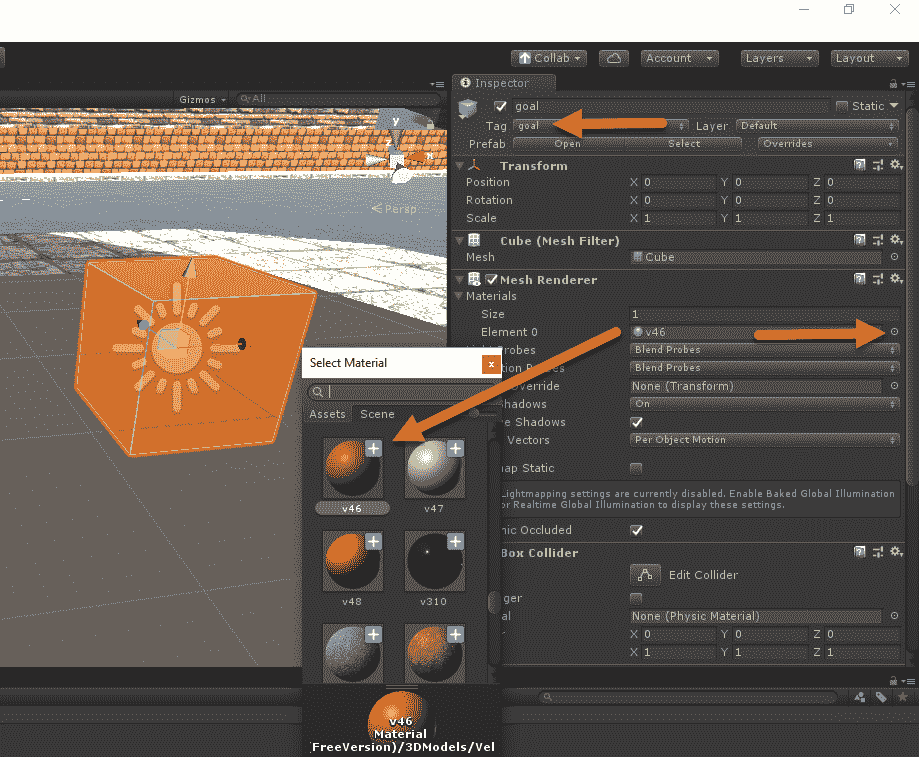

交换目标对象的材质

4.  从菜单中选择**目标**对象，选择**组件|物理|刚体**。这将添加一个称为刚体的物理系统组件。通过给物体添加**刚体**，我们允许它被物理系统控制。

5.  将**目标**对象拖放到**项目**窗口的 **HoDLG | Prefabs** 文件夹中。这将把目标对象变成一个**预置**。预设是自包含的对象，包含它们自己的层次。一个预设可以包含整个场景，或者只有一个物体，就像我们这里一样。
6.  从**层次**窗口中选择并删除**目标**对象。在未来，我们将通过使用它的预置程序实例化学院的**目标**。
7.  在 **HoDLG | Brains** 文件夹内点击，点击打开 **Create** 菜单。从菜单中选择**ML-Agents | learning brain**。将新大脑命名为 **`TestingLearningBrain`** ，然后创建一个名为`TestingPlayerBrain`的新玩家大脑。现在还不要担心配置大脑。
8.  在**层次**窗口中选择 **TestingAcademy** 对象，然后更新**Testing academy**y 组件的值，如下图所示:

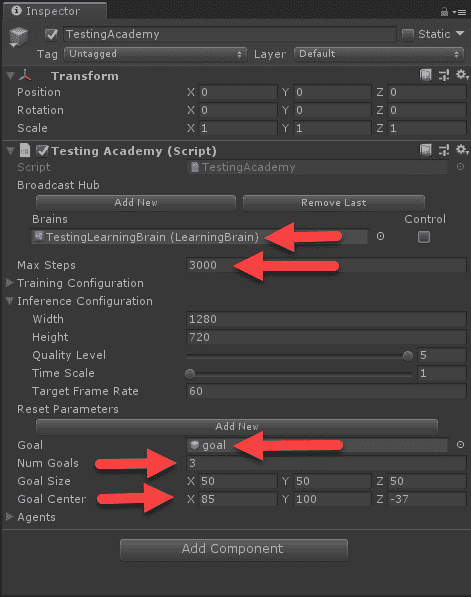

设置测试学院

9.  请注意，我们正在 **TestingAcademy** 脚本中设置以下属性:
    *   **大脑**:测试学习大脑
    *   **最大步数** : 3000
    *   **目标**:从文件夹中拖拽预设的目标
    *   **进球数量** : 3(禁区内的失球数量)
    *   **目标大小** : (50，50，50)(确定目标框的最大边界)
    *   **球门中心** : (85，110，-37)(球门的中心点)

此时，您可能想运行项目；如果您刚刚下载了代码，您可以这样做，但是要等到我们在下一节中定义了`TestingAgent`之后。


# 编写测试代理的脚本

当然，如果没有一个代理与环境进行交互和学习，我们的测试(或者无论我们想进行多远的模拟)都不会有太大的作用。在下一个练习中，我们将定义描述`TestingAgent`组件的脚本:

1.  在 **HoDLG | Scripts** 文件夹内点击，点击 **Create** 按钮打开菜单。
2.  从菜单中选择 **C#脚本**，并将脚本命名为`TestingAgent`。
3.  在编辑器中打开该脚本，并开始使用以下代码编写脚本:

```
using MLAgents;
using UnityEngine;

namespace Packt.HoDLG
{
  public class TestingAgent : Agent
  {
    public string[] axisAction; 
    protected Vector3 resetPos;
    protected Quaternion resetRot;
  }
}
```

4.  我们的课就这样开始了；这次是从另一个基类`Agent`扩展而来。然后，我们定义一些基本字段，用于设置变量和记录代理的开始位置和旋转。

5.  接下来，我们继续定义`InitializeAgent`方法。这个方法被调用一次，以设置代理并确保动作长度相同；我们很快就会谈到这一点。我们记住了代理开始的位置/旋转，以便以后可以还原它。代码如下:

```
public override void InitializeAgent()
{
  base.InitializeAgent();
  if (axisAction.Length != brain.brainParameters.vectorActionSize[0])
    throw new MLAgents.UnityAgentsException("Axis actions must match agent actions");

  resetPos = transform.position;
  resetRot = transform.rotation;
}
```

6.  接下来，我们定义一个名为`CollectObservations`的空方法。这通常是代理观察环境的地方；因为我们计划使用视觉观察，我们可以把它留空。代码如下:

```
public override void CollectObservations(){  }
```

7.  接下来，我们定义另一个必需的方法:`AgentAction`。这是我们添加负步骤奖励并移动代理的方法，如下面的代码片段所示:

```
public override void AgentAction(float[] vectorAction, string textAction)
{
  AddReward(-1f / agentParameters.maxStep);
  MoveAgent(vectorAction);
}

public void MoveAgent(float[] act)
{
  for(int i=0;i<act.Length;i++)
  {
    var val = Mathf.Clamp(act[i], -1f, 1f);
    TestingInput.Instance.setAxis(val,axisAction[i]);
  } 
}
```

8.  这里的代码解释了大脑的动作，并将它们注入到一个新的类中(我们将很快构建这个类)，这个类叫做`TestingInput`。`TestingInput`是一个助手类，我们将使用它来覆盖游戏的输入系统。
9.  保存脚本，再次忽略任何编译器错误。同样，我们有一个新的依赖项`TestingInput`，我们将很快定义它。

有了新的脚本，我们可以在下一部分开始设置`TestingAgent`组件。


# 设置测试代理

现在，我们在这里构建的系统是相当通用的，它旨在用于多种环境。在我们设置东西的时候，请记住这一点，尤其是当一些概念看起来有点抽象的时候。打开编辑器，让我们将`TestingAgent`脚本添加到一个对象中:

1.  在场景中选择**车辆 1** 、**车辆 3** 、**车辆 4、**和**车辆 5** ，并禁用它们。我们目前只想给我们的代理人驾驶的能力，而不是切换车辆；因此，我们只需要默认的 **Vehicle2** 。
2.  从 **HoDLG | Scripts** 文件夹中选择 **TestingAgent** 脚本，并将其拖拽到 **Vehicle2** 对象上。这将把 **TestingAgent** 组件添加到我们的 **Vehicle2** 中，并使其成为一个代理(嗯，差不多)。
3.  在**层级**窗口中打开**vehicle 2 | camera**并选择您希望代理使用的视图。在本练习中，我们将选择**摄像机 2** ，但是五个摄像机中的每一个的选项都显示在下面的屏幕截图中:


选择视觉观察相机以用作代理的输入

4.  最佳选项是**摄像机 1** 或**摄像机 5** ，如前面的截图所示。请注意，摄像机的顺序是相反的，1 从最右边开始，而不是最左边。当然，这为将来使用其他视觉输入留下了很多机会。

5.  选择 **Vehicle2** 并将选中的**测试播放器 Brain** 和 **Camera1** 拖动到所需的插槽中，如下图所示:

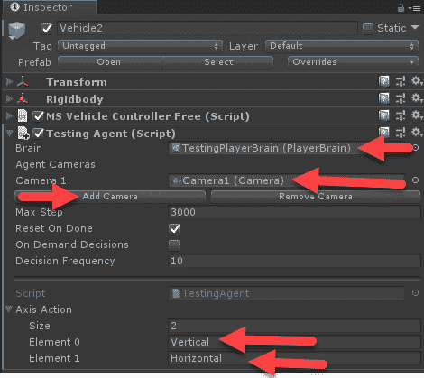

设置 TestingAgent 组件

6.  您还需要定义其他属性，总结如下:
    *   **大脑**:测试 PlayerBrain。
    *   **摄像机 1** :点击**添加摄像机**添加一个新的摄像机，然后从**车载 2** 摄像机中选择**摄像机 1** 。
    *   **决策频率** : `10`(这决定了代理做决策的频率；`10`是这个游戏很好的起点。它会有所不同，您可能需要根据自己的需要进行调整)
    *   **轴动作:** 2:
        *   垂直(表示我们将覆盖的轴，以允许代理控制游戏。我们将很快更深入地描述轴)
        *   **元素 1** :水平(同上)
7.  保存项目和场景，再次忽略任何编译器错误。

这就完成了`TestingAgent`的建立；如您所见，运行它不需要太多的配置或代码。将来，您可能会看到更高级的测试/调试方法，或者以这种方式构建代理。然而现在，我们需要通过注入 Unity 输入系统来完成我们的例子，我们将在下一节中完成。


# 覆盖 Unity 输入系统

Unity 最引人注目的特性之一是它能够跨任何系统跨平台，随之而来的是几个有用的抽象层，我们可以用它们来注入我们的代码。然而，有问题的游戏需要遵循 Unity 最佳实践，以使注入变得容易。这并不是说我们不能通过覆盖游戏的输入系统来做到这一点；只是没那么容易。

在我们开始描述注入是如何工作的之前，让我们后退一步，看看使用 Unity input 系统的最佳实践。多年来，Unity input 系统已经从设备用于输入的简单查询发展到现在使用的更加跨平台的系统。然而，许多开发者，包括 Unity 本身，仍然使用输入法来查询特定的键码。最佳实践是定义一组定义游戏输入的轴(输入通道)。

通过下面的练习，我们可以很容易地看到它在游戏中是如何定义的:

1.  从编辑器菜单中，选择**编辑|项目设置**。
2.  选择输入选项卡，然后展开**轴|水平**和**轴|垂直** l，如以下截图所示:

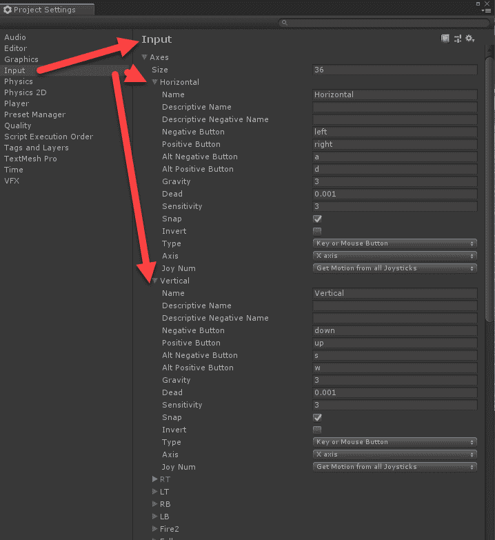

检查输入轴设置

3.  **垂直**和**水平**轴定义了将用于控制游戏的输入。通过在这个选项卡中定义它们，我们可以通过查询轴来控制跨平台的输入。请注意，轴输入允许我们定义按钮和操纵杆(触摸)输入。用`getAxis`对输入系统的查询输出返回一个从`-1`到`+1`的值，或者连续输出。这意味着我们可以接受任何离散形式的输入，比如击键，并立即自动将其转换为连续值。例如，如果用户按下 *W* 键，输入系统会将其转换为**垂直轴**上的正 1 值，反之，按下 *S* 键会在**垂直轴上产生负 1 值。**同样， *A* 和 *D* 键控制水平轴。

正如你在本书的几个章节中看到的，使用. 6 版本的 ML-Agents，当前的离散动作解决方案远不如连续动作。因此，这将是我们今后的优先选择。

在这一点上，你可能想知道为什么我们使用离散的动作；这是一个好问题。Unity 未来如何处理这种二分法还有待观察。在下一节，我们将看看如何注入到输入系统。


# 构建测试输入

我们将使用一种叫做 **Singleton** 的模式来实现一个我们可以从代码中的任何地方访问的类，就像目前使用的 Unity 中的输入类一样。Unity 的好处是使输入完全静态，但出于我们的目的，我们将使用定义良好的脚本版本。打开编辑器，按照下一个练习构建`TestingInput`脚本和对象:

1.  选择 **HoDLG | Scripts** 文件夹，打开**创建**菜单。
2.  从**创建**菜单中，选择 **C#脚本**。将新脚本命名为`Singleton`。此脚本是来自 http://wiki.unity3d.com/index.php/Singleton[的标准模式脚本](http://wiki.unity3d.com/index.php/Singleton)；该脚本如下所示:

```
using UnityEngine;

namespace Packt.HoDLG
{
  /// <summary>
  /// Inherit from this base class to create a singleton.
  /// e.g. public class MyClassName : Singleton<MyClassName> {}
  /// </summary>
  public class Singleton<T> : MonoBehaviour where T : MonoBehaviour
  {
    // Check to see if we're about to be destroyed.
    private static bool m_ShuttingDown = false;
    private static object m_Lock = new object();
    private static T m_Instance;
    /// <summary>
    /// Access singleton instance through this propriety.
    /// </summary>
    public static T Instance
    {
      get
      {
        if (m_ShuttingDown)
        {
          Debug.LogWarning("[Singleton] Instance '" + typeof(T) +
             "' already destroyed. Returning null.");
          return null;
        }
        lock (m_Lock)
        {
          if (m_Instance == null)
          {
            // Search for existing instance.
            m_Instance = (T)FindObjectOfType(typeof(T));
            // Create new instance if one doesn't already exist.
            if (m_Instance == null)
            {
              // Need to create a new GameObject to attach the singleton to.
              var singletonObject = new GameObject();
              m_Instance = singletonObject.AddComponent<T>();
              singletonObject.name = typeof(T).ToString() + " (Singleton)";
              // Make instance persistent.
              DontDestroyOnLoad(singletonObject);
            }
          }
          return m_Instance;
        }
      } 
    }
    private void OnApplicationQuit()
    {
      m_ShuttingDown = true;
    }
    private void OnDestroy()
    {
      m_ShuttingDown = true;
    }
  }
}
```

3.  输入前面的代码，或者只使用从书的来源下载的代码。singleton 允许我们定义一个特定类的线程安全实例，所有对象都可以引用它。典型的静态类不是线程安全的，可能会导致损坏或内存问题。
4.  在 **HoDLG | Scripts** 文件夹中创建一个名为`TestingInput`的新脚本，并打开它进行编辑。
5.  我们将用下面的代码开始这个类:

```
using System.Collections.Generic;
using System.Linq;
using UnityEngine;

namespace Packt.HoDLG
{
  public class TestingInput : Singleton<TestingInput>
  {
    public string[] axes;
    public bool isPlayer;    
  }
}
```

6.  注意突出显示的那一行，以及我们如何声明该类从封装了类型`TestingInput`的类型`Singleton`扩展而来。这种使用泛型的递归类型非常适合单例。如果这个有点不清楚也不用担心；你唯一需要记住的是，我们现在可以从代码的任何地方访问这个类的实例。注意，我们提到了一个实例，而不是一个类，这意味着我们也可以在我们的`TestingInput`类中保持状态。我们在这里声明的变量`axes`和`isPlayer`，要么在编辑器中设置，要么在`Start`方法中定义，如下所示:

```
void Start()
{
  axisValues = new Dictionary<string, float>();
  //reset the axes to zero
  foreach(var axis in axes)
  {
    axisValues.Add(axis, 0);
  }
}
```

7.  在`Start`方法中，我们定义了一个`Dictionary`来保存我们希望这个组件覆盖的轴和值。这允许我们控制想要覆盖的输入。然后，我们构建名称/值对的集合。
8.  接下来，我们将定义两个方法来模拟和设置输入系统的轴值。Unity 没有直接的方法来设置轴的值。目前，`Input`系统直接查询硬件以读取输入状态，并且没有提供覆盖这种测试的方法。虽然这是机构群体长期以来一直要求的功能，但它是否会实现还有待观察。
9.  然后我们输入一个`setAxis`和`getAxis`方法，如下:

```
public void setAxis(float value, string axisName)
{
  if (isPlayer == false && axes.Contains(axisName)) //don't if player mode
  {
    axisValues[axisName] = value;
  }
}
public float getAxis(string axisName)
{
  if (isPlayer)
  {
    return Input.GetAxis(axisName);
  }
  else if(axes.Contains(axisName))
  {
    return axisValues[axisName];
  }
  else
  { return 0; }
}
```

10.  这就完成了脚本；如果你一直在添加代码，保存文件并返回 Unity。此时，您应该看不到编译器错误，因为所有必需的类型都应该存在并被考虑在内。

这就建立了`TestingInput`脚本；现在，我们需要移动到下一部分，将它添加到场景中。


# 向场景添加测试输入

Singletons 可以从任何地方、任何地方调用，它们实际上不需要场景中的一个游戏对象。但是，通过将对象添加到场景中，我们会更加清楚所需的依赖性，因为它允许我们为特定场景设置所需的参数。打开 Unity 编辑器，按照下一个练习将`TestingInput`组件添加到场景中:

1.  点击**层级**窗口，从菜单中选择**游戏对象|创建空的**。重命名对象`TestingInput`。
2.  将**测试输入**脚本从**项目**窗口中的 **HoDLG | Scripts** 文件夹中拖动到**层次**窗口中新的**测试输入**对象中。
3.  选择**测试输入**对象，然后设置需要的**轴**，如下截图所示:

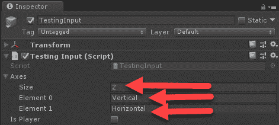

设置要覆盖的轴

4.  我们需要定义两个想要覆盖的轴。在这种情况下，我们只覆盖**垂直** ( *S* 和 *W* )和**水平** ( *A* 和 *D* )键。当然，您可以覆盖您想要的任何轴，但是在这种情况下，我们只覆盖两个轴。
5.  保存项目和场景。

此时，您不能真正运行项目，因为实际的输入系统还没有覆盖任何东西。我们在下一节中完成最后一次注入。


# 覆盖游戏输入

此时，我们已经有了一个完整的测试系统；我们只需要完成注射的最后部分。这种手术可能需要敏锐的眼光和一点代码挖掘。幸运的是，有一些好的、清晰的指标，你可以用它们来确定注射的位置。打开编辑器，按照下面的步骤完成注射:

1.  在**层次**窗口中选择**控制**对象。
2.  在**检查器**窗口中找到 **MS 场景控制器自由**组件，并使用**上下文**菜单在您的代码编辑器中打开脚本。
3.  在第 **286** 行(大约在中间)找到下面的代码块，如下所示:

```
case ControlTypeFree.windows:
  verticalInput = Input.GetAxis (_verticalInput);
  horizontalInput = Input.GetAxis (_horizontalInput);
  mouseXInput = Input.GetAxis (_mouseXInput);
  mouseYInput = Input.GetAxis (_mouseYInput);
  mouseScrollWheelInput = Input.GetAxis (_mouseScrollWheelInput);
  break;
}
```

4.  这是游戏查询`GetAxis`方法的地方，以便返回相应输入轴的值。正如我们已经讨论过的，对于这个例子，我们只对纵轴和横轴感兴趣。当然，如果您认为合适，您可以覆盖其他轴。
5.  修改正在设置`verticalInput`和`horizontalInput`的行，如下所示:

```
verticalInput = TestingInput.Instance.getAxis(_verticalInput);
horizontalInput = TestingInput.Instance.getAxis(_horizontalInput);
```

6.  注意，我们调用了`TestingInput.Instance`，以便访问我们类的单例实例。这允许我们查询该类的当前输入值。相对于输入,`TestingInput`对象现在可以成为真理的来源(就这个类而言)。

7.  之前，我们快速浏览了设置输入的代理代码，但这里再次供参考:

```
public void MoveAgent(float[] act)
{
  for(int i=0;i<act.Length;i++)
  {
    var val = Mathf.Clamp(act[i], -1f, 1f);
    TestingInput.Instance.setAxis(val,axisAction[i]);
  } 
}
```

注意在`TestingAgent` `MoveAgent`方法中高亮显示的行。这是我们覆盖代理的输入并将值注入游戏的地方。

8.  保存代码并返回编辑器。请确保现在修复任何编译器问题。
9.  不幸的是，我们仍然无法运行场景，因为我们还有最后一个配置步骤要做。在下一节中，我们将通过设置大脑来完成配置。

配置所需的大脑


# 拼图的最后一块是配置我们之前快速构建的大脑。ML-Agents 要求大脑配置所需的输入和观察空间，以便正确工作。我们将在下一个练习中设置`TestingPlayerBrain`和`TestingLearningBrain`:

打开 Unity 编辑器，从 **HoDLG | Brains** 文件夹中选择 **TestingLearningBrain** ，在**检查器**中打开。

1.  设置**脑**参数，如下截图所示:

2.  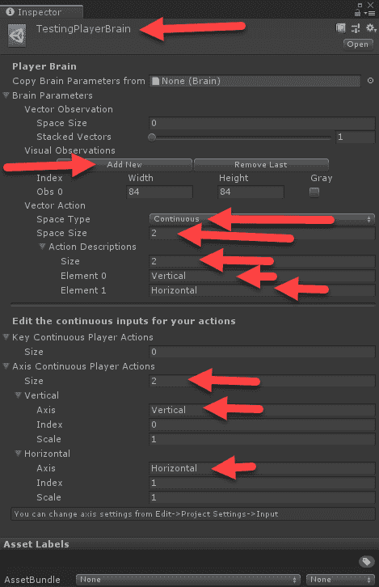

设置 TestingPlayerBrain 的参数

有几个参数需要设置；它们总结如下:

3.  **目测** : `84` x `84`无灰度
    *   **矢量动作**:
    *   **空间类型**:连续
        *   **空间大小** : `2`
        *   **动作描述:**
        *   **尺寸** : `2`
            *   **元素 0** :垂直
            *   **Elem**ent 1:水平
            *   **轴连续玩家动作**:
    *   **尺寸** : `2`
        *   **垂直:**
        *   **轴**:垂直
            *   **索引** : `0`
            *   **刻度** : `1`
            *   **水平:**
        *   **轴**:水平
            *   **索引** : `1`
            *   **刻度** : `1`
            *   选择 **TestingLearningBrain** 并对其进行相同的配置，但用于学习，如下图所示:

4.  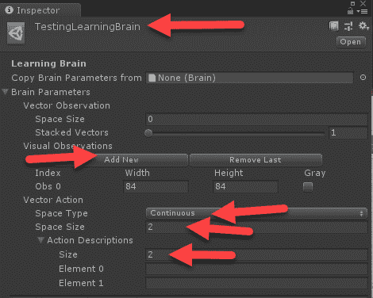

配置测试学习大脑

学习大脑的配置要简单得多，但是它仍然是必需的，即使是在播放器模式下运行示例时也是如此(如果您还记得的话，它就是这样设置的)。

5.  保存场景和项目。最后，我们已经完成了所需的配置。
6.  按 Play 运行场景，在玩家模式下玩游戏。我们通过 ML-Agents 系统来控制游戏。几秒钟后，您应该会看到附近有一些目标掉落。
7.  控制车辆，驶入一个目标，如以下截图所示:

8.  

朝着目标前进

当你玩够了，停止游戏。

9.  现在我们已经能够通过使用配置好的玩家大脑通过 ML-agent 来玩游戏了，在下一节中，我们将切换到学习大脑，让 agent 来控制游戏。

Now that we are able to play the game through ML-Agents by using a configured player brain, we will switch to a learning brain and let an agent take control in the next section.

训练时间到了


# 然而，我们决定使用这个平台，无论是用于训练还是测试，我们现在需要做最后的大脑配置步骤，以便设置我们可能决定用于训练的任何自定义超参数。打开一个 Python/Anaconda 控制台，并为培训做好准备，然后按照以下步骤操作:

打开位于`ML-Agents/ml-agents/config`文件夹中的`trainer_config.yaml`文件。

1.  我们将在配置文件中添加一个新的配置部分，模仿其他可视化环境之一。添加新配置，如下所示:
2.  请注意，我们添加了单词`brain`，以便与其他大脑区分开来。这个大脑是以我们之前花了一些时间探索的`VisualHallwayBrain`为模型的。但是，请记住，我们现在正在运行一个连续动作问题，这可能会影响一些参数。

```
TestingLearningBrain:
    use_recurrent: true
    sequence_length: 64
    num_layers: 1
    hidden_units: 128
    memory_size: 256
    beta: 1.0e-2
    gamma: 0.99
    num_epoch: 3
    buffer_size: 1024
    batch_size: 64
    max_steps: 5.0e5
    summary_freq: 1000
    time_horizon: 64
```

3.  保存文件并返回 Unity 编辑器。
4.  找到`TestingAcademy`对象，将它的`Brains`换成`TestingLearningBrain`，并将其设置为`Control`，就像你之前多次做的那样。
5.  保存场景和项目并返回 Python/Anaconda 控制台。

6.  通过运行以下命令启动培训/学习/测试会话:
7.  观看培训课程，代理玩游戏。代理会运行，根据你训练的时间长短，它可能会变得善于寻找目标。

```
mlagents-learn config/trainer_config.yaml --run-id=testing --train
```

8.  在这一点上，你可以让代理去，只是通过自己的水平运行，探索。然而，我们想要做的是通过使用模仿学习来控制或推动测试代理走上正确的道路，这将在下一节中讨论。

通过模仿进行测试


# 在您学习的这一点上，您已经学习了一些策略，我们可以应用这些策略来帮助我们的测试代理学习和找到目标。我们可以很容易地利用好奇心或课程学习，我们将把它作为读者的练习。我们想要的是一种控制一些测试过程的方法，我们并不真的希望我们的代理随机测试一切(至少在现阶段不是)。当然，有些地方完全随机测试效果很好。(顺便说一下，这种随机形式的测试被称为**猴子测试**，因为它类似于猴子敲击键盘或输入。)然而，在像我们游戏这样的空间里，探索每一种可能的组合可能需要很长时间。因此，最好的替代方案是捕获玩家录音，并将其用于我们的测试代理，作为模仿学习的来源。

随着一切的设置和我们现在通过 ML-agent 路由输入事件的能力，我们可以以 agent 需要学习的形式捕获玩家输入。让我们打开一个备份 Unity 并设置场景来捕捉球员录像，如下所示:

在**层级**窗口中选择**车辆 2** 对象。回想一下，这是附加**测试代理**脚本的地方。

1.  使用 **Inspector** 窗口底部的 **Add Component** 按钮向代理添加一个**演示记录器**组件。
2.  将**演示 Record**r 设置为 **Record** ，将**演示 Nam** e 设置为 **Testing** ，将 brain 改为 **TestingPlayerBrain** ，如下图所示:

3.  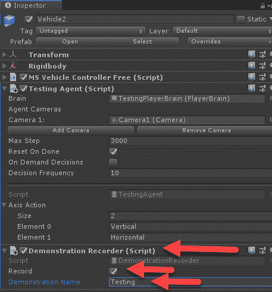

向代理添加演示记录器

选择 **TestingAcademy** 对象，确保禁用**脑**上的**控制**选项。我们希望播放器在录制时控制代理。

4.  按播放并运行游戏。使用键盘上的 *WASD* 控制键驾驶车辆越过目标。播放一会儿，以便生成一个像样的录音。
5.  完成后，在`Assets`文件夹中查找一个名为`Demonstrations`的新文件夹，其中包含您的`Testing.demo`记录文件。
6.  现在，播放播放器录音，我们可以设置和运行代理，使用模仿学习来测试水平。

配置代理使用 IL


# 我们已经完成了设置和运行离线**模仿学习(IL)** 会话的过程，但是让我们在下一个练习中回顾一下这个过程:

打开同一个项目的 Unity 编辑器，找到包含代理的 **Vehicle2** 对象。

1.  将代理的大脑从**测试玩家大脑**切换到**测试学习大脑**。
2.  选择**测试学院**并启用**测试学院|大脑**组件属性上的**控制**属性。
3.  保存场景和项目。
4.  在文本或代码编辑器中打开`config/offline_bc_config.yaml`文件。
5.  增加以下部分(修改后的`HallwayLearning`):
6.  完成编辑后保存文件。

```
TestingLearningBrain:
    trainer: offline_bc
    max_steps: 5.0e5
    num_epoch: 5
    batch_size: 64
    batches_per_epoch: 5
    num_layers: 2
    hidden_units: 128
    sequence_length: 16
    use_recurrent: true
    memory_size: 256
    sequence_length: 32
    demo_path: ./UnitySDK/Assets/Demonstrations/Testing.demo
```

7.  打开一个准备好进行训练的 Python/Anaconda 控制台，输入以下命令:
8.  注意一些修改，用粗体突出显示。培训开始后，观察代理以您训练它的相同方式驾驶汽车(或者至少，它会尝试)。

```
mlagents-learn config/offline_bc_config.yaml --run-id=testing_il --train
```

9.  让代理玩这个游戏，观察它的表现和/或遇到的麻烦。
10.  Let the agent play the game, and watch how well it performs and/or gets into trouble. 

这个演示/游戏相当稳定，不容易出现任何明显的问题，这使得测试它的明显问题变得困难。然而，希望你能意识到，如果这种类型的系统在游戏的早期实现，即使只是为了测试，它也能提供快速发现 bug 和其他问题的能力。当然，目前，我们识别任何问题的唯一方法是观看代理播放，这并不能节省我们任何时间。我们需要的是一种跟踪代理活动并确定代理是否(以及何时)发现自己有麻烦的方法。幸运的是，我们可以通过添加分析来轻松添加这种形式的跟踪，这将在下一节中介绍。

分析测试过程


# ML-Agents 目前缺少的一个关键功能是额外的训练分析(超出了控制台和 TensorBoard 提供的内容)。一个至关重要(也不难添加)的关键特性是训练分析。这可以通过 Unity Analytics 服务来实现，该服务可以免费试用于所有游戏。由于这不是 ML-Agents 的当前功能，因此我们将在下一个练习中通过添加我们自己的培训分析系统来添加这一功能:

打开 Unity 编辑器，从菜单中选择**窗口|通用|服务**。这将打开一个名为**服务**的新窗口，通常位于**检查员**窗口的上方。

1.  在新打开的**服务**窗口中点击**分析**服务。您需要进入几个屏幕，询问您的偏好和确认，如下图所示:
2.  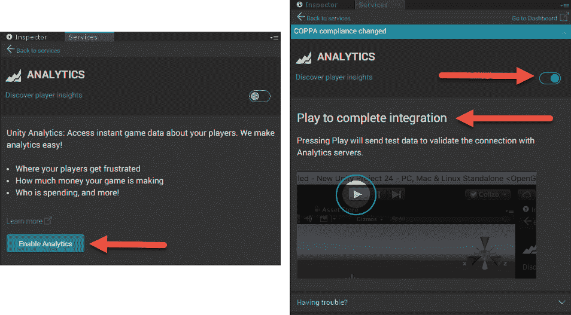

为您的项目设置分析

点击按钮启用**谷歌分析**。然后选择**发现**玩家洞察开关，会提示您在编辑器中按**播放**。

3.  在编辑器中按 **Play** ，让游戏只运行几秒钟。
4.  返回服务窗口和分析页面，在顶部，您应该会看到一个名为**转到仪表板**的按钮。点击按钮，如下图所示:

5.  使用仪表板浏览您的数据

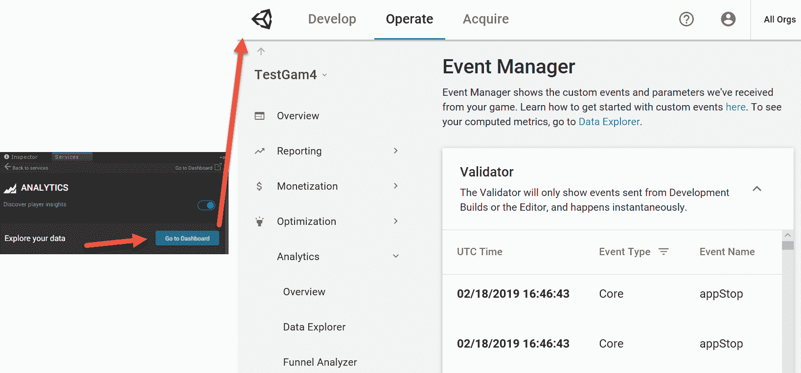

这将打开您的默认 web 浏览器到您的项目分析页面，您应该看到一些事件，如 **appStart** 和 **appStop** 。

6.  这就完成了分析服务的设置，正如您所看到的，这非常简单。然而，与所有事情一样，我们需要定制一些将发送给分析服务的报告数据。在下一节中，您将了解如何发送您自己的定制分析。

发送自定义分析


# 如果您以前使用过分析服务，您可能有自己的最佳实践来跟踪您的游戏使用情况；如果是这样，请随意使用。我们将在这里介绍的方法旨在作为一个开始，告诉你如何设置和发送自定义分析用于训练，甚至用于跟踪球员的使用。

If you have used the analytics service previously, you may have your own best practices for how to track your game usage; if so, feel free to use that. The method that we will present here is intended as a start for how you can go about setting up and sending custom analytics for training, or even for tracking player usage.

让我们首先打开 Unity 编辑器，然后进行下一个练习:

在`HoDLG` `Scripts`文件夹中创建一个名为`TestingAnalytics`的新 C#脚本。

1.  在编辑器中打开并编辑`TestingAnalytics`脚本，输入以下代码:
2.  这些代码所做的就是收集目标的当前位置以及它们离代理有多近。这是我们目前关心的问题。另外，请注意，我们将它设为**公共属性，**，这样就可以像方法一样调用它，而不仅仅是字段。这在以后会很重要。

```
using UnityEngine;

namespace Packt.HoDLG
{
 public class TestingAnalytics : Singleton<TestingAnalytics>
 {
 private TestingAcademy academy;
 private TestingAgent[] agents;
 private void Start()
 {
 academy = FindObjectOfType<TestingAcademy>();
 agents = FindObjectsOfType<TestingAgent>();
 }
 public string CurrentGameState
 {
 get
 {
 var state = string.Empty;
 foreach (var agent in agents)
 {
 foreach (var goal in academy.goals)
 {
 var distance = Vector3.Distance(goal.transform.position, agent.transform.position);
 state += agent.name + " distance to goal " + distance + "/n";
 }
 }
 return state;
 }
 }
 }
}
```

3.  保存文件并返回编辑器。确认没有编译器错误。
4.  在场景中创建新的空游戏对象，并将其命名为`TestingAnalytics`。将新的`TestingAnalytics`脚本拖到对象上，将其设置为场景组件。虽然这个类是单例的，但是我们仍然希望将它作为一个依赖项添加到场景中(本质上，作为一个提醒)。然而，我们也可以用另一个技巧来编程预置。

5.  将 **TestingAnalytics** 对象拖到 **HoDLG | Prefabs** 文件夹中。这将使对象成为一个预设，现在所有其他预设都可以访问它。
6.  双击位于 **HoDLG | Prefabs** 文件夹中的**目标**预设，在它自己的迷你编辑器中打开对象。
7.  使用**添加组件**按钮将**分析事件跟踪器**组件添加到对象中并进行配置，如以下截图所示:
8.  

设置分析事件跟踪器

按如下方式配置组件:

9.  **何时**:生命周期
    *   **生命周期事件**:销毁时
    *   **发送事件:**
    *   **名称**:目标破坏事件
        *   **参数:1/10:**
        *   **名称**:状态
            *   **值**:动态
            *   对象:测试分析(预设)
            *   **方法**:当前游戏状态
            *   通过改变学院和代理配置，将场景切换回玩家模式。
10.  保存场景和项目。
11.  按下**播放**运行场景，驶过一个目标。当你达到目标时，检查**分析**仪表板并注意事件是如何被跟踪的。
12.  在这个阶段，分析仅报告目标何时被破坏，并且他们报告每个代理离目标有多近。因此，对于一个代理人和三个目标，他们会报告三个距离，当一个目标被开车撞毁时或当物体被重置时。通过跟踪这些统计数据，您可以大致了解每个代理测试会话的总体进展情况，是好是坏。当然，你可以添加任何你想要的分析方式；很容易忘乎所以。谁知道；在未来，Unity 可能会提供一个由 ML-Agents 驱动的自我测试平台，提供测试分析。

我们即将结束另一个章节，当然，我们正在接近你最喜欢的部分，练习。

练习


# 本章中的练习混合了使用 ML-agent 和构建自己的测试分析平台。因此，从下面的列表中选择一两个对你自己来说有意义的练习:

配置**测试代理**使用不同的摄像机进行视觉观察输入。

1.  启用**好奇心学习**对代理的大脑。
2.  设置**测试代理**来控制不同的车辆。
3.  Set up the **TestingAgent** to control a different vehicle.

设置**测试代理**在另一辆车上运行，并让 ML-Agents 同时控制两个代理。

4.  为代理添加附加跟踪分析自定义事件。也许可以跟踪代理运行的距离与其生命周期的关系。这将提供一个速度系数，也可以表示代理的效率。更快达到目标的代理将具有更好的速度系数。
5.  通过添加带有学习代理的第二台车辆，实现在线模仿学习。如果需要的话，回过头来回顾一下网球场景的设置。
6.  建立学院以利用课程学习。也许允许虚拟目标部署框的大小随着训练迭代而增长(增长 10%，或者其他因素)。这将使目标分散得更远，使代理更难找到。
7.  将大脑正在使用的视觉观察输入修改为新标准`184` x `184`，看看这对代理训练有什么影响。
8.  修改视觉观察卷积编码网络，就像我们在[第 7 章](9b7b6ff8-8daa-42bd-a80f-a7379c37c011.xhtml)、*代理和环境*中所做的那样，使用更多的层和/或不同的过滤。
9.  将这个测试框架应用到你自己的游戏中。一定要添加分析，这样你就可以跟踪训练和球员的使用。
10.  这些练习比前几章更复杂，因为这是一个大而重要的章节。在下一节中，我们将回顾您在本章中学到的内容。

摘要


# 在这本书的所有章节中，如果你正在开发自己的游戏，这可能是最有用的。游戏测试是需要花费大量时间和精力的事情之一，它需要某种形式的自动化。虽然对于 DRL 来说，在这方面做得很好对于几乎任何游戏来说都是有意义的，但这是否是这种新的学习现象的利基之一还有待观察。然而，有一件事是肯定的，那就是 ML-Agents 不仅仅是一个测试工具，我们确信它只会随着时间的推移而变得更好。

Of all the chapters in this book, this may be the most useful if you are in the process of developing your own game. Game testing is one of those things that requires so much time and attention, it has to be up for some form of automation. While it makes sense for DRL to work well in this area for almost any game, it remains to be seen whether that is one of the niches for this new learning phenomena. One thing that's for sure, however, is that ML-Agents is more than capable of working as a testing harness, and we are sure that it will only get better over time.

在这一章中，我们看了如何建立一个通用的测试平台，由 ML-Agents 提供支持，我们可以用它来自动测试任何游戏。我们首先查看了我们需要调整的每个组件，学院和代理，以及如何将它们一般化以进行测试。然后，我们看了看如何注入到 Unity 输入系统中，并使用我们的`TestingAgent`来覆盖游戏的输入，并学习如何自己控制它。之后，我们研究了如何通过使用离线 IL 和录制一个演示文件来更好地设置我们的测试，稍后我们可以使用这个演示文件来培训代理。最后，为了看看我们的测试做得如何，我们添加了分析，并根据我们的需要对它们进行了定制。

下一章将是我们的最后一章，也是我们最后一次讨论游戏的深度学习；恰当地说，我们将看看军情六处和 DRL 的未来。

The next chapter will be our final chapter and our last discussion of deep learning for games; appropriately enough, we will look at what the future holds for ML-Agents and DRL.