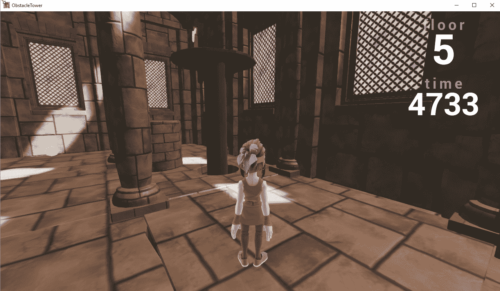

# 十三、障碍塔挑战和超越

在这一章，我们的最后一章，我们将看看游戏用的**深度学习** ( **DL** )和**深度强化学习** ( **DRL** )的现状和未来状态。我们以诚实坦率的态度来看看这些技术是已经为黄金时段的商业游戏做好了准备，还是仅仅是新奇的东西。几年后，我们会看到 DRL 特工在任何可以想象的游戏中击败人类玩家吗？虽然这仍有待观察，事情正在迅速变化，但问题是:DL 准备好你的游戏了吗？这可能是你此刻正在问自己的一个问题，也是我们希望在本章中回答的一个问题。

本章将包括动手练习和一般性讨论，遗憾的是没有练习。有一个很大的练习，但是我们很快就会讲到。以下是我们将在本章中介绍的内容:

*   团结障碍塔挑战
*   为你的游戏深度学习？
*   构建您的游戏
*   更多的学习基础

为了理解上下文，本章假设你已经完成了本书中的大量练习。为了提醒读者，我们将参考那些章节，但请不要先跳到这一章。

# 团结障碍塔挑战

**Unity 障碍塔挑战赛**于 2019 年 2 月作为离散视觉学习问题推出。正如我们之前看到的，这是游戏、机器人和其他模拟学习的圣杯。更有趣的是，这个挑战是在 ML-Agents 之外引入的，要求挑战者从头开始编写自己的 Python 代码来控制游戏——这是我们在本书中已经接近学会如何做的事情，但我们省略了技术细节。相反，我们把重点放在调整超参数、理解奖励和智能体状态的基础上。如果你决定应对高塔挑战，所有这些基础知识都会派上用场。

在写这本书的时候，用于开发的 ML-Agents 版本是`0.6`。如果你已经完成了所有的练习，你会注意到，所有使用离散动作空间的视觉学习环境都存在渐变消失或爆炸的问题。你将看到的是智能体基本上什么也没学到，只是执行随机的动作；这通常需要几十万次迭代才能看到。但是在使用向量观测的较小状态空间的环境中，我们看不到这个问题。然而，在具有大量输入状态的视觉环境中，这个问题经常出现。这意味着，本质上，无论如何在写作的时候，你都不会想要使用 Unity 代码；它目前对离散动作的视觉学习能力很差。

在撰写本文时，Unity 障碍塔挑战赛刚刚开始，早期指标已经在报告中。谷歌目前领先的算法 DeepMind，毫不奇怪，是一种叫做**彩虹**的算法。简而言之，彩虹是许多不同的 DRL 算法和技术的顶点，所有这些算法和技术结合起来，以更好地学习离散动作视觉学习空间，这是塔很好地定义的。

现在我们已经确定您可能想要编写自己的代码，我们将了解您的智能体需要解决的高级关键部分。可能需要另一本书来解释如何进行编码和其他技术方面的工作，所以我们将讨论总体挑战和您需要解决的关键要素。此外，获胜者很可能需要使用更多的概率方法来解决问题，而这目前在任何地方都没有得到很好的解决。

让我们设置挑战，并在下一个练习中运行它:

1.  从 https://github.com/Unity-Technologies/obstacle-tower-env 的[下载障碍塔环境的二进制文件。](https://github.com/Unity-Technologies/obstacle-tower-env)
2.  按照说明，按照指示下载适合您的环境的 zip 文件。在大多数系统上，这只需要下载文件并解压到一个文件夹中，您将在以后执行。
3.  将文件解压缩到一个已知的文件夹中。

4.  双击程序(Windows)启动程序，在控制台中输入名称。在你发起挑战后，你就可以像人类一样玩了。玩游戏，看看你能爬多少层楼。下面的屏幕截图显示了跑步挑战的示例:

玩家模式下的障碍塔挑战

随着游戏的进展，你首先会学到的一件事是，游戏开始时非常简单，但在后面的几层，它变得非常困难，即使对一个人来说也是如此。

现在，正如我们提到的，解决这个挑战远远超出了本书的范围，但希望你现在可以理解目前扼杀深度强化学习领域的一些复杂性。我们在下表中回顾了您在采用此方法时将面临的主要挑战:

| **问题** | **第**章 | **当前** **状态** | **未来** |
| 视觉观察状态——您将需要构建一个足够复杂的 CNN 和可能的循环网络，以便在视觉状态中编码足够多的细节。 | [第七章](9b7b6ff8-8daa-42bd-a80f-a7379c37c011.xhtml)、*智能体与环境* | 目前的 Unity 视觉编码器是远远不能接受的。 | 幸运的是，CNN 和循环网络一直在做大量的视频分析工作。记住，你不只是想捕捉静态图像；您还需要对图像序列进行编码。 |
| DQN、DDQN 或彩虹 | [第五章](6ca7a117-1a8c-49f9-89c0-ee2f2a1e8baf.xhtml)、*介绍 DRL* | 彩虹是目前最好的，它可以在 GCP 买到。 | 正如我们在本书中看到的，PPO 只在连续动作空间上表现良好。为了解决离散的行动空间，我们回头看更基本的方法，如 DQN 或新人彩虹，这是所有基本方法的总和。我们还将讨论进一步使用深度概率方法的未来方式。 |
| 内在报酬 | [第九章](ae184eca-6c9d-456e-a72b-85274ddcc10c.xhtml)，*奖励和强化学习* | 内在奖励系统的使用显示了探索的前景。 | 能够引入内在奖励系统，如**好奇心学习**允许智能体基于某种状态期望探索新环境。这种方法对于任何计划到达塔的更高层的算法都是必不可少的。 |
| 谅解 | [第六章](b422aff5-b743-4696-ba80-e0a222ea5b4d.xhtml)， *Unity ML-Agents* | Unity 提供了一个优秀的样本环境来构建和测试模型。 | 你可以很容易地在 Unity 中建立并测试一个相似的环境，而且速度很快，而且是你自己的。难怪 Unity 从未将原始的 Unity 环境作为项目发布。这很有可能是因为这将吸引许多新手，认为他们只需训练就能克服这个问题。有时候，训练并不能解决问题。 |
| 稀疏的奖励 | [第九章](ae184eca-6c9d-456e-a72b-85274ddcc10c.xhtml)、*奖励和强化学习*[第十章](1525f2f4-b9e1-4b7f-ac40-33e801c668ed.xhtml)、*模仿和迁移学习* | 可以实现课程或模仿学习。 | 我们已经讨论了许多管理稀疏回报问题的方法。看看赢家在多大程度上依赖这些方法中的一种(如 IL)来获胜，将是一件有趣的事情。 |
| 离散动作 | [第八章](1393797c-79cd-46c3-8e43-a09a7750fc92.xhtml)、*了解 PPO* | 我们学习了 PPO 如何允许连续动作问题学习，使用随机方法。 | 正如我们之前提到的，很可能需要新的更深入的概率方法和技术来解决当前的一些问题。这可能需要开发使用新算法的新技术，这需要多长时间还有待观察。 |

为了让 1 楼到 100 楼的智能体完成整个挑战，上表中突出显示的每个问题都可能需要部分或全部解决。这将如何影响团结工会，胜利者，以及整个 DRL，还有待观察。在下一节中，我们将讨论 DL 和 DRL 的实际应用，以及如何在你的游戏中使用它们。

# 为你的游戏深度学习？

你拿起这本书的原因很可能是为了了解游戏的 DL 和 DLR，希望得到你梦想中的工作或完成你梦想中的游戏。无论是哪种情况，我们都需要你来决定这项技术是否值得包含在你自己的游戏中，以及包含到什么程度。以下是十个问题，你可以用它们来判断 DL 是否适合你的游戏:

1.  你是否已经做出决定，需要与 DL 或 DRL 合作开发这个游戏？
    *   是–10 分
    *   否–0 分
2.  通过测试或管理重复的玩家任务，你的游戏会从某种形式的自动化中受益吗？
    *   是–10 分
    *   否–0 分
3.  要不要让训练和 AI 或者另一个类似的活动成为游戏的一部分？
    *   是-(-5)分。使用更强大的人工智能来模拟训练可能会更好。训练 DRL 需要太多的迭代和样本，作为一个在线游戏训练工具是无效的，至少现在是这样。
    *   否–0 分。
4.  你希望尖端的人工智能出现在你的游戏中吗？
    *   是的-10 分。当然有办法将人工智能技术分层，让 DRL 的解决方案发挥作用。说到当前的人工智能，真的没有更好的前沿技术了。
    *   否–0 分。
5.  你有几个小时的时间来训练一个人工智能吗？
    *   是–10 分
    *   否-(-10)分
6.  你读过这本书的大部分内容，并且至少完成了一些练习吗？
    *   是–10 分，如果您完成了 50%以上，则加 5 分
    *   否—(-10)分；谢谢你的坦诚
7.  你有数学背景或爱好吗？
    *   是–10 分
    *   否-(-10)分

8.  你读过多少学术层面上关于强化学习的论文？
    *   10+–25 分
    *   5-10-10 分
    *   1–5–5 分
    *   0–0 分
9.  你的完成时间表是什么？
    *   1-3 个月–(-10)分
    *   3-6 个月-0 分
    *   6-12 个月-10 分
    *   1-2 年以上-25 分
10.  你的团队有多少人？
    *   单人–(-10)分
    *   2–5–0 分
    *   6-10-10 分
    *   11+–25 分

回答所有问题并记录您的分数，以确定您的完整准备度分数。请参考以下内容，以确定您和/或您的团队准备就绪的程度:

*   **< 0 分**——你是怎么在书中做到这一步的？你还没准备好，你最好把这本书放下。
*   **0-50** -你的确很有前途，但是你会需要更多的帮助；查看下一部分，了解后续步骤和进一步的学习领域。
*   你肯定正在建立知识库，并在游戏中实现一些有趣的 DRL，但你可能仍然需要一些帮助。查看关于后续步骤和进一步学习领域的部分。
*   你早就准备好了，我们感谢你花时间阅读这本书。也许花一些你自己的时间，把你自己或你的团队成员的知识传递给你认识的人。

当然，前面测试的结果没有绝对的规则，你可能会发现你的分数很低，但随后会继续开发下一个伟大的 AI 游戏。如何实现结果取决于你，如何采取下一步行动也完全取决于你。

在下一节中，我们将看看你可以采取的下一步措施，以了解更多关于 DRL 以及如何在游戏中构建更好的自动化和人工智能。

# 构建您的游戏

既然你已经决定在你的游戏中使用深度学习和/或深度强化学习，那么是时候决定你计划如何在你的游戏中实现各种功能了。为了做到这一点，我们将通过一个表格来概述您需要通过的步骤，以建立您的游戏的人工智能智能体:

| **步骤** | **动作** | **总结** |
| 开始 | 确定你希望游戏中的人工智能在什么水平上运行，从基本的，也许只是测试和简单的自动化，到高级的，人工智能将完成与玩家的对抗。 | 决定 AI 的水平。 |
| 资源配置 | 确定资源的数量。基本的人工智能或自动化可以在团队内部处理，而更复杂的人工智能可能需要一个或多个有经验的成员。 | 团队要求。 |
| 知识 | 确定团队拥有的知识水平以及需要什么。众所周知，任何实现新人工智能的团队都需要学习新的技能。 | 知识差距分析。 |
| 示范 | 总是从构建一个简单但可行的概念证明开始，展示系统的所有关键方面。 | 展示团队可以完成的基本前提。 |
| 履行 | 以简单和可维护的方式构建实际的系统。保持所有你知道的东西简单干净。 | 构建系统。 |
| 测试 | 反复测试系统。对系统进行彻底的测试是至关重要的，当然还有比 DRL 自动化测试系统更好的方法。 | 测试系统。 |
| 固定 | 任何开发软件超过几周的人都会告诉你，这个过程就是构建、测试、修复和重复。这本质上是软件开发过程，所以尽量不要添加太多其他的花里胡哨的东西来分散注意力。 | 修复系统。 |
| 释放；排放；发布 | 向用户/玩家发布软件对于任何类型的成功游戏或软件产品来说都是至关重要的。你总是希望尽早发布，这意味着你的玩家必须被鼓励去测试，并提供反馈。 | 把虫子放出来。 |
| 重复 | 这个循环是无止境的，只要你的产品/游戏赚钱，这个循环就会持续下去。 | 支持系统。 |

前面的过程是基本前提，可以满足您的大部分开发需求。在大多数情况下，您可能希望跟踪单个工作项，例如工作或任务板上的功能或错误。你可能想使用更明确的过程，比如 Scrum，但是通常保持事情简单是你最好的行动方针。

Scrum 和其他软件开发过程是很好的学习范例，但是除非你有经过正式培训的员工，否则最好避免自己去实现它们。在这些过程中，通常有一些微妙的规则需要强制执行，以使它们像它们所声称的那样工作。即使是训练有素的 Scrum 大师也可能需要每天为在许多组织中执行这些规则而战斗，最终他们的价值变得更受管理驱动，而不是以开发人员为中心。使用前面的表格作为构建下一个游戏的步骤指南，永远记住构建、发布、修复和重复是好软件的关键。

在下一部分，我们将看看你可以用来扩展你的学习的其他东西。

# 更多的学习基础

有越来越多的资源可以用来学习机器学习，DL，当然还有 DLR。清单变得非常大，有许多材料可供选择。出于这个原因，我们现在将总结我们认为最有希望为游戏开发 AI 和 DL 的领域:

*   **基础数据科学课程**:如果你从未上过数据科学的基础课程，那么你当然应该上。理解数据质量、统计、概率和可变性的基础不胜枚举。一定要先盖好这个底子。
*   **概率规划**:这是各种变分推理方法的组合，通过给定事件概率和某个事件可能发生的概率来回答问题。这些类型的模型和语言已经被用于分析金融信息和风险很多年了，但它们现在正成为 ML 技术的前沿。
*   **深度概率规划**:这是变分推理和 DL 模型的结合。变分推理是这样一个过程，在给定可能的多个概率的输入的情况下，你用一个概率回答一个问题。因此，我们不使用一系列权重来训练网络，而是使用一系列概率分布。这种方法已经被证明是非常有效的，并且最近已经使用改进的概率 CNN 模型执行了视觉图像分类任务。
*   **视觉状态分类和编码**:DL 系统的一个关键方面是开发 CNN 模型来对图像进行分类。你需要很好地理解这个空间，以便为你的游戏环境建立网络。回想一下，不同的环境可能需要 CNN 模型。
*   **记忆**:记忆当然可以以各种形式出现，但是最主要的一种是**循环神经网络** ( **RNN** )。在本书的前面，我们看了我们使用的当前标准循环网络模型，称为**长短期记忆** ( **LSTM** ) **块**。甚至在撰写本文时，人们对**门控循环单元** ( **GRU** )又有了新的兴趣，这是一种更复杂的循环网络，已经证明它能更好地处理消失梯度问题。人们总是对云或其他支持的技术以及它们如何与新的 DL 技术交互感兴趣。
*   **DL 即服务**:Google、Amazon、Microsoft、OpenAI 和其他声称完全开放的公司往往与开放相去甚远。在大多数情况下，如果你想将这些技术整合到你的游戏中，你需要订阅他们的服务——这当然有其优缺点。主要的问题是，如果你的游戏变得受欢迎，如果你严重依赖于 DL 服务，你的利润将与它捆绑在一起。幸运的是，Unity 还没有采用这种方法，但这仍有待观察，取决于社区解决障碍塔挑战的难易程度。
*   **数学**:总的来说，无论你是否打算深入构建自己的模型，你都希望不断提高自己的数学技能。最终，你对数学的直觉理解将为你提供克服这些复杂技术所需的洞察力。
*   毅力:学会失败，然后继续前进。这一点很关键，也是许多新开发人员经常感到不满的地方，然后转向更容易、更简单、回报更少的东西。当你失败时要快乐，因为失败是学习理解。如果你从未失败过，那你就真的从未学习过，所以要学会失败。

一本硬编码的学习资源清单很可能在这本书印刷或发行之前就过时了。使用前面的列表来概括您的学习，并拓宽您的基本机器学习和数据科学知识。首先，DL 是一种服务于数据的数据科学追求；永远不要忘记这一点。

在我们最后一章的下一节，我们将总结这一章和这本书。

# 摘要

在这一章中，我们简短地浏览了许多基本概念，包括你在 DL 和 DRL 的下一步；也许你会决定追求团结障碍塔的挑战，并完成它，或者只是在你自己的项目中使用 DRL。我们看了一些简单的测验，以评估你在游戏中投入和使用 DRL 的潜力。在此基础上，我们研究了发展的下一步，最后我们研究了可能需要关注的其他学习领域。

这本书是一个练习，让你了解 DL 在未来应用于你的游戏项目时有多有效。我们在早期探索了基本 DL 原则的许多方面，并研究了更具体的网络类型，如 CNN 和 LSTM。然后，我们研究了如何将这些基本的网络形式应用到驱动和构建聊天机器人的应用程序中。从那里，我们看了当前机器学习算法之王，强化和深度强化学习。然后，我们在几个章节中研究了当前的领导者之一 Unity ML-Agents，以及如何实现这项技术，研究了如何将简单的环境构建成更复杂的多智能体环境。这也让我们能够探索不同形式的内在/外在奖励和学习系统，包括课程、好奇心、模仿和迁移学习。

最后，在结束本章之前，我们完成了一个关于使用 DRL 进行自动测试和调试的长时间练习，增加了使用 IL 作为增强测试方法的选项。