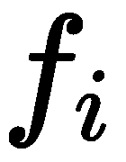
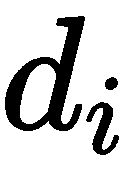
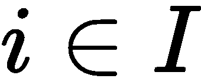
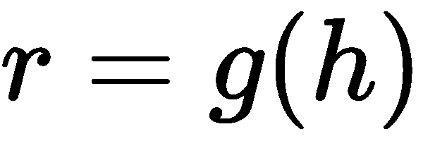
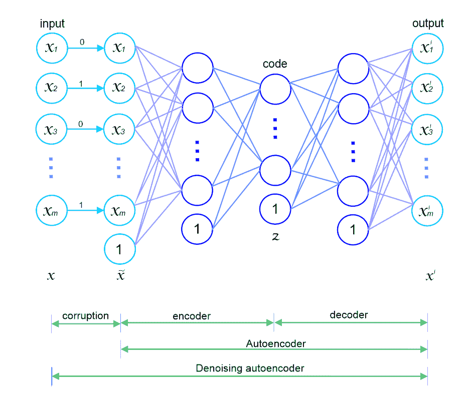
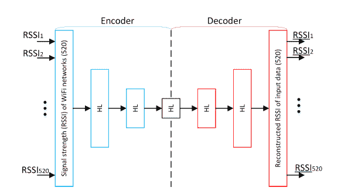
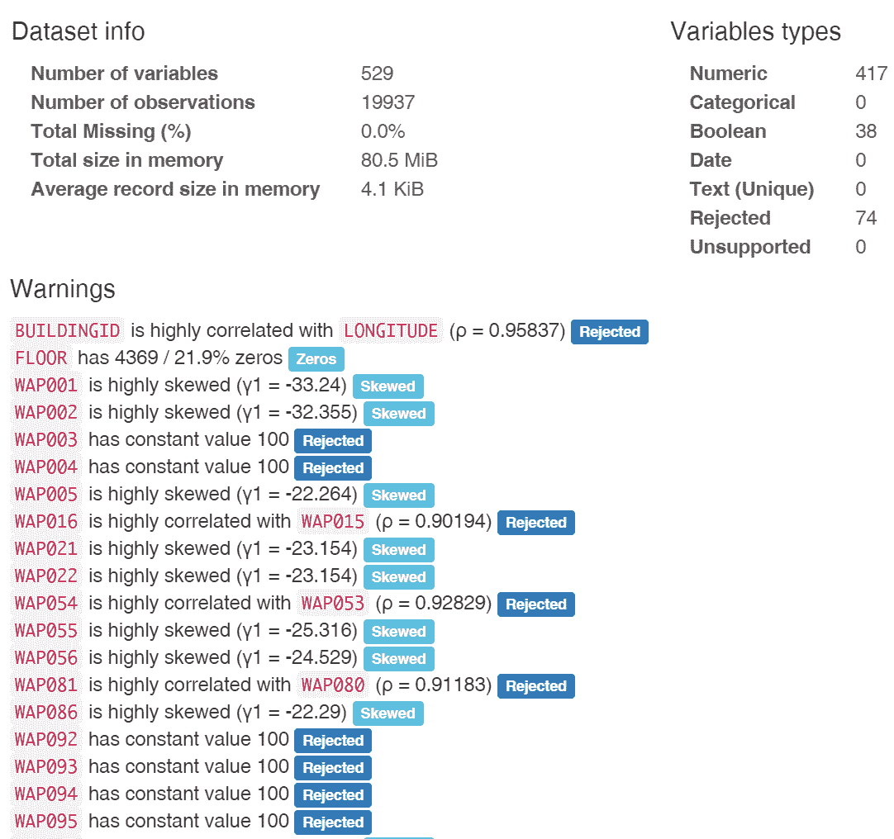
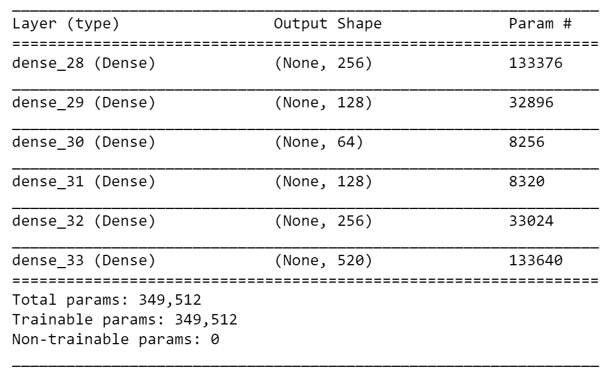
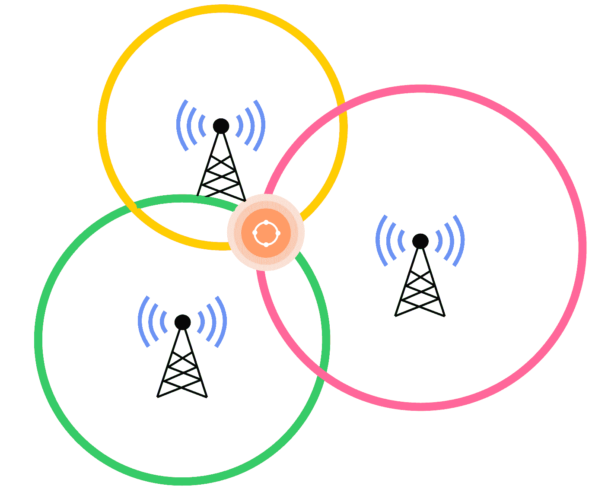
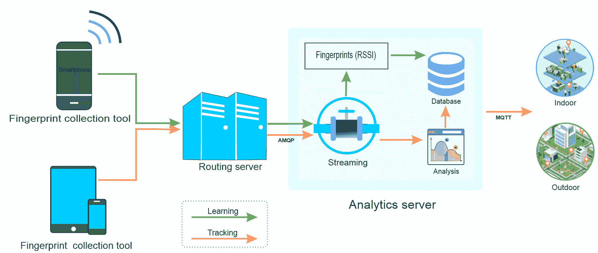

# 物联网室内定位

许多物联网应用，如零售商、智能家居、智能校园和医院的室内导航和位置感知营销，都依赖于室内定位。此类应用生成的输入数据通常来自多种来源，如红外线、超声波、Wi-Fi、RFID、超宽带、蓝牙等。

这些设备和技术的通信指纹(如 Wi-Fi 指纹数据)可以使用 DL 模型进行分析，以预测设备或用户在室内环境中的位置。在这一章中，我们将通过一个实际操作的例子来讨论如何在物联网应用中将 DL 技术用于室内定位。此外，我们将讨论物联网环境中室内定位服务的一些部署设置。本章将简要介绍以下主题:

*   在物联网应用中引入室内定位
*   **深度学习** ( **DL** )用于物联网应用中的室内定位
*   示例–Wi-Fi 指纹识别中的室内定位
*   基于 DL 的室内定位的不同部署选项


# 室内本地化概述

随着移动互联网的快速发展，**基于位置的** **S** **服务** ( **LBS** )在大型公共室内场所越来越受欢迎。在这样的室内位置，**接收信号强度指标** ( **RSSI** )通常被用作物联网设备从**无线接入点**(**WAP**)接收的功率水平的估计值。然而，当与信号源的距离增加时，信号变弱，无线数据速率变慢，导致整体数据吞吐量降低。


# 室内定位技术

迄今为止，基于诸如超声波、红外线、图像、光、磁场和无线信号的测量技术，已经提出了几种室内定位技术。例如，**基于蓝牙低能耗** ( **BLE** )的室内定位已经吸引了越来越多的兴趣，因为它是低成本、低功耗的，并且在几乎每个移动设备上都无处不在。另一方面，Wi-Fi 定位系统基于 Wi-Fi 信号的**信道状态信息** ( **CSI** )。

最近，已经提出了 DL 方法，其中 DL 模型用于学习高维 CSI 信号的指纹模式。尽管每次 Wi-Fi 扫描都包含其附近可用 AP 的信号强度测量值，但只能观察到环境中网络总数的一个子集。

此外，由于这些设备是具有非常小的处理能力的低端设备，在这些方法中使用的不可预测的减弱或增强组合会影响多径信号，这将破坏 RSSI 和传输距离之间的关系，并因此被证明效率较低。另一方面，指纹方法不依赖于距离的恢复，而是仅使用测量的 RSSIs 作为空间模式。因此它不易受到多径效应的影响。


# 指纹识别

通常使用的指纹识别方法有两个阶段:离线阶段和在线阶段。

一个阶段使用指纹数据库来构建位置相关参数，这些参数是从测量的 RSSIs 的参考位置提取的，称为**离线阶段**。在定位阶段，也称为**在线阶段**，使用数据库中最相关的 RSSI 指纹将 RSSI 测量值映射到参考位置，解释如下:


在上式中，是数据库中参考位置的总数，表示参考位置的指纹图案，是该参考位置的空间坐标。指纹模式可以是来自多个信标站的原始 RSSI 值，或者是从 RSSI 中提取的任何其他特征向量，可以表示如下:


然而，在现有的指纹识别系统中，原始 RSSI 值被用作空间模式。在上式中， *m* 是 BLE 信标站或 Wi-Fi 接入点的总数，代表站的实测 RSSI 值。

现在，我们大致知道什么是室内定位了。在下一节中，我们将看到如何使用机器学习和 DL 算法来开发这样一个室内定位系统。

基于 DL 的物联网室内定位


# 现在，如果我们想开发一个 DL 应用程序并部署低端设备，这样的物联网设备将无法处理它们。特别是，处理非常高维的数据将是一个瓶颈。因此，可以使用机器学习算法(如**k-最近邻** ( **k-NNs** )以合理的精度解决室外定位问题，因为在移动设备中包含 GPS 传感器意味着我们现在手头有更多的数据。

然而，室内定位仍然是一个开放的研究问题，主要是由于室内环境中 GPS 信号的丢失，尽管有先进的室内定位技术。幸运的是，通过使用 DL 技术，我们可以以合理的精度解决这个问题，特别是因为使用**自编码器** ( **AEs** )和它们的表示能力可以是一个非常好的变通方法和可行的选择。在这种情况下，我们有两种选择:

在 AE 网络前面添加一个全连接层和一个 softmax 层，它将充当端到端的分类器。

1.  使用任何其他分类算法，如逻辑回归、k-NN、随机森林或支持向量机进行位置估计(即分类)，如下图所示:

2.  

想法是使用 AEs 进行表示学习，以便网络可以很好地学习特征。然后，编码器部分的输出可以用于初始化分类器部分的权重。在下一节中，我们将讨论 k-NN 和 AEs，并了解它们如何用于解决室内定位问题。

k-最近邻分类器


# k-NN 算法是一种非参数方法，可以使用来自物联网设备的指纹数据进行训练。这将尝试将从网关收集的 RSSI 值分类到其中一个参考点，而不是坐标。输入由 k 个最接近的 RSSI 值组成，输出为类成员。然后，输入样本通过其邻居的多次投票进行分类，将该对象分配到其 k 个最近邻居中最常见的类别。

从技术上讲，如果指纹数据库由( *X，y* )组成，其中 *X* 是 RSSI 值， *y* 是已知位置的集合，那么 k-NN 首先计算距离，其中 *x* 是未知样本。然后，它计算一个集合，该集合包含从到 *k* 最小距离的索引。然后，返回的多数标签，其中。换句话说，使用 k-NN，通过计算观测数据和数据库中训练 RSSI 样本的记录之间的相似性来执行分类。最终，在第一个 *k 个*最相似记录中出现次数最多的格网单元就是估计位置，如下图所示:

使用 k-NN 算法定位物联网设备


在上图中，对于 k=4，Wi-Fi 数据包跟踪被分类为在网格 c(绿色三角形)记录中，而当 *k=6* 时，它被分类为在网格 a(红色矩形)中。因此，k-NN 可以被认为是一种懒惰的学习方法，在这种方法中，函数只是局部近似，所有计算都推迟到分类发生时进行。k-NN 算法的好处是它对噪声数据具有鲁棒性。特别地，加权距离的平方反比被用作距离度量。然而，如果它已经在大量的训练数据上训练过，它会表现得很好。

也可能有缺点。比如我们需要确定 *K* 参数值，也就是最近邻的个数。基于所使用的距离度量，它的表现非常不同。使用 k-NN 算法的计算成本相当高，因为需要计算训练数据中每个样本的距离。这在非常高维的数据的情况下变得更加糟糕。在下一节中，我们将使用 k-NN 作为端到端分类器，而不是使用神经网络设置来提供基于 AE 的分类器和 k-NN 分类器之间的比较分析。

声发射分类器


# 正如在[第 2 章](7626c72a-c3b8-4707-96a5-88d524d9f3f7.xhtml)、*物联网深度学习架构*中所述，AEs 是一种特殊类型的神经网络，可以从输入数据中自动学习。AEs 由两部分组成:编码器和解码器。编码器将输入压缩成潜在空间表示。然后，解码器部分尝试从该表示中重建原始输入数据:

**编码器**:使用被称为的函数将输入编码或压缩成潜在空间表示

*   **解码器**:使用被称为的函数从潜在空间表示中解码或重建输入
*   因此，AE 可以用的函数来描述，其中我们希望 *0* 尽可能接近于 *x* 的原始输入。AEs 对于数据去噪和数据可视化的降维非常有用。AEs 可以比 PCA 更有效地学习数据投影，称为**表示**。下图显示了去噪 AE 的架构:



因此，一旦我们手头有了指纹数据库，就可以用原始 RSSI 测量值来训练 AEs，并且训练好的网络本身被用作特定参考位置的指纹模式。由于深度网络可以用每一层的权重来表示，因此指纹图案可以表示如下:


上式中， *l* 为一个 AE 的编码隐层个数，和分别代表编码隐层及其解码镜像层的权重，如下图:


然后，我们可以使用 AE 的中心隐藏层的输出作为完全连接的 softmax 层的输入来预测位置，如上图所示。既然我们知道了室内定位在神经网络或机器学习环境中是如何工作的，我们现在可以开始使用 Wi-Fi 指纹识别的动手示例。

示例–通过 Wi-Fi 指纹识别进行室内定位


# 在本例中，我们将使用一个**多建筑、多层室内定位**数据库和堆叠 AEs 来定位 Wi-Fi 指纹识别。只需很少的努力，这个应用程序就可以部署到移动机器人上，使用 Wi-Fi 定位子系统。

描述数据集


# `UJIIndoorLoc`数据集是一个多建筑、多层室内定位数据库，旨在测试依赖 Wi-Fi 指纹识别的室内定位系统。自动用户定位包括估计用户的位置，例如从移动电话收集的纬度、经度和高度。`UJIIndoorLoc`数据库涵盖了 2013 年通过 20 多名不同用户和 25 台 Android 设备测量的 3 栋 4 层或更多层、近 110，000 平方米的大学建筑。数据库由两个 CSV 文件组成:

`trainingData.csv`:19937 条培训/参考记录

*   `validationData.csv`:1111 条验证/测试记录
*   529 个属性包含 Wi-Fi 指纹和它们被拍摄的坐标。每个 Wi-Fi 指纹可以由检测到的 WAP 和相应的 RSSI 来表征。强度值表示为从 1，04 dBm(极弱信号)到 0 dBm 的负整数值。正值 100 用于表示未检测到 WAP。在数据库创建期间，检测到 520 个不同的 WAP。因此，Wi-Fi 指纹由 520 个强度值组成。坐标的纬度、经度、楼层和**建筑物 ID** 信息是要预测的属性。以下列表给出了数据集的快速摘要:

**属性 001 到 520(即 WAP001 到 WAP520)** :这些是接入点的强度测量值，其值在-104 到 0 和+100 之间。值 100 表示没有检测到 WAP001。

*   属性 521(经度):从 7，695.9，387，549，299，299，000 到-7 之间的负实数值。56866.88668686667
*   **属性 522(纬度)**:4，864，745.7，450，159，714 到 4，865，017.3，646，842，018 的正实值。
*   **属性 523(楼层)**:建筑内楼层高度。从 0 到 4 的整数值。
*   **属性 524 (BuildingID)** :标识建筑物的 ID，作为从 0 到 2 的分类整数值提供。
*   **属性 525 (SpaceID)** :标识空间的内部 ID 号，如办公室、走廊或教室。
*   **属性 526 (RelativePosition)** :相对于空间的相对位置(1—内部，2—外部，门前)。
*   **属性 527 (UserID)** :用户标识符。
*   **属性 528 (PhoneID)** :安卓设备标识符(见下文)。
*   **属性 529(时间戳)**:进行捕获的 UNIX 时间。
*   网络建设


# 我们将使用的 AE 分类器将有一个由编码器和解码器组成的 AE 部分。以下 AE 架构用于确定 Wi-Fi 所在的楼层和建筑位置。AE 的输入是在扫描中检测到的信号强度。然后，每个可见网络的一个值被视为一个 RSSI 记录。解码器的输出是从简化的表示中重建的输入，如下图所示(来源:*使用深度学习的 Wi-Fi 指纹的低努力地点识别*，Michał .等人，arXiv:1611.02049v1):



用于特征空间表示的 AE 架构

分类器部分由两个隐含层组成；根据问题的复杂程度，需要选择神经元的数量。当 AE 的权重的无监督学习完成时，网络的解码器部分被断开。然后，通过将整个网络变成分类器，全连接的层通常被放置在编码器的输出之后。在下图中，预训练的编码器部分连接到完全连接的 softmax 层(来源:*使用深度学习的 Wi-Fi 指纹的低努力地点识别*，Michał .等人，arXiv:1611.02049v1):

基于 Wi-Fi 扫描输入对建筑物及其楼层进行分类的 AE 分类器的架构


最终输出图层是 softmax 图层，它输出当前样本属于所分析类别的概率。现在，没有任何进一步的延迟，让我们开始实现前面的网络。

履行


# 我们将使用 Keras 来总结这个概念化。首先，让我们导入必要的包和库，如下所示:

一旦我们导入了所有必需的包，我们就可以开始准备训练集和测试集，它们可以分别用于训练和评估模型。

```
import pandas as pd
import numpy as np
import tensorflow as tf
from sklearn.preprocessing import scale
from keras.models import Sequential
from keras.layers import Input, Dense, Flatten, Dropout, Embedding, BatchNormalization
from keras.layers.convolutional import Conv1D,MaxPooling1D
from keras.layers import LSTM
from keras.layers.merge import concatenate
from keras.layers import GaussianNoise
from pickle import load
from keras import optimizers
from sklearn.metrics import classification_report
from sklearn.metrics import confusion_matrix
from sklearn.metrics import precision_recall_curve
from sklearn.metrics import precision_recall_fscore_support
import pandas_profiling
```

探索性分析


# 毫无疑问，使用 **Python pandas** 库对数据进行探索性分析提供了许多强大的特性。然而，使用`df.describe()`、`df.dtypes`，或者使用`df.isnull().sum()`并分别绘制它们总是很耗时。有时候，你甚至无法通过复杂的方式获得所需的信息。事实上，您将不得不编写额外的代码行来将它们转换成可展示的格式。然而，为了让你的生活更容易，你现在可以开始使用`pandas_profiling`库(见[https://github.com/pandas-profiling/pandas-profiling](https://github.com/pandas-profiling/pandas-profiling))。一行代码就能提供您需要的信息:

当然，使用`pandas_profiling`来快速了解你的数据是值得的。我们来试试吧！首先，我们通过显式传递`header=0`来读取训练数据，以便能够替换现有的名称:

```
pandas_profiling.ProfileReport(df)
```

要检索由于高度相关而被拒绝的变量列表，可以使用以下命令:

```
trainDF = pd.read_csv("trainingData.csv",header = 0)
```

这将生成显示数据集信息的报告:

```
profile = pandas_profiling.ProfileReport(trainDF) 
```



让我们看看报告的前几行。正如我们所看到的，我们没有任何空值，所有的变量都是数字，这很好。然而，一些特征不太重要，与其他变量高度相关(例如，74 个变量被拒绝)，并且一些变量非常偏斜，给出非常宽的分布。甚至我们的训练数据集也有 637 个重复行。被拒绝的变量不会帮助模型很好地学习。因此，这些可以从训练数据中删除(尽管这是可选的)。可使用`get_rejected_variables`方法收集此类被拒绝变量的列表，如下所示:

如果您想生成一个 HTML 报告文件，将配置文件保存到一个对象并使用`to_file`功能，如下所示:

```
rejected_variables = profile.get_rejected_variables(threshold=0.9)
```

这将生成一个包含必要信息的`HTML`报告。现在我们知道了数据和变量，让我们把注意力集中在特性工程步骤上，通过这些步骤，我们将准备训练和测试所需的数据。

```
profile.to_file(outputfile="Report.html")
```

准备训练集和测试集


# 首先，我们将数据缩放到平均值的中心。然后，我们对单位方差执行组件式缩放。这将有助于我们的模型更快地融合培训:

然后，我们构建真正的标签。我们将所有建筑 id 和建筑楼层转换为字符串:

```
featureDF = np.asarray(trainDF.iloc[:,0:520]) # First 520 features 
featureDF[featureDF == 100] = -110
featureDF = (featureDF - featureDF.mean()) / featureDF.var()
```

然后，我们试着创建两个变量:`train_x`和`train_y`。这将有助于避免培训评估过程中的混乱:

```
labelDF = np.asarray(trainDF["BUILDINGID"].map(str) + trainDF["FLOOR"].map(str)) 
labelDF = np.asarray(pd.get_dummies(labelDF))
```

现在，与训练集类似，我们也准备测试集:

```
train_x = featureDF
train_y = labelDF
print(train_x.shape)
print(train_x.shape[1])
```

一旦我们准备好了培训和测试集，我们现在就可以继续创建 AE 了。

```
testDF = pd.read_csv("validationData.csv",header = 0)
test_featureDF = np.asarray(testDF.iloc[:,0:520])
test_featureDF[test_featureDF == 100] = -110
test_x = (test_featureDF - test_featureDF.mean()) / test_featureDF.var()
test_labelDF = np.asarray(testDF["BUILDINGID"].map(str) + testDF["FLOOR"].map(str))
test_y = np.asarray(pd.get_dummies(test_labelDF))
print(test_x.shape)
print(test_y.shape[1])
```

Once we have the training and the test sets ready, we can now proceed with creating an AE.

创建 AE


# 让我们创建单独的编码器和解码器函数，因为稍后您将使用编码器权重进行分类。首先，我们定义一些参数，比如时期数和批量大小。此外，我们计算输入数据的形状以及构建和训练 AE 所需的类的数量:

然后，我们创建 AE 的编码器部分，它有三个隐藏层:

```
number_epochs = 100
batch_size = 32
input_size = train_x.shape[1] # 520
num_classes = train_y.shape[1] # 13
```

接下来，我们创建 AE 的解码器部分，它有三个隐藏层，后面是`compile()`方法:

```
def encoder():
    model = Sequential()
    model.add(Dense(256, input_dim=input_size, activation='relu', use_bias=True))
    model.add(Dense(128, activation='relu', use_bias=True))
    model.add(Dense(64, activation='relu', use_bias=True))    
    return model
```

然后，我们将它们堆叠在一起，构建一个 AE:

```
def decoder(encoder):   
    encoder.add(Dense(128, input_dim=64, activation='relu', use_bias=True))
    encoder.add(Dense(256, activation='relu', use_bias=True))
    encoder.add(Dense(input_size, activation='relu', use_bias=True))
    encoder.compile(optimizer='adam', loss='mse')
    return encoder 
```

让我们看看 AE 的结构和摘要:

```
encoderModel = encoder() # Encoder
auto_encoder = decoder(encoderModel) # The autoencoder 
auto_encoder.summary()
```



然后，我们可以用 100 次迭代的训练数据来训练 AE，其中 10%的训练数据将用于验证:

由于我们在前面的代码块中设置了`verbose =1`，在训练期间，您将会看到以下日志:

```
auto_encoder.fit(train_x, train_x, epochs = 100, batch_size = batch_size, 
                 validation_split=0.1, verbose = 1)
```

然后，我们将训练集和测试集的编码器网络的输出作为潜在特征:

```
Train on 17943 samples, validate on 1994 samples

Epoch 1/100

17943/17943 [==============================] - 5s 269us/step - loss: 0.0109 - val_loss: 0.0071

Epoch 2/100

17943/17943 [==============================] - 4s 204us/step - loss: 0.0085 - val_loss: 0.0066

Epoch 3/100

17943/17943 [==============================] - 3s 185us/step - loss: 0.0081 - val_loss: 0.0062

Epoch 4/100

17943/17943 [==============================] - 4s 200us/step - loss: 0.0077 - val_loss: 0.0062
Epoch 98/100

17943/17943 [==============================] - 6s 360us/step - loss: 0.0067 - val_loss: 0.0055
.......

Epoch 99/100

17943/17943 [==============================] - 5s 271us/step - loss: 0.0067 - val_loss: 0.0055

Epoch 100/100

17943/17943 [==============================] - 7s 375us/step - loss: 0.0067 - val_loss: 0.0055
```

创建声发射分类器

```
X_train_re = encoderModel.predict(train_x)
X_test_re = encoderModel.predict(test_x)
```


# 接下来，我们将重新训练`auto_encoder`模型，使前三层可训练为`True`，而不是保持为`False`:

或者，我们可以弹出前三层，如下所示:

```
for layer in auto_encoder.layers[0:3]:
    layer.trainable = True  
```

然后，我们在前面添加完全连接的层，`BatchNormalization`层后面是第一个密集层。然后，我们添加另一个密集层，接着是`BatchNormalization`和`Dropout`层。然后，我们放置另一个密集层，接着是一个`GaussionNoise`层和一个`Dropout`层，最后是 softmax 层:

```
for i in range(number_of_layers_to_remove):
    auto_encoder.pop()
```

最后，我们得到完整的声发射分类器:

```
auto_encoder.add(Dense(128, input_dim=64, activation='relu', use_bias=True)) 
auto_encoder.add(BatchNormalization())                     
auto_encoder.add(Dense(64, activation='relu', kernel_initializer = 'he_normal', use_bias=True)) 
auto_encoder.add(BatchNormalization())
auto_encoder.add(Dropout(0.2))    
auto_encoder.add(Dense(32, activation='relu', kernel_initializer = 'he_normal', use_bias=True))
auto_encoder.add(GaussianNoise(0.1))
auto_encoder.add(Dropout(0.1))  
auto_encoder.add(Dense(num_classes, activation = 'softmax', use_bias=True))
```

完整代码如下所示:

```
full_model = autoEncoderClassifier(auto_encoder)
```

然后，我们在开始培训之前编译模型:

```
def autoEncoderClassifier(auto_encoder):
    for layer in auto_encoder.layers[0:3]:
        layer.trainable = True        

    auto_encoder.add(Dense(128, input_dim=64, activation='relu', use_bias=True)) 
    auto_encoder.add(BatchNormalization())                     
    auto_encoder.add(Dense(64, activation='relu', kernel_initializer = 'he_normal', use_bias=True)) 
    auto_encoder.add(BatchNormalization())
    auto_encoder.add(Dropout(0.2))    
    auto_encoder.add(Dense(32, activation='relu', kernel_initializer = 'he_normal', use_bias=True))
    auto_encoder.add(GaussianNoise(0.1))
    auto_encoder.add(Dropout(0.1))  
    auto_encoder.add(Dense(num_classes, activation = 'softmax', use_bias=True))
    return auto_encoder

full_model = autoEncoderClassifier(auto_encoder)
```

现在，我们开始以受监督的方式微调网络:

```
full_model.compile(loss = 'categorical_crossentropy', optimizer = optimizers.adam(lr = 0.001), metrics = ['accuracy'])
```

因为我们在前面的代码块中设置了`verbose =1`,所以在训练过程中，您将会看到以下日志:

```
history = full_model.fit(X_train_re, train_y, epochs = 50, batch_size = 200, validation_split = 0.2, verbose = 1)
```

现在让我们来看看培训损失与验证损失的对比，这将有助于我们了解培训的进展情况。这也将有助于我们确定我们的神经网络是否存在过拟合和欠拟合等问题:

```
Train on 15949 samples, validate on 3988 samples

Epoch 1/50

15949/15949 [==============================] - 10s 651us/step - loss: 0.9263 - acc: 0.7086 - val_loss: 1.4313 - val_acc: 0.5747

Epoch 2/50

15949/15949 [==============================] - 5s 289us/step - loss: 0.6103 - acc: 0.7749 - val_loss: 1.2776 - val_acc: 0.5619

Epoch 3/50

15949/15949 [==============================] - 5s 292us/step - loss: 0.5499 - acc: 0.7942 - val_loss: 1.3871 - val_acc: 0.5364
.......
Epoch 49/50

15949/15949 [==============================] - 5s 342us/step - loss: 1.3861 - acc: 0.4662 - val_loss: 1.8799 - val_acc: 0.2706

Epoch 50/50

15949/15949 [==============================] - 5s 308us/step - loss: 1.3735 - acc: 0.4805 - val_loss: 2.1081 - val_acc: 0.2199
```

前面的代码块将绘制训练损失和验证损失:

```
import pandas as pd
import numpy as np
import matplotlib.pyplot as plt
%matplotlib inline

plt.plot(history.history['acc'])
plt.plot(history.history['val_acc'])
plt.ylabel('Accuracy')
plt.xlabel('Epochs')
plt.legend(['Training loss', 'Validation loss'], loc='upper left')
plt.show()
```


如上图所示，跨时期的训练损失高于验证损失，这是过度拟合的迹象。我们没有足够的训练样本来很好地训练神经网络。一些样本甚至在数据集中重复，这在网络中实际上被证明是琐碎和冗余的。这可能是添加**辍学**和**高斯**噪声层没有多大帮助的原因。无论如何，我们还可以保存训练好的模型以备将来重用，这将在下一节中讨论。

保存已训练的模型


# 现在我们已经完全训练好了 AE 分类器，我们可以保存它，以便以后可以从磁盘恢复它:

在下一节中，我们将评估测试集上的训练模型，这将在下一小节中讨论。

```
import os
from pickle import load
from keras.models import load_model
os.environ["PATH"] += os.pathsep + 'C:/Program Files (x86)/Graphviz2.38/bin/'
from keras.utils.vis_utils import plot_model

plot_model(full_model, show_shapes=True, to_file='Localization.png')
# save the model
full_model.save('model.h5')
# load the model
model = load_model('model.h5') 
```

评估模型


# 现在我们的模型已经完全训练好了，我们可以在看不见的数据上评估它的性能:

前面几行代码将显示准确度分数，如下所示:

```
results = full_model.evaluate(X_test_re, test_y)
print('Test accuracy: ', results[1])
```

然后，让我们计算性能指标:

```
1111/1111 [==============================] - 0s 142us/step

Test accuracy: 0.8874887488748875
```

前面的代码块将显示以下输出，给出大约 88%的 F1 分数:

```
predicted_classes = full_model.predict(test_x)
pred_y = np.argmax(np.round(predicted_classes),axis=1)
y = np.argmax(np.round(test_y),axis=1)
p, r, f1, s = precision_recall_fscore_support(y, pred_y, average='weighted')
print("Precision: " + str(p*100) + "%")
print("Recall: " + str(r*100) + "%")
print("F1-score: " + str(f1*100) + "%")
```

此外，我们还可以打印分类报告，以了解特定于类别的本地化:

```
Precision: 90.29611866225324%

Recall: 88.11881188118812%

F1-score: 88.17976604784566%
```

前面的代码行将产生以下输出:

```
print(classification_report(y, pred_y))
```

此外，我们将绘制混淆矩阵:


前面的代码行将产生以下混淆矩阵:

```
print(confusion_matrix(y, pred_y))
```


正如在前面的混淆矩阵中所看到的，我们的 AE 分类器对于类别 11 最容易混淆，并预测多达 39 个样本将被分类到网格 12 中。然而，我们仍然设法获得非常好的精确度。可能的改进建议如下:

在去除被拒绝的变量之后训练网络

*   在更多的时代训练网络
*   使用网格搜索和交叉验证执行超参数调整
*   向网络添加更多层
*   一旦您找到基于更多数据训练的优化模型，提供稳定、改进的性能，它就可以部署在支持物联网的设备上。我们将在下一节讨论一些可能的部署选项。

部署技术


# 正如我们之前所讨论的，每次 Wi-Fi 扫描都包含其附近可用接入点的信号强度测量，但只能观察到环境中网络总数的一个子集。许多物联网设备，如手机或树莓派，都是低端设备，处理能力很低。因此，部署这样的 DL 模型将是一项具有挑战性的任务。

许多解决方案提供商和技术公司在商业上提供智能定位服务。使用室内和室外位置数据的 Wi-Fi 指纹识别，现在可以准确跟踪设备。在大多数这样的公司中，RSSI 指纹定位被用作核心技术。在这样的设置中，具有不同 RSSI 值灵敏度级别的信号或消息(当然受邻近性的影响)可以被网关拾取。然后，如果网络中有个网关，从特定室内或室外位置获取的 RSSI 值将形成在该位置具有 *n* 个条目的 RSSI 指纹，如下所示:



上图对应于以下等式:


但是，在有大量网关(> 4 个)的情况下，指纹在一定范围内可能是唯一的。一种部署技术可以是使用在后端服务的经过训练的模型，并将其作为 Android 或 iOS 移动应用程序。然后，应用程序监控来自已部署在室内位置的物联网设备的信号，将它们作为 RSSI 值插入 SQLite 数据库，并根据 RSSI 值准备测试集，并向预训练模型发送查询以获取位置。

下图显示了一个示意性架构，概述了此类部署所需的所有步骤:



在这种情况下，经过训练的模型将作为迁移学习。然而，经过训练的模型可以作为使用 Flask 或 DJango Python 框架的 web 应用程序。然后，来自物联网设备的 RSSI 值和信号可以存储在数据库中，以丰富历史数据。随后可以使用 Android 或 iOS 应用程序跟踪位置。

摘要


# 在本章中，我们讨论了室内定位如何适用于支持物联网的设备。具体来说，我们已经通过一个实际操作的例子，了解了如何在物联网应用中利用这些数据将 DL 技术用于室内定位。此外，我们还研究了物联网环境中室内定位服务的一些部署设置。

在[第 6 章](958a0ed2-1d5f-4df1-8bfa-55d3c870d733.xhtml)、*物联网中的生理和心理状态检测*中，我们将讨论物联网应用中基于 DL 的人体生理和心理状态检测技术。考虑一个真实世界的场景，我们将看看两个基于生理和心理状态检测的物联网应用。

In [Chapter 6](958a0ed2-1d5f-4df1-8bfa-55d3c870d733.xhtml), *Physiological and Psychological State Detection in IoT*, we will discuss DL-based human physiological and psychological state detection techniques for IoT applications in general. Considering a real-world scenario, we will look at two IoT applications based on physiological and psychological state detection.