# 物联网中的生理和心理状态检测

人类的生理和心理状态可以提供关于一个人的活动和情绪的非常有用的信息。这些信息可用于许多应用领域，包括智能家居、智能汽车、娱乐、教育、康复和健康支持、体育和工业制造，以改善现有服务和/或提供新服务。许多物联网应用集成了传感器和处理器，用于人体姿势估计或活动和情感识别。然而，基于传感器数据的活动或情绪的检测是一项具有挑战性的任务。近年来，基于 DL 的方法已经成为解决这一挑战的流行而有效的方法。

本章介绍了物联网应用中基于 DL 的人体生理和心理状态检测技术。本章的第一部分将简要描述不同的物联网应用及其基于生理和心理状态检测的决策。此外，它将简要讨论两种物联网应用及其在现实世界场景中基于生理和心理状态检测的实现。在本章的第二部分，我们将介绍两个物联网应用的基于 DL 的实现。在本章中，我们将讨论以下主题:

*   基于物联网的人体生理和心理状态检测
*   用例一:基于物联网的理疗远程进度监控
*   基于物联网的理疗远程进程监控的实现
*   用例二:智能教室
*   智能教室的实现
*   物联网中人类活动和情感检测的深度学习
*   LSTM 和 CNN 以及 HAR/FER 在物联网应用方面的迁移学习
*   数据收集
*   数据预处理
*   模特培训
*   模型评估


# 基于物联网的人体生理和心理状态检测

近年来，人类生理和心理状态检测已经用于许多应用领域，以改进现有服务和/或提供新服务。物联网与数字图书馆技术相结合，可用于检测人类生理和心理状态的应用。下图突出显示了这些检测方法的一些关键应用:

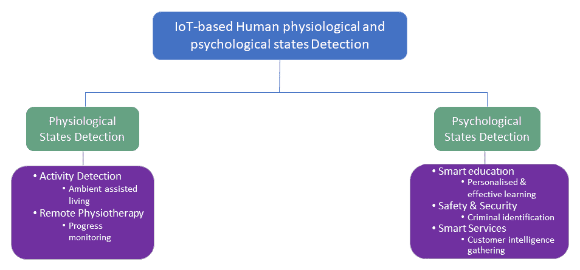

现在，我们将详细了解两种状态检测变体:

*   **生理状态检测**:生理状态或活动检测在许多应用中是有用的工具，包括为弱势人群(如老年人)提供辅助生活，以及在远程物理治疗/康复系统中。在老年人的辅助生活中，老年人跌倒对受害者的健康有害，因为存在身体伤害的相关风险。由于医疗费用和住院治疗的需要，跌倒也可能产生经济后果。此外，跌倒还会缩短人的预期寿命，尤其是对于长时间躺在 T2 的 T3 来说。另外值得注意的是，与跌倒挂钩的医疗费用极高。例如，预计到 2020 年，仅美国每年的下降成本就将达到 670 亿美元。在这种情况下，使用 DL 支持的物联网应用进行自动化和远程跌倒检测可以应对这一挑战，从而提高老年人的生活质量，并将相关成本降至最低。人体活动检测应用的另一个关键领域是远程理疗监测系统。这是本章的第一个用例，我们将在下一节对其进行概述。
*   **心理状态检测:**面部表情是人类心理状态的良好反映，是人类交流中帮助我们理解人类意图的重要因素。一般来说，我们可以通过分析他人的面部表情和语调来推断他们的情绪状态，如喜悦、悲伤和愤怒。非语言交流的形式占所有人类互动的三分之二。面部表情，就其传达的情感意义而言，是主要的非语言人际交流渠道之一。因此，基于面部表情的情感检测可以用于理解人们的行为。因此，它可以帮助改进现有的服务和/或新的服务，包括个性化的客户服务。物联网应用，如智能医疗保健、智能教育和安全，可以通过基于 DL 的情感检测或情感分析来改善服务。例如，在智能教室中，教师可以实时或准实时分析学生的情绪，以提供个性化和/或面向群体的教学。这将改善他们的学习体验。


# 用例一——理疗的远程进度监控

物理治疗是医疗保健的重要组成部分。对物理治疗的需求和我们提供这种治疗的能力之间存在巨大差距。世界上大多数国家仍然非常依赖一对一的患者-治疗师互动(这是黄金标准)，但它不是一个可扩展的解决方案，并且对患者或医疗保健提供商来说都不具成本效益。此外，大多数现有疗法及其更新依赖于平均数据，而不是个体的独特数据，有时这些数据是定性的(例如，*是的，我做了你让我做的事情*)而不是定量的。这是关于有效治疗的一个挑战。最后，许多人——尤其是老年人——患有多种慢性疾病**(**MCC**)，这些疾病通常会单独治疗。这可能导致次优护理，甚至这些条件可能相互冲突的情况。例如，在糖尿病和背痛患者的情况下:糖尿病护理者可能建议步行，而背痛护理者可能禁止步行。在这种背景下，物联网已经在改变医疗保健。它可以在机器学习/深度学习和数据分析工具的支持下解决大多数这些挑战，并通过提供实时或准实时信息来提供有效的理疗。**

**

# 用例一的实现

进程监测是传统治疗中的一个关键挑战。基于物联网的疗法可以解决进展监控问题。下图简要介绍了基于物联网的远程理疗监控系统的工作原理:

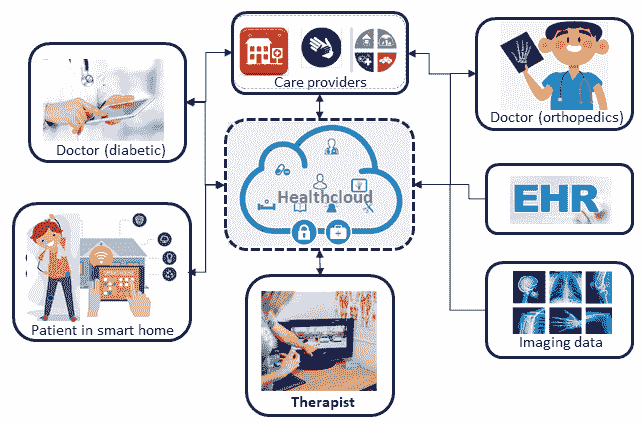

该应用程序的一个关键组件是受试者(患者)的活动监控，这将帮助治疗师远程观察患者如何遵守建议的治疗，以及他们是否正在取得进展。如上图所示，基于物联网的远程理疗监控系统包括四个主要部分:

*   **传感器和患者端计算平台**:对于这个用例，我们考虑两个传感器:一个加速度计和一个陀螺仪。他们都测量与受试者活动相关的三维读数。对于这些传感器，我们可以使用专用传感器或智能手机的传感器(这些传感器嵌入在大多数智能手机中)。对于客户端计算平台，我们可以考虑将 Raspberry Pi 用于专用传感器和智能手机(如果我们使用智能手机传感器的话)。传感器需要正确放置，以便正确测量信号。传感器可用于对受试者的活动进行连续或逐事件(例如在锻炼过程中)监测。
*   **医疗服务提供者和治疗师**:医疗服务提供者，如拥有医生和医疗/保健数据库的医院，通过云平台/健康云连接在一起。治疗用例的主要护理提供者是治疗师，医院/医生将在需要时向治疗师提供支持。
*   **基于 DL 的人体活动检测**:在这个阶段，边缘计算设备将安装一个 app。智能手机或 Raspberry Pi 上安装的应用程序将加载预先训练的人体活动检测和分类模型。一旦加速度计和陀螺仪检测到任何信号，它们就会发送到智能手机或 Raspberry Pi，使用 DL 模型进行处理和检测，最后通知治疗师，以便他们在必要时进行反馈或干预。
*   **用于模型学习的 health cloud**:health cloud 是一个云计算平台，主要用于医疗保健相关服务。这将使用参考数据集在人体活动检测和分类中训练所选择的 DL 模型。这个学习过的模型将被预装在智能手机或 Raspberry Pi 中。


# 用例二—基于物联网的智能教室

全球高等教育辍学率正在上升。例如，英国大学生的辍学率已经连续第三年上升。辍学的八大原因中有三个是:

*   缺乏与老师和辅导员相处的优质时间
*   消极的学校环境
*   缺乏学生的支持

解决这些问题的关键挑战之一是了解学生(例如了解学生是否在跟踪某个主题)并相应地提供讲座/辅导和其他支持。一种潜在的方法是了解学生的情绪，这在大教室、计算机实验室或电子学习环境中是具有挑战性的。技术的使用(包括支持 DL 模型的物联网)可以帮助使用面部表情和/或语音来识别情绪。本章的第二个用例旨在通过检测情绪并相应地管理课堂/实验室来提高学生的课堂表现。


# 用例二的实现

下图显示了基于物联网的智能教室应用的简化实现:


基于面部表情的情感分析实现包括三个主要元素:

*   **传感器和计算平台:**对于这个用例，我们需要至少一个能够覆盖教室的闭路电视摄像头，并通过无线或隐藏在墙壁中的电缆连接到计算平台。教室里讲师的电脑可以作为计算平台。计算机将连续处理视频信号，并将它们转换成图像，用于基于图像的面部表情分析。
*   **基于面部表情的情绪检测**:讲师的电脑会安装一个 app。安装的应用程序将加载预训练的基于面部表情的检测和分类模型。一旦 DL 模型接收到学生的面部图像，它就会识别他们对讲座的情绪(如高兴/不高兴/困惑),并通知讲师采取必要的行动。
*   **用于模型学习的桌面或服务器:**讲师的计算机将连接到大学服务器或云计算平台，这将使用参考数据集训练/再训练用于基于面部表情的情感识别和分类的模型。该学习模型将预装在教室中讲师的电脑中。

以下所有部分都将描述上述用例所需的基于 DL 的人类活动和情感识别的实现。所有必要的代码都可以在本章的代码文件夹中找到。


# 物联网中人类活动和情感检测的深度学习

在讨论有用的深度学习模型之前，理解基于加速度计和陀螺仪的人体活动检测系统以及基于面部表情的情绪检测系统的工作原理很重要。


# 自动人体活动识别系统

自动**人体活动识别** ( **HAR** )系统根据原始加速度计和陀螺仪信号检测人体活动。下图显示了由三个不同阶段组成的基于 DL 的 HAR 的示意图。它们如下:

*   受试者或个人的物联网部署或仪器
*   特征提取和模型开发
*   活动分类/识别

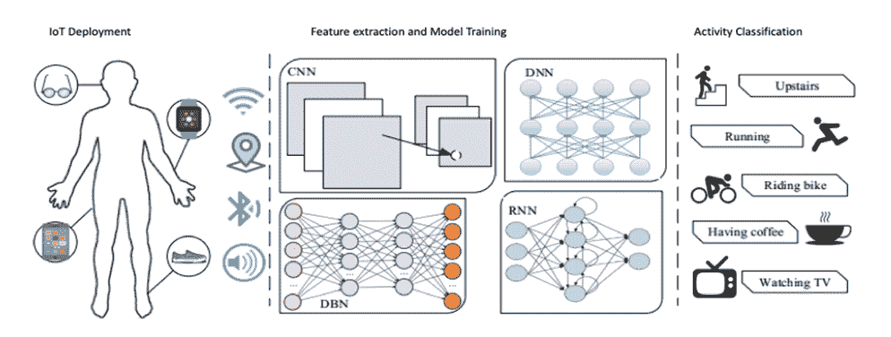

通常，经典的 HAR 方法主要依赖于启发式手工制作的特征提取方法，这是一个复杂的过程，并且不太适合资源受限的物联网设备。最近基于 DL 的 HAR 方法自动执行特征提取，并且它们可以在资源受限的物联网设备上很好地工作。大多数 HAR 方法考虑六种不同的活动，包括走、跑、坐、站、上楼和下楼。这些活动表现出加速度计和陀螺仪信号的差异，分类器利用这些差异来识别当前的活动——这可能构成物理疗法的一部分(如跑步)。


# 自动化人类情感检测系统

自动**人类情感识别** ( **HER** )可以通过使用来自受试者(人类)的以下信号/输入之一或其组合来完成:

*   面部表情
*   语音/音频
*   文本

本章考虑基于**面部表情识别** ( **FER** )的她。基于 DL 的自动 FER 包括三个主要步骤:预处理、深度特征学习和分类。下图突出显示了 FER HER 中的这些主要步骤。

用于面部表情分析的图像处理需要预处理，因为不同类型的情绪(例如愤怒、厌恶、恐惧、快乐、悲伤、惊讶和中性)具有细微的差异。与 FER 无关的输入图像中的变化，包括不同的背景、照明和头部姿态，可以通过预处理去除，以提高模型预测/分类精度。人脸对齐、数据扩充和图像归一化是一些关键的预处理技术。FER 的大多数开源数据集不足以推广 FER 的方法。为了改善 FER 方面的现有数据集，数据扩充至关重要。面部对齐和图像标准化对于改善单个图像是有用的。FER DL 流水线的最后阶段是让 DL 算法学习和分类特征，因此是情感。大多数图像识别 DL 算法，包括 CNN 和 RNN，适用于最后阶段:

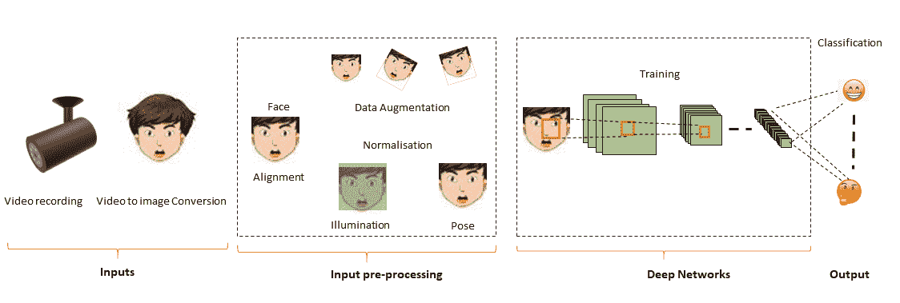


# 用于 HAR 和情感检测的深度学习模型

通常，人体活动识别系统使用加速度计和陀螺仪信号，这些信号是时间序列数据。有时，识别过程结合使用时间序列和空间数据。在这种情况下，**循环神经网络** ( **RNN** )和 LSTM 是前一种类型信号的潜在候选，因为它们能够在进化过程中结合输入的时间特征。另一方面，细胞神经网络有利于加速度计和陀螺仪信号的空间方面。因此，对于前一种类型的信号，CNN 和 LSTMs/RNNs 的组合或混合是理想的。我们将为 HAR 用例使用 LSTM 模型，因为它可以处理人类活动的时间方面。

与 HAR 系统不同，基于 FER 的人类情感检测系统通常依赖于面部表情图像，面部表情图像依赖于图像的像素值之间的局部或空间相关性。任何适用于图像识别的 DL 模型都适用于 FER 任务，同样也适用于情感检测。多种深度学习算法或模型已经用于图像识别，其中**深度信念网络** ( **DBN** )和 CNN 是前两个候选。在这一章中，我们考虑细胞神经网络是因为它们在图像识别中的表现。


# LSTM、CNN 和 HAR/FER 在物联网应用方面的迁移学习

LSTM 是 HAR 广泛使用的 DL 模型，包括基于物联网的 HAR，因为它的内存容量比包括 CNN 在内的其他模型更能处理时间序列数据(如 HAR 数据)。HAR 的 LSTM 实现可以支持迁移学习，适用于资源受限的物联网设备。一般来说，FER 依赖于图像处理，CNN 是图像处理的最佳模式。因此，我们使用 CNN 模型实现用例二(FER)。在 [第 3 章](b28129e7-3bd1-4f83-acf7-4567e5198efb.xhtml)，*物联网中的图像识别*中，我们概述了 CNN 的两种流行实现(如 incentive V3 和 Mobilenets)及其相应的迁移学习。在下面的段落中，我们将简要介绍基线 LSTM 的概况。

LSTM 是 RNNs 的延伸。许多 LSTM 的变体被提出，并且他们跟随基线 LSTM。以下是基线 LSTM 的示意图:

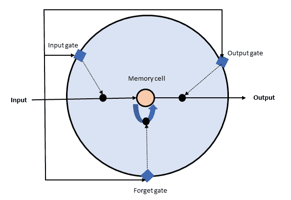

如上图所示，LSTM 主要由两个组件组成。它们有一个记忆细胞或神经元，每个细胞或神经元有一个乘法遗忘门、读取门和写入门。这些门控制对记忆细胞/神经元的访问，并防止它们受到无关输入的干扰。这些门通过 0/1 或关/开来控制。例如，如果遗忘门为 on/1，则神经元/细胞将其数据写入自身，如果遗忘门为 off/0，则神经元会忘记其最后的内容。其他门以类似的方式控制。

与 rnn 不同，LSTMs 使用遗忘门来主动控制细胞/神经元状态，并确保它们不会退化。重要的是，在数据具有长时间相关性的情况下，LSTM 模型比 RNN 模型表现得更好。许多物联网应用，如基于环境监测的人类活动识别和灾害预测，都表现出这种长时间的依赖性。

由于用例二中考虑的 FER 是基于图像处理的，CNN 是最佳选择。CNN 有不同的实现，包括一个简单的 CNN、两个版本的 Mobilenets 和 Incentive3。用例二将探索一个简单的 CNN 和 Mobilenet V1，用于实现的 FER 部分。


# 数据收集

出于多种原因，包括隐私，在 HAR 和/或 FER 收集数据是一项具有挑战性的任务。因此，开源质量数据集的数量有限。对于用例一中的 HAR 实现，我们使用了一个非常流行的开源**无线传感器数据挖掘** ( **WISDM** )实验室数据集。该数据集包括从 36 个不同对象收集的 54，901 个样本。出于隐私原因，用户名被 1-36 的 ID 号所掩盖。数据是针对受试者进行的六种不同活动收集的:站立、坐着、慢跑、走路、下楼和上楼。数据集包含三轴加速度计数据，每个样本有 200 多个时间步长。以下屏幕截图是数据集的一个示例:


对于用例二中基于 FER 的情感检测，我们使用了两个不同的数据集。第一个是流行的开源 FER2013 数据集。该数据集包含 48 x 48 像素的人脸灰度图像。这些图像经过预处理，可以直接用于训练和验证。这些图像可以分为七类(*0 =愤怒，1 =厌恶，2 =恐惧，3 =快乐，4 =悲伤，5 =惊讶，*和*6 =中性*)。CSV 格式的数据集包含关于面部图像而不是图像的像素值的信息。下面的屏幕截图显示了数据集的一些值:

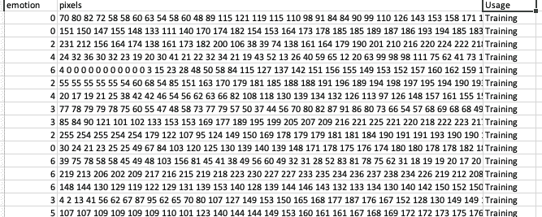

训练数据集和验证数据集之间的拆分比率是 *80:20* 。

我们还通过谷歌搜索准备了一个数据集，特别是 Mobilenet V1 的数据集。这个数据集并不大，因为它由五类情绪组成，每一类都由 100 多张图片组成。这些图像未经预处理。下图显示了准备好的数据集的文件夹视图:


对于数据收集(数据集的每个类)，我们可以遵循四个步骤:

1.  **搜索:**使用任意浏览器(我们用的是 Chrome)，上谷歌，在谷歌图片中搜索适合该类/情感(如*愤怒的人类*)的单词组合。
2.  **图片 URL 收集**:这一步利用几行 JavaScript 代码收集图片 URL。可以在 Python 中使用收集的 URL 来下载图像。为此，选择 JavaScript 控制台(假设您将使用 Chrome web 浏览器，但也可以使用 Firefox)，方法是单击视图|开发人员| JavaScript 控制台(在 macOS 中)，然后自定义并控制****Google Chrome**|**更多工具** | **开发人员工具** (Windows OS)。一旦您选择了 JavaScript 控制台，这将使您能够以类似 REPL 的方式执行 JavaScript。现在，按顺序执行以下操作:

    1.  向下滚动页面，直到找到与您的查询相关的所有图像。从那里，您需要获取图像的 URL。** 

 **切换回 JavaScript 控制台，然后将以下 JavaScript 片段复制并粘贴到控制台中:

```
// Get the jquery into the JavaScript console
var script = document.createElement('script');
script.src = "https://ajax.googleapis.com/ajax/libs/jquery/2.2.0/jquery.min.js";
document.getElementsByTagName('head')[0].appendChild(script)
```

```
// Grab the chosen URLs
var urls = $('.rg_di .rg_meta').map(function() { return JSON.parse($(this).text()).ou; });

```

```
// write the URls to file (one per line)
var textToSave = urls.toArray().join('\n');
var hiddenElement = document.createElement('a');
hiddenElement.href = 'data:attachment/text,' + encodeURI(textToSave);
hiddenElement.target = '_blank';
hiddenElement.download = 'emotion_images_urls.txt';
hiddenElement.click();
```

一旦执行了前面的代码片段，在默认下载目录中就会有一个名为`emotion_images_urls.txt`的文件。

3.  **下载图片**:现在，你可以下载之前下载的`emotion_images_urls.txt`上运行`download_images.py`(在本章的代码文件夹中)的图片了；

```
python download_images.py emotion_images_urls.txt
```

4.  **浏览** : 一旦我们下载了图像，我们需要浏览图像以便删除不相关的。我们可以通过一些手工检查来做到这一点。之后，我们需要调整大小和裁剪，以符合我们的要求。


# 数据探索

在本节中，我们将更详细地检查我们将使用的数据集:

*   **HAR 数据集** : 数据集是一个文本文件，由六项活动中每项活动的不同主题加速度组成。我们可以对数据集进行数据分布检查，因为只看文本文件不容易看出数据分布。下图总结了训练集的细分:

^()

正如我们从上图中看到的，与其他四项活动相比，训练数据集包含更多的步行和慢跑数据。这对于 DL 模型来说是很好的，因为步行和慢跑是移动活动，其中加速度数据的范围可能很宽。为了对此进行可视化，我们对每个活动的 200 个时间步长的活动式加速度测量/数据进行了探索。以下屏幕截图显示了 200 个时间步长的坐姿加速度测量值:


以下屏幕截图显示了站立时 200 个时间步长的加速度测量值:


以下屏幕截图显示了步行的 200 个时间步长加速度测量值:

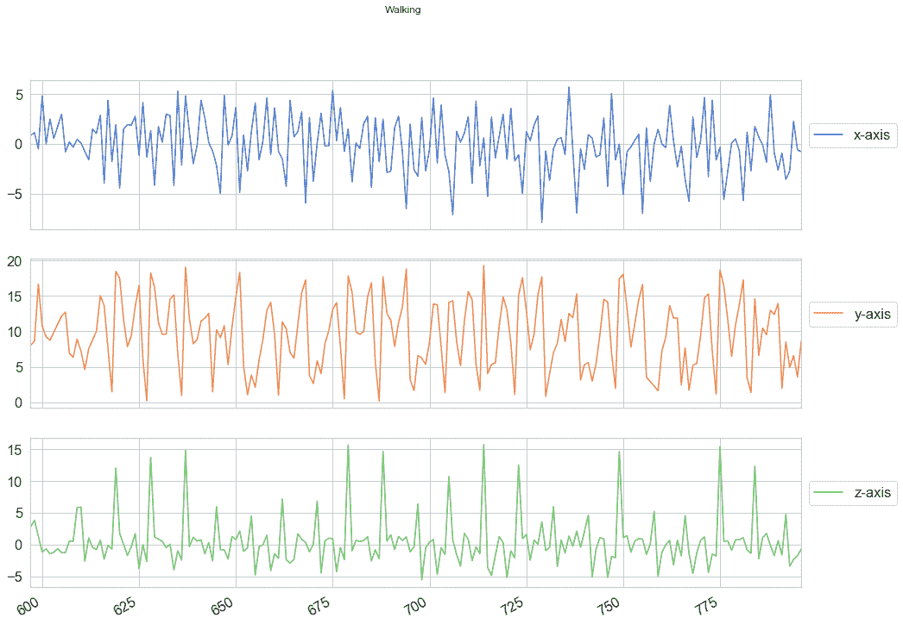

以下屏幕截图显示了慢跑时 200 个时间步长的加速度测量值:


从前面的图表中可以清楚地看出，步行和慢跑活动比其他活动更繁忙，因为它们反映了用户的运动。

*   **FER 数据集** : 我们需要将人脸图像的 FER2013 数据集像素值转换成实际图像来探究。我们可以使用以下代码将像素值转换为图像:

```
import os
import csv
import argparse
import numpy as np
import scipy.misc
parser = argparse.ArgumentParser()
parser.add_argument('-f', '--file', *required*=True, *help*="path of the csv file")
parser.add_argument('-o', '--output', *required*=True, *help*="path of the output directory")
args = parser.parse_args()
w, h = 48, 48
image = np.zeros((h, w), dtype=np.uint8)
id = 1
with open(args.file) as csvfile:
    datareader = csv.reader(csvfile, delimiter =',')
    next(datareader,None)
    for row in datareader:       
        emotion = row[0]
        pixels = row[1].split()
        usage = row[2]
        pixels_array = np.asarray(pixels, dtype=np.int)
        image = pixels_array.reshape(w, h)
        stacked_image = np.dstack((image,) * 3)
        image_folder = os.path.join(args.output, usage)
        if not os.path.exists(image_folder):
            os.makedirs(image_folder)
        image_file =  os.path.join(image_folder , emotion +'_'+ str(id) +'.jpg')
        scipy.misc.imsave(image_file, stacked_image)
        id+=1
        if id % 100 == 0:
            print('Processed {} images'.format(id))
print("Finished conversion to {} images".format(id))
```

我们可以使用下面的代码执行前面的代码:

```
python imager_converter.py
```

一旦我们有了图表，我们就可以运行下面的代码来浏览图像:

```
python image_explorer.py
```

这将产生一个类似下图的图形:


正如我们在上图中看到的，FER 数据集预处理得很好。另一方面，第二个数据集(我们将其命名为 FER2019)没有经过预处理，包括图像大小，如下图所示:

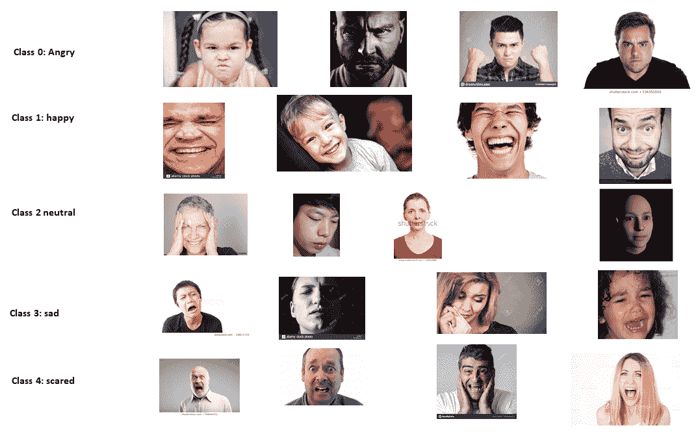


# 数据预处理

数据预处理是深度学习管道的一个重要步骤。HAR 和 FER2013 数据集预处理良好。然而，用例二的第二数据集的下载图像文件没有被预处理。如上图所示，图像的大小或像素不一致，数据集的大小也不大；因此，它们需要数据扩充。流行的增强技术有翻转、旋转、缩放、裁剪、平移和高斯噪声。许多工具可用于这些活动中的每一项。您可以使用这些工具或编写自己的脚本来进行数据扩充。一个有用的工具是 **Augmentor** ，一个用于机器学习的 Python 库。我们可以在我们的 Python 中安装该工具，并使用它进行增强。下面的代码(`data_augmentation.py`)是一个简单的数据扩充过程，它执行输入图像的翻转、旋转、裁剪和调整大小:

```
# Import the module
import Augmentor
da = Augmentor.Pipeline("data_augmentation_test")
# Define the augmentation
da.rotate90(probability=0.5)
da.rotate270(probability=0.5)
da.flip_left_right(probability=0.8)
da.flip_top_bottom(probability=0.3)
da.crop_random(probability=1, percentage_area=0.5)
da.resize(probability=1.0, width=120, height=120)
# Do the augmentation operation: sampling
da.sample(25)
```

下图显示了两幅原始图像及其增强样本(25 个样本中的 3 个):

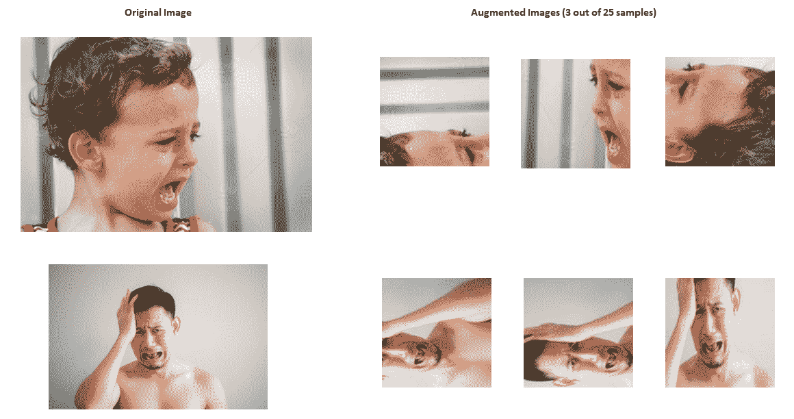

如上图所示，增强图像的大小是一致的，并且经过了翻转和旋转。

以下是在训练图像集准备期间要注意的两个关键问题:

*   **数据大小**:我们需要为每个类收集至少 100 张图像，以训练一个工作良好的模型。我们收集的信息越多，训练模型的准确性就越好。然而，一次性学习(一种对象分类技术)可以使用少于 100 个训练样本来工作。我们还确保这些图像很好地代表了我们的应用程序在实际实现中实际面临的情况。
*   **数据异构** *:* 为训练收集的数据应该是异构的。例如，FER 的图像应该来自不同的肤色或同一表情的不同视角。


# 模特培训

正如我们前面提到的，我们在用例一中使用 LSTM，在用例二中使用 CNN 的两个实现(简单 CNN 和移动 V1)。所有这些 DL 实现都支持两种用例的迁移学习，不需要从头开始培训。


# 用例一

我们考虑一个堆叠 LSTM，这是一个流行的序列预测，包括时间序列问题的 DL 模型。堆叠式 LSTM 架构由两层或更多层 LSTM 组成。我们为用例一实现了 HAR，使用了两层堆叠的 LSTM 架构。下图显示了一个两层 LSTM，其中第一层向第二 LSTM 层提供一系列输出，而不是单个值输出:


我们可以通过运行`use-case-1`文件夹中的`LSTM -HAR.py`代码来训练和测试模型(在对您的设置进行必要的更改之后，例如`data`目录):

```
python LSTM-HAR.py
```


# 用例二

我们在智能教室中使用了两种不同架构的 CNN 进行基于 FER 的情绪检测。第一个是简单的 CNN 架构。为了在 FER2013 数据集上训练模型，我们需要运行`CNN-FER2013.py`，它可以在本章的`use-case-2`代码文件夹中找到，或者使用笔记本。为了在`CNN-FER2013.py` *(对您的设置进行任何必要的更改后，如`data`目录)*，*的所有默认设置下运行，我们需要在命令提示符下运行以下命令:*

```
python CNN-FER2013.py
```

在 FER2103 数据集上对模型进行训练和测试可能需要几个小时。下图由 TensorBoard 日志文件生成，显示了用于用例二的网络:


我们可以通过运行以下代码在 FER2019 上重新培训 Mobilenet V1:

```
python retrain.py \

--output_graph=trained_model_mobilenetv1/retrained_graph.pb \
--output_labels=trained_model_mobilenetv1/retrained_labels.txt   \
--architecture =mobilenet_1.0_224 \
--image_dir= your dataset directory
```

一旦我们运行前面的命令，它们将在给定的目录中生成重新训练模型(`retrained_graph.pb`)和标签文本(`retrained_labels.txt`)。这也将在一个目录中存储模型的概要信息。TensorBoard 可以使用汇总信息(默认值为`retrain_logs`的`--summaries_dir`参数)来可视化模型的不同方面，包括网络及其性能图。如果我们在终端或命令窗口中键入以下命令，它将运行 TensorBoard:

```
tensorboard --logdir retrain_logs
```

一旦 TensorBoard 运行，将您的网络浏览器导航至`localhost:6006`以查看相应型号的 TensorBoard 和网络。下图显示了实现中使用的 Mobilenet V1 架构的网络:


# 模型评估

我们可以从三个不同的方面评估这些模型:

*   学习/(再)培训时间
*   存储要求
*   性能(准确性)

在训练时间方面，在具有 GPU 支持的台式机(英特尔 Xenon CPU E5-1650 v3@3.5 GHz 和 32 GB RAM)、HAR 数据集上的 LSTM、FER2013 上的 CNN 和 FER2019 数据集上的 Mobilenet V1 中，训练/再训练模型的时间不到一个小时。

在资源受限的物联网设备中，模型的存储要求是一个重要的考虑因素。下图显示了我们针对两种使用情形测试的三种型号的存储要求。如图所示，简单的 CNN 仅占用 2.6 MB，不到 Mobilenet V1 (17.1 MB)的六分之一。此外，HAR 的 LSTM 占用了 1.6 MB 的存储空间(不在图表中)。就存储要求而言，所有模型都可以部署在许多资源受限的物联网设备中，包括 Raspberry Pi 或智能手机:

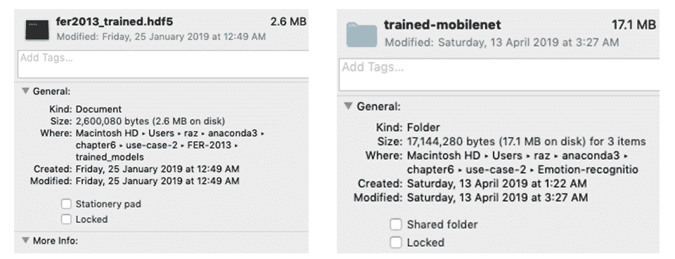

最后，我们对模型的性能进行了评估。可以为用例执行两个级别的性能评估:

*   在桌面 PC 平台/服务器端的再训练阶段，已经完成了数据集范围的评估或测试。
*   在 Raspberry Pi 3 环境中测试或评估用于人类活动的个人活动信号和用于情绪检测的面部图像。


# 模型性能(用例一)

下图显示了 LSTM 模型对 HAR 数据集的渐进训练和测试精度。从图中可以看出，训练准确率接近 1.0，即 100%，测试准确率在. 90 以上，即 90%。凭借这种测试精度，我们相信 LSTM 模型可以在大多数情况下检测到人体活动，包括受试者是否正在进行指定的理疗活动:

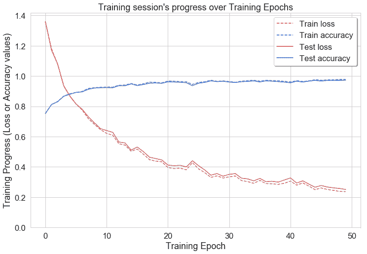

下图是模型相对于 HAR 测试数据集的混淆矩阵。如图所示，该模型混淆了楼下的**和楼上**的**，以及坐着**的**和站着**的**活动，因为它们的机动性非常有限或为零，这意味着没有明显的加速度来区分它们:**

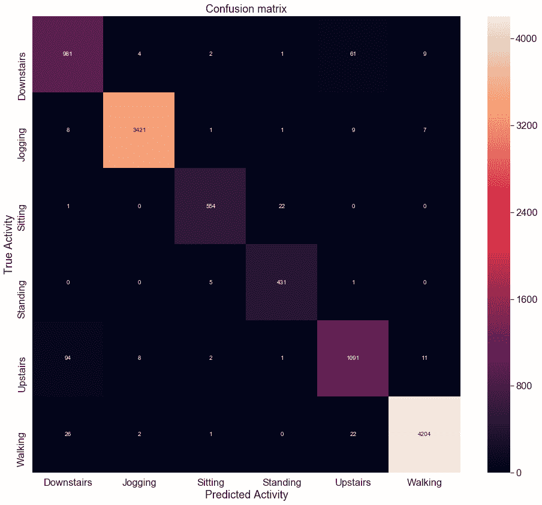


# 模型性能(用例二)

下面的屏幕截图显示了简单 CNN 模型在 FER2013 数据集上的训练和验证性能。该数据集的准确度不是很高(训练–. 83，验证–. 63)，但测试或验证准确度应该能够检测到智能教室的独特和必要的情绪(如高兴、悲伤和困惑):


下图是针对 FER2013 测试数据集的模型混淆矩阵。正如所料，该模型对所有的表情都显示出困惑(例如 156 个愤怒的表情被检测为悲伤的表情)。这是深度学习的应用之一，需要进一步研究来提高性能:


对于用例二，我们测试了 Mobilenet V1。下图显示了模型 Mobilenet V1 在 FER2019 数据集上的整体性能。正如我们从图中看到的，这显示了更好的训练准确性，但是在验证和测试准确性方面没有改进。一个潜在的原因可能是数据的大小和质量，因为在数据扩充后，每个样本可能不包含面部表情图像。包括手动检查在内的进一步预处理可能会提高数据质量和模型性能:

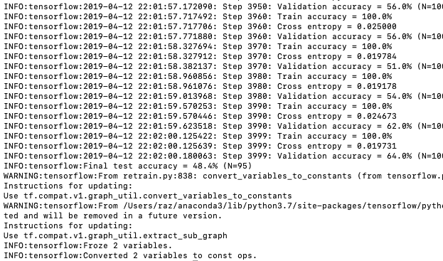


为了在单个图像上测试模型，并转移模型的学习，我们需要做以下工作:

*   将训练好的模型(如`fer2013_trained.hdf5`)和`label_image.py`文件(图像分类器)导出到 Raspberry Pi(安装了 tensor flow)/智能手机中。
*   使用以下命令运行图像分类器(不要忘记更新`test_image`路径):

```
python label_image.py
```

这将为您的测试图像产生测试结果。


# 摘要

自动人体生理和心理状态检测正成为一种流行的手段，通过这种手段，人们可以了解一个人的生理和心理状态，以进行相应的交互和反应。这些状态检测技术在智能教育、医疗保健和娱乐领域有许多应用。机器学习和 DL 算法对于这些检测技术是必不可少的。在本章的第一部分，我们简要描述了使用人体生理和心理状态检测的不同物联网应用。我们还简要讨论了物联网的两个潜在使用案例，其中 DL 算法可用于人类生理和心理状态检测。第一个用例考虑基于物联网的远程理疗进度监控系统。第二个用例是一个基于物联网的智能教室应用程序，它使用学生的面部表情来了解他们的反馈。在本章的第二部分，我们简要讨论了用例的数据收集过程，并讨论了为 HAR 选择 LSTM 和为 FER 选择 CNN 的理由。本章的剩余部分描述了这些模型及其结果的 DL 管道的所有必要组件。

物联网应用的关键挑战之一是安全性。许多物联网应用，如无人驾驶汽车、互联医疗和智能电网，都是任务关键型应用。安全性是这些和许多其他物联网应用的基本要素。在下一章中，我们将讨论物联网应用中的安全性，并展示深度学习如何用于物联网安全解决方案。


# 参考

*   K.Rapp、C. Becker、I.D. Cameron、h . h . knig 和 G. Bü车乐，*住院老年护理中跌倒的流行病学:对巴伐利亚养老院 70，000 多例跌倒的分析*，J. Am。医学。导演。协会 13 (2) (2012 年)
*   疾病控制和预防中心。*老年人死亡率下降的代价*，2014 年。[http://www . CDC . gov/homeandrecreationalsecurity/falls/fallcost . html](http://www.cdc.gov/homeandrecreationalsafety/falls/fallcost.html)(14 . 04 . 19 访问)。
*   米（meter 的缩写））S. Hossain 和 G. Muhammad，*面向 5G* 的情感感知互联医疗大数据，载于 IEEE 物联网杂志，第 5 卷，第 4 期，第 2399-2406 页，2018 年 8 月。
*   米（meter 的缩写））拉扎克、穆塔·塔·希拉和穆克塔·迪拉。2017.身体区域网络中的操作系统:一项调查。ACM Trans 。参议员 Netw。13、3、第二十五条(2017 年 8 月)，46 页。
*   Nigel Bosch、Sidney K. D'Mello、Ryan S. Baker、Ocumpaugh、、Matthew Ventura、Lubin Wang 和。2016.在电脑教室里检测学生情绪。在*第二十五届国际人工智能联合会议* (IJCAI'16)的会议录中，Gerhard Brewka (Ed。).AAAI 出版社 4125-4129。
*   Isabel Sagenmü ller，*学生保留率:人们从高等教育中辍学的 8 个原因*，[https://www . u-planner . com/en-us/blog/Student-retention-8-reasons-people-drop-out-of-higher-education](https://www.u-planner.com/en-us/blog/student-retention-8-reasons-people-drop-out-of-higher-education)。
*   尼基·巴尔兹利，*大学生辍学率连续第三年上升*，[https://www . fenews . co . uk/featured-article/24449-大学生辍学率连续第三年上升](https://www.fenews.co.uk/featured-article/24449-drop-out-rates-among-university-students-increases-for-third-consecutive-year)。
*   南 Hochreiter 和 J. Schmidhuber，*长短期记忆*，神经计算，第 9 卷，第 8 期，第 1735-1780 页，1997 年。
*   http://www.cis.fordham.edu/wisdm/dataset.php。
*   I. Goodfellow、D. Erhan、PL Carrier、a、M. Mirza、B. Hamner、W. Cukierski、Y. Tang、DH Lee、Y. Zhou、C. Ramaiah、F. Feng、R. Li、X. Wang、D. Athanasakis、J. Shawe-Taylor、M. Milakov、J. Park、r、M. Popescu、C. Grozea、J. Bergstra、J. Xie、L. Romaszko、B. Xu、Z. Chuang 和，*表征学习的挑战:三场机器学习竞赛报告*。arXiv 2013。****