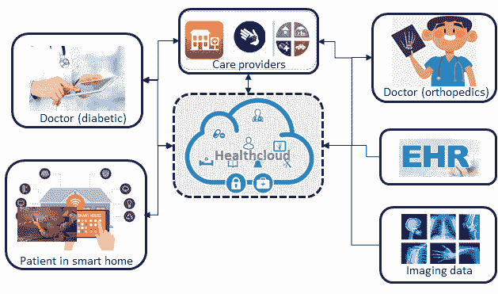
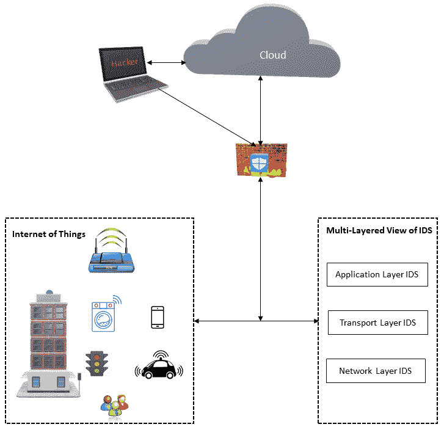
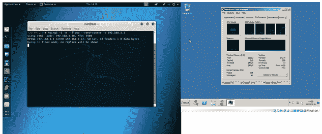
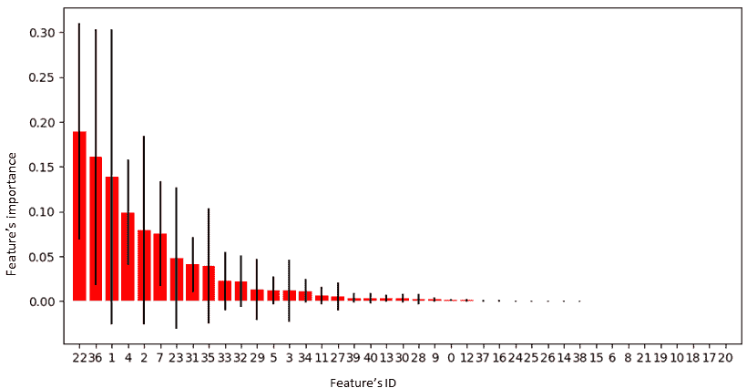
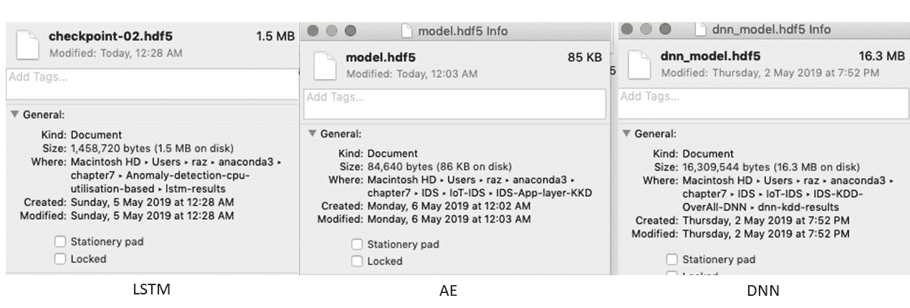
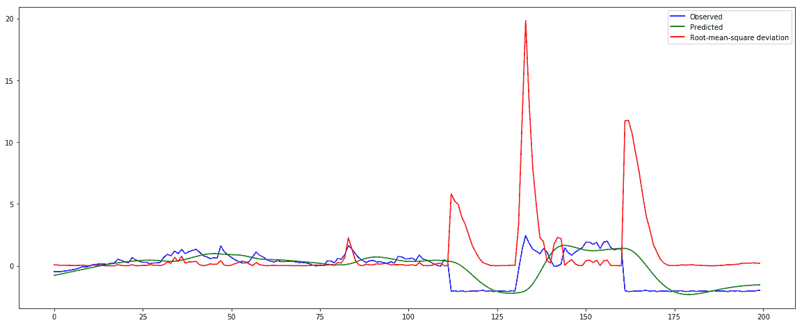

# 七、物联网安全

物联网的使用正以危险的速度增长，研究人员和行业都估计，活跃的无线连接设备的数量将超过 200 亿。物联网设备的这种指数级增长正在增加我们的生命和财产以及整个 IT 行业的风险。越来越多的互联设备意味着越来越多的攻击媒介和黑客利用的机会。在这种背景下，安全物联网不仅对其应用至关重要，对 IT 行业的其他领域也是如此。

在物联网安全解决方案中，网络和设备可以被视为基于签名或基于行为。基于行为的解决方案，如异常检测，在物联网中更受欢迎，因为准备和维护动态和未知物联网攻击的签名非常困难。与人类行为分析类似，**深度学习** ( **DL** )/ **机器学习** ( **ML** )模型可以在物联网中用于数据探索，以及在各种物联网应用环境中学习物联网设备和网络的正常和异常行为(安全角度)。

本章介绍基于 DL 的网络和设备的行为数据分析，以及一般物联网应用的安全事件检测技术。在本章的第一部分，我们将简要描述不同的物联网安全攻击及其潜在的检测技术，包括基于 DL/ML 的方法。此外，我们将简要讨论两个物联网使用案例，其中安全攻击—如**拒绝服务** ( **DoS** )和**分布式 DoS** ( **DDoS** )攻击 **—** 可以通过基于 DL 的异常检测智能地自动检测。在本章的第二部分，我们将介绍基于 DL 的安全事件检测实现。在本章中，我们将讨论以下主题:

*   物联网安全攻击和潜在检测方法
*   用例一—物联网中的智能主机入侵检测
*   智能主机入侵检测在物联网中的实现
*   用例二——物联网中的智能网络入侵检测
*   智能网络入侵检测在物联网中的实现
*   物联网安全事件检测 DL
*   物联网安全事件检测中的**深度神经网络**(**DNN**)**自编码器**、**长短期记忆** ( **LSTM** )
*   数据收集
*   数据预处理
*   模特培训
*   模型评估


# 物联网中的安全攻击及检测

据统计，全球联网物联网设备将超过 260 亿台。这些设备包括智能电视、平板电脑、智能手机、笔记本电脑、可穿戴设备、传感器、恒温器等，将使我们的生活更高效、更节能、更舒适、成本更低。然而，这些只有在这些应用的安全性得到维护时才能实现，因为在许多情况下，这些设备正在处理任务关键型应用。

现实是，物联网安全是目前物联网行业面临的头号挑战。如果没有适当的安全解决方案，穿越公共互联网的数据，尤其是无线连接的设备，很容易受到黑客的攻击。在这种情况下，整个物联网管道或路径需要是安全的。换句话说，物联网需要**端到端** ( **E2E** )安全性，即数据必须在离开终端设备或装置的整个过程中受到保护，直到它到达终端用户的移动应用程序或基于浏览器的应用程序。此外，一旦它已经被处理并且在用户设备/应用中已经对此做出决定，它必须遵循安全的反向路径，用于将控制指令致动或携带到设备。下图展示了物联网解决方案的 E2E(三层)视图，以及主要三层的安全要求:


下图从三个层面总结了物联网中的主要攻击:


设计和开发物联网安全解决方案是一项极具挑战性的任务。例如，这种设备通常被称为“嵌入式”设备；它们有一个固定的功能，专门用来完成一项特殊的任务。就操作系统、处理能力和内存而言，它们是资源受限的。传统和 PC 安全解决方案并不合适，因为它们甚至无法在大多数嵌入式设备上运行。重要的是，有大量存在漏洞的设备会被攻击者利用。例如，在智能家居中，我们拥有的物联网/智能设备比我们的 PC/笔记本电脑还要多。

很快，我们的家庭将配备足够多的联网设备，可以与中型公司的连接数量相媲美。在这种情况下，如果没有 IT 安全团队或任何昂贵的企业级安全工具的支持，单独管理这些连接设备的更新、密码和设置将是一场噩梦。基于**人工智能**(**AI**)——尤其是 DL/ML——的自动化方法可以反应性地和/或前瞻性地发现安全问题，并帮助我们管理它们。基于人工智能的解决方案可以采取两种不同的形式:

*   **基于网络的解决方案**:基于网络的解决方案旨在通过在物联网应用的网络周围制作保护屏障来保护物联网应用的物联网设备。这种方法维护一个允许访问物联网应用网络的设备白名单，以防止入侵者进入网络。然而，物联网设备需要访问外部世界和被外部世界访问，例如从云和智能手机应用程序。DL/ML 引擎可以监控物联网设备的传入和传出流量，并创建定义物联网应用正常行为的配置文件。DL/ML 引擎将通过与已建立的正常行为进行比较来检测任何传入的威胁。与企业网络不同，基于人工智能的威胁检测在物联网中更容易，因为一般来说，物联网设备的功能非常有限，并且不容易在恶意请求中伪装物联网设备。此外，更容易定义一组有限的规则来确定物联网设备的正常和异常行为。例如，智能灯泡与智能家庭中的智能冰箱通信不是正常行为，这很容易检测到，因为灯泡是用于照明的，不需要与冰箱通信来发光。
*   **基于设备的解决方案**:一般来说，物联网设备在处理能力和存储容量方面是资源受限的。因此，基于签名的安全解决方案不适合物联网设备，因为它们需要巨大的威胁和恶意软件签名存储数据库。像基于网络的解决方案一样，DL/ML 支持的自动化的基于行为的解决方案是更好的选择，因为它们不太需要资源。此外，它们可以运行而不会使小型处理器陷入困境。

尽管许多人更喜欢基于网络的解决方案，而不是基于设备的解决方案，但我们建议同时选择这两种解决方案，因为它们将为您的物联网设备以及世界其他地方提供更强的保护。


# 异常检测和物联网安全

网络和设备级的行为异常检测是检测潜在安全事件(包括 DoS 或 DDoS 或任何一般入侵)的重要手段。异常检测机制可以分为许多子类:

*   **统计方法**:这些方法使用过去的行为来近似一个传感器或事物的正确行为的模型。如果事物或网络观察到一种新的行为，它将与模型进行比较，如果在统计上不兼容，则被标记为异常。
*   **概率方法**:这些方法以概率模型的定义为中心(参数或非参数)。如果设备或网络中的任何事件的概率低于预定义的阈值，则将其标记为异常事件。
*   **基于接近度的方法**:这些方法基于正常和异常行为之间的距离。聚类方法也属于这一类。
*   **基于预测的方法**:这些方法使用过去的网络/设备行为数据来训练模型，该模型可以预测任何传入或传出流量的行为并识别异常。这是我们将在两个用例中使用的方法。第一种是主机级或设备级入侵检测的异常检测，第二种是网络级入侵检测。

在物联网应用中，DoS 和 DDoS 入侵事件屡见不鲜。物联网设备可能是这些攻击的目标，并且/或者攻击者可以利用物联网设备来生成泛洪流量，从而发起并运行 DDoS 攻击。这些攻击可以在物联网协议栈的不同层发起，包括网络层、传输层和应用层。一般来说，检测应用层发起的 DDoS 攻击非常具有挑战性，因为请求包看起来与普通的请求包相似。由于这种攻击，我们可能会观察到资源耗尽方面的明显行为，如网络带宽、CPU 处理和内存。例如，2016 年 9 月，一群被 Mirai 未来组合恶意软件劫持的物联网设备向一个法国网络主机产生了约 1 Tbps 的 DDoS 流量^(【3】)。在这种情况下，必须检测主机/物联网设备级别以及物联网网络级别的入侵，以便物联网应用程序可用于其预期用途和/或不会成为对他人进行 DDoS 攻击的手段。在以下部分中，我们将展示一个物联网设备级入侵检测用例，以及另一个物联网网络级入侵检测用例。


# 用例一:物联网中的智能主机入侵检测

通常，资源受限的物联网设备会成为入侵者发起 DoS 或 DDoS 攻击的目标，从而导致消费者无法使用物联网应用。例如，考虑一个基于物联网的远程病人监控系统。如果在关键时刻，例如在心脏病发作期间，传感器对病人的读数不能被他们的医生或医院获得，病人可能会失去生命。在这种情况下，设备或主机级入侵检测对于大多数物联网应用来说至关重要。在用例一中，我们将考虑物联网设备或主机级入侵检测。

使用包括 DL 在内的预测方法，选择一个或一组良好的功能来确定物联网设备和网络中的异常(如 DoS 和 DDoS)至关重要。通常，我们需要时间序列数据进行实时或在线异常检测，如果我们可以利用任何已经是这种形式的数据源，我们就不需要额外的特征工程。物联网设备的 CPU 利用率数据不需要进一步工程化来进行主机/设备级异常检测。


# 用例一的实现

我们正在考虑一种基于物联网的远程患者监控应用，用于实现智能主机级入侵检测。物理治疗的监测是一项具有挑战性的任务。基于物联网的疗法可以解决进展监控问题。下图简要介绍了基于物联网的远程患者监控系统及其设备级入侵检测的工作原理:



如上图所示，基于物联网的远程患者监护系统包括三个主要元素:

*   **传感器和患者端计算平台**:一名患者将被连接到多个传感器，包括心电图仪、血压传感器、加速度计和陀螺仪。这些传感器将收集生理和活动相关的信息，并将其发送给护理提供者，以获得必要的实时反馈。但是，来自这些传感器或事物的数据可能因为 DoS 或 DDoS 攻击而不可用。入侵者可以通过向这些传感器发送大量请求来发起 DoS 攻击，试图使其过载，从而阻止合法请求的实现。类似地，攻击者可以通过从许多不同的分布式来源淹没这些传感器来发起 DDoS 攻击。与家庭网络连接的 Raspberry Pi 3 可以作为患者端计算平台和传感器级入侵检测器工作。
*   **基于 DL 的入侵检测**:Raspberry Pi 3 将预装一个基于 DL 的异常检测器，该检测器将分析传感器及其 CPU 利用率，以检测对传感器和计算平台的任何潜在入侵。如果传感器没有任何 MCU，我们将考虑为 Raspberry Pi 3 进行入侵检测。检测器将持续监控 Raspberry Pi 3 的 CPU 利用率，如果发现异常，将报告给管理团队以采取对策。
*   **用于模型学习的 health cloud**:health cloud 是一个云计算平台，主要用于医疗保健相关服务。这将使用参考数据集训练用于异常检测的所选 DL 模型。

在本章的第二部分(即从 *DL 开始的物联网安全事件检测*部分)，我们将在前面的用例中描述基于 DL 的异常检测的实现。所有必要的代码都可以在本章的代码文件夹中找到。


# 用例二:物联网中基于流量的智能网络入侵检测

通常，主机入侵(包括设备级入侵)利用外部世界的通信，并且大多数情况下，成功的主机入侵伴随着网络入侵的成功。例如，在僵尸网络中，远程命令和控制服务器与被入侵的机器进行通信，以给出要执行的操作的指令。更重要的是，大量不安全的物联网设备导致全球 IT 基础设施中的物联网僵尸网络攻击激增。2016 年 10 月的 Dyn **域名系统** ( **DNS** )攻击就是一个例子，其中 Mirai 未来组合僵尸网络指挥了 10 万台物联网设备发动 DDoS 攻击。这一事件影响了许多热门网站，包括 GitHub、亚马逊、网飞、Twitter、CNN 和 PayPal。在这种背景下，检测物联网中的网络级入侵不仅对物联网应用是必要的，对 IT 行业的其他部分也是必要的。

通常，网络入侵检测器通过检查网络中主机之间的流量来识别入侵者。与主机入侵检测一样，网络入侵检测可以是基于签名的，也可以是基于异常检测的。在基于特征的方法中，所有传入流量都将与恶意流量的已知特征列表进行比较，而在异常检测方法中，它将传入流量与之前确定的正常行为进行比较。考虑到前一种方法的资源密集型方面，我们将考虑基于异常检测的**入侵检测系统** ( **IDS** )。


# 用例二的实现

与传统网络不同，物联网中的 IDS 需要是轻量级的，分布到不同的层，并且是持久的。第一个条件对于资源受限的物联网设备来说很明显。该解决方案需要分布在许多层上，以优化检测过程的有效性。重要的是，该解决方案需要可用于持久的物联网设备。例如，一个智能冰箱可以在一所房子里存放超过 10 年，而找到一个可以承受这么长时间的安全解决方案是一项艰巨的任务。

下图展示了一个物联网基础设施，包括一个多层网络 IDS，它可以满足物联网中 IDS 的前两个要求。例如，物联网部署由不同的组件组成，这些组件是分布式的且受资源限制。就实时响应而言，全系统的整体 IDS 可能不会很好地工作。在这种情况下，多层 IDS 中的每一层将实时或准实时地识别特定层的异常和相应的入侵者:



物联网的多层网络 IDS(尤其是在智能家居应用中)由以下三个主要元素组成:

**传感器/事物和边缘计算平台**:智能家庭设备，如智能电视、智能冰箱、恒温器、智能灯泡和家庭物理安全摄像头，是用例的传感器或“事物”。这些设备通过家用路由器/网关连接到互联网。在此使用案例中，我们考虑的是基于网络的安全解决方案，而不是基于设备的解决方案。我们还假设家庭路由器将作为边缘计算设备工作，并允许我们安装多层 IDS。

*   **基于 DL 的入侵检测**:家庭路由器/网关将预装三个(每层一个)基于 DL 的异常检测器，用于分析来自家庭联网设备的流量/数据包。每个检测器将分析并与该层的正常流量进行比较，以发现任何异常或入侵，如果检测到，将报告给家庭所有者和/或自动设置对策。
*   **模型学习平台**:需要一个家用桌面或云平台来学习和更新异常检测器的 DL 模型。这将使用三个参考数据集训练用于异常检测的所选 DL 模型。
*   以下所有部分将描述上述用例的基于 DL 的网络级和节点级异常检测的实现。所有必要的代码都可以在本章的代码文件夹中找到。

物联网安全事件检测 DL


# 传统的安全解决方案(如加密、认证、访问控制和网络安全)对物联网设备无效。近年来，基于 DL/ML 的解决方案已经成为传统解决方案的非常流行的替代方案。基于 DL/ML 的解决方案可以智能监控物联网设备及其网络，并检测各种新的或零日攻击。重要的是，DL/ML 可以通过异常检测来检测和/或预测各种设备和网络级安全事件。通过收集、处理和分析关于设备/事物及其网络的各种正常和异常活动的数据，这些 DL/ML 方法可以识别各种安全事件，包括物联网设备和网络级入侵。在以下几节中，我们将简要介绍一些在物联网设备和网络级 IDS 中有用的 DL 模型。

物联网安全事件检测领域的 DNN、autoencoder 和 LSTM


# 许多 DL 模型，包括简单的 DNNs、自编码器和循环神经网络(RNNs)^(【6】)，已经被用于物联网安全增强。这些方法可以是有人监督的，也可以是无人监督的。在这一章中，我们将使用监督和非监督的方法。对于第一个用例，我们将使用基于 LSTM 的监督方法进行设备级入侵检测。在用例二中，我们将分别使用 DNNs 和自编码器进行有监督和无监督的网络级入侵检测。我们在第一个用例中使用 LSTM，因为设备级入侵检测基于时间序列 CPU 利用率数据，而 LSTM 可以很好地处理时态数据。另一方面，自编码器是一种轻量级模型，非常适合资源受限的物联网设备。我们已经在上一章中简要介绍了 LSTM，因此，在下图中，我们简要介绍了自编码器的概述，作为对该模型的回顾。

顾名思义，自编码器编码和解码算法。下图显示了自编码器模型的简单架构:


如上图所示，自编码器由一个输入层和一个输出层组成，它们通过一个或多个隐藏层连接在一起[7]。当自编码器再现输入时，它们具有相同数量的输入和输出神经元。通常，自编码器由两部分组成:编码器和解码器。编码器与输入层连接，一旦接收到输入( **X** ，它就将其转换为新的压缩表示( **Z** )。压缩码也称为代码或潜变量( **Z** )。在输出层，解码器接收生成的代码或压缩代码，并将其转换为原始输入的重构。自编码器中训练过程的目的是最小化输出层中的重构误差。

自编码器有利于诊断和故障检测，因为它们在输出层进行输入重构。重要的是，自编码器的这一特殊功能在物联网中非常有用，包括**工业物联网** ( **IIoT** )，用于硬件设备和机器的故障诊断，以及操作/数据收集/性能中的异常检测。自编码器的异常检测能力促使我们在网络入侵检测用例中使用该模型。此外，一旦自编码器在云中或服务器上可用，它们就可以在各种物联网设备和网络之间轻松传输。各种类型的自编码器都是可用的，包括去噪、收缩、堆叠、稀疏和变化的自编码器。在使用案例中，我们将使用一个简单的自编码器架构和一个独立的 DL 模型进行入侵检测，但自编码器可以与其他 DL 模型集成，包括**卷积神经网络**(**CNN**)和 LSTMs。在接下来的部分中，从数据收集开始，我们将讨论上述用例的基于 DL 的实现。

数据收集


# 对于这两个用例，我们可以生成自己的数据集，并在其上训练和测试模型。在以下段落中，我们将简要介绍如何通过 DoS 攻击为设备级主机入侵检测创建数据集。

CPU 利用率数据


# 对于 DoS 攻击，我们需要一台攻击机器和一台目标机器。我们使用 Kali Linux 机器作为攻击者，Windows 机器作为目标(可以是家庭网关/Raspberry Pi 3/传感器)。在 Kali Linux 中，DoS 攻击可以通过多种方式实现。一种方法是使用`hping3` [。](https://tools.kali.org/information-gathering/hping3) `hping3`命令作为网络工具发送自定义 TCP/IP 数据包，并允许对防火墙、端口扫描、地址欺骗等进行测试。

For the DoS attack, we need an attack machine and a target machine. We are using a Kali Linux machine as the attacker and a Windows machine as the target (which can be home gateway/Raspberry Pi 3/sensors). In Kali Linux, a DoS attack can be achieved in multiple ways. One way is to use the `hping3`[.](https://tools.kali.org/information-gathering/hping3) `hping3` command as a network tool to send custom TCP/IP packets, and allowing for the testing of firewalls, port scanning, address spoofing, and more.

这可用于执行 DoS 攻击，方法是快速连续发送多个请求，占用物联网服务器/传感器的资源，使其变慢或无法响应。以下截图显示了发送`hping3`命令或发起 DoS 攻击之前目标 Windows 服务器的 CPU 利用率:


下面的命令是一个使用 Kali Linux 的`hping3`工具进行 DoS 攻击的例子。

以下列表是上述命令的语法描述:

```py
hping3 -c 10000 -d 120 -S -w 64 -p 21 --flood --rand-source example.com

```

`hping3`:二进制应用程序的名称

*   `-c 100000`:包的数量
*   `-d 120`:每个小包的尺寸
*   `-S`:仅 SYN 数据包
*   `-w 64` : TCP 窗口大小
*   `-p 21`:目的港
*   `--flood`:表示尽可能快地发送数据包，不注意显示收到的回复
*   `--rand-source`:使用随机源 IP 地址；您也可以使用`-a`或`–spoof`来隐藏主机名
*   `example.com`:网站或目的 IP 地址或目标机器的 IP 地址
*   `example.com`: The website or destination IP address or the target machine's IP address

下面的屏幕截图显示了 DoS 攻击后 windows 服务器的 CPU 利用率。我们可以清楚地看到，被攻击机器的 CPU 利用率提高了 30%:



我们可以对不同的目标机器运行不同的`hping3`会话，并保存 CPU 利用率数据。在 Windows 中，可以使用进程监视器来保存数据。对于用例一，我们将 CPU 利用率数据用于基于 LSTM 的入侵检测算法。

KDD 杯 1999 IDS 数据集


# 基于流量的智能网络入侵检测在物联网中，我们可以使用 Wireshark 网络监控工具，针对与网络入侵相关的不同攻击，记录和保存网络流量，并创建自己的数据集。此外，我们可以使用现有的开源数据集。我们使用的是 1999 年 KDD 杯入侵检测数据集。这个数据集非常适合用例二，因为它是关于网络级入侵的。在以下段落中，我们将简要介绍数据集的概况。详情请见参考文献。

KDD 杯 1999 数据集是由国防高级研究计划局在一个模拟空军模型上生成的。数据集是使用两个不同的会话收集的:

收集 7 周的训练数据

*   测试数据收集了 2 周
*   完整的数据集包括 39 种网络级攻击类型和 200 个后台流量实例。网络流量数据集要么被归类为攻击类型之一，要么被归类为“正常”。1999 年 KDD 杯入侵检测系统数据集有三个版本——完整的 KDD 数据集、修正的 KDD 数据集和 10%的 KDD 数据集。10% KDD 数据集是三个数据集中最常用的，我们在用例二中使用它。在用例二中，我们将使用自编码器对正常和攻击或入侵流量进行聚类。此外，我们将测试 DNN 对正常流量和攻击流量的分类。

数据探索


# 在以下段落中，我们将探讨用于两种用例的两个数据集(物联网设备级别的 CPU 利用率数据集和网络级别入侵检测的 KDD 杯 1999 IDS 数据集)。

**CPU 利用率数据集**:该数据集是一个 CSV 文件，由日期和时间以及相应的 CPU 利用率(%)组成。数据集由每分钟记录的 700 个利用率值组成。以下屏幕截图显示了数据集的快照:

*   


**KDD 杯 1999 IDS 数据集**:下面的截屏显示了 KDD 杯 1999 IDS 数据集的快照。从截图中可以清楚地看到，数据集还没有准备好在模型中使用。数据集具有协议类型、分类值和未标准化的数据值。此外，我们需要将数据分成三组，以便实现一个三层的网络级 IDS 实现。

*   以下屏幕截图显示了正常通信的网络流量模式:


以下屏幕截图显示了异常或攻击(如 smurf-it，一种网络级分布式 DoS 攻击)通信的网络流量模式:


数据预处理


# 数据预处理是 DL 管道的一个重要步骤。CPU 利用率数据集已准备好用于训练，但 KDD 杯 1999 IDS 数据集需要多级预处理，包括以下三个步骤:

将数据分成三个不同的协议集(应用层、传输层和网络层)

1.  重复数据删除、分类数据转换和规范化
2.  功能选择(可选)
3.  使用下面几行代码是将数据集分成三个数据集的一种可能方式，即`Final_App_Layer`、`Final_Transport_Layer`和`Final_Network_Layer`:

Using the following lines of code is a potential way of splitting the dataset into three datasets, namely `Final_App_Layer`, `Final_Transport_Layer`, and `Final_Network_Layer`:

```py
#Importing all the required Libraries
import pandas as pd
IDSdata = pd.read_csv("kddcup.data_10_percent.csv",header = None,engine = 'python',sep=",")

# Add column header
IDSdata.columns = ["duration","protocol_type","service","flag","src_bytes","dst_bytes","land","wrong_fragement","urgent",               "hot","num_failed_logins","logged_in","num_compressed","root_shell","su_attempted","num_root","num_file_creations", "num_shells","num_access_files","num_outbound_cmds","is_hot_login","is_guest_login","count","srv_count","serror_rate","srv_serror_rate","rerror_rate","srv_rerror_rate","same_srv_rate","diff_srv_rate","srv_diff_host_rate","dst_host_count","dst_host_srv_count","dst_host_same_srv_rate","dst_host_diff_srv_rate","dst_host_same_src_port_rate","dst_host_srv_diff_host_rate","dst_host_serror_rate","dst_host_srv_serror_rate","dst_host_rerror_rate","dst_host_srv_rerror_rate","labels"]

# Explore the Application Layer IDS Data
ApplicationLayer = IDSdata[(IDSdata['labels'].isin(['normal.','smurf.','back.','satan.','pod.','guess_passwd.','buffer_overflow.','warezmaster.','imap.','loadmodule.','ftp_write.','multihop.','perl.']))]
print (ApplicationLayer['labels'].value_counts())

# Save a Applayer data only into a text file
ApplicationLayer.to_csv('Final_App_Layer.txt',header = None,index = False)

# Explore the Transport Layer IDS Data
TransportLayer = IDSdata[(IDSdata['labels'].isin(['normal.','neptune.','portsweep.','teardrop.','buffer_overflow.','land.','nmap.']))]
print (TransportLayer['labels'].value_counts())
TransportLayer.to_csv('Final_Transport_Layer.txt',header = None,index = False)

# Explore the Network Layer IDS Data
NetworkLayer = IDSdata[(IDSdata['labels'].isin(['normal.','smurf.','ipsweep.','pod.','buffer_overflow.']))]
print (NetworkLayer['labels'].value_counts())
NetworkLayer.to_csv('Final_Network_Layer.txt',header = None,index = False)
```

一旦数据集准备就绪，我们就删除重复的数据条目，并对剩余条目的值进行归一化。以下代码行或函数可用于重复删除和规范化:

数据集的最终预处理是分类器的最优特征选择集。这是一个可选过程，但对资源受限的物联网设备非常有用，因为这将最小化网络输入层或神经元的大小。以下代码行或利用随机森林的函数可用于进行预处理:

```py
def DataPreprocessing(IDSdataframe):
 # Duplicate entry removal
    recordcount = len(IDSdataframe)
    print ("Original number of records in the training dataset before removing duplicates is: " , recordcount)
    IDSdataframe.drop_duplicates(subset=None, inplace=True)  # Python command to drop duplicates
    newrecordcount = len(IDSdataframe)
    print ("Number of records in the training dataset after removing the duplicates is :", newrecordcount,"\n")

    #Dropping the labels to a different dataset which is used to train the recurrent neural network classifier
    df_X = IDSdataframe.drop(IDSdataframe.columns[41],axis=1,inplace = False)
    df_Y = IDSdataframe.drop(IDSdataframe.columns[0:41],axis=1, inplace = False)

    # Categorial data to numerical data conversion
    df_X[df_X.columns[1:4]] = df_X[df_X.columns[1:4]].stack().rank(method='dense').unstack()

    # Coding the normal as " 1 0" and attack as "0 1"
    df_Y[df_Y[41]!='normal.'] = 0
    df_Y[df_Y[41]=='normal.'] = 1

    #converting input data into float
    df_X = df_X.loc[:,df_X.columns[0:41]].astype(float)

    # Normal is "1 0" and the attack is "0 1"
    df_Y.columns = ["y1"]
    df_Y.loc[:,('y2')] = df_Y['y1'] ==0
    df_Y.loc[:,('y2')] = df_Y['y2'].astype(int)
    return df_X,df_Y
```

The final preprocessing of the datasets is the optimal set of features selection for the classifier. This is an optional process, but is useful for resource-constrained IoT devices, as this will minimize the size of the input layer or neurons of the network. The following lines of code or functions exploiting random forest can be used to do this preprocessing:

```py
def FeatureSelection(myinputX, myinputY):
    labels = np.array(myinputY).astype(int)
    inputX = np.array(myinputX)

    #Random Forest Model
    model = RandomForestClassifier(random_state = 0)
    model.fit(inputX,labels)
    importances = model.feature_importances

    #Plotting the Features agains their importance scores
    indices = np.argsort(importances)[::-1]
    std = np.std([tree.feature_importances_ for tree in model.estimators_],
axis=0)            
    plt.figure(figsize = (10,5))
    plt.title("Feature importances (y-axis) vs Features IDs(x-axis)")
    plt.bar(range(inputX.shape[1]), importances[indices],
       color="g", yerr=std[indices], align="center")
    plt.xticks(range(inputX.shape[1]), indices)
    plt.xlim([-1, inputX.shape[1]])
    plt.show()

    # Selecting top featueres which have higher importance values
    newX = myinputX.iloc[:,model.feature_importances_.argsort()[::-1][:10]]

   # Converting the dataframe into tensors
    myX = newX.as_matrix()
    myY = labels
    return myX,myY
```

以下两个图表分别突出显示了应用层和网络层数据集的 41 个特征。要素根据其重要性进行排序，从图表中可以清楚地看出，不同的要素集对于不同的图层数据集是重要的。我们测试了具有 8-12 和 41 个特征的 DL 模型:


下图突出显示了网络层数据集的 41 个要素:



模特培训


# 正如我们在本章前面提到的，我们将 LSTM 用于用例一，一个自编码器用于多层 IDS 数据集，DNN 用于整个 IDS 数据集。在下面的小节中，我们将展示两个用例的 DL 模型训练过程。

用例一


# 我们考虑了一个基于 CPU 利用率的主机/设备级入侵检测的三层网络体系结构。下图展示了我们使用的 LSTM 架构:


我们可以通过运行`lstm_anomaly_detection.py`文件(在本章的代码文件夹中)来训练和测试模型，如下所示:

用例二

```py
python lstm_anomaly_detection.py 
```


# 我们使用 KDD 杯 1999 IDS 数据集将自编码器用于多层 IDS 实现，并且我们已经在三个数据集上训练和测试了自编码器。为了在每个图层的数据集上训练模型，我们需要在数据集上运行`IDS_AutoEncoder_KDD.py`文件(在本章的代码文件夹中有),如下所示:

我们还在整个 KDD 杯 1999 IDS 数据集上训练和测试了一个 DNN 模型。为此，我们需要如下运行`DNN-KDD-Overall.py`文件(可在本章的代码文件夹中找到):

```py
python IDS_AutoEncoder_KDD.py
```

对于所有型号，我们都保存了最佳型号，以便导入并在物联网设备中使用。此外，我们使用 TensorBoard 保存了模型的日志，以可视化模型的不同方面，包括网络及其性能图。我们可以通过运行以下命令来生成性能图和网络:

```py
python DNN-KDD-Overall.py
```

TensorBoard 运行后，将您的网络浏览器导航至`localhost:6006`以查看 TensorBoard 并查看相应型号的网络。下图是物联网多层 IDS 中使用的自编码器的架构:

```py
tensorboard --logdir logs
```


模型评估


# 我们可以评估模型的三个不同方面:

学习/(再)培训时间

*   存储要求
*   性能(准确性)
*   在一台支持 GPU 的台式机(英特尔 Xenon CPU E5-1650 v3@3.5GHz 和 32 GB RAM)上，LSTM 在 CPU 利用率数据集上的训练和自编码器在 KDD 分层明智数据集(精简数据集)上的训练花了几分钟时间。整个数据集上的 DNN 模型花费了一个多小时，这是意料之中的，因为它已经在一个更大的数据集上进行了训练(KDD 的整体 10%数据集)。

在资源受限的物联网设备中，模型的存储要求是一个重要的考虑因素。以下屏幕截图显示了我们针对两种使用情形测试的三种型号的存储要求:



如屏幕截图所示，自编码器占用的存储空间在 KB 范围内。存储的自编码器模型的最终版本只用了 85 KB，LSTM 用了 1.5 MB，DNN 用了 16.3 MB。在存储需求方面，所有模型都可以部署在许多资源受限的物联网设备上，包括树莓 Pi 和智能手机。此外，从截图中可以清楚地看到，由于最佳的特征选择过程以及其他原因，自编码器是一个非常轻量级的模型。

最后，我们对模型的性能进行了评估。在这两个用例中，数据集范围的评估或测试都是在 PC 平台/服务器端的训练阶段完成的。我们还可以在 Raspberry Pi 3 或任何物联网边缘计算设备上测试它们，因为模型已保存并可导入。

模型性能(用例一)


# 下图显示了 CPU 利用率数据集上使用的 LSTM 的验证结果:



正如我们在图中看到的，预测紧跟在非正常或“正常”的 CPU 利用率数据系列之后，这表明它运行良好。重要的是，当它发现异常观察时，观察到的和预测的 CPU 利用率值(标准化的)之间的差异与正常行为明显不同。这表明物联网设备可能受到 DoS 或 DDoS 攻击。误差差以均方根(RMS)值绘制，这是此类最流行的指标之一。

模型性能(用例二)


# 我们已经在三个数据集上针对三个不同的层 id 测试了自编码器模型。下面的屏幕截图显示了应用层 IDS 的评估结果快照:


正如我们从截图中看到的，当我们使用前 12 个最重要的功能进行培训时，培训准确性、验证和测试准确性都远高于 90%。如果我们使用不同的功能集，性能可能会有所不同。

下图显示了应用程序层 IDS 数据集上的前述模型的逐时段训练精度:


对于网络层和传输层的 IDS 模型训练，我们获得了一些有趣的评估结果。如果我们使用前 12 个最重要的特性，验证精度在 50%的范围内，如果我们将特性集更改为介于 8 和 10 之间，精度将在 80–90%的范围内。下面两张截图展示了网络层 IDS 实验的评估快照:


有趣的是，从第二张截图我们可以看到，准确率在 50%到 50 个历元的范围内，然后就跳到了 90%的范围内。最终精度，或保存模型的精度，在 91–98%的范围内。因此，它们足以检测网络和传输层异常。


以下屏幕截图显示了 DNN 模型在整个 KDD 数据集上的训练性能:


正如我们从前面的数字中看到的，测试精度接近 1%或 100%。我们还单独测试了保存的模型，测试精度远高于 0.90%或 90%。因此，DNN 也足以检测物联网网络中的网络级入侵。

摘要


# 安全性是物联网实现中最重要的问题。传统的 PC/桌面安全解决方案，尤其是基于签名的解决方案，在物联网应用中并不有效。基于行为的解决方案，如异常检测，在物联网中更受欢迎。DL/ML 模型是物联网中非常有用的数据分析和安全事件检测工具。在本章中，我们介绍了基于 DL 的网络和设备行为数据分析，以及一般物联网应用的安全事件检测技术。在本章的第一部分，我们简要描述了各种物联网安全攻击及其潜在的检测技术，包括基于 DL/ML 的技术。我们考虑了物联网应用中两种不同级别的入侵检测。第一个用例是设备级或主机级入侵检测，第二个用例是网络级入侵检测。在本章的第二部分，我们介绍了用例实现中基于 DL 的异常或事件检测部分。正如评估中发现的，所选的 DL 模型足以检测物联网应用中的设备级和网络级入侵。

物联网将用于各种应用，如基础设施和工业，以监控他们的健康状况。健康监控的一个潜在应用是对被监控对象(如电机)的预测性维护，以避免服务中断或任何其他事故。

IoT will be used in various applications, such as infrastructure and industry, to monitor their health conditions. One of the potential applications of health monitoring is predictive maintenance of the monitored subject (such as a motor) to avoid service disruption or any other incidents.

在下一章中，我们将简要介绍基于物联网的预测性维护的重要性及其使用 DL 模型的实现。

参考


# *2015 年至 2025 年全球物联网(IoT)连接设备安装基数(以十亿计)*，位于[https://www . statista . com/statistics/471264/IoT-number-of-connected-devices-world wide/。](https://www.statista.com/statistics/471264/iot-number-of-connected-devices-worldwide/)

*   *利用时间序列分析实时检测应用层 DDoS 攻击*，倪，顾，王，李，《控制科学与工程学报》，2013 年第 1 卷，第 1-6 页，2013 年。
*   *物联网中的 DDoS:**Mirai 未来组合和其他僵尸网络*，C. Kolias，G. Kambourakis，A. Stavrou，和 J. Voas，IEEE 计算机，第 50 卷，第 7 期，第 80–84 页，2017。
*   2016 年 Dyn 网络攻击，在[https://en.wikipedia.org/wiki/2016_Dyn_cyberattack.](https://en.wikipedia.org/wiki/2016_Dyn_cyberattack)
*   *一种基于 Fisher 和深度自编码器的大网络流量数据融合方法**，陶 x，孔 d，魏 y，(2016)，信息，7(2)，20。*
**   *一种使用长短期记忆的有效入侵检测分类器*，Kim J .，和 Kim H. (2017 年 2 月)，载于平台技术与服务(PlatCon)，2017 年国际会议(第 1-6 页)，IEEE。*   Pierre Baldi，*自编码器，无监督学习和深度架构*，Isabelle Guyon，Gideon Dror，Vincent Lemaire，格拉汉姆·泰勒和 Daniel Silver(编辑。)，载于 2011 年国际无监督学习和迁移学习研讨会会议录第 27 卷(UTLW'11)，第 27 卷，JMLR.org 37-50，2011 年。*   http://kdd.ics.uci.edu/databases/kddcup99/kddcup99.html.[的 KDD 杯 1999 年数据](http://kdd.ics.uci.edu/databases/kddcup99/kddcup99.html)*   KDD Cup 1999 Data, at [http://kdd.ics.uci.edu/databases/kddcup99/kddcup99.html.](http://kdd.ics.uci.edu/databases/kddcup99/kddcup99.html)*