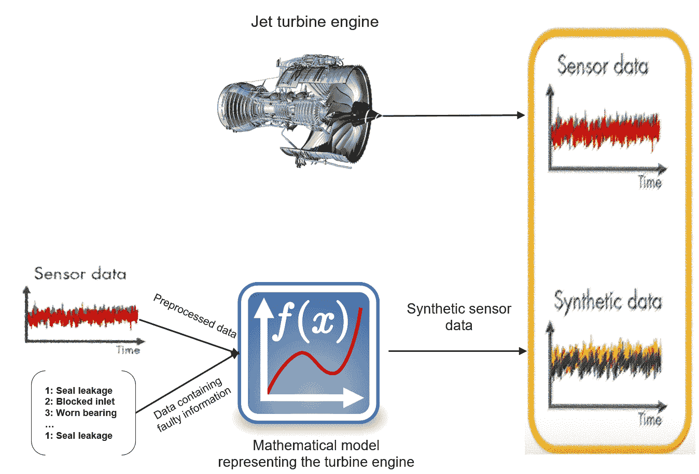
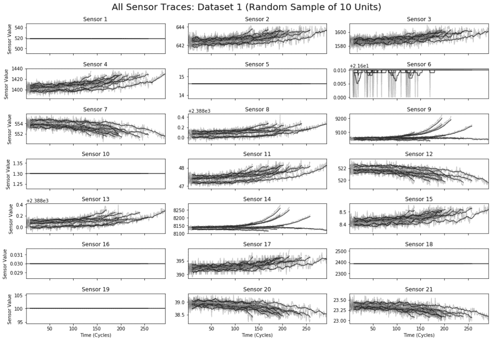
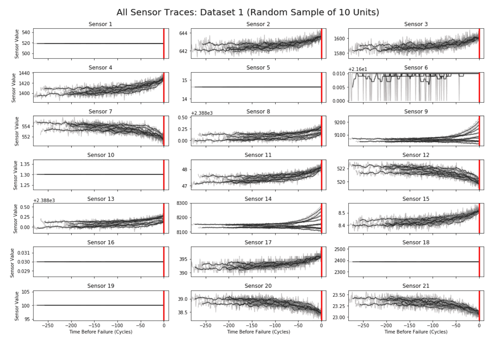
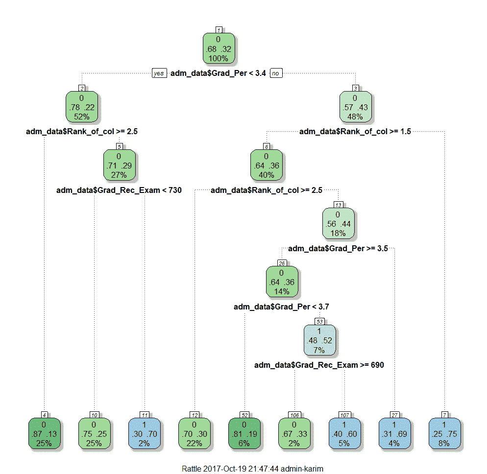
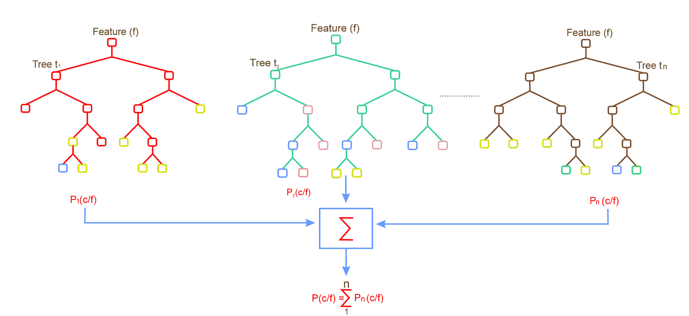
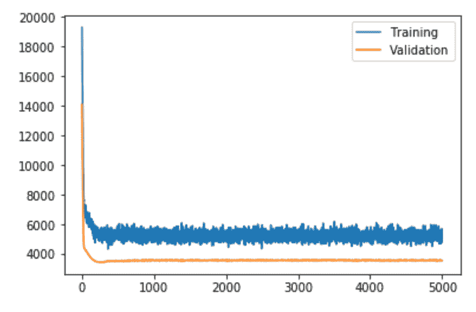
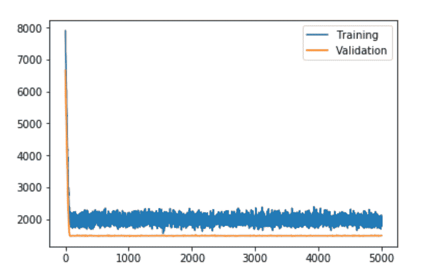
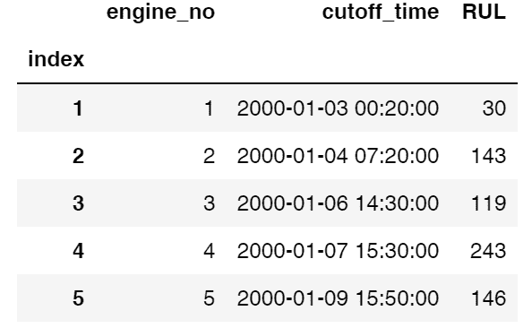
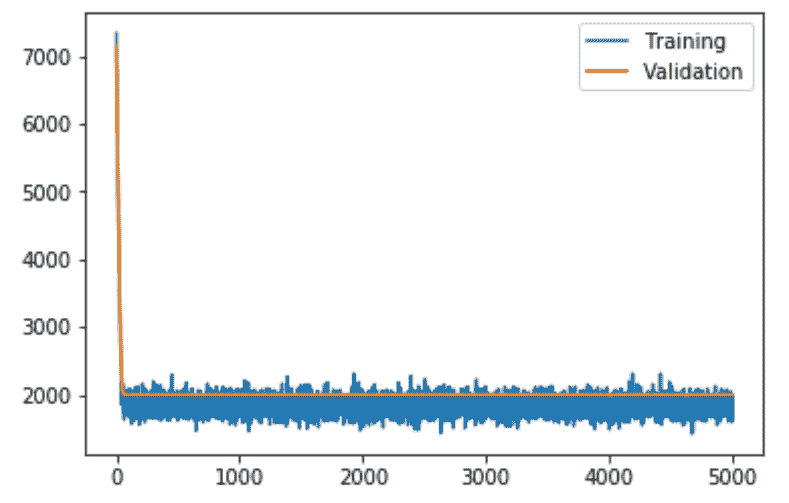

# 八、物联网预测性维护

在**物联网** ( **物联网**)设备中，一次为一个事件生成流数据。基于 DL 的方法可以检查这些数据，以便实时诊断整个车队的问题，并且可以预测各个单元的未来健康状况，以便实现按需维护。这种策略被称为**预测**(或**基于条件的** ) **维护**。这种方法现在正成为物联网最有前途和最有利可图的工业应用之一。

考虑到这些动机，在本章中，我们将研究如何使用**涡扇发动机退化模拟**数据集开发物联网预测性维护的 DL 解决方案。预测性维护背后的思想是确定各种类型的故障模式是否可以预测。此外，我们将讨论如何从支持物联网的设备中收集数据以进行预测性维护。简而言之，本章将涵盖以下主题:

*   物联网预测性维护
*   开发预测性维护应用程序
*   准备数据
*   训练 ML 基线
*   培训 LSTM 模型
*   评估模型
*   常见问题


# 物联网预测性维护

随着实时数据捕获和流架构的进步，现在可以进行实时数据监控，组织可以实时了解各个组件和所有流程。监控仍然需要积极参与和快速响应，例如，油井传感器显示温度或流量增加，或者网络流量出现僵尸网络活动或内部威胁。

让我们考虑一个现实世界的例子，叫做工业工程中的**设备故障**，它总是被认为是一个代价高昂的问题。定期进行预防性维护一直是常规策略。因此，时间表往往是非常不冒险的，这通常是基于运营商的经验。这种人工干预有几个缺点。首先，它会增加维护成本。其次，这种设置不可能适应高度复杂或不断变化的工业场景。


# 在工业环境中收集物联网数据

根据 RT Insights 的数据，一个喷气发动机可能会花费 1600 万美元，在一次跨大西洋飞行中，它会消耗 36000 加仑的燃料。今天的航空燃油价格达到每次 54，000 美元左右，或每小时超过 5，000 美元。大多数喷气发动机是燃气涡轮发动机，其中热能通过喷嘴膨胀转换成动能，然后在旋转的转子中转换成旋转机械能。这样的引擎产生了海量的物联网数据。让我们试着理解 ML 的预测性维护如何帮助我们降低维护成本。

第一步是收集代表不同操作条件下健康和故障操作的传感器数据，例如温度、流量和压力。在现实生活中，这些可能部署在不同的环境和位置(假设您在西伯利亚，工作温度为-20 摄氏度，流体粘度高，另一个在中东国家，工作温度为 45 摄氏度，流体粘度高)。

尽管两个引擎都应该正常工作，但由于不同的操作条件，其中一个引擎可能会更快出现故障。不幸的是，没有足够的数据，没有进一步的方法来调查失败的根本原因。一旦部署了这样的喷气涡轮发动机，就可以在以下设置中使用流技术来收集传感器数据:

*   来自正常系统操作的真实传感器数据
*   来自在故障条件下运行的系统的真实传感器数据
*   来自系统故障的真实传感器数据(*运行至故障*数据)

然而，如果我们没有部署很多这样的引擎，我们将没有太多的数据，这些数据将代表健康和故障的条件和操作。有两种解决方法可以克服这种数据匮乏的问题:

*   使用来自相似/相同引擎的历史数据，这可能类似于当前部署的引擎。
*   第二，我们可以建立发动机的数学模型，并根据可用的传感器数据估计它们的参数。基于统计分布和操作条件，我们可以生成故障数据。

如果我们选择第二个选项，在生成传感器数据后，我们可以将它们与真实的传感器数据相结合，为开发预测性维护模型生成大规模的传感器数据，如下图所示:




# 预测性维护的 ML 技术

**深度学习** ( **DL** )技术可以应用于处理海量的物联网数据，并且可以成为经典机器学习算法的一个有吸引力的新兴替代方案。其思想是，当设备被赋予传感器并联网时，会产生大量的传感器数据。在更复杂的工业环境中，来自传感器通道的数据噪声很大，会随时间波动，但有些数据似乎根本不会改变。对于每个工业环境来说，这或多或少都是正确的，因为物联网环境中产生的数据是一系列多元的传感器测量值，每个测量值都有自己的噪声量，其中包含许多缺失值或无信息值。

预测性维护应用程序开发的一个关键步骤是从收集的传感器数据中识别**条件指标** ( **CIs** )和特征，随着系统退化，以可预测的方式检查 CIs 的行为变化。通常，配置项包含有助于区分正常和故障操作以及预测**剩余使用寿命** ( **RUL** )的功能。

发动机或机器的 RUL 是发动机需要维修或更换前的预期寿命或剩余使用时间。因此，从传感器数据预测 RUL 是许多预测性维护应用的关键。在下图中，我们可以看到，随着涡轮发动机性能下降，频率数据中的峰值向左移动。因此，峰值频率可以作为状态指示器:


CIs 可以帮助我们了解涡轮发动机的正常运行和故障运行。然而，他们并没有告诉我们哪些部分需要修复，或者离故障发生还有多长时间。我们要么在修复之前识别故障类型，要么在计划维护之前预测 RUL。对于前一个选项，使用提取的 CIs 特征来训练 ML 或 DL 模型，并识别故障类型，如密封泄漏、入口堵塞或轴承磨损，如下图所示:


对于后一种策略，我们也可以训练 ML/DL 模型来预测泵将继续在这两种状态(当前状况和故障)之间转换的趋势。DL 模型可以捕捉 CI 特征之间的关系，涡轮发动机的退化路径将帮助我们预测距离下一次故障还有多长时间，或者我们应该何时安排维护，如下图所示:


最后，可以在工业环境中部署稳定的模型。下图总结了前面的步骤:


不幸的是，由于缺乏用于预测故障类型的传感器数据，在下一节中，我们将看到一个使用 ML 和 DL 技术预测 RUL 的实践示例。


# 示例–飞机燃气涡轮发动机的 PM

为了给预测性维护一个真实的一瞥，我们将使用开源的**涡扇发动机退化模拟**数据集，该数据集由美国宇航局艾姆斯研究中心的**卓越预测中心**于 2008 年发布。数据集可以从[https://ti.arc.nasa.gov/c/6/](https://ti.arc.nasa.gov/c/6/)下载。我们感谢以下研究的作者提供了这个数据集:

涡扇发动机退化模拟数据集，A . sa xena 和 K . Goebel(2008)，NASA Ames 预测数据存储库([https://ti . arc . NASA . gov/tech/dash/groups/pcoe/predictive-Data-Repository/](https://ti.arc.nasa.gov/tech/dash/groups/pcoe/prognostic-data-repository/))，NASA Ames 研究中心，加利福尼亚州莫菲特场。


# 描述数据集

该数据集包括来自一组模拟的飞机燃气涡轮发动机运行条件的传感器读数，作为多个多元时间序列。数据集由单独的训练集和测试集组成。测试集类似于训练集，除了每个引擎的测量在它失败之前被截断一些(未知的)时间。数据以 ZIP 压缩文本文件的形式提供，包含 26 列数字。每行代表在单个操作周期中获取的数据快照，每列代表不同的变量。这些列对应于以下属性:

*   单位数
*   时间，周期
*   操作设置 1
*   操作设置 2
*   操作设置 3
*   传感器测量 1
*   传感器测量 2
*   传感器测量 26

此外，数据集具有数据的真实 RUL 值的向量，该向量将用作训练模型的基础事实。


# 探索性分析

为了了解发动机物理状态等方面的传感器读数(例如，部件温度、涡轮风扇转速等)，我们决定从第一个数据集中提取第一个单元，用于单台发动机上的所有传感器。为此，我们编写了一个脚本(参见`make_dataset.py`)从输入目录中获取所有数据文件。然后，它将一组原始数据文件解析为单个 DataFrame 对象，并返回所有文件的聚合表示，其中包含适当的列名:

```py
data_sets = []
    for data_file in glob(file_pattern):
        if label_data:
            # read in contents as a DataFrame
            subset_df = pd.read_csv(data_file, header=None)
            # need to create a unit_id column explicitly
            unit_id = range(1, subset_df.shape[0] + 1)
            subset_df.insert(0, 'unit_id', unit_id)
        else:
            # read in contents as a DataFrame
            subset_df = pd.read_csv(data_file, sep=' ', header=None, usecols=range(26))
        # extract the id of the dataset from the name and add as a column
        dataset_id = basename(data_file).split("_")[1][:5]
        subset_df.insert(0, 'dataset_id', dataset_id)
        # add to list
        data_sets.append(subset_df)
    # combine dataframes
    df = pd.concat(data_sets)
    df.columns = columns
    # return the result

    return df
```

要使用这个脚本，首先复制`data/raw/`目录中的所有文件，然后执行以下命令:

```py
$python3 make_dataset.py data/raw/ /data/processed/
```

这个命令将分别为训练集、测试集和标签生成三个文件——`train.csv`、`test.csv`和`RUL.csv`。既然我们的数据集已经准备好进行探索性分析，我们现在可以将每个 CSV 文件作为 pandas 数据帧来读取:

```py
# load the processed data in CSV format
train_df = pd.read_csv('train.csv')
test_df = pd.read_csv('test.csv')
rul_df = pd.read_csv('RUL.csv')

# for convenience, identify the sensor and operational setting columns
sensor_columns = [col for col in train_df.columns if col.startswith("sensor")]
setting_columns = [col for col in train_df.columns if col.startswith("setting")]
```

然后，从第一个数据集中提取第一个单元:

```py
slice = train_df[(train_df.dataset_id == 'FD001') & (train_df.unit_id == 1)]
```

然后，我们在一个 7 * 3 = 21 的绘图网格上绘制其传感器轨迹，以查看所有传感器通道。我们必须绘制与该位置对应的通道:

```py
fig, axes = plt.subplots(7, 3, figsize=(15, 10), sharex=True)

for index, ax in enumerate(axes.ravel()):
    sensor_col = sensor_columns[index]
    slice.plot(x='cycle', y=sensor_col, ax=ax, color='blue');
    # label formatting
    if index % 3 == 0:
        ax.set_ylabel("Sensor reading", size=10);
    else:
        ax.set_ylabel("");
    ax.set_xlabel("Time (cycle)");
    ax.set_title(sensor_col.title(), size=14);
    ax.legend_.remove();

# plot formatting
fig.suptitle("Sensor reading : unit 1, dataset 1", size=20, y=1.025)
fig.tight_layout();
```

如下图所示，来自传感器通道的数据噪声很大，并随时间波动，而其他数据似乎根本没有变化。每个传感器的生命周期在 *x* 轴上的起始值和终止值是不同的:


我们可以看到，每台发动机的寿命和故障模式都略有不同。接下来，我们可以针对来自训练集的 10 个引擎的随机样本，可视化来自所有传感器通道的数据与时间的关系:

```py
# randomly select 10 units from dataset 1 to plot
all_units = train_df[train_df['dataset_id'] == 'FD001']['unit_id'].unique()
units_to_plot = np.random.choice(all_units, size=10, replace=False)

# get the data for these units
plot_data = train_df[(train_df['dataset_id'] == 'FD001') &
                     (train_df['unit_id'].isin(units_to_plot))].copy()

# plot their sensor traces (overlaid)
fig, axes = plt.subplots(7, 3, figsize=(15, 10), sharex=True)

for index, ax in enumerate(axes.ravel()):
    sensor_col = sensor_columns[index]

    for unit_id, group in plot_data.groupby('unit_id'):
        # plot the raw sensor trace
        (group.plot(x='cycle', y=sensor_col, alpha=0.45, ax=ax, color='gray', legend=False));
        # overlay the 10-cycle rolling mean sensor trace for visual clarity
        (group.rolling(window=10, on='cycle')
             .mean()
             .plot(x='cycle', y=sensor_col, alpha=.75, ax=ax, color='black', legend=False));

    # label formatting
    if index % 3 == 0:
        ax.set_ylabel("Sensor Value", size=10);
    else:
        ax.set_ylabel("");
    ax.set_title(sensor_col.title());
    ax.set_xlabel("Time (Cycles)");

# plot formatting
fig.suptitle("All Sensor Traces: Dataset 1 (Random Sample of 10 Units)", size=20, y=1.025);
fig.tight_layout();
```

前面的代码段显示了来自数据集 1 的传感器读数的 10 个单位的随机样本的下图:



从上图中，我们可以看出，一台发动机相对于时间的进展与其他发动机并不完全一致。例如，这种阻抗不允许我们将一个发动机的第五循环与另一个发动机的第五循环进行比较。


# 检查故障模式

由于已经知道训练集中的每个发动机何时会发生故障，我们可以在每个时间步计算故障前的**时间**值，其可以定义如下:

*故障前时间(TBF) =故障时发动机使用寿命(EEL) -总工作寿命(TOL)*

这个数字可以被认为是每个引擎的故障倒计时，它允许我们将不同引擎的数据调整到一个共同的目标:

```py
# generate the lifetimes series
lifetimes = train_df.groupby(['dataset_id', 'unit_id'])['cycle'].max()

# apply the above function to the data we're plotting
plot_data['ctf'] = plot_data.apply(lambda r: cycles_until_failure(r, lifetimes), axis=1)

# plot the sensor traces (overlaid)
fig, axes = plt.subplots(7, 3, figsize=(15, 10), sharex=True)
for index, ax in enumerate(axes.ravel()):
    sensor_col = sensor_columns[index]
    # use the same subset of data as above
    for unit_id, group in plot_data.groupby('unit_id'):
        # plot the raw sensor trace, using ctf on the time axis
        (group.plot(x='ctf', y=sensor_col, alpha=0.45, ax=ax, color='gray', legend=False));

        # overlay the 10-cycle rolling mean sensor trace for visual clarity
        (group.rolling(window=10, on='ctf')
             .mean()
             .plot(x='ctf', y=sensor_col, alpha=.75, ax=ax, color='black', legend=False));

    # label formatting
    if index % 3 == 0:
        ax.set_ylabel("Sensor Value", size=10);
    else:
        ax.set_ylabel("");
    ax.set_title(sensor_col.title());
    ax.set_xlabel("Time Before Failure (Cycles)");

    # add a vertical red line to signal common time of failure
    ax.axvline(x=0, color='r', linewidth=3);

    # extend the x-axis to compensate
    ax.set_xlim([None, 10]);
fig.suptitle("All Sensor Traces: Dataset 1 (Random Sample of 10 Units)", size=20, y=1.025);
fig.tight_layout();
```

下图显示了相同发动机中的传感器通道。唯一的区别是，前面的图表是针对故障前的时间绘制的，其中每个发动机在同一时刻结束( *t=0* )。它还为我们提供了不同发动机的通用模式，表明一些传感器读数在故障发生前持续上升或下降，而其他传感器——例如传感器 14——表现出不同的故障行为 <q>:</q>



这种模式在许多预测性维护问题中非常常见:故障往往是不同过程的汇合，因此，现实世界中的事物很可能表现出多种故障模式。由于这种不可预测的数据模式，预测 RUL 非常具有挑战性。


# 预测挑战

如下图所示，在观察发动机的传感器测量值和工作条件一段时间(图中为 133 个循环)后，面临的挑战是预测发动机在发生故障前将继续工作的时间(换句话说，RUL ):


然而，对 ML/DL 模型做出不正确的预测基本上是低估了特定发动机的真实 RUL。这可能会使涡轮发动机过早进行维护，而它本可以运行更长时间而不会出现任何问题。那么，如果我们的模型高估了真实的 RUL，会发生什么呢？在这种情况下，我们可能会让一架性能下降的飞机继续飞行，并冒着灾难性引擎故障的风险。显然，这两种结果的成本是不同的。考虑到这些挑战，在下一节中，我们将重点关注使用基于 DL 的技术来预测 RUL。


# 预测 RLU 的 DL

正如我们已经讨论过的，我们试图计算发动机需要维护的时间。这个数据集的特别之处在于，引擎一直运行到出现故障，为我们提供了每个引擎在每个时间点的精确 RLU 信息。


# 计算截止时间

让我们考虑一下`FD004`数据集，它包含多达 249 个引擎(`engine_no`)，这些引擎随着时间的推移被监控(`time_in_cycles`)。每个发动机在每个循环中都记录有`operational_settings`和`sensor_measurements`:

```py
data_path = 'train_FD004.txt'
data = utils.load_data(data_path)
```

为了训练预测 RUL 的模型，我们可以通过选择发动机寿命中的随机点并仅使用该点之前的数据来模拟真实预测。通过使用截止时间，我们可以轻松地创建具有该限制的特征:

```py
def make_cutoff_times(data):
    gb = data.groupby(['unit_id'])
    labels = []
    for engine_no_df in gb:
        instances = engine_no_df[1].shape[0]
        label = [instances - i - 1 for i in range(instances)]
        labels += label
    return new_labels(data, labels)
```

上述函数通过对`cutoff_time`和`label`进行采样来生成截止时间，其调用如下:

```py
cutoff_times = utils.make_cutoff_times(data)
cutoff_times.head()
```

前面几行代码仅显示了五个引擎的以下 RUL 和截止时间:


# 深度特征合成

然后，我们使用**深度特征合成** ( **DFS** )生成特征。为此，我们需要为数据建立一个实体集结构。我们可以通过规范化原始数据中的`engine_no`列来创建一个引擎实体:

```py
def make_entityset(data):
    es = ft.EntitySet('Dataset')
    es.entity_from_dataframe(dataframe=data,
                             entity_id='recordings',
                             index='index',
                             time_index='time')
    es.normalize_entity(base_entity_id='recordings',
                        new_entity_id='engines',
                        index='engine_no')
    es.normalize_entity(base_entity_id='recordings',
                        new_entity_id='cycles',
                        index='time_in_cycles')
    return es
es = make_entityset(data)
```

前面的代码块将生成实体集的以下统计信息:

```py
Entityset: Dataset
 Entities:
 recordings [Rows: 20631, Columns: 28]
 engines [Rows: 100, Columns: 2]
 cycles [Rows: 362, Columns: 2]
 Relationships:
 recordings.engine_no -> engines.engine_no
 recordings.time_in_cycles -> cycles.time_in_cycles
```

`ft.dfs`函数接受一个实体集，并在实体间彻底堆栈原语，如`max`、`min`和`last`:

```py
fm, features = ft.dfs(entityset=es,
                      target_entity='engines',
                      agg_primitives=['last', 'max', 'min'],
                      trans_primitives=[],
                      cutoff_time=cutoff_times,
                      max_depth=3,
                      verbose=True)
fm.to_csv('FM.csv')
```


# ML 基线

现在我们已经生成了特征，我们可以开始训练第一个 ML 模型`RandomForestRegressor`。然后，我们将逐步转向使用 DL 使用**长短期记忆** ( **LSTM** )网络。**随机森林** ( **RF** )是一种集成技术，它建立几个决策树并将它们集成在一起，以获得更准确和稳定的预测。通常，较深的树表示更复杂的决策规则和更适合的模型。例如，下图显示了大学录取数据的决策树:



因此，树越深，决策规则越复杂，模型越适合。这是随机森林的直接后果。换句话说，基于独立陪审团多数票的最终预测总是比最好的陪审团更好、更可靠。下图显示了随机森林及其组装技术:



因此，让我们从准备单独的训练集和测试集开始:

```py
fm = pd.read_csv('FM.csv', index_col='engine_no')
X = fm.copy().fillna(0)
y = X.pop('RUL')
X_train, X_test, y_train, y_test = train_test_split(X, y)
```

然后，使用训练集，我们将检查以下基线:

*   总是预测`y_train`的中值。
*   总是预测 RUL，就好像每个引擎在`X_train`都有中值寿命。

我们将通过使用 scikit-learn 的`RandomForestRegressor`找到被称为**平均绝对误差** ( **MAE** )的误差绝对值的平均值来检查这些预测:

```py
from sklearn.model_selection import train_test_split
from sklearn.metrics import mean_absolute_error

yhat_median_predict = [np.median(y_train) for _ in y_test]
print('Baseline by median label: MAE = {:.2f}'.format(
    mean_absolute_error(yhat_median_predict, y_test)))

# Collect sensor readings from the sensor in training set
recordings_from_train = es['recordings'].df[es['recordings'].df['engine_no'].isin(y_train.index)]
median_life = np.median(recordings_from_train.groupby(['engine_no']).apply(lambda df: df.shape[0]))

# Collect sensor readings from the sensor in training set
recordings_from_test = es['recordings'].df[es['recordings'].df['engine_no'].isin(y_test.index)]
life_in_test = recordings_from_test.groupby(['engine_no']).apply(lambda df: df.shape[0])-y_test

# Compute mean absolute error as the baseline by meadian of the RUL
yhat_median_predict2 = (median_life - life_in_test).apply(lambda row: max(row, 0))
print('Baseline by median life: MAE = {:.2f}'.format(
    mean_absolute_error(yhat_median_predict2, y_test)))
```

前面的代码块应该产生以下显示基线`MAE`值的输出:

```py
Baseline by median label: MAE = 66.72
Baseline by median life: MAE = 59.96
```


# 做预测

现在，我们可以使用我们创建的特征来使`RandomForestRegressor`符合我们的数据，看看我们是否可以在之前的分数上有所提高:

```py
rf = RandomForestRegressor() # first we instantiate RandomForestRegressor from scikit-learn
rf.fit(X_train, y_train) # train the regressor model with traing set

preds = rf.predict(X_test) # making predictin on unseen observation 
scores = mean_absolute_error(preds, y_test) # Computing MAE

print('Mean Abs Error: {:.2f}'.format(scores))
high_imp_feats = utils.feature_importances(X, reg, feats=10) # Printing feature importance
```

前面的代码块应该生成以下输出，显示基线 MAE 值和有关引擎记录周期的统计信息:

```py
Mean Abs Error: 31.04
 1: LAST(recordings.cycles.LAST(recordings.sensor_measurement_4)) [0.395]
 2: LAST(recordings.sensor_measurement_4) [0.192]
 3: MAX(recordings.sensor_measurement_4) [0.064]
 4: LAST(recordings.cycles.MIN(recordings.sensor_measurement_11)) [0.037]
 5: LAST(recordings.cycles.MAX(recordings.sensor_measurement_12)) [0.029]
 6: LAST(recordings.sensor_measurement_15) [0.020]
 7: LAST(recordings.cycles.MAX(recordings.sensor_measurement_11)) [0.020]
 8: LAST(recordings.cycles.LAST(recordings.sensor_measurement_15)) [0.018]
 9: MAX(recordings.cycles.MAX(recordings.sensor_measurement_20)) [0.016]
 10: LAST(recordings.time_in_cycles) [0.014]
```

然后，我们必须准备特性和标签，这可以使用下面的代码来完成:

```py
data2 = utils.load_data('test_FD001.txt')
es2 = make_entityset(data2)
fm2 = ft.calculate_feature_matrix(entityset=es2, features=features, verbose=True)
fm2.head()
```

加载的数据应该具有来自 249 台发动机的 41，214 条记录，其中在三种操作设置下使用了 21 个传感器测量值。然后，我们必须使用加载的数据准备要素和标注，这可以使用以下代码来完成:

```py
X = fm2.copy().fillna(0)
y = pd.read_csv('RUL_FD004.txt', sep=' ', header=-1, names=['RUL'], index_col=False)

preds2 = rf.predict(X)
print('Mean Abs Error: {:.2f}'.format(mean_absolute_error(preds2, y)))

yhat_median_predict = [np.median(y_train) for _ in preds2]
print('Baseline by median label: MAE = {:.2f}'.format(
    mean_absolute_error(yhat_median_predict, y)))

yhat_median_predict2 = (median_life - es2['recordings'].df.groupby(['engine_no']).apply(lambda df: df.shape[0])).apply(lambda row: max(row, 0))

print('Baseline by median life: MAE = {:.2f}'.format(
    mean_absolute_error(yhat_median_predict2 y)))
```

前面的代码块应产生以下输出，显示预测的 MAE 和基线 MEA 值:

```py
Mean Abs Error: 40.33
Baseline by median label: Mean Abs Error = 52.08
Baseline by median life: Mean Abs Error = 49.55
```

如图所示，预测的 MAE 值低于两个基线 MAE 值。接下来，我们尝试使用 LSTM 网络进一步改进 MAE。


# 用 LSTM 改进 MAE

我们将使用基于 Keras 的 LSTM 网络来预测 RUL。但是，为此，我们首先需要转换数据，以便 LSTM 模型可以使用三维格式的数据:

```py
#Prepare data for Keras based LSTM model
def prepareData(X, y):
    X_train, X_test, y_train, y_test = train_test_split(X, y)
    X_train = X_train.as_matrix(columns=None)
    X_test = X_test.as_matrix(columns=None)
    y_train = y_train.as_matrix(columns=None)
    y_test = y_test.as_matrix(columns=None)
    y_train = y_train.reshape((y_train.shape[0], 1))
    y_test = y_test.reshape((y_test.shape[0], 1))
    X_train = np.reshape(X_train,(X_train.shape[0], 1, X_train.shape[1]))
    X_test = np.reshape(X_test,(X_test.shape[0], 1, X_test.shape[1]))    
    return X_train, X_test, y_train, y_test
```

既然我们有了适合 LSTM 模型的数据，我们就可以构建 LSTM 网络了。为此，我们有一个奇特的 LSTM 网络，它只有一个 LSTM 层，后面是一个密集层，然后我们应用一个下降层以实现更好的正则化。然后，我们有另一个密集层，然后使用线性激活函数将该密集层的输出投射到激活层，使其输出实值输出。然后我们使用名为`RMSProp`的 SGD 版本，它试图优化**均方误差** ( **MSE** ):

```py
#Create LSTM model
from keras.models import Sequential
from keras.layers.core import Dense, Activation
from keras.layers.recurrent import LSTM
from keras.layers import Dropout
from keras.layers import GaussianNoise

def createLSTMModel(X_train, hidden_neurons):
    model = Sequential()
    model.add(LSTM(hidden_neurons, input_shape=(X_train.shape[1], X_train.shape[2])))
    model.add(Dense(hidden_neurons))
    model.add(Dropout(0.7))
    model.add(Dense(1))
    model.add(Activation("linear"))
    model.compile(loss="mean_squared_error", optimizer="rmsprop")
    return model
```

然后，我们用训练集训练 LSTM 模型:

```py
X_train, X_test, y_train, y_test = prepareData(X, y)
hidden_neurons = 128
model = createLSTMModel(X_train, hidden_neurons)
history = model.fit(X_train, y_train, batch_size=32, nb_epoch=5000, validation_split=0.20)
```

前面的代码行应该会产生一些日志，这让我们知道训练和验证损失是否会随着迭代而减少:

```py
Train on 60 samples, validate on 15 samples
 Epoch 1/5000
 60/60 [==============================] - ETA: 0s - loss: 7996.37 - 1s 11ms/step - loss: 7795.0232 - val_loss: 8052.6118
 Epoch 2/5000
 60/60 [==============================] - ETA: 0s - loss: 6937.66 - 0s 301us/step - loss: 7466.3648 - val_loss: 7833.4321
 …
 60/60 [==============================] - ETA: 0s - loss: 1754.92 - 0s 259us/step - loss: 1822.5668 - val_loss: 1420.7977
 Epoch 4976/5000
 60/60 [==============================] - ETA: 0s - loss: 1862.04
```

既然培训已经完成，我们可以绘制培训和验证损失:

```py
# plot history
plt.plot(history.history['loss'], label='Training')
plt.plot(history.history['val_loss'], label='Validation')
plt.legend()
plt.show()
```

前面的代码块应该会生成下图，在图中我们可以看到验证损失降到了训练损失以下:



模型可能会过度拟合训练数据。在训练期间测量和绘制 MAE 可能会对此有更多的了解。让我们看看测试集上的 MAE:

```py
predicted = model.predict(X_test)
rmse = np.sqrt(((predicted - y_test) ** 2).mean(axis=0))
print('Mean Abs Error: {:.2f}'.format(mean_absolute_error(predicted, y_test)))
```

我们应该得到 38.32 的 MAE，这意味着 MAE 误差已经减少了一点(而 RF 给出的 MAE 为 40.33)，然而，这仍然不能令人信服。如此高的 MAE 背后可能有几个原因。例如，我们没有足够的训练数据。其次，我们使用了一种低效的方法来生成实体集。对于第一个问题，我们可以使用所有数据集来训练模型。然而，我们也可以通过指定噪声阈值来使用其他正则化技术，例如高斯噪声层:

```py
def createLSTMModel(X_train, hidden_neurons):
    model = Sequential()
    model.add(LSTM(hidden_neurons, input_shape=(X_train.shape[1], X_train.shape[2])))
    model.add(GaussianNoise(0.2))
    model.add(Dense(hidden_neurons))
    model.add(Dropout(0.7))
    model.add(Dense(1))
    model.add(GaussianNoise(0.5))
    model.add(Activation("linear"))
    model.compile(loss="mean_squared_error", optimizer="rmsprop")
    return model    
```

高斯噪声图层可用作输入图层，直接向输入变量添加噪声。这是神经网络中作为正则化方法的噪声的传统使用，其规定可以在使用激活函数之前或之后添加噪声。在激活之前添加它可能更有意义，但是，这两个选项都是可能的。在我们的例子中，我们在 LSTM 层之后和密集层之前添加了一个下降 0.2 的高斯噪声层。

然后，我们有另一个高斯噪声层，它在经过整流的线性激活函数之前将噪声添加到密集层的线性输出中。然后，用引入噪声的相同数据训练 LSTM 模型应该产生大约 35.25 的稍低的 MAE 值。我们甚至可以检查显示训练和验证损失的图:



上图显示，训练损失和测试损失大致相同，这表明模型的正则化程度更高。因此，该模型在测试集上的表现也更好。然而，MAE 仍然可以通过使用更好的质量特性来降低。让我们用一种更好的特征生成技术来探索这个问题。


# 无监督深度特征合成

我们将看到实体集结构如何有助于提高预测准确性。我们将使用`tsfresh`库中的时序函数构建定制的原语。在此之前，我们将通过从每个引擎的寿命中随机选择一个来确定截止时间。我们将设定五组截止时间用于交叉验证:

```py
from tqdm import tqdm
splits = 10
cutoff_time_list = []
for i in tqdm(range(splits)):
    cutoff_time_list.append(utils.make_cutoff_times(data))
cutoff_time_list[0].head()
```

前面的代码块应该显示五个引擎的截止时间和 RUL 值，如下所示:



然后，我们将使用无监督的方式生成实体集。正如我们所看到的，操作设置`1` — `3`的值是连续的，但是它们在不同的引擎之间建立了一种隐含的关系。因此，如果两个发动机具有相似的操作设置，传感器测量给出相似的值。其思想是通过 k-means 将聚类技术应用于这些设置。然后，我们从具有相似值的集群中创建一个新实体:

```py
from sklearn.cluster import KMeans
nclusters = 50
def make_entityset(data, nclusters, kmeans=None):
    X = data[['operational_setting_1', 'operational_setting_2', 'operational_setting_3']]
    if kmeans:
        kmeans=kmeans
    else:
        kmeans = KMeans(n_clusters=nclusters).fit(X)
    data['settings_clusters'] = kmeans.predict(X)
        es = ft.EntitySet('Dataset')
    es.entity_from_dataframe(dataframe=data,
                             entity_id='recordings',
                             index='index',
                             time_index='time')
    es.normalize_entity(base_entity_id='recordings', 
                        new_entity_id='engines',
                        index='engine_no')
    es.normalize_entity(base_entity_id='recordings', 
                        new_entity_id='settings_clusters',
                        index='settings_clusters')
    return es, kmeans
es, kmeans = make_entityset(data, nclusters)
```

前面的代码段生成了一个实体集，其中显示了以下关系:

```py
Entityset: Dataset
 Entities:
 settings_clusters [Rows: 50, Columns: 2]
 recordings [Rows: 61249, Columns: 29]
 engines [Rows: 249, Columns: 2]
 Relationships:
 recordings.engine_no -> engines.engine_no
 recordings.settings_clusters -> settings_clusters.settings_clusters
```

除了改变我们的实体集结构，我们还将使用来自`tsfresh`包的复杂性时序原语。任何接受熊猫序列并输出浮点数的函数都可以使用`make_agg_primitive`函数转换成聚合原语，如下所示:

```py
from featuretools.primitives import make_agg_primitive
import featuretools.variable_types as vtypes
from tsfresh.feature_extraction.feature_calculators import (number_peaks, mean_abs_change, 
                                                            cid_ce, last_location_of_maximum, length)
Complexity = make_agg_primitive(lambda x: cid_ce(x, False),
                              input_types=[vtypes.Numeric],
                              return_type=vtypes.Numeric,
                              name="complexity")
fm, features = ft.dfs(entityset=es, 
                      target_entity='engines',
                      agg_primitives=['last', 'max', Complexity],
                      trans_primitives=[],
                      chunk_size=.26,
                      cutoff_time=cutoff_time_list[0],
                      max_depth=3,
                      verbose=True)
fm.to_csv('Advanced_FM.csv')
fm.head()
```

使用这种方法，我们设法生成了另外 12 个特征(以前，我们有 290 个)。然后，我们用相同的特征集但不同的截止时间构建了另外四个特征矩阵。这使我们可以在将管道用于测试数据之前对其进行多次测试:

```py
fm_list = [fm]
for i in tqdm(range(1, splits)):
    fm = ft.calculate_feature_matrix(entityset=make_entityset(data, nclusters, kmeans=kmeans)[0], 
         features=features, chunk_size=.26, cutoff_time=cutoff_time_list[i])
    fm_list.append(fm)
```

然后，使用递归特征消除，我们再次对 RF 回归器进行建模，以便模型仅挑选重要的特征，从而做出更好的预测:

```py
from sklearn.ensemble import RandomForestRegressor
from sklearn.model_selection import train_test_split
from sklearn.metrics import mean_absolute_error
from sklearn.feature_selection import RFE

def pipeline_for_test(fm_list, hyperparams={'n_estimators':100, 'max_feats':50, 'nfeats':50}, do_selection=False):
    scores = []
    regs = []
    selectors = []
    for fm in fm_list:
        X = fm.copy().fillna(0)
        y = X.pop('RUL')
        reg = RandomForestRegressor(n_estimators=int(hyperparams['n_estimators']), 
              max_features=min(int(hyperparams['max_feats']), int(hyperparams['nfeats'])))
        X_train, X_test, y_train, y_test = train_test_split(X, y)

        if do_selection:
            reg2 = RandomForestRegressor(n_jobs=3)
            selector=RFE(reg2,int(hyperparams['nfeats']),step=25)
            selector.fit(X_train, y_train)
            X_train = selector.transform(X_train)
            X_test = selector.transform(X_test)
            selectors.append(selector)
        reg.fit(X_train, y_train)
        regs.append(reg)
        preds = reg.predict(X_test)
        scores.append(mean_absolute_error(preds, y_test))
    return scores, regs, selectors  

scores, regs, selectors = pipeline_for_test(fm_list)
print([float('{:.1f}'.format(score)) for score in scores])
print('Average MAE: {:.1f}, Std: {:.2f}\n'.format(np.mean(scores), np.std(scores)))
most_imp_feats = utils.feature_importances(fm_list[0], regs[0])
```

前面的代码块应该产生以下输出，显示每次迭代中预测的 MAE 及其平均值。此外，它还显示了基线 MAE 值和有关发动机记录循环的统计数据:

```py
[33.9, 34.5, 36.0, 32.1, 36.4, 30.1, 37.2, 34.7,38.6, 34.4]
 Average MAE: 33.1, Std: 4.63
 1: MAX(recordings.settings_clusters.LAST(recordings.sensor_measurement_13)) [0.055]
 2: MAX(recordings.sensor_measurement_13) [0.044]
 3: MAX(recordings.sensor_measurement_4) [0.035]
 4: MAX(recordings.settings_clusters.LAST(recordings.sensor_measurement_4)) [0.029]
 5: MAX(recordings.sensor_measurement_11) [0.028]
```

现在，让我们再次尝试使用 LSTM，看看我们是否可以减少 MAE 误差:

```py
X = fm.copy().fillna(0)
y = X.pop('RUL')
X_train, X_test, y_train, y_test = prepareData(X, y)

hidden_neurons = 128
model = createLSTMModel(X_train, hidden_neurons)

history = model.fit(X_train, y_train, batch_size=32, nb_epoch=5000, validation_split=0.20)
# plot history
plt.plot(history.history['loss'], label='Training')
plt.plot(history.history['val_loss'], label='Validation')
plt.legend()
plt.show()
```

前面的代码行应生成下图，其中验证损失低于定型损失:



最后，我们可以基于 MAE 来评估模型的性能:

```py
predicted = model.predict(X_test)
print('Mean Abs Error: {:.2f}'.format(mean_absolute_error(predicted, y_test)))
```

前面的代码块应该产生 52.40 的 MAE，这比我们在上一节中经历的要低。


# 常见问题

在这一部分，我们将涵盖一些**常见问题** ( **常见问题**)，这将帮助您扩展该应用程序:

1.  **在类似的物联网设置中，能否使用其他深度架构进行预测？**

**回答**:是的，使用其他深度架构可能是一个可行的选择。例如，通过结合 CNN 和 LSTM 层的预测能力来创建卷积-LSTM 网络已经被证明在许多用例中是有效的，例如音频分类、**自然语言处理** ( **NLP** )和时间序列预测。

2.  **有时我们没有足够的物联网数据来灵活地训练模型。怎样才能增加训练数据量？**

**回答**:有很多方法可以做到这一点。例如，我们可以尝试通过组合所有引擎数据来生成训练集。为此，为培训、测试和 RUL 生成的 CSV 文件会很有帮助。另一个例子可能是尝试通过添加更多样本来扩展数据集。

3.  **我可以在工业环境中执行异常检测吗？**

**回答**:可以。事实上，这在诸如生产故障识别、实时时间序列异常检测、预测监控等工业设置中是非常常见的。

4.  **在物联网环境中，我可以从哪里获取数据来执行其他分析？**

**答**:来自**预测数据仓库**的从某个标称状态到故障状态的时间序列数据可用于预测算法的开发。请参见以下链接以了解有关数据集的更多信息:[https://ti . arc . NASA . gov/tech/dash/groups/pcoe/predictive-data-repository/](https://ti.arc.nasa.gov/tech/dash/groups/pcoe/prognostic-data-repository/)。


# 摘要

在本章中，我们已经了解了如何使用物联网和涡扇发动机退化模拟数据集开发预测性维护的 DL 解决方案。我们首先讨论了数据集的探索性分析，然后使用一种最流行的基于树的集成技术(称为 **RF** )对预测性维护进行建模，这种技术直接使用涡轮发动机的特性。然后，我们看到了如何使用 LSTM 网络来提高预测精度。LSTM 网络确实有助于减少网络错误。然而，我们看到了如何添加高斯噪声层，以实现 LSTM 网络的泛化，以及辍学。

了解物联网所有层(包括传感器/传感、网关和云层)中 DL 技术的潜力非常重要。因此，为支持物联网的医疗设备开发可扩展的高效解决方案也不例外。在下一章中，我们将展示一个用例，在 DL 生命周期的所有潜在阶段利用 DL 进行数据分析。