# 九、医疗物联网中的深度学习

物联网有多种应用领域，包括健康和医疗保健。物联网在医疗保健领域的使用正以危险的速度增长，市场研究表明，到 2025 年，全球物联网医疗保健市场可能达到 5343 亿美元。这些应用中的大多数，包括远程和实时患者监护，将产生异构、流和/或大数据。然而，从这些数据中分析和提取有用的信息对于医疗和保健专业人员来说是一项具有挑战性的任务。在这种背景下，**机器学习** ( **ML** )和**深度学习** ( **DL** )模型可以通过自动分析、分类各种数据以及检测数据中的异常来应对挑战。医疗保健行业在各种应用中广泛使用 ML 和 DL。因此，在物联网医疗应用中使用 ML/DL 模型是真正实现医疗物联网的必要条件。

在这一章中，我们将介绍面向医疗保健的基于 DL 的物联网解决方案。在本章的第一部分，我们将概述物联网在医疗保健领域的各种应用。然后，我们将简要讨论两个通过 DL 支持的物联网解决方案改善和/或自动化医疗服务的用例。在本章的第二部分，我们将展示两个用例中基于 DL 的医疗事故和/或疾病检测部分的实践经验。在本章中，我们将讨论以下主题:

*   物联网和医疗保健应用
*   用例一:远程慢性病管理
*   实现远程慢性病管理
*   用例二:用于痤疮检测和护理的物联网
*   痤疮检测和护理的实现
*   面向医疗保健领域物联网的 DL
*   物联网医疗应用中的 CNN 和 LSTM
*   数据收集
*   数据预处理
*   模特培训
*   模型评估


# 医疗保健中的物联网

在全球范围内，卫生和医疗保健服务正面临着巨大的挑战，例如，由于成本飙升、人口老龄化、慢性病和/或多种疾病的发病率增加，以及缺乏熟练的医疗保健专业人员。此外，依赖平均和/或定性数据的传统护理服务和一刀切的处方方法效果不佳。在这种背景下，在医疗保健服务中使用物联网通过提供以下功能来应对这些挑战:

*   与各种现有技术无缝集成
*   支持大数据处理和分析
*   个性化服务
*   基于远程和实时监控的互联医疗服务
*   定量数据，提供比定性数据更有效的服务
*   医护人员和患者之间的交互式实时互动
*   无处不在的服务获取
*   医疗资源的有效管理

基于物联网的解决方案的所有这些功能将通过提供各种服务来颠覆医疗保健行业。这些服务可以在两种不同的环境中查看和提供:

*   医院和诊所
*   非临床患者环境

下图突出显示了这两种环境的一些主要应用程序，并提供了每种环境中潜在服务的列表:

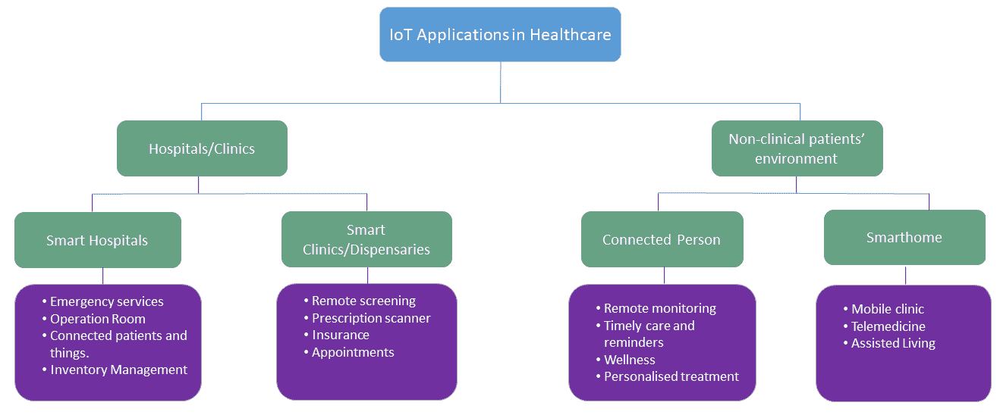

以下是物联网医疗保健的主要子领域:

*   **智能医院**:在全球范围内，无论是发达国家还是发展中国家，医院都人满为患。此外，他们缺乏资源(包括熟练的专业人员)和设备。在大多数国家的农村地区，情况非常糟糕，那里的人们很少或根本没有医疗设施。在这种情况下，基于物联网的远程服务，如远程监控和远程医疗，可以提供许多基本的医疗服务。此外，对老年患者和慢性病患者的远程监控可以大大降低医疗保健相关成本，并提高患者和医疗保健专业人员的生活质量。智能和互联救护车可以提供即时和紧急服务，并减少与紧急服务相关的事故。在手术室中，联网的医生(本地和外部)、工作人员和医疗设备可以提供更好、更顺畅的手术环境。此外，医院的库存管理可以通过物联网应用得到极大改善。
*   **诊所**:许多人去**全科医生****(****【GP】**)诊所或诊所接受初级保健服务。这些服务提供商也可以从使用物联网应用中受益。例如，全科医生可以查看和分析虚拟患者的病理报告，这为双方节省了时间。重要的是，与信息收集相比，患者将有更多时间进行与护理相关的讨论。诊所可以实时核实患者的保险范围。诊所和全科诊所的预约管理是一项全球性挑战。在英格兰，每年约有 1500 万人错过预约，这给国家医疗服务系统造成了数百万英镑的损失。这种情况可以通过基于物联网的应用来改善。
*   **非临床患者环境**:物联网的两个潜在应用领域可以连接起来——患者和智能家居。在这里，智能家居将随时随地为患者提供医疗服务。可以通过连接的患者应用程序远程监控指定的干预措施，如物理治疗。此外，患者可以获得个性化服务，如服药提醒。为老年人提供监测和医疗保健服务是全世界面临的巨大挑战。智能家居解决方案可以改善现有服务，并通过跌倒检测、药物提醒、远程医疗和一般辅助生活为这些高度脆弱的人群提供新的服务。

从前面的讨论中可以清楚地看到，物联网在医疗保健领域有着巨大的潜力。在下一节中，我们将简要讨论医疗保健中物联网的两个使用案例。


# 用例一——慢性病的远程管理

慢性病——包括心血管疾病、高血压和糖尿病——每年导致全球超过 4000 万人死亡。这个问题在发展中国家和发达国家有不同的层面。在发展中国家，慢性病患者很少或根本无法获得许多基本卫生服务，包括早期或及时检测设施，这导致许多人死亡。另一方面，在发达国家，医学研究导致预期寿命大幅提高。这是通过例如疾病的早期检测和监测来实现的。然而，在包括英国在内的发达国家，预期寿命每增加 2 年，我们只能获得 1 年的高质量生活。因此，我们生活中慢性病和残疾的比例正在上升。管理多种慢性病患者的成本高达数万亿美元/英镑。幸运的是，基于物联网的慢性病患者远程监控可以解决大部分问题，并提供经济高效的服务。


# 用例一的实现

我们正在考虑将基于物联网的远程患者监护应用用于用例一。下图简要介绍了基于物联网的远程患者监控和管理系统的工作方式:

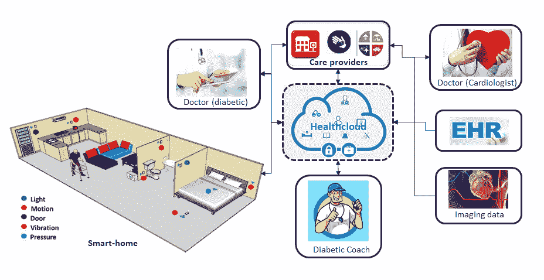

如图所示，基于物联网的远程患者监控系统包括三个主要元素，即智能家居、医疗服务提供商和健康云:

*   **智能家居**:这是解决方案的核心，包括患者和物联网解决方案的各种设备。智能家居由以下关键组件组成:
    *   **病人**:一个病人身上会附着多个传感器，包括**心电图**，血压传感器，加速度计，陀螺仪。这些传感器将收集生理和活动相关的数据，并将它们发送给护理提供者，以获得必要的实时反馈。
    *   **环境感知**:身体传感器和可穿戴设备不足以覆盖患者的所有活动。此外，由于多种原因，包括需要无缝运动，患者对身体上有太多传感器感到不舒服。智能家居将安装各种环境传感器，包括光线、振动、运动、压力和门传感器。这些传感器将提供关于患者的上下文信息。
    *   边缘计算平台(Edge computing platform):我们有各种组件选项，例如，智能手机/平板电脑、边缘网关或 Raspberry Pi 3。对于这个用例，我们正在考虑一个树莓 Pi 3。前面提到的所有传感器都可以连接到树莓 Pi 3。大多数将持续感知环境和/或患者的活动，其他的将是事件驱动的(例如，如果有人开门或敲门，门传感器将被激活)。这些传感器将数据发送到 Raspberry Pi 3 进行进一步处理，包括检测高血压或体温或跌倒等事件。最后，这些经过处理的数据将通过家庭路由器和健康云发送给医护人员。重要的是，Raspberry Pi 3 将安装各种预训练的 DL/ML 模型，包括用于检测任何心脏相关异常的心电图测量分类器。
*   **用于模型学习和数据分析的健康云:**健康云是一个云计算平台，主要用于医疗保健相关服务，主要负责以下工作:
    *   DL 模型训练
    *   数据分析

模型训练组件将训练必要的 DL 模型，用于对来自患者的各种生理信号和上下文数据进行分类或归类，以做出明智的决策。健康云将从 Raspberry Pi 3 接收各种数据，其中一些数据可能会相互冲突。在这种情况下，数据分析工具将分析并向医疗保健专业人员提供数据以进行决策。

*   **护理提供者**:护理提供者可以是提供护理服务的医院或诊所。由于许多患者患有多种慢性疾病，大多数人需要直接或间接与一名以上的专科医生联系。一旦医生收到关于患者及其环境的信息，他们将在其他数据的支持下做出决定，包括来自**电子健康记录(EHR)** 的历史数据。一旦做出决定，它将被发送回患者，并且如果必要，将通过连接到患者的适当设备(例如胰岛素泵)来执行决定。

基于心电图的心脏健康检查是上述用例的基本要素。在本章的第二部分，我们将描述前面用例中基于 DL 的 ECG 测量分类的实现。


# 用例二——物联网用于痤疮检测和护理

痤疮是世界上最常见的皮肤病之一。大多数人，在他们一生中的某个时候，都会受到痤疮的影响。一般痘痘在脸上发展，表现为斑点(如下图)和油性皮肤。有时，皮肤摸起来会变热或疼痛。痤疮可表现为白头、黑头、脓疱、丘疹、囊肿和结节。前三种也被称为粉刺。不同类型的痘痘需要不同的治疗和护理；因此，痤疮的检测和自动分类可能是有用的。痤疮可能会与三种类似的疾病之一混淆——酒渣鼻、湿疹或过敏反应——因为患者经常自我诊断和治疗。不正确的诊断和治疗会使病情恶化。下图显示了痤疮的两个例子:

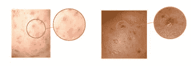

一般来说，对于许多受影响的人来说，痤疮不仅是身体健康问题，也是心理健康问题。根据研究，痤疮与抑郁症有明显的联系。在《英国皮肤病学杂志》发表的一项研究中，研究人员分析了英国 1986 年至 2012 年间痤疮患者的记录，对这些患者的心理健康问题提出了强烈的主张。他们得出结论，与没有痤疮的患者相比，痤疮患者患抑郁症的风险高出 63%。

在这一章中，我们将介绍一种使用物联网和 DL 模式来解决痤疮检测/诊断问题的创新解决方案。


# 用例二的实现

大多数患有痤疮和相关皮肤病的人使用镜子来检测痤疮并监控治疗的进展。因此，创新的想法是创建一个智能和连接的镜子，以帮助用户检测和识别皮肤(主要是面部)异常，包括痤疮。

下图展示了用于实现自动化痤疮检测、分类和护理服务的物联网基础设施:

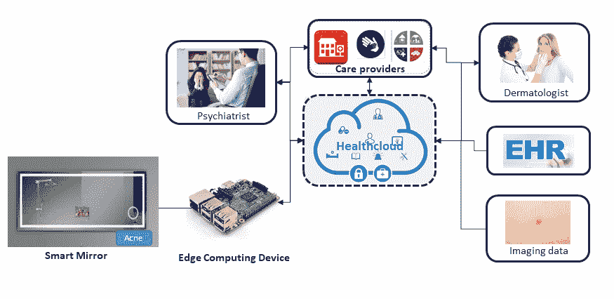

如图所示，基于物联网的自动化痤疮检测、分类和护理系统包括三个主要元素-智能镜子、护理提供商和健康云:

*   **智能镜子**:这是解决方案的核心，包括以下三个组件:
    *   **摄像头**:这款镜子内置了一个高分辨率摄像头，可以捕捉面部图像。镜子中会有一个按钮来启动检测过程，因为患者可能并不总是对这项服务感兴趣或需要这项服务。镜子还将具有小显示器，以呈现护理提供者对痤疮的结果和/或建议的治疗。

*   **用于模型学习和数据的健康云**:健康云是一个云计算平台，主要用于医疗保健相关服务。该云平台将用于训练 DL 模型，用于痤疮和其他皮肤状况的基于图像的检测和分类。健康云还负责更新树莓 Pi 3 或物联网设备中的任何预装模型。
*   **护理提供者**:护理提供者可以是提供护理服务的医院和诊所。由于痤疮可能会导致抑郁症，我们正在考虑两位潜在的医生——一位皮肤相关问题的皮肤科医生和一位抑郁症相关问题的精神科医生。一旦医生收到检测到的信息和图像，他们将在其他数据的支持下做出决定，包括患者的历史图像。最后，建议的治疗或反馈将被发送回患者。

在下面的部分中，我们将描述上述用例所需的基于 DL 的解决方案的实现。所有必要的代码都可以在本章的代码文件夹中找到。


# 医疗保健 DL

DL 模型正在发展成为每个行业最强大和最有效的计算资源。它们通过改善用户体验和实现更明智的决策，为行业价值做出了巨大贡献。医疗保健是数据挖掘的关键应用领域之一，随着异构医疗保健数据可用性的增加，数据挖掘得到了进一步的发展。

与许多其他行业不同，健康和医疗行业正在许多领域获得高附加值的应用，包括研究、创新和现实世界的医疗环境。这些应用程序中有许多是面向患者的(例如癌症的早期检测和预测，以及个性化医疗)，还有一些是为了在医疗保健 IT 的各个方面改善用户体验。下图突出显示了医疗保健中数字图书馆的一些应用领域:

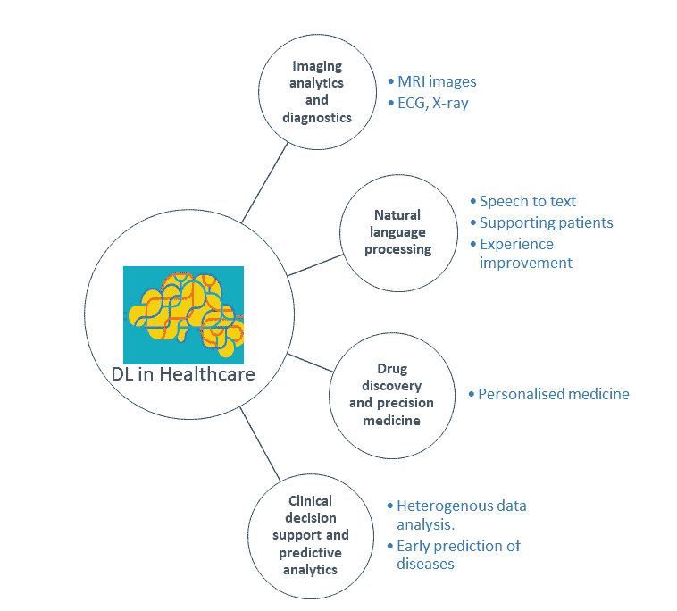


# CNN 和 LSTM 在医疗保健领域的应用

医疗保健应用会产生大数据，这些数据来自不同格式的不同来源。其中大量数据，包括来自**磁共振成像** **(MRI)** 、x 光和超声波的筛查和诊断数据都是图像格式。人体生理信号，如**肌电图** ( **肌电图**)、**脑电图** ( **脑电图**)、心电、**眼电**、**、【EOG】**检测到的信号，都是时间序列数据。EHR 包括结构化(如诊断、处方和实验室检查)和非结构化(如自由文本临床记录)的临床数据。此外，高通量生物学，如基因组学，产生关于人类内部结构的高维数据。所有这些不同的医疗保健数据都需要 ML(尤其是 DL)的支持，以提取有价值的信息并洞察任何潜在的问题。

许多 DL 模型已被用于分析这些异构的医疗保健数据。CNN 和 LSTMs (RNNs)是使用最广泛的 DL 模型，因为它们的特性适用于大多数医疗保健数据类型。例如，CNN 模型最适合图像处理，用于各种医学图像。相比之下，LSTMs/RNNs 最适合大多数生理信号，因为它们具有处理信号时间属性的记忆功能。ECG 测量是筛选心血管疾病的关键生理信号之一。因此，远程患者监护系统包括一个基于 DL 的 ECG 信号分析仪，用于检测各种心脏状况，如**房颤** ( **房颤**)。

考虑到 ECG 信号的时间特性，我们将考虑采用 LSTM 来实现远程患者监护系统。此外，我们将测试 CNN 的 ECG 信号作为比较。基于物联网的痤疮检测和护理系统将依赖于图像。因此，我们将使用 CNN 架构来实现这一点。这两个 DL 模型在章节中都有简要介绍；请参考这些内容进行概述。


# 数据收集

出于多种原因，包括隐私和道德问题，为健康和医疗保健应用收集数据是一项具有挑战性的任务。在这种情况下，我们决定为两个用例使用两个不同的开源数据集。


# 用例一

用例一的 ECG 数据集是从 2017 年生理网络/心脏病学计算挑战赛中收集的。该数据集包含 8，528 次心电图测量。这些测量是通过 AliveCor 手持设备记录的(如下图所示)，有趣的是，这是一个医疗保健物联网应用示例:


ECG 测量的采样速率为 300 Hz，噪声通过 AliveCor 设备的带通滤波消除。每个记录的测量符合 MATLAB V4 WFDB 格式，由两个文件组成:

*   扩展名为`.mat`的文件，显示主要的 ECG 信号信息
*   扩展名为`.hea`的相应头文件，包含测量的波形相关信息

数据集由四种不同类别的信号组成:正常节律、房颤、其他节律或噪音太大而无法分类。下图显示了这些不同类别的 ECG 信号:


房颤的特征是心房快速而不规则的跳动，表明心律不正常。其他异常心律被视为其他心律类别。最后，任何不反映这三个类别之一的测量值(因为它们噪声太大而无法分类)被定义为噪声测量值。基于 DL 模型的分类器需要在测量中提取这些特征，以对从患者记录的信号以及相应的心脏相关问题进行分类。为了更好地理解和实际实现，有必要对 ECG 信号进行进一步的研究，这不在本书的讨论范围之内。下图显示了正常与房颤心脏信号的测量结果:


# 用例二

对于痤疮检测和护理系统用例，我们依赖于图像数据集。我们收集了来自皮肤疾病图谱的图片，这是一个关于各种皮肤疾病的开源数据库。该数据库包含 23 个数据集，每个数据集涉及不同的皮肤病，每个类别(包括痤疮和酒渣鼻)都有子类。数据集不容易下载，因为页面太多。我们已经使用 Python 漂亮的 Soup 模块编写了一个图像或图像刮刀，并且我们已经将刮刀通用化，以便读者可以在不同的皮肤病上测试他们的 LSTM/CNN 模型。刮刀`image_scraper.py`在章节的代码子文件夹`use-case-2`中可用。要废弃所有 23 个数据集，请运行以下命令:

```
python image_scraper.py
```

以下截图显示了所有类型皮肤病的下载图像文件夹:

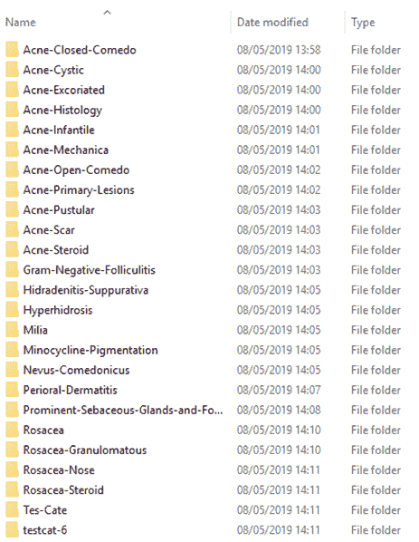


# 数据探索

在下一节中，我们将探索用于这两个用例的数据集。这些措施如下:

*   心电图数据集
*   痤疮数据集


# 心电图数据集

下图显示了 ECG 数据集的快照，包括四类数据。如图所示，每个信号都有可供 DL 模型利用的独特特征:


我们可以使用本章的`use-case-1`代码文件夹中的可用代码`ecg_singal_explorer.py`来生成这个探索结果或类似的结果。


# 痤疮数据集

我们使用了痤疮和酒渣鼻图像数据集。下面的屏幕截图显示了数据集的文件夹视图，包括类中图像的数量。不幸的是，正如我们所看到的，只有四个文件夹或类有 100 个或更多的图像:

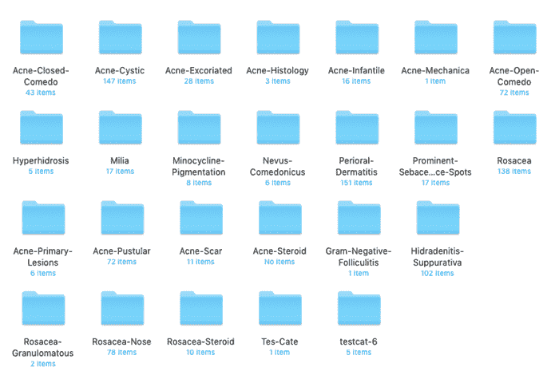

由于我们使用的是 MobileNet v1 架构，任何少于 100 个图像的类都可能显示错误。事实上，我们已经对此进行了测试，并发现了与数据大小相关的错误。在这种情况下，我们选择了一个精简的数据集，它只包含四类数据，这些数据包含 100 多幅图像。

以下屏幕截图显示了探索后减少的痤疮数据集:


# 数据预处理

数据预处理是 DL 管道的一个重要步骤。ECG 数据集还不能用于模型训练和验证。ECG 信号的预处理器分别包含在模型训练和验证代码`LSTM_ECG.py`和`CNN1D_ECG.py`中。他们将在预处理`.mat`输入数据后运行模型。然而，痤疮图像数据集已准备好用于训练和验证。


# 模特培训

正如我们前面提到的，我们使用 LSTM 和 CNN，特别是 1D CNN，作为用例一。对于用例二，我们使用 MobileNet v1。所有这些 DL 实现都支持迁移学习，不需要从头开始培训就可以在物联网设备中使用它们。


# 用例一

我们使用 LSTM 五层架构进行 ECG 数据分类，如下图所示:


我们可以通过运行章节的代码文件夹`use-case-1`子文件夹中的`LSTM_ECG.py`文件来训练和测试模型:

```
python LSTM_ECG.py
```

对于远程患者管理系统中的 ECG 数据，我们还测试并验证了 CNN 模型。下图显示了我们用于 ECG 数据集的 CNN 架构。正如我们所见，CNN 架构由四个卷积层组成:


我们可以通过运行`CNN1D_ECG.py`文件来训练和测试模型，该文件可以在章节的代码文件夹`use-case-1`子文件夹中找到:

```
python CNN1D_ECG.py
```


# 用例二

我们在第二个用例中使用了 MobileNet v1。下图显示了模型的体系结构:

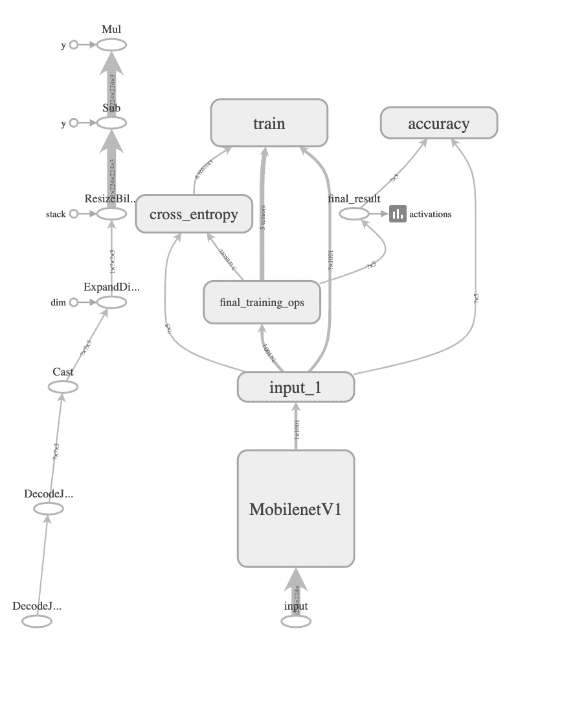

为了在 acne 数据集上训练和验证模型，我们需要运行章节的代码文件夹`use-case-2`子文件夹中的`retrain_CNN.py`文件。为了训练和测试模型*、*，我们只需要在命令提示符下运行以下命令。

```
python retrain_CNN.py \
--output_graph=trained_model_mobilenetv1/retrained_graph.pb \
--output_labels=trained_model_mobilenetv1/retrained_labels.txt   \
--architecture mobilenet_1.0_224 \
--image_dir= dataset-Acne-reduced
```

MobileNet v1 训练的最后两个参数是必选的，其余是可选的。


# 模型评估

我们评估了模型的三个不同方面:

*   学习/(再)培训时间
*   存储要求
*   性能(准确性)

在训练时间方面，在一台有 GPU 支持的台式机(英特尔 Xenon CPU E5-1650 v3 @3.5 GHz 和 32 GB RAM)上，心电图数据上的 LSTM 和 CNN 1D 耗时超过 1 小时，acne 数据集上的 MobileNet v1 耗时不到 1 小时。

在资源受限的物联网设备中，模型的存储要求是一个重要的考虑因素。以下屏幕截图显示了我们针对两种使用情形测试的三种型号的存储要求:


如图所示，LSTM 的保存模型占用了 234 MB 的存储空间，CNN 1D 占用了 8.5 MB，而 MobileNet v1 (CNN)占用了 16.3 MB。在存储需求方面，除了当前版本的 LSTM，所有模型都可以部署在许多资源受限的物联网设备上，包括 Raspberry Pi 3 或智能手机。

最后，我们对模型的性能进行了评估。在这两个使用案例中，在桌面 PC 平台/服务器端的培训阶段执行了数据集范围的评估或测试，但我们也可以在 Raspberry Pi 3 或任何物联网边缘计算设备中测试它们，因为模型是可转移的。


# 模型性能(用例一)

下面的屏幕截图显示了 ECG 数据集上使用的 LSTM 的训练和验证结果。如截图所示，测试精度始终非常接近 1.0 或 100%。然而，验证准确性并不高，对于模型的两次不同运行(100 和 500 个时期)，在 50%的范围内。以下截图显示了 LSTM 模型在培训阶段的进展情况:

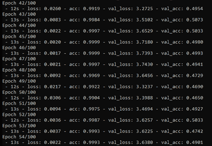

下图通过 TensorBoard 的日志文件生成，显示了 LSTM 模型在心电图数据集上的训练准确性:


下图显示了心电图数据的 LSTM 模型验证结果的混淆矩阵:


该矩阵清楚地强调了 LSTM 模型在 ECG 数据上表现不佳的事实。特别是，它无法识别大多数房颤测量值(异常心律)。

LSTM 在心电图数据集上的糟糕表现促使我们在数据集上测试 CNN 1D 模型。下图显示了 CNN 1D 模型在心电图数据集上的表现。如图所示，CNN 的一维模型测试精度始终远高于 0.96 或 96%(略低于 LSTM 模型)，重要的是，其验证精度始终在 0.82 范围内，远高于 LSTM 的验证精度。具有这种精确度的模型应该能够在大多数情况下对患者的正确心律进行分类，并相应地进行报告。下面的截图显示了 CNN 1D 模型在训练阶段的进展以及最终的训练和验证准确性:


下图通过 TensorBoard 的日志文件生成，显示了 CNN 1D 模型在心电图数据集上的验证准确性:

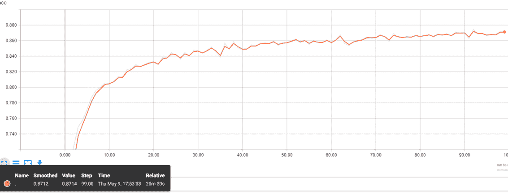

下图显示了心电图数据的 CCN·1D 模型验证结果的归一化混淆矩阵:

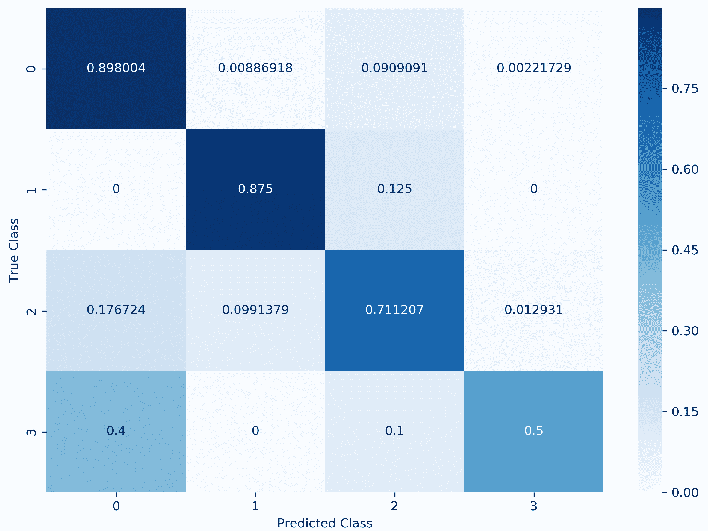

该矩阵清楚地强调了这样一个事实，即该模型在 ECG 数据上的表现比 LSTM 模型好得多。重要的是，它成功识别了大多数(87.5%)房颤测量值(异常心律)。

CCN 1D 模型的性能可以改进；通过使模型的网络更密集，它甚至可以非常接近 100%。然而，这将使模型变得复杂，并且训练的模型将需要更多的内存，使其不适合资源受限的物联网设备。


# 模型性能(用例二)

我们已经在减少的痤疮数据集上训练和验证了 MobileNet v1 模型。下面的截图展示了模型的评估结果。从截图中我们可以看到，训练准确率为 1.0，或者大部分步骤为 100%，最终测试准确率为 0.89，或者 89%:

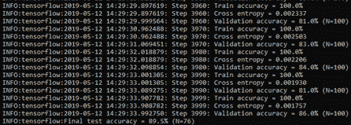

下图使用模型的训练和验证精度日志文件在 TensorBoard 中生成，显示训练精度在早期步骤中有点不一致，之后一直接近 1.0 或 100%。另一方面，在 80-89%的范围内，验证准确性有点不一致:

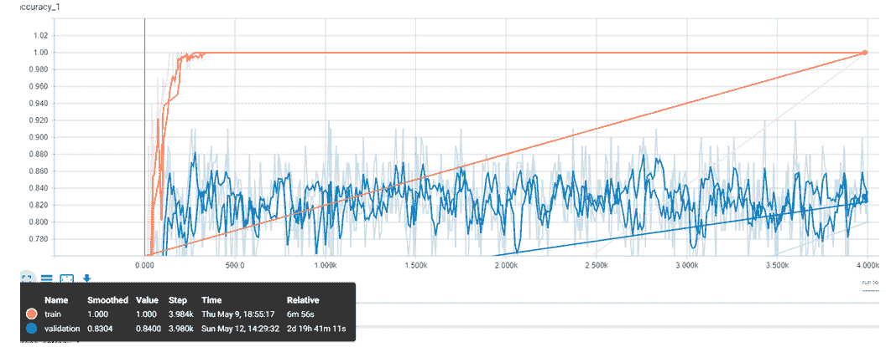

我们相信，即使存在这种不一致性，该模型也应该能够在超过 80%的情况下检测出痤疮的类型。


# 摘要

医疗保健行业正在各种应用中采用 ML 和 DL。物联网医疗应用需要采用 ML 和 DL 技术来真正实现医疗物联网。在本章中，我们试图展示基于 DL 的物联网解决方案如何有用，以及它们如何在医疗保健应用中实现。在本章的第一部分，我们概述了物联网在医疗保健领域的各种应用。然后，我们简要讨论了两个通过 DL 支持的物联网解决方案改善和/或自动化医疗服务的用例。在本章的第二部分，我们展示了基于 DL 的医疗事故和/或皮肤病的实际操作体验，这是两个使用案例的检测部分。

DL 在物联网应用中的使用正在兴起。然而，为了从这两种激动人心的技术的集成中获得最佳结果，需要尽快解决与 DL 技术和物联网相关的挑战。在下一章也是最后一章，我们将确定并讨论这些挑战。此外，我们将提供一些未来的方向来减轻一些问题。


# 参考

*   Bahar Farahani、Farshad Firouzi、Victor Chang、Mustafa Badaroglu、Nicholas Constant 和 Kunal Mankodiya，*走向雾驱动的物联网电子医疗:物联网在医疗保健领域的承诺和挑战*，《未来一代计算机系统》，第 78 卷，第 2 部分，2018 年，第 659-676 页
*   错过的 GP 预约花费 NHS 数百万:[https://www . England . NHS . uk/2019/01/missed-GP-appointments-costing-NHS-millions/](https://www.england.nhs.uk/2019/01/missed-gp-appointments-costing-nhs-millions/)
*   世界卫生组织，(2017 年 9 月 10 日)，*非传染性疾病*:[http://www.who.int/mediacentre/factsheets/fs355/en/](http://www.who.int/mediacentre/factsheets/fs355/en/)
*   MACAELA MACKENZIE，*痤疮会扰乱你心理健康的所有方式*:[https://www . allure . com/story/how-Acne-affects-Mental-Health-depression](https://www.allure.com/story/how-acne-affects-mental-health-depression)
*   Vallerand IA、Lewinson RT、Parsons LM、Lowerison MW、Frolkis AD、Kaplan GG、Barnabe C、Bulloch AGM 和 Patten SB: *英国痤疮患者的抑郁风险:一项基于人群的队列研究*，Br。J. Dermatol，(2018) 178(3): e194-e195
*   里卡多·米奥托，，，，江和乔尔·T·达德利，*医疗保健的深度学习:回顾、机遇和挑战*，《生物信息学简报》，第 19 卷，第 6 期，2018 年 11 月，第 1236-1246 页
*   戈德堡尔、阿马拉尔兰、格拉斯 L、豪斯多夫、伊万诺夫 PCh、马克 RG、米耶图斯、穆迪 GB、彭 C-K、何鸿燊。*生理银行、生理工具包、生理网:复杂生理信号新研究资源的组成*，*循环* (2000) 101(23): e215-e220
*   阿里维科:[https://www.alivecor.com/](https://www.alivecor.com/)
*   *Dermnet* *皮肤病图册*:[http://www . derm net . com/derm ody-pictures-Skin-Disease-pictures/](http://www.dermnet.com/dermatology-pictures-skin-disease-pictures/)