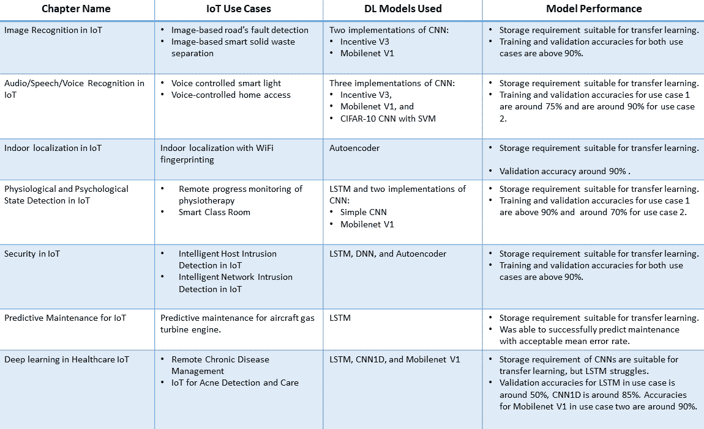

# 下一步是什么-总结和未来方向

物联网的使用将通过各种应用在我们的生活中无处不在，包括互联医疗、智能家居和智能城市。尽管物联网应用令人兴奋，但在完全实现之前，还有重大的科学和技术挑战需要克服。物联网的一个关键技术挑战是设计和开发**深度学习** ( **DL** )模型，这些模型在资源受限的物联网设备或边缘/雾计算设备中运行良好，并满足实时响应要求。在最后一章中，我们将首先总结前面的章节，然后使用示例讨论现有 DL 技术在开发和实现资源受限的嵌入式物联网环境时面临的主要挑战。最后，我们将总结一些现有的解决方案，并指出一些可以填补基于 DL 的物联网分析空白的潜在解决方案。

我们将在本章中涉及的主题如下:

*   我们在这本书里做了什么？
*   面向资源受限物联网设备的 DL 模型的设计和开发挑战
*   在资源受限的物联网设备中支持 DL 的现有解决方案
*   潜在的未来解决方案

# 我们在这本书里讨论了什么？

大多数物联网应用正在产生——并将产生——大或快速/实时流数据。分析这种大数据或数据流对于学习新信息、预测未来洞察力和做出明智决策至关重要。包括 DL 在内的机器学习是这种分析的关键技术。最近，在物联网应用中使用 DL 模型进行数据分析取得了进展。然而，缺少物联网环境中 DL 模型的整体应用视图。在本书中，我们通过展示不同领域的物联网应用及其基于 DL 的实现，努力填补这一空白。

在本书的第一章中，我们介绍了物联网及其关键应用的概述，以及物联网解决方案的三层端到端视图，这有助于了解和应用物联网生态系统中基于 DL 的数据分析。我们概述了 DL 及其流行的模型和实现框架，包括 TensorFlow 和 Keras。在剩余的章节(3-9)中，我们通过各种用例展示了不同物联网应用领域中 DL 模型提供的各种通用服务(如图像处理)。下表根据每章中的主要活动总结了这些章节:

从表中可以看出，CNN 及其变体在大多数情况下都被使用。一个潜在的原因可能是 CNN 模型在图像数据集上表现非常好，大多数数据集要么是图像，要么可以转换为图像(如语音数据)。表中以及章节中给出的模型性能并不是最终的性能值；相反，它们是指示性的性能值，因为 DL 模型对数据的结构和大小很敏感。数据集和/或 DL 架构结构的变化可能会改变 DL 模型的性能。一般来说，与浅层模型相比，DL 模型适用于具有广泛特征的大型数据集。

DL 解决方案在资源受限的物联网设备中的部署挑战

尽管物联网应用用例(本文展示了基于 DL 的实现)展示了 DL 在物联网中的潜力，但在许多方向仍存在一些开放的研究挑战。特别是，许多领域需要研究和发展支持。研究和开发的几个关键领域是数据集预处理、安全和隐私感知的 DL、处理大数据的各个方面以及资源高效的培训和学习。在以下几节中，我们将从机器学习的角度，以及从物联网设备、边缘/雾计算和云的角度，简要介绍这些剩余的挑战。

# 机器学习/DL 视角

最近，机器学习和 DL 技术被用于各种应用领域，以做出明智的决策。然而，有一些挑战是机器学习和 DL 特有的。这些措施如下:

# **缺乏大型物联网数据集**:许多物联网应用领域正在采用 DL 进行数据分析。不幸的是，包括这本书在内的大多数现有作品都依赖数据集进行模型训练和测试，而这些数据集并非来自物联网应用和/或现实生活中的应用。这样做的后果之一是，许多特定于物联网的问题没有在模型中得到显著反映。例如，物联网设备比通用计算设备更容易出现硬件故障。在这种情况下，在物联网用例中使用通用计算数据可能会提供不正确的事件预测。此外，硬件故障可能会被报告为安全事故。此外，这些数据集大多不够大，不足以克服过拟合。

所有这些与数据集相关的问题都是部署和接受基于 DL 的物联网分析的重要障碍。数据集是经验验证和评估的一个关键要求，即物联网系统将在真实世界中工作，没有问题或问题很少。可用数据集的可访问性是许多人面临的另一个大问题，包括本书中的我们。医疗保健和人体活动检测是物联网的大应用领域；然而，他们的相关数据通常受版权保护或出于隐私考虑，限制我们完全自由地使用这些数据。许多网络资源已经编辑了一个有用数据集的总列表。类似类型的收集将对物联网应用程序开发人员和研究人员有很大帮助。

*   **预处理** : 预处理是数据挖掘中必不可少的一步，它将原始数据处理成合适的表示形式，以供数据挖掘模型使用。与 DL 的许多其他应用领域不同，这在物联网应用中是一个挑战，因为物联网传感器和/或物生成的数据具有不同的格式。例如，考虑一个远程病人监控物联网应用。应用程序需要使用各种传感器，它们以不同的格式生成数据。为了使用这些数据并对患者做出正确的集体决策，我们需要在将数据应用到 DL 模型之前对其进行预处理。

**安全和隐私保护 DL** : 安全和隐私是物联网面临的头号挑战。因此，大多数物联网应用都致力于在数据的端到端生命周期中保证数据安全和隐私。大多数情况下，物联网大数据将通过互联网传输到云端进行基于 DL 的分析，因此可以被世界各地的人或设备看到。许多现有的应用程序依赖数据匿名来保护隐私；这些技术不是防黑客的。有趣的是，大多数人都在谈论物联网设备产生的数据的安全性和隐私，但操作的安全性如何，包括机器学习和对这些数据运行的 DL？事实上，DL 训练模型也可能受到各种恶意攻击，包括**虚假数据注入** ( **FDI** )或异常样本输入。通过这些攻击，物联网解决方案的许多功能性或非功能性需求可能会处于严重的危险之中，或者它们可能会使解决方案对预定目标无用甚至危险。因此，机器学习和 DL，模型需要配备一种机制来发现异常或无效的数据。在主模型之上的数据监控 DL 模型可能是一个潜在的解决方案。需要进一步研究和开发安全解决方案，以防御和防止 DL 模型遭受这些攻击，并使物联网应用变得有用和可靠。

*   **大数据问题(六个 v)**:**物联网应用是大数据产生的一大贡献者。因此，DL 面临的大数据挑战也是 DL 面临的物联网挑战。物联网大数据的每一个特征(六个 V:数量、多样性、准确性、速度、可变性和价值)都对数据挖掘技术提出了挑战。在以下几点中，我们将简要讨论他们面临的挑战。**
***   巨大的数据量给 DL 带来了巨大的压力，尤其是在时间和结构复杂性方面。在实时物联网应用中，时间是一个严重的问题。大量的输入数据、其异构属性以及其分类可变性可能需要高度复杂的 DL 模型，该模型可能需要更长的运行时间和巨大的计算资源，而这些在大多数物联网应用中是不可用的。DL 模型一般擅长处理模型学习过程中的噪声和未标记。然而，物联网的大量嘈杂和未标记的数据可能会面临问题。*   来自异构源和/或设备的物联网数据格式的异构性(多样性)可能是物联网应用中 DL 模型的一个问题。如果这些来源相互冲突，这可能是一个严重的问题。许多物联网应用产生连续和实时的数据，它们需要实时响应，这在物联网设备中可能并不总是可行的。基于流的在线学习是一个潜在的解决方案。然而，需要进一步研究来整合 DL 模型的在线和顺序学习方法，以解决物联网中数据的速度问题。*   在医疗保健、无人驾驶汽车和智能电网等许多应用中，数据的真实性(准确性)是一项强制性要求，这可能会给物联网中的 DL 模型带来挑战。缺乏真实数据可能会使物联网大数据分析毫无用处。因此，需要在数据分析的每个层面检查数据的有效性和真实性。数据的可变性，例如数据流速率，可能会给流数据的在线处理带来额外的挑战。*   最后，清楚了解物联网应用及其相应大数据的商业价值至关重要。然而，大多数决策者不理解这种价值。*   The authenticity (veracity) of data in many applications, such as medical care, driverless cars, and the smart electrical grid, is an obligatory requirement that could pose challenges for DL models in IoT. Lack of authentic data could make the IoT big data analytics useless. Hence, data validation and authenticity need to be checked at every level of data analysis. The data variability, such as data flow rates, could cause additional challenges for the online processing of streaming data.*   DL 限制**

 **即使在各种应用领域取得了巨大的成功，DL 模型在未来仍有许多问题需要解决。例如，任何由人类无法识别的 DL 模型做出的错误声明都是一个问题。DL 模型缺乏回归能力是许多物联网应用的一个问题，因为它们需要某种回归作为其核心分析组件。很少有工作已经为 DL 模型中的回归能力集成提出了解决方案。我们需要在这个方向上做进一步的研究。

# 下图总结了与 DL 视角相关的主要挑战:

The following diagram summarizes the key challenges related to the DL perspective:

物联网设备、边缘/雾计算和云视角

正如我们在[第一章](7781d6f5-c3e4-4bf8-a9f2-9c3fc63caeeb.xhtml)、*物联网的端到端生命周期*中提到的，端到端物联网解决方案由三个不同的关键组件或层组成，主要包括物联网设备、边缘/雾计算和云平台。所有这些组件在 DL 实现方面都有自己的挑战。在下面的列表中，我们将简要讨论这些挑战:

# **资源受限的物联网设备** : 物联网设备在处理器、电池能量、内存和网络连接方面受到资源限制。为传统计算机开发的 DL 模型不一定能直接用在物联网设备上。重要的是，DL 模型的训练在物联网设备中是不可能的，因为训练过程是资源饥渴的操作。对于这本书来说，所有 DL 模型的训练都是在一台强大的桌面计算机或云上完成的。在某些情况下，资源非常稀缺，以至于预先训练的模型可能无法在其上运行以进行推理。如下面的截图所示，[第三章](b28129e7-3bd1-4f83-acf7-4567e5198efb.xhtml)、*物联网*中图像识别讨论的两个版本的 CNN 实现，用于图像分类需要大约 90 MB 来存储它们预训练的模型，而这个存储可能在许多物联网设备中不可用。因此，我们需要轻量级的 DL 模型，尤其是轻量级的预训练 DL 模型。许多现有解决方案可用于解决物联网设备相关问题，我们将在下一部分简要介绍这些解决方案:

*   **边缘/雾计算** : 边缘/雾计算正在成为物联网解决方案中一个流行的计算平台，特别是对于实时应用，因为这些应用中使用的数据不需要总是移动到云平台。然而，这项技术仍处于早期阶段，面临许多挑战，包括以下挑战:

**设备的 DL 服务发现** : Edge/fog 路由器或网关将在地理上分布，并将使用特定的 DL 模型向物联网终端用户/节点提供服务。例如，**雾节点**可以通过 CNN 提供图像分类服务，而另一个附近的节点可以使用 LSTM 提供入侵检测服务。在这种情况下，设备需要服务发现协议，该协议可以基于它们的需求和上下文高效地发现它们合适的数据分析服务。

*   **DL 模型和任务分配**:通过在不同的雾/边缘节点之间分担学习责任，雾计算可以依赖于分布式学习方法。这将需要一些时间来分割 DL 模型执行过程，以及它们的任务分配，这可能是实时物联网应用的一个问题。
    *   **作为边缘设备的移动设备**:智能手机无处不在，正在成为物联网生态系统中的关键元素。然而，这些设备在加入/离开网络方面的动态特性对于依赖它们的基于 DL 的分析服务来说是一个挑战，因为它们可以在任何时候离开网络。此外，为了给它们分配适当的任务，它们的能量使用和其他准确的资源相关信息需要在任务分配器处可用。
    *   **云计算:**云是物联网大数据分析必不可少的计算平台。然而，其响应时间和法律/政策限制(如可能需要从安全边界转移的数据)可能会成为许多物联网应用的问题。此外，物联网数据在处理和存储过程中的安全性和隐私性是许多物联网应用程序所关注的问题。
    *   **Mobile devices as edge devices**: Smart mobile phones are omnipresent, and are becoming a key element in the IoT ecosystem. However, the dynamic nature of these devices in terms of joining/leaving the network is a challenge for the DL-based analysis services relying on them, as they can leave the network at any time. In addition, their energy usage and other accurate resource-related information needs to be available at the task distributor in order to assign them appropriate tasks.
*   **Cloud computing:** The cloud is an essential computing platform for IoT big data analytics. However, its response time and legal/policy restrictions (such as data, which may need to move from a security boundary) can be an issue for many IoT applications. In addition, security and privacy of IoT data during processing and in storage is a concern for many IoT applications.

下图总结了物联网设备、边缘/雾计算和云前景方面的主要挑战:

在资源受限的物联网设备中支持 DL 的现有解决方案

一般而言，DL 模型需要计算超大数量(数百万到数十亿)的参数，这需要强大的计算平台和巨大的存储支持，这是物联网设备或平台所不具备的。幸运的是，现有的方法和技术(本书中没有使用，因为我们在桌面上进行了模型培训)可以解决物联网设备中的一些上述问题，从而支持物联网设备上的 DL:

# **DL 网络压缩** : DL 网络一般比较密集，需要巨大的计算能力和内存，这可能是物联网设备所不具备的。这甚至需要进行推理和/或分类。DL 网络压缩将密集网络转换为稀疏网络，是资源受限的物联网设备的潜在解决方案。许多现有的服务，包括 V1 V2 移动网络，已经测试了这项技术。例如，CNN 的激励 V3 架构可以使用 Mobilenet V1 架构从 87.0 MB 的存储压缩到 17.0 MB(正如我们在[第 3 章](b28129e7-3bd1-4f83-acf7-4567e5198efb.xhtml)、*物联网中的图像识别*中演示的那样)。然而，该方法仍然不够通用，不能用于所有的 DL 模型，并且压缩技术可能需要特定的硬件来执行操作。

**DL**的近似计算:这种方法通过将预测视为可接受值范围的一部分而不是精确值(如 95%的准确度)来工作，因为许多物联网应用可能不需要精确值。例如，许多事件检测应用只需要检测事件，而不需要事件预测准确度的精确值。近似计算将节省能源，但这不适合需要精确值的关键应用(如医疗保健)。

*   **加速器**:基于硬件的 DL 模型加速器最近得到了一些研究和开发的关注。可以使用特殊的硬件和电路来最小化内存占用，并提高能效，以便在物联网设备上运行 DL 模型。此外，软件加速可用于此。然而，加速器可能无法与传统的物联网硬件一起工作。
*   **Tinymotes** :研究人员正在开发依靠电池运行的微型节点，并通过支持硬件加速器进行基于板载数据分析的 DL。这些对于实时应用程序很有用。但是，它们是用于特殊用途的 DL 网络，安全性是它们的一个问题。
*   潜在的未来解决方案
*   在本节中，我们将简要讨论一些潜在的研发解决方案，以解决提到的一些问题:

# **分布式学习**:在本书中，模型学习或训练是集中进行的，但这在许多物联网应用中可能不可行。在这种情况下，分布式学习可能是一种潜在的解决方案。然而，分布式计算有一个安全问题，这可以通过*基于区块链的分布式学习*最小化。

**物联网移动数据**:智能手机是物联网激增的关键因素。通过 DL 模型进行移动大数据分析的高效解决方案可以在各种应用领域(包括智能城市)提供更好的物联网服务。这方面需要进一步研究。

*   **上下文信息的整合**:上下文信息对于正确使用和解释基于 DL 的数据分析是必不可少的。然而，使用物联网传感器数据很难理解物联网应用的环境背景。融合了物联网应用传感器数据的环境传感器数据可以提供上下文信息。因此，开发集成了上下文信息的基于 DL 的解决方案可能是另一个未来的方向。
*   **边缘/雾计算中的在线资源供应**:对于边缘/雾计算资源的需求可能是动态的，以便对流式物联网数据进行实时数据分析。因此，在线或需求驱动的资源供应对于为不同的物联网应用提供数据分析服务是必要的。对此有一些建议，但它们都集中在特定的应用领域。对于更广泛的物联网应用，进一步的研究是必要的。****
*   **半监督数据分析框架**:监督数据分析需要大量带标签的数据，这些数据对于许多物联网应用来说可能并不总是可用。通常，我们的未标记数据会比标记数据多。因此，半监督框架可能是一个更好的选择。有一些可用的计划，需要进一步的工作来支持该解决方案的采用。
*   **安全 DL 模型**:基于 DL 的数据分析只有在正确运行并且维护了它们的非功能性属性(比如可信度和可用性)的情况下才有用。然而，DL 模型可能成为各种恶意攻击的目标，使它们变得脆弱。这方面的研究和开发非常有限。这可能是一个潜在的研发方向。
*   摘要
*   这是最后一章，我们总结了前面几章的内容，然后讨论了现有 DL 技术在资源受限和嵌入式物联网环境中面临的主要挑战。我们已经从机器学习和物联网解决方案组件(如物联网设备、雾计算和云)的角度讨论了这些挑战。最后，我们总结了一些现有的解决方案，并指出了未来解决方案的一些潜在方向，这些解决方案可以填补基于 DL 的物联网分析的现有差距。

# Summary

This is the final chapter, and here we have presented a summary of the earlier chapters, and then discussed the main challenges faced by the existing DL techniques in resource-constrained and embedded IoT environments. We have discussed these challenges from both a machine learning perspective, and that of an IoT solution's components (such as IoT devices, fog computing, and the cloud). Finally, we summarized a  few existing solutions, and also pointed out some potential directions for future solutions that can fill the existing gaps for DL-based IoT analytics.

参考

*人工智能*:[https://skymind.ai/wiki/open-datasets](https://skymind.ai/wiki/open-datasets)

# *机器学习研究数据集列表**:*[https://en . Wikipedia . org/wiki/List _ of _ datasets _ for _ machine-learning _ research](https://en.wikipedia.org/wiki/List_of_datasets_for_machine-learning_research)

*   *物联网大数据和流分析的深度学习:一项调查*，M . Mohammad I，A Al-Fuqaha，S . Sorour 和 M Guizani，载于 *IEEE 通信调查&教程*，第 20 卷，第 4 期，第 2，923-2，960 页，*第四季度*，2018 年
*   用散列技巧压缩神经网络，W . Chen，J . T . Wilson，S . Tyree，K . Q . Weinberg er 和 Y . Chen，在第 32 届和第 3 届机器学习国际会议论文集，第 37 卷。JMLR: W & CP，2015
*   *用于回归和时间序列预测的集成深度学习*，载于集成学习中的计算智能(CIEL)，2014 年 IEEE 研讨会。IEEE，2014 年，第 1–6 页

*   *用于回归和时间序列预测的集成深度学习*，集成学习中的计算智能(CIEL)，2014 年 IEEE 研讨会。IEEE，2014 年，第 1–6 页
*   *Ensemble Deep Learning for Regression and Time Series Forecasting*, in Computational Intelligence in Ensemble Learning (CIEL), 2014 IEEE Symposium. IEEE, 2014, pages 1–6**