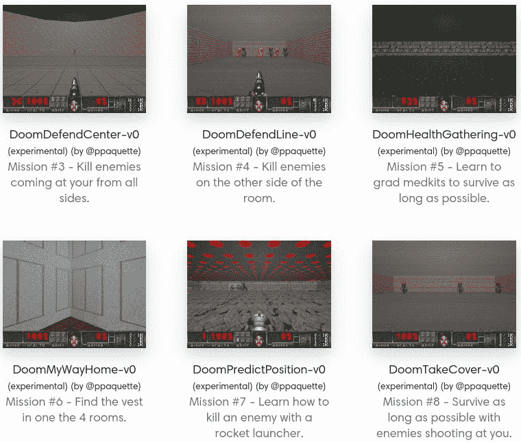
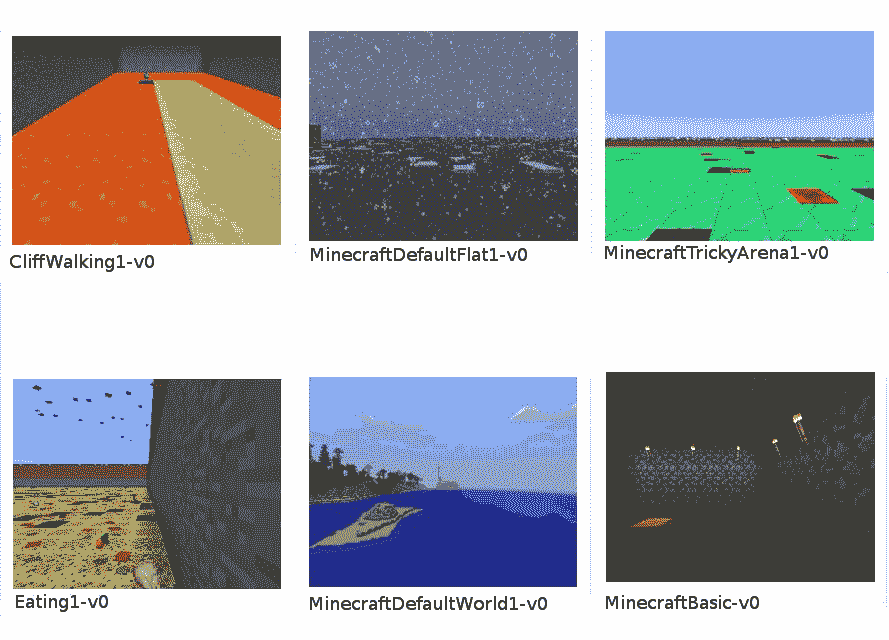
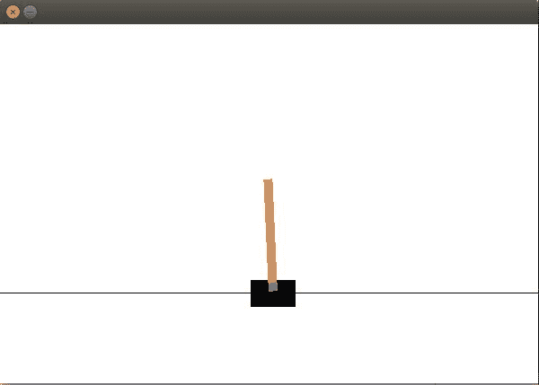

# 一、智能体和学习环境介绍

问候！欢迎阅读本书的第一章。这本书将向你介绍令人敬畏的 OpenAI Gym 学习环境，并引导你经历一段激动人心的旅程，让你具备足够的技能来训练最先进的人工智能体系统。这本书将通过实际项目，从开发自动驾驶汽车到开发可以超越人类表现的雅达利游戏智能体，帮助您开发强化学习和深度强化学习的实践经验。当你完成这本书时，你将能够探索使用人工智能解决算法任务、玩游戏和修复控制问题的无限可能性。

本章将涵盖以下主题:

*   理解智能体和学习环境
*   了解 OpenAI Gym 是怎么回事
*   可用任务/环境的不同类别，以及每个类别适用的简要描述
*   了解 OpenAI Gym 的主要特点
*   了解你可以用 OpenAI Gym 工具包做什么
*   创建和想象你的第一个 Gym 环境

让我们从理解什么是智能体开始我们的旅程。


# 什么是智能体？

人工智能的一个主要目标是构建智能体。感知他们的环境，理解，推理和学习计划，并作出决定和采取行动是智能体的基本特征。我们将从理解什么是智能体开始我们的第一章，从智能体的基本定义，到在此基础上增加智能。

一个*智能体*是一个基于对其环境的观察(感知)而行动的实体。人类和机器人是具有物理形态的智能体的例子。

人类或动物是一个智能体的例子，它使用其器官(眼睛、耳朵、鼻子、皮肤等)作为传感器来观察/感知其环境，并使用其身体(手臂、手、腿、头等)来行动。机器人使用其传感器(摄像机、麦克风、激光雷达、雷达等)来观察/感知其环境，并使用其物理机器人身体(机械臂、机器人手/抓具、机器人腿、扬声器等)来行动。

*软件智能体*是能够通过与环境交互来做出决定和采取行动的计算机程序。软件智能体可以体现为物理形式，例如机器人。*自主智能体*是自主地做出决定并根据他们对环境的观察的理解和推理采取行动的实体。

智能体是一个自主实体，它可以根据与环境的交互进行学习和改进。一个智能体能够使用它的观察来分析它自己的行为和性能。

在本书中，我们将开发智能体来解决顺序决策问题，这些问题可以在(松散的)马尔可夫环境中使用一系列(独立的)决策/行动来解决，其中至少在某些环境条件下，奖励信号形式的反馈是可用的(通过感知)。


# 学习环境

学习环境是系统的一个组成部分，在这里智能体可以被训练来开发智能系统。学习环境定义了智能体要完成的问题或任务。

一个问题或任务的结果依赖于一系列的决策或行动，这就是顺序决策问题。以下是一些不同的学习环境:

*   完全可观察与部分可观察
*   确定性与随机性
*   情节与顺序
*   静态与动态
*   离散与连续
*   离散状态空间与连续状态空间
*   离散动作空间与连续动作空间

在本书中，我们将使用通过 OpenAI Gym Python 库实现的学习环境，因为它提供了一个简单的标准接口和环境实现，以及实现新的自定义环境的能力。

在下面的小节中，我们将对 OpenAI Gym toolkit 有所了解。本节旨在让一个完全的新手熟悉 OpenAI Gym 工具包。不需要预先的知识或经验。我们将首先尝试对 Gym toolkit 有所了解，并浏览不同类别下可用的各种环境。然后我们将讨论你可能感兴趣的 Gym 特性，不管你感兴趣的应用领域是什么。然后，我们将简要讨论 Gym 工具包的价值主张以及如何利用它。在接下来的章节中，我们将在 Gym toolkit 的基础上构建几个很酷的智能体。所以，这一章是所有这些的基础。在本章的最后，我们还将快速创建并可视化我们的第一个 OpenAI Gym 环境。激动吗？让我们直接开始吧。


# 什么是 OpenAI Gym？

OpenAI Gym 是一个开源工具包，它提供了一系列不同的任务，称为环境，并提供了一个用于开发和测试智能体算法的通用接口。该工具包引入了一个标准的**应用编程接口** ( **API** )，用于与为强化学习设计的环境进行交互。每个环境都有一个版本，这确保了与不断发展的算法和环境本身进行有意义的比较和可重复的结果。

Gym toolkit 通过其各种环境，为强化学习提供了一个情节设置，其中智能体的经历被分解为一系列情节。在每一集里，主体的初始状态是从一个分布中随机抽取的，主体和环境之间的相互作用一直进行到环境达到终态。如果你不熟悉强化学习，不要担心。将在[第二章](part0033.html#VF2I0-22c7fc7f93b64d07be225c00ead6ce12)、*强化学习和深度强化学习*中向您介绍强化学习。

OpenAI Gym 库中可用的一些基本环境如以下截图所示:


OpenAI Gym 中可用的基本环境示例以及任务的简短描述

在写这本书的时候，OpenAI Gym 本身有大约 797 个环境，分布在不同的任务类别中。著名的 Atari 类别拥有大约 116 个(一半是屏幕输入，一半是 RAM 输入)环境的最大份额！工具包支持的任务/环境类别如下:

*   算法的
*   雅达利
*   棋盘游戏
*   Box2D
*   经典控件
*   厄运(非官方)
*   《我的世界》(非官方)
*   穆乔科
*   足球
*   玩具文本
*   机器人技术(新增)

下面给出了不同类别下可用的各种类型的环境(或任务),以及每个环境的简要描述。请记住，您可能需要在您的系统上安装一些额外的工具和软件包，以运行这些类别的环境。不要担心！在接下来的章节中，我们将详细介绍让任何环境启动并运行所需的每一个步骤。敬请期待！

我们现在将详细了解前面提到的类别，如下所示:

*   **算法环境**:它们提供需要智能体执行计算的任务，比如多位数的加法，从输入序列中复制数据，反转序列，等等。
*   雅达利环境(Atari environments):这些提供了几个经典雅达利主机游戏的接口。这些环境接口是在**街机学习环境** ( **ALE** )之上的包装器。他们提供游戏的屏幕图像或 RAM 作为训练智能体的输入。
*   棋盘游戏:这一类别拥有在 9 x 9 和 19 x 19 棋盘上运行流行游戏围棋的环境。对于那些一直在关注谷歌 DeepMind 在围棋比赛中的最新突破的人来说，这可能非常有趣。DeepMind 开发了一个名为 AlphaGo 的智能体，它使用强化学习和其他学习和规划技术，包括蒙特卡罗树搜索，击败了世界上排名第一的人类围棋选手，包括范辉和李·塞多尔。DeepMind 还发表了他们在 AlphaGo Zero 上的工作，AlphaGo Zero 是从零开始训练的，不像最初的 alpha go 使用人类玩的样本游戏。AlphaGo Zero 超越了最初 AlphaGo 的表现。后来 AlphaZero 发表了；这是一个自主系统，它通过自我游戏(没有任何人类监督的训练)学会了下棋、下围棋和下日本象棋，并达到了比以前开发的系统更高的性能水平。
*   **Box2D** :这是一个开源的物理引擎，用于模拟 2D 的刚体。Gym 工具包有一些使用 Box2D 模拟器开发的连续控制任务:


使用 Box2D 模拟器构建的环境示例列表

这些任务包括训练双足机器人行走，将月球着陆器导航到其着陆垫，以及训练赛车在赛道上行驶。激动人心！在本书中，我们将使用强化学习来训练一个 AI 智能体，让它在赛道上自主驾驶赛车！敬请关注。

*   **经典控制**:这个类别有许多为其开发的任务，在过去的强化学习文献中被广泛使用。这些任务为强化学习算法的早期开发和基准测试奠定了基础。例如，在经典控制类别下可用的环境之一是山地汽车环境，其由 Andrew Moore(CMU 计算机科学学院院长，匹兹堡创始人)在 1990 年的博士论文中首次提出。这种环境有时仍被用作强化学习算法的测试平台。在本章快结束的时候，你将从这个类别中创建你的第一个 OpenAI Gym 环境！
*   **Doom** :这个类别为流行的第一人称射击游戏 Doom 提供了一个环境界面。它是一个非官方的、社区创建的 Gym 环境类别，基于 ViZDoom，这是一个基于 Doom 的人工智能研究平台，提供了一个易于使用的 API，适用于从原始视觉输入开发智能体。它使得人工智能机器人的开发成为可能，这些机器人可以仅使用屏幕缓冲区玩几轮具有挑战性的末日游戏！如果你玩过这个游戏，你就会知道在游戏中不失去生命的情况下通过一些回合是多么惊险和困难！虽然这不是一个像一些新的第一人称射击游戏那样有很酷的图形的游戏，但除了视觉效果，这是一个很棒的游戏。最近，机器学习中的几项研究，特别是深度强化学习，已经利用了 ViZDoom 平台，并开发了新的算法来解决游戏中遇到的目标导向导航问题。您可以访问 ViZDoom 的研究网页(【http://vizdoom.cs.put.edu.pl/research】T2)获取使用该平台的研究列表。下面的屏幕截图列出了一些任务，这些任务在 Gym 中作为单独的环境提供，用于培训您的智能体:



厄运环境中可用的任务或回合列表

*   **MineCraft** :这是另一个伟大的平台。游戏人工智能开发者尤其可能对这种环境非常感兴趣。MineCraft 是爱好者中很受欢迎的视频游戏。MineCraft Gym 环境是使用微软的 Malmo 项目构建的，这是一个基于《我的世界》构建的人工智能实验和研究平台。在下面的截图中显示了 OpenAI Gym 中作为环境可用的一些任务。这些环境为开发解决方案以应对这一独特环境带来的挑战性新问题提供了灵感:



OpenAI Gym 提供的 MineCraft 环境

*   你对机器人感兴趣吗？你是否梦想开发出能够让人形机器人行走和奔跑的算法，或者像波士顿动力公司的 Atlas 机器人那样做后空翻？你可以！您将能够在 OpenAI Gym MuJoCo 环境中应用您将在本书中学习的强化学习方法来开发您自己的算法，该算法可以使 2D 机器人行走、奔跑、游泳或跳跃，或者使 3D 多足机器人行走或奔跑！在下面的截图中，MuJoCo 环境下提供了一些很酷的、真实世界的、类似机器人的环境:


*   **足球**:这是一个适合训练多个可以合作的智能体的环境。通过 Gym toolkit 获得的足球环境具有连续的状态和动作空间。想知道那是什么意思吗？当我们在下一章讨论强化学习时，你会学到所有的东西。现在，这里有一个简单的解释:连续的状态和动作空间意味着智能体可以采取的动作和智能体接收的输入都是连续的值。这意味着它们可以取任何实数值，比如说， *0* 和 *1* ( *0.5* ， *0.005* ，等等)，而不是局限于几个离散的值集合，比如{1，2，3}。有三种环境。普通足球环境初始化球场上的单个对手，并为进球给予奖励 *+1* ，否则给予奖励 *0* 。为了让智能体得分，它需要学习识别球，接近球，并将球踢向球门。听起来够简单吗？但是对于一台计算机来说，自己算出来真的很难，特别是当它得分时，你说的都是 *+1* ，而在其他任何情况下都是 *0* 。它没有任何其他线索！你可以开发智能体，让他们自己学习所有关于足球的知识，并学习使用你将在本书中学到的方法得分。

*   **玩具文字** : OpenAI Gym 在这个分类下也有一些简单的基于文字的环境。其中包括一些经典问题，如冰湖，目标是找到一条安全的路径穿过冰和水瓷砖的网格。它被归类在玩具文本之下，因为它使用了一种更简单的环境表示——主要是通过文本。

至此，你对 OpenAI Gym toolkit 提供的所有不同类别和类型的环境有了一个很好的了解。值得注意的是，OpenAI Gym 工具包的发布伴随着 OpenAI Gym 网站([gym.openai.com](http://gym.openai.com))，该网站为提交评估的每个算法维护了一个记分牌。它展示了用户提交的算法的性能，一些提交的内容还附有详细的解释和源代码。不幸的是，OpenAI 决定撤销对评估网站的支持。该服务于 2017 年 9 月下线。

现在你已经很好的了解了 OpenAI Gym 中各种类型的环境，以及每种类型为你提供了什么。接下来，我们将看看 OpenAI Gym 的关键特性，这些特性使其成为当今智能体开发中许多进步不可或缺的组件，特别是那些使用强化学习或深度强化学习的组件。


# 了解 OpenGym 房的特点

在这一节中，我们将看看使 OpenAI Gym toolkit 在强化学习社区中非常受欢迎并导致它被广泛采用的关键特性。


# 简单环境界面

OpenAI Gym 为环境提供了一个简单而通用的 Python 接口。具体来说，它将一个动作作为输入，并根据每个步骤的输出，提供*观察、奖励、完成*和可选的`info`对象。如果这对你来说还不是很有意义，不要担心。我们将以更详细的方式再次回顾界面，以帮助您理解。这一段只是给你一个界面的概述，让你清楚它有多简单。这为用户提供了极大的灵活性，因为他们可以基于他们喜欢的任何范例来设计和开发他们的智能体算法，并且由于这种简单和方便的接口，他们不会被约束使用任何特定的范例。


# 可比性和再现性

我们直觉地认为，我们应该能够将一个智能体或算法在特定任务中的性能与另一个智能体或算法在相同任务中的性能进行比较。例如，如果一个智能体在 Atari 的《太空入侵者》游戏中平均得分为*1000*，我们应该能够判断出这个智能体在相同的训练时间内，比一个在《太空入侵者》游戏中平均得分为 *5000* 的智能体表现更差。但是如果游戏的评分系统稍微改变一下会怎么样呢？或者环境界面是否被修改以包括关于游戏状态的附加信息，这将为第二智能体提供优势？这会使分数与分数的比较变得不公平，对吗？

为了处理环境中的这种变化，OpenAI Gym 对环境使用严格的版本控制。该工具包保证，如果环境有任何变化，它将伴随着不同的版本号。因此，如果 Atari Space Invaders 游戏环境的原始版本被命名为`SpaceInvaders-v0`，并且为了提供关于游戏状态的更多信息而对环境进行了一些更改，那么环境的名称将被更改为`SpaceInvaders-v1`。这个简单的版本控制系统确保我们总是在完全相同的环境设置下比较性能。这样，获得的结果具有可比性和可重复性。


# 监控进度的能力

作为 Gym 工具包的一部分，所有可用的环境都配有监视器。该监视器记录模拟的每个时间步长和环境的每次重置。这意味着环境会自动跟踪我们的智能体如何学习和适应每一步。您甚至可以将显示器配置为在您的智能体学习游戏时自动录制游戏视频。多酷啊。


# 用 OpenAI Gym 工具包可以做什么？

Gym toolkit 提供了一种标准化的方法来定义为解决问题而开发的环境的界面，这些问题可以使用强化学习来解决。如果你熟悉或听说过 **ImageNet 大规模视觉识别挑战赛** ( **ILSVRC** )，你可能会意识到一个标准的基准测试平台对加速研发的影响有多大。对于那些不熟悉 ILSVRC 的人，这里有一个简单的总结:这是一个竞赛，参赛团队评估他们为给定数据集开发的监督学习算法，并通过几个视觉识别任务竞争实现更高的准确性。这个通用平台，加上 AlexNet 推广的基于深度神经网络的算法的成功([https://papers . nips . cc/paper/4824-imagenet-classification-with-deep-convolutionary-neural-networks . pdf](https://papers.nips.cc/paper/4824-imagenet-classification-with-deep-convolutional-neural-networks.pdf))，为我们目前所处的深度学习时代铺平了道路。

以类似的方式，Gym toolkit 提供了一个通用平台来对强化学习算法进行基准测试，并鼓励研究人员和工程师开发可以为几项具有挑战性的任务实现更高回报的算法。简而言之，Gym toolkit 对于强化学习就像 ILSVRC 对于监督学习一样。


# 创造你的第一个 OpenGym 环境

我们将在[第 3 章](part0056.html#1LCVG0-22c7fc7f93b64d07be225c00ead6ce12)、*OpenAI Gym 和深度强化学习入门*中详细介绍设置 open ai Gym 依赖项和培训强化学习智能体所需的其他工具的步骤。本节提供了一种在 Linux 和 macOS 上使用`virtualenv`快速入门 OpenAI Gym Python API 的方法，这样您就可以偷偷摸摸地进入 Gym 了！

MacOS 和 Ubuntu Linux 系统默认安装 Python。您可以通过从终端窗口运行`python --version`来检查 Python 的安装版本。如果返回的`python`后面跟着一个版本号，那么您就可以继续下一步了！如果您得到一个错误，说没有找到 Python 命令，那么您必须安装 Python。请参考本书[第三章](part0056.html#1LCVG0-22c7fc7f93b64d07be225c00ead6ce12)、*open ai Gym 入门和深度强化学习*中的详细安装部分:

1.  安装`virtualenv`:

```
$pip install virtualenv
```

如果您的系统上没有安装 **pip** ，您可以通过键入`sudo easy_install pip`进行安装。

2.  使用 virtualenv 工具创建一个名为`openai-gym`的虚拟环境:

```
 $virtualenv openai-gym
```

3.  激活`openai-gym`虚拟环境:

```
$source openai-gym/bin/activate
```

4.  从上游安装 Gym 工具包的所有包:

```
$pip install -U gym
```

如果您在运行`pip install`命令时得到权限被拒绝或失败的错误代码 1，很可能是因为您试图将软件包安装到的目录(在本例中是`virtualenv`中的`openai-gym`目录)上的权限需要特殊/root 权限。您可以运行`sudo -H pip install -U gym[all]`来解决这个问题，或者通过运行`sudo chmod -R o+rw ~/openai-gym`来更改对`openai-gym`目录的权限。

5.  测试以确保安装成功:

```
$python -c 'import gym; gym.make("CartPole-v0");'
```


# 创造和想象一个新的 Gym 环境

在短短的一两分钟内，您已经创建了一个 OpenAI Gym 环境的实例，可以开始使用了！

让我们打开一个新的 Python 提示符并导入`gym`模块:

```
>>import gym
```

一旦导入了`gym`模块，我们就可以使用`gym.make`方法来创建我们的新环境，如下所示:

```
>>env = gym.make('CartPole-v0')
>>env.reset()
env.render()
```

这将弹出一个类似这样的窗口:



万岁！


# 摘要

恭喜你完成了第一章！希望你在创造自己的环境时玩得开心。在这一章中，你学习了 OpenAI Gym 是什么，它提供了什么特性，以及你可以用它做什么。你现在对 OpenGym 房有了很好的了解。在下一章，我们将复习强化学习的基础知识，给你一个良好的基础，这将帮助你在阅读本书的过程中构建你的智能体。激动吗？进入下一章！