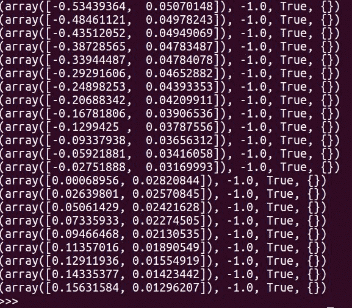

<title>Getting Started with OpenAI Gym and Deep Reinforcement Learning</title> 

# OpenAI 健身房和深度强化学习入门

介绍章节让你对 OpenAI Gym 工具包和强化学习有了很好的了解。在本章中，我们将直接让您和您的计算机做好开始开发代理所需的所有准备、安装和配置。更重要的是，您还将找到访问本书代码库的说明，其中包含完整阅读本书所需的所有代码，以及其他几个代码示例、有用的说明和更新。

在本章中，我们将讨论以下主题:

*   访问这本书的代码库
*   创建一个 Anaconda 环境来完成这本书
*   如何在您的系统上安装和配置 OpenAI Gym 和依赖项
*   为深度强化学习安装工具、库和依赖项

<title>Code repository, setup, and configuration</title> 

# 代码库、设置和配置

首先，让我们确保您拥有访问本书代码库的所有信息。源代码为您提供了我们将在本书中讨论的所有必要的代码示例，并提供了关于如何为每一章专门设置和运行培训或测试脚本的附加细节。首先，请访问 GitHub 上的代码库，链接如下:[https://GitHub . com/packt publishing/Hands-On-Intelligent-Agents-with-open ai-Gym](https://github.com/PacktPublishing/Hands-On-Intelligent-Agents-with-OpenAI-Gym)。

创建一个 GitHub 帐户(如果你还没有的话),然后将这个库添加到你自己的 GitHub 帐户中。这是值得推荐的，因为它允许你在阅读过程中对你喜欢的代码进行任何修改，并且当你有一些很酷的东西要展示并在书的博客上出现时，还允许你发送一个拉请求！

您可以使用以下命令将存储库克隆到主目录中名为`HOIAWOG`的文件夹中:

```
git clone https://github.com/PacktPublishing/Hands-On-Intelligent-Agents-with-OpenAI-Gym.git ~/HOIAWOG
```

注意，这本书假设您已经在这个特定的位置建立了代码库:`~/HOIAWOG`。如果你碰巧因为某种原因改变了它，一定要记住它，并相应地改变书中的一些命令。

如果你想知道为什么目录名被选为`HOIAWOG`，不要再想了。是这本书书名的首字母缩写:**Hands On Intelligent Agents With open ai Gym**(**HOIAWOG**)！

该书的代码库将保持最新，以处理外部库或其他软件中的任何变化，以便智能代理实现代码和其他代码样本能够正常工作。偶尔，还会添加新代码和更新，以帮助您进一步探索开发智能代理。为了掌握最新的变化并获得更新通知，建议您从您的 GitHub 帐户启动本书的代码库。

在[第一章](part0021.html#K0RQ0-22c7fc7f93b64d07be225c00ead6ce12)、*智能代理和学习环境介绍*快结束的时候，我们做了一个 OpenAI Gym 的快速安装，以便偷偷进入健身房。这是一个最小的安装，让我们快速开始。在下一节中，我们将一步一步地检查安装，并确保使用 Gym 开发代理所需的一切都已正确安装和配置。我们将在这里讨论不同的安装级别和方法，这样您就可以大致了解安装过程。你可能会修改你的系统，或者在家里或工作中使用另一个系统，或者彻底更换你的电脑。这一部分将确保你能以正确的方式设置好一切。请随意选择适合您的用例的安装方法。

<title>Prerequisites</title> 

# 先决条件

使用 OpenAI Gym 的唯一主要前提是 Python 3.5+。为了使进一步的开发变得容易和有组织，我们将使用 Anaconda Python 发行版。对于那些不熟悉 Anaconda 的人来说，这是一个 Python 发行版(虽然也有 R 语言的发行版)，它包括数百个流行的机器学习和数据科学包，并附带一个易于使用的包和虚拟环境管理器，名为 *conda。好消息是 Anaconda Python 发行版可用于 Linux、macOS 和 Windows！使用 Anaconda 发行版的另一个主要原因是，它有助于轻松创建、安装、管理和升级独立的 Python 虚拟环境。这确保了我们在本书中学习和开发的代码产生相同的结果，不管我们使用的是什么操作系统。这将使您从解决依赖性问题或库版本不匹配问题中解脱出来，如果您没有使用 Python 发行版(如 Anaconda ),您将不得不手动处理这些问题。你会发现它只是工作，这很好，很酷。让我们开始安装 Anaconda Python 发行版。*

打开命令提示符或终端，输入以下内容:

```
praveen@ubuntu:~$wget http://repo.continuum.io/archive/Anaconda3-4.3.0-Linux-x86_64.sh -O ~/anaconda.sh
```

该命令使用`wget`工具来获取/下载 Anaconda 版的安装脚本，并将其作为`anaconda.sh`保存在您的主目录中。这个命令应该可以在 macOS 和 Linux (Ubuntu，Kubuntu，等等)上运行，它们预装了`wget`工具。请注意，我们正在下载一个特定版本的 Anaconda (3-4.3)。这将确保我们在本书中使用相同的配置。如果这不是可用的最新版本，请不要担心。您可以随时使用以下命令升级发行版:

```
conda update conda
```

`anaconda.sh`是一个 shell 脚本，拥有在您的系统上安装 Anaconda 所需的所有东西！如果您感兴趣，您可以使用您最喜欢的文本编辑器打开它，看看二进制文件、安装过程指令和 shell 命令是如何巧妙地集中到一个文件中的。

现在让我们在您的主目录下安装 Anaconda Python 发行版。下面的安装过程是精心安排的，以确保它在 Linux 和 macOS 系统上都可以工作。在输入命令之前，您应该注意一件事。以下命令将在*静默模式*下运行安装程序。这意味着它将使用默认的安装参数并继续安装，而不会对每个配置都询问您是/否。这也意味着您同意 Anaconda 发行版的许可条款。如果您想一步一步地手动完成安装过程，请运行以下不带参数`-b`和`-f`的命令:

```
praveen@ubuntu:~$bash ~/anaconda.sh -b -f -p $HOME/anaconda
```

等待安装过程完成，然后我们就完成了！

为了开始使用 *conda* 和 Anaconda Python 发行版中的其他优点，我们应该确保您的系统知道在哪里可以找到 Anaconda 工具。让我们通过将 Anaconda 二进制文件目录的路径附加到`PATH`环境变量来添加它，如下所示:

```
praveen@ubuntu:~$export PATH=$HOME/anaconda/bin:$PATH
```

我强烈建议您将这一行添加到您的`~/.bashrc`文件的末尾，这样无论何时您打开一个新的 bash 终端，都可以访问 Anaconda 工具。

您可以键入以下命令以确保安装成功:

```
praveen@ubuntu:~$conda list
```

该命令将只打印默认环境中可用的软件包列表。

<title>Creating the conda environment</title> 

# 创造康达环境

现在我们已经设置了 Anaconda，让我们使用 conda 创建一个 Python 虚拟环境，我们将在本书中通篇使用它。

如果您更喜欢一键安装设置，而不想一步一步地完成安装，那么创建安装了所有必需软件包的环境的一个非常简单的方法是使用本书代码库中的`conda_env.yaml` conda 环境配置文件。您可以简单地从本书的代码库目录(`HOIAWOG`)中运行以下命令，该目录是我们在上一节中创建的:
`praveen@ubuntu:~/HOIAWOG$ conda create -f conda_env.yaml -n rl_gym_book`

此时，我们将创建一个新的最小环境来继续。在终端中输入以下命令:

```
praveen@ubuntu:~$conda create --name rl_gym_book python=3.5
```

这将使用 Python3 解释器创建一个名为`rl_gym_book`的 conda 环境。它将打印一些关于将要下载的内容和将要安装的包的信息。可能会提示您一个是/否问题，询问您是否要继续。键入`y`并点击*进入*。环境创建过程完成后，您可以使用以下命令激活该环境:

```
praveen@ubuntu:~$source activate rl_gym_book
```

您现在会看到您的命令提示符的前缀变成这样，表示您在`rl_gym_book`虚拟环境中:

```
(rl_gym_book) praveen@ubuntu:~$
```

当您阅读这些章节时，您可以将此作为一个指标，以了解何时必须在该环境中输入命令，何时可以在该环境外输入命令。要退出或停用环境，只需键入以下内容:

```
praveen@ubuntu:~$source deactivate
```

<title>Minimal install – the quick and easy way</title> 

# 最小安装–快速简单的方法

OpenAI Gym 是一个 Python 包，可以在 **Python 包索引** ( **PyPI** )存储库中获得。您可以使用`easy_install`或`pip`从 PyPI 存储库中获取和安装软件包。`Pip`是一个用于 Python 的包管理工具，如果您有使用 Python 编写脚本的经验，您可能对它很熟悉:

```
(rl_gym_book) praveen@ubuntu:~$pip install gym
```

就是这样！

让我们通过运行下面的代码来快速检查安装是否正常。在`~/rl_gym_book`目录下创建一个`gym_install_test.py`文件，输入/复制以下代码，保存。您也可以从本书的代码库中下载`gym_quick_install_test.py`文件:

```
#! /usr/bin/env python  
import gym
env = gym.make("MountainCar-v0") # Create a MountainCar environment
env.reset()
for _ in range(2000): # Run for 2000 steps
    env.render()
    env.step(env.action_space.sample()) # Send a random action
```

让我们试着运行这个脚本:

```
(rl_gym_book) praveen@ubuntu:~/HOIAWOG$python gym_quick_install_test.py
```

这应该会弹出一个新窗口，显示一辆汽车/纸箱和一座 v 形山，你应该会看到汽车随机左右移动。山地车车窗看起来应该是这样的截图:


您还会看到一些输出到控制台/终端的值，如下所示:



如果你看到了这一切的发生，那就高兴吧！你现在有了一个(最小的)开放健身房的设置！

<title>Complete install of OpenAI Gym learning environments</title> 

# 完成 OpenAI 健身房学习环境的安装

并非所有环境都可以通过最小安装来使用。为了能够使用健身房中大多数或所有可用的环境，我们将完成依赖项的安装，并从 master 分支上的最新源代码构建 OpenAI 健身房。

首先，我们需要安装所需的系统包。接下来，你会找到 Ubuntu 和 macOS 的说明。根据您的开发平台选择指令集。

<title>Instructions for Ubuntu </title> 

# Ubuntu 的说明

以下命令已在 Ubuntu 14.04 LTS 版和 Ubuntu 16.04 LTS 版上测试过，但应该也能在其他/未来的 Ubuntu 版本中运行。

让我们通过在终端/控制台上运行以下命令来安装所需的系统软件包:

```
sudo apt-get update

sudo apt-get install -y build-essential cmake python-dev python-numpy python-opengl libboost-all-dev zlib1g-dev libsdl2-dev libav-tools xorg-dev libjpeg-dev swig
```

此命令将安装必备的系统软件包。请注意，`-y`标志会自动说 yes 以确认软件包的安装，而不需要您手动确认。如果您出于某种原因想要查看将要安装的软件包，您可以运行不带标志的命令。

<title>Instructions for macOS</title> 

# macOS 的说明

在 macOS 上，需要安装的额外系统包的数量少于 Ubuntu 系统。

从终端运行以下命令:

```
brew install cmake boost sdl2 swig wget

brew install boost-python --with-python3
```

这些命令将安装必备的系统软件包。

OpenAI Gym 中的机器人和控制环境利用**带接触的多关节动力学** ( **MuJoCo** )作为物理引擎来模拟刚体动力学和其他特性。在第 1 章、*智能代理和学习环境介绍*中，我们简要介绍了 MuJoCo 环境，并了解到您可以使用 MuJoCo 环境开发算法，使 2D 机器人行走、奔跑、游泳或跳跃，或者使 3D 多足机器人行走或奔跑。MuJoCo 是一个专有引擎，因此需要许可证。幸运的是，我们可以获得 30 天的免费许可证！
还有，如果你是学生，他们提供 1 年免费 MuJoCo Pro 个人授权，那就更好了！对于其他人来说，30 天后，可悲的是，一年的许可证要花一大笔钱(约 500 美元)。我们不会在本书中使用 MuJoCo 环境，因为不是每个人都能获得许可。如果你有许可证，你可以将你在本书中学到的关于其他环境的知识应用到 MuJoCo 环境中。如果您计划使用这些环境，您将不得不遵循 MuJoCo 安装部分的说明。如果没有，可以跳过，进入下一节设置 OpenAI 健身房。

<title>MuJoCo installation</title> 

# MuJoCo 装置

希望你看了前面的信息框。MuJoCo 是我们将在本书中遇到的一个奇怪的库，因为与我们在本书中使用的其他库和软件不同，MuJoCo 需要许可证才能使用。Gym 库中提供的用于 MuJoCo 的 Python 接口仅与编写本章时的 MuJoCo 版本 1.31 兼容，即使最新的可用 MuJoCo 版本更高(编写本章时为 1.50)。按照以下两个步骤来设置 MuJoCo 以用于 OpenAI 健身房环境:

1.  从以下网址下载适用于您的平台(Linux/macOS)的 MuJoCo 1.31:[https://www.roboti.us/index.html](https://www.roboti.us/index.html)
2.  从以下网址获取 MuJoCo Pro 许可证:[https://www.roboti.us/license.html](https://www.roboti.us/license.html)

<title>Completing the OpenAI Gym setup</title> 

# 完成 OpenAI 健身房设置

让我们先更新一下我们的 pip 版本:

```
(rl_gym_book) praveen@ubuntu:~$ pip install --ignore-installed pip
```

然后，让我们将 OpenAI Gym 的源代码从 GitHub 资源库下载到我们的主文件夹中:

```
(rl_gym_book) praveen@ubuntu:~$cd ~

(rl_gym_book) praveen@ubuntu:~$git clone https://github.com/openai/gym.git

(rl_gym_book) praveen@ubuntu:~$cd gym
```

如果您得到一个错误，说`git command not found`或类似的话，您可能必须安装 Git。在 Ubuntu 系统上，可以通过运行这个命令`sudo apt-get install git`来安装它。在 macOS 上，如果你还没有安装 Git，当你运行`git clone`命令时，它会提示你安装它。

我们现在处于一个完整的健身房安装的最后阶段！如果您获得了 MuJoCo 许可证并成功遵循了 MuJoCo 安装说明，那么您可以通过运行以下命令来完成完整安装:

```
(rl_gym_book) praveen@ubuntu:~/gym$pip install -e '.[all]'
```

如果您没有安装 MuJoCo，那么这个命令将返回错误。我们将安装我们将使用的健身房环境，除了 MuJoCo(需要许可证才能使用)。确保您仍然在您的`home`文件夹下的`gym` 目录中，并且还确保您仍然在`rl_gym_book` conda 环境中。您的提示应该包括如下的`rl_gym_book` 前缀，其中`~/gym`表示提示位于主文件夹下的健身房目录中:

```
(rl_gym_book) praveen@ubuntu:~/gym$

```

下表总结了在[第 1 章](part0021.html#K0RQ0-22c7fc7f93b64d07be225c00ead6ce12)、*智能代理和学习环境介绍*中讨论的安装环境的安装命令。

| **环境** | **安装命令** |
| 雅达利 | `pip install -e '.[atari]'` |
| Box2D | `pip install -e '.[box2d]'``conda install -c https://conda.anaconda.org/kne pybox2d` |
| 经典控件 | `pip install -e '.[classic_control]'` |
| MuJoCo(需要许可证) | `pip install -e '.[mujoco]'` |
| 机器人(需要许可证) | `pip install -e '.[robotics]'` |

让我们继续安装我们不需要许可证就能使用的环境。运行以下命令安装 Atarti、Box2D 和 classic 控制环境:

```
(rl_gym_book) praveen@ubuntu:~/gym$pip install -e '.[atari]'

(rl_gym_book) praveen@ubuntu:~/gym$pip install -e '.[box2d]'

(rl_gym_book) praveen@ubuntu:~/gym$conda install -c https://conda.anaconda.org/kne pybox2d

(rl_gym_book) praveen@ubuntu:~/gym$pip install -e '.[classic_control]'
test_box2d.pyunder the ~/rl_gym_book directory:
```

```
#!/usr/bin/env python
import gym
env = gym.make('BipedalWalker-v2')
env.reset()
for _ in range(1000):
    env.render()
    env.step(env.action_space.sample())
```

使用以下命令运行该代码:

```
(rl_gym_book) praveen@ubuntu:~/gym$cd ~/rl_gym_book

(rl_gym_book) praveen@ubuntu:~/rl_gym_book$python test_box2d.py
```

您将看到一个弹出窗口，显示 BipedalWalker-v2 环境和 Walker 尝试随机执行一些动作:


我们已经设置好了健身房环境。你可能会问，接下来是什么？在下一节中，我们将设置开发深度强化学习代理所需的工具和库，以便在这些环境中进行培训！

<title>Installing tools and libraries needed for deep reinforcement learning</title> 

# 安装深度强化学习所需的工具和库

[第 2 章](part0033.html#VF2I0-22c7fc7f93b64d07be225c00ead6ce12)、*强化学习和深度强化学习*，为您准备强化学习的基础知识。有了这些理论背景，我们将能够实现一些很酷算法。在此之前，我们将确保我们拥有所需的工具和库。

我们实际上可以在不使用任何更高级别的库的情况下，用 Python 编写很酷的强化学习算法。然而，当我们开始为值函数或策略使用函数逼近器时，尤其是如果我们使用深度神经网络作为函数逼近器，那么最好使用高度优化的深度学习库，而不是编写我们自己的例程。深度学习库是我们需要安装的主要工具/库。现在有很多不同的库:PyTorch、TensorFlow、Caffe、Chainer、MxNet 和 CNTK 等等。每个库都有自己的理念、优点和缺点，这取决于用例。我们将使用 PyTorch 来开发本书中的深度强化学习算法，因为它使用简单，并且具有动态图形定义。我们将讨论的算法和我们在本书中实现的方法将会以这样一种方式解释，你可以使用你选择的框架轻松地重新实现它们。

如果您的计算机上没有 GPU，或者如果您不打算将 GPU 用于培训，您可以跳过 GPU 驱动程序安装步骤，并可以使用以下 conda 命令安装仅 CPU 二进制版本的 PyTorch:

```
(rl_gym_book) praveen@ubuntu:~$ conda install pytorch-cpu torchvision -c pytorch
```

请注意，您将*而不是* 能够加速我们将作为本书一部分开发的一些代理的训练，这些代理可以利用 GPU 进行更快的训练。

<title>Installing prerequisite system packages</title> 

# 安装必备系统包

让我们首先确保我们从 Ubuntu 上游库获得了最新的包版本。我们可以通过运行以下命令来实现这一点:

```
sudo apt-get update

sudo apt-get upgrade
```

接下来，我们将安装必备的软件包。注意

这些软件包中的一些可能已经安装在您的系统上，但是最好确保我们都有:

```
sudo apt-get install -y gfortran pkg-config software-properties-common
```

<title>Installing Compute Unified Device Architecture (CUDA)</title> 

# 安装计算统一设备架构(CUDA)

如果您没有 Nvidia GPU，或者如果您有不支持 CUDA 的较旧的 Nvidia GPU，您可以跳过这一步，进入下一部分，我们将介绍 PyTorch 的安装:

1.  从 Nvidia 官方网站这里下载你的 Nvidia GPU 最新的 CUDA 驱动:[https://developer.nvidia.com/cuda-downloads](https://developer.nvidia.com/cuda-downloads)。
2.  在操作系统和你的架构下选择 Linux(大多是 x86_64)，然后根据你的版本选择你的 Linux OS 发行版(Ubuntu)14.04，16.04，或者 18.04，选择 deb(local)作为安装程序类型。这将下载 cuda 本地安装文件，命名为类似于`cuda-repo-ubuntu1604-8-0-local_8.0.44-1_amd64`的东西。请注意您的 cuda 版本(本例中为 8.0)。我们将在安装 PyTorch 时使用这个 CUDA 版本。
3.  然后，您可以按照说明或运行以下命令来安装 CUDA:

```
sudo dpkg -i cuda-repo-ubuntu*.deb

sudo apt-get update

sudo apt-get install -y cuda
```

如果一切顺利，您现在应该已经成功安装了 Cuda。要快速检查一切是否正常，请运行以下命令:

```
nvcc -V
```

这将打印出 Cuda 版本信息，类似于下面的屏幕截图。请注意，您的输出可能会有所不同，这取决于您安装的 Cuda 版本:


如果您得到了类似这样的输出，这是一个好消息！

你可以在你的系统上安装最新的 **CUDA 深度神经网络** ( **cuDNN** )。我们不会在本书中介绍安装步骤，但安装步骤很简单，并在 Nvidia 官方 CuDNN 下载页面上列出:[https://developer.nvidia.com/rdp/form/cudnn-download-survey](https://developer.nvidia.com/rdp/form/cudnn-download-survey)。请注意，您需要注册一个免费的 Nvidia 开发者帐户来下载它。

<title>Installing PyTorch</title> 

# 安装 PyTorch

我们现在准备安装 PyTorch！幸运的是，在我们的`rl_gym_book` conda 环境中运行以下命令非常简单:

```
(rl_gym_book) praveen@ubuntu:~$ conda install pytorch torchvision -c pytorch
```

注意，这个命令将在 CUDA 8.0 中安装 PyTorch。您注意到了之前安装的 CUDA 版本，该命令可能会根据您安装的 CUDA 版本而略有变化。例如，如果您安装了 CUDA 9.1，要安装的命令将是:

`conda install pytorch torchvision cuda91 -c pytorch`

您可以根据您的操作系统、软件包管理器(conda 或 pip 或来自源代码)、Python 版本(我们使用 3.5)和 CUDA 版本，在[http://pytorch.org](http://pytorch.org)找到要安装的更新命令。

就是这样！让我们快速尝试导入 PyTorch 库，并确保它能够工作。将下面几行代码键入或复制到`~/rl_gym_book`目录下名为`pytorch_test.py` 的文件中:

```
#!/usr/bin/env python
import torch
t = torch.Tensor(3,3) # Create a 3,3 Tensor
print(t)
```

在`rl_gym_book` conda 环境中运行这个脚本。以下截图作为示例提供:


请注意，您可能会看到张量的不同值，当您下次运行脚本时，您可能会看到不同的值。这是因为火炬。`Tensor()`函数生成给定形状的随机张量，在我们的例子中是(3，3)。PyTorch 遵循与 NumPy 相似的语法。如果你熟悉 NumPy，就可以轻松拿起 PyTorch。如果您不熟悉 NumPy 或 PyTorch，建议您按照官方的 PyTorch 教程来熟悉它。

您可能会注意到，在一些示例控制台截图中使用的文件夹名称是`read rl_gym_book`，而不是 HOIAWOG。这两个目录名可以互换。事实上，它们是指向同一个目录的符号链接。

<title>Summary</title> 

# 摘要

在本章中，我们通过一步一步的设置过程来安装和配置我们的开发环境，使用 conda、OpenAI Gym 和 Pytorch！这一章帮助我们确保我们已经安装了所有需要的工具和库，开始在健身房环境中开发我们的代理。在下一章中，我们将探索健身房环境的特征，以了解它们是如何工作的，以及我们如何使用它们来培训我们的代理。在[第 5 章](part0078.html#2ACBS0-22c7fc7f93b64d07be225c00ead6ce12)、*实现您的第一个学习代理——解决山地汽车问题*中，我们将直接开发我们的第一个强化学习代理来解决山地汽车问题！然后，我们将在随后的章节中逐步推进并实现更复杂的强化学习算法。