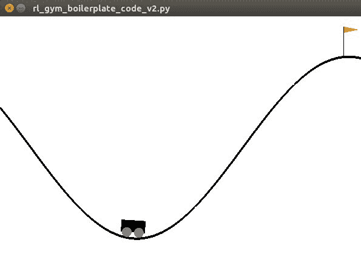
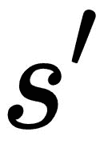
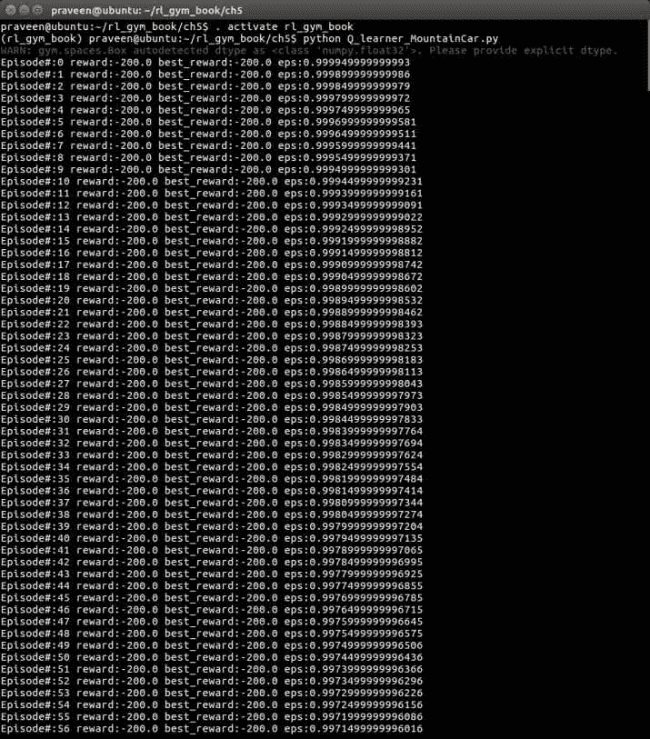
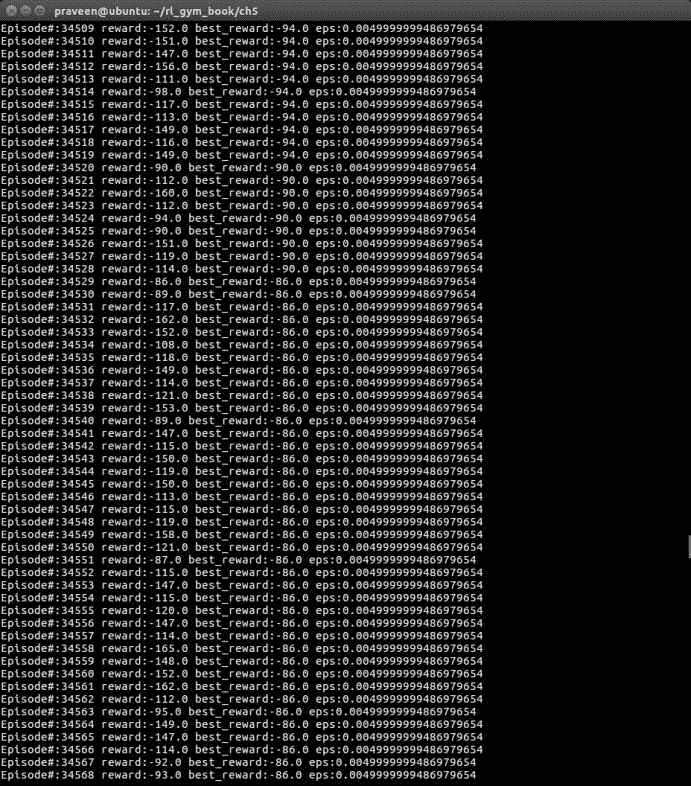
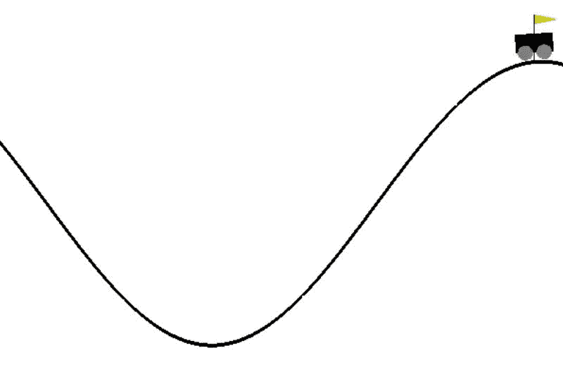

# 五、实现你的第一个学习智能体——解决山地汽车问题

干得好，走到了这一步！在前几章中，我们很好地介绍了 OpenAI Gym，它的特性，以及如何在你自己的程序中安装、配置和使用它。我们还讨论了强化学习的基础知识以及什么是深度强化学习，我们建立了 PyTorch 深度学习库来开发深度强化学习应用。在本章中，您将开始开发您的第一个学习智能体！您将开发一个智能体，它将学习如何解决山地汽车问题。在接下来的章节中，我们将逐步解决越来越具有挑战性的问题，因为你越来越习惯于开发强化学习算法来解决 OpenAI Gym 中的问题。我们将从理解山地汽车问题开始这一章，山地汽车问题一直是强化学习和最优控制领域的热门问题。我们将从头开始开发我们的学习智能体，然后训练它使用 Gym 中的山地车环境来解决山地车问题。我们将最终看到智能体是如何进步的，并简要地看一下我们可以改进智能体的方法，以便用它来解决更复杂的问题。我们将在本章中讨论的主题如下:

*   理解山地汽车问题
*   实现一个基于强化学习的智能体来解决山地车问题
*   在 Gym 培训强化学习智能体
*   测试智能体的性能


# 理解山地汽车问题

对于任何强化学习问题，不管我们使用什么样的学习算法，关于这个问题的两个基本定义都是很重要的。它们是状态空间和动作空间的定义。我们在本书前面提到过，状态和动作空间可以是离散的，也可以是连续的。通常，在大多数问题中，状态空间由连续值组成，并表示为向量、矩阵或张量(多维矩阵)。与连续值问题和环境相比，具有离散行动空间的问题和环境相对容易。在本书中，我们将为一些问题和环境开发学习算法，这些问题和环境混合了状态空间和动作空间的组合，这样当你开始自己为应用程序开发智能体和算法时，你就可以轻松地处理任何这样的变化。

让我们先从高层次的描述来理解山地汽车问题，然后再看山地汽车环境的状态和动作空间。


# 山地汽车问题与环境

在山地汽车 Gym 环境中，汽车位于两座山之间的一维轨道上。目标是把车开上右边的山；然而，这辆车的发动机不够强劲，即使以最大速度行驶也无法上山。所以，成功的唯一方法就是来回开车造势。简而言之，山地车问题就是让一辆动力不足的车到达山顶。

在你实现你的智能体算法之前，理解环境、问题、状态和动作空间会有很大的帮助。我们如何在 Gym 里找出山地车环境的状态和动作空间？嗯，我们已经从第 4 章、*探索 Gym 及其特点*中知道了如何去做。我们编写了一个名为`get_observation_action_space.py`的脚本，它将打印出环境的状态、观察和动作空间，其名称作为第一个参数传递给脚本。让我们用下面的命令让它打印出`MountainCar-v0`环境的空格:

```
(rl_gym_book) praveen@ubuntu:~/rl_gym_book/ch4$ python get_observation_action_space.py 'MountainCar-v0'
```

注意，命令提示符有`rl_gym_book`前缀，这表示我们已经激活了`rl_gym_book` conda Python 虚拟环境。此外，当前目录`~/rl_gym_book/ch4`表示脚本是从与本书代码库中的[第 4 章](part0071.html#23MNU0-22c7fc7f93b64d07be225c00ead6ce12)、*探索 Gym 及其特性*的代码对应的`ch4`目录运行的。

前面的命令将产生如下输出:

```
Observation Space:
Box(2,)

 space.low: [-1.20000005 -0.07 ]

 space.high: [ 0.60000002 0.07 ]
Action Space:
Discrete(3)
```

从这个输出中，我们可以看到状态和观察空间是一个二维的盒子，而动作空间是三维的和离散的。

如果你想重温一下**框**和**离散的**空间的含义，你可以快速翻到[第 4 章](part0071.html#23MNU0-22c7fc7f93b64d07be225c00ead6ce12)、*探索 Gym 及其特点*，我们在 Gym 部分的*空间下讨论了这些空间及其含义。理解它们很重要。*

下表总结了状态和动作空间类型、描述以及允许值的范围，供您参考:

| **MountainCar-v0 环境** | **类型** | **描述** | **范围** |
| 状态向量空间 | `Box(2,)` | (位置、速度) | 位置:-1.2 到 0.6 速度:-0.07 到 0.07 |
| 行为空间 | `Discrete(3)` | 0:向左 1:滑行/无所事事 2:向右走 | 0, 1, 2 |

所以比如汽车以零速度从 *-0.6* 和 *-0.4* 之间的任意位置出发，目标是到达右侧的山顶，也就是位置 *0.5* 。(该车技术上可以超越 *0.5、*达到 *0.6* ，也是考虑的。)环境会在每一个时间步发送 *-1* 作为奖励，直到到达目标位置( *0.5* )。环境会终止这一集。如果轿厢到达 *0.5* 位置或步数达到 200，则`done`变量将等于`True`。


# 从头开始实现 Q-learning agent

在本节中，我们将开始逐步实现我们的智能体。我们将使用 OpenAI Gym 库的`NumPy`库和`MountainCar-V0`环境实现著名的 Q-learning 算法。

让我们重温一下我们在[第 4 章](part0071.html#23MNU0-22c7fc7f93b64d07be225c00ead6ce12)、*探索 Gym 及其功能*中使用的强化学习 Gym 锅炉板代码，如下所示:

```
#!/usr/bin/env python
import gym
env = gym.make("Qbert-v0")
MAX_NUM_EPISODES = 10
MAX_STEPS_PER_EPISODE = 500
for episode in range(MAX_NUM_EPISODES):
    obs = env.reset()
    for step in range(MAX_STEPS_PER_EPISODE):
        env.render()
        action = env.action_space.sample()# Sample random action. This will be replaced by our agent's action when we start developing the agent algorithms
        next_state, reward, done, info = env.step(action) # Send the action to the environment and receive the next_state, reward and whether done or not
        obs = next_state

        if done is True:
            print("\n Episode #{} ended in {} steps.".format(episode, step+1))
            break
```

这段代码是一个很好的起点(又名样板！)来开发我们的强化学习智能体。我们首先将环境名称从`Qbert-v0`改为`MountainCar-v0`。请注意，在前面的脚本中，我们正在设置`MAX_STEPS_PER_EPISODE`。这是智能体在剧集结束前可以采取的步骤或操作的数量。这在持续的、永久的或循环的环境中可能是有用的，在这些环境中，环境本身不会结束情节。这里，我们为智能体设置了一个限制，以避免无限循环。然而，OpenAI Gym 中定义的大多数环境都有一个剧集终止条件，一旦满足其中任何一个条件，由`env.step(...)`函数返回的`done`变量将被设置为 *True* 。我们在上一节看到，对于我们感兴趣的山地车问题，如果车到达目标位置( *0.5* )或者走的步数达到 *200* ，环境会终止该集。因此，对于山地汽车环境，我们可以进一步简化样板代码，如下所示:

```
#!/usr/bin/env python
import gym
env = gym.make("MountainCar-v0")
MAX_NUM_EPISODES = 5000

for episode in range(MAX_NUM_EPISODES):
    done = False
    obs = env.reset()
    total_reward = 0.0 # To keep track of the total reward obtained in each episode
    step = 0
    while not done:
        env.render()
        action = env.action_space.sample()# Sample random action. This will be replaced by our agent's action when we start developing the agent algorithms
        next_state, reward, done, info = env.step(action) # Send the action to the environment and receive the next_state, reward and whether done or not
        total_reward += reward
        step += 1
        obs = next_state

    print("\n Episode #{} ended in {} steps. total_reward={}".format(episode, step+1, total_reward))
env.close()
```

如果您运行前面的脚本，您将看到山地汽车环境出现在一个新窗口中，汽车随机左右移动 1000 集。您还会看到每集末尾打印的集号、采取的步骤和获得的总奖励，如下面的屏幕截图所示:


示例输出应该类似于下面的屏幕截图:



你应该还记得我们上一节的内容，智能体每走一步会得到 *-1* 的奖励，并且`MountainCar-v0`环境会在 *200* 步后终止剧集；这就是为什么你这个智能体有时候可能会获得 *-200 的总奖励！*毕竟，智能体正在采取随机行动，而没有思考或从其先前的行动中学习。理想情况下，我们希望智能体能够计算出如何以最少的步数到达山顶(靠近旗帜、接近、位于或超过位置 *0.5* )。不要担心——我们将在本章结束时构建这样一个智能体！

记住，在运行脚本之前，一定要激活`rl_gym_book` conda 环境！否则，您可能会遇到不必要的模块未找到错误。您可以通过查看 shell 前缀来直观地确认您是否已经激活了环境，它将显示如下内容:`(rl_gym_book) praveen@ubuntu:~/rl_gym_book/ch5$`。

让我们继续看一下 Q-learning 部分。


# 重新审视 Q 学习

在第 2 章、*强化学习和深度强化学习*中，我们讨论了 SARSA 和 Q-learning 算法。这两种算法都提供了一种系统的方法来更新由表示的动作值函数的估计值。具体来说，我们看到 Q-learning 是一种偏离策略的学习算法，它更新当前状态的动作值估计，并在随后的状态中朝着可获得的最大动作值更新动作，智能体将根据其策略结束该状态。我们还看到，Q 学习更新由以下公式给出:


在下一节中，我们将用 Python 实现一个`Q_Learner` 类，它实现了这个学习更新规则以及其他必要的函数和方法。


# 使用 Python 和 NumPy 实现 Q-learning agent

让我们通过实现`Q_Learner`类开始实现我们的 Q-learning 智能体。该类的主要方法如下:

*   __init__(self，env)
*   离散化(自我，观察)
*   get_action(self，obs)
*   学习(自我，观察，行动，奖励，下一个观察)

你稍后会发现这里的方法很常见，并且存在于我们在本书中将要实现的几乎所有智能体中。这让你很容易掌握它们，因为这些方法会被一次又一次地重复(有一些修改)。

一般来说,`discretize()`函数对于智能体实现来说不是必需的，但是当状态空间很大并且连续时，最好将空间离散成可数个区间或值的范围，以简化表示。这也减少了 Q-learning 算法需要学习的值的数量，因为它现在只需要学习有限的一组值，这些值可以用表格格式或者通过使用 *n* 维数组而不是复杂函数来简明地表示。此外，用于最优控制的 Q 学习算法保证收敛于 Q 值的表格表示。


# 定义超参数

在我们的`Q_Learner`类声明之前，我们将初始化一些有用的超参数。下面是我们将在`Q_Learner`实现中使用的超参数:

*   `EPSILON_MIN`:这是我们希望智能体在遵循 epsilon-greedy 策略时使用的 epsilon 值的最小值。
*   `MAX_NUM_EPISODES` : 我们希望智能体与环境交互的最大剧集数。
*   `STEPS_PER_EPISODE`:这是每集的步数。这可能是环境允许每集执行的最大步骤数，也可能是我们希望根据时间预算限制的自定义值。每集允许更多的步骤意味着每集可能需要更长的时间来完成，并且在非终止环境中，即使智能体停留在同一点，环境也不会重置，直到达到此限制。

*   `ALPHA`:这是我们希望智能体使用的学习率。这是上一节列出的 Q 学习更新等式中的 alpha。一些算法随着训练的进行改变学习速率。
*   `GAMMA`:这是智能体将用于计算未来奖励的折扣系数。该值对应于上一节中 Q 学习更新等式中的 gamma。

*   `NUM_DISCRETE_BINS`:这是状态空间将被离散化成的值的箱的数量。对于山地汽车环境，我们将把状态空间离散化为 *30 个*箱。您可以尝试更高/更低的值。

请注意，`MAX_NUM_EPISODES` 和`STEPS_PER_EPISODE`已经在我们在本章前面的一节中所学的样板代码中定义了。

这些超参数在 Python 代码中是这样定义的，带有一些初始值:

```
EPSILON_MIN = 0.005
max_num_steps = MAX_NUM_EPISODES * STEPS_PER_EPISODE
EPSILON_DECAY = 500 * EPSILON_MIN / max_num_steps
ALPHA = 0.05  # Learning rate
GAMMA = 0.98  # Discount factor
NUM_DISCRETE_BINS = 30  # Number of bins to Discretize each observation dim
```


# 实现 Q_Learner 类的 __init__ 方法

接下来，让我们看看`Q_Learner`类的成员函数定义。`__init__(self, env)`函数将环境实例`env`作为输入参数，初始化观察空间和动作空间的尺寸/形状，并根据我们设置的`NUM_DISCRETE_BINS`确定离散化观察空间的参数。`__init__(self, env)`函数还根据离散观察空间的形状和动作空间的维度，将 Q 函数初始化为 NumPy 数组。`__init__(self, env)`的实现很简单，因为我们只是为智能体初始化必要的值。下面是我们的实现:

```
class Q_Learner(object):
    def __init__(self, env):
        self.obs_shape = env.observation_space.shape
        self.obs_high = env.observation_space.high
        self.obs_low = env.observation_space.low
        self.obs_bins = NUM_DISCRETE_BINS  # Number of bins to Discretize each observation dim
        self.bin_width = (self.obs_high - self.obs_low) / self.obs_bins
        self.action_shape = env.action_space.n
        # Create a multi-dimensional array (aka. Table) to represent the
        # Q-values
        self.Q = np.zeros((self.obs_bins + 1, self.obs_bins + 1,
                          self.action_shape))  # (51 x 51 x 3)
        self.alpha = ALPHA  # Learning rate
        self.gamma = GAMMA  # Discount factor
        self.epsilon = 1.0
```


# 实现 Q_Learner 类的离散化方法

让我们花一点时间来理解我们是如何离散化观察空间的。离散化观察空间(以及一般的度量空间)的最简单且有效的方法是将值范围的跨度分成一组有限的值，称为箱。值的跨度/范围由空间的每个维度中的最大可能值和最小可能值之间的差给出。一旦我们计算出跨度，我们就可以用它除以我们决定的`NUM_DISCRETE_BINS`来得到箱子的宽度。我们在`__init__`函数中计算了面元宽度，因为它不会随着每次新的观察而改变。`discretize(self, obs)`函数接收每一个新函数，并应用离散化步骤在离散化空间中找到观察值所属的箱。就像这样简单:

```
(obs - self.obs_low) / self.bin_width)
```

我们希望它属于任何一个 T14 桶(而不是介于两者之间的某个地方)；因此，我们将前面的代码转换成一个`integer`:

```
((obs - self.obs_low) / self.bin_width).astype(int)
```

最后，我们将这个离散化的观察结果作为一个元组返回。所有这些操作都可以用一行 Python 代码编写，如下所示:

```
def discretize(self, obs):
        return tuple(((obs - self.obs_low) / self.bin_width).astype(int))
```


# 实现 Q_Learner 的 get_action 方法

我们希望智能体根据观察结果采取行动。`get_action(self, obs)` 是我们定义的函数，在`obs`中给定一个观察，生成一个动作。使用最广泛的行动选择策略是ε-贪婪策略，它以 *1-* 的(高)概率根据智能体的估计采取最佳行动，并以ε给出的(小)概率采取随机行动。我们使用 NumPy 的随机模块中的`random()`方法实现ε贪婪策略，如下所示:

```
 def get_action(self, obs):
        discretized_obs = self.discretize(obs)
        # Epsilon-Greedy action selection
        if self.epsilon > EPSILON_MIN:
            self.epsilon -= EPSILON_DECAY
        if np.random.random() > self.epsilon:
            return np.argmax(self.Q[discretized_obs])
        else:  # Choose a random action
            return np.random.choice([a for a in range(self.action_shape)])
```


# 实现 Q_learner 类的 learn 方法

正如您可能已经猜到的，这是`Q_Learner`类最重要的方法，它具有学习 Q 值的魔力，从而使智能体能够随着时间的推移采取智能行动！最棒的是，实现起来没有那么复杂！这仅仅是我们前面看到的 Q 学习更新等式的实现。我说实现简单你不相信？！好了，下面是学习功能的实现:

```
 def learn(self, obs, action, reward, next_obs):
        discretized_obs = self.discretize(obs)
        discretized_next_obs = self.discretize(next_obs)
        td_target = reward + self.gamma * np.max(self.Q[discretized_next_obs])
        td_error = td_target - self.Q[discretized_obs][action]
        self.Q[discretized_obs][action] += self.alpha * td_error
```

现在你同意了吗？:)

我们可以用一行代码编写 Q 学习更新规则，如下所示:

```
self.Q[discretized_obs][action] += self.alpha * (reward + self.gamma * np.max(self.Q[discretized_next_obs] - self.Q[discretized_obs][action]
```

但是，在单独的一行上计算每一项会更容易阅读和理解。


# 完整的 Q_Learner 类实现

如果我们将所有的方法实现放在一起，我们将得到如下代码片段:

```
EPSILON_MIN = 0.005
max_num_steps = MAX_NUM_EPISODES * STEPS_PER_EPISODE
EPSILON_DECAY = 500 * EPSILON_MIN / max_num_steps
ALPHA = 0.05  # Learning rate
GAMMA = 0.98  # Discount factor
NUM_DISCRETE_BINS = 30  # Number of bins to Discretize each observation dim

class Q_Learner(object):
    def __init__(self, env):
        self.obs_shape = env.observation_space.shape
        self.obs_high = env.observation_space.high
        self.obs_low = env.observation_space.low
        self.obs_bins = NUM_DISCRETE_BINS  # Number of bins to Discretize each observation dim
        self.bin_width = (self.obs_high - self.obs_low) / self.obs_bins
        self.action_shape = env.action_space.n
        # Create a multi-dimensional array (aka. Table) to represent the
        # Q-values
        self.Q = np.zeros((self.obs_bins + 1, self.obs_bins + 1,
                           self.action_shape))  # (51 x 51 x 3)
        self.alpha = ALPHA  # Learning rate
        self.gamma = GAMMA  # Discount factor
        self.epsilon = 1.0

    def discretize(self, obs):
        return tuple(((obs - self.obs_low) / self.bin_width).astype(int))

    def get_action(self, obs):
        discretized_obs = self.discretize(obs)
        # Epsilon-Greedy action selection
        if self.epsilon > EPSILON_MIN:
            self.epsilon -= EPSILON_DECAY
        if np.random.random() > self.epsilon:
            return np.argmax(self.Q[discretized_obs])
        else:  # Choose a random action
            return np.random.choice([a for a in range(self.action_shape)])

    def learn(self, obs, action, reward, next_obs):
        discretized_obs = self.discretize(obs)
        discretized_next_obs = self.discretize(next_obs)
        td_target = reward + self.gamma * np.max(self.Q[discretized_next_obs])
        td_error = td_target - self.Q[discretized_obs][action]
        self.Q[discretized_obs][action] += self.alpha * td_error
```

所以，我们已经准备好了智能体。你可能会问，下一步我们该怎么办。嗯，我们应该在 Gym 环境中训练智能体！在下一节中，我们将了解培训程序。


# 在 Gym 培训强化学习智能体

训练 Q-learning agent 的过程对您来说可能已经很熟悉了，因为它有许多与我们以前使用的样板代码相同的代码行，也有类似的结构。我们现在使用`agent.get_action(obs)`方法从智能体那里获得动作，而不是从环境的动作空间中选择随机动作。我们还在将智能体的动作发送到环境并收到反馈后调用`agent.learn(obs, action, reward, next_obs)`方法。此处列出了培训功能:

```
def train(agent, env):
    best_reward = -float('inf')
    for episode in range(MAX_NUM_EPISODES):
        done = False
        obs = env.reset()
        total_reward = 0.0
        while not done:
            action = agent.get_action(obs)
            next_obs, reward, done, info = env.step(action)
            agent.learn(obs, action, reward, next_obs)
            obs = next_obs
            total_reward += reward
        if total_reward > best_reward:
            best_reward = total_reward
        print("Episode#:{} reward:{} best_reward:{} eps:{}".format(episode,
                                     total_reward, best_reward, agent.epsilon))
    # Return the trained policy
    return np.argmax(agent.Q, axis=2)
```


# 测试和记录智能体的性能

一旦我们让智能体在 Gym 训练，我们希望能够衡量它学得有多好。为了做到这一点，我们让智能体通过一个测试。就像在学校一样！`test(agent, env, policy)`采用智能体对象、环境实例和智能体策略来测试环境中智能体的性能，并返回一个完整剧集的总报酬。它类似于我们前面看到的`train(agent, env)`函数，但是它不允许智能体学习或更新它的 Q 值估计:

```
def test(agent, env, policy):
    done = False
    obs = env.reset()
    total_reward = 0.0
    while not done:
        action = policy[agent.discretize(obs)]
        next_obs, reward, done, info = env.step(action)
        obs = next_obs
        total_reward += reward
    return total_reward
1,000 episodes and save the recorded agent's action in the environment as video files in the gym_monitor_path directory:
```

```
if __name__ == "__main__":
    env = gym.make('MountainCar-v0')
    agent = Q_Learner(env)
    learned_policy = train(agent, env)
    # Use the Gym Monitor wrapper to evalaute the agent and record video
    gym_monitor_path = "./gym_monitor_output"
    env = gym.wrappers.Monitor(env, gym_monitor_path, force=True)
    for _ in range(1000):
        test(agent, env, learned_policy)
    env.close()
```


# 一个简单完整的 Q 学习器实现来解决山地车问题

在本节中，我们将把整个代码放在一个 Python 脚本中，以初始化环境，启动智能体的训练过程，获得训练好的策略，测试智能体的性能，并记录它在环境中的行为！

```
#!/usr/bin/env/ python
import gym
import numpy as np

MAX_NUM_EPISODES = 50000
STEPS_PER_EPISODE = 200 #  This is specific to MountainCar. May change with env
EPSILON_MIN = 0.005
max_num_steps = MAX_NUM_EPISODES * STEPS_PER_EPISODE
EPSILON_DECAY = 500 * EPSILON_MIN / max_num_steps
ALPHA = 0.05  # Learning rate
GAMMA = 0.98  # Discount factor
NUM_DISCRETE_BINS = 30  # Number of bins to Discretize each observation dim

class Q_Learner(object):
    def __init__(self, env):
        self.obs_shape = env.observation_space.shape
        self.obs_high = env.observation_space.high
        self.obs_low = env.observation_space.low
        self.obs_bins = NUM_DISCRETE_BINS  # Number of bins to Discretize each observation dim
        self.bin_width = (self.obs_high - self.obs_low) / self.obs_bins
        self.action_shape = env.action_space.n
        # Create a multi-dimensional array (aka. Table) to represent the
        # Q-values
        self.Q = np.zeros((self.obs_bins + 1, self.obs_bins + 1,
                           self.action_shape))  # (51 x 51 x 3)
        self.alpha = ALPHA  # Learning rate
        self.gamma = GAMMA  # Discount factor
        self.epsilon = 1.0

    def discretize(self, obs):
        return tuple(((obs - self.obs_low) / self.bin_width).astype(int))

    def get_action(self, obs):
        discretized_obs = self.discretize(obs)
        # Epsilon-Greedy action selection
        if self.epsilon > EPSILON_MIN:
            self.epsilon -= EPSILON_DECAY
        if np.random.random() > self.epsilon:
            return np.argmax(self.Q[discretized_obs])
        else:  # Choose a random action
            return np.random.choice([a for a in range(self.action_shape)])

    def learn(self, obs, action, reward, next_obs):
        discretized_obs = self.discretize(obs)
        discretized_next_obs = self.discretize(next_obs)
        td_target = reward + self.gamma * np.max(self.Q[discretized_next_obs])
        td_error = td_target - self.Q[discretized_obs][action]
        self.Q[discretized_obs][action] += self.alpha * td_error

def train(agent, env):
    best_reward = -float('inf')
    for episode in range(MAX_NUM_EPISODES):
        done = False
        obs = env.reset()
        total_reward = 0.0
        while not done:
            action = agent.get_action(obs)
            next_obs, reward, done, info = env.step(action)
            agent.learn(obs, action, reward, next_obs)
            obs = next_obs
            total_reward += reward
        if total_reward > best_reward:
            best_reward = total_reward
        print("Episode#:{} reward:{} best_reward:{} eps:{}".format(episode,
                                     total_reward, best_reward, agent.epsilon))
    # Return the trained policy
    return np.argmax(agent.Q, axis=2)

def test(agent, env, policy):
    done = False
    obs = env.reset()
    total_reward = 0.0
    while not done:
        action = policy[agent.discretize(obs)]
        next_obs, reward, done, info = env.step(action)
        obs = next_obs
        total_reward += reward
    return total_reward

if __name__ == "__main__":
    env = gym.make('MountainCar-v0')
    agent = Q_Learner(env)
    learned_policy = train(agent, env)
    # Use the Gym Monitor wrapper to evalaute the agent and record video
    gym_monitor_path = "./gym_monitor_output"
    env = gym.wrappers.Monitor(env, gym_monitor_path, force=True)
    for _ in range(1000):
        test(agent, env, learned_policy)
    env.close()
```

这个脚本可以在名为`Q_learner_MountainCar.py`的`ch5`文件夹下的代码库中找到。

激活`rl_gym_book` conda 环境并启动脚本来查看它的运行情况！当您启动该脚本时，您将看到类似于该屏幕截图所示的初始输出:



在最初的培训集中，当智能体刚刚开始学习时，你会看到它总是以 *-200* 的奖励结束。从您对 Gym 的山地车环境如何工作的理解中，您可以看到智能体没有在 *200* 时间步长内到达山顶，因此环境会自动重置环境；这样，智能体只能得到 *-200* 。还可以观察 **** ( **eps** )探索值慢慢衰减。

如果你让智能体学习足够长的时间，你会看到智能体在进步，学习用越来越少的步骤到达山顶。以下是在典型的笔记本电脑硬件上进行 *5* 分钟训练后的进度示例:



一旦脚本运行完成，您将在`gym_monitor_output`文件夹中看到智能体表演的录制视频(以及一些`.stats.json`和`.meta.json`文件)。你可以观看视频，看看你的经纪人表现如何！

下面是一个截图，显示了智能体成功地将汽车驶向山顶:



万岁！


# 摘要

我们在这一章中学到了很多。更重要的是，我们实现了一个智能体，它学会了在 7 分钟左右智能地解决山地车问题！

我们从了解著名的山地车问题开始，看看在 Gym 的`MountainCar-v0`环境中，环境、观察空间、状态空间和奖励是如何设计的。我们重温了在上一章中使用的强化学习 Gym 样板代码，并对其进行了一些改进，这些也可以在本书的代码库中找到。

然后，我们为 Q 学习智能体定义了超参数，并开始从头开始实现 Q 学习算法。我们首先实现了智能体的初始化函数，使用一个 NumPy *n* 维数组来初始化智能体的内部状态变量，包括 Q 值表示。然后，我们实现了`discretize`方法来离散化`state space`；基于ε-贪婪策略选择动作的`get_action(...)`方法；最后是`learn(...)`函数，它实现 Q-learning 更新规则并构成智能体的核心。我们看到实现它们是多么简单！我们还实现了训练、测试和评估智能体性能的功能。

我希望您在实现智能体和观看它在 Gym 解决山地汽车问题的过程中获得了很多乐趣！我们将在下一章探讨解决各种更具挑战性问题的高级方法。