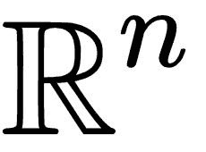
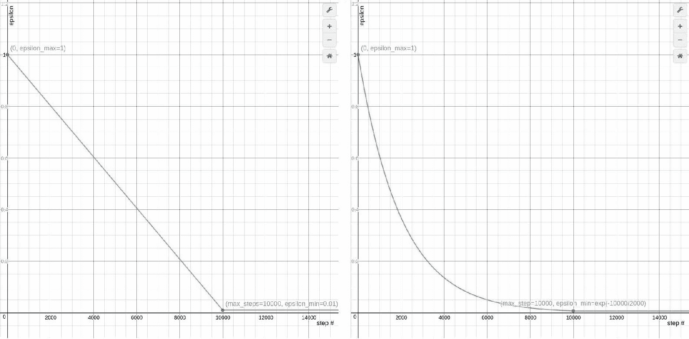
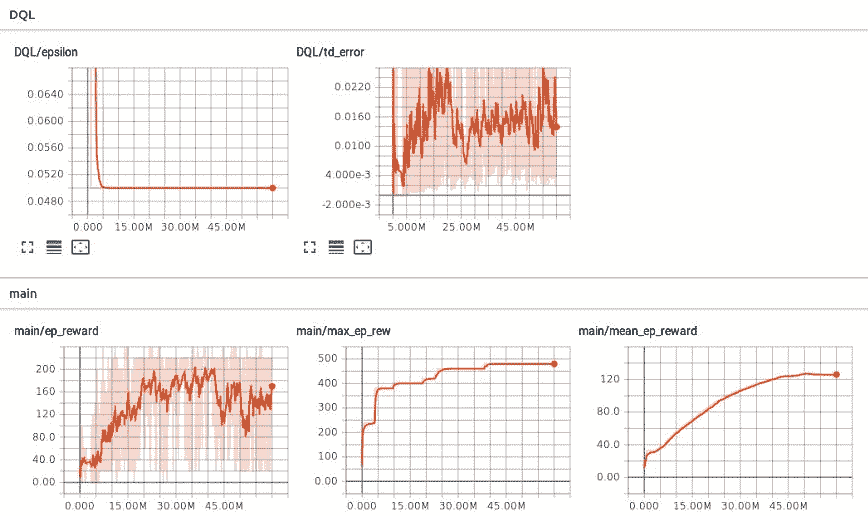
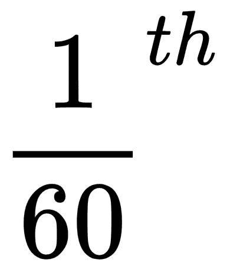
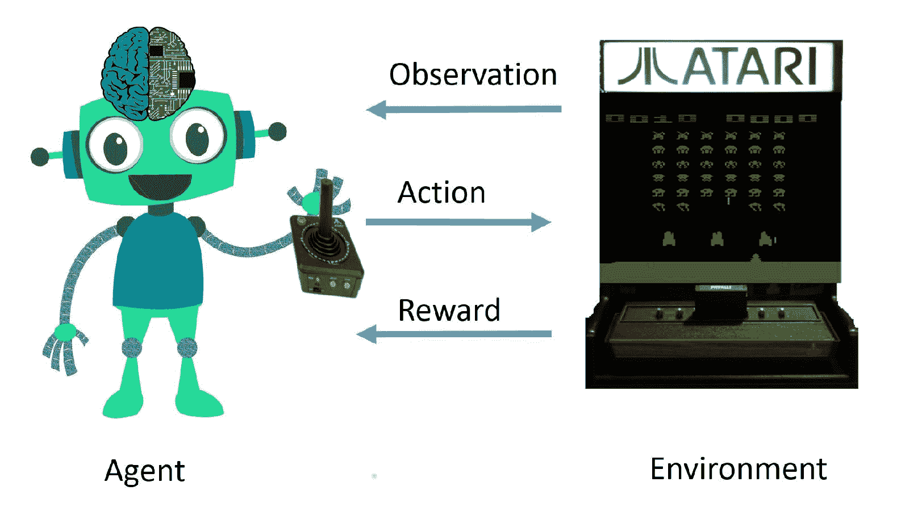

# 六、使用深度 Q 学习实现最优控制的智能体

在前一章中，我们实现了一个智能体，它使用 Q-learning 在双核笔记本电脑 CPU 上在大约七分钟内从零开始解决山地汽车问题。在这一章中，我们将实现 Q-learning 的一个高级版本，称为深度 Q-learning，它可以用来解决几个比山地车问题复杂得多的离散控制问题。离散控制问题是(顺序)决策问题，其中动作空间被离散成有限数量的值。在前一章中，学习智能体使用一个二维状态空间向量作为输入，它包含了关于手推车的位置和速度的信息，以采取最佳的控制行动。在这一章中，我们将看到如何实现一个学习智能体，它将(屏幕上的)视觉图像作为输入，并学习采取最佳控制行动。这和我们解决问题的方式很接近，不是吗？我们人类不会通过计算一个物体的位置和速度来决定下一步该做什么。我们只是观察正在发生的事情，然后学习采取行动，随着时间的推移不断改进，最终完全解决问题。

本章将指导您如何逐步构建一个更好的智能体，方法是使用最近发布的具有深度神经网络函数逼近的稳定 Q 学习方法，逐步改进我们的 Q 学习智能体实现。到本章结束时，你将学会如何实现和训练一个深度 Q 学习智能体，它观察屏幕上的像素，并使用雅达利 Gym 环境玩雅达利游戏，并获得相当好的分数！我们还将讨论如何在学习过程中直观显示和比较智能体的表现。您将看到相同的智能体算法如何在几个不同的 Atari 游戏上进行训练，并且智能体仍然能够很好地学习玩游戏。如果你迫不及待地想看一些实际的东西，或者如果你想在深入研究之前看一看你将要开发的东西，你可以在本书的代码库中的`ch6`文件夹下查看本章的代码，并在几个 Atari 游戏上试用预先训练好的智能体程序！关于如何运行预培训智能体的说明可在`ch6/README.md`文件中找到。

这一章有许多技术细节，使您具备足够的背景和知识，理解改进基本 Q 学习算法和基于深度 Q 学习构建更有能力和智能的智能体的逐步过程，以及以系统方式训练和测试智能体所需的几个模块和工具。以下是本章将涉及的高级主题的概述:

*   改进 Q-learning agent 的各种方法，包括以下几种:
    *   作用值函数的神经网络逼近
    *   体验回放
    *   勘探时间表
*   用 PyTorch 实现深度卷积神经网络的动作值函数逼近
*   使用目标网络稳定深度 Q 网络
*   使用 TensorBoard 记录和监控 PyTorch 智能体的学习性能
*   管理参数和配置
*   雅达利 Gym 环境
*   训练深度 Q 学习者玩雅达利游戏

让我们从第一个主题开始，看看我们如何从上一章停止的地方开始，继续朝着更有能力和更智能的智能体前进。


# 改进 Q 学习智能体

在上一章中，我们回顾了 Q 学习算法并实现了`Q_Learner`类。对于山地汽车环境，我们使用一个形状为 51x51x3 的多维数组来表示动作值函数。注意，我们已经将状态空间离散化为由`NUM_DISCRETE_BINS`配置参数给定的固定数量的箱(我们使用 50)。我们本质上用低维的离散表示来量化或近似观察，以减少 n 维数组中可能元素的数量。通过观察/状态空间的这种离散化，我们将汽车的可能位置限制到 50 个位置的固定集合，并将汽车的可能速度限制到 50 个值的固定集合。任何其他位置或速度值都将近似于这些固定值集合中的一个。因此，当汽车实际位于不同位置时，智能体可能会收到相同的位置值。对于某些环境，这可能是一个问题。智能体可能没有学到足够的知识来区分掉下悬崖和站在悬崖边缘向前跳跃。在下一节中，我们将研究如何使用更强大的函数逼近器来表示动作值函数，而不是有其局限性的简单 n 维数组/表。


# 用神经网络逼近 Q 函数

神经网络被证明是有效的通用函数逼近器。事实上，有一个普适的逼近定理，即单个隐层前馈神经网络可以逼近任何在中闭且有界的连续函数。它基本上意味着即使简单的(浅层的)神经网络也可以逼近几个函数。您可以使用一个具有固定数量的权重/参数的简单神经网络来近似几乎任何函数，这是不是感觉太好了？这实际上是真的，除了一点使它不能在任何地方使用。虽然单个隐藏层神经网络可以用有限的一组参数逼近任何函数，但是我们没有一个普遍保证的方法来*学习*那些可以最好地代表任何函数的参数。你会看到，研究人员已经能够使用神经网络来逼近几个复杂而有用的函数。今天，无处不在的智能手机中内置的大部分智能都是由(高度优化的)神经网络驱动的。几个性能最好的系统，根据照片中的人、地点和背景自动将照片组织到相册中，识别你的脸和声音的系统，或者自动为你撰写电子邮件回复的系统，都是由神经网络驱动的。就连你从谷歌助手(Google Assistant)等语音助手那里听到的生成类似人类的逼真声音的最先进技术，也是由神经网络驱动的。

谷歌助手目前使用 Deepmind 开发的 WaveNet 和 WaveNet2 进行**文本到语音** ( **TTS** )合成，这比迄今为止开发的任何其他 TTS 系统都要真实得多。

我希望这足以激励你使用神经网络来逼近 Q 函数！在本节中，我们将从用浅(不深)单隐层神经网络逼近 Q 函数开始，并用它来解决著名的 Cart 极点问题。虽然神经网络是强大的函数逼近器，但我们将会看到，即使训练一个单层神经网络来逼近强化学习问题的 Q 函数也不是微不足道的。我们将研究一些用神经网络近似法来改进 Q 学习的方法，在本章的后面部分，我们将研究如何使用具有更强表示能力的深度神经网络来近似 Q 函数。

让我们从神经网络近似开始，首先回顾一下我们在前一章中实现的`Q_Learner`类的`__init__(...)`方法:

```
class Q_Learner(object):
    def __init__(self, env):
        self.obs_shape = env.observation_space.shape
        self.obs_high = env.observation_space.high
        self.obs_low = env.observation_space.low
        self.obs_bins = NUM_DISCRETE_BINS  # Number of bins to Discretize each observation dim
        self.bin_width = (self.obs_high - self.obs_low) / self.obs_bins
        self.action_shape = env.action_space.n
        # Create a multi-dimensional array (aka. Table) to represent the
        # Q-values
        self.Q = np.zeros((self.obs_bins + 1, self.obs_bins + 1,
 self.action_shape))  # (51 x 51 x 3)
        self.alpha = ALPHA  # Learning rate
        self.gamma = GAMMA  # Discount factor
        self.epsilon = 1.0
```

在前面的代码中，粗体字行是我们将 Q 函数初始化为多维 NumPy 数组的地方。在下面几节中，我们将看到如何用一个更强大的神经网络表示来代替 NumPy 数组表示。


# 用 PyTorch 实现浅 Q 网络

在本节中，我们将开始使用 PyTorch 的神经网络模块实现一个简单的神经网络，然后看看我们如何使用它来取代多维数组的 Q action-value 表状函数。

先说神经网络实现。以下代码说明了如何使用 PyTorch 实现一个**单层感知器** ( **SLP** ):

```
import torch

class SLP(torch.nn.Module):
    """
    A Single Layer Perceptron (SLP) class to approximate functions
    """
    def __init__(self, input_shape, output_shape, device=torch.device("cpu")):
        """
        :param input_shape: Shape/dimension of the input
        :param output_shape: Shape/dimension of the output
        :param device: The device (cpu or cuda) that the SLP should use to store the inputs for the forward pass
        """
        super(SLP, self).__init__()
        self.device = device
        self.input_shape = input_shape[0]
        self.hidden_shape = 40
        self.linear1 = torch.nn.Linear(self.input_shape, self.hidden_shape)
        self.out = torch.nn.Linear(self.hidden_shape, output_shape)

    def forward(self, x):
        x = torch.from_numpy(x).float().to(self.device)
        x = torch.nn.functional.relu(self.linear1(x))
        x = self.out(x)
        return x
```

SLP 类使用`torch.nn.Linear`类实现了在输入和输出层之间具有 40 个隐藏单元的单层神经网络，并使用**整流线性单元** ( **ReLU** 或 **relu** )作为激活函数。该代码在本书的代码库中以`ch6/function_approximator/perceptron.py`的名称出现。数字 40 没什么特别的，所以可以随意改变神经网络中隐藏单元的数量。


# 实现 Shallow_Q_Learner

然后我们可以修改`Q_Learner`类来使用这个 SLP 来表示 Q 函数。请注意，我们还必须修改`Q_Learner`类`learn(...)`方法，以计算相对于 SLP 权重的损失梯度，并对其进行反向传播，从而更新和优化神经网络的权重，以改善其 Q 值表示，使其接近实际值。我们还将稍微修改一下`get_action(...)`方法，通过正向传递神经网络来获得 Q 值。下面用粗体显示了对`Q_Learner`类实现进行更改后的`Shallow_Q_Learner`类代码，以便于您一目了然地看到不同之处:

```
import torch
from function_approximator.perceptron import SLP EPSILON_MIN = 0.005
max_num_steps = MAX_NUM_EPISODES * STEPS_PER_EPISODE
EPSILON_DECAY = 500 * EPSILON_MIN / max_num_steps
ALPHA = 0.05  # Learning rate
GAMMA = 0.98  # Discount factor
NUM_DISCRETE_BINS = 30  # Number of bins to Discretize each observation dim

class Shallow_Q_Learner(object):
    def __init__(self, env):
        self.obs_shape = env.observation_space.shape
        self.obs_high = env.observation_space.high
        self.obs_low = env.observation_space.low
        self.obs_bins = NUM_DISCRETE_BINS  # Number of bins to Discretize each observation dim
        self.bin_width = (self.obs_high - self.obs_low) / self.obs_bins
        self.action_shape = env.action_space.n
        # Create a multi-dimensional array (aka. Table) to represent the
        # Q-values
        self.Q = SLP(self.obs_shape, self.action_shape)
        self.Q_optimizer = torch.optim.Adam(self.Q.parameters(), lr=1e-5)
        self.alpha = ALPHA  # Learning rate
        self.gamma = GAMMA  # Discount factor
        self.epsilon = 1.0

    def discretize(self, obs):
        return tuple(((obs - self.obs_low) / self.bin_width).astype(int))

    def get_action(self, obs):
        discretized_obs = self.discretize(obs)
        # Epsilon-Greedy action selection
        if self.epsilon > EPSILON_MIN:
            self.epsilon -= EPSILON_DECAY
        if np.random.random() > self.epsilon:
            return np.argmax(self.Q(discretized_obs).data.to(torch.device('cpu')).numpy())
        else:  # Choose a random action
            return np.random.choice([a for a in range(self.action_shape)])

    def learn(self, obs, action, reward, next_obs):
        #discretized_obs = self.discretize(obs)
        #discretized_next_obs = self.discretize(next_obs)
        td_target = reward + self.gamma * torch.max(self.Q(next_obs))
        td_error = torch.nn.functional.mse_loss(self.Q(obs)[action], td_target)
        #self.Q[discretized_obs][action] += self.alpha * td_error
        self.Q_optimizer.zero_grad()
        td_error.backward()
        self.Q_optimizer.step() 
```

这里讨论的`Shallow_Q_Learner`类实现只是为了让你更容易理解如何实现一个基于神经网络的 Q 函数近似来代替传统的表格 Q 学习实现。


# 用浅 Q 网络求解 Cart 极点问题

在本节中，我们将使用我们在上一节中开发的浅层`Q_Learner`类实现一个完整的训练脚本来解决 Cart Pole 问题:

```
#!/usr/bin/env python import gym import random import torch from torch.autograd import Variable import numpy as np from utils.decay_schedule import LinearDecaySchedule from function_approximator.perceptron import SLP

env = gym.make("CartPole-v0")
MAX_NUM_EPISODES = 100000
MAX_STEPS_PER_EPISODE = 300

class Shallow_Q_Learner(object):
    def __init__(self, state_shape, action_shape, learning_rate=0.005,
                 gamma=0.98):
        self.state_shape = state_shape
        self.action_shape = action_shape
        self.gamma = gamma # Agent's discount factor
        self.learning_rate = learning_rate # Agent's Q-learning rate
        # self.Q is the Action-Value function. This agent represents Q using a
        # Neural Network.
        self.Q = SLP(state_shape, action_shape)
        self.Q_optimizer = torch.optim.Adam(self.Q.parameters(), lr=1e-3)
        # self.policy is the policy followed by the agent. This agents follows
        # an epsilon-greedy policy w.r.t it's Q estimate.
        self.policy = self.epsilon_greedy_Q
        self.epsilon_max = 1.0
        self.epsilon_min = 0.05
        self.epsilon_decay = LinearDecaySchedule(initial_value=self.epsilon_max,
                                    final_value=self.epsilon_min,
                                    max_steps= 0.5 * MAX_NUM_EPISODES * MAX_STEPS_PER_EPISODE)
        self.step_num = 0

    def get_action(self, observation):
        return self.policy(observation)

    def epsilon_greedy_Q(self, observation):
        # Decay Epsilion/exploratin as per schedule
        if random.random() < self.epsilon_decay(self.step_num):
            action = random.choice([i for i in range(self.action_shape)])
        else:
            action = np.argmax(self.Q(observation).data.numpy())

        return action

    def learn(self, s, a, r, s_next):
        td_target = r + self.gamma * torch.max(self.Q(s_next))
        td_error = torch.nn.functional.mse_loss(self.Q(s)[a], td_target)
        # Update Q estimate
        #self.Q(s)[a] = self.Q(s)[a] + self.learning_rate * td_error
        self.Q_optimizer.zero_grad()
        td_error.backward()
        self.Q_optimizer.step()

if __name__ == "__main__":
    observation_shape = env.observation_space.shape
    action_shape = env.action_space.n
    agent = Shallow_Q_Learner(observation_shape, action_shape)
    first_episode = True
    episode_rewards = list()
    for episode in range(MAX_NUM_EPISODES):
        obs = env.reset()
        cum_reward = 0.0 # Cumulative reward
        for step in range(MAX_STEPS_PER_EPISODE):
            # env.render()
            action = agent.get_action(obs)
            next_obs, reward, done, info = env.step(action)
            agent.learn(obs, action, reward, next_obs)

            obs = next_obs
            cum_reward += reward

            if done is True:
                if first_episode: # Initialize max_reward at the end of first episode
                    max_reward = cum_reward
                    first_episode = False
                episode_rewards.append(cum_reward)
                if cum_reward > max_reward:
                    max_reward = cum_reward
                print("\nEpisode#{} ended in {} steps. reward ={} ; mean_reward={} best_reward={}".
                      format(episode, step+1, cum_reward, np.mean(episode_rewards), max_reward))
                break
    env.close()
```

用前面的代码在`ch6`文件夹中创建一个名为`shallow_Q_Learner.py`的脚本，并像这样运行它:

```
(rl_gym_book) praveen@ubuntu:~/rl_gym_book/ch6$ python shallow_Q_Learner.py
```

您将看到智能体在 Gym 的`CartPole-v0`环境中学习平衡推车上的杆。您应该在控制台上看到剧集编号、在剧集结束前座席采取的步骤数、座席获得的剧集奖励、座席获得的平均剧集奖励以及座席迄今获得的最佳剧集奖励。如果您想直观地了解 Cart Pole 环境以及智能体如何学习和平衡该环境，您可以取消对`env.render()`线的注释。

`Shallow_Q_Learner`类实现和完整的训练脚本显示了如何使用简单的神经网络来逼近 Q 函数。解决像雅达利这样复杂的游戏不是一个好的方法。在接下来的部分中，我们将使用新技术系统地提高他们的性能。我们还将实现一个深度卷积 Q 网络，该网络可以将原始屏幕图像作为输入，并预测 Q 值，智能体可以使用该 Q 值玩各种雅达利游戏。

您可能会注意到，智能体需要很长时间才能改进并最终能够解决问题。在下一节中，我们将实现体验重放的概念来提高性能。


# 体验重放

在大多数环境下，智能体接收的信息不是**独立且同分布的** ( **i.i.d** )。这意味着智能体接收到的观察结果与其先前接收到的观察结果以及将接收到的下一个观察结果有很大关系。这是可以理解的，因为通常情况下，智能体在典型的强化学习环境中解决的问题是连续的。如果样本是 i.i.d，则神经网络收敛得更好。

经验重放还可以重用智能体过去的经验。神经网络更新，特别是在较低的学习速率下，需要几个反向传播和优化步骤才能收敛到较好的值。重复使用过去的经验数据，特别是以小批量的方式更新神经网络，有助于 Q 网络收敛到接近真实的动作值。


# 实现经验记忆

让我们实现一个体验记忆类来存储智能体收集的体验。在此之前，让我们巩固一下我们对*体验*的理解。在使用**马尔可夫决策过程** ( **MDP** )来表示问题的强化学习中，我们在[第 2 章](part0033.html#VF2I0-22c7fc7f93b64d07be225c00ead6ce12)、*强化学习和深度强化学习*中讨论过，将一个体验表示为一个数据结构是有效的，该数据结构由在时间步长 *t* 的观察、在该观察之后采取的行动、该行动获得的奖励以及环境由于智能体的行动而转变到的下一个观察(或状态)组成。还包括“完成”布尔值是有用的，该布尔值表示该特定的下一个观察是否标志着该集的结束。让我们使用来自集合库的 Python 的`namedtuple`来表示这样的数据结构，如下面的代码片段所示:

```
from collections import namedtuple
Experience = namedtuple("Experience", ['obs', 'action', 'reward', 'next_obs',
                                       'done'])
```

`namedtuple`数据结构使得使用名称属性(如‘OBS’、‘action’等)而不是数字索引(如 0、1 等)来访问元素变得很方便。

我们现在可以继续使用我们刚刚创建的经验数据结构来实现经验内存类。为了弄清楚我们需要在体验记忆类中实现什么方法，让我们考虑一下以后我们将如何使用它。

首先，我们希望能够在智能体收集的经验记忆中存储新的经验。然后，当我们想要重放以更新 Q 函数时，我们想要从经验记忆中成批地采样或检索经验。所以，本质上，我们需要一个可以存储新体验的方法和一个可以对单个或一批体验进行采样的方法。

让我们深入体验一下内存实现，从初始化方法开始，我们用期望的容量初始化内存，如下所示:

```
class ExperienceMemory(object):
    """
    A cyclic/ring buffer based Experience Memory implementation
    """
    def __init__(self, capacity=int(1e6)):
        """
        :param capacity: Total capacity (Max number of Experiences)
        :return:
        """
        self.capacity = capacity
        self.mem_idx = 0 # Index of the current experience
        self.memory = []
```

`mem_idx`成员变量将被用来指向当前的写头或索引位置，当新的体验到达时，我们将在那里存储新的体验。

“循环缓冲区”还有一个您可能听说过的名称:“循环缓冲区”、“环形缓冲区”和“循环队列”。它们都表示相同的底层数据结构，该结构使用环状固定大小的数据表示。

接下来，我们将看看`store`方法的实现:

```
def store(self, experience):
        """
        :param experience: The Experience object to be stored into the memory
        :return:
        """
        self.memory.insert(self.mem_idx % self.capacity, experience)
        self.mem_idx += 1
```

很简单，对吧？就像我们讨论过的，我们在`mem_idx`储存经验。

下一段代码是我们的`sample`方法实现:

```
import random
    def sample(self, batch_size):
        """

        :param batch_size: Sample batch_size
        :return: A list of batch_size number of Experiences sampled at random from mem
        """
        assert batch_size <= len(self.memory), "Sample batch_size is more than available exp in mem"
        return random.sample(self.memory, batch_size)

```

在前面的代码中，我们利用 Python 的 random 库从经验记忆中随机地统一采样经验。我们还将实现一个简单的`get_size` helper 方法，我们将使用它来找出有多少经验已经存储在经验存储器中:

```
def get_size(self):
        """

        :return: Number of Experiences stored in the memory
        """
        return len(self.memory)
```

体验记忆类的完整实现可以在本书的代码库中的`ch6/utils/experience_memory.py`处找到。

接下来，我们将看看如何重放从经验记忆中取样的经验来更新智能体的 Q 函数。


# 为 Q-learner 班级实现重放体验法

因此，我们为智能体实现了一个内存系统，使用一个简单的循环缓冲区来存储它过去的经验。在本节中，我们将了解如何使用体验记忆在 Q-learner 课堂中回放体验。

```
replay_experience method that shows how we sample from the experience memory and call a soon-to-be-implemented method that lets the agent learn from the sampled batch of experiences:
```

```
def replay_experience(self, batch_size=REPLAY_BATCH_SIZE):
        """
        Replays a mini-batch of experience sampled from the Experience Memory
        :param batch_size: mini-batch size to sample from the Experience Memory
        :return: None
        """
        experience_batch = self.memory.sample(batch_size)
        self.learn_from_batch_experience(experience_batch)
```

在像 SARSA 这样的在线学习方法的情况下，动作值估计在智能体和环境之间的每一步交互之后被更新。这样，更新会传播智能体刚刚经历的信息。如果智能体不经常经历某些事情，这样的更新可能会让智能体忘记那些经历，并且可能会在智能体将来遇到类似情况时导致糟糕的性能。这是不希望的，尤其是对于具有许多参数(或权重)的神经网络，这些参数(或权重)需要被调整到正确的一组值。这是在更新 Q 行动值估计值期间使用经验记忆和重放过去经验的主要动机之一。我们现在将实现`learn_from_batch_experience`方法，该方法扩展了我们在前一章中实现的`learn`方法，以便从一批经验中学习，而不是从单个经验中学习。下面是该方法的实现:

```
device = torch.device("cuda" if torch.cuda.is_available() else "cpu")
def learn_from_batch_experience(self, experiences):
        """
        Updated the DQN based on the learning from a mini-batch of experience.
        :param experiences: A mini-batch of experience
        :return: None
        """
        batch_xp = Experience(*zip(*experiences))
        obs_batch = np.array(batch_xp.obs)
        action_batch = np.array(batch_xp.action)
        reward_batch = np.array(batch_xp.reward)
        next_obs_batch = np.array(batch_xp.next_obs)
        done_batch = np.array(batch_xp.done)

        td_target = reward_batch + ~done_batch * \
                np.tile(self.gamma, len(next_obs_batch)) * \
                self.Q(next_obs_batch).detach().max(1)[0].data

        td_target = td_target.to(device)
        action_idx = torch.from_numpy(action_batch).to(device)
        td_error = torch.nn.functional.mse_loss(
            self.Q(obs_batch).gather(1, action_idx.view(-1, 1)),
            td_target.float().unsqueeze(1))

        self.Q_optimizer.zero_grad()
        td_error.mean().backward()
        self.Q_optimizer.step()
```

该方法接收一批(或小批)经验，并首先分别提取观察批、行动批、奖励批和下一批观察批，以便在后续步骤中单独使用它们。`done_batch`表示每一次经历的下一次观察是否是一集的结束。然后，我们用最大过动作计算**时间差** ( **TD** )误差，这就是 Q 学习目标。请注意，我们将`td_target`计算中的第二项乘以`~done_batch`。

这负责为终端状态指定一个零值。因此，如果`next_obs_batch`中的某个`next_obs`是终端，第二项将变成 0，结果只有`td_target = rewards_batch`。

然后，我们计算`td_target`(目标 Q 值)和 Q 网络预测的 Q 值之间的均方误差。我们使用该误差作为引导信号，并在进行优化步骤来更新参数/权重以最小化误差之前，将其反向传播到神经网络中的所有节点。


# 重新审视ε-贪婪行动策略

在前一章中，我们讨论了-贪婪行动选择策略，它以 1- 的概率根据智能体的行动值估计采取最佳行动，并以ε，给定的概率采取随机行动。ε是一个超参数，可以根据实验调整到一个好的值。较高的值意味着智能体的行动将是随机的，而较低的值意味着智能体的行动将更有可能利用它已经知道的关于环境的信息，而不会试图探索。我应该通过采取从未尝试过/尝试较少的行动来探索更多吗？或者我应该利用我已经知道的，并采取最好的行动，我的知识可能是有限的？这就是强化学习智能体所遭遇的探索-开发困境。

直观地说，在智能体学习过程的初始阶段为设置一个非常高的值(最大值为 1.0)是很有帮助的，这样智能体就可以通过采取大部分随机动作来探索状态空间。一旦它获得了足够的经验并对环境有了更好的了解，降低值将让智能体更经常地根据它认为最好的行动采取行动。拥有一个负责改变值的效用函数会很有用，对吗？让我们在下一节实现这样一个函数。


# 实现ε衰变计划

我们可以线性地(在下面的左侧图中)、指数地(在下面的右侧图中)或使用一些其他衰减时间表来衰减(或减少)值。线性和指数时间表是勘探参数最常用的衰减时间表:



在前面的图表中，您可以看到 epsilon (exploration)值是如何随着不同的计划方案而变化的(左边的图表是线性的，右边的图表是指数的)。前面图表中显示的衰减时间表在线性情况下使用ε_ max(开始)值 1，ε_ min(最终)值 0.01，在指数情况下使用 exp(-10000/2000)，两者在 10，000 集后保持ε_ min 的恒定值。

下面的代码实现了`LinearDecaySchedule`，我们将在我们的`Deep_Q_Learning`智能体实现中使用它来玩 Atari 游戏:

```
#!/usr/bin/env python

class LinearDecaySchedule(object):
    def __init__(self, initial_value, final_value, max_steps):
        assert initial_value > final_value, "initial_value should be < final_value"
        self.initial_value = initial_value
        self.final_value = final_value
        self.decay_factor = (initial_value - final_value) / max_steps

    def __call__(self, step_num):
        current_value = self.initial_value - self.decay_factor * step_num
        if current_value < self.final_value:
            current_value = self.final_value
        return current_value

if __name__ == "__main__":
    import matplotlib.pyplot as plt
    epsilon_initial = 1.0
    epsilon_final = 0.05
    MAX_NUM_EPISODES = 10000
    MAX_STEPS_PER_EPISODE = 300
    linear_sched = LinearDecaySchedule(initial_value = epsilon_initial,
                                    final_value = epsilon_final,
                                    max_steps = MAX_NUM_EPISODES * MAX_STEPS_PER_EPISODE)
    epsilon = [linear_sched(step) for step in range(MAX_NUM_EPISODES * MAX_STEPS_PER_EPISODE)]
    plt.plot(epsilon)
    plt.show()
```

前面的脚本可以在本书的代码库中的`ch6/utils/decay_schedule.py`找到。如果您运行该脚本，您将会看到`main `函数为 epsilon 创建了一个线性衰减时间表并绘制了该值。您可以使用不同的`MAX_NUM_EPISODES`、`MAX_STEPS_PER_EPISODE`、`epsilon_initial`和`epsilon_final`值进行实验，以直观地查看ε值如何随步数而变化。在下一节中，我们将实现`get_action(...)`方法，该方法实现了-贪婪动作选择策略。


# 实现深度 Q 学习智能体

在本节中，我们将讨论如何将我们的浅层 Q 学习器扩展为一个更加复杂和强大的基于深层 Q 学习器的智能体，它可以学习根据原始视觉图像输入采取行动，我们将在本章结束时使用它来训练智能体玩好 Atari 游戏。请注意，您可以在任何具有离散动作空间的学习环境中训练这个深度 Q 学习智能体。Atari 游戏环境就是我们将在本书中使用的一类有趣的环境。

我们将从一个深度卷积 Q 网络实现开始，并将其合并到我们的 Q 学习器中。然后，我们将看到如何使用目标 Q 网络的技术来提高深度 Q 学习者的稳定性。然后，我们将结合我们到目前为止讨论的所有技术，将基于 deep Q 学习的智能体的完整实现放在一起。


# 在 PyTorch 中实现深度卷积 Q 网络

让我们实现一个 3 层深度**卷积神经网络** ( **CNN** )，它将 Atari 游戏屏幕像素作为输入，并输出该特定游戏的每个可能动作的动作值，这是在 OpenAI Gym 环境中定义的。以下代码适用于 CNN 类:

```
import torch

class CNN(torch.nn.Module):
    """
    A Convolution Neural Network (CNN) class to approximate functions with visual/image inputs
    """
    def __init__(self, input_shape, output_shape, device="cpu"):
        """
        :param input_shape: Shape/dimension of the input image. Assumed to be resized to C x 84 x 84
        :param output_shape: Shape/dimension of the output.
        :param device: The device (cpu or cuda) that the CNN should use to store the inputs for the forward pass
        """
        # input_shape: C x 84 x 84
        super(CNN, self).__init__()
        self.device = device
        self.layer1 = torch.nn.Sequential(
            torch.nn.Conv2d(input_shape[0], 64, kernel_size=4, stride=2, padding=1),
            torch.nn.ReLU()
        )
        self.layer2 = torch.nn.Sequential(
            torch.nn.Conv2d(64, 32, kernel_size=4, stride=2, padding=0),
            torch.nn.ReLU()
        )
        self.layer3 = torch.nn.Sequential(
            torch.nn.Conv2d(32, 32, kernel_size=3, stride=1, padding=0),
            torch.nn.ReLU()
        )
        self.out = torch.nn.Linear(18 * 18 * 32, output_shape)

    def forward(self, x):
        x = torch.from_numpy(x).float().to(self.device)
        x = self.layer1(x)
        x = self.layer2(x)
        x = self.layer3(x)
        x = x.view(x.shape[0], -1)
        x = self.out(x)
        return x
```

如您所见，向神经网络添加更多层很容易。我们可以使用具有三层以上的更深层次的网络，但这将以需要更多计算能力和时间为代价。在深度强化学习中，尤其是在具有函数逼近的 Q 学习中，没有被证明的收敛保证。因此，在通过使用更深层次的神经网络来增加 Q/值函数表示的容量之前，我们应该确保我们的智能体的实现足够好，能够很好地学习和取得进展。


# 使用目标 Q 网络来稳定智能体的学习

一种简单的技术是将 Q 网络冻结固定数量的步骤，然后使用它来生成 Q 学习目标以更新深度 Q 网络的参数，这种技术被证明在减少振荡和稳定具有神经网络逼近的 Q 学习方面相当有效。这个技巧相对来说比较简单，但事实证明它对稳定学习非常有帮助。

实现将会简单明了。我们必须对现有的 deep Q-learner 类进行两项更改或更新:

1.  创建一个目标 Q 网络，并定期与原始 Q 网络同步/更新
2.  使用目标 Q 网络来生成 Q 学习目标

要比较智能体在使用和不使用目标 Q-network 的情况下的性能，您可以使用我们在本章前面几节中开发的参数管理器以及日志记录和可视化工具来直观地验证启用目标 Q-network 后的性能提升。

```
self.DQN in the deep_Q_learner.py script:
```

```
self.Q = self.DQN(state_shape, action_shape, device).to(device)
self.Q_optimizer = torch.optim.Adam(self.Q.parameters(), lr=self.learning_rate)
if self.params['use_target_network']:
 self.Q_target = self.DQN(state_shape, action_shape, device).to(device)
```

然后，我们可以修改前面实现的`learn_from_batch_experience`方法，使用目标 Q 网络来创建 Q 学习目标。下面的代码片段以粗体显示了我们第一次实现中的变化:

```
def learn_from_batch_experience(self, experiences):
        batch_xp = Experience(*zip(*experiences))
        obs_batch = np.array(batch_xp.obs)
        action_batch = np.array(batch_xp.action)
        reward_batch = np.array(batch_xp.reward)
        next_obs_batch = np.array(batch_xp.next_obs)
        done_batch = np.array(batch_xp.done)

        if self.params['use_target_network']:
 if self.step_num % self.params['target_network_update_freq'] == 0:
 # The *update_freq is the Num steps after which target net is updated.
 # A schedule can be used instead to vary the update freq.
 self.Q_target.load_state_dict(self.Q.state_dict())
 td_target = reward_batch + ~done_batch * \
 np.tile(self.gamma, len(next_obs_batch)) * \
 self.Q_target(next_obs_batch).max(1)[0].data
        else:
            td_target = reward_batch + ~done_batch * \
                np.tile(self.gamma, len(next_obs_batch)) * \
                self.Q(next_obs_batch).detach().max(1)[0].data

        td_target = td_target.to(device)
        action_idx = torch.from_numpy(action_batch).to(device)
        td_error = torch.nn.functional.mse_loss( self.Q(obs_batch).gather(1, action_idx.view(-1, 1)),
                                                       td_target.float().unsqueeze(1))

        self.Q_optimizer.zero_grad()
        td_error.mean().backward()
        writer.add_scalar("DQL/td_error", td_error.mean(), self.step_num)
        self.Q_optimizer.step()
```

这就完成了我们的目标 Q 网络实现。

我们如何知道智能体是否受益于目标 Q 网络和我们在前面章节中讨论的其他改进？在下一节中，我们将研究记录和可视化智能体性能的方法，以便我们可以监视和判断我们讨论的改进是否真的会带来更好的性能。


# 记录和可视化智能体的学习过程

我们现在有了一个学习智能体，它使用神经网络来学习 Q 值，并自我更新以更好地完成任务。智能体在开始明智地行动之前需要一段时间来学习。我们如何知道智能体在给定时间发生了什么？我们如何知道智能体是在进步还是只是在装傻？我们如何看到和测量智能体随时间的进展？我们应该坐以待毙吗？不，应该有更好的办法，你不觉得吗？

是的，确实有！对于我们这些智能体的开发者来说，能够观察智能体是如何执行的，以便弄清楚实现是否有问题，或者某些超参数是否太差，以至于智能体学不到任何东西，这实际上是很重要的。我们已经有了日志记录的初步版本，并且看到了智能体的学习是如何通过使用打印语句生成的控制台输出来进行的。这给了我们第一手资料，包括剧集数量、剧集奖励、最高奖励等等，但它更像是特定时间的一张快照。我们希望能够看到进展的历史，看看智能体的学习是否收敛，学习误差是否减少，等等。这将使我们能够朝着正确的方向思考，以更新我们的实现或调整参数来提高智能体的学习性能。

TensorFlow 深度学习库提供了一个叫做 TensorBoard 的工具。它是一个强大的工具，可以可视化神经网络图，绘制量化指标，如学习错误、奖励，等等。它甚至可以用来可视化图像和一些其他有用的数据类型。这使得理解、识别和调试我们的深度学习算法实现变得更加容易。在下一节中，我们将看到如何使用 TensorBoard 来记录和可视化智能体的进度。


# 使用 TensorBoard 记录和可视化 PyTorch RL 智能体的进度

虽然 TensorBoard 是为 TensorFlow 深度学习库发布的工具，但它本身是一个灵活的工具，可以与 PyTorch 等其他深度学习库一起使用。基本上，TensorBoard 工具从日志文件中读取 TensorFlow 事件摘要数据，并定期更新可视化和绘图。幸运的是，我们有一个名为`tensorboardX`的库，它提供了一个方便的接口来创建 TensorBoard 可以处理的事件。这样，我们可以很容易地从智能体训练代码中生成适当的事件，来记录和可视化智能体的学习过程是如何进行的。这个库的使用非常简单明了。我们导入`tensorboardX`并创建一个具有所需日志文件名的`SummaryWriter`对象。然后，我们可以使用`SummaryWriter`对象添加新的标量(以及其他支持的数据),将新的数据点添加到图表中，图表将定期更新。下面的屏幕截图是 TensorBoard 输出的一个示例，我们将在智能体培训脚本中记录这类信息，以可视化其进度:



在前面的截图中，最右下角的标题为 **main/mean_ep_reward** 的图显示了智能体如何学习随着时间的推移逐步获得越来越高的奖励。在前面截图的所有图中，*x*-轴显示训练步数，而*y*-轴显示记录的数据值，如每个图的标题所示。

现在，我们知道了如何记录和可视化智能体在训练时的表现。但是仍然有一个问题，那就是我们如何比较智能体是否有我们在本章前面讨论的一个或多个改进。我们讨论了几个改进，每个都增加了新的超参数。为了管理各种超参数，并方便地打开和关闭改进和配置，在下一节中，我们将讨论通过构建一个简单的参数管理类来实现这一点的方法。


# 管理超参数和配置参数

您可能已经注意到，我们的智能体有几个超参数，如学习率、gamma、epsilon 开始/最小值等等。还有几个针对智能体和环境的配置参数，我们希望能够轻松地修改和运行这些参数，而不是在代码中搜索参数的定义位置。当我们想要自动执行训练过程或运行参数扫描或其他方法来调整和找到为智能体工作的最佳参数集时，有一个简单且好的方法来管理这些参数也很有帮助。

在下面的两个小节中，我们将了解如何使用 JSON 文件以一种易于使用的方式指定参数和超参数，并实现一个参数管理器类来处理这些外部可配置的参数，以更新智能体和环境配置。


# 使用 JSON 文件轻松配置参数

```
parameters.json file that we will use to configure the parameters of the agent and the environment. The JavaScript Object Notation (JSON) file is a convenient and human-readable format for such data representation. We will discuss what each of these parameters mean in the later sections of this chapter. For now, we will concentrate on how we can use such a file to specify or change the parameters used by the agent and the environment:
```

```
{
  "agent": {
    "max_num_episodes": 70000,
    "max_steps_per_episode": 300,
    "replay_batch_size": 2000,
    "use_target_network": true,
    "target_network_update_freq": 2000,
    "lr": 5e-3,
    "gamma": 0.98,
    "epsilon_max": 1.0,
    "epsilon_min": 0.05,
    "seed": 555,
    "use_cuda": true,
    "summary_filename_prefix": "logs/DQL_"
  },
  "env": {
    "type": "Atari",
    "episodic_life": "True",
    "clip_reward": "True",
    "useful_region": {
        "Default":{
                "crop1": 34,
                "crop2": 34,
                "dimension2": 80
        }
    }
  }
}
```


# 参数管理器

您喜欢刚才看到的参数配置文件示例吗？我希望你做到了。在本节中，我们将实现一个参数管理器，它将帮助我们根据需要加载、获取和设置这些参数。

我们将首先创建一个名为`ParamsManger`的 Python 类，它使用 JSON Python 库从`params_file`中读取的参数字典初始化`params`成员变量，如下所示:

```
#!/usr/bin/env python
import JSON

class ParamsManager(object):
    def __init__(self, params_file):
        """
        A class to manage the Parameters. Parameters include configuration parameters and Hyper-parameters
        :param params_file: Path to the parameters JSON file
        """
        self.params = JSON.load(open(params_file, 'r'))
```

然后我们将实现一些对我们来说方便的方法。我们将从返回我们从 JSON 文件中读取的整个参数字典的`get_params`方法开始:

```
    def get_params(self):
        """
        Returns all the parameters
        :return: The whole parameter dictionary
        """
        return self.params
```

有时，我们可能只想获得与智能体或环境相对应的参数，这些参数可以在初始化智能体或环境时传入。由于我们已经在上一节看到的`parameters.json`文件中巧妙地分离了智能体和环境参数，所以实现很简单，如下所示:

```
 def get_env_params(self):
        """
        Returns the environment configuration parameters
        :return: A dictionary of configuration parameters used for the environment
        """
        return self.params['env']
    def get_agent_params(self):
        """
        Returns the hyper-parameters and configuration parameters used by the agent
        :return: A dictionary of parameters used by the agent
        """
        return self.params['agent']
```

我们还将实现另一个简单的方法来更新智能体参数，以便我们在启动培训脚本时也可以从命令行提供/读取智能体参数:

```

    def update_agent_params(self, **kwargs):
        """
        Update the hyper-parameters (and configuration parameters) used by the agent
        :param kwargs: Comma-separated, hyper-parameter-key=value pairs. Eg.: lr=0.005, gamma=0.98
        :return: None
        """
        for key, value in kwargs.items():
            if key in self.params['agent'].keys():
                self.params['agent'][key] = value
```

前面的参数管理器实现，以及一个简单的测试过程，可以在本书的代码库中的`ch6/utils/params_manager.py`获得。在下一节中，我们将整合我们迄今为止讨论和实现的所有技术，以构建一个完整的基于深度 Q 学习的智能体。


# 一个完整的深度 Q 学习器，解决原始像素输入的复杂问题

从本章开始，我们已经实现了一些额外的技术和实用工具来改进智能体。在这一节中，我们将把我们到目前为止讨论过的所有改进和实用工具整合到一个统一的`deep_Q_Learner.py`脚本中。在下一节中，我们将使用这个统一的智能体脚本在 Atari Gym 环境中进行训练，并观察智能体随着时间的推移改进其性能并获得越来越多的分数。

以下代码是统一版本，利用了我们在本章前面几节中开发的以下功能:

*   体验记忆
*   体验回放，从(小)批体验中学习
*   线性ε衰变时间表
*   稳定学习的目标网络

*   使用 JSON 文件进行参数管理
*   使用 TensorBoard 进行性能可视化和记录；

```
#!/usr/bin/env python

import gym
import torch
import random
import numpy as np

import environment.atari as Atari
from utils.params_manager import ParamsManager
from utils.decay_schedule import LinearDecaySchedule
from utils.experience_memory import Experience, ExperienceMemory
from function_approximator.perceptron import SLP
from function_approximator.cnn import CNN
from tensorboardX import SummaryWriter
from datetime import datetime
from argparse import ArgumentParser

args = ArgumentParser("deep_Q_learner")
args.add_argument("--params-file",
                  help="Path to the parameters JSON file. Default is parameters.JSON",
                  default="parameters.JSON",
                  type=str,
                  metavar="PFILE")
args.add_argument("--env-name",
                  help="ID of the Atari environment available in OpenAI Gym. Default is Pong-v0",
                  default="Pong-v0",
                  type=str,
                  metavar="ENV")
args = args.parse_args()

params_manager= ParamsManager(args.params_file)
seed = params_manager.get_agent_params()['seed']
summary_file_path_prefix = params_manager.get_agent_params()['summary_file_path_prefix']
summary_file_name = summary_file_path_prefix + args.env_name + "_" + datetime.now().strftime("%y-%m-%d-%H-%M")
writer = SummaryWriter(summary_file_name)
global_step_num = 0
use_cuda = params_manager.get_agent_params()['use_cuda']
# new in PyTorch 0.4
device = torch.device("cuda" if torch.cuda.is_available() and use_cuda else "cpu")
torch.manual_seed(seed)
np.random.seed(seed)
if torch.cuda.is_available() and use_cuda:
    torch.cuda.manual_seed_all(seed)

class Deep_Q_Learner(object):
    def __init__(self, state_shape, action_shape, params):
        """
        self.Q is the Action-Value function. This agent represents Q using a Neural Network
        If the input is a single dimensional vector, uses a Single-Layer-Perceptron else if the input is 3 dimensional
        image, use a Convolutional-Neural-Network

        :param state_shape: Shape (tuple) of the observation/state
        :param action_shape: Shape (number) of the discrete action space
        :param params: A dictionary containing various Agent configuration parameters and hyper-parameters
        """
        self.state_shape = state_shape
        self.action_shape = action_shape
        self.params = params
        self.gamma = self.params['gamma'] # Agent's discount factor
        self.learning_rate = self.params['lr'] # Agent's Q-learning rate

        if len(self.state_shape) == 1: # Single dimensional observation/state space
            self.DQN = SLP
        elif len(self.state_shape) == 3: # 3D/image observation/state
            self.DQN = CNN

        self.Q = self.DQN(state_shape, action_shape, device).to(device)
        self.Q_optimizer = torch.optim.Adam(self.Q.parameters(), lr=self.learning_rate)
        if self.params['use_target_network']:
            self.Q_target = self.DQN(state_shape, action_shape, device).to(device)
        # self.policy is the policy followed by the agent. This agents follows
        # an epsilon-greedy policy w.r.t it's Q estimate.
        self.policy = self.epsilon_greedy_Q
        self.epsilon_max = 1.0
        self.epsilon_min = 0.05
        self.epsilon_decay = LinearDecaySchedule(initial_value=self.epsilon_max,
                                    final_value=self.epsilon_min,
                                    max_steps= self.params['epsilon_decay_final_step'])
        self.step_num = 0

        self.memory = ExperienceMemory(capacity=int(self.params['experience_memory_capacity'])) # Initialize an Experience memory with 1M capacity

    def get_action(self, observation):
        if len(observation.shape) == 3: # Single image (not a batch)
            if observation.shape[2] < observation.shape[0]: # Probably observation is in W x H x C format
                # Reshape to C x H x W format as per PyTorch's convention
                observation = observation.reshape(observation.shape[2], observation.shape[1], observation.shape[0])
            observation = np.expand_dims(observation, 0) # Create a batch dimension
        return self.policy(observation)

    def epsilon_greedy_Q(self, observation):
        # Decay Epsilon/exploration as per schedule
        writer.add_scalar("DQL/epsilon", self.epsilon_decay(self.step_num), self.step_num)
        self.step_num +=1
        if random.random() < self.epsilon_decay(self.step_num):
            action = random.choice([i for i in range(self.action_shape)])
        else:
            action = np.argmax(self.Q(observation).data.to(torch.device('cpu')).numpy())

        return action

    def learn(self, s, a, r, s_next, done):
        # TD(0) Q-learning
        if done: # End of episode
            td_target = reward + 0.0 # Set the value of terminal state to zero
        else:
            td_target = r + self.gamma * torch.max(self.Q(s_next))
        td_error = td_target - self.Q(s)[a]
        # Update Q estimate
        #self.Q(s)[a] = self.Q(s)[a] + self.learning_rate * td_error
        self.Q_optimizer.zero_grad()
        td_error.backward()
        self.Q_optimizer.step()

    def learn_from_batch_experience(self, experiences):
        batch_xp = Experience(*zip(*experiences))
        obs_batch = np.array(batch_xp.obs)
        action_batch = np.array(batch_xp.action)
        reward_batch = np.array(batch_xp.reward)
        next_obs_batch = np.array(batch_xp.next_obs)
        done_batch = np.array(batch_xp.done)

        if self.params['use_target_network']:
            if self.step_num % self.params['target_network_update_freq'] == 0:
                # The *update_freq is the Num steps after which target net is updated.
                # A schedule can be used instead to vary the update freq.
                self.Q_target.load_state_dict(self.Q.state_dict())
            td_target = reward_batch + ~done_batch * \
                np.tile(self.gamma, len(next_obs_batch)) * \
                self.Q_target(next_obs_batch).max(1)[0].data
        else:
            td_target = reward_batch + ~done_batch * \
                np.tile(self.gamma, len(next_obs_batch)) * \
                self.Q(next_obs_batch).detach().max(1)[0].data

        td_target = td_target.to(device)
        action_idx = torch.from_numpy(action_batch).to(device)
        td_error = torch.nn.functional.mse_loss( self.Q(obs_batch).gather(1, action_idx.view(-1, 1)),
                                                       td_target.float().unsqueeze(1))

        self.Q_optimizer.zero_grad()
        td_error.mean().backward()
        writer.add_scalar("DQL/td_error", td_error.mean(), self.step_num)
        self.Q_optimizer.step()

    def replay_experience(self, batch_size = None):
        batch_size = batch_size if batch_size is not None else self.params['replay_batch_size']
        experience_batch = self.memory.sample(batch_size)
        self.learn_from_batch_experience(experience_batch)

    def save(self, env_name):
        file_name = self.params['save_dir'] + "DQL_" + env_name + ".ptm"
        torch.save(self.Q.state_dict(), file_name)
        print("Agent's Q model state saved to ", file_name)

    def load(self, env_name):
        file_name = self.params['load_dir'] + "DQL_" + env_name + ".ptm"
        self.Q.load_state_dict(torch.load(file_name))
        print("Loaded Q model state from", file_name)

if __name__ == "__main__":
    env_conf = params_manager.get_env_params()
    env_conf["env_name"] = args.env_name
    # If a custom useful_region configuration for this environment ID is available, use it if not use the Default
    custom_region_available = False
    for key, value in env_conf['useful_region'].items():
        if key in args.env_name:
            env_conf['useful_region'] = value
            custom_region_available = True
            break
    if custom_region_available is not True:
        env_conf['useful_region'] = env_conf['useful_region']['Default']
    print("Using env_conf:", env_conf)
    env = Atari.make_env(args.env_name, env_conf)
    observation_shape = env.observation_space.shape
    action_shape = env.action_space.n
    agent_params = params_manager.get_agent_params()
    agent = Deep_Q_Learner(observation_shape, action_shape, agent_params)
    if agent_params['load_trained_model']:
        try:
            agent.load(env_conf["env_name"])
        except FileNotFoundError:
            print("WARNING: No trained model found for this environment. Training from scratch.")
    first_episode = True
    episode_rewards = list()
    for episode in range(agent_params['max_num_episodes']):
        obs = env.reset()
        cum_reward = 0.0 # Cumulative reward
        done = False
        step = 0
        #for step in range(agent_params['max_steps_per_episode']):
        while not done:
            if env_conf['render']:
                env.render()
            action = agent.get_action(obs)
            next_obs, reward, done, info = env.step(action)
            #agent.learn(obs, action, reward, next_obs, done)
            agent.memory.store(Experience(obs, action, reward, next_obs, done))

            obs = next_obs
            cum_reward += reward
            step += 1
            global_step_num +=1

            if done is True:
                if first_episode: # Initialize max_reward at the end of first episode
                    max_reward = cum_reward
                    first_episode = False
                episode_rewards.append(cum_reward)
                if cum_reward > max_reward:
                    max_reward = cum_reward
                    agent.save(env_conf['env_name'])
                print("\nEpisode#{} ended in {} steps. reward ={} ; mean_reward={:.3f} best_reward={}".
                      format(episode, step+1, cum_reward, np.mean(episode_rewards), max_reward))
                writer.add_scalar("main/ep_reward", cum_reward, global_step_num)
                writer.add_scalar("main/mean_ep_reward", np.mean(episode_rewards), global_step_num)
                writer.add_scalar("main/max_ep_rew", max_reward, global_step_num)
                if agent.memory.get_size() >= 2 * agent_params['replay_batch_size']:
                    agent.replay_experience()

                break
    env.close()
    writer.close()
```

前面的代码，以及我们将在下一节讨论的使用 Atari 包装器所需的一些额外的更改，可以在本书的代码库中的`ch6/deep_Q_Learner.py`处获得。在我们完成下一部分*雅达利 Gym 环境*后，我们将使用`deep_Q_Learner.py`中的智能体实现来培训雅达利游戏上的智能体，并最终观察他们的表现。

这本书的代码库将有最新的代码实现，以及改进和错误修复，这些将在这本书出版后提交。因此，在 GitHub 上观看这本书的代码库来获得关于这些变化和改进的自动更新是一个好主意。


# 雅达利 Gym 环境

在[第 4 章](part0071.html#23MNU0-22c7fc7f93b64d07be225c00ead6ce12)、*探索 Gym 及其功能*中，我们查看了 Gym 中可用的各种环境列表，包括 Atari 游戏类别，并使用一个脚本列出了您计算机上可用的所有 Gym 环境。我们还查看了环境名称的命名法，尤其是 Atari 游戏。在这一节中，我们将使用 Atari 环境，看看如何用 Gym 环境包装器定制环境。以下是来自 9 个不同雅达利环境的 9 个截图的拼贴:


# 定制雅达利 Gym 环境

有时，我们可能希望改变环境发送回观察结果的方式，或者改变奖励的比例，以便我们的智能体可以学习得更好，或者在智能体接收到它们之前过滤掉一些信息，或者改变环境在屏幕上的呈现方式。到目前为止，我们一直在开发和定制我们的智能体，使其在环境中表现良好。围绕环境如何以及向智能体发送什么样的信息有一些灵活性不是很好吗，这样我们就可以定制智能体学习如何行动了。幸运的是，借助于 Gym 环境包装器，Gym 库可以很容易地扩展或定制环境发送的信息。包装器接口允许我们子类化和添加例程，作为先前例程之上的层。我们可以将自定义处理语句添加到 Gym 环境类的以下一个或多个方法中:

*   `__init__(self, env)__`
*   `_seed`
*   `_reset`
*   `_step`
*   `_render`
*   `_close`

根据我们想要对环境进行的定制，我们可以决定我们想要扩展哪些方法。例如，如果我们想要改变观察的形状/大小，我们可以扩展`_step`和`_reset`方法。在下一小节中，我们将看到如何利用包装器接口来定制 Atari Gym 环境。


# 实现定制的体育馆环境包装器

在这一节中，我们将研究一些对体育馆 Atari 环境特别有用的体育馆环境包装器。我们将在本节中实现的大多数包装器也可以用于其他环境，以提高智能体的学习性能。

下表列出了将在下一节中实现的包装器，并对每个包装器进行了简要描述，以提供一个概述:

| **包装器** | **目的简述** |
| `ClipRewardEnv` | 要实现奖励削波 |
| `AtariRescale` | 要将屏幕像素重新调整为 84x84x1 灰度图像 |
| `NormalizedEnv` | 基于在环境中观察到的平均值和方差来归一化图像 |
| `NoopResetEnv` | 复位时执行随机数量的`noop`(空)动作，以采样不同的初始状态 |
| `FireResetEnv` | 重置时执行触发操作 |
| `EpisodicLifeEnv` | 将生命结束标记为剧集结束，并在游戏结束时重置 |
| `MaxAndSkipEnv` | 重复固定次数的动作(使用`skip`参数指定；默认值为 4)步 |


# 奖励剪报

不同的问题或环境提供不同范围的奖励值。例如，我们在前一章中看到，在`Mountain Car v0`环境中，智能体在剧集终止前的每一个时间步都会收到-1 的奖励，无论智能体以哪种方式移动汽车。在`Cart Pole v0`环境中，直到剧集结束，智能体每一个时间步都会收到+1 的奖励。在像 MS Pac-Man 这样的雅达利游戏环境中，如果智能体吃掉一个幽灵，它将获得高达+1600 的奖励。我们可以开始看到奖励的大小以及奖励的时机在不同的环境和学习问题中有很大的不同。如果我们的深度 Q 学习者智能体算法必须解决各种各样的问题，而不需要我们尝试微调超参数来独立地为每个环境工作，我们必须对不同的奖励等级做些什么。这正是奖励削减背后的直觉，其中我们根据从环境中收到的实际奖励的符号，将奖励削减为-1、0 或+1。通过这种方式，我们限制了奖励的幅度，而奖励的幅度在不同的环境中会有很大的不同。我们可以通过从`gym.RewardWrapper`类继承并修改`reward(...) `函数来实现这个简单的奖励裁剪技术，并将其应用到我们的环境中，如下面的代码片段所示:

```
class ClipRewardEnv(gym.RewardWrapper):
    def __init__(self, env):
        gym.RewardWrapper.__init__(self, env)

    def reward(self, reward):
        """ Clip rewards to be either -1, 0 or +1 based on the sign"""
        return np.sign(reward)
```

将奖励削减到(-1，0，1)的技术对 Atari 游戏很有效。但是，很高兴知道，这可能不是最好的技术，普遍处理不同的奖励幅度和频率的环境。削减奖励值修改了智能体的学习目标，并且有时可能导致智能体所学习的策略在质量上不同于所期望的。


# 预处理 Atari 屏幕图像帧

Atari Gym 环境生成的观测值通常具有 210x160x3 的形状，这表示宽度为 210 像素、高度为 160 像素的 RGB(彩色)图像。虽然原始分辨率为 210x160x3 的彩色图像有更多的像素，因此也有更多的信息，但事实证明，降低分辨率通常可以获得更好的性能。更低的分辨率意味着智能体在每一步处理的数据更少，这意味着更快的训练时间，尤其是在你我拥有的消费级计算硬件上。

让我们创建一个预处理管道，它将获取原始观察图像(Atari 屏幕的)并执行以下操作:


我们可以裁剪掉屏幕上没有任何关于智能体环境的有用信息的区域。

最后，我们将图像的尺寸调整为 84x84。我们可以选择不同的数字，而不是 84，只要它包含合理数量的像素。然而，使用正方形矩阵(如 84x84 或 80x80)是有效的，因为卷积运算(例如 CUDA)针对此类正方形输入进行了优化:

```
def process_frame_84(frame, conf):
    frame = frame[conf["crop1"]:conf["crop2"] + 160, :160]
    frame = frame.mean(2)
    frame = frame.astype(np.float32)
    frame *= (1.0 / 255.0)
    frame = cv2.resize(frame, (84, conf["dimension2"]))
    frame = cv2.resize(frame, (84, 84))
    frame = np.reshape(frame, [1, 84, 84])
    return frame

class AtariRescale(gym.ObservationWrapper):
    def __init__(self, env, env_conf):
        gym.ObservationWrapper.__init__(self, env)
        self.observation_space = Box(0.0, 1.0, [1, 84, 84])
        self.conf = env_conf

    def observation(self, observation):
        return process_frame_84(observation, self.conf)
```

注意，对于一个数据类型为`numpy.float32`的观察帧，分辨率为 84×84 像素，占用 4 个字节，我们需要大约 4×84×84 = 28，224 个字节。您可能还记得*体验内存*部分，一个体验对象包含两个帧(一个用于观察，另一个用于下一次观察)，这意味着我们需要 2x 28，224 = 56，448 字节(+ 2 字节用于*动作* + 4 字节用于*奖励)。*56，448 字节(或 0.056448 MB)可能看起来不多，但如果您考虑到通常使用 1e6(百万)数量级的体验内存容量这一事实，您可能会意识到我们大约需要 1e6 x 0.056448 MB = 56，448 MB 或 56.448 GB！这意味着我们将需要 56.448 GB 的 RAM，仅用于容量为 100 万次体验的体验内存！

您可以进行一些内存优化，以减少训练智能体所需的 RAM。在某些游戏中，使用较小的经验内存是减少内存占用的直接方法。在某些环境中，拥有更大的经验记忆将有助于智能体更快地学习。减少内存占用的一种方法是在存储时不缩放帧(除以 255)，这需要浮点表示(`numpy.float32`)，而是将帧存储为 numpy.uint8，这样我们每像素只需要 1 个字节，而不是 4 个字节，这将有助于将内存需求减少到原来的 4 倍。然后，当我们想要使用我们正向传递到深度 Q 网络的网络中存储的经验来获得 Q 值预测时，我们可以将图像缩放到 0.0 到 1.0 的范围内。


# 标准化观察

在某些情况下，规范化观测值有助于加快收敛速度。最常用的标准化过程包括两个步骤:

1.  使用均值减法进行零居中
2.  使用标准偏差进行缩放

本质上，以下是规范化过程:

```
(x - numpy.mean(x)) / numpy.std(x)
```

在前面的过程中，x 是观测值。注意，根据期望的标准化值的范围，也使用其他标准化过程。例如，如果我们希望归一化后的值介于 0 和 1 之间，我们可以使用以下公式:

```
(x - numpy.min(x)) / (numpy.max(x) - numpy.min(x))
```

在前面的过程中，我们不是减去平均值，而是减去最小值，然后除以最大值和最小值之差。这样，观察值/x 中的最小值被规范化为 0，最大值被规范化为 1。

或者，如果我们希望归一化后的值介于-1 和+1 之间，则可以使用以下公式:

```
2 * (x - numpy.min(x)) / (numpy.max(x) - numpy.min(x)) - 1
```

在我们的环境规范化包装器实现中，我们将使用第一种方法，其中我们使用均值减法对观察数据进行零中心化，并使用观察数据的标准偏差进行缩放。事实上，我们将更进一步，计算到目前为止我们收到的所有观察值的移动平均值和标准偏差，以根据智能体到目前为止观察到的观察数据的分布来标准化观察值。这更合适，因为来自同一环境的不同观测值之间可能存在较大差异。下面是我们讨论的规范化包装器的实现代码:

```
class NormalizedEnv(gym.ObservationWrapper):
    def __init__(self, env=None):
        gym.ObservationWrapper.__init__(self, env)
        self.state_mean = 0
        self.state_std = 0
        self.alpha = 0.9999
        self.num_steps = 0

    def observation(self, observation):
        self.num_steps += 1
        self.state_mean = self.state_mean * self.alpha + \
            observation.mean() * (1 - self.alpha)
        self.state_std = self.state_std * self.alpha + \
            observation.std() * (1 - self.alpha)

        unbiased_mean = self.state_mean / (1 - pow(self.alpha, self.num_steps))
        unbiased_std = self.state_std / (1 - pow(self.alpha, self.num_steps))

        return (observation - unbiased_mean) / (unbiased_std + 1e-8)
```

我们从环境中观察到的图像帧(即使在我们的预处理包装器之后)已经是相同的比例(0-255 或 0.0 到 1.0)。在这种情况下，归一化过程中的缩放步骤可能不是很有帮助。一般来说，这种包装器可以用于其他环境类型，并且对于像 Atari 这样的 Gym 环境中已经缩放的图像观察来说，也没有观察到有损于性能。


# 复位时随机无操作

当重置环境时，智能体通常从相同的初始状态开始，因此在重置时会收到相同的观察结果。智能体可能会记住或习惯于一个游戏级别的开始状态，以至于他们可能会在稍微不同的位置或游戏级别开始时表现不佳。有时，发现随机化初始状态是有帮助的，例如从智能体开始情节的不同初始状态取样。为了实现这一点，我们可以添加一个 Gym 包装器，在重置后发送第一个观察结果之前，执行随机数量的“无操作”。Gym 图书馆用于 Atari 环境的 Atari 2600 的街机学习环境支持“NOOP”或无操作动作，这在 Gym 图书馆中被编码为值为 0 的动作。因此，在将观察结果返回给智能体之前，我们将用随机数*动作* =0 来步进环境，如下面的代码片段所示:

```
class NoopResetEnv(gym.Wrapper):
    def __init__(self, env, noop_max=30):
        """Sample initial states by taking random number of no-ops on reset.
        No-op is assumed to be action 0.
        """
        gym.Wrapper.__init__(self, env)
        self.noop_max = noop_max
        self.noop_action = 0
        assert env.unwrapped.get_action_meanings()[0] == 'NOOP'

    def reset(self):
        """ Do no-op action for a number of steps in [1, noop_max]."""
        self.env.reset()
        noops = random.randrange(1, self.noop_max + 1) # pylint: disable=E1101
        assert noops > 0
        obs = None
        for _ in range(noops):
            obs, _, done, _ = self.env.step(self.noop_action)
        return obs

    def step(self, ac):
        return self.env.step(ac)
```


# 重置时触发

一些 Atari 游戏要求玩家按下开火按钮来开始游戏。有些游戏要求在每条生命丧失后按下开火键。通常情况下，这是发射按钮的唯一用途！虽然我们意识到这一点可能看起来微不足道，但有时强化学习智能体可能很难自己发现这一点。这并不是说他们没有能力学习。事实上，他们有能力找出游戏中许多隐藏的故障或模式，而这些人类从来没有发现过！例如，在 Qbert 的游戏中，一个使用进化策略(这是一种受遗传算法启发的黑盒型学习策略)训练的智能体想出了一种奇特的方法，它可以不断获得分数，永远不会让游戏结束！你知道经纪人能拿到多少吗？~1,000,000!他们只能得到这么多，因为由于时间限制，游戏被人为重置。你能试着在 Qbert 的游戏中得分那么多吗？你可以在这里看到智能体得分:[https://www.youtube.com/watch?v=meE5aaRJ0Zs](https://youtu.be/meE5aaRJ0Zs)。

关键不在于智能体有多聪明，能把这些事情都搞清楚。他们当然可以，但是大多数时候，这不利于智能体在合理的时间内取得进展。当我们希望一个智能体处理几个不同种类的游戏(一次一个)时，尤其如此。我们最好从更简单的假设开始，在我们能够使用更简单的假设训练智能体玩得更好之后，让它们变得更复杂。

因此，我们将实现一个`FireResetEnv` Gym 包装器，它将在每次重置时按下 Fire 按钮，并为智能体启动环境。该代码的实现如下:

```
class FireResetEnv(gym.Wrapper):
    def __init__(self, env):
        """Take action on reset for environments that are fixed until firing."""
        gym.Wrapper.__init__(self, env)
        assert env.unwrapped.get_action_meanings()[1] == 'FIRE'
        assert len(env.unwrapped.get_action_meanings()) >= 3

    def reset(self):
        self.env.reset()
        obs, _, done, _ = self.env.step(1)
        if done:
            self.env.reset()
        obs, _, done, _ = self.env.step(2)
        if done:
            self.env.reset()
        return obs

    def step(self, ac):
        return self.env.step(ac)
```


# 短暂的生活

在许多游戏中，包括 Atari 游戏，玩家可以玩不止一个生命。

据 Deepmind 观察、使用和报告，当一个生命丧失时终止一集有助于智能体更好地学习。必须注意的是，意图是向智能体表明失去生命是一件坏事。在这种情况下，当这一集结束时，我们不会重置环境，而是继续，直到游戏实际结束，之后我们重置环境。如果我们在每一次生命损失后重置游戏，我们将会限制智能体对仅用一次生命就可以收集的观察和经验的暴露，这通常对智能体的学习表现不利。

为了实现我们刚刚讨论的内容，我们将使用`EpisodicLifeEnv`类，该类在生命丧失时标记一集的结束，并在游戏结束时重置环境，如下面的代码片段所示:

```
class EpisodicLifeEnv(gym.Wrapper):
    def __init__(self, env):
        """Make end-of-life == end-of-episode, but only reset on true game over.
        Done by DeepMind for the DQN and co. since it helps value estimation.
        """
        gym.Wrapper.__init__(self, env)
        self.lives = 0
        self.was_real_done = True

    def step(self, action):
        obs, reward, done, info = self.env.step(action)
        self.was_real_done = True
        # check current lives, make loss of life terminal,
        # then update lives to handle bonus lives
        lives = info['ale.lives']
        if lives < self.lives and lives > 0:
            # for Qbert sometimes we stay in lives == 0 condition for a few frames
            # so its important to keep lives > 0, so that we only reset once
            # the environment advertises done.
            done = True
            self.was_real_done = False
        self.lives = lives
        return obs, reward, done, info

    def reset(self):
        """Reset only when lives are exhausted.
        This way all states are still reachable even though lives are episodic,
        and the learner need not know about any of this behind-the-scenes.
        """
        if self.was_real_done:
            obs = self.env.reset()
            self.lives = 0
        else:
            # no-op step to advance from terminal/lost life state
            obs, _, _, info = self.env.step(0)
            self.lives = info['ale.lives']
        return obs
```


# 最大值和跳帧

`Gym`库提供了 ID 中有`NoFrameskip`的环境，我们在[第 4 章](part0071.html#23MNU0-22c7fc7f93b64d07be225c00ead6ce12)、*探索体育馆及其特性*中讨论过，在那里我们讨论了体育馆环境的命名。您可能还记得我们在[第四章](part0071.html#23MNU0-22c7fc7f93b64d07be225c00ead6ce12)、*探索 Gym 及其特性*中的讨论，默认情况下，如果环境名称中没有`Deterministic`或`NoFrameskip`，那么发送到环境的动作会重复执行 *n* 帧，其中 *n* 是从(2，3，4)中统一采样的。如果我们想以特定的速率逐步通过环境，我们可以使用 ID 中带有`NoFrameskip`的 Gym Atari 环境，它将逐步通过底层环境，而不会改变步骤的持续时间。在这种情况下，步进率为秒，即每秒 60 帧。然后，我们可以自定义环境来跳过我们选择的跳过速率( *k* )来以特定的速率步进。这种自定义步进/跳跃速率的实现如下:

```
class MaxAndSkipEnv(gym.Wrapper):
    def __init__(self, env=None, skip=4):
        """Return only every `skip`-th frame"""
        gym.Wrapper.__init__(self, env)
        # most recent raw observations (for max pooling across time steps)
        self._obs_buffer = deque(maxlen=2)
        self._skip = skip

    def step(self, action):
        total_reward = 0.0
        done = None
        for _ in range(self._skip):
            obs, reward, done, info = self.env.step(action)
            self._obs_buffer.append(obs)
            total_reward += reward
            if done:
                break

        max_frame = np.max(np.stack(self._obs_buffer), axis=0)
        return max_frame, total_reward, done, info

    def reset(self):
        """Clear past frame buffer and init. to first obs. from inner env."""
        self._obs_buffer.clear()
        obs = self.env.reset()
        self._obs_buffer.append(obs)
        return obs
```

请注意，我们还获取跳过的帧的最大像素值，并将其作为观察值发送，而不是完全忽略跳过的所有中间图像帧。


# 包装 Gym 环境

最后，我们将应用我们基于使用`parameters.JSON`文件指定的环境配置开发的前述包装器:

```
def make_env(env_id, env_conf):
    env = gym.make(env_id)
    if 'NoFrameskip' in env_id:
        assert 'NoFrameskip' in env.spec.id
        env = NoopResetEnv(env, noop_max=30)
        env = MaxAndSkipEnv(env, skip=env_conf['skip_rate'])

    if env_conf['episodic_life']:
        env = EpisodicLifeEnv(env)

    if 'FIRE' in env.unwrapped.get_action_meanings():
        env = FireResetEnv(env)

    env = AtariRescale(env, env_conf['useful_region'])
    env = NormalizedEnv(env)

    if env_conf['clip_reward']:
        env = ClipRewardEnv(env)
    return env

```

我们之前讨论的所有环境包装器都在本书的代码库中的`ch6/environment/atari.py`中实现并可用。


# 训练深度 Q 学习者玩雅达利游戏

在本章中，我们已经学习了几种新技术。你走了这么远，值得表扬！现在开始有趣的部分，您可以让您的智能体自己训练玩几个雅达利游戏，看看他们进展如何。我们的 deep Q-learner 的伟大之处在于，我们可以使用同一个智能体来训练和玩任何 Atari 游戏！

在本节结束时，您应该能够使用我们的 deep Q learning agent 来观察屏幕上的像素，并通过向 Atari Gym 环境发送操纵杆命令来采取行动，就像下面的屏幕截图所示:



# 构建一个全面的深度 Q 学习者

现在是时候将我们讨论的所有技术结合到一个全面的实现中，利用所有这些技术来获得最大的性能。我们将使用在上一节中创建的`environment.atari`模块和几个有用的 Gym 环境包装器。让我们看一下代码大纲来理解代码的结构:

您会注意到，为了简洁起见，代码的某些部分被删除，并替换为`...`，表示该部分中的代码已经被折叠/隐藏。你可以在本书的代码库中`ch6/deep_Q_Learner.py`找到最新版本的完整代码。

```
#!/usr/bin/env python
#!/usr/bin/env python

import gym
import torch
import random
import numpy as np

import environment.atari as Atari
import environment.utils as env_utils
from utils.params_manager import ParamsManager
from utils.decay_schedule import LinearDecaySchedule
from utils.experience_memory import Experience, ExperienceMemory
from function_approximator.perceptron import SLP
from function_approximator.cnn import CNN
from tensorboardX import SummaryWriter
from datetime import datetime
from argparse import ArgumentParser

args = ArgumentParser("deep_Q_learner")
args.add_argument("--params-file", help="Path to the parameters json file. Default is parameters.json",
                 default="parameters.json", metavar="PFILE")
args.add_argument("--env-name", help="ID of the Atari environment available in OpenAI Gym. Default is Seaquest-v0",
                  default="Seaquest-v0", metavar="ENV")
args.add_argument("--gpu-id", help="GPU device ID to use. Default=0", default=0, type=int, metavar="GPU_ID")
args.add_argument("--render", help="Render environment to Screen. Off by default", action="store_true", default=False)
args.add_argument("--test", help="Test mode. Used for playing without learning. Off by default", action="store_true",
                  default=False)
args = args.parse_args()

params_manager= ParamsManager(args.params_file)
seed = params_manager.get_agent_params()['seed']
summary_file_path_prefix = params_manager.get_agent_params()['summary_file_path_prefix']
summary_file_path= summary_file_path_prefix + args.env_name + "_" + datetime.now().strftime("%y-%m-%d-%H-%M")
writer = SummaryWriter(summary_file_path)
# Export the parameters as json files to the log directory to keep track of the parameters used in each experiment
params_manager.export_env_params(summary_file_path + "/" + "env_params.json")
params_manager.export_agent_params(summary_file_path + "/" + "agent_params.json")
global_step_num = 0
use_cuda = params_manager.get_agent_params()['use_cuda']
# new in PyTorch 0.4
device = torch.device("cuda:" + str(args.gpu_id) if torch.cuda.is_available() and use_cuda else "cpu")
torch.manual_seed(seed)
np.random.seed(seed)
if torch.cuda.is_available() and use_cuda:
    torch.cuda.manual_seed_all(seed)

class Deep_Q_Learner(object):
    def __init__(self, state_shape, action_shape, params):
        ...

    def get_action(self, observation):
        ...

    def epsilon_greedy_Q(self, observation):
        ...

    def learn(self, s, a, r, s_next, done):
        ...

    def learn_from_batch_experience(self, experiences):
        ...

    def replay_experience(self, batch_size = None):
        ...

    def load(self, env_name):
        ...

if __name__ == "__main__":
    env_conf = params_manager.get_env_params()
    env_conf["env_name"] = args.env_name
    # If a custom useful_region configuration for this environment ID is available, use it if not use the Default
    ...
    # If a saved (pre-trained) agent's brain model is available load it as per the configuration
    if agent_params['load_trained_model']:
    ...

    # Start the training process
    episode = 0
    while global_step_num <= agent_params['max_training_steps']:
        obs = env.reset()
        cum_reward = 0.0 # Cumulative reward
        done = False
        step = 0
        #for step in range(agent_params['max_steps_per_episode']):
        while not done:
            if env_conf['render'] or args.render:
                env.render()
            action = agent.get_action(obs)
            next_obs, reward, done, info = env.step(action)
            #agent.learn(obs, action, reward, next_obs, done)
            agent.memory.store(Experience(obs, action, reward, next_obs, done))

            obs = next_obs
            cum_reward += reward
            step += 1
            global_step_num +=1

            if done is True:
                episode += 1
                episode_rewards.append(cum_reward)
                if cum_reward > agent.best_reward:
                    agent.best_reward = cum_reward
                if np.mean(episode_rewards) > prev_checkpoint_mean_ep_rew:
                    num_improved_episodes_before_checkpoint += 1
                if num_improved_episodes_before_checkpoint >= agent_params["save_freq_when_perf_improves"]:
                    prev_checkpoint_mean_ep_rew = np.mean(episode_rewards)
                    agent.best_mean_reward = np.mean(episode_rewards)
                    agent.save(env_conf['env_name'])
                    num_improved_episodes_before_checkpoint = 0
                print("\nEpisode#{} ended in {} steps. reward ={} ; mean_reward={:.3f} best_reward={}".
                      format(episode, step+1, cum_reward, np.mean(episode_rewards), agent.best_reward))
                writer.add_scalar("main/ep_reward", cum_reward, global_step_num)
                writer.add_scalar("main/mean_ep_reward", np.mean(episode_rewards), global_step_num)
                writer.add_scalar("main/max_ep_rew", agent.best_reward, global_step_num)
                # Learn from batches of experience once a certain amount of xp is available unless in test only mode
                if agent.memory.get_size() >= 2 * agent_params['replay_start_size'] and not args.test:
                    agent.replay_experience()

                break
    env.close()
    writer.close()
```


# 超参数

以下是我们的深度 Q 学习者使用的超参数列表，简要描述了它们是什么以及它们取值的类型:

| **超参数** | **简要说明** | **值类型** |
| `max_num_episodes` | 运行智能体的最大集数。 | 整数(例如，100，000) |
| `replay_memory_capacity` | 经验记忆容量的总容量。 | 整数或指数表示法(例如，1e6) |
| `replay_batch_size` | 体验回放期间，在每次更新迭代中，在(小)批次中用于更新 Q 函数的转换数量。 | 整数(例如，2000) |
| `use_target_network` | 是否要使用目标 Q 网络。 | 布尔型(真/假) |
| `target_network_update_freq` | 使用主 Q 网络更新目标 Q 网络之前的步骤数。 | 整数(例如，1，000) |
| `lr` | 深度 Q 网络的学习速率。 | 浮动(例如，1e-4) |
| `gamma` | MDP 的折扣系数。 | 浮点型(例如，0.98) |
| `epsilon_max` | 衰减开始时ε的最大值。 | 浮点型(例如，1.0) |
| `epsilon_min` | 衰减最终达到的ε的最小值。 | 浮点型(例如:0.05) |
| `seed` | 种子用来播种 numpy 和 torch(以及`torch.cuda`)以便能够重现(在某种程度上)那些库引入的随机性。 | 整数(例如:555) |
| `use_cuda` | 如果 GPU 可用，是否使用基于 CUDA 的 GPU。 | 布尔值(例如:true) |
| `load_trained_model` | 如果存在针对此环境/问题的已训练模型，是否加载该模型。如果此参数设置为 true，但没有可用的训练模型，则将从头开始训练模型。 | 布尔值(例如:true) |
| `load_dir` | 目录的路径(包括正斜杠),从中应加载已定型模型以恢复定型。 | 字符串(例如，“trained_models/”) |
| `save_dir` | 保存模型的目录路径。每次智能体达到新的最佳分数/奖励时，都会保存新的模型。 | 字符串(例如:trained_models/") |

请参考本书代码库中的`ch6/parameters.JSON`文件，获取智能体使用的参数的更新列表。


# 启动培训流程

我们现在已经把深度 Q 学习者的所有部分放在一起，并准备好培训智能体！请务必从本书的代码库中查看/下载最新的代码。

您可以从 Atari 环境列表中选择任何环境，并使用以下命令训练我们开发的智能体:

```
(rl_gym_book) praveen@ubuntu:~/HOIAWOG/ch6$ python deep_Q_learner.py --env "ENV_ID"
```

在前面的命令中，`ENV_ID`是 Atari Gym 环境的名称/ID。例如，如果您想在没有跳帧的情况下在`pong`环境中训练智能体，您可以运行以下命令:

```
(rl_gym_book) praveen@ubuntu:~/HOIAWOG/ch6$ python deep_Q_learner.py --env "PongNoFrameskip-v4"
```

默认情况下，训练日志将被保存到`./logs/DQL_{ENV}_{T}`，其中`{ENV}`是环境的名称，`{T}`是运行智能体时获得的时间戳。如果使用以下命令启动 TensorBoard 实例:

```
(rl_gym_book) praveen@ubuntu:~/HOIAWOG/ch6$ tensorboard --logdir=logs/
```

默认情况下，我们的`deep_Q_learner.py`脚本将使用与读取可配置参数值的脚本位于同一目录的`parameters.JSON`文件。您可以使用命令行参数`--params-file`用不同的参数配置文件覆盖。

如果在`parameters.JSON`文件中`load_trained_model`参数被设置为`true`，并且如果为所选环境保存的模型可用，我们的脚本将尝试用它之前学习的模型初始化智能体，以便它可以从它停止的地方恢复，而不是从头开始训练。


# 测试你的深度 Q 学习者在雅达利游戏中的表现

感觉很棒，不是吗？您现在已经开发了一个智能体，它可以学习玩任何雅达利游戏，并且自己玩得更好！一旦你让你的智能体在任何 Atari 游戏上接受了训练，你就可以使用脚本的测试模式，根据智能体到目前为止的学习情况来测试它的表现。您可以通过使用`deep_q_learner.py`脚本中的`--test`参数来启用测试模式。启用环境渲染也很有用，这样您可以直观地看到(除了控制台上打印的奖励)智能体的表现。例如，您可以使用以下命令测试`Seaquest` Atari 游戏中的智能体:

```
(rl_gym_book) praveen@ubuntu:~/HOIAWOG/ch6$ python deep_Q_learner.py --env "Seaquest-v0" --test --render
```

你会看到 Seaquest 游戏窗口出现，智能体显示其技能！

关于`test`模式，需要注意以下几点:

*   测试模式将关闭智能体的学习例程。因此，智能体在测试模式下不会学习或更新自身。此模式仅用于测试训练有素的智能体的表现。如果您想查看智能体在学习过程中的表现，您可以只使用`--render`选项而不使用`--test`选项。
*   测试模式假设您选择的环境的训练模型存在于`trained_models`文件夹中。否则，一个新生的智能体，在没有任何先验知识的情况下，会从零开始玩这个游戏。此外，由于学习被禁用，您将看不到智能体改进！

现在，轮到你出去，实验，回顾，比较我们在不同的 Atari Gym 环境中实现的智能体的性能，看看智能体可以得分多少！如果你训练一个智能体在游戏中玩得很好，你可以通过从你的 fork 打开这本书的代码库的 pull 请求，向其他读者展示和分享它。你会出现在页面上！

一旦你习惯了使用我们开发的代码库，你就可以用它做一些实验。例如，您可以关闭目标 Q 网络或增加/减少经验记忆/重放批量大小，只需更改`parameters.JSON`文件并使用非常方便的 TensorBoard 仪表板比较性能。


# 摘要

我们开始这一章的宏伟目标是开发能够在 Atari 游戏中取得巨大分数的智能学习智能体。我们通过实现几项技术来改进我们在前一章开发的 Q-learner，在这方面取得了渐进的进展。我们首先开始学习如何使用神经网络来逼近 Q 动作值函数，并通过实际实现一个浅层神经网络来解决著名的 Cart 极点问题，从而使我们的学习具体化。然后，我们实现了经验记忆和经验重放，使智能体能够从(小)随机抽样的批量经验中学习，通过打破智能体交互之间的相关性，提高智能体先前经验的批量重放的样本效率，从而帮助提高性能。然后，我们重新研究了ε-贪婪行为选择策略，并实现了一个衰减时间表，以减少基于时间表的探索，让智能体更加依赖于它的学习。

然后，我们看了如何将 TensorBoard 的日志记录和可视化功能与我们基于 PyTorch 的学习智能体一起使用，以便我们能够以简单直观的方式观察智能体的训练进度。我们还实现了一个简洁的参数管理器类，使我们能够使用外部易读的 JSON 文件配置智能体的超参数和其他配置参数。

在我们有了一个好的基线和有用的实用工具之后，我们开始了深度 Q 学习器的实现。我们通过在 PyTorch 中实现一个深度卷积神经网络来开始这一部分，然后我们用它来表示我们智能体的 Q(动作值)函数。然后我们看到使用目标 Q 网络来稳定智能体的 Q 学习过程是多么容易。然后，我们组装了基于 deep Q 学习的智能体，它可以根据 Gym 环境中的原始像素观察来学习行动。

然后，我们将目光和手放在 Atari Gym 环境上，查看了使用 Gym 环境包装器定制 Gym 环境的几种方法。我们还讨论了 Atari 环境的几个有用的包装器，并具体实现了包装器来裁剪奖励、预处理观察图像帧、在所有整个采样观察分布上归一化观察、在复位时发送随机 noop 动作以采样不同的开始状态、在复位时按下 Fire 按钮，以及通过跳帧以自定义速率步进。我们终于看到如何将所有这些整合到一个全面的智能体培训代码库，并在任何 Atari 游戏上培训智能体，并在 TensorBoard 上查看进度摘要。我们还研究了如何保存状态，并从以前保存的状态恢复对智能体的训练，而不是从头开始重新运行训练。最后，我们看到了我们实现和训练的智能体的改进性能。

我们希望你在这一整章中都玩得很开心。我们将在下一章中研究和实现一种不同的算法，它可以用来采取更复杂的行动，而不是一组离散的按钮按压，以及我们如何使用它来训练一个智能体在模拟中自动控制一辆汽车！