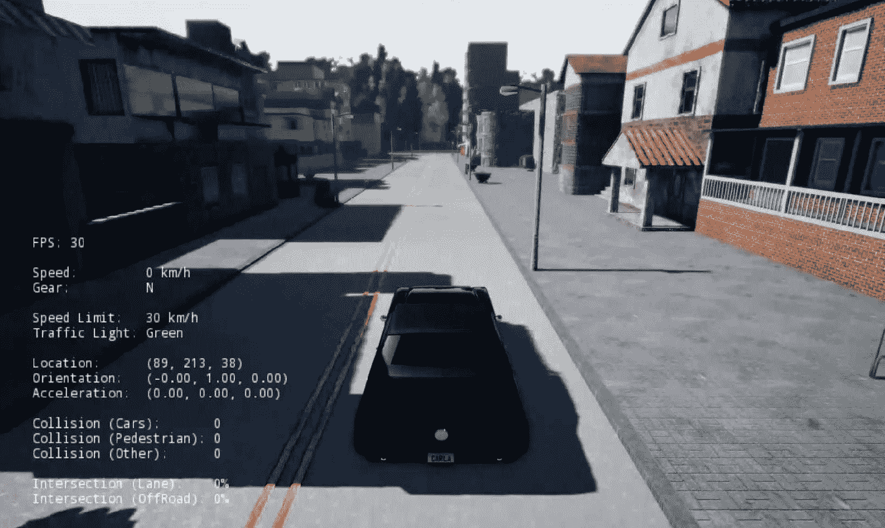
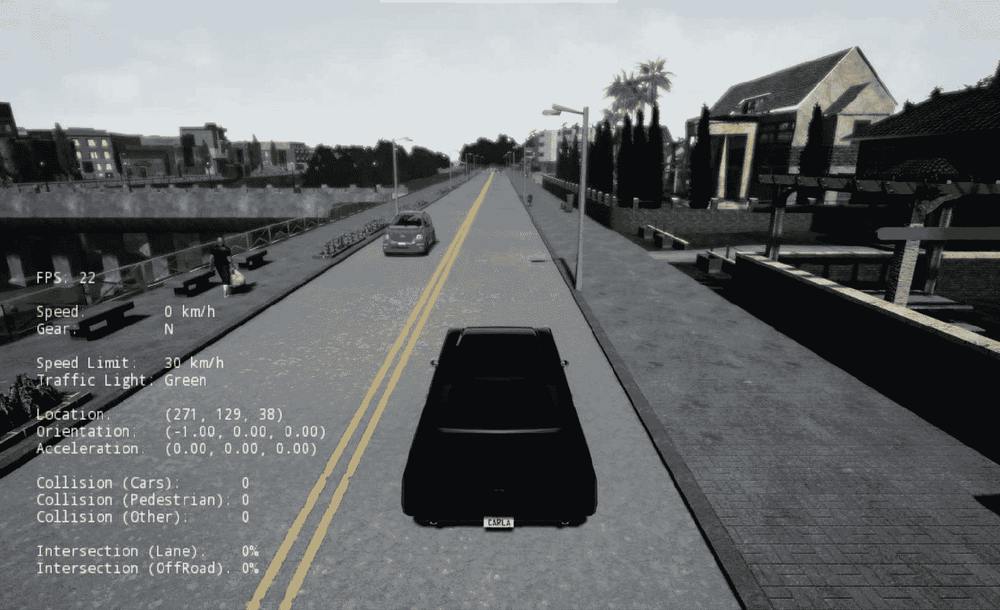
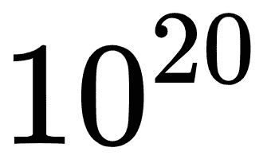
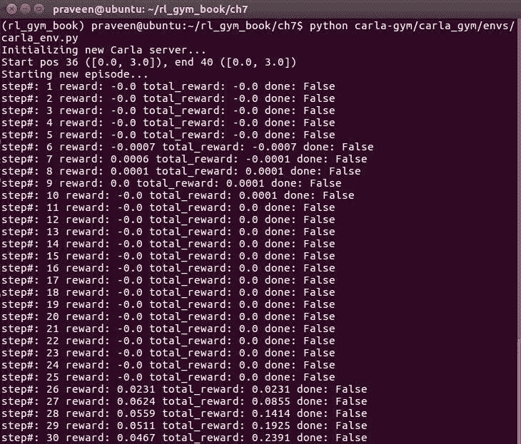

# 七、创建定制的OpenGym环境——卡拉驾驶模拟器

在第一章中，我们看了 OpenAI Gym 环境目录中可用的各种学习环境。然后我们在[第 5 章](part0078.html#2ACBS0-22c7fc7f93b64d07be225c00ead6ce12)、*实现您的第一个学习智能体——解决山地汽车问题*中探索了环境列表和它们的术语，并先睹为快。我们还开发了我们的智能体来解决山地汽车和手推车杆的问题，以及一些雅达利游戏环境。现在，你应该对 OpenAI Gym 提供的各种环境类型和风格有了很好的理解。大多数情况下，一旦我们学会了如何开发我们自己的智能体，我们就想用这些知识和技能来开发智能体，以解决新的问题，我们已经面临的问题，甚至是我们感兴趣的问题。例如，你可能是一名希望为游戏角色添加智能行为的游戏开发人员，或者是一名希望为机器人注入人工智能的机器人工程师，或者你可能是一名希望将强化学习应用于自动驾驶的自动驾驶工程师。你可能是一个想要将一个小工具变成智能**物联网** ( **IoT** )设备的修补匠，或者你甚至可能是一个想要使用机器学习来提高实验室诊断能力的医疗保健专业人员。应用的潜力几乎是无限的。

我们选择 OpenAI Gym 作为我们的学习环境的原因之一是因为它简单而标准的界面，将环境的类型和性质与环境智能体界面分离。在这一章中，我们将看看如何根据你自己的个人或职业需要来创造你自己的环境。这将使您能够使用智能体实现、培训和测试脚本、参数管理器以及我们在前面章节中针对您自己的设计或问题开发的日志记录和可视化例程。


# 理解Gym环境的解剖

任何 Gym 兼容的环境都应该子类化`gym.Env`类并实现`reset`和`step`方法以及`observation_space`和`action_space`属性和特性。还有机会实现其他可选的方法，为我们的定制环境添加额外的功能。下表列出并描述了其他可用的方法:

| **方法** | **功能描述** |
| `observation_space` | 环境返回的观察结果的形状和类型。 |
| `action_space` | 环境接受的行动的形式和类型。 |
| `reset()` | 在一集开始或结束时重置环境的例程。 |
| `step(...)` | 计算必要信息以推进环境、模拟或游戏到下一步的例程。该例程包括在环境中应用选择的动作，计算奖励，产生下一个观察，以及确定一个情节是否已经结束。 |
| `_render()` | (可选)这会渲染Gym环境的状态或观察。 |
| `_close()` | (可选)这将关闭Gym环境。 |
| `_seed` | (可选)这为Gym环境中的随机函数播种了一个自定义种子，使环境的行为对于给定的种子来说是可重现的。 |
| `_configure` | (可选)这将启用额外的环境配置。 |


# 为自定义Gym环境实现创建模板

基于我们已经讨论过的Gym环境的剖析，我们现在将展示一个名为`CustomEnv`的定制环境类实现的基本版本，它将是`gym.Env`的子类，并实现使其成为Gym兼容环境所需的基本方法和参数。最小实现的模板如下:

```
import gym

class CustomEnv(gym.Env):
    """
    A template to implement custom OpenAI Gym environments

    """

    metadata = {'render.modes': ['human']}
    def __init__(self):
        self.__version__ = "0.0.1"
        # Modify the observation space, low, high and shape values according to your custom environment's needs
        self.observation_space = gym.spaces.Box(low=0.0, high=1.0, shape=(3,))
        # Modify the action space, and dimension according to your custom environment's needs
        self.action_space = gym.spaces.Box(4)

    def step(self, action):
        """
        Runs one time-step of the environment's dynamics. The reset() method is called at the end of every episode
        :param action: The action to be executed in the environment
        :return: (observation, reward, done, info)
            observation (object):
                Observation from the environment at the current time-step
            reward (float):
                Reward from the environment due to the previous action performed
            done (bool):
                a boolean, indicating whether the episode has ended
            info (dict):
                a dictionary containing additional information about the previous action
        """
```

```

        # Implement your step method here
        #   - Calculate reward based on the action
        #   - Calculate next observation
        #   - Set done to True if end of episode else set done to False
        #   - Optionally, set values to the info dict
        # return (observation, reward, done, info)

    def reset(self):
        """
        Reset the environment state and returns an initial observation

        Returns
        -------
        observation (object): The initial observation for the new episode after reset
        :return:
        """

        # Implement your reset method here
        # return observation

    def render(self, mode='human', close=False):
        """

        :param mode:
        :return:
        """
        return
```

在我们完成我们的环境类实现之后，我们应该用 OpenAI Gym registry 注册它，这样我们就可以使用`gym.make(ENV_NAME)`来创建环境的一个实例，就像我们之前对 Gym 环境所做的那样。


# 向 OpenAI Gym 注册自定义环境

```
CustomEnv class we implemented is as follows:
```

```
from gym.envs.registration import register

register(
    id='CustomEnv-v0',
    entry_point='custom_environments.envs:CustomEnv',
)
```

我们将在本章的后面使用这个模板来创建一个自定义的体育馆环境，它使用了一个非常复杂的驾驶模拟器。


# 创建一个开放的Gym兼容卡拉驾驶模拟器环境

CARLA 是一个建立在非真实引擎 4 游戏引擎之上的驾驶模拟器环境，与一些竞争对手相比，它的渲染更加真实。你可以在 https://carla.org 的官方网站上了解更多关于卡拉模拟器的信息。在本节中，我们将研究如何创建一个定制的 OpenAI Gym 兼容的汽车驾驶环境来培训我们的学习智能体。这是一个相当复杂的环境，需要一个 GPU 来运行——这与我们迄今为止看到的其他Gym环境不同。一旦您理解了如何为 CARLA 创建一个与Gym兼容的定制环境界面，您就有足够的信息来为您自己的定制环境开发界面，不管它们有多复杂。

卡拉的最新版本是卡拉 0.8.2。虽然大多数(如果不是全部的话)核心环境接口，尤其是`PythonClient`库，可能会保持不变，但未来的变化有可能需要在这个定制环境实现中进行调整。如果发生这种情况，本书的代码库将相应地更新以支持 CARLA 的新版本。当你写这一章的时候，你可能想确保你使用的是本书代码库中最新版本的代码(这也是订阅 GitHub 通知的另一个原因)。尽管如此，本章中讨论的定制环境实现构建块将保持普遍适用，并将引导您定义自己的与 OpenAI Gym 接口兼容的定制环境。自定义 CARLA 环境接口的完整代码可以在本书的代码库中的`ch7/carla-gym`下找到。

在我们开始一个Gym兼容的卡拉环境之前，让我们先来看看卡拉模拟器。所以，让我们继续下载 CARLA 发布版的二进制文件。在下一节中，我们将使用`VER_NUM`来表示版本号，因此在运行以下命令之前，请确保将`VER_NUM`文本替换为您正在使用的版本号:

1.  首先，使用下面的 bash 命令在您的主目录中创建一个名为`software`的文件夹:

```
mkdir ~/software && cd ~/software
```

2.  使用[https://github . com/CARLA-simulator/CARLA/releases/tag/VER 编号](https://github.com/carla-simulator/carla/releases/tag/0.8.2)的官方发布页面上的链接，下载用于 Linux 的 CARLA 二进制发布版本([CARLA _ VER _ 编号. tar.gz](https://drive.google.com/open?id=1ZtVt1AqdyGxgyTm69nzuwrOYoPUn_Dsm) )。(0.8.2 版本的直接链接是:[https://drive.google.com/open?id = 1 ztvt 1 aqdygxgytm 69 nzuwroyopun _ Dsm](https://drive.google.com/open?id=1ZtVt1AqdyGxgyTm69nzuwrOYoPUn_Dsm)。)然后，提取到`~/software`。现在在`~/software/CARLA_VER_NUM`文件夹中应该有一个名为`CarlaUE4.sh`的文件。
3.  使用以下命令将`CARLA_SERVER`环境变量设置为指向计算机上的`CarlaUE4.sh`:

```
export CARLA_SERVER=~/software/CARLA_VER_NUM/CarlaUE4.sh
```

现在您已经准备好试运行 CARLA 驾驶模拟器了！只需执行`$CARLA_SERVER`或者直接执行`~/software/CARLA_VER_NUM/CarlaUE4.sh`。对于 CARLA 版本 0.8.2，该命令将为`~/software/CARLA_0.8.2/CarlaUE4.sh`。您现在应该会看到一个 CARLA 模拟器屏幕，如下面的屏幕截图所示:



前面的截图显示了车辆(智能体)在卡拉的一个起始位置。下面的屏幕截图显示了车辆在 CARLA 环境中的另一个起始位置:



一旦车辆初始化，您应该能够使用键盘上的 *w* 、 *a* 、 *s* 、 *d* 键来控制车辆。 *w* 键将向前移动汽车， *a* 键将向左转动汽车，并且...剩下的你大概就能想出来了！

现在让我们继续，从配置和初始化开始我们的 Gym 兼容的 CARLA 环境实现。


# 配置和初始化

我们将首先定义一些特定于环境的配置参数，并简要地看一下场景配置。然后，我们将启动`CarlaEnv`类实现的初始化过程，它将从`Gym.Env`类继承而来。


# 配置

让我们首先使用字典为环境定义一个配置参数列表，如下所示:

```
# Default environment configuration
ENV_CONFIG = {
    "enable_planner": True,
    "use_depth_camera": False,
    "discrete_actions": True,
    "server_map": "/Game/Maps/" + city,
    "scenarios": [scenario_config["Lane_Keep_Town2"]],
    "framestack": 2, # note: only [1, 2] currently supported
    "early_terminate_on_collision": True,
    "verbose": False,
    "render_x_res": 800,
    "render_y_res": 600,
    "x_res": 80,
    "y_res": 80
}
```

`scenario_config`定义了几个对创建各种驾驶场景有用的参数。场景配置在`scenarios.json`文件中有描述，该文件可以在本书位于`ch7/carla-gym/carla_gym
/envs/scenarios.json`的代码库中找到。


# 初始化

在`__init__`方法中，我们定义了初始化参数以及动作和状态空间，正如我们在上一节中看到的，这是必要的。实现非常简单，如下所示:

```
def __init__(self, config=ENV_CONFIG):
        self.config = config
        self.city = self.config["server_map"].split("/")[-1]
        if self.config["enable_planner"]:
            self.planner = Planner(self.city)

        if config["discrete_actions"]:
            self.action_space = Discrete(len(DISCRETE_ACTIONS))
        else:
            self.action_space = Box(-1.0, 1.0, shape=(2,))
        if config["use_depth_camera"]:
            image_space = Box(
                -1.0, 1.0, shape=(
```

```

                    config["y_res"], config["x_res"],
                    1 * config["framestack"]))
        else:
            image_space = Box(
                0.0, 255.0, shape=(
                    config["y_res"], config["x_res"],
                    3 * config["framestack"]))
        self.observation_space = Tuple(
            [image_space,
             Discrete(len(COMMANDS_ENUM)),  # next_command
             Box(-128.0, 128.0, shape=(2,))])  # forward_speed, dist to goal

        self._spec = lambda: None
        self._spec.id = "Carla-v0"

        self.server_port = None
        self.server_process = None
        self.client = None
        self.num_steps = 0
        self.total_reward = 0
        self.prev_measurement = None
        self.prev_image = None
        self.episode_id = None
        self.measurements_file = None
        self.weather = None
        self.scenario = None
        self.start_pos = None
        self.end_pos = None
        self.start_coord = None
        self.end_coord = None
        self.last_obs = None
```


# 实现重置方法

你可能已经注意到了，在每一集的开始，我们称之为Gym环境的`reset`方法。对于 CARLA 环境，我们希望通过 CARLA 客户端更新 CARLA 服务器以重启关卡。

所以，让我们继续开始我们的`reset`方法的实现。


# 使用 CarlaSettings 对象自定义 CARLA 模拟

当我们开始一个新的情节时，我们希望能够配置开始状态(智能体或车辆开始的位置)、目标状态(智能体或车辆的预期目的地)、情节的复杂性(通过情节中车辆或行人的数量来衡量)、观察的类型和来源(车辆上配置的传感器)等等。

CARLA 项目使用服务器-客户端架构管理 UE4 环境与外部配置和控制之间的接口，其中有两台服务器。

对于 CARLA 环境，我们可以使用`CarlaSettings`对象或`CarlaSettings.ini`文件配置环境的开始状态、目标状态、复杂程度和传感器源。

现在让我们创建一个`CarlaSettings`对象并配置一些设置，如下所示:

```
settings = CarlaSettings()  # Initialize a CarlaSettings object with default values
settings.set(
            SynchronousMode=True,
            SendNonPlayerAgentsInfo=True,  # To receive info about all other objs
            NumberOfVehicles=self.scenario["num_vehicles"],
            NumberOfPedestrians=self.scenario["num_pedestrians"],
            WeatherId=self.weather)
SynchronousMode to True to enable the synchronous mode, in which the CARLA server halts the execution of each frame until a control message is received. Control messages are based on the actions the agent takes and are sent through the CARLA client.
```


# 在卡拉的一辆车上安装摄像头和传感器

要在 CARLA 环境中添加 RGB 彩色摄像机，请使用以下代码:

```
# Create a RGB Camera Object
camera1 = Camera('CameraRGB')
# Set the RGB camera image resolution in pixels
camera1.set_image_size(640, 480)
# Set the camera/sensor position relative to the car in meters
camera1.set_positions(0.25, 0, 1.30)
# Add the sensor to the Carla Settings object
settings.add_sensor(camera1)
```

您还可以使用以下代码片段添加深度测量传感器或相机:

```
# Create a depth camera object that can provide us the ground-truth depth of the driving scene
camera2 = Camera("CameraDepth",PostProcessing="Depth")
# Set the depth camera image resolution in pixels
camera2.set_image_size(640, 480)
# Set the camera/sensor position relative to the car in meters
camera2.set_position(0.30, 0, 1.30)
# Add the sensor to the Carla settings object
settings.add_sensor(camera)Setting up the start and end positions in the scene for the Carla Simulation
```

要将`LIDAR`添加到 CARLA 环境中，请使用以下代码:

```
# Create a LIDAR object. The default LIDAR supports 32 beams
lidar = Lidar('Lidar32')
# Set the LIDAR sensor's specifications
lidar.set(
    Channels=32,  # Number of beams/channels
    Range=50,     # Range of the sensor in meters
    PointsPerSecond=1000000,  # Sample rate
    RotationFrequency=10,  # Frequency of rotation
    UpperFovLimit=10,  # Vertical field of view upper limit angle
    LowerFovLimit=-30) # Vertical field of view lower limit angle
# Set the LIDAR position & rotation relative to the car in meters
lidar.set_position(0, 0, 2.5)
lidar.set_rotation(0, 0, 0)
# Add the sensor to the Carla settings object
settings.add_sensor(lidar)
```

一旦我们根据所需的驾驶模拟配置创建了 CARLA 设置对象，我们就可以将它发送到 CARLA 服务器来设置环境并开始模拟。

一旦我们将 CARLA 设置对象发送到 CARLA 服务器，它就会响应一个包含 ego 车辆可用起始位置的场景描述对象，如下所示:

```
scene = self.client.load_settings(settings)
available_start_spots = scene.player_start_spots
```

我们现在可以为宿主或自我车辆选择一个特定的开始位置，甚至可以随机选择一个开始点，如下面的代码片段所示:

```
start_spot = random.randint(0, max(0, available_start_spots))
```

我们还可以使用以下代码片段将此开始点首选项发送到服务器，并请求开始新的一集:

```
self.client.start_episode(start_spot)
```

注意，前一行是一个阻塞函数调用，它将阻塞动作，直到 CARLA 服务器真正开始播放这一集。

我们现在可以从这个起始位置开始一步一步地看完这一集。在下一节中，我们将看到实现 CARLA 环境的`step()`方法需要什么，该方法用于遍历环境直到一集结束:

```
def _reset(self):
        self.num_steps = 0
        self.total_reward = 0
        self.prev_measurement = None
        self.prev_image = None
        self.episode_id = datetime.today().strftime("%Y-%m-%d_%H-%M-%S_%f")
        self.measurements_file = None

        # Create a CarlaSettings object. This object is a wrapper around
        # the CarlaSettings.ini file. Here we set the configuration we
        # want for the new episode.
        settings = CarlaSettings()
        # If config["scenarios"] is a single scenario, then use it if it's an array of scenarios, randomly choose one and init
        self.config = update_scenarios_parameter(self.config)

        if isinstance(self.config["scenarios"],dict):
            self.scenario = self.config["scenarios"]
        else: #ininstance array of dict
            self.scenario = random.choice(self.config["scenarios"])
        assert self.scenario["city"] == self.city, (self.scenario, self.city)
        self.weather = random.choice(self.scenario["weather_distribution"])
        settings.set(
            SynchronousMode=True,
            SendNonPlayerAgentsInfo=True,
            NumberOfVehicles=self.scenario["num_vehicles"],
            NumberOfPedestrians=self.scenario["num_pedestrians"],
            WeatherId=self.weather)
        settings.randomize_seeds()

        if self.config["use_depth_camera"]:
            camera1 = Camera("CameraDepth", PostProcessing="Depth")
            camera1.set_image_size(
                self.config["render_x_res"], self.config["render_y_res"])
            camera1.set_position(30, 0, 130)
            settings.add_sensor(camera1)

        camera2 = Camera("CameraRGB")
        camera2.set_image_size(
            self.config["render_x_res"], self.config["render_y_res"])
        camera2.set_position(30, 0, 130)
        settings.add_sensor(camera2)

        # Setup start and end positions
        scene = self.client.load_settings(settings)
        positions = scene.player_start_spots
        self.start_pos = positions[self.scenario["start_pos_id"]]
        self.end_pos = positions[self.scenario["end_pos_id"]]
        self.start_coord = [
            self.start_pos.location.x // 100, self.start_pos.location.y // 100]
        self.end_coord = [
            self.end_pos.location.x // 100, self.end_pos.location.y // 100]
        print(
            "Start pos {} ({}), end {} ({})".format(
                self.scenario["start_pos_id"], self.start_coord,
                self.scenario["end_pos_id"], self.end_coord))

        # Notify the server that we want to start the episode at the
        # player_start index. This function blocks until the server is ready
        # to start the episode.
        print("Starting new episode...")
        self.client.start_episode(self.scenario["start_pos_id"])

        image, py_measurements = self._read_observation()
        self.prev_measurement = py_measurements
        return self.encode_obs(self.preprocess_image(image), py_measurements)
```


# 为 CARLA 环境实现 step 函数

一旦我们通过向 CARLA 服务器发送 CARLA 设置对象并调用`client.start_episode(start_spot)`来初始化 CARLA 模拟器，驾驶模拟将开始。然后，我们可以使用`client.read_data()`方法获取给定步骤中模拟产生的数据。我们可以使用下面一行代码来实现这一点:

```
measurements, sensor_data = client.read_data()
```


# 访问摄像机或传感器数据

我们可以使用返回的`sensor_data`对象的`data`属性在任何给定的时间步长检索传感器数据。要检索 RGB 相机帧，请输入以下代码:

```
rgb_image = sensor_data['CameraRGB'].data
```

`rgb_image`是一个 NumPy n-d 数组，您可以像通常访问和操作 NumPy n-d 数组一样访问和操作它。

例如，要在( *x* ， *y* )图像平面坐标处访问 RGB 摄像机图像的像素值，您可以使用以下行:

```
pixel_value_at_x_y = rgb_image[X, Y]
```

要检索深度相机帧，请输入以下代码:

```
depth_image = sensor_data['CameraDepth'].data
```


# 向 CARLA 中的控制智能体发送操作

我们可以通过 TCP 客户端向 CARLA 服务器发送所需的转向、油门、刹车、手刹和倒车(档位)命令，从而在 CARLA 中控制汽车。下表显示了 CARLA 中的汽车将遵守的命令的值、范围和描述:

| **命令/动作名称** | **值类型，范围** | **描述** |
| 引导 | `Float`，[-1.0，+1.0] | 标准化转向角 |
| 喉咙 | `Float`，【0.0，1.0】 | 标准化油门输入 |
| 刹车 | `Float`，【0.0，1.0】 | 标准化制动输入 |
| 手制动器 | `Boolean`，真/假 | 这告诉汽车是否接合手制动(`True`)或不接合(`False`) |
| 反面的 | `Boolean`，真/假 | 这告诉汽车是否处于倒档(`True`)或不处于倒档(`False`) |

如 CARLA 文档中所述，实际转向角度将取决于车辆。例如，默认的野马车辆具有 70 度的最大转向角，如车辆的前轮 UE4 蓝图文件中所定义的。这是在卡拉控制汽车所需的五个不同的命令。在这五个命令中，其中三个(steer、throttle 和 brake)是实值浮点数。尽管它们的范围被限制在-1 和+1 或 0 和 1 之间，但是(唯一的)可能值的数量是巨大的。例如，如果我们对介于 0 和 1 之间的节流值使用单精度浮点表示，则有，这意味着该节流命令有 1，056，964，608 个不同的可能值。这同样适用于制动命令，因为它也位于 0 和 1 之间。转向命令的可能浮点值大约是两倍，因为它位于-1 和+1 之间。由于单个控制消息由五个命令中每个命令的一组值组成，因此不同动作(或控制消息)的数量是每个命令的唯一值的乘积，大致顺序如下:


正如你所看到的，这产生了一个巨大的行动空间，对于深度学习智能体来说，回归到这样一个巨大的行动空间可能是一个非常困难的问题。所以，让我们简化动作空间，用两种口味定义动作空间——一种用于连续空间，另一种用于离散空间，这对应用不同的强化学习算法很有用。例如，基于深度 Q 学习的算法(没有自然化优势函数)只能在离散动作空间上工作。


# 卡拉的连续行动空间

开车时，我们一般不会同时加速和刹车；因为 CARLA 中的动作空间是连续的，智能体每走一步都会施加一个动作，所以加速和减速的命令一个可能就够了。现在让我们将油门和刹车指令合并为一个取值范围为-1 到+1 的指令，刹车指令取值范围为-1 到 0，油门或加速指令取值范围为 0 到 1。我们可以使用以下命令来定义它:

```
action_space = gym.space.Box(-1.0, 1.0, shape=2(,))
```

`action[0]`表示转向命令，而`action[1]`表示油门和刹车命令的组合值。现在，我们将把`hand_brake`和`reverse`都设置为假。接下来，我们将看看如何定义一个离散的行动空间，以便我们为我们的智能体选择我们想要的。


# 卡拉的离散行动空间

我们已经看到全动作空间相当大(按的顺序)。你可能玩过电子游戏，在那里你只用一个带四个箭头按钮的操纵杆或键盘上的箭头键来控制速度和方向(汽车指向的方向)来驾驶，那么为什么我们不能在这里要求智能体以类似的方式控制汽车呢？这就是离散行动空间背后的想法。虽然我们无法对汽车进行精确控制，但我们可以确保离散化的空间在模拟环境中为我们提供良好的控制。

让我们首先使用我们在连续动作空间案例中使用的类似约定——其中我们使用一个浮点值来表示油门(加速)和刹车(减速)动作，从而在内部使用一个二维有界空间。这意味着在这种情况下，动作空间可以定义如下:

```
action_space = gym.spaces.Discrete(NUM_DISCRETE_ACTIONS)
```

正如您在这里看到的，`NUM_DISCRETE_ACTONS`等于可用的不同动作的数量，我们将在本节稍后定义。

然后，我们将使用二维有界空间离散化该空间，并将其作为离散动作空间暴露给智能体。为了保持尽可能少的动作，同时仍然允许对汽车的控制，我们使用下面的动作列表:

| **动作指数** | **动作描述** | **动作数组值** |
| 0 | 海岸 | [0.0, 0.0] |
| 一 | 向左转 | [0.0, -0.5] |
| 2 | 向右转 | [0.0, 0.5] |
| 3 | 向前 | [1.0, 0.0] |
| 四 | 刹车 | [-0.5, 0.0] |
| 5 | 左转加速 | [1.0, -0.5] |
| 6 | 向右加速 | [1.0, 0.5] |
| 七 | 左转减速 | [-0.5, -0.5] |
| 8 | 向右转并减速 | [-0.5, 0.5] |

现在让我们在`carla_env`实现脚本的`DISCRETE_ACTIONS`字典中定义前面的一组离散动作，如下所示:

```
DISCRETE_ACTIONS = {
    0: [0.0, 0.0],    # Coast
    1: [0.0, -0.5],   # Turn Left 
    2: [0.0, 0.5],    # Turn Right
    3: [1.0, 0.0],    # Forward
    4: [-0.5, 0.0],   # Brake
    5: [1.0, -0.5],   # Bear Left & accelerate
    6: [1.0, 0.5],    # Bear Right & accelerate
    7: [-0.5, -0.5],  # Bear Left & decelerate
    8: [-0.5, 0.5],   # Bear Right & decelerate
}
```


# 向 CARLA 模拟服务器发送操作

现在我们已经定义了 CARLA Gym 环境的动作空间，我们可以看看如何将我们定义的连续或离散动作转换为 CARLA 模拟服务器将接受的值。

由于我们在连续和离散动作空间中对二维有界动作值遵循了相同的约定，因此我们可以使用以下代码片段简单地将动作转换为转向、油门和制动命令:

```
throttle = float(np.clip(action[0], 0, 1)
brake = float(np.abs(np.cllip(action[0], -1, 0)
steer = float(p.clip(action[1], -1, 1)
hand_brake = False
reverse = False
```

如你所见，这里是`action[0]`代表油门和刹车，`action[1]`代表转向角度。

我们将利用 CARLA `PythonClient`库中的`CarlaClient`类实现来处理与 CARLA 服务器的通信。如果您想了解如何使用协议缓冲区处理与服务器的通信，可以看看`ch7/carla-gym/carla_gym/envs/carla/client.py`中的`CarlaClient`类的实现。

要为 CARLA 环境实现奖励功能，请输入以下代码:

```
def calculate_reward(self, current_measurement):
        """
        Calculate the reward based on the effect of the action taken using the previous and the current measurements
        :param current_measurement: The measurement obtained from the Carla engine after executing the current action
        :return: The scalar reward
        """
        reward = 0.0

        cur_dist = current_measurement["distance_to_goal"]

        prev_dist = self.prev_measurement["distance_to_goal"]

        if env.config["verbose"]:
            print("Cur dist {}, prev dist {}".format(cur_dist, prev_dist))

        # Distance travelled toward the goal in m
        reward += np.clip(prev_dist - cur_dist, -10.0, 10.0)

        # Change in speed (km/hr)
        reward += 0.05 * (current_measurement["forward_speed"] - self.prev_measurement["forward_speed"])

        # New collision damage
        reward -= .00002 * (
            current_measurement["collision_vehicles"] + current_measurement["collision_pedestrians"] +
            current_measurement["collision_other"] - self.prev_measurement["collision_vehicles"] -
            self.prev_measurement["collision_pedestrians"] - self.prev_measurement["collision_other"])

        # New sidewalk intersection
        reward -= 2 * (
            current_measurement["intersection_offroad"] - self.prev_measurement["intersection_offroad"])

        # New opposite lane intersection
        reward -= 2 * (
            current_measurement["intersection_otherlane"] - self.prev_measurement["intersection_otherlane"])

        return reward
```


# 在卡拉环境中确定剧集的结尾

我们已经实现了`meta hod`来计算奖励，并为定制的 CARLA 环境定义了允许的操作、观察和重置方法。根据我们的定制Gym环境创建模板，这些是我们需要实现的必需方法，用于创建与 OpenAI Gym接口兼容的定制环境。

虽然这是真的，但我们还需要注意一件事，以便智能体可以不断地与我们的环境进行交互。还记得我们在[第五章](part0078.html#2ACBS0-22c7fc7f93b64d07be225c00ead6ce12)、*开发我们的 Q-learning agent 的时候，实现你的第一个学习 Agent——解决山地车问题*吗，对于山地车环境，200 步后总会自行复位的环境？或者在车杆环境中，如果杆降到某个阈值以下，环境会自动重置？或者在 Atari 游戏中，如果一个智能体失去了他们最后的生命，环境会自动重置？是的，我们需要查看确定何时重置环境的例程，这在我们的定制 CARLA Gym 环境实现中是缺失的。

虽然我们可以选择任何标准来重新设置卡拉Gym环境，但有三点需要考虑，如下所示:

*   当智能体控制的宿主或自我汽车与汽车、行人、建筑物或其他路边物体发生碰撞时，这可能是致命的(类似于在 Atari 游戏中丧生)
*   当宿主或自我车到达其目的地或最终目标时
*   当超过时间限制时(类似于我们在山地汽车Gym环境中的 200 时间步长限制)

我们可以使用这些条件来形成决定一集结束的标准。确定`.step(...)`将返回的`done`变量的值的伪代码如下(注意，完整的代码可以在本书的`ch7/carla-gym/carla_gym/envs/`代码库中找到):

```
# 1\. Check if a collision has occured
m = measurements_from_carla_server
collided = m["collision_vehicles"] > 0 or m["collision_pedestrians"] > 0 or m["collision_other"] > 0

# 2\. Check if the ego/host car has reached the destination/goal
planner = carla_planner
goal_reached = planner["next_command"] == "REACHED_GOAL"

# 3\. Check if the time-limit has been exceeded
time_limit = scenario_max_steps_config
time_limit_exceeded = num_steps > time_limit

# Set "done" to True if either of the above 3 criteria becomes true
done = collided or goal_reached or time_limit_exceeded
```

现在，我们已经完成了创建基于 CARLA 驾驶模拟器的自定义Gym兼容环境所需的所有组件！在下一节中，我们将测试环境并最终看到它的运行。


# 测试卡拉Gym环境

为了使测试我们的环境实现的基础变得容易，我们将实现一个简单的`main()`例程，这样我们就可以将环境作为脚本运行。这将向我们显示基本接口是否设置正确，以及环境实际上是什么样子！

```
CarlaEnv and runs five episodes with a fixed action of going forward. The ENV_CONFIG action, which we created during initialization, can be changed to use discrete or continuous action spaces, as follows:
```

```
# Part of https://github.com/PacktPublishing/Hands-On-Intelligent-Agents-with-OpenAI-Gym/ch7/carla-gym/carla_gym/envs/carla_env.py
if __name__ == "__main__":
    for _ in range(5):
        env = CarlaEnv()
        obs = env.reset()
        done = False
        t = 0
        total_reward = 0.0
        while not done:
            t += 1
            if ENV_CONFIG["discrete_actions"]:
                obs, reward, done, info = env.step(3) # Go Forward
            else:
                obs, reward, done, info = env.step([1.0, 0.0]) # Full throttle, zero steering angle
            total_reward += reward
            print("step#:", t, "reward:", round(reward, 4), "total_reward:", round(total_reward, 4), "done:", done)
```

现在，继续测试我们刚刚创建的环境！请记住，卡拉需要一个 GPU 来顺利运行，系统环境`CARLA_SERVER`变量被定义并指向系统上的`CarlaUE4.sh`文件。准备好之后，您可以通过在`rl_gym_book` conda 环境中运行以下命令来测试我们创建的环境:

```
(rl_gym_book) praveen@ubuntu:~/rl_gym_book/ch7$ python carla-gym/carla_gym/envs/carla_env.py
```

前面的命令应打开一个小的 CARLA 模拟器窗口，并为`carla_env.py`脚本中使用的场景配置初始化车辆。这应该类似于下面的屏幕截图:

  

如你所见，默认情况下，车辆被设定为直线行驶。注意，`carla_env.py`脚本还会产生一个控制台输出，显示环境中的当前时间步长、计算出的瞬时奖励、剧集中的总奖励以及`done`的值(对或错)，这些对于测试我们的环境都很有用。随着车辆开始向前移动，您应该会看到奖励值增加！

控制台输出如下:



所以，你现在有你的自定义卡拉Gym环境工作！您可以使用`ch7/carla-gym/carla_gym/envs/scenarios.json`文件中的定义创建几种不同的驾驶场景。然后，您可以为这些场景中的每一个创建新的定制 CARLA 环境，在您注册了定制环境之后，您可以使用常规的`gym.make(...)`命令，例如`gym.make("Carla-v0")`。

书中代码库中的代码使用我们在本章前面讨论过的方法来处理 OpenAI Gym 注册中心的环境注册。您现在可以使用 OpenAI Gym 来创建我们构建的定制环境的实例。

以下屏幕截图显示了可用于测试自定义Gym环境的 Python 命令:


就是这样！剩下的和其他Gym环境差不多。


# 摘要

在本章中，我们一步一步地介绍了自定义Gym环境的实现，从一个模板开始，该模板展示了 OpenAI Gym环境的基本结构，为智能体提供了所有必要的接口。我们还研究了如何在 Gym 注册表中注册一个定制环境实现，这样我们就可以使用熟悉的`gym.make(ENV_NAME)`命令来创建一个现有环境的实例。然后，我们看了如何为基于开源驾驶模拟器 CARLA 的非远程引擎创建一个Gym兼容的环境实现。然后，我们快速浏览了安装和运行 CARLA 所需的步骤，然后开始一部分一部分地实现`CarlaEnv`类，仔细地涵盖了实现与 OpenAI Gym 兼容的定制环境所涉及的所有重要细节。

在下一章中，我们将通过实际操作的例子从头开始构建一个高级智能体，然后最终使用我们在本章中创建的自定义 CARLA 环境来训练一个智能体，它可以学会自己驾驶汽车！