# 图论

现在我们已经领略了线性代数、微积分、统计学和最优化，是时候进入一个非常迷人的话题，即图论。顾名思义，这涉及到对图形的研究，我们用它来建模对象之间的关系。我们使用这些图表来帮助可视化和分析问题，从而帮助我们解决问题。

图论是一个非常重要的领域，用于各种问题，包括搜索引擎中的页面排名、社交网络分析以及在 GPS 中找到回家的最佳路线。对我们来说，进一步理解深度神经网络也很重要，因为它们中的大多数都是基于一种称为**有向无环图** ( **DAG** )的图。

涵盖图论中的所有内容超出了本章(和本书)的范围，但是我们将涵盖对深入理解神经网络很重要的所有内容。

本章涵盖的主题如下:

*   理解基本概念和术语
*   邻接矩阵
*   图形的类型
*   图拉普拉斯算子

# 理解基本概念和术语

图论是由莱昂哈德·欧拉在 18 世纪首次引入的，用来解决一个著名的问题，称为**柯尼斯堡桥问题**，该问题询问是否有可能绕着柯尼斯堡桥走，同时恰好穿过七座桥中的每一座一次。这座桥看起来如下:

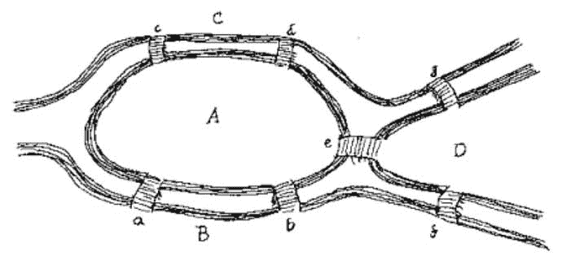

在我们继续之前，用你的手指沿着路径画出来或者用铅笔画出来。你设法找到解决办法了吗？如果你没有也没关系！

让我们停下来想一想，图到底是什么？图( *G* )是由两个集合组成的数学结构——顶点( *V(G)* )和边( *E(G)* )。两个顶点( *v [1]* 和 *v [2]* )之间若有边( *e* 或 *(v [1] ，v [2] )* )相连。既然已经解决了这个问题，那么还有一些与图形相关的规则，它们对于我们理解图形非常重要。它们如下:

*   如果 [] ，那么*v[1]和 *v [ 2 ]* 相邻(相连/邻居)；但是如果 [] ，那么 *v [ 1 ]* 和 *v [ 2 ]* 是非相邻的(不相连/不是邻居)。*
*   如果*v[1]与 *v [2]* 相邻，那么我们可以说 *v [1]* (记为 [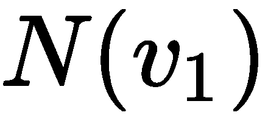] )的邻域是与 *v [ 1 ]* 相连的顶点的集合。我们把这个写成 [] 。*
*   如果 [] ，那么就是关联到 *v [ 1 ]* 和 *v [ 2 ]* (即 *v [ 1 ]* 和 *v [ 2 ]* 是的端点)。
*   如果 *G* 有 *n* 个顶点，那么*v[1]最多可以有 *n-1* 个邻居。*
*   如果*v[1]有邻居，那么*v[1]的度数就是它有邻居(或关联数)的个数。我们可以把这个写成 [] 。图中顶点的最小度数表示为 [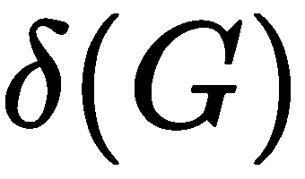] ，图中顶点的最大度数表示为 [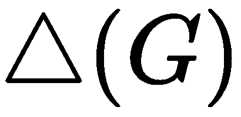] 。**
*   如果 [] ，那么它就是一个孤立顶点。

现在我们知道了图形的基本规则，让我们再来看一下前面介绍的问题，看看我们是否能找到它的解决方案。我们可以把桥梁问题重新画成一个图，如下图(参考图形捆绑中提供的彩色版本):

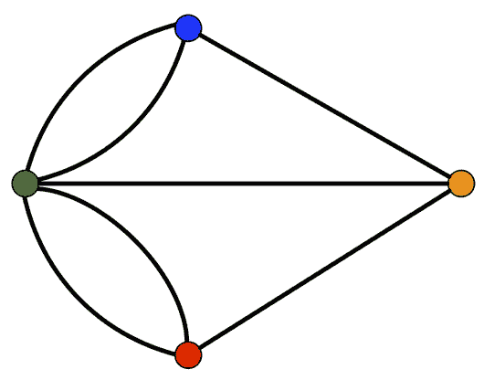

在这里，我们有以下内容:

*   绿色顶点是 *A*
*   红色顶点是 *B*
*   蓝色顶点是 *C*
*   橙色顶点是 *D*
*   连接 *A* 和 *B* 的曲边为桥 *a*
*   连接 *A* 和 *B* 的直边是桥 *b*
*   连接 *A* 和 *C* 的曲边是桥 *c*
*   连接 *A* 和 *B* 的直边是桥 *d*
*   连接 *A* 和 *D* 的直边是桥 *e*
*   连接 *B* 和 *D* 的直边是桥 *f*
*   连接 *C* 和 *D* 的直边是桥 *g*

如果我们看这个图并遍历边，我们可以很容易地观察到柯尼斯堡桥问题没有解，不管我们走什么路。然而，如果我们要添加一条从 *D* 到 *A* 、 *D* 到 *B* 或者 *D* 到 *C* 的额外路径，那么我们实际上就有了这个问题的解决方案。

现在，让我们假设我们有一堆多面体。在几何学中，多面体是三维物体，如四面体(金字塔)、立方体、双面体、三角体、十二面体、五边形六面体等等(别担心，你不需要知道它们都是什么)。在下图中，我们有两个不同的多面体，以及它们对应的图形:

让我们观察一下这些形状和它们的图形。如您所见，该图看起来与实际结构有点不同，但仍然捕捉到了形状的属性。这里的每个图都有顶点( *V* )和边( *E* )，这是我们已经知道的。但是还有一个额外的属性——faces(*F*)。使用前面的图表，我们可以推导出一个捕捉顶点、边和面之间关系的一般规则。内容如下:

这里，| *V* | = *n* ，| *E* | = *m* ，以及| *F* | = *r* 。为了验证这一点，让我们看一下前面的图表。

在立方体的例子中，有 8 个顶点，12 条边和 6 个面，所以我们有如下:

在八面体的情况下，有 6 个顶点，12 条边和 8 个面，所以我们有如下:

现在我们已经了解了基础知识，是时候让我们了解一下通常被称为图论中的第一定理了。假设我们有一个图，它有 n 个顶点和 m 条边。然后，我们可以观察到以下情况:

这告诉我们，图的每个顶点的度数之和是图的边数的两倍。或者，我们可以这样写:

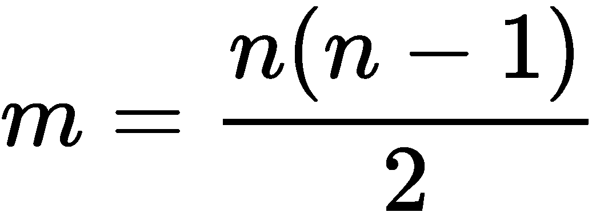

# 邻接矩阵

可以想象，写下所有连接的节点对(也就是说，它们之间有边的节点)来跟踪图中的关系可能会很乏味，尤其是当图变得非常大时。为此，我们使用邻接矩阵，它是图形的基本数学表示。

假设我们有一个有 *n* 个节点的图，每个节点都有一个唯一的整数标签( [] )，这样我们就可以很容易地引用它，不会有任何歧义。为了简单起见，在这个例子中， *n* = 6。那么，这个图对应的邻接矩阵如下:

让我们看一下矩阵，看看为什么它是这样的。马上蹦出来的第一件事就是矩阵的大小是 6 × 6(或者 *n* × *n* )因为大小对我们来说很重要。接下来，我们注意到它是对称的，沿着对角线只有零。但是为什么呢？这样写的意义是什么？

如果我们查看上一节中的图表，我们可以看到边如下:

回头看矩阵的上三角形或下三角形，我们可以看到在特定的 *(i，j)* 位置有七个 1。每个 1 代表两个编号节点之间的边，如果两个节点之间没有边，则有一个 0。我们可以对此进行归纳，写出如下内容:

沿着对角线只有零的原因是没有自边缘；也就是说，没有一个节点与自身有连接。这被称为简单图形。然而，也有更复杂的图，例如具有自边和多边的图。

多边图与简单图的区别在于，多边图中的一对节点之间可以有一条或多条边。为了更清楚地理解这一点，让我们考虑下面的邻接矩阵，其中我们可以看到现在节点对之间存在自边和多条边:

与简单图相比，这种邻接矩阵有一些显著的不同。我们注意到的第一件事是矩阵不再仅仅由 1 和 0 组成。你认为这些数字代表什么？在这个邻接矩阵中，两个节点之间的一条双边写成 *A [i，j]* = *A [j，i]* = 2。另一方面，自边缘是那些从 *i* 到 *i* 的边缘；也就是我们可以把这个写成 *A* [*i，i*] 并且它等于 2。之所以等于 2 而不是 1，是因为边的两端都连接到了 *i* (而且做计算的时候也比较容易)。

# 图形的类型

在上一节中，我们学习了图论的基础知识，正如你所看到的，这是一个非常强大的数学工具，可以用于各种领域的大量任务。然而，没有放之四海而皆准的解决方案，所以我们需要额外的工具来帮助我们，因为每个问题都是独特的。在本节中，我们将了解各种类型的图表及其使用案例和优势。这包括加权图、有向图、多层图、动态图和树形图。

# 加权图

到目前为止，我们已经看到了具有某种二进制表示的图形，其中 1 表示两个节点之间存在边，0 表示两个边之间没有连接。我们也见过有自边和多边的图。然而，有时我们可能希望表示两个节点之间的强度，我们将其表示为权重。重量越大，力量越大。

这类图表可用于各种场合，例如在社交网络中，权重代表两个人相互交流的频率，我们可以用它来确定他们的亲密程度。在加权图的邻接矩阵中，每个 *A [i，j]实例代表节点 *i* 和 *j* 之间的权重。*

假设我们有以下邻接矩阵:

我们可以看到，节点 1 和 2 之间的权重(或强度)是节点 1 和 3 之间权重的两倍，节点 2 和 3 之间的权重是节点 1 和 3 之间的四倍。

这些边上的权重不一定要表示两个节点之间的连接有多强；它也可以表示从一个节点到另一个节点所需的时间或两个节点之间的距离。

# 有向图

正则图和有向图的区别在于正则图中的边可以是任意方向的，这就是为什么邻接矩阵是对称的。所以，如果在节点 *i* 和节点 *j* 之间有一条边，那么我们可以从 *i* 到 *j* 或者从 *j* 到 *i* 。然而，在有向图的情况下，边是有方向的。这些边是有向边，只能往一个方向走。

这种图形的邻接矩阵如下:

现在，假设我们有下图:

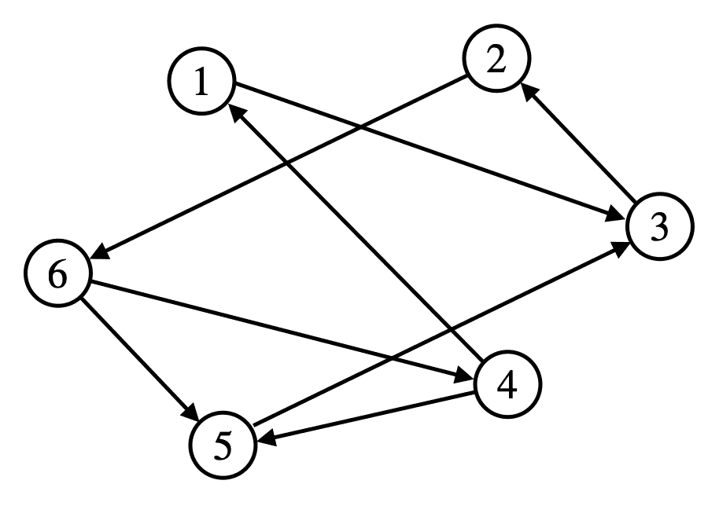

那么，其对应的邻接矩阵如下:

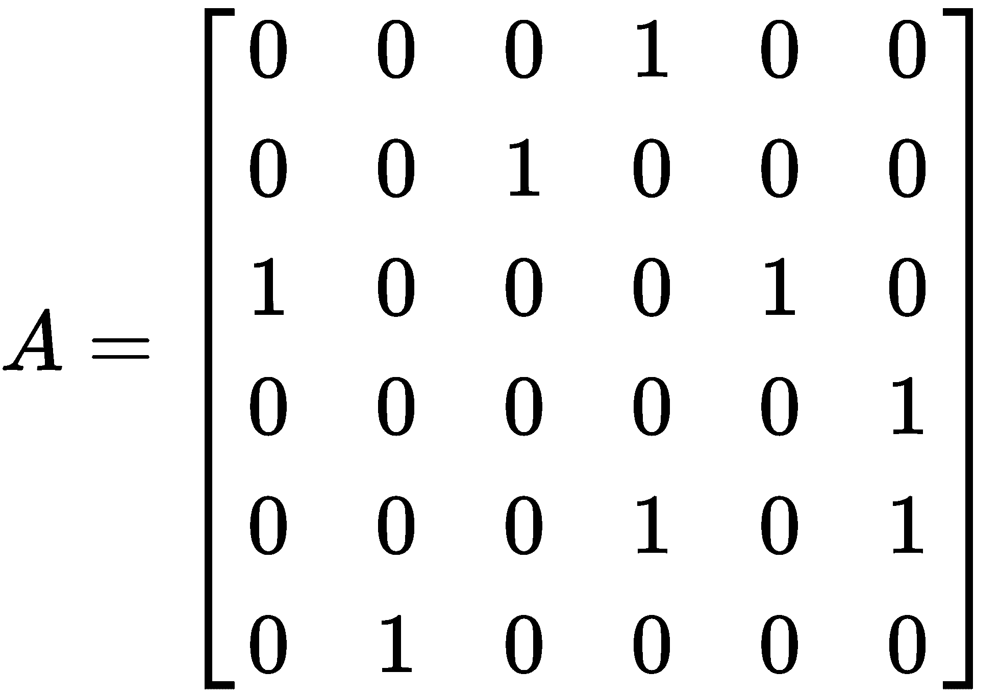

可以看到，这个矩阵是不对称的(非对称的)。例如，节点 3 连接到节点 2，节点 6 连接到节点 4，但是它们从来没有反向连接。

与无向网络一样，有向网络也可以有多条边和自边。然而，在这种情况下，如果存在自边缘，那么沿着对角线的元素将保存值 1 而不是 2。

# 有向无环图

DAG 是一种没有圈的有向图。这意味着没有闭环；也就是说，在相似的方向上有三个或更多的节点。因此，假设我们有以下邻接矩阵:

在前面的邻接矩阵中，我们可以看到，从节点 1 到节点 3 有一条边，从节点 3 到节点 4 有一条边，从节点 4 到节点 1 有一条边。这在图形中创建了一个循环。

从视觉上看，您可以将 DAG 想象为具有层次结构，其中节点可以向下或向上流经后续级别。因此，如果我们的边都指向上，没有一个节点会从较高的级别指向较低的级别。但是如果是这样的话，我们的网络可能会永远继续下去，那么这个图的终点在哪里呢？肯定至少有一个节点有输入边，但没有输出边。

要确定我们的网络是否是无环的，我们可以使用一个简单的程序:

1.  找到一个没有任何输出边的节点。
2.  如果这样的节点不存在，那么这个图就是无环的。但是，如果有这样的节点，那么从图中删除它和它的输入边。
3.  如果所有这些节点都被删除了，那么这个图就是无环的。否则再次从*步骤 1* 开始。

现在，这类图的邻接矩阵相当有趣。假设我们对所有节点进行编号，使得边从编号较高的节点指向编号较低的节点。那么，它的邻接矩阵将是严格的三角形，沿着对角线有零。如果我们有下面的邻接矩阵，我们可以清楚地观察到没有自边，这对于非循环图总是成立的:

我们注意到为什么这个邻接矩阵是严格的三角形是非常重要的。这是因为节点的排序(编号)。如果做得不好，我们就不会有三角矩阵。奇怪的是，总有至少一种节点排序会产生上三角矩阵，使用前面的三个步骤就可以找到它。

# 多层和动态图形

通常，我们使用图表来描绘非常复杂的关系。因此，假设我们想为所有的交通方式和路线创建一个图表，类似于谷歌地图如何为我们提供涉及公共汽车、火车、汽车、飞机甚至它们的组合的路线。我们可以使用多层图创建这样的东西，其中节点代表机场、汽车站、火车站和其他交通方式，而边代表航班、路线等等。

我们可以只标记边和节点来描述每一个代表什么，但这可能会变得非常混乱。因此，我们可以使用多层图，其中每一层都是自己的网络，代表特定类型或类别的节点。这些层然后堆叠在彼此之上，并且存在连接不同层中的节点的互连边。这些多层边可用于表示彼此在一定半径范围内的结点:

多层网络的一个特别重要的子类是复合图，其中每一层都有相同的节点，可以表示人、对象、地点等，但它有各种类型的边来表示不同的关系。这在社交网络中非常有用，不同的人以不同的方式联系在一起:

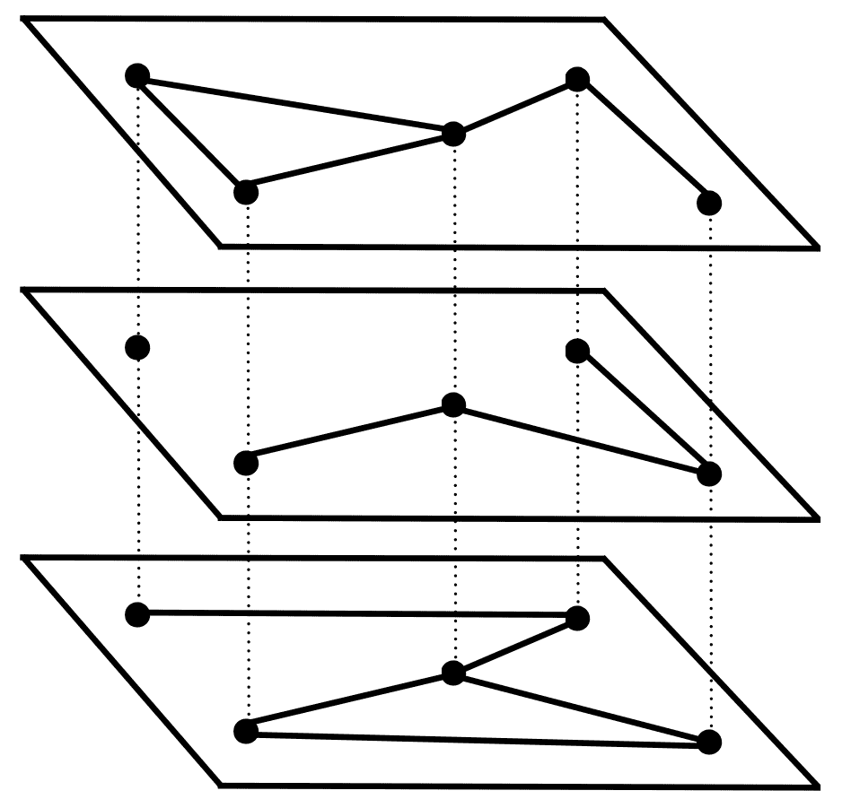

多层图的另一个子类是动态(或时间)图。这些图表的意义在于它们的结构随着时间而变化。这些可以是固定数量的节点，其中边不断变化，或者节点可以随着时间的推移添加到图中或从图中删除。

我们可以使用一组 *n* × *n* 邻接矩阵、 *A ^α* 在数学上表示一个复用图，其中 *α* 表示层数或时间步长(如果是动态或时间图)。我们可以把矩阵的元素写成 [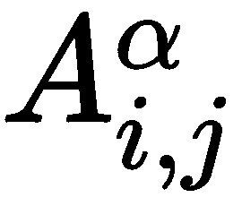] 。这些元素形成了一个三维张量。相比之下，多层图要复杂得多，因为每层的结点数量可能不同，并且它们既有层内边也有层间边。我们可以使用邻接矩阵 *A ^( α )* 来表示层内边缘，其中每一层 *α* 都具有大小为*n[α]×*n[α]的邻接矩阵。另一方面，层间边缘的邻接矩阵可以表示为 *B ^( αβ )* (其大小为*n[α]*×*n*[β])，其中如果在层 *α* 中的节点 *i* 和节点*j*之间存在边缘，则矩阵元素为 [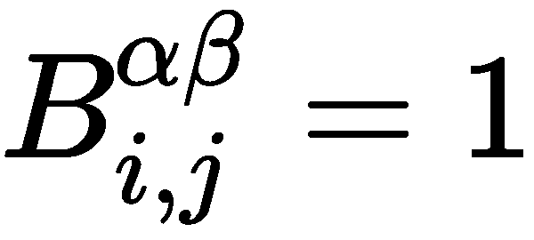]****

# 树形图

顾名思义，树形图是一种具有树状结构的图。它们是无向的，没有任何回路。它们还有一个相当有趣的性质，称为**连通性**，在这里我们可以找到从任何其他节点到图上任何节点的路径。

在下图中，我们可以看到树形图的样子:

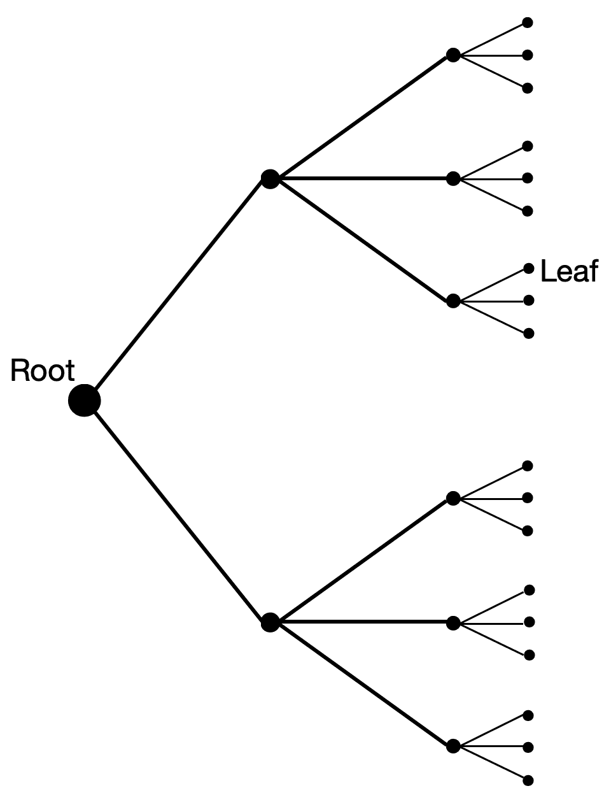

如您所见，该图从一个节点(根节点)开始，以叶节点结束。在两者之间，它们分支形成更小的子树。一个有趣的性质是，一个有 *n* 个节点的树图有 *n-1* 条边。

# 图拉普拉斯算子

在本章早些时候，在*邻接矩阵*部分，我们学习了邻接矩阵，以及如何用它来描述一个图的结构。然而，用矩阵形式表示图形还有其他方法。

现在，让我们假设我们有一个没有方向，没有权重的图。那么，它的拉普拉斯矩阵将是一个对称的 *n* × *n* 矩阵， *L* ，其元素如下:

在这里， [] 。我们也可以这样写:

这里， *A [i，j]是邻接矩阵， *δ [i，j]是克罗内克δ。我们可以将其改写为矩阵形式，如下所示:**

在这里，我们有以下内容:

类似地，我们也可以通过用我们之前为加权图定义的邻接矩阵替换这里的邻接矩阵，来为加权图编写图拉普拉斯矩阵。

# 摘要

在这一章中，我们学习了数学中一个非常有趣的主题，它几乎在每个领域都有应用，从社会科学到社交网络，到万维网，到人工智能，但特别是在我们的神经网络中。

在下一章中，我们将学习线性神经网络，它是最简单的神经网络类型，在统计学习中使用最频繁。