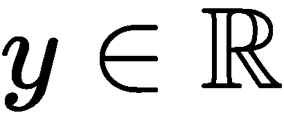
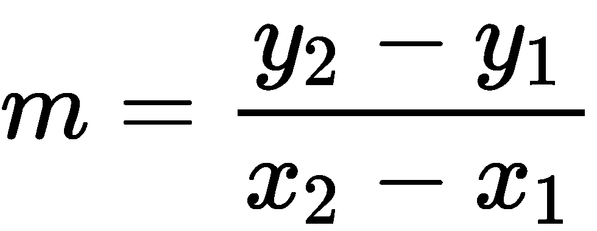
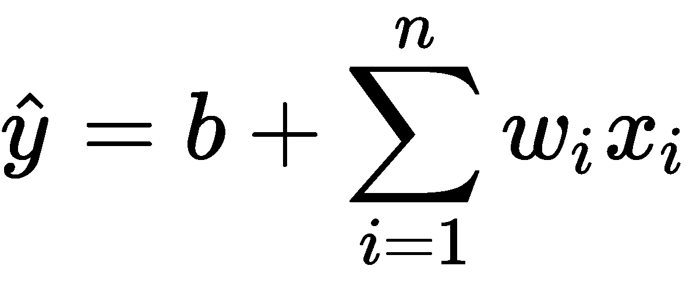
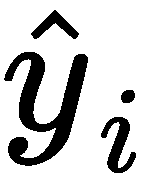
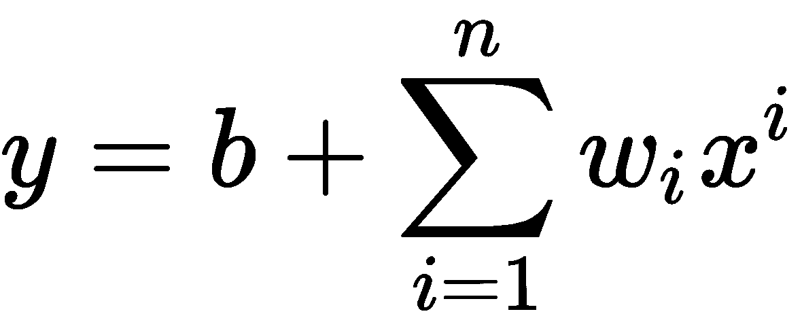
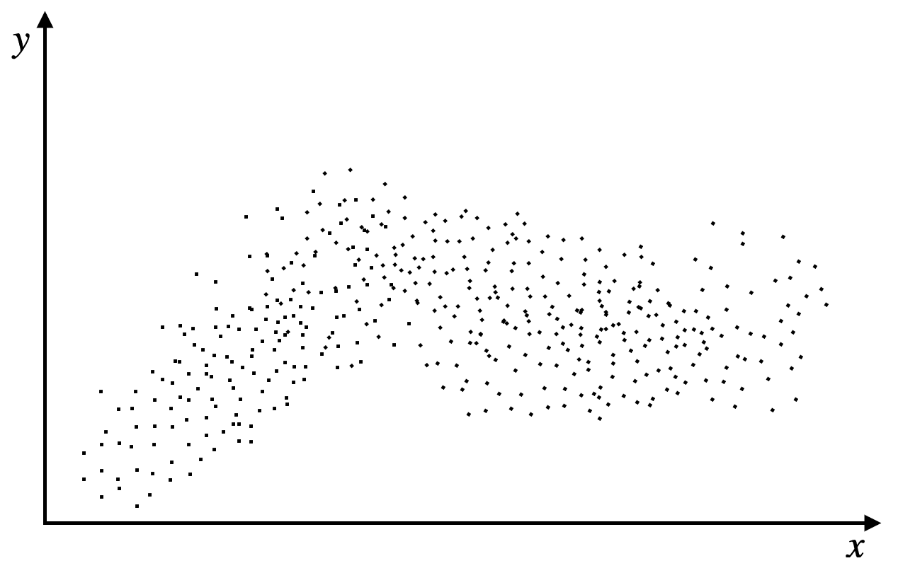
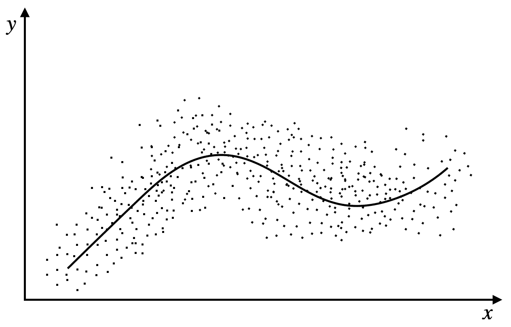
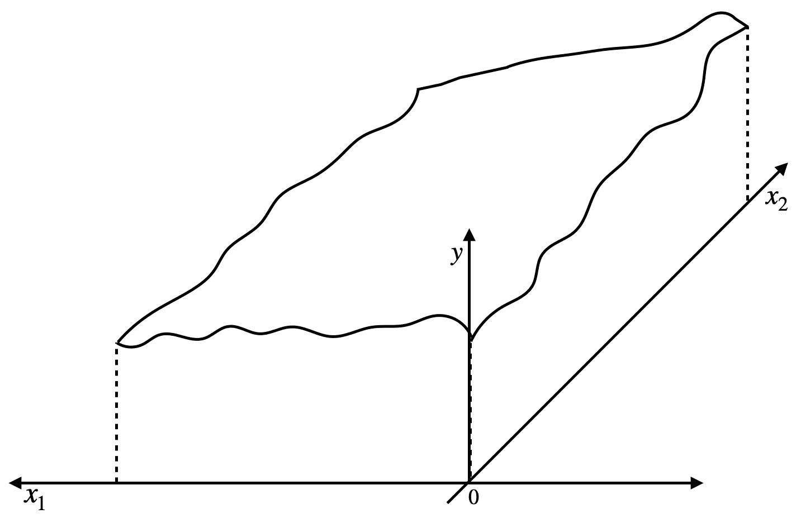
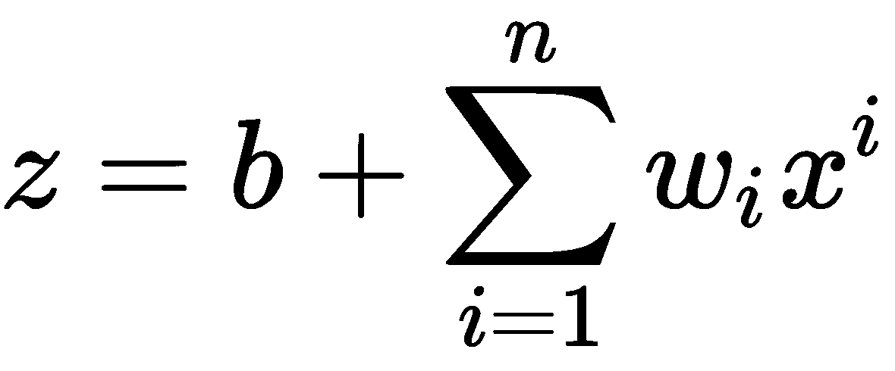
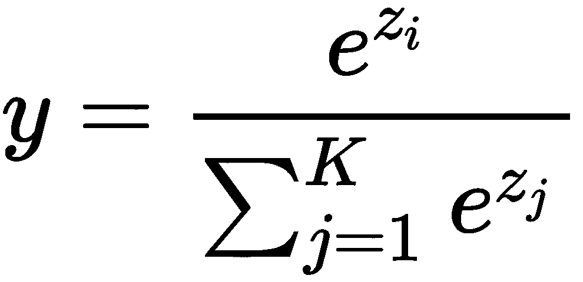

# 线性神经网络

在这一章中，我们将回顾机器学习中的一些概念。预计你以前学习过，并对机器学习有所了解。因此，这一章将作为整本书需要的一些概念的复习，而不是对所有机器学习方法的全面研究。

在本章中，我们将重点关注线性神经网络，它是最简单的神经网络类型，用于线性回归、多项式回归、逻辑回归和 softmax 回归等任务，这些任务在统计学习中最常用。

我们用回归来解释一个或多个自变量和因变量之间的关系。在下一章深入研究深度神经网络之前，我们将在本章学习的概念对于加深我们对机器学习如何工作的理解至关重要。

本章将涵盖以下主题:

*   线性回归
*   多项式回归
*   逻辑回归

# 线性回归

回归的目的是找出数据(用 *x* 表示)与其对应的输出(用 *y* 表示)之间的关系，并对其进行预测。所有回归问题的输出都是实数( [] )。这可以应用于一系列问题，例如预测房子的价格或电影的评级。

为了让我们利用回归，我们需要使用以下内容:

*   输入数据，可以是标量值或向量。这有时被称为**特征**。
*   训练实例，包括良好数量的( *x [i] ，y [i]* )对；即每个输入的输出。
*   捕捉输入和输出(模型)之间关系的函数。
*   一个损失或者一个目标函数，它告诉我们我们的模型有多精确。
*   优化，使损失或目标函数最小化。

在我们继续之前，让我们先回顾一下[第一章](3ce71171-c5fc-46c8-8124-4cb71c9dd92e.xhtml)、*向量微积分*，在这里我们注意到直线的方程如下:

这里， *m* 是梯度(或斜率) *b* 是校正项。我们使用直线上的两对点，通过以下等式得出斜率:

我们知道，这很容易做到。然而，在线性回归中，我们被给定许多( *x [i] ，y [i]* )点，我们的目标是找到最佳拟合的线，该线最好地捕捉了关系。这条线是我们的模型学习的。我们可以这样表示:

这里， *ε* 代表一个误差，我们假设它是高斯的， *y* 是真实的标签， [] 是我们的模型提供的预测。

现在让我们考虑这样一种情况，我们有多个自变量，我们想找出一个因变量之间的关系。这种回归被称为**多元回归**。在这种情况下，每个独立变量都会对预测输出产生影响。

在这种情况下，我们的输入将采用以下形式:

这里， *n* 是自变量的个数。

为了找到 [] ，我们可以对所有因变量进行平均或求和，但这不可能给出我们想要的结果。假设我们想预测一栋房子的价格；我们的输入可以是场地的平方英尺，卧室的数量，浴室的数量，以及它是否有游泳池。

每个输入都将具有相应的权重，模型将从数据点中学习该权重，该权重最能描述每个输入的重要性。这就变成了以下内容:

或者，我们有以下内容:

我们也可以用矩阵的形式改写它:

但是现在，一个明显的问题出现了— *我们的模型如何学习这些权重和这种关系？这对我们来说很容易做到，因为我们的大脑能立即发现模式，我们可以通过分析发现关系。然而，如果我们的机器要学习这种关系，它需要一个向导。这个向导就是损失函数，它告诉模型它的预测有多差，以及需要向哪个方向改进。*

损失一般是预测值( [] )与真实值( *y [ i ]* )之间的距离，我们可以写成:

但这仍不能让我们了解全貌。我们的目标是最小化模型训练的所有数据样本的损失，因此我们对所有数据样本的损失总和进行平均。这看起来如下:

训练的目标是找到最佳参数:

学习了什么是线性回归，现在让我们在下一节看看多项式回归是什么。

# 多项式回归

正如你可能想象的那样，线性回归不是一个我们可以用来解决任何问题的万能解决方案。现实世界中变量之间的许多关系不是线性的；也就是说，一条直线不能描述这种关系。对于这些问题，我们使用前述线性回归的一种变体，称为**多项式回归**，它可以捕捉更多的复杂性，如曲线。这种方法利用对解释变量应用不同的幂来发现非线性问题。这看起来如下:

或者，我们可以有以下内容:

[] 就是这种情况。

从前面的等式可以看出，这样的模型不仅能够捕捉直线(如果需要的话)，还可以生成适合数据点的二阶、三阶或 *n ^(th) -* 阶等式。

假设我们有以下数据点:

我们可以立即看出直线不能完成这项工作，但在我们对它应用多项式回归后，我们可以看到我们的模型学会了拟合曲线，这类似于正弦波。我们可以在下图中观察到这一点:

现在让我们来看一个例子，我们试图学习一个曲面，我们有两个输入， [] ，和一个输出， *y* 。同样，正如我们在下图中看到的，表面并不平坦；事实上，它相当坎坷:

我们可以使用以下三阶多项式对此进行近似建模:

如果这给我们一个满意的结果，我们可以添加另一个高次多项式(等等)，直到有一个模拟表面。

# 逻辑回归

还有另一种我们在实践中经常使用的回归——**logistic 回归**。假设我们想要确定一封电子邮件是否是垃圾邮件。在这种情况下，我们的 *x* *(s)* 值可能会出现*！*或电子邮件中拼写错误的总数。然后， *y* 可以取值 1(表示垃圾邮件)和 0(表示非垃圾邮件)。

在这种情况下，线性回归根本不起作用，因为我们不是在预测真实值，而是在尝试预测电子邮件属于哪个类。

这通常会以如下形式结束:

如您所见，数据分为两个区域—一个代表非垃圾邮件，另一个代表垃圾邮件。

我们可以这样计算:

这里， [] 。

但是，这只适用于二进制分类。如果要分类多个类呢？然后，我们可以使用 softmax 回归，它是 logistic 回归的扩展。这将如下所示:

[][]就是这种情况。

# 摘要

在本章中，我们学习了各种形式的回归，例如(多元)线性回归、多项式回归、逻辑回归和 softmax 回归。这些模型中的每一个都帮助我们弄清楚一个或多个自变量和因变量之间的关系。对你们中的一些人来说，这些概念可能看起来非常基础，但它们将在我们阅读本书的过程中很好地为我们服务，并有助于我们更深入地理解即将到来的概念。

在下一章，我们将学习前馈神经网络。