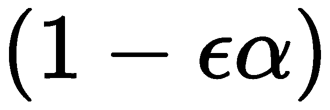
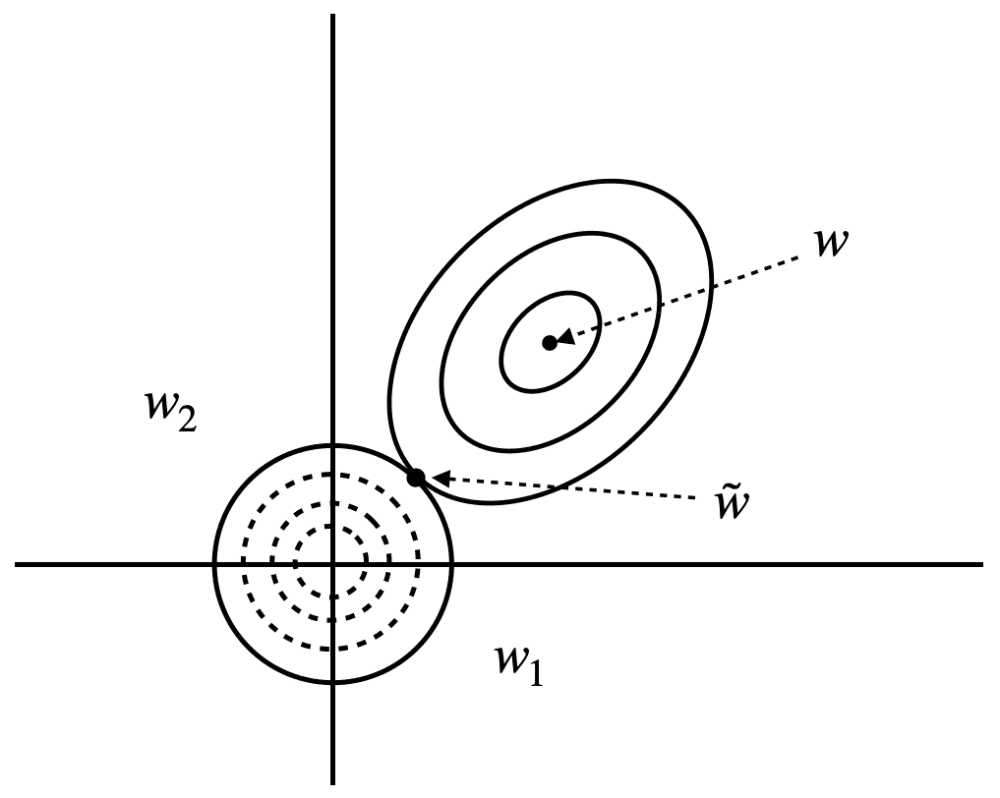
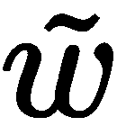
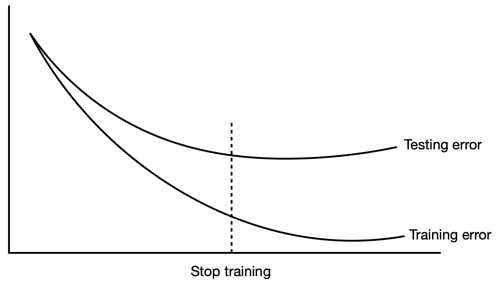
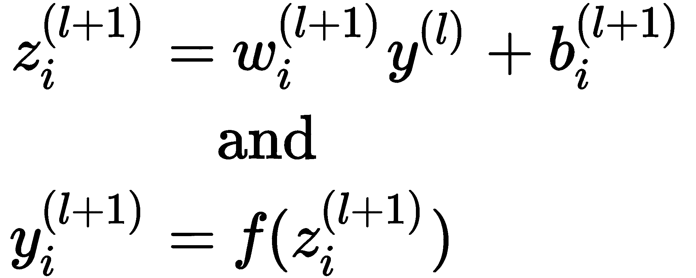
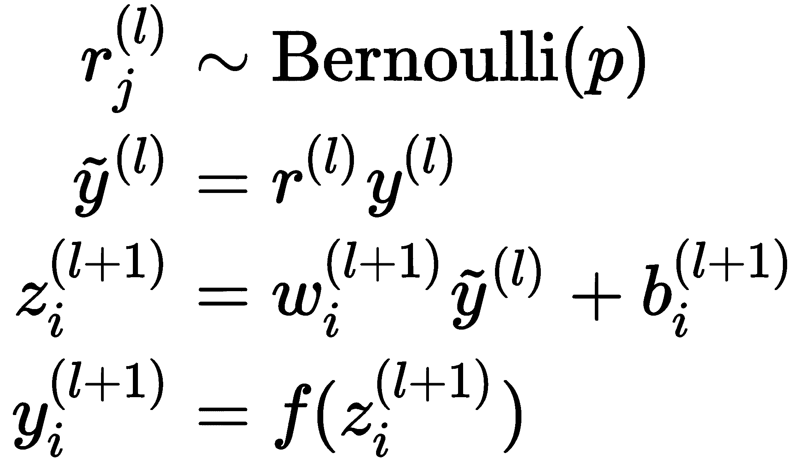

# 八、正则化

在前一章中，我们学习了(深度)前馈神经网络及其结构。我们了解了这些架构如何利用其隐藏层和非线性激活来学习在一些非常具有挑战性的任务上表现良好，而线性模型无法做到这一点。我们还看到，通过学习数据集中的噪声，神经网络往往会过度适应训练数据，从而导致测试数据中的错误。自然，由于我们的目标是创建泛化能力好的模型，我们希望缩小差距，以便我们的模型在两个数据集上表现一样好。这就是正则化的目标——减少测试误差，有时是以更大的训练误差为代价。

在这一章中，我们将涵盖正则化中使用的各种方法，它们是如何工作的，以及为什么某些技术优于其他技术。这包括限制神经网络的容量、应用规范惩罚和数据集扩充等等。

我们将在本章中讨论以下主题:

*   正则化的需要
*   标准惩罚
*   提前停止
*   参数键入和共享
*   数据集扩充
*   拒绝传统社会的人
*   对抗训练

# 正则化的需要

在前面的章节中，我们了解了前馈神经网络基本上是一个复杂的函数，它通过使用训练数据学习底层分布，将输入映射到相应的目标/标签。我们可以回忆起，在训练期间，在前向传递期间计算出误差之后，反向传播被用于更新参数，以便减少损失并更好地近似数据分布。我们还了解了神经网络的能力、偏差-方差权衡，以及神经网络如何对训练数据进行欠拟合或过拟合，这使得它无法对看不见的数据或测试数据进行良好的处理(即出现泛化错误)。

在我们进入正则化之前，让我们回顾一下过度拟合和欠拟合。众所周知，神经网络是通用函数逼近器。深度神经网络有许多隐藏层，这意味着有大量的参数需要训练。一般来说，模型的参数越多，它就越复杂，这意味着它过拟合训练数据的风险就越大。

这意味着我们的模型已经完美地学习了数据中存在的所有模式，包括噪声，并且在训练数据上零损失，但在测试数据上有很高的损失。此外，过度拟合的模型通常具有较低的偏差和非常高的方差。相反，参数越少的模型往往越简单，这意味着它们更有可能对训练数据进行欠拟合，因为它们观察到的数据中只有一小部分差别不大。因此，他们往往有更大的偏差，这也导致了高方差。下图说明了前面的解释:

在过度适应和欠适应之间的某个地方是我们拥有最佳能力的最佳点；也就是说，模型超参数完全适合手头的任务和数据——这就是我们的目标。这告诉我们，正则化的目标是防止我们的模型过度拟合，我们更喜欢简单的模型而不是非常复杂的模型。然而，最好的模型是一个大的和适当正则化的模型。

现在我们知道了正则化的目的，让我们来探索一些我们可以正则化深层神经网络的方法。

# 标准惩罚

在目标函数中加入一个参数范数惩罚是最经典的正则化方法。这限制了模型的容量。这种方法已经存在了几十年，早于深度学习的出现。我们可以这样写:

在这里， [] 。在前面的等式中, *α* 值是一个超参数，它确定正则化器对正则化成本函数的正则化效果有多大。 *α* 的值越大，应用的正则化越多，而值越小，正则化对代价函数的影响越小。

在神经网络的情况下，我们仅将参数范数罚分应用于权重，因为它们控制连续层中两个节点之间的交互或关系，并且我们保持偏差不变，因为与权重相比，它们需要较少的数据。

当谈到使用哪种参数范数时，我们可以做出一些不同的选择，每种选择对解决方案都有不同的影响。

# L2 正则化

L2 正则化方法通常被称为**岭回归**(但通常被称为**权重衰减**)。它通过目标函数的以下正则化项，强制网络的权重在原点方向上:

为了简单起见，我们将假设 *θ* = *w* 并且所有的字母都是矩阵。

在这种情况下，正则化的目标函数将如下:

如果我们取它的梯度，那么它变成如下:

使用前面的梯度，我们可以计算每个梯度步骤的权重更新，如下所示:

我们可以扩展并重写前面更新的右侧，如下所示:

从这个等式中，我们可以清楚地看到，修改后的学习规则使我们的权重每一步都缩小了 [] ，如下图:

在上图中，我们可以看到 L2 正则化对权重的影响。向右上方的实心圆表示原始对象函数 [] 的等值轮廓，我们尚未对其应用正则化。另一方面，虚线圆表示正则项的轮廓。最后，，两条轮廓线相交的点，代表竞争目标达到平衡的时间。

# L1 正则化

范数惩罚的另一种形式是使用 L1 正则化，它有时被称为**最小绝对收缩和选择算子** ( **套索**)回归。在这种情况下，正则项如下:

它的作用是将参数的绝对值相加。这样做的效果是，它通过将一些值置零，告诉我们它们不是非常重要，从而为我们的模型引入了稀疏性。这可以被认为是特征选择的一种形式。

类似于前面的 L2 正则化，在 L1 正则化中， *α* 超参数控制正则化对目标函数的影响程度:

这一点说明如下:

正如您在前面的图表中看到的，目标函数的轮廓现在在轴上相交，而不是在远离轴的点上相交，就像 L2 正则化中的情况一样，这就是该方法中稀疏性的来源。

现在我们已经知道了如何调整我们的深层神经网络，让我们在下一节看看什么是早期停止。

# 提前停止

在训练过程中，我们知道我们的神经网络(具有足够的能力来学习训练数据)有在多次迭代中过度适应训练数据的趋势，然后它们无法概括它们所学习的内容，以在测试集上表现良好。克服这个问题的一种方法是在每次迭代中绘制训练集和测试集的误差，并分析性地寻找来自训练集和测试集的误差最接近的迭代。然后，我们为我们的模型选择这些参数。

这种方法的另一个优点是，它不会像参数范数那样改变目标函数，这使得它易于使用，也意味着它不会干扰网络的学习动态，如下图所示:

然而，这种方法并不完美——它确实有缺点。这在计算上是昂贵的，因为我们必须训练网络超过所需的时间，并为其收集更多的数据，然后观察性能开始下降的点。

# 参数绑定和共享

当模型参数偏离 0(固定值)时，前面的参数范数惩罚通过惩罚模型参数起作用。但有时，我们可能希望表达关于哪些参数更适合模型的先验知识。尽管我们可能不知道这些参数是什么，但是由于领域知识和模型的架构，我们知道模型的参数之间可能存在一些依赖关系。

这些相关性可能是一些特定的参数，它们与某些参数的关系比与其他参数的关系更密切。假设我们有两个不同的分类任务模型，并且检测到相同数量的类别。然而，它们的输入分布并不相同。让我们用 *θ ^((A))* 参数命名第一个模型 *A* ，用 *θ ^((B))* 参数命名第二个模型 *B* 。这两种模型都将其各自的输入映射到输出:

和

自然地，由于这两个模型都处理相对相似(甚至可能相同)的任务，因此可能具有相似(或相同)的输入分布，模型 *A* 和模型 *B* 的参数应该彼此接近。

我们可以使用参数范数罚，例如 L2 罚，来确定 *θ ^((A))* 和 *θ ^((B))* 参数的接近程度，如下:

除了 L2 范数，我们还可以使用其他度量来度量距离。

这种强制参数彼此接近的方法被称为**参数共享**。其原因是这可以被解释为不同的模型共享一组参数。这种方法优于参数范数罚分，因为它需要较少的内存，因为我们只需存储一组唯一的共享参数。

数据集扩充

正如我们所知，深度前馈网络非常渴求数据，它们使用所有这些数据来学习底层数据分布，以便能够使用获得的知识对未知数据进行预测。这是因为他们看到的数据越多，他们在测试集中遇到的就越有可能是他们已经知道的分布的插值。但是，获得足够大的数据集和高质量的标签数据绝不是一件简单的任务(特别是对于某些收集数据最终可能非常昂贵的问题)。规避这个问题的方法是使用数据扩充；也就是生成合成数据，用它来训练我们的深度神经网络。

# 合成数据生成的工作方式是，我们使用一个生成模型(更多信息请参见第 12 章、*生成模型*)来了解数据集的底层分布，我们将使用该分布来为手头的任务训练我们的网络，然后使用该生成模型来创建与地面实况数据相似的合成数据，以便它看起来来自相同的数据集。我们还可以在合成数据中加入一些小的变化，使模型对噪声更加稳健。

这种方法已经被证明在计算机视觉的情况下非常有效——特别是物体检测/分类——我们在卷积神经网络中使用(我们将在第九章[、*卷积神经网络*中了解)。](2c830a26-9964-47fb-8d69-904e4f087b95.xhtml)

图像识别中经常使用的另一种类型的数据增强是图像裁剪和图像旋转，其中我们或者裁剪输入图像的一大部分，或者将其旋转某个角度。这些方法还被证明可以提高稳健性，改善对未知数据的泛化能力。我们还可以破坏、模糊或添加一些高斯噪声到图像中，使网络更加健壮，因为许多真实世界的数据往往是有噪声的。

然而，这是有限制的。例如，在光学字符识别的情况下(我们想要识别字母和数字)，水平翻转和 180 度旋转会影响类别。经过改造后，a *b* 可以变成*d*a*6*可以变成 *9* 。还有一些问题，数据扩充根本不是一个选项；这方面的一个例子是在医学领域，我们可以尝试使用 MRI 和 CT 扫描。然而，在这种情况下，我们可以做的是应用仿射变换，如旋转和平移。

让我们先来关注一下噪声注入。有两种方法可以做到这一点——第一种是将噪声注入输入数据，第二种是将噪声注入隐藏单元。事实上，已经发现向隐藏单元添加噪声可以是比参数收缩好得多的正则化，因为它促进了稳定性。

拒绝传统社会的人

在上一节中，我们学习了对权重范数应用惩罚以使其正则化，以及其他方法，如数据集扩充和提前停止。然而，还有另一种在实践中广泛使用的有效方法，称为辍学。

# 到目前为止，在训练神经网络时，所有的权重都是一起学习的。然而，dropout 改变了这种想法，它让网络在每次迭代中只学习一小部分权重。这样做的原因是为了避免共同适应。当我们根据所有训练数据训练整个网络时，会出现这种情况，一些连接最终比其他连接更强，从而对网络的预测能力做出更大贡献，因为较强的连接压倒了较弱的连接，实际上忽略了它们。随着我们用更多的迭代来训练网络，一些较弱的连接基本上消失了，不再是可训练的，所以只有一个子网最终被训练，浪费了网络的一部分。这是前面的规范处罚无法解决的问题。

丢弃克服过拟合的方法是通过随机(根据一些预定义的概率)从隐藏层中移除(丢弃)神经元；也就是说，我们暂时将节点的一些传入和传出边清零，以便它在训练迭代期间不会对网络产生影响。例如，如果我们有一个**多层感知器** ( **MLP** )，其中一个隐藏层由 10 个神经元组成，我们有一个 *p* = 0.5 的 dropout，那么一半的神经元被设置为 0。如果 *p* = 0.2，那么 20%的神经元被丢弃:

让我们考虑一个有 *L* 个隐藏层的 MLP，这样 [] ，其中输入到每一层的向量是 *z ^( (l) )* ，每一层的输出向量是 *y ^( (l) )* (为了简单起见，*y^((0))*=*x*)。每层的权重和偏差分别用 *W ^( (l) )* 和 *b ^( (l) )* 表示。然后，我们得到以下结果:

Let's consider an MLP with *L* hidden layers, such that [], where the vector input to each layer is *z^((l))* and the output vector of each layer is *y^((l))* (for the sake of simplicity, *y^((0) )*= *x*). The weights and biases of each layer are denoted by *W^((l))* and *b^((l))*, respectively. Then, we get the following:

这里， *f* 是任意激活函数。

现在，有了 dropout，前馈操作变成如下:

因此，我们发现在训练过程中， *p* = 0.5 的正则化效果最好。

对抗训练

如今，神经网络已经开始在一些任务上达到人类水平的精度，在某些方面，可以看到它们甚至超过了人类。但是他们真的超越了人类吗？或者只是看起来如此？在生产环境中，我们经常不得不处理有噪声的数据，这可能导致我们的模型做出不正确的预测。所以，我们现在将学习另一个非常重要的正则化方法——**对抗训练**。

# 在我们进入对抗性训练的内容和方式之前，让我们看一下下图:

在上图中，我们所做的是将可忽略的高斯噪声添加到原始图像的像素中。对我们来说，图像看起来完全一样，但对卷积神经网络来说，它看起来完全不同。这是一个问题，甚至当我们的模型被完美地训练并且几乎没有错误时，它也会发生。

我们所做的是找到一个数据点， *x'* ，它靠近 *x* ，但是模型预测 *x'* 属于不同类别的一部分。现在，为了给我们的图像添加噪声，我们可以这样做:

我们对此感兴趣的原因是，向我们的训练数据集添加对立扰动的数据样本可以帮助减少我们的测试集的错误。

摘要

在本章中，我们讨论了用于调整神经网络参数的各种方法。当涉及到训练我们的模型时，这些方法非常重要，因为它们有助于确保它们可以通过防止过度拟合来推广到看不见的数据，从而在我们希望使用它们的任务中表现良好。在接下来的章节中，我们将学习不同类型的神经网络，以及每种网络如何最适合某些类型的问题。每个神经网络都有一种正则化形式，可以用来帮助提高性能。

# 在下一章，我们将学习卷积神经网络，它用于计算机视觉。

In this chapter, we covered a variety of methods that are used to regularize the parameters of a neural network. These methods are very important when it comes to training our models because they help ensure that they can generalize to unseen data by preventing overfitting, thereby performing well on the tasks we want to use them for. In the following chapters, we will learn about different types of neural networks and how each one is best suited for certain types of problems. Each neural network has a form of regularization that it can use to help improve performance.

In the next chapter, we will learn about convolutional neural networks, which are used for computer vision.