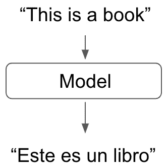
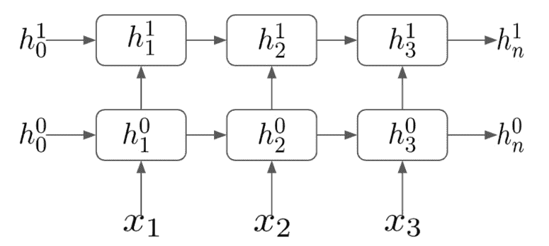

# *第七章*:使用序列对序列神经网络的文本翻译

在前两章中，我们使用神经网络对文本进行分类并执行情感分析。这两项任务都涉及接受 NLP 输入并预测一些值。在我们的情感分析中，这是一个介于 0 和 1 之间的数字，代表我们句子的情感。在我们的句子分类模型的情况下，我们的输出是多类预测，其中有我们的句子所属的几个类别。但是，如果我们希望不只是预测一个单词，而是预测整个句子呢？在这一章中，我们将构建一个序列到序列的模型，该模型将一种语言的句子作为输入，并将该句子的翻译输出到另一种语言。

我们已经探讨了用于 NLP 学习的几种类型的神经网络架构，即 [*第五章*](B12365_05_Final_JC_ePub.xhtml#_idTextAnchor092) *中的循环神经网络，循环神经网络和情感分析*，以及 [*第六章*](B12365_06_Final_JC_ePub.xhtml#_idTextAnchor112) *中的卷积神经网络，使用 CNN 的文本分类*。在这一章中，我们将再次使用这些熟悉的 RNNs，但不是仅仅建立一个简单的 RNN 模型，我们将使用 RNNs 作为一个更大、更复杂的模型的一部分，以便执行序列到序列的翻译。通过使用我们在前面章节中了解到的 rnn 的基础，我们可以展示如何扩展这些概念，以创建各种适用的模型。

在本章中，我们将讨论以下主题:

*   序列对序列模型理论
*   构建用于文本翻译的序列到序列神经网络
*   后续步骤

# 技术要求

本章的所有代码可以在[https://github . com/packt publishing/Hands-On-Natural Language-Processing-with-py torch-1 . x](https://github.com/PacktPublishing/Hands-On-Natural-Language-Processing-with-PyTorch-1.x)找到。

# 序列对序列模型理论

序列对序列模型与我们迄今为止看到的传统神经网络结构非常相似。主要区别在于，对于模型的输出，我们期望另一个序列，而不是二元或多类预测。这在翻译等任务中特别有用，我们可能希望将整个句子转换成另一种语言。

在下面的示例中，我们可以看到英语到西班牙语的翻译是单词到单词的映射:



图 7.1–英语到西班牙语的翻译

输入句子中的第一个单词很好地映射到输出句子中的第一个单词。如果所有语言都是这种情况，我们可以简单地将句子中的每个单词一个接一个地通过我们训练好的模型来获得输出句子，而不需要任何序列到序列的建模，如下所示:


图 7.2–英语到西班牙语的单词翻译

然而，从我们使用 NLP 的经验中我们知道，语言并没有这么简单！一种语言中的单个单词可能映射到其他语言中的多个单词，并且这些单词在语法正确的句子中出现的顺序可能不相同。因此，我们需要一个能够捕捉到整句话的上下文并输出正确翻译的模型，而不是一个旨在直接翻译单个单词的模型。这就是序列到序列建模变得必不可少的地方，如下所示:


图 7.3–翻译的序列对序列建模

为了训练一个序列到序列模型来捕获输入句子的上下文并将其翻译成输出句子，我们将主要训练两个更小的模型来实现这一点:

*   一个**编码器**模型，捕捉我们句子的上下文，并将其作为一个上下文向量输出
*   一个**解码器**，它获取原始句子的上下文向量表示，并将其翻译成不同的语言

因此，在现实中，我们完整的序列到序列的翻译模型实际上会是这样的:


图 7.4–全序列对序列模型

通过将我们的模型分割成单独的编码器和解码器元素，我们有效地模块化了我们的模型。这意味着，如果我们希望训练多个模型从英语翻译成不同的语言，我们不需要每次都重新训练整个模型。我们只需要训练多个不同的解码器来将我们的上下文向量转换成我们的输出句子。然后，在进行预测时，我们可以简单地更换我们希望用于翻译的解码器:


图 7.5–详细的模型布局

接下来，我们将研究序列到序列模型的编码器和解码器组件。

## 编码器

我们的序列到序列模型的编码器元素的目的是能够完全捕获我们的输入句子的上下文，并将其表示为一个向量。我们可以通过使用 rnn，或者更具体地说，LSTMs 来做到这一点。您可能还记得我们前面的章节，rnn 接受一个顺序输入，并在整个序列中保持一个隐藏状态。序列中的每个新单词都会更新隐藏状态。然后，在序列的最后，我们可以使用模型的最终隐藏状态作为下一层的输入。

在我们的编码器中，隐藏状态表示整个句子的上下文向量表示，这意味着我们可以使用 RNN 的隐藏状态输出来表示整个输入句子:


图 7.6–检查编码器

我们使用我们的最终隐藏状态， *h* n，作为我们的上下文向量，然后我们将使用经过训练的解码器对其进行解码。还值得注意的是，在我们的序列到序列模型的上下文中，我们分别在输入句子的开头和结尾添加了“开始”和“结束”标记。这是因为我们的输入和输出没有有限的长度，我们的模型需要能够学习一个句子何时应该结束。我们的输入句子将总是以“end”标记结束，这向编码器发出信号，在这一点上，隐藏状态将被用作该输入句子的最终上下文向量表示。类似地，在解码器步骤中，我们将看到我们的解码器将继续生成单词，直到它预测到一个“结束”令牌。这允许我们的解码器生成实际的输出句子，而不是无限长的标记序列。

接下来，我们将看看解码器如何获取这个上下文向量，并学习将其翻译成输出句子。

## 解码器

我们的解码器从我们的编码器层获取最终隐藏状态，并将其解码成另一种语言的句子。我们的解码器是一个 RNN，类似于我们的编码器，但是当我们的编码器在给定其当前隐藏状态和句子中的当前单词的情况下更新其隐藏状态时，我们的解码器在每次迭代时更新其隐藏状态并输出一个令牌，给定当前隐藏状态和句子中先前预测的单词。这可以从下图中看出:


图 7.7–检查解码器

首先，我们的模型将上下文向量作为来自编码器步骤 *h0* 的最终隐藏状态。然后，我们的模型旨在根据当前的隐藏状态预测句子中的下一个单词，然后预测句子中的前一个单词。我们知道我们的句子必须以“start”标记开始，因此，在我们的第一步，我们的模型试图预测给定前一个隐藏状态的句子中的第一个单词， *h0* ，以及句子中的前一个单词(在本例中是“start”标记)。我们的模型进行预测(“pienso”)，然后更新隐藏状态以反映模型的新状态， *h1* 。然后，在下一步，我们的模型使用新的隐藏状态和最后预测的单词来预测句子中的下一个单词。这一直持续到模型预测到“结束”标记，此时我们的模型停止生成输出单词。

这个模型背后的直觉与我们迄今为止所了解的语言表征是一致的。任何给定句子中的单词都依赖于它前面的单词。因此，预测句子中的任何给定单词而不考虑之前已经预测过的单词，这是没有意义的，因为任何给定句子中的单词都不是彼此独立的。

我们像以前一样学习我们的模型参数:通过向前传递，计算我们的目标句子相对于预测句子的损失，并通过网络反向传播这一损失，在我们前进时更新参数。然而，使用这一过程的学习可能会非常慢，因为首先，我们的模型没有什么预测能力。由于我们对目标句子中单词的预测并不是相互独立的，如果我们错误地预测了目标句子中的第一个单词，那么输出句子中的后续单词也不太可能是正确的。为了帮助这个过程，我们可以使用一种叫做**教师强迫**的技术。

## 利用老师强迫

由于我们的模型最初没有做出好的预测，我们会发现任何初始误差都是成倍增长的。如果我们在句子中预测的第一个单词不正确，那么句子的其余部分也可能不正确。这是因为我们的模型做出的预测依赖于它之前做出的预测。这意味着我们模型的任何损失都可能成倍增加。由于这一点，我们可能会面临爆炸梯度问题，使我们的模型很难学习任何东西:


图 7.8-使用教师强制

然而，通过使用**教师强制**，我们使用正确的先前目标单词来训练我们的模型，以便一个错误的预测不会抑制我们的模型从正确的预测中学习的能力。这意味着，如果我们的模型在句子的某一点做出了不正确的预测，它仍然可以使用后续的单词做出正确的预测。虽然我们的模型仍然会有不正确预测的单词，并且会有我们可以更新梯度的损失，但是现在，我们不会遭受爆炸梯度，并且我们的模型将学习得更快:


图 7.9–损失更新

你可以把 teacher forcing 看作是帮助我们的模型在每个时间步独立于它之前的预测进行学习的一种方式。这是因为早期时间步骤中的错误预测导致的损失不会延续到后面的时间步骤中。

通过结合编码器和解码器步骤，并应用教师强制来帮助我们的模型学习，我们可以建立一个序列到序列的模型，这将允许我们将一种语言的序列翻译成另一种语言。在下一节中，我们将说明如何使用 PyTorch 从头开始构建它。

# 为文本翻译构建序列到序列模型

为了构建我们的序列到序列翻译模型，我们将实现我们之前概述的编码器/解码器框架。这将展示我们的模型的两个部分如何一起使用，以便使用编码器捕获我们的数据的表示，然后使用我们的解码器将该表示翻译成另一种语言。为了做到这一点，我们需要获得数据。

## 准备数据

到目前为止，我们对机器学习有了足够的了解，知道对于这样的任务，我们需要一组带有相应标签的训练数据。在这种情况下，我们将需要我们在上一章中使用的`Torchtext`库包含一个数据集，它将允许我们得到这个。

`Torchtext`中的`Multi30k`数据集包含大约 30，000 个句子以及相应的多种语言翻译。对于这个翻译任务，我们的输入句子将是英语，我们的输出句子将是德语。因此，我们训练有素的模型将允许我们把英语句子翻译成德语。

我们将从提取数据并对其进行预处理开始。我们将再次使用`spacy`，它包含一个内置的词汇表，我们可以用它来标记我们的数据:

1.  We start by loading our `spacy` tokenizers into Python. We will need to do this once for each language we are using since we will be building two entirely separate vocabularies for this task:

    ```
    spacy_german = spacy.load(‘de’)
    spacy_english = spacy.load(‘en’)
    ```

    重要说明

    您可能需要通过执行以下操作从命令行安装德语词汇(我们在上一章中安装了英语词汇):**python 3-m spacy download de**

2.  Next, we create a function for each of our languages to tokenize our sentences. Note that our tokenizer for our input English sentence reverses the order of the tokens:

    ```
    def tokenize_german(text):
        return [token.text for token in spacy_german.            tokenizer(text)]
    def tokenize_english(text):
        return [token.text for token in spacy_english.            tokenizer(text)][::-1]
    ```

    虽然反转我们输入句子的顺序不是强制性的，但它已经被证明可以提高模型的学习能力。如果我们的模型由两个连接在一起的 rnn 组成，我们可以表明，当反转输入句子时，我们的模型中的信息流得到了改善。例如，让我们用英语输入一个基本句子，但不颠倒它，如下所示:

    

    图 7.10–反转输入单词

    在这里，我们可以看到，为了正确地预测第一个输出单词， *y0* ，我们来自 *x0* 的第一个英语单词在进行预测之前必须穿过三个 RNN 层。就学习而言，这意味着我们的梯度必须通过三个 RNN 层反向传播，同时保持网络中的信息流。现在，让我们将这与我们颠倒输入句子的情况进行比较:

    

    图 7.11–颠倒输入句子

    我们现在可以看到，输入句子中真正的第一个单词和输出句子中相应的单词之间的距离只有一个 RNN 层。这意味着梯度只需要反向传播到一层，这意味着与这两个词之间的距离为三层时相比，我们的网络的信息流和学习能力要大得多。

    如果我们要计算反转和非反转变体的输入单词和输出单词之间的总距离，我们会发现它们是相同的。然而，我们之前已经看到，输出句子中最重要的单词是第一个单词。这是因为我们输出句子中的单词依赖于它们前面的单词。如果我们错误地预测了输出句子中的第一个单词，那么我们句子中的其余单词也有可能被错误地预测。然而，通过正确预测第一个单词，我们最大化了正确预测整个句子的机会。因此，通过最小化输出句子中的第一个单词与其输入对应物之间的距离，我们可以增加模型学习这种关系的能力。这增加了这个预测正确的机会，从而最大化了我们整个输出句子被正确预测的机会。

3.  随着我们的记号赋予器的构建，我们现在需要定义记号化的字段。请注意，我们是如何将开始和结束标记添加到序列中的，以便我们的模型知道何时开始和结束序列的输入和输出。为了简单起见，我们还将所有输入的句子转换成小写:

    ```
    SOURCE = Field(tokenize = tokenize_english,              init_token = ‘<sos>’,              eos_token = ‘<eos>’,              lower = True) TARGET = Field(tokenize = tokenize_german,              init_token = ‘<sos>’,              eos_token = ‘<eos>’,              lower = True)
    ```

4.  定义了字段后，我们的标记化就变成了简单的一行程序。包含 30，000 个句子的数据集具有内置的训练、验证和测试集，可以用于我们的模型:

    ```
    train_data, valid_data, test_data = Multi30k.splits(exts = (‘.en’, ‘.de’), fields = (SOURCE, TARGET))
    ```

5.  We can examine individual sentences using the `examples` property of our dataset objects. Here, we can see that the source (`src`) property contains our reversed input sentence in English and that our target (`trg`) contains our non-reversed output sentence in German:

    ```
    print(train_data.examples[0].src)
    print(train_data.examples[0].trg)
    ```

    这为我们提供了以下输出:

    

    图 7.12–训练数据示例

6.  Now, we can examine the size of each of our datasets. Here, we can see that our training dataset consists of 29,000 examples and that each of our validation and test sets consist of 1,014 and 1,000 examples, respectively. In the past, we have used 80%/20% splits for the training and validation data. However, in instances like this, where our input and output fields are very sparse and our training set is of a limited size, it is often beneficial to train on as much data as there is available:

    ```
    print(“Training dataset size: “ + str(len(train_data.       examples)))
    print(“Validation dataset size: “ + str(len(valid_data.       examples)))
    print(“Test dataset size: “ + str(len(test_data.       examples)))
    ```

    这将返回以下输出:

    

    图 7.13-数据样本长度

7.  Now, we can build our vocabularies and check their size. Our vocabularies should consist of every unique word that was found within our dataset. We can see that our German vocabulary is considerably larger than our English vocabulary. Our vocabularies are significantly smaller than the true size of each vocabulary for each language (every word in the English dictionary). Therefore, since our model will only be able to accurately translate words it has seen before, it is unlikely that our model will be able to generalize well to all possible sentences in the English language. This is why training models like this accurately requires extremely large NLP datasets (such as those Google has access to):

    ```
    SOURCE.build_vocab(train_data, min_freq = 2)
    TARGET.build_vocab(train_data, min_freq = 2)
    print(“English (Source) Vocabulary Size: “ +        str(len(SOURCE.vocab)))
    print(“German (Target) Vocabulary Size: “ +        str(len(TARGET.vocab)))
    ```

    这将产生以下输出:

    

    图 7.14-数据集的词汇规模

8.  最后，我们可以从数据集创建数据迭代器。正如我们之前所做的，我们指定了支持 CUDA 的 GPU 的用法(如果它在我们的系统上可用)并指定了我们的批处理大小:

    ```
    device = torch.device(‘cuda’ if torch.cuda.is_available()                       else ‘cpu’) batch_size = 32 train_iterator, valid_iterator, test_iterator = BucketIterator.splits(     (train_data, valid_data, test_data),      batch_size = batch_size,      device = device)
    ```

既然我们的数据已经过预处理，我们可以开始构建模型本身了。

## 构建编码器

现在，我们准备开始构建我们的编码器:

1.  首先，我们通过从我们的`nn.Module`类继承来初始化我们的模型，就像我们对所有以前的模型所做的那样。我们用几个参数初始化，我们将在后面定义，还有 LSTM 层中隐藏层的维数和 LSTM 层的数目:

    ```
    class Encoder(nn.Module):     def __init__(self, input_dims, emb_dims, hid_dims,     n_layers, dropout):         super().__init__()            self.hid_dims = hid_dims         self.n_layers = n_layers
    ```

2.  接下来，我们在编码器中定义我们的嵌入层，它是输入维数的长度和嵌入维数的深度:

    ```
    self.embedding = nn.Embedding(input_dims, emb_dims)
    ```

3.  接下来，我们定义我们实际的 LSTM 层。这从嵌入的层中取出我们嵌入的句子，保持一个定义长度的隐藏状态，由若干层组成(我们稍后将定义为 2)。我们还实现了`dropout`来将正则化应用到我们的网络:

    ```
    self.rnn = nn.LSTM(emb_dims, hid_dims, n_layers, dropout                    = dropout) self.dropout = nn.Dropout(dropout)
    ```

4.  然后，我们在编码器中定义正向传递。我们将嵌入应用到我们的输入句子，并应用 dropout。然后，我们通过我们的 LSTM 层传递这些嵌入，输出我们最终的隐藏状态。这将被我们的解码器用来形成我们翻译的句子:

    ```
    def forward(self, src):     embedded = self.dropout(self.embedding(src))     outputs, (h, cell) = self.rnn(embedded)     return h, cell
    ```

我们的编码器将由两个 LSTM 层组成，这意味着我们的输出将输出两个隐藏状态。这也意味着我们的完整 LSTM 层，连同我们的编码器，将看起来像这样，我们的模型输出两个隐藏状态:



图 7.15–带编码器的 LSTM 模型

现在我们已经构建了编码器，让我们开始构建解码器。

## 构建解码器

我们的解码器将从我们的编码器的 LSTM 层提取最终的隐藏状态，并将它们翻译成另一种语言的输出句子。我们从初始化解码器开始，几乎与初始化编码器完全相同。这里唯一的区别是，我们还添加了一个完全连接的线性层。该层将使用我们的 LSTM 的最终隐藏状态，以便对句子中的正确单词进行预测:

```
class Decoder(nn.Module):
    def __init__(self, output_dims, emb_dims, hid_dims,     n_layers, dropout):
        super().__init__()

        self.output_dims = output_dims
        self.hid_dims = hid_dims
        self.n_layers = n_layers

        self.embedding = nn.Embedding(output_dims, emb_dims)

        self.rnn = nn.LSTM(emb_dims, hid_dims, n_layers,                           dropout = dropout)

        self.fc_out = nn.Linear(hid_dims, output_dims)

        self.dropout = nn.Dropout(dropout)
```

我们的前向传递与我们的编码器非常相似，除了增加了两个关键步骤。我们首先对来自前一层的输入取消排队，这样它的大小才适合进入我们的嵌入层。我们还添加了一个全连接层，它采用 RNN 层的输出隐藏层，并使用它来预测序列中的下一个单词:

```
def forward(self, input, h, cell):

    input = input.unsqueeze(0)

    embedded = self.dropout(self.embedding(input))

    output, (h, cell) = self.rnn(embedded, (h, cell))

    pred = self.fc_out(output.squeeze(0))

    return pred, h, cell
```

同样，与我们的编码器类似，我们在解码器中使用两层 LSTM 层。我们从编码器中取出最终的隐藏状态，并使用它们来生成序列中的第一个单词 Y1。然后我们更新我们的隐藏状态，并使用这个和 Y1 来生成我们的下一个单词 Y2，重复这个过程，直到我们的模型生成一个结束令牌。我们的解码器看起来像这样:


图 7.16–带解码器的 LSTM 模型

这里，我们可以看到单独定义编码器和解码器并不特别复杂。然而，当我们将这些步骤合并到一个更大的序列到序列模型中时，事情开始变得有趣起来:

## 构建全序列对序列模型

我们现在必须将模型的两半缝合在一起，以生成完整的序列间模型:

1.  我们首先创建一个新的序列到序列类。这将允许我们将编码器和解码器作为参数传递给它:

    ```
    class Seq2Seq(nn.Module):     def __init__(self, encoder, decoder, device):         super().__init__()                  self.encoder = encoder         self.decoder = decoder         self.device = device
    ```

2.  接下来，我们在我们的`Seq2Seq`类中创建`forward`方法。这可以说是模型中最复杂的部分。我们将编码器和解码器结合起来，并使用教师强制来帮助我们的模型学习。我们从创建一个张量开始，在这个张量中我们仍然存储着我们的预测。我们将它初始化为一个充满零的张量，但是我们仍然用我们的预测来更新它。我们的零张量的形状将是我们的目标句子的长度，我们的批量大小的宽度，以及我们的目标(德语)词汇大小的深度:

    ```
    def forward(self, src, trg, teacher_forcing_rate = 0.5):     batch_size = trg.shape[1]     target_length = trg.shape[0]     target_vocab_size = self.decoder.output_dims               outputs = torch.zeros(target_length, batch_size,                     target_vocab_size).to(self.device)
    ```

3.  接下来，我们将我们的输入句子输入到我们的编码器中，以获得输出隐藏状态:

    ```
    h, cell = self.encoder(src)
    ```

4.  然后，我们必须遍历解码器模型，为输出序列中的每一步生成输出预测。我们输出序列的第一个元素将永远是`<start>`标记。我们的目标序列已经包含了这个元素作为第一个元素，所以我们通过获取列表的第一个元素来设置我们的初始输入等于这个元素:

    ```
    input = trg[0,:]
    ```

5.  接下来，我们循环进行预测。我们将隐藏状态(来自编码器的输出)和初始输入(只是一个`<start>`令牌)一起传递给解码器。这将返回序列中所有单词的预测。然而，我们只对当前步骤中的单词感兴趣；即序列中的下一个单词。注意我们是如何从 1 而不是 0 开始循环的，所以我们的第一个预测是序列中的第二个单词(因为预测的第一个单词总是开始标记)。
6.  This output consists of a vector of the target vocabulary’s length, with a prediction for each word within the vocabulary. We take the `argmax` function to identify the actual word that is predicted by the model.

    然后，我们需要为下一步选择新的输入。我们将我们的教师强制比率设置为 50%，这意味着 50%的时间，我们将使用我们刚刚做出的预测作为我们解码器的下一个输入，而另外 50%的时间，我们将采用真正的目标。正如我们之前所讨论的，这有助于我们的模型比仅仅依靠模型的预测更快地学习。

    然后我们继续这个循环，直到我们对序列中的每个单词都有了完整的预测:

    ```
    for t in range(1, target_length):
    output, h, cell = self.decoder(input, h, cell)

    outputs[t] = output

    top = output.argmax(1) 

    input = trg[t] if (random.random() < teacher_forcing_                   rate) else top

    return outputs
    ```

7.  最后，我们创建了 Seq2Seq 模型的一个实例，该实例已准备好接受训练。我们用选择的超参数初始化一个编码器和一个解码器，所有这些参数都可以被改变以稍微改变模型:

    ```
    input_dimensions = len(SOURCE.vocab) output_dimensions = len(TARGET.vocab) encoder_embedding_dimensions = 256 decoder_embedding_dimensions = 256 hidden_layer_dimensions = 512 number_of_layers = 2 encoder_dropout = 0.5 decoder_dropout = 0.5
    ```

8.  然后，我们将我们的编码器和解码器传递给我们的`Seq2Seq`模型，以便创建完整的模型:

    ```
    encod = Encoder(input_dimensions,\                 encoder_embedding_dimensions,\                 hidden_layer_dimensions,\                 number_of_layers, encoder_dropout) decod = Decoder(output_dimensions,\                 decoder_embedding_dimensions,\                 hidden_layer_dimensions,\                 number_of_layers, decoder_dropout) model = Seq2Seq(encod, decod, device).to(device)
    ```

在这里尝试不同的参数，看看它如何影响模型的性能。例如，隐藏层中有大量的维度可能会导致模型训练速度变慢，尽管模型的总体最终性能可能会更好。或者，模型可能会过度拟合。通常，这是一个寻找最佳表现模式的实验问题。

在完全定义了 Seq2Seq 模型之后，我们现在准备开始训练它。

## 训练模型

我们的模型将从开始，在模型的所有部分用权重 0 初始化。虽然理论上模型应该能够在没有(零)权重的情况下学习，但是已经表明用随机权重初始化可以帮助模型学习得更快。让我们开始吧:

1.  这里，我们将使用来自正态分布的随机样本的权重来初始化我们的模型，值在-0.1 和 0.1 之间:

    ```
    def initialize_weights(m):     for name, param in m.named_parameters():         nn.init.uniform_(param.data, -0.1, 0.1)          model.apply(initialize_weights)
    ```

2.  接下来，与所有其他模型一样，我们定义优化器和损失函数。我们在执行多类分类时使用交叉熵损失(与二进制分类的二进制交叉熵损失相反):

    ```
    optimizer = optim.Adam(model.parameters()) criterion = nn.CrossEntropyLoss(ignore_index = TARGET.               vocab.stoi[TARGET.pad_token])
    ```

3.  接下来，我们在一个名为`train()`的函数中定义培训过程。首先，我们将模型设置为训练模式，并将历元损失设置为`0` :

    ```
    def train(model, iterator, optimizer, criterion, clip):     model.train()     epoch_loss = 0
    ```

4.  然后，我们在训练迭代器中遍历每一批，提取要翻译的句子(`src`)和该句子的正确翻译(`trg`)。然后，我们将梯度归零(以防止梯度累积)，并通过将我们的模型函数传递给我们的输入和输出来计算我们的模型的输出:

    ```
    for i, batch in enumerate(iterator): src = batch.src trg = batch.trg optimizer.zero_grad() output = model(src, trg)
    ```

5.  接下来，我们需要通过比较我们的预测输出和真实、正确的翻译句子来计算我们的模型预测的损失。我们使用 shape 和 view 函数对输出数据和目标数据进行整形，以便创建两个张量，可以比较这两个张量来计算损耗。我们计算输出和`trg`张量之间的`loss`标准，然后通过网络

    ```
    output_dims = output.shape[-1] output = output[1:].view(-1, output_dims) trg = trg[1:].view(-1)          loss = criterion(output, trg)          loss.backward()
    ```

    反向传播该损失
6.  然后，我们实施梯度裁剪，以防止模型中的梯度爆炸，逐步优化我们的优化器，以便通过梯度下降执行必要的参数更新，最后将批损失添加到历元损失中。在单个训练时期内对所有批次重复整个过程，由此返回每批次的最终平均损失:

    ```
    torch.nn.utils.clip_grad_norm_(model.parameters(), clip)          optimizer.step()          epoch_loss += loss.item()          return epoch_loss / len(iterator)
    ```

7.  之后，我们创建一个类似的函数叫做`evaluate()`。该函数将计算我们的验证数据在网络上的损失，以便评估我们的模型在翻译它以前没有见过的数据时的表现。该函数与我们的`train()`函数几乎相同，除了我们切换到评估模式:

    ```
    model.eval()
    ```

8.  由于我们不对我们的权重进行任何更新，我们需要确保实现`no_grad`模式:

    ```
    with torch.no_grad():
    ```

9.  唯一不同的是，我们需要确保在评估模式下关闭教师强制。我们希望评估我们的模型在看不见的数据上的性能，启用教师强制将使用我们正确的(目标)数据来帮助我们的模型做出更好的预测。我们希望我们的模型能够做出完美的独立预测:

    ```
    output = model(src, trg, 0)
    ```

10.  最后，我们需要创建一个训练循环，在其中调用我们的`train()`和`evaluate()`函数。我们首先定义我们希望训练多少个时期以及我们的最大梯度(用于梯度裁剪)。我们还将最低验证损失设置为无穷大。这将在稍后用于选择我们的最佳性能模型:

    ```
    epochs = 10 grad_clip = 1 lowest_validation_loss = float(‘inf’)
    ```

11.  然后，我们遍历每个时期，在每个时期内，使用我们的`train()`和`evaluate()`函数计算我们的训练和验证损失。我们还通过在训练过程前后调用`time.time()`来计时这需要多长时间:

    ```
    for epoch in range(epochs):          start_time = time.time()          train_loss = train(model, train_iterator, optimizer,                       criterion, grad_clip)     valid_loss = evaluate(model, valid_iterator,                          criterion)          end_time = time.time()
    ```

12.  接下来，对于每个时期，我们确定我们刚刚训练的模型是否是迄今为止我们看到的性能最好的模型。如果我们的模型在我们的验证数据上表现最好(如果验证损失是我们目前所见的最低的)，我们保存我们的模型:

    ```
    if valid_loss < lowest_validation_loss: lowest_validation_loss = valid_loss torch.save(model.state_dict(), ‘seq2seq.pt’) 
    ```

13.  Finally, we simply print our output:

    ```
    print(f’Epoch: {epoch+1:02} | Time: {np.round(end_time-start_time,0)}s’)
    print(f’\tTrain Loss: {train_loss:.4f}’)
    print(f’\t Val. Loss: {valid_loss:.4f}’)
    ```

    如果我们的培训工作正常，我们应该看到培训损失随着时间的推移而减少，就像这样:


图 7.17–训练模型

在这里，我们可以看到我们的培训和验证损失似乎都在随着时间的推移而下降。我们可以继续在多个时期训练我们的模型，理想情况下，直到验证损失达到其最低值。现在，我们可以评估我们表现最好的模型，看看它在进行实际翻译时表现如何。

## 评估模型

为了评估我们的模型，我们将采用我们的测试数据集，并通过我们的模型运行我们的英语句子，以获得德语翻译的预测。然后，我们将能够将其与真实预测进行比较，以查看我们的模型是否做出了准确的预测。我们开始吧！

1.  我们首先创建一个`translate()`函数。这在功能上与我们创建的用于计算验证集损失的`evaluate()`函数相同。然而，这一次，我们关心的不是模型的损失，而是预测的输出。我们将源句子和目标句子传递给模型，并确保我们关闭了教师强制，这样我们的模型就不会使用这些来进行预测。然后，我们采用我们的模型的预测，并使用一个`argmax`函数来确定我们的模型为我们的预测输出句子中的每个单词预测的单词的索引:

    ```
    output = model(src, trg, 0) preds = torch.tensor([[torch.argmax(x).item()] for x         in output])
    ```

2.  Then, we can use this index to obtain the actual predicted word from our German vocabulary. Finally, we compare the English input to our model that contains the correct German sentence and the predicted German sentence. Note that here, we use `[1:-1]` to drop the start and end tokens from our predictions and we reverse the order of our English input (since the input sentences were reversed before they were fed into the model):

    ```
    print(‘English Input: ‘ + str([SOURCE.vocab.itos[x] for x        in src][1:-1][::-1]))
    print(‘Correct German Output: ‘ + str([TARGET.vocab.       itos[x] for x in trg][1:-1]))
    print(‘Predicted German Output: ‘ + str([TARGET.vocab.       itos[x] for x in preds][1:-1]))
    ```

    通过这样做，我们可以将预测的输出与正确的输出进行比较，以评估我们的模型是否能够做出准确的预测。我们可以从模型的预测中看到，我们的模型能够将英语句子翻译成德语，尽管还远远不够完美。我们的模型的一些预测与目标数据完全相同，表明我们的模型完美地翻译了这些句子:


图 7.18-翻译输出第一部分

在其他情况下，我们的模型只差一个单词。在这种情况下，我们的模型预测的是单词`hüten`，而不是`mützen`；然而，`hüten`实际上是`mützen`的可接受的翻译，尽管这两个词在语义上可能不完全相同:


图 7.19-翻译输出第二部分

我们还可以看到一些似乎被误译的例子。在下面的例子中，我们预测的德语句子的英语对等词是“`A woman climbs through one`”，而不是“`Young woman climbing rock face`”。然而，该模型仍然设法翻译了英语句子的关键元素(女人和攀登):


图 7.20-翻译输出第三部分

在这里，我们可以看到虽然我们的模型在将英语翻译成德语方面做了很好的尝试，但它远非完美，并且犯了几个错误。它肯定骗不了一个以德语为母语的人！接下来，我们将讨论几种改进序列间翻译模型的方法。

# 下一步

虽然我们已经证明了我们的序列到序列模型在执行语言翻译方面是有效的，但我们从头开始训练的模型无论如何都不是完美的翻译器。这部分是由于我们的训练数据相对较小。我们用一组 30，000 个英语/德语句子来训练我们的模型。虽然这可能看起来很大，但是为了训练一个完美的模型，我们需要一个大几个数量级的训练集。

理论上，我们需要整个英语和德语中每个单词的几个例子，这样我们的模型才能真正理解它的上下文和含义。对于上下文，我们训练集中的 30，000 个英语句子只包含 6，000 个独特的单词。据说一个说英语的人的平均词汇量在 20，000 到 30，000 个单词之间，这让我们知道我们需要多少例句来训练一个表现完美的模型。这可能就是为什么最准确的翻译工具都是由能够访问大量语言数据的公司拥有的(比如谷歌)。

# 总结

在这一章中，我们介绍了如何从头开始构建序列到序列的模型。我们学习了如何单独编写编码器和解码器组件，以及如何将它们集成到一个能够将句子从一种语言翻译成另一种语言的模型中。

虽然我们的序列到序列模型(由编码器和解码器组成)对于序列翻译是有用的，但它不再是最先进的。在过去几年中，序列到序列模型与注意力模型的结合已经实现了最先进的性能。

在下一章，我们将讨论如何在序列对序列学习的环境中使用注意力网络，并展示我们如何使用这两种技术来构建一个聊天机器人。