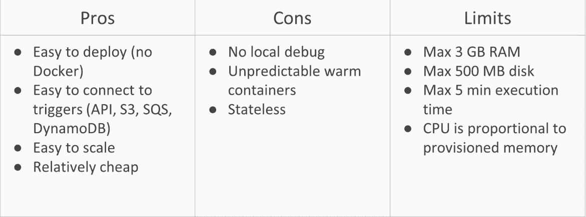
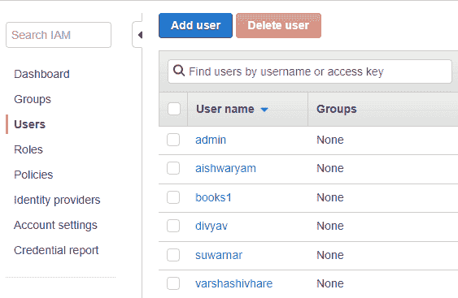
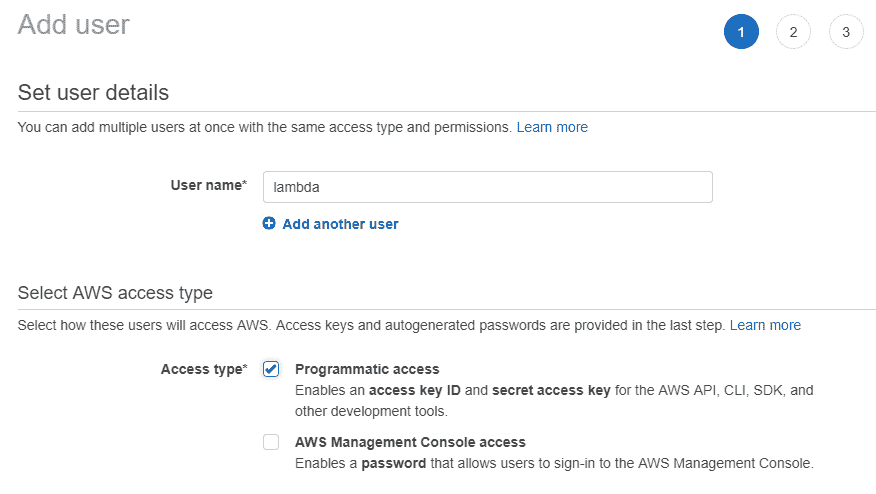
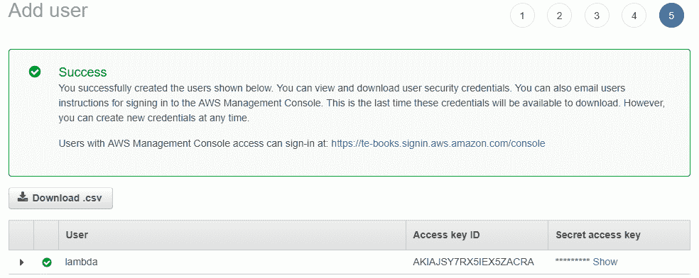
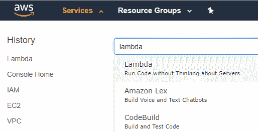
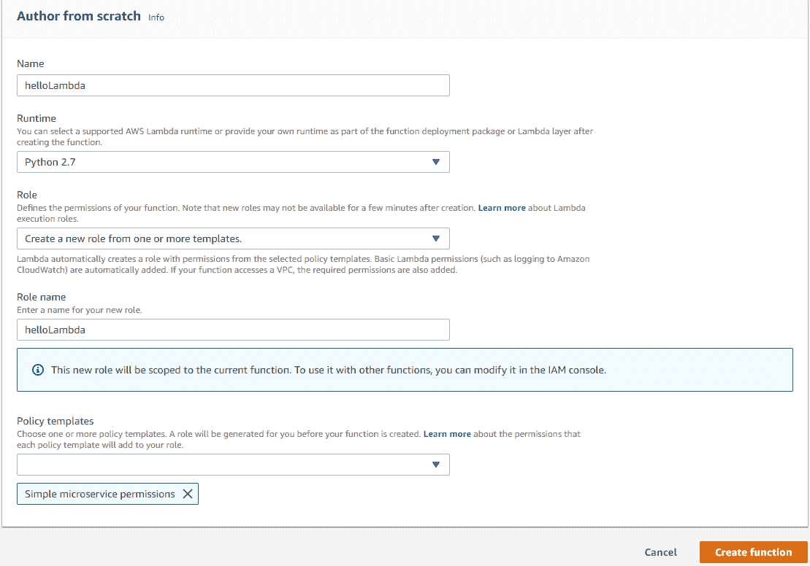
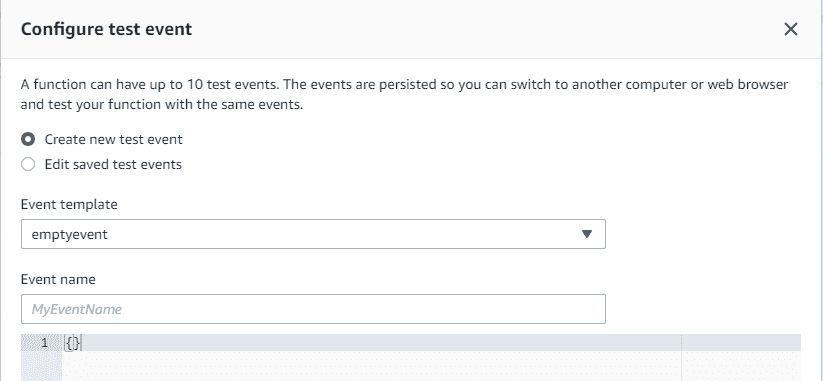
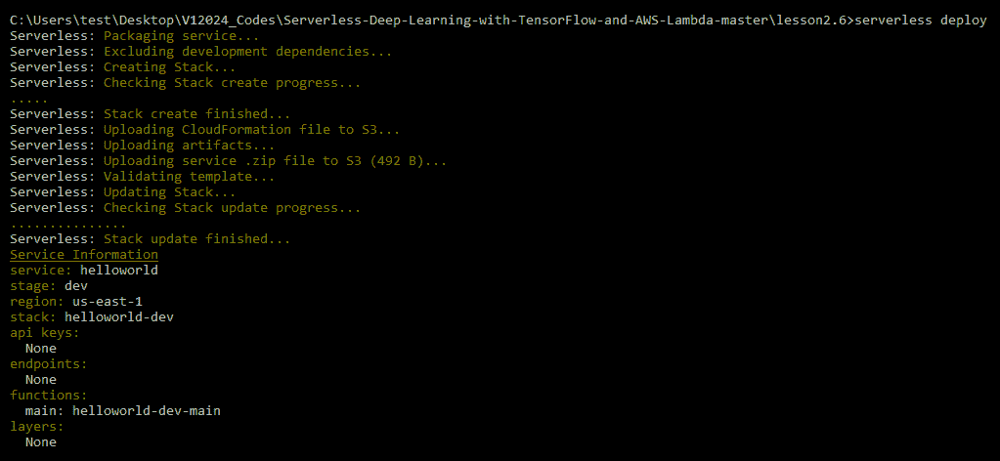

# 二、使用 AWS Lambda 函数开始部署

在这一章中，我们将了解更多关于 AWS Lambda 的知识，并了解它是如何工作的。我们还将讨论部署 Lambda 的不同方式，以及在为 AWS Lambda 开发应用程序时需要考虑的事情。

我们将学习如何设置 AWS 帐户以及访问管理。我们还将使用 AWS Lambda 创建一个 Hello World 函数。

我们将讨论以下主题:

*   AWS 函数
*   AWS 帐户入门
*   无服务器框架简介
*   部署 AWS Lambda 函数


# 技术要求

本章中的技术要求如下:

*   AWS 订阅
*   Python 3.6
*   AWS CLI
*   无服务器框架
*   你可以在[https://github . com/packt publishing/Hands-On-server less-Deep-Learning-with-tensor flow-and-AWS-Lambda](https://github.com/PacktPublishing/Hands-On-Serverless-Deep-Learning-with-TensorFlow-and-AWS-Lambda)找到所有代码


# AWS 函数

让我们来了解一下 AWS Lambda 的先决条件，如下所示:

```py
import sys, os
import mylib
...
def handler(event, context):
  ...
  print("Hello world log")
  return result
```

它由以下步骤组成:

1.  导入已经安装在 AWS Lambda 上的库。这包括系统库和许多特定于 AWS 的库。您不必在包中包含这些库。
2.  从其他开发人员和公司或您自己的库导入外部库。您需要将它们包含在您的包中。
3.  实现`handler`函数，该函数处理对作为输入事件和上下文的主变量的请求。`event`是特定于触发器的信息，`context`是关于处理请求的 Lambda 的信息。它包含函数的 ID 和参数。
4.  处理请求。
5.  返回`result`，如果是同步执行，它将被返回给触发器，如果是异步执行，它将被保存到日志中。

你需要记住，除了来自触发器的上下文或状态之外，你不能使用任何上下文或状态。此外，如果在代码执行期间打印某些内容，它将被保存到函数的本地流中。


# AWS Lambda 的优点、缺点和局限性

AWS Lambda 有一些优点、缺点和限制，如下所述:

*   **优点** : AWS Lambda 非常容易部署。我们不必了解 Docker 或其他容器框架来管理它。它应该只包含库和代码。AWS Lambda 很容易连接到触发器，这意味着我们可以很容易地将它与各种其他基础设施集成在一起，并且它非常具有可伸缩性，这使得它对于生产部署非常有用。它也相对便宜。
*   **缺点**:在本地调试各种 Lambdas 可能很困难。您必须重新创建整个环境和库，并且能够在超时期间检查您的内存消耗。使用 AWS Lambda 很难很好地估计出产生高峰负载的速度。AWS Lambda 是无状态的，它极大地影响了您组织应用程序的方式。这意味着阶段应该来自触发器。
*   **限制**:内存、磁盘、CPU 和超时都有一定的限制，这是你在开发时必须考虑的。

下图详细描述了优点、缺点和局限性:



既然我们对 AWS Lambda 的优点、缺点和局限性有了一个合理的想法，那么让我们来看看创建 AWS 帐户的基础知识。


# AWS 帐户入门

在本节中，您将了解 AWS 自由层和 IAM。我们需要有一个 AWS 帐户来深入学习。

如果你没有 AWS 账户，你可以在这里注册:[https://aws.amazon.com/account/](https://aws.amazon.com/account/)。

Lambda API 网关、简单队列服务和函数是 AWS 免费层的一部分，因此少量消费不会向您收费。


# AWS 自由层

免费层允许您免费使用 AWS 服务。它涵盖了许多不同的 AWS 服务，例如:

*   AWS Lambda :这涵盖了 100 万次调用，这使得 Lambda 非常适合托管您的宠物项目
*   **AWS API 网关**:这涵盖了通过付费网关的 100 万个请求，因此它可以扩展到具有 AWS REST API 功能的项目
*   **AWS SQS** :这包括 100 万个简单的队列服务和请求
*   **AWS 步骤功能**:这包括步骤功能的 4000 个状态转换，这将允许我们创建免费的无服务器工作流


# 身份和访问管理(IAM)

您可以为 AWS 用户创建两种类型的访问权限:

*   **AWS 管理控制访问**:这允许您使用 AWS web 服务。用户需要有一个登录 ID 和密码，用户将在线使用。
*   **编程访问**:这允许您使用 AWS 软件开发密钥。用户需要两个密钥:访问密钥 ID 和秘密访问密钥。

现在，让我们创建一个具有编程访问权限的用户。它将允许我们使用一个无服务器框架，该框架将管理 AWS Lambdas 的部署和编排。

为了创建用户，我们将遵循以下步骤:

1.  首先，您需要转到 AWS 仪表板并选择 IAM 服务，如下面的屏幕截图所示:


2.  接下来，转到用户页面并单击添加用户，如下所示:



3.  现在，设置名称`lambda`，并选择编程访问复选框:



4.  接下来，您需要为用户设置使用前面讨论的 AWS 服务的权限。最简单的方法是选择直接附加现有策略，然后选择 AdministratorAccess 策略，如下面的屏幕截图所示:


5.  最后，你需要确认所有的选择:

6.  它将向我们显示访问密钥 ID 和秘密访问密钥。您可以从 web 服务中复制它们，或者通过 CSV 文件保存它们。稍后在设置无服务器框架时，您将需要这些访问密钥，如下所示:



在下一节中，我们将创建一个 hello word AWS Lambda 函数。


# 创建 Hello World AWS Lambda 函数

从 AWS 控制台创建 Hello World 和 AWS Lambda 有三种主要方法:

*   我们可以从头开始创建一个 Lambda。这是创建简单 Lambda 的最简单的方法。
*   我们可以使用现有的蓝图来创建一个 Lambda。AWS 有任何基本 Lambda 的使用目录，您可以使用它从一个 Lambda 开始，它更接近您想要创建的项目。
*   2018 年，AWS 增加了无服务器应用程序存储库，用户可以在其中提交他们的 Lambda 配置。这个库有数百个不同的 Lambda 包，在 AWS Lambda 中创建一个 Hello World 非常有用。


# 使用λ函数

我们将从以下几点讨论使用 Lambda 函数的方法:

*   可以使用 AWS Service Cloud 9 中的行内编辑器。如果您不想在本地安装任何东西，而想将所有文件保存在云中，这将非常有帮助。缺点是，使用内联编辑器实现自动化部署，以及处理复杂的副库和包含多个文件的大型项目，可能非常具有挑战性。
*   您可以通过 web 界面或命令行上传包含库和代码的 ZIP 文件。这是一个非常简单的过程，您可以轻松地实现自动化。这种方法的主要缺点是包的大小有 50 MB 的限制。
*   最好也是最流行的上传软件包的方式是通过 S3 桶。它对包没有 50 MB 的限制，尽管我们的 ZIP 库和代码仍然有 250 MB 的限制。


# AWS Lambda 代码

执行以下步骤创建 Hello World 代码:

1.  使用您的`lambda` IAM 用户登录。转到 AWS 控制台并选择 AWS Lambda 服务:



2.  点击**、**创建功能，如下截图所示:


3.  从头选择**、**作者，如下图所示:


4.  我们需要添加名称、运行时和角色。然后，我们需要添加一个角色名，`helloLambda`。对于策略模板，选择简单微服务权限并单击创建功能按钮，如以下屏幕截图所示:



5.  最后，我们得到了 AWS Lambda 的接口。我们得到连接的触发器、代码编辑器和设置:


6.  您需要配置测试事件并启动您的第一个 Lambda 函数。对于我们的第一个 Lambda 函数，您可以创建一个空事件:



7.  编辑代码并保存，您将看到 Lambda 已经更新:


在下一节中，我们将了解无服务器框架。


# 无服务器框架简介

在前面的章节中，我们学习了部署 Lambda 函数的不同方法。虽然 Lambda 包只是带有库和代码的 ZIP 文件，但是有一些方法可以部署它们，如下所述。生产使用部署需要具备以下特性:

*   首先，无服务器框架应该有一个单一的配置文件，我们可以在其中设置部署的所有选项和参数。这将允许我们在编写用于分别启动每个服务的长脚本时节省时间，并且它将使我们能够保留我们环境的版本。
*   它应该能够创建和附加其他 AWS 服务来添加到 Lambda。由于大多数用例涉及作为更大的基础设施的一部分工作的 Lambda，单独部署基础设施的其他部分可能是一个巨大的问题。
*   拥有一个方便的命令行界面非常有帮助，因为这不仅意味着您可以使用单个脚本部署所有内容，还可以设置自动部署。


# 无服务器框架的特性

无服务器框架有许多有用的特性。它们如下:

*   它是开源的，这意味着无服务器社区有助于构建和维护框架。这允许框架是自由的和最新的。
*   无服务器框架支持不同的公有云平台，如 AWS Google call 函数和 Azure 函数。这意味着您不必学习 UI 如何为提到的服务工作。您可以使用相同的通用 UI 在另一个服务上部署功能。
*   无服务器框架具有生产级质量，许多公司使用它来部署无服务器基础设施。
*   它有一个插件系统，允许用户为框架创建自定义插件。它允许无服务器具有各种功能；例如，支持阶跃函数。


# 无服务器框架的安装

为了安装无服务器框架，我们需要安装以下功能:

*   我们将需要安装节点和 NPM([https://nodejs.org/download/](https://nodejs.org/download/))。无服务器框架是用 JavaScript 编写的，所以它需要节点来执行，需要 NPM 来处理包。
*   我们将需要 Python([https://www.python.org/downloads](https://www.python.org/downloads))和`pip`([https://pip.pypa.io/en/stable/installing/](https://pip.pypa.io/en/stable/installing/))来本地运行 Lambda 代码，并且我们将在各种命令行界面中需要它。
*   我们将需要 aws 命令行界面([https://docs . AWS . Amazon . com/CLI/latest/user guide/installing . html](https://docs.aws.amazon.com/cli/latest/userguide/installing.html))，以便无服务器框架连接到您的 AWS 帐户。然后，我们可以安装无服务器框架，一切都将得到配置。

无服务器框架的完整安装过程可以在这里找到[https://server less . com/framework/docs/providers/AWS/guide/installation](https://serverless.com/framework/docs/providers/aws/guide/installation)。

安装无服务器框架非常容易。我们只需要运行以下命令:

```py
npm install -g serverless
```

我们可以通过运行以下命令来检查它是否工作:

```py
serverless --version
```

这将返回已安装的无服务器框架的版本。


# 使用无服务器框架部署 AWS Lambda 函数

我们将从无服务器部署流程开始:

*   我们有 Lambda 执行的代码和库。如果你直接把你的包作为一个 ZIP 文件上传，你会看到相同的库和代码。从这个意义上说，通过无服务器框架开始部署现有的 Lambdas 是非常容易的。
*   我们有一个配置文件，它基本上包含了关于 Lambda 将如何部署的所有信息。


# 配置文件

Lambda 配置文件由相同的参数组成，我们在前面的部分已经讨论过了(例如，名称、运行时、内存和超时)。有三个主要区别。

您不仅要设置触发器，还要设置触发器所依赖的服务。您可以设置特定的角色和访问权限。有些访问权限会自动设置，但有些需要您进行配置。最后，您可以设置额外的插件，这些插件将在部署过程中使用。当我们部署步骤函数时，我们将更详细地研究它们。


# 部署流程

本节介绍部署过程，该过程将基于我们的配置文件在自定义云形成文件中生成。云形成是一种 AWS 服务，它允许我们自动部署多种服务。这对于处理部署过程非常方便，但是它的符号可能很难开始。这就是为什么我们使用服务器的配置文件，这是更可读的。接下来，服务框架将库和代码打包在一个包中并上传，然后该包将运行 AWS cloud formation 服务，以便使用之前生成的文件进行部署。

现在，让我们使用无服务器框架，通过查看可用的文件，继续进行 Lambda 的实际部署。

有两个文件:`index.py`和`serverless.yml`。让我们看看`index.py`。下面的代码将打印输入事件并返回`Hello World`消息，如下面的代码片段所示:

```py
def handler(event,context):
    print('Log event',event)
    return 'Hello world'
```

下面的代码片段显示了`serverless.yml`文件:

```py
service: helloworld

frameworkVersion: ">=1.2.0 <2.0.0"

provider:
  name: aws
  region: us-east-1
  runtime: python3.6
  memorySize: 128
  timeout: 10

functions:
  main:
    handler: index.handler
```

在`serverless.yml`版本中，有函数名、可用资源和区域。`helloworld`是我们部署的服务的名称。`main`是函数的名称，`index.handler`是`index.py`文件的名称以及它们的文件处理程序中函数的名称。

一个服务可能有不同的功能，这就是它们被分离的原因。在部署它们之前，我们可以在本地运行一个 Lambda。这是无服务器框架的一个很好的特性，但是由于操作系统的差异，它可能无法处理复杂的库。我们可以看到，我们打印了一个空日志，并收到了作为输出的`Hello World`消息:


在部署 Lambda 之前，您需要使用以下命令将您的 AWS 帐户链接到无服务器服务器:
`serverless config credentials --provider aws --key "Your access key" --secret "Your secret access key"`

您将使用无服务器框架部署 Lambda。此外，即使您有一个简单的程序，无服务器框架也可能需要一些时间来部署服务:



现在，您可以运行 Lambda 代码并检查输出:


正如你所看到的，它和我们之前收到的一样。有两个很棒的标志，这在使用 Lambda 时非常有用。第一个标志有助于发送 Lambda 中的定制事件，因此，模拟来自定制服务的触发器和日志允许您查看当前执行的日志。这个标志日志将允许我们查看日志，数据标志将允许我们发送自定义消息。


# 摘要

在本章中，我们学习了 AWS Lambda 函数，以及 AWS account 入门。我们还学习了如何创建 Hello World AWS Lambda 函数，以及对无服务器框架和 AWS Lambda 函数部署的介绍。

在下一章中，我们将开始部署 TensorFlow 模型，在这里我们将了解更多关于 TensorFlow 模型以及如何部署它们。