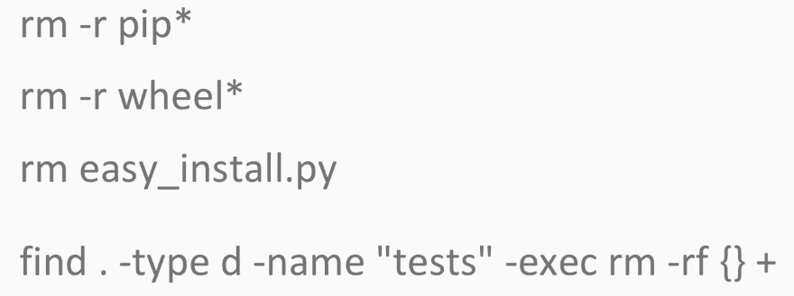
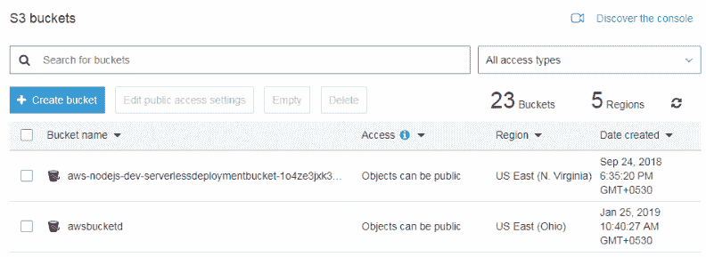
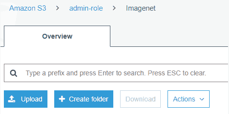
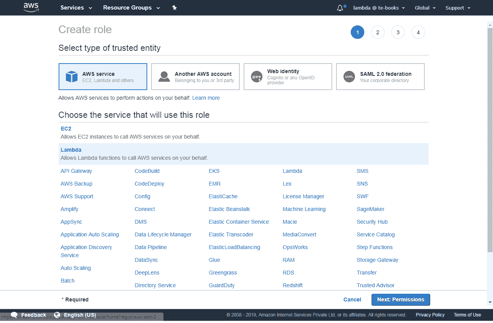
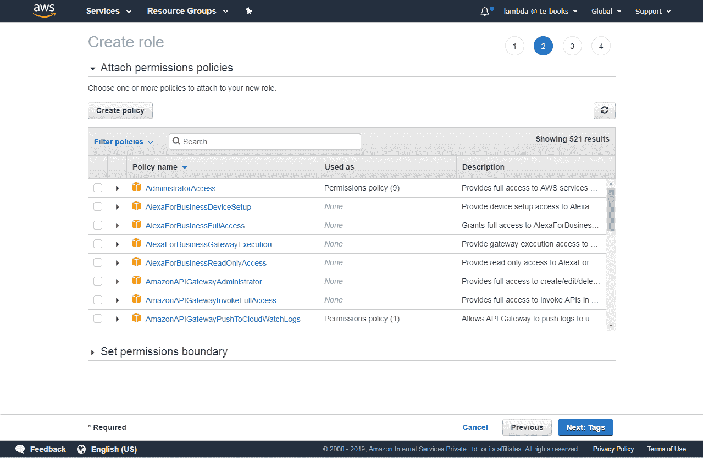
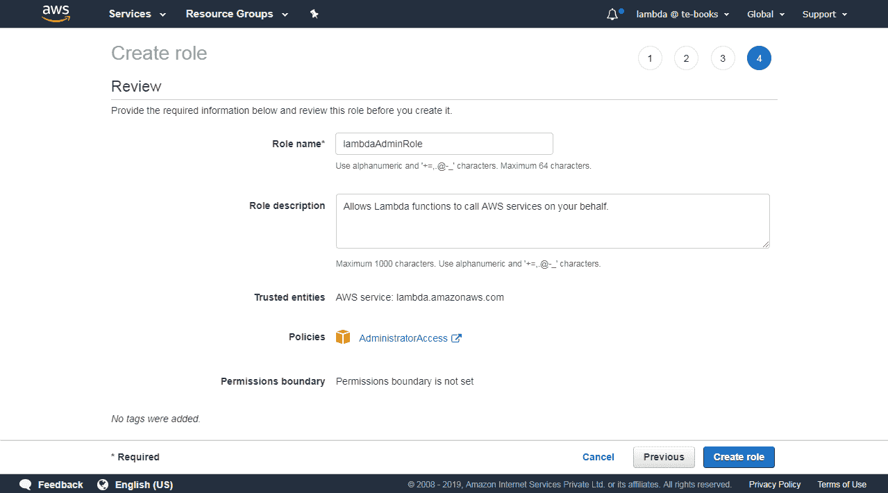
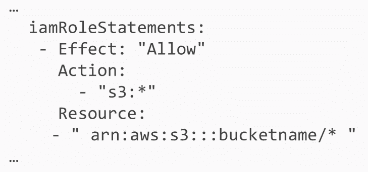

<title>Working with TensorFlow on AWS Lambda</title>  

# 在 AWS Lambda 上使用 TensorFlow

在本章中，我们将了解使用 AWS 部署 TensorFlow 的架构，并且我们将使用预先存在的包和无服务器框架在 AWS Lambda 上部署 TensorFlow。我们还将研究在 AWS Lambda 上部署各种 Python 框架的各种常见问题，然后讨论这些问题的所有解决方案。

我们将讨论以下主题:

*   使用 AWS Lambda 部署 TensorFlow 的架构
*   在 AWS Lambda 上部署 Python 框架的一般问题
*   使用预先存在的包在 AWS Lambda 上部署 TensorFlow
*   使用无服务器框架部署 TensorFlow

<title>Technical Requirements</title>  

# 技术要求

*   AWS 订阅
*   Python 3.6
*   AWS CLI
*   无服务器框架
*   您可以在以下位置找到所有代码:[https://github . com/packt publishing/Hands-On-server less-Deep-Learning-with-tensor flow-and-AWS-Lambda](https://github.com/PacktPublishing/Hands-On-Serverless-Deep-Learning-with-TensorFlow-and-AWS-Lambda)

<title>Architecture of the deploying TensorFlow with AWS Lambda</title>  

# 使用 AWS Lambda 部署 TensorFlow 的架构

在本节中，我们将了解使用 AWS Lambda 部署 TensorFlow 的架构。部署的一个关键问题是关于在哪里保存将在 AWS Lambda 中使用的重新训练的模型。

有以下三种可能的选择:

*   将模型与代码和库一起放在部署包中
*   在执行期间，将模型保存在 S3 存储桶上，并将其卸载到 AWS Lambda 中
*   将模型保存在 FTP 或 HTTP 服务器上，并在执行期间将其卸载到 AWS Lambda 中

<title>Model within the deployment package</title>  

# 部署包中的模型

这个选项意味着模型在部署包中。代码将从本地文件系统导入它。这种选择有其利弊。

<title>Pros</title>  

# 赞成的意见

该模型在部署包中的优势如下:

*   我们的部署将获得非常好的启动速度，因为加载模型上没有开销
*   我们将从一个单一的包开始
*   我们不需要任何外部服务器或 AWS 服务作为我们部署的一部分

<title>Cons</title>  

# 骗局

部署包中模型的缺点如下:

*   在包装尺寸上有相当大的限制，它限制了我们模型的可能尺寸
*   在您需要管理模型的不同版本的情况下，要么将它们都保存在一个包中，要么处理您的包的不同版本，这可能会很棘手

<title>Model on the S3 bucket</title>  

# S3 铲斗模型

这个选项意味着我们必须将模型保存在 S3 桶中，并在 AWS Lambda 执行期间卸载它。就封装尺寸而言，此选项非常有限。

<title>Pros</title>  

# 赞成的意见

该模型在 S3 铲斗上的优势如下:

*   乍一看，它将被限制为只有 500 MB 的使用量，这是 AWS Lambda 上 TMP 文件夹的最大大小，但实际上可以通过这个限制将模型直接下载到内存中
*   管理多个模型会容易得多，因为您可以使用 AWS Lambda 环境变量来为您想要使用的每个模型获取到 S3 铲斗的设备链接

<title>Cons</title>  

# 骗局

S3 铲斗模型的缺点如下:

*   我们将得到一个比以前更慢的开始，因为 Lambda 将需要首先下载模型
*   应该注意的是，虽然它只发生在冷启动期间，但是在热启动期间，该模型将已经在存储器中
*   作为部署的一部分，您需要让 S3 存储桶上传您的所有模型，并在代码中添加管理不同模型的逻辑

<title>Model on the HTTP/FTP server</title>  

# HTTP/FTP 服务器上的模型

该选项主要用于希望限制使用 AWS 服务、内存或与 AWS 之外的服务集成的情况。AWS Lambda 在部署期间从 HTTP 或 FTP 服务器下载模型。

<title>Pros</title>  

# 赞成的意见

该模型在 HTTP/FTP 服务器上的优势如下:

*   您可以对模型使用许多公开可用的服务
*   你不需要在 S3 桶或包内更新你的模型

<title>Cons</title>  

# 骗局

该模型在 HTTP/FTP 服务器上的缺点如下:

*   这可能比前一种情况更慢，这是这种模型的缺点
*   由于时间较慢，您需要确保服务器在您所在的位置可用

<title>General issues with deploying Python frameworks on AWS Lambda</title>  

# 在 AWS Lambda 上部署 Python 框架的一般问题

在本节中，我们将了解 AWS Lambda 主限制，也称为包的大小。Lambda 部署包的当前限制是 50 MB。它应该包括库和代码。我们需要安装两个主要的库:

*   张量流
*   NumPy

这些库用于矩阵计算。正如你可能知道的，库本身是相当大的，它们不能在 AWS Lambda 上工作。正如您在前面关于部署的部分中已经看到的，当我们通过 S3 部署它们时，我们没有这个限制，并且我们对解压缩后的包只有 250 MB 的限制。在这种情况下，为了让它工作，我们需要减小封装的大小。

<title>Solutions for issues with deploying Python frameworks on AWS Lambda</title>  

# 在 AWS Lambda 上部署 Python 框架的问题解决方案

有多种方法可以减小封装尺寸。以下是这些问题的解决方案:

*   我们可以压缩共享库；这通常使我们能够获得最佳的尺寸缩减。
*   我们可以删除`.pyc`文件，因为它们不会影响库的工作。
*   接下来，我们可以从库中删除测试和可视化文件夹，因为它们在生产中没有用。
*   接下来，我们可以删除 AWS Lambda 上已经存在的库。
*   最后，我们可以检查并删除执行过程中不使用的库，例如 wheel 或 PIP 库。

现在，在下面的代码中，有一部分查找并压缩所有共享库。然后，我们找到并删除所有的`.pyc`文件。

以下屏幕截图显示了上述解释的命令:


接下来，我们需要删除执行过程中不会用到的库，比如`.pip`和`wheel`。最后，我们还可以从 TensorFlow 库中删除一些文件夹。

以下屏幕截图显示了上述解释的不同命令:



为 AWS Lambda 准备一个包的整个过程可以通过 Docker 来完成。对于我们将要创建的项目，您不需要使用它，但是最好记住如何准备这种包。

要安装 Docker，您只需在注释行中运行三条注释:

1.  您需要获得最新的 Amazon Linux 映像，我们将在其上运行脚本。
2.  您需要启动一个 Docker 容器，容器内有管理输出文件夹。

3.  您可以在容器中运行脚本，它将为您组装软件包。以下屏幕截图显示了安装 Docker 的所有命令:


<title>Deploying TensorFlow on AWS Lambda using the pre-existing pack</title>  

# 使用预先存在的包在 AWS Lambda 上部署 TensorFlow

在本节中，我们将学习使用预先存在的包在 AWS Lambda 上部署 TensorFlow。在项目文件中，我们有模型文件，也称为模型本身，以及使我们能够通过标签转换模型响应的文件。在`Inception`文件夹和 Lambda 包中，也就是在`lambdapack`文件夹中的代码和库。

要运行代码，我们需要执行以下操作:

*   我们将创建 S3 桶，我们将保持模型和上传模型本身
*   然后，我们将修改特定存储桶的代码，并添加创建的存储桶名称
*   最后，我们可以将其打包并上传以添加 AWS Lambda

现在，我们将使用 AWS 控制台创建 S3 桶，并在那里上传文件。我们将打开代码并添加我们刚刚创建的 bucket。然后，我们来打包上传添加 AWS Lambda。

我们必须遵循给定的步骤:

1.  我们需要转到 S3 服务，然后单击创建存储桶:



2.  现在，我们可以选择存储桶名称:


3.  一旦我们有了存储桶，我们就可以在那里上传文件。你只需要点击上传，然后选择文件。所以，在这里我们只是上传带有库的包，它将启动上传过程，以及包本身。我们需要上传模型文件，这些文件位于`Inception`文件夹中:



4.  您可以看到，现在我们的 S3 桶中有一个包:


5.  现在，我们必须为 AWS Lambda 创建角色，这可以从 IAM 服务中完成:


6.  我们需要选择 Lambda 并点击 Next: Permissions，它位于屏幕的右下角:



7.  为简单起见，选择管理员访问权限并单击位于屏幕右下角的 Next: Tags 会更容易。这将允许我们的 Lambda 访问所有服务。通常在生产中，该角色仅限于访问特定的服务。我们将在使用无服务器框架时讨论这一点:



8.  创建一个角色名:`lambdaAdminRole`，这将在 Lambda 中创建角色:



9.  若要创建 Lambda，请导航到 Lambda 函数并创建该函数。这里输入名称`testensorflolambda`，运行时为 Python 3.6。对于角色，选择选择现有角色，在现有角色中，选择`lambdaAdminRole`，然后点击右下角的创建功能:


10.创建函数后，我们需要将处理程序改为`index.handler`:


11.  在同一屏幕上，向下滚动，在“基本设置”选项卡中，添加足够的资源，如下图所示:


12.  传递带有我们的软件包(S3·布切克特)的 URL 的链接，并点击右上角的保存:


13.  你可以看到函数已经创建好了。要测试该功能，请单击右上角的测试:


14.  测试该函数后，它将成功产生以下结果:


<title>Deploying TensorFlow using a serverless framework</title>  

# 使用无服务器框架部署 TensorFlow

首先，我们将查看项目文件。我们在`Inception`文件夹中有模型文件，在`Lambdapack`文件夹中有带有`Serverless.yml`的 Lambda 代码，配置文件。

部署流程将与上一节相同。一个主要的区别是，我们将通过无服务器 CML 文件提供对 bucket 的访问，而不是提供 AWS Lambda 管理角色。我们唯一需要添加的是`bucketname`，并运行 access 的属性，如下所示:



我们将需要创建一个 S3 桶，上传文件，然后部署 AWS Lambda。我们将创建一个 S3 桶，并从命令行上传文件:`aws s3 sync.s3://<bucket>/`。

<title>Creating a bucket</title>  

# 创建存储桶

我们首先需要创建一个 bucket，然后将模型文件上传到 bucket，运行 serverless，并启动 AWS Lambda。

<title>Index.py</title>  

# 索引. py

让我们看看可用的文件。我们将查看如图所示的`index.py`文件:

```
import boto3
import numpy as np
import tensorflow as tf
import os.path
import re
from urllib.request import urlretrieve
import json
SESSION = None
strBucket = 'serverlessdeeplearning'
def handler(event, context):
 global strBucket
 if not os.path.exists('/tmp/imagenet/'):
 os.makedirs('/tmp/imagenet/')
strFile = '/tmp/imagenet/inputimage.jpg'
```

主要的区别是我们在`handler`函数中运行代码，我们需要从 S3 桶中下载模型文件和图像文件:

```
if not os.path.exists('/tmp/imagenet/'):
 os.makedirs('/tmp/imagenet/')
strFile = '/tmp/imagenet/inputimage.jpg'
downloadFromS3(strBucket,'imagenet/inputimage.jpg',strFile)
global SESSION
 if SESSION is None:
downloadFromS3(strBucket,'imagenet/imagenet_2012_challenge_label_map_proto.pbtxt','/tmp/imagenet/imagenet_2012_challenge_label_map_proto.pbtxt')
downloadFromS3(strBucket,'imagenet/imagenet_synset_to_human_label_map.txt','/tmp/imagenet/imagenet_synset_to_human_label_map.txt')
 image = os.path.join('/tmp/imagenet/', 'inputimage.jpg')
 strResult = run_inference_on_image(image)
return strResult
def run_inference_on_image(image):
```

另外，我们可以利用 AWS Lambda 的一个优点。我们可以将模型文件保存为全局变量。基本上，我们可以将会话定义为一个全局变量。有了这些，如果我们在前一个 Lambda 执行之后立即启动 Lambda，所有的模型文件都将在 RAM 内存中:

```
global SESSION
 if SESSION is None:
 downloadFromS3(strBucket,'imagenet/imagenet_2012_challenge_label_map_proto.pbtxt','/tmp/imagenet/imagenet_2012_challenge_label_map_proto.pbtxt')
 downloadFromS3(strBucket,'imagenet/imagenet_synset_to_human_label_map.txt','/tmp/imagenet/imagenet_synset_to_human_label_map.txt')
 image = os.path.join('/tmp/imagenet/', 'inputimage.jpg')
 strResult = run_inference_on_image(image)
return strResult
def run_inference_on_image(image):
 image_data = tf.gfile.FastGFile(image, 'rb').read()
 global SESSION
 if SESSION is None:
 SESSION = tf.InteractiveSession()
 create_graph()
```

<title>Serverless.yml</title>  

# 无服务器. yml

在`Serverless.yml`文件中，我们需要定义对 S3 桶的访问，因为我们将在那里保存我们的模型。除此之外，它将与前面提到的用于其他 Lambdas 的无服务器 CML 文件完全一样:

```
service: deeplearninglambda
frameworkVersion: ">=1.2.0 <2.0.0"
provider:
  name: aws
  region: us-east-1
  runtime: python3.6
  memorySize: 1536
  timeout: 60
iamRoleStatements:
 - Effect: "Allow"
 Action:
 - "s3:ListBucket"
 Resource:
 - arn:aws:s3:::serverlessdeeplearning
 - Effect: "Allow"
 Action:
 - "s3:GetObject"
 Resource:
 - arn:aws:s3:::serverlessdeeplearning/*
functions:
 main:
 handler: index.handler
```

此外，我们需要`inputimage.jpg`的图像用于初始模型。

让我们来看看需要上传到 S3 木桶的文件:


有两个非常方便的命令:一个允许我们创建一个桶，另一个允许我们轻松地将文件上传到桶中:

*   `aws s3api create-bucket --bucket serverlessdeeplearning`
*   `aws s3 sync . s3://serverlessdeeplearning/imagenet`

因为我们在这个存储桶中已经有了模型文件，所以现在没有必要保存它，但是您可以使用这个命令上传到您的存储桶。接下来，我们可以使用我们的函数返回到该文件夹并运行`serverless deploy`命令。

现在，我们将使用以下命令调用该函数:

```
serverless invoke --function main
```

如你所见，它成功地识别了图像。此外，如果我们在此之后再次调用该函数，它将运行得更快:


<title>Summary</title>  

# 摘要

在本章中，我们学习了使用 AWS Lambda 部署 TensorFlow 的体系结构，其中涵盖了使用 AWS Lambda 部署 TensorFlow 的可能选项及其优缺点。我们还讨论了在 AWS Lambda 中部署 Python 框架的一般问题及其解决方案。最后，我们使用预先存在的包和无服务器框架在 AWS Lambda 上部署 TensorFlow。

在下一章，我们将使用 AWS Lambda 创建深度学习 API。