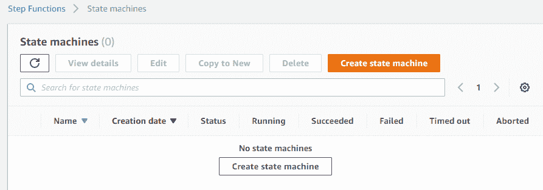
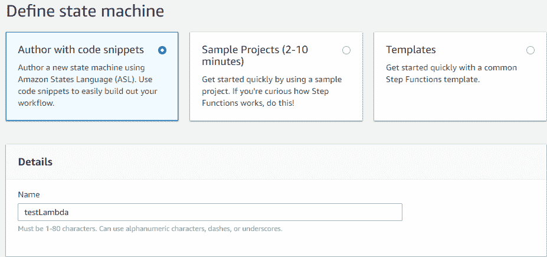
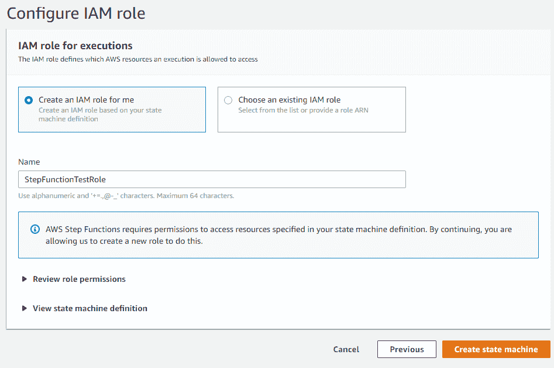
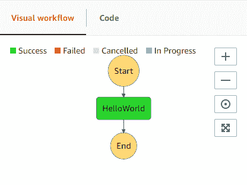
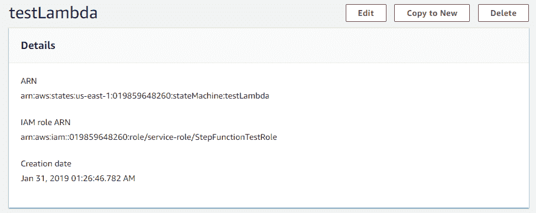
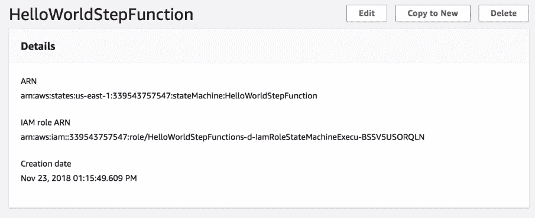
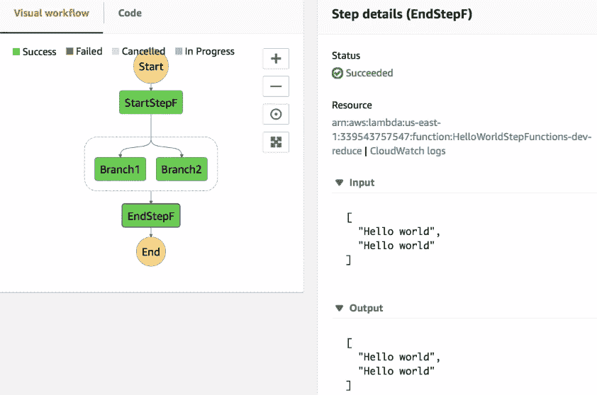
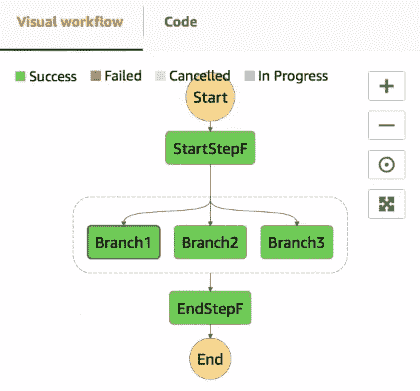
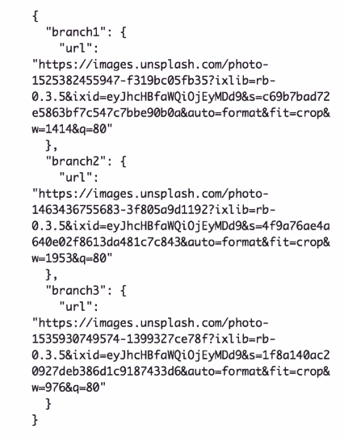

# 七、创建深度学习工作流

在本章中，您将了解 AWS 步骤函数服务，并通过使用 AWS 控制台连接到 AWS Lambda 来创建 AWS 步骤函数。您还将学习使用无服务器框架创建 AWS 步骤函数连接，最后您将查看深度学习工作流的示例项目。

我们将讨论以下主题:

*   AWS 步骤函数服务简介
*   使用 AWS 控制台创建到 AWS Lambda 的 AWS 步骤函数连接
*   使用无服务器框架创建 AWS 步骤函数连接
*   深度学习工作流程


# 技术要求

本章的技术要求如下:

*   AWS 订阅
*   Python 3.6
*   AWS CLI
*   无服务器框架
*   你可以在[https://github . com/packt publishing/Hands-On-server less-Deep-Learning-with-tensor flow-and-AWS-Lambda](https://github.com/PacktPublishing/Hands-On-Serverless-Deep-Learning-with-TensorFlow-and-AWS-Lambda)找到所有代码


# AWS 步骤函数服务简介

在本节中，我们将介绍 AWS Step Functions 服务，包括其功能以及使用该服务的价格。


# 处理工作流程

处理工作流是不同服务之间交互的附加方法。如果你想在深度学习中建立一个多步骤的过程，这可能意味着加载数据，然后预处理数据并在其上运行模型。虽然您可以在这些后端节点之间放置查询，但是很难监控单个任务的处理。这就是工作流非常方便的地方。基本上，工作流服务在需要时负责每个节点的调用，并处理处理作业的中间状态。它允许您对每个任务发生的情况有一个高层次的了解，并跟踪任务失败和超时。最后，它允许您在工作流中非常灵活地使用组件。


# AWS 阶跃函数

AWS 步骤功能是一种 AWS 服务，允许您将工作流作为状态机来管理。它可以连接到任何处理后端，并具有与 AWS Lambda 的本机集成。它有一个现收现付的系统，这使它非常方便。


# AWS 步进功能特性

我们现在来看看阶跃函数的具体特性:

*   Step 函数具有极强的可扩展性，您不必管理扫描和工作流程。
*   Step 函数有一个很棒的可视化 UI，可以轻松监控处理作业。
*   状态管理允许您添加复杂的逻辑，例如根据前面节点的结果选择下一个节点，它还允许并行运行几个节点。
*   一些函数具有方便的重试任务的逻辑，这使您能够确保处理。
*   内置的错误处理允许您处理案例。例如，当您遇到一些异常，并且您需要一种方法来添加错误处理的逻辑，例如在数据库中将任务标记为失败。
*   调度允许您运行延迟的处理任务，这在您必须等待另一个进程完成时非常方便。


# AWS 阶跃函数定价

step 函数的主要优势之一是现收现付系统。很简单每 10000 次请求 25 美分，其中前 4000 次请求每月免费。这使得它非常适合早期项目。


# 阶跃函数与 SQS

如果我们深入探究 step 函数在特性和可能的用例方面与 SQS 有何不同，我们可以说，SQS 最适合于短、简单、低优先级的任务，这些任务的量非常大(每天数百万个任务)。另一方面，Step 函数最适用于我们有复杂的多步骤流程的情况，这可能需要很多时间，并且我们希望保证每个任务的交付(每天数千个任务)。在下一节中，您将学习如何使用 AWS 控制台创建到 AWS Lamda 的 AWS Step Functions 连接。


# 使用 AWS 控制台创建到 AWS Lambda 的 AWS 步骤函数连接

在本节中，我们将使用 AWS 控制台创建 setp 函数。创建阶跃函数有两个主要步骤:

1.  创建 AWS Lambda 实例
2.  创建将使用 Lambda 实例的阶跃函数


# 创建 AWS Lambda 实例

现在，我们将使用 AWS 控制台创建一个 AWS Lambda 实例:

1.  导航到 Lambda 以创建 Lambda 实例。
2.  现在输入名称为`testLambdaStepFunction`，运行时为 Python 3.6，角色为选择一个现有角色**、**，现有角色为`lamdaAdminRole`、**。**然后点击屏幕右下方的**、**创建功能:


3.  Lambda 实例已成功创建:


# 创建阶跃函数

要创建阶跃函数，我们需要执行以下步骤:

1.  转到步骤函数服务，并单击创建状态机:



2.  在定义状态机选项卡中，输入名称`testLambda:`



3.  现在我们需要将`Type`定义为`Task`和`Resource`。对于资源，您将需要使用您的 Lambda 的 ARN 地址，您可以在选项卡的右上角找到它。您可以在状态机定义部分复制并粘贴它，如下面的屏幕截图所示:


4.  我们现在将创建一个 IAM 角色，这是自动完成的。输入名称`StepFunctionTestRole`并点击创建功能**。**这需要一分钟时间，您的状态机才能正确执行:



5.  现在，一旦我们创建了 step 函数，我们就可以测试并发送一个简单的消息。为此，单击开始执行:


6.  我们可以在这里看到执行图表:



7.  对于每次执行，您可以看到整个步骤函数的输入和输出:


8.  我们可以看到每个节点的输入和输出(这可以在 Step details 选项卡中看到)。如果有错误，我们将能够在异常选项卡中看到它。此外，如果向下滚动，还可以看到执行的时间线:


9.  我们还可以通过单击步骤详细信息选项卡下的资源选项卡中的链接来检查日志。这将引导您进入以下页面:


所以我们可以看到，step 函数是一个非常方便的管理 Lambda 执行的服务。


# 使用无服务器框架为 AWS Lambda 实例创建 AWS 步骤函数

在本节中，我们将使用无服务器框架创建阶跃函数。首先，让我们看看我们的项目文件:一个 Python 文件和无服务器配置文件。在配置文件中，我们将添加一些插件并描述步骤功能，这是一件复杂的事情。

因此，让我们从实际代码开始研究无服务器配置文件中的步骤功能:

1.  部署无服务器框架。
2.  使用 CLI 检查无服务器框架的部署状态。
3.  现在，使用 AWS 控制台检查阶跃函数结果。


# 阶跃函数

让我们通过执行`ls`命令来检查文件列表。如您所见，我们有`index.py`文件和`serverless.yml`配置文件服务文档。我们还为无服务器框架安装了插件。

让我们在这里看一下配置文件及其两个主要部分:

1.  首先，我们将添加几个函数，它们将用于阶跃函数的不同状态:

```
function:
    branch:
        handler: index.handlerBranch
    map:
        handler: index.handlerMap
    reduce:
        handler: index.handlerReduce
```

2.  接下来，我们将添加一些插件，这些插件是使用 step 函数所必需的:

```
plugins:    - serverless-step-functions
    - serverless-pseudo-parameters
```

3.  现在让我们来看看`index.py`文件，在这里你可以看到到目前为止讨论过的所有部分:

```
def handlerMap(event,context):
    return event

def handlerReduce(event,context):
    return event

def handlerBranch(event,context):
    return 'Hello world'
```


# 无服务器部署

现在，让我们通过执行以下命令来部署我们的服务:

```
serverless deploy
```

前面的命令部署了您的服务，如下面的屏幕截图所示:


作为部署的一部分，它将为我们提供 API 网关的 URL，如下面的屏幕截图所示:


现在让我们在命令行中测试 URL:

```
curl https://dns1519ilj.execute-api.us-east-1.amazonaws.com/dev/startFunction
```

您可以在浏览器中查看结果。在下面的截图中，你可以看到我们的步骤功能:



在下面的屏幕截图中，我们可以看到最近一次执行很成功:



您可以检查每个节点的输入和输出。如果有任何错误，您可以在异常部分检查它们。

两个分支都返回 hello world，步骤节点合并结果并将其作为步骤函数的结果返回:



在这里，让我们检查执行的时间表。还可以看到分支几乎同时启动。

在下一节中，我们将查看深度学习工作流项目的一个示例。


# 示例项目–深度学习工作流程

首先，让我们看看下面的项目文件。我们有主要的 Python 文件、服务集成文件，以及一些库和初始模型。在配置文件中，我们将添加一些插件并描述步骤功能，这是一件复杂的事情。

我们的 Python 文件的主要区别是我们将有三个函数。人们将把一系列 URL 链接映射成单独的东西。另一个将在链接上运行一个模型。最后一个将结合结果。部署的结构将类似于上一节中的结构。我们将跳过模型在 S3 的部署，因为我们在前一章中已经讨论过了。


# 创建模型

这里，我们需要部署无服务器框架，然后我们可以使用 CLI 检查 trance:

1.  让我们看看配置文件。您可以看到我们需要定义来访问模型的所有主要部分和角色:

```
provider:
  name: aws
  region: us-east-1
  runtime: python3.6
  memorySize: 1536
  timeout: 30
  iamRoleStatements:
    - Effect: "Allow"
       Action:
         - "s3:ListBucket"
       Resource:
         - arn:aws:s3:::serverlessdeeplearning
    - Effect: "Allow"
       Action:
         - "s3:GetObject"
       Resource:
         - arn:aws:s3:::serverlessdeeplearning/*
```

2.  以下是我们将在阶跃函数的不同状态下使用的函数:

```
functions:
  main:
    handler: index.handler
  map:
    handler: index.map
  reduce:
    handler: index.reduce
```

3.  `map`将允许将输入事件映射到不同的 Lambdas，range 将允许并行地分别处理每个链接，而`reduce`将帮助将它们组合成一个响应。我们有状态机的定义，它与前面讨论的非常相似:

```
stepFunctions:
  stateMachines:
    DeepLearningWorkflow:
      events:
        - http:
            path: gofunction
            method: POST
      name: DeepLearningWorkflow
      definition:
        StartAt: StartStepF
        States:
          StartStepF:
            Type: Task
            Resource: arn:aws:lambda:#{AWS::Region}:#{AWS::AccountId}:function:${self:service}-${opt:stage}-map
            Next: Parallel
          Parallel:
            Type: Parallel
            Next: EndStepF
            Branches:
              - StartAt: Branch1
                States:
                  Branch1:
                    Type: Task
                    Resource: arn:aws:lambda:#{AWS::Region}:#{AWS::AccountId}:function:${self:service}-${opt:stage}-main
                    InputPath: '$.branch1.url'
                    ResultPath: '$.res'
                    End: True
              - StartAt: Branch2
                States:
                  Branch2:
                    Type: Task
                    Resource: arn:aws:lambda:#{AWS::Region}:#{AWS::AccountId}:function:${self:service}-${opt:stage}-main
                    InputPath: '$.branch2.url'
                    ResultPath: '$.res'
                    End: True
              - StartAt: Branch3
                States:
                  Branch3:
                    Type: Task
                    Resource: arn:aws:lambda:#{AWS::Region}:#{AWS::AccountId}:function:${self:service}-${opt:stage}-main
                    InputPath: '$.branch3.url'
                    ResultPath: '$.res'
                    End: True
          EndStepF:
            Type: Task
            Resource: arn:aws:lambda:#{AWS::Region}:#{AWS::AccountId}:function:${self:service}-${opt:stage}-reduce
            End: true
```

4.  在这里，我们有插件，它需要工作的功能:

```
plugins:
  - serverless-step-functions
  - serverless-pseudo-parameters
```

5.  我们的索引文件与上一节的主要区别在于我们添加了 MapReduce 逻辑。这将允许分别处理每个 URL:

```
def map(event, context):
    dictMap = {}
    dictMap['branch1'] = {'url':event[0]}
    dictMap['branch2'] = {'url':event[1]}
    dictMap['branch3'] = {'url':event[2]}
    return dictMap

def reduce(event, context):
    vecRes = []
    for res in event:
        vecRes.append(res['res'])
    return vecRes
```

在这种情况下，我们将有三个 URL，狗、熊猫和小熊猫图片来自免费图片网站。

6.  现在我们已经准备好了模型，让我们使用以下命令部署服务:

```
serverless deploy
```

7.  您将获得要测试的 API 的 URL。

8.  让我们测试一下这个 URL。我们将需要使用`curl`命令，这与之前的用法略有不同。
9.  首先，我们将使用`POST`请求而不是`GET`请求，我们将提供一个链接列表作为两个请求。如您所见，它成功返回。该执行表明它成功地将命令发送给了步骤函数:


10.  现在让我们看看浏览器中的图表。我们可以看到它已经完成了执行:



11.  我们可以看到，每个分支都收到了一个单独的 URL，我们可以看到，最终的注释将来自不同分支的结果合并为一个结果，并且它成功地识别了这些图像:



此外，我们可以检查执行的时间线，看到几乎所有的分支都是同时开始的。

这意味着并行化确实使我们能够更快地处理链接列表。


# 摘要

在本章中，我们学习了 AWS 步骤功能服务，包括其功能和定价。我们还学习了如何使用 AWS 控制台将 AWS Step 函数连接到 AWS Lambda。我们还看到了如何使用无服务器框架创建 step 函数，甚至创建了深度学习工作流。