# TensorFlow 入门

近年来，大型公共数据集、廉价 GPU 和开放思想的开发人员文化的激增彻底改变了机器学习的努力。训练数据是机器学习的生命线，近年来已经变得广泛可用且易于消费。计算能力使得小型企业甚至个人都可以获得所需的马力。对于数据科学家来说，当前的十年令人无比兴奋。

行业中使用的一些顶级平台包括 Caffe、Theano 和 Torch。虽然底层平台得到了积极开发和公开共享，但由于安装困难、配置不明显以及生产解决方案困难，其使用在很大程度上仅限于机器学习从业者。

2015 年末和 2016 年带来了更多的平台——谷歌的 **TensorFlow** ，微软的 **CNTK** ，三星的 **Veles** ，以及其他选项。谷歌的 TensorFlow 是最令人兴奋的，原因有几个。

TensorFlow 是所有平台中安装最简单的一个，将机器学习能力直接带入了业余爱好者和程序员新手的领域。同时，高性能特性，如——multiGPU 支持，使该平台令经验丰富的数据科学家和工业应用兴奋不已。TensorFlow 还提供了一个重新想象的流程和多个用户友好的实用程序，如 **TensorBoard、**来管理机器学习工作。最后，该平台得到了世界上最大的机器学习巨头谷歌的大力支持和社区支持。所有这些都是在考虑令人信服的底层技术优势之前，我们将在后面深入探讨。

在本章中，我们将讨论以下主题:

*   macOS X
*   微软视窗和 Linux，核心软件和所有的依赖
*   启用 Windows 安装的虚拟机设置


# 当前使用

虽然 TensorFlow 上市才两年，但众多社区的努力已经成功移植到现有的机器学习项目上。一些例子包括手写识别、语言翻译、动物分类、医学图像分类和情感分析。机器学习对如此多行业和问题的广泛适用性总是引起人们的兴趣。有了 TensorFlow，这些问题不仅可行，而且容易实现。事实上，我们将在本书的过程中处理和解决前面的每个问题！


# 安装 TensorFlow

TensorFlow 方便地提供了多种安装类型，可在多种操作系统上运行。基本安装是 CPU 专用的，而更高级的安装通过将计算推到显卡上，甚至推到多个显卡上来释放强大的马力。我们建议首先从基本的 CPU 安装开始。更复杂的 GPU 和 CUDA 安装将在[附录](8022db02-d24f-4620-9da7-ae53df279306.xhtml)、*高级安装*中讨论。

即使只有基本的 CPU 安装，TensorFlow 也提供多种选项，如下所示:

*   一个基本的 Python 安装
*   通过 Virtualenv 的独立 Python 安装
*   通过 Docker 实现完全隔离的基于容器的安装

我们推荐通过 Virtualenv 安装 Python，但是我们的示例将使用一个基本的 Python `pip`安装来帮助您关注我们任务的关键，即启动并运行 TensorFlow。同样，更多高级安装类型将在[附录](8022db02-d24f-4620-9da7-ae53df279306.xhtml)、*高级安装*中介绍。

TensorFlow 完全可以在 Linux 和 macOS 上使用 Python 2.7 和 3.5。在 Windows 上，我们只能用 Python 3.5.x 或 3.6.x 的 TensorFlow，在 Windows 上运行一个 **Linux **虚拟机**** ( **VM** )也可以轻松使用。有了 Ubuntu 虚拟机，我们可以在 Python 2.7 中使用 TensorFlow。但是，我们不能在虚拟机中使用有 GPU 支持的 TensorFlow。从 TensorFlow 1.2 开始，TensorFlow 在 macOS 上不提供 GPU 支持。因此，如果您想将 macOS 与支持 GPU 的 TensorFlow 一起使用，您将不得不从源代码进行编译，这超出了本章的范围。否则，您仍然可以使用 TensorFlow 1.0 或 1.1，它们在 macOS 上提供了开箱即用的 GPU 支持。Linux 和 Windows 用户可以在 CPU 和 GPU 支持下使用 TensorFlow。


# Ubuntu 安装

Ubuntu 是使用 Tensorflow 的最佳 Linux 发行版之一。我们强烈建议您使用 Ubuntu 机器，尤其是如果您想使用 GPU 的话。我们将在 Ubuntu 终端上完成大部分工作。我们将通过以下命令开始安装`python-pip`和`python-dev`:

```
sudo apt-get install python-pip python-dev
```

成功的安装将如下所示:


如果发现丢失的软件包，可以通过以下命令更正它们:

```
sudo apt-get update --fix-missing
```

然后，您可以继续安装`python`和`pip`。

我们现在准备安装 TensorFlow。我们将进行纯 CPU 安装，如果您希望进行支持高级 GPU 的安装，我们将在[附录](8022db02-d24f-4620-9da7-ae53df279306.xhtml)、*高级安装*中介绍。

通过以下命令启动 CPU 安装:

```
sudo pip install tensorflow
```

成功的安装将如下所示:

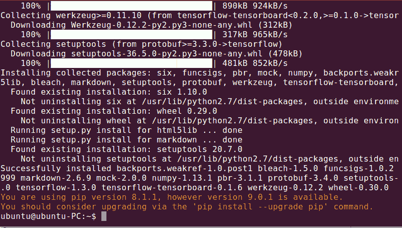

# macOS 安装

如果你使用 Python，你可能已经有了 Python 包安装程序`pip`。但是，如果没有，您可以使用`easy_install pip`命令轻松安装它。您会注意到我们实际上执行了`sudo easy_install pip`——`sudo`前缀是必需的，因为安装需要管理权限。

我们假设您已经有了基本的软件包安装程序`easy_install`；如果没有，可以从[https://pypi.python.org/pypi/setuptools](https://pypi.python.org/pypi/setuptools)安装。将出现一个成功的安装，如下面的屏幕截图所示:

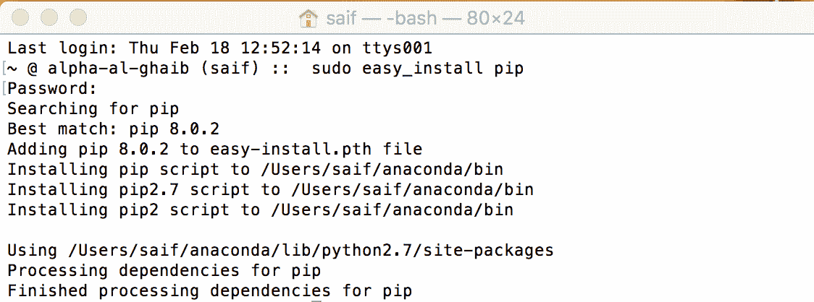

接下来，我们将安装`six`包:

```
sudo easy_install --upgrade six
```

将出现一个成功的安装，如下面的屏幕截图所示:


令人惊讶的是，这是 TensorFlow 仅有的两个先决条件，我们现在可以安装核心平台了。我们将使用前面提到的`pip`包安装程序，直接从 Google 的站点安装 TensorFlow。撰写本书时的最新版本是 1.3 版，但是您应该将其更改为您希望使用的最新版本:

```
sudo pip install tensorflow
```

`pip`安装程序将自动收集所有其他需要的依赖项。您将看到每个单独的下载和安装，直到软件完全安装。

将出现一个成功的安装，如下面的屏幕截图所示:

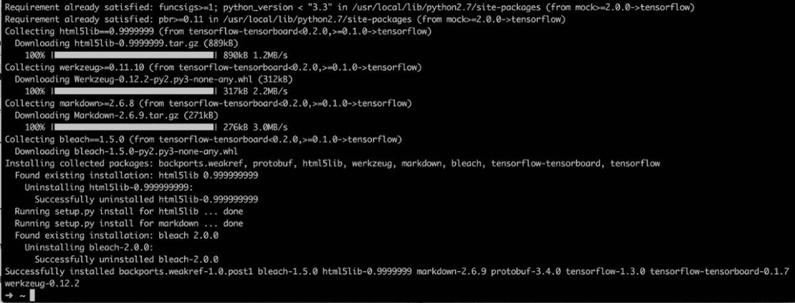

就是这样！如果你能做到这一点，你就可以开始训练和运行你的第一个模型。跳到[第二章](0197f632-3ce2-4032-9abd-83b3720c7127.xhtml)、*你的第一个分类器*，来训练你的第一个模型。

希望完全隔离安装的 macOS X 用户可以使用虚拟机，如 Windows 安装中所述。


# Windows 安装

正如我们前面提到的，Python 2.7 中的 TensorFlow 不能在 Windows 上自然运行。在本节中，我们将指导您在 Python 3.5 中安装 TensorFlow，如果您想在 Python 2.7 中使用 TensorFlow，则在 Linux 中设置一个 VM。

首先，我们需要从以下链接安装 Python 3.5.x 或 3.6.x 64 位:

[https://www.python.org/downloads/release/python-352/](https://www.python.org/downloads/release/python-352/)

[https://www.python.org/downloads/release/python-362/](https://www.python.org/downloads/release/python-362/)

确保下载 64 位版本的 Python，其中安装名称有`amd64`，比如`python-3.6.2-amd64.exe`。Python 3.6.2 安装如下所示:

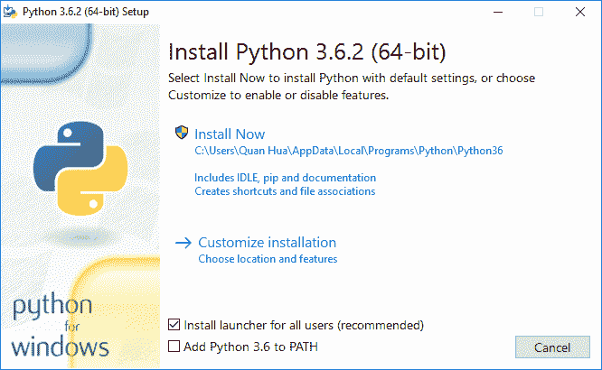

我们将选择将 Python 3.6 添加到路径，然后单击立即安装。安装过程将通过以下屏幕完成:

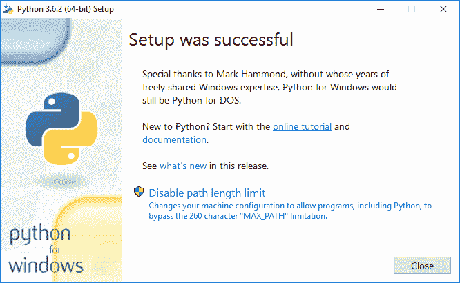

我们将单击禁用路径长度限制，然后单击关闭以完成 Python 安装。现在，让我们在 Windows 菜单下打开 Windows PowerShell 应用程序。我们将使用以下命令安装 Tensorflow 的纯 CPU 版本:

```
pip3 install tensorflow
```

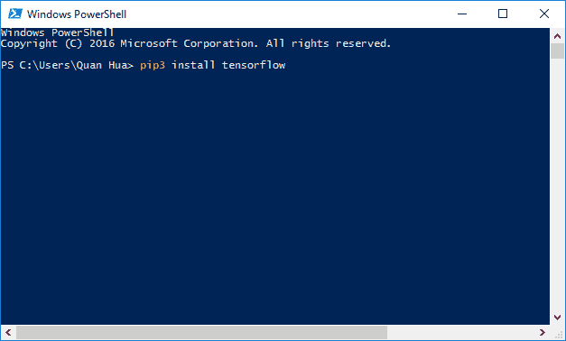

安装的结果将如下所示:

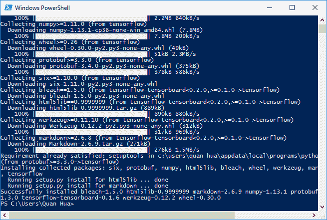

恭喜，您现在可以在支持 Python 3.5.x 或 3.6.x 的 Windows 上使用 TensorFlow 了。在下一节中，我们将向您展示如何设置一个 VM，以便在 Python 2.7 中使用 TensorFlow。然而，如果你不需要 Python 2.7，你可以跳到第二章*的*测试安装*部分，你的第一个分类器*。

现在，我们将向您展示如何在 Linux 上设置一个 VM，以便在 Python 2.7 上使用 TensorFlow。我们推荐在[https://www.virtualbox.org/wiki/Downloads](https://www.virtualbox.org/wiki/Downloads)可获得的免费 VirtualBox 系统。撰写本文时最新的稳定版本是 v5.0.14，可从以下 URL 获得:

[http://download . VirtualBox . org/VirtualBox/5 . 1 . 28/VirtualBox-5 . 1 . 28-117968-win . exe](http://download.virtualbox.org/virtualbox/5.1.28/VirtualBox-5.1.28-117968-Win.exe)

成功的安装将允许您运行 Oracle VM VirtualBox Manager 仪表板，如下所示:

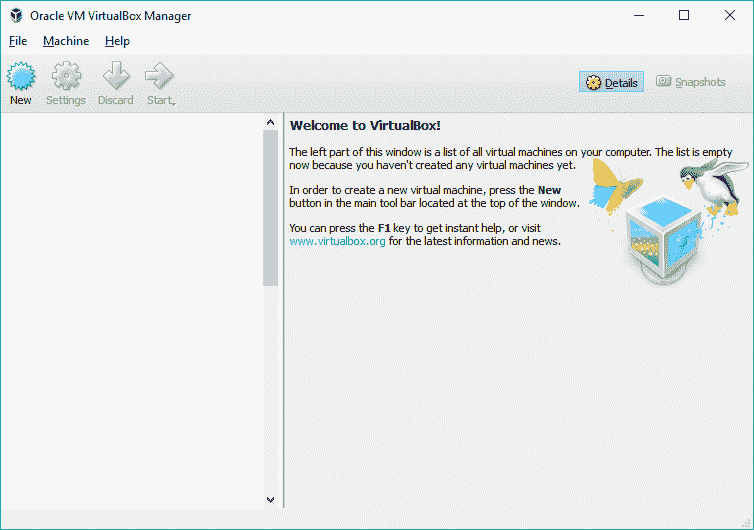

# 虚拟机设置

Linux 有多种风格，但由于 TensorFlow 文档主要提到 Ubuntu，我们将使用 Ubuntu Linux。欢迎您使用任何风格的 Linux，但是您应该意识到不同风格和每种风格的版本之间有细微的差别。大多数差异是良性的，但有些可能会影响 TensorFlow 的安装甚至使用。

即使选择了 Ubuntu，也有很多版本和配置；可以在[http://CD image . Ubuntu . com/Ubuntu-gnome/releases/14.04/release/](http://cdimage.ubuntu.com/ubuntu-gnome/releases/14.04/release/)看到一些。

我们将安装最流行的版本，即 Ubuntu 14.04.4 LTS(确保下载适合您电脑的版本)。标记为 x86 的版本设计为在 32 位机器上运行，而那些标记为 64 位的版本设计为在 64 位机器上运行。大多数现代机器都是 64 位的，所以如果你不确定，就用后者。

安装是通过一个 ISO 文件进行的，它实质上是一个相当于安装 CD 的文件。Ubuntu 14.04.4 LTS 版的 ISO 是`ubuntu-gnome-14.04-desktop-amd64.iso`。

一旦您下载了安装 ISO，我们将设置一个虚拟机，并使用 ISO 文件在虚拟机上安装 Ubuntu Linux。

在 Oracle VM VirtualBox Manager 上设置虚拟机相对简单，但是要特别注意，因为默认选项对于 TensorFlow 是不够的。你会经历下面的七个屏幕，在最后，它会提示你安装文件，这是刚刚下载的。

我们将首先设置操作系统的类型，并配置分配给虚拟机的**随机存取存储器** ( **RAM** ):

1.  请注意，我们选择了 64 位安装，因为这是我们正在使用的映像；如果需要，您可以选择使用 32 位图像:

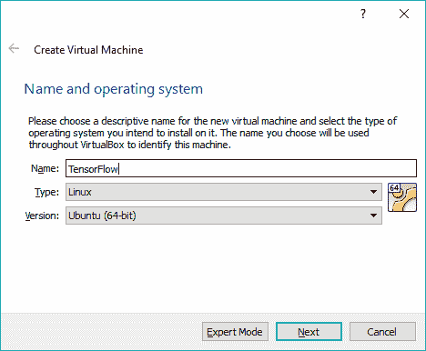

2.  你分配多少内存取决于你的机器有多少内存。在下面的屏幕截图中，我们将把一半的 RAM(8 GB)分配给虚拟机。请记住，这仅在我们运行 VM 时消耗，因此我们可以自由分配。我们至少可以分配 4 GB:
3.  我们的虚拟机将需要一个硬盘。我们将创建一个**虚拟硬盘** ( **VHD** )，如下截图所示: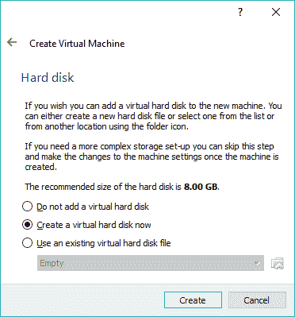
4.  然后，我们将为 VM 选择硬盘类型，即 VDI (VirtualBox 磁盘映像)，如下截图所示:
5.  接下来，我们将选择为 VHD 分配多少空间。理解这一点很重要，因为我们将很快处理非常大的数据集: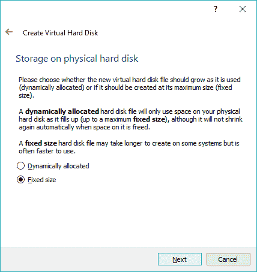
6.  我们将分配 12 GB，因为 TensorFlow 和典型的 TensorFlow 应用程序有一系列依赖项，如`NumPy`、`SciPy`和`Pandas`。我们的练习还将下载大型数据集，用于训练:
7.  设置虚拟机后，它将出现在左侧虚拟机列表中。选择它并点击开始。这相当于启动机器:


8.  当机器第一次启动时，向它提供安装 CD(在我们的例子中，是我们先前下载的 Ubuntu ISO):

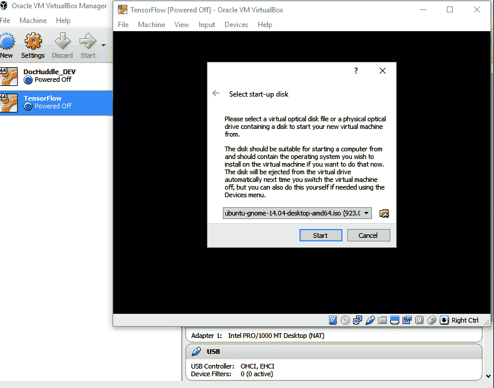

按照安装说明操作，你将拥有一个可以使用的完整的 Ubuntu Linux 安装！之后就可以按照本章开头的 Ubuntu 安装了。


# 测试安装

在本节中，我们将使用 TensorFlow 来计算一个简单的数学运算。首先，在 Linux/macOS 或 Windows 中的 Windows PowerShell 上打开您的终端。

现在，我们需要使用下面的命令运行`python`来使用 TensorFlow:

```
python
```

在 Python shell 中输入以下程序:

```
import tensorflow as tf
a = tf.constant(1.0)
b = tf.constant(2.0)
c = a + b
sess = tf.Session()
print(sess.run(c))
```

结果看起来像下面的屏幕，最后打印出`3.0`:


# 摘要

在本章中，我们介绍了 TensorFlow 在三种主要操作系统上的安装，因此所有读者都应该已经安装并运行了该平台。Windows 用户面临着额外的挑战，因为 Windows 上的 TensorFlow 仅支持 Python 3.5.x 或 Python 3.6.x 64 位版本。然而，即使是 Windows 用户现在也应该已经启动并运行了。恭喜你，好戏开始了！

您现在已经安装了 TensorFlow。紧接着的下一步是用一个样本内置训练工作来测试安装。接下来，我们将从头开始编写我们的第一个分类器—手写识别器。

在接下来的章节中，我们将回顾 TensorFlow 工具并在我们的项目中使用它们。我们还将回顾主要的深度学习概念，在项目环境中使用每个概念。你将有机会尝试多个行业的项目，从金融到医药到语言。